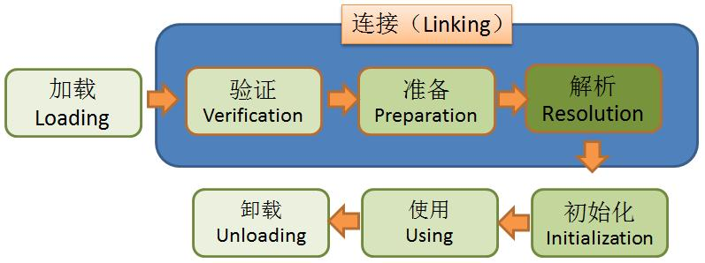
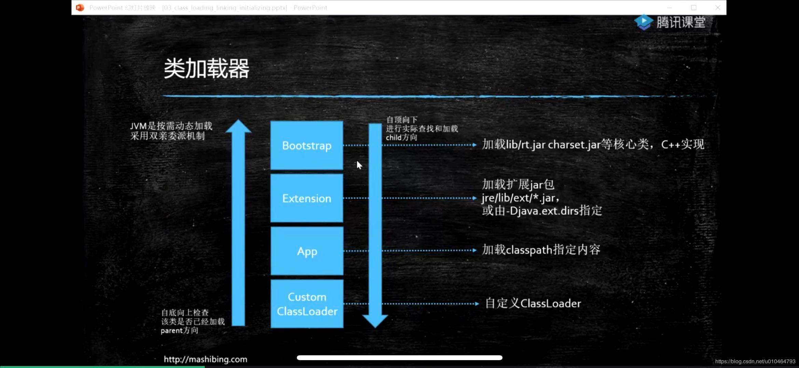
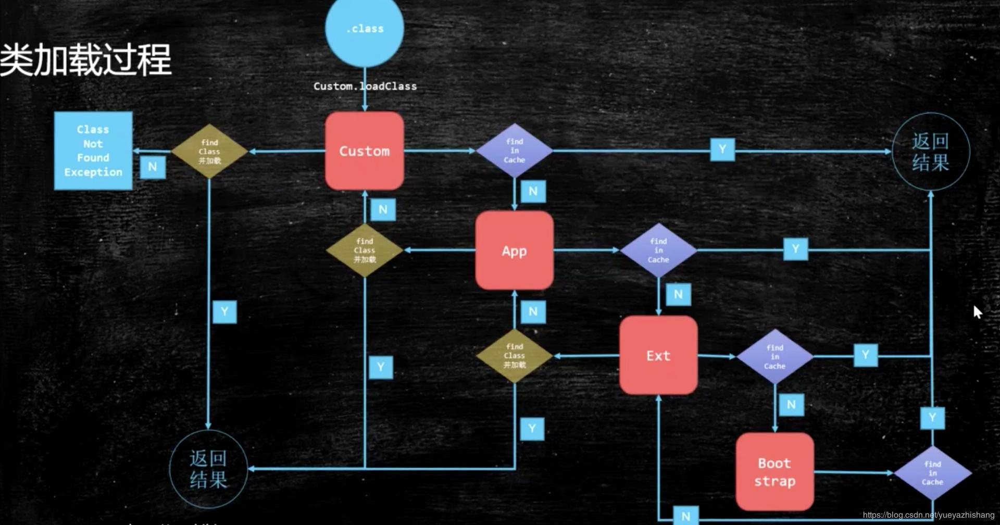

# JVM

## 类加载-初始化

### 加载过程

三大步骤:

* Loading
* Linking
* Initialization

详细介绍:

1. Loading

   1. 双亲委派，主要出于安全来考虑

      加载一个类,先从自定义加载器开始,向parent方向检查是否加载过这个类,如果有,返回,如果没有继续,到了Bootstrap,如果还没有,则向下询问子类,如果加载过了,则返回,否则继续,到了自定义Custom,如果还没有,抛出ClassNotFound异常.

      如果说你自己的加载器,直接重写个String类,那是不是非常不安全,如果双亲委派,他需要去父方向找.而不会加载它自己的,只会加载一次.!

      

      

   2. LazyLoading 五种情况(不重要)

      1. –new getstatic putstatic invokestatic指令，访问final变量除外

         –java.lang.reflect对类进行反射调用时

         –初始化子类的时候，父类首先初始化

         –虚拟机启动时，被执行的主类必须初始化

         –动态语言支持java.lang.invoke.MethodHandle解析的结果为REF_getstatic REF_putstatic REF_invokestatic的方法句柄时，该类必须初始化

   3. ClassLoader的源码重点

      1. findInCache(自底向顶从这里找是否已经加载过) -> parent.loadClass(加载方法) -> findClass(自顶向底用这个方法加载)

   4. 自定义类加载器

      1. extends ClassLoader
      2. overwrite findClass() -> defineClass(byte[] -> Class clazz)
      3. 加密
      4. 第一节课遗留问题：parent是如何指定的，打破双亲委派，学生问题桌面图片
         1. 用super(parent)指定
         2. 双亲委派的打破
            1. 如何打破：重写loadClass（）
            2. 何时打破过？
               1. JDK1.2之前，自定义ClassLoader都必须重写loadClass()
               2. ThreadContextClassLoader可以实现基础类调用实现类代码，通过thread.setContextClassLoader指定
               3. 热启动，热部署
                  1. osgi tomcat 都有自己的模块指定classloader（可以加载同一类库的不同版本）

   5. 混合执行 编译执行 解释执行

      1. 检测热点代码：-XX:CompileThreshold = 10000

2. Linking 

   1. Verification

      1. 验证文件是否符合JVM规定

   2. Preparation

      1. 静态成员变量赋默认值

         > (默认值!不是初始值.例如,int的默认值是0,加载一个类,static int i = 8,在这里,i将被赋值为0,在第三大步才会被赋值为8 )

   3. Resolution

      1. 将类、方法、属性等符号引用解析为直接引用
         常量池中的各种符号引用解析为指针、偏移量等内存地址的直接引用

3. Initializing

   1. 调用类初始化代码，给静态成员变量赋初始值

小总结：

1. load - 默认值 - 初始值
2. new - 申请内存 - 默认值 - 初始值

## JMM java memory model java内存模型

### 1.硬件层数据一致性

协议很多,MESI只是其中一种,intel x86 用MESI

#### MESI协议中的状态

`CPU`中每个缓存行（`caceh line`)使用4种状态进行标记（使用额外的两位(`bit`)表示):

**M: 被修改（Modified)**

该缓存行只被缓存在该`CPU`的缓存中，并且是被修改过的（`dirty`),即与主存中的数据不一致，该缓存行中的内存需要在未来的某个时间点（允许其它`CPU`读取请主存中相应内存之前）写回（`write back`）主存。

当被写回主存之后，该缓存行的状态会变成独享（`exclusive`)状态。

**E: 独享的（Exclusive)**

该缓存行只被缓存在该`CPU`的缓存中，它是未被修改过的（`clean`)，与主存中数据一致。该状态可以在任何时刻当有其它`CPU`读取该内存时变成共享状态（`shared`)。

同样地，当`CPU`修改该缓存行中内容时，该状态可以变成`Modified`状态。

**S: 共享的（Shared)**

该状态意味着该缓存行可能被多个`CPU`缓存，并且各个缓存中的数据与主存数据一致（`clean`)，当有一个`CPU`修改该缓存行中，其它`CPU`中该缓存行可以被作废（变成无效状态（`Invalid`））。

**I: 无效的（Invalid）**

该缓存是无效的（可能有其它`CPU`修改了该缓存行）。

[MESI文章](https://www.cnblogs.com/z00377750/p/9180644.html)

以前CPU直接就是总线锁,现代CPU的数据一致性实现 = 缓存锁(MESI ...) + 总线锁

读取缓存以cache line为基本单位，目前64bytes

位于同一缓存行的两个不同数据，被两个不同CPU锁定，产生互相影响的伪共享问题

伪共享问题：JUC/c_028_FalseSharing

使用缓存行的对齐能够提高效率

### 2.乱序问题

CPU为了提高指令执行效率，会在一条指令执行过程中（比如去内存读数据（慢100倍）），去同时执行另一条指令，前提是，两条指令没有依赖关系

https://www.cnblogs.com/liushaodong/p/4777308.html

写操作也可以进行合并

https://www.cnblogs.com/liushaodong/p/4777308.html

JUC/029_WriteCombining

乱序执行的证明：JVM/jmm/Disorder.java

原始参考：https://preshing.com/20120515/memory-reordering-caught-in-the-act/

### 3.如何保证特定情况下不乱序

硬件内存屏障 X86

>  sfence:  store| 在sfence指令前的写操作当必须在sfence指令后的写操作前完成。
>  lfence：load | 在lfence指令前的读操作当必须在lfence指令后的读操作前完成。
>  mfence：modify/mix | 在mfence指令前的读写操作当必须在mfence指令后的读写操作前完成。

> 原子指令，如x86上的”lock …” 指令是一个Full Barrier，执行时会锁住内存子系统来确保执行顺序，甚至跨多个CPU。Software Locks通常使用了内存屏障或原子指令来实现变量可见性和保持程序顺序

JVM级别如何规范（JSR133）

> LoadLoad屏障：
> 	对于这样的语句Load1; LoadLoad; Load2， 
>
> 	在Load2及后续读取操作要读取的数据被访问前，保证Load1要读取的数据被读取完毕。
>
> StoreStore屏障：
>
> 	对于这样的语句Store1; StoreStore; Store2，
> 	
> 	在Store2及后续写入操作执行前，保证Store1的写入操作对其它处理器可见。
>
> LoadStore屏障：
>
> 	对于这样的语句Load1; LoadStore; Store2，
> 	
> 	在Store2及后续写入操作被刷出前，保证Load1要读取的数据被读取完毕。
>
> StoreLoad屏障：
> 	对于这样的语句Store1; StoreLoad; Load2，
>
> ​	 在Load2及后续所有读取操作执行前，保证Store1的写入对所有处理器可见。

volatile的实现细节

1. 字节码层面
   ACC_VOLATILE

2. JVM层面
   volatile内存区的读写 都加屏障

   > StoreStoreBarrier
   >
   > volatile 写操作
   >
   > StoreLoadBarrier

   > LoadLoadBarrier
   >
   > volatile 读操作
   >
   > LoadStoreBarrier

3. OS和硬件层面
   https://blog.csdn.net/qq_26222859/article/details/52235930
   hsdis - HotSpot Dis Assembler
   windows lock 指令实现 | MESI实现

synchronized实现细节

1. 字节码层面
   ACC_SYNCHRONIZED
   monitorenter monitorexit
2. JVM层面
   C C++ 调用了操作系统提供的同步机制
3. OS和硬件层面
   X86 : lock cmpxchg / xxx
   [https](https://blog.csdn.net/21aspnet/article/details/88571740)[://blog.csdn.net/21aspnet/article/details/](https://blog.csdn.net/21aspnet/article/details/88571740)[88571740](https://blog.csdn.net/21aspnet/article/details/88571740)

