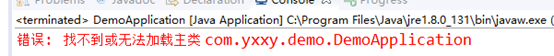
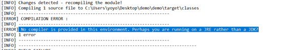
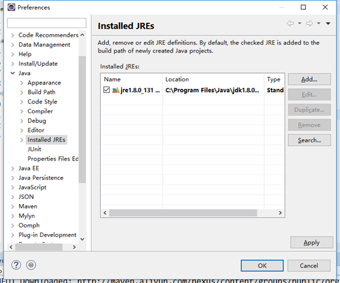

# SpringBoot

## 一.官网

[官网](https://spring.io/),学习先看官网.

## 二.SpringBoot是什么

我觉得他不是个微服务,根据官网描述,他就是个启动器,减少配置,快速启动.

## 三.注解

#### 1.注解的原理:

<font color="red" size="20">**反射**</font>


## 四.配置文件位置优先级及细节&常见问题

### 递减优先级

1. file:./config/
2. file:./
3. classpath:/config/ (推荐写这里或者下面那里,如果比较多,就在resource中创建个config文件夹)
4. classpath:/    (我们的默认项目,就是这一级别.resource中)

### 细节

1. 可以注入属性
2. 使用表达式
3. JSR303数据校验
4. 多环境配置

### 应用

#### springboot配置文件详解

 在之前的项目开发中，我们可以使用xml,properties进行相关的配置，这种配置方式比较简单，但是在应对复杂的商业需求下，多环境和编程化的配置无法得到满足，因此springboot为我们提供了YAML的配置方式丰富功能和简化开发。

#### 1.Properties配置详解

##### 常见配置

1. **修改tomcat端口**

```shell
server.port=90
```

2. **修改项目根路径**

```shell
server.servlet.context-path=/demo 
```

3. **通常情况下，我们可以使用properties文件进行相关的配置。**

 （1）在resources目录下创建application.properties

```properties
person.name=zhangsan
person.age=12
person.gender=男
person.desc=my name is ${person.name},my age is ${person.age}
```

 （2）创建对应的实体类对象

```java
@Component
public class Person {
    @Value("${person.name}")
    private String name;
    @Value("${person.age}")
    private int age;
    private String sex;
    @Value("${person.desc}")
    private String desc;

    public Person() {
    }

    public Person(String name, int age, String sex) {
        this.name = name;
        this.age = age;
        this.sex = sex;
    }

    @Override
    public String toString() {
        return "Person{" +
                "name='" + name + '\'' +
                ", age=" + age +
                ", sex='" + sex + '\'' +
                ", desc='" + desc + '\'' +
                '}';
    }
}
```

 （3）创建对应的测试类

```java
@SpringBootTest
class ConfigApplicationTests {

    @Autowired
    Person person;
    @Test
    void contextLoads() {
        System.out.println(person);
    }

}
```

4. 可以在properties文件中使用随机数

 （1）在application.properties文件中添加如下属性

```properties
my.secret=${random.value}
my.number=${random.int}
my.bignumber=${random.long}
my.uuid=${random.uuid}
my.number.less.than.ten=${random.int(10)}
my.number.in.range=${random.int[1024,65536]}
```

 （2）创建对应的实体类

```java
@Component
public class My {
    @Value("${my.secret}")
    private String screct;
    @Value("${my.number}")
    private int number;
    @Value("${my.bignumber}")
    private long bignumber;
    @Value("${my.uuid}")
    private UUID uuid;
    @Value("${my.number.less.than.ten}")
    private int lessThanTen;
    @Value("${my.number.in.range}")
    private int numberInRangel;

    @Override
    public String toString() {
        return "My{" +
                "screct=" + screct +
                ", number=" + number +
                ", bignumber=" + bignumber +
                ", uuid=" + uuid +
                ", lessThanTen=" + lessThanTen +
                ", numberInRangel=" + numberInRangel +
                '}';
    }
}
```

 （3）创建对应的测试类

```java
@SpringBootTest
class ConfigApplicationTests {

    @Autowired
    My my;
    @Test
    void contextLoads() {
        System.out.println(my);
    }
}
```

 多环境配置

 在实际开发中，我们的一套代码可能会被同时部署到开发、测试、生产等多个服务器中，每个环境中诸如数据库密码等这些个性化配置是避免不了的，虽然我们可以通过自动化运维部署的方式使用外部参数在服务启动时临时替换属性值，但这也意味着运维成本增高。

 1、在resources目录下创建多个配置文件

 application-dev.properties

 application-test.properties

 application-prod.properties

 application.properties

```properties
spring.profiles.active=dev/test/prod
```

5. 配置Mybatis

```properties
spring.datasource.url=jdbc:mysql://localhost:3306/ssm?characterEncoding=utf8&useSSL=false&serverTimezone=UTC
##数据库用户名
spring.datasource.username=root
##数据库密码
spring.datasource.password=840416

# 用来实例化mapper接口
mybatis.type-aliases-package=com.mashibing.springboot.mapper
# 对应的sql映射
mybatis.mapper-locations=classpath:mybatis/mapper/*.xml
```


#### 2.YAML

 YAML是“YAML Ain't Markup Language YAML不是一种标记语言”的外语缩写，但为了强调这种语言以数据做为中心，而不是以置标语言为重点，而用返璞词重新命名。它是一种直观的能够被电脑识别的数据序列化格式，是一个可读性高并且容易被人类阅读，容易和脚本语言交互，用来表达资料序列的编程语言。它是类似于标准通用标记语言的子集XML的数据描述语言，语法比XML简单很多。

```tex
基本原则：
1、大小写敏感 
2、使用缩进表示层级关系 
3、禁止使用tab缩进，只能使用空格键 
4、缩进长度没有限制，只要元素对齐就表示这些元素属于一个层级。 
5、使用#表示注释 
6、字符串可以不用引号标注
```

（1）使用yaml完成多环境配置:application.yaml

```yaml
spring:
  profiles:
    active: test
---
spring:
  profiles: dev
server:
  port: 8080
---
spring:
  profiles: test
server:
  port: 8081
```

（2）使用yaml进行相关参数的设置

```yaml
person:
  name: zhangsan
  age: 12
  sex: 男
  desc: my name is ${person.name},my age is ${person.age}
```

对应的实体类对象

```java
@Component
@ConfigurationProperties(prefix = "person")
public class Person {
//    @Value("${person.name}")
    private String name;
//    @Value("${person.age}")
    private int age;
    private String sex;
//    @Value("${person.desc}")
    private String desc;

    public Person() {
    }

    public Person(String name, int age, String sex) {
        this.name = name;
        this.age = age;
        this.sex = sex;
    }

    @Override
    public String toString() {
        return "Person{" +
                "name='" + name + '\'' +
                ", age=" + age +
                ", sex='" + sex + '\'' +
                ", desc='" + desc + '\'' +
                '}';
    }
}
```

#### 3.pom.xml

```xml
<?xml version="1.0" encoding="UTF-8"?>
<project xmlns="http://maven.apache.org/POM/4.0.0" xmlns:xsi="http://www.w3.org/2001/XMLSchema-instance"
         xsi:schemaLocation="http://maven.apache.org/POM/4.0.0 https://maven.apache.org/xsd/maven-4.0.0.xsd">
    <modelVersion>4.0.0</modelVersion>
<!--    父工程,没有就是springboot的-->
    <parent>
        <groupId>org.springframework.boot</groupId>
        <artifactId>spring-boot-starter-parent</artifactId>
        <version>2.4.3</version>
        <relativePath/> <!-- lookup parent from repository -->
    </parent>
<!--    包的一些信息-->
    <groupId>com.fengshouli</groupId>
    <artifactId>study</artifactId>
    <version>0.0.1-SNAPSHOT</version>
    <name>study</name>
    <description>Demo project for Spring Boot</description>
<!--   jdk版本控制 -->
    <properties>
        <java.version>1.8</java.version>
    </properties>
<!--    依赖-->
    <dependencies>
        <dependency>
            <groupId>org.springframework.boot</groupId>
            <artifactId>spring-boot-starter-web</artifactId>
        </dependency>
        <dependency>
            <groupId>org.projectlombok</groupId>
            <artifactId>lombok</artifactId>
            <optional>true</optional>
        </dependency>
        <dependency>
            <groupId>org.springframework.boot</groupId>
            <artifactId>spring-boot-starter-test</artifactId>
            <scope>test</scope>
        </dependency>
<!--        验证 -->
        <dependency>
            <groupId>org.springframework.boot</groupId>
            <artifactId>spring-boot-starter-validation</artifactId>
        </dependency>
        <!--thymeleaf模板-->
        <dependency>
            <groupId>org.thymeleaf</groupId>
            <artifactId>thymeleaf-spring5</artifactId>
        </dependency>
        <dependency>
            <groupId>org.mybatis.spring.boot</groupId>
            <artifactId>mybatis-spring-boot-starter</artifactId>
            <version>2.1.4</version>
        </dependency>
        <dependency>
            <groupId>org.springframework.boot</groupId>
            <artifactId>spring-boot-starter-data-redis</artifactId>
        </dependency>
    </dependencies>

    <build>
        <plugins>
            <plugin>
                <groupId>org.springframework.boot</groupId>
                <artifactId>spring-boot-maven-plugin</artifactId>
                <configuration>
<!--                    多个main方法找不到主类的时候,配置一个-->
                    <mainClass>com.fengshouli.StudyApplication</mainClass>
                </configuration>
            </plugin>
        </plugins>
    </build>

</project>

```


#### 4.@ConfigurationProperties 与 @Value 对比

| 功能       | @ConfigurationProperties | @Value |
| ---------- | ------------------------ | ------ |
| 松散绑定   | 是                       | 否     |
| 元数据支持 | 是                       | 否     |
| spEL表达式 | 否                       | 是     |

### 常见问题

1. Pom.xml文件中,Springboot项目必须要继承的parent

1. ```xml
   <!--    父工程,没有就是springboot的-->
   <!--    注意,如果这个报错,会导致依赖中的jar也不会下载,必须先解决这个报错的问题-->
       <parent>
           <groupId>org.springframework.boot</groupId>
           <artifactId>spring-boot-starter-parent</artifactId>
           <version>2.4.3</version>
           <relativePath/> <!-- lookup parent from repository -->
       </parent>
   ```

2. 缺包或者jar下不下来,

   1. 可能是由于下载失败导致的,删除掉jar,重新下载

3. 找不到主类

   

   所有错误都解决后

   Jar方式运行 首先得有这个jar包

   先clean package 生成jar文件，然后再run main方法

4. 找不到jdk

   

   把jre的路径换成jdk的

   

## 五.SpringBoot开发

 springboot在开发web项目的时候具备天然的优势，现在的很多企业级开发都是依托于springboot的。

 使用springboot的步骤：

1. 创建一个SpringBoot应用，选择我们需要的模块，SpringBoot就会默认将我们的需要的模块自动配置好  
2. 手动在配置文件中配置部分配置项目就可以运行起来了  
3. 专注编写业务代码，不需要考虑以前那样一大堆的配置了。

### 1.整合servlet

#### （1）编写servlet类

```java
//以前需要在xml中配置很多,现在只用这个注解,//当访问/srv时候,会执行这个servlet
//或者是在Application中配置@Bean
@WebServlet(name = "myServlet",urlPatterns = "/srv")
public class MyServlet extends HttpServlet {
    @Override
    protected void doGet(HttpServletRequest req, HttpServletResponse resp) throws ServletException, IOException {
        System.out.println("111");
        super.doGet(req, resp);
    }
}
```

#### （2）在启动类上添加如下配置

```java

@SpringBootApplication
//这个注解会扫描servlet
@ServletComponentScan
public class StudyApplication {

    public static void main(String[] args) {
        SpringApplication.run(StudyApplication.class, args);
    }

    //将servlet添加到SpringBoot容器中,当配置了urlmappings之后,servlet自己的配置就不会生效了
    //在servlet上添加注解或者启动如下方式，如果在这里配置在,则servlet上不需要添加注解
    @Bean
    public ServletRegistrationBean<MyServlet> getServletRegistrationBean(){
        ServletRegistrationBean<MyServlet> bean = new ServletRegistrationBean<>(new MyServlet(),"/s2");
        ArrayList<String> url = new ArrayList<>();
        url.add("/srv");
        bean.setUrlMappings(url);
        bean.setLoadOnStartup(1);
        return bean;
    }
    
}

```

#### （3）编写filter类

```java

//可以配置成/*,就是拦截任何请求
@WebFilter(filterName = "MyFilter", urlPatterns = "/filter")
public class MyFilter implements Filter {
    @Override
    public void init(FilterConfig filterConfig) throws ServletException {
        System.out.println("init");
    }

    @Override
    public void doFilter(ServletRequest request, ServletResponse response, FilterChain chain) throws IOException, ServletException {
        System.out.println("filter");
        chain.doFilter(request,response);
    }

    @Override
    public void destroy() {
        System.out.println("destory");
    }
}

```

#### （4）编写监听器 

​		listener是servlet规范定义的一种特殊类，用于监听servletContext,HttpSession和ServletRequest等域对象的创建和销毁事件。监听域对象的属性发生修改的事件，用于在事件发生前、发生后做一些必要的处理。

可用于以下方面：

1. 统计在线人数和在线用户系统
2. 启动时加载初始化信息
3. 统计网站访问量
4. 记录用户访问路径。

编写监听器:

```java
package com.fengshouli.listener;

import javax.servlet.http.HttpSessionEvent;
import javax.servlet.http.HttpSessionListener;

public class MyHttpSessionListener implements HttpSessionListener {

    public static int online=0;

    @Override
    public void sessionCreated(HttpSessionEvent se) {
        System.out.println("创建session");
        online++;
    }

    @Override
    public void sessionDestroyed(HttpSessionEvent se) {
        System.out.println("销毁session");
    }
}
```

添加在Application配置类

```java
public class StudyApplication {

    public static void main(String[] args) {
        SpringApplication.run(StudyApplication.class, args);
    }

    @Bean
    public ServletListenerRegistrationBean listenerRegist(){
        ServletListenerRegistrationBean srb = new ServletListenerRegistrationBean();
        srb.setListener(new MyHttpSessionListener());
        System.out.println("listener");
        return srb;
    }
    
}
```

添加控制层

先访问online,在login,在online,即可看到效果.

```java

@Controller
public class ThymeleafController {
  //当访问这个/login时候,触发session创建,监听器处理online+1
    @RequestMapping("/login")
    public String login(HttpServletRequest request){
        HttpSession session = request.getSession(true);
        return "login";
    }

  //访问online并不会触发session响应操作.只可以查询
    @RequestMapping("online")
    @ResponseBody
    public String online(){
        return "当前在线人数："+ MyHttpSessionListener.online +"人";
    }
}
```

### 2.静态资源的配置

### 3.springmvc的扩展

## 六.Thymeleaf

### 1、thymeleaf的介绍

官网地址：https://www.thymeleaf.org/

thymeleaf在github的地址：https://github.com/thymeleaf/thymeleaf

中文网站：https://raledong.gitbooks.io/using-thymeleaf/content/

#### 1.导入依赖：

```xml
        <!--thymeleaf模板-->
        <dependency>
            <groupId>org.thymeleaf</groupId>
            <artifactId>thymeleaf-spring5</artifactId>
        </dependency>
        <dependency>
            <groupId>org.thymeleaf.extras</groupId>
            <artifactId>thymeleaf-extras-java8time</artifactId>
        </dependency>
```

在springboot中有专门的thymeleaf配置类：ThymeleafProperties

#### 2.源码:

```java
@ConfigurationProperties(prefix = "spring.thymeleaf")
public class ThymeleafProperties {
	private static final Charset DEFAULT_ENCODING = StandardCharsets.UTF_8;
	public static final String DEFAULT_PREFIX = "classpath:/templates/";
	public static final String DEFAULT_SUFFIX = ".html";
	/**
	 * Whether to check that the template exists before rendering it.
	 */
	private boolean checkTemplate = true;
	/**
	 * Whether to check that the templates location exists.
	 */
	private boolean checkTemplateLocation = true;
	/**
	 * Prefix that gets prepended to view names when building a URL.
	 */
	private String prefix = DEFAULT_PREFIX;
	/**
	 * Suffix that gets appended to view names when building a URL.
	 */
	private String suffix = DEFAULT_SUFFIX;
	/**
	 * Template mode to be applied to templates. See also Thymeleaf's TemplateMode enum.
	 */
	private String mode = "HTML";
	/**
	 * Template files encoding.
	 */
	private Charset encoding = DEFAULT_ENCODING;
	/**
	 * Whether to enable template caching.
	 */
	private boolean cache = true;
```

### 2、thymeleaf使用模板

在controller的java代码中写入如下代码：

```java
    @RequestMapping("/helloThymeleaf")
    public String hello(Model model){
        model.addAttribute("msg","Hello,ttttthymeleaf");
        //classpath:/templates/hello.html
        return "hello";
    }
```

html页面中写入如下代码：

```html
<!DOCTYPE html>
<html lang="en" xmlns:th="http://www.thymeleaf.org">
<body>
<h1>Hello</h1>
<div th:text="${msg}"></div>
</body>
</html>
```

### 3、标准表达式语法

#### 1.语法

学习Thymeleaf标准方言的最重要的部分之一：Thymeleaf标准表达式语法(Thymeleaf Standard Expression syntax)。

我们已经见过了两种用这种语法表达的合理的属性值：消息和变量表达式：

```xml
<p th:utext="#{home.welcome}">Welcome to our grocery store!</p>

<p>Today is: <span th:text="${today}">13 february 2011</span></p>
```

但是表达式的种类远不止这些，而且关于我们已知的这两种还有一些更有趣的细节需要了解。首先，让我们快速的看一下标准表达式的功能。

- 简单表达式 Simple Expressions:
  - 变量表达式 Variable Expressions： `${...}`
  - 选中变量表达式 Selection Variable Expressions: `*{...}`
  - 消息表达式 Message Expressions: `#{...}`
  - 连接URL表达式 Link URL Expressions: `@{...}`
  - 片段表达式 Fragment Expressions: `~{...}`
- 常量 Literals
  - 文本常量 Text literals: `'one text'`, `'Another one!'`,…
  - 数字常量 Number literals: `0`, `34`, `3.0`, `12.3`,…
  - 布尔常量 Boolean literals: `true`, `false`
  - 空常量 Null literal: `null`
  - 常符号 Literal tokens: `one`, `sometext`, `main`,…
- 文本操作 Text operations:
  - 字符串连接 String concatenation: `+`
  
  - 常量替换 Literal substitutions: `|The name is ${name}|`
  
  - ```xml
    <!--空格属于特殊字符，必须使用单引号包含整个字符串-->
    <p class="css1 css2" th:class="'css1 css2'">样式</p>
     
    <!--下面如果没用单引号 th:text="Big China"，则页面直接报错-->
    <p th:text="'Big China'">中国</p>
     
    <!--后台使用：model.addAttribute("info", "Love you 中国"); 传值有空格也是没有问题的-->
    <p th:text="${userName}">userName</p>
     
    <!--后台传值字符串有空格是可以的，可以使用 + 进行字符串连接-->
    <p th:text="'small smile'+',very good.' + ${userName}">浅浅的微笑</p>
    ```
  
    
- 算数操作 Arithmetic operations:
  - Binary operators: `+`, `-`, `*`, `/`, `%`
  
  - Minus sign (unary operator): `-`
  
  - ```xml
    <p th:text="80">8</p>
    <!--计算结果为 16 在进行替换-->
    <p th:text="8+8">8 + 8</p>
    <!--前面 8+8 计算结果为 16，然后字符串拼接上 Love，后面的 9+9也会被当做字符串拼接-->
    <p th:text="8+8+' Love '+9+9">8 + 8+' Love '+9+9</p>
    <!--前面 8+8 计算结果为 16，后面的 9+9因为有括号,所以也会计算结果，最后拼接 Love 字符串-->
    <p th:text="8+8+' Love '+(9+9)">8 + 8+' Love '+(9+9)</p>
    <!--后台传了一个：model.addAttribute("age", 35);取得结果后在进行计算-->
    <p th:text="100-${age}"></p>
    ```
  
    
- 布尔操作 Boolean operations:
  - 布尔操作符 Binary operators: `and`, `or`
  
  - 布尔否定 一元操作符Boolean negation (unary operator): `!`, `not`
  
  - ```xml
    <p th:text="true">布尔</p>
    <!--true、false 是布尔值，and 是布尔运行符，and(与)，or(或)，not(非)、!(非)-->
    <p th:text="true and false">true and true</p>
     
    <!--后台使用 model.addAttribute("isMarry", true); 传了值-->
    <!--th:if 表达式为 true，则显示标签内容，否则不显示-->
    <p th:if="${isMarry}">已结婚</p>
     
    <!--后台传值：model.addAttribute("age", 35);-->
    <!--比较运算符：&gt;，&lt;，&gt; =，&lt;=（gt，lt，ge，le）-->
    <p th:if="${age}&gt;18">已成年</p>
    <p th:if="${age}&lt;18">未成年</p>
    ```
  
    
- 比较和相等 Comparisons and equality:
  - 比较符 Comparators: `>`, `<`, `>=`, `<=` (`gt`, `lt`, `ge`, `le`)
  
  - 相等符 Equality operators: `==`, `!=` (`eq`, `ne`)
  
  - ```xml
    <p th:if="5>3">5 大于 3</p>
    <p th:if="5 &gt;4">5 大于 4</p>
    <p th:if="10>=8 and 7 !=8">10大于等于8，且 7 不等于 8 </p>
    <p th:if="!${isMarry}">!false</p>
    <p th:if="not(${isMarry})">not(false)</p>
    ```
  
    
- 条件操作符 Conditional operators:
  - If-then: `(if) ? (then)`
  
  - If-then-else: `(if) ? (then) : (else)`
  
  - 默认值 Default: `(value) ?: (defaultvalue)`
  
  - ```xml
    <!--三目运算符-->
    <p th:text="7&gt;5?'7大':'5大'">三元运算符</p>
    <!--后台控制器输出了：model.addAttribute("age", 35);-->
    <!--因为 ${xx}取值时，如果值为null，则默认整个标签不再显示-->
    <p th:text="${age}!=null?${age}:'age等于 null'"></p>
    <!--这里使用嵌套判断，嵌套的部分要使用括号-->
    <p th:text="${age}!=null?(${age}>=18?'成年':'未成年'):'age等于 null'"></p>
    <!--变量 age2 后台并没有输出，所以 age2 不存在，此时 age2 ==null-->
    <p th:text="${age2}!=null?${age2}:'age2等于 null'"></p>
     
    <!--后台输出了：model.addAttribute("isMarry", true);-->
    <!--A>B?X:Y，这里的 Y 部分是省略的，此时如果 A>B 返回 false，则整个三元运算结果为 null-->
    <p th:class="${isMarry}?'css2':'css3'">已婚</p>
    ```
  
    
- 特殊符号 Special tokens:
  
  - 无操作符 No-Operation: `_`

这些功能可以自由的组合和嵌套:

```xml
'User is of type ' + (${user.isAdmin()} ? 'Administrator' : (${user.type} ?: 'Unknown'))
```

#### 2.th标签

* th:utext转义

  ```xml
  map .addAttribute("china", "<b>Chian</b>,USA,UK");
  <p th:text="${china}">默认转义</p>
  <!--th:utext 不会结果进行转义-->
  <p th:utext="${china}">不会转义</p>
  ```

  

* th:attr 设置属性

  <font color="red">HTML5 所有的属性，都可以使用 th:* 的形式进行设置值</font>

  ```xml
  <a href="http://baidu.com" th:attr="title='百度'">百度</a>
  <!--设置 title、href 多个属性-->
  <a href="" th:attr="title='前往百度',href='http://baidu.com'">前往百度</a>
  <!--设置 href 属性-->
  <a href="userList.html" th:attr="href=@{/user/userHome}">用户首页</a>
  <!--设置 id 属性，data-schoolName 属性 Html 本身是没有的，但允许用户自定义 -->
  <a href="#" th:attr="id='9527',data-target='user'">归海一刀</a>
  
  <p th:abc="9527">th:abc="9527"</p>
  
  <!--输出：<p abc123="华安">th:abc123="华安"</p>-->
  <p th:abc123="华安">th:abc123="华安"</p>
  ```

  

* checked selected

  ```xml
  <input type="checkbox" name="option1" checked/><span>是否已婚1？</span>
  <input type="checkbox" name="option2" checked="checked"/><span>是否已婚2？</span>
  ---<br>
  <!--后台控制器传递了一个：model.addAttribute("isMarry", true);-->
  <!--option3、option4 会选中；option5 不会选中-->
  <input type="checkbox" name="option3" th:checked="${isMarry}"/><span>是否已婚3？</span>
  <input type="radio" name="option4" th:checked="${isMarry}"/><span>是否本科？</span>
  <input type="radio" name="option5" th:checked="!${isMarry}"/><span>是否应届生？</span>
  --------------------- 
  <select>
  	<option>a</option>
  	<option th:selected="${isMarry}">已婚</option>
  	<option  th:selected="${!isMarry}">未婚</option>
  
  </select>
  <input type="text" th:autofocus="false">
  <input type="text" th:autofocus="true">
  <input type="text" th:autofocus="false">
  ```

  

#### 3.日期格式化

```xml
<span th:text="${#dates.format(date, 'yyyy-MM-dd HH:mm')}"></span>
```


#### 4.循环

JSTL 有一个 <c:foreach>，同理 Thymeleaf 也有一个 th:each。作用都是一样的，都是用于遍历数组、List、Set、Map 等数据。

* 在select 上循环

  ```xml
      <option th:each="city : ${list}" th:text="${city.name}" th:selected="${cityName} eq ${city.name}">横岗</option>
  ```

  

* 状态变量loopStatus

  ```xml
  如果不指定 为变量+Stat
  index: 当前迭代对象的index（从0开始计算）   
  count:  当前迭代对象的index(从1开始计算)   
  size: 被迭代对象的大小     current:当前迭代变量   
  even/odd: 布尔值，当前循环是否是偶数/奇数（从0开始计算）   
  first: 布尔值，当前循环是否是第一个   
  last: 布尔值，当前循环是否是最后一个
  <tr th:each="city,status : ${list}" th:style="${status.odd}?'background-color:#c2c2c2'">
  		<!-- EL JSTL-->
  		<td th:text = "${status.count}"></td>
  		<td th:text = "${city.id}"></td>
  		<td th:text = "${city.name}"></td>
  </tr>
  ```

  

#### 5.if/else

```xml
<p th:if="${isMarry}">已婚1</p>
<p th:unless="${isMarry}">未婚</p>
```


#### 6. switch/case 多条件判断

```xml
<div th:switch="1">
    <p th:case="0">管理员</p>
    <p th:case="1">操作员</p>
    <p th:case="*">未知用户</p>
</div>
 
<!--数字类型：当没有 case 匹配时，取默认值，当有多个匹配，只取第一个-->
<div th:switch="-1">
    <p th:case="0">管理员</p>
    <p th:case="*">操作员</p>
    <p th:case="*">未知用户</p>
</div>
 
<!--布尔类型，多个case满足时，只取第一个-->
<div th:switch="${isMarry}">
    <p th:case="true">已婚</p>
    <p th:case="true">已成年</p>
    <p th:case="false">未婚</p>
</div>
 
<!--字符串类型-->
<div th:switch="'For China'">
    <p th:case="'For USA'">美国</p>
    <p th:case="'For UK'">英国</p>
    <p th:case="'For China'">中国</p>
    <p th:case="*">未知国籍</p>
</div>
```


#### 7.内联表达式

[[...]] 等价于 th:text（结果将被 HTML 转义），[(...)] 等价于 th:utext（结果不会执⾏HTML转义）

```xml
<p>[[${china}]]</p>
<p>[(${china})]</p>
<p>[[Lo1ve]]</p>
<p>[['I Love You Baby']]</p>
<p>[(9527)]</p>
```

th:inline =“none” 来禁⽤内联。

* 内联JavaScript

  ```xml
  <script type="text/javascript" th:inline="javascript">
       var info = [[${info}]];
          var age = [[${age}]];
          var id = [[${id}]];
          var name = [[${name}]];
          console.log(id, name, age, info);
  </script>
  ```

  

* 前后端分离

  ```xml
  <script type="text/javascript" th:inline="javascript">
          /**
           * Thymeleaf 将自动忽略掉注释之后 和 分号之前的所有内容,如下为 "前端测试"
           */
          var info = /*[[${info}]]*/ "前端测试";
          console.log(info);
  </script>
  ```

  

#### 8.对象属性

* URL

  ```xml
  <p>${param.size()}=[[${param.size()}]]</p>
  <!--/*判断请求参数是否为空*/-->
  <p>${param.isEmpty()}=[[${param.isEmpty()}]]</p>
  <!--获取某个参数值，不存在时为null-->
  <p>${param.u_id}=[[${param.u_id}]]</p>
  ```

  

* Session

  ```xml
  <p>${session.size()}=[[${session.size()}]]</p>
  <!--/*判断请求参数是否为空*/-->
  <p>${session.isEmpty()}=[[${session.isEmpty()}]]</p>
  <!--获取某个参数值，不存在时为null-->
  <p>${session.user.id}=[[${session.user.id}]]</p>
  ```

  

#### 9.完整文档地址

[英文官网文档地址](https://www.thymeleaf.org/doc/tutorials/2.1/usingthymeleaf.html#base-objects)

### 4、thymeleaf实例演示

#### 		1、th的常用属性值

​		一、**th:text** ：设置当前元素的文本内容，相同功能的还有**th:utext**，两者的区别在于前者不会转义html标签，后者会。优先级不高：order=7

​		二、**th:value**：设置当前元素的value值，类似修改指定属性的还有**th:src**，**th:href**。优先级不高：order=6

​		三、**th:each**：遍历循环元素，和th:text或th:value一起使用。注意该属性修饰的标签位置，详细往后看。优先级很高：order=2

​		四、**th:if**：条件判断，类似的还有**th:unless**，**th:switch**，**th:case**。优先级较高：order=3

​		五、**th:insert**：代码块引入，类似的还有**th:replace**，**th:include**，三者的区别较大，若使用不恰当会破坏html结构，常用于公共代码块提取的场景。优先级最高：order=1

​		六、**th:fragment**：定义代码块，方便被th:insert引用。优先级最低：order=8

​		七、**th:object**：声明变量，一般和*{}一起配合使用，达到偷懒的效果。优先级一般：order=4

​		八、**th:attr**：修改任意属性，实际开发中用的较少，因为有丰富的其他th属性帮忙，类似的还有th:attrappend，th:attrprepend。优先级一般：order=5

thymeleaf.html

```html
<!DOCTYPE html>
<html lang="en" xmlns:th="http://www.thymeleaf.org">
<head>
    <meta charset="UTF-8">
    <title>Title</title>
</head>
<body>
    <p th:text="${thText}"></p>
    <p th:utext="${thUText}"></p>
    <input type="text" th:value="${thValue}">
    <div th:each="message:${thEach}">
        <p th:text="${message}"></p>
    </div>
    <div>
        <p th:text="${message}" th:each="message:${thEach}"></p>
    </div>
    <p th:text="${thIf}" th:if="${not #strings.isEmpty(thIf)}"></p>
    <div th:object="${thObject}">
        <p>name:<span th:text="*{name}"/></p>
        <p>age:<span th:text="*{age}"/></p>
        <p>gender:<span th:text="*{gender}"/></p>
    </div>

</body>
</html>
```

ThymeleafController.java

```java
package com.mashibing.controller;

import com.mashibing.entity.Person;
import org.springframework.stereotype.Controller;
import org.springframework.ui.ModelMap;
import org.springframework.web.bind.annotation.RequestMapping;

@Controller
public class ThymeleafController {

    @RequestMapping("thymeleaf")
    public String thymeleaf(ModelMap map){

        map.put("thText","th:text设置文本内容 <b>加粗</b>");
        map.put("thUText","th:utext 设置文本内容 <b>加粗</b>");
        map.put("thValue","thValue 设置当前元素的value值");
        map.put("thEach","Arrays.asList(\"th:each\", \"遍历列表\")");
        map.put("thIf","msg is not null");
        map.put("thObject",new Person("zhangsan",12,"男"));
        return "thymeleaf";
    }
}
```

#### 		2、标准表达式语法

​		**${...} 变量表达式，Variable Expressions**

​		***{...} 选择变量表达式，Selection Variable Expressions**

​		一、可以获取对象的属性和方法

​		二、可以使用ctx，vars，locale，request，response，session，servletContext内置对象	

```
session.setAttribute("user","zhangsan");
th:text="${session.user}"
```

​		三、可以使用dates，numbers，strings，objects，arrays，lists，sets，maps等内置方法

standardExpression.html

```html
<!--
一、strings：字符串格式化方法，常用的Java方法它都有。比如：equals，equalsIgnoreCase，length，trim，toUpperCase，toLowerCase，indexOf，substring，replace，startsWith，endsWith，contains，containsIgnoreCase等

二、numbers：数值格式化方法，常用的方法有：formatDecimal等

三、bools：布尔方法，常用的方法有：isTrue，isFalse等

四、arrays：数组方法，常用的方法有：toArray，length，isEmpty，contains，containsAll等

五、lists，sets：集合方法，常用的方法有：toList，size，isEmpty，contains，containsAll，sort等

六、maps：对象方法，常用的方法有：size，isEmpty，containsKey，containsValue等

七、dates：日期方法，常用的方法有：format，year，month，hour，createNow等
-->
<!DOCTYPE html>
<html lang="en" xmlns:th="http://www.thymeleaf.org">
<head>
    <meta charset="UTF-8">
    <title>thymeleaf内置方法</title>
</head>
<body>
    <h3>#strings </h3>
    <div th:if="${not #strings.isEmpty(Str)}" >
        <p>Old Str : <span th:text="${Str}"/></p>
        <p>toUpperCase : <span th:text="${#strings.toUpperCase(Str)}"/></p>
        <p>toLowerCase : <span th:text="${#strings.toLowerCase(Str)}"/></p>
        <p>equals : <span th:text="${#strings.equals(Str, 'blog')}"/></p>
        <p>equalsIgnoreCase : <span th:text="${#strings.equalsIgnoreCase(Str, 'blog')}"/></p>
        <p>indexOf : <span th:text="${#strings.indexOf(Str, 'r')}"/></p>
        <p>substring : <span th:text="${#strings.substring(Str, 2, 4)}"/></p>
        <p>replace : <span th:text="${#strings.replace(Str, 'it', 'IT')}"/></p>
        <p>startsWith : <span th:text="${#strings.startsWith(Str, 'it')}"/></p>
        <p>contains : <span th:text="${#strings.contains(Str, 'IT')}"/></p>
    </div>
    <h3>#numbers </h3>
    <div>
        <p>formatDecimal 整数部分随意，小数点后保留两位，四舍五入: <span th:text="${#numbers.formatDecimal(Num, 0, 2)}"/></p>
        <p>formatDecimal 整数部分保留五位数，小数点后保留两位，四舍五入: <span th:text="${#numbers.formatDecimal(Num, 5, 2)}"/></p>
    </div>

    <h3>#bools </h3>
    <div th:if="${#bools.isTrue(Bool)}">
        <p th:text="${Bool}"></p>
    </div>

    <h3>#arrays </h3>
    <div th:if="${not #arrays.isEmpty(Array)}">
        <p>length : <span th:text="${#arrays.length(Array)}"/></p>
        <p>contains : <span th:text="${#arrays.contains(Array,2)}"/></p>
        <p>containsAll : <span th:text="${#arrays.containsAll(Array, Array)}"/></p>
    </div>
    <h3>#lists </h3>
    <div th:if="${not #lists.isEmpty(List)}">
        <p>size : <span th:text="${#lists.size(List)}"/></p>
        <p>contains : <span th:text="${#lists.contains(List, 0)}"/></p>
        <p>sort : <span th:text="${#lists.sort(List)}"/></p>
    </div>
    <h3>#maps </h3>
    <div th:if="${not #maps.isEmpty(hashMap)}">
        <p>size : <span th:text="${#maps.size(hashMap)}"/></p>
        <p>containsKey : <span th:text="${#maps.containsKey(hashMap, 'thName')}"/></p>
        <p>containsValue : <span th:text="${#maps.containsValue(hashMap, '#maps')}"/></p>
    </div>
    <h3>#dates </h3>
    <div>
        <p>format : <span th:text="${#dates.format(Date)}"/></p>
        <p>custom format : <span th:text="${#dates.format(Date, 'yyyy-MM-dd HH:mm:ss')}"/></p>
        <p>day : <span th:text="${#dates.day(Date)}"/></p>
        <p>month : <span th:text="${#dates.month(Date)}"/></p>
        <p>monthName : <span th:text="${#dates.monthName(Date)}"/></p>
        <p>year : <span th:text="${#dates.year(Date)}"/></p>
        <p>dayOfWeekName : <span th:text="${#dates.dayOfWeekName(Date)}"/></p>
        <p>hour : <span th:text="${#dates.hour(Date)}"/></p>
        <p>minute : <span th:text="${#dates.minute(Date)}"/></p>
        <p>second : <span th:text="${#dates.second(Date)}"/></p>
        <p>createNow : <span th:text="${#dates.createNow()}"/></p>
    </div>
</body>
</html>
```

ThymeleafController.java

```java
 @RequestMapping("standardExpression")
    public String standardExpression(ModelMap map){
        map.put("Str", "Blog");
        map.put("Bool", true);
        map.put("Array", new Integer[]{1,2,3,4});
        map.put("List", Arrays.asList(1,3,2,4,0));
        Map hashMap = new HashMap();
        hashMap.put("thName", "${#...}");
        hashMap.put("desc", "变量表达式内置方法");
        map.put("Map", hashMap);
        map.put("Date", new Date());
        map.put("Num", 888.888D);
        return "standardExpression";
    }
```

​		**@{...} 链接表达式，Link URL Expressions**

```html
<!--
不管是静态资源的引用，form表单的请求，凡是链接都可以用@{...} 。这样可以动态获取项目路径，即便项目名变了，依然可以正常访问
链接表达式结构
无参：@{/xxx}
有参：@{/xxx(k1=v1,k2=v2)} 对应url结构：xxx?k1=v1&k2=v2
引入本地资源：@{/项目本地的资源路径}
引入外部资源：@{/webjars/资源在jar包中的路径}
-->
<link th:href="@{/webjars/bootstrap/4.0.0/css/bootstrap.css}" rel="stylesheet">
<link th:href="@{/main/css/123.css}" rel="stylesheet">
<form class="form-login" th:action="@{/user/login}" th:method="post" >
<a class="btn btn-sm" th:href="@{/login.html(l='zh_CN')}">中文</a>
<a class="btn btn-sm" th:href="@{/login.html(l='en_US')}">English</a>
```

​		**#{...} 消息表达式，Message Expressions**

```html
<!-- 
消息表达式一般用于国际化的场景。结构：th:text="#{msg}"
-->
```

​		**~{...} 代码块表达式，Fragment Expressions**

fragment.html

```html
<!--
支持两种语法结构
推荐：~{templatename::fragmentname}
支持：~{templatename::#id}
templatename：模版名，Thymeleaf会根据模版名解析完整路：/resources/templates/templatename.html，要注意文件的路径。
fragmentname：片段名，Thymeleaf通过th:fragment声明定义代码块，即：th:fragment="fragmentname"
id：HTML的id选择器，使用时要在前面加上#号，不支持class选择器。

代码块表达式的使用
代码块表达式需要配合th属性（th:insert，th:replace，th:include）一起使用。
th:insert：将代码块片段整个插入到使用了th:insert的HTML标签中，
th:replace：将代码块片段整个替换使用了th:replace的HTML标签中，
th:include：将代码块片段包含的内容插入到使用了th:include的HTML标签中，
-->
<!DOCTYPE html>
<html lang="en" xmlns:th="http://www.thymeleaf.org">
<head>
    <meta charset="UTF-8">
    <title>Title</title>
</head>
<body>
<!--th:fragment定义代码块标识-->
<footer th:fragment="copy">
    2019 The Good Thymes Virtual Grocery
</footer>

<!--三种不同的引入方式-->
<div th:insert="fragment::copy"></div>
<div th:replace="fragment::copy"></div>
<div th:include="fragment::copy"></div>

<!--th:insert是在div中插入代码块，即多了一层div-->
<div>
    <footer>
        &copy; 2011 The Good Thymes Virtual Grocery
    </footer>
</div>
<!--th:replace是将代码块代替当前div，其html结构和之前一致-->
<footer>
    &copy; 2011 The Good Thymes Virtual Grocery
</footer>
<!--th:include是将代码块footer的内容插入到div中，即少了一层footer-->
<div>
    &copy; 2011 The Good Thymes Virtual Grocery
</div>
</body>
</html>
```

### 5、国际化的配置

​		在很多应用场景下，我们需要实现页面的国际化，springboot对国际化有很好的支持， 下面来演示对应的效果。	

1、在idea中设置统一的编码格式，file->settings->Editors->File Encoding,选择编码格式为utf-8

2、在resources资源文件下创建一个i8n的目录，创建一个login.properties的文件，还有login_zh_CN.properties,idea会自动识别国际化操作

3、创建三个不同的文件，名称分别是：login.properties，login_en_US.properties，login_zh_CN.properties

内容如下：

```properties
#login.properties
login.password=密码1
login.remmber=记住我1
login.sign=登录1
login.username=用户名1
#login_en_US.properties
login.password=Password
login.remmber=Remember Me
login.sign=Sign In
login.username=Username
#login_zh_CN.properties
login.password=密码~
login.remmber=记住我~
login.sign=登录~
login.username=用户名~
```

4、配置国际化的资源路径

```
spring:
  messages:
    basename: i18n/login
```

5、编写html页面

```html
初始html页面
<!DOCTYPE html>
<html lang="en" xmlns:th="http://www.thymeleaf.org">
    <head>
        <meta charset="UTF-8"/>
        <title>Title</title>
    </head>
    <body>
        <form action="" method="post">

            <label >Username</label>
            <input type="text"  name="username"  placeholder="Username" >
            <label >Password</label>
            <input type="password" name="password" placeholder="Password" >
            <br> <br>
            <div>
                <label>
                    <input type="checkbox" value="remember-me"/> Remember Me
                </label>
            </div>
            <br>
            <button  type="submit">Sign in</button>
            <br> <br>
            <a>中文</a>
            <a>English</a>
        </form>
    </body>
</html>

修改后的页面
<!DOCTYPE html>
<html lang="en" xmlns:th="http://www.thymeleaf.org">
    <head>
        <meta charset="UTF-8"/>
        <title>Title</title>
    </head>
    <body>
        <form action="" method="post">
            <label th:text="#{login.username}">Username</label>
            <input type="text"  name="username"  placeholder="Username" th:placeholder="#{login.username}">
            <label th:text="#{login.password}">Password</label>
            <input type="password" name="password" placeholder="Password" th:placeholder="#{login.password}">
            <br> <br>
            <div>
                <label>
                    <input type="checkbox" value="remember-me"/> [[#{login.remmber}]]
                </label>
            </div>
            <br>
            <button  type="submit" th:text="#{login.sign}">Sign in</button>
            <br> <br>
            <a>中文</a>
            <a>English</a>
        </form>
    </body>
</html>
```

可以看到通过浏览器的切换语言已经能够实现，想要通过超链接实现的话，如下所示：

添加WebMVCConfig.java代码

```java
package com.mashibing.config;

import org.springframework.context.annotation.Bean;
import org.springframework.context.annotation.Configuration;
import org.springframework.util.StringUtils;
import org.springframework.web.servlet.LocaleResolver;
import org.springframework.web.servlet.config.annotation.ViewControllerRegistry;
import org.springframework.web.servlet.config.annotation.WebMvcConfigurer;

import javax.servlet.http.HttpServletRequest;
import javax.servlet.http.HttpServletResponse;
import java.util.Locale;

@Configuration
public class WebMVCConfig implements WebMvcConfigurer {

    @Override
    public void addViewControllers(ViewControllerRegistry registry) {
        registry.addViewController("/").setViewName("login");
        registry.addViewController("/login.html").setViewName("login");
    }

    @Bean
    public LocaleResolver localeResolver(){
        return new NativeLocaleResolver();
    }

    protected static class NativeLocaleResolver implements LocaleResolver{

        @Override
        public Locale resolveLocale(HttpServletRequest request) {
            String language = request.getParameter("language");
            Locale locale = Locale.getDefault();
            if(!StringUtils.isEmpty(language)){
                String[] split = language.split("_");
                locale = new Locale(split[0],split[1]);
            }
            return locale;
        }

        @Override
        public void setLocale(HttpServletRequest request, HttpServletResponse response, Locale locale) {

        }
    }
}
```

login.html页面修改为：

```html
<!DOCTYPE html>
<html lang="en" xmlns:th="http://www.thymeleaf.org">
<head>
    <meta charset="UTF-8"/>
    <title>Title</title>
</head>
<body>
<form action="" method="post">
    <label th:text="#{login.username}">Username</label>
    <input type="text"  name="username"  placeholder="Username" th:placeholder="#{login.username}">
    <label th:text="#{login.password}">Password</label>
    <input type="password" name="password" placeholder="Password" th:placeholder="#{login.password}">
    <br> <br>
    <div>
        <label>
            <input type="checkbox" value="remember-me"/> [[#{login.remmber}]]
        </label>
    </div>
    <br>
    <button  type="submit" th:text="#{login.sign}">Sign in</button>
    <br> <br>
    <a th:href="@{/login.html(language='zh_CN')}">中文</a>
    <a th:href="@{/login.html(language='en_US')}">English</a>
</form>
</body>
</html>
```

国际化的源码解释：

```java
//MessageSourceAutoConfiguration 
public class MessageSourceAutoConfiguration {
    private static final Resource[] NO_RESOURCES = new Resource[0];

    public MessageSourceAutoConfiguration() {
    }

    @Bean
    @ConfigurationProperties(prefix = "spring.messages") //我们的配置文件可以直接放在类路径下叫： messages.properties， 就可以进行国际化操作了
    public MessageSourceProperties messageSourceProperties() {
        return new MessageSourceProperties();
    }

    @Bean
    public MessageSource messageSource(MessageSourceProperties properties) {
        ResourceBundleMessageSource messageSource = new ResourceBundleMessageSource();
        if (StringUtils.hasText(properties.getBasename())) {
　　　　　　　　//设置国际化文件的基础名（去掉语言国家代码的）
            messageSource.setBasenames(StringUtils.commaDelimitedListToStringArray(StringUtils.trimAllWhitespace(properties.getBasename())));
        }

        if (properties.getEncoding() != null) {
            messageSource.setDefaultEncoding(properties.getEncoding().name());
        }

        messageSource.setFallbackToSystemLocale(properties.isFallbackToSystemLocale());
        Duration cacheDuration = properties.getCacheDuration();
        if (cacheDuration != null) {
            messageSource.setCacheMillis(cacheDuration.toMillis());
        }

        messageSource.setAlwaysUseMessageFormat(properties.isAlwaysUseMessageFormat());
        messageSource.setUseCodeAsDefaultMessage(properties.isUseCodeAsDefaultMessage());
        return messageSource;
    }
}


//WebMvcAutoConfiguration
		@Bean
		@ConditionalOnMissingBean
		@ConditionalOnProperty(prefix = "spring.mvc", name = "locale")
		public LocaleResolver localeResolver() {
			if (this.mvcProperties.getLocaleResolver() == WebMvcProperties.LocaleResolver.FIXED) {
				return new FixedLocaleResolver(this.mvcProperties.getLocale());
			}
			AcceptHeaderLocaleResolver localeResolver = new AcceptHeaderLocaleResolver();
			localeResolver.setDefaultLocale(this.mvcProperties.getLocale());
			return localeResolver;
		}

//AcceptHeaderLocaleResolver
	@Override
	public Locale resolveLocale(HttpServletRequest request) {
		Locale defaultLocale = getDefaultLocale();
		if (defaultLocale != null && request.getHeader("Accept-Language") == null) {
			return defaultLocale;
		}
		Locale requestLocale = request.getLocale();
		List<Locale> supportedLocales = getSupportedLocales();
		if (supportedLocales.isEmpty() || supportedLocales.contains(requestLocale)) {
			return requestLocale;
		}
		Locale supportedLocale = findSupportedLocale(request, supportedLocales);
		if (supportedLocale != null) {
			return supportedLocale;
		}
		return (defaultLocale != null ? defaultLocale : requestLocale);
	}
```


## 七.springboot配置数据源

​		Spring Framework 为 SQL 数据库提供了广泛的支持。从直接使用 JdbcTemplate 进行 JDBC 访问到完全的对象关系映射（object relational mapping）技术，比如 Hibernate。Spring Data 提供了更多级别的功能，直接从接口创建的 Repository 实现，并使用了约定从方法名生成查询。

### 1、JDBC

1、创建项目，导入需要的依赖

```xml
        <dependency>
            <groupId>org.springframework.boot</groupId>
            <artifactId>spring-boot-starter-jdbc</artifactId>
        </dependency>
 			<dependency>
            <groupId>mysql</groupId>
            <artifactId>mysql-connector-java</artifactId>
            <scope>runtime</scope>
        </dependency>
```

2、配置数据源

```yaml
spring:
  datasource:
    username: root
    password: fxy123456
    url: jdbc:mysql://localhost:3306/sakila?serverTimezone=UTC&useUnicode=true@characterEncoding=utf-8
    driver-class-name: com.mysql.jdbc.Driver
```

3、测试类代码

```java
package com.mashibing;

import org.junit.jupiter.api.Test;
import org.springframework.beans.factory.annotation.Autowired;
import org.springframework.boot.test.context.SpringBootTest;

import javax.sql.DataSource;
import java.sql.Connection;
import java.sql.SQLException;

@SpringBootTest
class DataApplicationTests {

    @Autowired
    DataSource dataSource;

    @Test
    void contextLoads() throws SQLException {
        System.out.println(dataSource.getClass());
        Connection connection = dataSource.getConnection();
        System.out.println(connection);
        connection.close();
    }

}
//可以看到默认配置的数据源为class com.zaxxer.hikari.HikariDataSource，我们没有经过任何配置，说明springboot默认情况下支持的就是这种数据源，可以在DataSourceProperties.java文件中查看具体的属性配置
```

4、crud操作

​		1、有了数据源(com.zaxxer.hikari.HikariDataSource)，然后可以拿到数据库连接(java.sql.Connection)，有了连接，就可以使用连接和原生的 JDBC 语句来操作数据库

​		2、即使不使用第三方第数据库操作框架，如 MyBatis等，Spring 本身也对原生的JDBC 做了轻量级的封装，即 org.springframework.jdbc.core.JdbcTemplate。

​		3、数据库操作的所有 CRUD 方法都在 JdbcTemplate 中。

​		4、Spring Boot 不仅提供了默认的数据源，同时默认已经配置好了 JdbcTemplate 放在了容器中，程序员只需自己注入即可使用

​		5、JdbcTemplate 的自动配置原理是依赖 org.springframework.boot.autoconfigure.jdbc 包下的 org.springframework.boot.autoconfigure.jdbc.JdbcTemplateAutoConfiguration 类

```java
package com.mashibing.contoller;

import org.springframework.beans.factory.annotation.Autowired;
import org.springframework.jdbc.core.JdbcTemplate;
import org.springframework.web.bind.annotation.GetMapping;
import org.springframework.web.bind.annotation.PathVariable;
import org.springframework.web.bind.annotation.RestController;

import java.util.List;
import java.util.Map;

@RestController
public class JDBCController {

    @Autowired
    JdbcTemplate jdbcTemplate;

    @GetMapping("/emplist")
    public List<Map<String,Object>> empList(){
        String sql = "select * from emp";
        List<Map<String, Object>> maps = jdbcTemplate.queryForList(sql);
        return maps;
    }

    @GetMapping("/addEmp")
    public String addUser(){
        String sql = "insert into emp(empno,ename) values(1111,'zhangsan')";
        jdbcTemplate.update(sql);
        return "success";
    }

    @GetMapping("/updateEmp/{id}")
    public String updateEmp(@PathVariable("id") Integer id){
        String sql = "update emp set ename=? where empno = "+id;
        String name = "list";
        jdbcTemplate.update(sql,name);
        return "update success";
    }

    @GetMapping("/deleteEmp/{id}")
    public String deleteEmp(@PathVariable("id")Integer id){
        String sql = "delete from emp where empno = "+id;
        jdbcTemplate.update(sql);
        return "delete success";
    }
}
```

### 2、自定义数据源DruidDataSource

通过源码查看DataSourceAutoConfiguration.java

```java
@Configuration(proxyBeanMethods = false)
@ConditionalOnClass({ DataSource.class, EmbeddedDatabaseType.class })
@EnableConfigurationProperties(DataSourceProperties.class)
@Import({ DataSourcePoolMetadataProvidersConfiguration.class, DataSourceInitializationConfiguration.class })
public class DataSourceAutoConfiguration {

	@Configuration(proxyBeanMethods = false)
	@Conditional(EmbeddedDatabaseCondition.class)
	@ConditionalOnMissingBean({ DataSource.class, XADataSource.class })
	@Import(EmbeddedDataSourceConfiguration.class)
	protected static class EmbeddedDatabaseConfiguration {

	}

	@Configuration(proxyBeanMethods = false)
	@Conditional(PooledDataSourceCondition.class)
	@ConditionalOnMissingBean({ DataSource.class, XADataSource.class })
	@Import({ DataSourceConfiguration.Hikari.class, DataSourceConfiguration.Tomcat.class,
			DataSourceConfiguration.Dbcp2.class, DataSourceConfiguration.Generic.class,
			DataSourceJmxConfiguration.class })
	protected static class PooledDataSourceConfiguration {

	}

	/**
	 * {@link AnyNestedCondition} that checks that either {@code spring.datasource.type}
	 * is set or {@link PooledDataSourceAvailableCondition} applies.
	 */
	static class PooledDataSourceCondition extends AnyNestedCondition {

		PooledDataSourceCondition() {
			super(ConfigurationPhase.PARSE_CONFIGURATION);
		}

		@ConditionalOnProperty(prefix = "spring.datasource", name = "type")
		static class ExplicitType {

		}

		@Conditional(PooledDataSourceAvailableCondition.class)
		static class PooledDataSourceAvailable {

		}

	}
```

1、添加druid的maven配置

```xml
<dependency>
    <groupId>com.alibaba</groupId>
    <artifactId>druid</artifactId>
    <version>1.1.12</version>
</dependency>
```

2、添加数据源的配置

```yaml
spring:
  datasource:
    username: root
    password: fxy123456
    url: jdbc:mysql://localhost:3306/demo?serverTimezone=UTC&useUnicode=true@characterEncoding=utf-8
    driver-class-name: com.mysql.jdbc.Driver
    type: com.alibaba.druid.pool.DruidDataSource
```

3、测试发现数据源已经更改

4、druid是数据库连接池，可以添加druid的独有配置

```yaml
spring:
  datasource:
    username: root
    password: 123456
    url: jdbc:mysql://192.168.85.111:3306/demo?serverTimezone=UTC&useUnicode=true@characterEncoding=utf-8
    driver-class-name: com.mysql.jdbc.Driver
    type: com.alibaba.druid.pool.DruidDataSource
    #Spring Boot 默认是不注入这些属性值的，需要自己绑定
    #druid 数据源专有配置
    initialSize: 5
    minIdle: 5
    maxActive: 20
    maxWait: 60000
    timeBetweenEvictionRunsMillis: 60000
    minEvictableIdleTimeMillis: 300000
    validationQuery: SELECT 1 FROM DUAL
    testWhileIdle: true
    testOnBorrow: false
    testOnReturn: false
    poolPreparedStatements: true

    #配置监控统计拦截的filters，stat:监控统计、log4j：日志记录、wall：防御sql注入
    #如果允许时报错  java.lang.ClassNotFoundException: org.apache.log4j.Priority
    #则导入 log4j 依赖即可，Maven 地址： https://mvnrepository.com/artifact/log4j/log4j
    filters: stat,wall,log4j
    maxPoolPreparedStatementPerConnectionSize: 20
    useGlobalDataSourceStat: true
    connectionProperties: druid.stat.mergeSql=true;druid.stat.slowSqlMillis=500
```

测试类，发现配置的参数没有生效

```java
package com.mashibing;

import com.alibaba.druid.pool.DruidDataSource;
import org.junit.jupiter.api.Test;
import org.springframework.beans.factory.annotation.Autowired;
import org.springframework.boot.test.context.SpringBootTest;

import javax.sql.DataSource;
import java.sql.Connection;
import java.sql.SQLException;

@SpringBootTest
class DataApplicationTests {

    @Autowired
    DataSource dataSource;

    @Test
    void contextLoads() throws SQLException {
        System.out.println(dataSource.getClass());
        Connection connection = dataSource.getConnection();
        System.out.println(connection);

        DruidDataSource druidDataSource = (DruidDataSource)dataSource;
        System.out.println(druidDataSource.getMaxActive());
        System.out.println(druidDataSource.getInitialSize());
        connection.close();
    }

}

```

需要定义druidDatasource的配置类，绑定参数

```java
package com.mashibing.config;

import com.alibaba.druid.pool.DruidDataSource;
import org.springframework.boot.context.properties.ConfigurationProperties;
import org.springframework.context.annotation.Bean;
import org.springframework.context.annotation.Configuration;

import javax.sql.DataSource;

@Configuration
public class DruidConfig {
    @ConfigurationProperties(prefix = "spring.datasource")
    @Bean
    public DataSource druidDataSource(){
        return new DruidDataSource();
    }
}

```

Druid数据源还具有监控的功能，并提供了一个web界面方便用户进行查看。

加入log4j的日志依赖

```xml
        <!-- https://mvnrepository.com/artifact/log4j/log4j -->
        <dependency>
            <groupId>log4j</groupId>
            <artifactId>log4j</artifactId>
            <version>1.2.17</version>
        </dependency>
```

向DruidConfig中添加代码，配置druid监控管理台的servlet

```java
package com.mashibing.config;

import com.alibaba.druid.pool.DruidDataSource;
import com.alibaba.druid.support.http.StatViewServlet;
import com.alibaba.druid.support.http.WebStatFilter;
import org.springframework.boot.context.properties.ConfigurationProperties;
import org.springframework.boot.web.servlet.FilterRegistrationBean;
import org.springframework.boot.web.servlet.ServletRegistrationBean;
import org.springframework.context.annotation.Bean;
import org.springframework.context.annotation.Configuration;

import javax.servlet.Servlet;
import javax.sql.DataSource;
import java.util.Arrays;
import java.util.HashMap;
import java.util.Map;

@Configuration
public class DruidConfig {
    @ConfigurationProperties(prefix = "spring.datasource")
    @Bean
    public DataSource druidDataSource(){
        return new DruidDataSource();
    }

    @Bean
    public ServletRegistrationBean druidServletRegistrationBean(){
        ServletRegistrationBean<Servlet> servletRegistrationBean = new ServletRegistrationBean<>(new StatViewServlet(),"/druid/*");
        Map<String,String> initParams = new HashMap<>();
        initParams.put("loginUsername","admin");
        initParams.put("loginPassword","123456");
        //后台允许谁可以访问
        //initParams.put("allow", "localhost")：表示只有本机可以访问
        //initParams.put("allow", "")：为空或者为null时，表示允许所有访问
        initParams.put("allow","");
        //deny：Druid 后台拒绝谁访问
        //initParams.put("msb", "192.168.1.20");表示禁止此ip访问

        servletRegistrationBean.setInitParameters(initParams);
        return servletRegistrationBean;
    }

    //配置 Druid 监控 之  web 监控的 filter
    //WebStatFilter：用于配置Web和Druid数据源之间的管理关联监控统计
    @Bean
    public FilterRegistrationBean webStatFilter() {
        FilterRegistrationBean bean = new FilterRegistrationBean();
        bean.setFilter(new WebStatFilter());

        //exclusions：设置哪些请求进行过滤排除掉，从而不进行统计
        Map<String, String> initParams = new HashMap<>();
        initParams.put("exclusions", "*.js,*.css,/druid/*");
        bean.setInitParameters(initParams);

        //"/*" 表示过滤所有请求
        bean.setUrlPatterns(Arrays.asList("/*"));
        return bean;
    }
}
```

### 3、springboot配置多数据源并动态切换

​		DataSource是和线程绑定的，动态数据源的配置主要是通过继承AbstractRoutingDataSource类实现的，实现在AbstractRoutingDataSource类中的 protected Object determineCurrentLookupKey()方法来获取数据源，所以我们需要先创建一个多线程线程数据隔离的类来存放DataSource，然后在determineCurrentLookupKey()方法中通过这个类获取当前线程的DataSource，在AbstractRoutingDataSource类中，DataSource是通过Key-value的方式保存的，我们可以通过ThreadLocal来保存Key，从而实现数据源的动态切换。

1、修改配置文件类

```yaml
spring:
  datasource:
    local:
      username: root
      password: 123456
      driver-class-name: com.mysql.jdbc.Driver
      jdbc-url: jdbc:mysql://localhost:3306/demo?serverTimezone=UTC&useUnicode=true@characterEncoding=utf-8
    remote:
      username: root
      password: 123456
      driver-class-name: com.mysql.jdbc.Driver
      jdbc-url: jdbc:mysql://192.168.85.111:3306/demo?serverTimezone=UTC&useUnicode=true@characterEncoding=utf-8
```

2、创建数据源枚举类

```java
package com.mashibing.mult;

public enum DataSourceType {
    REMOTE,
    LOCAL
}
```

3、数据源切换处理

​		创建一个数据源切换处理类，有对数据源变量的获取、设置和情况的方法，其中threadlocal用于保存某个线程共享变量。

```java
package com.mashibing.mult;

public class DynamicDataSourceContextHolder {

    /**
     * 使用ThreadLocal维护变量，ThreadLocal为每个使用该变量的线程提供独立的变量副本，
     *  所以每一个线程都可以独立地改变自己的副本，而不会影响其它线程所对应的副本。
     */
    private static final ThreadLocal<String> CONTEXT_HOLDER = new ThreadLocal<>();

    /**
     * 设置数据源变量
     * @param dataSourceType
     */
    public static void setDataSourceType(String dataSourceType){
        System.out.printf("切换到{%s}数据源", dataSourceType);
        CONTEXT_HOLDER.set(dataSourceType);
    }

    /**
     * 获取数据源变量
     * @return
     */
    public static String getDataSourceType(){
        return CONTEXT_HOLDER.get();
    }

    /**
     * 清空数据源变量
     */
    public static void clearDataSourceType(){
        CONTEXT_HOLDER.remove();
    }
}
```

4、继承AbstractRoutingDataSource

​		动态切换数据源主要依靠AbstractRoutingDataSource。创建一个AbstractRoutingDataSource的子类，重写determineCurrentLookupKey方法，用于决定使用哪一个数据源。这里主要用到AbstractRoutingDataSource的两个属性defaultTargetDataSource和targetDataSources。defaultTargetDataSource默认目标数据源，targetDataSources（map类型）存放用来切换的数据源。

```java
package com.mashibing.mult;

import org.springframework.jdbc.datasource.lookup.AbstractRoutingDataSource;

import javax.sql.DataSource;
import java.util.Map;

public class DynamicDataSource extends AbstractRoutingDataSource {

    public DynamicDataSource(DataSource defaultTargetDataSource, Map<Object, Object> targetDataSources) {
        super.setDefaultTargetDataSource(defaultTargetDataSource);
        super.setTargetDataSources(targetDataSources);
        // afterPropertiesSet()方法调用时用来将targetDataSources的属性写入resolvedDataSources中的
        super.afterPropertiesSet();
    }

    /**
     * 根据Key获取数据源的信息
     *
     * @return
     */
    @Override
    protected Object determineCurrentLookupKey() {
        return DynamicDataSourceContextHolder.getDataSourceType();
    }
}
```

5、注入数据源

```java
package com.mashibing.mult;

import org.springframework.boot.autoconfigure.condition.ConditionalOnProperty;
import org.springframework.boot.context.properties.ConfigurationProperties;
import org.springframework.boot.jdbc.DataSourceBuilder;
import org.springframework.context.annotation.Bean;
import org.springframework.context.annotation.Configuration;
import org.springframework.context.annotation.Primary;

import javax.sql.DataSource;
import java.util.HashMap;
import java.util.Map;

@Configuration
public class DataSourceConfig {
    @Bean
    @ConfigurationProperties("spring.datasource.remote")
    public DataSource remoteDataSource() {
        return DataSourceBuilder.create().build();
    }

    @Bean
    @ConfigurationProperties("spring.datasource.local")
    public DataSource localDataSource() {
        return DataSourceBuilder.create().build();
    }
    
    @Bean(name = "dynamicDataSource")
    @Primary
    public DynamicDataSource dataSource(DataSource remoteDataSource, DataSource localDataSource) {
        Map<Object, Object> targetDataSources = new HashMap<>();
        targetDataSources.put(DataSourceType.REMOTE.name(), remoteDataSource);
        targetDataSources.put(DataSourceType.LOCAL.name(), localDataSource);
        return new DynamicDataSource(remoteDataSource, targetDataSources);
    }
}
```

6、自定义多数据源切换注解

​		设置拦截数据源的注解，可以设置在具体的类上，或者在具体的方法上

```java
package com.mashibing.mult;

import java.lang.annotation.*;

@Target(ElementType.METHOD)
@Retention(RetentionPolicy.RUNTIME)
@Documented
public @interface DataSource {
    /**
     * 切换数据源名称
     */
    DataSourceType value() default DataSourceType.REMOTE;
}
```

7、AOP拦截类的实现

​		通过拦截上面的注解，在其执行之前处理设置当前执行SQL的数据源的信息，CONTEXT_HOLDER.set(dataSourceType)这里的数据源信息从我们设置的注解上面获取信息，如果没有设置就是用默认的数据源的信息。

```java
package com.mashibing.mult;

import org.aspectj.lang.ProceedingJoinPoint;
import org.aspectj.lang.annotation.Around;
import org.aspectj.lang.annotation.Aspect;
import org.aspectj.lang.annotation.Pointcut;
import org.aspectj.lang.reflect.MethodSignature;
import org.springframework.core.annotation.Order;
import org.springframework.stereotype.Component;

import java.lang.reflect.Method;

@Aspect
@Order(1)
@Component
public class DataSourceAspect {

    @Pointcut("@annotation(com.mashibing.mult.DataSource)")
    public void dsPointCut() {

    }

    @Around("dsPointCut()")
    public Object around(ProceedingJoinPoint point) throws Throwable {
        MethodSignature signature = (MethodSignature) point.getSignature();
        Method method = signature.getMethod();
        DataSource dataSource = method.getAnnotation(DataSource.class);
        if (dataSource != null) {
            DynamicDataSourceContextHolder.setDataSourceType(dataSource.value().name());
        }
        try {
            return point.proceed();
        } finally {
            // 销毁数据源 在执行方法之后
            DynamicDataSourceContextHolder.clearDataSourceType();
        }
    }
}
```

8、使用切换数据源注解

```java
package com.mashibing.mult;

import org.springframework.beans.factory.annotation.Autowired;
import org.springframework.jdbc.core.JdbcTemplate;
import org.springframework.web.bind.annotation.GetMapping;
import org.springframework.web.bind.annotation.RestController;

import java.util.List;
import java.util.Map;


@RestController
public class EmpController {

    @Autowired
    JdbcTemplate jdbcTemplate;

    @GetMapping("/local")
    @DataSource(value = DataSourceType.LOCAL)
    public List<Map<String, Object>> local(){
        List<Map<String, Object>> maps = jdbcTemplate.queryForList("select * from emp");
        return maps;
    }
    @GetMapping("/remote")
    @DataSource(value = DataSourceType.REMOTE)
    public List<Map<String, Object>> remote(){
        List<Map<String, Object>> maps = jdbcTemplate.queryForList("select * from emp");
        return maps;
    }

}
```

9、在启动项目的过程中会发生循环依赖的问题，直接修改启动类即可

```java
package com.mashibing;

import org.springframework.boot.SpringApplication;
import org.springframework.boot.autoconfigure.SpringBootApplication;
import org.springframework.boot.autoconfigure.jdbc.DataSourceAutoConfiguration;

@SpringBootApplication(exclude = DataSourceAutoConfiguration.class)
public class SpringbootDataApplication {

    public static void main(String[] args) {
        SpringApplication.run(SpringbootDataApplication.class, args);
    }
}
```


### 4、springboot整合mybatis

#### 1、导入mybatis的依赖,或者创建项目的时候选中mybatis插件,

```xml
<!-- https://mvnrepository.com/artifact/org.mybatis.spring.boot/mybatis-spring-boot-starter -->
<dependency>
    <groupId>org.mybatis.spring.boot</groupId>
    <artifactId>mybatis-spring-boot-starter</artifactId>
    <version>2.1.1</version>
</dependency>

```

#### 2、配置数据源及mybatis配置

```yaml
spring:
  datasource:
    username: root
    password: fxy123456
    url: jdbc:mysql://localhost:3306/sakila?serverTimezone=UTC&useUnicode=true@characterEncoding=utf-8
    driver-class-name: com.mysql.jdbc.Driver
mybatis:
#xml文件在哪路径就配在哪里,这个classpath相当于resource根目录
  mapper-locations: classpath:mapper/*.xml
  type-aliases-package: com.mashibing.entity
```

#### 3、test 测试类

```java
package com.mashibing;

import com.alibaba.druid.pool.DruidDataSource;
import org.junit.jupiter.api.Test;
import org.springframework.beans.factory.annotation.Autowired;
import org.springframework.boot.test.context.SpringBootTest;

import javax.sql.DataSource;
import java.sql.Connection;
import java.sql.SQLException;

@SpringBootTest
class DataApplicationTests {

    @Autowired
    DataSource dataSource;

    @Test
    void contextLoads() throws SQLException {
        System.out.println(dataSource.getClass());
        Connection connection = dataSource.getConnection();
        System.out.println(connection);
        System.out.println(connection.getMetaData().getURL());

        connection.close();
    }
}
```

#### 4、创建实体类

```java
package com.mashibing.entity;

import lombok.AllArgsConstructor;
import lombok.Data;
import lombok.NoArgsConstructor;
import lombok.ToString;

import java.sql.Date;
import java.util.Objects;

@Data
@ToString
@NoArgsConstructor
@AllArgsConstructor
public class Emp {
    private Integer empno;
    private String ename;
    private String job;
    private Integer mgr;
    private Date hiredate;
    private Double sal;
    private Double comm;
    private Integer deptno;

    public Emp(Integer empno, String ename) {
        this.empno = empno;
        this.ename = ename;
    }

    @Override
    public boolean equals(Object o) {
        if (this == o) return true;
        if (!(o instanceof Emp)) return false;
        Emp emp = (Emp) o;
        return Objects.equals(empno, emp.empno) &&
                Objects.equals(ename, emp.ename) &&
                Objects.equals(job, emp.job) &&
                Objects.equals(mgr, emp.mgr) &&
                Objects.equals(hiredate, emp.hiredate) &&
                Objects.equals(sal, emp.sal) &&
                Objects.equals(comm, emp.comm) &&
                Objects.equals(deptno, emp.deptno);
    }

    @Override
    public int hashCode() {

        return Objects.hash(empno, ename, job, mgr, hiredate, sal, comm, deptno);
    }
    
}
```

#### 5、配置Mapper接口类

```java
package com.mashibing.mapper;

import com.mashibing.entity.Emp;
import org.apache.ibatis.annotations.Mapper;
import org.springframework.stereotype.Repository;

import java.util.List;

@Mapper
@Repository
public interface EmpMapper {

    List<Emp> selectEmp();

    Emp selectEmpById(Integer empno);

    Integer addEmp(Emp emp);

    Integer updateEmp(Emp emp);

    Integer deleteEmp(Integer empno);
}
/**
### 加@Mapper或者在入口加入 MapperScan

@MapperScan("com.mashibing.springboot.mapper")
public class Springboot03MybatisApplication {
*/

```

#### 6、在resources下创建Emp.xml文件

```xml
<?xml version="1.0" encoding="UTF-8" ?>
<!DOCTYPE mapper
        PUBLIC "-//mybatis.org//DTD Mapper 3.0//EN"
        "http://mybatis.org/dtd/mybatis-3-mapper.dtd">
<mapper namespace="com.mashibing.mapper.EmpMapper">

    <select id="selectEmp" resultType="Emp">
    select * from emp
  </select>

    <select id="selectEmpById" resultType="Emp">
    select * from emp where empno = #{empno}
    </select>

    <insert id="addEmp" parameterType="Emp">
    insert into emp (empno,ename) values (#{empno},#{ename})
    </insert>

    <update id="updateEmp" parameterType="Emp">
    update emp set ename=#{ename} where empno = #{empno}
    </update>

    <delete id="deleteEmp" parameterType="int">
    delete from emp where empno = #{empno}
</delete>
</mapper>
```

#### 7、编写controller

```java
package com.mashibing.contoller;

import com.mashibing.entity.Emp;
import com.mashibing.mapper.EmpMapper;
import org.springframework.beans.factory.annotation.Autowired;
import org.springframework.web.bind.annotation.GetMapping;
import org.springframework.web.bind.annotation.RestController;

import java.util.List;

@RestController
public class EmpController {
    @Autowired
    private EmpMapper empMapper;

    //选择全部用户
    @GetMapping("/selectEmp")
    public String selectEmp(){
        List<Emp> emps = empMapper.selectEmp();
        for (Emp Emp : emps) {
            System.out.println(Emp);
        }
        return "ok";
    }
    //根据id选择用户
    @GetMapping("/selectEmpById")
    public String selectEmpById(){
        Emp emp = empMapper.selectEmpById(1234);
        System.out.println(emp);
        return "ok";
    }
    //添加一个用户
    @GetMapping("/addEmp")
    public String addEmp(){
        empMapper.addEmp(new Emp(1234,"heheda"));
        return "ok";
    }
    //修改一个用户
    @GetMapping("/updateEmp")
    public String updateEmp(){
        empMapper.updateEmp(new Emp(1234,"heihei"));
        return "ok";
    }
    //根据id删除用户
    @GetMapping("/deleteEmp")
    public String deleteEmp(){
        empMapper.deleteEmp(1234);
        return "ok";
    }
}

```

#### 8、测试即可

### 5.Mybatis自动生成插件

eclipse插件 市场搜素

MyBatis Generator

```xml
<dependency>
    <groupId>com.baomidou</groupId>
    <artifactId>mybatis-plus-generator</artifactId>
    <version>3.1.2</version>
</dependency>

<dependency>
    <groupId>org.freemarker</groupId>
    <artifactId>freemarker</artifactId>
    <version>2.3.28</version>
</dependency>
```

### 官方示例

[苞米豆生成器文档](https://mp.baomidou.com/guide/generator.html)

### 6.图形化

https://github.com/zouzg/mybatis-generator-gui

### 7.分页查询-PageHelper

依赖

```xml
<!-- https://mvnrepository.com/artifact/com.github.pagehelper/pagehelper-spring-boot-starter -->
<dependency>
    <groupId>com.github.pagehelper</groupId>
    <artifactId>pagehelper-spring-boot-starter</artifactId>
    <version>1.2.12</version>
</dependency>

```

Service

```java
	public Object findPage(int pageNum, int pageSize) {
		PageHelper.startPage(pageNum, pageSize);
		AccountExample example = new AccountExample();
		return mapper.selectByExample(example);
	}
```


## 八.SpringData Jpa进阶使用

### 1.使用场景

​	适用于单表,快速CURD,极速完成一块功能开发.

### 2.控制台显示sql语句

在properties中加入如下配置.

```properties
spring.jpa.show-sql=true
```

### 3.自定义接口

* And --- 等价于 SQL 中的 and 关键字，比如 findByUsernameAndPassword(String user, String pwd)；

* Or --- 等价于 SQL 中的 or 关键字，比如 findByUsernameOrAddress(String user, String addr)；

* Between --- 等价于 SQL 中的 between 关键字，比如 findBySalaryBetween(int max, int min)；

* LessThan --- 等价于 SQL 中的 "<"，比如 findBySalaryLessThan(int max)；

* GreaterThan --- 等价于 SQL 中的">"，比如 findBySalaryGreaterThan(int min)；

* IsNull --- 等价于 SQL 中的 "is null"，比如 findByUsernameIsNull()；

* IsNotNull --- 等价于 SQL 中的 "is not null"，比如 findByUsernameIsNotNull()；

* NotNull --- 与 IsNotNull 等价；

* Like --- 等价于 SQL 中的 "like"，比如 findByUsernameLike(String user)；

* NotLike --- 等价于 SQL 中的 "not like"，比如 findByUsernameNotLike(String user)；

* OrderBy --- 等价于 SQL 中的 "order by"，比如 findByUsernameOrderBySalaryAsc(String user)；

* Not --- 等价于 SQL 中的 "！ ="，比如 findByUsernameNot(String user)；

* In --- 等价于 SQL 中的 "in"，比如 findByUsernameIn(Collection< String > userList) ，方法的参数可以是 Collection 类型，也可以是数组或者不定长参数；

* NotIn --- 等价于 SQL 中的 "not in"，比如 findByUsernameNotIn(Collection< String > userList) ，方法的参数可以是 Collection 类型，也可以是数组或者不定长参数；

### 4.自定义SQL - @Query

1. 占位符

```java
public interface UserDao extends Repository<AccountInfo, Long> { 
//?1代表第一个参数
@Query("select a from AccountInfo a where a.accountId = ?1") 
public AccountInfo findByAccountId(Long accountId); 

@Query("select a from AccountInfo a where a.balance > ?1") 
public Page<AccountInfo> findByBalanceGreaterThan( Integer balance,Pageable pageable); 

}
```


2. 参数名

```java
public interface UserDao extends Repository<AccountInfo, Long> { 

public AccountInfo save(AccountInfo accountInfo); 
  
@Query("from AccountInfo a where a.accountId = :id") 
public AccountInfo findByAccountId(@Param("id")Long accountId); 
@Query("from AccountInfo a where a.balance > :balance") 
public Page<AccountInfo> findByBalanceGreaterThan( 
@Param("balance")Integer balance,Pageable pageable); 
}
```

3. 更新

```java
//?1,?2代表了第一个,第二个参数
@Modifying 
@Query("update AccountInfo a set a.salary = ?1 where a.salary < ?2") 
public int increaseSalary(int after, int before);
```

4. 直接使用Native Sql

```java
public interface UserRepository extends JpaRepository<User, Long> {
@Query(value = "SELECT * FROM USERS WHERE EMAIL_ADDRESS = ?1", nativeQuery = true)
User findByEmailAddress(String emailAddress);
```

