#  SpringCloud学习

## SpringCloud替代实现


## SpringCloud -> Alibaba

## 组件

**[Sentinel](https://github.com/alibaba/Sentinel)**：把流量作为切入点，从流量控制、熔断降级、系统负载保护等多个维度保护服务的稳定性。

**[Nacos](https://github.com/alibaba/Nacos)**：一个更易于构建云原生应用的动态服务发现、配置管理和服务管理平台。

**[RocketMQ](https://rocketmq.apache.org/)**：一款开源的分布式消息系统，基于高可用分布式集群技术，提供低延时的、高可靠的消息发布与订阅服务。

**[Dubbo](https://github.com/apache/dubbo)**：Apache Dubbo™ 是一款高性能 Java RPC 框架。

**[Seata](https://github.com/seata/seata)**：阿里巴巴开源产品，一个易于使用的高性能微服务分布式事务解决方案。

**[Alibaba Cloud ACM](https://www.aliyun.com/product/acm)**：一款在分布式架构环境中对应用配置进行集中管理和推送的应用配置中心产品。

**[Alibaba Cloud OSS](https://www.aliyun.com/product/oss)**: 阿里云对象存储服务（Object Storage Service，简称 OSS），是阿里云提供的海量、安全、低成本、高可靠的云存储服务。您可以在任何应用、任何时间、任何地点存储和访问任意类型的数据。

**[Alibaba Cloud SchedulerX](https://help.aliyun.com/document_detail/43136.html)**: 阿里中间件团队开发的一款分布式任务调度产品，提供秒级、精准、高可靠、高可用的定时（基于 Cron 表达式）任务调度服务。

**[Alibaba Cloud SMS](https://www.aliyun.com/product/sms)**: 覆盖全球的短信服务，友好、高效、智能的互联化通讯能力，帮助企业迅速搭建客户触达通道。

## 第一阶段Spring Cloud技术点

<font color="red">Eureka：  </font>服务注册与发现，用于服务管理。

Feign： web调用客户端，能够简化HTTP接口的调用。  

Ribbon：基于客户端的负载均衡。

Hystrix：熔断降级，防止服务雪崩。

Zuul：网关路由，提供路由转发、请求过滤、限流降级等功能。

Config：配置中心，分布式配置管理。

Sleuth：服务链路追踪

Admin：健康管理

## 服务进化概述:

1. 传统服务到微服务进化。

   > 《传统到分布式演进》

2. 单体应用-> SOA ->微服务（每种什么意思具体下面讲）

```
课外扩展：
持续集成，持续部署，持续交付。
集成:是指软件个人研发的部分向软件整体部分集成，以便尽早发现个人开发部分的问题；
部署: 是代码尽快向可运行的开发/测试节交付，以便尽早测试；
交付: 是指研发尽快向客户交付，以便尽早发现生产环境中存在的问题。
   如果说等到所有东西都完成了才向下个环节交付，导致所有的问题只能在最后才爆发出来，解决成本巨大甚至无法解决。而所谓的持续，就是说每完成一个完整的部分，就向下个环节交付，发现问题可以马上调整。使问题不会放大到其他部分和后面的环节。
   这种做法的核心思想在于：既然事实上难以做到事先完全了解完整的、正确的需求，那么就干脆一小块一小块的做，并且加快交付的速度和频率，使得交付物尽早在下个环节得到验证。早发现问题早返工。

上面的3个持续，也都随着微服务的发展而发展，当架构师的同学，可以参考这种方式。

持续集成的工具，向大家推荐：https://jenkins.io/doc/book/pipeline/
```

### 单体应用

1. 概念：所有功能全部打包在一起。应用大部分是一个war包或jar包。一个项目中有 用户、订单、消息、地图等功能。随着业务发展，功能增多，这个项目会越来越臃肿。

2. 好处：容易开发、测试、部署，适合项目初期试错。

3. 坏处：

   ​	随着项目越来越复杂，团队不断扩大。坏处就显现出来了。

   - 复杂性高：代码多，十万行，百万行级别。加一个小功能，会带来其他功能的隐患，因为它们在一起。
   - 技术债务：人员流动，不坏不修，因为不敢修。
   - 持续部署困难：由于是全量应用，改一个小功能，全部部署，会导致无关的功能暂停使用。编译部署上线耗时长，不敢随便部署，导致部署频率低，进而又导致两次部署之间 功能修改多，越不敢部署，恶性循环。
   - 可靠性差：某个小问题，比如小功能出现OOM，会导致整个应用崩溃。
   - 扩展受限：只能整体扩展，无法按照需要进行扩展，  不能根据计算密集型（派单系统）和IO密集型（文件服务） 进行合适的区分。
   - 阻碍创新：单体应用是以一种技术解决所有问题，不容易引入新技术。但在高速的互联网发展过程中，适应的潮流是：用合适的语言做合适的事情。比如在单体应用中，一个项目用spring MVC，想换成spring boot，切换成本很高，因为有可能10万，百万行代码都要改，而微服务可以轻松切换，因为每个服务，功能简单，代码少。

### SOA-Service-Oriented Architecture-面向服务架构

   	对单体应用的改进：引入SOA,拆分系统，用服务的流程化来实现业务的灵活性。
   	服务间需要某些方法进行连接，面向接口等，它是一种设计方法，其中包含多个服务， 服务之间通过相互依赖最终提供一系列的功能。
   	一个服务 通常以独立的形式存在于操作系统进程中。
   	各个服务之间 通过网络调用。但是还是需要用些方法来进行服务组合，有可能还是个单体应用。

所以要引入微服务，是SOA思想的一种具体实践。

微服务架构 = 80%的SOA服务架构思想 + 100%的组件化架构思想

### 微服务

#### 微服务概况

- 无严格定义。
- 微服务是一种架构风格，将单体应用划分为小型的服务单元。
- 微服务架构是一种使用一系列粒度较小的服务来开发单个应用的方式；每个服务运行在自己的进程中；服务间采用轻量级的方式进行通信(通常是HTTP API)；这些服务是基于业务逻辑和范围，通过自动化部署的机制来独立部署的，并且服务的集中管理应该是最低限度的，即每个服务可以采用不同的编程语言编写，使用不同的数据存储技术。
- 英文定义：

[看这篇文章](http://www.martinfowler.com/articles/microservices.html)

- 小类比

  合久必分。分开后通信，独立部署，独立存储。

```sh
分封制：
服从天子命令：服从服务管理。
有为天子镇守疆土的义务：各自完成各自的一块业务。
随从作战：服务调用。
交纳贡献：分担流量压力。
```

- 段子（中台战略）

```
Q：大师大师，服务拆多了怎么办？
A：那就再合起来。
Q：那太没面子了。
A：那就说跨过了微服务初级阶段，在做中台（自助建站系统）。
```


#### 微服务特性

独立运行在自己进程中。

一系列独立服务共同构建起整个系统。

一个服务只关注自己的独立业务。

轻量的通信机制RESTful API

使用不同语言开发

全自动部署机制

#### 微服务组件介绍

不局限与具体的微服务实现技术。

- 服务注册与发现：服务提供方将己方调用地址注册到服务注册中心，让服务调用方能够方便地找到自己；服务调用方从服务注册中心找到自己需要调用的服务的地址。

- 负载均衡：服务提供方一般以多实例的形式提供服务，负载均衡功能能够让服务调用方连接到合适的服务节点。并且，服务节点选择的过程对服务调用方来说是透明的。

- 服务网关：服务网关是服务调用的唯一入口，可以在这个组件中实现用户鉴权、动态路由、灰度发布、A/B测试、负载限流等功能。

  ```
  灰度发布（又名金丝雀发布）是指在黑与白之间，能够平滑过渡的一种发布方式。在其上可以进行A/B testing，即让一部分用户继续用产品特性A，一部分用户开始用产品特性B，如果用户对B没有什么反对意见，那么逐步扩大范围，把所有用户都迁移到B上面来。灰度发布可以保证整体系统的稳定，在初始灰度的时候就可以发现、调整问题，以保证其影响度。
  ```

- 配置中心：将本地化的配置信息(Properties、XML、YAML等形式)注册到配置中心，实现程序包在开发、测试、生产环境中的无差别性，方便程序包的迁移，也是无状态特性。

- 集成框架：微服务组件都以职责单一的程序包对外提供服务，集成框架以配置的形式将所有微服务组件(特别是管理端组件)集成到统一的界面框架下，让用户能够在统一的界面中使用系统。Spring Cloud就是一个集成框架。

- 调用链监控：记录完成一次请求的先后衔接和调用关系，并将这种串行或并行的调用关系展示出来。在系统出错时，可以方便地找到出错点。

- 支撑平台：系统微服务化后，各个业务模块经过拆分变得更加细化，系统的部署、运维、监控等都比单体应用架构更加复杂，这就需要将大部分的工作自动化。现在，Docker等工具可以给微服务架构的部署带来较多的便利，例如持续集成、蓝绿发布、健康检查、性能监控等等。如果没有合适的支撑平台或工具，微服务架构就无法发挥它最大的功效。

  ```
  1. 蓝绿部署是不停老版本，部署新版本然后进行测试，确认OK，将流量切到新版本，然后老版本同时也升级到新版本。
  2. 灰度是选择部分部署新版本，将部分流量引入到新版本，新老版本同时提供服务。等待灰度的版本OK，可全量覆盖老版本。
  
  灰度是不同版本共存，蓝绿是新旧版本切换，2种模式的出发点不一样。
  ```


#### 微服务优点

1. 独立部署。不依赖其他服务，耦合性低，不用管其他服务的部署对自己的影响。
2. 易于开发和维护：关注特定业务，所以业务清晰，代码量少，模块变的易开发、易理解、易维护。
3. 启动快：功能少，代码少，所以启动快，有需要停机维护的服务，不会长时间暂停服务。
4. 局部修改容易：只需要部署 相应的服务即可，适合敏捷开发。
5. 技术栈不受限：java，node.js等
6. 按需伸缩：某个服务受限，可以按需增加内存，cpu等。
7. 职责专一。专门团队负责专门业务，有利于团队分工。
8. 代码复用。不需要重复写。底层实现通过接口方式提供。
9. 便于团队协作：每个团队只需要提供API就行，定义好API后，可以并行开发。

#### 微服务缺点

1. 分布式固有的复杂性：容错（某个服务宕机），网络延时，调用关系、分布式事务等，都会带来复杂。

2. 分布式事务的挑战：每个服务有自己的数据库，有点在于不同服务可以选择适合自身业务的数据库。订单用MySQL，评论用Mongodb等。目前最理想解决方案是：柔性事务的最终一致性。

   ```sh
   刚性事务：遵循ACID原则，强一致性。
   柔性事务：遵循BASE理论，最终一致性；与刚性事务不同，柔性事务允许一定时间内，不同节点的数据不一致，但要求最终一致。
   
   BASE 是 Basically Available(基本可用)、Soft state(软状态)和 Eventually consistent (最终一致性)三个短语的缩写。BASE理论是对CAP中AP的一个扩展，通过牺牲强一致性来获得可用性，当出现故障允许部分不可用但要保证核心功能可用，允许数据在一段时间内是不一致的，但最终达到一致状态。满足BASE理论的事务，我们称之为“柔性事务”。
   ```

3. 接口调整成本高：改一个接口，调用方都要改。

4. 测试难度提升：一个接口改变，所有调用方都得测。自动化测试就变的重要了。API文档的管理也尤为重要。推荐：yapi。

5. 运维要求高：需要维护 几十 上百个服务。监控变的复杂。并且还要关注多个集群，不像原来单体，一个应用正常运行即可。

6. 重复工作：比如java的工具类可以在共享common.jar中，但在多语言下行不通，C++无法直接用java的jar包。

#### 设计原则

单一职责原则：关注整个系统功能中单独，有界限的一部分。

服务自治原则：可以独立开发，测试，构建，部署，运行，与其他服务解耦。

轻量级通信原则：轻，跨平台，跨语言。REST,AMQP 等。

粒度把控：与自己实际相结合。 不要追求完美，随业务进化而调整。《淘宝技术这10年》。

## 技术选型

1. Spring Cloud和dubbo组件比较

   ```sh
   dubbo：zookeeper+dubbo+springmvc/springboot
   通信方式：rpc
   注册中心：zookeeper，nacos
   配置中心：diamond（淘宝开发）
   
   spring cloud：spring+Netflix
   通信方式：http restful
   注册中心：eureka，consul，nacos				
   配置中心：config
   断路器：hystrix
   网关：zuul，gateway
   分布式追踪系统：sleuth+zipkin
   
   ```

2. 差别

   |            | **dubbo**                                                 | **spring cloud**                                             |           |
   | ---------- | --------------------------------------------------------- | ------------------------------------------------------------ | --------- |
   | 背景       | 国内影响大                                                | 国外影响大                                                   | 平手      |
   | 社区活跃度 | 低(现在又好了)                                            | 高                                                           | cloud胜出 |
   | 架构完整度 | 不完善（dubbo有些不提供，需要用第三方，它只关注服务治理） | 比较完善，微服务组件应有尽有。                               | cloud胜出 |
   | 学习成本   | dubbo需要配套学习                                         | 无缝spring                                                   | cloud胜出 |
   | 性能       | 高。（基于Netty）                                         | 低。（基于http，每次都要创建）。 此性能的损耗对大部分应用是可以接受的。而HTTP风格的API,是很方便的。用小的性能损耗换来了方便。 | dubbo胜出 |

## Spring Cloud

### 概念

Spring Cloud是实现微服务架构的一系列框架的有机集合。

是在Spring Boot基础上构建的，用于简化分布式系统构建的工具集。是拥有众多子项目的项目集合。利用Spring Boot的开发便利性，巧妙地简化了分布式系统基础设施（服务注册与发现、熔断机制、网关路由、配置中心、消息总线、负载均衡、链路追踪等）的开发。

### 版本演进

1. 版本过程：版本名.版本号。

2. 版本名：伦敦地铁字母顺序。

3. 版本号：M（milestone）：里程碑，

   ​				SR（Service Releases）：稳定版，

   ​				RC(Release Candidate)：稳定版的候选版，也就是稳定版的最后一个版本。

```
看官网：查询每个cloud版本下面的子模块的版本。
https://spring.io/projects/spring-cloud
此网页的最下面，目前最新的SpringCloud最新版本是：Greenwich.SR2
```


```sh
版本记录
https://github.com/spring-cloud/spring-cloud-release/releases
```

### 整体架构

> 《Spring Cloud整体架构图》

组成：

1. 服务注册与发现组件：Eureka，Zookeeper，Consul,Nacos等。Eureka基于REST风格的。

2. 服务调用组件：Hystrix(熔断降级，在出现依赖服务失效的情况下，通过隔离 系统依赖服务  的方式，防止服务级联失败，同时提供失败回滚机制，使系统能够更快地从异常中恢复)，Ribbon（客户端负载均衡，用于提供客户端的软件负载均衡算法，提供了一系列完善的配置项：连接超时、重试等），OpenFeign（优雅的封装Ribbon，是一个声明式RESTful网络请求客户端，它使编写Web服务客户端变得更加方便和快捷）。

3. 网关：路由和过滤。Zuul，Gateway。

4. 配置中心：提供了配置集中管理，动态刷新配置的功能；配置通过Git或者其他方式来存储。

5. 消息组件：Spring Cloud Stream（对分布式消息进行抽象，包括发布订阅、分组消费等功能，实现了微服务之间的异步通信）和Spring Cloud Bus（主要提供服务间的事件通信，如刷新配置）

6. 安全控制组件：Spring Cloud Security 基于OAuth2.0开放网络的安全标准，提供了单点登录、资源授权和令牌管理等功能。

7. 链路追踪组件：Spring Cloud Sleuth（收集调用链路上的数据），Zipkin（对Sleuth收集的信息，进行存储，统计，展示）。

   

   每个点中的内容，后面都会讲到。

## 独立微服务编写

### 开发工具

STS

[开发工具](https://spring.io/tools)

### 目的

通过这个服务来看eureka注册中心的效果。

复习Spring Boot。

减少了大量配置。快速开发。

用Starter集成一个新框架。比如redis，web等。添加依赖，加配置文件。

嵌入式服务器，令开发和部署变的方便。

```
Spring Boot介绍：
https://docs.spring.io/spring-boot/docs/2.1.7.RELEASE/
```

### 代码步骤

1. pom.xml
2. application.yml
3. java代码

## =========================

# 开始学习各个组件!!!!!!!!

## 服务注册与发现

### Eureka 介绍

eureka分为两部分，Server端和Client端    

server是用来注册的,client端是用来拉取可用服务列表的.

#### 整体介绍

1. 背景：在传统应用中，组件之间的调用，通过有规范的约束的接口来实现，从而实现不同模块间良好的协作。但是被拆分成微服务后，每个微服务实例的网络地址都可能动态变化，数量也会变化，使得原来硬编码的地址失去了作用。需要一个中心化的组件来进行服务的登记和管理。
2. 概念：实现服务治理，即管理所有的服务信息和状态。

```sh
注册中心相当于买票乘车，只看有没有票（有没有服务），有就去买票（获取注册列表），然后乘车（调用）。不必关心有多少火车在运行。
```

3. 注册中心好处：不用关心有多少提供方。

4. 注册中心有哪些:Eureka，Nacos，Consul，Zookeeper等。

5. 服务注册与发现包括两部分，一个是服务器端，另一个是客户端。

   Server是一个公共服务，为Client提供服务注册和发现的功能，维护注册到自身的Client的相关信息，同时提供接口给Client获取注册表中其他服务的信息，使得动态变化的Client能够进行服务间的相互调用。

   Client将自己的服务信息通过一定的方式登记到Server上，并在正常范围内维护自己信息一致性，方便其他服务发现自己，同时可以通过Server获取到自己依赖的其他服务信息，完成服务调用，还内置了负载均衡器，用来进行基本的负载均衡。

6. 我们课程的Spring Cloud是用Eureka作为服务注册中心。

7. Eureka：是一个RESTful风格的服务，是一个用于服务发现和注册的基础组件，是搭建Spring Cloud微服务的前提之一，它屏蔽了Server和client的交互细节，使得开发者将精力放到业务上。

8. serverA从serverB同步信息，则serverB是serverA的peer。

9. 上面例子中如果service-url为空，且register-with-eureka，fetch-registry为true，则会报错，Cannot execute request on any known server，因为server同时也是一个client，他会尝试注册自己，所以要有一个注册中心url去注册。

10. Netflix开源的组件。包括server和client两部分。

    ```sh
    https://github.com/Netflix/Eureka
    ```

#### 注册中心和微服务间的关系

> 《服务注册与发现关系图》

#### client功能

1. 注册：每个微服务启动时，将自己的网络地址等信息注册到注册中心，注册中心会存储（内存中）这些信息。
2. 获取服务注册表：服务消费者从注册中心，查询服务提供者的网络地址，并使用该地址调用服务提供者，为了避免每次都查注册表信息，所以client会定时去server拉取注册表信息到缓存到client本地。
3. 心跳：各个微服务与注册中心通过某种机制（心跳）通信，若注册中心长时间和服务间没有通信，就会注销该实例。
4. 调用：实际的服务调用，通过注册表，解析服务名和具体地址的对应关系，找到具体服务的地址，进行实际调用。

#### server注册中心功能

1. 服务注册表：记录各个微服务信息，例如服务名称，ip，端口等。

   注册表提供 查询API（查询可用的微服务实例）和管理API（用于服务的注册和注销）。

2. 服务注册与发现：注册：将微服务信息注册到注册中心。发现：查询可用微服务列表及其网络地址。

3. 服务检查：定时检测已注册的服务，如发现某实例长时间无法访问，就从注册表中移除。

组件：Eureka , Consul , ZooKeeper，nacos等。

PS:

Eureka Server与Eureka Client之间的联系主要通过心跳的方式实现。心跳(Heartbeat)即Eureka Client定时向Eureka Server汇报本服务实例当前的状态，维护本服务实例在注册表中租约的有效性。

Eureka Client将定时从Eureka Server中拉取注册表中的信息，并将这些信息缓存到本地，用于服务发现。

### Eureka功能

#### 1. Renew

**续租，心跳**

Eureka客户需要每30秒发送一次心跳来续租

>10:00 00 第一次

> 10:00 30

> 10:01

> 10:01 30 最后

更新通知Eureka服务器实例仍然是活动的。如果服务器在90秒内没有看到更新，它将从其注册表中删除实例

#### 2. Fetch Registry

Eureka客户端从服务器获取注册表信息并将其缓存在本地。

之后，客户端使用这些信息来查找其他服务。

通过获取上一个获取周期和当前获取周期之间的增量更新，可以定期(每30秒)更新此信息。

节点信息在服务器中保存的时间更长(大约3分钟)，因此获取节点信息时可能会再次返回相同的实例。Eureka客户端自动处理重复的信息。

在获得增量之后，Eureka客户机通过比较服务器返回的实例计数来与服务器协调信息，如果由于某种原因信息不匹配，则再次获取整个注册表信息。

#### 3. Cancel

Eureka客户端在关闭时向Eureka服务器发送取消请求。这将从服务器的实例注册表中删除实例，从而有效地将实例从通信量中取出。

#### 4. Time Lag

同步时间延迟

来自Eureka客户端的所有操作可能需要一段时间才能反映到Eureka服务器上，然后反映到其他Eureka客户端上。这是因为eureka服务器上的有效负载缓存，它会定期刷新以反映新信息。Eureka客户端还定期地获取增量。因此，更改传播到所有Eureka客户机可能需要2分钟。

#### 5. Communication mechanism

通讯机制

Http协议下的Rest请求

默认情况下Eureka使用Jersey和Jackson以及JSON完成节点间的通讯

### Eureka 单节点搭建

1. 直接在创建项目的时候加入eureka服务或者在pom.xml中加入如下配置

   ```xml
   <dependency>
   	<groupId>org.springframework.cloud</groupId>
   	<artifactId>spring-cloud-starter-netflix-eureka-server</artifactId>
   </dependency>
   
   有的教程中还引入spring-boot-starter-web，其实不用。因为上面的依赖已经包含了它。在pom中点此依赖进去，一共点4次spring-cloud-netflix-eureka-server，发现web的依赖。
   
   ```

2. application.yml

   ```yaml
   eureka: 
     client:
       #是否将自己注册到Eureka Server,默认为true，由于当前就是server，故而设置成false，表明该服务不会向eureka注册自己的信息
       register-with-eureka: false
       #是否从eureka server获取注册信息，由于单节点，不需要同步其他节点数据，用false
       fetch-registry: false
       #设置服务注册中心的URL，用于client和server端交流
       service-url:                      
         defaultZone: http://localhost:7900/eureka/
   ```

3. application.properties

   ```properties
   #是否将自己注册到Eureka Server,默认为true，由于当前就是server，故而设置成false，表明该服务不会向eureka注册自己的信息
   eureka.client.register-with-eureka=false
   #是否从eureka server获取注册信息，由于单节点，不需要同步其他节点数据，用false
   eureka.client.fetch-registry=false
   #设置服务注册中心的URL，用于client和server端交流
   eureka.client.service-url.defaultZone=http://localhost:7900/eureka/
   ```

   

4. 代码

   ```sh
   启动类上添加此注解标识该服务为配置中心
   @EnableEurekaServer
   ```

5. PS：Eureka会暴露一些端点。端点用于Eureka Client注册自身，获取注册表，发送心跳。

6. 简单看一下eureka server控制台，实例信息区，运行环境信息区，Eureka Server自身信息区。


### Eureka高可用

高可用：可以通过运行多个Eureka server实例并相互注册的方式实现。Server节点之间会彼此增量地同步信息，从而确保节点中数据一致。

#### 搭建步骤

##### 1.准备

准备2个节点部署eureka，也可以单机部署

修改本机host文件，绑定一个主机名，单机部署时使用ip地址会有问题

推荐使用软件Swithchosts,直接改文件的话,如果没成功,把杀毒软件关了再试试.改完了ping试试.

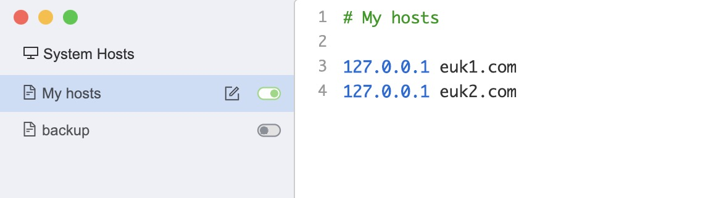

##### 2.配置文件

**节点 1:**

```properties
# 应用名称--这个代表着分组,只有两个eureka都叫这个,才是可用的,
# 例如,只有两个服务都叫打车,才能调用哪个服务都可以,如果一个打车,一个吃饭,那肯定不行啊
spring.application.name=ek_ap

#是否将自己注册到其他Eureka Server,默认为true 需要
eureka.client.register-with-eureka=true
#是否从eureka server获取注册信息， 需要
eureka.client.fetch-registry=true
#设置服务注册中心的URL，用于client和server端交流
#此节点应向其他节点发起请求
eureka.client.serviceUrl.defaultZone=http://euk2.com:7902/eureka/
#主机名，必填
eureka.instance.hostname=euk1.com
#开启远程关闭功能,打开后,可用命令下线
management.endpoint.shutdown.enabled=true
#web端口，服务是由这个端口处理rest请求的
server.port=7901
```

**节点 2:**

```properties
# 应用名称--必须和其他eureka叫相同的名字
spring.application.name=ek_ap

#是否将自己注册到其他Eureka Server,默认为true 需要
eureka.client.register-with-eureka=true
#是否从eureka server获取注册信息， 需要
eureka.client.fetch-registry=true
#设置服务注册中心的URL，用于client和server端交流
#此节点应向其他节点发起请求
eureka.client.serviceUrl.defaultZone=http://euk1.com:7901/eureka/
#主机名，必填
eureka.instance.hostname=euk2.com
#开启远程关闭功能,打开后,可用命令下线
management.endpoint.shutdown.enabled=true
#web端口，服务是由这个端口处理rest请求的
server.port=7902
```

**节点 3:**

如果有节点3，配置同上 改一下主机名和端口

略。。。

两个节点的话，如下图内容 就算成功了

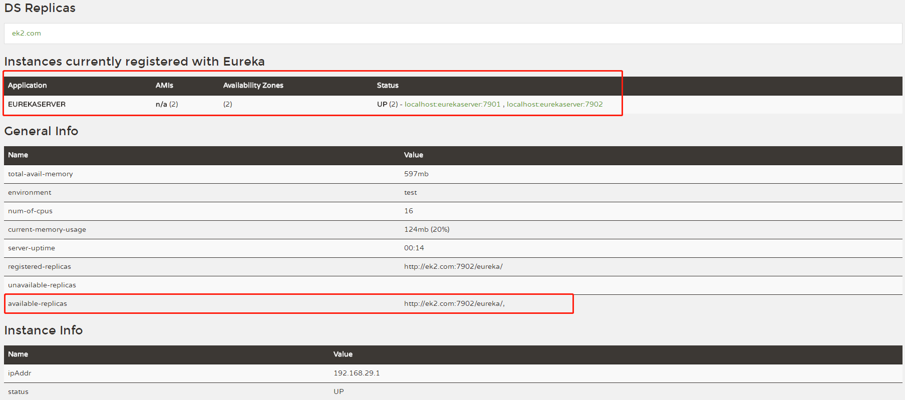

### 服务注册

#### pom.xml

新建一个web项目,创建时候选中eureka-client组件或者自己引入下面的依赖

```xml
<dependency>
    <groupId>org.springframework.cloud</groupId>
    <artifactId>spring-cloud-starter-netflix-eureka-client</artifactId>
</dependency>
```

如果是基于Hoxton.的新版,则不用在启动类上加Eureka注解了

```xml
<properties>
  <java.version>1.8</java.version>
  <project.build.sourceEncoding>UTF-8</project.build.sourceEncoding>
  <project.reporting.outputEncoding>UTF-8</project.reporting.outputEncoding>
  <spring-boot.version>2.3.7.RELEASE</spring-boot.version>
  <!-- 这个 ,基于Hoxton的是高版本的,不用再启动类上加注解-->
  <spring-cloud.version>Hoxton.SR9</spring-cloud.version>
</properties>
```


#### 客户端配置选项

```properties
spring.application.name=provider
#注册到哪里
eureka.client.service-url.defaultZone=http://euk1.com:7901/eureka/
#可以远程关闭服务节点
management.endpoint.shutdown.enabled=true
server.port=81

#续约发送间隔默认30秒，心跳间隔
eureka.instance.lease-renewal-interval-in-seconds=5
#表示eureka client间隔多久去拉取服务注册信息，默认为30秒，对于api-gateway，如果要迅速获取服务注册状态，可以缩小该值，比如5秒
eureka.client.registry-fetch-interval-seconds=5
# 续约到期时间（默认90秒）
eureka.instance.lease-expiration-duration-in-seconds=60
```

#### 测试是否好使

```java
@RestController
public class MainController {
    @GetMapping("/getHi")
    public String getHi(){
        return "HI";
    }
}
```


#### 服务器端配置选项

```properties
spring.application.name=EurekaServer
#是否将自己注册到Eureka Server,默认为true，由于当前就是server，故而设置成false，表明该服务不会向eureka注册自己的信息
eureka.client.register-with-eureka=false
#是否从eureka server获取注册信息，由于单节点，不需要同步其他节点数据，用false
eureka.client.fetch-registry=false
#设置服务注册中心的URL，用于client和server端交流
eureka.client.service-url.defaultZone=http://euk1.com:7901/eureka/
server.port=7901

#关闭自我保护模式
eureka.server.enable-self-preservation=false
#失效服务间隔
eureka.server.eviction-interval-timer-in-ms=3000
```


### Eureka单独使用

#### Rest服务调用

[官方文档](https://github.com/Netflix/eureka/wiki/Eureka-REST-operations)

| **Operation**                                                | **HTTP action**                                              | **Description**                                              |
| ------------------------------------------------------------ | ------------------------------------------------------------ | ------------------------------------------------------------ |
| Register new application instance                            | POST /eureka/v2/apps/**appID**                               | Input: JSON/XMLpayload HTTPCode: 204 on success              |
| De-register application instance                             | DELETE /eureka/v2/apps/**appID**/**instanceID**              | HTTP Code: 200 on success                                    |
| Send application instance heartbeat                          | PUT /eureka/v2/apps/**appID**/**instanceID**                 | HTTP Code: * 200 on success * 404 if **instanceID**doesn’t exist |
| Query for all instances                                      | GET /eureka/v2/apps                                          | HTTP Code: 200 on success Output: JSON/XML                   |
| Query for all **appID** instances                            | GET /eureka/v2/apps/**appID**                                | HTTP Code: 200 on success Output: JSON/XML                   |
| Query for a specific **appID**/**instanceID**                | GET /eureka/v2/apps/**appID**/**instanceID**                 | HTTP Code: 200 on success Output: JSON/XML                   |
| Query for a specific **instanceID**                          | GET /eureka/v2/instances/**instanceID**                      | HTTP Code: 200 on success Output: JSON/XML                   |
| Take instance out of service                                 | PUT /eureka/v2/apps/**appID**/**instanceID**/status?value=OUT_OF_SERVICE | HTTP Code: * 200 on success * 500 on failure                 |
| Move instance back into service (remove override)            | DELETE /eureka/v2/apps/**appID**/**instanceID**/status?value=UP (The value=UP is optional, it is used as a suggestion for the fallback status due to removal of the override) | HTTP Code: * 200 on success * 500 on failure                 |
| Update metadata                                              | PUT /eureka/v2/apps/**appID**/**instanceID**/metadata?key=value | HTTP Code: * 200 on success * 500 on failure                 |
| Query for all instances under a particular **vip address**   | GET /eureka/v2/vips/**vipAddress**                           | * HTTP Code: 200 on success Output: JSON/XML  * 404 if the **vipAddress**does not exist. |
| Query for all instances under a particular **secure vip address** | GET /eureka/v2/svips/**svipAddress**                         | * HTTP Code: 200 on success Output: JSON/XML  * 404 if the **svipAddress**does not exist. |

#### [访问自己的Eureka地址可查看服务状态](http://localhost:7901/eureka/status )

下面是postman访问后返回的信息,默认是xml格式的

```xml
<com.netflix.eureka.util.StatusInfo>
    <generalStats>
        <environment>test</environment>
        <num-of-cpus>8</num-of-cpus>
        <total-avail-memory>546mb</total-avail-memory>
        <current-memory-usage>195mb (35%)</current-memory-usage>
        <server-uptime>02:20</server-uptime>
    </generalStats>
    <applicationStats>
        <registered-replicas></registered-replicas>
        <available-replicas></available-replicas>
        <unavailable-replicas></unavailable-replicas>
    </applicationStats>
    <instanceInfo>
        <instanceId>localhost:EurekaServer:7901</instanceId>
        <hostName>euk1.com</hostName>
        <app>EUREKASERVER</app>
        <ipAddr>192.168.1.103</ipAddr>
        <status>UP</status>
        <overriddenstatus>UNKNOWN</overriddenstatus>
        <port enabled="true">7901</port>
        <securePort enabled="false">443</securePort>
        <countryId>1</countryId>
        <dataCenterInfo class="com.netflix.appinfo.InstanceInfo$DefaultDataCenterInfo">
            <name>MyOwn</name>
        </dataCenterInfo>
        <leaseInfo>
            <renewalIntervalInSecs>30</renewalIntervalInSecs>
            <durationInSecs>90</durationInSecs>
            <registrationTimestamp>0</registrationTimestamp>
            <lastRenewalTimestamp>0</lastRenewalTimestamp>
            <evictionTimestamp>0</evictionTimestamp>
            <serviceUpTimestamp>0</serviceUpTimestamp>
        </leaseInfo>
        <metadata>
            <dalao>malaoshi</dalao>
            <management.port>7901</management.port>
        </metadata>
        <homePageUrl>http://euk1.com:7901/</homePageUrl>
        <statusPageUrl>http://euk1.com:7901/actuator/info</statusPageUrl>
        <healthCheckUrl>http://euk1.com:7901/actuator/health</healthCheckUrl>
        <vipAddress>EurekaServer</vipAddress>
        <secureVipAddress>EurekaServer</secureVipAddress>
        <isCoordinatingDiscoveryServer>false</isCoordinatingDiscoveryServer>
        <lastUpdatedTimestamp>1619478549517</lastUpdatedTimestamp>
        <lastDirtyTimestamp>1619478549667</lastDirtyTimestamp>
    </instanceInfo>
</com.netflix.eureka.util.StatusInfo>
```

如果需要json格式 可以加个请求头`Accept:application/json`,注意是Header中加,不是参数中加

```json
{
    "generalStats": {
        "environment": "test",
        "num-of-cpus": "8",
        "total-avail-memory": "546mb",
        "current-memory-usage": "197mb (36%)",
        "server-uptime": "02:22"
    },
    "applicationStats": {
        "registered-replicas": "",
        "available-replicas": "",
        "unavailable-replicas": ""
    },
    "instanceInfo": {
        "instanceId": "localhost:EurekaServer:7901",
        "hostName": "euk1.com",
        "app": "EUREKASERVER",
        "ipAddr": "192.168.1.103",
        "status": "UP",
        "overriddenStatus": "UNKNOWN",
        "port": {
            "$": 7901,
            "@enabled": "true"
        },
        "securePort": {
            "$": 443,
            "@enabled": "false"
        },
        "countryId": 1,
        "dataCenterInfo": {
            "@class": "com.netflix.appinfo.InstanceInfo$DefaultDataCenterInfo",
            "name": "MyOwn"
        },
        "leaseInfo": {
            "renewalIntervalInSecs": 30,
            "durationInSecs": 90,
            "registrationTimestamp": 0,
            "lastRenewalTimestamp": 0,
            "evictionTimestamp": 0,
            "serviceUpTimestamp": 0
        },
        "metadata": {
            "dalao": "malaoshi",
            "management.port": "7901"
        },
        "homePageUrl": "http://euk1.com:7901/",
        "statusPageUrl": "http://euk1.com:7901/actuator/info",
        "healthCheckUrl": "http://euk1.com:7901/actuator/health",
        "vipAddress": "EurekaServer",
        "secureVipAddress": "EurekaServer",
        "isCoordinatingDiscoveryServer": "false",
        "lastUpdatedTimestamp": "1619478549517",
        "lastDirtyTimestamp": "1619478549667"
    }
```

#### 注册到eureka的服务信息查看

 get: {ip:port}/eureka/apps

举例:http://localhost:7901/eureka/apps

#### 注册到eureka的具体的服务查看

 get: {ip:port}/eureka/apps/{appname}/{id}

举例:http://localhost:7901/eureka/apps/provider

#### 服务续约

 put：{ip:port}/eureka/apps/{appname}/{id}?lastDirtyTimestamp={}&status=up

#### 更改服务状态

 put：{ip:port}/eureka/apps/{appname}/{id}/status?lastDirtyTimestamp={}&value={UP/DOWN}
 对应eureka源码的：InstanceResource.statusUpdate

#### 删除状态更新

 delete：{ip:port}/eureka/apps/{appname}/{id}/status?lastDirtyTimestamp={}&value={UP/DOWN}

#### 删除服务

 delete: {ip:port}/eureka/apps/{appname}/{id}


### 元数据

Eureka的元数据有两种：标准元数据和自定义元数据。
标准元数据：主机名、IP地址、端口号、状态页和健康检查等信息，这些信息都会被发布在服务注册表中，用于服务之间的调用。
自定义元数据：可以使用eureka.instance.metadata-map配置，这些元数据可以在远程客户端中访问，但是一般不改变客户端行为，除非客户端知道该元数据的含义。

可以在配置文件中对当前服务设置自定义元数据，可后期用户个性化使用

元数据可以配置在eureka服务器和eureka的客户端上

```
eureka.instance.metadata-map.dalao=mashibing

```

#### 服务端：

application.properties中添加

```properties
#自定义数据
eureka.instance.metadata-map.dalao=malaoshi
```

json格式展示效果:

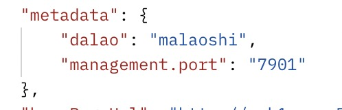

#### 客户端：

application.properties中添加

```properties
#自定义数据
eureka.instance.metadata-map.dalao=malaoshihahaha
```

xml格式展示效果:

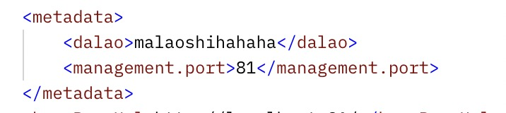


### EurekaClient 

用API的方式来操作EurekaClient

[EurekaClient,DiscoveryClient的使用](https://www.cnblogs.com/bugzeroman/p/13737739.html)

EurekaClient 可以在客户端获取eureka服务器上的注册者信息

**org.springframework.cloud.client.discovery与com.netflix.discovery.DiscoveryClient**

org.springframework.cloud.client.discovery是SpringCloud对注册中心client的抽象封装，提供公用功能

org.springframework.cloud.client.discovery定义用来服务发现的客户端接口，是客户端进行服务发现的核心接口，是spring cloud用来进行服务发现的顶级接口，在common中可以看到其地位。在Netflix Eureka和Consul中都有具体的实现类。

代表通用于服务发现的读操作，例如在 eureka或consul中。

```
有
	String description();//获取实现类的描述。
	List<String> getServices();//获取所有服务实例id。
	List<ServiceInstance> getInstances(String serviceId);//通过服务id查询服务实例信息列表。
```

com.netflix.discovery.DiscoveryClient为Eureka注册中心客户端的接口，功能更丰富

代码示例

```java
package com.fsl.provider;

import java.util.List;

import org.apache.commons.lang.builder.ToStringBuilder;
import org.springframework.beans.factory.annotation.Autowired;
import org.springframework.cloud.client.ServiceInstance;
import org.springframework.cloud.client.discovery.DiscoveryClient;
import org.springframework.cloud.client.loadbalancer.LoadBalancerClient;
import org.springframework.web.bind.annotation.GetMapping;
import org.springframework.web.bind.annotation.RestController;
import org.springframework.web.client.RestTemplate;

import com.netflix.appinfo.InstanceInfo;
import com.netflix.appinfo.InstanceInfo.InstanceStatus;
import com.netflix.discovery.EurekaClient;

@RestController
public class MainController {

    @Autowired
    // 抽象
    DiscoveryClient client;

    @Autowired
    EurekaClient client2;

    @Autowired
    LoadBalancerClient lb;


    @GetMapping("/getHi")
    public String getHi() {
        return "Hi";
    }


    @GetMapping("/getServices")
    public Object getServices() {
        List<String> services = client.getServices();
        for (String str : services) {
            System.out.println(str);
        }
        return services;
    }

    @GetMapping("/getInstances")
    public Object getInstances() {
        List<ServiceInstance> instances = client.getInstances("provider");
        for (ServiceInstance ins : instances) {
            System.out.println(ToStringBuilder.reflectionToString(ins));
        }
        return instances;
    }

    /**
     * 从列表中拉取一个服务,并且调用一个他的服务.
     * @return
     */
    @GetMapping("/test1")
    public Object test1() {

        // 具体服务
        //	List<InstanceInfo> instances = client2.getInstancesById("localhost:provider:80");

        // 使用服务名 ，找列表
        List<InstanceInfo> instances = client2.getInstancesByVipAddress("provider", false);
        for (InstanceInfo ins : instances) {
            System.out.println(ToStringBuilder.reflectionToString(ins));
        }

        if(instances.size()>0) {
            // 服务
            InstanceInfo instanceInfo = instances.get(0);
            if(instanceInfo.getStatus() == InstanceStatus.UP) {
                String url =	"http://" + instanceInfo.getHostName() +":"+ instanceInfo.getPort() + "/getHi";
                System.out.println("url:" + url);

                RestTemplate restTemplate = new RestTemplate();
                String respStr = restTemplate.getForObject(url, String.class);
                System.out.println("respStr"  + respStr);
            }
        }
        return "xxoo";
    }
}

```

### 自我保护机制

==保护的是Eureka里面的列表,不是Eureka自己==

#### 机制

Eureka在CAP理论当中是属于AP ， 也就说当产生网络分区时，Eureka保证系统的可用性，但不保证系统里面数据的一致性

默认开启，服务器端容错的一种方式，即短时间心跳不到达仍不剔除服务列表里的节点

```
EMERGENCY! EUREKA MAY BE INCORRECTLY CLAIMING INSTANCES ARE UP WHEN THEY'RE NOT. RENEWALS ARE LESSER THAN THRESHOLD AND HENCE THE INSTANCES ARE NOT BEING EXPIRED JUST TO BE SAFE.
```

默认情况下，Eureka Server在一定时间内，没有接收到某个微服务心跳，会将某个微服务注销（90S）。但是当网络故障时，微服务与Server之间无法正常通信，上述行为就非常危险，因为微服务正常，不应该注销。

Eureka Server通过自我保护模式来解决整个问题，当Server在短时间内丢失过多客户端时，那么Server会进入自我保护模式，会保护注册表中的微服务不被注销掉。当网络故障恢复后，退出自我保护模式。

**思想：宁可保留健康的和不健康的，也不盲目注销任何健康的服务。**

**自我保护触发条件:**

> ​	**客户端每分钟续约数量小于客户端总数的85%时会触发保护机制**


自我保护机制的触发条件：
（当每分钟心跳次数( renewsLastMin ) 小于 numberOfRenewsPerMinThreshold 时，并且开启自动保护模式开关( eureka.server.enable-self-preservation = true ) 时，触发自我保护机制，不再自动过期租约。）
numberOfRenewsPerMinThreshold = expectedNumberOfRenewsPerMin * 续租百分比( eureka.server.renewalPercentThreshold, 默认0.85 )
expectedNumberOfRenewsPerMin = 当前注册的应用实例数 x 2
为什么乘以 2：
默认情况下，注册的应用实例每半分钟续租一次，那么一分钟心跳两次，因此 x 2 。

服务实例数：10个，期望每分钟续约数：10 * 2=20，期望阈值：20*0.85=17，自我保护少于17时 触发。

剔除：

```sh
    AbstractInstanceRegistry
    
    public void evict(long additionalLeaseMs) {
        logger.debug("Running the evict task");

        if (!isLeaseExpirationEnabled()) {
            logger.debug("DS: lease expiration is currently disabled.");
            return;
    }
    此代码意思：if中判断为true，不走此逻辑，走下面的剔除。如果if为false。走此逻辑，不剔除。
```


```sh
PeerAwareInstanceRegistryImpl

    @Override
    public boolean isLeaseExpirationEnabled() {
        if (!isSelfPreservationModeEnabled()) {
        //如果打开自我保护，不进入此逻辑。
            // The self preservation mode is disabled, hence allowing the instances to expire.
            return true;
        }
        return numberOfRenewsPerMinThreshold > 0 && getNumOfRenewsInLastMin() > numberOfRenewsPerMinThreshold;
    }
```


#### 关闭

```properties
eureka.server.enable-self-preservation=false
```


关闭后会Eureka服务上会提示


#### 清理时间

默认60秒

```properties
eureka.server.eviction-interval-timer-in-ms=3000
```


## 使用Spring Boot2.x Actuator监控应用

> 向一个端点上报本端点的健康状态

### 开启监控

在pom中加入相关依赖

   ```xml
<dependency>
     <groupId>org.springframework.boot</groupId>
     <artifactId>spring-boot-starter-actuator</artifactId>
 </dependency>
   ```

### 默认端点

#### 访问一下看看有哪些端点

> http://localhost:85/actuator

```json
{
    "_links": {
        "self": {
            "href": "http://localhost:85/actuator",
            "templated": false
        },
        "health": {
            "href": "http://localhost:85/actuator/health",
            "templated": false
        },
        "health-path": {
            "href": "http://localhost:85/actuator/health/{*path}",
            "templated": true
        },
        "info": {
            "href": "http://localhost:85/actuator/info",
            "templated": false
        }
    }
}
```

Spring Boot 2.0 的Actuator只暴露了health和info端点，提供的监控信息无法满足我们的需求

在1.x中有n多可供我们监控的节点，官方的回答是为了安全….

当然我们可以手动开启全部端点.

### 开启所有端点

在application中加入如下配置信息

*代表所有节点都加载

```properties
#开启所有端点
management.endpoints.web.exposure.include=*
```

#### 所有端点都开启后的api列表

```json
{
    "_links": {
        "self": {
            "href": "http://localhost:84/actuator",
            "templated": false
        },
        "archaius": {
            "href": "http://localhost:84/actuator/archaius",
            "templated": false
        },
        "beans": {
            "href": "http://localhost:84/actuator/beans",
            "templated": false
        },
        "caches": {
            "href": "http://localhost:84/actuator/caches",
            "templated": false
        },
        "caches-cache": {
            "href": "http://localhost:84/actuator/caches/{cache}",
            "templated": true
        },
        "health-path": {
            "href": "http://localhost:84/actuator/health/{*path}",
            "templated": true
        },
        "health": {
            "href": "http://localhost:84/actuator/health",
            "templated": false
        },
        "info": {
            "href": "http://localhost:84/actuator/info",
            "templated": false
        },
        "conditions": {
            "href": "http://localhost:84/actuator/conditions",
            "templated": false
        },
        "shutdown": {
            "href": "http://localhost:84/actuator/shutdown",
            "templated": false
        },
        "configprops": {
            "href": "http://localhost:84/actuator/configprops",
            "templated": false
        },
        "env-toMatch": {
            "href": "http://localhost:84/actuator/env/{toMatch}",
            "templated": true
        },
        "env": {
            "href": "http://localhost:84/actuator/env",
            "templated": false
        },
        "loggers-name": {
            "href": "http://localhost:84/actuator/loggers/{name}",
            "templated": true
        },
        "loggers": {
            "href": "http://localhost:84/actuator/loggers",
            "templated": false
        },
        "heapdump": {
            "href": "http://localhost:84/actuator/heapdump",
            "templated": false
        },
        "threaddump": {
            "href": "http://localhost:84/actuator/threaddump",
            "templated": false
        },
        "metrics-requiredMetricName": {
            "href": "http://localhost:84/actuator/metrics/{requiredMetricName}",
            "templated": true
        },
        "metrics": {
            "href": "http://localhost:84/actuator/metrics",
            "templated": false
        },
        "scheduledtasks": {
            "href": "http://localhost:84/actuator/scheduledtasks",
            "templated": false
        },
        "mappings": {
            "href": "http://localhost:84/actuator/mappings",
            "templated": false
        },
        "refresh": {
            "href": "http://localhost:84/actuator/refresh",
            "templated": false
        },
        "features": {
            "href": "http://localhost:84/actuator/features",
            "templated": false
        },
        "service-registry": {
            "href": "http://localhost:84/actuator/service-registry",
            "templated": false
        }
    }
}
```

### 特殊端点shutdown

这个端点,即使是开启全部端点,依然看不见,需要再增加一个配置.

(在新版本中发现已经不需要在添加这个配置了,只要是*的,就全部显示出来了,反而这个配置会报红.)

在application中添加

```properties
management.endpoint.shutdown.enabled=true
```

然后你再访问,会发现多了一个.

```json
"shutdown": {
  "href": "http://localhost:84/actuator/shutdown",
  "templated": false
},
```

通过<font color="red">**post**</font>请求访问,可以远程让这个服务下线.

```json
-通过postman发送post请求
http://localhost:84/actuator/shutdown

-返回信息
{
    "message": "Shutting down, bye..."
}
```

### api端点功能

> Health

会显示系统状态

{"status":"UP"}

> shutdown 

用来关闭节点

开启远程关闭功能

```properties
management.endpoint.shutdown.enabled=true
```

使用Post方式请求端点

{

  "message": "Shutting down, bye..."

}

> **autoconfig** 

获取应用的自动化配置报告 

> beans 

获取应用上下文中创建的所有Bean  

> configprops 

获取应用中配置的属性信息报告 

> env 

获取应用所有可用的环境属性报告 

> Mappings

 获取应用所有Spring Web的控制器映射关系报告

> info 

获取应用自定义的信息 

> metrics

返回应用的各类重要度量指标信息 

> **Metrics**

节点并没有返回全量信息，我们可以通过不同的**key**去加载我们想要的值

 metrics/jvm.memory.max

### java代码测试:

#### 改变健康状态的service

```java
package com.fsl.provider;

import org.springframework.boot.actuate.health.Health;
import org.springframework.boot.actuate.health.HealthIndicator;
import org.springframework.stereotype.Service;

@Service
public class HealthStatusService implements HealthIndicator {

	private Boolean status = true;

	public void setStatus(Boolean status) {
		this.status = status;
	}

	@Override
	public Health health() {
		// TODO Auto-generated method stub
		if (status)
			return new Health.Builder().up().build();
		return new Health.Builder().down().build();
	}

	public String getStatus() {
		// TODO Auto-generated method stub
		return this.status.toString();
	}
}
```

#### controller

```java

    @Autowired
    HealthStatusService healthStatusSrv;
    @GetMapping("/health")
    public String health(@RequestParam("status") Boolean status) {
        healthStatusSrv.setStatus(status);
        return healthStatusSrv.getStatus();
    }
```

## 安全配置-spring security

### 引入安全依赖

```xml
<dependency>
  <groupId>org.springframework.boot</groupId>
  <artifactId>spring-boot-starter-security</artifactId>
</dependency>
```

### 开启Eureka安全连接

```properties
spring.security.user.name=fsl
spring.security.user.password=123
```

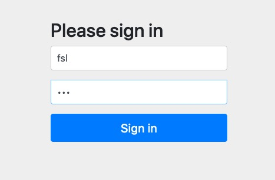


### 如果其他服务向eureka注册报错

```java
Root name 'timestamp' does not match expected ('instance') for type [simple
```

是默认开启了防止跨域攻击

#### 手动关闭

在服务端增加配置类

```java
@Configuration
@EnableWebSecurity
public class WebSecurityConfig extends WebSecurityConfigurerAdapter{
	@Override
	protected void configure(HttpSecurity http) throws Exception {
		// TODO Auto-generated method stub
		http.csrf().disable();
		super.configure(http);
	}
}

```

## RestTemplate 

### 依赖注入

启动类注册一个负载均衡

```java
	@Bean
	// 开启负载均衡
	@LoadBalanced
	RestTemplate restTemplate() {
		return new RestTemplate();
	}
```

接下来便可以使用资源地址调用服务

```java
//注意如果加了注解,一定要写服务名的,不能再拼ip了,否则不能识别正确
String url ="http://provider/getHi";
String respStr = restTemplate.getForObject(url, String.class);
```

注意啊如果这个bean没有负载均衡的注解

```java
@Bean
RestTemplate restTemplate() {
	return new RestTemplate();
}
```
那么RestTemplate再发送请求是需要手动拼接url的,太low,也不方便容易出错.

```java
@GetMapping("/testRBLoadBalance")
    public Object testRBLoadBalance() {
        // ribbon 完成客户端的负载均衡，过滤掉down了的节点
        ServiceInstance instance = lb.choose("provider");
        //拿到Instance后手动拼接url
        String url ="http://" + instance.getHost() +":"+ instance.getPort() + "/getPort";
        String respStr = restTemplate.getForObject(url, String.class);
        return respStr;
    }
```


### get 请求处理

#### getForEntity

getForEntity方法的返回值是一个ResponseEntity，ResponseEntity是Spring对HTTP请求响应的封装，包括了几个重要的元素，如响应码、contentType、contentLength、响应消息体等。

```shell
<200,Hi,[Content-Type:"text/plain;charset=UTF-8", Content-Length:"8", Date:"Fri, 10 Apr 2020 09:58:44 GMT", Keep-Alive:"timeout=60", Connection:"keep-alive"]>
```

#### 返回一个Map

**调用方**

```java
		String url ="http://provider/getMap";
		ResponseEntity<Map> entity = restTemplate.getForEntity(url, Map.class);
		System.out.println("respStr: "  + entity.getBody() );
```

**生产方**

```java
	@GetMapping("/getMap")
	public Map<String, String> getMap() {
		HashMap<String, String> map = new HashMap<>();
		map.put("name", "500");
		return map; 
	}
```

#### 返回对象

**调用方**

```java
		ResponseEntity<Person> entity = restTemplate.getForEntity(url, Person.class);
		System.out.println("respStr: "  + ToStringBuilder.reflectionToString(entity.getBody() ));
```

**生产方**

```java
	@GetMapping("/getObj")
	public Person getObj() {
		Person person = new Person();
		person.setId(100);
		person.setName("xiaoming");
		return person; 
	}
```

**Person类**

```java
	private int id;
	private String name;
```

#### 传参调用

**使用占位符**

```java
	String url ="http://provider/getObjParam?name={1}";
	ResponseEntity<Person> entity = restTemplate.getForEntity(url, Person.class,"hehehe...");
```

**使用map**

```java
		String url ="http://provider/getObjParam?name={name}";
		Map<String, String> map = Collections.singletonMap("name", " memeda");
		ResponseEntity<Person> entity = restTemplate.getForEntity(url, Person.class,map);
```

#### 返回对象

```java
Person person = restTemplate.getForObject(url, Person.class,map);
```

### post 请求处理

#### **调用方**

```java
	
		String url ="http://provider/postParam";
		Map<String, String> map = Collections.singletonMap("name", " memeda");
		ResponseEntity<Person> entity = restTemplate.postForEntity(url, map, Person.class);
```

#### **生产方**

```java
	@PostMapping("/postParam")
	public Person postParam(@RequestBody String name) {
		System.out.println("name:" + name);
		Person person = new Person();
		person.setId(100);
		person.setName("xiaoming" + name);
		return person; 
	}
```

### postForLocation 

#### **调用方**

```java
		String url ="http://provider/postParam";
		   
		Map<String, String> map = Collections.singletonMap("name", " memeda");
		URI location = restTemplate.postForLocation(url, map, Person.class);
		
		System.out.println(location);
```

#### **生产方**

需要设置头信息，不然返回的是null

```java
	public URI postParam(@RequestBody Person person,HttpServletResponse response) throws Exception {

	URI uri = new URI("https://www.baidu.com/s?wd="+person.getName());
	response.addHeader("Location", uri.toString());
```

### exchange

可以自定义http请求的头信息，同时保护get和post方法

### 拦截器

需要实现`ClientHttpRequestInterceptor`接口

**拦截器**

```java
public class LoggingClientHttpRequestInterceptor implements ClientHttpRequestInterceptor {

	@Override
	public ClientHttpResponse intercept(HttpRequest request, byte[] body, ClientHttpRequestExecution execution)
			throws IOException {

		System.out.println("拦截啦！！！");
		System.out.println(request.getURI());

		ClientHttpResponse response = execution.execute(request, body);

		System.out.println(response.getHeaders());
		return response;
	}
```

添加到resttemplate中

```java
	@Bean
	@LoadBalanced
	RestTemplate restTemplate() {
		RestTemplate restTemplate = new RestTemplate();
		restTemplate.getInterceptors().add(new LoggingClientHttpRequestInterceptor());
		return restTemplate;
	}
```

## Ribbon

### 两种负载均衡

​		当系统面临大量的用户访问，负载过高的时候，通常会增加服务器数量来进行横向扩展（集群），多个服务器的负载需要均衡，以免出现服务器负载不均衡，部分服务器负载较大，部分服务器负载较小的情况。通过负载均衡，使得集群中服务器的负载保持在稳定高效的状态，从而提高整个系统的处理能力。

```sh
软件负载均衡：nginx,lvs

硬件负载均衡：F5

我们只关注软件负载均衡，
第一层可以用DNS，配置多个A记录，让DNS做第一层分发。
第二层用比较流行的是反向代理，核心原理：代理根据一定规则，将http请求转发到服务器集群的单一服务器上。
```

软件负载均衡分为：服务端（集中式），客户端。

服务端负载均衡：在客户端和服务端中间使用代理，nginx。

客户端负载均衡：根据自己的情况做负载。Ribbon就是。

客户端负载均衡和服务端负载均衡最大的区别在于 ***服务端地址列表的存储位置，以及负载算法在哪里***。

### 客户端负载均衡

在客户端负载均衡中，所有的客户端节点都有一份自己要访问的服务端地址列表，这些列表统统都是从服务注册中心获取的；

### 服务端负载均衡

在服务端负载均衡中，客户端节点只知道单一服务代理的地址，服务代理则知道所有服务端的地址。

我们要学的Ribbon使用的是客户端负载均衡。

而在Spring Cloud中我们如果想要使用客户端负载均衡，方法很简单，使用@LoadBalanced注解即可，这样客户端在发起请求的时候会根据负载均衡策略从服务端列表中选择一个服务端，向该服务端发起网络请求，从而实现负载均衡。

```sh
https://github.com/Netflix/ribbon
```

------

### 其他

上面几种负载均衡，硬件，软件（服务端nginx，客户端ribbon）。目的：将请求分发到其他功能相同的服务。

手动实现，其实也是它的原理，做事的方法。

```sh
手写客户端负载均衡
1、知道自己的请求目的地（虚拟主机名，默认是spring.application.name）
2、获取所有服务端地址列表（也就是注册表）。
3、选出一个地址，找到虚拟主机名对应的ip、port（将虚拟主机名 对应到 ip和port上）。
4、发起实际请求(最朴素的请求)。
```

Ribbon是Netflix开发的客户端负载均衡器，为Ribbon配置**服务提供者地址列表**后，Ribbon就可以基于某种**负载均衡策略算法**，自动地帮助服务消费者去请求 提供者。Ribbon默认为我们提供了很多负载均衡算法，例如轮询、随机等。我们也可以实现自定义负载均衡算法。

Ribbon作为Spring Cloud的负载均衡机制的实现，

1. Ribbon可以单独使用，作为一个独立的负载均衡组件。只是需要我们手动配置 服务地址列表。

   ```properties
   ribbon.eureka.enabled=false
   ribbon.listOfServers=localhost:80,localhost:81
   ```

2. Ribbon与Eureka配合使用时，Ribbon可自动从Eureka Server获取服务提供者地址列表（DiscoveryClient），并基于负载均衡算法，请求其中一个服务提供者实例。

3. Ribbon与OpenFeign和RestTemplate进行无缝对接，让二者具有负载均衡的能力。OpenFeign默认集成了ribbon。

### Ribbon组成

官网首页：https://github.com/Netflix/ribbon

ribbon-core: 核心的通用性代码。api一些配置。

ribbon-eureka：基于eureka封装的模块，能快速集成eureka。

ribbon-examples：学习示例。

ribbon-httpclient：基于apache httpClient封装的rest客户端，集成了负载均衡模块，可以直接在项目中使用。

ribbon-loadbalancer：负载均衡模块。

ribbon-transport：基于netty实现多协议的支持。比如http，tcp，udp等。

### 负载均衡算法

默认实现：

ZoneAvoidanceRule（区域权衡策略）：复合判断Server所在区域的性能和Server的可用性，轮询选择服务器。

其他规则：

BestAvailableRule（最低并发策略）：会先过滤掉由于多次访问故障而处于断路器跳闸状态的服务，然后选择一个并发量最小的服务。逐个找服务，如果断路器打开，则忽略。

RoundRobinRule（轮询策略）：以简单轮询选择一个服务器。按顺序循环选择一个server。

RandomRule（随机策略）：随机选择一个服务器。

AvailabilityFilteringRule（可用过滤策略）：会先过滤掉多次访问故障而处于断路器跳闸状态的服务和过滤并发的连接数量超过阀值得服务，然后对剩余的服务列表安装轮询策略进行访问。

WeightedResponseTimeRule（响应时间加权策略）：据平均响应时间计算所有的服务的权重，响应时间越快服务权重越大，容易被选中的概率就越高。刚启动时，如果统计信息不中，则使用RoundRobinRule(轮询)策略，等统计的信息足够了会自动的切换到WeightedResponseTimeRule。响应时间长，权重低，被选择的概率低。反之，同样道理。此策略综合了各种因素（网络，磁盘，IO等），这些因素直接影响响应时间。

RetryRule（重试策略）：先按照RoundRobinRule(轮询)的策略获取服务，如果获取的服务失败则在指定的时间会进行重试，进行获取可用的服务。如多次获取某个服务失败，就不会再次获取该服务。主要是在一个时间段内，如果选择一个服务不成功，就继续找可用的服务，直到超时。

### 切换负载均衡策略

#### 注解方式

在启动类中加入如下的bean

```java
@Bean
	public IRule myRule(){
		//return new RoundRobinRule();
		//return new RandomRule();
		return new RetryRule(); 
  }
```

#### 配置文件

针对服务定ribbon策略：

```properties
provider.ribbon.NFLoadBalancerRuleClassName=com.netflix.loadbalancer.RandomRule
```

给所有服务定ribbon策略：

```properties
ribbon.NFLoadBalancerRuleClassName=com.netflix.loadbalancer.RandomRule
```

<font color="red">属性配置方式优先级高于Java代码。</font>

### Ribbon脱离Eureka

```sh
ribbon.eureka.enabled=false
ribbon.listOfServers=localhost:80,localhost:81
```

为service-sms设置 请求的网络地址列表。

Ribbon可以和服务注册中心Eureka一起工作，从服务注册中心获取服务端的地址信息，也可以在配置文件中使用listOfServers字段来设置服务端地址。


## Feign

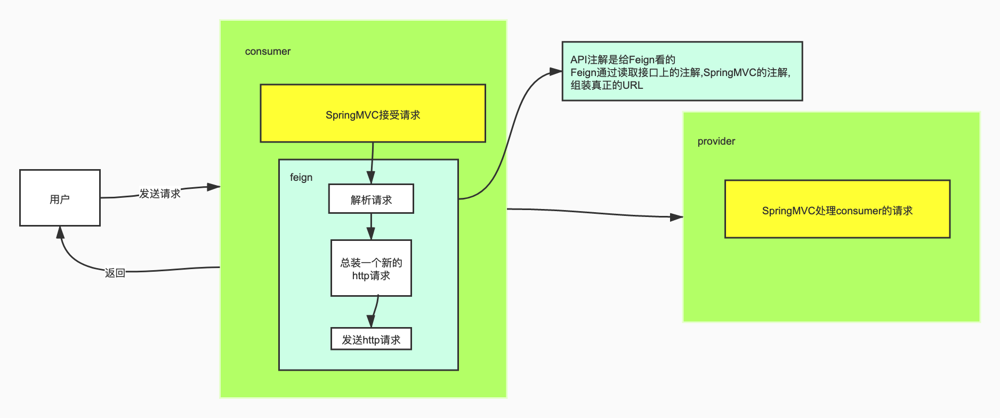

### Feign

OpenFeign是Netflix 开发的声明式、模板化的HTTP请求客户端。可以更加便捷、优雅地调用http api。

OpenFeign会根据带有注解的函数信息构建出网络请求的模板，在发送网络请求之前，OpenFeign会将函数的参数值设置到这些请求模板中。

feign主要是构建微服务消费端。只要使用OpenFeign提供的注解修饰定义网络请求的接口类，就可以使用该接口的实例发送RESTful的网络请求。还可以集成Ribbon和Hystrix，提供负载均衡和断路器。

英文表意为“假装，伪装，变形”， 是一个 Http 请求调用的轻量级框架，可以以 Java 接口注解的方式调用 Http 请求，而不用像 Java 中通过封装 HTTP 请求报文的方式直接调用。通过处理注解，将请求模板化，当实际调用的时候，传入参数，根据参数再应用到请求上，进而转化成真正的请求，这种请求相对而言比较直观。Feign 封装 了HTTP 调用流程，面向接口编程，回想第一节课的SOP。

### Feign和OpenFeign的关系

Feign本身不支持Spring MVC的注解，它有一套自己的注解

OpenFeign是Spring Cloud 在Feign的基础上支持了Spring MVC的注解，如@RequesMapping等等。
OpenFeign的`@FeignClient`可以解析SpringMVC的@RequestMapping注解下的接口，
并通过动态代理的方式产生实现类，实现类中做负载均衡并调用其他服务。


### 声明式服务调用

provider方提供公用API包，Feign通过SpringMVC的注解来加载URI

#### 1.创建项目User-Provider

1. **选择依赖**

eureka client 和 web

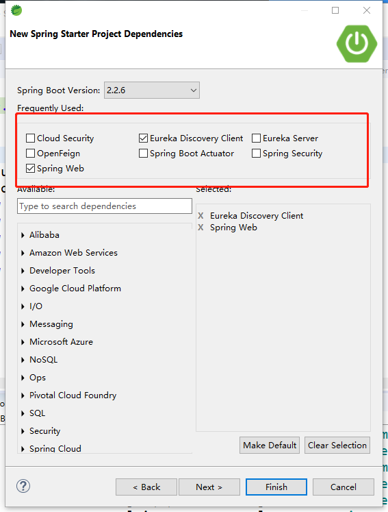

#### 2.创建项目User-API

依赖 spring-boot-starter-web

创建一个接口 RegisterApi

```java
package com.fsl.user_api;

import org.springframework.web.bind.annotation.GetMapping;
import org.springframework.web.bind.annotation.RequestMapping;

/**
 * 用户操作相关接口
 */
@RequestMapping("/User")
public interface RegisterApi {

	@GetMapping("/isAlive")
	public String isAlive();
}
```

#### 3.User-Provider 实现API

1. **配置文件**

```properties
# 应用名称
spring.application.name=user_provider
# 应用服务 WEB 访问端口
server.port=91

eureka.client.service-url.defaultZone=http://euk1.com:7901/eureka/
```

2. **引入API**

1.maven install User-Api项目

2.User-Provider的Pom.xml添加依赖

```xml
<!--引入自定义的API-->
<dependency>
  <groupId>com.fsl</groupId>
  <artifactId>user_api</artifactId>
  <version>0.0.1-SNAPSHOT</version>
</dependency>
```

3. **创建UserController**

实现Api的接口

```java
package com.fsl.user_provider;

import com.fsl.user_api.RegisterApi;
import org.springframework.web.bind.annotation.RestController;

@RestController
public class UserController implements RegisterApi {

	@Override
	public String isAlive() {
		// TODO Auto-generated method stub
		return "ok";
	}

}
```


#### 4.Consumer

1. **创建项目User-Consumer**

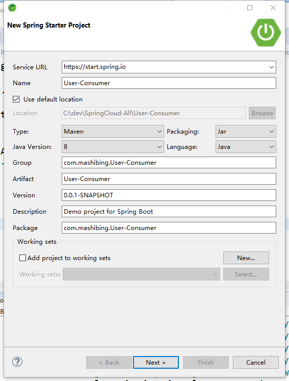

2. **依赖**


3. **引入API**

Pom.xml添加依赖

```xml
<!--引入自定义的API-->
<dependency>
  <groupId>com.fsl</groupId>
  <artifactId>user_api</artifactId>
  <version>0.0.1-SNAPSHOT</version>
</dependency>
```

4. **配置文件**

```properties
# 应用名称
spring.application.name=user_consumer
# 应用服务 WEB 访问端口
server.port=93

eureka.client.service-url.defaultZone=http://euk1.com:7901/eureka/
```

5. **创建Service接口**

```java
package com.fsl.user_consumer;

import com.fsl.user_api.RegisterApi;
import org.springframework.cloud.openfeign.FeignClient;

@FeignClient(name = "user-provider")
public interface UserConsumerService extends RegisterApi {

}
```

6. **常见错误**

1.Service id not legal hostname (user_provider)

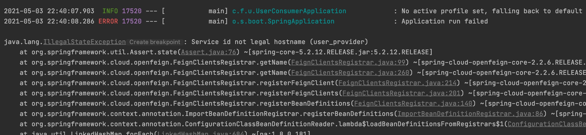

这是由于feign找不到并解析不了接口注解`@FeignClient(name = "user_provider")` 中的name.并且这个name不能包含下划线.这个name应该和需要解析的服务的应用名称一致. `spring.application.name=user-provider`

2.APPLICATION FAILED TO START

这是由于在一个服务中,多个feign的service配置了同一个解析服务地址.(多个类中配了相同的`@FeignClient(name = "user-provider")`)

在配置中加入 `spring.main.allow-bean-definition-overriding=true` 即可.

2.1以前是默认开启的,之后就不是了,手动开启可以.但是网上说这样开启会有点问题,具体再去了解.

7. **创建Controller**

```java
package com.fsl.user_consumer;

import org.springframework.beans.factory.annotation.Autowired;
import org.springframework.web.bind.annotation.GetMapping;
import org.springframework.web.bind.annotation.RestController;

@RestController
public class ConsumerController {

	@Autowired
	UserConsumerService consumerSrv;
	
	@GetMapping("/alive")
	public String alive() {
		return consumerSrv.isAlive();
	}
	
}
```

8. **修改启动类**

```java
//启动类上需要这个注解
@EnableFeignClients
```

#### 5.测试

访问 [http://localhost:93/alive](http://localhost:93/alive) 即可完成声明式远程服务调用

流程:

1. 访问93的consumer.
2. service中的feign注解解析到新的provider的url.
3. 拼上user-api项目中的接口中的/user/isAlive.发送新的url.(实现后会把路由信息自动带过来.不用再写一遍.)

### Get和Post

Feign默认所有带参数的请求都是Post，想要使用指定的提交方式需引入依赖

```xml
<dependency>
  <groupId>io.github.openfeign</groupId>
  <artifactId>feign-httpclient</artifactId>
</dependency>
```


并指明提交方式

```java
@RequestMapping(value = "/alived", method = RequestMethod.POST)
@GetMapping("/findById")
```

#### 带参请求

api接口中添加如下

```java
	@GetMapping("/findById")
	public Map findById(@RequestParam("id") Integer id);
	
	@PostMapping("/register")
	public Map<String, String> reg(@RequestBody User user);
```

provider提供实现

```java
package com.fsl.user_provider;

import com.fsl.user_api.RegisterApi;
import com.fsl.user_api.User;
import org.springframework.web.bind.annotation.RestController;

import java.util.Collections;
import java.util.Map;

@RestController
public class UserController implements RegisterApi {

	@Override
	public String isAlive() {
		// TODO Auto-generated method stub
		return "ok";
	}

	@Override
	public Map findById(Integer id) {
		return Collections.singletonMap(id,"name666");
	}

	@Override
	public Map<String, String> reg(User user) {
		return Collections.singletonMap(user.getId()+"",user.getName());
	}

}
```

consumer中添加接收请求

```java
package com.fsl.user_consumer;

import com.fsl.user_api.User;
import org.springframework.beans.factory.annotation.Autowired;
import org.springframework.web.bind.annotation.GetMapping;
import org.springframework.web.bind.annotation.PostMapping;
import org.springframework.web.bind.annotation.RequestBody;
import org.springframework.web.bind.annotation.RestController;

import java.util.Map;

@RestController
public class ConsumerController{

	@Autowired
	UserConsumerService consumerSrv;

	@GetMapping("/alive")
	public String alive() {
		return consumerSrv.isAlive();
	}

	@GetMapping("/findById")
	public Map alive(Integer id) {
		return consumerSrv.findById(id);
	}

	@PostMapping("/register")
	public Map<String, String> reg(@RequestBody User user){
		return consumerSrv.reg(user);
	}

}
```

### feign用法完整示例

1. 先在API中写一个接口,这个接口中,有一个总的入口 `/User`,每个方法上有各自的 `mapping`

   ```java
   package com.fsl.user_api;
   
   import org.springframework.web.bind.annotation.GetMapping;
   import org.springframework.web.bind.annotation.PostMapping;
   import org.springframework.web.bind.annotation.RequestBody;
   import org.springframework.web.bind.annotation.RequestMapping;
   
   @RequestMapping("/User")
   public interface UserApi {
   
   	/**
   	 * 查看当前服务状态~~~
   	 */
   	@GetMapping("/alive")
   	public String alive();
   	
   	@GetMapping("/getById")
   	public String getById(Integer id);
   	
   	@PostMapping("/postPserson")
   	public Person postPserson(@RequestBody Person person);
   }
   
   @Data
   public class Person {
       int id;
       String name;
   }
   ```

2. consumer实现这个接口.并且配置feign的client路径.自己在接口中继续写方法,也会拼上从UserApi继承来的总路由地址.

   ```java
   package com.fsl.user_consumer;
   
   import com.fsl.user_api.UserApi;
   import org.springframework.cloud.openfeign.FeignClient;
   import org.springframework.web.bind.annotation.GetMapping;
   import org.springframework.web.bind.annotation.PostMapping;
   import org.springframework.web.bind.annotation.RequestParam;
   
   import java.util.Map;
   
   @FeignClient(name = "user-provider")
   public interface ConsumerApi extends UserApi {
   
   	@GetMapping("/getMap")
   	Map<Integer, String> getMap(@RequestParam("id") Integer id);
   
   	@GetMapping("/getMap2")
   	Map<Integer, String> getMap2(@RequestParam("id") Integer id,@RequestParam("name") String name);
   	
   	@GetMapping("/getMap3")
   	Map<Integer, String> getMap3(@RequestParam Map<String, Object> map);
   	
   	@PostMapping("/postMap")
   	Map<Integer, String> postMap(Map<String, Object> map);
   }
   ```

   

3. 在provider中的controller也写入对应的处理方法.同样的如果继承或实现了Api中的带路由的类,也会把路由带过来.

   ```java
   @GetMapping("/getMap")
   	public Map<Integer, String> getMap(@RequestParam("id") Integer id) {
   		// TODO Auto-generated method stub
   		System.out.println(id);
   		return Collections.singletonMap(id, "mmeme");
   	}
   	@GetMapping("/getMap2")
   	public Map<Integer, String> getMap2(Integer id,String name) {
   		// TODO Auto-generated method stub
   		System.out.println(id);
   		return Collections.singletonMap(id, name);
   	}
   
   	@GetMapping("/getMap3")
   	public Map<Integer, String> getMap3(@RequestParam Map<String, Object> map) {
   		// TODO Auto-generated method stub
   		System.out.println(map);
   		return Collections.singletonMap(Integer.parseInt(map.get("id").toString()), map.get("name").toString());
   	}
   
   
   	@PostMapping("/postMap")
   	public Map<Integer, String> postMap(@RequestBody Map<String, Object> map) {
   		// TODO Auto-generated method stub
   		System.out.println(map);
   		return Collections.singletonMap(Integer.parseInt(map.get("id").toString()), map.get("name").toString());
   	}
   
   	@PostMapping("/postPserson")
   	public Person postPserson(@RequestBody Person person) {
   		// TODO Auto-generated method stub
   		System.out.println(person.toString()+"====");
   		return person;
   	}
   ```

4. 在consumer中写入接受请求的方法.

   ```java
   @GetMapping("/map")
   	public Map<Integer, String> map(Integer id) {
   		System.out.println(id);
   		return api.getMap(id);
   	}
   	
   	@GetMapping("/map2")
   	public Map<Integer, String> map2(Integer id,String name) {
   		System.out.println(id);
   		return api.getMap2(id,name);
   	}
   	
   	
   	@GetMapping("/map3")
   	public Map<Integer, String> map3(@RequestParam Map<String, Object> map) {
   		HashMap<String, Object> map1 = new HashMap<>(2);
   		
   		map1.put("id", 2000);
   		map1.put("name", "凯");
   		return api.getMap3(map1);
   	}
   
   	@GetMapping("/map4")
   	public Map<Integer, String> map4(@RequestParam Map<String, Object> map) {
   
   		System.out.println(map);
   		return api.postMap(map);
   	}
   	
   	@GetMapping("/postPerson")
   	public Person postPerson(@RequestParam Map<String, Object> map) {
   		
   		System.out.println(map);
   		
   		Person person = new Person();
   		person.setId(Integer.parseInt(map.get("id").toString()));
   		person.setName("xxoo");
   		return api.postPserson(person);
   	};
   ```

5. 访问consumer即可被feign自动转发到provider

### 超时

Feign默认支持Ribbon；Ribbon的重试机制和Feign的重试机制有冲突，所以源码中默认关闭Feign的重试机制,使用Ribbon的重试机制

```properties
#连接超时时间(ms)
ribbon.ConnectTimeout=1000
#业务逻辑超时时间(ms)
ribbon.ReadTimeout=2000
```

超时后,会用到下面的重试机制.

### 重试

```properties
#同一台实例最大重试次数,不包括首次调用
ribbon.MaxAutoRetries=1
#重试负载均衡其他的实例最大重试次数,不包括首次调用
ribbon.MaxAutoRetriesNextServer=1
#是否所有操作都重试,get或者post这种
ribbon.OkToRetryOnAllOperations=false
```

使用ribbon重试机制，请求失败后，默认每隔6秒会重新尝试

```properties
#同一台实例最大重试次数,不包括首次调用
ribbon.MaxAutoRetries=2
#重试负载均衡其他的实例最大重试次数,不包括首次调用
ribbon.MaxAutoRetriesNextServer=4
#是否所有操作都重试,get或者post这种
ribbon.OkToRetryOnAllOperations=false
如果是这样的配置,假如91是ok的,92是超时的
那么第一次进来,访问91,没问题.
第二次访问92,1次超时(不包括这次再试MaxAutoRetries次),重试1超时,重试2超时.然后去访问91,成功,返回
6秒内,都会直接访问91,这是为了避免92可能只是因为网络等原因,暂时不能服务,整体还是UP的.
6秒后,还会再访问92,如果超时,继续重试.
```


### 权限

feign的默认配置类是：org.springframework.cloud.openfeign.FeignClientsConfiguration。默认定义了feign使用的编码器，解码器等。

允许使用@FeignClient的configuration的属性自定义Feign配置。自定义的配置优先级高于上面的FeignClientsConfiguration。


通过权限的例子，学习feign的自定义配置。

服务提供者。上述例子开放service-valuation的权限 后，访问。

```sh
开放权限：<!-- 安全认证 --><dependency>	<groupId>org.springframework.boot</groupId>	<artifactId>spring-boot-starter-security</artifactId></dependency>@Configuration@EnableWebSecuritypublic class WebSecurityConfig extends WebSecurityConfigurerAdapter {	@Override	protected void configure(HttpSecurity http) throws Exception {		// 关闭csrf		http.csrf().disable();		// 表示所有的访问都必须认证，认证处理后才可以正常进行		http.httpBasic().and().authorizeRequests().anyRequest().fullyAuthenticated();		// 所有的rest服务一定要设置为无状态，以提升操作效率和性能		http.sessionManagement().sessionCreationPolicy(SessionCreationPolicy.STATELESS);	}}		spring:   security:     user:       name: root      password: root            
```

继续feign原来访问，报错。401。


有如下两种方式：

1. 自定义配置类。
2. 增加拦截器。


**自定义配置**

```sh
配置类：public class FeignAuthConfiguration {		@Bean	public BasicAuthRequestInterceptor basicAuthRequestInterceptor() {		return new BasicAuthRequestInterceptor("root", "root");	}}在feign上加配置@FeignClient(name = "service-valuation",configuration = FeignAuthConfiguration.class)
```

OK，可以正常访问了。


小结：如果在配置类上添加了@Configuration注解，并且该类在@ComponentScan所扫描的包中，那么该类中的配置信息就会被所有的@FeignClient共享。最佳实践是：不指定@Configuration注解（或者指定configuration，用注解忽略），而是手动：

@FeignClient(name = "service-valuation",configuration = FeignAuthConfiguration.class)


**拦截器**

```sh
import feign.RequestInterceptor;import feign.RequestTemplate;public class MyBasicAuthRequestInterceptor implements RequestInterceptor {	@Override	public void apply(RequestTemplate template) {		// TODO Auto-generated method stub		template.header("Authorization", "Basic cm9vdDpyb290");	}}feign:  client:     config:        service-valuation:                 request-interceptors:        - com.online.taxi.passenger.feign.interceptor.MyBasicAuthRequestInterceptor
```


代码中取消上面的配置，访问，报401.用下面的方式。

#### 属性定义

1. 接上面例子，此例子和上面例子实现的功能一样。记得两者取一个即可。说明用属性而不是用属性中的configuration。

```sh
定义拦截器public class MyBasicAuthRequestInterceptor implements RequestInterceptor {	@Override	public void apply(RequestTemplate template) {		// TODO Auto-generated method stub		template.header("Authorization", "Basic cm9vdDpyb290");	}}配置文件feign:  client:     config:        service-valuation:         request-interceptors:        - com.online.taxi.passenger.feign.interceptor.MyBasicAuthRequestInterceptor        
```

再次访问，测试Ok。

2. 扩展

指定服务名称配置：

```sh
   feign:     client:        config:           service-valuation:            connect-timeout: 5000           read-timeout: 5000           logger-level: full           
```

   通用配置

```sh
   feign:     client:        config:           default:            connect-timeout: 5000           read-timeout: 5000           logger-level: full
```

 属性配置比Java代码优先级高。也可通过配置设置java代码优先级高。

```sh
feign:	client: 		default-to-properties: false
```

feign在方法上可以设置：@RequestMapping,@ResponseBody。

方法中的参数可以设置：@RequestBody等等，Spring MVC中的注解。


推荐使用yml配置方式，在yml中按 代码提示键，可以看到所有配置。

### 原理

1. 主程序入口添加@EnableFeignClients注解开启对Feign Client扫描加载处理。根据Feign Client的开发规范，定义接口并加@FeignClient注解。
2. 当程序启动时，会进行包扫描，扫描所有@FeignClient注解的类，并将这些信息注入Spring IoC容器中。当定义的Feign接口中的方法被调用时，通过JDK的代理方式，来生成具体的RequestTemplate。当生成代理时，Feign会为每个接口方法创建一个RequestTemplate对象，该对象封装了HTTP请求需要的全部信息，如请求参数名、请求方法等信息都在这个过程中确定。
3. 然后由RequestTemplate生成Request，然后把这个Request交给client处理，这里指的Client可以是JDK原生的URLConnection、Apache的Http Client，也可以是Okhttp。最后Client被封装到LoadBalanceClient类，这个类结合Ribbon负载均衡发起服务之间的调用。

### 压缩

服务端provider配置

```
#服务端开启压缩server.compression.enabled=true
```

调用方consumer配置

```
#配置请求GZIP压缩feign.compression.request.enabled=true#配置响应GZIP压缩feign.compression.response.enabled=true#单位是Bfeign.compression.request.min-request-size=100
```


## Hystrix

spring cloud 用的是 hystrix，是一个容错组件。

Hystrix实现了 超时机制和断路器模式。

Hystrix是Netflix开源的一个类库，用于隔离远程系统、服务或者第三方库，防止级联失败，从而提升系统的可用性与容错性。主要有以下几点功能：

1. 为系统提供保护机制。在依赖的服务出现高延迟或失败时，为系统提供保护和控制。
2. 防止雪崩。
3. 包裹请求：使用HystrixCommand（或HystrixObservableCommand）包裹对依赖的调用逻辑，每个命令在独立线程中运行。
4. 跳闸机制：当某服务失败率达到一定的阈值时，Hystrix可以自动跳闸，停止请求该服务一段时间。
5. 资源隔离：Hystrix为每个请求都的依赖都维护了一个小型线程池，如果该线程池已满，发往该依赖的请求就被立即拒绝，而不是排队等候，从而加速失败判定。防止级联失败。
6. 快速失败：Fail Fast。同时能快速恢复。侧重点是：（不去真正的请求服务，发生异常再返回），而是直接失败。
7. 监控：Hystrix可以实时监控运行指标和配置的变化，提供近实时的监控、报警、运维控制。
8. 回退机制：fallback，当请求失败、超时、被拒绝，或当断路器被打开时，执行回退逻辑。回退逻辑我们自定义，提供优雅的服务降级。
9. 自我修复：断路器打开一段时间后，会自动进入“半开”状态，可以进行打开，关闭，半开状态的转换。前面有介绍。

### hystrix独立使用脱离spring cloud

```java
package com.fsl.user_consumer;

import java.util.concurrent.ExecutionException;
import java.util.concurrent.Future;

import com.netflix.hystrix.HystrixCommand;
import com.netflix.hystrix.HystrixCommandGroupKey;

public class HystrixTest extends HystrixCommand {

	protected HystrixTest(HystrixCommandGroupKey group) {
		super(group);
		// TODO Auto-generated constructor stub
	}

	public static void main(String[] args) {

		
	//	HystrixTest hystrixTest = new HystrixTest(HystrixCommandGroupKey.Factory.asKey("ext"));
		/**
		 * execute()：以同步阻塞方式执行run()。以demo为例，调用execute()后，
		 * hystrix先创建一个新线程运行run()，
		 * 	接着调用程序要在execute()调用处一直阻塞着，直到run()运行完成 
		 */
	//	System.out.println("result:" + hystrixTest.execute());
		
		/**
		 * queue()：以异步非阻塞方式执行run()。以demo为例，
		 * 	一调用queue()就直接返回一个Future对象，
		 * 	同时hystrix创建一个新线程运行run()，
		 * 	调用程序通过Future.get()拿到run()的返回结果，
		 * 	而Future.get()是阻塞执行的
		 */
		Future<String> futureResult = new HystrixTest(HystrixCommandGroupKey.Factory.asKey("ext")).queue();
		String result = "";
		try {
			result = futureResult.get();
		} catch (InterruptedException e) {
			// TODO Auto-generated catch block
			e.printStackTrace();
		} catch (ExecutionException e) {
			// TODO Auto-generated catch block
			e.printStackTrace();
		}
		
		System.out.println("程序结果："+result);
	}

	@Override
	//这就是try逻辑
	protected Object run() throws Exception {
		// TODO Auto-generated method stub
		System.out.println("执行逻辑");
		boolean flag = false;
		if (flag){
			throw new Exception("ex");
		}
		return "ok";
	}

	@Override
	//这就是catch逻辑.try catch通过aop实现.
	protected Object getFallback() {
		// TODO Auto-generated method stub
		return "getFallbackgetFallback";
	}
	
}
```

### 整合Resttemplate

#### consumer接收请求

```java
@GetMapping("/restAlive")
public String restAlive() {
	return restservice.alive();
}
```

#### Service配置

```java
package com.fsl.user_consumer;

import com.netflix.hystrix.contrib.javanica.annotation.HystrixCommand;
import org.springframework.beans.factory.annotation.Autowired;
import org.springframework.stereotype.Component;
import org.springframework.stereotype.Service;
import org.springframework.web.client.RestTemplate;

@Service
public class RestService {
    @Autowired
    RestTemplate restTemplate;

    //失败了的话,走哪个方法
    @HystrixCommand(defaultFallback = "back")
    public String alive(){
        // 自动处理URL
        String url ="http://user-provider/User/alive";
        String object = restTemplate.getForObject(url, String.class);
        return object;
    }

  	//失败了就会走这里
    public String back() {
        return "请求失败~bbb...";
    }
}

```

#### 启动类

增加启动注解,不然捕获不到错误处理

```java
@EnableCircuitBreaker
```

### 整合Feign-只有一种返回

#### 引入依赖

```xml
 <dependency>
   <groupId>org.springframework.cloud</groupId>
   <artifactId>spring-cloud-starter-netflix-hystrix</artifactId>
 </dependency>
```

#### 打开配置

```properties
#允许hystrix生效
feign.hystrix.enabled=true
```

#### 接口增加hystrix处理方法

在FeignClient中增加fallback,注意这里有个坑,用了feign+hystrix,不能再用@RequestMapping.下面常见错误中有详细写.

```java
package com.fsl.user_consumer;

import com.fsl.user_api.UserApi;
import org.springframework.cloud.openfeign.FeignClient;
import org.springframework.web.bind.annotation.GetMapping;
import org.springframework.web.bind.annotation.PostMapping;
import org.springframework.web.bind.annotation.RequestParam;

import java.util.Map;

//所有产生的错误.回调到这个类里UserProviderBack,包括继承来的方法
@FeignClient(name = "user-provider",fallback = UserProviderBack.class)
public interface ConsumerApi extends UserApi {

	@GetMapping("/User/getMap")
	Map<Integer, String> getMap(@RequestParam("id") Integer id);

	@GetMapping("/User/getMap2")
	Map<Integer, String> getMap2(@RequestParam("id") Integer id,@RequestParam("name") String name);
	
	@GetMapping("/User/getMap3")
	Map<Integer, String> getMap3(@RequestParam Map<String, Object> map);
	
	@PostMapping("/User/postMap")
	Map<Integer, String> postMap(Map<String, Object> map);
}

package com.fsl.user_api;

import org.springframework.web.bind.annotation.GetMapping;
import org.springframework.web.bind.annotation.PostMapping;
import org.springframework.web.bind.annotation.RequestBody;
import org.springframework.web.bind.annotation.RequestMapping;

public interface UserApi {

	/**
	 * 查看当前服务状态~~~
	 * @return (* ￣3)(ε￣ *)
	 */
	@GetMapping("/User/alive")
	public String alive();
	
	@GetMapping("/User/getById")
	public String getById(Integer id);
	
	
	@PostMapping("/User/postPserson")
	public Person postPserson(@RequestBody Person person);
}

```

#### 实现

注意需要`@Component` 注解,上面配置了只是说去找这个类,需要把它交给spring管理.

```java
package com.fsl.user_consumer;

import com.fsl.user_api.Person;
import org.springframework.stereotype.Component;

import java.util.Map;
@Component
public class UserProviderBack implements ConsumerApi{
    @Override
    public String alive() {
        return "如果报错了,就降级";
    }

    @Override
    public String getById(Integer id) {
        return null;
    }

    @Override
    public Person postPserson(Person person) {
        return null;
    }

    @Override
    public Map<Integer, String> getMap(Integer id) {
        return null;
    }

    @Override
    public Map<Integer, String> getMap2(Integer id, String name) {
        return null;
    }

    @Override
    public Map<Integer, String> getMap3(Map<String, Object> map) {
        return null;
    }

    @Override
    public Map<Integer, String> postMap(Map<String, Object> map) {
        return null;
    }
}

```

#### 遇到的bug

1. **提示bean已经存在**

   ```java
   org.springframework.beans.factory.BeanCreationException: Error creating bean with name 'requestMappingHandlerMapping' defined in class path resource [org/springframework/boot/autoconfigure/web/servlet/WebMvcAutoConfiguration$EnableWebMvcConfiguration.class]: Invocation of init method failed; nested exception is java.lang.IllegalStateException: Ambiguous mapping. Cannot map 'com.fsl.user_consumer.ConsumerApi' method 
   com.fsl.user_consumer.ConsumerApi#alive()
   to {GET /User/alive}: There is already 'userProviderBack' bean method
   com.fsl.user_consumer.UserProviderBack#alive() mapped.
   ```

   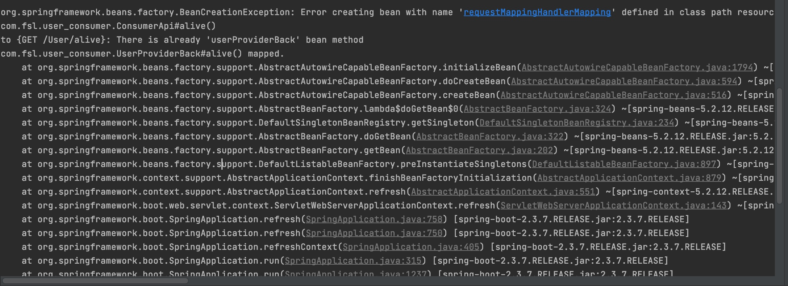

这是由于FeignClient上的@RequestMapping("/User")有关.当使用hystrix整合feign时候,不可再用@RequestMapping,把这个总路由放在每个方法上即可解决.

```java
@GetMapping("/User/getMap")
Map<Integer, String> getMap(@RequestParam("id") Integer id);
```


### 使用fallbackFactory检查具体错误

#### 更换fallback为fallbackFactory.

```java
@FeignClient(name = "user-provider",fallbackFactory = UserProviderBackFactory.class)
```

#### 实现类

实现FallbackFactory,然后传一个需要被处理泛型进去.只有一个create方法需要被实现.这个方法吧错误传了回来.

new一个需要被处理的接口对象,分别处理每个方法,每个方法的每个错误类型.

```java
package com.fsl.user_consumer;

import com.fsl.user_api.Person;
import feign.hystrix.FallbackFactory;
import org.springframework.stereotype.Component;
import org.springframework.web.client.HttpServerErrorException;

import java.util.Map;

@Component
public class UserProviderBackFactory implements FallbackFactory<ConsumerApi> {
    @Override
    public ConsumerApi create(Throwable cause) {
        return new ConsumerApi() {
            @Override
            public Map<Integer, String> getMap(Integer id) {
                return null;
            }

            @Override
            public Map<Integer, String> getMap2(Integer id, String name) {
                return null;
            }

            @Override
            public Map<Integer, String> getMap3(Map<String, Object> map) {
                return null;
            }

            @Override
            public Map<Integer, String> postMap(Map<String, Object> map) {
                return null;
            }

            @Override
            public String alive() {
                System.out.println(cause);
                //这里可以consumer和provider各自定义一套错误信息.由provider先catch住.返回错误代码,然后consumer这边 Instance 一下.这样更友好.
                if(cause instanceof HttpServerErrorException.InternalServerError) {
                    System.out.println("InternalServerError");
                    return "远程服务报错";
                }else if(cause instanceof RuntimeException) {
                    //服务没启动就属于这类异常
                    return "请求时异常：" + cause;
                }else {
                    //自己throw new Exception
                    return "都算不上";
                }
            }

            @Override
            public String getById(Integer id) {
                return null;
            }

            @Override
            public Person postPserson(Person person) {
                return null;
            }
        };
    }
}

```

#### 针对不同异常返回响应

```java
@Override
public String alive() {
  System.out.println(cause);
  //这里可以consumer和provider各自定义一套错误信息.由provider先catch住.返回错误代码,然后consumer这边 Instance 一下.这样更友好.
  if(cause instanceof HttpServerErrorException.InternalServerError) {
    System.out.println("InternalServerError");
    return "远程服务报错";
  }else if(cause instanceof RuntimeException) {
    //服务没启动就属于这类异常
    return "请求时异常：" + cause;
  }else {
    //自己throw new Exception
    return "都算不上";
  }
}
```

### 信号量隔离与线程隔离

[为什么大厂服务并发高却很稳定？分布式服务熔断降级限流利器至Hystrix](https://blog.csdn.net/kxkxyzyz/article/details/116175508)

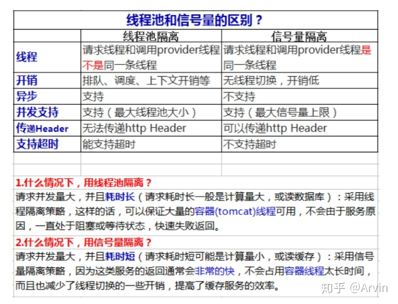

默认情况下hystrix使用线程池控制请求隔离

线程池隔离技术，是用 Hystrix 自己的线程去执行调用；而信号量隔离技术，是直接让 tomcat 线程去调用依赖服务。信号量隔离，只是一道关卡，信号量有多少，就允许多少个 tomcat 线程通过它，然后去执行。

信号量隔离主要维护的是Tomcat的线程，不需要内部线程池，更加轻量级。

配置

```
hystrix.command.default.execution.isolation.strategy 隔离策略，默认是Thread, 可选Thread｜Semaphore
thread 通过线程数量来限制并发请求数，可以提供额外的保护，但有一定的延迟。一般用于网络调用
semaphore 通过semaphore count来限制并发请求数，适用于无网络的高并发请求
hystrix.command.default.execution.isolation.thread.timeoutInMilliseconds 命令执行超时时间，默认1000ms
hystrix.command.default.execution.timeout.enabled 执行是否启用超时，默认启用true
hystrix.command.default.execution.isolation.thread.interruptOnTimeout 发生超时是是否中断，默认true
hystrix.command.default.execution.isolation.semaphore.maxConcurrentRequests 最大并发请求数，默认10，该参数当使用ExecutionIsolationStrategy.SEMAPHORE策略时才有效。如果达到最大并发请求数，请求会被拒绝。理论上选择semaphore size的原则和选择thread size一致，但选用semaphore时每次执行的单元要比较小且执行速度快（ms级别），否则的话应该用thread。
semaphore应该占整个容器（tomcat）的线程池的一小部分。
```

#### Feign下配置

```properties
hystrix.command.default.execution.isolation.strategy=SEMAPHORE
```

### 开启dashboard

启动类

```java
@EnableHystrixDashboard
```

引入依赖

```xml
<dependency>
  <groupId>org.springframework.cloud</groupId>
  <artifactId>spring-cloud-starter-netflix-hystrix-dashboard</artifactId>
</dependency>

<dependency>
  <groupId>org.springframework.boot</groupId>
  <artifactId>spring-boot-starter-actuator</artifactId>
</dependency>
```

健康上报

http://localhost:90/actuator/hystrix.stream

发现没有莫慌,因为需要打开这个端点

```properties
#开启所有端点
management.endpoints.web.exposure.include=*
```

图形化

http://localhost:90/hystrix


111