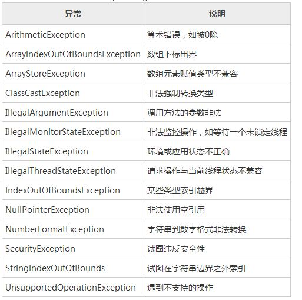
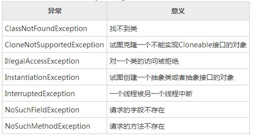

# Execption-异常相关

## java中异常抛出后代码还会继续执行吗?

```java
public void test(int i, int size){
    if(i >= size) {
        throw new RuntimeException("超出最大值."); 
        //return;  //需要吗？
    }
    ....
}
```

为了回答这个问题，我编写了几段代码测试了一下，结果如下：

```java
//代码1
public static void test() throws Exception  {

    throw new RuntimeException("参数越界"); 
    System.out.println("异常后"); //编译错误，「无法访问的语句」
}
```

```java
//代码2
try{
    throw new RuntimeException("参数越界"); 
}catch(Exception e) {
    e.printStackTrace();
}
System.out.println("异常后");//可以执行
```

```java
//代码3
if(true) {
    throw new Exception("参数越界"); 
}
System.out.println("异常后"); //抛出异常，不会执行
```

总结：

1.  若一段代码前有异常抛出，并且这个异常没有被捕获，这段代码将产生编译时错误「无法访问的语句」。如代码1
2.  若一段代码前有异常抛出，并且这个异常被try...catch所捕获，若此时catch语句中没有抛出新的异常，则这段代码能够被执行，否则，同第1条。如代码2
3.  若在一个条件语句中抛出异常，则程序能被编译，但后面的语句不会被执行。如代码3

另外总结一下运行时异常与非运行时异常的区别：

- 运行时异常是RuntimeException类及其子类的异常，是非受检异常，如NullPointerException、IndexOutOfBoundsException等。由于这类异常要么是系统异常，无法处理，如网络问题；
   要么是程序逻辑错误，如空指针异常；JVM必须停止运行以改正这种错误，所以运行时异常可以不进行处理（捕获或向上抛出，当然也可以处理），而由JVM自行处理。Java Runtime会自动catch到程序throw的RuntimeException，然后停止线程，打印异常。
- 非运行时异常是RuntimeException以外的异常，类型上都属于Exception类及其子类，是受检异常。非运行时异常必须进行处理（捕获或向上抛出），如果不处理，程序将出现编译错误。一般情况下，API中写了throws的Exception都不是RuntimeException。

常见运行时异常：



常见的非运行时异常:

