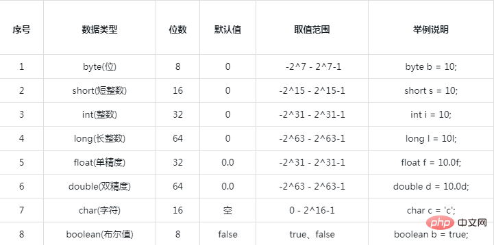

# java基础

## 一.bit与byte

一个bit是一个0或1，中文叫做一个二进制位。一个byte是8个bit，中文名称叫一个字节。

### byte和bit是什么：

byte是字节的意思，字节是计算机存储容量的基本单位，一个字节由8位二进制数组成。在计算机内部，一个字节可以表示一个数据，也可以表示一个英文字母，两个字节可以表示一个汉字。

bit是位的意思，位是计算机中存储数据的最小单位，指二进制数中的一个位数，其值为“0”或“1”。

## 二.java基本数据类型



```java 
class Test {

    static byte b;
  
    static short s;

    static int i;

    static long l;

    static float f;

    static double d;

    static char c;

    static boolean bo;

 

    public static void main(String[] args) {

 

      System.out.println("byte的大小："+Byte.SIZE

              +";默认值："+b

              +";数据范围："+Byte.MIN_VALUE+" - "+Byte.MAX_VALUE);

 

      System.out.println("short的大小："+Short.SIZE

              +";默认值："+s

              +";数据范围："+Short.MIN_VALUE+" - "+Short.MAX_VALUE);

 

      System.out.println("int的大小："+Integer.SIZE

              +";默认值："+i

              +";数据范围："+Integer.MIN_VALUE+" - "+Integer.MAX_VALUE);

 

      System.out.println("long的大小："+Long.SIZE

              +";默认值："+l

              +";数据范围："+Long.MIN_VALUE+" - "+Long.MAX_VALUE);

 

      System.out.println("float的大小："+Float.SIZE

              +";默认值："+f

              +";数据范围："+Float.MIN_VALUE+" - "+Float.MAX_VALUE);

 

      System.out.println("double的大小："+Double.SIZE

              +";默认值："+d

              +";数据范围："+Double.MIN_VALUE+" - "+Double.MAX_VALUE);

 

      System.out.println("char的大小："+Character.SIZE

              +";默认值："+c

              +";数据范围："+Character.MIN_VALUE+" - "+Character.MAX_VALUE);

 

      System.out.println("boolean的大小："+Byte.SIZE

              +";默认值："+bo

              +";数据范围："+Byte.MIN_VALUE+" - "+Byte.MAX_VALUE);

 

    }

}
```

## 三.java泛型

### 0.**什么是泛型？**

**泛型，即“参数化类型”。一提到参数，最熟悉的就是定义方法时有形参，然后调用此方法时传递实参。那么参数化类型怎么理解呢？顾名思义，就是将类型由原来的具体的类型参数化，类似于方法中的变量参数，此时类型也定义成参数形式（可以称之为类型形参），然后在使用/调用时传入具体的类型（类型实参）。**

**有什么办法可以使集合能够记住集合内元素各类型，且能够达到只要编译时不出现问题，运行时就不会出现“java.lang.ClassCastException”异常呢？答案就是使用泛型。**

### 1.理解泛型

```java
public class GenericTest {
    public static void main(String[] args) {
        /*
        List list = new ArrayList();
        list.add("qqyumidi");
        list.add("corn");
        list.add(100);
        */

        List<String> list = new ArrayList<String>();
        list.add("qqyumidi");
        list.add("corn");
        //list.add(100);   // 1  提示编译错误

        for (int i = 0; i < list.size(); i++) {
            String name = list.get(i); // 2
            System.out.println("name:" + name);
        }
    }
}
```

采用泛型写法后，在//1处想加入一个Integer类型的对象时会出现编译错误，通过`List<String>`，直接限定了list集合中只能含有String类型的元素，从而在//2处无须进行强制类型转换，因为此时，集合能够记住元素的类型信息，编译器已经能够确认它是String类型了。

结合上面的泛型定义，我们知道在`List<String>`中，String是类型实参，也就是说，相应的List接口中肯定含有类型形参。且get()方法的返回结果也直接是此形参类型（也就是对应的传入的类型实参）。下面就来看看List接口的的具体定义：

```java
package java.util;

import java.util.function.UnaryOperator;

public interface List<E> extends Collection<E> {
    // Query Operations

    /**
     * Returns the number of elements in this list.  If this list contains
     * more than <tt>Integer.MAX_VALUE</tt> elements, returns
     * <tt>Integer.MAX_VALUE</tt>.
     *
     * @return the number of elements in this list
     */
    int size();

    /**
     * Returns <tt>true</tt> if this list contains no elements.
     *
     * @return <tt>true</tt> if this list contains no elements
     */
    boolean isEmpty();

    /**
     * Returns <tt>true</tt> if this list contains the specified element.
     * More formally, returns <tt>true</tt> if and only if this list contains
     * at least one element <tt>e</tt> such that
     * <tt>(o==null&nbsp;?&nbsp;e==null&nbsp;:&nbsp;o.equals(e))</tt>.
     *
     * @param o element whose presence in this list is to be tested
     * @return <tt>true</tt> if this list contains the specified element
     * @throws ClassCastException if the type of the specified element
     *         is incompatible with this list
     * (<a href="Collection.html#optional-restrictions">optional</a>)
     * @throws NullPointerException if the specified element is null and this
     *         list does not permit null elements
     * (<a href="Collection.html#optional-restrictions">optional</a>)
     */
    boolean contains(Object o);

    /**
     * Returns an iterator over the elements in this list in proper sequence.
     *
     * @return an iterator over the elements in this list in proper sequence
     */
    Iterator<E> iterator();
		/////////省略大部分////////////////////////////////////////////////////////////////////
}

```

我们可以看到，在List接口中采用泛型化定义之后，`<E>`中的E表示类型形参，可以接收具体的类型实参，并且此接口定义中，凡是出现E的地方均表示相同的接受自外部的类型实参。

自然的，ArrayList作为List接口的实现类，其定义形式是：

```java
public class ArrayList<E> extends AbstractList<E>
        implements List<E>, RandomAccess, Cloneable, java.io.Serializable {
    public boolean add(E e) {
        ensureCapacityInternal(size + 1);  // Increments modCount!!
        elementData[size++] = e;
        return true;
    }
    public E get(int index) {
        rangeCheck(index);
        checkForComodification();
        return ArrayList.this.elementData(offset + index);
    }
    //...省略掉其他具体的定义过程
}
```

由此，我们从源代码角度明白了为什么//1处加入Integer类型对象编译错误，且//2处get()到的类型直接就是String类型了。

### 2.类泛型,接口泛型,方法泛型

```java
public class GenericTest {

    public static void main(String[] args) {
        Box<String> name = new Box<String>("corn");
        System.out.println("name:" + name.getData());
    }
}

class Box<T> {

    private T data;

    public Box() {

    }

    public Box(T data) {
        this.data = data;
    }

    public T getData() {
        return data;
    }

}
```

在泛型接口、泛型类和泛型方法的定义过程中，我们常见的如T、E、K、V等形式的参数常用于表示泛型形参，由于接收来自外部使用时候传入的类型实参。**那么对于不同传入的类型实参，生成的相应对象实例的类型是不是一样的呢？**

```java
public class GenericTest {

    public static void main(String[] args) {
        Box<String> name = new Box<String>("corn");
        Box<Integer> age = new Box<Integer>(712);

        System.out.println("name class:" + name.getClass()); 
        System.out.println("age class:" + age.getClass());       
        System.out.println(name.getClass() == age.getClass());    // true
    }

}
```

由此，我们发现，在使用泛型类时，虽然传入了不同的泛型实参，但并没有真正意义上生成不同的类型，传入不同泛型实参的泛型类在内存上只有一个，即还是原来的最基本的类型（本实例中为Box），当然，在逻辑上我们可以理解成多个不同的泛型类型。

究其原因，在于Java中的泛型这一概念提出的目的，导致其只是作用于代码编译阶段，在编译过程中，对于正确检验泛型结果后，会将泛型的相关信息擦出，也就是说，成功编译过后的class文件中是不包含任何泛型信息的。泛型信息不会进入到运行时阶段。

**对此总结成一句话：泛型类型在逻辑上看以看成是多个不同的类型，实际上都是相同的基本类型。**

### 3.类型通配符

接着上面的结论，我们知道，`Box<Number>`和`Box<Integer>`实际上都是Box类型，现在需要继续探讨一个问题，那么在逻辑上，类似于`Box<Number>`和`Box<Integer>`是否可以看成具有父子关系的泛型类型呢？

为了弄清这个问题，我们继续看下下面这个例子:

```java
public class GenericTest {

    public static void main(String[] args) {

        Box<Number> name = new Box<Number>(99);
        Box<Integer> age = new Box<Integer>(712);

        getData(name);

        //The method getData(Box<Number>) in the type GenericTest is
        //not applicable for the arguments (Box<Integer>)
        getData(age);   // 1

    }

    public static void getData(Box<Number> data){
        System.out.println("data :" + data.getData());
    }

}
```

我们发现，在代码//1处出现了错误提示信息：`The method  getData(Box<Number>) in the type GenericTest is not applicable  for the arguments  (Box<Integer>)`。显然，通过提示信息，我们知道`Box<Number>`在逻辑上不能视为`Box<Integer>`的父类。那么，原因何在呢？

```java
public class GenericTest {

    public static void main(String[] args) {

        Box<Integer> a = new Box<Integer>(712);
        Box<Number> b = a;  // 1
        Box<Float> f = new Box<Float>(3.14f);
        b.setData(f);        // 2

    }

    public static void getData(Box<Number> data) {
        System.out.println("data :" + data.getData());
    }

}

class Box<T> {

    private T data;

    public Box() {

    }

    public Box(T data) {
        setData(data);
    }

    public T getData() {
        return data;
    }

    public void setData(T data) {
        this.data = data;
    }

}
```

这个例子中，显然//1和//2处肯定会出现错误提示的。在此我们可以使用反证法来进行说明。

假设`Box<Number>`在逻辑上可以视为`Box<Integer>`的父类，那么//1和//2处将不会有错误提示了，那么问题就出来了，通过getData()方法取出数据时到底是什么类型呢？Integer? Float?  还是Number？且由于在编程过程中的顺序不可控性，导致在必要的时候必须要进行类型判断，且进行强制类型转换。显然，这与泛型的理念矛盾，因此，**在逻辑上`Box<Number>`不能视为`Box<Integer>`的父类。**

好，那我们回过头来继续看“类型通配符”中的第一个例子，我们知道其具体的错误提示的深层次原因了。那么如何解决呢？总不能再定义一个新的函数吧。这和Java中的多态理念显然是违背的，因此，我们需要一个在逻辑上可以用来表示同时是`Box<Integer>`和`Box<Number>`的父类的一个引用类型，由此，类型通配符应运而生。

**类型通配符一般是使用 ? 代替具体的类型实参。注意了，此处是类型实参，而不是类型形参！且`Box<?>`在逻辑上是`Box<Integer>`、`Box<Number>`...等所有`Box<具体类型实参>`的父类。由此，我们依然可以定义泛型方法，来完成此类需求。**

```java
public class GenericTest {

    public static void main(String[] args) {

        Box<String> name = new Box<String>("corn");
        Box<Integer> age = new Box<Integer>(712);
        Box<Number> number = new Box<Number>(314);

        getData(name);
        getData(age);
        getData(number);
    }

    public static void getData(Box<?> data) {
        System.out.println("data :" + data.getData());
    }

}
```

有时候，我们还可能听到**类型通配符上限和类型通配符下限**。具体有是怎么样的呢？

在上面的例子中，如果需要定义一个功能类似于getData()的方法，但对类型实参又有进一步的限制：只能是Number类及其子类。此时，需要用到类型通配符上限。

```java
public class GenericTest {

    public static void main(String[] args) {

        Box<String> name = new Box<String>("corn");
        Box<Integer> age = new Box<Integer>(712);
        Box<Number> number = new Box<Number>(314);

        getData(name);
        getData(age);
        getData(number);

        //getUpperNumberData(name); // 1
        getUpperNumberData(age);    // 2
        getUpperNumberData(number); // 3
    }

    public static void getData(Box<?> data) {
        System.out.println("data :" + data.getData());
    }

    public static void getUpperNumberData(Box<? extends Number> data){
        System.out.println("data :" + data.getData());
    }

}
```

此时，显然，在代码//1处调用将出现错误提示，而//2 //3处调用正常。

类型通配符上限通过形如`Box<? extends Number>`形式定义，相对应的，类型通配符下限为`Box<? super Number>`形式，其含义为仅Number及他的父类才可以.

### 4.通配符实际使用示例

```java
package genericity;

import java.util.ArrayList;
import java.util.List;

import org.junit.Test;

public class Demo2 {

    @Test
    public void fun1(){//集合和数组的较量
        /*
         * 第一次较量
         * 数组：我可以创建一个什么都可以存在的10空间
         * 集合：我可以创建一个什么都放而且无限的空间
         */
        Object[] arr1 = new Object[10];
        List list1 = new ArrayList();

        /*
         * 第二次较量
         * 数组：我可以创建一个只存放String类型的10空间
         * 集合:在以前我不行，不过现在我也可以，我可以创建一个只存放String类型的无限空间。
         */
        String[] arr2 = new String[10];
        List<String> list2 = new ArrayList<String>();

        /*
         * 第三次较量
         * 数组：我可以使用Object[]来存在String[],但是arr3[0] = new Integer(100);//编程不报错，运行报：ArrayStoreException
         * 集合：因为泛型的擦除，直接不给我编译通过 List<Object> list3 = new ArrayList<String>()
         */
        Object[] arr3 = new String[10];
        arr3[0] = new Integer(100);//编程不报错，运行报：ArrayStoreException

//        List<Object> list3 = new ArrayList<String>();
          /**
           * 上面的代码报错，因为泛型只有编译器认识，而JVM对泛型根本不识别，泛型会在
           * 运行时擦除，如果上面代码不报错，而且运行时泛型又会擦除，那么就好出现下面的笑话
           * list.add(new Integer(100)),那么数组就好笑话集合，你什么东西都能放，
           * 还有什么限制，笑话。
           *
           * 然后我们把这个问题放大，对一个打印集合里面数据的方法，
           */
    }

    public void fun2(){
        List<Integer> intList = new ArrayList<Integer>();

        List<String> strList = new ArrayList<String>();
//        print1(intList);//直接报错，原因和上面的一样，因为有一个实参向形参赋值的过程，编译器直接不让通过 List<Object> list= intList=new ArrayList<Integer>();
        //思考：那每个不同类型的集合都需要不同的打印方法，那方法是也太多了，所以就有了通配符的出现

        //这样就可以使用通用的打印方法了
        print2(intList);
        print2(strList);
    }

    public void print1(List<Object> list){

    }

    /**
     * 这里的?就是通配符
     * @param list
     */
    public void print2(List<?> list){
        /*
         * 思考：虽然都可以调用了，但是却带来了一些参数使用上面的限制
         */
//        list.add(new Integer(100));//报错，因为并不知道传递进来的到底是上面，如果是String,那编程通过就笑话了，add()作废
        Object obj = list.get(0);//其实这个参数可以使用的原因是因为Object为所有类的父类，不让这个get()方法也作废

        /*
         * 小结:
         *      1、当使用通配符时,对泛型类中的参数为泛型的方法起到了副作用，不能再使用！
         *      2、当使用通配符时，泛型类中返回值为泛型的方法，也作废了！
         * 通配符的好处：可以使泛型类型更加通用！尤其是在方法调用时形参使用通配符！
         */
    }

    public void fun3(){
        List<Integer> intList = new ArrayList<Integer>();
        List<Long> longList = new ArrayList<Long>();
        print3(intList);
        print3(longList);
    }

    /**
     * 子类统配，必须是Number及Number的子类才可以传参
     * 这样的缺点是：降低了参数的灵活性，但是关闭一扇大门就会打开一扇大门
     * 因为所有累都是Number的子类，所有返回值可以使用Number来接受，get()方法获得解放，即返回值为泛型的方法可以使用了
     * @param list
     */
    public void print3(List<? extends Number> list){
        Number nu = list.get(0);//正确
//        list.add(new Integer(100));//但add()方法还是被废，以为不知道具体传入的哪一个子类，如果传入的是Long，加入Integer就笑话了
    }

    /**
     * 父类统配，只允许Integer传递参数
     * 这样的缺点是：降低了参数的灵活性，但是关闭一扇大门就会打开一扇大门
     * 好处是因为所有类都是Integer的父类，参数为泛型的所有方法都可以使用了
     * 但是相反的，返回值为泛型类型的方法就不能使用，因为子类不能接收父类的值
     * @param list
     */
    public void print4(List<? super Integer> list){
        list.add(new Integer(100));//正确
        /*
         * 但返回值为泛型的方法就不能使用了
         */
//        Integer nu = list.get(0);//报错
    }


}
```

