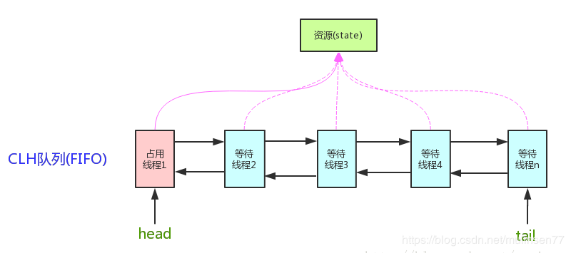

# JUC
## 一.线程
### 1.线程启动方式
 #### **1.继承Thread类**

``` java
class TestThread extends Thread {
    @Override
    public void run() {
        System.out.println("继承 Thread 方式");
    }
}

new TestThread().start();

```
#### **2.实现Runable接口**

``` java
class TestRunnable implements Runnable {
    @Override
    public void run() {
        System.out.println("实现 Runnable 接口方式");
    }
}

new Thread(new TestRunnable()).start();
```

#### **3.lambda启动线程**

``` java
new Thread(()->{
  System.out.println("lambda 启动");
}).start();
```

#### **4.线程池启动**

``` java
Executors.newCachedThreadPool().submit(()->{
  System.out.println("使用 线程池 方式的线程开始执行......");
});
```


### 2.线程基本方法

#### **1.Thread.sleep(1000)**

线程睡1000毫秒,注意:**处于阻塞状态,不会释放锁**  
1. 进入WAITING状态.  
2.不会占用cpu资源.  
3.不释放锁.  
4.响应中断抛出interrupted异常.    

#### 2.Thread.yeild()

让出一下cpu,让出后,此线程由执行状态进入到就绪状态,下一个得到调度的可能是别的线程,**也可能再次轮到它自己执行**

**只会让给同优先级或更高优先级的线程**

#### **3.线程对象.join()**

进入阻塞状态,让指定的线程开始执行,等到指定的线程执行完毕后,继续执行.

### 3.线程状态


#### 1. 新建状态

建立一个线程对象后，该线程对象就处于新建状态。它保持这个状态直到程序 start() 这个线程。

#### 2. 就绪状态

当线程对象调用了start()方法之后，该线程就进入就绪状态。就绪状态的线程处于就绪队列中，要等待JVM里线程调度器的调度。

#### 3. 运行状态

如果就绪状态的线程获取 CPU 资源，就可以执行 run()，此时线程便处于运行状态。处于运行状态的线程最为复杂，它可以变为阻塞状态、就绪状态和死亡状态。

#### 4. 阻塞状态

如果一个线程执行了sleep（睡眠）、suspend（挂起）等方法，失去所占用资源之后，该线程就从运行状态进入阻塞状态。在睡眠时间已到或获得设备资源后可以重新进入就绪状态。可以分为三种：

1. 等待阻塞：运行状态中的线程执行 wait() 方法，使线程进入到等待阻塞状态。
2. 同步阻塞：线程在获取 synchronized 同步锁失败(因为同步锁被其他线程占用)。
3. 其他阻塞：通过调用线程的 sleep() 或 join() 发出了 I/O请求时，线程就会进入到阻塞状态。当sleep() 状态超时，join() 等待线程终止或超时，或者 I/O 处理完毕，线程重新转入就绪状态。

#### 5. 死亡状态

1.一个运行状态的线程完成任务或者其他终止条件发生时，该线程就切换到终止状态。
2.目前已经不建议强制终止线程,应该让他自己走完.

### 4.线程挂起

> 挂起:线程因为某些原因,cpu不会分配时间片来执行他们.
> 可以通过某些方法重新唤醒挂起的线程,使之可以继续运行.

#### 产生线程挂起的几种原因

#### 1.sleep()：不推荐使用

通过调用sleep()方法使线程进入休眠状态，线程在指定时间内不会运行，当时间到了之后，依然会继续运行。

> 这里必须说明一下的是sleep方法，虽然它也能将线程挂起，但是它会产生`InterruptedException`异常，当sleep一定时间后它将会自动执行后面的方法，也可以通过interrupt方法进行主动打断sleep方法进行线程唤醒。

#### 2.join():不推荐

如果t2线程在t1线程上使用了t2.join方法(),那么t1将会被挂起,直到t2执行完毕为止.

#### ~~3.suspend():挂起  resume():唤醒; 此方法已经废弃~~

#### 4.wait()

这个是Java中常用的线程挂起方法，当调用wait方法的时候线程会**自动的释放掉占有的线程资源锁**，然后通过notify或notifyAll方法进行wait方法的唤醒，因此在这个地方不会出现死锁。

1.wait(),notify()必须在同步方法中,防止永久等待和死锁,线程更安全.

#### 5. park/unpark：推荐使用

park的字面量意思是指停车场的意思，使用park来挂起线程后需要调用unpark来进行唤醒，这个没有先后顺序的区分，如果你提前进行了unpark，然后在进行park也是可以的，但是提前了的 多个unpark 只能看做是一个unpark，不能进行重复叠加，如果再次park的话需要新的unpark来进行唤醒操作，这个比如你在停车场进行停车操作，你如果提前进行了预约停车，你在未进入停车场之前都是可以进行多次预约的，这所有的预约只扣一次钱(unpark)，但是这所有的预约操作都看作是你这一次进入停车场停车(park)的凭证，如果你离开了通过缴费凭证(unpark)一旦你想进行下一次停车，那么已经使用过的预约都不能进行作数了，你只能再次预约或者直接进入停车场，一旦要离开只能再次缴费(unpark)。

> 调用`park/unpark`使用的是`LockSupport.park()/LockSupport.unpark()。`
> 使用`park/unpark`使用synchronized关键字也会出现死锁的情况，因为它并不释放线程所占用的锁资源，所以使用的时候也需要注意。

## 二.锁

### 1. synchronized

> **锁住对象,而不是代码.**
>
> 只有得到锁的对象,才能执行synchronized的代码.多线程下.保持同步.

#### 简单使用  

修饰的对象有以下几种：

1. 修饰一个代码块，被修饰的代码块称为同步语句块，其作用的范围是大括号{}括起来的代码，作用的对象是调用这个代码块的对象
2. 修饰一个方法，被修饰的方法称为同步方法，其作用的范围是整个方法，作用的对象是调用这个方法的对象
3. 修饰一个静态的方法，其作用的范围是整个静态方法，作用的对象是这个类的所有对象
4. 修饰一个类，其作用的范围是synchronized后面括号括起来的部分.  

``` java
//以下两种是相同的作用范围
//用在静态方法上,锁的就是当前的Class类,无论多少个线程访问他,只有一个得到锁的可以执行代码.
public class T_static_test01 {
  public static void exe1{
    synchronized(T_static_test.class) {

    }
  }
  
  public synchronized static void exe2{
    
  } 
}
```

``` java
//以下两种是相同的作用范围
//synchronized(this),代表当前实例,锁住了对象的实例,某个线程使用这个实例的时候,别的线程需要等待锁.🔐
public class T_static_test02 {
  public void exe1{
    synchronized(this) {

    }
  }
  
  public synchronized void exe2{
    
  } 
}
```

``` java
//创建一个锁(对象),某个线程得到这个锁可以执行.
public class T_static_test03 {
  //创建的锁,不要是基础数据类型(int,string,long等等),就创建一个对象.因为有独有的内存地址.
  private lockObj = new Object;
  public void exe1{
    synchronized(lockObj) {
			//得到这个"lockObj"锁的线程可以执行这段代码.
    }
  }
}
```

#### 2.锁的特点

1. 既能保证原子性，又能保证可见性
2. 不能保证指令重排序，所以某些场景需要结合 volatile 使用
3. 在执行同步方法的时候，可以调用非同步方法
4. 写加锁，读不加锁，会产生脏读。
5. 可重入锁：在执行同步方法的时候，可以调用其他的同步方法（两个方法的锁必须是一把锁）
6. 程序中如果出现异常，一般情况下，锁将会被释放（没有进行异常的捕捉及处理时）
7. <font color=red >**要锁的对象不能用 String 和 Integer、Long等基础数据类型**</font>

#### 3.锁升级

> synchronized 在早期是重量级锁,依赖os.
>
> 现在是轻量级锁,(1.5以后),有升级的概念.**1.无锁 → 2.偏向锁 → 3.自旋锁(轻量) → 4.os锁(重量级)**


#### 什么时候用CAS,什么时候用锁呢.

CAS:CompareAndSet,不加锁,一直占用cpu,判断是否可以执行,  
使用场景  :

> 1. 线程数量比较少.  
> 2. **并且**线程执行的代码块执行速度快.

锁:不占用Cpu,线程任务排在队列中,但是线程切换需要消耗较大资源.  
使用场景:

> 1. 线程数量较多,
> 2. **或者**代码执行速度较慢.

### 2. ReentrantLock：可重入锁

```java
public class ReentrantLockTest {
    Lock lock = new ReentrantLock();
    void m1() {
        try {
            lock.lock();
            for(int i=0; i<10; i++) {
                try {
                    TimeUnit.SECONDS.sleep(1);
                } catch (InterruptedException e) {
                    e.printStackTrace();
                }
                System.out.println(i);
                if(i == 2) m2();
            }
        }finally {
            lock.unlock();
        }
    }
    void m2() {
        try {
            lock.lock();
            System.out.println("m2 ...");
        }finally {
            lock.unlock();
        }
    }
    public static void main(String[] args) {
        ReentrantLockTest reentrantLockTest = new ReentrantLockTest();
        new Thread(reentrantLockTest::m1).start();
        try {
            TimeUnit.SECONDS.sleep(1);
        } catch (InterruptedException e) {
            e.printStackTrace();
        }
    }
}
```

#### 相比synchronized更好的API

1. 尝试获取锁  
   `lock.tryLock()`
   使用tryLock进行尝试锁定，不管锁定与否，方法都将继续执行 可以根据tryLock的返回值来判定是否锁定 也可以指定tryLock的时间，由于tryLock(time)抛出异常，所以要注意unclock的处理，必须放到finally中.

2. 可以被打断

   `lock.lockInterruptibly`

   如果当前线程未被中断，则可以获取锁，如果已被中断则会排除 InterruptedException 异常。但是使用lock.lock()时，当前线程被中断，不会报错。打断线程的方法：线程对象.interrupt().

3. 可以指定为公平锁.(默认为非公平锁)

   ```java
   // 指定为公平锁
   Lock lock1 = new ReentrantLock(true);
   // 指定为非公平锁
   Lock lock2 = new ReentrantLock(false);
   // 默认为非公平锁
   Lock lock3 = new ReentrantLock();
   ```

   > 公平锁:每次都是从队列首取任务执行,严格按照线程启动顺序执行,不允许插队的情况.
   > 非公平锁:不管排队时间,所有线程随机获得锁.(等待锁过程中,来了任何新的线程,都是有很大可能直接获取到锁,允许插队).

   实现原理:

   1. 公平锁:

      首先判断当前AQS的state是否等于0，锁是否被占用，如果没有被占用的话，继续判断队列中是否有排在前面的线程在等待锁，没有的话就修改statte状态；然后将当前线程记录为独占锁的线程，继续判断当前线程是否为独断锁的线程，ReentrantLock是可重入的，线程可以不停地Lock来增加state的值，对应的需要unlock来解锁，减少state的值， 如果上面的条件判断失败，即获取锁失败，则将线程加入到等待线程队列队尾，然后阻塞线程，等待被唤醒。

   2. 非公平锁:

      非公平锁逻辑基本跟公平锁一致，最本质的区别是，当前的锁状态没有被占用时，当前线程可以直接占用，而不需要判断当前队列中是否有等待线程。

ReentrantLock默认使用非公平锁是基于性能考虑，公平锁为了保证线程规规矩矩地排队，需要增加阻塞和唤醒的时间开销。如果直接插队获取非公平锁，跳过了对队列的处理，速度会更快。

### 3. [CountDownLatch](https://www.cnblogs.com/Lee_xy_z/p/10470181.html)：倒数计时器

<font color=red >**CountDownLatch是一个计数器，线程完成一个记录一个，计数器递减，只能只用一次**</font>

**CountDownLatch概念**

CountDownLatch是一个同步工具类，用来协调多个线程之间的同步，或者说起到线程之间的通信（而不是用作互斥的作用）。

CountDownLatch能够使一个线程在等待另外一些线程完成各自工作之后，再继续执行。使用一个计数器进行实现。计数器初始值为线程的数量。当每一个线程完成自己任务后，计数器的值就会减一。当计数器的值为0时，表示所有的线程都已经完成一些任务，然后在CountDownLatch上等待的线程就可以恢复执行接下来的任务。

**CountDownLatch的用法**

1. 某一线程在开始运行前等待n个线程执行完毕。将CountDownLatch的计数器初始化为new  CountDownLatch(n)，每当一个任务线程执行完毕，就将计数器减1  countdownLatch.countDown()，当计数器的值变为0时，在CountDownLatch上await()的线程就会被唤醒。一个典型应用场景就是启动一个服务时，主线程需要等待多个组件加载完毕，之后再继续执行。

2. 实现多个线程开始执行任务的最大并行性。注意是并行性，不是并发，强调的是多个线程在某一时刻同时开始执行。类似于赛跑，将多个线程放到起点，等待发令枪响，然后同时开跑。做法是初始化一个共享的CountDownLatch(1)，将其计算器初始化为1，多个线程在开始执行任务前首先countdownlatch.await()，当主线程调用countDown()时，计数器变为0，多个线程同时被唤醒。

**CountDownLatch的不足**

CountDownLatch是一次性的，计算器的值只能在构造方法中初始化一次，之后没有任何机制再次对其设置值，当CountDownLatch使用完毕后，它不能再次被使用。

```java
public class CountDownLatchTest {
    public static void main(String[] args) {
        usingCountDownLatch();
    }
    private static void usingCountDownLatch() {
        Thread[] threads = new Thread[100];
        CountDownLatch latch = new CountDownLatch(threads.length);
        for (int i = 0; i < threads.length; i++) {
            threads[i] = new Thread(() -> {
                int result = 0;
                for (int j = 0; j < 10000; j++) 
                  result += j;
                latch.countDown();
            });
        }
        for (int i = 0; i < threads.length; i++) {
            threads[i].start();
        }
        try {
            latch.await();
        } catch (InterruptedException e) {
            e.printStackTrace();
        }
        System.out.println("end latch");
    }
}
```

`latch.countDown();`
将count值减1（原子性操作）。

`latch.await();`
调用await()方法的线程会被挂起，它会等待直到count值为0才继续执行。

`latch.await(long timeout, TimeUnit unit)`
和await()类似，只不过等待一定的时间后count值还没变为0的话就会继续执行。

### 4.CyclicBarrier：循环栅栏

<font color=red >**所有线程都完成某个步骤后,才继续执行**</font>

举个例子，就像生活中我们会约朋友们到某个餐厅一起吃饭，有些朋友可能会早到，有些朋友可能会晚到，但是这个餐厅规定必须等到所有人到齐之后才会让我们进去。这里的朋友们就是各个线程，餐厅就是 CyclicBarrier。

[深入理解：CyclicBarrier](https://blog.csdn.net/qq_39241239/article/details/87030142)

```java
public class CyclicBarrierTest {
    public static void main(String[] args) {
        // parties 是参与线程的个数
        // Runnable 参数，这个参数的意思是最后一个到达后，线程要做的任务
        CyclicBarrier barrier = new CyclicBarrier(20, () -> System.out.println("满人"));//每满20个执行一次.
        for(int i=0; i<100; i++) {
            new Thread(()->{
                try {
                    barrier.await();
                } catch (InterruptedException e) {
                    e.printStackTrace();
                } catch (BrokenBarrierException e) {
                    e.printStackTrace();
                }
            }).start();
        }
    }
}
```

`barrier.awaidt();`
线程调用 await() 表示自己已经到达栅栏

`barrier.await(long timeout, TimeUnit unit)`
和await()类似，只不过等待一定的时间后到达的线程个数少于指定的线程个数时也会继续执行。

### 5.Phaser：阶段栅栏的作用（1.7加入的）

>[深入理解Phaser](https://www.jianshu.com/p/e5794645ca8d)

```java
public class PhaserTest {
    MarriagePhaser phaser = new MarriagePhaser();
    public static void main(String[] args) {
        new PhaserTest().testPhaser();
    }
    private void testPhaser(){
        phaser.bulkRegister(5);
        for(int i=0; i<5; i++) {
            final int nameIndex = i;
            new Thread(()->{
                Person p = new Person("person " + nameIndex);
                p.arrive();
                phaser.arriveAndAwaitAdvance();

                p.eat();
                phaser.arriveAndAwaitAdvance();

                p.leave();
                phaser.arriveAndAwaitAdvance();
            }).start();
        }
    }
    class MarriagePhaser extends Phaser {
        @Override
        protected boolean onAdvance(int phase, int registeredParties) {
            switch (phase) {
                case 0:
                    System.out.println("所有人到齐了！");
                    return false;
                case 1:
                    System.out.println("所有人吃完了！");
                    return false;
                case 2:
                    System.out.println("所有人离开了！");
                    System.out.println("婚礼结束！");
                    return true;
                default:
                    return true;
            }
        }
    }
    class Person {
        String name;
        Random r = new Random();
        public Person(String name) {
            this.name = name;
        }
        public void arrive() {
            milliSleep(r.nextInt(1000));
            System.out.printf("%s 到达现场！\n", name);
        }
        public void eat() {
            milliSleep(r.nextInt(1000));
            System.out.printf("%s 吃完!\n", name);
        }
        public void leave() {
            milliSleep(r.nextInt(1000));
            System.out.printf("%s 离开！\n", name);
        }
        void milliSleep(int milli) {
            try {
                TimeUnit.MILLISECONDS.sleep(milli);
            } catch (InterruptedException e) {
                e.printStackTrace();
            }
        }
    }
}
```

```java
public class Phaser2Test {
    MarriagePhaser phaser = new MarriagePhaser();
    public static void main(String[] args) {
        new Phaser2Test().testPhaser();
    }
    private void testPhaser(){
        phaser.bulkRegister(7);
        for(int i=0; i<5; i++) {
            new Thread(new Person("p" + i)).start();
        }
        new Thread(new Person("新郎")).start();
        new Thread(new Person("新娘")).start();
    }
    class MarriagePhaser extends Phaser {
        @Override
        protected boolean onAdvance(int phase, int registeredParties) {
            switch (phase) {
                case 0:
                    System.out.println("所有人到齐了！" + registeredParties);
                    System.out.println();
                    return false;
                case 1:
                    System.out.println("所有人吃完了！" + registeredParties);
                    System.out.println();
                    return false;
                case 2:
                    System.out.println("所有人离开了！" + registeredParties);
                    System.out.println();
                    return false;
                case 3:
                    System.out.println("婚礼结束！新郎新娘抱抱！" + registeredParties);
                    return true;
                default:
                    return true;
            }
        }
    }
    class Person implements Runnable {
        String name;
        Random r = new Random();
        public Person(String name) {
            this.name = name;
        }
        public void arrive() {
            milliSleep(r.nextInt(1000));
            System.out.printf("%s 到达现场！\n", name);
            phaser.arriveAndAwaitAdvance();
        }
        public void eat() {
            milliSleep(r.nextInt(1000));
            System.out.printf("%s 吃完!\n", name);
            phaser.arriveAndAwaitAdvance();
        }
        public void leave() {
            milliSleep(r.nextInt(1000));
            System.out.printf("%s 离开！\n", name);
            phaser.arriveAndAwaitAdvance();
        }
        private void hug() {
            if(name.equals("新郎") || name.equals("新娘")) {
                milliSleep(r.nextInt(1000));
                System.out.printf("%s 洞房！\n", name);
                phaser.arriveAndAwaitAdvance();
            } else {
                phaser.arriveAndDeregister();
            }
        }
        void milliSleep(int milli) {
            try {
                TimeUnit.MILLISECONDS.sleep(milli);
            } catch (InterruptedException e) {
                e.printStackTrace();
            }
        }
        @Override
        public void run() {
            arrive();
            eat();
            leave();
            hug();
        }
    }
}
```

` arriveAndAwaitAdvance()`
到达并等待下个任务开始.

`arriveAndDeregister()`
到达就完成了.不参与下个任务.

`onAdvance()`
在Phaser类中，在每个线程中，每个线程完成一个阶段后都会等待其他线程完成后再一起进行，当所有线程都完成了一个任务的时候，会调用Phaser的onAdvance方法。  
如果我们想在每个阶段，所有线程都完成他们的阶段工作后做点啥事的话，那就得继承Phaser类来重写Onadvance这个方法来实现我们的目的


### 6.ReentrantReadWriteLock：读写锁

```java
public class ReentrantReadWriteLockTest {
    static Lock lock = new ReentrantLock();
    private static int value;
    static ReadWriteLock readWriteLock = new ReentrantReadWriteLock();
    static Lock readLock = readWriteLock.readLock();
    static Lock writeLock = readWriteLock.writeLock();
    public static void read(Lock lock) {
        try {
            lock.lock();
            Thread.sleep(1000);
            System.out.println("read over!");
            //模拟读取操作
        } catch (InterruptedException e) {
            e.printStackTrace();
        } finally {
            lock.unlock();
        }
    }
    public static void write(Lock lock, int v) {
        try {
            lock.lock();
            Thread.sleep(1000);
            value = v;
            System.out.println("write over!");
            //模拟写操作
        } catch (InterruptedException e) {
            e.printStackTrace();
        } finally {
            lock.unlock();
        }
    }
    public static void main(String[] args) {
        //Runnable readR = ()-> read(lock);
        Runnable readR = () -> read(readLock);
        //Runnable writeR = ()->write(lock, new Random().nextInt());
        Runnable writeR = () -> write(writeLock, new Random().nextInt());
        for (int i = 0; i < 18; i++) new Thread(readR).start();
        for (int i = 0; i < 2; i++) new Thread(writeR).start();
    }
}
```

**共享锁**  
当一个线程进行读取的时候，其他线程如果是读请求，则可以直接进行读取，如果是写锁，则需要等待所有的读请求完成之后，才允许写.

**排他锁**  
当一个线程写操作是,其他线程无论是读还是写,都讲阻塞,等待写线程完成后,才允许其他线程进行读写操作.

### 7.Semaphore：信号灯（限流、收费站）

```java
public class SemaphoreTest {
    public static void main(String[] args) {
        // 允许 n 个线程同时执行
        // 是否公平锁，默认非公平锁
        Semaphore semaphore = new Semaphore(1, true);
        new Thread(()->{
            try {
                semaphore.acquire();
                System.out.println("T1 running...");
                Thread.sleep(200);
                System.out.println("T1 running...");
            } catch (InterruptedException e) {
                e.printStackTrace();
            } finally {
                semaphore.release();
            }
        }).start();
        new Thread(()->{
            try {
                semaphore.acquire();
                System.out.println("T2 running...");
                Thread.sleep(200);
                System.out.println("T2 running...");
                semaphore.release();
            } catch (InterruptedException e) {
                e.printStackTrace();
            }
        }).start();
    }
}
```

**semaphore.acquire()**  
获得执行许可,执行一次,信号量-1,当信号量为0的时候,后面的线程将被阻塞.

**semaphore.release()**  
每次执行,信号量+1,加1后,信号量不为0,后面阻塞的线程将有机会被执行.

### 8.Exchanger：两者交换

```java
public class ExchangerTest {
    public static void main(String[] args) {
        Exchanger<String> exchanger = new Exchanger<>();
        new Thread(()->{
            String s = "T1";
            try {
                // 阻塞，直到另外一个线程执行了 exchange 进行交换后，会继续执行
                s = exchanger.exchange(s);
            } catch (InterruptedException e) {
                e.printStackTrace();
            }
            System.out.println(Thread.currentThread().getName() + " " + s);
        }, "我是t1线程,我本来的值是T1,然后交换了").start();
        new Thread(()->{
            String s = "T2";
            try {
                // 阻塞，直到另外一个线程执行了 exchange 进行交换后，会继续执行
                s = exchanger.exchange(s);
            } catch (InterruptedException e) {
                e.printStackTrace();
            }
            System.out.println(Thread.currentThread().getName() + " " + s);
        }, "我是t2线程,我本来的值是T2,然后交换了").start();
    }
}
```

**exchanger.exchange(T)**  

> <font color="red">**仅可两个线程互换**</font>  
> 调用方法后,阻塞住线程,直到另外一个线程执行后,exchange交换,再继续执行.

### 9.LockSupport

[LockSupport讲解](https://www.jianshu.com/p/f1f2cd289205)

> `LockSupport`是个线程阻塞工具类,所有的方法都是静态方法,可以让线程在任意位置阻塞住,当然阻塞后也可以唤醒.

```java
public class LockSupportTest {
    public static void main(String[] args) throws InterruptedException {
        Thread t = new Thread(()->{
            for (int i = 0; i < 10; i++) {
                System.out.println(i);
                if(i == 5) {
                    LockSupport.park();
                }
            }
        });
        t.start();
        Thread.sleep(2000);
        LockSupport.unpark(t);
    }
}
```

**常用方法**  

**LockSupport.park()**  
无限期暂停当前线程.

**LockSupport.park(Object blocker)**   
暂停当前线程.

**LockSupport.parkNanos(Object blocker,long nanos)**   
暂停当前线程,不过有超时时间限制.

**LockSupport.parkNanos(long nanos)**  
暂停当前线程,不过有超时时间限制

**LockSupport.parkUntil(Object blocker,long deadline)**  
暂停当前线程,直到某个时间

**LockSupport.parkUntil(long deadline)**  
暂停当前线程,直到某个时间

**LockSupport.unpark(t)**  
恢复当前线程继续运行.(必须传入一个Thread).

****

**`Object blocker` 的含义 . 网上截取**

我们再来看看`Object blocker`，这是个什么东西呢？这其实就是方便在线程dump的时候看到具体的阻塞对象的信息。

```dart
"t1" #10 prio=5 os_prio=31 tid=0x00007f95030cc800 nid=0x4e03 waiting on condition [0x00007000011c9000]
   java.lang.Thread.State: WAITING (parking)
    at sun.misc.Unsafe.park(Native Method)
    at java.util.concurrent.locks.LockSupport.park(LockSupport.java:304)
    // `下面的这个信息`
    at com.wtuoblist.beyond.concurrent.demo.chapter3.LockSupportDemo$ChangeObjectThread.run(LockSupportDemo.java:23) // 
    - locked <0x0000000795830950> (a java.lang.Object)
```

### 10.Object.wait()、Object.notify()

1. 当前线程必须拥有当前对象锁
2. wait()和notify()必须在synchronized函数或synchronized代码块中进行调用
3. wait()让当前线程等待，会释放当前synchronized对象的锁，从而使别的线程有机会抢占该锁
4. 唤醒当前对象锁的等待线程使用notify或notifyAll方法，也必须拥有相同的对象锁
5. notify()不会释放锁,他只是通知,要等代码块执行完后才会释放锁.

### 11.AbstractQueuedSynchronizer： AQS

[AQS详解](https://blog.csdn.net/qq_29373285/article/details/88044182)

**AQS的核心思想**  

> 1. 如果被请求的共享资源空闲,则将当前请求资源的线程设置为有效的工作线程,并将资源锁定.  
>
> 2. 如果被请求的共享资源为锁定,那么这个线程将加入到队列中.
>
>    > 这个机制是AQS用[CLH队列锁](https://blog.csdn.net/firebolt100/article/details/82662102)实现的,将没获取到锁的线程加入到队列中,AQS是将每个请求共享资源的线程封装成一个CLH锁队列的节点,(node).来实现锁的分配.    
>
>    > 简单来说,AQS就是基于CLH锁的队列,用volatile修饰共享资源state.(volatile int  state).线程通过CAS去改变这个state,成功则获取到锁,失败则进入等待队列,等待被唤醒.AQS是自旋锁,等待唤醒时候,用自旋方式,(while(!cas())) 的方式,不停尝试获取锁.

**核心数据结构：双向链表 + （volatile）state(锁状态)**

**底层操作:CAS**



**一些API**

**1. isHeldExclusively()**  
该线程是否正在独占资源,只有用到condition才去实现它.

**2. tryAcquire(int)**   
独占方式.尝试获取资源,成功返回true,失败返回false.

**3. tryRelease(int)**  
独占方式.尝试是否资源,成功返回true,失败返回false.

**4. tryAcquireShared(int)**  
共享方式.尝试获取资源.  
返回结果: 

1. 负数表示失败;
2. 0表示成功.但没有可用资源;
3. 正数表示成功,且有剩余资源.

**5. tryReleaseShared(int)**  
共享方式.尝试释放资源,如果释放后运行唤醒后继续等待节点返回true,否则返回false.

**6. addWaiter(node)**  
将当前线程加入上图的双向链表(等待队列)中.

```java
private Node addWaiter(Node node) {
    // 要加入的节点
    Node node = new Node(Thread.currentThread(), node);
    // 一个中间变量指向最后一个节点
    Node pred = tail;
    if (pred != null) {
        // 当前节点的前一个节点指向中间变量（也就是最后一个节点）
        node.prev = pred;
        // CAS操作
        if (compareAndSetTail(pred, node)) {
            // 中间变量的下一个节点指向当前节点（加入队列成功）
            pred.next = node;
            return node;
        }
    }
    enq(node);
    return node;
}
```

**7. acquireQueued(Node,int)**  
通过自旋,判断当前队列节点是否可以获取锁.

```java
// 公平锁的获取
final boolean acquireQueued(final Node node, int arg) {
    boolean failed = true;
    try {
        boolean interrupted = false;
        // 死循环，每个节点都有机会执行下面的逻辑
        for (;;) {
            // 获取当前节点的前一个节点
            final Node p = node.predecessor();
            // 前一个节点是头节点，并且已经获取到锁的时候
            if (p == head && tryAcquire(arg)) {
                // 把当前节点设置为头结点
                setHead(node);
                // 设置为空，help GC
                p.next = null; 
                failed = false;
                return interrupted;
            }
            // 进入阻塞状态，进行等待
            if (shouldParkAfterFailedAcquire(p, node) && parkAndCheckInterrupt())
                interrupted = true;
        }
    } finally {
        if (failed)
            cancelAcquire(node);
    }
}
```

**8. VarHandle**  

> VarHandle 的出现替代了java.util.concurrent.atomic和sun.misc.Unsafe的部分操作。并且提供了一系列标准的内存屏障操作，用于更加细粒度的控制内存排序。在安全性、可用性、性能上都要优于现有的API。

1. jdk1.9发布的新的特性.
2. 可以对普通属性进行原子性操作.
3. 比反射快,直接操作二进制码.

**实现了AQS的锁有哪些:**

1. 自旋锁
2. 互斥锁
3. 读写锁
4. 条件产量
5. 信号
6. 栅栏

## 三. volatile

**重要特性**

1. 保证线程之间的可见性

   > 当一个线程修改了这个变量的值，volatile 保证了新值能立即同步到主内存，以及每次使用前立即从主内存刷新。普通变量被各自取走缓存起来,各个线程操作的都是自己缓存的那个.

2. 禁止指令重排序

   > 在虚拟机层面，为了尽可能减少内存操作速度远慢于CPU运行速度所带来的CPU空置的影响，虚拟机会按照自己的一些规则(这规则后面再叙述)将程序编写顺序打乱——即写在后面的代码在时间顺序上可能会先执行，而写在前面的代码会后执行——以尽可能充分地利用CPU。
   >
   > 在硬件层面，CPU会将接收到的一批指令按照其规则重排序，同样是基于CPU速度比内存速度快的原因，和上一点的目的类似，只是硬件处理的话，每次只能在接收到的有限指令范围内重排序，而虚拟机可以在更大层面、更多指令范围内重排序。

### 1.java内存模型


### 2.内存间的交互动作

| 动作           | 作用                                                         |
| -------------- | :----------------------------------------------------------- |
| lock（锁定）   | 作用于主内存变量，把一个变量标示为一条线程独占的状态         |
| unlock（解锁） | 作用于主内存的变量，把一个处于锁定状态的变量释放出来， 释放后的变量才可以被其他线程锁定 |
| read（读取）   | 作用于主内存的变量，把一个变量的值从主内存传输到线程的工作内存中， 以便随后的load动作使用 |
| load（载入）   | 作用于工作内存的变量，把read操作从主存中得到的变量值放入工作内存的变量副本中 |
| use（使用）    | 作用于工作内存的变量，把工作内存中一个变量的值传递给执行引擎， 每当虚拟机遇到一个需要使用到变量的值的字节码指令时将会执行这个操作 |
| assign（赋值） | 作用于工作内存的变量，把一个从执行引擎接收到的值赋给工作内存中的变量， 每当虚拟机遇到一个给变量赋值的字节码指令时执行这个操作 |
| store（存储）  | 作用于工作内存的变量，把工作内存中一个变量的值传送到主内存中， 以便随后的write操作使用 |
| write（写入）  | 作用于主内存的变量，把store操作从工作内存中得到的变量的值放入主内存的变量中 |


### 3.volatile的特点

在访问volatile变量时不会执行加锁操作，因此也就不会使执行线程阻塞，因此volatile变量是一种比sychronized关键字更轻量级的同步机制。

当对非volatile变量进行读写时候,每个线程先从内存拷贝变量到cpu的缓存中.如果计算机有多个cpu,每个线程可能在不同的cpu上被处理,这意味着每个线程可以拷贝到不同cpu cache中.而生命变量是volatile的,jvm保证每次读都从内存读,跳过了cache这一步.


**new 一个对象的指令主要分成三步**

1. 给这个对象申请内存，此时对象的成员变量是一个默认值
2. 给对象的成员变量初始化
3. 把这块内存指向变量

**volatile保证禁止重排序的方法:内存屏障**  
**1. LoadLoad**  
对于这样的语句Load1;LoadLoad;Load2,在Load2及后续读取操作要读取的数据被访问前,保证Load1要读取的数据被读取完毕.

**2.StoreStore**  
对于这样的语句Store1;StoreStore;Store2,在Store2及后续写入操作执行前,保证Store1的写入操作对其他处理器可见.

**3.LoadStore**  
对于这样的语句Load1:LoadStore;Store2,在Store2及后续写入操作被刷前,保证Load1要读取的数据被读取完毕.

**4.StoreLoad**  
对于这样的语句Store1;StoreLoad;Load2,在Load2及后续所有读取操作执行前,保证Store1的写入对所有处理器可见.它的开销是四种屏障中最大的.在大多数处理器的实现中,这个屏障是万能的,兼具其他三种内存屏障的功能.

****

#### [<font color="red">不能保证原子性</font>](https://baijiahao.baidu.com/s?id=1661823150196826326&wfr=spider&for=pc)

以i++为例,其包括读取,操作,赋值三个操作,下面是两个线程的操作顺序.


假如说线程A在做了i+1，但未赋值的时候，线程B就开始读取i，那么当线程A赋值i=1，并回写到主内存，而此时线程B没及时从新操作，也执行完并回写到主内存，i的值仍然是1，而不是预期的2。也就是说，volatile不能保证原子性。

### 4.缓存的一致性协议: MESI

## 四. CAS: 无锁优化,自旋锁,乐观锁

<font color="red">**CAS操作是CPU原语的支持，中间的指令不会被打断**</font>

CAS操作包含三个操作数,-`内存位置(V)`,`预期原值(A)`,`新值(B)`.  
如果内存位置的值,与预期原值相匹配,那么处理器会自动将该位置的值更新为新值.否则,处理器不做任何操作.

**使用Unsafe进行CAS操作**  

```java
Unsafe.getUnsafe().compareAndSwapInt();
Unsafe.getUnsafe().compareAndSwapLong();
Unsafe.getUnsafe().compareAndSwapObject();
```

**Unsafe 可直接操作JVM中的内存**

## 1.CAS的问题

1. ABA问题

   因为CAS需要在操作值得时候检查值是否发生变化,未变化则更新,但是如果这个值,原来是A,变成了B,又变成了A,那么CAS检查发现他的值没变化,但是实际却是发生了变化.  
   ABA的解决思路就是加上版本号,在变量上追加版本号,值变化时候,版本号也会变化,A-B-A就变成了1A-2B-3A.

   > 从JAVA5开始,atomic包里提供了类-AtomicStampedReference来解决ABA的问题.这个类的compareAndSet方法作用是首先检查当前引用是否等于预期引用,并且当前标志是否等于预期标志,如果全部相等,则以原子方式将该引用和该标志的值设置为更新值.

   **如果是基础数据类型,那么其实是无所谓的**  
   **如果是引用类型的,那么需要注意里面的属性是否发生了变化**

2. 循环时间长开销大

   自旋CAS如果长时间不成功，会给CPU带来非常大的执行开销。如果JVM能支持处理器提供的pause指令那么效率会有一定的提升，pause指令有两个作用，第一它可以延迟流水线执行指令（de-pipeline）,使CPU不会消耗过多的执行资源，延迟的时间取决于具体实现的版本，在一些处理器上延迟时间是零。第二它可以避免在退出循环的时候因内存顺序冲突（memory order violation）而引起CPU流水线被清空（CPU pipeline flush），从而提高CPU的执行效率。

3. 只能保证一个共享变量的原子操作

   当对一个共享变量执行操作时，我们可以使用循环CAS的方式来保证原子操作，但是对多个共享变量操作时，循环CAS就无法保证操作的原子性，这个时候就可以用锁，或者有一个取巧的办法，就是把多个共享变量合并成一个共享变量来操作。比如有两个共享变量i＝2,j=a，合并一下ij=2a，然后用CAS来操作ij。从Java1.5开始JDK提供了AtomicReference类来保证引用对象之间的原子性，你可以把多个变量放在一个对象里来进行CAS操作。

### 2.使用CAS操作的JDK内部类

1. AtomicInteger
2. AtomicLong
3. AtomicBoolean

### 3.LongAdder

LongAdder在高并发的场景下会比它的前辈——AtomicLong 具有更好的性能，代价是消耗更多的内存空间。

在并发量较低的环境下，线程冲突的概率比较小，自旋的次数不会很多。但是，高并发环境下，N个线程同时进行自旋操作，会出现大量失败并不断自旋的情况，此时**AtomicLong**的自旋会成为瓶颈。

**LongAdder**的基本思路就是**分散热点**，将value值分散到一个数组中，不同线程会命中到数组的不同槽中，各个线程只对自己槽中的那个值进行CAS操作，这样热点就被分散了，冲突的概率就小很多。如果要获取真正的long值，只要将各个槽中的变量值累加返回。**（分段锁）**

这种做法有没有似曾相识的感觉？没错，ConcurrentHashMap 中的“分段锁”其实就是类似的思路。

## 五. 应用:两个线程之间的等待输出

### 1.LockSupport方式

**第一个线程输入到5的时候,停住,第二个线程执行,结束后第一个线程继续执行.**

```java
public class Demo1 {
    private Thread t1 = null;
    private Thread t2 = null;
    public static void main(String[] args) {
        Demo1 demo = new Demo1();
        demo.execute();
    }
    private void execute() {
        t1 = new Thread(() -> {
            for (int i = 0; i < 10; i++) {
                System.out.println(i);
                ThreadSleepUtil.sleepSeconds(1);
                if (i == 5) {
                    LockSupport.unpark(t2);//2. t2通知解锁,
                    LockSupport.park();//3. t1停住
                }
            }
        });
        t2 = new Thread(() -> {
            LockSupport.park();//1. t2上来就停住
            System.out.println("............");
            LockSupport.unpark(t1); // 4. t1可以继续执行了
        });
        t1.start();
        t2.start();
    }
}
```

### 2.CountDownLatch 方式

t1,t2,启动后,t2的latch1先await(),t1到5时候,latch1countDown,t2被唤醒,t2执行,latch1被countDown,t1的latch2await()被唤醒.

```java
public class Demo2 {
    private Thread t1 = null;
    private Thread t2 = null;
    private CountDownLatch countDownLatch1 = new CountDownLatch(1);
    private CountDownLatch countDownLatch2 = new CountDownLatch(1);
    public static void main(String[] args) {
        Demo2 demo = new Demo2();
        demo.execute();
    }
    private void execute() {
        t1 = new Thread(() -> {
            for (int i = 0; i < 10; i++) {
                System.out.println(i);
                ThreadSleepUtil.sleepSeconds(1);
                if (i == 5) {
                 		//countDown():count减1.原子性操作
                    countDownLatch1.countDown();
                    try {
                      //调用await的线程会被挂起.等待到直到count的值为0才继续执行.
                        countDownLatch2.await();
                    } catch (InterruptedException e) {
                        e.printStackTrace();
                    }
                }
            }
        });
        t2 = new Thread(() -> {
            try {
                countDownLatch1.await();
            } catch (InterruptedException e) {
                e.printStackTrace();
            }
            System.out.println("............");
            countDownLatch2.countDown();
        });
        t1.start();
        t2.start();
    }
}
```

### 3.Object.wait(),Object.notify()方式

```java
public class Demo3 {
    private Thread t1 = null;
    private Thread t2 = null;
    private Object o1 = new Object();
    public static void main(String[] args) {
        Demo3 demo = new Demo3();
        demo.execute();
    }
    private void execute() {
        t1 = new Thread(() -> {
            for (int i = 0; i < 10; i++) {
                System.out.println(i);
                ThreadSleepUtil.sleepSeconds(1);
                if (i == 5) {
                    synchronized (o1) {//2. t2wait()后释放了锁,他得到,
                        try {
                            o1.notify();//3.通知等待的可以执行了.
                            o1.wait();//4.自己等待,让出锁.
                        } catch (InterruptedException e) {
                            e.printStackTrace();
                        }
                    }
                }
            }
        });
        t2 = new Thread(() -> {
            synchronized (o1) {
                try {
                    o1.wait();//1.如果他得到了o1锁,wait后会等待,释放o1锁,
                    System.out.println("............");
                    o1.notify();//5.让出锁后,他继续执行,然后通知t1可以继续执行了,执行完毕后,释放锁,t1真正执行
                } catch (InterruptedException e) {
                    e.printStackTrace();
                }
            }
        });
        t1.start();
        t2.start();
    }
}
```

### 4.Semaphore(信号)方式

```java
public class Demo4 {
    private Thread t1 = null;
    private Thread t2 = null;
    private Semaphore semaphore = new Semaphore(1);
    public static void main(String[] args) {
        Demo4 demo = new Demo4();
        demo.execute();
    }
    private void execute() {
        t1 = new Thread(() -> {
            try {
              //执行一次,信号量-1,信号量=0时候,后面的线程都会被阻塞
                semaphore.acquire();
            } catch (InterruptedException e) {
                e.printStackTrace();
            }
            for (int i = 0; i < 6; i++) {
                System.out.println(i);
                ThreadSleepUtil.sleepSeconds(1);
            }
          //信号量＋1,信号量大于0时候,后面的线程有机会执行
            semaphore.release();
            try {
                t2.join();
            } catch (InterruptedException e) {
                e.printStackTrace();
            }
            try {
                semaphore.acquire();
            } catch (InterruptedException e) {
                e.printStackTrace();
            }
            for (int i = 6; i < 10; i++) {
                System.out.println(i);
                ThreadSleepUtil.sleepSeconds(1);
            }
            semaphore.release();
        });
        t2 = new Thread(() -> {
            try {
                semaphore.acquire();
            } catch (InterruptedException e) {
                e.printStackTrace();
            }
            System.out.println("............");
            semaphore.release();
        });
        t1.start();
        t2.start();
    }
}
```

## 六.应用:生产者 消费者问题

### 1.ReentrantLock方式

```java
public class Demo8 {
    final private LinkedList<String> lists = new LinkedList<>();
    //最多10个元素
    final private int MAX = 10;
    private Lock lock = new ReentrantLock();
    private Condition producer = lock.newCondition();//生产者
    private Condition consumer = lock.newCondition();//消费者
  //启动两个生产者,10个消费者
    public static void main(String[] args) {
        Demo8 c = new Demo8();
        //启动消费者线程
        for (int i = 0; i < 10; i++) {
            new Thread(() -> {
                while (true) {
                    c.get();
                }
            }, "c" + i).start();
        }
        //启动生产者线程
        for (int i = 0; i < 2; i++) {
            new Thread(() -> {
                while (true) {
                    c.put(Thread.currentThread().getName());
                }
            }, "p" + i).start();
        }
    }
  /*
  1,加锁
  2,商品池满了,生产者等待
  3,商品池没满,商品池增加1个
  4,通知消费者消费
  5,finally,解锁
  */
    public void put(String str) {
        try {
            lock.lock();
            //想想为什么用while而不是用if？
          /*
1.当容器满了的时候，第一个线程拿到锁，进入到while块内，调用wait方法并释放了锁。第二个线程也能拿到锁，遇到wait同样会等待
这时线程1，线程2，都在wait处等待了！！，这是问题的关键
2.当消费者消费了1个元素，调用了signalAll方法，线程1和线程2都唤醒了，它们会竞争锁，假设线程1拿到了锁，这时线程2继续在锁池中阻塞。
3.线程1直接到执行下面的代码增加元素，增加完后容器已经满(MAX)
但是线程1执行完，会释放锁，又因为线程2此时是醒着的，它将得到线程1释放的锁，继续从wait()处往下执行。
如果是if，它不作判断就直接往满的容器中加元素，造成错误。如果是while，线程2往下执行时会再次进入到while判断。因为此时容器已经满了，所以线程2，再次被wait，保证了数据的安全*/
            while (lists.size() == MAX) {
                producer.await();
            }
            lists.add(str);
            System.out.println("生产者生产完成后剩余:" + lists.size());
            ThreadSleepUtil.sleepMilliSeconds(300);
            consumer.signalAll(); //通知消费者线程进行消费
        } catch (InterruptedException e) {
            e.printStackTrace();
        } finally {
            lock.unlock();
        }
    }
  /*
  1,加锁.
  2,商品池没有了,消费者进入等待,
  3,商品车不为0,移除第一个,(被消费)
  4,通知生产者开始生产
  5,finally,解锁.
  */
    public void get() {
        try {
            lock.lock();
            while (lists.size() == 0) {
                consumer.await();
            }
            lists.removeFirst();
            System.out.println("消费者消费完成后剩余:" + lists.size());
            ThreadSleepUtil.sleepSeconds(1);
            producer.signalAll(); //通知生产者进行生产
        } catch (InterruptedException e) {
            e.printStackTrace();
        } finally {
            lock.unlock();
        }
    }
}
```

## 七.强软弱虚引用

### 1.概述

JDK1.2之后，Java对引用的概念进行了扩充，分为强引用（Strong Reference）、软引用（Soft Reference）、弱引用（Weak Reference）、虚引用（Phantom Reference）4中，这4种引用强度逐渐减弱。


### 2. 强引用

`Object obj = new Object()`.obj 就是一个强引用.强引用不会被回收.当内存空间不足时空,java虚拟机宁愿抛出OutOfMemoryError错误,使程序异常终止,也不会靠随意回收具有强引用的对象来解决内存不足问题.

### 3. 软引用:SoftReference

如果一个对象只具有软引用，如果内存空间足够，垃圾回收器就不会回收它，如果内存空间不足了，就会回收这些对象的内存。只要垃圾回收器没有回收它，该对象就可以被程序使用。软引用可用来实现内存敏感的高速缓存。

```java
// 启动参数增加堆内存的大小限制
public class SoftReferenceTest {
    public static void main(String[] args) {
        SoftReference<byte[]> m = new SoftReference<>(new byte[1024 * 1024 * 10]);
        //m = null;
        System.out.println(m.get());
        System.gc();
        try {
            Thread.sleep(500);
        } catch (InterruptedException e) {
            e.printStackTrace();
        }
        System.out.println(m.get());
        //再分配一个数组，heap将装不下，这时候系统会垃圾回收，先回收一次，如果不够，会把软引用干掉
        byte[] b = new byte[1024 * 1024 * 15];
        System.out.println(m.get());
    }
}
```

> 软引用是用来描述一些还有用但是并非必须的对象。对于软引用关联着的对象，在系统将要发生内存溢出异常之前，将会把这些对象列进回收返回之后进行第二次回收。如果这次回收还没有足够的内存，才会抛出内存溢出异常

### 4. 弱引用:WeakReference

弱引用与软引用的区别在于：弱引用的对象拥有更短暂的生命周期。在垃圾回收器进行线程扫描的过程中，一旦发现了只具有弱引用的对象，不管当前内存空间足够与否，都会回收它的内存。

ThreadLocal使用了弱引用


```java
public class WeakReferenceTest {
    public static void main(String[] args) {
        WeakReference<M> m = new WeakReference<>(new M());
        System.out.println(m.get());
        System.gc();
        System.out.println(m.get());
        ThreadLocal<M> tl = new ThreadLocal<>();
        tl.set(new M());
        tl.remove();
    }
}
```


### 5. 虚引用:PhantomReference

如果一个对象仅持有虚引用，那么它就和没有任何引用一样，在任何时候都可能被垃圾回收。  虚引用主要用来跟踪对象被垃圾回收的活动。虚引用与软引用和弱引用的一个区别在于：虚引用必须和引用队列（ReferenceQueue）联合使用。当垃圾回收器准备回收一个对象时，如果发现它还有虚引用，就会在回收对象的内存之前，把这个虚引用加入到与之关联的引用队列中。

一般用来管理堆外内存

```java
public class PhantomReferenceTest {
    private static final List<Object> LIST = new LinkedList<>();
    private static final ReferenceQueue<M> QUEUE = new ReferenceQueue<>();
    public static void main(String[] args) {
        PhantomReference<M> phantomReference = new PhantomReference<>(new M(), QUEUE);
        new Thread(() -> {
            while (true) {
                LIST.add(new byte[1024 * 1024]);
                try {
                    Thread.sleep(1000);
                } catch (InterruptedException e) {
                    e.printStackTrace();
                    Thread.currentThread().interrupt();
                }
                System.out.println(phantomReference.get());
            }
        }).start();
        new Thread(() -> {
            while (true) {
                Reference<? extends M> poll = QUEUE.poll();
                if (poll != null) {
                    System.out.println("--- 虚引用对象被jvm回收了 ---- " + poll);
                }
            }
        }).start();
        try {
            Thread.sleep(500);
        } catch (InterruptedException e) {
            e.printStackTrace();
        }
    }
}
```

> 虚引用也成为幽灵引用或者幻影引用，它是最弱的一种引用关系。一个瑞祥是否有虚引用的存在，完全不会对其生存时间造成影响，也无法通过虚引用来取得一个对象的实例。为一个对象设置虚引用关联的唯一目的就是在这个对象被GC时收到一个系统通知。

## 八.ThreadLoacl

### 1. 应用实例

```java
public class ThreadLocalTest {
    public static void main(String[] args) {
        new ThreadLocalTest().testThreadLocal();
    }
    private void testThreadLocal(){
        ThreadLocal<Person> tl = new ThreadLocal<>();
        new Thread(()->{
            try {
                TimeUnit.SECONDS.sleep(2);
            } catch (InterruptedException e) {
                e.printStackTrace();
            }
            System.out.println(tl.get());//这里打印是null
        }).start();
        new Thread(()->{
            try {
                TimeUnit.SECONDS.sleep(1);
            } catch (InterruptedException e) {
                e.printStackTrace();
            }
            tl.set(new Person());
        }).start();
    }
    class Person {
        String name = "zhangsan";
    }
}
```

### 2.私有变量存储在哪里

**1.ThreadLocal存储数据的容器**
在代码中,我们使用ThreadLocal实例提供的get(使用)/set(存储)方法来操作value.但ThreadLocal实例其实只是一个引用,真正存储的是个Map,其key是ThreadLocal实例本身,value是我们设置的值,分布在堆区.这个Map的类型是ThreadLocal.ThreadLocalMap,(ThreadLocalMap是ThreadLocal的内部类),其key的类型是ThreadLocal,value是Object.类定义如下.

```java
static class ThreadLocalMap {
    ThreadLocalMap(ThreadLocal<?> firstKey, Object firstValue) {
        table = new Entry[INITIAL_CAPACITY];
        int i = firstKey.threadLocalHashCode & (INITIAL_CAPACITY - 1);
        table[i] = new Entry(firstKey, firstValue);
        size = 1;
        setThreshold(INITIAL_CAPACITY);
    }
    // 继承了软引用，说明Entry是一个软引用，垃圾回收一旦触发，就会回收这块内存
    static class Entry extends WeakReference<ThreadLocal<?>> {
        Object value;
        Entry(ThreadLocal<?> k, Object v) {
            super(k);
            value = v;
        }
    }
}
```

那么当我们重写init或者调用set/get的时候，内部的逻辑是怎样的呢，按照上面的说法，应该是将value存储到了ThreadLocalMap中，或者从已有的ThreadLocalMap中获取value，我们来通过代码分析一下。

**2.ThreadLocal.set(T value)**
`set的逻辑比较简单,就是获取当前线程的ThreadLocalMap,然后往map中添加k,v,key是this,也是就当前ThreadLocal的实例,value是我们传入的value`

```java
public void set(T value) {
    Thread t = Thread.currentThread();
    ThreadLocalMap map = getMap(t);
    if (map != null)
        map.set(this, value);
    else
        createMap(t, value);
}
```

其内部实现首先需要获取关联的Map，我们看下getMap和createMap的实现

```java
ThreadLocalMap getMap(Thread t) {
    return t.threadLocals;
}
void createMap(Thread t, T firstValue) {
    t.threadLocals = new ThreadLocalMap(this, firstValue);
}
```

可以看到，getMap就是返回了当前Thread实例的map(t.threadLocals)，create也是创建了Thread的map(t.threadLocals)，也就是说对于一个Thread实例，ThreadLocalMap是其内部的一个属性，在需要的时候，可以通过ThreadLocal创建或者获取，然后存放相应的值。我们看下Thread类的关键代码：

```java
public class Thread implements Runnable {
    ThreadLocal.ThreadLocalMap threadLocals = null;
}
```

可以看到，Thread中定义了属性threadLocals，但其初始化和使用的过程，都是通过ThreadLocal这个类来执行的。

**3.ThreadLocal.get()**
get是获取当前线程的对应的私有变量,是我们之前set或者通过initialValue指定的变量,其代码如下.

```java
public T get() {
    Thread t = Thread.currentThread();
    ThreadLocalMap map = getMap(t);
    if (map != null) {
        // 这是一个软引用，垃圾回收一旦触发，就会回收这块内存
        ThreadLocalMap.Entry e = map.getEntry(this);
        if (e != null) {
            @SuppressWarnings("unchecked")
            T result = (T)e.value;
            return result;
        }
    }
    return setInitialValue();
}
private T setInitialValue() {
    T value = initialValue();
    Thread t = Thread.currentThread();
    ThreadLocalMap map = getMap(t);
    if (map != null)
        map.set(this, value);
    else
        createMap(t, value);
    return value;
}
```

可以看到，其逻辑也比较简单清晰：

1. 获取当前线程的ThreadLocalMap实例
2. 如果不为空，以当前ThreadLocal实例为key获取value
3. 如果ThreadLocalMap为空或者根据当前ThreadLocal实例获取的value为空，则执行setInitialValue()

`setInitialValue()`内部如下：

1. 调用我们重写的initialValue得到一个value
2. 将value放入到当前线程对应的ThreadLocalMap中
3. 如果map为空，先实例化一个map，然后赋值KV

**4.关键设计小结**

1. 每个线程,是个Thread实例,其内部拥有一个名为threadLocals的实例成员,其类型是ThreadLocal.ThreadLocalMap.

2. 通过实例化ThreadLocal实例,我们可以对当前运行的线程设置一下线程私有的变量,通过调用ThreadLocal的set和get方法获取.

3. ThreadLocal本身并不是一个容器,我们存取的value实际上存储在ThreadLocalMap中,ThreadLocal只是作为ThreadLocalMap的key.

4. <font color="red">每个线程实例都对应一个ThreadLocalMap实例,我们可以在同一个线程里实例化很多个ThreadLocal来存储很多类型的值这些ThreadLocal实例分别作为key,对应各自的value.</font>

5. 当调用ThreadLocal的set/get进行赋值/取值操作是,首先获取当前线程的ThreadLocalMap实例,然后就像操作一个普通的map一样,进行put和get.

   > 当然,ThreadLocalMap不是个普通的Map.(比如说不是个常见的HashMap),而是一个特殊的,key为弱引用的map.

### 3.ThreadLocal内存模型

通过上节的分析,我们已经很清楚ThreadLocal的像个设计了,对数据存储的具体分布也有个比较清晰的概念,下面的图是网络上的常见到的示意图,我们可以通过该图对ThreadLocal的存储有个更直接的印象.


我们知道Thread运行时，线程的的一些局部变量和引用使用的内存属于Stack（栈）区，而普通的对象是存储在Heap（堆）区。根据上图，基本分析如下：

1. 线程运行时，我们定义的TheadLocal对象被初始化，存储在Heap，同时线程运行的栈区保存了指向该实例的引用，也就是图中的ThreadLocalRef
2. 当ThreadLocal的set/get被调用时，虚拟机会根据当前线程的引用也就是CurrentThreadRef找到其对应在堆区的实例，然后查看其对用的TheadLocalMap实例是否被创建，如果没有，则创建并初始化
3. Map实例化之后，也就拿到了该ThreadLocalMap的句柄，然后将当前ThreadLocal对象作为key，进行存取操作
4. 图中的虚线，表示key对ThreadLocal实例的引用是个弱引用

### 4.可能的内存泄漏分析

#### 1. 内存泄露分析

根据上一节的内存模型图我们可以知道，由于ThreadLocalMap是以弱引用的方式引用着ThreadLocal，换句话说，就是**ThreadLocal是被ThreadLocalMap以弱引用的方式关联着，因此如果ThreadLocal没有被ThreadLocalMap以外的对象引用，则在下一次GC的时候，ThreadLocal实例就会被回收，那么此时ThreadLocalMap里的一组KV的K就是null**了，因此在没有额外操作的情况下，此处的V便不会被外部访问到，而且**只要Thread实例一直存在，Thread实例就强引用着ThreadLocalMap，因此ThreadLocalMap就不会被回收，那么这里K为null的V就一直占用着内存**。

综上，发生内存泄露的条件是：

1. ThreadLocal实例没有被外部强引用，比如我们假设在提交到线程池的task中实例化的ThreadLocal对象，当task结束时，ThreadLocal的强引用也就结束了
2. ThreadLocal实例被回收，但是在ThreadLocalMap中的V没有被任何清理机制有效清理
3. 当前Thread实例一直存在，则会一直强引用着ThreadLocalMap，也就是说ThreadLocalMap也不会被GC

换句话说，如果Thread实例还在，但是ThreadLocal实例却不在了，则ThreadLocal实例作为key所关联的value无法被外部访问，却还被强引用着，因此出现了内存泄露。ThreadLocal如果使用的不当，是有可能引起内存泄露的，虽然触发的场景不算很容易。

> 这里要额外说明一下，这里说的内存泄露，是因为对其内存模型和设计不了解，且编码时不注意导致的内存管理失联，而不是有意为之的一直强引用或者频繁申请大内存。比如如果编码时不停的人为塞一些很大的对象，而且一直持有引用最终导致OOM，不能算作ThreadLocal导致的“内存泄露”，只是代码写的不当而已！

#### 2. TheadLocal本身的优化

进一步分析ThreadLocalMap的代码，可以发现ThreadLocalMap内部也是做了一定的优化的

```java
private void set(ThreadLocal<?> key, Object value) {
    // We don't use a fast path as with get() because it is at
    // least as common to use set() to create new entries as
    // it is to replace existing ones, in which case, a fast
    // path would fail more often than not.
    Entry[] tab = table;
    int len = tab.length;
    int i = key.threadLocalHashCode & (len-1);
    for (Entry e = tab[i];
         e != null;
         e = tab[i = nextIndex(i, len)]) {
        ThreadLocal<?> k = e.get();
        if (k == key) {
            e.value = value;
            return;
        }
        if (k == null) {
            replaceStaleEntry(key, value, i);
            return;
        }
    }
    tab[i] = new Entry(key, value);
    int sz = ++size;
    if (!cleanSomeSlots(i, sz) && sz >= threshold)
        rehash();
}
```

可以看到，在set值的时候，有一定的几率会执行`replaceStaleEntry(key, value, i)`方法，其作用就是将当前的值替换掉以前的key为null的值，重复利用了空间。

### 5.ThreadLocal使用建议

通过前面几节的分析，我们基本弄清楚了ThreadLocal相关设计和内存模型，对于是否会发生内存泄露做了分析，下面总结下几点建议：

1. 当需要存储线程私有变量的时候，可以考虑使用ThreadLocal来实现
2. 当需要实现线程安全的变量时，可以考虑使用ThreadLocal来实现
3. 当需要减少线程资源竞争的时候，可以考虑使用ThreadLocal来实现
4. 注意Thread实例和ThreadLocal实例的生存周期，因为他们直接关联着存储数据的生命周期
5. 如果频繁的在线程中new ThreadLocal对象，在使用结束时，最好调用ThreadLocal.remove来释放其value的引用，避免在ThreadLocal被回收时value无法被访问却又占用着内存
6. 在进行对象跨层传递的时候，使用ThreadLocal可以避免多次传递，打破层次间的约束
7. 进行事务操作，用于存储线程事务信息
8. 数据库连接，Session会话管理

### 6.ThreadLocal需要注意的点

上面这张图详细的揭示了ThreadLocal和Thread以及ThreadLocalMap三者的关系。

1. Thread中有一个map，就是ThreadLocalMap
2. ThreadLocalMap的key是ThreadLocal，值是我们自己设定的
3. ThreadLocal是一个弱引用，当为null时，会被当成垃圾回收
4. 重点来了，如果ThreadLocal是null了，也就是要被垃圾回收器回收了，但是此时我们的ThreadLocalMap生命周期和Thread的一样，它不会回收，这时候就出现了一个现象。那就是ThreadLocalMap的key没了，但是value还在，这就造成了内存泄漏（永远不会被回收）。
5. 解决办法：使用完ThreadLocal后，执行remove操作，避免出现内存溢出情况。

## 九.队列的接口

### 1.Queue:队列


**add(E)**  
增加一个元素;如果队列满了,则抛出一个*IIIegaISlabEepeplian*异常

**element()**  
返回队列头部的元素;如果队列为空,则抛出一个NoSuchElementException异常

**offer(E)**   
添加一个元素并返回true;如果队列满了,则返回false;

**peek()**  
返回队列头部的元素;如果队列为空,则返回null;

**poll()**  
移除并返回队列头部的元素;如果队列为空,则返回null;

**remove()**  
移除并返回队列头部的元素;如果队列为空,则抛出一个NoSuchElementException异常;

### 2.Deque:双端队列(extends Queue)


**addFirst(E)**   
在双端队列的前面增加一个元素;如果队列已满,则派出一个方IIIegalSlabEepeplian异常.当使用容量限制的deque时候,通常最好使用方法offerFirst(E);

**addLast(E)**  
在双端队列的后面增加一个元素;如果队列已满,则派出一个方IIIegalSlabEepeplian异常.当使用容量限制的deque时候,通常最好使用方法offerLast(E);

**offerFirst(E)**  
在双端队列的前面增加一个元素,并返回true;如果队列已满,则返回false;

**offerLast(E)**  
在双端队列的后面增加一个元素,并返回true;如果队列已满,则返回false;

**removeFirst()**  
移除并返回队列头部的元素;如果队列为空,则抛出一个NoSuchElementException异常;

**removeLast()**  
移除并返回队列尾部的元素;如果队列为空,则抛出一个NoSuchElementException异常;

**pollFirst()**  
移除并返回头部的元素;如果队列为空,则返回null;

**pollLast()**  
移除并返回尾部的元素;如果队列为空,则返回null;

**getFirst()**  
返回头部的元素;如果队列为空,则抛出一个NoSuchElementException异常;

**getLast()**  
返回尾部的元素;如果队列为空,则抛出一个NoSuchElementException异常;

**peekFirst()**  
返回队列头部的元素;如果队列为空,则返回null;

**peekLast()**  
返回队列尾部的元素;如果队列为空,则返回null;

**removeFirstOccurrence(Object)**  
删除指定元素第一次出现的位置所在的元素,删除成功返回true,否则返回false.

**removeLastOccurrence(Object)**  
删除指定元素最后一次出现的位置所在的元素,删除成功返回true,否则返回false.

**push(E)**  
将元素推送到此双端队列的头部;如果队列已满,则抛出一个IIIegalSlabEepeplian异常.此方法相当于addFirst(E).

**pop()**  
从这个双端队列中弹出一个元素,也就是说删除并返回此双端队列的第一个元素;如果队列为空,则抛出一个NoSuchElementException异常.此方法相当于removeFirst();

### 3.BlockingQueue:阻塞队列(extends Queue)


**put(E)**  
将指定的元素插入到此队列中,如果队列已满,则进行阻塞等待.

**take()**  
移除并返回队列头部的元素;如果队列为空,则进行阻塞等待.

### 4.BlockIngDeque:阻塞的双端队列(extends BlockingQueue,Deque)


**offer(E e,long timeout,TimeUnit unit)**  
添加一个元素到双端队列的尾部.如果队列不满,则直接返回true;如果队列满了,在指定时间内,队列依然是满的,则返回false,否则返回true;

**offerFirst(E e,long timeout,TimeUnit unit)**  
添加一个元素到双端队列的头部.如果队列不满,则直接返回true;如果队列满了,在指定时间内,队列依然是满的,则返回false,否则返回true;

**offerLast(E e,long timeout,TimeUnit unit)**  
添加一个元素到双端队列的尾部.如果队列不满,则直接返回true;如果队列满了,在指定时间内,队列依然是满的,则返回false,否则返回true;

**poll(long timeout,TimeUnit unit)**  
移除并返回队列头部的元素;如果队列为空,在指定时间内,队列依然时空的,则返回null,否则返回指定的元素.

**pollFirst(long timeout,TimeUnit unit)**  
移除并返回队列头部的元素;如果队列为空,在指定时间内,队列依然时空的,则返回null,否则返回指定的元素.

**pollLast(long timeout,TimeUnit unit)**  
移除并返回队列尾部的元素;如果队列为空,在指定时间内,队列依然时空的,则返回null,否则返回指定的元素.

**putFirst(E e)**  
将指定的元素插入到此双端队列的头部,如果队列已满,则进行阻塞等待.

**putLast(E e)**  
将指定的元素插入到此双端队列的尾部,如果队列已满,则进行阻塞等待.

**takeFirst()**  
移除并返回队列头部的元素;如果队列为空,则进行阻塞.

**takeLast()**  
移除并返回队列尾部的元素;如果队列为空,则进行阻塞.

### 5.TransferQueue


**tryTransfer(E e)**  
如果存在一个消费者已经等待接受它,则立即传送指定的元素,否则返回false,并且不进入队列.

**tryTransfer(E e,logn timeout,TimeUnit unit)**  
在上述方法的基础上设置了超时时间.

**transfer(E e)**  
如果存在一个消费者已经等待接收它,则立即传送指定的元素,否则等待直到元素被消费者接收.

**hasWaitingConsumer()**  
如果至少有一位消费者在等待,则返回true.

**getWaitingConsumerCount()**  
获取所有等待获取元素的消费线程数量.

## 十.BlockingQueue的实现了

### 1.ArrayBlockingQueue

#### 1.概述

根据ArrayBlockingQueue的名字我们可以看出,这是一个队列,并且是个基于数组的阻塞队列.同时也是个有界队列,有界就意味着它不能存储无限多的对象.所以在创建ArrayBlockingQueue的时候,必须给它指定队列大小.

#### 2.使用场景

1. 先进先出队列,
2. 有界队列(初始化时指定容量,就是队列最大容量,不会出现扩容.容量满了,则阻塞进队操作.容量空,则阻塞出队操作.).
3. 队列不支持空元素.

#### 3.锁类型

单锁+两个condition

### 2. LinkedBlockingQueue

> 内部存储是基于链表的无界阻塞队列,由于使用了两个ReentrantLock来实现出入队列的线程安全,比ArrayBlockingQueue的吞吐量要高很多.

#### 1.概述

LinkedBlockingQueue不同于ArrayBlockingQueue,它如果不指定容量,默认为 `Integer.MAX_VALUE`,也就是无界队列.所以为了避免队列过大造成机器负载或者内存爆满的情况,我们在使用的时候建议手动传入一个队列大小.

#### 2.源码解析

[源码解析](https://blog.csdn.net/tonywu1992/article/details/83419448 )

### 3.SynchronousQueue

#### 1.概述

SynchronousQueue是无界的,同时也是个同步阻塞队列,但他的特别之处在于**它内部没有容器**.每个put操作都必须等待一个take操作,每个take操作都必须等待一个put操作.

SynchronousQueue是没有容量的,无法存储元素节点信息,不能通过peek方法获取元素,peek方法会直接返回null.由于没有元素,所有不能被迭代,它的iterator方法会返回一个空的迭代器. `Collections.emptyIterator()` .

#### 2.用途

SynchronousQueue比较适合 **线程通信,传递信息,状态切换**等应用场景,一个线程必须等待另一个线程传递某些信息给它才可以继续执行.

#### 3.数据结构

**1.堆栈**   
先进后出(LIFO),非公平模式,TransferStack.

**2.队列**  
先进先出(FIFO),公平模式,TransferQueue

```java
// Transferer有两个实现类：TransferQueue 和 TransferStack
public SynchronousQueue() {
    this(false);
}
//构造函数指定公平策略。默认是非公平
public SynchronousQueue(boolean fair) {
    transferer = fair ? new TransferQueue<E>() : new TransferStack<E>();
}
```

**3.Transferer**    
Transferer是SynchronousQueue的内部抽象类,双栈和双队列算法共享该类.它只是一个transfer方法,用于转移元素,从生产者转到消费者,或者从消费者调用该方法从生产者取数据.

```java
abstract static class Transferer<E> {
    abstract E transfer(E e, boolean timed, long nanos);
}
```

1. e:若不为空,就是put数据,但是当前线程需要等待消费者取走数据才可以返回.若为空,就是消费者来取数据,如果没有数据可以取就阻塞.它取走的数据就是生产者put进来的数据.
2. timed:是否设置超时时间.
3. nanos:超时时间
4. transfer方法返回值如果为空,代表超时或者中断.

**transfer的基本思想:循环处理下面两种情况**

1. 如果队列是空的,或者队列中都是相同模式(same-mode)的节点,则将当前节点添加到等待队列.等待完成或取消,然后返回匹配的item.
2. 如果队列中已经存在等待的节点,并且等待的节点与当前节点的模式不同,则将等待队列的头节点出队,返回匹配项.

**解释**

由于`SynchronousQueue`是同步阻塞队列，他又不存储任何的数据（等待队列中存的是线程，不是数据队列），那么当队列空时，来了一个put请求，那么他就入队，等待take将数据取走。如果一个put请求来时，队列中已经存在了很多的put线程等待，那么这个线程直接入队，如果已经有很多take线程等待，说明有很多线程等着取数据，那么直接将数据给等待的第一个线程即可，反之亦然。

这里隐含告诉我们：**如果队列不为空，那么他们的模式（读还是写）肯定相同。**

#### 4. 简单demo

```java
public class SynchronousQueueTest2 {

    static class SynchronousQueueProducer implements Runnable {

        protected BlockingQueue<String> blockingQueue;

        public SynchronousQueueProducer(BlockingQueue<String> queue) {
            this.blockingQueue = queue;
        }

        @Override
        public void run() {
            while (true) {
                try {
                    String data = UUID.randomUUID().toString();
                    System.out.println("Put: " + data);
                    blockingQueue.put(data);
                    Thread.sleep(1000);
                } catch (InterruptedException e) {
                    e.printStackTrace();
                }
            }
        }
    }

    static class SynchronousQueueConsumer implements Runnable {

        protected BlockingQueue<String> blockingQueue;

        public SynchronousQueueConsumer(BlockingQueue<String> queue) {
            this.blockingQueue = queue;
        }

        @Override
        public void run() {
            while (true) {
                try {
                    String data = blockingQueue.take();
                    System.out.println(Thread.currentThread().getName() + " take(): " + data);
                    Thread.sleep(2000);
                } catch (InterruptedException e) {
                    e.printStackTrace();
                }
            }
        }
    }

    public static void main(String[] args) {
        final BlockingQueue<String> synchronousQueue = new SynchronousQueue<String>();

        SynchronousQueueProducer queueProducer = new SynchronousQueueProducer(synchronousQueue);
        new Thread(queueProducer).start();

        SynchronousQueueConsumer queueConsumer1 = new SynchronousQueueConsumer(synchronousQueue);
        new Thread(queueConsumer1).start();

        SynchronousQueueConsumer queueConsumer2 = new SynchronousQueueConsumer(synchronousQueue);
        new Thread(queueConsumer2).start();
    }
}
```

> 插入数据的线程和获取数据的线程，交替执行

#### 5. 应用场景

Executors.newCachedThreadPool()

```java
/**
 * Creates a thread pool that creates new threads as needed, but
 * will reuse previously constructed threads when they are
 * available, and uses the provided
 * ThreadFactory to create new threads when needed.
 * @param threadFactory the factory to use when creating new threads
 * @return the newly created thread pool
 * @throws NullPointerException if threadFactory is null
 */
public static ExecutorService newCachedThreadPool(ThreadFactory threadFactory) {
	return new ThreadPoolExecutor(0, Integer.MAX_VALUE,
								  60L, TimeUnit.SECONDS,
								  new SynchronousQueue<Runnable>(),
								  threadFactory);
}
```

由于ThreadPoolExecutor内部实现任务提交的时候调用的是工作队列（BlockingQueue接口的实现类）的非阻塞式入队列方法（offer方法），因此，在使用SynchronousQueue作为工作队列的前提下，客户端代码向线程池提交任务时，而线程池中又没有空闲的线程能够从SynchronousQueue队列实例中取一个任务，那么相应的offer方法调用就会失败（即任务没有被存入工作队列）。此时，ThreadPoolExecutor会新建一个新的工作者线程用于对这个入队列失败的任务进行处理（假设此时线程池的大小还未达到其最大线程池大小）。

所以，使用SynchronousQueue作为工作队列，工作队列本身并不限制待执行的任务的数量。但此时需要限定线程池的最大大小为一个合理的有限值，而不是Integer.MAX_VALUE，否则可能导致线程池中的工作者线程的数量一直增加到系统资源所无法承受为止。

> 如果应用程序确实需要比较大的工作队列容量，而又想避免无界工作队列可能导致的问题，不妨考虑SynchronousQueue。SynchronousQueue实现上并不使用存储空间。
>
> 使用SynchronousQueue的目的就是保证“对于提交的任务，如果有空闲线程，则使用空闲线程来处理；否则新建一个线程来处理任务”。

参考文档：

SynchronousQueue实现原理：https://zhuanlan.zhihu.com/p/29227508

SynchronousQueue原理解析：https://www.jianshu.com/p/af6f83c78506

Java阻塞队列SynchronousQueue详解：https://www.jianshu.com/p/376d368cb44f

### 4.LinkedTransferQueue

#### 1.概述:

**LinkedTransfererQueue**是一个由链表结果组成的无界阻塞TransfererQueue队列.相对于其他的阻塞队列,LinkedTransfererQueue多个tryTransfer和transfer方法.

**LinkedTransfererQueue**采用了一种预占模式.意思就是消费者线程获取元素是,如果队列不为空,则直接取走数据,若队列为空,那就生成一个节点(节点元素为null)入队,然后消费者线程被等待在这个节点上,后面的生产者入队时发现有一个元素为null的节点,生产者线程就不入队了,直接将元素填充到该节点,并唤醒该节点等待的线程,被唤醒的消费者线程取走元素,从调用的方法返回.我们称这种节点操作为"匹配"模式.

**LinkedTransfererQueue**是ConcurrentLinkedQueue,SynchronousQueue(公平模式下转交元素),LinkedBlockingQueue(阻塞队列的基本方法)的超集.而且LinkedTransfererQueue更好用,因为它不仅仅综合了这几个类的功能,同时也提供了更高效的实现.

#### 2.关键源码剖析

> 阻塞队列不外乎`put ，take，offer ，poll`等方法，再加上`TransferQueue`的 几个 `tryTransfer` 方法。我们看看这几个方法的实现。

### 5.PriorityBlockingQueue

### 6.DelayQueue

## 十一. BlockingDeque的实现类

### 1.LinkedBlockingDeque

## 十二.Queue的实现类

### 1.PriorityQueue

### 2.ConcurrentLinkedQueue

## 十三.Deque的实现类

### 1.ArrayDeque

### 2.ConcurrentLinkedDeque

## 十四.其他重要的容器

### 1.ConcurrentHashMap

### 2.ConcurrentSkipListMap

### 3.ConcurrentSkipListSet

### 4.CopyOnWriteArrayList

### 5.CopyOnWriteArraySet

## 十五.两个线程交替进行

### 1.SynchronousQueue

### 2.LinkedTransferQueue

### 3.ArrayBlockingQueue

### 4.Exchanger

### 5.Object.wait(),Object.notify()

```java
public class Demo {
    private static Object lock = new Object();
    public static void main(String[] args) {
        new Thread(() -> {
            for (int index = 1; index < 27; index++) {
                synchronized (lock) {
                    try {
                        lock.wait();
                        System.out.println(index);
                        lock.notify();
                    } catch (InterruptedException e) {
                        e.printStackTrace();
                    }
                }
            }
        }).start();
        new Thread(() -> {
            String str1 = "ABCDEFGHIJKLMNOPQRSTUVWXYZ";
            for (int index = 0; index < str1.length(); index++) {
                synchronized (lock) {
                    try {
                        System.out.println(str1.substring(index, index + 1));
                        lock.notify();
                        lock.wait();
                    } catch (InterruptedException e) {
                        e.printStackTrace();
                    }
                }
            }
        }).start();
    }
}

```


### 6.LockSupport

```java
public class Demo44 {
    private static Thread thread1 = null;
    private static Thread thread2 = null;
    public static void main(String[] args) {
        thread1 = new Thread(() -> {
            for (int index = 1; index < 27; index++) {
                LockSupport.park();
                System.out.println(index);
                LockSupport.unpark(thread2);
            }
        });
        thread2 = new Thread(() -> {
            String str1 = "ABCDEFGHIJKLMNOPQRSTUVWXYZ";
            for (int index = 0; index < str1.length(); index++) {
                System.out.println(str1.substring(index, index + 1));
                LockSupport.unpark(thread1);
                LockSupport.park();
            }
        });
        thread1.start();
        thread2.start();
    }
}

```


### 7.ReentrantLock单锁

```java
public class Demo45 {
    public static void main(String[] args) {
        ReentrantLock lock = new ReentrantLock();
        Condition condition = lock.newCondition();
        new Thread(() -> {
            try {
                lock.lock();
                for (int index = 1; index < 27; index++) {
                    try {
                        condition.await();
                        System.out.println(index);
                        condition.signal();
                    } catch (InterruptedException e) {
                        e.printStackTrace();
                    }
                }
            }finally {
                lock.unlock();
            }
        }).start();
        new Thread(() -> {
            try {
                lock.lock();
                String str1 = "ABCDEFGHIJKLMNOPQRSTUVWXYZ";
                for (int index = 0; index < str1.length(); index++) {
                    try {
                        System.out.println(str1.substring(index, index + 1));
                        condition.signal();
                        condition.await();
                    } catch (InterruptedException e) {
                        e.printStackTrace();
                    }
                }
            }finally {
                lock.unlock();
            }
        }).start();
    }
}

```


### 8.ReentrantLock双锁

```java
public class Demo46 {
    public static void main(String[] args) {
        ReentrantLock lock = new ReentrantLock();
        Condition condition1 = lock.newCondition();
        Condition condition2 = lock.newCondition();
        new Thread(() -> {
            try {
                lock.lock();
                for (int index = 1; index < 27; index++) {
                    try {
                        condition1.await();
                        System.out.println(index);
                        condition2.signalAll();
                    } catch (InterruptedException e) {
                        e.printStackTrace();
                    }
                }
            }finally {
                lock.unlock();
            }
        }).start();
        new Thread(() -> {
            try {
                lock.lock();
                String str1 = "ABCDEFGHIJKLMNOPQRSTUVWXYZ";
                for (int index = 0; index < str1.length(); index++) {
                    try {
                        System.out.println(str1.substring(index, index + 1));
                        condition1.signalAll();
                        condition2.await();
                    } catch (InterruptedException e) {
                        e.printStackTrace();
                    }
                }
            }finally {
                lock.unlock();
            }
        }).start();
    }
}

```


### 9.CAS锁

```java
public class Demo47 {
    enum T { T1, T2 }
    private static volatile T t = T.T2;
    public static void main(String[] args) {
        new Thread(() -> {
            for (int index = 1; index < 27; index++) {
                while(t != T.T1){
                }
                System.out.println(index);
                t = T.T2;
            }
        }).start();
        new Thread(() -> {
            String str1 = "ABCDEFGHIJKLMNOPQRSTUVWXYZ";
            for (int index = 0; index < str1.length(); index++) {
                while(t != T.T2){
                }
                System.out.println(str1.substring(index, index + 1));
                t = T.T1;
            }
        }).start();
    }
}

```


### 10.AtomicInteger-CAS

```java
public class Demo48 {
    private static AtomicInteger atomicInteger = new AtomicInteger(2);
    public static void main(String[] args) {
        new Thread(() -> {
            for (int index = 1; index < 27; index++) {
                while(atomicInteger.get() != 1){
                }
                System.out.println(index);
                atomicInteger.set(2);
            }
        }).start();
        new Thread(() -> {
            String str1 = "ABCDEFGHIJKLMNOPQRSTUVWXYZ";
            for (int index = 0; index < str1.length(); index++) {
                while(atomicInteger.get() != 2){
                }
                System.out.println(str1.substring(index, index + 1));
                atomicInteger.set(1);
            }
        }).start();
    }
}

```


## 十六.线程池

### 1.Executor

### 2.Callable

### 3.ExecutorService

### 4.Future

### 5.FutureTask

### 6.CompletableFuture

### 7.Executors:线程池的工厂

### 8.ThreadPoolExecutor

### 9.ForkJoinPool

## 十七.Disruptor

### 1.概述 

### 2.Disruptor的特点

### 3.RingBuffer

### 4.Disruptor的开发步骤

### 5.事件发布模板

### 6.使用EventTranslator发布事件

### 7.使用lambda表达式

### 8.ProducerType生产者线程模式

### 9.等待策略

### 10.消费者异常处理

