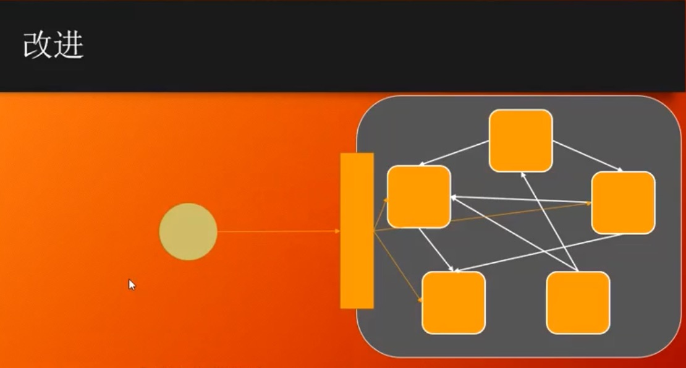

# 设计模式

## 1.单例模式 Singleton

> 只能new一个对象实例,叫做单例模式

### 1.常用场景.

1. 各种Mgr.例如文件管理Mgr→PropertiesMgr.
2. 各种Factory

### 2.实现方式.

#### 1.饿汉式:简单方式,常用方式.推荐使用.

1. 上来就 `new` 一个`final static`实例.
2. 写一个空的.`private`的构造方法;(不让别人new).
3. 只提供getInstance()方法,返回实例本身;

```java
public class Singleton {
		//程序第一次加载就new个实例
    private static final Singleton INSTANCE = new Singleton();
		//不让别人new实例
    private Singleton() {
    }
    //只提供getInstance方法,返回这个实例.所有调用这个方法的都是同一个实例.
    public static Singleton getInstance() {
        return INSTANCE;
    }
}
```

#### 2.懒汉式:常规完美方法.面试常用.

```java
public class Singleton {
		//不让别人new
    private Singleton() {

    }
		//声明一个,没用到的时候不初始化.
    private static volatile Singleton INSTANCE;
		//调用getInstance方法时候,初始化.
    public static Singleton getInstance() {
      	//多线程时候,判断是否为null(这个速度特别快,<1ns ,而上来就加锁效率极低.当大部分情况,已经初始化过后,不在进入里面的代码.)
        if (INSTANCE == null) {
          	//多线程,同时判断null,可能进来好几个,这时候必须加锁,
            synchronized (Singleton.class) {
              	//一个个得到锁进来了,再次判断是否非空.
                if (INSTANCE == null) {
                    INSTANCE = new Singleton();
                }
            }
        }
        return INSTANCE;
    }

}
```

#### 3.匿名内部类写法:完美写法,但复杂不常用

```java
public class Singleton {

    private Singleton() {

    }
		//第一次加载时候,静态内部类不会被加载,只有调用getInstance时候才会加载.
    static class SingletonHolder {
        public static final Singleton INSTANCE = new Singleton();
    }

    public static Singleton getInstance() {
        return SingletonHolder.INSTANCE;
    }

}
```

#### 4.effective Java大神写的 枚举类写法.

```java
public enum  EnumSingleton {
    INSTANCE;
    public EnumSingleton getInstance(){
        return INSTANCE;
    }
}
```

**优点**

1. 防止反射
2. 反序列化

## 2.策略模式 Strategy

### 1.简单介绍

1. **主要解决:** 在有多种算法相似的情况下,使用if...else带来的复杂和难以维护.
2. **何时使用:** 一个系统中有许多类,区分它们的主要是他们的直接行为
3. **如何解决:** 将这些算法封装成一个一个的类，任意地替换。
4. **关键代码:** 实现同一个接口

### 2.优缺点

**优点：** 1、算法可以自由切换。 2、避免使用多重条件判断。 3、扩展性良好。

**缺点：** 1、策略类会增多。 2、所有策略类都需要对外暴露。

### 3.实现方式举例说明:

1. 创建一个Strategy接口.
2. 创建多个功能类实现这个接口.
3. 在调用这个功能的地方,传入实例和策略.

## 3.工厂模式 Factory

> 任何可以产生对象的方法或类,都可以称之为工厂.

[简单工厂,工厂方法模式,抽象工厂模式比较](https://blog.csdn.net/weixin_45872600/article/details/108904967)

### 1.工厂系列

1. 简单工厂

   > 定义：定义一个工厂类，它可以根据 参数的不同返回不同类的实例，被创建的实例通常都有共同的父类  
   > 结构：Factory(工厂）、Product(抽象产品)、ConcreteProduct（具体产品）  
   > 优点：  
   >
   > > 1.简单工厂模式实现了**对象创建与使用的分离 **   
   > >
   > > 2.客户端只需知道**具体产品对应的参数**即可，减少了使用者的记忆量    
   > >
   > > 3.通过引入配置文件，可以不修改客户端的代码来增加新的具体产品类，提高了系统的灵活性  
   >
   > 缺点：  
   >
   > > 1.工厂类的职责过重，一旦不能正常工作，整个系统都要受到影响  
   > > 2.增加了类的个数（工厂类）,增加了系统的复杂度和理解难度  
   > > 3.**系统扩展困难，添加新产品时不得不修改工厂逻辑,不利于系统的扩展和维护**  
   > > 4.简单工厂模式使**用了静态工厂方法，造成工厂角色无法形成基于继承的等级结构**  
   >
   > 适用环境：  
   >
   > > 1.工厂类负责创建的对象比较少  
   > > 2.**客户端只知道传入工厂类的参数，对如何创建对象不关心**  

2. 工厂方法

   > 定义：定义一个用于创建对象的接口，但是让子类决定将哪一个类实例化。**工厂方法模式让一个类的实例化延迟到其子类**。  
   > 结构：  Factory(抽象工厂)、ConcreteFactroy(具体工厂)、Product（抽象产品）、ConcreteProduct（具体产品）  
   > 优点：  
   >
   > > 1.向客户隐藏了那种具体产品将被实例化这一细节，用户只需要关心所需产品对应的工厂
   > > 2.让工厂自主确定创建何种产品
   > > 3.加入新产品时，只要添加一个具体工厂和具体产品即可，**可扩展性很好，完全符合开闭原则**
   >
   > 缺点：  
   >
   > > 1.添加新的产品时,系统中的类成对的增加，增加了系统的复杂度
   > > 2.为了有良好的可扩展性，需要引入抽象层，但增加了系统的抽象性和理解难度 
   >
   > 适用环境：  
   >
   > > 1.客户端不知道它所需要的对象的类
   > > 2.抽象工厂类通过其子类指定创建那个对象

3. 抽象工厂

   > 定义：提供一个创建一系列相关或相互依赖的对象的接口，而无需指定他们具体的类  
   > 结构：AbstractFactory(抽象工厂)、ConcreteFactory(具体工厂)、AbstractProduct(抽象产品)、ConcreteProduct(具体产品)  
   > 优点：  
   >
   > > 1.抽象工厂隔离了具体类的生成，更换一个具体工厂相对容易
   > > 2.能够保证客户端始终只使用同一个产品族中的对象
   > > 3.**增加新的产品族很方便，无须修改已有系统，符合开闭原则**
   >
   > 缺点：  
   >
   > > 1.**增加新的产品等级结构麻烦，甚至要修改抽象层，违背了开闭原则**
   >
   > 适用环境：  
   >
   > > 1.用户关心对象的创建过程
   > > 2.系统中有多于一个的产品族，可以通过配置文件使用户能动态的改变产品族，也可以很方便的增加行的产品族
   > > 3.属于同一个产品族的产品将在一起使用
   > > 4.产品等级结构稳定，在设计之后不会改变系统中的产品等级结构

### 2.具体实现方法

#### 1.简单工厂

1. 定义个接口,里面有个方法.

   ```java
   public interface Vehicle {
       void go();
   }
   ```

2. 定义三个类,分别实现这个接口.重写方法.

   ```java
   public class Car implements Vehicle {
       @Override
       public void go() {
           System.out.println("我是car");
       }
   }
   public class Plane implements Vehicle {
       @Override
       public void go() {
           System.out.println("我是plane");
       }
   }
   public class Broom implements Vehicle {
       @Override
       public void go() {
           System.out.println("broom 飞");
       }
   }
   ```

3. 创建工厂类,根据参数,创造不同的实例

   ```java
   public class VehicleFactory {
       //静态工厂方法
       public static Vehicle getVehicle(String vehicleType){
           Vehicle vehicle = null;
           if ("car".equalsIgnoreCase(vehicleType)){
               vehicle = new Car();
               System.out.println("car 的实例创建了");
           }else if("plane".equalsIgnoreCase(vehicleType)){
               vehicle = new Plane();
               System.out.println("plane 的实例创建了");
           }else if("broom".equalsIgnoreCase(vehicleType)){
               vehicle = new Broom();
               System.out.println("broom 的实例创建了");
           }
           return vehicle;
       }
   }
   ```

4. 调用的时候,创建接口实例 = new 某个类.

   ```java
   public class Main {
       public static void main(String[] args) {
           Vehicle vehicle = VehicleFactory.getVehicle("broom");//getVehicle("car/plane")
           vehicle.go();
       }
   }
   ```

   

#### 2.工厂方法

1. 定义个接口,里面有个方法

   ```java
   public interface Vehicle {
       void go();
   }
   ```

2. 创建两个实体类,实现接口

   ```java
   public class Car implements Vehicle {
       @Override
       public void go() {
           System.out.println("我是car");
       }
   }
   public class Plane implements Vehicle {
       @Override
       public void go() {
           System.out.println("我是plane");
       }
   }
   ```

3. 创建一个创建交通工具的工厂(接口)

   ```java
   public interface VehicleFactory {
       public Vehicle createVehicle();
   }
   ```

4. 分别创建两个具体生产实例的工厂,实现总工厂.

   ```java
   public class CarFactory implements VehicleFactory {
       @Override
       public Vehicle createVehicle() {
           Car c = new Car();
         //创建实例的时候,可以做特殊的事情.
           System.out.println("car 的实例创建了");
           return c;
       }
   }
   
   public class PlaneFactory implements VehicleFactory{
       @Override
       public Vehicle createVehicle() {
           Plane plane = new Plane();
         //创建实例的时候,可以做特殊的事情.
           System.out.println("plane 创建了");
           return plane;
       }
   }
   ```

5. 调用方法时候,可根据创建不同的工厂,创建不同的实例.

   ```java
   public class Main {
       public static void main(String[] args) {
           VehicleFactory vehicleFactory;
           Vehicle vehicle;
           vehicleFactory = new PlaneFactory();
           vehicle = vehicleFactory.createVehicle();
           vehicle.go();
       }
   }
   
   ```

#### 3.抽象工厂

> 什么时候用接口,什么时候用abstract?
>
> 形容的时候用接口.名词时候用abstract

1. 创建抽象具体接口

   ```java
   public abstract class Weapon {
       abstract void shoot();
   }
   
   public abstract class Food {
       abstract void printName();
   }
   
   public abstract class Vehicle {
       abstract void go();
   }
   ```

2. 各个族类创建各自的实体类,实现上面各接口.

   1. 人族

   ```java
   public class AK47 extends Weapon{
       @Override
       void shoot() {
           System.out.println("我是AK47  突突突. 我是人类一族的");
       }
   }
   public class Bread extends Food{
       @Override
       void printName() {
           System.out.println("我是面包.人类一族的");
       }
   }
   public class Car extends Vehicle{
       @Override
       void go() {
           System.out.println("我是小汽车,人类一族的");
       }
   }
   ```

   2. 神族

   ```java
   public class MagicStick extends Weapon{
       @Override
       void shoot() {
           System.out.println("我是魔法棒 我是神仙一族");
       }
   }
   public class MushRoom extends Food{
       @Override
       void printName() {
           System.out.println("我是蘑菇,我是神仙一族");
       }
   }
   public class Broom extends Vehicle{
       @Override
       void go() {
           System.out.println("我是魔法扫帚,我是神仙一族");
       }
   }
   ```

3. 创建总工厂.确定要干的事

   ```java
   public abstract class AbstractFactory {
       abstract Food createFood();
       abstract Weapon createWeapon();
       abstract Vehicle createVehicle();
   }
   ```

4. 各个族类,创建自己的工厂,继承主工厂.

   ```java
   public class ModernFactory extends AbstractFactory{
       @Override
       Food createFood() {
           return new Bread();
       }
   
       @Override
       Weapon createWeapon() {
           return new AK47();
       }
   
       @Override
       Vehicle createVehicle() {
           return new Car();
       }
   
   }
   
   public class MagicFactory extends AbstractFactory{
       @Override
       Food createFood() {
           return new MushRoom();
       }
   
       @Override
       Weapon createWeapon() {
           return new MagicStick();
       }
   
       @Override
       Vehicle createVehicle() {
           return new Broom();
       }
   }
   ```

5. 主类调用.

   ```java
   public class Main {
       public static void main(String[] args) {
           AbstractFactory factory = new MagicFactory();//想改变其他族类,只需在这里改.new 其他工厂
           Vehicle vehicle = factory.createVehicle();
           vehicle.go();
   
           Food food = factory.createFood();
           food.printName();
   
           Weapon weapon = factory.createWeapon();
           weapon.shoot();
       }
   }
   ```

### 3.springIOC

>springIOC 基本整合了工厂方法和抽象工厂.必会.
>
>springIOC将创建对象这个事接管了.

#### 1.springIOC是什么?

IOC:Inversion Of Control 控制反转 .什么意思呢,简单说,以前控制创建对象需要new,现在反转了不需要了.
IOC也叫DI:Dependency Injection 依赖注入 .简单说就是,你需要什么,它帮助你注入进去.

#### 2.简单实例操作.(配置文件)

1. 创建spring配置文件.spring所有的配置都写在配置文件中.

   ```java
   <!--交给spring管理的类.-->
   <bean id="d" class="com.fsl.springIOCtest.Driver"></bean>
   <!--需要上面的依赖的业务类.-->
   <bean id="tank" class="com.fsl.springIOCtest.Tank">
       <property name="driver" ref="d"></property>
   </bean>
   ```

2. 创建个需要被管理的类.

   ```java
   public class Driver {
     //只有一个构造方法.实例被创建时候调用
       public Driver(){
           System.out.println("driver 又被创建了");
       }
   }
   ```

3. 创建个业务类,里面有需要的依赖类.

   ```java
   public class Tank {
     //仅声明,并没有new 
       Driver driver;
   	//这个set方法很重要.spring就是通过这个set方法将实例注入的,没有这个set方法,spring配置文件报错
       public void setDriver(Driver driver) {
           this.driver = driver;
       }
   }
   ```

4. 调用业务

   ```java
   public class Main {
       public static void main(String[] args) {
         //读取配置文件 (app.xml)
           ApplicationContext fileContext = FileUtils.getFileContext();
   //        Driver d = (Driver) fileContext.getBean("driver");
         //现在只需像配置文件一样,即可将内部的属性直接注入进去,适合初始化属性.
           Tank tank = (Tank) fileContext.getBean("tank");
       }
   }
   ```

## 4.Facade 门面

### 1.门面的理解.

当一个外部程序需要和很多功能打交道时候,外部程序和这些功能分别打交道,很复杂,如果再来一个新的功能,关系会变得更加复杂.这时候,在一些功能外围,增加个大管家.就是门面,封装起来,外部程序只和大管家打交道,其他的功能模块,交到大管家管理.

例如说,一个坦克大战游戏,有坦克,子弹,墙,地雷,此时frame需要分别控制这些,如果此时再来个地雷,那么又要新增控制,并且地雷和坦克子弹等内部功能块也可能有复杂关系.

### 2.图解




## 5.Mediator 调停者

> 当一些系统互相之间需要打交道,关系很乱的时候,这时候,出现个调停者.所有的系统都和调停者打交道,不再互相之间打交道.

### 1.图解


### 2.应用

**MQ** 消息中间件

### 3.应用思路

假如坦克大战游戏,里面有坦克,子弹,爆炸效果三个元素.在原有设计中,都是TankFrame中,写一个List<Tank>,List<Bullet>,List<Explode>,分别将每次new出来的元素装到对应的list中.然后,在各个类中处理各自的事件,例如子弹类碰撞坦克,然后Explode产生爆炸效果.

**用调停者Mediator改造**:

1. 首先,创建个GameModel作为调停者,所有的坦克,子弹,爆炸元素都只和他打交道.功能包括创建元素,碰撞检测,元素消失等.TankFrame的工作应该只剩下画画,展示,剩下的移到GameModel中,

2. 创建所有元素的父类GameObject,抽出共有属性方法.例如属性位置x,y,方法paint(Graphics g)等.

3. 然后Tank,Bullet,Explode分别继承这个抽象类GameObject,这样,GameModel中就由三个List<Tank>,List<Bullet>,List<Explode>变成了一个List<GameObject> objects.这个list有add和remove方法供元素加入进去和消亡使用.

4. 在GameModel的paint()方法中,以前是各自的List元素各自paint,现在不需要了,只需objects.for(){objects.get(i).paint(g)},然后各自就画各自的了.

5. 继续,关键来了,原先这里有一些事件方法.检测方法.比如子弹与坦克的碰撞事件操作.具体实现方法如下.

6. 抽出一个Collider(名字随便起,这里是符合当前的业务起名)接口,接口里有个collide(GameObject o1,GameObject o1)方法,用来检测两个元素会发生什么事情.

7. 将以前的检测事件抽出为***Conllider,实现Collider接口,例如子弹与坦克碰撞方法,创建类BulletTankCollider implements Collider {}.当再有其他的,比如坦克与坦克碰到一起的时候,怎么办,创建类TankTankCollider implements Collider {} 

   ```java
   //BulletTankCollider
   @Overrite
   public void collide(GameObject o1,GameObject o1){
   	if(o1 instanceof Bullet && o2 instanceof Tank){
   		Bullet b = (Bullet) o1;
   		Tank t = (Tank) o2;
   		b.collodeWith(t);//这是个自己写的位置检测碰撞方法.
   	} else if (o1 instanceof Tank && o2 instanceof Bullet) {
   		collide(o2,o1);//如果反着,将参数反着再调用一遍方法.
   	} else 
   		return;
   }
   
   //TankTankCollider
   @Overrite
   public void collide(GameObject o1,GameObject o1){
   	if(o1 instanceof Tank && o2 instanceof Tank){
   		Tank t1 = (Tank) o1;
   		Tank t2 = (Tank) o2;
   		if (t1 相交于 t2){
         t1,t2回到上个位置//需要记录oldX,oldY
       }
   	} else 
   		return;
   }
   ```

8. 在GameModel的paint(Graphis g)方法中,

   ```java 
   //创建处理方法实例
   Collider collider = new BulletTankCollider();
   //有多个创建多个.
   Collider collider2 = new TankTankCollider();
   
   public void paint(Graphis g){
     for(int i=0;i<objects.size();i++){
       GameObject o1 = objects.get(i);
       for(int j=i+1;j<object.size();j++){
         GameObject o2 = objects.get(j);
         //交给事件处理器处理.
   			collider.collide(o1,o2);
         //其他的事件处理
         collider2.collide(o1,o2);
         //collider3.collide(o1,o2);
         //collider4.collide(o1,o2);
       }
     }
   }
   
   ```

   

## 6.Chain Of Responsibility 责任链模式

## 7.装饰者

## 8.