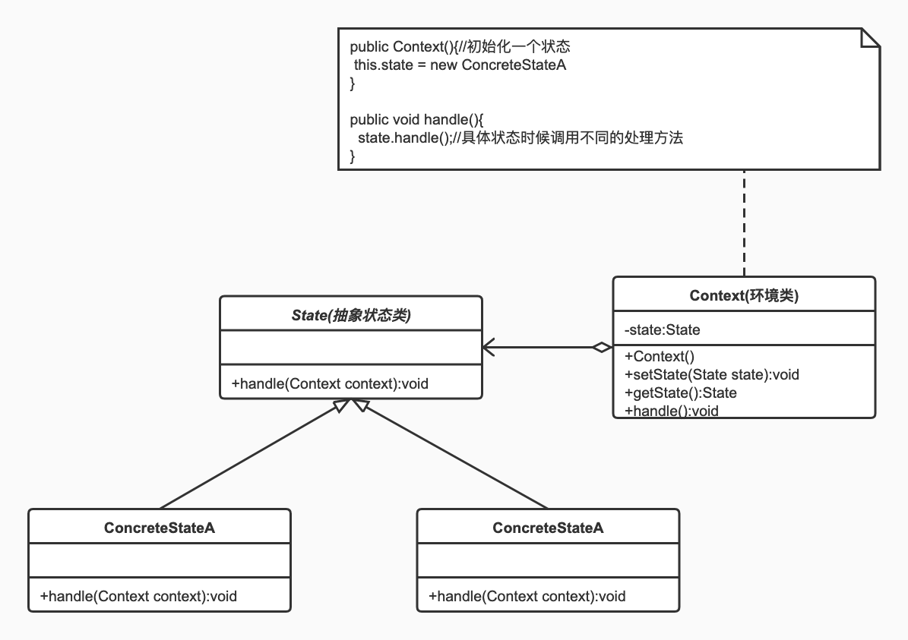

# 设计模式

## 分类:


**需要了解到什么程度**

1. 看到名字,需要知道典型用法.
2. 类图,要想的起来

## 面向对象六大设计原则

**指导思想 几个bility**

1. 可维护性Maintainability
   * 修改功能,需要改动的地方越少,可维护性越好.
2. 可复用性Reusabulity
   * 代码可以被以后重复利用
   * 写出自己总结的类库
3. 可扩展性Extensibility/Scalability
   * 添加功能无需修改原来的代码
4. 灵活性flexbulity/mobility/adaptability
   * 代码接口可以灵活调用

**原则**

1. 单一指责原则

   > Single Responsebility Principle
   >
   > 一个类别太大,别太累,负责单一的职责
   >
   > > Person
   > >
   > > PersonBuilder
   >
   > 高内聚,低耦合

2. 开闭原则

   > Open-Closed Principle
   >
   > 对扩展开放,对修改关闭
   >
   > > 尽量不去修改原来的代码的情况下进行扩展
   >
   > 抽象化,多态是抽象原则的关键

3. 里式替换原则

   > Liscov Substitution Principle
   >
   > 所有使用父类的地方,必须能够透明的使用子类对象
   >
   > >   

4. 依赖倒置原则

   > Dependency Inversion Principle
   >
   > 依赖倒置原则
   >
   > > 依赖抽象,而不是依赖具体
   > >
   > > 面向抽象(接口)编程

5. 接口隔离原则

   > Interface Segregation Principle
   >
   > 每一个接口应该承担独立的角色,不干不该自己干的事儿.
   >
   > > Flyable Runnable 不该合二为一
   > >
   > > 避免子类实现不需要的实现的方法
   > >
   > > 需要对客户提供接口的时候,只需要暴露最小的接口

6. 迪米特法则

   > Law of Demeter
   >
   > 尽量不要和陌生人说话
   >
   > 在迪米特法则中,对于一个对象,非陌生人包括以下几类
   >
   > >当前对象本身(this)
   > >
   > >以参数形式传入到当前对象方法中的对象
   > >
   > >当前对象的成员对象
   > >
   > >如果当前对象的成员对象是一个集合,那么集合中的元素也都是朋友
   > >
   > >当前对象所创建的对象
   >
   > 和其他类的耦合度变低

## 1.Singleton 单例模式 

> 只能new一个对象实例,叫做单例模式

**类图**


### 1.常用场景.

1. 各种Mgr.例如文件管理Mgr→PropertiesMgr.
2. 各种Factory

### 2.实现方式.

#### 1.饿汉式:简单方式,常用方式.推荐使用.

1. 上来就 `new` 一个`final static`实例.
2. 写一个空的.`private`的构造方法;(不让别人new).
3. 只提供getInstance()方法,返回实例本身;

```java
public class Singleton {
		//程序第一次加载就new个实例
    private static final Singleton INSTANCE = new Singleton();
		//不让别人new实例
    private Singleton() {
    }
    //只提供getInstance方法,返回这个实例.所有调用这个方法的都是同一个实例.
    public static Singleton getInstance() {
        return INSTANCE;
    }
}
```

#### 2.懒汉式:常规完美方法.面试常用.

```java
public class Singleton {
		//不让别人new
    private Singleton() {

    }
		//声明一个,没用到的时候不初始化.//volatile,避免指令重排序(创建对象成功,未初始化,就被别的线程拿走了)(基本不可能)
    private static volatile Singleton INSTANCE;
		//调用getInstance方法时候,初始化.
    public static Singleton getInstance() {
      	//多线程时候,判断是否为null(这个速度特别快,<1ns ,而上来就加锁效率极低.当大部分情况,已经初始化过后,不在进入里面的代码.)
        if (INSTANCE == null) {
          	//多线程,同时判断null,可能进来好几个,这时候必须加锁,
            synchronized (Singleton.class) {
              	//一个个得到锁进来了,再次判断是否非空.
                if (INSTANCE == null) {
                    INSTANCE = new Singleton();
                }
            }
        }
        return INSTANCE;
    }

}
```

#### 3.匿名内部类写法:完美写法,但复杂不常用

```java
public class Singleton {

    private Singleton() {

    }
		//第一次加载时候,静态内部类不会被加载,只有调用getInstance时候才会加载.
    static class SingletonHolder {
        public static final Singleton INSTANCE = new Singleton();
    }

    public static Singleton getInstance() {
        return SingletonHolder.INSTANCE;
    }

}
```

#### 4.effective Java大神写的 枚举类写法.

```java
public enum  EnumSingleton {
    INSTANCE;
    public EnumSingleton getInstance(){
        return INSTANCE;
    }
}
```

**优点**

1. 防止反射
2. 反序列化

### 3.单例模式的好处.

在门面模式和调停者模式遇到的,可以降低耦合度的问题.具体介绍如下.

1. 在调停者GameModel中,有个add方法,是将元素加入到List中.

   ```java
   public void add(GameObject gameObject){
           this.objects.add(gameObject);
   }
   ```

2. 那么在以前呢,在各个GameObject的实现类中每个构造方法都需要持有这个gm,才可以调用add.例如Bullet的构造方法:

   ```java
   public Bullet(int x, int y, Dir dir, Group group, GameModel gm) {
           this.x = x;
           this.y = y;
           this.dir = dir;
           this.group = group;
     			//先声明,再持有引用,才可以使用.
           this.gm = gm;
   
           rect.x = this.x;
           rect.y = this.y;
           rect.width = WIDTH;
           rect.height = HEIGHT;
   				
           gm.add(this);
       }
   ```

3. 但是将GameModel变成单例后,就可以这样:就降低了耦合度

   ```java
   private static final GameModel INSTANCE = new GameModel();
   public static GameModel getINSTANCE() {
           return INSTANCE;
       }
   ```

   ```java
   public Bullet(int x, int y, Dir dir, Group group) {
           this.x = x;
           this.y = y;
           this.dir = dir;
           this.group = group;
   
           rect.x = this.x;
           rect.y = this.y;
           rect.width = WIDTH;
           rect.height = HEIGHT;
   
           GameModel.getINSTANCE().add(this);
       }
   ```

   

## 2.Strategy 策略模式 

**类图**


### 1.简单介绍

1. **主要解决:** 在有多种算法相似的情况下,使用if...else带来的复杂和难以维护.
2. **何时使用:** 一个系统中有许多类,区分它们的主要是他们的直接行为
3. **如何解决:** 将这些算法封装成一个一个的类，任意地替换。
4. **关键代码:** 实现同一个接口

### 2.优缺点

**优点：** 1、算法可以自由切换。 2、避免使用多重条件判断。 3、扩展性良好。

**缺点：** 1、策略类会增多。 2、所有策略类都需要对外暴露。

### 3.实现方式举例说明:

1. 创建一个Strategy接口.

   ```java
   public interface FireStrategy {
       void fire(Tank tank);
   }
   ```

2. 创建多个功能类实现这个接口.

   ```java
   //默认的坦克方向的打子弹的
   public class DefaultFireStrategy implements FireStrategy{
       @Override
       public void fire(Tank tank) {
           int bx = tank.x + Tank.WIDTH/2 - Bullet.WIDTH/2;
           int by = tank.y + Tank.HEIGHT/2 - Bullet.HEIGHT/2;
           
           new Bullet(bx,by,tank.dir,tank.group);
           if (tank.group == Group.GOOD) new Thread(()->new Audio("audio/tank_fire.wav"));
       }
   }
   ```

   ```java
   //四个方向打子弹的
   public class FourDirFireStrategy implements FireStrategy{
       @Override
       public void fire(Tank tank) {
           int bx = tank.x + Tank.WIDTH/2 - Bullet.WIDTH/2;
           int by = tank.y + Tank.HEIGHT/2 - Bullet.HEIGHT/2;
   
           Dir[] dirs = Dir.values();
           for (Dir dir : dirs) {
               new Bullet(bx,by,dir,tank.group);
           }
           if (tank.group == Group.GOOD) new Thread(()->new Audio("audio/tank_fire.wav"));
       }
   }
   ```

3. 在调用这个功能的地方,传入实例和策略.或者生成不同的策略.(通过类名反射生成实例,就可以不改代码更改策略.)

   ```java
   FireStrategy fs;
   try {
     if (group == Group.GOOD){
       //通过类名反射创建实例,这样就可以不改代码了,只改配置文件就可以修改策略了
       //            fs = new FourDirFireStrategy();
       fs = (FireStrategy) ClassReflectUtils.getClassInstanceByReflectPath((String) PropertyMgr.get("goodFireStrategy"));
     }else {
       //            fs = new DefaultFireStrategy();
       fs = (FireStrategy) ClassReflectUtils.getClassInstanceByReflectPath((String) PropertyMgr.get("badFireStrategy"));
     }
   } catch (ClassNotFoundException e) {
     e.printStackTrace();
   } catch (IllegalAccessException e) {
     e.printStackTrace();
   } catch (InstantiationException e) {
     e.printStackTrace();
   }
   ```

   

## 3.Factory 工厂模式 

> 任何可以产生对象的方法或类,都可以称之为工厂.

[简单工厂,工厂方法模式,抽象工厂模式比较](https://blog.csdn.net/weixin_45872600/article/details/108904967)

**我有个疑问,工厂模式如果用的抽象类,而不是接口,还算是工厂方式吗**

网上查了很多信息,基本都是创建个接口,实现接口,但是我试验了抽象类,也是可以的,我觉得Vehicle这个东西就应该是个抽象类,因为他是一个有具体实意的类,一个名词类.是个交通工具.而若是一些操作类的,则应该是接口.例如VehicleFactory,里面有createVehicle().等等.

### 1.工厂系列

1. 简单工厂

   > 定义：定义一个工厂类，它可以根据 参数的不同返回不同类的实例，被创建的实例通常都有共同的父类  
   > 结构：Factory(工厂）、Product(抽象产品)、ConcreteProduct（具体产品）  
   > 优点：  
   >
   > > 1.简单工厂模式实现了**对象创建与使用的分离 **     
   > >
   > > 2.客户端只需知道**具体产品对应的参数**即可，减少了使用者的记忆量      
   > >
   > > 3.通过引入配置文件，可以不修改客户端的代码来增加新的具体产品类，提高了系统的灵活性    
   >
   > 缺点：  
   >
   > > 1.工厂类的职责过重，一旦不能正常工作，整个系统都要受到影响  
   > > 2.增加了类的个数（工厂类）,增加了系统的复杂度和理解难度  
   > > 3.**系统扩展困难，添加新产品时不得不修改工厂逻辑,不利于系统的扩展和维护**  
   > > 4.简单工厂模式使**用了静态工厂方法，造成工厂角色无法形成基于继承的等级结构**  
   >
   > 适用环境：  
   >
   > > 1.工厂类负责创建的对象比较少  
   > > 2.**客户端只知道传入工厂类的参数，对如何创建对象不关心**  

2. 工厂方法

   > 定义：定义一个用于创建对象的接口，但是让子类决定将哪一个类实例化。**工厂方法模式让一个类的实例化延迟到其子类**。  
   > 结构：  Factory(抽象工厂)、ConcreteFactroy(具体工厂)、Product（抽象产品）、ConcreteProduct（具体产品）  
   > 优点：  
   >
   > > 1.向客户隐藏了那种具体产品将被实例化这一细节，用户只需要关心所需产品对应的工厂  
   > > 2.让工厂自主确定创建何种产品  
   > > 3.加入新产品时，只要添加一个具体工厂和具体产品即可，**可扩展性很好，完全符合开闭原则**  
   >
   > 缺点：  
   >
   > > 1.添加新的产品时,系统中的类成对的增加，增加了系统的复杂度  
   > > 2.为了有良好的可扩展性，需要引入抽象层，但增加了系统的抽象性和理解难度   
   >
   > 适用环境：  
   >
   > > 1.客户端不知道它所需要的对象的类  
   > > 2.抽象工厂类通过其子类指定创建那个对象  

3. 抽象工厂

   > 定义：提供一个创建一系列相关或相互依赖的对象的接口，而无需指定他们具体的类  
   > 结构：AbstractFactory(抽象工厂)、ConcreteFactory(具体工厂)、AbstractProduct(抽象产品)、ConcreteProduct(具体产品)  
   > 优点：  
   >
   > > 1.抽象工厂隔离了具体类的生成，更换一个具体工厂相对容易  
   > > 2.能够保证客户端始终只使用同一个产品族中的对象  
   > > 3.**增加新的产品族很方便，无须修改已有系统，符合开闭原则**  
   >
   > 缺点：  
   >
   > > 1.**增加新的产品等级结构麻烦，甚至要修改抽象层，违背了开闭原则** 
   >
   > 适用环境：  
   >
   > > 1.用户关心对象的创建过程  
   > > 2.系统中有多于一个的产品族，可以通过配置文件使用户能动态的改变产品族，也可以很方便的增加行的产品族  
   > > 3.属于同一个产品族的产品将在一起使用  
   > > 4.产品等级结构稳定，在设计之后不会改变系统中的产品等级结构  

### 2.具体实现方法

#### 1.简单工厂

**类图**


1. 定义个接口,里面有个方法.

   ```java
   public interface Vehicle {
       void go();
   }
   ```

2. 定义三个类,分别实现这个接口.重写方法.

   ```java
   public class Car implements Vehicle {
       @Override
       public void go() {
           System.out.println("我是car");
       }
   }
   public class Plane implements Vehicle {
       @Override
       public void go() {
           System.out.println("我是plane");
       }
   }
   public class Broom implements Vehicle {
       @Override
       public void go() {
           System.out.println("broom 飞");
       }
   }
   ```

3. 创建工厂类,根据参数,创造不同的实例

   ```java
   public class VehicleFactory {
       //静态工厂方法
       public static Vehicle getVehicle(String vehicleType){
           Vehicle vehicle = null;
           if ("car".equalsIgnoreCase(vehicleType)){
               vehicle = new Car();
               System.out.println("car 的实例创建了");
           }else if("plane".equalsIgnoreCase(vehicleType)){
               vehicle = new Plane();
               System.out.println("plane 的实例创建了");
           }else if("broom".equalsIgnoreCase(vehicleType)){
               vehicle = new Broom();
               System.out.println("broom 的实例创建了");
           }
           return vehicle;
       }
   }
   ```

4. 调用的时候,创建接口实例 = new 某个类.

   ```java
   public class Main {
       public static void main(String[] args) {
           Vehicle vehicle = VehicleFactory.getVehicle("broom");//getVehicle("car/plane")
           vehicle.go();
       }
   }
   ```

   

#### 2.工厂方法

**类图**


1. 定义个接口,里面有个方法

   ```java
   public interface Vehicle {
       void go();
   }
   ```

2. 创建两个实体类,实现接口

   ```java
   public class Car implements Vehicle {
       @Override
       public void go() {
           System.out.println("我是car");
       }
   }
   public class Plane implements Vehicle {
       @Override
       public void go() {
           System.out.println("我是plane");
       }
   }
   ```

3. 创建一个创建交通工具的工厂(接口)

   ```java
   public interface VehicleFactory {
       public Vehicle createVehicle();
   }
   ```

4. 分别创建两个具体生产实例的工厂,实现总工厂.

   ```java
   public class CarFactory implements VehicleFactory {
       @Override
       public Vehicle createVehicle() {
           Car c = new Car();
         //创建实例的时候,可以做特殊的事情.
           System.out.println("car 的实例创建了");
           return c;
       }
   }
   
   public class PlaneFactory implements VehicleFactory{
       @Override
       public Vehicle createVehicle() {
           Plane plane = new Plane();
         //创建实例的时候,可以做特殊的事情.
           System.out.println("plane 创建了");
           return plane;
       }
   }
   ```

5. 调用方法时候,可根据创建不同的工厂,创建不同的实例.

   ```java
    public static void main(String[] args) {
           VehicleFactory vehicleFactory = new PlaneFactory();
           Vehicle vehicle = vehicleFactory.createVehicle();
           vehicle.go();
    }
   ```

#### 3.抽象工厂

> 什么时候用接口,什么时候用abstract?
>
> 形容的时候用接口.名词时候用abstract

**类图**


1. 创建总工厂.确定要干的事

   ```java
   public abstract class AbstractFactory {
       abstract Food createFood();
       abstract Weapon createWeapon();
       abstract Vehicle createVehicle();
   }
   ```

2. 各个族类,创建自己的工厂,继承主工厂.每个工厂生产某一族

   ```java
   public class ModernFactory extends AbstractFactory{
       @Override
       Food createFood() {
           return new Bread();
       }
   
       @Override
       Weapon createWeapon() {
           return new AK47();
       }
   
       @Override
       Vehicle createVehicle() {
           return new Car();
       }
   
   }
   
   public class MagicFactory extends AbstractFactory{
       @Override
       Food createFood() {
           return new MushRoom();
       }
   
       @Override
       Weapon createWeapon() {
           return new MagicStick();
       }
   
       @Override
       Vehicle createVehicle() {
           return new Broom();
       }
   }
   ```

3. 创建抽象具体接口

   ```java
   public abstract class Weapon {
       abstract void shoot();
   }
   
   public abstract class Food {
       abstract void printName();
   }
   
   public abstract class Vehicle {
       abstract void go();
   }
   ```

4. 各个族类创建各自的实体类,实现上面各接口.

   1. 人族

   ```java
   public class AK47 extends Weapon{
       @Override
       void shoot() {
           System.out.println("我是AK47  突突突. 我是人类一族的");
       }
   }
   public class Bread extends Food{
       @Override
       void printName() {
           System.out.println("我是面包.人类一族的");
       }
   }
   public class Car extends Vehicle{
       @Override
       void go() {
           System.out.println("我是小汽车,人类一族的");
       }
   }
   ```

   2. 神族

   ```java
   public class MagicStick extends Weapon{
       @Override
       void shoot() {
           System.out.println("我是魔法棒 我是神仙一族");
       }
   }
   public class MushRoom extends Food{
       @Override
       void printName() {
           System.out.println("我是蘑菇,我是神仙一族");
       }
   }
   public class Broom extends Vehicle{
       @Override
       void go() {
           System.out.println("我是魔法扫帚,我是神仙一族");
       }
   }
   ```

5. 主类调用.

   ```java
   public class Main {
       public static void main(String[] args) {
           AbstractFactory factory = new MagicFactory();//想改变其他族类,只需在这里改.new 其他工厂//(可以配置文件反射生成)
           Vehicle vehicle = factory.createVehicle();
           vehicle.go();
   
           Food food = factory.createFood();
           food.printName();
   
           Weapon weapon = factory.createWeapon();
           weapon.shoot();
       }
   }
   ```

### 3.springIOC

>springIOC 基本整合了工厂方法和抽象工厂.必会.
>
>springIOC将创建对象这个事接管了.

#### 1.springIOC是什么?

IOC:Inversion Of Control 控制反转 .什么意思呢,简单说,以前控制创建对象需要new,现在反转了不需要了.
IOC也叫DI:Dependency Injection 依赖注入 .简单说就是,你需要什么,它帮助你注入进去.

#### 2.简单实例操作.(配置文件)

1. 创建spring配置文件.spring所有的配置都写在配置文件中.

   ```java
   <!--交给spring管理的类.-->
   <bean id="d" class="com.fsl.springIOCtest.Driver"></bean>
   <!--需要上面的依赖的业务类.在tank实例化的时候,d也被创建-->
   <bean id="tank" class="com.fsl.springIOCtest.Tank">
       <property name="driver" ref="d"></property>
   </bean>
   ```

2. 创建个需要被管理的类.

   ```java
   public class Driver {
     //只有一个构造方法.实例被创建时候调用
       public Driver(){
           System.out.println("driver 又被创建了");
       }
   }
   ```

3. 创建个业务类,里面有需要的依赖类.

   ```java
   public class Tank {
     //仅声明,并没有new 
       Driver driver;
   	//这个set方法很重要.spring就是通过这个set方法将实例注入的,没有这个set方法,spring配置文件报错
       public void setDriver(Driver driver) {
           this.driver = driver;
       }
   }
   ```

4. 调用业务

   ```java
   public class Main {
       public static void main(String[] args) {
         //读取配置文件 (app.xml)
           ApplicationContext fileContext = FileUtils.getFileContext();
   //        Driver d = (Driver) fileContext.getBean("d");
         //现在只需像配置文件一样,即可将内部的属性直接注入进去,适合初始化属性.
           Tank tank = (Tank) fileContext.getBean("tank");
       }
   }
   ```

## 4.Facade 门面

**类图**


### 1.门面的理解.

当一个外部程序需要和很多功能打交道时候,外部程序和这些功能分别打交道,很复杂,如果再来一个新的功能,关系会变得更加复杂.这时候,在一些功能外围,增加个大管家.就是门面,封装起来,外部程序只和大管家打交道,其他的功能模块,交到大管家管理.

例如说,一个坦克大战游戏,有坦克,子弹,墙,地雷,此时frame需要分别控制这些,如果此时再来个地雷,那么又要新增控制,并且地雷和坦克子弹等内部功能块也可能有复杂关系.

### 2.图解


## 5.Mediator 调停者

> 当一些系统互相之间需要打交道,关系很乱的时候,这时候,出现个调停者.所有的系统都和调停者打交道,不再互相之间打交道.

### 1.图解


### 2.应用

**MQ** 消息中间件

### 3.应用思路

假如坦克大战游戏,里面有坦克,子弹,爆炸效果三个元素.在原有设计中,都是TankFrame中,写一个`List<Tank>,List<Bullet>,List<Explode>`,分别将每次new出来的元素装到对应的list中.然后,在各个类中处理各自的事件,例如子弹类碰撞坦克,然后new出Explode产生爆炸效果.

**用调停者Mediator改造**:

1. 首先,创建个GameModel作为调停者,所有的坦克,子弹,爆炸元素都只和他打交道.功能包括创建元素,碰撞检测,元素消失等.TankFrame的工作应该只剩下画画,展示,剩下的移到GameModel中,

2. 创建所有元素的父类GameObject,抽出共有属性方法.例如属性位置x,y,方法paint(Graphics g)等.

3. 然后Tank,Bullet,Explode分别继承这个抽象类GameObject,这样,GameModel中就由三个`List<Tank>,List<Bullet>,List<Explode>`变成了一个`List<GameObject>` objects.这个list有add和remove方法供元素加入进去和消亡使用.

4. 在GameModel的paint()方法中,以前是各自的List元素各自paint,现在不需要了,只需objects.for(){objects.get(i).paint(g)},然后各自就画各自的了.

5. 继续,关键来了,原先这里有一些事件方法.检测方法.比如子弹与坦克的碰撞事件操作.具体实现方法如下.

6. 抽出一个Collider(名字随便起,这里是符合当前的业务起名)接口,接口里有个collide(GameObject o1,GameObject o1)方法,用来检测两个元素会发生什么事情.

7. 将以前的检测事件抽出为***Conllider,实现Collider接口,例如子弹与坦克碰撞方法,创建类BulletTankCollider implements Collider {}.当再有其他的,比如坦克与坦克碰到一起的时候,怎么办,创建类TankTankCollider implements Collider {} 

   ```java
   //BulletTankCollider
   @Overrite
   public void collide(GameObject o1,GameObject o1){
   	if(o1 instanceof Bullet && o2 instanceof Tank){
   		Bullet b = (Bullet) o1;
   		Tank t = (Tank) o2;
   		b.collodeWith(t);//这是个自己写的位置检测碰撞方法.
   	} else if (o1 instanceof Tank && o2 instanceof Bullet) {
   		collide(o2,o1);//如果反着,将参数反着再调用一遍方法.
   	} else 
   		return;
   }
   
   //TankTankCollider
   @Overrite
   public void collide(GameObject o1,GameObject o1){
   	if(o1 instanceof Tank && o2 instanceof Tank){
   		Tank t1 = (Tank) o1;
   		Tank t2 = (Tank) o2;
   		if (t1 相交于 t2){
         t1,t2回到上个位置//需要记录oldX,oldY
       }
   	} else 
   		return;
   }
   ```

8. 在GameModel的paint(Graphis g)方法中,这样,各个元素就不再互相打交道,只有GameModel和GameObject打交道.再新来的元素也是一种GameObject.

   ```java 
   //创建处理方法实例
   Collider collider = new BulletTankCollider();
   //有多个创建多个.
   Collider collider2 = new TankTankCollider();
   
   public void paint(Graphis g){
     for(int i=0;i<objects.size();i++){
       GameObject o1 = objects.get(i);
       for(int j=i+1;j<object.size();j++){
         GameObject o2 = objects.get(j);
         //交给事件处理器处理.
   			collider.collide(o1,o2);
         //其他的事件处理
         collider2.collide(o1,o2);
         //collider3.collide(o1,o2);
         //collider4.collide(o1,o2);
       }
     }
   }
   
   ```

   

## 6.Chain Of Responsibility 责任链模式

> 简单说:一个个功能类,每个类负责一块功能,穿起来,像一个链条一样,其中一个断掉就结束返回.

### 1.定义

为了避免请求发送者与多个请求处理者耦合在一起，于是将所有请求的处理者通过前一对象记住其下一个对象的引用而连成一条链；当有请求发生时，可将请求沿着这条链传递，直到有对象处理它为止。

### 2.应用

doFilter(HttpRequest request,HttpResponse response,FilterChain chain)

### 3.实例1

其实上一章调停者模式中,Collider接口及实现类就算是责任链(的思路).但是我们还可以将其再优化一下.

1. 我们发现,每增加一个新的物体,增加新的collide事件就需要改就需要新增一个Collider类.这样不好.优化下.

2. 新增加个ColliderChain,我们让他也实现Collider.这样这个链条就将所有的碰撞事件组件连在一起了,在需要用的地方只需要new ColliderChain.

   ```java
   public class ColliderChain implements Collider{
     private List<Collider> colliderList = new LinkedList<>();
     public ColliderChain(){
   //        add(new BulletTankCollider());
   //        add(new TankTankCollider());
           //写到配置文件里,就不需要更改程序了.只需要改配置文件的类的数量
           String colliderPath = (String) PropertyMgr.get("colliderPath");
           for (String path : colliderPath.split(",")) {
               try {
                   add((Collider) ClassReflectUtils.getClassInstanceByReflectPath(path));
               } catch (ClassNotFoundException e) {
                   e.printStackTrace();
               } catch (IllegalAccessException e) {
                   e.printStackTrace();
               } catch (InstantiationException e) {
                   e.printStackTrace();
               }
           }
       }
     public void add(Collider c){
           colliderList.add(c);
       }
     //这里返回boolean,如果链条中某个责任组件发现他没通过,则直接返回false中断.
     public boolean collide(GameObject o1,GameObject o2){
           for (int i = 0; i < colliderList.size(); i++) {
             		//ColliderList中装的是Collider的各种实现,具体走哪一种,看他实例是哪个.
                 if (!colliderList.get(i).collide(o1,o2)){
                     return false;
                 }
           }
           return true;
       }
   }
   ```

3. 这样在GameModel中就可以.将一个个new 的**Collider换成ColliderChain.

   ```java
   ColliderChain chain = new ColliderChain();
   public void paint(Graphis g){
     for(int i=0;i<objects.size();i++){
       GameObject o1 = objects.get(i);
       for(int j=i+1;j<object.size();j++){
         GameObject o2 = objects.get(j);
         chain.collide(o1,o2);//这个是chain中该做的事,所以在chain创建这个方法
       }
     }
   }
   ```

### 4.实例2 

有时候,我们需要将链条去的时候执行123,回来时候执行321顺序,就像doFilter(request,response).这时候怎么办呢.

1. 创建过滤器接口

   ```java
   interface Filter{
       void doFilter(String request,String response,FilterChain filterChain);
   }
   ```

2. 让过滤器实例实现它.

   ```java
   class HtmlFilter implements Filter{
       @Override
       public void doFilter(String request, String response, FilterChain filterChain) {
           System.out.println("chain HtmlFilter 处理了req");
           //走到这,显式判断是否继续向下执行.如果不显式调用doFilter,那么链条中断
           filterChain.doFilter(request,request,filterChain);
           System.out.println("chain HtmlFilter 处理了res");
       }
   }
   class SensitiveFilter implements Filter{
       @Override
       public void doFilter(String request, String response, FilterChain filterChain) {
           System.out.println("chain SensitiveFilter 处理了req");
           filterChain.doFilter(request,response,filterChain);
           //如果这是最后一个链条中的filter,并且走完了,那么将执行doFilter之后的,之后向前,有点像递归
           System.out.println("chain SensitiveFilter 处理了res");
       }
   }
   ```

3. 让chain也实现它,重点来了,仔细看chain的doFilter实现.

   ```java
   class FilterChain implements Filter{
       //初始位置
       int index = 0;
       List<Filter> filterList = new ArrayList<>();
   
       public FilterChain add(Filter f){
           filterList.add(f);
           return this;
       }
   
       @Override
       public void doFilter(String request, String response, FilterChain filterChain) {
           //如果所有的filter走完了,return
           if (filterList.size()<=index)
               return;
           else{
               //否则执行当前的filter
               Filter filter = filterList.get(index);
               //将下标指向下一个,这个很重要
               index++;
               filter.doFilter(request, response,filterChain);
           }
       }
   }
   ```

4. 调用chain处理

   ```java
   public class Main {
       public static void main(String[] args) {
           String s = "";
           FilterChain fc = new FilterChain();
         	//初始化,添加两个过滤器
           fc.add(new HtmlFilter()).add(new SensitiveFilter());
           fc.doFilter(s,s,fc);
       }
   }
   ```

   

## 7.装饰者 Decorator

> 就是在原来的东西上加点装饰.
>
> 例如:坦克加个外壳,加个血条,加个尾巴,子弹加点啥啥啥.....
>
> 如果用继承方式.例如坦克框类继承,血条类继承.等待,不灵活!!装饰和被装饰者耦合度太高.

### 1.实例图例


### 2.实现方式

1. 定义一个总的抽象类,

   ```java
   public abstract class GODecorator extends GameObject {
     //内部聚合一个GameObject,坦克,子弹.所有元素都是从这个类继承的.所有的元素都可以使用这个Decorator
       GameObject go;
   
       public GODecorator(GameObject go) {
           this.go = go;
       }
       //
       @Override
       public void paint(Graphics g) {
           go.paint(g);
       }
       //getHeight和getWidth留着让实现他的类自己去实现
   }
   ```

2. 创建一个类去继承总的装饰类

   ```java
   public class RectDecorator extends GODecorator{
       public RectDecorator(GameObject go) {
           /*
               调用父类的构造方法语法：
               super();
               或
               super(参数列表);
               */
           super(go);
       }
       @Override
       public int getHeight() {
           //这里实际是GameObject的方法,返回的事坦克,子弹等等的height,下面同理
           return super.go.getHeight();
       }
       @Override
       public int getWidth() {
           return super.go.getWidth();
       }
       @Override
       public void paint(Graphics g) {
           this.x = go.x;
           this.y = go.y;
           go.paint(g);
   
           Color c = g.getColor();
           g.setColor(Color.white);
           g.drawRect(super.go.x,super.go.y,super.go.getWidth()+2,super.go.getHeight()+2);
           g.setColor(c);
   
       }
   }
   
   ```

3. 这样在创建元素的时候,就可以用装饰器包住具体元素了.例如:

   ```java
   //fire方法创建子弹.
   GameModel.getINSTANCE().add(new RectDecorator(new Bullet(bx,by,tank.dir,tank.group)));
   ```

4. 更高级的用法.再创建个装饰器类.然后再包住一个装饰器,因为他们都是继承自GameObject

   ```java
   public class TailDecorator extends GODecorator{
       public TailDecorator(GameObject go) {
           super(go);
       }
       @Override
       public int getHeight() {
           return super.go.getHeight();
       }
       @Override
       public int getWidth() {
           return super.go.getWidth();
       }
       @Override
       public void paint(Graphics g) {
           this.x = go.x;
           this.y = go.y;
           go.paint(g);
           Color c = g.getColor();
           g.setColor(Color.white);
           g.drawLine(super.go.x,super.go.y,super.go.x+getWidth(),super.go.y+getWidth());
           g.setColor(c);
       }
   }
   ```

   

   ```java
   GameModel.getINSTANCE().add(
                   new TailDecorator(
                           new RectDecorator(
                                   new Bullet(bx,by,tank.dir,tank.group))));
   ```

   

## 8.Observer 观察者模式

**一个重要的设计模式**

在很多系统中,Observer模式往往和责任链共同负责对于事件的处理.其中某个Observer负责是否将事件进一步传递.

### 2.应用场景.

**在代码中看到以下名字的,都属于观察者模式**

- Observer
- Listener
- Hook
- CallBack

### 3.应用实例

1. 创建个观察者父接口

   ```java
   public interface TankFireObserver {
       //对事件作出反应的接口,参数是一个事件
       void actionOnFire(TankFireEvent e);
   }
   ```

2. 创建一个实际观察者,实现观察者父接口.观察者观察的是一个事件,他观察的事个TankFireEvent

   ```java
   public class TankFireHandler implements TankFireObserver{
       @Override
       public void actionOnFire(TankFireEvent e) {
           //拿到是哪辆坦克发出的
           Tank source = e.getSource();
           //让这辆坦克source 发出子弹
           source.fire();
       }
   }
   ```

3. 定义一个事件类,事件可以拿到事件源.

   ```java
   //这是个事件类,当某个时刻,发生这个事件
   public class TankFireEvent {
       private Tank tank;
   		//事件可以得到事件源,源就是发生事件的实例.
       public Tank getSource(){
           return tank;
       }
   		//一个构造方法
       public TankFireEvent(Tank tank) {
           this.tank = tank;
       }
   }
   ```

4. 如何调用.例如坦克开火时候(以前是调用fire,new个Bullet实例,现在是发生个事件,让观察者来fire()).调用handleFireKey,创建个事件,观察者挨个进行操作.

   ```java
   //观察者列表,可以有多个观察者,类型可以是接口类
       private List<TankFireObserver> observerList = Arrays.asList(new TankFireHandler());
       public void handleFireKey() {
           //创建一个事件
           TankFireEvent event = new TankFireEvent(this);
           //遍历观察者,看看哪个观察者对这个事件作出反应.
           for (TankFireObserver tankFireObserver : observerList) {
               tankFireObserver.actionOnFire(event);
           }
       }
   ```

   

## 9.Composite 组合

### 1.图例


### 2.应用场景

**树形结构**

### 3.应用实例


## 10.Flyweight 享元 共享元数据

> 重复利用对象

### 1.使用场景

1. 各种池子,线程池什么的,闲置的直接拿来用.
2. java中的String.所有的String都是放在常量池中.

### 2.结合Composite.

将一些简单的组合后,组合成新的元数据.

## 11.Proxy 代理

> 静态代理
>
> 动态代理
>
> SpringAOP

[代理](https://www.cnblogs.com/daniels/p/8242592.html)

**代理模式的定义：**    

代理模式给某一个对象提供一个代理对象，并由代理对象控制对原对象的引用。通俗的来讲代理模式就是我们生活中常见的中介。   

举个例子来说明：

假如说我现在想买一辆二手车，虽然我可以自己去找车源，做质量检测等一系列的车辆过户流程，但是这确实太浪费我得时间和精力了。我只是想买一辆车而已为什么我还要额外做这么多事呢？于是我就通过中介公司来买车，他们来给我找车源，帮我办理车辆过户流程，我只是负责选择自己喜欢的车，然后付钱就可以了。

### 1.静态代理.

#### 1.应用实例

1. 创建接口类

   ```java
   public interface BuyHouseInterface {
       void buyHouse();
   }
   ```

2. 具体类实现

   ```java
   /**
    * 一个具体买房人实现类
    */
   public class BuyHouseClient implements BuyHouseInterface {
       @Override
       public void buyHouse() {
           System.out.println("我买了个房子");
       }
   }
   ```

3. 代理也同样实现和实现类相同的接口

   ```java
   /**
    * 买房子的代理类
    */
   public class BuyHouseProxy implements BuyHouseInterface {
       //持有个买房子的人的引用
       BuyHouseInterface buyHouseInterface;
   
       public BuyHouseProxy(BuyHouseInterface buyHouseClient) {
           this.buyHouseInterface = buyHouseClient;
       }
   
       @Override
       public void buyHouse() {
           System.out.println("确认房屋状态");
           buyHouseInterface.buyHouse();
           System.out.println("买房后装修");
       }
   }
   ```

4. 当然可以有多个代理,分别干不同的事的代理

   ```java
   public class BuyHouseSearchProxy implements BuyHouseInterface{
       //持有个买房子的人的引用
       BuyHouseInterface buyHouseInterface;
   
       public BuyHouseSearchProxy(BuyHouseInterface buyHouseInterface) {
           this.buyHouseInterface = buyHouseInterface;
       }
   
       @Override
       public void buyHouse() {
           System.out.println("查找房源");
           buyHouseInterface.buyHouse();
       }
   }
   ```

5. 调用的时候,可以单独调用主类,或者调用某个代理,传入主类,或者干脆将个代理传给另个代理,

   ```java
   public class Main {
       public static void main(String[] args) {
           //普通的买房,核心流程
           BuyHouseClient buyHouseClient = new BuyHouseClient();
           buyHouseClient.buyHouse();
           System.out.println("===============================");
           //代理买房,全套流程  持有核心引用
           BuyHouseProxy buyHouseProxy = new BuyHouseProxy(buyHouseClient);
           buyHouseProxy.buyHouse();
           //代理套代理
           System.out.println("===============================");
           BuyHouseSearchProxy buyHouseCheckProxy = new BuyHouseSearchProxy(buyHouseProxy);
           buyHouseCheckProxy.buyHouse();
       }
   }
   ```

**静态代理总结：**

优点：可以做到在符合开闭原则的情况下对目标对象进行功能扩展。

缺点：我们得为每一个服务都得创建代理类，工作量太大，不易管理。同时接口一旦发生改变，代理类也得相应修改。 

### 2.动态代理

#### 1.应用实例

1. 创建动态代理类

   ```java
   public class DynamicProxyHandler implements InvocationHandler {
       private Object object;
   
       public DynamicProxyHandler(Object object) {
           this.object = object;
       }
   
       @Override
       public Object invoke(Object proxy, Method method, Object[] args) throws Throwable {
           System.out.println("买房前准备");
           Object result = method.invoke(object, args);
           System.out.println("买房后装修");
           return result;
       }
   }
   ```

2. 调用动态代理

   ```java
       public static void main(String[] args) {
         //这行可以将他的动态代理逻辑生成个class文件,
           System.getProperties().put("sun.misc.ProxyGenerator.saveGeneratedFiles", "true");
   //        System.getProperties().put("sun.misc.ProxyGenerator.saveGeneratedFiles", true);//这个不对
           BuyHouseInterface buyHouseInterface = new BuyHouseClient();
           /**
            * ClassLoader loader:指定当前目标对象使用的类加载器,获取加载器的方法是固定的
            * Class<?>[] interfaces:指定目标对象实现的接口的类型,使用泛型方式确认类型,因为可多实现,所以是个数组
            * InvocationHandler:指定动态处理器，执行目标对象的方法时,会触发事件处理器的方法(代理谁)
            */
           BuyHouseInterface proxyBuyHouse = (BuyHouseInterface) Proxy.newProxyInstance(
                   BuyHouseInterface.class.getClassLoader(),
                   new Class[]{BuyHouseInterface.class},
                   new DynamicProxyHandler(buyHouseInterface));
           proxyBuyHouse.buyHouse();
       }
   ```

   

### 3.SpringAOP

#### 1.思想:

AOP把软件系统分为两个部分：**核心关注点**和**横切关注点**。业务处理的主要流程是核心关注点，与之关系不大的部分是横切关注点。横切关注点的一个特点是，他们经常发生在核心关注点的多处，而各处基本相似，比如权限认证、日志、事物。AOP的作用在于分离系统中的各种关注点，将核心关注点和横切关注点分离开来。

#### 2. **AOP核心概念**

1. 横切关注点  
   对哪些方法进行拦截，拦截后怎么处理，这些关注点称之为横切关注点

2. 切面（aspect）  
   类是对物体特征的抽象，切面就是对横切关注点的抽象

3. 连接点（joinpoint）  
   被拦截到的点，因为Spring只支持方法类型的连接点，所以在Spring中连接点指的就是被拦截到的方法，实际上连接点还可以是字段或者构造器

4. 切入点（pointcut）  
   对连接点进行拦截的定义

5. 通知（advice）  
   所谓通知指的就是指拦截到连接点之后要执行的代码，通知分为前置、后置、异常、最终、环绕通知五类

6. 目标对象  
   代理的目标对象

7. 织入（weave）  
   将切面应用到目标对象并导致代理对象创建的过程

8. 引入（introduction）  
   在不修改代码的前提下，引入可以在**运行期**为类动态地添加一些方法或字段

#### 3.应用实例

1. 配置方法

   * spring 的配置文件

   ```java
   <bean id="tank" class="com.fsl.springIOCtest.v1.Tank"/>
   <bean id="timeProxy" class="com.fsl.springIOCtest.v1.TimeProxy"/>
   <aop:config>
       <!--切入方法类.里面有before,after等方法.-->
       <aop:aspect id="time" ref="timeProxy">
          <!--切点,id随便起,expression是指哪个类的哪个方法-->
          <aop:pointcut id="move" expression="execution(void com.fsl.springIOCtest.v1.Tank.move())"/>
          <!--before,在什么什么之前, pointcut-ref 在哪个切点,-->
          <aop:before method="before" pointcut-ref="move"/>
          <!--after,在什么什么之后, -->
          <aop:after method="after" pointcut-ref="move"/>
        </aop:aspect>
   </aop:config>
   ```

   * 创建个切面方法类

     ```java
     public class TimeProxy {
         public void before(){
             System.out.println("method start ... "+ System.currentTimeMillis());
         }
         public void after(){
             System.out.println("method end ... "+ System.currentTimeMillis());
         }
     }
     ```

   * 这样调用Tank的move方法时候就会先于move执行before,后于move执行after

2. 注解方法

   * 配置文件中配置过于麻烦,所以还有注解的方法.重点是在配置文件中打开自动注解.

     ```java
     <!--自动注解-->
         <aop:aspectj-autoproxy/>
         <bean id="tank" class="com.fsl.springIOCtest.v2.Tank"/>
         <bean id="timeProxy" class="com.fsl.springIOCtest.v2.TimeProxy"/>
     ```

   * 在切面方法上增加注解,切入点等

     ```java
     @Aspect
     public class TimeProxy {
         @Before("execution(void com.fsl.springIOCtest.v2.Tank.move())")
         public void before(){
             System.out.println("method start ... "+ System.currentTimeMillis());
         }
         @After("execution(void com.fsl.springIOCtest.v2.Tank.move())")
         public void after(){
             System.out.println("method end ... "+ System.currentTimeMillis());
         }
     }
     ```

   * 这样就可以生效了,调用move方法时候,会调用before,和after方法.

## 12.Iterator 迭代器模式

> 这种模式用于顺序访问集合对象的元素，不需要知道集合对象的底层表示。
>
> 提供一种方法顺序访问一个聚合对象中各个元素, 而又无须暴露该对象的内部表示。

### 1.实现方式(泛型)

1. 创建一个迭代器接口,所有的遍历器实现这个接口

   ```java
    /**
    * 迭代器接口,
    */
   public interface Iterator<T> {
       //是否有下一个
       public boolean hasNext();
       //下一个元素
       public T next();
   }
   ```

2. 创建个实体遍历器,继承遍历器接口

   ```java
   public class NameIterator<T> implements Iterator<T>{
       //聚合一个要遍历的实体类
       private T[] names;
       //位置
       private int index = 0;
   
       public NameIterator(T[] names) {
           this.names = names;
       }
   
       @Override
       public boolean hasNext() {
           if (index<names.length)
               return true;
           return false;
       }
   
       @Override
       public T next() {
           T obj = names[index];
           //下标移动指向后一个元素,这个很重要.
           index++;
           return obj;
       }
   }
   ```

3. 创建个容器,持有迭代器,(还可以有其他方法.例如getIndex,getLength等)

   ```java
   /**
    * 容器,持有个迭代器
    */
   public interface Container<T> {
       //这个是最重要的,核心思想.
       public Iterator iterator();
   }
   ```

4. 实现容器接口.可以返回个迭代器.

   ```java
   public class NameContainer<T> implements Container<T>{
       private T[] names;
   
       public NameContainer(T[] names) {
           this.names = names;
       }
   
       @Override
       public Iterator iterator() {
           return new NameIterator(names);
       }
   }
   ```

5. 实体类 随便遍历什么都可以,这里模拟的事Name对象的集合遍历器

   ```java
   public class Name {
       String name;
   
       public Name(String name) {
           this.name = name;
       }
   
       public String getName() {
           return name;
       }
   }
   ```

6. 调用方法

   ```java
   public class Main {
       public static void main(String[] args) {
           //模拟一个需要遍历的数据.
           Name[] names = {new Name("nameC"),new Name("nameD")};
           //传入他的遍历器中.
           Container<Name> container = new NameContainer<>(names);
           //获取迭代器
           Iterator<Name> iterator = container.iterator();
           //只要还有,就对数据进行操作.
           while (iterator.hasNext()){
               Name name = iterator.next();
               System.out.println(name.getName());
           }
       }
   }
   ```

   

**其他知识**

* 数组 vs 链表 速度谁快

  * 向中间插入 : 链表

    打断往中间插入即可.数组的话,前面复制后面复制,都要移动.

  * 尾部添加 : 链表

    加入数组尾巴正好超了,要复制一遍.

  * 删除 : 链表

  * 随机访问 : 数组比链表快的多

  * 扩展 : 链表

  * 全遍历 : 数组快得多

## 13.Visitor 访问者

> 在结构不变的情况下动态改变对于内部元素的动作


## 14.Builder 构建者模式

### 1.作用和特点

* 分离负责对象的构建和表示
* 同样的构建过程可以创建不同的表示
* 无需记忆,自然使用

### 2.实例演示1

假如说,有个特别特别复杂的对象.

1. 模拟复杂对象

   ```java
   //模拟一个地形,有墙,暗堡,地雷
   public class Terrain {
       Wall w;
       Fort f;
       Mine m;
   }
   
   class Wall {
       int x,y,w,h;
       public Wall(int x, int y, int w, int h) {
           this.x = x;
           this.y = y;
           this.w = w;
           this.h = h;
       }
   }
   
   class Fort {
       int x,y,w,h;
       public Fort(int x, int y, int w, int h) {
           this.x = x;
           this.y = y;
           this.w = w;
           this.h = h;
       }
   }
   
   class Mine {
       int x,y,w,h;
       public Mine(int x, int y, int w, int h) {
           this.x = x;
           this.y = y;
           this.w = w;
           this.h = h;
       }
   }
   ```

2. 创建复杂对象的构建者接口,并创建实例来实现接口

   ```java
   public interface TerrainBuilder {
       TerrainBuilder buildWall();
       TerrainBuilder buildFort();
       TerrainBuilder buildMine();
       Terrain build();
   }
   ```

   ```java
   public class ComplexTerrainBuilder implements TerrainBuilder{
       Terrain terrain = new Terrain();
       @Override
       public TerrainBuilder buildWall() {
           terrain.w = new Wall(10,10,20,20);
           return this;
       }
   
       @Override
       public TerrainBuilder buildFort() {
           terrain.f = new Fort(10,10,20,20);
           return this;
       }
   
       @Override
       public TerrainBuilder buildMine() {
           terrain.m = new Mine(10,10,20,20);
           return this;
       }
   
       @Override
       public Terrain build() {
           return terrain;
       }
   }
   ```

3. 调用创建器创建对象

   ```java
   public class Main {
       public static void main(String[] args) {
           //创建个构建器
           ComplexTerrainBuilder complexTerrainBuilder = new ComplexTerrainBuilder();
           //一块一块构建,然后返回最终构建结果.
           complexTerrainBuilder
                   .buildFort()
                   .buildWall()
                   .buildMine()
                   .build();
       }
   }
   ```

### 3.实例2

对于一个属性特别多的对象.我们想创建它怎么弄呢.
构造方法肯定是不好的.参数太多且都要传一遍.用构建模式,链式编程.

1. 模拟个属性很多的对象.

   ```java
   public class Person {
       //假设一个类有超级多的属性.这里仅列举几个
       String id;
       String name;
       char sexType;
       int age;
       double weight;
       Location location;
   }
   ```

2. 创建一个这个对象的构建者,构建者可以给对象不同的属性分开赋值.链式编程,最后返回对象.

   ```java
   public class PersonBuilder {
       Person person = new Person();
       //所有构建元素的方法都返回类自己,可以链式编程. 连续.方法()
       public PersonBuilder basicInfo(String id,String name,int age){
           person.id = id;
           person.name = name;
           person.age = age;
           return this;
       }
       public PersonBuilder weight(double weight){
           person.weight = weight;
           return this;
       }
       public PersonBuilder sex(char sexType){
           person.sexType = sexType;
           return this;
       }
       public PersonBuilder location(String street,String roomNo){
           person.location = new Location(street,roomNo);
           return this;
       }
       //最后调用build()返回创建完的对象
       public Person build(){
           return person;
       }
   }
   ```

   ```java
   //一个实体类
   public class Location {
       String street;
       String roomNo;
   
       public Location(String street, String roomNo) {
           this.street = street;
           this.roomNo = roomNo;
       }
   }
   ```

3. 调用方法

   ```java
   public class Main {
       public static void main(String[] args) {
           Person person = new PersonBuilder()
                   .basicInfo("001","小明",18)
                   //如果不需要哪个,直接干掉,非常灵活
   //                .weight(50.11)
   //                .sex('1')
                   .location("王庄路","甲一号")
                   .build();
           System.out.println(person);
       }
   }
   ```

## 15.Adapter(Wrapper) 适配器模式

> 接口转换器

### 1.图例


### 2.应用

1. java.io 
   各种inputStream和outputStream转
2. 数据库驱动
   java只能访问jdbc,SqlServer是ODBC,通过JDBC-ODBC-Bridge,就可以访问了

### 3.误区

**常见的Adapter不是Adapter**

1. WindowsAdapter
   当new WindowsListener的时候,它里面的所有的方法你都要实现,不管是否需要用到.但是如果你new WindowsAdapter时候,就可以只重写自己关心的方法.怎么做的呢.WindowsAdapter是个抽象类,实现了WindowsListener接口,实现了空方法.所以你可以只重写某一个.
2. keyAdapter 

## 16.Bridge 桥接模式

> 双维度发展

> * 分离抽象与具体
> * 用聚合方式连接抽象与具体

## 17.Command 

## 18.Prototype 原型模式

> Object.clone()
>
> 用于创建重复的对象，同时又能保证性能。

### 1.类图

### 2.应用实例

#### 实例1

1. 创建2个实例,person类里有基本类型,和引用类型Location属性.需要被克隆的类必须实现Cloneable接口,重写Object的clone方法.

   ```java
   /**
    * 需要被克隆的类必须实现Cloneable接口,否则编译通过,运行报错.
    * Cloneable是标记型接口,无需任何实现.
    * 想要克隆,必须重写Object类的clone方法.Object的clone()是protect native 方法.必须子类重写.
    */
   public class Person implements Cloneable{
       int age = 18;
       int score = 100;
   
       Location loc = new Location("王庄路甲一号",203);
   
       @Override
       public Object clone() throws CloneNotSupportedException {
           return super.clone();
       }
   }
   ```

   ```java
   @ToString
   @AllArgsConstructor
   public class Location {
       String street;
       int roomNo;
   }
   ```

2. 调用方法

   ```java
   public class Main {
       public static void main(String[] args) throws CloneNotSupportedException {
           Person p1 = new Person();
           Person p2 = (Person) p1.clone();
           System.out.println(p2.age+"  "+p2.score);
           System.out.println(p2.loc);
           System.out.println("p1p2的loc是否相等"+(p1.loc == p2.loc));
           p1.loc.street = "AAA";
           System.out.println(p2.loc.street);
       }
   }
   ```

3. 输出结果

   ```
   18  100 //克隆出来的对象属性一致
   Location(street=王庄路甲一号, roomNo=203) //引用类型也克隆了,但是,这里有个但是.
   p1p2的loc是否相等true //他俩的引用相等,说明实际是用一个对象
   AAA //那么原对象修改属性后,克隆出来的对象也被改了,怎么办,看实例2
   ```

#### 实例2

1. 还是刚才的person类,当时重写的clone方法里增加了点内容

   ```java
   public class Person implements Cloneable{
       int age = 18;
       int score = 100;
   
       Location loc = new Location("王庄路甲一号",203);
   
       @Override
       public Object clone() throws CloneNotSupportedException {
           Person p = (Person) super.clone();
         //里面的引用值也克隆了一份,各自用各自的引用
         //location类也要像person一样,重写克隆
           p.loc = (Location) loc.clone();
           return p;
       }
   }
   ```

   ```java
   @ToString
   @AllArgsConstructor
   public class Location implements Cloneable{
       String street;
       int roomNo;
   
       @Override
       protected Object clone() throws CloneNotSupportedException {
           return super.clone();
       }
   }
   ```

2. 调用方法

   ```java
   public class Main {
       public static void main(String[] args) throws CloneNotSupportedException {
           Person p1 = new Person();
           Person p2 = (Person) p1.clone();
           System.out.println(p2.age+"  "+p2.score);
           System.out.println(p2.loc);
           System.out.println("p1p2的loc是否相等"+(p1.loc == p2.loc));
           p1.loc.street = "AAA";
           System.out.println(p2.loc.street);
       }
   }
   ```

3. 结果

   ```
   18  100
   Location(street=王庄路甲一号, roomNo=203)
   p1p2的loc是否相等false
   王庄路甲一号 //原对象改变引用的值,新克隆的对象不受影响
   ```

   

## 19.Memento 备忘录模式

> 记录状态,便于回滚

### 1.类图

### 2.应用实例

1. 某个事件触发,记录状态,这个记录状态就是记录当前所有元素的状态.例如坦克信息,子弹信息,各元素信息等.可以存储到一个文件,也可以存储到某个对象

   ```java
   public void save(){
           File file  = new File("/Users/fengshouli/Desktop/tank.data");
           ObjectOutputStream oos = null;
           try {
               oos = new ObjectOutputStream(new FileOutputStream(file));
               //想写谁,谁就要实现Serializable接口,接口继承Serializable类
               oos.writeObject(myTank);
               oos.writeObject(objects);
               System.out.println("存档成功,存档时间"+new SimpleDateFormat("yyyy-MM-dd HH:mm:ss").format(new Date()));
           } catch (IOException e) {
               e.printStackTrace();
           }finally {
               if (oos!=null){
                   try {
                       oos.close();
                   } catch (IOException e) {
                       e.printStackTrace();
                   }
               }
           }
       }
   ```

2. 触发某个时间,恢复刚才的记录

   ```java
   public void load(){
           File file  = new File("/Users/fengshouli/Desktop/tank.data");
           ObjectInputStream ois = null;
           try {
               ois = new ObjectInputStream(new FileInputStream(file));
               try {
                   //按照顺序,先写进去的一定要先读出来!!!!
                   myTank = (Tank) ois.readObject();
                   objects = (List<GameObject>) ois.readObject();
                   System.out.println("读取存档成功,读取存档时间"+new SimpleDateFormat("yyyy-MM-dd HH:mm:ss").format(new Date()));
               } catch (ClassNotFoundException e) {
                   e.printStackTrace();
               }
           } catch (IOException e) {
               e.printStackTrace();
           }finally {
               if (ois!=null){
                   try {
                       ois.close();
                   } catch (IOException e) {
                       e.printStackTrace();
                   }
               }
           }
       }
   ```

   

## 20.TemplateMethod 模板方法

> 定义一个操作中的算法骨架，而将算法的一些步骤延迟到子类中，使得子类可以不改变该算法结构的情况下重定义该算法的某些特定步骤。  
>
> 钩子函数

### 1.类图

### 2.应用实例

1. 创建一个抽象类,里面有具体方法,抽象方法,被一套(流程)方法调用

   ```java
   public abstract class AbstractClass {
       //模板方法,这是一套流程
       public void TemplateMethod() {
           //所有实现子类都走的相同的(流程)方法
           SpecificMethod();
           //各自实现
           abstractMethod1();
           abstractMethod2();
       }
       //具体方法
       public void SpecificMethod() {
           System.out.println("抽象类中的具体方法被调用...");
       }
       //抽象方法1
       public abstract void abstractMethod1();
       //抽象方法2
       public abstract void abstractMethod2();
   }
   ```

2. 实现抽象方法.重写抽象方法,有自己的流程.

   ```java
   /**
    * 实现的子类
    */
   public class ConcreteClass extends AbstractClass {
       public void abstractMethod1() {
           System.out.println("抽象方法1的实现被调用...");
       }
       public void abstractMethod2() {
           System.out.println("抽象方法2的实现被调用...");
       }
   }
   ```

3. 调用方法.一个实例,调用模板方法,就将父类中的具体方法,和自己重写的两个方法都走了一遍

   ```java
   public class TemplateMethodPattern {
       public static void main(String[] args) {
           AbstractClass tm = new ConcreteClass();
           tm.TemplateMethod();
       }
   }
   ```

## 21.State 状态模式

> 根据状态决定行为
>
> 状态（State）模式的定义：对有状态的对象，把复杂的“判断逻辑”提取到不同的状态对象中，允许状态对象在其内部状态发生改变时改变其行为。

### 1.类图



### 2.优缺点

状态模式是一种对象行为型模式，

**其主要优点如下。**

1. 结构清晰，状态模式将与特定状态相关的行为局部化到一个状态中，并且将不同状态的行为分割开来，满足“单一职责原则”。  
2. 将状态转换显示化，减少对象间的相互依赖。将不同的状态引入独立的对象中会使得状态转换变得更加明确，且减少对象间的相互依赖。  
3. 状态类职责明确，有利于程序的扩展。通过定义新的子类很容易地增加新的状态和转换。  


 **状态模式的主要缺点如下。**

1. 状态模式的使用必然会增加系统的类与对象的个数。  
2. 状态模式的结构与实现都较为复杂，如果使用不当会导致程序结构和代码的混乱。  
3. 状态模式对开闭原则的支持并不太好，对于可以切换状态的状态模式，增加新的状态类需要修改那些负责状态转换的源码，否则无法切换到新增状态，而且修改某个状态类的行为也需要修改对应类的源码。  

### 3.模式结构

状态模式包含以下主要角色。

1. 环境类（Context）角色：也称为上下文，它定义了客户端需要的接口，内部维护一个当前状态，并负责具体状态的切换。   
2. 抽象状态（State）角色：定义一个接口，用以封装环境对象中的特定状态所对应的行为，可以有一个或多个行为。  
3. 具体状态（Concrete State）角色：实现抽象状态所对应的行为，并且在需要的情况下进行状态切换。  

### 3.应用实例

#### 实例1

1. 创建环境类,控制state的各种状态

   ```java
   //环境类
   class Context {
     //持有一个状态,
       private State state;
       //定义环境类的初始状态
       public Context() {
           this.state = new ConcreteStateA();
       }
       //设置新状态
       public void setState(State state) {
           this.state = state;
       }
       //读取状态
       public State getState() {
           return (state);
       }
       //对请求做处理
       public void Handle() {
         //状态的多个实现调用不同的处理
           state.Handle(this);
       }
   }
   ```

2. 抽象一个状态方法

   ```java
   //抽象状态类
   //这个状态可以干个事
   abstract class State {
       public abstract void Handle(Context context);
   }
   ```

3. 具体实现状态

   ```java
   class ConcreteStateA extends State {
       public void Handle(Context context) {
         //干些事,如果需要更改状态可以变更状态.
           System.out.println("当前状态是 A.");
           context.setState(new ConcreteStateB());
       }
   }
   ```

   ```java
   class ConcreteStateB extends State {
       public void Handle(Context context) {
           System.out.println("当前状态是 B.");
           context.setState(new ConcreteStateA());
       }
   }
   ```

4. 调用方法

   ```java
   public class StatePatternClient {
       public static void main(String[] args) {
           Context context = new Context();    //创建环境
           context.Handle();    //处理请求
           context.Handle(); //切换状态后继续调用
           context.Handle();
           context.Handle();
       }
   }
   ```

#### 实例2

1. 创建一个状态,这个状态可以执行不同的方法.

   ```java
   /**
    * 在某一种状态下要走一套流程
    */
   public abstract class MyState {
       abstract void eat();
       abstract void drink();
       abstract void say();
   }
   ```

2. 实现抽象类.具体某个状态要重写方法

   ```java
   public class MyBadState extends MyState{
       @Override
       void eat() {
           System.out.println("悲伤时候多吃点");
       }
   
       @Override
       void drink() {
           System.out.println("悲伤时候多喝点");
       }
   
       @Override
       void say() {
           System.out.println("悲伤时候给自己打气");
       }
   }
   ```

   ```java
   public class MyHappyState extends MyState{
       @Override
       void eat() {
           System.out.println("开心吃肉");
       }
       @Override
       void drink() {
           System.out.println("开心喝可乐");
       }
       @Override
       void say() {
           System.out.println("开心说我好爽");
       }
   }
   ```

3. 创建一个实例,包含自己的属性和一个状态state

   ```java
   public class Me {
       String name;
       MyState state;
   
       public void eat(){
           state.eat();
       }
   
       public void drink(){
           state.drink();
       }
   
       public void say(){
           state.say();
       }
   }
   ```

4. 调用方法

   ```java
   public class Main {
       public static void main(String[] args) {
           Me me = new Me();
           me.name = "fsl";
   //        me.state = new MyHappyState();
           me.state = new MyCommonState();
           me.eat();
           me.drink();
           me.say();
       }
   }
   ```

   

## 22.Intepreter 解释器

> 动态脚本解析


