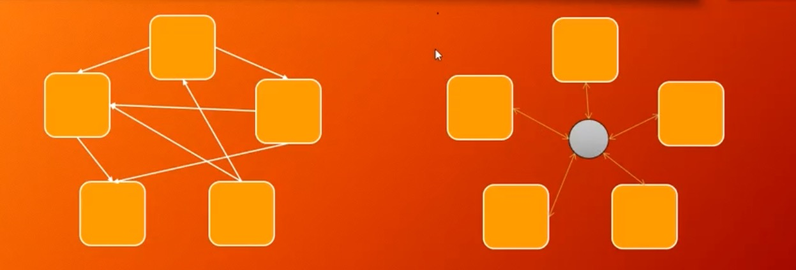
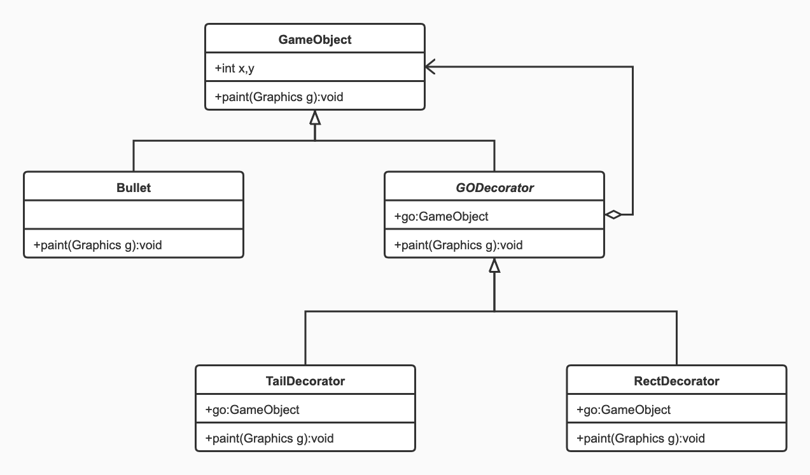

# 设计模式

## 分类:


**需要了解到什么程度**

1. 看到名字,需要知道典型用法.
2. 类图,要想的起来

## 我用过的设计模式/实用的设计模式:

**用过**

1. singleton单例:一些mgr,我写过一个反射生成实例的工具类.
2. Strategy策略:安徽/吉林生成索引代码迁移时候,相同的方法,但是有细微的不同.
3. facade门面:查询报表,业务极其复杂,分布在不同的类中,通过facade来连接起这些业务.
4. chain of responsibility责任链:因为生成索引太过于灵活,各环节相关联性不高,到最后经常出问题,所以增加这个,多个环节验证.灵活增加验证配置.
5. builder建造者:基础数据查询,超级复杂而又灵活多变的查询条件.
6. templateMethod模板方法:es-sql,多种查询方式,最终查询相同,只是前期处理参数不同.

**实用**

1. factory工厂:基本被spring代替了.
2. observer观察者:回调函数,listener,
3. proxy代理:spring切面核心.
4. Adapter适配器:各驱动.改代码,使之适合新的需求.
5. Iterator迭代器:现有框架基本够用.

## 面向对象六大设计原则

**指导思想 几个bility**

1. 可维护性Maintainability
   * 修改功能,需要改动的地方越少,可维护性越好.
2. 可复用性Reusabulity
   * 代码可以被以后重复利用
   * 写出自己总结的类库
3. 可扩展性Extensibility/Scalability
   * 添加功能无需修改原来的代码
4. 灵活性flexbulity/mobility/adaptability
   * 代码接口可以灵活调用

**原则**

1. 单一职责原则

   > Single Responsebility Principle
   >
   > 一个类别太大,别太累,负责单一的职责
   >
   > > Person
   > >
   > > PersonBuilder
   >
   > 高内聚,低耦合

2. 开闭原则

   > Open-Closed Principle
   >
   > 对扩展开放,对修改关闭
   >
   > > 尽量不去修改原来的代码的情况下进行扩展
   >
   > 抽象化,多态是抽象原则的关键

3. 里式替换原则

   > Liscov Substitution Principle
   >
   > 所有使用父类的地方,必须能够透明的使用子类对象
   >
   > 1、里氏替换原则通俗的来讲就是：子类可以扩展父类的功能，但不能改变父类原有的功能。
   >
   > 2、里氏代换原则告诉我们，<font color="red">在软件中将一个基类对象替换成它的子类对象，程序将不会产生任何错误和异常，反过来则不成立，</font>如果一个软件实体使用的是一个子类对象的话，那么它不一定能够使用基类对象。
   >
   > 3、里氏代换原则是实现开闭原则的重要方式之一，由于使用基类对象的地方都可以使用子类对象，因此在程序中尽量使用基类类型来对对象进行定义，而在运行时再确定其子类类型，用子类对象来替换父类对象

4. 依赖倒置原则

   > Dependency Inversion Principle
   >
   > 依赖倒置原则
   >
   > > 依赖抽象,而不是依赖具体
   > >
   > > 面向抽象(接口)编程

5. 接口隔离原则

   > Interface Segregation Principle
   >
   > 每一个接口应该承担独立的角色,不干不该自己干的事儿.
   >
   > > Flyable Runnable 不该合二为一
   > >
   > > 避免子类实现不需要的实现的方法
   > >
   > > 需要对客户提供接口的时候,只需要暴露最小的接口

6. 迪米特法则

   > Law of Demeter
   >
   > 尽量不要和陌生人说话
   >
   > 在迪米特法则中,对于一个对象,非陌生人包括以下几类
   >
   > >当前对象本身(this)
   > >
   > >以参数形式传入到当前对象方法中的对象
   > >
   > >当前对象的成员对象
   > >
   > >如果当前对象的成员对象是一个集合,那么集合中的元素也都是朋友
   > >
   > >当前对象所创建的对象
   >
   > 和其他类的耦合度变低

## 1.Singleton 单例模式 

> 只能new一个对象实例,叫做单例模式

**类图**


### 1.常用场景.

1. 各种Mgr.例如文件管理Mgr→PropertiesMgr.
2. 各种Factory

### 2.实现方式.

#### 1.饿汉式:简单方式,常用方式.推荐使用.

1. 上来就 `new` 一个`final static`实例.
2. 写一个空的.`private`的构造方法;(不让别人new).
3. 只提供getInstance()方法,返回实例本身;

```java
public class Singleton {
		//程序第一次加载就new个实例
    private static final Singleton INSTANCE = new Singleton();
		//不让别人new实例
    private Singleton() {
    }
    //只提供getInstance方法,返回这个实例.所有调用这个方法的都是同一个实例.
    public static Singleton getInstance() {
        return INSTANCE;
    }
}
```

#### 2.懒汉式:常规完美方法.面试常用.

```java
public class Singleton {
		//不让别人new
    private Singleton() {

    }
		//声明一个,没用到的时候不初始化.//volatile,避免指令重排序(创建对象成功,未初始化,就被别的线程拿走了)(基本不可能)
    private static volatile Singleton INSTANCE;
		//调用getInstance方法时候,初始化.
    public static Singleton getInstance() {
      	//多线程时候,判断是否为null(这个速度特别快,<1ns ,而上来就加锁效率极低.当大部分情况,已经初始化过后,不在进入里面的代码.)
        if (INSTANCE == null) {
          	//多线程,同时判断null,可能进来好几个,这时候必须加锁,
            synchronized (Singleton.class) {
              	//一个个得到锁进来了,再次判断是否非空.
                if (INSTANCE == null) {
                    INSTANCE = new Singleton();
                }
            }
        }
        return INSTANCE;
    }

}
```

#### 3.匿名内部类写法:完美写法,但复杂不常用

```java
public class Singleton {

    private Singleton() {

    }
		//第一次加载时候,静态内部类不会被加载,只有调用getInstance时候才会加载.
    static class SingletonHolder {
        public static final Singleton INSTANCE = new Singleton();
    }

    public static Singleton getInstance() {
        return SingletonHolder.INSTANCE;
    }

}
```

#### 4.effective Java大神写的 枚举类写法.

```java
public enum  EnumSingleton {
    INSTANCE;
    public EnumSingleton getInstance(){
        return INSTANCE;
    }
}
```

**优点**

1. 防止反射
2. 反序列化

### 3.单例模式的好处.

在门面模式和调停者模式遇到的,可以降低耦合度的问题.具体介绍如下.

1. 在调停者GameModel中,有个add方法,是将元素加入到List中.

   ```java
   public void add(GameObject gameObject){
           this.objects.add(gameObject);
   }
   ```

2. 那么在以前呢,在各个GameObject的实现类中每个构造方法都需要持有这个gm,才可以调用add.例如Bullet的构造方法:

   ```java
   public Bullet(int x, int y, Dir dir, Group group, GameModel gm) {
           this.x = x;
           this.y = y;
           this.dir = dir;
           this.group = group;
     			//先声明,再持有引用,才可以使用.
           this.gm = gm;
   
           rect.x = this.x;
           rect.y = this.y;
           rect.width = WIDTH;
           rect.height = HEIGHT;
   				
           gm.add(this);
       }
   ```

3. 但是将GameModel变成单例后,就可以这样:就降低了耦合度

   ```java
   private static final GameModel INSTANCE = new GameModel();
   public static GameModel getINSTANCE() {
           return INSTANCE;
       }
   ```

   ```java
   public Bullet(int x, int y, Dir dir, Group group) {
           this.x = x;
           this.y = y;
           this.dir = dir;
           this.group = group;
   
           rect.x = this.x;
           rect.y = this.y;
           rect.width = WIDTH;
           rect.height = HEIGHT;
   
           GameModel.getINSTANCE().add(this);
       }
   ```

   

## 2.Strategy 策略模式 

**类图**


### 1.简单介绍

1. **主要解决:** 在有多种算法相似的情况下,使用if...else带来的复杂和难以维护.
2. **何时使用:** 一个系统中有许多类,区分它们的主要是他们的直接行为
3. **如何解决:** 将这些算法封装成一个一个的类，任意地替换。
4. **关键代码:** 实现同一个接口

### 2.优缺点

**优点：** 1、算法可以自由切换。 2、避免使用多重条件判断。 3、扩展性良好。

**缺点：** 1、策略类会增多。 2、所有策略类都需要对外暴露。

### 3.实现方式举例说明:

1. 创建一个Strategy接口.

   ```java
   public interface FireStrategy {
       void fire(Tank tank);
   }
   ```

2. 创建多个功能类实现这个接口.

   ```java
   //默认的坦克方向的打子弹的
   public class DefaultFireStrategy implements FireStrategy{
       @Override
       public void fire(Tank tank) {
           int bx = tank.x + Tank.WIDTH/2 - Bullet.WIDTH/2;
           int by = tank.y + Tank.HEIGHT/2 - Bullet.HEIGHT/2;
           
           new Bullet(bx,by,tank.dir,tank.group);
           if (tank.group == Group.GOOD) new Thread(()->new Audio("audio/tank_fire.wav"));
       }
   }
   ```

   ```java
   //四个方向打子弹的
   public class FourDirFireStrategy implements FireStrategy{
       @Override
       public void fire(Tank tank) {
           int bx = tank.x + Tank.WIDTH/2 - Bullet.WIDTH/2;
           int by = tank.y + Tank.HEIGHT/2 - Bullet.HEIGHT/2;
   
           Dir[] dirs = Dir.values();
           for (Dir dir : dirs) {
               new Bullet(bx,by,dir,tank.group);
           }
           if (tank.group == Group.GOOD) new Thread(()->new Audio("audio/tank_fire.wav"));
       }
   }
   ```

3. 在调用这个功能的地方,传入实例和策略.或者生成不同的策略.(通过类名反射生成实例,就可以不改代码更改策略.)

   ```java
   FireStrategy fs;
   try {
     if (group == Group.GOOD){
       //通过类名反射创建实例,这样就可以不改代码了,只改配置文件就可以修改策略了
       //            fs = new FourDirFireStrategy();
       fs = (FireStrategy) ClassReflectUtils.getClassInstanceByReflectPath((String) PropertyMgr.get("goodFireStrategy"));
     }else {
       //            fs = new DefaultFireStrategy();
       fs = (FireStrategy) ClassReflectUtils.getClassInstanceByReflectPath((String) PropertyMgr.get("badFireStrategy"));
     }
   } catch (ClassNotFoundException e) {
     e.printStackTrace();
   } catch (IllegalAccessException e) {
     e.printStackTrace();
   } catch (InstantiationException e) {
     e.printStackTrace();
   }
   ```

### 4.策略模式与state状态模式的区别

#### 区别：

1. 状态模式重点在各状态之间的切换，从而做不同的事情；而策略模式更侧重于根据具体情况选择策略，并不涉及切换。
2. 状态模式不同状态下做的事情不同，而策略模式做的都是同一件事。例如，聚合支付平台，有支付宝、微信支付、银联支付，虽然策略不同，但最终做的事情都是支付，也就是说他们之间是可替换的。反观状态模式，各个状态的同一方法做的是不同的事，不能互相替换。
3. 状态模式封装了对象的状态，而策略模式封装算法或策略。因为状态是跟对象密切相关的，它不能被重用；而策略模式通过从Context中分离出策略或算法，我们可以重用它们。
4. 在状态模式中，每个状态通过**持有Context的引用**，来实现状态转移；但是每个策略都不持有Context的引用，它们**只是被Context使用**。
5. 状态模式将各个状态所对应的操作分离开来，即对于不同的状态，由不同的子类实现具体操作，不同状态的切换由子类实现，当发现传入参数不是自己这个状态所对应的参数，则自己给Context类切换状态；这种转换是"自动"，"无意识"的。状态模式允许对象在内部状态改变时改变它的行为，对象看起来好像修改了它的类。而策略模式是直接依赖注入到Context类的参数进行策略选择，不存在切换状态的操作。
6. 策略模式的客户端必须对所有的策略类相当了解，明确当前场景下各种策略的利弊，权衡在当前场景下应该使用哪种策略，也就是是说策略类对客户端是暴露的，**策略是外界给的，策略怎么变，是调用者考虑的事情，系统只是根据所给的策略做事情。**

状态模式依赖于其状态的变化时其内部的行为发生变化，将动作委托到代表当前状态的对象，对外表现为类发生了变化。**状态是系统自身的固有的，由系统本身控制，调用者不能直接指定或改变系统的状态转移。**

#### 联系：

状态模式和策略模式都是为具有多种可能情形设计的模式，把不同的处理情形抽象为一个相同的接口，符合对扩展开放，对修改封闭的原则。

还有就是，策略模式更具有一般性一些，在实践中，可以用策略模式来封装几乎任何类型的规则，只要在分析过程中听到需要在不同实践应用不同的业务规则，就可以考虑使用策略模式处理，在这点上策略模式是包含状态模式的功能的，策略模式是一个重要的设计模式。

## 3.Factory 工厂模式 

> 任何可以产生对象的方法或类,都可以称之为工厂.

[简单工厂,工厂方法模式,抽象工厂模式比较](https://blog.csdn.net/weixin_45872600/article/details/108904967)

**我有个疑问,工厂模式如果用的抽象类,而不是接口,还算是工厂方式吗**

网上查了很多信息,基本都是创建个接口,实现接口,但是我试验了抽象类,也是可以的,我觉得Vehicle这个东西就应该是个抽象类,因为他是一个有具体实意的类,一个名词类.是个交通工具.而若是一些操作类的,则应该是接口.例如VehicleFactory,里面有createVehicle().等等.

### 1.工厂系列

1. 简单工厂

   > 定义：定义一个工厂类，它可以根据 参数的不同返回不同类的实例，被创建的实例通常都有共同的父类  
   > 结构：Factory(工厂）、Product(抽象产品)、ConcreteProduct（具体产品）  
   > 优点：  
   >
   > > 1.简单工厂模式实现了**对象创建与使用的分离 **     
   > >
   > > 2.客户端只需知道**具体产品对应的参数**即可，减少了使用者的记忆量      
   > >
   > > 3.通过引入配置文件，可以不修改客户端的代码来增加新的具体产品类，提高了系统的灵活性    
   >
   > 缺点：  
   >
   > > 1.工厂类的职责过重，一旦不能正常工作，整个系统都要受到影响  
   > > 2.增加了类的个数（工厂类）,增加了系统的复杂度和理解难度  
   > > 3.**系统扩展困难，添加新产品时不得不修改工厂逻辑,不利于系统的扩展和维护**  
   > > 4.简单工厂模式使**用了静态工厂方法，造成工厂角色无法形成基于继承的等级结构**  
   >
   > 适用环境：  
   >
   > > 1.工厂类负责创建的对象比较少  
   > > 2.**客户端只知道传入工厂类的参数，对如何创建对象不关心**  

2. 工厂方法

   > 定义：定义一个用于创建对象的接口，但是让子类决定将哪一个类实例化。**工厂方法模式让一个类的实例化延迟到其子类**。  
   > 结构：  Factory(抽象工厂)、ConcreteFactroy(具体工厂)、Product（抽象产品）、ConcreteProduct（具体产品）  
   > 优点：  
   >
   > > 1.向客户隐藏了那种具体产品将被实例化这一细节，用户只需要关心所需产品对应的工厂  
   > > 2.让工厂自主确定创建何种产品  
   > > 3.加入新产品时，只要添加一个具体工厂和具体产品即可，**可扩展性很好，完全符合开闭原则**  
   >
   > 缺点：  
   >
   > > 1.添加新的产品时,系统中的类成对的增加，增加了系统的复杂度  
   > > 2.为了有良好的可扩展性，需要引入抽象层，但增加了系统的抽象性和理解难度   
   >
   > 适用环境：  
   >
   > > 1.客户端不知道它所需要的对象的类  
   > > 2.抽象工厂类通过其子类指定创建那个对象  

3. 抽象工厂

   > 定义：提供一个创建一系列相关或相互依赖的对象的接口，而无需指定他们具体的类  
   > 结构：AbstractFactory(抽象工厂)、ConcreteFactory(具体工厂)、AbstractProduct(抽象产品)、ConcreteProduct(具体产品)  
   > 优点：  
   >
   > > 1.抽象工厂隔离了具体类的生成，更换一个具体工厂相对容易  
   > > 2.能够保证客户端始终只使用同一个产品族中的对象  
   > > 3.**增加新的产品族很方便，无须修改已有系统，符合开闭原则**  
   >
   > 缺点：  
   >
   > > 1.**增加新的产品等级结构麻烦，甚至要修改抽象层，违背了开闭原则** 
   >
   > 适用环境：  
   >
   > > 1.用户关心对象的创建过程  
   > > 2.系统中有多于一个的产品族，可以通过配置文件使用户能动态的改变产品族，也可以很方便的增加行的产品族  
   > > 3.属于同一个产品族的产品将在一起使用  
   > > 4.产品等级结构稳定，在设计之后不会改变系统中的产品等级结构  

### 2.具体实现方法

#### 1.简单工厂

**类图**


1. 定义个接口,里面有个方法.

   ```java
   public interface Vehicle {
       void go();
   }
   ```

2. 定义三个类,分别实现这个接口.重写方法.

   ```java
   public class Car implements Vehicle {
       @Override
       public void go() {
           System.out.println("我是car");
       }
   }
   public class Plane implements Vehicle {
       @Override
       public void go() {
           System.out.println("我是plane");
       }
   }
   public class Broom implements Vehicle {
       @Override
       public void go() {
           System.out.println("broom 飞");
       }
   }
   ```

3. 创建工厂类,根据参数,创造不同的实例

   ```java
   public class VehicleFactory {
       //静态工厂方法
       public static Vehicle getVehicle(String vehicleType){
           Vehicle vehicle = null;
           if ("car".equalsIgnoreCase(vehicleType)){
               vehicle = new Car();
               System.out.println("car 的实例创建了");
           }else if("plane".equalsIgnoreCase(vehicleType)){
               vehicle = new Plane();
               System.out.println("plane 的实例创建了");
           }else if("broom".equalsIgnoreCase(vehicleType)){
               vehicle = new Broom();
               System.out.println("broom 的实例创建了");
           }
           return vehicle;
       }
   }
   ```

4. 调用的时候,创建接口实例 = new 某个类.

   ```java
   public class Main {
       public static void main(String[] args) {
           Vehicle vehicle = VehicleFactory.getVehicle("broom");//getVehicle("car/plane")
           vehicle.go();
       }
   }
   ```

   

#### 2.工厂方法

**类图**


1. 定义个接口,里面有个方法

   ```java
   public interface Vehicle {
       void go();
   }
   ```

2. 创建两个实体类,实现接口

   ```java
   public class Car implements Vehicle {
       @Override
       public void go() {
           System.out.println("我是car");
       }
   }
   public class Plane implements Vehicle {
       @Override
       public void go() {
           System.out.println("我是plane");
       }
   }
   ```

3. 创建一个创建交通工具的工厂(接口)

   ```java
   public interface VehicleFactory {
       public Vehicle createVehicle();
   }
   ```

4. 分别创建两个具体生产实例的工厂,实现总工厂.

   ```java
   public class CarFactory implements VehicleFactory {
       @Override
       public Vehicle createVehicle() {
           Car c = new Car();
         //创建实例的时候,可以做特殊的事情.
           System.out.println("car 的实例创建了");
           return c;
       }
   }
   
   public class PlaneFactory implements VehicleFactory{
       @Override
       public Vehicle createVehicle() {
           Plane plane = new Plane();
         //创建实例的时候,可以做特殊的事情.
           System.out.println("plane 创建了");
           return plane;
       }
   }
   ```

5. 调用方法时候,可根据创建不同的工厂,创建不同的实例.

   ```java
    public static void main(String[] args) {
           VehicleFactory vehicleFactory = new PlaneFactory();
           Vehicle vehicle = vehicleFactory.createVehicle();
           vehicle.go();
    }
   ```

#### 3.抽象工厂

> 什么时候用接口,什么时候用abstract?
>
> 形容的时候用接口.名词时候用abstract

**类图**


1. 创建总工厂.确定要干的事

   ```java
   public abstract class AbstractFactory {
       abstract Food createFood();
       abstract Weapon createWeapon();
       abstract Vehicle createVehicle();
   }
   ```

2. 各个族类,创建自己的工厂,继承主工厂.每个工厂生产某一族

   ```java
   public class ModernFactory extends AbstractFactory{
       @Override
       Food createFood() {
           return new Bread();
       }
   
       @Override
       Weapon createWeapon() {
           return new AK47();
       }
   
       @Override
       Vehicle createVehicle() {
           return new Car();
       }
   
   }
   
   public class MagicFactory extends AbstractFactory{
       @Override
       Food createFood() {
           return new MushRoom();
       }
   
       @Override
       Weapon createWeapon() {
           return new MagicStick();
       }
   
       @Override
       Vehicle createVehicle() {
           return new Broom();
       }
   }
   ```

3. 创建抽象具体接口

   ```java
   public abstract class Weapon {
       abstract void shoot();
   }
   
   public abstract class Food {
       abstract void printName();
   }
   
   public abstract class Vehicle {
       abstract void go();
   }
   ```

4. 各个族类创建各自的实体类,实现上面各接口.

   1. 人族

   ```java
   public class AK47 extends Weapon{
       @Override
       void shoot() {
           System.out.println("我是AK47  突突突. 我是人类一族的");
       }
   }
   public class Bread extends Food{
       @Override
       void printName() {
           System.out.println("我是面包.人类一族的");
       }
   }
   public class Car extends Vehicle{
       @Override
       void go() {
           System.out.println("我是小汽车,人类一族的");
       }
   }
   ```

   2. 神族

   ```java
   public class MagicStick extends Weapon{
       @Override
       void shoot() {
           System.out.println("我是魔法棒 我是神仙一族");
       }
   }
   public class MushRoom extends Food{
       @Override
       void printName() {
           System.out.println("我是蘑菇,我是神仙一族");
       }
   }
   public class Broom extends Vehicle{
       @Override
       void go() {
           System.out.println("我是魔法扫帚,我是神仙一族");
       }
   }
   ```

5. 主类调用.

   ```java
   public class Main {
       public static void main(String[] args) {
           AbstractFactory factory = new MagicFactory();//想改变其他族类,只需在这里改.new 其他工厂//(可以配置文件反射生成)
           Vehicle vehicle = factory.createVehicle();
           vehicle.go();
   
           Food food = factory.createFood();
           food.printName();
   
           Weapon weapon = factory.createWeapon();
           weapon.shoot();
       }
   }
   ```

### 3.springIOC

>springIOC 基本整合了工厂方法和抽象工厂.必会.
>
>springIOC将创建对象这个事接管了.

#### 1.springIOC是什么?

IOC:Inversion Of Control 控制反转 .什么意思呢,简单说,以前控制创建对象需要new,现在反转了不需要了.
IOC也叫DI:Dependency Injection 依赖注入 .简单说就是,你需要什么,它帮助你注入进去.

#### 2.简单实例操作.(配置文件)

1. 创建spring配置文件.spring所有的配置都写在配置文件中.

   ```java
   <!--交给spring管理的类.-->
   <bean id="d" class="com.fsl.springIOCtest.Driver"></bean>
   <!--需要上面的依赖的业务类.在tank实例化的时候,d也被创建-->
   <bean id="tank" class="com.fsl.springIOCtest.Tank">
       <property name="driver" ref="d"></property>
   </bean>
   ```

2. 创建个需要被管理的类.

   ```java
   public class Driver {
     //只有一个构造方法.实例被创建时候调用
       public Driver(){
           System.out.println("driver 又被创建了");
       }
   }
   ```

3. 创建个业务类,里面有需要的依赖类.

   ```java
   public class Tank {
     //仅声明,并没有new 
       Driver driver;
   	//这个set方法很重要.spring就是通过这个set方法将实例注入的,没有这个set方法,spring配置文件报错
       public void setDriver(Driver driver) {
           this.driver = driver;
       }
   }
   ```

4. 调用业务

   ```java
   public class Main {
       public static void main(String[] args) {
         //读取配置文件 (app.xml)
           ApplicationContext fileContext = FileUtils.getFileContext();
   //        Driver d = (Driver) fileContext.getBean("d");
         //现在只需像配置文件一样,即可将内部的属性直接注入进去,适合初始化属性.
           Tank tank = (Tank) fileContext.getBean("tank");
       }
   }
   ```

## 4.Facade 门面

**类图**


### 1.门面的理解.

当一个外部程序需要和很多功能打交道时候,外部程序和这些功能分别打交道,很复杂,如果再来一个新的功能,关系会变得更加复杂.这时候,在一些功能外围,增加个大管家.就是门面,封装起来,外部程序只和大管家打交道,其他的功能模块,交到大管家管理.

例如说,一个坦克大战游戏,有坦克,子弹,墙,地雷,此时frame需要分别控制这些,如果此时再来个地雷,那么又要新增控制,并且地雷和坦克子弹等内部功能块也可能有复杂关系.

### 2.图解


## 5.Mediator 调停者

> 当一些系统互相之间需要打交道,关系很乱的时候,这时候,出现个调停者.所有的系统都和调停者打交道,不再互相之间打交道.

#### **模式的结构**

中介者模式包含以下主要角色。

1. 抽象中介者（Mediator）角色：它是中介者的接口，提供了同事对象注册与转发同事对象信息的抽象方法。
2. 具体中介者（Concrete Mediator）角色：实现中介者接口，定义一个 List 来管理同事对象，协调各个同事角色之间的交互关系，因此它依赖于同事角色。
3. 抽象同事类（Colleague）角色：定义同事类的接口，保存中介者对象，提供同事对象交互的抽象方法，实现所有相互影响的同事类的公共功能。
4. 具体同事类（Concrete Colleague）角色：是抽象同事类的实现者，当需要与其他同事对象交互时，由中介者对象负责后续的交互。

**类图**


### 1.图解



### 2.应用

**MQ** 消息中间件

### 3.应用思路

假如坦克大战游戏,里面有坦克,子弹,爆炸效果三个元素.在原有设计中,都是TankFrame中,写一个`List<Tank>,List<Bullet>,List<Explode>`,分别将每次new出来的元素装到对应的list中.然后,在各个类中处理各自的事件,例如子弹类碰撞坦克,然后new出Explode产生爆炸效果.

**用调停者Mediator改造**:

1. 首先,创建个GameModel作为调停者,所有的坦克,子弹,爆炸元素都只和他打交道.功能包括创建元素,碰撞检测,元素消失等.TankFrame的工作应该只剩下画画,展示,剩下的移到GameModel中,

2. 创建所有元素的父类GameObject,抽出共有属性方法.例如属性位置x,y,方法paint(Graphics g)等.

3. 然后Tank,Bullet,Explode分别继承这个抽象类GameObject,这样,GameModel中就由三个`List<Tank>,List<Bullet>,List<Explode>`变成了一个`List<GameObject>` objects.这个list有add和remove方法供元素加入进去和消亡使用.

4. 在GameModel的paint()方法中,以前是各自的List元素各自paint,现在不需要了,只需objects.for(){objects.get(i).paint(g)},然后各自就画各自的了.

5. 继续,关键来了,原先这里有一些事件方法.检测方法.比如子弹与坦克的碰撞事件操作.具体实现方法如下.

6. 抽出一个Collider(名字随便起,这里是符合当前的业务起名)接口,接口里有个collide(GameObject o1,GameObject o1)方法,用来检测两个元素会发生什么事情.

7. 将以前的检测事件抽出为***Conllider,实现Collider接口,例如子弹与坦克碰撞方法,创建类BulletTankCollider implements Collider {}.当再有其他的,比如坦克与坦克碰到一起的时候,怎么办,创建类TankTankCollider implements Collider {} 

   ```java
   //BulletTankCollider
   @Overrite
   public void collide(GameObject o1,GameObject o1){
   	if(o1 instanceof Bullet && o2 instanceof Tank){
   		Bullet b = (Bullet) o1;
   		Tank t = (Tank) o2;
   		b.collodeWith(t);//这是个自己写的位置检测碰撞方法.
   	} else if (o1 instanceof Tank && o2 instanceof Bullet) {
   		collide(o2,o1);//如果反着,将参数反着再调用一遍方法.
   	} else 
   		return;
   }
   
   //TankTankCollider
   @Overrite
   public void collide(GameObject o1,GameObject o1){
   	if(o1 instanceof Tank && o2 instanceof Tank){
   		Tank t1 = (Tank) o1;
   		Tank t2 = (Tank) o2;
   		if (t1 相交于 t2){
         t1,t2回到上个位置//需要记录oldX,oldY
       }
   	} else 
   		return;
   }
   ```

8. 在GameModel的paint(Graphis g)方法中,这样,各个元素就不再互相打交道,只有GameModel和GameObject打交道.再新来的元素也是一种GameObject.

   ```java 
   //创建处理方法实例
   Collider collider = new BulletTankCollider();
   //有多个创建多个.
   Collider collider2 = new TankTankCollider();
   
   public void paint(Graphis g){
     for(int i=0;i<objects.size();i++){
       GameObject o1 = objects.get(i);
       for(int j=i+1;j<object.size();j++){
         GameObject o2 = objects.get(j);
         //交给事件处理器处理.
   			collider.collide(o1,o2);
         //其他的事件处理
         collider2.collide(o1,o2);
         //collider3.collide(o1,o2);
         //collider4.collide(o1,o2);
       }
     }
   }
   
   ```

   

## 6.Chain Of Responsibility 责任链模式

> 简单说:一个个功能类,每个类负责一块功能,穿起来,像一个链条一样,其中一个断掉就结束返回.

### 1.定义

为了避免请求发送者与多个请求处理者耦合在一起，于是将所有请求的处理者通过前一对象记住其下一个对象的引用而连成一条链；当有请求发生时，可将请求沿着这条链传递，直到有对象处理它为止。

### 2.应用

doFilter(HttpRequest request,HttpResponse response,FilterChain chain)

### 3.实例1

其实上一章调停者模式中,Collider接口及实现类就算是责任链(的思路).但是我们还可以将其再优化一下.

1. 我们发现,每增加一个新的物体,增加新的collide事件就需要改就需要新增一个Collider类.这样不好.优化下.

2. 新增加个ColliderChain,我们让他也实现Collider.这样这个链条就将所有的碰撞事件组件连在一起了,在需要用的地方只需要new ColliderChain.

   ```java
   public class ColliderChain implements Collider{
     private List<Collider> colliderList = new LinkedList<>();
     public ColliderChain(){
   //        add(new BulletTankCollider());
   //        add(new TankTankCollider());
           //写到配置文件里,就不需要更改程序了.只需要改配置文件的类的数量
           String colliderPath = (String) PropertyMgr.get("colliderPath");
           for (String path : colliderPath.split(",")) {
               try {
                   add((Collider) ClassReflectUtils.getClassInstanceByReflectPath(path));
               } catch (ClassNotFoundException e) {
                   e.printStackTrace();
               } catch (IllegalAccessException e) {
                   e.printStackTrace();
               } catch (InstantiationException e) {
                   e.printStackTrace();
               }
           }
       }
     public void add(Collider c){
           colliderList.add(c);
       }
     //这里返回boolean,如果链条中某个责任组件发现他没通过,则直接返回false中断.
     public boolean collide(GameObject o1,GameObject o2){
           for (int i = 0; i < colliderList.size(); i++) {
             		//ColliderList中装的是Collider的各种实现,具体走哪一种,看他实例是哪个.
                 if (!colliderList.get(i).collide(o1,o2)){
                     return false;
                 }
           }
           return true;
       }
   }
   ```

3. 这样在GameModel中就可以.将一个个new 的**Collider换成ColliderChain.

   ```java
   ColliderChain chain = new ColliderChain();
   public void paint(Graphis g){
     for(int i=0;i<objects.size();i++){
       GameObject o1 = objects.get(i);
       for(int j=i+1;j<object.size();j++){
         GameObject o2 = objects.get(j);
         chain.collide(o1,o2);//这个是chain中该做的事,所以在chain创建这个方法
       }
     }
   }
   ```

### 4.实例2 

**类图**


有时候,我们需要将链条去的时候执行123,回来时候执行321顺序,就像doFilter(request,response).这时候怎么办呢.

1. 创建过滤器接口

   ```java
   interface Filter{
       void doFilter(String request,String response,FilterChain filterChain);
   }
   ```

2. 让过滤器实例实现它.

   ```java
   class HtmlFilter implements Filter{
       @Override
       public void doFilter(String request, String response, FilterChain filterChain) {
           System.out.println("chain HtmlFilter 处理了req");
           //走到这,显式判断是否继续向下执行.如果不显式调用doFilter,那么链条中断
           filterChain.doFilter(request,request,filterChain);
           System.out.println("chain HtmlFilter 处理了res");
       }
   }
   class SensitiveFilter implements Filter{
       @Override
       public void doFilter(String request, String response, FilterChain filterChain) {
           System.out.println("chain SensitiveFilter 处理了req");
           filterChain.doFilter(request,response,filterChain);
           //如果这是最后一个链条中的filter,并且走完了,那么将执行doFilter之后的,之后向前,有点像递归
           System.out.println("chain SensitiveFilter 处理了res");
       }
   }
   ```

3. 让chain也实现它,重点来了,仔细看chain的doFilter实现.

   ```java
   class FilterChain implements Filter{
       //初始位置
       int index = 0;
       List<Filter> filterList = new ArrayList<>();
   
       public FilterChain add(Filter f){
           filterList.add(f);
           return this;
       }
   
       @Override
       public void doFilter(String request, String response, FilterChain filterChain) {
           //如果所有的filter走完了,return
           if (filterList.size()<=index)
               return;
           else{
               //否则执行当前的filter
               Filter filter = filterList.get(index);
               //将下标指向下一个,这个很重要
               index++;
               filter.doFilter(request, response,filterChain);
           }
       }
   }
   ```

4. 调用chain处理

   ```java
   public class Main {
       public static void main(String[] args) {
           String s = "";
           FilterChain fc = new FilterChain();
         	//初始化,添加两个过滤器
           fc.add(new HtmlFilter()).add(new SensitiveFilter());
           fc.doFilter(s,s,fc);
       }
   }
   ```

   

## 7.装饰者 Decorator

> 就是在原来的东西上加点装饰.
>
> 例如:坦克加个外壳,加个血条,加个尾巴,子弹加点啥啥啥.....
>
> 如果用继承方式.例如坦克框类继承,血条类继承.等等.不灵活!!装饰和被装饰者耦合度太高.

### 1.类图



### 2.实现方式

1. 定义一个总的抽象类,

   ```java
   public abstract class GODecorator extends GameObject {
     //内部聚合一个GameObject,坦克,子弹.所有元素都是从这个类继承的.所有的元素都可以使用这个Decorator
       GameObject go;
   
       public GODecorator(GameObject go) {
           this.go = go;
       }
       //
       @Override
       public void paint(Graphics g) {
           go.paint(g);
       }
       //getHeight和getWidth留着让实现他的类自己去实现
   }
   ```

2. 创建一个类去继承总的装饰类

   ```java
   public class RectDecorator extends GODecorator{
       public RectDecorator(GameObject go) {
           /*
               调用父类的构造方法语法：
               super();
               或
               super(参数列表);
               */
           super(go);
       }
       @Override
       public int getHeight() {
           //这里实际是GameObject的方法,返回的事坦克,子弹等等的height,下面同理
           return super.go.getHeight();
       }
       @Override
       public int getWidth() {
           return super.go.getWidth();
       }
       @Override
       public void paint(Graphics g) {
           this.x = go.x;
           this.y = go.y;
           go.paint(g);
   
           Color c = g.getColor();
           g.setColor(Color.white);
           g.drawRect(super.go.x,super.go.y,super.go.getWidth()+2,super.go.getHeight()+2);
           g.setColor(c);
   
       }
   }
   
   ```

3. 这样在创建元素的时候,就可以用装饰器包住具体元素了.例如:

   ```java
   //fire方法创建子弹.
   GameModel.getINSTANCE().add(new RectDecorator(new Bullet(bx,by,tank.dir,tank.group)));
   ```

4. 更高级的用法.再创建个装饰器类.然后再包住一个装饰器,因为他们都是继承自GameObject

   ```java
   public class TailDecorator extends GODecorator{
       public TailDecorator(GameObject go) {
           super(go);
       }
       @Override
       public int getHeight() {
           return super.go.getHeight();
       }
       @Override
       public int getWidth() {
           return super.go.getWidth();
       }
       @Override
       public void paint(Graphics g) {
           this.x = go.x;
           this.y = go.y;
           go.paint(g);
           Color c = g.getColor();
           g.setColor(Color.white);
           g.drawLine(super.go.x,super.go.y,super.go.x+getWidth(),super.go.y+getWidth());
           g.setColor(c);
       }
   }
   ```

   

   ```java
   GameModel.getINSTANCE().add(
                   new TailDecorator(
                           new RectDecorator(
                                   new Bullet(bx,by,tank.dir,tank.group))));
   ```

   

## 8.Observer 观察者模式

**一个重要的设计模式**

在很多系统中,Observer模式往往和责任链共同负责对于事件的处理.其中某个Observer负责是否将事件进一步传递.

### 1.类图

#### **模式的结构**

观察者模式的主要角色如下。

1. 抽象主题（Subject）角色：也叫抽象目标类，它提供了一个用于保存观察者对象的聚集类和增加、删除观察者对象的方法，以及通知所有观察者的抽象方法。
2. 具体主题（Concrete Subject）角色：也叫具体目标类，它实现抽象目标中的通知方法，当具体主题的内部状态发生改变时，通知所有注册过的观察者对象。
3. 抽象观察者（Observer）角色：它是一个抽象类或接口，它包含了一个更新自己的抽象方法，当接到具体主题的更改通知时被调用。
4. 具体观察者（Concrete Observer）角色：实现抽象观察者中定义的抽象方法，以便在得到目标的更改通知时更新自身的状态。


### 2.应用场景.

**在代码中看到以下名字的,都属于观察者模式**

- Observer
- Listener
- Hook
- CallBack

### 3.应用实例

#### (1).实例1

```java
public class ObserverPattern {
    public static void main(String[] args) {
        Subject subject = new ConcreteSubject();
        Observer obs1 = new ConcreteObserver1();
        Observer obs2 = new ConcreteObserver2();
        subject.add(obs1);
        subject.add(obs2);
        subject.notifyObserver();
    }
}
//抽象目标
abstract class Subject {
    protected List<Observer> observers = new ArrayList<Observer>();
    //增加观察者方法
    public void add(Observer observer) {
        observers.add(observer);
    }
    //删除观察者方法
    public void remove(Observer observer) {
        observers.remove(observer);
    }
    public abstract void notifyObserver(); //通知观察者方法
}
//具体目标
class ConcreteSubject extends Subject {
    public void notifyObserver() {
        System.out.println("具体目标发生改变...");
        System.out.println("--------------");
        for (Observer observer : observers) {
            observer.response();
        }
    }
}
//抽象观察者
interface Observer {
    void response(); //反应
}
//具体观察者1
class ConcreteObserver1 implements Observer {
    public void response() {
        System.out.println("具体观察者1作出反应！");
    }
}
//具体观察者1
class ConcreteObserver2 implements Observer {
    public void response() {
        System.out.println("具体观察者2作出反应！");
    }
}
```

#### (2).实例2

1. 创建个观察者父接口

   ```java
   public interface TankFireObserver {
       //对事件作出反应的接口,参数是一个事件
       void actionOnFire(TankFireEvent e);
   }
   ```

2. 创建一个实际观察者,实现观察者父接口.观察者观察的是一个事件,他观察的是个TankFireEvent

   ```java
   public class TankFireHandler implements TankFireObserver{
       @Override
       public void actionOnFire(TankFireEvent e) {
           //拿到是哪辆坦克发出的
           Tank source = e.getSource();
           //让这辆坦克source 发出子弹
           source.fire();
       }
   }
   ```

3. 定义一个事件类,事件可以拿到事件源.

   ```java
   //这是个事件类,当某个时刻,发生这个事件
   public class TankFireEvent {
       private Tank tank;
   		//事件可以得到事件源,源就是发生事件的实例.
       public Tank getSource(){
           return tank;
       }
   		//一个构造方法
       public TankFireEvent(Tank tank) {
           this.tank = tank;
       }
   }
   ```

4. 如何调用.例如坦克开火时候(以前是调用fire,new个Bullet实例,现在是发生个事件,让观察者来fire()).调用handleFireKey,创建个事件,观察者挨个进行操作.

   ```java
   //观察者列表,可以有多个观察者,类型可以是接口类
       private List<TankFireObserver> observerList = Arrays.asList(new TankFireHandler());
       public void handleFireKey() {
           //创建一个事件
           TankFireEvent event = new TankFireEvent(this);
           //遍历观察者,看看哪个观察者对这个事件作出反应.
           for (TankFireObserver tankFireObserver : observerList) {
               tankFireObserver.actionOnFire(event);
           }
       }
   ```

   

## 9.Composite 组合

### 1.类图


### 2.应用场景

**树形结构**

### 3.应用实例

组合模式包含以下主要角色。

1. 抽象构件（Component）角色：它的主要作用是为树叶构件和树枝构件声明公共接口，并实现它们的默认行为。在透明式的组合模式中抽象构件还声明访问和管理子类的接口；在安全式的组合模式中不声明访问和管理子类的接口，管理工作由树枝构件完成。（总的抽象类或接口，定义一些通用的方法，比如新增、删除）
2. 树叶构件（Leaf）角色：是组合中的叶节点对象，它没有子节点，用于继承或实现抽象构件。
3. 树枝构件（Composite）角色 / 中间构件：是组合中的分支节点对象，它有子节点，用于继承和实现抽象构件。它的主要作用是存储和管理子部件，通常包含 Add()、Remove()、GetChild() 等方法。

#### (1) 透明方式

在该方式中，由于抽象构件声明了所有子类中的全部方法，所以客户端无须区别树叶对象和树枝对象，对客户端来说是透明的。但其缺点是：树叶构件本来没有  Add()、Remove() 及 GetChild() 方法，却要实现它们（空实现或抛异常），这样会带来一些安全性问题。

**类图**


#### (2) 安全方式

在该方式中，将管理子构件的方法移到树枝构件中，抽象构件和树叶构件没有对子对象的管理方法，这样就避免了上一种方式的安全性问题，但由于叶子和分支有不同的接口，客户端在调用时要知道树叶对象和树枝对象的存在，所以失去了透明性。

**类图**


## 10.Flyweight 享元 共享元数据

> 重复利用对象

### 1.使用场景

1. 各种池子,线程池什么的,闲置的直接拿来用.
2. java中的String.所有的String都是放在常量池中.

享元模式的定义提出了两个要求，细粒度和共享对象。因为要求细粒度，所以不可避免地会使对象数量多且性质相近，此时我们就将这些对象的信息分为两个部分：内部状态和外部状态。

- 内部状态指对象共享出来的信息，存储在享元信息内部，并且不回随环境的改变而改变；
- 外部状态指对象得以依赖的一个标记，随环境的改变而改变，不可共享。

比如，连接池中的连接对象，保存在连接对象中的用户名、密码、连接URL等信息，在创建对象的时候就设置好了，不会随环境的改变而改变，这些为内部状态。而当每个连接要被回收利用时，我们需要将它标记为可用状态，这些为外部状态。

### 2.结合Composite.

将一些简单的组合后,组合成新的元数据.

### 3.实例应用

享元模式的结构图，其中：

- UnsharedConcreteFlyweight 是非享元角色，里面包含了**非共享**的外部状态信息 info；
- Flyweight 是抽象享元角色，里面包含了享元方法 operation(UnsharedConcreteFlyweight state)，非享元的外部状态以参数的形式通过该方法传入；
- ConcreteFlyweight 是具体享元角色，包含了关键字 key，它实现了抽象享元接口；
- FlyweightFactory 是享元工厂角色，它是关键字 key 来管理具体享元；
- 客户角色通过享元工厂获取具体享元，并访问具体享元的相关方法。


1. 抽象享元角色

   ```java
   //抽象享元角色
   interface Flyweight {
       public void operation(UnsharedConcreteFlyweight state);
   }
   ```

2. 具体实现享元角色

   ```java
   //具体享元角色
   class ConcreteFlyweight implements Flyweight {
       private String key;
       ConcreteFlyweight(String key) {
           this.key = key;
           System.out.println("具体享元" + key + "被创建！");
       }
       public void operation(UnsharedConcreteFlyweight outState) {
           System.out.print("具体享元" + key + "被调用，");
           System.out.println("非享元信息是:" + outState.getInfo());
       }
   }
   ```

3. 创建享元工厂

   ```java
   //享元工厂角色
   class FlyweightFactory {
       private HashMap<String, Flyweight> flyweights = new HashMap<String, Flyweight>();
       public Flyweight getFlyweight(String key) {
           Flyweight flyweight = (Flyweight) flyweights.get(key);
           if (flyweight != null) {
               System.out.println("具体享元" + key + "已经存在，被成功获取！");
           } else {
               flyweight = new ConcreteFlyweight(key);
               flyweights.put(key, flyweight);
           }
           return flyweight;
       }
   }
   ```

4. 创建非享元角色

   ```java
   //非享元角色
   class UnsharedConcreteFlyweight {
       private String info;
       UnsharedConcreteFlyweight(String info) {
           this.info = info;
       }
       public String getInfo() {
           return info;
       }
       public void setInfo(String info) {
           this.info = info;
       }
   }
   ```

5. 调用程序

   ```java
   public class FlyweightPattern {
       public static void main(String[] args) {
           FlyweightFactory factory = new FlyweightFactory();
           Flyweight f01 = factory.getFlyweight("a");
           Flyweight f02 = factory.getFlyweight("a");
           Flyweight f03 = factory.getFlyweight("a");
           Flyweight f11 = factory.getFlyweight("b");
           Flyweight f12 = factory.getFlyweight("b");
           f01.operation(new UnsharedConcreteFlyweight("第1次调用a。"));
           f02.operation(new UnsharedConcreteFlyweight("第2次调用a。"));
           f03.operation(new UnsharedConcreteFlyweight("第3次调用a。"));
           f11.operation(new UnsharedConcreteFlyweight("第1次调用b。"));
           f12.operation(new UnsharedConcreteFlyweight("第2次调用b。"));
       }
   }
   ```

   

## 11.Proxy 代理

> 静态代理
>
> 动态代理
>
> SpringAOP

[代理](https://www.cnblogs.com/daniels/p/8242592.html)

**代理模式的定义：**    

代理模式给某一个对象提供一个代理对象，并由代理对象控制对原对象的引用。通俗的来讲代理模式就是我们生活中常见的中介。   

举个例子来说明：

假如说我现在想买一辆二手车，虽然我可以自己去找车源，做质量检测等一系列的车辆过户流程，但是这确实太浪费我得时间和精力了。我只是想买一辆车而已为什么我还要额外做这么多事呢？于是我就通过中介公司来买车，他们来给我找车源，帮我办理车辆过户流程，我只是负责选择自己喜欢的车，然后付钱就可以了。

**代理模式的主要优点有：**

- 代理模式在客户端与目标对象之间起到一个中介作用和保护目标对象的作用；
- 代理对象可以扩展目标对象的功能；
- 代理模式能将客户端与目标对象分离，在一定程度上降低了系统的耦合度，增加了程序的可扩展性


 **其主要缺点是：**

- 代理模式会造成系统设计中类的数量增加
- 在客户端和目标对象之间增加一个代理对象，会造成请求处理速度变慢；
- 增加了系统的复杂度；

### 1.静态代理.

**类图**


#### 1.应用实例

1. 创建接口类

   ```java
   public interface BuyHouseInterface {
       void buyHouse();
   }
   ```

2. 具体类实现

   ```java
   /**
    * 一个具体买房人实现类
    */
   public class BuyHouseClient implements BuyHouseInterface {
       @Override
       public void buyHouse() {
           System.out.println("我买了个房子");
       }
   }
   ```

3. 代理也同样实现和实现类相同的接口

   ```java
   /**
    * 买房子的代理类
    */
   public class BuyHouseProxy implements BuyHouseInterface {
       //持有个买房子的人的引用
       BuyHouseInterface buyHouseInterface;
   
       public BuyHouseProxy(BuyHouseInterface buyHouseClient) {
           this.buyHouseInterface = buyHouseClient;
       }
   
       @Override
       public void buyHouse() {
           System.out.println("确认房屋状态");
           buyHouseInterface.buyHouse();
           System.out.println("买房后装修");
       }
   }
   ```

4. 当然可以有多个代理,分别干不同的事的代理

   ```java
   public class BuyHouseSearchProxy implements BuyHouseInterface{
       //持有个买房子的人的引用
       BuyHouseInterface buyHouseInterface;
   
       public BuyHouseSearchProxy(BuyHouseInterface buyHouseInterface) {
           this.buyHouseInterface = buyHouseInterface;
       }
   
       @Override
       public void buyHouse() {
           System.out.println("查找房源");
           buyHouseInterface.buyHouse();
       }
   }
   ```

5. 调用的时候,可以单独调用主类,或者调用某个代理,传入主类,或者干脆将个代理传给另个代理,

   ```java
   public class Main {
       public static void main(String[] args) {
           //普通的买房,核心流程
           BuyHouseClient buyHouseClient = new BuyHouseClient();
           buyHouseClient.buyHouse();
           System.out.println("===============================");
           //代理买房,全套流程  持有核心引用
           BuyHouseProxy buyHouseProxy = new BuyHouseProxy(buyHouseClient);
           buyHouseProxy.buyHouse();
           //代理套代理
           System.out.println("===============================");
           BuyHouseSearchProxy buyHouseCheckProxy = new BuyHouseSearchProxy(buyHouseProxy);
           buyHouseCheckProxy.buyHouse();
       }
   }
   ```

**静态代理总结：**

优点：可以做到在符合开闭原则的情况下对目标对象进行功能扩展。

缺点：我们得为每一个服务都得创建代理类，工作量太大，不易管理。同时接口一旦发生改变，代理类也得相应修改。 

### 2.动态代理

#### 1.应用实例

1. 创建动态代理类

   ```java
   public class DynamicProxyHandler implements InvocationHandler {
       private Object object;
   
       public DynamicProxyHandler(Object object) {
           this.object = object;
       }
   
       @Override
       public Object invoke(Object proxy, Method method, Object[] args) throws Throwable {
           System.out.println("买房前准备");
           Object result = method.invoke(object, args);
           System.out.println("买房后装修");
           return result;
       }
   }
   ```

2. 调用动态代理

   ```java
       public static void main(String[] args) {
         //这行可以将他的动态代理逻辑生成个class文件,
           System.getProperties().put("sun.misc.ProxyGenerator.saveGeneratedFiles", "true");
   //        System.getProperties().put("sun.misc.ProxyGenerator.saveGeneratedFiles", true);//这个不对
           BuyHouseInterface buyHouseInterface = new BuyHouseClient();
           /**
            * ClassLoader loader:指定当前目标对象使用的类加载器,获取加载器的方法是固定的
            * Class<?>[] interfaces:指定目标对象实现的接口的类型,使用泛型方式确认类型,因为可多实现,所以是个数组
            * InvocationHandler:指定动态处理器，执行目标对象的方法时,会触发事件处理器的方法(代理谁)
            */
           BuyHouseInterface proxyBuyHouse = (BuyHouseInterface) Proxy.newProxyInstance(
                   BuyHouseInterface.class.getClassLoader(),
                   new Class[]{BuyHouseInterface.class},
                   new DynamicProxyHandler(buyHouseInterface));
           proxyBuyHouse.buyHouse();
       }
   ```

   

### 3.SpringAOP

#### 1.思想:

AOP把软件系统分为两个部分：**核心关注点**和**横切关注点**。业务处理的主要流程是核心关注点，与之关系不大的部分是横切关注点。横切关注点的一个特点是，他们经常发生在核心关注点的多处，而各处基本相似，比如权限认证、日志、事物。AOP的作用在于分离系统中的各种关注点，将核心关注点和横切关注点分离开来。

#### 2. **AOP核心概念**

1. 横切关注点  
   对哪些方法进行拦截，拦截后怎么处理，这些关注点称之为横切关注点

2. 切面（aspect）  
   类是对物体特征的抽象，切面就是对横切关注点的抽象

3. 连接点（joinpoint）  
   被拦截到的点，因为Spring只支持方法类型的连接点，所以在Spring中连接点指的就是被拦截到的方法，实际上连接点还可以是字段或者构造器

4. 切入点（pointcut）  
   对连接点进行拦截的定义

5. 通知（advice）  
   所谓通知指的就是指拦截到连接点之后要执行的代码，通知分为前置、后置、异常、最终、环绕通知五类

6. 目标对象  
   代理的目标对象

7. 织入（weave）  
   将切面应用到目标对象并导致代理对象创建的过程

8. 引入（introduction）  
   在不修改代码的前提下，引入可以在**运行期**为类动态地添加一些方法或字段

#### 3.应用实例

1. 配置方法

   * spring 的配置文件

   ```java
   <bean id="tank" class="com.fsl.springIOCtest.v1.Tank"/>
   <bean id="timeProxy" class="com.fsl.springIOCtest.v1.TimeProxy"/>
   <aop:config>
       <!--切入方法类.里面有before,after等方法.-->
       <aop:aspect id="time" ref="timeProxy">
          <!--切点,id随便起,expression是指哪个类的哪个方法-->
          <aop:pointcut id="move" expression="execution(void com.fsl.springIOCtest.v1.Tank.move())"/>
          <!--before,在什么什么之前, pointcut-ref 在哪个切点,-->
          <aop:before method="before" pointcut-ref="move"/>
          <!--after,在什么什么之后, -->
          <aop:after method="after" pointcut-ref="move"/>
        </aop:aspect>
   </aop:config>
   ```

   * 创建个切面方法类

     ```java
     public class TimeProxy {
         public void before(){
             System.out.println("method start ... "+ System.currentTimeMillis());
         }
         public void after(){
             System.out.println("method end ... "+ System.currentTimeMillis());
         }
     }
     ```

   * 这样调用Tank的move方法时候就会先于move执行before,后于move执行after

2. 注解方法

   * 配置文件中配置过于麻烦,所以还有注解的方法.重点是在配置文件中打开自动注解.

     ```java
     <!--自动注解-->
         <aop:aspectj-autoproxy/>
         <bean id="tank" class="com.fsl.springIOCtest.v2.Tank"/>
         <bean id="timeProxy" class="com.fsl.springIOCtest.v2.TimeProxy"/>
     ```

   * 在切面方法上增加注解,切入点等

     ```java
     @Aspect
     public class TimeProxy {
         @Before("execution(void com.fsl.springIOCtest.v2.Tank.move())")
         public void before(){
             System.out.println("method start ... "+ System.currentTimeMillis());
         }
         @After("execution(void com.fsl.springIOCtest.v2.Tank.move())")
         public void after(){
             System.out.println("method end ... "+ System.currentTimeMillis());
         }
     }
     ```

   * 这样就可以生效了,调用move方法时候,会调用before,和after方法.

## 12.Iterator 迭代器模式

> 这种模式用于顺序访问集合对象的元素，不需要知道集合对象的底层表示。
>
> 提供一种方法顺序访问一个聚合对象中各个元素, 而又无须暴露该对象的内部表示。

在日常开发中，我们几乎不会自己写迭代器。除非需要定制一个自己实现的数据结构对应的迭代器，否则，开源框架提供的 API 完全够用。

**类图**


### 1.实现方式(泛型)

1. 创建一个迭代器接口,所有的遍历器实现这个接口

   ```java
    /**
    * 迭代器接口,
    */
   public interface Iterator<T> {
       //是否有下一个
       public boolean hasNext();
       //下一个元素
       public T next();
   }
   ```

2. 创建个实体遍历器,继承遍历器接口

   ```java
   public class NameIterator<T> implements Iterator<T>{
       //聚合一个要遍历的实体类
       private T[] names;
       //位置
       private int index = 0;
   
       public NameIterator(T[] names) {
           this.names = names;
       }
   
       @Override
       public boolean hasNext() {
           if (index<names.length)
               return true;
           return false;
       }
   
       @Override
       public T next() {
           T obj = names[index];
           //下标移动指向后一个元素,这个很重要.
           index++;
           return obj;
       }
   }
   ```

3. 创建个容器,持有迭代器,(还可以有其他方法.例如getIndex,getLength等)

   ```java
   /**
    * 容器,持有个迭代器
    */
   public interface Container<T> {
       //这个是最重要的,核心思想.
       public Iterator iterator();
   }
   ```

4. 实现容器接口.可以返回个迭代器.

   ```java
   public class NameContainer<T> implements Container<T>{
       private T[] names;
   
       public NameContainer(T[] names) {
           this.names = names;
       }
   
       @Override
       public Iterator iterator() {
           return new NameIterator(names);
       }
   }
   ```

5. 实体类 随便遍历什么都可以,这里模拟的事Name对象的集合遍历器

   ```java
   public class Name {
       String name;
   
       public Name(String name) {
           this.name = name;
       }
   
       public String getName() {
           return name;
       }
   }
   ```

6. 调用方法

   ```java
   public class Main {
       public static void main(String[] args) {
           //模拟一个需要遍历的数据.
           Name[] names = {new Name("nameC"),new Name("nameD")};
           //传入他的遍历器中.
           Container<Name> container = new NameContainer<>(names);
           //获取迭代器
           Iterator<Name> iterator = container.iterator();
           //只要还有,就对数据进行操作.
           while (iterator.hasNext()){
               Name name = iterator.next();
               System.out.println(name.getName());
           }
       }
   }
   ```

   

**其他知识**

* 数组 vs 链表 速度谁快

  * 向中间插入 : 链表

    打断往中间插入即可.数组的话,前面复制后面复制,都要移动.

  * 尾部添加 : 链表

    加入数组尾巴正好超了,要复制一遍.

  * 删除 : 链表

  * 随机访问 : 数组比链表快的多

  * 扩展 : 链表

  * 全遍历 : 数组快得多

## 13.Visitor 访问者

> 在结构不变的情况下动态改变对于内部元素的动作

大白话:访问者模式,只适用于,一个对象,有固定的元素,不同的人(访问者类)对这些元素产出不同的操作.一旦类中元素发生变化,所有访问者都需要改动.

例如:一个类,有两种元素,第一个人将这两种元素变成某种东西,第二个人变成另外两种,第三个人,还是操作这两种元素,不过又将是变成其他两种东西.第n个人........

访问者（Visitor）模式的定义：将作用于某种数据结构中的各元素的操作分离出来封装成独立的类，使其在不改变数据结构的前提下可以添加作用于这些元素的新的操作，为数据结构中的每个元素提供多种访问方式。它将对数据的操作与数据结构进行分离，是行为类模式中最复杂的一种模式。

**访问者（Visitor）模式主要优点如下。**

1. 扩展性好。能够在不修改对象结构中的元素的情况下，为对象结构中的元素添加新的功能。
2. 复用性好。可以通过访问者来定义整个对象结构通用的功能，从而提高系统的复用程度。
3. 灵活性好。访问者模式将数据结构与作用于结构上的操作解耦，使得操作集合可相对自由地演化而不影响系统的数据结构。
4. 符合单一职责原则。访问者模式把相关的行为封装在一起，构成一个访问者，使每一个访问者的功能都比较单一。

**访问者（Visitor）模式的主要缺点如下。**

1. 增加新的元素类很困难。在访问者模式中，每增加一个新的元素类，都要在每一个具体访问者类中增加相应的具体操作，这违背了“开闭原则”。
2. 破坏封装。访问者模式中具体元素对访问者公布细节，这破坏了对象的封装性。
3. 违反了依赖倒置原则。访问者模式依赖了具体类，而没有依赖抽象类。

### 1.模式的结构与实现

访问者（Visitor）模式实现的关键是如何将作用于元素的操作分离出来封装成独立的类，其基本结构与实现方法如下。

#### 1. 模式的结构

访问者模式包含以下主要角色。

1. 抽象访问者（Visitor）角色：定义一个访问具体元素的接口，为每个具体元素类对应一个访问操作 visit() ，该操作中的参数类型标识了被访问的具体元素。
2. 具体访问者（ConcreteVisitor）角色：实现抽象访问者角色中声明的各个访问操作，确定访问者访问一个元素时该做什么。
3. 抽象元素（Element）角色：声明一个包含接受操作 accept() 的接口，被接受的访问者对象作为 accept() 方法的参数。
4. 具体元素（ConcreteElement）角色：实现抽象元素角色提供的 accept() 操作，其方法体通常都是 visitor.visit(this) ，另外具体元素中可能还包含本身业务逻辑的相关操作。
5. 对象结构（Object Structure）角色：是一个包含元素角色的容器，提供让访问者对象遍历容器中的所有元素的方法，通常由 List、Set、Map 等聚合类实现。

**类图**


### 2.应用实例

1. 抽象元素类,并实现多具体元素

   ```java
   //抽象元素类
   interface Element {
       void accept(Visitor visitor);
   }
   //具体元素A类
   class ConcreteElementA implements Element {
       public void accept(Visitor visitor) {
           visitor.visit(this);
       }
       public String operationA() {
           return "具体元素A的操作。";
       }
   }
   //具体元素B类
   class ConcreteElementB implements Element {
       public void accept(Visitor visitor) {
           visitor.visit(this);
       }
       public String operationB() {
           return "具体元素B的操作。";
       }
   }
   ```

2. 抽象访问者类,并有具体访问者实现

   ```java
   //抽象访问者
   interface Visitor {
       void visit(ConcreteElementA element);
       void visit(ConcreteElementB element);
   }
   //具体访问者A类
   class ConcreteVisitorA implements Visitor {
       public void visit(ConcreteElementA element) {
           System.out.println("具体访问者A访问-->" + element.operationA());
       }
       public void visit(ConcreteElementB element) {
           System.out.println("具体访问者A访问-->" + element.operationB());
       }
   }
   //具体访问者B类
   class ConcreteVisitorB implements Visitor {
       public void visit(ConcreteElementA element) {
           System.out.println("具体访问者B访问-->" + element.operationA());
       }
       public void visit(ConcreteElementB element) {
           System.out.println("具体访问者B访问-->" + element.operationB());
       }
   }
   ```

3. 创建对象结构角色

   ```java
   //对象结构角色
   class ObjectStructure {
       private List<Element> list = new ArrayList<Element>();
       public void accept(Visitor visitor) {
           Iterator<Element> i = list.iterator();
           while (i.hasNext()) {
               ((Element) i.next()).accept(visitor);
           }
       }
       public void add(Element element) {
           list.add(element);
       }
       public void remove(Element element) {
           list.remove(element);
       }
   }
   ```

4. 调用方法

   ```java
   public class VisitorPattern {
       public static void main(String[] args) {
           ObjectStructure os = new ObjectStructure();
           os.add(new ConcreteElementA());
           os.add(new ConcreteElementB());
           Visitor visitor = new ConcreteVisitorA();
           os.accept(visitor);
           System.out.println("------------------------");
           visitor = new ConcreteVisitorB();
           os.accept(visitor);
       }
   }
   ```

   

## 14.Builder 构建者模式

### 1.作用和特点

* 分离负责对象的构建和表示
* 同样的构建过程可以创建不同的表示

**主要优点如下：**

1. 封装性好，构建和表示分离。
2. 扩展性好，各个具体的建造者相互独立，有利于系统的解耦。
3. 客户端不必知道产品内部组成的细节，建造者可以对创建过程逐步细化，而不对其它模块产生任何影响，便于控制细节风险。


 **其缺点如下：**

1. 产品的组成部分必须相同，这限制了其使用范围。
2. 如果产品的内部变化复杂，如果产品内部发生变化，则建造者也要同步修改，后期维护成本较大。

**建造者（Builder）模式的主要角色如下。**

1. 产品角色（Product）：它是包含多个组成部件的复杂对象，由具体建造者来创建其各个零部件。
2. 抽象建造者（Builder）：它是一个包含创建产品各个子部件的抽象方法的接口，通常还包含一个返回复杂产品的方法 getResult()。
3. 具体建造者(Concrete Builder）：实现 Builder 接口，完成复杂产品的各个部件的具体创建方法。
4. 指挥者（Director）：它调用建造者对象中的部件构造与装配方法完成复杂对象的创建，在指挥者中不涉及具体产品的信息。

### 2.实例演示1

**类图**


假如说,有个特别特别复杂的对象.

1. 模拟复杂对象

   ```java
   //模拟一个地形,有墙,暗堡,地雷
   public class Terrain {
       Wall w;
       Fort f;
       Mine m;
   }
   
   class Wall {
       int x,y,w,h;
       public Wall(int x, int y, int w, int h) {
           this.x = x;
           this.y = y;
           this.w = w;
           this.h = h;
       }
   }
   
   class Fort {
       int x,y,w,h;
       public Fort(int x, int y, int w, int h) {
           this.x = x;
           this.y = y;
           this.w = w;
           this.h = h;
       }
   }
   
   class Mine {
       int x,y,w,h;
       public Mine(int x, int y, int w, int h) {
           this.x = x;
           this.y = y;
           this.w = w;
           this.h = h;
       }
   }
   ```

2. 创建复杂对象的构建者接口,并创建实例来实现接口

   ```java
   public interface TerrainBuilder {
       TerrainBuilder buildWall();
       TerrainBuilder buildFort();
       TerrainBuilder buildMine();
       Terrain build();
   }
   ```

   ```java
   public class ComplexTerrainBuilder implements TerrainBuilder{
       Terrain terrain = new Terrain();
       @Override
       public TerrainBuilder buildWall() {
           terrain.w = new Wall(10,10,20,20);
           return this;
       }
   
       @Override
       public TerrainBuilder buildFort() {
           terrain.f = new Fort(10,10,20,20);
           return this;
       }
   
       @Override
       public TerrainBuilder buildMine() {
           terrain.m = new Mine(10,10,20,20);
           return this;
       }
   
       @Override
       public Terrain build() {
           return terrain;
       }
   }
   ```

3. 调用创建器创建对象

   ```java
   public class Main {
       public static void main(String[] args) {
           //创建个构建器
           ComplexTerrainBuilder complexTerrainBuilder = new ComplexTerrainBuilder();
           //一块一块构建,然后返回最终构建结果.
           complexTerrainBuilder
                   .buildFort()
                   .buildWall()
                   .buildMine()
                   .build();
       }
   }
   ```

### 3.实例2

对于一个属性特别多的对象.我们想创建它怎么弄呢.
构造方法肯定是不好的.参数太多且都要传一遍.用构建模式,链式编程.

1. 模拟个属性很多的对象.

   ```java
   public class Person {
       //假设一个类有超级多的属性.这里仅列举几个
       String id;
       String name;
       char sexType;
       int age;
       double weight;
       Location location;
   }
   ```

2. 创建一个这个对象的构建者,构建者可以给对象不同的属性分开赋值.链式编程,最后返回对象.

   ```java
   public class PersonBuilder {
       Person person = new Person();
       //所有构建元素的方法都返回类自己,可以链式编程. 连续.方法()
       public PersonBuilder basicInfo(String id,String name,int age){
           person.id = id;
           person.name = name;
           person.age = age;
           return this;
       }
       public PersonBuilder weight(double weight){
           person.weight = weight;
           return this;
       }
       public PersonBuilder sex(char sexType){
           person.sexType = sexType;
           return this;
       }
       public PersonBuilder location(String street,String roomNo){
           person.location = new Location(street,roomNo);
           return this;
       }
       //最后调用build()返回创建完的对象
       public Person build(){
           return person;
       }
   }
   ```

   ```java
   //一个实体类
   public class Location {
       String street;
       String roomNo;
   
       public Location(String street, String roomNo) {
           this.street = street;
           this.roomNo = roomNo;
       }
   }
   ```

3. 调用方法

   ```java
   public class Main {
       public static void main(String[] args) {
           Person person = new PersonBuilder()
                   .basicInfo("001","小明",18)
                   //如果不需要哪个,直接干掉,非常灵活
   //                .weight(50.11)
   //                .sex('1')
                   .location("王庄路","甲一号")
                   .build();
           System.out.println(person);
       }
   }
   ```

### 4.建造者模式和工厂模式的区别

通过前面的学习，我们已经了解了建造者模式，那么它和工厂模式有什么区别呢？

- 建造者模式更加注重方法的调用顺序，工厂模式注重创建对象。
- 创建对象的力度不同，建造者模式创建复杂的对象，由各种复杂的部件组成，工厂模式创建出来的对象都一样
- 关注重点不一样，工厂模式只需要把对象创建出来就可以了，而建造者模式不仅要创建出对象，还要知道对象由哪些部件组成。
- 建造者模式根据建造过程中的顺序不一样，最终对象部件组成也不一样。

## 15.Adapter(Wrapper) 适配器模式

> 接口转换器

**使用场景**

需要开发的具有某种业务功能的组件在现有的组件库中已经存在，但它们与当前系统的接口规范不兼容，如果重新开发这些组件成本又很高，这时用适配器模式能很好地解决这些问题。

**主要优点如下。**

- 客户端通过适配器可以透明地调用目标接口。
- 复用了现存的类，程序员不需要修改原有代码而重用现有的适配者类。
- 将目标类和适配者类解耦，解决了目标类和适配者类接口不一致的问题。
- 在很多业务场景中符合开闭原则。


 **其缺点是：**

- 适配器编写过程需要结合业务场景全面考虑，可能会增加系统的复杂性。
- 增加代码阅读难度，降低代码可读性，过多使用适配器会使系统代码变得凌乱。

### 1.图例


### 2.应用

1. java.io 
   各种inputStream和outputStream转
2. 数据库驱动
   java只能访问jdbc,SqlServer是ODBC,通过JDBC-ODBC-Bridge,就可以访问了

### 3.误区

**常见的Adapter不是Adapter**

1. WindowsAdapter
   当new WindowsListener的时候,它里面的所有的方法你都要实现,不管是否需要用到.但是如果你new WindowsAdapter时候,就可以只重写自己关心的方法.怎么做的呢.WindowsAdapter是个抽象类,实现了WindowsListener接口,实现了空方法.所以你可以只重写某一个.
2. keyAdapter 

### 4.应用实例

适配器模式（Adapter）的定义如下：将一个类的接口转换成客户希望的另外一个接口，使得原本由于接口不兼容而不能一起工作的那些类能一起工作。适配器模式分为类结构型模式和对象结构型模式两种，前者类之间的耦合度比后者高，且要求程序员了解现有组件库中的相关组件的内部结构，所以应用相对较少些。

#### A.类适配器模式

**类图**


```java
//目标接口
interface Target
{
    public void request();
}
//适配者接口
class Adaptee
{
    public void specificRequest()
    {
        System.out.println("适配者中的业务代码被调用！");
    }
}
//类适配器类
class ClassAdapter extends Adaptee implements Target
{
    public void request()
    {
        specificRequest();
    }
}
//客户端代码
public class ClassAdapterTest
{
    public static void main(String[] args)
    {
        System.out.println("类适配器模式测试：");
        Target target = new ClassAdapter();
        target.request();
    }
}
```

#### B.对象适配器模式

**类图**


```java
//目标接口
interface Target
{
    public void request();
}
//适配者接口
class Adaptee
{
    public void specificRequest()
    {
        System.out.println("适配者中的业务代码被调用！");
    }
}
//对象适配器类
class ObjectAdapter implements Target
{
    private Adaptee adaptee;
    public ObjectAdapter(Adaptee adaptee)
    {
        this.adaptee=adaptee;
    }
    public void request()
    {
        adaptee.specificRequest();
    }
}
//客户端代码
public class ObjectAdapterTest
{
    public static void main(String[] args)
    {
        System.out.println("对象适配器模式测试：");
        Adaptee adaptee = new Adaptee();
        Target target = new ObjectAdapter(adaptee);
        target.request();
    }
}
```

## 16.Bridge 桥接模式

> 双维度发展

> * 分离抽象与具体
> * 用聚合方式连接抽象与具体

**类图**


### 1.描述

**桥接（Bridge）模式的优点是：**

- 抽象与实现分离，扩展能力强
- 符合开闭原则
- 符合合成复用原则
- 其实现细节对客户透明

 **缺点是：**

由于聚合关系建立在抽象层，要求开发者针对抽象化进行设计与编程，能正确地识别出系统中两个独立变化的维度，这增加了系统的理解与设计难度。

### 2.实例应用

```java
public class BridgeTest {
    public static void main(String[] args) {
        Implementor imple = new ConcreteImplementorA();
        Abstraction abs = new RefinedAbstractionB(imple);
        abs.Operation();
    }
}
//实现化角色
interface Implementor {
    public void OperationImpl();
}
//具体实现化角色
class ConcreteImplementorA implements Implementor {
    public void OperationImpl() {
        System.out.println("具体实现化A");
    }
}
//具体实现化角色
class ConcreteImplementorB implements Implementor {
    public void OperationImpl() {
        System.out.println("具体实现化B");
    }
}
//抽象化角色
abstract class Abstraction {
    protected Implementor imple;
    protected Abstraction(Implementor imple) {
        this.imple = imple;
    }
    public abstract void Operation();
}
//扩展抽象化角色
class RefinedAbstractionA extends Abstraction {
    protected RefinedAbstractionA(Implementor imple) {
        super(imple);
    }
    public void Operation() {
        System.out.println("扩展抽象化A");
        imple.OperationImpl();
    }
}
//扩展抽象化角色
class RefinedAbstractionB extends Abstraction {
    protected RefinedAbstractionB(Implementor imple) {
        super(imple);
    }
    public void Operation() {
        System.out.println("扩展抽象化B");
        imple.OperationImpl();
    }
}
```

## 17.Command 

> 比如看电视时，我们只需要轻轻一按遥控器就能完成频道的切换，这就是命令模式，将换台请求和换台处理完全解耦了。电视机遥控器（命令发送者）通过按钮（具体命令）来遥控电视机（命令接收者）。

### 1.描述

命令（Command）模式的定义如下：将一个请求封装为一个对象，使发出请求的责任和执行请求的责任分割开。这样两者之间通过命令对象进行沟通，这样方便将命令对象进行储存、传递、调用、增加与管理。

**命令模式的主要优点如下。**

1. 通过引入中间件（抽象接口）降低系统的耦合度。
2. 扩展性良好，增加或删除命令非常方便。采用命令模式增加与删除命令不会影响其他类，且满足“开闭原则”。
3. 可以实现宏命令。命令模式可以与[组合模式](http://c.biancheng.net/view/1373.html)结合，将多个命令装配成一个组合命令，即宏命令。
4. 方便实现 Undo 和 Redo 操作。命令模式可以与后面介绍的[备忘录模式](http://c.biancheng.net/view/1400.html)结合，实现命令的撤销与恢复。
5. 可以在现有命令的基础上，增加额外功能。比如日志记录，结合装饰器模式会更加灵活。


 **其缺点是：**

1. 可能产生大量具体的命令类。因为每一个具体操作都需要设计一个具体命令类，这会增加系统的复杂性。
2. 命令模式的结果其实就是接收方的执行结果，但是为了以命令的形式进行架构、解耦请求与实现，引入了额外类型结构（引入了请求方与抽象命令接口），增加了理解上的困难。不过这也是[设计模式](http://c.biancheng.net/design_pattern/)的通病，抽象必然会额外增加类的数量，代码抽离肯定比代码聚合更加难理解。

#### 模式的结构

命令模式包含以下主要角色。

1. 抽象命令类（Command）角色：声明执行命令的接口，拥有执行命令的抽象方法 execute()。
2. 具体命令类（Concrete Command）角色：是抽象命令类的具体实现类，它拥有接收者对象，并通过调用接收者的功能来完成命令要执行的操作。
3. 实现者/接收者（Receiver）角色：执行命令功能的相关操作，是具体命令对象业务的真正实现者。
4. 调用者/请求者（Invoker）角色：是请求的发送者，它通常拥有很多的命令对象，并通过访问命令对象来执行相关请求，它不直接访问接收者。

**类图**


### 2.应用实例

```java
public class CommandPattern {
    public static void main(String[] args) {
        Command cmd = new ConcreteCommand();
        Invoker ir = new Invoker(cmd);
        System.out.println("客户访问调用者的call()方法...");
        ir.call();
    }
}
//调用者
class Invoker {
    private Command command;
    public Invoker(Command command) {
        this.command = command;
    }
    public void setCommand(Command command) {
        this.command = command;
    }
    public void call() {
        System.out.println("调用者执行命令command...");
        command.execute();
    }
}
//抽象命令
interface Command {
    public abstract void execute();
}
//具体命令
class ConcreteCommand implements Command {
    private Receiver receiver;
    ConcreteCommand() {
        receiver = new Receiver();
    }
    public void execute() {
        receiver.action();
    }
}
//接收者
class Receiver {
    public void action() {
        System.out.println("接收者的action()方法被调用...");
    }
}
```

## 18.Prototype 原型模式

> Object.clone()
>
> 用于创建重复的对象，同时又能保证性能。

#### 	原型模式的优点：

- JAVA自带的原型模式基于内存二进制流的复制，在性能上比直接 new 一个对象更加优良。
- 可以使用深克隆方式保存对象的状态，使用原型模式将对象复制一份，并将其状态保存起来，简化了创建对象的过程，以便在需要的时候使用（例如恢复到历史某一状态），可辅助实现撤销操作。

#### 	原型模式的缺点：

- 需要为每一个类都配置一个 clone 方法
- clone 方法位于类的内部，当对已有类进行改造的时候，需要修改代码，违背了开闭原则。
- 当实现深克隆时，需要编写较为复杂的代码，而且当对象之间存在多重嵌套引用时，为了实现深克隆，每一层对象对应的类都必须支持深克隆，实现起来会比较麻烦。因此，深克隆、浅克隆需要运用得当。

#### 模式的结构

原型模式包含以下主要角色。

1. 抽象原型类：规定了具体原型对象必须实现的接口。
2. 具体原型类：实现抽象原型类的 clone() 方法，它是可被复制的对象。
3. 访问类：使用具体原型类中的 clone() 方法来复制新的对象。

### 1.类图


### 2.应用实例

#### 实例1

1. 创建2个实例,person类里有基本类型,和引用类型Location属性.需要被克隆的类必须实现Cloneable接口,重写Object的clone方法.

   ```java
   /**
    * 需要被克隆的类必须实现Cloneable接口,否则编译通过,运行报错.
    * Cloneable是标记型接口,无需任何实现.
    * 想要克隆,必须重写Object类的clone方法.Object的clone()是protect native 方法.必须子类重写.
    */
   public class Person implements Cloneable{
       int age = 18;
       int score = 100;
   
       Location loc = new Location("王庄路甲一号",203);
   
       @Override
       public Object clone() throws CloneNotSupportedException {
           return super.clone();
       }
   }
   ```

   ```java
   @ToString
   @AllArgsConstructor
   public class Location {
       String street;
       int roomNo;
   }
   ```

2. 调用方法

   ```java
   public class Main {
       public static void main(String[] args) throws CloneNotSupportedException {
           Person p1 = new Person();
           Person p2 = (Person) p1.clone();
           System.out.println(p2.age+"  "+p2.score);
           System.out.println(p2.loc);
           System.out.println("p1p2的loc是否相等"+(p1.loc == p2.loc));
           p1.loc.street = "AAA";
           System.out.println(p2.loc.street);
       }
   }
   ```

3. 输出结果

   ```
   18  100 //克隆出来的对象属性一致
   Location(street=王庄路甲一号, roomNo=203) //引用类型也克隆了,但是,这里有个但是.
   p1p2的loc是否相等true //他俩的引用相等,说明实际是用一个对象
   AAA //那么原对象修改属性后,克隆出来的对象也被改了,怎么办,看实例2
   ```

#### 实例2

1. 还是刚才的person类,当时重写的clone方法里增加了点内容

   ```java
   public class Person implements Cloneable{
       int age = 18;
       int score = 100;
   
       Location loc = new Location("王庄路甲一号",203);
   
       @Override
       public Object clone() throws CloneNotSupportedException {
           Person p = (Person) super.clone();
         //里面的引用值也克隆了一份,各自用各自的引用
         //location类也要像person一样,重写克隆
           p.loc = (Location) loc.clone();
           return p;
       }
   }
   ```

   ```java
   @ToString
   @AllArgsConstructor
   public class Location implements Cloneable{
       String street;
       int roomNo;
   
       @Override
       protected Object clone() throws CloneNotSupportedException {
           return super.clone();
       }
   }
   ```

2. 调用方法

   ```java
   public class Main {
       public static void main(String[] args) throws CloneNotSupportedException {
           Person p1 = new Person();
           Person p2 = (Person) p1.clone();
           System.out.println(p2.age+"  "+p2.score);
           System.out.println(p2.loc);
           System.out.println("p1p2的loc是否相等"+(p1.loc == p2.loc));
           p1.loc.street = "AAA";
           System.out.println(p2.loc.street);
       }
   }
   ```

3. 结果

   ```
   18  100
   Location(street=王庄路甲一号, roomNo=203)
   p1p2的loc是否相等false
   王庄路甲一号 //原对象改变引用的值,新克隆的对象不受影响
   ```

   

## 19.Memento 备忘录模式

> 记录状态,便于回滚

备忘录（Memento）模式的定义：在不破坏封装性的前提下，捕获一个对象的内部状态，并在该对象之外保存这个状态，以便以后当需要时能将该对象恢复到原先保存的状态。该模式又叫快照模式。

**备忘录模式是一种对象行为型模式，其主要优点如下。**

- 提供了一种可以恢复状态的机制。当用户需要时能够比较方便地将数据恢复到某个历史的状态。
- 实现了内部状态的封装。除了创建它的发起人之外，其他对象都不能够访问这些状态信息。
- 简化了发起人类。发起人不需要管理和保存其内部状态的各个备份，所有状态信息都保存在备忘录中，并由管理者进行管理，这符合单一职责原则。


 **其主要缺点是：**

资源消耗大。如果要保存的内部状态信息过多或者特别频繁，将会占用比较大的内存资源。

### 1.类图

#### 模式的结构

备忘录模式的主要角色如下。

1. 发起人（Originator）角色：记录当前时刻的内部状态信息，提供创建备忘录和恢复备忘录数据的功能，实现其他业务功能，它可以访问备忘录里的所有信息。
2. 备忘录（Memento）角色：负责存储发起人的内部状态，在需要的时候提供这些内部状态给发起人。
3. 管理者（Caretaker）角色：对备忘录进行管理，提供保存与获取备忘录的功能，但其不能对备忘录的内容进行访问与修改。


### 2.应用实例

类图对应演示实例

```java
public class MementoPattern {
    public static void main(String[] args) {
        Originator or = new Originator();
        Caretaker cr = new Caretaker();
        or.setState("S0");
        System.out.println("初始状态:" + or.getState());
        cr.setMemento(or.createMemento()); //保存状态
        or.setState("S1");
        System.out.println("新的状态:" + or.getState());
        or.restoreMemento(cr.getMemento()); //恢复状态
        System.out.println("恢复状态:" + or.getState());
    }
}
//备忘录
class Memento {
    private String state;
    public Memento(String state) {
        this.state = state;
    }
    public void setState(String state) {
        this.state = state;
    }
    public String getState() {
        return state;
    }
}
//发起人
class Originator {
    private String state;
    public void setState(String state) {
        this.state = state;
    }
    public String getState() {
        return state;
    }
    public Memento createMemento() {
        return new Memento(state);
    }
    public void restoreMemento(Memento m) {
        this.setState(m.getState());
    }
}
//管理者
class Caretaker {
    private Memento memento;
    public void setMemento(Memento m) {
        memento = m;
    }
    public Memento getMemento() {
        return memento;
    }
}
```


1. 某个事件触发,记录状态,这个记录状态就是记录当前所有元素的状态.例如坦克信息,子弹信息,各元素信息等.可以存储到一个文件,也可以存储到某个对象

   ```java
   public void save(){
           File file  = new File("/Users/fengshouli/Desktop/tank.data");
           ObjectOutputStream oos = null;
           try {
               oos = new ObjectOutputStream(new FileOutputStream(file));
               //想写谁,谁就要实现Serializable接口,接口继承Serializable类
               oos.writeObject(myTank);
               oos.writeObject(objects);
               System.out.println("存档成功,存档时间"+new SimpleDateFormat("yyyy-MM-dd HH:mm:ss").format(new Date()));
           } catch (IOException e) {
               e.printStackTrace();
           }finally {
               if (oos!=null){
                   try {
                       oos.close();
                   } catch (IOException e) {
                       e.printStackTrace();
                   }
               }
           }
       }
   ```

2. 触发某个时间,恢复刚才的记录

   ```java
   public void load(){
           File file  = new File("/Users/fengshouli/Desktop/tank.data");
           ObjectInputStream ois = null;
           try {
               ois = new ObjectInputStream(new FileInputStream(file));
               try {
                   //按照顺序,先写进去的一定要先读出来!!!!
                   myTank = (Tank) ois.readObject();
                   objects = (List<GameObject>) ois.readObject();
                   System.out.println("读取存档成功,读取存档时间"+new SimpleDateFormat("yyyy-MM-dd HH:mm:ss").format(new Date()));
               } catch (ClassNotFoundException e) {
                   e.printStackTrace();
               }
           } catch (IOException e) {
               e.printStackTrace();
           }finally {
               if (ois!=null){
                   try {
                       ois.close();
                   } catch (IOException e) {
                       e.printStackTrace();
                   }
               }
           }
       }
   ```

   

## 20.TemplateMethod 模板方法

> 定义一个操作中的算法骨架，而将算法的一些步骤延迟到子类中，使得子类可以不改变该算法结构的情况下重定义该算法的某些特定步骤。  
>
> 钩子函数

大白话:例如，去银行办理业务一般要经过以下4个流程：取号、排队、办理具体业务、对银行工作人员进行评分等，其中取号、排队和对银行工作人员进行评分的业务对每个客户是一样的，可以在父类中实现，但是办理具体业务却因人而异，它可能是存款、取款或者转账等，可以延迟到子类中实现。

**该模式的主要优点如下。**

1. 它封装了不变部分，扩展可变部分。它把认为是不变部分的算法封装到父类中实现，而把可变部分算法由子类继承实现，便于子类继续扩展。
2. 它在父类中提取了公共的部分代码，便于代码复用。
3. 部分方法是由子类实现的，因此子类可以通过扩展方式增加相应的功能，符合开闭原则。


 **该模式的主要缺点如下。**

1. 对每个不同的实现都需要定义一个子类，这会导致类的个数增加，系统更加庞大，设计也更加抽象，间接地增加了系统实现的复杂度。
2. 父类中的抽象方法由子类实现，子类执行的结果会影响父类的结果，这导致一种反向的控制结构，它提高了代码阅读的难度。
3. 由于继承关系自身的缺点，如果父类添加新的抽象方法，则所有子类都要改一遍。

### 1.类图

#### 模式的结构

模板方法模式包含以下主要角色。

#### 1）抽象类/抽象模板（Abstract Class）

抽象模板类，负责给出一个算法的轮廓和骨架。它由一个模板方法和若干个基本方法构成。这些方法的定义如下。

 ① 模板方法：定义了算法的骨架，按某种顺序调用其包含的基本方法。

 ② 基本方法：是整个算法中的一个步骤，包含以下几种类型。

- 抽象方法：在抽象类中声明，由具体子类实现。
- 具体方法：在抽象类中已经实现，在具体子类中可以继承或重写它。
- 钩子方法：在抽象类中已经实现，包括用于判断的逻辑方法和需要子类重写的空方法两种。

#### 2）具体子类/具体实现（Concrete Class）

具体实现类，实现抽象类中所定义的抽象方法和钩子方法，它们是一个顶级逻辑的一个组成步骤。


### 2.应用实例

1. 创建一个抽象类,里面有具体方法,抽象方法,被一套(流程)方法调用

   ```java
   public abstract class AbstractClass {
       //模板方法,这是一套流程
       public void TemplateMethod() {
           //所有实现子类都走的相同的(流程)方法
           SpecificMethod();
           //各自实现
           abstractMethod1();
           abstractMethod2();
       }
       //具体方法
       public void SpecificMethod() {
           System.out.println("抽象类中的具体方法被调用...");
       }
       //抽象方法1
       public abstract void abstractMethod1();
       //抽象方法2
       public abstract void abstractMethod2();
   }
   ```

2. 实现抽象方法.重写抽象方法,有自己的流程.

   ```java
   /**
    * 实现的子类
    */
   public class ConcreteClass extends AbstractClass {
       public void abstractMethod1() {
           System.out.println("抽象方法1的实现被调用...");
       }
       public void abstractMethod2() {
           System.out.println("抽象方法2的实现被调用...");
       }
   }
   ```

3. 调用方法.一个实例,调用模板方法,就将父类中的具体方法,和自己重写的两个方法都走了一遍

   ```java
   public class TemplateMethodPattern {
       public static void main(String[] args) {
           AbstractClass tm = new ConcreteClass();
           tm.TemplateMethod();
       }
   }
   ```

## 21.State 状态模式

> 根据状态决定行为
>
> 状态（State）模式的定义：对有状态的对象，把复杂的“判断逻辑”提取到不同的状态对象中，允许状态对象在其内部状态发生改变时改变其行为。

### 1.类图


### 2.优缺点

状态模式是一种对象行为型模式，

**其主要优点如下。**

1. 结构清晰，状态模式将与特定状态相关的行为局部化到一个状态中，并且将不同状态的行为分割开来，满足“单一职责原则”。  
2. 将状态转换显示化，减少对象间的相互依赖。将不同的状态引入独立的对象中会使得状态转换变得更加明确，且减少对象间的相互依赖。  
3. 状态类职责明确，有利于程序的扩展。通过定义新的子类很容易地增加新的状态和转换。  


 **状态模式的主要缺点如下。**

1. 状态模式的使用必然会增加系统的类与对象的个数。  
2. 状态模式的结构与实现都较为复杂，如果使用不当会导致程序结构和代码的混乱。  
3. 状态模式对开闭原则的支持并不太好，对于可以切换状态的状态模式，增加新的状态类需要修改那些负责状态转换的源码，否则无法切换到新增状态，而且修改某个状态类的行为也需要修改对应类的源码。  

### 3.模式结构

状态模式包含以下主要角色。

1. 环境类（Context）角色：也称为上下文，它定义了客户端需要的接口，内部维护一个当前状态，并负责具体状态的切换。   
2. 抽象状态（State）角色：定义一个接口，用以封装环境对象中的特定状态所对应的行为，可以有一个或多个行为。  
3. 具体状态（Concrete State）角色：实现抽象状态所对应的行为，并且在需要的情况下进行状态切换。  

### 3.应用实例

#### 实例1

1. 创建环境类,控制state的各种状态

   ```java
   //环境类
   class Context {
     //持有一个状态,
       private State state;
       //定义环境类的初始状态
       public Context() {
           this.state = new ConcreteStateA();
       }
       //设置新状态
       public void setState(State state) {
           this.state = state;
       }
       //读取状态
       public State getState() {
           return (state);
       }
       //对请求做处理
       public void Handle() {
         //状态的多个实现调用不同的处理
           state.Handle(this);
       }
   }
   ```

2. 抽象一个状态方法

   ```java
   //抽象状态类
   //这个状态可以干个事
   abstract class State {
       public abstract void Handle(Context context);
   }
   ```

3. 具体实现状态

   ```java
   class ConcreteStateA extends State {
       public void Handle(Context context) {
         //干些事,如果需要更改状态可以变更状态.
           System.out.println("当前状态是 A.");
           context.setState(new ConcreteStateB());
       }
   }
   ```

   ```java
   class ConcreteStateB extends State {
       public void Handle(Context context) {
           System.out.println("当前状态是 B.");
           context.setState(new ConcreteStateA());
       }
   }
   ```

4. 调用方法

   ```java
   public class StatePatternClient {
       public static void main(String[] args) {
           Context context = new Context();    //创建环境
           context.Handle();    //处理请求
           context.Handle(); //切换状态后继续调用
           context.Handle();
           context.Handle();
       }
   }
   ```

#### 实例2

1. 创建一个状态,这个状态可以执行不同的方法.

   ```java
   /**
    * 在某一种状态下要走一套流程
    */
   public abstract class MyState {
       abstract void eat();
       abstract void drink();
       abstract void say();
   }
   ```

2. 实现抽象类.具体某个状态要重写方法

   ```java
   public class MyBadState extends MyState{
       @Override
       void eat() {
           System.out.println("悲伤时候多吃点");
       }
   
       @Override
       void drink() {
           System.out.println("悲伤时候多喝点");
       }
   
       @Override
       void say() {
           System.out.println("悲伤时候给自己打气");
       }
   }
   ```

   ```java
   public class MyHappyState extends MyState{
       @Override
       void eat() {
           System.out.println("开心吃肉");
       }
       @Override
       void drink() {
           System.out.println("开心喝可乐");
       }
       @Override
       void say() {
           System.out.println("开心说我好爽");
       }
   }
   ```

3. 创建一个实例,包含自己的属性和一个状态state

   ```java
   public class Me {
       String name;
       MyState state;
   
       public void eat(){
           state.eat();
       }
   
       public void drink(){
           state.drink();
       }
   
       public void say(){
           state.say();
       }
   }
   ```

4. 调用方法

   ```java
   public class Main {
       public static void main(String[] args) {
           Me me = new Me();
           me.name = "fsl";
   //        me.state = new MyHappyState();
           me.state = new MyCommonState();
           me.eat();
           me.drink();
           me.say();
       }
   }
   ```

   

## 22.Intepreter 解释器

> 动态脚本解析


