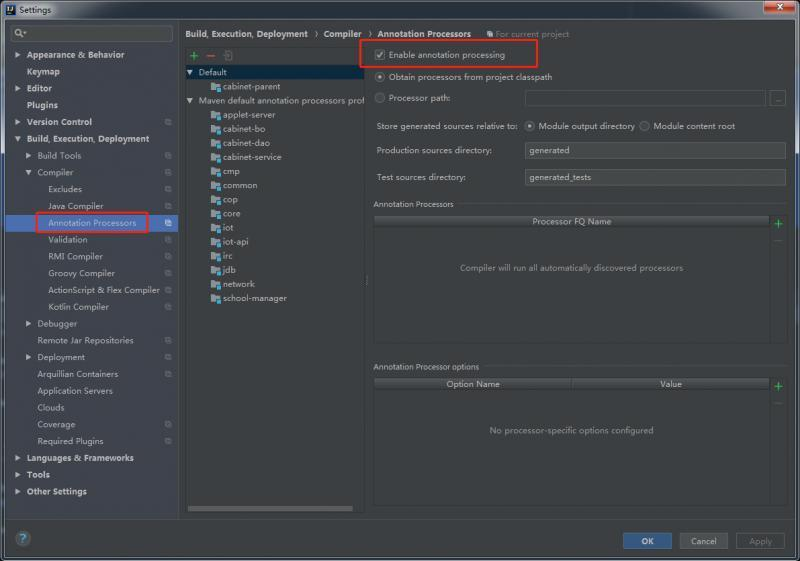
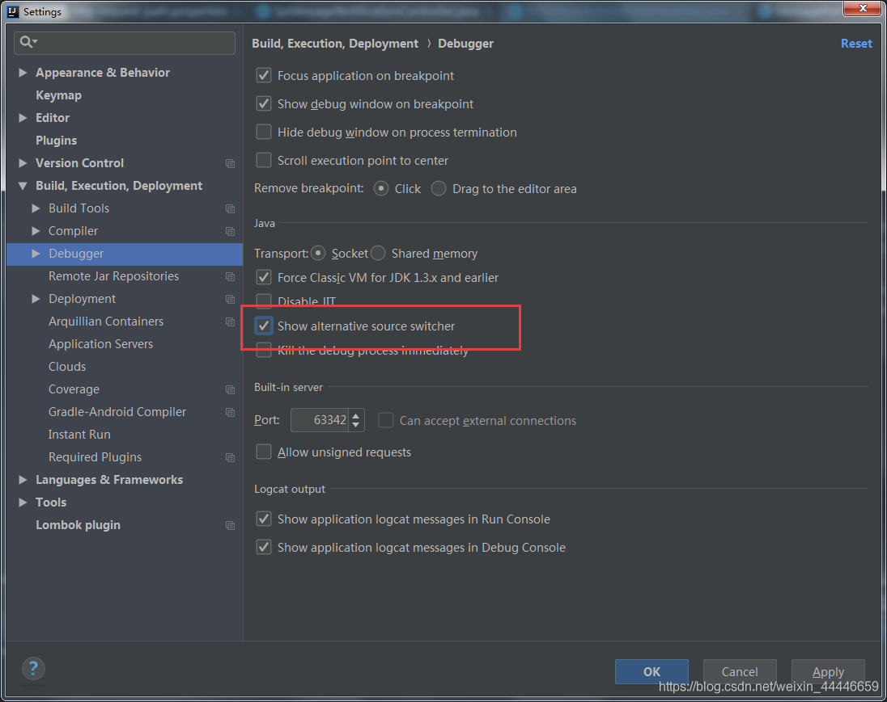
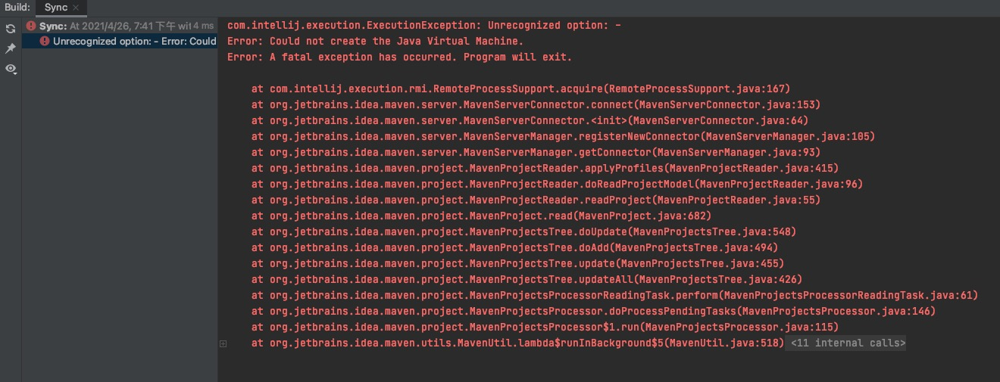
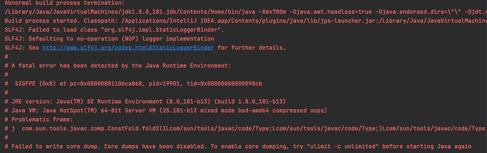

# 问题记录
## 1.idea使用lombok后,编译提示找不到符号.
>打开enable Annotation processing
  

如果还没有解决,确保lombok插件和idea版本对应,并且项目中的lombok.jar版本不能过低.

## 2.weblogic,下载excel等文件,点击乱码.
>在包里的web.xml文件中增加配置
``` java 
<mime-mapping>
    <extension>xls</extension>
    <mime-type>application/xls</mime-type>
</mime-mapping> 
```
>其他常用类型
```js 
<mime-mapping>
    <extension>rar</extension>
    <mime-type>application/octet-stream</mime-type>
</mime-mapping>
<mime-mapping>
    <extension>rmvb</extension>
    <mime-type>application/octet-stream</mime-type>
</mime-mapping>
<mime-mapping>
    <extension>doc</extension>
    <mime-type>application/msword</mime-type>
</mime-mapping>
```
## 3.debug模式跳转到其他同名类中
File -->Settings -->Debugger ,勾选Show alternative source switchwer
 

## 4.读取config.properties中文乱码

是因为编码字符集导致的,两个解决方法.

1. 用编辑器将properties的编码格式整体改为UTF-8.

   这种方法不好的是会将文本中现有的中文变成乱码,不推荐.

2. 读取properties时候,使用InputStreamReader将字符集转为UTF-8.

   ```java
   static Properties props = new Properties();
   
   static {
     try {
       //解决中文乱码问题.
       props.load(new InputStreamReader(
         PropertyMgr.class.getClassLoader().getResourceAsStream("config")
         ,"UTF-8"
       )
                 );
     } catch (IOException e) {
       e.printStackTrace();
     }
   }
   
   public static Object get(String key) {
     if(props == null) return null;
     return props.get(key);
   }
   ```

   

## 5.mac idea创建maven项目,SpringBoot项目打开就报错

```
com.intellij.execution.ExecutionException: Unrecognized option: -
Error: Could not create the Java Virtual Machine.
Error: A fatal exception has occurred. Program will exit.
```



遇到这个问题,首先打开控制台,看一下maven的状态.此时应该是maven不见了

不用慌,执行一下下面语句,然后你会发现,maven回来了

```sh
source ~/.bash_profile
```

```bash
mvn -version
```

再重新创建一个项目就好了(已经创建的还是不行).

## 6.编译报错.Abnormal build process termination: 

mac版本的idea编译的时候报了这个错误.

用的都好好地,突然加了个简答的main,写了个测试类,就不行了.



网上说什么的都有,根据我的实际排查,是因为这个类中存在编译错误.例如

```java
@Override
	protected Object run() throws Exception {
		// TODO Auto-generated method stub
		System.out.println("执行逻辑");
		int i = 1/0;//这个不能这么写
		return "ok";
	}
```

上面这段代码第5行,百分百报错.虽然编译时候没有报第五行错误,但是把它注释了或者写成1/1,就可以正常编译运行了.

## 7.idea2020 启动报Command line is too long.Shorten command line ..

修改项目下 .idea\workspace.xml，找到标签 `<component name="PropertiesComponent">` ， 

在标签里加一行

```
<property name="dynamic.classpath" value="true" />
```

