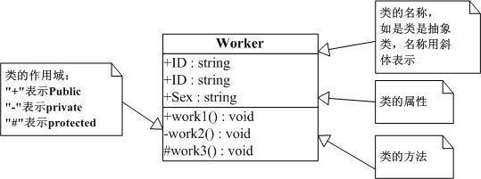
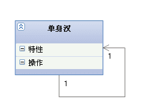
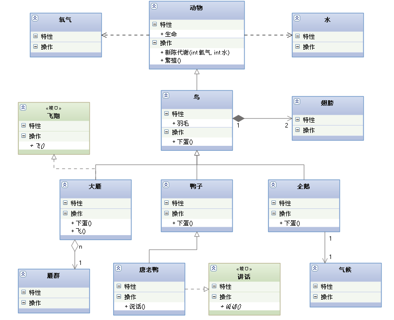
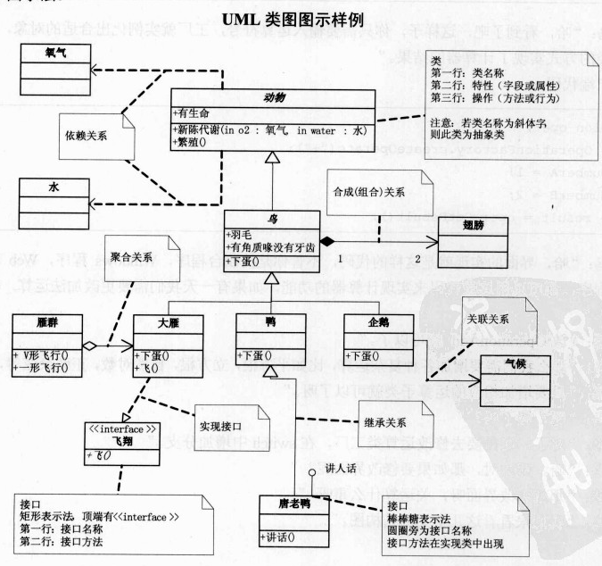

# 学习过程中积累的非技术类的知识点

## 1.详解UML图之类图

[类图](http://www.uml.org.cn/oobject/201610282.asp)

### 1.为什么需要类图？类图的作用

当一套流程非常复杂的时候,使用文字很难表达清楚.如果使用类图.可以使整套流程更清晰.

### 2.怎么画类图？用什么工具？

使用工具：Visio或者processon在线作图

在类图中一共包含了以下几种模型元素，分别是：类（Class）、接口（Interface）以及类之间的关系。

#### 2.1 类（Class)

​		在面向对象（OO) 编程中，类是对现实世界中一组具有相同特征的物体的抽象。

#### 2.2 接口（Interface）

 　　接口是一种特殊的类，具有类的结构但不可被实例化，只可以被实现（继承）。在UML中，接口使用一个带有名称的小圆圈来进行表示。

#### 2.3 类图中关系（relation）

在UML类图中，常见的有以下几种关系: 

* 泛化（Generalization）
* 实现（Realization）
* 关联（Association）
* 聚合（Aggregation）
* 组合（Composition）
* 依赖（Dependency）

1. 泛化

**【泛化关系】**：是一种继承关系，表示一般与特殊的关系，它指定了子类如何特化父类的所有特征和行为。

​                          例如：老虎是动物的一种，即有老虎的特性也有动物的共性。

**【箭头指向】**：带三角箭头的实线，箭头指向父类

2. 实现（Realization）

【实现关系】：是一种类与接口的关系，表示类是接口所有特征和行为的实现.

【箭头指向】：带三角箭头的虚线，箭头指向接口

 

3. 关联（Association)

【关联关系】：是一种拥有的关系，它使一个类知道另一个类的属性和方法；如：老师与学生，

双向的关联可以有两个箭头或者没有箭头，单向的关联有一个箭头。

【代码体现】：成员变量

【箭头及指向】：带普通箭头的实心线，指向被拥有者

​                          

​                          上图中，老师与学生是双向关联，老师有多名学生，学生也可能有多名老师。

​                          但学生与某课程间的关系为单向关联，一名学生可能要上多门课程，课程是个抽象的东西他不拥有学生。

 下图为自身关联:

4. 聚合（Aggregation）

【聚合关系】：是整体与部分的关系，且部分可以离开整体而单独存在。

如车和轮胎是整体和部分的关系，轮胎离开车仍然可以存在。

聚合关系是关联关系的一种，是强的关联关系；关联和聚合在语法上无法区分，必须考察具体的逻辑关系。

【代码体现】：成员变量

【箭头及指向】：带空心菱形的实心线，菱形指向整体

​                          

5. 组合(Composition)

【组合关系】：是整体与部分的关系，但部分不能离开整体而单独存在。

如公司和部门是整体和部分的关系，没有公司就不存在部门。

组合关系是关联关系的一种，是比聚合关系还要强的关系，

它要求普通的聚合关系中代表整体的对象负责代表部分的对象的生命周期。

【代码体现】：成员变量

【箭头及指向】：带实心菱形的实线，菱形指向整体

6. 依赖(Dependency)

【依赖关系】：是一种使用的关系，即一个类的实现需要另一个类的协助，

所以要尽量不使用双向的互相依赖.

【代码表现】：局部变量、方法的参数或者对静态方法的调用

【箭头及指向】：带箭头的虚线，指向被使用者

**各种关系的强弱顺序：**

泛化 = 实现 > 组合 > 聚合 > 关联 > 依赖

下面这张UML图，比较形象地展示了各种类图关系：

#### 2.4 类图绘制的要点

1. 类的操作是针对类自身的操作，而不是它去操作人家。比如书这个类有上架下架的操作，是书自己被上架下架，不能因为上架下架是管理员的动作而把它放在管理员的操作里。
2. 两个相关联的类，需要在关联的类中加上被关联类的ID，并且箭头指向被关联类。可以理解为数据表中的外键。比如借书和书，借书需要用到书的信息，因此借书类需包含书的ID，箭头指向书。
3. 由于业务复杂性，一个显示中的实体可能会被分为多个类，这是很正常的，类不是越少越好。类的设计取决于怎样让后台程序的操作更加简单。比如单看逻辑，借书类可以不存在，它的信息可以放在书这个类里。然而借还书和书的上架下架完全不是一回事，借书类对借书的操作更加方便，不需要去重复改动书这个类中的内容。此外，如果书和借书是1对多的关系，那就必须分为两个类。
4. 类图中的规范问题，比如不同关系需要不同的箭头，可见性符号等。