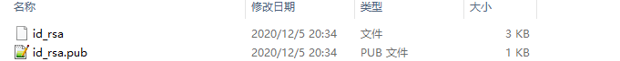
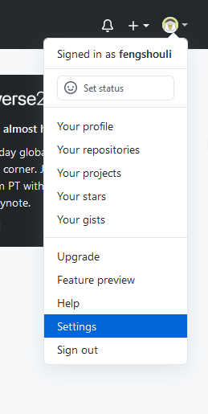
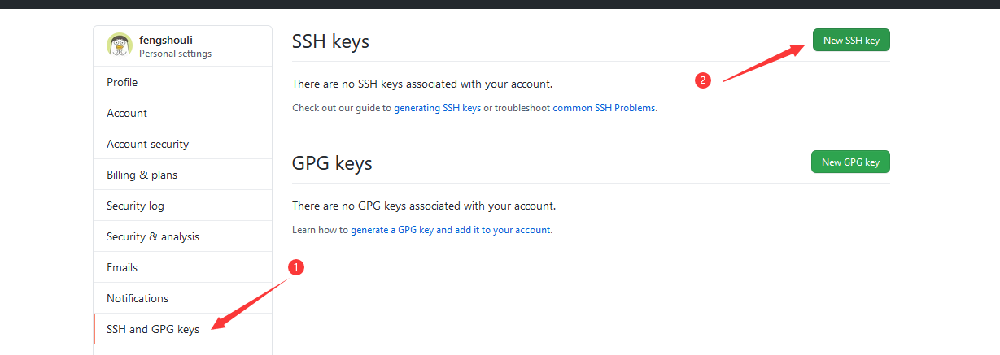
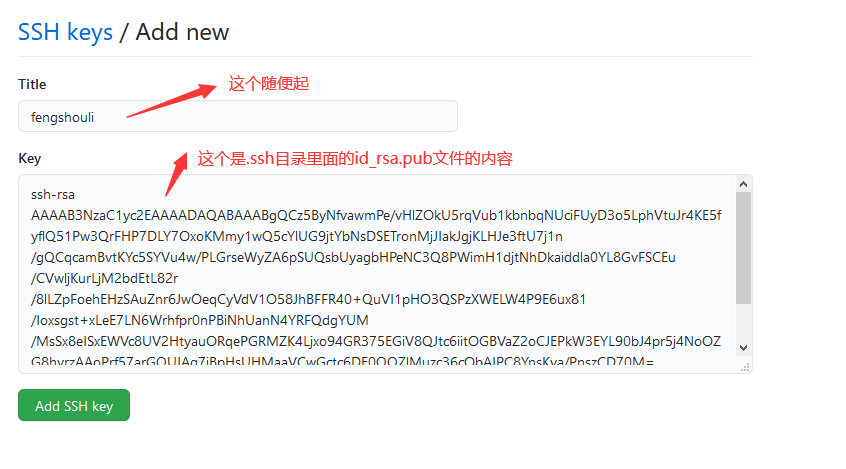
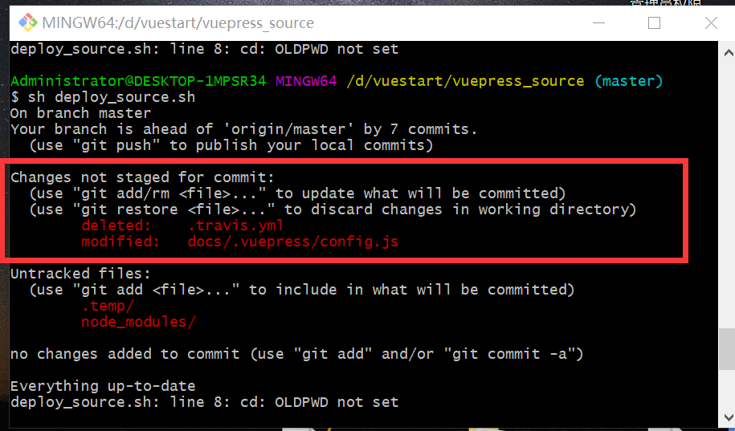
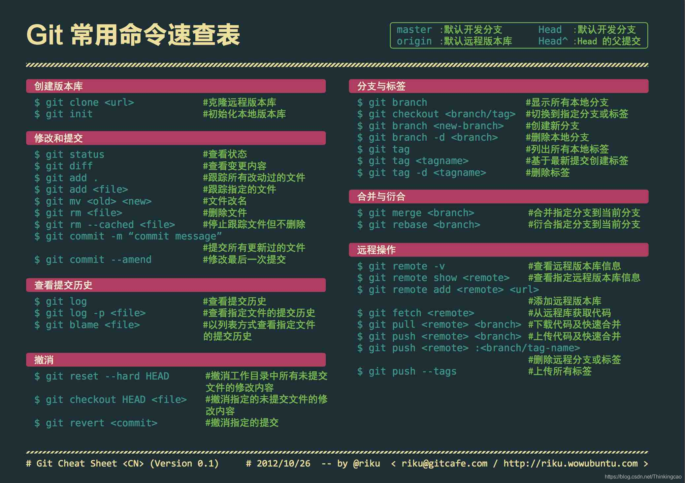
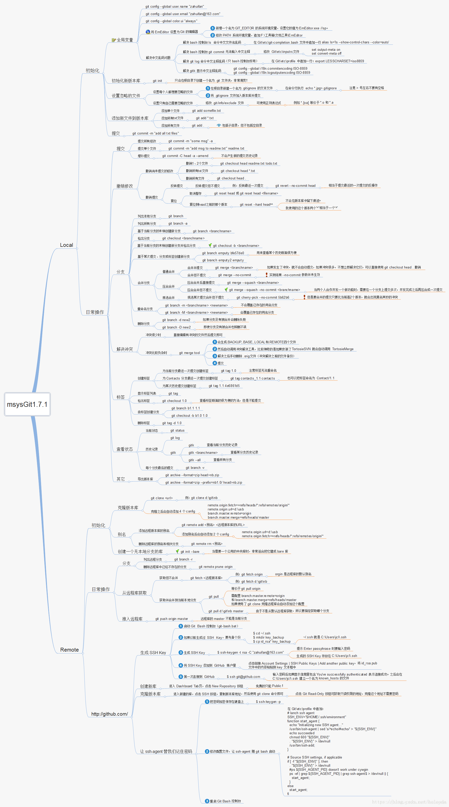
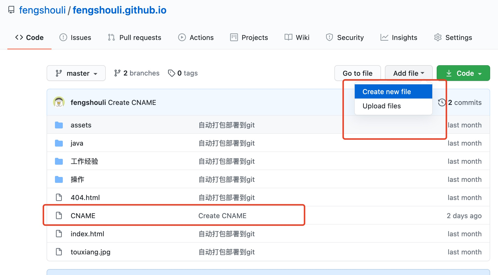
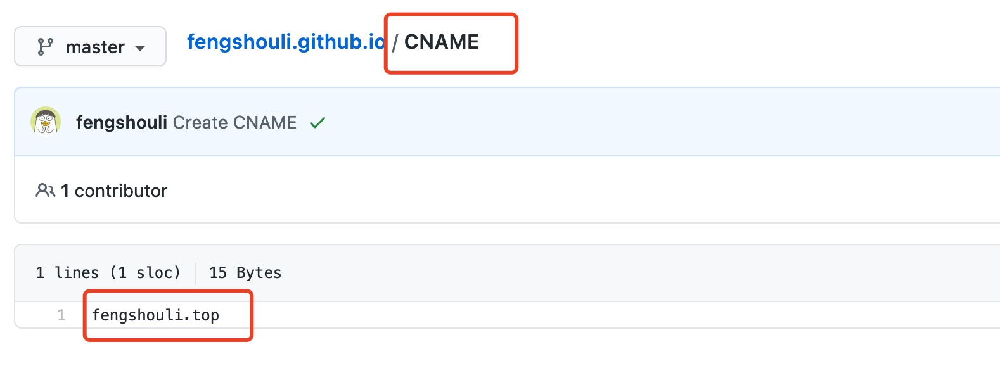
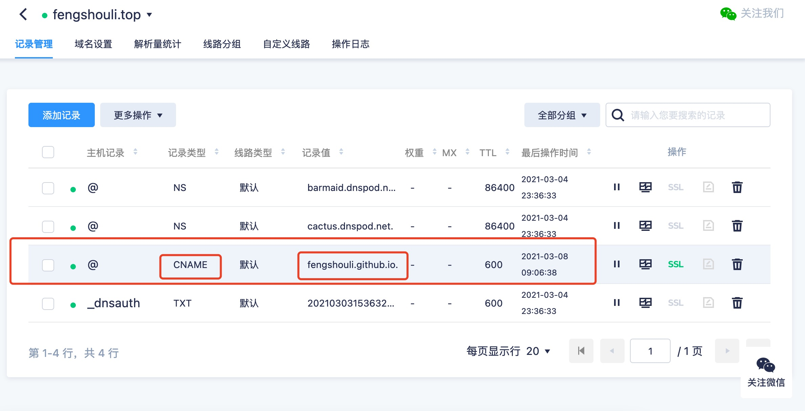

# git相关操作
> #### 优点:不用每次输入密码
> #### 缺点:只能针对一个账号
## 一.添加git的ssh
***
### 1.进入到当前用户的主目录中(指C:user/fengshouli)
#### 快捷方式,任何地方git bash here 输入cd ~ 就是进到当前用户主目录了
```shell
cd ~
```
### 2.执行一个命令,生成.ssh目录
```shell
ssh-keygen -t rsa -C 435876110@qq.com
```
#### 注意事项
(1).keygen 就是 key generation的缩写.  
(2).那个-C的C一定要大写.  
(3).后面的邮箱,就是你要关联的git的邮箱.  
(4).三次回车确认默认值即可.会生成如下图片的两个文件

### 3.操作SSH的key
#### (1).找到github的settings 
#### (2).找到设置sshkey的地方 
#### (3).设置key 
#### 生成ssh的key后就可以正常的push操作了

### 4.对ssh远程地址起别名
#### 起别名
```shell
git remote add origin_ssh git@github.com:fengshouli/fengshouli.github.io.git
```
#### 查看别名,查看才能知道是否成功了
```shell
git remote -v
```
#### 成功后就可以执行那一套操作了
init,创建文件,添加文件,commit,push

## 二.换台电脑操作同一个git仓库.

### 1.操作流程,以及遇到的问题.

换了一台新的电脑时候,如果还要对同个git仓库进行操作.首先,添加新电脑的git的 `ssh key` 到git仓库中,

## 二-1提交被拒绝.

如果提交被拒绝,ssh key也没有问题,那么多半是你的新本机的仓库还没有和这个ssh key关联上,用下述方法解决.

ssh-add "id_rsa的地址,注意是私钥地址".例如这里是:

```shell
ssh-add /Users/fengshouli/.ssh/id_rsa
```

add之后可以用

```shell
ssh git@github.com
```

验证是不是添加成功

## 二-2有些新的文件提交不上去

changes not staged for commit.



将提交文件中,git commit -m "xxx" 改为 git commit -am "xxx",这个a是add的意思.会把那些文件加入.

## 三.mac添加公钥

[mac下查看及生成ssh key ](https://www.jianshu.com/p/ab0f23ed239f)

1. 查看是否存在

   ```shell
   ls -al ~/.ssh
   ```

   > 如果vim输出的是No such file or directory：证明本地没有生成的SSH Key，请执行第二步。
   >
   > 如果vim输出的是id_rsa        id_rsa.pub： 证明本地已经存在SSH Key 文件，请执行第四步。

2. 如果没有，生成新的SSH Key

   ```shell
   ssh-keygen -t rsa -C"you_email"
   #我的本地是435876110@qq.com
   #注意C是大写
   #一路回车就完成了
   ```

3. 生成并添加ssh key

   ```shell
   ssh-add ~/.ssh/id_rsa
   ```

4. 查看key

   ```shell
   cat /Users/xxx/.ssh/id_rsa.pub
   #xxx是你的电脑用户名,我这里是 cat /Users/fengshouli/.ssh/id_rsa.pub
   ```

5. 将代码添加到git

## 四.将代码提交到git仓库

[提交到远程仓库](https://blog.csdn.net/Thinkingcao/article/details/111242764)

### 1. 先进入项目文件夹，初始化本地仓库

> ```
> git init
> ```

### 2. 把文件添加到版本库中，使用命令 git add .添加到暂存区里面去，不要忘记后面的小数点“.”，“.”意为添加文件夹下的所有文件

> ```
> git add .
> ```

### 3. 将文件提交到本地Git仓库

> ```
> git commit -m 'first commit'
> ```

### 4. 登录远程Git新建一个仓库(如果已有可跳过这步)

### 5. 将本地代码库关联到远程Git库

> ```
> git remote add origin 你的远程库地址
> ```

### 6. 获取远程库文件与本地同步合并

**tips：** 远程仓库在新建的时候如果初始化生成了README.md文件等，那么需要执行这一步；也就是当远程库不为空时必须做这一步，否则后面的提交会失败。

> ```
> git pull --rebase origin master
> ```

### 7. 查询需要推送到远程的文件情况

使用状态查询命令`git status`可以查询到本地需要推送到远程仓库的文件情况。

> ```
> git status
> ```

### 8. 把本地库的内容推送到远程仓库

使用`git push`命令，实际上是把当前分支`master`推送到远程。执行此命令后有可能会要求输入用户名、密码，验证通过后即开始上传。

> ```
> git push -u origin master
> ```

## 五.git命令总结

### 1.常见命令



### 2. Git常用命令列表

* **git clone -b develop 地址 [文件名]** :指定从develop分支clone代码,如果没有文件名,那就是全部
* git add . :添加所有文件到git.注意那里有个点,不要忽略这个点,
* git add [file name] :添加一个文件到git
* git pull [origin master]:从当前默认分支拉代码/从master拉取代码
* git commit  -m  "注释" ：提交
* git push [origin master]:推代码到默认分支/推到master

=========================================

- git branch ：查看本地所有分支
- git status ：查看当前状态
- git branch -a ：查看所有的分支
- git branch -r ：查看远程所有分支
- git commit -am “init” ：提交并且加注释
- git remote add origin  git地址：关联远程仓库
- git push origin master ：将文件给推到服务器上
- git remote show origin ：显示远程库origin里的资源
- git push origin master:develop ：
- git push origin master:hb-dev ：将本地库与服务器上的库进行关联
- git checkout --track origin/dev ：切换到远程dev分支
- git branch -D master develop ：删除本地库develop
- git checkout -b dev ：建立一个新的本地分支dev
- git merge origin/dev ：将分支dev与当前分支进行合并
- git checkout dev ：切换到本地dev分支
- git remote show ：查看远程库
- git rm 文件名(包括路径) 从git中删除指定文件
- git clone https://gitee.com/Thinkingcao/blade-parent.git 从服务器上将代码给拉下来
- git config --list 看所有用户
- git ls-files 看已经被提交的
- git rm [file name] 删除一个文件
- git commit -a 提交当前repos的所有的改变
- git commit -v 当你用－v参数的时候可以看commit的差异
- git commit -a -a是代表add，把所有的change加到git index里然后再commit
- git commit -a -v 一般提交命令
- git log 看你commit的日志
- git diff 查看尚未暂存的更新
- git rm a.a 移除文件(从暂存区和工作区中删除)
- git rm --cached a.a 移除文件(只从暂存区中删除)
- git commit -m “remove” 移除文件(从Git中删除)
- git rm -f a.a 强行移除修改后文件(从暂存区和工作区中删除)
- git diff --cached 或 $ git diff --staged 查看尚未提交的更新
- git stash push 将文件给push到一个临时空间中
- git stash pop 将文件从临时空间pop下来
- git remote add origin https://gitee.com/Thinkingcao/blade-parent.git
- git push origin master 将本地项目给提交到服务器中

------

- git pull 本地与服务器端同步

------

- git push (远程仓库名) (分支名) 将本地分支推送到服务器上去。
- git push origin serverfix:awesomebranch

------

- git fetch 相当于是从远程获取最新版本到本地，不会自动merge
- git commit -a -m “log_message” (-a是提交所有改动，-m是加入log信息) 本地修改同步至服务器端 ：
- git branch branch_0.1 master 从主分支master创建branch_0.1分支
- git branch -m branch_0.1 branch_1.0 将branch_0.1重命名为branch_1.0
- git checkout branch_1.0/master 切换到branch_1.0/master分支
- git branch 删除远程branch
- git push origin :branch_remote_name
- git branch -r -d branch_remote_name

------

### 3.图示

## 六.vuepress发布在github上如何绑定域名

### 1.申请域名.

在阿里云,腾讯云上,申请个域名,在这里,我是用的腾讯云,  

需要注意的是,申请的域名是需要实名认证和审核的,一般在1个工作日内就可以完成,

### 2.项目中增加域名配置文件

增加CNAME文件,里面只有域名.





### 3.将域名添加解析.

将域名添加解析,解析规则也是CNAME,然后配置那个git发布地址.例如"fengshouli.github.io",等待审核完了就可以使用了.




## 七. ".gitignore"

### 1.介绍

每个git项目中都应该有个".gitignore"文件,这个文件作用是告诉git,哪些文件不需要添加到版本管理中,例如npm包中的node_modules,这个文件夹非常重要,但是它占用空间很大,个人本地又都有,所以一般不会交给git管理.

### 2.常用规则

过滤某些文件

```swift
/mtk/ 过滤整个文件夹
*.zip 过滤所有.zip文件
/mtk/do.c 过滤某个具体文件
```

下面是不过滤某些文件

```swift
!src/   不过滤该文件夹
!*.zip   不过滤所有.zip文件
!/mtk/do.c 不过滤该文件
```

**1、配置语法：**
 以斜杠`/`开头表示目录；
 以星号`*`通配多个字符；
 以问号`?`通配单个字符
 以方括号`[]`包含单个字符的匹配列表；
 以叹号`!`表示不忽略(跟踪)匹配到的文件或目录；

此外，git 对于 .ignore 配置文件是按行从上到下进行规则匹配的，意味着如果前面的规则匹配的范围更大，则后面的规则将不会生效；

**2、示例说明**
 **a、规则：fd1/***
 说明：忽略目录 fd1 下的全部内容；注意，不管是根目录下的 /fd1/ 目录，还是某个子目录 /child/fd1/ 目录，都会被忽略；
 **b、规则：/fd1/***
 说明：忽略根目录下的 /fd1/ 目录的全部内容；
 **c、规则：**
 /*
 !.gitignore
 !/fw/bin/
 !/fw/sf/
 说明：忽略全部内容，但是不忽略 .gitignore 文件、根目录下的 /fw/bin/ 和 /fw/sf/ 目录；

### 3.".gitignore"文件 新增忽略文件并没有生效

新增的忽略文件没有生效，是因为git是有缓存的，而之前的文件在缓存中，并不会清除掉，还会继续提交，所以更新.gitignore文件，要清除缓存文件

```sh
#移除所有文件.
git rm -r --cached .
#添加所有文件,这时候ignore会生效
git add .
#提交代码
git commit -m 'update .gitignore'
```

## 八.复制现有代码到新的分支.

1.创建新的分支,或直接创建并切换到新的分支.

```sh
#新建分支 如果新的分支已经存在会报错
git branch newBranch
# 新建并切换到新的分支 如果新的分支已经存在了会报错
git checkout -b newBranch 
```

2.推送代码到新分支的仓库中.

```sh
#将现有的代码(原分支的)推到新的分支的仓库中
git push origin pre
```

3.关联.

```sh
#如果直接进行git pull 操作,是会报错的.需要进行关联
git branch --set-upstream-to=origin/newBranch
```

4.拉代码验证

```sh
git pull
#此时已经提示up-to-date
```

## 九.GIT如何删除分支

1. 打开git操作工具.git bash here

2. 先查看下当前库中有那些个分支.

   ```sh
   #查看全部分支
   git branch -a
   ```

3. 删除分支

   1. 删除远程服务器上的分支

      ```sh
      #删除远程服务器上的分支
      git push origin --delete branchxxx
      ```

   2. 删除本地已经合并了的分支

      ```sh
      git branch –d branchxxx
      ```

   3. 删除本地未合并的分支

      ```sh
      git branch –D branchxxx
      ```

      

