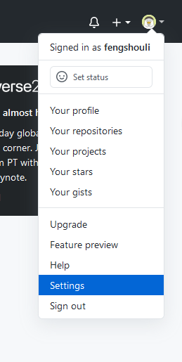
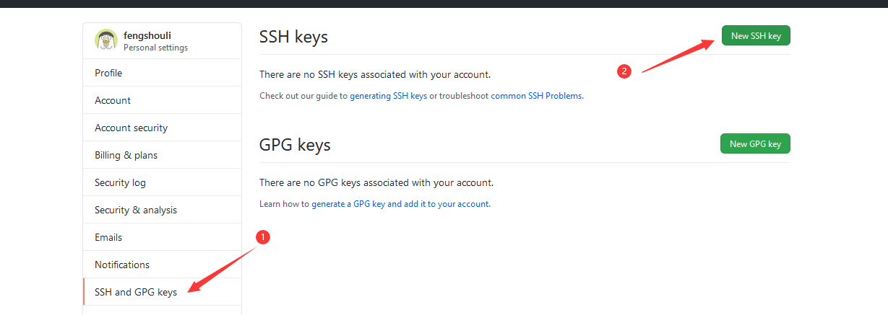
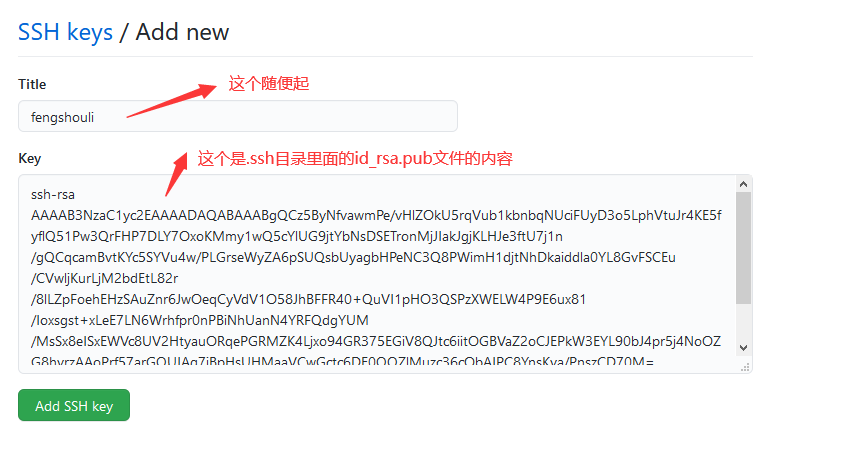

# 使用ssh的方式操作git
> #### 优点:不用每次输入密码
> #### 缺点:只能针对一个账号
# 1.添加git的ssh
***
## 1.进入到当前用户的主目录中(指C:user/fengshouli)
#### 快捷方式,任何地方git bash here 输入cd ~ 就是进到当前用户主目录了
```shell
cd ~
```
## 2.执行一个命令,生成.ssh目录
```shell
ssh-keygen -t rsa -C 435876110@qq.com
```
#### 注意事项
(1).keygen 就是 key generation的缩写.  
(2).那个-C的C一定要大写.  
(3).后面的邮箱,就是你要关联的git的邮箱.  
(4).三次回车确认默认值即可.会生成如下图片的两个文件

## 3.操作SSH的key
#### (1).找到github的settings 
#### (2).找到设置sshkey的地方 
#### (3).设置key 
#### 生成ssh的key后就可以正常的push操作了

## 4.对ssh远程地址起别名
#### 起别名
```shell
git remote add origin_ssh git@github.com:fengshouli/fengshouli.github.io.git
```
#### 查看别名,查看才能知道是否成功了
```shell
git remote -v
```
#### 成功后就可以执行那一套操作了
init,创建文件,添加文件,commit,push

# 2.换台电脑操作同一个git仓库.

### 1.操作流程,以及遇到的问题.

换了一台新的电脑时候,如果还要对同个git仓库进行操作.首先,添加新电脑的git的 `ssh key` 到git仓库中,如果提交被拒绝,ssh key也没有问题,那么多半是你的新本机的仓库还没有和这个ssh key关联上,用下述方法解决.

ssh-add "id_rsa的地址,注意是私钥地址".例如这里是:

```shell
ssh-add /Users/fengshouli/.ssh/id_rsa
```

add之后可以用

```shell
ssh git@github.com
```


验证是不是添加成功