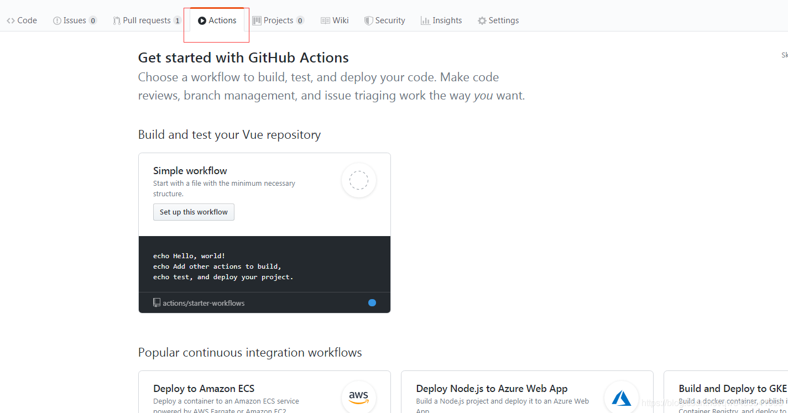
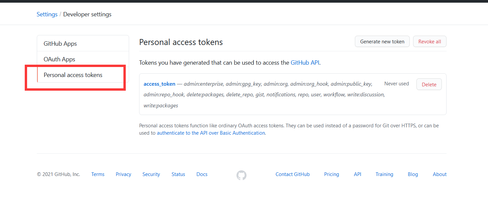
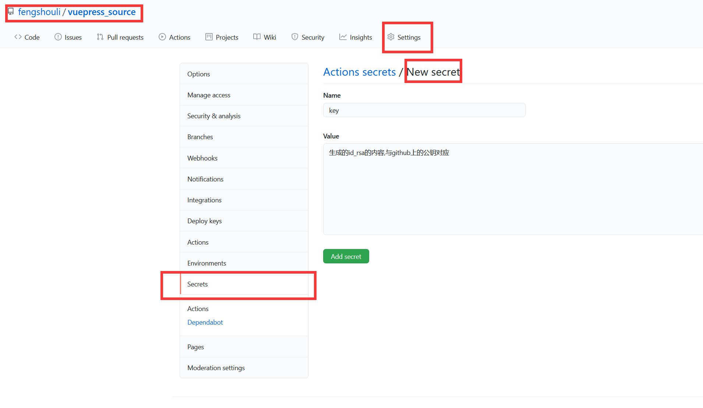

# github-CI/CD

### 1.为什么需要CI/CD

最简单来说,我们开发,都是对源码的操作,而我们看到的,都是源码编译后的文件,也就是说,应该有两个库,  

一个源码库,存源码,用于共享开发.  

一个编译库,存编译后文件,用于展示.

那么有个问题啊,我们需要push源码,还需要在本地编译,并且push编译文件到 编译库.是不是很麻烦??  

对,github的CI/CD就是干这个的 ,你只需要再push源码到源码库,他github自动帮你编译,发布到编译库,是不是很爽??下面我们用vuepress来详细说说如何操作.

### 2.使用github-Actions.

1. 点击源码库所在的Actions,选择一个workflow模板.

   

2. 实际上在这里操作模板,最终也是在仓库中生成一个文件.[./github/workflows/xxx.yml],还记得那个CNAME吗,绑定域名后也是在库中生成一个文件,一个原理.这个yml文件里配置着流程.

3. workflow配置详解.

   ```shell
   #给这个workflow起个名字
   name: vuepress-CI
   #如何触发,这里是提交到master分支时候触发,
   on:
     push:
       branches:
         - master
   #具体的操作.
   jobs:
     build-deploy:
     	#运行虚拟机环境,Ubuntu是用的最多的.有很多插件,所以咱们也用这个.
       runs-on: ubuntu-latest
       #步骤,uses就是用插件,run就是执行命令.
       steps:
       #checkout插件
         - uses: actions/checkout@v1
         #都这么写.
         - run: npm ci
         #安装咱们要的vuepress组件
         - run: npm install -D vuepress
         #清空之前编译的文件,这个路径是你的docs/.vuepress/config.js里面的dest属性配置的.
         - run: rm -rf dist/
         #编译命令,npm run 是命令, docs:build是在package.json文件中配置的.
         - run: npm run docs:build
         #编译后域名文件会被冲掉,所以手写一个cp进去.
         - run: cp CNAME dist/
   
         # 发布到 fengshouli.github.io/master
         - name: Deploy
         #这也是个插件,如果想了解更多去他的git看.https://github.com/peaceiris/actions-gh-pages/tree/v2.5.0-rc0
           uses: peaceiris/actions-gh-pages@v2.5.0
           env:
           #口令,这个超级坑,下面详细说
             ACTIONS_DEPLOY_KEY: ${{secrets.RSA_KEY}}
             #发布地址
             EXTERNAL_REPOSITORY: fengshouli/fengshouli.github.io
             #发布分支
             PUBLISH_BRANCH: master
             #发布什么文件
             PUBLISH_DIR: dist
           with:
             emptyCommits: false
   
   ```


### 3.带你爬坑

1. git上编译报错,本地没事.

   在本地,不管是window机器,还是mac机器,编译都能过,但是一旦上git,就是失败,甚至git上把虚拟环境从`ubuntu-lasted`变为`macos-lasted`也可以编译成功,但是后面的脚本就不支持了,根据报错信息,最终找到,是因为文档里引入图片的名称,大小写不一致导致.或者说因为引入图片的路径,应该是左斜杠"/",windows默认右斜杠"\",也是找不到的.也会报错.解决了这些问题,基本就可以编译通过了.

2. 发布口令有问题

   万事具备,发布报错,一直说没有私钥什么什么的,根据网上查了一大堆,

   让你配置personal access tokens,然后配置在secrets里面,根本不对!!!!!不是把这个配置在那,应该是id_rsa,就下图这个,不对,不要在这里配置.

   

   还记得吗,当初弄git时候,在本地生成了个私钥公钥,id_rsa,id_rsa.pub,这两个文件,然后pub这个文件我们配置在git上了,然后电脑就可以通过ssh进行操作了,所以这里的做法是,复制id_rsa里面的内容,打开git-选择源码项目-setting-scrects-在这里创建,起个名字"RSA_KEY",把私钥内容粘贴进去,然后,配置`${{secrets.RSA_KEY}}`,这样就有权限了,根本不是那个personal什么的,太坑了.

   

3. 编译报错,提示没有package-lock.json.

   对于这个问题,我第一次在本地安装vuepress组件时候,确实没有生成,再次安装一遍环境,神奇的,就生成了这个文件,所以如果报错,把这个文件也传上去吧.