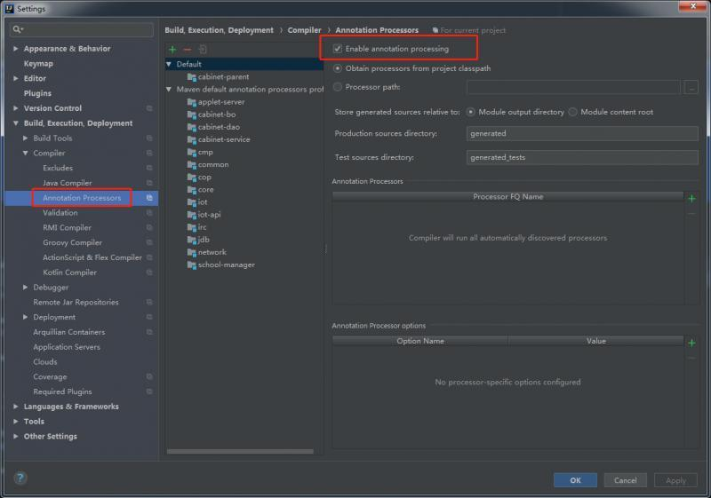

# IDEA的常用操作及设置

## 一.操作

### IDEA for mac 快捷键:

### 1.编辑类

| 操作                       | 按键      |      | 操作                 | 按键  |
| -------------------------- | --------- | ---- | -------------------- | ----- |
| 上下移动一行               | ⌘+⇧+上/下 |      | 复制当前行或选定的块 | ⌘+D   |
| 显示意向动作和快速修复代码 | ⌥+↩︎       |      | 生成构造方法,get,set | ⌘+N   |
| 注释                       | ⌘+/       |      | 批量注释             | ⌘+⌥+/ |
| 格式化代码                 | ⌘+⌥+L     |      | 删除当前行           | ⌘+⌫   |
| 开始新的一行               | ⇧+↩       |      | 大小写切换           | ⌘+⇧+U |

### 2.查找类

| 操作             | 按键      |      | 操作           | 按键  |
| ---------------- | --------- | ---- | -------------- | ----- |
| 文件内查找       | ⌘+F       |      | 文件内替换     | ⌘+R   |
| 全局查找         | ⌘+⇧+F     |      | 全局替换       | ⌘+⇧+R |
| 按名字查找文件   | ⌘+O       |      | 按名字查找文件 | ⌘+⇧+O |
| 回到上次的编辑处 | ⌘+⌥+左/右 |      |                |       |


## 二.设置

### 一.设置表头模板.

File-->settings-->Editor-->File and Code Templates-->Files

进去后,第二个页签,Includes,里面创建一个FileHeader

内容写如下内容.

```
/**
 * @author  FengXinYang
 * @date  ${DATE}
 * 主要用途:
 */
```


### 二.正文字体和控制台字体控制

File-->settings-->Editor-->Color Schema-->Color Schema Font

这里面Size就是大小,一般16就可以了.

## 三.插件.Plugin

### 1.GenerateAllSetter

一键调用一个对象的所有的set方法.

### 2.IDE Eval Reset

idea无限重置30天工具,一般新装了需要从网上下载个新的.

### 3.SequenceDiagram

生成时序图的工具.

### 4.SonarLint

代码约束检查工具.

### 5.Atom Material Icons

一款换图标的插件.但是他最重要的用途!!可以提升流畅度.(m1芯片的idea特别卡,换了这个图标后明显变得流畅.)

## 四.新环境需要配置的东西.

### 1.最简单的是从原先的环境先导出个.

## 五.IDEA常见问题解决.

### 1.idea使用lombok后,编译提示找不到符号.

1. 打开enable Annotation processing

     


2. 增加如下配置  

​    `-Djps.track.ap.dependencies=false`


3. 如果还没有解决,确保lombok插件和idea版本对应,并且项目中的lombok.jar版本不能过低.或者升级到高版本.
