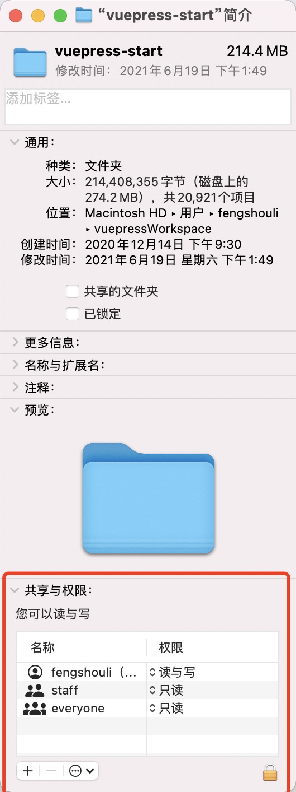
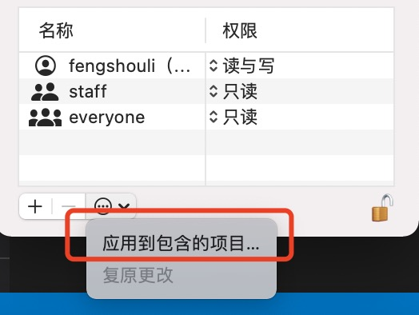

# macbook常用操作.

## macbook和windows系统有些差异

## 一.剪切.

mac是没有剪切的,如果需要,先复制文件,然后到了需要复制的地方,右键,按住option,即可看到"移动到这里",相当于剪切.

## 二.显示/隐藏 隐藏文件夹.

command+shift+.

## 三.像打补丁一样增量覆盖文件夹.

在mac系统中,如果文件夹替换,相当于把原来的删除,再把新的粘贴过去.   

那么想要像windows系统那样的打补丁的方式怎么弄呢,比较麻烦.

1. 打开终端,
2. 输入ditto,输入后不要回车!!!输入空格!!
3. 将补丁源文件夹拖入到终端中,拖入后不要回车!!!输入空格!!
4. 将被替换的文件夹拖入到终端中,可以回车了.
5. 这样就像打补丁一样,同名文件有差异的被替换,没有的则新增.

## 四.权限控制.

用mac,经常会发现权限不足,需要sudo.这样非常麻烦.怎么能省略呢.  

首先右键最外层的文件夹,点击"显示简介".



找到下面的"共享与权限",给当前登录的用户"fengshouli"弄个有读与写的权限了.这是第一步,右下角有个🔐的图标,点一下,然后点左下角的"一个圈里面三个点"图标.



选择应用到包含的项目.这样权限就会下放到每个文件.现在就已经有权限了.

## 五.关闭占用的端口号.

### 1.查看是那个进程占用了端口.

```sh
lsof -i:3003
-----------会得到这样一串结果
COMMAND   PID       USER   FD   TYPE             DEVICE SIZE/OFF NODE NAME
node    49288 fengshouli   30u  IPv6 0x418a25fd49ccb593      0t0  TCP *:cgms (LISTEN)
```

### 2.将进程关闭

```sh
kill 49288
```

## 六.查看ip端口

控制台打开:输入 
```sh
ifconfig en0
```
即可查看.
