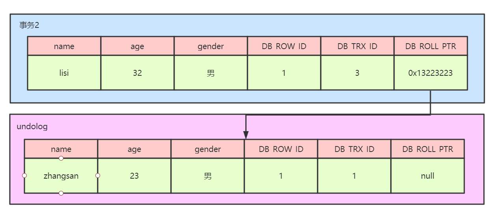
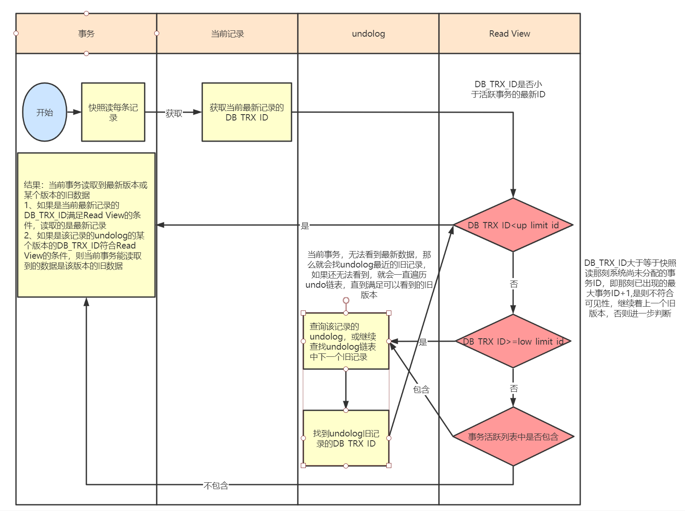
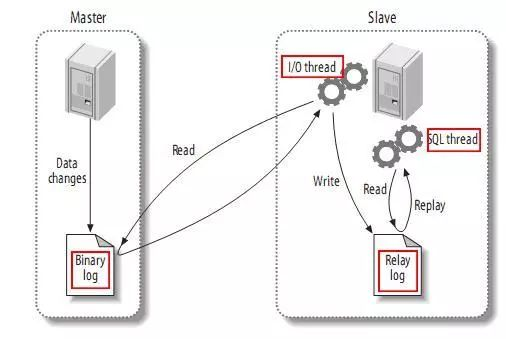
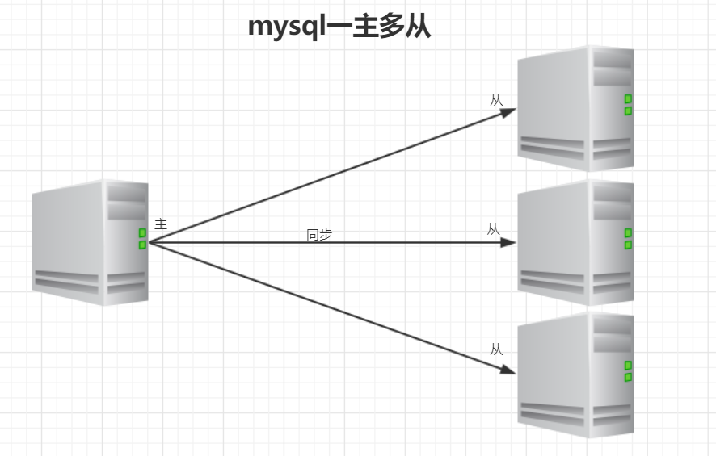

# MySql

## 一.mysql知识点

## 1.描述一下数据库事务隔离级别？

### 		1.ACID：

​		原子性：undo log（MVCC）

​		一致性: 最核心和最本质的要求

​		隔离性:锁，mvcc（多版本并发控制）

​		持久性：redo log		

### 		2.数据库的事务隔离级别有四种，

分别是读未提交、读已提交、可重复读、序列化，不同的隔离级别下会产生脏读、幻读、不可重复读等相关问题，因此在选择隔离级别的时候要根据应用场景来决定，使用合适的隔离级别。

### 		3.各种隔离级别和数据库异常情况对应情况如下：

| 隔离级别          | 脏读 | 不可重复  读 | 幻读 |
| ----------------- | ---- | ------------ | ---- |
| READ- UNCOMMITTED | √    | √            | √    |
| READ-COMMITTED    | ×    | √            | √    |
| REPEATABLE- READ  | ×    | ×            | √    |
| SERIALIZABLE      | ×    | ×            | ×    |

SQL 标准定义了四个隔离级别：

- READ-UNCOMMITTED(读取未提交)： 事务的修改，即使没有提交，对其他事务也都是可见的。事务能够读取未提交的数据，这种情况称为脏读。
- READ-COMMITTED(读取已提交)： 事务读取已提交的数据，大多数数据库的默认隔离级别。当一个事务在执行过程中，数据被另外一个事务修改，造成本次事务前后读取的信息不一样，这种情况称为不可重复读。
- REPEATABLE-READ(可重复读)： 这个级别是MySQL的默认隔离级别，它解决了脏读的问题，同时也保证了同一个事务多次读取同样的记录是一致的，但这个级别还是会出现幻读的情况。幻读是指当一个事务A读取某一个范围的数据时，另一个事务B在这个范围插入行，A事务再次读取这个范围的数据时，会产生幻读
- SERIALIZABLE(可串行化)： 最高的隔离级别，完全服从ACID的隔离级别。所有的事务依次逐个执行，这样事务之间就完全不可能产生干扰，也就是说，该级别可以防止脏读、不可重复读以及幻读。

事务隔离机制的实现基于锁机制和并发调度。其中并发调度使用的是MVVC（多版本并发控制），通过保存修改的旧版本信息来支持并发一致性读和回滚等特性。

因为隔离级别越低，事务请求的锁越少，所以大部分数据库系统的隔离级别都是READ-COMMITTED(读取提交内容):，但是你要知道的是InnoDB 存储引擎默认使用 **REPEATABLE-READ（可重读）**并不会有任何性能损失。

## 2.MVCC-多版本并发控制

### 1、MVCC

​		MVCC，全称Multi-Version Concurrency Control，即多版本并发控制。MVCC是一种并发控制的方法，一般在数据库管理系统中，实现对数据库的并发访问，在编程语言中实现事务内存。

 		MVCC在MySQL InnoDB中的实现主要是为了提高数据库并发性能，用更好的方式去处理读写冲突，做到即使有读写冲突时，也能做到不加锁，非阻塞并发读。

### 2、当前读--<font color='red'>非常重要</font>

​		像select lock in share mode(共享锁), select for update ; update, insert ,delete(排他锁)这些操作都是一种当前读，为什么叫当前读？就是它读取的是记录的最新版本，读取时还要保证其他并发事务不能修改当前记录，会对读取的记录进行加锁。

### 3、快照读--<font color='red'>非常重要</font>（提高数据库的并发查询能力）

​		像不加锁的select操作就是快照读，即不加锁的非阻塞读；快照读的前提是隔离级别不是串行级别，串行级别下的快照读会退化成当前读；之所以出现快照读的情况，是基于提高并发性能的考虑，快照读的实现是基于多版本并发控制，即MVCC,可以认为MVCC是行锁的一个变种，但它在很多情况下，避免了加锁操作，降低了开销；既然是基于多版本，即快照读可能读到的并不一定是数据的最新版本，而有可能是之前的历史版本

### 4、当前读、快照读、MVCC关系

​		MVCC多版本并发控制指的是维持一个数据的多个版本，使得读写操作没有冲突，快照读是MySQL为实现MVCC的一个非阻塞读功能。MVCC模块在MySQL中的具体实现是由,三个隐式字段，undo日志、read view三个组件来实现的。

### 5、MVCC解决的问题

​		数据库并发场景有三种，分别为：

​		1、读读：不存在任何问题，也不需要并发控制

​		2、读写：有线程安全问题，可能会造成事务隔离性问题，可能遇到脏读、幻读、不可重复读

​		3、写写：有线程安全问题，可能存在更新丢失问题

​		MVCC是一种用来解决读写冲突的无锁并发控制，也就是为事务分配单项增长的时间戳，为每个修改保存一个版本，版本与事务时间戳关联，读操作只读该事务开始前的数据库的快照，所以MVCC可以为数据库解决以下问题：

​		1、在并发读写数据库时，可以做到在读操作时不用阻塞写操作，写操作也不用阻塞读操作，提高了数据库并发读写的性能

​		2、解决脏读、幻读、不可重复读等事务隔离问题，但是不能解决更新丢失问题

### 6、MVCC实现原理

​		mvcc的实现原理主要依赖于记录中的三个隐藏字段，undolog，read view来实现的。

​		**隐藏字段**

​		每行记录除了我们自定义的字段外，还有数据库隐式定义的DB_TRX_ID,DB_ROLL_PTR,DB_ROW_ID等字段

​		DB_TRX_ID

​		6字节，最近修改事务id，记录创建这条记录或者最后一次修改该记录的事务id

​		DB_ROLL_PTR

​		7字节，回滚指针，指向这条记录的上一个版本,用于配合undolog，指向上一个旧版本

​		DB_ROW_JD

​		6字节，隐藏的主键，如果数据表没有主键，那么innodb会自动生成一个6字节的row_id

​		记录如图所示：


​		在上图中，DB_ROW_ID是数据库默认为该行记录生成的唯一隐式主键，DB_TRX_ID是当前操作该记录的事务ID，DB_ROLL_PTR是一个回滚指针，用于配合undo日志，指向上一个旧版本

​		**undo log**

​		undolog被称之为回滚日志，表示在进行insert，delete，update操作的时候产生的方便回滚的日志

​		当进行insert操作的时候，产生的undolog只在事务回滚的时候需要，并且在事务提交之后可以被立刻丢弃

​		当进行update和delete操作的时候，产生的undolog不仅仅在事务回滚的时候需要，在快照读的时候也需要，所以不能随便删除，只有在快照读或事务回滚不涉及该日志时，对应的日志才会被purge线程统一清除（当数据发生更新和删除操作的时候都只是设置一下老记录的deleted_bit，并不是真正的将过时的记录删除，因为为了节省磁盘空间，innodb有专门的purge线程来清除deleted_bit为true的记录，如果某个记录的deleted_id为true，并且DB_TRX_ID相对于purge线程的read view 可见，那么这条记录一定时可以被清除的）

​		**下面我们来看一下undolog生成的记录链**

​		1、假设有一个事务编号为1的事务向表中插入一条记录，那么此时行数据的状态为：


​		2、假设有第二个事务编号为2对该记录的name做出修改，改为lisi

​		在事务2修改该行记录数据时，数据库会对该行加排他锁

​		然后把该行数据拷贝到undolog中，作为 旧记录，即在undolog中有当前行的拷贝副本

​		拷贝完毕后，修改该行name为lisi，并且修改隐藏字段的事务id为当前事务2的id，回滚指针指向拷贝到undolog的副本记录中

​		事务提交后，释放锁



​		3、假设有第三个事务编号为3对该记录的age做了修改，改为32

​		在事务3修改该行数据的时，数据库会对该行加排他锁

​		然后把该行数据拷贝到undolog中，作为旧纪录，发现该行记录已经有undolog了，那么最新的旧数据作为链表的表头，插在该行记录的undolog最前面

​		修改该行age为32岁，并且修改隐藏字段的事务id为当前事务3的id，回滚指针指向刚刚拷贝的undolog的副本记录

​		事务提交，释放锁


​		从上述的一系列图中，大家可以发现，不同事务或者相同事务的对同一记录的修改，会导致该记录的undolog生成一条记录版本线性表，即链表，undolog的链首就是最新的旧记录，链尾就是最早的旧记录。

​		**Read View**

​		上面的流程如果看明白了，那么大家需要再深入理解下read view的概念了。

​		Read View是事务进行快照读操作的时候生产的读视图，在该事务执行快照读的那一刻，会生成一个数据系统当前的快照，记录并维护系统当前活跃事务的id，事务的id值是递增的。

​		其实Read View的最大作用是用来做可见性判断的，也就是说当某个事务在执行快照读的时候，对该记录创建一个Read View的视图，把它当作条件去判断当前事务能够看到哪个版本的数据，有可能读取到的是最新的数据，也有可能读取的是当前行记录的undolog中某个版本的数据

​		Read View遵循的可见性算法主要是将要被修改的数据的最新记录中的DB_TRX_ID（当前事务id）取出来，与系统当前其他活跃事务的id去对比，如果DB_TRX_ID跟Read View的属性做了比较，不符合可见性，那么就通过DB_ROLL_PTR回滚指针去取出undolog中的DB_TRX_ID做比较，即遍历链表中的DB_TRX_ID，直到找到满足条件的DB_TRX_ID,这个DB_TRX_ID所在的旧记录就是当前事务能看到的最新老版本数据。

​		Read View的可见性规则如下所示：

​		首先要知道Read View中的三个全局属性：

​		trx_list:一个数值列表，用来维护Read View生成时刻系统正活跃的事务ID（加入1,2,3事务开启着,就是1,2,3.如果某个事务提交了,则不是活跃的了).

​		up_limit_id:记录trx_list列表中事务ID最小的ID（活跃事务最小值,例如上面的例子就是1）

​		low_limit_id:Read View生成时刻系统尚未分配的下一个事务ID，（例如上面的例子活跃事务到3了,下一个就是4）

​		具体的比较规则如下：

​		1、首先比较DB_TRX_ID < up_limit_id,如果小于，则当前事务能看到DB_TRX_ID所在的记录，如果大于等于进入下一个判断

​		2、接下来判断DB_TRX_ID >= low_limit_id,如果大于等于则代表DB_TRX_ID所在的记录在Read View生成后才出现的，那么对于当前事务肯定不可见，如果小于，则进入下一步判断

​		3、判断DB_TRX_ID是否在活跃事务中，如果在，则代表在Read View生成时刻，这个事务还是活跃状态，还没有commit，修改的数据，当前事务也是看不到，如果不在，则说明这个事务在Read View生成之前就已经开始commit，那么修改的结果是能够看见的。

### 7、MVCC的整体处理流程

假设有四个事务同时在执行，如下图所示：

|  事务1   |  事务2   |  事务3   |    事务4     |
| :------: | :------: | :------: | :----------: |
| 事务开始 | 事务开始 | 事务开始 |   事务开始   |
|  ......  |  ......  |  ......  | 修改且已提交 |
|  进行中  |  快照读  |  进行中  |              |
|  ......  |  ......  |  ......  |              |

从上述表格中，我们可以看到，当事务2对某行数据执行了快照读，数据库为该行数据生成一个Read View视图，可以看到事务1和事务3还在活跃状态，事务4在事务2快照读的前一刻提交了更新，所以，在Read View中记录了系统当前活跃事务1，3，维护在一个列表中。同时可以看到up_limit_id的值为1，而low_limit_id为5，如下图所示：


在上述的例子中，只有事务4修改过该行记录，并在事务2进行快照读前，就提交了事务，所以该行当前数据的undolog如下所示：


​		当事务2在快照读该行记录的是，会拿着该行记录的DB_TRX_ID去跟up_limit_id,lower_limit_id和活跃事务列表进行比较，判读事务2能看到该行记录的版本是哪个。

​		具体流程如下：先拿该行记录的事务ID（4）去跟Read View中的up_limit_id相比较，判断是否小于，通过对比发现不小于，所以不符合条件，继续判断4是否大于等于low_limit_id,通过比较发现也不大于，所以不符合条件，判断事务4是否处理trx_list列表中，发现不在列表中，那么符合可见性条件，所以事务4修改后提交的最新结果对事务2 的快照是可见的，因此，事务2读取到的最新数据记录是事务4所提交的版本，而事务4提交的版本也是全局角度的最新版本。如下图所示：



当上述的内容都看明白了的话，那么大家就应该能够搞清楚这几个核心概念之间的关系了，下面我们讲一个不同的隔离级别下的快照读的不同。

### 8、RC、RR级别下的InnoDB快照读有什么不同

​		因为Read View生成时机的不同，从而造成RC、RR级别下快照读的结果的不同

​		1、在RR级别下的某个事务的对某条记录的第一次快照读会创建一个快照即Read View,将当前系统活跃的其他事务记录起来，此后在调用快照读的时候，还是使用的是同一个Read View,所以只要当前事务在其他事务提交更新之前使用过快照读，那么之后的快照读使用的都是同一个Read View,所以对之后的修改不可见

​		2、在RR级别下，快照读生成Read View时，Read View会记录此时所有其他活动和事务的快照，这些事务的修改对于当前事务都是不可见的，而早于Read View创建的事务所做的修改均是可见

​		3、在RC级别下，事务中，每次快照读都会新生成一个快照和Read View,这就是我们在RC级别下的事务中可以看到别的事务提交的更新的原因。

​		**总结：在RC隔离级别下，是每个快照读都会生成并获取最新的Read View,而在RR隔离级别下，则是同一个事务中的第一个快照读才会创建Read View，之后的快照读获取的都是同一个Read View.**

## 3.mysql幻读怎么解决的

事务A按照一定条件进行数据读取，期间事务B插入了相同搜索条件的新数据，事务A再次按照原先条件进行读取时，发现了事务B新插入的数据称之为幻读。

```sql
CREATE TABLE `user` (
  `id` int(11) NOT NULL AUTO_INCREMENT,
  `name` varchar(255) DEFAULT NULL,
  `age` int(11) DEFAULT NULL,
  PRIMARY KEY (`id`)
) ENGINE=InnoDB ;

INSERT into user VALUES (1,'1',20),(5,'5',20),(15,'15',30),(20,'20',30);
```

假设有如下业务场景：

| 时间 | 事务1                                                        | 事务2                                       |
| ---- | ------------------------------------------------------------ | ------------------------------------------- |
|      | begin；                                                      |                                             |
| T1   | select * from user where age = 20;2个结果                    |                                             |
| T2   |                                                              | insert into user values(25,'25',20);commit; |
| T3   | select * from user where age =20;2个结果                     |                                             |
| T4   | update user set name='00' where age =20;此时看到影响的行数为3 |                                             |
| T5   | select * from user where age =20;三个结果                    |                                             |

执行流程如下：

1、T1时刻读取年龄为20 的数据，事务1拿到了2条记录

2、T2时刻另一个事务插入一条新的记录，年龄也是20 

3、T3时刻，事务1再次读取年龄为20的数据，发现还是2条记录，事务2插入的数据并没有影响到事务1的事务读取

4、T4时刻，事务1修改年龄为20的数据，发现结果变成了三条，修改了三条数据

5、T5时刻，事务1再次读取年龄为20的数据，发现结果有三条，第三条数据就是事务2插入的数据，此时就产生了幻读情况

此时大家需要思考一个问题，在当下场景里，为什么没有解决幻读问题？

其实通过前面的分析，大家应该知道了快照读和当前读，一般情况下select * from ....where ...是快照读，不会加锁，而 for update,lock in share mode,update,delete都属于当前读，**如果事务中都是用快照读，那么不会产生幻读的问题，但是快照读和当前读一起使用的时候就会产生幻读**。

如果都是当前读的话，如何解决幻读问题呢？

```sql
truncate table user;
INSERT into user VALUES (1,'1',20),(5,'5',20),(15,'15',30),(20,'20',30);
```

| 时间 | 事务1                                        | 事务2                                                |
| ---- | -------------------------------------------- | ---------------------------------------------------- |
|      | begin;                                       |                                                      |
| T1   | select * from user where age =20 for update; |                                                      |
| T2   |                                              | insert into user values(25,'25',20);此时会阻塞等待锁 |
| T3   | select * from user where age =20 for update; |                                                      |

此时，可以看到事务2被阻塞了，需要等待事务1提交事务之后才能完成，其实本质上来说采用的是间隙锁的机制解决幻读问题。(把某一段间隙锁住,例如负无穷-1,1-5,5-15,15-20,20-正无穷,例子比较特殊,有可能只锁住一小段)

## 4.sql join原理?

​		MySQL是只支持一种Join算法Nested-Loop Join(嵌套循环连接)，并不支持哈希连接和合并连接，不过在mysql中包含了多种变种，能够帮助MySQL提高join执行的效率。(mysql自己选择的,人为无法控制.)

​		**1、Simple Nested-Loop Join**

​		这个算法相对来说就是很简单了，从驱动表中取出R1匹配S表所有列，然后R2，R3,直到将R表中的所有数据匹配完，然后合并数据，可以看到这种算法要对S表进行RN次访问，虽然简单，但是相对来说开销还是太大了。

​		**2、Index Nested-Loop Join**

​		索引嵌套联系由于非驱动表上有索引，所以比较的时候不再需要一条条记录进行比较，而可以通过索引来减少比较，从而加速查询。这也就是平时我们在做关联查询的时候必须要求关联字段有索引的一个主要原因。

​		这种算法在链接查询的时候，驱动表会根据关联字段的索引进行查找，当在索引上找到了符合的值，再回表进行查询，也就是只有当匹配到索引以后才会进行回表。至于驱动表的选择，MySQL优化器一般情况下是会选择记录数少的作为驱动表，但是当SQL特别复杂的时候不排除会出现错误选择。

​		在索引嵌套链接的方式下，如果非驱动表的关联键是主键的话，这样来说性能就会非常的高，如果不是主键的话，关联起来如果返回的行数很多的话，效率就会特别的低，因为要多次的回表操作。先关联索引，然后根据二级索引的主键ID进行回表的操作。这样来说的话性能相对就会很差。

​		**3、Block Nested-Loop Join**(只有select的列被加载到内存中,不是*)

​		在有索引的情况下，MySQL会尝试去使用Index Nested-Loop Join算法，在有些情况下，可能Join的列就是没有索引，那么这时MySQL的选择绝对不会是最先介绍的Simple Nested-Loop Join算法，而是会优先使用Block Nested-Loop Join的算法。

​		Block Nested-Loop Join对比Simple Nested-Loop Join多了一个中间处理的过程，也就是join buffer，使用join buffer将驱动表的查询JOIN相关列都给缓冲到了JOIN BUFFER当中，然后批量与非驱动表进行比较，这也来实现的话，可以将多次比较合并到一次，降低了非驱动表的访问频率。也就是只需要访问一次S表。这样来说的话，就不会出现多次访问非驱动表的情况了，也只有这种情况下才会访问join buffer。

​		在MySQL当中，我们可以通过参数join_buffer_size来设置join buffer的值，然后再进行操作。默认情况下join_buffer_size=256K，在查找的时候MySQL会将所有的需要的列缓存到join buffer当中，包括select的列，而不是仅仅只缓存关联列。在一个有N个JOIN关联的SQL当中会在执行时候分配N-1个join buffer。

## 5、说明一下数据库索引原理、底层索引数据结构，叶子节点存储的是什么，索引失效的情况？

### 1.说到索引,一定要说到两个东西

1. IO

   ```
   mysql里边,所有数据都是存在磁盘里的,不管是实际的行数据,还是索引数据,都存在磁盘里,那么IO就一定是瓶颈,那么需要减少IO,每次取数据的时候,要尽量少.两个维度
   1. 次数少
   2. 量少
   ```

   

2. 索引结构

   [红黑树,B树,B+树的区别](https://blog.csdn.net/qq_29373285/article/details/88610654)

   ```java 
   B+树,谁都知道是B+树(一般是),应该说为什么是,从二叉树,AVL,红黑树,B树,B+树,红黑树到B树,下面仔细说说红黑树,B,B+的区别.
   1.B+树的查询效率是多少?和树的高度有关,大概是log(n),
   2.如果用hash存储,一般是多少呢?平均是O(1),
   3.如果hash比B+快,那么为什么不用hash呢?仔细向下分析.
   4.为什么要有红黑树这样的设计呢(不是让你背规则,让你手写.是要理解他的思想),树的开始,二叉排序树,左边比根小,右边比根大,但是如果插入的是有序的,那么会退化为链表,所以需要平衡树,红黑树也属于平衡树的一种,它复杂的规则和定义,就是为了保证树的平衡.
   5.那么,为什么需要费劲心思保证树的平衡呢,就是为了降低树的高度.java中有个数据结构的底层就是红黑树,TreeSet.
   6.那么B树是什么呢,B树是一种多路搜索树,(Degree)他的每个节点可以拥有多于2个孩子节点,每个节点可以存放Degree-1个孩子.
   7.为啥要设计成多路呢?因为要进一步降低树的高度.没错,路数越多,树的高度越低,那么问题又来了
   8.如果设计成无限多路可以吗,如果不限制路数,那么就退化成了有序数组了啊,有什么问题吗,是不是说不清,有点怪.
   9.单个节点有个无限大的数组,有什么不行,你要知道,数据库索引都是存在硬盘上的,如果数据量过大,不一定能一次性加载到内存中.
   10.那么一棵树无法一次加载进内存,该怎么查找呢,这就是多路存储的威力,可以每次加载B树的一个节点,然后一步步往下找,
   11.没错,在内存中,红黑树比B树效率更高,但是涉及到硬盘的操作,B树就更优了,
   12.那么再说说B+的优势,他的数据都在叶子节点,同时叶子节点还加了指针形成链表.这么做有什么好处呢.
   13.1,枝干中都是索引,这样可以存更多的索引,一次读取变多,减少IO.2,往往和业务相关吗,通常都会选择一个小范围的数据,叫做局部遍历.如果是B树,可能跨层访问,而B+树由于所有数据都在叶子节点,不用跨层,同时由于是双向链表结构,只要找到首尾,数据就出来了.
   ```

   1. 为什么用B+树
      1. B树的节点中既有索引也有实际数据,实际数据会占用大量空间,就意味着单个节点中索引变少,就意味着,层数又加深了.
      2. B+树的叶子是带指针的,是双向链表,这样,局部性读取就很好,因为实际场景中总会读取一个范围的数据.

### 2.失效情况.

有个例子,一个表test, id int ,name varchar(10),age int ,gender int,设置name,age联合索引

此时 show index from test,有两个索引,主键和联合

那么我们来分析下各种情况会失效

explain + sql 然后看key,就是索引

int 4个字节,允许为空1个字节,所以5个字节,

  		1. 组合索引不遵循最左匹配原则
         		1. where name = 'zhangsan' ;没问题
         		2. where age = 10; 失效
         		3. where name = 'zhangsan' and age = 10; 没问题
         		4. where age = 10 and name = 'zhangsan' ;也没问题.执行器优化了顺序
  		2. 组合索引的前面索引列使用范围查询(<,>,like),会导致后续的索引失效
         		1. name>'aaa' and age =10;此时key为33,因为age的int的5个字节失效了
         		2. name>='aaa' and age =10;key='38',没有任何问题,大于不行,但是大于等于不影响
  		3. 不要在索引上做任何操作（计算，函数，类型转换）
         		1. name = 1;失效了,因为1转换了,转成字符串
         		2. name = 'aaa' and age +1 =3;key为33,age失效了,age计算了
         		3. name = 'aaa' and age =3-1;key为38,没问题
  		4. is null和is not null无法使用索引
         		1. 索引列尽量不要有null
  		5. 尽量少使用or操作符，否则连接时索引会失效
         		1. 有时候会有时候不会,所以尽量不要用
  		6. 字符串不添加引号会导致索引失效
         		1. 隐式转换了
  		7. 两表关联使用的条件字段中字段的长度、编码不一致会导致索引失效
         		1. 会触发隐式转换
  		8. like语句中，以%开头的模糊查询
         		1. 百分号可以放到后面
  		9. 如果mysql中使用全表扫描比使用索引快，也会导致索引失效
         		1. 优化器会核算成本,

## 6.mysql如何做分库分表的？

​		使用mycat或者shardingsphere中间件做分库分表，选择合适的中间件，水平分库，水平分表，垂直分库，垂直分表

​		在进行分库分表的时候要尽量遵循以下原则：

​		1、能不切分尽量不要切分；

​		2、如果要切分一定要选择合适的切分规则，提前规划好；

​		3、数据切分尽量通过数据冗余或表分组来降低跨库 Join 的可能；

​		4、由于数据库中间件对数据 Join 实现的优劣难以把握，而且实现高性能难度极大，业务读取尽量少使用多表 Join。

## 7.描述一下InnoDB和MyISAM的区别？

| 区别     | Innodb                         | MyISAM                             |
| -------- | ------------------------------ | ---------------------------------- |
| 事务     | 支持                           | 不支持                             |
| 外键     | 支持                           | 不支持                             |
| 索引     | 即支持聚簇索引又支持非聚簇索引 | 只支持非聚簇索引                   |
| 行锁     | 支持                           | 不支持                             |
| 表锁     | 支持                           | 支持                               |
| 存储文件 | frm，ibd                       | frm,myi,myd                        |
| 具体行数 | 每次必须要全表扫描统计行数     | 通过变量保存行数（查询不能带条件） |

如何选择？

​		1、是否需要支持事务，如果需要选择innodb，如果不需要选择myisam

​		2、如果表的大部分请求都是读请求，可以考虑myisam，如果既有读也有写，使用innodb

​		现在mysql的默认存储引擎已经变成了Innodb,推荐使用innodb

## 8.描述一下聚簇索引和非聚簇索引的区别？

跟数据绑定在一起的索引我们称之为聚簇索引，没有跟数据绑定在一起的索引我们称之为非聚簇索引。

innodb存储引擎中既有聚簇索引也有非聚簇索引，而myisam存储引擎中只有非聚簇索引。

## 9.1901课,描述一下mysql主从复制的机制的原理？mysql主从复制主要有几种模式？

### 0、为什么需要主从复制？

1、在业务复杂的系统中，有这么一个情景，有一句sql语句需要锁表，导致暂时不能使用读的服务，那么就很影响运行中的业务，使用主从复制，让主库负责写，从库负责读，这样，即使主库出现了锁表的情景，通过读从库也可以保证业务的正常运作。

2、做数据的热备

3、架构的扩展。业务量越来越大，I/O访问频率过高，单机无法满足，此时做多库的存储，降低磁盘I/O访问的频率，提高单个机器的I/O性能。

### 1、什么是mysql的主从复制？

​		MySQL 主从复制是指数据可以从一个MySQL数据库服务器主节点复制到一个或多个从节点。MySQL 默认采用异步复制方式，这样从节点不用一直访问主服务器来更新自己的数据，数据的更新可以在远程连接上进行，从节点可以复制主数据库中的所有数据库或者特定的数据库，或者特定的表。

### 2、mysql复制原理

##### 原理：

​		（1）master服务器将数据的改变记录二进制binlog日志，当master上的数据发生改变时，则将其改变写入二进制日志中；		

​		（2）slave服务器会在一定时间间隔内对master二进制日志进行探测其是否发生改变，如果发生改变，则开始一个I/OThread请求master二进制事件

​		（3）同时主节点为每个I/O线程启动一个dump线程，用于向其发送二进制事件，并保存至从节点本地的中继日志中，从节点将启动SQL线程从中继日志中读取二进制日志，在本地重放，使得其数据和主节点的保持一致，最后I/OThread和SQLThread将进入睡眠状态，等待下一次被唤醒。

##### 也就是说：

- 从库会生成两个线程,一个I/O线程,一个SQL线程;
- I/O线程会去请求主库的binlog,并将得到的binlog写到本地的relay-log(中继日志)文件中;
- 主库会生成一个log dump线程,用来给从库I/O线程传binlog;
- SQL线程,会读取relay log文件中的日志,并解析成sql语句逐一执行;

##### 注意：

1--master将操作语句记录到binlog日志中，然后授予slave远程连接的权限（master一定要开启binlog二进制日志功能；通常为了数据安全考虑，slave也开启binlog功能）。  
2--slave开启两个线程：IO线程和SQL线程。其中：IO线程负责读取master的binlog内容到中继日志relay log里；SQL线程负责从relay log日志里读出binlog内容，并更新到slave的数据库里，这样就能保证slave数据和master数据保持一致了。  
3--Mysql复制至少需要两个Mysql的服务，当然Mysql服务可以分布在不同的服务器上，也可以在一台服务器上启动多个服务。  
4--Mysql复制最好确保master和slave服务器上的Mysql版本相同（如果不能满足版本一致，那么要保证master主节点的版本低于slave从节点的版本）  
5--master和slave两节点间时间需同步  



##### 具体步骤：背住!!

1、从库通过手工执行change  master to 语句连接主库，提供了连接的用户一切条件（user 、password、port、ip），并且让从库知道，二进制日志的起点位置（file名 position 号）；    start  slave

2、从库的IO线程和主库的dump线程建立连接。

3、从库根据change  master  to 语句提供的file名和position号，IO线程向主库发起binlog的请求。

4、主库dump线程根据从库的请求，将本地binlog以events的方式发给从库IO线程。

5、从库IO线程接收binlog  events，并存放到本地relay-log中，传送过来的信息，会记录到master.info中

6、从库SQL线程应用relay-log，并且把应用过的记录到relay-log.info中，默认情况下，已经应用过的relay 会自动被清理purge

### 3、mysql主从形式

##### （一）一主一从


##### （二）主主复制


##### （三）一主多从



##### （四）多主一从


##### （五）联级复制


### 4、mysql主从同步延时分析

​		mysql的主从复制都是单线程的操作，主库对所有DDL和DML产生的日志写进binlog，由于binlog是顺序写，所以效率很高，slave的sql thread线程将主库的DDL和DML操作事件在slave中重放。DML和DDL的IO操作是随机的，不是顺序，所以成本要高很多，另一方面，由于sql thread也是单线程的，当主库的并发较高时，产生的DML数量超过slave的SQL thread所能处理的速度，或者当slave中有大型query语句产生了锁等待，那么延时就产生了。

​		解决方案：

​		1.业务的持久化层的实现采用分库架构，mysql服务可平行扩展，分散压力。

​		2.单个库读写分离，一主多从，主写从读，分散压力。这样从库压力比主库高，保护主库。

​		3.服务的基础架构在业务和mysql之间加入memcache或者redis的cache层。降低mysql的读压力。

​		4.不同业务的mysql物理上放在不同机器，分散压力。

​		5.使用比主库更好的硬件设备作为slave，mysql压力小，延迟自然会变小。

​		6.使用更加强劲的硬件设备

**mysql5.7之后使用MTS并行复制技术，永久解决复制延时问题------自学**

## 10.再看2601描述一下mysql的乐观锁和悲观锁，锁的种类？

​		乐观锁并不是数据库自带的，如果需要使用乐观锁，那么需要自己去实现，一般情况下，我们会在表中新增一个version字段，每次更新数据version+1,在进行提交之前会判断version是否一致。

​		mysql中的绝大部分锁都是悲观锁，按照粒度可以分为行锁和表锁：

​		**行锁：**

​			共享锁：当读取一行记录的时候，为了防止别人修改，则需要添加S锁

​			排它锁：当修改一行记录的时候，为了防止别人同时进行修改，则需要添加X锁

|      |   X    |   S    |
| :--: | :----: | :----: |
|  X   | 不兼容 | 不兼容 |
|  S   | 不兼容 |  兼容  |

​			记录锁：添加在行索引上的锁

​			间隙锁：锁定范围是索引记录之间的间隙，针对可重复读以上隔离级别

​			临键锁：记录锁+间隙锁

​		**表锁：**

​			意向锁：在获取某行的锁之前，必须要获取表的锁，分为意向共享锁，意向排它锁

​			自增锁：对自增字段所采用的特殊表级锁

​		锁模式的含义：

​			IX：意向排它锁

​			X：锁定记录本身和记录之前的间隙

​			S：锁定记录本身和记录之前的间隙

​			X,REC_NOT_GAP：只锁定记录本身

​			S，REC_NOT_GAP：只锁定记录本身

​			X，GAP：间隙锁，不锁定记录本身

​			S，GAP：间隙锁，不锁定记录本身

​			X，GAP,INSERT_INTENTION：插入意向锁


## 二.mysql系统学习