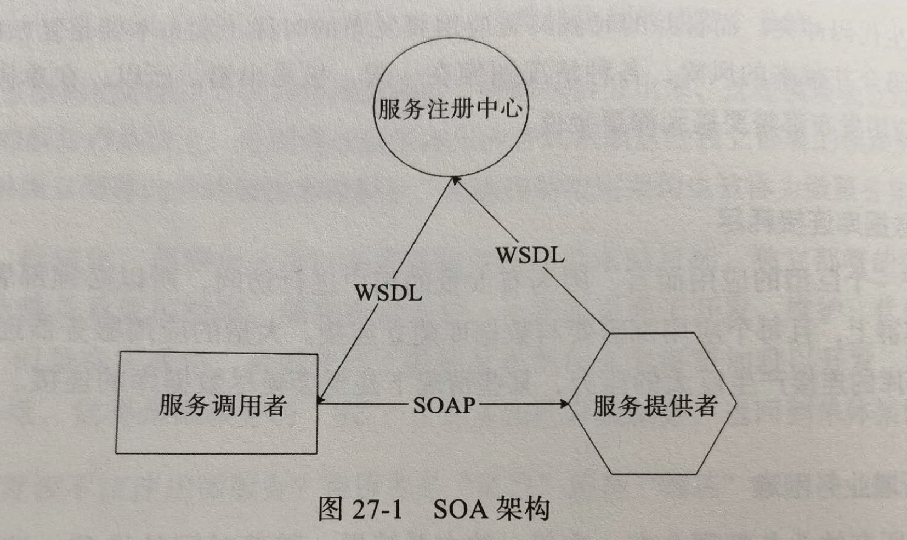

# 架构方法修炼

## 二十二.缓存架构

> 减少不必要的计算

### 解决痛点:

* 总是访问数据库导致数据库压力很大.

* 有些计算比较复杂且慢但是通用.

* 分布式缓存架构设计.

高并发的情况下,大量请求到达系统服务器,造成巨大计算压力.互联网的核心思路是**分布式架构**,提供更多服务器,从而提供更多服务资源,来应对更多的计算压力及资源消耗.

那么有没有方法可以直接减少请求压力呢,或者到达服务器后减少不必要的运算呢?减少消耗,并尽快返回结果给用户.

有,解决的核心就是缓存.

一般来说,缓存可以分为两种,

* 通读缓存

  应用程序访问其获取数据时,有就返回,没有,就自己负责访问db,返回给应用程序,并缓存这个数据.

* 旁路缓存

  应用程序访问其获取数据时,有就返回,**没有,则返回空(null),应用程序自己去db查数据,然后将这个数据写到旁路缓存中.**

### 22.1通读缓存

主要应用于CDN和反向代理缓存.

CDN:Content Delivery Network 内容分发网络,我们上网时,App或者浏览器想要连接到互联网,需要建立网络连接,移动,电信等服务商提供了这样的服务,这些网络服务商在全国范围部署骨干网络,交换机房来完成网络连接,这些交换机房可能离用户非常近,那么是不是在这些机房里部署缓存,这样用户近距离就能获得自己需要的数据了呢.提高速度,节约资源.

目前:80%以上的网络流量都是通过CDN返回的.

CDN只能缓存静态的数据内容,如图片,CSS,JS,HTML等,动态内容,例如订单查询,则必须经过后台处理才能获得,因此,互联网静态内容动态内容需要分离,也就是说要将他们部署在不同服务器集群上,且使用不同二级域名,即所谓的动静分离,一方面便于管理,一方面方便CDN进行缓存.

反向代理也是一种通读缓存,

### 22.2旁路缓存

应用程序中主要使用的是对象缓存,对象缓存则是一种旁路缓存.

不管是通路,旁路,通常都是kv的方式存储,对于kv的数据格式,在数据结构中说过,比较快速的存取方式是使用hash表,因此通路旁路大多使用的也是hash表.

程序中使用的对象缓存可以分成2种,一种本地,一种就是分布式缓存,缓存和应用程序在一个进程中启动,是程序堆空间存放缓存,本地缓存响应快,但相对空间较小,对于大型互联网来说,需要缓存的数以TB,这时候需要使用远程分布式缓存.

以memcached服务集群为例,

应用程序调用sdk api,路由算法决定调用哪台机器,但是这个路由算法是怎么计算的,我这个key的缓存该去哪台服务器寻找呢.

1. 假如说我现在有三台服务器,根据key的hash值对3取模,得到的余数一定在0,1,2之间,每个数字对应一个服务器,根据这个数字就可以找服务器了

2. 1这种方法真是简单,但是有个问题,双十一来了,我要加服务器,变成4台,重新取模但是都对不上了,缓存无法命中,大量缓存失效.

3. 解决2这个问题的方法就是使用一致性hash算法,首先构建一个一致性hash环.一致性hash环大小是0-2的32-1次方,是计算机的无符号整型的取值范围,收尾相连,

   

   然后,将服务节点按照hash值放在环上,

   

   然后当缓存的key来了的时候,按照顺时针方式,找到离他最近的node,这个缓存就在这个node上,这时候,如果加一个服务,只会对这个node到上个node间的缓存有影响,其他的缓存依然可以正常访问.

这样也还有一个致命缺陷,就是hash值是个随机值,随机值放到环上,可能是不均衡,可能导致某2个离得很近,剩下的离得很远,而我们实际是想让每个,包括新扩容的node分摊压力.

实践中,我们会使用虚拟节点进行算法改进,当一个服务节点放到环上时,不是把真的节点hash值放上去,而是将他虚拟成150个虚拟节点,然后把这150个放到环上,key依然顺时针查找,找到虚拟节点后,再根据映射关系找到真正物理节点.这样负载压力会比较均衡,又便于扩展.达到了集群动态伸缩的目的.

### 22.3缓存注意事项

三个好处:

1. 速度更快,响应更好.
2. 减小计算,减少消耗节约资源.
3. 降低负载压力,提高整个系统处理能力.

但是不是万能的,使用不当,也会有问题:

1. 首先就是脏读了,如果db变了,那么缓存的就是脏数据了,

   解决办法主要有2个.

   1. 过期失效,失效可以重新读取数据.但是也可能在有效期内读取到脏数据,但是一般有些可以接受较短时间的不一致.
   2. 失效通知,应用程序在更新数据源时候发送通知,将该数据从缓存中清除,看起来更新更及时,但是实践中更多还是用过期.

此外,不是所有数据都有缓存意义,没有热点的数据,写入缓存也很难被重复读,那么使用缓存就没必要了,

### 22.4.小结

缓存是性能优化杀手锏,任何需要查询的地方,请求数据的场合,都可以考虑使用缓存,缓存几乎无处不在,事实上,缓存最早用在CPU中,对于互联网应用来说,使用缓存可以解决大部分性能问题.

## 二十五.数据存储架构

> 改善系统的数据存储能力

### 面对的问题:

在整个互联网系统架构中,承受最大处理压力,难以被水平伸缩的,就是数据存储部分.

1. 数据存储需要使用硬盘,处理速度相比其他硬件(CPU,内存,网卡)都要慢一些.
2. 数据是公司最重要的资产,要保证高可用,一致性,非功能性约束更多.

因此,数据存储通常是互联网的瓶颈,目前,提高或改善数据库能力的方法主要包括:

* 数据库主从复制
* 数据库分片
* NoSql

### 25.1数据库主从复制

**实现原理:**

当应用程序发送一个数据到主数据库时候,数据库会把他写到Binlog中,然后从数据库一个线程会通过远程通信方式将Binlog这个记录读走,写入自己的RelayLog中,然后再一个线程把他在本地库回放,这样即可保证主,从数据库数据一致.

**可以实现:**

读写分离,写操作访问主数据库,读操作访问从数据库,数据库具有更强大的访问负载能力.

在实践中,一般采用一主多从的方式,多个从数据库承担读操作压力(一般读操作比写多),甚至他们可以扮演不同角色,有的用来做分析,有的做批任务报表计算,有的单纯做备份.

**存在的问题及解决方案:**

如果某个从库宕机,还可以将读操作迁移到其他从库,保证读操作高可用.但是一旦主库宕机,系统就没法使用了.

因此,现实中也会采用主主复制方案,两台机器互相备份,保持两台机器一致.

使用主主方案需要注意的是,主主复制只能提高写操作的可用性,不能提高性能,任何时候,系统中都只有一个主库,所有服务都接在这台主库上,只有当他宕机时候,才会切换到从库.这样才能保证一致性,数据不冲突.

### 25.2数据库分片

主从复制,主主复制都无法解决数据库存储问题.但是分片技术可以解决这个问题,将一张表,数据分为若干片,每一片包含一部分行数据,且每一片在不同服务器上,这样一张表存在多台服务器上.

1. 硬编码

   方法:

   ​	就采用硬编码方式,比如将用户数据分为2片,根据id计算,奇数查询库A,偶数查询库B.

   缺点:

   ​	缺点比较明显,就是像分布式缓存一样,增加服务器时候,必须修改分片逻辑,其次,分片逻辑必须代码控制,耦合在代码中,修改分片逻辑/业务.都可能使对方出现bug.

   解决:

2. 分布式关系数据库中间件.

   > 在中间件中完成数据分片逻辑.

   例如MYCAT实现,

   方法原理:

   应用程序像连接mysql一样,连接Mycat,提交sql命令,Mycat收到sql命令后,查找分片逻辑,就可以解析出对应的数据库,发送给对应库处理.

   实践中,常见的还是使用hash余数算法.但是也存在分布式缓存那样的,不便于扩展的问题.这个问题是致命的.

   问题:

   使用分布式缓存时候,小部分数据失效,是可以被接受的,但是mysql数据,一个都不许出问题.否则会导致严重故障,所以数据库扩展时候,通常需要进行数据迁移,即将原先的数据迁移到新加入的数据库.

   那么,哪些数据是需要迁移的呢,怎么保证一致性呢?

   解决方案:

   时间中,分布式数据库通常采用逻辑分片,而不是物理服务器分片.例如,mysql在一个库创建多个schema,分片时候以schema为单位进行,每个数据库可以启动多个,扩容时候,将schema迁移到新的库就可以了.因为分片不变,所以分片算法不需要变.

   而且因为mysql有主从复制能力,所以迁移时候,只需要将这些scheme配置到新库,数据就开始复制了,等同步完成时,再将心服务schema设置为主,就完成了扩容.

### 25.3关系数据库混合部署

上面提到了主从复制,主主复制,数据库分片,这些种方案,实际上,以上方案可以根据场景混合部署.

1. 如果数据库压力不大,且可用性要求不高,那么单一服务器或许就可以了.

   

2. 如果访问量较大,同时高可用要求较高,就需要主从复制,一主多从.

   

3. 如果业务复杂,数据存储压力逐渐增加,可以选择业务分库,即不相关业务在不同服务上.且分开的不同类数据,还可以部署位主从复制,

   

4. 不同业务的数据库,数据存储,访问压力也是不同的,例如用户数据访问可能是类目的的几十上百倍,那么针对用户数据库进行分片处理,且每个分片还可以主从/主主.

   

### 25.4NoSql数据库

NoSql数据库是改善存储的重要手段.与传统关系型不同,主要方式不是sql,而是kv,所以称作NoSql.NoSql主要解决大规模分布式数据存储问题,常见的有Apache的HBase.此外,Redis虽然经常作为缓存技术产品,但有时也被归类为NoSql数据库.

NoSql面临的挑战是数据一致性问题,如果分布式数据库,多台服务之间网络故障,可能出现不同用户读取数据不同的问题.如图.

关于分布式存储,有一个著名理论.CAP理论,即一个提供数据服务的分布式系统无法同时满足CAP.

* C:数据一致性,Consistency

  每次读取的数据,要么查到最近写入的,或者返回错误,而不是拿到一个过期数据.

* A:可用性,Availablitity

  每次请求都应该得到一个响应,而不是返回错误或者失去响应,不过他不需要保证这个响应是最新的(可能过期)

* P:分区容忍性,Partition Tolerance

  即使因为网络原因导致网络分区失效,不分服务器节点之间消息丢失或者延迟,系统仍然可操作.

对于分布式系统而言,网络失效一定会发生,所以分区容忍性是必须保证的,对于互联网来说,可用性也是要保证的,所以只能尽量保证一致性,可以作出一致性妥协.

一般,Apache Cassandra解决方案是,假如一主三从,至少等待2个节点返回写入成功,用户读取时候,从三个数据库读最新版本数据,至少等待2个节点返回后,根据返回数据时间戳,选取最新版本数据.这样,即使数据不一致,最终用户还是能拿到一个一致的数据,这种方案也叫做最终一致性.

### 25.5小结

架构是一门艺术,这一点在数据存储架构上表现最为明显.基于数据存储的挑战性,复杂性,无论选择什么技术方案,都会带来一些新的问题和挑战.数据存储架构没有银弹,也没有一劳永逸的方案,唯有深刻理解业务以及各种分布式存储技术特点的基础上,进行各种权衡考虑,作出最合适的解决方案,并想办法弥补其缺陷,才能真正解决问题.

互联网主要采用的是水平伸缩.也就是各种分布式技术,垂直伸缩较少,使用更好的硬件服务器也是一种不错的改善数据库存储能力的方法.

## 二十七.微服务架构

微服务是单体架构演化而来的,单体架构就是所有功能都打包到一个服务中,部署一个集群上,一个单体构成整个系统.

微服务是将这个大的应用拆分出来,这些模块独立运行,通过远程调用的方式依赖这些独立部署的模块完成业务处理.这些独立模块被称作微服务.这样的架构叫做微服务架构.

应该说,低耦合,一直都是我们追求的目标之一,独立部署,一来关系更加清晰,隔离更好,更易于开发,维护.但是,有时候,微服务系统反而更加难以开发,维护,技术团队痛苦不堪,觉得是微服务的锅,所以,微服务是灵丹还是毒药呢?

### 27.1单体架构的困难和挑战

1. 编译,部署困难

   一个系统打成一个war,编译慢,部署慢,修改后需要频繁部署.恶心循环.

2. 代码分支管理困难

   大家共同修改,合并代码极容易出现冲突.

3. 数据库连接耗尽

   对于巨型应用来说,有大量的用户进行访问,所以必须部署到大规模集群上,且每个应用都需要与数据库连接,大量连接会对数据库产生很大压力.甚至耗尽连接.

4. 新增业务困难

   所有代码耦合在一起,随时时间推移,系统会非常臃肿,想维护十分困难.很多新入职的不熟悉业务,整个公司热火朝天的干着,但最后依然常常出故障,新功能迟迟不能上线.

5. 发布困难

   单一系统war包含所有代码,新版发布时候,即使此次上线跟自己关系不大的开发,也得一起陪着,应对上线风险.

### 27.2微服务框架原理

当年,阿里开发了一个微服务框架重构微服务架构,这个微服务框架就是著名的Dubbo.Dubbo借鉴了更早的SOA架构方案,即面向服务体系架构,SOA架构.一个服务调用者,一个服务提供者,一个注册中心.

早期的SOA架构的时候,各种协议都比较重,服务注册,发现,很复杂,调用效率也比较低,

Dubbo在借鉴SOA基础上做了优化,抛弃了SOA的一些不必要约束规范,使用二进制协议进行服务注册及调用,执行效率和使用简洁性都得到的极大的提升.

Dubbo和SOA架构一样,核心组件也是三个.

顾名思义,服务提供者就是微服务具体提供者,他通过微服务容器对外提供服务,

具体过程是服务的提供者程序在Dubbo的服务容器中启动,通过服务管理容器向服务注册中心注册,声明服务提供者提供的接口参数和规范,并注册自己所在服务ip,端口.

服务的消费者想调用某个服务,只需要依赖服务的提供者的接口进行编程即可,而服务接口通过Dubbo框架代理访问机制,调用dubbo的服务框架客户端,服务框架会根据接口说明,去注册中心找对应服务提供者启动在哪些服务器上,并且将这个服务器列表返回,客户端再根据负载均衡,选择某个服务,调用请求.

### 27.3微服务架构的落地实践

如果说:

即使在单体时代,war内的模块关系比较清晰,那么在微服务重构时候,只需对这些模块进行微小改动,进行微服务部署就可以了,

那么,为什么开头说,微服务可能开发更困难呢?问题更多呢?

有的技术团队,没有达成共识,又没有做好模块划分,模块职责边界不清,依赖关系混乱,很多隐藏的单体问题到了微服务上变得更加严重.于是有人觉得是微服务的问题.

微服务不同于分布式缓存,分布式消息队列,分布式数据库等这些技术,这些技术可以说是比较纯粹的,和业务耦合关系不大,使用场景也明确.而微服务,本身就是和业务息息相关,如果业务没梳理好,模块边界不清晰,使用微服务很可能得不偿失,带来各种问题.

很多技术团队实施微服务时候,将重点放在微服务技术框架上,事实上,微服务框架,只是一种技术,是一种工具,他对于成功实施微服务不是最重要的,最重要的是你实施了微服务,究竟能得到什么,

实施微服务关注点应该是下面这个倒三角.

首先要明确需求,到底要达到什么目的,需求清晰了,再考虑价值,再根据价值构建原则,再去根据原则寻找最佳实践,最后再找实践需要的合适的工具.

如果先找到工具.然后因为工具,硬往上套,只会怪技术用不好,业务也做不好,所有人都疲惫不堪.事情一团糟.

### 27.4小结

微服务和业务非常紧密.仅仅用微服务技术框架无法成功实施.成功实施的重点还是做好业务模块化设计,模块之间低耦合,高内聚,依赖关系清晰,只有这样的模块化设计,才能构建出良好的微服务架构,如果本身就很混乱,强拆,只会导致系统更加的混乱.