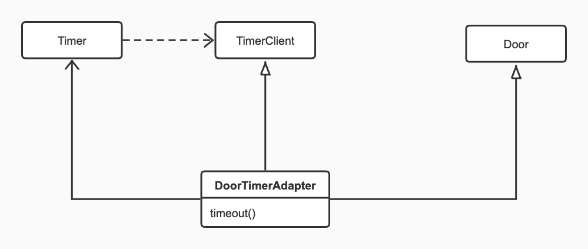

# 程序设计修炼

## 痛了吗?

1. 在工位上,吹着电扇听着歌,开开心心写新功能,已经测试通过的功能又报错了!!what???十,十一
2. 我们写程序的时候,都是一个接口接一个实现,你有想过为什么你总是要有一个接口吗?这个接口存在的意义是什么?十一.
3. 当你拆服务的时候,有没有遇到一个包拿走结果噼里啪啦报错,一个类一个类补?你有注意过程序中的pom吗?依赖关系.尤其是application-service,和mdd-repository-adapter,是谁依赖谁.为什么?十二
4. 写代码时候,想依赖一些功能,但好像这个又不百分百符合我需求,咋办?我得改改,但是我怎么把这个能力拿到我得类里面呢?十三.
5. 好不容易找到了一个方法,用起来却有点小问题,想调试看看哪里的问题,结果300行.痛吗?如果你不想,十四.
6. 调用过别人接口吗?30个方法那种,怎么这么多?我不理解,这都啥,我需要吗?难受吗?十五
7. 当你依赖不稳定方法,时而报错,因为依赖他,他的改变导致你的接口也变得不稳定,怀疑自己得了一觉醒来综合征,你暴躁吗?

## 十.软件设计的目的

### 糟糕的程序差在哪里?

>  &nbsp;&nbsp;&nbsp;&nbsp;&nbsp;&nbsp;&nbsp;&nbsp;好与坏的程序设计最大的差别就体现在对于需求变更的处理上.好的程序员用优秀的设计从容面对需求变更,不好的程序设计害怕需求变更,因为每次需求变化都需要对代码进行修改,导致无尽的bug,夸张吗?糟糕的代码就是这么大威力.测试过程中bug无法收敛,越改越多,开发过程让开发者陷入迷宫,仅仅看,也会使阅读者头晕眼花.  


### 10.1糟糕的设计有多糟糕.

1. 僵化性

   耦合严重,难以改动,牵一发动全身.

2. 脆弱性

   比僵化性更严重的问题,可能小小改动就会使程序莫名其妙出现问题,崩塌.僵化让改动由3小时变成3天,那么脆弱性让程序员抓狂,甚至怀疑人生.

3. 牢固性

   都在一块,软件无法拆分,想复用一部分,却无法分离出来.微服务架构大行其道,但是你的程序,真的拆的动吗?

4. 粘滞性

   需求变更时候,如果糟糕修改方案比优秀方案更加容易实施,那么就会向糟糕方向发展,即代码负债越来越多,随着一次次变更,变得千疮百孔.

5. 晦涩性

   代码首先是给人看的,其次才给机器执行,代码设计者一开始就有良好设计,后继者维护时候才有章法可循.

## 十一.软件设计的开闭原则

### 11.1什么是开闭原则

对扩展开放,对修改关闭,大家都耳熟能详吧,但是我问下,有人真的做到了吗?如果你没有做到,那么可以来学习一下可以实现开闭的方法.

### 11.2一个违反开闭的简单例子

设计一个通过按钮控制拨号的电话,核心对象按钮,拨号器.


```java
public class Button {
    private Dialer dialer;
    private int btnVal;

    public final static int SENDBUTTON = -99;

    public Button(Dialer dialer, int btnVal) {
        this.dialer = dialer;
        this.btnVal = btnVal;
    }

    public void press(){
        switch (btnVal){
            case 0:
            case 1:
            case 2:
            case 3:
            case 4:
            case 5:
            case 6:
            case 7:
            case 8:
            case 9:
                dialer.enterDigit(btnVal);
                break;
            case SENDBUTTON:
                dialer.dial();
                break;
            default:
                throw new UnsupportedOperationException("没这个按钮");
        }
    }
}

public class Dialer {
    public void enterDigit(int btnVal){
        System.out.println("输入了:"+btnVal);
    }

    public void dial(){
        System.out.println("拨号中..");
    }
}

```

我们可以创建数字按钮,发送按钮,这个代码可以正常运行并且完成需求,似乎没什么问题.这样的代码我们司空见惯,但是他违反了开闭原则,

1. 当按钮种类变多的时候,我们要修改Button类,
2. 当我们要用按钮控制密码锁时候,要修改Button类,
3. 当想控制多个设备时候,还要修改Button类.

似乎对Button做任何扩展,都要修改button类.这个Button非常僵硬,打断switch,非常脆弱,增加新的按钮类型,需要非常谨慎找到合适位置,稍微不小心就bug了,粗暴的说,当我们看到else,或者switch时候,基本可以断定他违反了开闭.  

再有,这个Button难以复用,Button内部还有个Dialer呢,我到哪都要带着这个Dialer,太糟糕了,不管我需不需要Send,他也都带着这个功能.  

很多设计开始并没有什么问题,但是当需求变更时候,就会发现各种僵硬,脆弱,当需求变更并发现当前设计的腐坏,就要及时重构,保持代码健壮,干净.

### 11.3策略模式实现开闭原则


他们之间加了层ButtonService,当Button按下是,就调用ButtonService的buttonPress方法,实际就是调用了Dialer的buttonPress方法,

既完成了触发方法,又不依赖Dialer,这样,Button很容易复用到别的按按钮的场景.  

而且,Button也去掉了switch,只需要继续传下去btnVal就可以了.增加新的按钮,也不用改Button.

### 11.4适配器实现开闭原则

Button是不用动了,实现开闭了,但是Dialer一变化还得动啊,怎么办??  

适配器啊,适配器啊,这是一种结构模式,用于将两个不匹配的接口适配起来.Dialer不实现ButtonService了,而是增加两个适配器,适配器实现接口,  


这个场景,Button调用的是buttonPress,而Dialer方法是enterDigit,和dial,不匹配啊,我不修改Dialer代码,让Button能调的动Dialer,就是靠适配器.

每个按钮,依赖一个具体的适配器,当自己按下的时候,将值发给适配器,适配器在调用Dialer.

### 11.5观察者模式实现开闭原则

通过策略,适配器,现在Button,Dialer都符合开闭了,但是,我这控制的一直都是一个设备,我现在要按按钮让喇叭能唱生日快乐歌,让屏幕跑马灯,那么适配器中出现了多个设备,增加设备要修改设备器代码又不符合开闭了,咋弄?  


喇叭的适配器实现Listener,或者想用按钮的都找适配器实现,然后谁需要,谁就添加到Button的列表中,当Button按下时候,就一个个调用,一个个通知,适配器知道,他们的主人要干啥.

这里的Service变成了Listener,类改名了,不要紧,只是为了更好的理解他的用途是一个监听者,接口没变就好.

### 11.6模板方法实现开闭原则

一切万事大吉,突然又想除了控制别的,按钮本身还想执行些操作,完成对成员变量的修改,不同按钮类型操作和记录状态都不同.好像又要在Button的press方法加入switch了,怎么办.这时候可以引入模板方法.  


```java
abstract void onPress();

public void press(){
	onPress();
	for(ButtonListener listener : listeners){
		listerer.buttonPress(btnVal);
	}
}
```

### 11.7小结

实现开闭关键是抽象,当一个模块依赖的是一个抽象接口时候,那就可以随时对抽象接口扩展.利用多态,通过新实现完成扩展.开闭原则可以说是软件设计原则的原则,是软件设计核心原则.

1. 当我 == 一个实体

2. 当我依赖一个接口,我可以保证我自己没变化时候,我就不用变,而把自己判断逻辑交出去.

   > 理论上这一步是必须的,即使需求层面绝对不存在多种策略,也不排除需求变更,这样做可以让自己随时切换.

3. 当我被依赖了,我可以保证我自己没变化时候,我就不用变,你想调用我,加一层适配器,适配器来调用我.

   > 当你提供服务给别人,你也应当提供不同的接口,以让别人更简单触发你.
   >
   > 要注意适配器中的职责不能太多.否则,应该还是将职责放到实体内部,继承实体,实现接口,做一个新的子实体,举例就是,调用者Button,与其他依赖Dialer的,各取所需.

4. 当我需要同时调用多个实体干活的时候,谁需要被调用,谁注册给我,我到时候告诉你.

   > 当你作为上游,存在多调用情况时候,且程序还在继续扩大规模,观察者模式是你必须考虑的.

5. 当我业务比较多,不光我要调用你们,我自己个还得干点事,我弄一套流程,我一边调用你们,在另一边,我自己具体孩子单独实现去.

   > 模版方法几乎是,稍微丰富点的实体必须具备的.我们代码中已经到处存在了,而且模版Spring已经玩麻了.

## 十二.软件设计的依赖倒置原则

> 不依赖代码却可以复用他的功能.

现在我们都是框架开发,作为java开发者,Spring太熟悉了吧.你没有调用过Spring的代码,却能使用他的特性,开发高内聚低耦合的代码,或者说不需要调用Tomcat的代码,就可以监听Http端口,处理Http请求.神奇不?  

不卖关子了,先说答案,大家以前访问DB时候,是怎么访问库的,都是依赖`JDBC`吧,在`java.sql`中的,各种数据库驱动也都实现了`JDBC`,当程序换库时候,无需修改,因为我依赖的是JDBC抽象,而数据库驱动作为底层,也是依赖JDBC.  

同样的,java开发的web应用,无需依赖Tomcat,只需依赖`J2EE`规范,实现规范的servlet接口,然后打包,通过容器启动就可以处理Http请求了,这个WEB容器可以是Tomcat也可以是任何实现J2EE的容器,高层不依赖底层,都依赖J2EE规范.

### 12.1依赖倒置原则

> 高层模块不应该依赖低层模块,二者都应该依赖抽象
>
> 抽象不应该依赖具体实现,具体实现应该依赖抽象

在我们历史思维中,还是controller依赖Service,Service依赖dao这种传统的依赖方式.那么这种方式缺点是什么.

1. 维护困难,一般说高层是业务与策略逻辑,是软件核心所在,而底层是技术细节,这样说技术细节改变可能会影响高层改变,这是不合理的.
2. 复用困难,通常高层复用价值才更高,如果高层依赖底层,那么将变成连带依赖,复用困难.

### 12.2依赖倒置的关键是接口所有权倒置

看下面这个图,TaskService依赖ITaskRepository接口,然后再repository实现它,依赖抽象依赖抽象,其实最最重要的是,依赖的抽象,这个接口的所有权,是application-service


### 12.3使用依赖倒置,实现高层模块复用.

让我们回到11.2那个违反开闭的例子,现在我们可以看到,Dialer变化,Button就可能跟着得变,于是我们优化了到11.3那个策略,在这里需要强调的是,这个接口,所有权是属于Button的,不管你是谁,只要你实现我的Service,我按钮就能控制你,这就是依赖倒置的精髓.  

现在再回头看看开头那个问题.其他工程师不需要调用我代码,就能使用我们代码功能特性?如果我们是Button开发者,只要其他工程师实现我们提供的Service,我们就能控制这些设备.设备开发者也不需要调用Button,就能拥有Button的功能,

### 12.4小结

遵循依赖倒置规则几个编码守则

* 应用代码多使用抽象接口,避免使用多变的具体实现
* 不要继承具体类,如果一个类设计之初不是抽象类,那么尽量不去继承他,对具体类的继承是强依赖,维护时候难以改变.
* 不要重写包含具体实现的函数

依赖倒置最典型使用场景:框架设计.

毒鸡汤:软件开发有时候像变魔术一样,常常表现出违反常识的特性,让人目眩神秘,这正式软件编程魅力所在,感受这种魅力,并在自己的开发中展现这种魅力,你就迈进了高手的大门.

## 十三.软件设计之里式替换原则

> 正方形能继承长方形吗?

抽象,封装,继承,多态,有人不知道吗?但是想用的好,可能需要花费很多时间.  

通俗来讲,抽象的接口,多实现就是多态,在运行期绑定具体类,实体类之间不需要耦合就可以关联,构成完整强大的服务.绝大多数设计模式都是利用多态玩的把戏.  

封装,是说将哪些属性,方法,放到哪个类呢?这个问题其实就是对对象的设计,深入研究,里面也有很多学问.

**继承似乎比多态,封装简单些,但实践中,继承的误用也很常见.这一章我们聊聊继承那些事.**

### 13.1里式替换原则

如何设计继承关系,怎么不违反开闭?这里有个原则,就是里式替换原则,原则原话太专业,大白话说,所有使用基类的地方,都应该可以用子类替代.  (还没懂?往下看)

语法上来说,任何类都能被继承,但是继承是否合理,从继承本身,你并不能看出来,而是要从使用场景.

举个例子,

🐴有个抽象方法,被骑,他有两个继承,大白🐴,小🐴驹,大白马上场时候,没什么问题.但是20天的小马驹能被骑吗?所以,就针对这一种场景,小马驹能替代(抽象)马吗?不能,违反了里式替换原则.

### 13.2违反里式替换原则的例子

这个懒得说了.

### 13.3.正方形可以继承长方形吗?

正方形是长方形吗?是啊,正方形是特殊的长方形,他的,宽,高相等.所以可以继承吗?

但是记得前面说的吗?继承是否合理,是否违反里式替换原则,需要具体场景考察.

```java 
public class Rectangle{
	private double width;
	private double height;
	private void setWidth(double w){
		this.width = w;
	}
	private void setHeight(double h){
		this.height = h;
	}
	public double calculateArea(){
		return width*height;
	}
}
```

这个类满足我们需要,在多个地方被调用,但是现在,我们需要个正方形.我们看看继承是否合理.

```java
public class Square extends Rectangle{
	//设置宽就是设置高
	private void setWidth(double w){
		this.width = w;
		this.height = this.width;
	}
	//设置高就是设置宽
	private void setHeight(double h){
		this.height = h;
		this.width = this.height;
	}
}
```

看起来很正常啊,很正常.很正常吗?

如果有个场景.

```java
void testArea(Rectangle rect){
	rect.setWidth(3);
	rect.setHeight(4);
	assert 12 == rect.calculateArea();
}
```

显然,如果这里正方形替换了长方形,计算面积一定是16,程序不能正常运行,所以不满足里式替换原则,是不合理继承.

### 13.4子类不能比父类更严格.

类的公有方法,其实是对使用者的契约.使用者按契约使用,并期望按照契约运行,返回合理的值.

按照里式替换原则,子类可以在任何地方替换父类,那么子类不能比父类更严格,否则可能会因为更严格而失败.

上面的例子,正方形继承长方形,正方形长宽要求相等,更加严格,所以导致最终失败.开头🐴的例子也是,小马太小了,更严格,即不能骑,所以失败.  

大家调用BaseAPPService,BaseExtendService,里面有些东西是protected的,有人重写过吗?你想留起来自己用,能写成private吗?不能,因为private比protected更严格,但是public呢,可以!

通常来讲,子类不能比父类更严格,这个原则简单,合理,但是实际中,不严格审视自己的设计,很可能违背里式替换原则.

摘抄:在JDK中,Stack继承自Vector.子类比父类更严格,子类只能先进后出,父类是线性表,这两个类jdk1就已经存在,如果能重来,jdk的工程师一定不会这样了.这也说明,不恰当的设计时很容易发生的,设计继承时候,更要严谨审视自己设计.

### 13.5小结

实践中,如果继承父类,只是为了复用父类的方法的时候,那你里错误继承不远了,一个类如果不是为了继承而设计,最好不要继承,简单说,如果不是抽象,或者接口.不要继承他!

如果你确定,你要用他的方法,最好的方法是组合他,而不是继承.我现在就在想,上次我用BaseExtendsService,我保存时候我要走平台common的rule,结果我继承了他,并重写了落库那个方法,现在想,我好像是不妥.

## 十四.软件设计的单一职责原则

> 一个类打开后最后不要太长..具体多长,就是不要太长.

我跨过了山河大海,跨不过码山码海~

### 14.1单一职责原则

好了废话不多说,上干货.

软件两个基本准则,高内聚+低耦合.前面讲的例子以及设计模式都是低耦合的,这次我们说说高内聚.内聚性说的是组成一个模块或者类的内部元素的功能相关性.

设计类,应该把强关联的属性,方法放在一个类里,弱关联的放在类外边,保持高内聚.时刻记得哦.

一个类,应该只有一个变化的原因.

如果一个类承担太多职责,就等于把这些职责耦合在一起,这种耦合很脆弱,当发生变化,类会引起很多不必要的修改.进而导致bug发生.

职责太多,还会导致代码太多,难以保证开闭,如果不得不进行修改了,大堆代码出现在屏幕上,一不小心就会出bug.

所以,一个类,最好不超过一屏幕,1.可以更容易复用,扩展,2.更简单的阅读,维护方便.

### 14.2一个违反单一职责的例子

再重复下,判断类职责是否单一,就看这个类修改时候是不是只有一个引起它变化的原因.

看这个类图


长方形有两个方法,画图draw(),算面积area(),很合理对吧.

现在,两个应用依赖这个类,几何计算应用和图形界面应用.

画图要算面积,算面积不需要画图.而且画图非常麻烦,还需要依赖GUI组件包.

这就尴尬了,我一个几何计算,依赖Rectangle,还需要GUI?这个包几十MB甚至上百啊,本来我就想做个科学计算器,却不得不打包不相关的GUI.

Rectangle就违反了单一职责,承担了两个职责,这种两个方法会互相影响,看看下面这个.


面积计算拆到单独的类GeometricRectangle,纯粹负责计算面积,Rectangle只负责画图,依赖画图的,以及一堆GUI组件.

### 14.3小结

类变多了,不要紧,单个类代码少了,代码整体来说变得更简单了.复杂度降低.

## 十五.软件设计的接口隔离原则

> 如何对类的调用者隐藏类的公有方法.

假设有个缓存服务,Cache,功能高内聚,但是功能分为两组.

1. 对普通开发者有能增删查的方法,
2. 重置掉所有缓存的方法提供给清缓存流水线服务调用.


对清缓存流水线开发者来说,多几个方法,碍眼但是还能接受,但如果这个fulshall()方法被普通开发者错误调用,那可就麻烦了.但是都是public的,怎么控制呢?

### 15.1接口隔离原则

> 不应该强迫用户依赖他们不需要的方法.

接口隔离原则,解决你的问题.

当一个类的方法,对所有人暴露且无论他是否需要,理解的时候,这时候就要反思了.

有人会想到上面的单一职责,我弄两个类把他们分开不就行了吗?但是这内聚没问题啊,我都操作我的缓存,放一个类无可厚非.下面让你看下接口隔离原则是怎么做的.


Cache实现2个接口,当我对流水线服务暴露CacheFlushService,而对开发者调用CacheService,通过接口,然不同的人看到不同接口,是不是很神奇!仔细想想,原理是不是很简单.

### 15.2一个使用接口隔离原则优化的例子

假设已经有个门,他可以开,关,并判断是否开着.

```
class Door{
	void lock;
	void unlock;
	boolean isOpen;
}
```

现在需要一个定时门,定时一定时间自动关闭,

已经有一个类Timer,和一个接口TimerClient

```
class Timer{
	void register(int timeout,TimerClient client)
}
interface TimerClient{
	void timeout();
}
```

现在这里有个简单直观的方法.

修改Door,实现TimerClient,直接将Door注册给Timer,这样就可以实现定时了,

```
class Door implements TimerClient{
	void lock;
	void unlock;
	boolean isOpen;
	void timeout(){
		lock();
	}
}
```

这个方法简单,有效,问题就是在于Door多了个timeout方法,普通人看到可能觉得莫名其妙,如果复用他,所有的程序可能都依赖一个他们不用的方法timeout.这时候可以看到接口隔离发挥了作用.

一种方法是通过委托,也就是增加适配器,适配器实现TimeClient,聚合一个Door,并将自己注册给Timer,适配器来做超时后让门关闭的事.


这样就是适配器任务会重些,尤其是,业务逻辑较多,比如超时还有较多逻辑,就会超出适配器职责范围,或者可能还需要Door内部状态,会有强迫Door作出改变的可能.

这个类图就是11.4那个适配器模式实现开闭,Timer就是Button,TimerClient就是被调用的接口,一个适配器实现了他,适配器再去调用实体.

还有种方法就是,多重继承.一面实现TimerClient,一面继承Door,造出来新的多功能定时门,将这个门注册给Timer,这样复用后依赖Door的程序看不到timeout方法,而Timer也不会看到Door的方法,完全隔离,程序更简洁.



### 15.3小结

当一个类比较大,如果该类的不用调用者被迫依赖了类的所有方法,就可能产出不必要的耦合,或引起误用,导致对象结构被破坏,产生Bug.

使用接口隔离原则,核心思想就是定义多个接口,不用调用者依赖不同的接口,只看到自己需要的方法.

## 项目云要求:

讨论这么多方法,原则,如果你觉得有用,正好可以解决痛点,想尝试下改变.那么我提出些要求,帮助大家改进

已经沉淀下来的,谨慎修改,循环迭代.

1. 保证功能开发进度,不要因为技术而技术,还是以产品迭代为首要任务!
2. 所有功能,先做设计,(不是很负责的设计,就简单的画画类图,确保没有做歪且可扩展),你做设计之前,要问清需求,理清需求,必须明白,我这次做的,是为什么角色做的,解决什么问题,我这个功能跟谁的什么功能是有关联的,并进行简单评审.
3. 当你的服务需要拆分,拆分过程中,如果发现各层难以分割,可以作出结构修改.
4. 当需求变了,你又要改的时候,整个类都将变化,变得不稳定,请仔细审视,这个方法是不是应该继续在这里,如果不是,请将它移走.
5. 谨慎继承
6. 接口就像裁缝的剪子厨师的刀.自己的模块接口设计自己写(可以别人教但是接口一定自己写),不允许在别人的模块里的接口里随意添加方法,你只能在别人的接口实现里写(在别人给你留好的地方写).所以如果你需要一个功能,请说,我需要一个***接口,请提供给我.而你也是依赖接口.
6. 如果你提供的是框架,请设计好自己的接口,并且说,请实现我的接口,实现什么什么..我能给你提供什么,你需要给我返回什么..
7. 提供的接口,**是接口上不是实现上**!!一定要有详细的注释,别人调用你只会调用你的接口不会调你的实现,你的实现注解,自己能看懂就好,当你调用服务,如果你觉得别人提供给你的接口你用的不爽,质疑他,并展开讨论,失败的一方作出修改.
8. 当你作为下游需要别人调用你的时候,不允许直接去别人方法里调用自己,请提供接口,告诉他,什么时候,调用我.让调用者好好思考决定,什么时候调用,在方法的哪一行调用,并做好调用的处理.如果下游不稳定,需要负责,因为你会让上游不稳定.
9. 尽量少用@Autowired,稍有不慎,它让你不再职责专一.也让你不容易脱离容器测试.也让你不容易随心所欲切换具体策略.推荐构造方法注入,在一开始,就知道这个类大概要做哪些功能,该注入的注入,谨慎扩展.

想跟大家说下,计算机发展进程,就像猿人抛起来的一块石头,落地时候,这个石头已经变成了火箭.时代变化这么快,如果你想让需求永远一成不变,那你一定是非蠢既坏,等待被时代淘汰.我们真正应该做的,就是用好的设计,从容面对一切变化,你核心业务变了,我改领域方法(这个很难变),你一个操作方式变了,没事我facade重新给你组装下顺序.来调这个.用户好像喜欢用那种特殊方式?没事给你留一种策略满足你.什么你想多数据库?没事你想用哪个我就给你适配下soeasy.