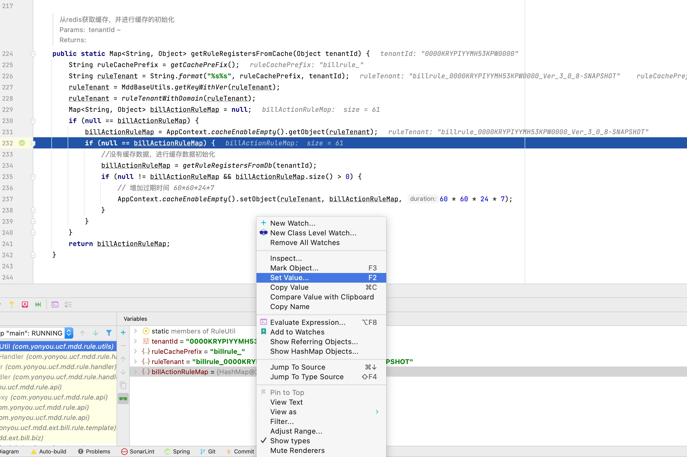

# 其他操作
## 一.清除redis缓存.

因为全日常的redis的缓存都是存在一起的,所以不可以贸然删除redis中的缓存.正确的操作是:

1. 首先找到`RuleUtil`类,这个类在源码中.package com.yonyou.ucf.mdd.rule.utils;

2. 在调试过程中,在取缓存数据的地方打个断点.

   

3. 看到下面调试的地方,把从缓存中拿出来的值,强行设置为null,这样就可以重新获取数据了.
