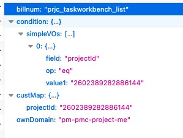

# rule规则

用友单据的直接操作,都是执行一串rule规则来完成的.来解析一下这个rule规则.

首先rule是什么时候出现的?

```
有一些默认的rule,比如common的,自己也可以配置一些单据基本的rule,rule默认的是0租户的,只有两种情况才会把rule复制一份给租户,1-新开租户的时候,2-租户升级的时候.
```

下面是一些rule执行的流程.

## 1.BillDataDto.前台参数解析及后台简单处理

这个对象,就是单据数据对象,负责将单据的数据传递给后台处理.介绍几个常用的属性吧.

0. 前端传输截图举例:



1. private FilterVO condition;

   不是给开发自己用的,是平台service用的.

   对应元数据普通查询条件.类型是FilterVO.这个FilterVO中,最常用的事simpleVOs,是个数组,多个条件.

   当然后续还可以继续在后台给他添加condition.

   ```java
   billDataDto.appendCondition(ProjectScheduleConsts.TASK_STATUS, "in", statusArr);
   billDataDto.appendCondition(ProjectScheduleConsts.PLAN_END_DATE, "lt", DateUtil.dateStrParseDate(DateUtil.INSTANCE.getToday()));
   ```

   

2. private String billnum;(其实这家伙在他父类中BaseDto)

   单据编码,代码当前是哪个单据.

3. private Map<String, Object> custMap;

   自己有什么属性,可以放这里,自己取出来用.

   ```java
   Map<String, Object> custMap = billDataDto.getCustMap();
   if (custMap != null && !custMap.isEmpty()){
   	//....
   }
   ```

## 2.IBIllService.-处理BIllDataDto的家伙

这里面方法可多了去了.挑常用的介绍.

1. public Pager queryByPage(BillDataDto bill) throws Exception;

   分页查询

2. public RuleExecuteResult save(BillDataDto bill) throws Exception;

   保存单据

3. public RuleExecuteResult delete(BillDataDto bill) throws Exception;

   删除单据

4. public Object getRefData(BillDataDto bill) throws Exception;

   查询参照的

5. public ExcelExportData export(BillDataDto bill) throws Exception;

   导出

6. public ResultList billImport(BillDataDto bill) throws Exception;

   导入

## 3.save为例,深入探索

IBillService中save的实现是DefaultBillService实现的,其中DefaultBillService又调用了BillBiz来执行save.进来BIllBiz后,创建个BIllBizSaveService代理对象IBillBizProxy(这时候已经给BIllBizProxy中的target赋值了),然后doExecute-billBizProxy.doExecute(bill, null, false);.    

到了代理类中,判断是否手动传了action,异步等信息,这里都假设是同步的,走invoke,进实际的service执行execute方法.(这里就是BillBizSaveService类),

具体的实现类的execute中,最重要的是

```java
new CommonOperator(OperationTypeEnum.SAVE).execute(bill);
```

这个CommonIOperator里面穿进去各种操作类型.看看他的构造方法,这里**set了一个action**

```java
public CommonOperator(OperationTypeEnum operationTypeEnum) {
        proxy = new RuleOperatorProxy(operationTypeEnum);
        this.operationTypeEnum = operationTypeEnum;
        this.action = operationTypeEnum.getValue();//action在这里赋值了!
        this.isMakeup = false;
}
```

然后他就开始执行自己的execute了,首先get了单据上下文,然后就去执行rule了,调用了

```java
proxy.executeRule(billContext, bill);//这个proxy,就是构造方法里那个.
```

准备去执行了.

## 4.Rule开始了

RuleOperatorProxy,是rule执行的开始类.

1. 首先要拿到rules

   `doGetRuleQueue(billContext, bill, commonKey);`,在这里面,首先由于我们看到action传递的是null,而后又设置成了`operationTypeEnum.getValue()`,所以,这里判断action时候,为null,所以取得是`operationTypeEnum.getValue()`,也就是save.

   继续在往下走,就是RuleEngine去查询rules了.`RuleEngine.getInstance().doGetRules(context)`.稍后介绍RuleEngine.

2. 拿到rules以后,就是doExecRules了,同样是RuleEngine,`RuleEngine.getInstance().doExecRules(buildRuleContext(billContext, paramMap), ruleList)`;

## 5.RuleEngine

1. doGetRules

   实际干活的是DefaultRuleListHandler.`public Queue<RuleRegister> getAndFilterRules(String billnum, String action, String ruleKey, Object tenantId, String[] ruleLvsOri)`.拿到并且过滤rule.  下面有详细讲到.

2. doExecRules

   这个就是调用IExecRulesHandler来执行了.`execRulesHandler.doExecRules(ruleContext, ruleList);`,他的默认实现就是DefaultExecRulesHandler,

## 6.DefaultRuleListHandler

### 1.getAndFilterRules.

说一下,getAndFilterRules这个方法很重要,里面调用了  

`RuleUtil.getBillNumRuleFromCache(tenantId, billnum, ruleLvsOri, action);`(默认缓存是开启的,也就是从缓存里取rule).  

`filterRules`方法,根据表单billnum过滤.  

`overrideRule`方法,覆盖rule. 如果想覆盖rule,看看这个.规则覆盖规则： 规则目前分为三个级别 单据级、模块级、公共级 在规则覆盖时，依次从高到底进行覆盖

## 7.DefaultExecRulesHandler

### 1.doExecRules.

它里面就是doExecRules这个方法了,遍历执行rule.

`public <T> RuleExecuteResult doExecRules(RuleContext ruleContext, Queue<? extends RuleRegister> ruleRegisterList) throws Exception.`

这个RuleRegister是一个rule的信息,里面有billnum,ruleId等信息,在执行过程中,将这些信息get到bean,也就是我们继承自AbstractCommonRule,实现了IRule接口的那些bean.
