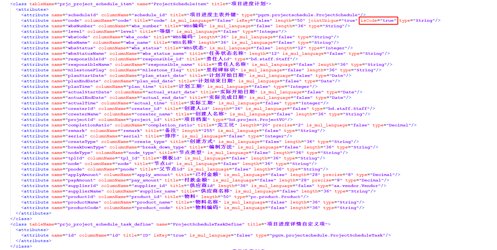
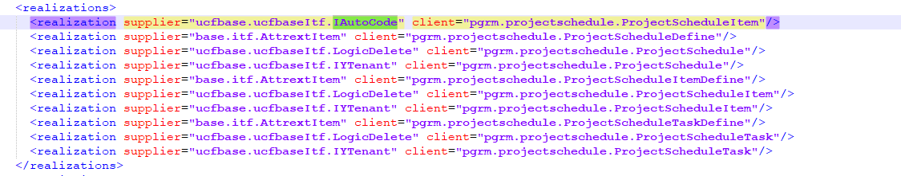
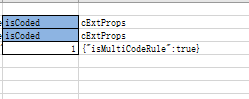

# 编码规则

## 1.元数据中给字段增加编码规则.



[joinUnique属性不确定]



## 2.ui模板中增加编码规则属性

注意事项:ui模板必须是Card页,List页是不生效的.也就是说Voucher属性的才生效.

在`bill_base`模块中增加



## 3.增加预制脚本.

```sql
-- 任务编码规则
-- 配置0租户的编码规则
delete from aa_billnumber where cbillnum='pgrm_project_task_import';
INSERT INTO `aa_billnumber`( `tenant_id`, `orgId`, `cbillnum`, `cbillname`, `csubid`, `ballowhandwork`, `brepeatredo`, `istartnumber`, `iseriallen`,
                             `billnumLen`, `billnumInit`, `billnumTruncatType`, `billnumFillType`, `billnumFillMark`, `billnumMode`, `billnumRule`, `isReuse`, `sysid`, `datatype`,
                             `rulecode`, `rulename`, `dr`, `pubts`, `yhtTenantId`, `sntype`, `isDefault`, `code`, `ytenant_id`) VALUES
(0, '-1', 'pgrm_project_task_import', '任务列表', 'pgrm', 0, 1, 1, 4, 4, 1, 0, 1, '0', 1, 0, 1,
 'diwork', 1, 'pgrm_project_task_import', '任务列表导入', 0, '2021-09-24 12:02:58', '0', 0, 1, 'pgrm_project_task_import', '0');

delete from aa_billprefix where cbillnum='pgrm_project_task_import';
INSERT INTO `aa_billprefix`(`tenant_id`, `orgId`, `cprefix`, `iprefixlen`, `cprefixrule`, `cprefixseed`, `iorder`, `bfix`, `cprefixid`, `cprefixtype`,
                            `cprefixsep`, `cfieldname`, `csourcename`, `ipurpose`, `fillstyle`, `fillsign`, `billnumberid`, `dr`, `pubts`, `cbillnum`, `yhtTenantId`, `formula`,
                            `formuladisplay`, `bMain`, `billnumberCode`, `ytenant_id`) VALUES ( 0, '-1', '任务列表导入前缀1', 4, 'RWDR', '', 1, 0, '', 2, '', NULL, NULL, 0, 1, '0',
                                                                                                73, NULL, '2021-09-24 12:02:58', 'pgrm_project_task_import', '0', NULL, NULL, 1, 'pgrm_project_task_import', '0');

INSERT INTO `aa_billprefix`( `tenant_id`, `orgId`, `cprefix`, `iprefixlen`, `cprefixrule`, `cprefixseed`, `iorder`, `bfix`, `cprefixid`, `cprefixtype`,
                             `cprefixsep`, `cfieldname`, `csourcename`, `ipurpose`, `fillstyle`, `fillsign`, `billnumberid`, `dr`, `pubts`, `cbillnum`, `yhtTenantId`, `formula`,
                             `formuladisplay`, `bMain`, `billnumberCode`, `ytenant_id`) VALUES ( 0, '-1', '任务列表导入前缀2', 8, 'yyyyMMdd', 'yMd', 2, 1, '', 3, '', NULL, NULL, 0,
                                                                                                 1, '0', 73, NULL, '2021-09-24 12:02:58', 'pgrm_project_task_import', '0', NULL, NULL, 1, 'pgrm_project_task_import', '0');

-- 参照表配置
delete from billforeignkey where billno = 'pgrm_project_task_import' and source = 'productCode';
insert into billforeignkey(`type`,`entityname`,`billno`,`source`,`sourceattr`,`target`,`extra`,`sort`) values
(0,'ProjectScheduleTask','pgrm_project_task_import','productCode','code','productId','name as productName','0');


delete from billforeignkey where billno = 'pgrm_project_task_import' and source = 'responsibleCode';
insert into billforeignkey(`type`,`entityname`,`billno`,`source`,`sourceattr`,`target`,`extra`,`sort`) values
(0,'ProjectScheduleTask','pgrm_project_task_import','responsibleCode','code','responsibleId','name as responsibleName','0');


delete from billforeignkey where billno = 'pgrm_project_task_import' and source = 'supplierCode';
insert into billforeignkey(`type`,`entityname`,`billno`,`source`,`sourceattr`,`target`,`extra`,`sort`) values
(0,'ProjectScheduleTask','pgrm_project_task_import','supplierCode','code','supplierId','name as supplierName','0');


-- 规则配置
-- 如果是导入则需要这个规则 --执行完这个后,在java中要实现个方法.
delete from billruleregister where billnum = 'pgrm_project_task_import' and action = 'import';
INSERT INTO `billruleregister` ( `billnum`, `action`, `ruleId`, `iorder`, `overrule`, `tenant_id`, `key`, `isSystem`, `url`, `config`, `isAsyn`, `domain`, `dataRule`, `mock`, `ytenant_id`)
VALUES ( 'pgrm_project_task_import', 'import', 'checkBillImportData', 10.00, NULL, '0', NULL, '', NULL, NULL, 0, NULL, NULL, NULL, '～');
```

## 4.导入规则java代码实现.

```java
@Slf4j
@Component
public class CheckBillImportData extends AbstractCommonRule {
    @Override
    public RuleExecuteResult execute(BillContext billContext, Map<String, Object> paramMap) throws Exception {
        List<BizObject> bills = getBills(billContext, paramMap);

        if (PMListUtil.isEmpty(bills)) {
            return null;
        }

        for (BizObject bill : bills) {
            bill.set("","");
        }

        RuleExecuteResult ruleExecuteResult = new RuleExecuteResult();
        ruleExecuteResult.setData(bills);
        return ruleExecuteResult;
    }
```

如果
