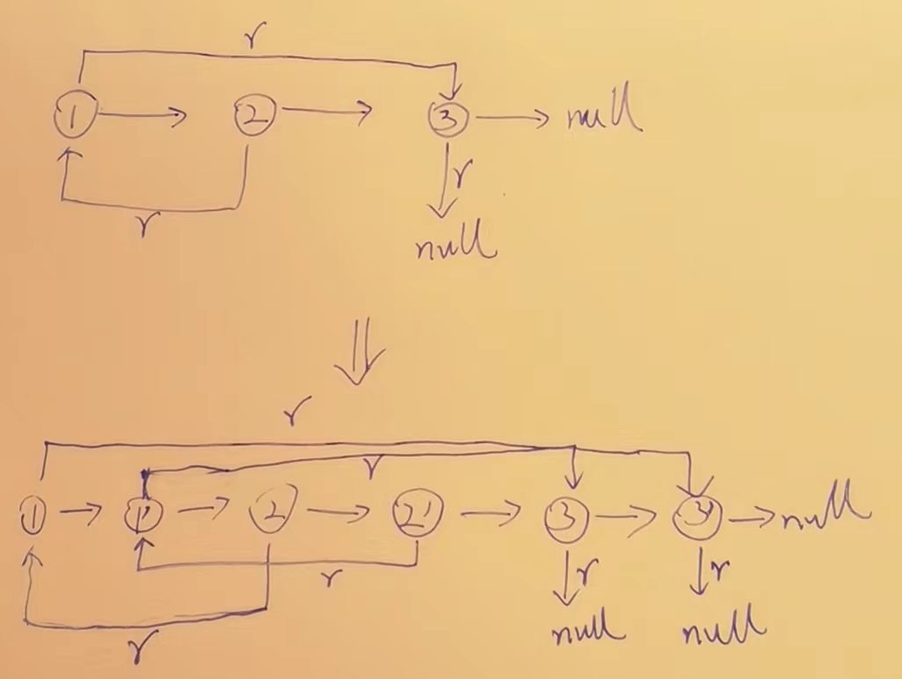

# 10-排序总结,链表相关题目

### 1.排序算法总结

|                                                          | 时间复杂度 | 额外空间复杂度 | 稳定性 |
| -------------------------------------------------------- | ---------- | -------------- | ------ |
| 选择排序                                                 | O(N^2)     | O(1)           | 无     |
| 冒泡排序                                                 | O(N^2)     | O(1)           | 有     |
| 插入排序                                                 | O(N^2)     | O(1)           | 有     |
| 归并排序                                                 | O(N*logN)  | O(N)           | 有     |
| 随机快排                                                 | O(N*logN)  | O(logN)        | 无     |
| 堆排序                                                   | O(N*logN)  | O(1)           | 无     |
| ======================================================== |            |                |        |
| 计数排序                                                 | O(N)       | O(M)           | 有     |
| 基数排序                                                 | O(N)       | O(N)           | 有     |

1）不基于比较的排序，对样本数据有严格要求，不易改写   
2）基于比较的排序，只要规定好两个样本怎么比大小就可以直接复用  
3）基于比较的排序，时间复杂度的极限是`O(N*logN)  `  
==4）时间复杂度`O(N*logN)`、额外空间复杂度低于`O(N)`、且稳定的基于比较的排序是不存在的。  
5）为了绝对的速度选快排、为了省空间选堆排、为了稳定性选归并==   

|            | 归并(稳)   | 随机快排(快) | 堆排(省)   |
| ---------- | ---------- | ------------ | ---------- |
| 时间复杂度 | O(N*logN)  | O(N*logN)    | O(N*logN)  |
| 额外       | O(N)       | O(logN)      | O(1)       |
| 稳定性     | √          | ×            | ×          |
|            | 追求稳定性 | 追求绝对的快 | 追求省空间 |

### 2.常见的坑

1）归并排序的额外空间复杂度可以变成O(1)，“归并排序 内部缓存法”，==但是将变得不再稳定。==   

2）“原地归并排序" 是垃圾贴，会让时间复杂度变成O(N^2)   

3）快速排序稳定性改进，“01 stable sort”，但是会对样本数据要求更多。  

在整型数组中，请把奇数放在数组左边，偶数放在数组右边，要求所有奇数之间原始的相对次序不变，所有偶数之间原始相对次序不变。
时间复杂度做到O(N)，额外空间复杂度做到O(1)

这绝对是不可能的,有一篇01 stable sort 的论文,他对数据做了要求,才做到,但是你不需要掌握,如果说面试官问你,你就说你不知道,请讲给我听,我等这种答案等了10年了,贱人就得贱方法磨.快排,就是<=放左边,>放右边,这就是一个01,奇偶也是一个01,凭什么他能做到,

### 3.工程上对排序的改进

1)稳定性的考虑   
java 中, 有个Array.sort(),这个方法往底层追,会有一个反射,看看是不是基础类型的,如果是,那就直接随机快排,因为基础类型是不分的,不追求稳定性,这个绝对快,如不是基础类型,那就会选择归并给你做,他不知道你需要不需要稳定,但是他要保证你对,所以,他用的归并.

2)充分利用O(N*logN)和O(N^2)排序各自的优势

```java 
//插入排序 0(N^2) 常数项小
// 快排0(N*logN)常数项高
// N 很大的时候快排
public static void quickSort(int[] arr, int L, int R){
   if(L+60>R){
      //执行插入排序arr[L..R]
      return;
   }
   
   int[]p=partition(arr,L,R);
   quickSort(arr,L ,p[0]-1);
   quickSort(arr,p[0]+1,R);
}
public static int[] partition(int[] arr,int L,int R){
   //
}
```

### 4.面试时链表解题的方法论

1)对于笔试，不用太在乎空间复杂度，一切为了时间复杂度    

2)对于面试，时间复杂度依然放在第一位，但是一定要找到空间最省的方法  


### 5.链表面试题常用数据结构和技巧

1）使用容器(哈希表、数组等)  

2）快慢指针   

### 6.快慢指针-联系题

1）输入链表头节点，奇数长度返回中点，偶数长度返回上中点  

2）输入链表头节点，奇数长度返回中点，偶数长度返回下中点  

3）输入链表头节点，奇数长度返回中点前一个，偶数长度返回上中点前一个  

4）输入链表头节点，奇数长度返回中点前一个，偶数长度返回下中点前一个  

### 7.链表是否回文练习题

> 给定一个单链表的头节点head，请判断该链表是否为回文结构。 
>
> 1）哈希表方法特别简单（笔试用）
>
> 2）改原链表的方法就需要注意边界了（面试用）

1.笔试就直接压栈,然后弹出,一个个比,如果一毛一样,肯定回文

2.用6里面的快慢指针,先找到中间点,然后,给中点后面的都逆序,然后正着倒着比较.判断完了后,记得先将逆序的换回来方向,不然会将源数据污染.

### 8.链表划分左小中等右大新链表问题

> 将单向链表按某值划分成左边小、中间相等、右边大的形式
>
> 1）把链表放入数组里，在数组上做partition（笔试用）
>
> 2）分成小、中、大三部分，再把各个部分之间串起来（面试用）

1.笔试就直接放数组里,然后一个快排,然后穿起来完事.

2.面试那就6个变量,

小头  等头  大头

小尾  等尾  大尾

小于的a第一个来了,小头尾都指向他,第二个b来了,两个节点串起来a→b,小尾后指b,第三个c来了,三个节点串起来,小尾指c,全部节点遍历完了后,小头→小尾→等头→等尾→大头→大尾

==单个大头行不行???==

行,但是会变得不稳定,为什么?

我们只有一个大头,假如v==3,来的是567,

首先,大头指向5,然后5→6,

7来的时候,会变成5→7→6或者7→5→6.

数据会乱,逻辑也不如变量两个更好.

### 9.单链表但是带random指针拷贝问题.

> 一种特殊的单链表节点类描述如下 
> class Node { 
> int value; 
> Node next; 
> Node rand; 
> Node(int val) { value = val; } 
> } 
> rand指针是单链表节点结构中新增的指针，rand可能指向链表中的任意一个节点，也可能指向null。
> 给定一个由Node节点类型组成的无环单链表的头节点 head，请实现一个函数完成这个链表的复制，并返回复制的新链表的头节点。 
> 【要求】
> 时间复杂度O(N)，额外空间复杂度O(1) 

这个问题,拷贝我们遇到的困难是什么,我们复制出一个节点的时候,还没有random指针对应的节点,往下遍历时候,就丢了,所以,我们如果拷贝出来一个节点时候,我们的random能指到节点的拷贝节点就好了.==所以我们缺的是新老节点对应关系.==

1.如果是笔试,那就直接用容器,用个map,记录新老节点对应关系,一边拷贝一边放,

根据原链表遍历,get出来对应节点,原数组是什么,对应节点就设置到对应节点上.

2.如果是面试,那就要省掉了这个额外空间.我们怎么搞呢,怎么能知道当前节点和新节点的关系.



我们让每个节点克隆后,都直接挂在当前节点的next,然后再连起来,这样我们就知道了,我们要找的rand,也在rand的下一个位置.

也就是原链表的next.next位置的a 就是a.next.next.next 的a',原链表的rand.next b,我就要找a.rand.next.next.