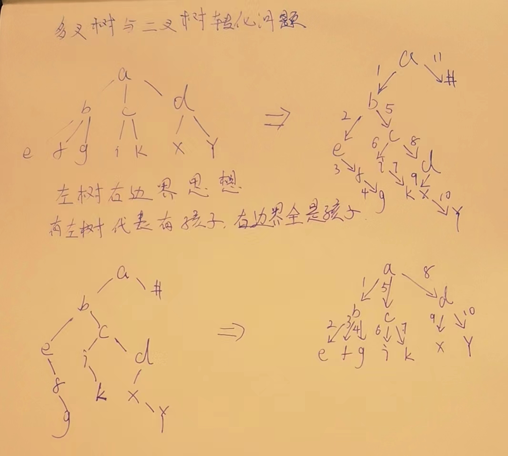
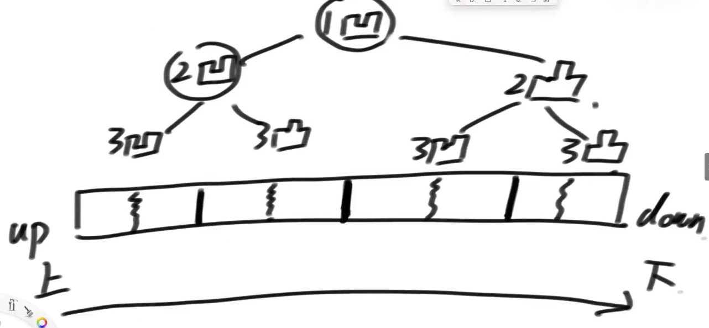

# 二叉树

## 二叉树的先序、中序、后序遍历

先序：任何子树的处理顺序都是，先头节点、再左子树、然后右子树

中序：任何子树的处理顺序都是，先左子树、再头节点、然后右子树

后序：任何子树的处理顺序都是，先左子树、再右子树、然后头节点

## 递归方式实现二叉树的先序、中序、后序遍历

1. 理解递归序

   每个节点都会经历3次,初次进来我,左返回我,右返回我,

   ```java
   // 先序-每一颗子树进来,都先打印头,再打印左,最后右,头→左→右
   public static void pre(Node head) {
      if (head == null) {
         return;
      }
      System.out.println(head.value);
      pre(head.left);
      pre(head.right);
   }
   // 中序-每一颗子树进来,都先打印左,再打印头,最后右,左→头→右
   public static void in(Node head) {
      if (head == null) {
         return;
      }
      in(head.left);
      System.out.println(head.value);
      in(head.right);
   }
   // 后序-每一颗子树进来,都先打印左,再打印右,最后头,左→右→头
   public static void pos(Node head) {
      if (head == null) {
         return;
      }
      pos(head.left);
      pos(head.right);
      System.out.println(head.value);
   }
   ```

2. 先序、中序、后序都可以在递归序的基础上加工出来

   ```java
   public static void f(Node head) {
      if (head == null) {
         return;
      }
      // 1在这就是先序
      f(head.left);
      // 2在这就是中序
      f(head.right);
      // 3在这就是后序
   }
   ```

​	第一次到达一个节点就打印就是先序、第二次打印即中序、第三次即后序

## 二叉树递归套路

### 一,重要的思想提醒

> #### 不管什么情况,我就想以X为头的时候,目标怎么实现.
>
> #### 实现X目标的手段,就是向左右孩子要东西,列可能性(跟X有关时候,跟X无关时候)是最重要的.
>
> 不是漫无目的的要信息,而是要简单信息,也就是常数时间可得的数据.

### 二,高度模板化

> info是模板的
>
> process是模板的
>
> 返回值是模板的,为空时候,好设置就设置,不好设置就返回null是模板的.
>
> 默认先得到左树信息,再得到右树信息是模板的.


1）假设以X节点为头，假设可以向X左树和X右树要任何信息  
2）在上一步的假设下，讨论以X为头节点的树，得到答案的可能性（最重要）  
3）列出所有可能性后，确定到底需要向左树和右树要什么样的信息  
4）把左树信息和右树信息求全集，就是任何一棵子树都需要返回的信息S  
5）递归函数都返回S，每一棵子树都这么要求  
6）写代码，在代码中考虑如何把左树的信息和右树信息整合出整棵树的信息  

## X 祖先节点   交集 证明题

> 我知道一个树中,X存在于某处,
>
> 我知道他的先序遍历,X的位置,
>
> 我知道他的后续遍历,X的位置,
>
> 请证明先序X的左边所有∩后续X的右边所有,一定是X的祖先节点

1. 先证明X的所有祖先,一定已经存在于这个交集里.

   先序遍历,符合头左右,不管我是作为左还是右,一定先经过头节点.所以我的祖先节点,一定在我左边.

   后序遍历,符合左右头,不管我是作为左还是右,一定先经过我,然后才是头节点.所以我的祖先节点,一定在我右边.

   所以,这个交集中,我的祖先节点一定有,而且齐全

2. 证明为什么只有祖先节点.X的孩子节点,有没有可能出现在这个交集中.

   先序遍历先遍历头,再遍历左右,所以X的子节点,在他右侧,所以不会有.

3. 两类.X作为左树姿态的右兄弟们.X作为右树姿态下的左兄弟们.

   先序遍历头左右,右兄弟一定出现在右侧,所以左侧中不包含右兄弟,交集中也就不可能存在左树姿态的右兄弟.

   后续遍历左右头,如果X作为右姿态出现,左兄弟一定出现在左边,不会出现在右边,所以,不会出现在交集中.

   至此,所有情况分析完毕,交集中,只可能祖先节点出现在A∩B.

​		

## 非递归方式实现二叉树的先序、中序、后序遍历

### 先序

先序就是头左右,也就是遍历任何一个节点时候,我们先看头节点(直接打印)有没有左,有就先打印左,然后右.

准备一个栈,将头节点,压栈,然后弹出,弹出时,先右后左压栈.做完了然后弹出,弹出一个节点,他就是头,然后重复之前的操作,右压栈,左压栈,然后弹出,直到所有节点完成.

```java
public static void pre(Node head) {
   System.out.print("pre-order: ");
   if (head != null) {
      Stack<Node> stack = new Stack<Node>();
      stack.add(head);
      while (!stack.isEmpty()) {
         //弹出的时候,直接先打印自己,然后先右后左压栈,然后弹出.重复操作.
         head = stack.pop();
         System.out.print(head.value + " ");
         if (head.right != null) {
            stack.push(head.right);
         }
         if (head.left != null) {
            stack.push(head.left);
         }
      }
   }
   System.out.println();
}
```

### 后序

后序就是左头右,

先序我们是头左右,那我们能不能搞个头右左呢?先压左,再压右,弹出时候就是了.倒着看,是不是就是左右头了呢?

所以我们搞2个栈,一个就是搞头左右,第二个我们把弹出的压到另一个里,让他逆序.

```java
//双栈,简单方法
public static void pos1(Node head) {
   System.out.print("pos-order: ");
   if (head != null) {
      Stack<Node> s1 = new Stack<Node>();
      Stack<Node> s2 = new Stack<Node>();
      s1.push(head);
      while (!s1.isEmpty()) {
         head = s1.pop(); // 头 右 左
         s2.push(head);
         if (head.left != null) {
            s1.push(head.left);
         }
         if (head.right != null) {
            s1.push(head.right);
         }
      }
      // 左 右 头
      while (!s2.isEmpty()) {
         System.out.print(s2.pop().value + " ");
      }
   }
   System.out.println();
}

// 单栈,复杂方法,很难,
public static void pos2(Node h) {
		System.out.print("pos-order: ");
		if (h != null) {
			Stack<Node> stack = new Stack<Node>();
			stack.push(h);
			Node c = null;
			while (!stack.isEmpty()) {
				c = stack.peek();
				if (c.left != null && h != c.left && h != c.right) {
					stack.push(c.left);
				} else if (c.right != null && h != c.right) {
					stack.push(c.right);
				} else {
					System.out.print(stack.pop().value + " ");
					h = c;
				}
			}
		}
		System.out.println();
	}
```

### 中序

1. 当前节点cur,整条左边界进栈,直到遇空,转步骤2
2. 栈中元素弹出,打印,节点右孩子转为cur,转1,
3. 栈空停止.

```java
public static void in(Node cur) {
   System.out.print("in-order: ");
   if (cur != null) {
      Stack<Node> stack = new Stack<Node>();
      while (!stack.isEmpty() || cur != null) {
         if (cur != null) {
            stack.push(cur);
            cur = cur.left;
         } else {
            cur = stack.pop();
            System.out.print(cur.value + " ");
            cur = cur.right;
         }
      }
   }
   System.out.println();
}
```

## 二叉树按层遍历

### 核心:队列.

1. 头进
2. 头出,弹出就打印,有左加左,有右加右.
3. 一个个出队列,出的时候,执行步骤2.

```java
public static void level(Node head) {
   if (head == null) {
      return;
   }
   Queue<Node> queue = new LinkedList<>();
   queue.add(head);
   while (!queue.isEmpty()) {
      Node cur = queue.poll();
      System.out.println(cur.value);
      if (cur.left != null) {
         queue.add(cur.left);
      }
      if (cur.right != null) {
         queue.add(cur.right);
      }
   }
}
```

## 二叉树的序列化和反序列化.非常高频

就是内存里的东西持久化和加载到内存里,就叫序列化和反序列化.

重要的就是null值要找东西替代,否则分不清.

## 多叉树和二叉树的转换

> 一颗多叉树,如果转换为二叉树,并且可以由这个二叉树转换回来.
>
> ```
> 乐扣原题 付费题:https://leetcode.com/problems/encode-n-ary-tree-to-binary-tree
> ```



```java
// 提交时不要提交这个类
public static class Node {
   public int val;
   public List<Node> children;

   public Node() {
   }

   public Node(int _val) {
      val = _val;
   }

   public Node(int _val, List<Node> _children) {
      val = _val;
      children = _children;
   }
};

// 提交时不要提交这个类
public static class TreeNode {
   int val;
   TreeNode left;
   TreeNode right;

   TreeNode(int x) {
      val = x;
   }
}

// 只提交这个类即可
class Codec {
   // Encodes an n-ary tree to a binary tree.
   public TreeNode encode(Node root) {
      if (root == null) {
         return null;
      }
      TreeNode head = new TreeNode(root.val);
      head.left = en(root.children);
      return head;
   }

   private TreeNode en(List<Node> children) {
      TreeNode head = null;
      TreeNode cur = null;
      for (Node child : children) {
         TreeNode tNode = new TreeNode(child.val);
         if (head == null) {
            head = tNode;
         } else {
            cur.right = tNode;
         }
         cur = tNode;
         cur.left = en(child.children);
      }
      return head;
   }

   // Decodes your binary tree to an n-ary tree.
   public Node decode(TreeNode root) {
      if (root == null) {
         return null;
      }
      return new Node(root.val, de(root.left));
   }

   public List<Node> de(TreeNode root) {
      List<Node> children = new ArrayList<>();
      while (root != null) {
         Node cur = new Node(root.val, de(root.left));
         children.add(cur);
         root = root.right;
      }
      return children;
   }

}
```

## 按层遍历-非常高频

## 求二叉树最宽的层有多少节点

不一定越下面的越多.

我们可以按层遍历了,那我们是不是直到一层什么时候结束了,就知道这层有多少个了.  

要想知道我这层什么时候结束,得上一层告诉我,我这层最右面的,一定是上一层的能最右的最右,不能最右的左孩子.也就是上一行最后一个节点滚的时候,我新一行开始遍历.

cur

curEnd

nextEnd

maxCount

第一行,根节点就是end了,cur = 根节点,curEnd = 根节点,nextEnd有左更新左,有右更新为右.遍历过程中,统计maxCount

当cur = curEnd时候,我们就直到当前行遍历完了,开始下一行,curEnd = nextEnd,cur=null,nextEnd=null,maxCount = 0.

```java 
public static int maxWidthNoMap(Node head) {
   if (head == null) {
      return 0;
   }
   Queue<Node> queue = new LinkedList<>();
   queue.add(head);
   Node curEnd = head; // 当前层，最右节点是谁
   Node nextEnd = null; // 下一层，最右节点是谁
   int max = 0;
   int curLevelNodes = 0; // 当前层的节点数
   while (!queue.isEmpty()) {
      Node cur = queue.poll();
      if (cur.left != null) {
         queue.add(cur.left);
         nextEnd = cur.left;
      }
      if (cur.right != null) {
         queue.add(cur.right);
         nextEnd = cur.right;
      }
      curLevelNodes++;
      if (cur == curEnd) {
         max = Math.max(max, curLevelNodes);
         curLevelNodes = 0;
         curEnd = nextEnd;
      }
   }
   return max;
}
```

## 找后继节点问题

> 如果一个树节点,有三条指针,多了个指向父节点的指针.怎么快速找到后继节点.
>
> 后继节点就是,一个树按照中序遍历,他后面的第一个节点.

普通的方法,需要O(N),先中序遍历,然后找到x的后一个.

实际上可以做到O(k),k是x节点到后继节点的实际距离.

1.如果x有右树,那么后继节点就是右树的最左孩子.

2.如果x没有右树,往上看,只要他是父亲的右孩子,不断向上找,直到作为父亲的左孩子. 因为中序是头左右,x右树没有,说明他一直往上的头节点的右树打印完了,该回到头节点了,这个头,就是后继,如果没有头,就是没后继节点.	

```java
public static class Node {
   public int value;
   public Node left;
   public Node right;
   public Node parent;

   public Node(int data) {
      this.value = data;
   }
}

public static Node getSuccessorNode(Node node) {
   if (node == null) {
      return node;
   }
   if (node.right != null) {
      return getLeftMost(node.right);
   } else { // 无右子树
      Node parent = node.parent;
      while (parent != null && parent.right == node) { // 当前节点是其父亲节点右孩子
         node = parent;
         parent = node.parent;
      }
      return parent;
   }
}

public static Node getLeftMost(Node node) {
   if (node == null) {
      return node;
   }
   while (node.left != null) {
      node = node.left;
   }
   return node;
}
```

## 二叉树折纸问题

> 请把一段纸条竖着放在桌子上，然后从纸条的下边向上方对折1次，压出折痕后展开。此时折痕是凹下去的，即折痕突起的方向指向纸条的背面。 如果从纸条的下边向上方连续对折2次，压出折痕后展开，此时有三条折痕，从上到下依次是下折痕、下折痕和上折痕。 
> 给定一个输入参数N，代表纸条都从下边向上方连续对折N次。 请从上到下打印所有折痕的方向。 
> 例如:N=1时，打印: down N=2时，打印: down down up 

实际操作折一下这个纸,发现这是一颗有明确规则的二叉树

1. 头次折痕,凹.
2. 左子树的头节点,都是凹
3. 右子树的头节点,都是凸



```java
public static void printAllFolds(int N) {
   process(1, N, true);
   System.out.println();
}

// 当前你来了一个节点，脑海中想象的！
// 这个节点在第i层，一共有N层，N固定不变的
// 这个节点如果是凹的话，down = T
// 这个节点如果是凸的话，down = F
// 函数的功能：中序打印以你想象的节点为头的整棵树！
//例如N=3,打印 凹凹凸凹凹凸凸
public static void process(int i, int N, boolean down) {
   if (i > N) {
      return;
   }
   process(i + 1, N, true);
   System.out.print(down ? "凹 " : "凸 ");
   process(i + 1, N, false);
}
```

## 判断是否完全二叉树

> 完全二叉树定义:要么是满的,要么是最后一行不满,即使不满,也是从左往右变满的过程.

### 普通方法遍历解法

就是一个二叉树的按层遍历,其中遵循一些规则,如果不遵循规则了,则不是.

1. 有右没有左.肯定不是了
2. 第一次遇到2个孩子不满的情况.剩下遍历节点必须是叶子节点

```java
public static boolean isCBT1(Node head) {
   if (head == null) {
      return true;
   }
   LinkedList<Node> queue = new LinkedList<>();
   // 是否遇到过左右两个孩子不双全的节点
   boolean leaf = false;
   Node l = null;
   Node r = null;
   queue.add(head);
   while (!queue.isEmpty()) {
      head = queue.poll();
      l = head.left;
      r = head.right;
      if (
      // 如果遇到了不双全的节点之后，又发现当前节点不是叶节点
          (leaf && (l != null || r != null)) 
          || 
               //有右无左
          (l == null && r != null)

      ) {
         return false;
      }
      //这些就是二叉树按层遍历需要的,没什么好说的
      if (l != null) {
         queue.add(l);
      }
      if (r != null) {
         queue.add(r);
      }
      if (l == null || r == null) {
         leaf = true;
      }
   }
   return true;
}
```

### 二叉树递归套路解法

列可能性:

如果X为头,只要满足这4个条件,那么任何一个子树,就是完全二叉树.包括树整体.

1. 左树满,右树满,且高度一样,那肯定是完全二叉树
2. 左树是完全,右树是满的,左树高度比右树高度高1
3. 左树是满的,右树也是满的,左树高度比右树高1
4. 左树是满的,右树是完全,且左右高度一样.

所以,我们的info需要,是不是满的isFull,是不是完全isCBT,高度height

```java
public static boolean isCBT2(Node head) {
   if (head == null) {
      return true;
   }
   return process(head).isCBT;
}

// 对每一棵子树，是否是满二叉树、是否是完全二叉树、高度
public static class Info {
   public boolean isFull;
   public boolean isCBT;
   public int height;

   public Info(boolean full, boolean cbt, int h) {
      isFull = full;
      isCBT = cbt;
      height = h;
   }
}

public static Info process(Node X) {
   //为空好设置的,是满的,是完全,高度0
   if (X == null) {
      return new Info(true, true, 0);
   }
   Info leftInfo = process(X.left);
   Info rightInfo = process(X.right);
   //高度就是左右高度+自己
   int height = Math.max(leftInfo.height, rightInfo.height) + 1;
   //判断是否是满的
   boolean isFull = leftInfo.isFull 
         && 
         rightInfo.isFull 
         && leftInfo.height == rightInfo.height;
   //判断是否是完全
   boolean isCBT = false;
   if (isFull) {
      isCBT = true;
   } else { // 以x为头整棵树，不满
      if (leftInfo.isCBT && rightInfo.isCBT) {
         if (leftInfo.isCBT 
               && rightInfo.isFull 
               && leftInfo.height == rightInfo.height + 1) {
            isCBT = true;
         }
         if (leftInfo.isFull 
               && 
               rightInfo.isFull 
               && leftInfo.height == rightInfo.height + 1) {
            isCBT = true;
         }
         if (leftInfo.isFull 
               && rightInfo.isCBT && leftInfo.height == rightInfo.height) {
            isCBT = true;
         }
      }
   }
   return new Info(isFull, isCBT, height);
}
```

## 判断是否为平衡二叉树

> 每一颗子树,左右孩子高度差不超过1. 注意是每一颗子树. 

怎么就说他是了呢,列可能性,x节点作为头的情况下

1. 左树是平衡二叉树
2. 右树是平衡二叉树
3. |x左高度-x右高度|<2

如果x从左右,都能要回信息,判断下即可.

```java
public static boolean isBalanced2(Node head) {
   return process(head).isBalanced;
}

public static class Info{
   public boolean isBalanced;
   public int height;
   
   public Info(boolean i, int h) {
      isBalanced = i;
      height = h;
   }
}

public static Info process(Node x) {
   if(x == null) {
      return new Info(true, 0);
   }
  //获取左右树信息,
   Info leftInfo = process(x.left);
   Info rightInfo = process(x.right);
  //如果违反了,把标志改为false
   int height = Math.max(leftInfo.height, rightInfo.height)  + 1;
   boolean isBalanced = true;
   if(!leftInfo.isBalanced) {
      isBalanced = false;
   }
   if(!rightInfo.isBalanced) {
      isBalanced = false;
   }
   if(Math.abs(leftInfo.height - rightInfo.height) > 1) {
      isBalanced = false;
   }
   return new Info(isBalanced, height);
}
```

## 判断是否为搜索二叉树

> 对于任何一个头节点,每一颗子树,左孩子都比我小,右孩子都比我大.

```java
public static boolean isBST2(Node head) {
   if (head == null) {
      return true;
   }
   return process(head).isBST;
}

public static class Info {
   public boolean isBST;
   public int max;
   public int min;

   public Info(boolean i, int ma, int mi) {
      isBST = i;
      max = ma;
      min = mi;
   }

}

public static Info process(Node x) {
   if (x == null) {
      return null;
   }
   //获取左右孩子信息
   Info leftInfo = process(x.left);
   Info rightInfo = process(x.right);
   //收集最大最小值,全都要,所有节点一视同仁.
   int max = x.value;
   if (leftInfo != null) {
      max = Math.max(max, leftInfo.max);
   }
   if (rightInfo != null) {
      max = Math.max(max, rightInfo.max);
   }
   int min = x.value;
   if (leftInfo != null) {
      min = Math.min(min, leftInfo.min);
   }
   if (rightInfo != null) {
      min = Math.min(min, rightInfo.min);
   }
   /**
    * 出现下列情况,判断不成立
    * 1.左或者右不是了,那整棵树都不是了.
    * 2.左侧的不为空&&左侧最大值不比我小
    * 3.右侧的不为空&&右侧的最小值不比我大
    */
   boolean isBST = true;
   if (leftInfo != null && !leftInfo.isBST) {
      isBST = false;
   }
   if (rightInfo != null && !rightInfo.isBST) {
      isBST = false;
   }
   if (leftInfo != null && leftInfo.max >= x.value) {
      isBST = false;
   }
   if (rightInfo != null && rightInfo.min <= x.value) {
      isBST = false;
   }
   return new Info(isBST, max, min);
}
```

## 返回整棵二叉树最大距离问题

> 给定一棵二叉树的头节点head，任何两个节点之间都存在距离，
> 返回整棵二叉树的最大距离

用二叉树的递归套路做

列可能性

1. 答案与我X无关

   那答案肯定是我的某个子树或者某个右树中最大,不经过我

2. 答案与我X有关

   那就我我的左树高度,经过我(+1),然后到我右树的高度.

```java
public static int maxDistance2(Node head) {
		return process(head).maxDistance;
	}

	public static class Info {
		//如果最大距离不经过我这个头节点,那可能是这个左树或右树的最大距离
		public int maxDistance;
		//如果经过我这个头节点,那就是左树高度+右树高度+我的高度(+1)
		public int height;

		public Info(int m, int h) {
			maxDistance = m;
			height = h;
		}

	}

	public static Info process(Node x) {
		//x为空,好不好设置?
		//好设置,就是没有嘛,最大距离是0,高度也是0.
		if (x == null) {
			return new Info(0, 0);
		}
		//后序遍历,收集左,收集右
		Info leftInfo = process(x.left);
		Info rightInfo = process(x.right);
		//我需要两个信息,一个不经过我时候,就是左右孩子的某个最大的距离 max(leftMaxDis,rightMaxDis)
		//一个是经过我时,那我需要左右孩子的层高,再加我.
		//我判断哪个更大,返回哪个.
		int height = Math.max(leftInfo.height, rightInfo.height) + 1;
		int p1 = leftInfo.maxDistance;
		int p2 = rightInfo.maxDistance;
		int p3 = leftInfo.height + rightInfo.height + 1;
		int maxDistance = Math.max(Math.max(p1, p2), p3);
		return new Info(maxDistance, height);
	}
```

## 判断二叉树是不是满二叉树

> 就是如果高度是h,那二叉树共有2^h-1个节点.

1. 方法一:那我就问问我的左右子树,要一个高度和节点个数,如果最后等于2^h-1个节点,那就是,否则就不是满二叉树

   ```java
   // 第一种方法
   // 收集整棵树的高度h，和节点数n
   // 只有满二叉树满足 : 2 ^ h - 1 == n
   public static boolean isFull1(Node head) {
      if (head == null) {
         return true;
      }
      Info1 all = process1(head);
      return (1 << all.height) - 1 == all.nodes;
   }
   
   public static class Info1 {
      public int height;
      public int nodes;
   
      public Info1(int h, int n) {
         height = h;
         nodes = n;
      }
   }
   
   public static Info1 process1(Node head) {
      if (head == null) {
         return new Info1(0, 0);
      }
      Info1 leftInfo = process1(head.left);
      Info1 rightInfo = process1(head.right);
      int height = Math.max(leftInfo.height, rightInfo.height) + 1;
      int nodes = leftInfo.nodes + rightInfo.nodes + 1;
      return new Info1(height, nodes);
   }
   
   ```

2. 方法二,那我就问问我的左右子树,如果都是满的,并且高度一样,那就是,否则整体就不是满二叉树

   ```java
   
   // 第二种方法
   // 收集子树是否是满二叉树
   // 收集子树的高度
   // 左树满 && 右树满 && 左右树高度一样 -> 整棵树是满的
   public static boolean isFull2(Node head) {
      if (head == null) {
         return true;
      }
      return process2(head).isFull;
   }
   
   public static class Info2 {
      public boolean isFull;
      public int height;
   
      public Info2(boolean f, int h) {
         isFull = f;
         height = h;
      }
   }
   
   public static Info2 process2(Node h) {
      if (h == null) {
         return new Info2(true, 0);
      }
      Info2 leftInfo = process2(h.left);
      Info2 rightInfo = process2(h.right);
      boolean isFull = leftInfo.isFull && rightInfo.isFull && leftInfo.height == rightInfo.height;
      int height = Math.max(leftInfo.height, rightInfo.height) + 1;
      return new Info2(isFull, height);
   }
   
   ```

## 返回最大的二叉搜索子树

[https://leetcode.com/problems/largest-bst-subtree](https://leetcode.com/problems/largest-bst-subtree)

> 给定一棵二叉树的头节点head，
> 返回这颗二叉树中最大的二叉搜索子树的大小

二叉树递归套路

跟我的左右子树要信息,

{

&emsp;&emsp;我的左右树最大二叉搜索子树的节点数量 maxBSTSubTreeSize.

&emsp;&emsp;左右树所有的节点数量 allSize

&emsp;&emsp;最大值 max

&emsp;&emsp;最小值 min

&emsp;&emsp;还可以通过 maxBSTSubTreeSize == allSize 判断是否整棵树是儿叉搜索子树.

}

列可能性

1. 经过我X这个头节点,共同组成大的二叉搜索子树

   1. 左树得是二叉搜索子树
   2. 右树得是二叉搜索子树
   3. 左树最大值比我小 && 右树最小值比我大.

   那就是左侧所有的节点+右侧所有的节点+我自己(+1)

2. 不经过X这个头节点,左树或者右树中,有个最大儿叉搜索子树

   比比左右哪个子树的更大,

3. 1,2,取一个最大值返回即可.

需要考虑的点,如果X为空,最大最小值不好设置值啊.不好设置,所以返回null,用的时候再判断.

```java
// 提交如下的largestBSTSubtree方法，可以直接通过
public static int largestBSTSubtree(TreeNode head) {
   if (head == null) {
      return 0;
   }
   return process(head).maxBSTSubtreeSize;
}

public static class Info {
   public int maxBSTSubtreeSize;
   public int allSize;
   public int max;
   public int min;

   public Info(int m, int a, int ma, int mi) {
      maxBSTSubtreeSize = m;
      allSize = a;
      max = ma;
      min = mi;
   }
}

public static Info process(TreeNode x) {
   if (x == null) {
      return null;
   }
   Info leftInfo = process(x.left);
   Info rightInfo = process(x.right);
  //只有一个节点时候,我就认为他是一个二叉搜索子树,
   int max = x.val;
   int min = x.val;
   int allSize = 1;
  //有左跟左比,
   if (leftInfo != null) {
      max = Math.max(leftInfo.max, max);
      min = Math.min(leftInfo.min, min);
      allSize += leftInfo.allSize;
   }
  //有右跟右比,
   if (rightInfo != null) {
      max = Math.max(rightInfo.max, max);
      min = Math.min(rightInfo.min, min);
      allSize += rightInfo.allSize;
   }
  //不经过X的两种可能性
   int p1 = -1;
   if (leftInfo != null) {
      p1 = leftInfo.maxBSTSubtreeSize;
   }
   int p2 = -1;
   if (rightInfo != null) {
      p2 = rightInfo.maxBSTSubtreeSize;
   }
  //经过X的可能性.
   int p3 = -1;
   boolean leftBST = leftInfo == null ? true : (leftInfo.maxBSTSubtreeSize == leftInfo.allSize);
   boolean rightBST = rightInfo == null ? true : (rightInfo.maxBSTSubtreeSize == rightInfo.allSize);
  //左右都是
   if (leftBST && rightBST) {
     //最大最小值条件符合.
      boolean leftMaxLessX = leftInfo == null ? true : (leftInfo.max < x.val);
      boolean rightMinMoreX = rightInfo == null ? true : (x.val < rightInfo.min);
     //收集节点数量.
      if (leftMaxLessX && rightMinMoreX) {
         int leftSize = leftInfo == null ? 0 : leftInfo.allSize;
         int rightSize = rightInfo == null ? 0 : rightInfo.allSize;
         p3 = leftSize + rightSize + 1;
      }
   }
   return new Info(Math.max(p1, Math.max(p2, p3)), allSize, max, min);
}
```


## 二叉树最先公共祖先问题

> 给定一棵二叉树的头节点head，和另外两个节点a和b。
> 返回a和b的最低公共祖先 

与X无关(X不是ab的汇集点){

&emsp;&emsp;左侧已经有答案了

&emsp;&emsp;右侧已经有答案了

&emsp;&emsp;a,b没找到,不全

}

与X有关(X本身就是答案){

&emsp;&emsp;左侧有1个,右侧有一个.

&emsp;&emsp;x本身就是ab中的一个.

}

总结需要跟孩子要的信息,是否有a,是否有b,答案(只有已经有ab的情况下才不是null)

```java
public static Node lowestAncestor2(Node head, Node a, Node b) {
   return process(head, a, b).ans;
}

public static class Info {
   public boolean findA;
   public boolean findB;
   public Node ans;

   public Info(boolean fA, boolean fB, Node an) {
      findA = fA;
      findB = fB;
      ans = an;
   }
}

public static Info process(Node x, Node a, Node b) {
  //为空好设置的那种
   if (x == null) {
      return new Info(false, false, null);
   }
   Info leftInfo = process(x.left, a, b);
   Info rightInfo = process(x.right, a, b);
   boolean findA = (x == a) || leftInfo.findA || rightInfo.findA;
   boolean findB = (x == b) || leftInfo.findB || rightInfo.findB;
   Node ans = null;
  //左侧有答案了,那就是左侧的答案,左侧的答案肯定更靠近最低公共祖先
   if (leftInfo.ans != null) {
      ans = leftInfo.ans;
      //右侧有答案了,那就是右侧的答案,右侧的答案肯定更靠近最低公共祖先,左右绝对不可能同时有答案.
   } else if (rightInfo.ans != null) {
      ans = rightInfo.ans;
     //否则,左边或者右边一边发现一个或者X就是其中一个,那我X就是最低公共祖先.不可能一边发现两个,否则会走上面2个分支.
   } else if (findA && findB) {
         ans = x;
   }
   
   return new Info(findA, findB, ans);
}
```

## 排队最大快乐值问题

> 派对的最大快乐值
>  公司的每个员工都符合 Employee 类的描述。整个公司的人员结构可以看作是一棵标准的、 没有环的多叉树。树的头节点是公司唯一的老板。除老板之外的每个员工都有唯一的直接上级。 叶节点是没有任何下属的基层员工(subordinates列表为空)，除基层员工外，每个员工都有一个或多个直接下级。

如果一个节点来了,他的直接父子节点一定不能来

如果一个节点不来,他的直接父子节点可以来,也可以不来.

```java
public static int maxHappy2(Employee head) {
   Info allInfo = process(head);
   return Math.max(allInfo.no, allInfo.yes);
}

public static class Info {
   //当前节点不来的情况,最大值多少
   public int no;
   //当前节点来的情况,最大值多少
   public int yes;

   public Info(int n, int y) {
      no = n;
      yes = y;
   }
}

public static Info process(Employee x) {
   if (x == null) {
      return new Info(0, 0);
   }
   int no = 0;
   int yes = x.happy;
   for (Employee next : x.nexts) {
      Info nextInfo = process(next);
      //每个子级分别收集结果
      //当我X不来时候,每个子级都可以来或者不来,取个最大值.
      no += Math.max(nextInfo.no, nextInfo.yes);
      //当我X来的时候,每个子级一定不能来.
      yes += nextInfo.no;

   }
   return new Info(no, yes);
}
```