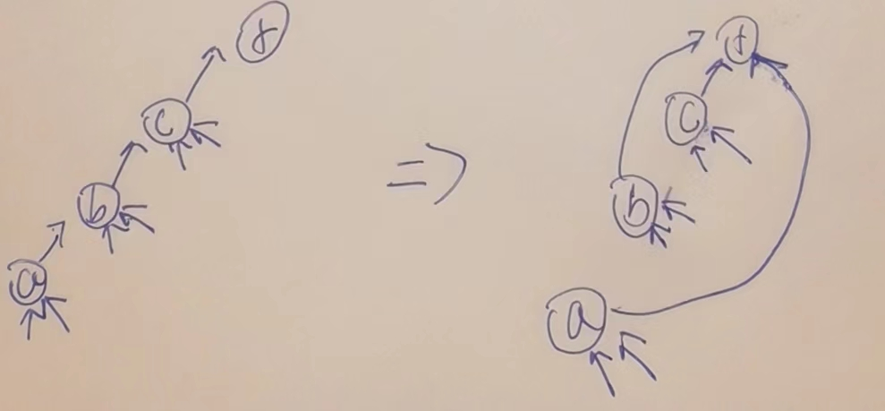

# 并查集-查连通区域神器

### 又是被火车忘了都不能忘的东西

1）每个节点都有一条往上指的指针  
2）节点a往上找到的头节点，叫做a所在集合的代表节点  
3）查询x和y是否属于同一个集合，就是看看找到的代表节点是不是一个  
4）把x和y各自所在集合的所有点合并成一个集合，只需要小集合的代表点挂在大集合的代表点的下方即可  

### 1.两个核心方法

1. boolean isSameSet(a,e) a,e是否属于同一个集合.
2. void union(a,e) ,a,e所在的两个集合合并成一个集合.

在调用很频繁,超过样本量的情况,均摊下来,时间复杂度,O(1)

### 2.方法流程示意

#### 两个优化点,

1. 小挂大(也是为了第二个优化点)

2. 重要优化!每个节点查找祖先后,==返回前==将沿途所有节点全部直接挂在祖先节点下.==用栈实现==,从哪开始找,只是沿途的链变扁平,那些小箭头,我们不管.目的就是减少链的长度,痛就痛一次.

   

### 3.证明

做不到,会用就行了,从1964年提出,1989年才证明出来.

只要到达样本量的规模,单次就是O(1)
