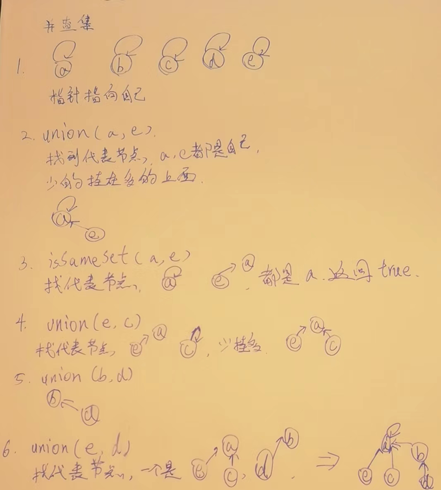
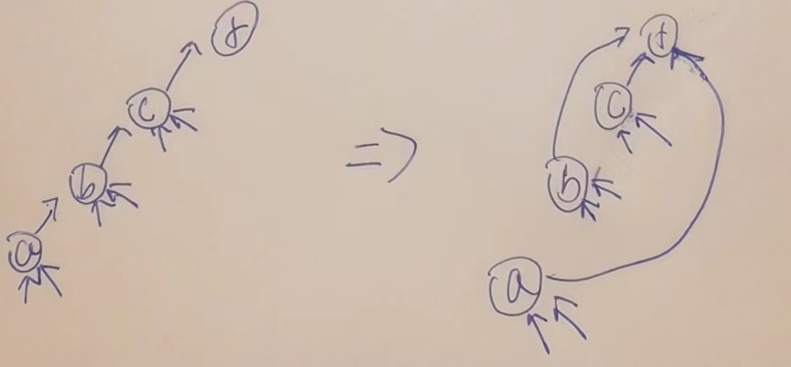

# 并查集-查连通区域神器

## 又是被火车撞了都不能忘的东西

1）每个节点都有一条往上指的指针  
2）节点a往上找到的头节点，叫做a所在集合的代表节点  
3）查询x和y是否属于同一个集合，就是看看找到的代表节点是不是一个  
4）把x和y各自所在集合的所有点合并成一个集合，只需要小集合的代表点挂在大集合的代表点的下方即可  

## 1.两个核心方法及核心属性

### 核心方法

1. boolean isSameSet(a,e) a,e是否属于同一个集合.
2. void union(a,e) ,a,e所在的两个集合合并成一个集合.

在调用很频繁,超过样本量的情况,均摊下来,时间复杂度,O(1)

### 核心属性

parent[] :记录当前节点的父亲是谁,用来查代表节点

size[]: size[i] = k,如果i是代表节点,size[i]才有意义,否则无意义,代表的是这个i所在的整个集合的大小是多少

help[] 或者 stack : 用来优化找代表节点,扁平化的过程.

int sets : 用来记录一共有多少个连通区域.

## 2.方法流程示意



### 两个优化点,

1. 小挂大(也是为了第二个优化点)

2. 重要优化!每个节点查找祖先后,==返回前==将沿途所有节点全部直接挂在祖先节点下.==用栈实现==,从哪开始找,只是沿途的链变扁平,那些小箭头,我们不管.目的就是减少链的长度,痛就痛一次.

   

## 3.证明-别想了

做不到,会用就行了,从1964年提出,1989年才证明出来.

记住了--只要到达样本量的规模,单次就是O(1)

## 4.题目-Leetcode 547 Friend Circles

> 有 `n` 个城市，其中一些彼此相连，另一些没有相连。如果城市 `a` 与城市 `b` 直接相连，且城市 `b` 与城市 `c` 直接相连，那么城市 `a` 与城市 `c` 间接相连。
>
> **省份** 是一组直接或间接相连的城市，组内不含其他没有相连的城市。
>
> 给你一个 `n x n` 的矩阵 `isConnected` ，其中 `isConnected[i][j] = 1` 表示第 `i` 个城市和第 `j` 个城市直接相连，而 `isConnected[i][j] = 0` 表示二者不直接相连。
>
> 返回矩阵中 **省份** 的数量。
>
> **提示：**
>
> - `1 <= n <= 200`
> - `n == isConnected.length`
> - `n == isConnected[i].length`
> - `isConnected[i][j]` 为 `1` 或 `0`
> - `isConnected[i][i] == 1`
> - `isConnected[i][j] == isConnected[j][i]`

> ```
> https://leetcode.com/problems/friend-circles/
> ```

```java
public static int findCircleNum(int[][] M) {
   int N = M.length;
   // {0} {1} {2} {N-1}
   UnionFind unionFind = new UnionFind(N);
   for (int i = 0; i < N; i++) {
      for (int j = i + 1; j < N; j++) {
         if (M[i][j] == 1) { // i和j互相认识
            unionFind.union(i, j);
         }
      }
   }
   return unionFind.sets();
}

public static class UnionFind {
   // parent[i] = k ： i的父亲是k
   private int[] parent;
   // size[i] = k ： 如果i是代表节点，size[i]才有意义，否则无意义
   // i所在的集合大小是多少
   private int[] size;
   // 辅助结构
   private int[] help;
   // 一共有多少个集合
   private int sets;

   public UnionFind(int N) {
      parent = new int[N];
      size = new int[N];
      help = new int[N];
      sets = N;
      for (int i = 0; i < N; i++) {
         parent[i] = i;
         size[i] = 1;
      }
   }

   // 从i开始一直往上，往上到不能再往上，代表节点，返回
   // 这个过程要做路径压缩
   private int find(int i) {
      int hi = 0;
      while (i != parent[i]) {
         help[hi++] = i;
         i = parent[i];
      }
      for (hi--; hi >= 0; hi--) {
         parent[help[hi]] = i;
      }
      return i;
   }

   public void union(int i, int j) {
      int f1 = find(i);
      int f2 = find(j);
      if (f1 != f2) {
         if (size[f1] >= size[f2]) {
            size[f1] += size[f2];
            parent[f2] = f1;
         } else {
            size[f2] += size[f1];
            parent[f1] = f2;
         }
         sets--;
      }
   }

   public int sets() {
      return sets;
   }
}
```

## 5.岛问题

> 给定一个二维数组matrix，里面的值不是1就是0，
> 上、下、左、右相邻的1认为是一片岛，
> 返回matrix中岛的数量

就是说一个矩阵,不是0就是1,上下左右相邻的1可以连起来,组成一块区域,问,有几个区域.

### 1.感染方法,

##### 代码实现

从左往右,从上往下开始遍历,遇到1就感染为2,将上下左右都给改为0,遇到0就跳过,每次遇到1,岛+1,最后返回岛的数量.

```java
public static int numIslands3(char[][] board) {
   int islands = 0;
  //从左往右
   for (int i = 0; i < board.length; i++) {
     //从上往下遍历
      for (int j = 0; j < board[0].length; j++) {
       	//遇到1就开始感染过程,否则就跳过,同时岛数量+1
         if (board[i][j] == '1') {
            islands++;
            infect(board, i, j);
         }
      }
   }
   return islands;
}

// 从(i,j)这个位置出发，把所有连成一片的'1'字符，变成0
public static void infect(char[][] board, int i, int j) {
   if (i < 0 || i == board.length || j < 0 || j == board[0].length || board[i][j] != '1') {
      return;
   }
   board[i][j] = 0;
   infect(board, i - 1, j);
   infect(board, i + 1, j);
   infect(board, i, j - 1);
   infect(board, i, j + 1);
}
```


### 2.并查集方法.

主方法,初始化每个节点,用dot内存地址代表不同的1,

从左往右,上往下,都是1就合并,

```java
public static int numIslands1(char[][] board) {
   int row = board.length;
   int col = board[0].length;
  //我用Dot的内存地址代表1,null代表0
   Dot[][] dots = new Dot[row][col];
   List<Dot> dotList = new ArrayList<>();
   for (int i = 0; i < row; i++) {
      for (int j = 0; j < col; j++) {
         if (board[i][j] == '1') {
            dots[i][j] = new Dot();
            dotList.add(dots[i][j]);
         }
      }
   }
   UnionFind1<Dot> uf = new UnionFind1<>(dotList);
  //下面为什么3个for循环,为了省去if,else的判断
  //第一个,只处理第一列,他没有左,只看上面
  //第二个,只处理第一行,他没有上,只看左边
  //第三个,从左往右,从上往下,看左边和上面,省去了判断有没有.
  //合并完了后,返回岛数量.
   for (int j = 1; j < col; j++) {
      // (0,j)  (0,0)跳过了  (0,1) (0,2) (0,3)
      if (board[0][j - 1] == '1' && board[0][j] == '1') {
         uf.union(dots[0][j - 1], dots[0][j]);
      }
   }
   for (int i = 1; i < row; i++) {
      if (board[i - 1][0] == '1' && board[i][0] == '1') {
         uf.union(dots[i - 1][0], dots[i][0]);
      }
   }
   for (int i = 1; i < row; i++) {
      for (int j = 1; j < col; j++) {
         if (board[i][j] == '1') {
            if (board[i][j - 1] == '1') {
               uf.union(dots[i][j - 1], dots[i][j]);
            }
            if (board[i - 1][j] == '1') {
               uf.union(dots[i - 1][j], dots[i][j]);
            }
         }
      }
   }
   return uf.sets();
}

//里面是空的无所有,我用null代表0,非null的地址表示1
public static class Dot {

}

public static class Node<V> {

   V value;

   public Node(V v) {
      value = v;
   }

}

//HashMap实现,已经是时间复杂度最优解,但是常数时间大
public static class UnionFind1<V> {
   public HashMap<V, Node<V>> nodes;
   public HashMap<Node<V>, Node<V>> parents;
   public HashMap<Node<V>, Integer> sizeMap;

   public UnionFind1(List<V> values) {
      nodes = new HashMap<>();
      parents = new HashMap<>();
      sizeMap = new HashMap<>();
      for (V cur : values) {
         Node<V> node = new Node<>(cur);
         nodes.put(cur, node);
         parents.put(node, node);
         sizeMap.put(node, 1);
      }
   }

  //优化过程,扁平化
   public Node<V> findFather(Node<V> cur) {
      Stack<Node<V>> path = new Stack<>();
      while (cur != parents.get(cur)) {
         path.push(cur);
         cur = parents.get(cur);
      }
      while (!path.isEmpty()) {
         parents.put(path.pop(), cur);
      }
      return cur;
   }

   public void union(V a, V b) {
      Node<V> aHead = findFather(nodes.get(a));
      Node<V> bHead = findFather(nodes.get(b));
      if (aHead != bHead) {
         int aSetSize = sizeMap.get(aHead);
         int bSetSize = sizeMap.get(bHead);
         Node<V> big = aSetSize >= bSetSize ? aHead : bHead;
         Node<V> small = big == aHead ? bHead : aHead;
         parents.put(small, big);
         sizeMap.put(big, aSetSize + bSetSize);
         sizeMap.remove(small);
      }
   }

   public int sets() {
      return sizeMap.size();
   }

}
```

### 3.并查集的优化

用数组来减少常数时间

```java
public static int numIslands2(char[][] board) {
   int row = board.length;
   int col = board[0].length;
   UnionFind2 uf = new UnionFind2(board);
   for (int j = 1; j < col; j++) {
      if (board[0][j - 1] == '1' && board[0][j] == '1') {
         uf.union(0, j - 1, 0, j);
      }
   }
   for (int i = 1; i < row; i++) {
      if (board[i - 1][0] == '1' && board[i][0] == '1') {
         uf.union(i - 1, 0, i, 0);
      }
   }
   for (int i = 1; i < row; i++) {
      for (int j = 1; j < col; j++) {
         if (board[i][j] == '1') {
            if (board[i][j - 1] == '1') {
               uf.union(i, j - 1, i, j);
            }
            if (board[i - 1][j] == '1') {
               uf.union(i - 1, j, i, j);
            }
         }
      }
   }
   return uf.sets();
}

public static class UnionFind2 {
   private int[] parent;
   private int[] size;
   private int[] help;
   private int col;
   private int sets;

   public UnionFind2(char[][] board) {
      col = board[0].length;
      sets = 0;
      int row = board.length;
      int len = row * col;
      parent = new int[len];
      size = new int[len];
      help = new int[len];
      for (int r = 0; r < row; r++) {
         for (int c = 0; c < col; c++) {
            if (board[r][c] == '1') {
               int i = index(r, c);
               parent[i] = i;
               size[i] = 1;
               sets++;
            }
         }
      }
   }

   // (r,c) -> i
   private int index(int r, int c) {
      return r * col + c;
   }

   // 原始位置 -> 下标
   private int find(int i) {
      int hi = 0;
      while (i != parent[i]) {
         help[hi++] = i;
         i = parent[i];
      }
      for (hi--; hi >= 0; hi--) {
         parent[help[hi]] = i;
      }
      return i;
   }

   public void union(int r1, int c1, int r2, int c2) {
      int i1 = index(r1, c1);
      int i2 = index(r2, c2);
      int f1 = find(i1);
      int f2 = find(i2);
      if (f1 != f2) {
         if (size[f1] >= size[f2]) {
            size[f1] += size[f2];
            parent[f2] = f1;
         } else {
            size[f2] += size[f1];
            parent[f1] = f2;
         }
         sets--;
      }
   }

   public int sets() {
      return sets;
   }

}
```


## 6.岛问题扩展 leetcode 305

> 一开始没有点为1,而是一个个空降来的,要求返回每次空降完1后的岛数量.

##### 代码

```java
public static List<Integer> numIslands21(int m, int n, int[][] positions) {
  //初始化并查集结构
   UnionFind1 uf = new UnionFind1(m, n);
  //答案集合,等收集并且返回用.
   List<Integer> ans = new ArrayList<>();
   for (int[] position : positions) {
      ans.add(uf.connect(position[0], position[1]));
   }
   return ans;
}

//同样的一维数组表示二维,为了快,
public static class UnionFind1 {
   private int[] parent;
   private int[] size;
   private int[] help;
   private final int row;
   private final int col;
   private int sets;

   public UnionFind1(int m, int n) {
      row = m;
      col = n;
      sets = 0;
      int len = row * col;
      parent = new int[len];
      size = new int[len];
      help = new int[len];
   }

  //计算二维中的位置在一维数组中的哪里
   private int index(int r, int c) {
      return r * col + c;
   }

  //查找代表节点,同样是有优化的,扁平化处理.
   private int find(int i) {
      int hi = 0;
      while (i != parent[i]) {
         help[hi++] = i;
         i = parent[i];
      }
      for (hi--; hi >= 0; hi--) {
         parent[help[hi]] = i;
      }
      return i;
   }

  //合并.不越界,都是1,不是一个代表节点,就可以合并,
   private void union(int r1, int c1, int r2, int c2) {
      if (r1 < 0 || r1 == row || r2 < 0 || r2 == row || c1 < 0 || c1 == col || c2 < 0 || c2 == col) {
         return;
      }
      int i1 = index(r1, c1);
      int i2 = index(r2, c2);
      if (size[i1] == 0 || size[i2] == 0) {
         return;
      }
      int f1 = find(i1);
      int f2 = find(i2);
      if (f1 != f2) {
         if (size[f1] >= size[f2]) {
            size[f1] += size[f2];
            parent[f2] = f1;
         } else {
            size[f2] += size[f1];
            parent[f1] = f2;
         }
         sets--;
      }
   }

  //之前没有将size还原,是为了判断是否空降过,初始化过.
   public int connect(int r, int c) {
      int index = index(r, c);
      if (size[index] == 0) {
         parent[index] = index;
         size[index] = 1;
         sets++;
         union(r - 1, c, r, c);
         union(r + 1, c, r, c);
         union(r, c - 1, r, c);
         union(r, c + 1, r, c);
      }
      return sets;
   }

}
```

##### 复杂度分析

初始化`O(m*n)`,k个点就是O(k),最慢的瓶颈还是那个`O(m*n)`

如果mn极大,而空降的位置k不大,

那我就不急着初始化表了,空降一个再去找上下左右去感染

##### 数据极大的情况下,优化方法

```java
public static List<Integer> numIslands22(int m, int n, int[][] positions) {
   UnionFind2 uf = new UnionFind2();
   List<Integer> ans = new ArrayList<>();
   for (int[] position : positions) {
      ans.add(uf.connect(position[0], position[1]));
   }
   return ans;
}

public static class UnionFind2 {
   private HashMap<String, String> parent;
   private HashMap<String, Integer> size;
   private ArrayList<String> help;
   private int sets;

   public UnionFind2() {
      parent = new HashMap<>();
      size = new HashMap<>();
      help = new ArrayList<>();
      sets = 0;
   }

   private String find(String cur) {
      while (!cur.equals(parent.get(cur))) {
         help.add(cur);
         cur = parent.get(cur);
      }
      for (String str : help) {
         parent.put(str, cur);
      }
      help.clear();
      return cur;
   }

   private void union(String s1, String s2) {
      if (parent.containsKey(s1) && parent.containsKey(s2)) {
         String f1 = find(s1);
         String f2 = find(s2);
         if (!f1.equals(f2)) {
            int size1 = size.get(f1);
            int size2 = size.get(f2);
            String big = size1 >= size2 ? f1 : f2;
            String small = big == f1 ? f2 : f1;
            parent.put(small, big);
            size.put(big, size1 + size2);
            sets--;
         }
      }
   }

   public int connect(int r, int c) {
      String key = String.valueOf(r) + "_" + String.valueOf(c);
      if (!parent.containsKey(key)) {
         parent.put(key, key);
         size.put(key, 1);
         sets++;
         String up = String.valueOf(r - 1) + "_" + String.valueOf(c);
         String down = String.valueOf(r + 1) + "_" + String.valueOf(c);
         String left = String.valueOf(r) + "_" + String.valueOf(c - 1);
         String right = String.valueOf(r) + "_" + String.valueOf(c + 1);
         union(up, key);
         union(down, key);
         union(left, key);
         union(right, key);
      }
      return sets;
   }

}
```

## 7.回到普通的岛问题,一开始就给你所有的0和1,设计并行计算方案

1. 随便切,切完了每块该怎么算,怎么算,算出每块多少个岛
2. 算出边界的那个位置的是由谁感染或者连起来的.
3. 将边界拿掉,边界两侧的,如果值一样,需要合并,代表的是他们背后所有的东西合并到一起,岛--.
4. 每个区域来4个边,收集4条边的信息,最后,开始合并
5. 都没有现场冲突问题,不需要加锁,合并就完事了.

