#  暴力递归到动态规划

## 一.经典递归

### 暴力递归就是尝试(黑盒思维)

1. 把问题转化为规模缩小了的同类问题的子问题
2. 有明确的不需要继续的递归的条件-base case
3. 有当得到了子问题的结果之后的决策过程
4. 不记录每个子问题的解(暴力)

### 暴力递归-汉诺塔问题

#### 启发性,一个尝试的过程.

汉诺塔,三个柱子,可以理解为原始柱子,要移动到目标柱子上,中间一根辅助柱子.

* 当只有一个盘的时候,直接到目标柱子.base case
* 当只有2个盘的时候,先将最上面的移动到辅助(除了第n个,其他全部移动到辅助),然后来到basecase.
* 当有n个盘的时候,将n-1的全部移动到辅助柱子,然后第n个走basecase.此时,可以忘记已经第n个盘子,已经到目标柱子上的盘子,因为他,已经是最大的,任何盘都可以在他上面,且他不需要在动,0~n-1继续重复操作,只是,辅助柱子相当于原始柱,原来的原始柱成为辅助柱.


### 打印一个字符串的全部子序列

例如一个"abc",包含任意一个字符都可以.结果集,"","a","b","c","ab","ac","bc","abc".

那么就是说我每一步,都要考虑,我要,还是不要当前字符,然后记录下这次决定的结果.

```java
// s -> "abc" ->
	public static List<String> subs(String s) {
		char[] str = s.toCharArray();
		String path = "";
		List<String> ans = new ArrayList<>();
		process1(str, 0, ans, path);
		return ans;
	}

	// str 固定参数
	// 来到了str[index]字符，index是位置
	// str[0..index-1]已经走过了！之前的决定，都在path上
	// 之前的决定已经不能改变了，就是path
	// str[index....]还能决定，之前已经确定，而后面还能自由选择的话，
	// 把所有生成的子序列，放入到ans里去
	public static void process1(char[] str, int index, List<String> ans, String path) {
		if (index == str.length) {
			ans.add(path);
			return;
		}
		// 没有要index位置的字符
		process1(str, index + 1, ans, path);
		// 要了index位置的字符
		process1(str, index + 1, ans, path + String.valueOf(str[index]));
	}
```


### 打印一个字符串的全部排序

#### 还原现场思想--上一步的结果会对后续有影响,恢复原数据不变.

这个是说,一个字符串,必须每个字符都要,但是排序不同.

"abc",打印出"abc","acb","bca","bac","cab","cba".

#### 1.带着剩余字符跑,取一个用,然后移除掉他,等他的分支决定完了,恢复现场,继续下一个.

```java
public static List<String> permutation1(String s) {
		List<String> ans = new ArrayList<>();
		if (s == null || s.length() == 0) {
			return ans;
		}
		char[] str = s.toCharArray();
		ArrayList<Character> rest = new ArrayList<Character>();
  	//全部数据集,最初现场
		for (char cha : str) {
			rest.add(cha);
		}
		String path = "";
		f(rest, path, ans);
		return ans;
	}

	public static void f(ArrayList<Character> rest, String path, List<String> ans) {
    //没有剩余的字符,将这次的决定加到结果集中.
		if (rest.isEmpty()) {
			ans.add(path);
		} else {
      //选择任何一个字符后,剩下的交给后面决策,但是本次决策完后,不能对以后有影响.
			int N = rest.size();
			for (int i = 0; i < N; i++) {
				char cur = rest.get(i);
				rest.remove(i);
				f(rest, path + cur, ans);
				rest.add(i, cur);
			}
		}
	}
```

#### 1.2 不开辟新的数据结构,就改变自己原字符集的顺序,改变后,全部打印,记得下次改变顺序时还原现场.

```java
public static List<String> permutation2(String s) {
   List<String> ans = new ArrayList<>();
   if (s == null || s.length() == 0) {
      return ans;
   }
   char[] str = s.toCharArray();
   g1(str, 0, ans);
   return ans;
}

public static void g1(char[] str, int index, List<String> ans) {
   // 本次决策数据换完了,按照当前数组顺序加进去结果集.
   if (index == str.length) {
      ans.add(String.valueOf(str));
   } else {
     //换一个字符当做当前位置的数,改变后,决策完,记得还原现场.
      for (int i = index; i < str.length; i++) {
         swap(str, index, i);
         g1(str, index + 1, ans);
         swap(str, index, i);
      }
   }
}
```

### 打印一个字符串的全部排序,但是去重.

#### 两个思路,一个是用set来装结果集,这个是过滤的思想,另一个是剪枝,就是说,如果当前位置,已经有过相同的字符了,那么他后面的不走了,例如,acchjkl,1和2位置换,发现c在1位置已经决定过了,不用再走了,剪枝.

```java
public static List<String> permutation3(String s) {
   List<String> ans = new ArrayList<>();
   if (s == null || s.length() == 0) {
      return ans;
   }
   char[] str = s.toCharArray();
   g2(str, 0, ans);
   return ans;
}

public static void g2(char[] str, int index, List<String> ans) {
   if (index == str.length) {
      ans.add(String.valueOf(str));
   } else {
     //每个字符,最大256.记录是否出现过了,这种剪枝明显比最终结果set过滤效率高.
      boolean[] visited = new boolean[256];
      for (int i = index; i < str.length; i++) {
         if (!visited[str[i]]) {
            visited[str[i]] = true;
            swap(str, index, i);
            g2(str, index + 1, ans);
            swap(str, index, i);
         }
      }
   }
}
```

### 给你一个栈,要求逆序,但是不能使用额外的数据结构,且必须用递归.

#### 双层递归!一个递归黑盒,

#### 1.栈底元素移除并返回,  

#### 2.剩余元素压下去. 第二个递归,只要我不为空,先去调用第一个递归,拿到栈底元素,继续调用第二个递归,等他不断的递归,栈空了后,就返回了,可以将第一个递归的(上一步结果)压栈了.走完,逆序完成. 看代码注释助于理解.

```java
//双层递归
//这是第2个黑盒,目的就是第一个黑盒操作一个,他操作一个.他处理空了后,一个个加进去.
public static void reverse(Stack<Integer> stack) {
   if (stack.isEmpty()) {
      return;
   }
   int i = f(stack);
   reverse(stack);
   stack.push(i);
}

//第二个黑盒,他辅助上面的黑盒,一个个把下面的取出来.
// 栈底元素移除掉
// 上面的元素盖下来
// 返回移除掉的栈底元素
public static int f(Stack<Integer> stack) {
   int result = stack.pop();
   if (stack.isEmpty()) {
      return result;
   } else {
      int last = f(stack);
      stack.push(result);
      return last;
   }
}
```

## 暴力递归到动态规划(一)

### 空间换时间.--重复的过程我已经做过了,我给他存起来,取一个值,很快.

斐波那契数列计算过程.f(n) = f(n-1)+f(n-2);

### 机器人问题-从顶向下的动态规划:别名"记忆化搜索"

```
假设有排成一行的N个位置,记为1~N,N一定大于或等于2.

开始是机器人在M位置上,M一定是1~N中的一个.

如果机器人来到1位置,那么下一步只能来到2,如果机器人来到N位置,那么下一步只能来到N-1位置.

如果机器人在中间位置,则可以向左或者向右移动.

规定机器人走K步,必须走到下一个为止不能停住,最终能来到P位置,P一定是1~N中的一个位置,问方法有多少种,

给定四个参数,N,M,K,P返回方法数.
```

#### 暴力递归方法-最符合自然思考的方式-这就是尝试

```java
	public static int ways1(int N, int start, int aim, int K) {
		if (N < 2 || start < 1 || start > N || aim < 1 || aim > N || K < 1) {
			return -1;
		}
		return process1(start, K, aim, N);
	}

// 机器人走到的位置是cur，
	// 机器人还有rest步需要去走，
	// 最终的目标是aim，
	// 有哪些位置？1~N
	// 返回：机器人从cur出发，走过rest步之后，最终停在aim的方法数，是多少？
	public static int process1(int cur, int rest, int aim, int N) {
		if (rest == 0) { // 如果已经不需要走了，走完了！
			return cur == aim ? 1 : 0;//走到终点就是一种方法,没走到,就不是一种方法.
		}
		// 只能往右走
		if (cur == 1) { // 1 -> 2 
			return process1(2, rest - 1, aim, N);
		}
		// 只能往左走
		if (cur == N) { // N-1 <- N
			return process1(N - 1, rest - 1, aim, N);
		}
		// 往左右 或者 往右走都行,把方法数都记下来
		return process1(cur - 1, rest - 1, aim, N) + process1(cur + 1, rest - 1, aim, N);
	}

```

#### 优化方案1-傻缓存法--只有出现重复解的暴力递归,才能用傻缓存法

上面的方法,只与前面2个参数有关,后面2个参数不影响,不需要变动.

也就是说,前面2个参数,如果是相同的参数结果也应该是相同的,那么有没有相同的参数会调用呢?

|      |               | 7,10 (7位置10步)      |               |      |
| ---- | ------------- | --------------------- | ------------- | ---- |
|      | 6,9(6位置9步) |                       | 8,9(8位置9步) |      |
| 5,8  |               | 7,8               7,8 |               | 9,8  |

上面的例子,7位置,8步,出现了重复的调用,那么我们是不是计算一次就行了呢.给这个结果缓存起来,第二次调用时候,直接拿.

```java

public static int ways2(int N, int start, int aim, int K) {
		if (N < 2 || start < 1 || start > N || aim < 1 || aim > N || K < 1) {
			return -1;
		}
  //从前到后,只涉及前2个参数,所以一个[N+1],[K+1]大小的二维数组足够了,
		int[][] dp = new int[N + 1][K + 1];
		for (int i = 0; i <= N; i++) {
			for (int j = 0; j <= K; j++) {
				dp[i][j] = -1;
			}
		}
		// dp就是缓存表
		// dp[cur][rest] == -1 -> process1(cur, rest)之前没算过！
		// dp[cur][rest] != -1 -> process1(cur, rest)之前算过！返回值，dp[cur][rest]
		// N+1 * K+1
		return process2(start, K, aim, N, dp);
	}

	// cur 范: 1 ~ N
	// rest 范：0 ~ K
	public static int process2(int cur, int rest, int aim, int N, int[][] dp) {
    //算过了,直接拿值
		if (dp[cur][rest] != -1) {
			return dp[cur][rest];
		}
		// 之前没算过！
		int ans = 0;
		if (rest == 0) {
			ans = cur == aim ? 1 : 0;
		} else if (cur == 1) {
			ans = process2(2, rest - 1, aim, N, dp);
		} else if (cur == N) {
			ans = process2(N - 1, rest - 1, aim, N, dp);
		} else {
			ans = process2(cur - 1, rest - 1, aim, N, dp) + process2(cur + 1, rest - 1, aim, N, dp);
		}
    //算完了别忘了放到缓存中.
		dp[cur][rest] = ans;
		return ans;

	}
```

#### 二次优化-真正的动态规划

 从最原始的暴力递归中,我们可以得到一些启发,

我们先将二维数组,那个缓存表拿出来,画出来,并做一些假设.

例如,一共5个位置,机器人一开始在2位置,走6步,目标位置4,

根据第一个basecase,当剩余步数为0,只有当机器人位置到目标位置,也就是4位置,有1种方法,其他的都是0种方法.


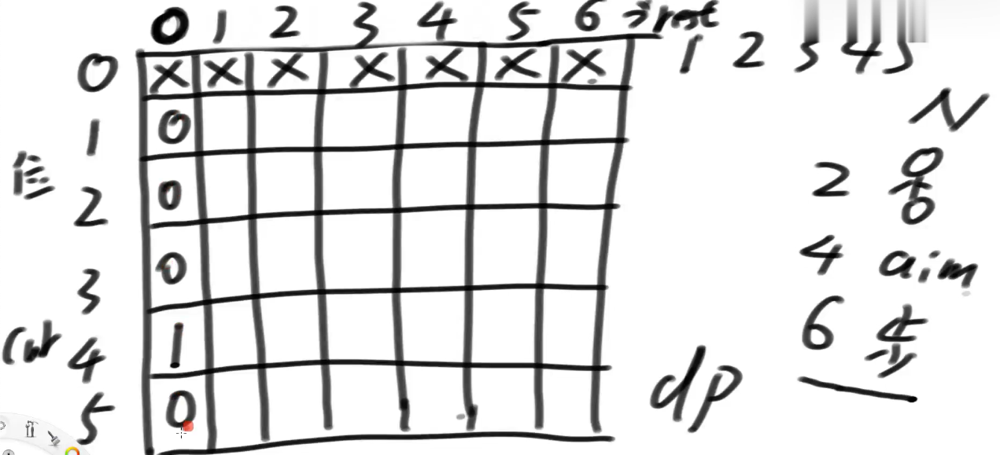


好,第二步,我们要谁呢,根据代码ways1,return process1(start, K, aim, N);,我们要start,K的结果值,


继续分析下面的2个if条件.


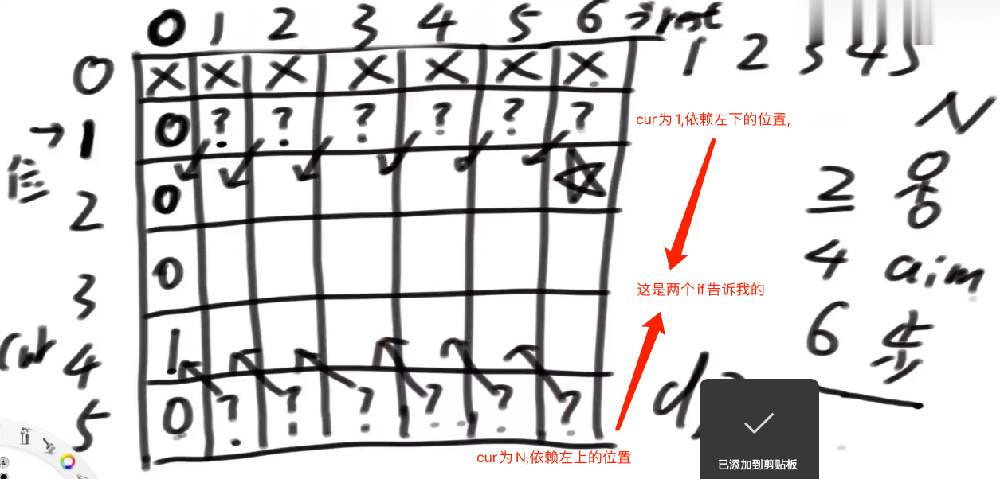


第三步,分析普遍位置,发现,每个普遍位置,依赖左上+左下的位置的和.

好,至此,所有依赖分析完毕,并且,我们应该可以把这张表填满.

怎么填,竖着一列一列的,从左到右填.

```java
public static int ways3(int N, int start, int aim, int K) {
		if (N < 2 || start < 1 || start > N || aim < 1 || aim > N || K < 1) {
			return -1;
		}
		int[][] dp = new int[N + 1][K + 1];
  //第一列直接填好,base case告诉我的.
		dp[aim][0] = 1;
  //然后一列一列的,从左到右,
		for (int rest = 1; rest <= K; rest++) {
      //第一个边界限制,只依赖左下
			dp[1][rest] = dp[2][rest - 1];
      //普遍位置,依赖左上加左下
			for (int cur = 2; cur < N; cur++) {
				dp[cur][rest] = dp[cur - 1][rest - 1] + dp[cur + 1][rest - 1];
			}
      //第二个边界限制,只依赖左上
			dp[N][rest] = dp[N - 1][rest - 1];
		}
  //所有格子填满,返回目标结果值.
		return dp[start][K];
	}
```

### 拿纸牌问题问题

```
给定一个整型数组arr,代表数值不同的纸牌排成一条线
玩家A和B依次拿走每张牌,规定玩家A先拿,玩家B后拿
但是每个玩家每次只能拿最左或者最右的一张牌,玩家A,B都绝顶聪明,请返回最后获胜者的分数.
```

#### 暴力递归方法

A,B两个玩家,分为先手和后手,则假定有2个黑盒方法.

```java
// 根据规则，返回获胜者的分数
public static int win1(int[] arr) {
   if (arr == null || arr.length == 0) {
      return 0;
   }
  //A玩家,先手的最大分值
   int first = f1(arr, 0, arr.length - 1);
	//B玩家,后手的最大分值
   int second = g1(arr, 0, arr.length - 1);
  //赢家是最大的那个,返回max
   return Math.max(first, second);
}

//注意,先手,后手,是相对来说的,如果我现在是先手,那么我取完后我就是后手了,我依赖我是后手的方法.而后手肯定会给我最小的
// arr[L..R]，先手获得的最好分数返回
public static int f1(int[] arr, int L, int R) {
  //作为先手,就剩一张牌了,直接拿走,返回唯一积分
   if (L == R) {
      return arr[L];
   }
  //L + 1,代表拿左边的了,那么我首先得到的左边的分值,然后我依赖我作为后手的情况的分值,作为后手,一定是给我一个最小的分值可能性结果给我.
   int p1 = arr[L] + g1(arr, L + 1, R);
  //R - 1,代表拿右边了,后手依赖同理.
   int p2 = arr[R] + g1(arr, L, R - 1);
  //我要拿一个左右取两种选择的情况下的最大值.
   return Math.max(p1, p2);
}

//arr[L..R]，相对来说的后手,一定是对手留给我的最小的分值的结果.所以返回值取最小.
public static int g1(int[] arr, int L, int R) {
  //如果2张,先手肯定选了最大的一张,到后手我这肯定没得选,
  //对于后手来说,只剩一张牌的话,先手一定会拿走,后手屁都不剩.返回0分.
   if (L == R) {
      return 0;
   }
   // 先手已经取了左边(L+1)了,后手只能从L+1尽力取
   int p1 = f1(arr, L + 1, R); 
   // 先手已经取了右边(L+1)了,后手只能从R-1尽力取
   int p2 = f1(arr, L, R - 1);
  //我要留下这个更大的分值,把那个小分值的返回回去.
   return Math.min(p1, p2);
}
```


#### 优化方案1-傻缓存法


```java
public static int win2(int[] arr) {
   if (arr == null || arr.length == 0) {
      return 0;
   }
   int N = arr.length;
   int[][] fmap = new int[N][N];
   int[][] gmap = new int[N][N];
   for (int i = 0; i < N; i++) {
      for (int j = 0; j < N; j++) {
         fmap[i][j] = -1;
         gmap[i][j] = -1;
      }
   }
   int first = f2(arr, 0, arr.length - 1, fmap, gmap);
   int second = g2(arr, 0, arr.length - 1, fmap, gmap);
   return Math.max(first, second);
}

// arr[L..R]，先手获得的最好分数返回
public static int f2(int[] arr, int L, int R, int[][] fmap, int[][] gmap) {
   if (fmap[L][R] != -1) {
      return fmap[L][R];
   }
   int ans = 0;
   if (L == R) {
      ans = arr[L];
   } else {
      int p1 = arr[L] + g2(arr, L + 1, R, fmap, gmap);
      int p2 = arr[R] + g2(arr, L, R - 1, fmap, gmap);
      ans = Math.max(p1, p2);
   }
   fmap[L][R] = ans;
   return ans;
}

// // arr[L..R]，后手获得的最好分数返回
public static int g2(int[] arr, int L, int R, int[][] fmap, int[][] gmap) {
   if (gmap[L][R] != -1) {
      return gmap[L][R];
   }
   int ans = 0;
   if (L != R) {
      int p1 = f2(arr, L + 1, R, fmap, gmap); // 对手拿走了L位置的数
      int p2 = f2(arr, L, R - 1, fmap, gmap); // 对手拿走了R位置的数
      ans = Math.min(p1, p2);
   }
   gmap[L][R] = ans;
   return ans;
}
```


#### 优化方案2 动态规划

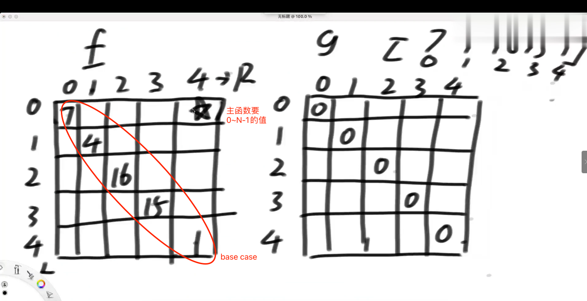

我要的是L...R范围上的数字,所以,L>R的,都用不到.

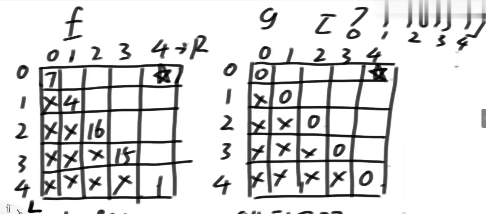


普遍位置以来.

f依赖g,g依赖f,依赖对称点的左和左下.(L+1,R),(L,R-1).互相推,推到顶部.

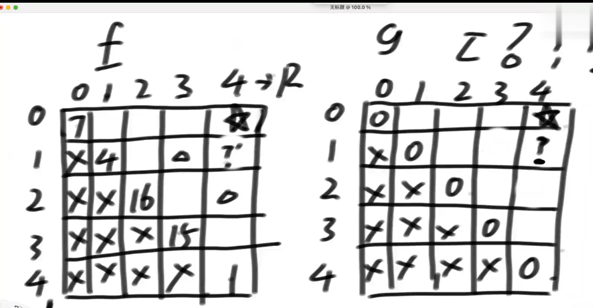


```java
public static int win3(int[] arr) {
   if (arr == null || arr.length == 0) {
      return 0;
   }
   int N = arr.length;
   int[][] fmap = new int[N][N];
   int[][] gmap = new int[N][N];
   for (int i = 0; i < N; i++) {
     /**
     由
     *if (L == R) {
      	return arr[L];
   		}这个basecase推断而出.
   		由于java默认初始化就是0,所以gmap不需要初始化
     */
      fmap[i][i] = arr[i];
   }
  //按照对角线向右上角推.
  //第一条00对角线是basecase推过了,
  //下一条是01对角线,
  //再下是02,03,04,直到0N
  //所以从1出发,到N结束.
   for (int startCol = 1; startCol < N; startCol++) {
      int L = 0;
      int R = startCol;
     //列比行先越界,所以判断列是否越界就行了,
      while (R < N) {
        //普遍情况下,暴力递归改编.
         fmap[L][R] = Math.max(arr[L] + gmap[L + 1][R], arr[R] + gmap[L][R - 1]);
         gmap[L][R] = Math.min(fmap[L + 1][R], fmap[L][R - 1]);
        //先让他顺着对角线往下爬,再补充上面的逻辑
         L++;
         R++;
      }
   }
   return Math.max(fmap[0][N - 1], gmap[0][N - 1]);
}
```

## 暴力递归到动态规划(二)

### 四种大套路模型

1. 从左到右尝试模型,

​		要,还是不要当前的选择,然后依赖后面的选择

2. 范围尝试模型

​		[L...R] 范围选,AB玩家左右选牌问题.

3. 样本对应模型

​		最小公共子序列,最大回文子序列问题.

4. 业务限制模型

   咖啡机问题

### 经典背包问题

> 给定两个长度都为N的数组weights和values，  
> weights[i]和values[i]分别代表 i号物品的重量和价值。  
> 给定一个正数bag，表示一个载重bag的袋子，  
> 你装的物品不能超过这个重量。  
> 返回你能装下最多的价值是多少?   

1.两个长度都为N的数组,分别代表重量,价值.

2.背包最大载重为maxWeight

在不超过背包限制的情况下,价值最大.

#### 从左往右的尝试,暴力递归

> 暴力递归过程.index号货物,要还是不要.做选择

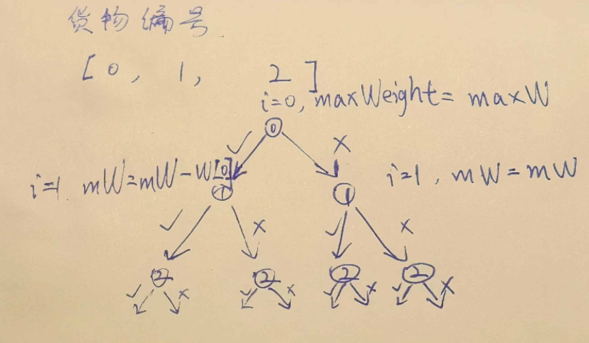

```java
/**
 * 考虑到了index号货物,之前的我不管
 * 不能超过背包容量
 * @param w
 * @param v
 * @param index 0~N
 * @param rest 负~bag
 * @return 返回最大价值
 */
public static int process(int[] w, int[] v, int index, int rest) {
   //背包撑爆了,那这种方法肯定是不行的,返回-1
   if (rest < 0) {
      return -1;
   }
   //都到数组长度了,说明当前没得选,返回0,当前这条路结束.
   //注意调用到==N的时候,已经结束了,数组最后一个值是N-1位置的数.
   if (index == w.length) {
      return 0;
   }
   //当前的要和不要两种选择方式,取获利最大
   //要当前,
   //如果要了当前,那么我返回值得加上当前的货物的价值
   //但是要注意,当前货物可能装不下,撑爆了,所以,要先判断当前背包放的下.
   int tempP1 = process(w, v, index + 1, rest - w[index]);
   int p1 = tempP1 == -1 ? 0 : tempP1 + v[index];
   //不要当前
   int p2 = process(w, v, index + 1, rest);
   return Math.max(p1, p2);
}
```

#### 动态规划

我们可以发现

w,v,数组都是不变的,而变化的只有index,和rest.

所以,这是一个二维数组就可以记录下所有的解的问题.

> 傻缓存法解:

因为数组长度是N,我要遍历到第N个,所以数组长度准备N+1,

画出这张2维表.

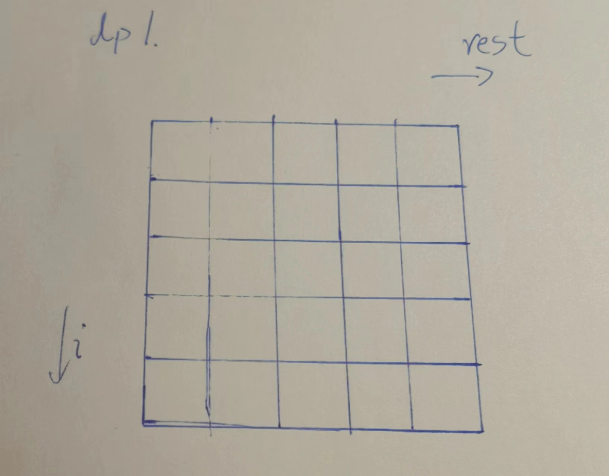

根据basecase

rest < 0 时候,全都是-1,有个-1区,而index == N时候,rest全部都是0

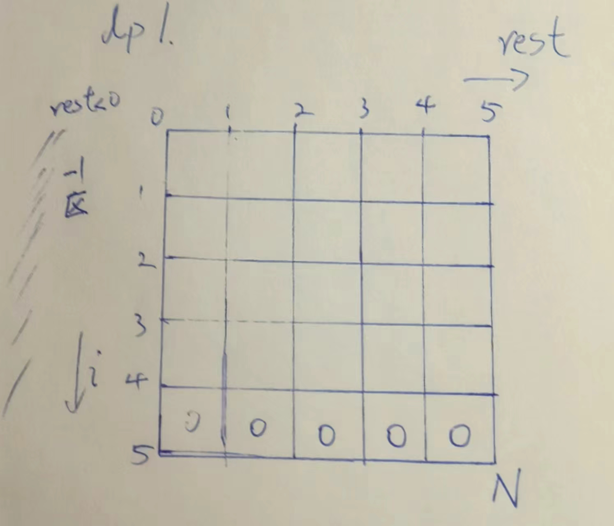


每次入参为i的时候,方法体内部依赖i+1,这说明,普遍位置,依赖他下面的行,所以只要下面的行有数据,那么就可以一直推上去.

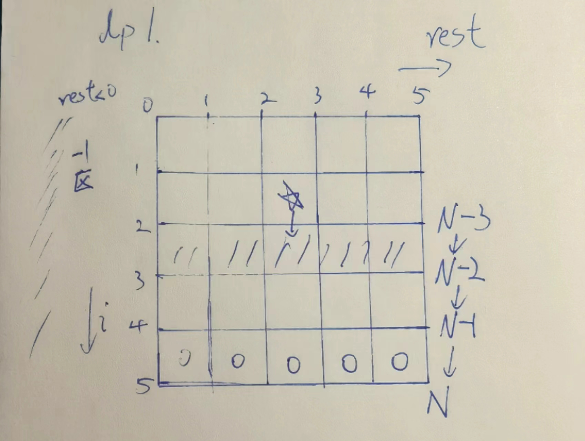

```java
public static int dp(int[] w, int[] v, int bag) {
   if (w == null || v == null || w.length != v.length || w.length == 0) {
      return 0;
   }
   //准备一个多大的数组?
   int N = w.length;
   //二维数组,两个值分别是index,maxW
   int dp[][] = new int[N+1][bag+1];
   //剩下的直接对着暴力递归抄.
   //初始化的数组默认都是0,所以这个不用写
   /*for (int i = 0; i < N; i++) {
      dp[N][i] = 0;
   }*/
   //第N行已经填好,从N-1依次向上填.rest从左往右填
   for (int index = N-1; index >=0 ; index--) {
      //注意啊,这里一定要遍历到bag(N),不然格子是填不满的!,取格子N时候就会变成0.
      for (int rest = 0; rest <= bag; rest++) {
         //里面直接抄暴力,process换dp
         //有负数区的,在数组里直接会越界,所以先看下是否能从格子拿
         int tempP1 = rest - w[index] < 0 ? -1 : dp[index + 1][rest - w[index]];
         int p1 = tempP1 == -1 ? 0 : tempP1 + v[index];
         //不要当前
         int p2 = dp[index + 1][rest];
         //暴力的返回,直接给格子赋值
         dp[index][rest] = Math.max(p1, p2);
      }
   }
   return dp[0][bag];
}
```


### 字符转化问题

> 规定1和A对应、2和B对应、3和C对应...26和Z对应
> 那么一个数字字符串比如"111”就可以转化为:
> "AAA"、"KA"和"AK"
> 给定一个只有数字字符组成的字符串str，返回有多少种转化结果 

#### 从左往右尝试.暴露递归

暴力递归,从i位置开始,单个转化,还是2个一起转化,只要成功了,就算一种方法.

```java
/**
	 * 一个数组,从i位置往后,我尝试,之前的不管.
	 * @param chars
	 * @param i 当前位置
	 * @return 可行的方法数
	 */
	private static int process(char[] chars, int i) {
		if (i == chars.length) {
			//都到最后一个了,说明之前的转成了,这是一种方法数
			return 1;
		}
		//如果当前单转的字符是0,那么也不能转.说明之前的决策是错误的,返回0;
		if (chars[i] == '0') {
			return 0;
		}
		//普遍位置
		//没到最后一个呢,那么我看看单转能不能转
		int ways = process(chars, i + 1);
		//判断能不能双转,先判断是否存在双转情况.
		//存在下一个字符,且当前字符加下一个字符<27
		if (i + 1 < chars.length && ((chars[i] - '0') * 10 + (chars[i + 1] - '0')) < 27) {
			ways += process(chars, i + 2);
		}
		//注意,这不是两个方法返回值取最大,而是单转或双转,都是我的方法数.所以要累加.
		return ways;
	}
```

#### 动态规划

观察上面的暴力方法,是不是只有只有一个变量.那这就是一个一维数组的dp

```java
// 从右往左的动态规划
	// 就是上面方法的动态规划版本
	// dp[i]表示：str[i...]有多少种转化方式
	public static int dp1(String s) {
		if (s == null || s.length() == 0) {
			return 0;
		}
		char[] chars = s.toCharArray();
		int N = chars.length;
		int[] dp = new int[N + 1];
		dp[N] = 1;
		for (int i = N - 1; i >= 0; i--) {
			if (chars[i] != '0') {
				int ways = dp[i + 1];
				if (i + 1 < chars.length && (chars[i] - '0') * 10 + chars[i + 1] - '0' < 27) {
					ways += dp[i + 2];
				}
				dp[i] = ways;
			}
		}
		return dp[0];
	}
```

### 贴纸问题

> 给定一个字符串str，给定一个字符串类型的数组arr，出现的字符都是小写英文
> arr每一个字符串，代表一张贴纸，你可以把单个字符剪开使用，目的是拼出str来
> 返回需要至少多少张贴纸可以完成这个任务。
> 例子：str= "babac"，arr = {"ba","c","abcd"}
> ba + ba + c  3  abcd + abcd 2  abcd+ba 2
> 所以返回2

#### 从左往右一张张的尝试,暴力递归解.

```java
// 所有贴纸stickers，每一种贴纸都有无穷张
	// target
	// 返回组成target最少张数
	public static int process1(String[] stickers, String target) {
		//如果当前没字符了,消耗没了,那就无需再增加张数
		if (target.length() == 0) {
			return 0;
		}
		int min = Integer.MAX_VALUE;
		for (String first : stickers) {
			String rest = minus(target, first);
			//每一张都去消耗,如果当前张消耗掉一些字符,那就继续循环一套消耗.
			//如果当前贴纸无法消耗掉任何字符了,那就换下一张.
			if (rest.length() != target.length()) {
				min = Math.min(min, process1(stickers, rest));
			}
		}
		//如果能消耗完,那就需要加一张,否则不需要增加.
		//如果是min == Integer.MAX_VALUE 说明for里的if没进去过,说明每个贴纸都不行了,那么就返回最大值.
		//如果min!=最大值,那么到了子计算中,一定是返回0的才有效,这里返回+1,这个+1是父计算中消耗的那一张.
		return min + (min == Integer.MAX_VALUE ? 0 : 1);
	}
```


### 最长公共子序列问题

样本对应模型,暴力递归解

```java
/**
	 * 看看0...i 和 0...j范围上,公共子序列是多少,后面的我不管
	 * 样本对应,
	 * 四种情况,
	 * 1.i,j都只剩一个了,相当就是一个公共子序列,
	 * 2.i只剩一个了,j还剩很多,等于j,最后一个吗,等于就是一个公共子序列,否则有没有j都一样,给他减掉.
	 * 3.i还剩很多,j只剩一个了, 等同于2的逻辑.
	 * 4.i,j都剩很多.
	 * 	样本对应考虑.
	 * 	4.1 可能1,一定不可能2.
	 * 	4.2 可能2,一定不可能1.
	 * 	4.3 可能1,也可能2.(注意方式是最后一个比,直接给出结果,然后各自减一,否则真的全部交给子计算考虑,直接死循环了.)
	 * 结果取一个三种方式最大值
	 */
	public static int process1(char[] str1, char[] str2, int i, int j) {
		if (i == 0 && j == 0) {
			// str1[0..0]和str2[0..0]，都只剩一个字符了
			// 那如果字符相等，公共子序列长度就是1，不相等就是0
			// 这显而易见
			return str1[i] == str2[j] ? 1 : 0;
		} else if (i == 0) {
			// 这里的情况为：
			// str1[0...0]和str2[0...j]，str1只剩1个字符了，但是str2不只一个字符
			// 因为str1只剩一个字符了，所以str1[0...0]和str2[0...j]公共子序列最多长度为1
			// 如果str1[0] == str2[j]，那么此时相等已经找到了！公共子序列长度就是1，也不可能更大了
			// 如果str1[0] != str2[j]，只是此时不相等而已，
			// 那么str2[0...j-1]上有没有字符等于str1[0]呢？不知道，所以递归继续找
			if (str1[i] == str2[j]) {
				return 1;
			} else {
				return process1(str1, str2, i, j - 1);
			}
		} else if (j == 0) {
			// 和上面的else if同理   
			if (str1[i] == str2[j]) {
				return 1;
			} else {
				return process1(str1, str2, i - 1, j);
			}
		} else { // i != 0 && j != 0
			// 这里的情况为：
			// str1[0...i]和str2[0...i]，str1和str2都不只一个字符
			int p1 = process1(str1, str2, i - 1, j);
			int p2 = process1(str1, str2, i, j - 1);
			int p3 = str1[i] == str2[j] ? (1 + process1(str1, str2, i - 1, j - 1)) : 0;
			return Math.max(p1, Math.max(p2, p3));
		}
	}
```


一个普遍位置,依赖左边(j-1),依赖上面(i-1),依赖左上(i-1,j-1).

先填好,0行,0列,然后依次从左往右,从上到下,填满,返回右下角即可.


```java
public static int longestCommonSubsequence2(String s1, String s2) {
   if (s1 == null || s2 == null || s1.length() == 0 || s2.length() == 0) {
      return 0;
   }
   char[] str1 = s1.toCharArray();
   char[] str2 = s2.toCharArray();
   int N = str1.length;
   int M = str2.length;
   int[][] dp = new int[N][M];
  //base case
   dp[0][0] = str1[0] == str2[0] ? 1 : 0;
  //两个if,各自只有1个字符的时候.
   for (int j = 1; j < M; j++) {
      dp[0][j] = str1[0] == str2[j] ? 1 : dp[0][j - 1];
   }
   for (int i = 1; i < N; i++) {
      dp[i][0] = str1[i] == str2[0] ? 1 : dp[i - 1][0];
   }
  //普遍位置.如果相等,则有一个相同子序列,否则都砍掉.
   for (int i = 1; i < N; i++) {
      for (int j = 1; j < M; j++) {
         int p1 = dp[i - 1][j];
         int p2 = dp[i][j - 1];
         int p3 = str1[i] == str2[j] ? (1 + dp[i - 1][j - 1]) : 0;
         dp[i][j] = Math.max(p1, Math.max(p2, p3));
      }
   }
  //返回主函数要的位置的值.
   return dp[N - 1][M - 1];
}
```


## 暴力递归到动态规划(三)

### 最长回文子序列长度

> 给定一个字符串str，返回这个字符串的最长回文子序列长度
> 比如 ： str = “a12b3c43def2ghi1kpm”
> 最长回文子序列是“1234321”或者“123c321”，返回长度7

#### 解法一:样本对应模型尝试

这个题,第一种解法,就是正序的和逆序的做一个最长公共子序列.但是我们这次想换一种尝试.

#### 解法二:范围尝试模型

我们在一个小段范围上,看看他的最长回文数是多少,然后一点点扩大范围,加到一起.

```java
public static int lpsl1(String s) {
   if (s == null || s.length() == 0) {
      return 0;
   }
   char[] str = s.toCharArray();
   return f(str, 0, str.length - 1);
}

/**
 * str[L..R] 找到最长回文子序列长度返回
 * L之前的,R之后的,我都不管
 */
public static int f(char[] chars, int L, int R) {
   //就一个字符,那它自己肯定是一个
   if (L == R) {
      return 1;
   }
   //这个范围是2个字符
   if (L == R - 1) {
      //这2个字符,是不是相等的啊,如果这俩相等,那他们互为回文,否则每个单个字符组成回文.
      return chars[L] == chars[R] ? 2 : 1;
   }
   /**
    * 大于2个的情况,尝试方式很像样本对应模型,
    * 1.L,R都不要
    * 2.L要,R不要
    * 3.L不要,R要
    * 4.L,R都要
    * 是不是很像2个样本对应的处理方式
    */
   int p1 = f(chars, L + 1, R - 1);
   int p2 = f(chars, L, R - 1);
   int p3 = f(chars, L + 1, R);
   //首尾都要,如果相当,那是不是就是首尾2个字符互为回文,中间的L+1,R-1范围的结果要加上这个2. 例如[a,.... (L+1,R-1)....,a],两个a字符,否则就是0,他俩不是回文,要某一个的,是p2,p3
   int p4 = chars[L] != chars[R] ? 0 : (2 + f(chars, L + 1, R - 1));
   return Math.max(Math.max(p1, p2), Math.max(p3, p4));
}
```

#### 解法三:位置依赖优化

我们发现,变量,2个,L,R,范围,0~N,我们作出这个二维表.

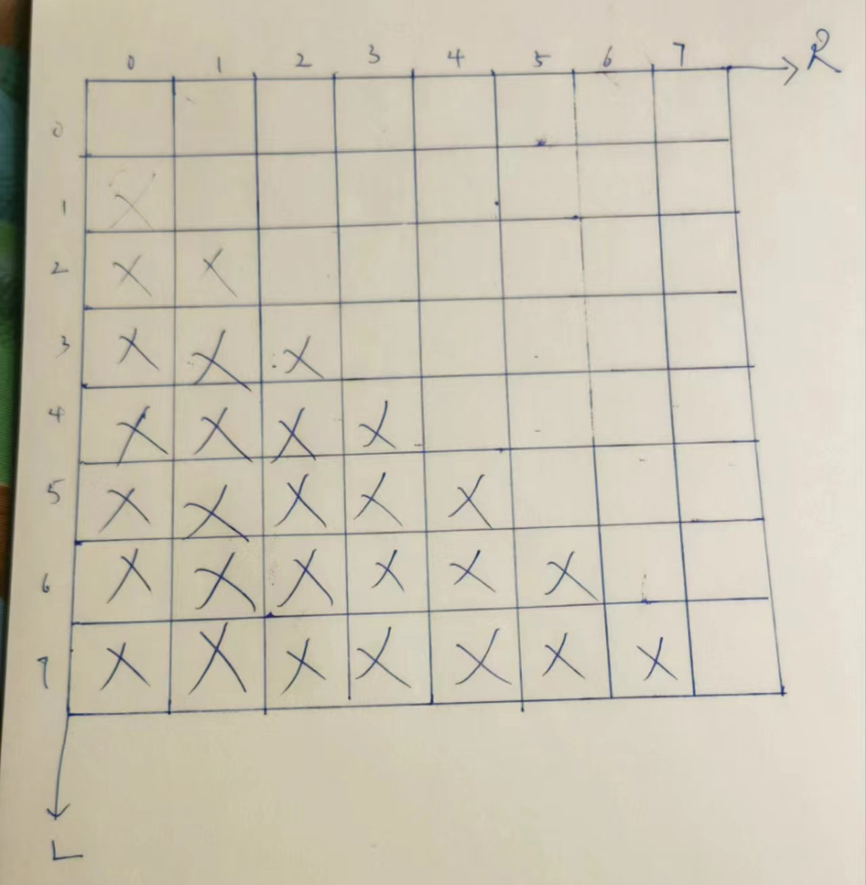


根据base case,填上对角线的值.和对角线上面一串的值

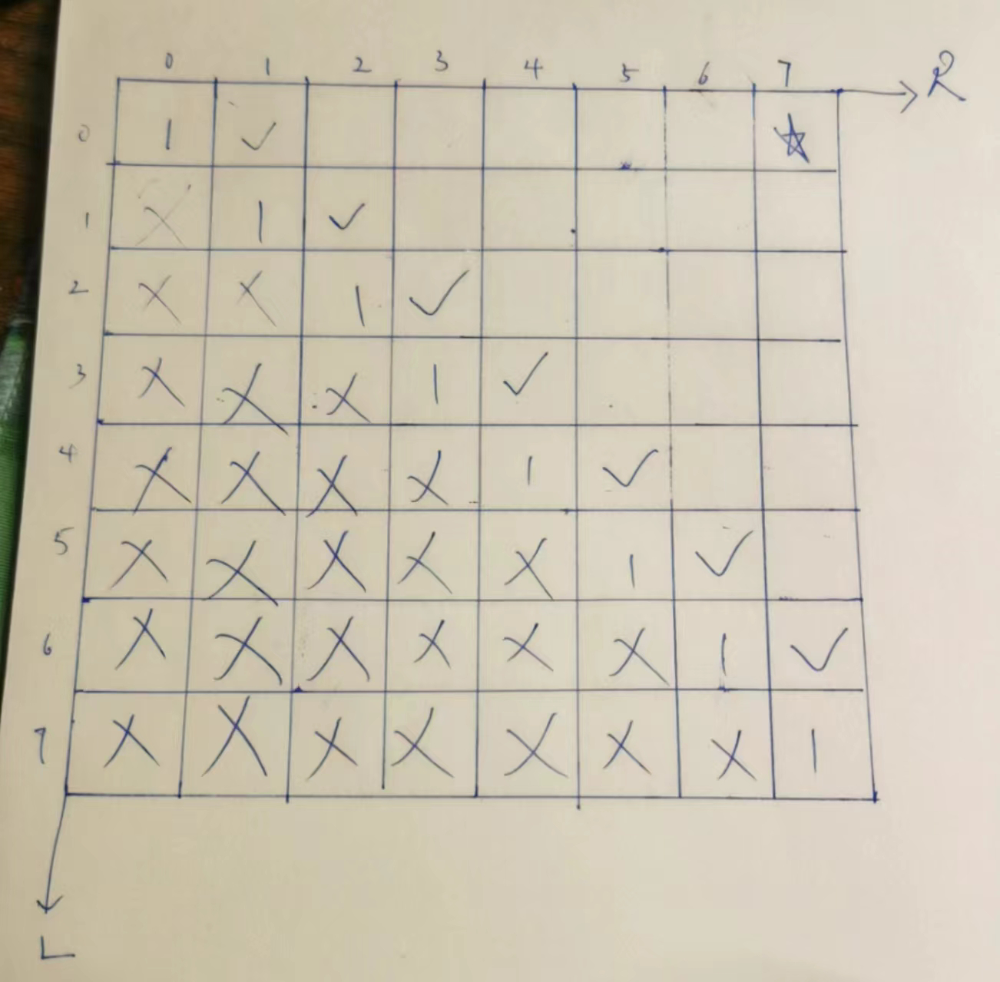

普遍位置分析,每次依赖左,下,左下,三个位置,p4也是依赖左下的加工

所以,从下往上,从左往右遍历.  对角线填了,对角线上面也填了,L从N-3开始, R从,对角线右边2个格子,开始,只要没到边界,N,就一直往右.

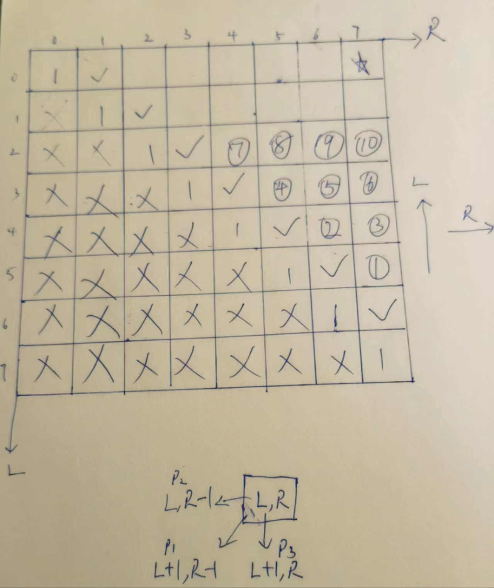

```java
/**
 * dp版本
 *
 * @param s
 * @return
 */
public static int lpsl2(String s) {
   if (s == null || s.length() == 0) {
      return 0;
   }
   char[] chars = s.toCharArray();
   //L,R是位置,所以遍历到N-1,所以长度为N即可
   int N = chars.length;
   int[][] dp = new int[N][N];
   //我先把最后一个格子提出来单独处理,这样数组我少遍历一个,这样,不担心数组越界
   dp[N - 1][N - 1] = 1;
   /**
    * 分析 base case
    * 1.L == R的位置,返回1,所以,对角线位置都是1.
    * 2.L == R-1的位置,相等为2不等为1.
    */
   for (int i = 0; i < N - 1; i++) {
      dp[i][i] = 1;
      dp[i][i + 1] = chars[i] == chars[i + 1] ? 2 : 1;
   }
   /**
    * 普遍位置分析,每次依赖左,下,左下,三个位置,p4也是依赖左下的加工
    * 从下往上,从左往右遍历.
    * 对角线填了,对角线上面也填了,L从N-3开始,
    * R从,对角线右边2个格子,开始,只要没到边界,N,就一直往右.
    */
   for (int L = N - 3; L >= 0; L--) {
      for (int R = L + 2; R < N; R++) {
         int p1 = dp[L + 1][R - 1];
         int p2 = dp[L][R - 1];
         int p3 = dp[L + 1][R];
         //首尾都要,如果相当,那是不是就是首尾2个字符互为回文,中间的L+1,R-1范围的结果要加上这个2. 例如[a,.... (L+1,R-1)....,a],两个a字符,否则就是0,他俩不是回文,要某一个的,是p2,p3
         int p4 = chars[L] != chars[R] ? 0 : (2 + dp[L + 1][R - 1]);
         dp[L][R] = Math.max(Math.max(p1, p2), Math.max(p3, p4));
      }
   }
   return dp[0][N - 1];
}
```


进一步观察,我们发现,左边,下面都依赖同一个左下,然后取最大,也就是说,左,下,一定不比左下小.

如图所示,c是被,左(a)和右(b)共同依赖并取最大值的.

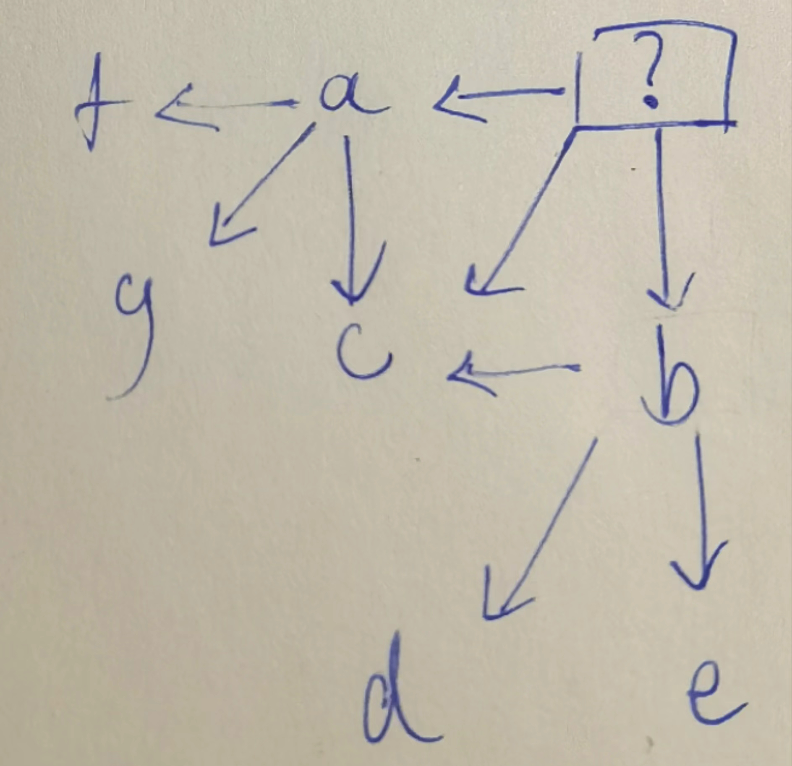

```java
/**
 * dp版本
 * 优化常数项
 * @param s
 * @return
 */
public static int lpsl3(String s) {
   if (s == null || s.length() == 0) {
      return 0;
   }
   char[] chars = s.toCharArray();
   //L,R是位置,所以遍历到N-1,所以长度为N即可
   int N = chars.length;
   int[][] dp = new int[N][N];
   //我先把最后一个格子提出来单独处理,这样数组我少遍历一个,这样,不担心数组越界
   dp[N - 1][N - 1] = 1;
   /**
    * 分析 base case
    * 1.L == R的位置,返回1,所以,对角线位置都是1.
    * 2.L == R-1的位置,相等为2不等为1.
    */
   for (int i = 0; i < N - 1; i++) {
      dp[i][i] = 1;
      dp[i][i + 1] = chars[i] == chars[i + 1] ? 2 : 1;
   }
   /**
    * 我们看上面的位置依赖,是从左,左下,下三个中找到最大的,那么左,下,都依赖了左下,取最大后,其实就有没有左下无所谓,最终结果,一定大于或等于左下.
    */
   for (int L = N - 3; L >= 0; L--) {
      for (int R = L + 2; R < N; R++) {
         //左,下中找到较大的,这2个值一定比左下大或等于.
         dp[L][R] = Math.max(dp[L][R - 1], dp[L + 1][R]);
         //如果p4情况存在,我在上一步,给dp[L][R] 预设值了,如果存在p4,那么预设值和p4 pk下.
         if (chars[L] == chars[R]) {
            dp[L][R] = Math.max(dp[L][R], 2 + dp[L + 1][R - 1]);
         }
      }
   }
   return dp[0][N - 1];
}
```


### 跳马问题

> 想象一个象棋的棋盘，
> 然后把整个棋盘放入第一象限，棋盘的最左下角是(0,0)位置
> 那么整个棋盘就是横坐标上9条线、纵坐标上10条线的区域
> 给你三个 参数 x，y，k
> 返回“马”从(0,0)位置出发，必须走k步
> 最后落在(x,y)上的方法数有多少种? 

#### 暴力递归

任意一个位置,就跳呗,8个方向,出界了就结束,跳完了一次后,又是8次跳法.复杂度8的k次方

如果跳完了,正好跳到终点,那是一种方法,否则失败,返回0.

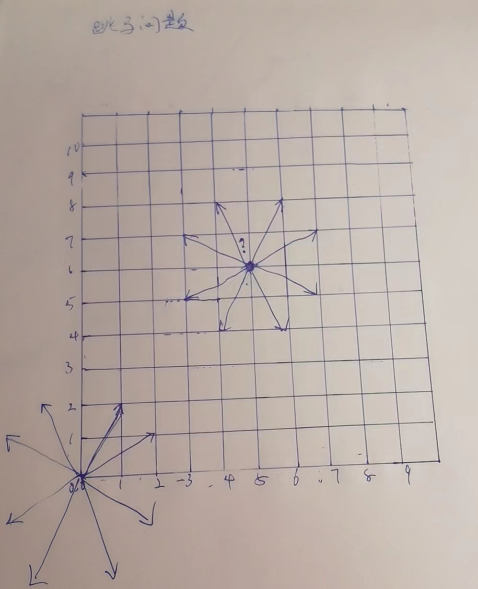

```java
// 当前来到的位置是（x,y）
	// 还剩下rest步需要跳
	// 跳完rest步，正好跳到a，b的方法数是多少？
	// 10 * 9
	public static int jump(int a, int b, int k) {
		return process(0, 0, k, a, b);
	}

/**
	 * 当前在x,y坐标位置
	 * @param rest 还剩rest步要跳
	 * 最终落点坐标,a,b
	 * @return 返回方法数
	 */
	public static int process(int x, int y, int rest, int a, int b) {
		//越界了,这种跳法不行
    //10条线是0-9,9条线是0-8,所以,超出这个范围,就g了
		if (x<0 || y<0 ||x>9 || y>8){
			return 0;
		}
		//跳完了,在终点了吗?在就是1种方法,否则就是失败,0种方法.
		if (rest == 0){
			return x == a && y == b ? 1 : 0;
		}
		//没跳完,也没出界,那继续跳去吧,八种方向各个试试.
		int ways = process(x+1, y+2,rest-1,a,b);
		ways += process(x+2, y+1,rest-1,a,b);
		ways += process(x+2, y-1,rest-1,a,b);
		ways += process(x+1, y-2,rest-1,a,b);

		ways += process(x-1, y+2,rest-1,a,b);
		ways += process(x-1, y-2,rest-1,a,b);
		ways += process(x-2, y+1,rest-1,a,b);
		ways += process(x-2, y-1,rest-1,a,b);

		return ways;
	}
```

#### 傻缓存法

> 不好严格位置依赖,我就不严格位置依赖,如果没有省去进一步的枚举,那么傻缓存法一样优秀.

我们可以看出,一共有三个变量,当前位置x,y,和剩余步数rest.

所以,这是一个三维表.变化位置,x:0-9,y:0-8,rest是0-k步,所以是k+1,所以,画出这个三维数组

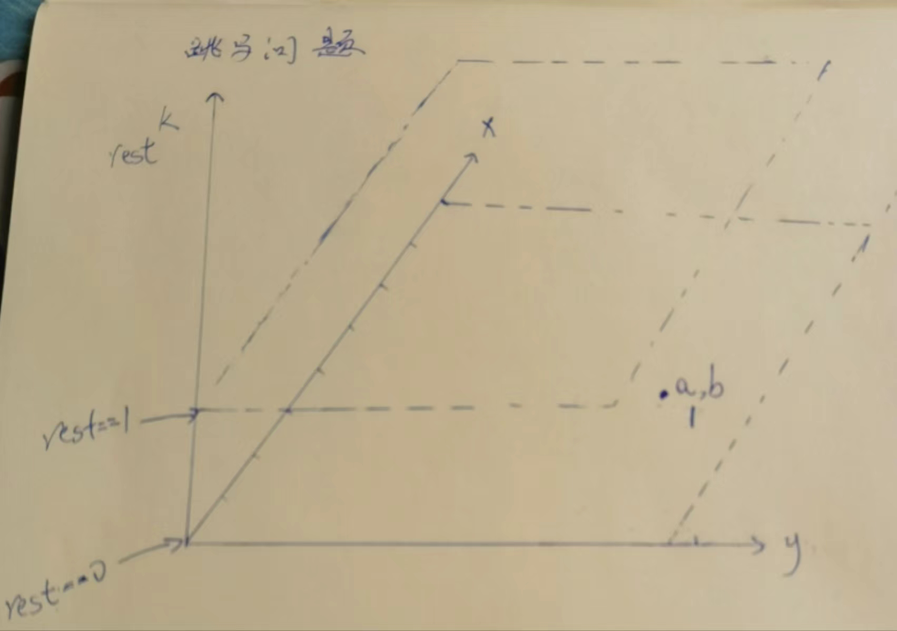

x == 9,y == 8 ,rest == k

我们发现,根据base case,第一层(rest == 0),只有ab位置,为1,其他位置都是0,不管.这样第一层就填好了,

再看,每次进来,rest,依赖rest-1的位置,从图中可以看出,他就是依赖他底下这层,也就是底下填好了,就可以依次往上填.

但是这里有个问题,我们在暴力方法中,可以判断返回0,但是在这里如果是负数,那么数组就越界了,所以用方法封装下.

```java
public static int dp(int a, int b, int k) {
  //初始化数组大小
   int[][][] dp = new int[10][9][k + 1];
  //第一层只有ab位置是1,其他都是0,不用管
   dp[a][b][0] = 1;
  //从第一层往上填,
   for (int rest = 1; rest <= k; rest++) {
      for (int x = 0; x < 10; x++) {
         for (int y = 0; y < 9; y++) {
           //依次从缓存表中取值,这里有个小技巧,方法封装下,防止数组越界.
            int ways = pick(dp, x + 2, y + 1, rest - 1);
            ways += pick(dp, x + 1, y + 2, rest - 1);
            ways += pick(dp, x - 1, y + 2, rest - 1);
            ways += pick(dp, x - 2, y + 1, rest - 1);
            ways += pick(dp, x - 2, y - 1, rest - 1);
            ways += pick(dp, x - 1, y - 2, rest - 1);
            ways += pick(dp, x + 1, y - 2, rest - 1);
            ways += pick(dp, x + 2, y - 1, rest - 1);
            dp[x][y][rest] = ways;
         }
      }
   }
  //返回暴力方法中,目标位置.(process(0, 0, k, a, b);)
   return dp[0][0][k];
}

public static int pick(int[][][] dp, int x, int y, int rest) {
   if (x < 0 || x > 9 || y < 0 || y > 8) {
      return 0;
   }
   return dp[x][y][rest];
}
```


### 咖啡杯全部干净最短时间问题.

> 给定一个数组arr，arr[i]代表第i号咖啡机泡一杯咖啡的时间
> 给定一个正数N，表示N个人等着咖啡机泡咖啡，每台咖啡机只能轮流泡咖啡
> 只有一台咖啡机，一次只能洗一个杯子，时间耗费a，洗完才能洗下一杯
> 每个咖啡杯也可以自己挥发干净，时间耗费b，咖啡杯可以并行挥发
> 假设所有人拿到咖啡之后立刻喝干净，
> 返回从开始等到所有咖啡机变干净的最短时间
> 三个参数：int[] arr、int N，int a、int b

我们要明确题意,是所有的咖啡杯全部干净的时候,不是其中某一杯干净的时间.

#### 暴力递归

首先,我们要让来了的人排队喝咖啡,先找到最优的用完杯子的时间(可以开始洗的时间).这个可以用堆,小根堆来实现,用当前咖啡机做一杯的时间+喝完时间点共同排序.

```java
//咖啡机堆排序对象
public static class Machine {
		public int timePoint;
		public int workTime;

		public Machine(int t, int w) {
			timePoint = t;
			workTime = w;
		}
	}
public static class MachineComparator implements Comparator<Machine> {
		@Override
		public int compare(Machine o1, Machine o2) {
			return (o1.timePoint + o1.workTime) - (o2.timePoint + o2.workTime);
		}
	}

public static int minTime1(int[] arr, int n, int a, int b) {
  //做一个小根堆,来记录咖啡杯什么时间点可以开始洗.drinks
   PriorityQueue<Machine> heap = new PriorityQueue<Machine>(new MachineComparator());
   for (int i = 0; i < arr.length; i++) {
      heap.add(new Machine(0, arr[i]));
   }
   int[] drinks = new int[n];
   for (int i = 0; i < n; i++) {
      Machine cur = heap.poll();
      cur.timePoint += cur.workTime;
      drinks[i] = cur.timePoint;
      heap.add(cur);
   }
   return bestTime(drinks, a, b, 0, 0);
}

// drinks 所有杯子可以开始洗的时间
	// wash 单杯洗干净的时间（串行）
	// air 挥发干净的时间(并行)
	// free 洗的机器什么时候可用
	// drinks[index.....]都变干净，最早的结束时间（返回）
	public static int bestTime(int[] drinks, int wash, int air, int index, int free) {
		if (index == drinks.length) {
			return 0;
		}
		// index号杯子 决定洗
    //selfClean1是自己完成的时间,他首先要知道自己什么时候可以开始洗(drinks[index]),还得知道洗杯机什么时间可以洗,取最大值是说至少到了这个时间点才可以开始洗,例如,我10号时间点就可以准备洗,但是其他杯子给机器沾满了,20号时间才可以,所以我也是20号才能开始,然后加个洗杯机洗单杯的时间.就是我自己洗完的时间.
		int selfClean1 = Math.max(drinks[index], free) + wash;
    //剩下杯子洗的时间,就是从我下一杯开始,洗杯机的时间受我影响.
		int restClean1 = bestTime(drinks, wash, air, index + 1, selfClean1);
    //因为是全部干净时间,所以这里取最大值.
		int p1 = Math.max(selfClean1, restClean1);

		// index号杯子 决定挥发
    //挥发根本不需要看洗杯机的脸色,从我可以开始清洁开始,air时间就干净了
		int selfClean2 = drinks[index] + air;
    //剩下的杯子,继续处理,洗杯机时间,不受我影响,因为我没用他.
		int restClean2 = bestTime(drinks, wash, air, index + 1, free);
		int p2 = Math.max(selfClean2, restClean2);
		return Math.min(p1, p2);
	}

```

#### 样本对应模型

我们发现,可变参数只有2个,一个当前杯子号index,一个就是洗杯机可用时间free.

但是,这个free,我们不能明确掌握他的变化范围,那么我们就给他一个最大的范围.

```java
public static int minTime2(int[] arr, int n, int a, int b) {
   PriorityQueue<Machine> heap = new PriorityQueue<Machine>(new MachineComparator());
   for (int i = 0; i < arr.length; i++) {
      heap.add(new Machine(0, arr[i]));
   }
   int[] drinks = new int[n];
   for (int i = 0; i < n; i++) {
      Machine cur = heap.poll();
      cur.timePoint += cur.workTime;
      drinks[i] = cur.timePoint;
      heap.add(cur);
   }
   return bestTimeDp(drinks, a, b);
}

//改动态规划
public static int bestTimeDp(int[] drinks, int wash, int air) {
		int N = drinks.length;
  //我们并不知道free最大值变化范围多少,所以我们给一个他能冲到的最大的范围,
		int maxFree = 0;
		for (int i = 0; i < drinks.length; i++) {
			maxFree = Math.max(maxFree, drinks[i]) + wash;
		}
  //根据暴力方法,drinks从0开始,到drinks.length结束,所以,长度准备N+1,最大值是0-maxFree,所以准备free+1
		int[][] dp = new int[N + 1][maxFree + 1];
		for (int index = N - 1; index >= 0; index--) {
			for (int free = 0; free <= maxFree; free++) {
				int selfClean1 = Math.max(drinks[index], free) + wash;
        //因为第二层for,free无限接近maxFree,在+wash,会越界,所以,不管了,不可能调用的到.
				if (selfClean1 > maxFree) {
					break; // 因为后面的也都不用填了
				}
        //剩下的直接抄.
				// index号杯子 决定洗
				int restClean1 = dp[index + 1][selfClean1];
				int p1 = Math.max(selfClean1, restClean1);
				// index号杯子 决定挥发
				int selfClean2 = drinks[index] + air;
				int restClean2 = dp[index + 1][free];
				int p2 = Math.max(selfClean2, restClean2);
				dp[index][free] = Math.min(p1, p2);
			}
		}
		return dp[0][0];
	}
```


## 暴力递归到动态规划(四)

### 二维数组最小累加和问题

#### 启发:空间压缩技巧.

> 给定一个二维数组matrix，一个人必须从左上角出发，最后到达右下角
> 沿途只可以向下或者向右走，沿途的数字都累加就是距离累加和
> 返回最小距离累加和

```java
//这是我们正常的做动态规划,二维表的做法.
public static int minPathSum1(int[][] m) {
   if (m == null || m.length == 0 || m[0] == null || m[0].length == 0) {
      return 0;
   }
   int row = m.length;
   int col = m[0].length;
   int[][] dp = new int[row][col];
   dp[0][0] = m[0][0];
  //先给0列全算出来,
   for (int i = 1; i < row; i++) {
      dp[i][0] = dp[i - 1][0] + m[i][0];
   }
  //给0行全算出来
   for (int j = 1; j < col; j++) {
      dp[0][j] = dp[0][j - 1] + m[0][j];
   }
  //从上到下,从左到右,填满,每个格子,依赖左和上.
   for (int i = 1; i < row; i++) {
      for (int j = 1; j < col; j++) {
         dp[i][j] = Math.min(dp[i - 1][j], dp[i][j - 1]) + m[i][j];
      }
   }
   return dp[row - 1][col - 1];
}
```

我们发现一个事,就是说他每次都是依赖我左边的值和我上边的值,

那么如果我推到第三行了,他只依赖我第二行,那我还需要第一行的值吗?明显不需要了.

或者说我竖着往右推,第三列依赖我第二列,那我还需要第一列吗?不需要.

所以,行,列谁小,用谁推.

#### 不仅是依赖左,上,依赖左上,左,上,三个的,也一样,给他替换前记录下来即可.

```java
public static int minPathSum2(int[][] m) {
   if (m == null || m.length == 0 || m[0] == null || m[0].length == 0) {
      return 0;
   }
   int row = m.length;
   int col = m[0].length;
  //空间压缩技巧,第三行依赖第二行,第一行就没用了.
   int[] dp = new int[col];
   dp[0] = m[0][0];
   for (int j = 1; j < col; j++) {
      dp[j] = dp[j - 1] + m[0][j];
   }
   for (int i = 1; i < row; i++) {
      dp[0] += m[i][0];
      for (int j = 1; j < col; j++) {
         dp[j] = Math.min(dp[j - 1], dp[j]) + m[i][j];
      }
   }
   return dp[col - 1];
}
```

### 凑货币问题-每个只有1张

> arr是货币数组，其中的值都是正数。再给定一个正数aim。
> 每个值都认为是一张货币，
> 即便是值相同的货币也认为每一张都是不同的，
> 返回组成aim的方法数
> 例如：arr = {1,1,1}，aim = 2
> 第0个和第1个能组成2，第1个和第2个能组成2，第0个和第2个能组成2
> 一共就3种方法，所以返回3

#### 从左往右尝试吧.一张一张的

```java
public static int coinWays(int[] arr, int aim) {
   return process(arr, 0, aim);
}

// arr[index....] 组成正好rest这么多的钱，有几种方法
public static int process(int[] arr, int index, int rest) {
  //要了这张,凑成负数了,那肯定不对了,0种方法.
   if (rest < 0) {
      return 0;
   }
  //钱币用光了,正好凑够,返回1种,没凑够就是0种.
   if (index == arr.length) { // 没钱了！
      return rest == 0 ? 1 : 0;
   } else {
     //不要这张的方法数+要这张的方法数
      return process(arr, index + 1, rest) + process(arr, index + 1, rest - arr[index]);
   }
}
```

#### 改动态规划

```java
public static int dp(int[] arr, int aim) {
   if (aim == 0) {
      return 1;
   }
   int N = arr.length;
   int[][] dp = new int[N + 1][aim + 1];
  //base case
   dp[N][0] = 1;
  //N行填完了,倒着往上填,从N-1开始,从左往右,
   for (int index = N - 1; index >= 0; index--) {
      for (int rest = 0; rest <= aim; rest++) {
        //不要这张钱的结果数+能要这张钱?要了这张钱的结果数 : 0种结果数
         dp[index][rest] = dp[index + 1][rest] + (rest - arr[index] >= 0 ? dp[index + 1][rest - arr[index]] : 0);
      }
   }
   return dp[0][aim];
}
```

### 凑货币问题-每个金额无限张

> arr是面值数组，其中的值都是正数且没有重复。再给定一个正数aim。
> 每个值都认为是一种面值，且认为张数是无限的。
> 返回组成aim的方法数
> 例如：arr = {1,2}，aim = 4
> 方法如下：1+1+1+1、1+1+2、2+2
> 一共就3种方法，所以返回3

#### 还是一张一张的,从左往右尝试,当前这张货币要还是不要

```java
public static int coinsWay(int[] arr, int aim) {
   if (arr == null || arr.length == 0 || aim < 0) {
      return 0;
   }
   return process(arr, 0, aim);
}

// arr[index....] 所有的面值，每一个面值都可以任意选择张数，组成正好rest这么多钱，方法数多少？
public static int process(int[] arr, int index, int rest) {
   if (index == arr.length) { // 没钱了
     //正好凑够了,是1种方法数
      return rest == 0 ? 1 : 0;
   }
   int ways = 0;
  //不要这张货币的方法数,1张的方法数,2张的方法数,只要不超要凑的金额,就可以无限尝试.返回方法数的和.
   for (int zhang = 0; zhang * arr[index] <= rest; zhang++) {
      ways += process(arr, index + 1, rest - (zhang * arr[index]));
   }
   return ways;
}
```

#### 动态规划优化

```java
public static int dp1(int[] arr, int aim) {
   if (arr == null || arr.length == 0 || aim < 0) {
      return 0;
   }
   int N = arr.length;
   int[][] dp = new int[N + 1][aim + 1];
  //根据base case,第N行的时候,凑够了(rest == 0),就是1,否则都是0的,不用管.
   dp[N][0] = 1;
  //第N行填了,从N-1开始填,从底向上,从左往右,
   for (int index = N - 1; index >= 0; index--) {
      for (int rest = 0; rest <= aim; rest++) {
        //里面内容照抄.
         int ways = 0;
         for (int zhang = 0; zhang * arr[index] <= rest; zhang++) {
           //递归计算改为拿值.
            ways += dp[index + 1][rest - (zhang * arr[index])];
         }
        //返回目标位置的值.
         dp[index][rest] = ways;
      }
   }
   return dp[0][aim];
}
```

#### 发现了吗?以前的算一个格子都是常数项的,现在竟然干了一个for出来啊.

如果我们用缓存的方案,那我们就错过了,

我们先搞一个严格的位置依赖,画一个图,举个实例.

例如,第i张货币是3元(index[i] = 3),凑一个(剩余)14元(aim),

?格子的位置,依赖i+1行,也就是他下面一行,然后,rest-(zhang*arr[i])的位置.是个for.依赖12345号格子.

我们想办法给这个for替换掉.

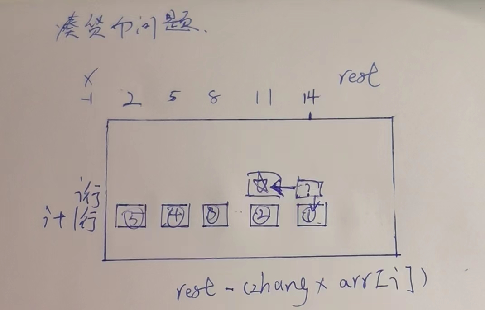

从图上看,⭐️位置,是不是也是依赖2345号格子

那,?号位置,是不是相当于⭐️+1号格子呢,是不是可以用⭐️给那个for替换掉呢.

```java
public static int dp2(int[] arr, int aim) {
   if (arr == null || arr.length == 0 || aim < 0) {
      return 0;
   }
   int N = arr.length;
   int[][] dp = new int[N + 1][aim + 1];
   dp[N][0] = 1;
   for (int index = N - 1; index >= 0; index--) {
      for (int rest = 0; rest <= aim; rest++) {
        //下面位置
         dp[index][rest] = dp[index + 1][rest];
        //左边位置存在
         if (rest - arr[index] >= 0) {
           //那就依赖下面,左边,也就是下+左
            dp[index][rest] += dp[index][rest - arr[index]];
         }
      }
   }
   return dp[0][aim];
}
```

### 凑货币问题-值重复认为货币相同

> arr是货币数组，其中的值都是正数。再给定一个正数aim。
> 每个值都认为是一张货币，
> 认为值相同的货币没有任何不同，
> 返回组成aim的方法数
> 例如：arr = {1,2,1,1,2,1,2}，aim = 4
> 方法：1+1+1+1、1+1+2、2+2
> 一共就3种方法，所以返回3

注意,这个题说的是,如果值相同,货币认为相同,例如下标,012凑得4,和下标123凑得4是重复的,算1种,和第二题不同,第二题这种情况算2种.

#### 词频统计.

需要先 知道每种价值货币有多少张,和上一题的区别就是,他的同一个价值的货币是有限的,不能减到负数以下.

```java
//词频统计,看看每种价值的币有多少张
public static class Info {
   public int[] coins;
   public int[] zhangs;

   public Info(int[] c, int[] z) {
      coins = c;
      zhangs = z;
   }
}
public static Info getInfo(int[] arr) {
		HashMap<Integer, Integer> counts = new HashMap<>();
		for (int value : arr) {
			if (!counts.containsKey(value)) {
				counts.put(value, 1);
			} else {
				counts.put(value, counts.get(value) + 1);
			}
		}
		int N = counts.size();
		int[] coins = new int[N];
		int[] zhangs = new int[N];
		int index = 0;
		for (Entry<Integer, Integer> entry : counts.entrySet()) {
			coins[index] = entry.getKey();
			zhangs[index++] = entry.getValue();
		}
		return new Info(coins, zhangs);
	}
```

#### 暴力方法

```java
//主方法
public static int coinsWay(int[] arr, int aim) {
   if (arr == null || arr.length == 0 || aim < 0) {
      return 0;
   }
  //词频统计
   Info info = getInfo(arr);
  //开始调用
   return process(info.coins, info.zhangs, 0, aim);
}

// coins 面值数组，正数且去重
// zhangs 每种面值对应的张数
public static int process(int[] coins, int[] zhangs, int index, int rest) {
  //没钱了,是不是正好凑够了,是就是一种方法,否则凑失败了.
   if (index == coins.length) {
      return rest == 0 ? 1 : 0;
   }
   int ways = 0;
  //从我当前价值货币用0张开始,只要没凑爆了目标值,且张数够,zhang是当前用到了第几张,zhangs[index]是当前号货币共有多少张,
   for (int zhang = 0; zhang * coins[index] <= rest && zhang <= zhangs[index]; zhang++) {
      ways += process(coins, zhangs, index + 1, rest - (zhang * coins[index]));
   }
   return ways;
}
```

#### 动态规划1

```java
public static int dp1(int[] arr, int aim) {
   if (arr == null || arr.length == 0 || aim < 0) {
      return 0;
   }
   Info info = getInfo(arr);
   int[] coins = info.coins;
   int[] zhangs = info.zhangs;
   int N = coins.length;
  //两个可变参数,1,货币当前index,可以到coins.length,所以准备N+1个,2.目标金额,0到凑够,所以准备aim+1个,
   int[][] dp = new int[N + 1][aim + 1];
  //base case 当货币到最后一张时,aim == 0 时, 为1,否则都为0,不用管.
   dp[N][0] = 1;
  //N行填完了,看普遍位置,依赖N+1,依赖后面的格子,所以从后往前填,从N-1往前
  //rest依赖rest - (zhang * coins[index]),依赖前面的格子,所以从前往后,
   for (int index = N - 1; index >= 0; index--) {
      for (int rest = 0; rest <= aim; rest++) {
         int ways = 0;
        //直接抄过来.
         for (int zhang = 0; zhang * coins[index] <= rest && zhang <= zhangs[index]; zhang++) {
            ways += dp[index + 1][rest - (zhang * coins[index])];
         }
         dp[index][rest] = ways;
      }
   }
   return dp[0][aim];
}
```

#### 动态规划2-严格位置依赖.

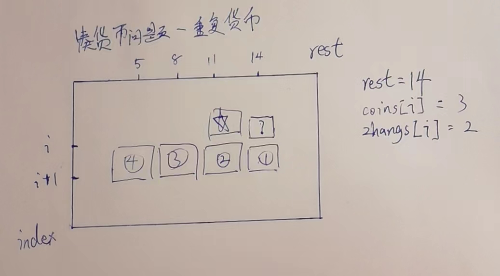

分析:

1.?位置的格子,由于他只有2张面值为3的货币,所以,他只依赖,012,号格子,0张,1张,2张.

2.那么⭐️号格子呢,他也只有2张面值为3的货币,所以,他只依赖,2,3,4号格子,0张,1张,2张.

所以,?位置的格子,是不是相当于依赖⭐️格子+1号格子,但是,多了个4号格子,所以需要减去4号格子.分析一下他们的位置.

- 1号格子,`dp[i+1][rest]`,
- ⭐️号格子,`dp[i][rest-coins[i]]`
- 4号格子,`dp[i+1][rest - ((zhang[i] + 1) * coins[i])]`,什么加一了,加一是指我当前张数外下一张的位置,也就是4号格子的位置

普遍来说,?位置=⭐️位置+1号位置-4号位置.

这里有个坑!就是讨论的都是所有格子都存在的时候,如果货币有非常多呢,一直依赖到负数区了呢?如图

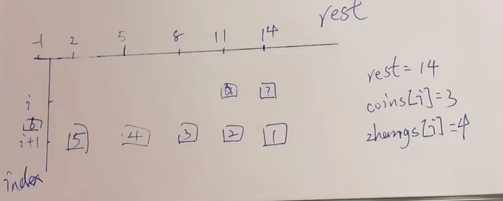

?位置所依赖的4张,所以理论依赖1-5号格子(下标0-4)

⭐️位置依赖的也是4张,理论2-6号格子,可是,6号格子都在负数区,他根本不存在,⭐️依赖的也是2345,

这个时候就不要减去了,所以同理,上面的减去4号格子操作,要保证⭐️不越界,也就是4号格子存在的情况下才需要减掉.

```java
//就是全用上,还没凑够,还是大于0的,没到负数区,这时候才需要减掉.
rest - coins[index] * (zhangs[index] + 1) >= 0
```

```java
public static int dp2(int[] arr, int aim) {
   if (arr == null || arr.length == 0 || aim < 0) {
      return 0;
   }
   Info info = getInfo(arr);
   int[] coins = info.coins;
   int[] zhangs = info.zhangs;
   int N = coins.length;
   int[][] dp = new int[N + 1][aim + 1];
   dp[N][0] = 1;
   for (int index = N - 1; index >= 0; index--) {
      for (int rest = 0; rest <= aim; rest++) {
        //我先让我依赖我下面的格子,我肯定依赖他
         dp[index][rest] = dp[index + 1][rest];
        //我左边如果有,我把我左边的加上
         if (rest - coins[index] >= 0) {
            dp[index][rest] += dp[index][rest - coins[index]];
         }
        //如果⭐️的依赖的极限位置不越界,那么我就减去那个极限位置,也就是依赖的最左边的格子.
         if (rest - coins[index] * (zhangs[index] + 1) >= 0) {
            dp[index][rest] -= dp[index + 1][rest - coins[index] * (zhangs[index] + 1)];
         }
      }
   }
   return dp[0][aim];
}
```

### Bob醉汉存活概率问题

> 给定5个参数，N，M，row，col，k
> 表示在N*M的区域上，醉汉Bob初始在(row,col)位置
> Bob一共要迈出k步，且每步都会等概率向上下左右四个方向走一个单位
> 任何时候Bob只要离开N*M的区域，就直接死亡
> 返回k步之后，Bob还在N*M的区域的概率

求概率,就是成功方法数/总方法数,除法,那肯定不能是整数了.

总概率:4个方向,走k步,就是每走一步,又是4种选择,所以是4^k

那我们再求一个存活的方法数就行了,跟跳马一个样.

#### 暴力方法

```java
public static double livePosibility1(int row, int col, int k, int N, int M) {
   return (double) process(row, col, k, N, M) / Math.pow(4, k);
}

// 目前在row，col位置，还有rest步要走，走完了如果还在棋盘中就获得1个生存点，返回总的生存点数
public static long process(int row, int col, int rest, int N, int M) {
  //所有超出盘的走法都在这返回了,代表失败.
   if (row < 0 || row == N || col < 0 || col == M) {
      return 0;
   }
   // 还在棋盘中！一种方法数
   if (rest == 0) {
      return 1;
   }
   // 还在棋盘中！还有步数要走
   long up = process(row - 1, col, rest - 1, N, M);
   long down = process(row + 1, col, rest - 1, N, M);
   long left = process(row, col - 1, rest - 1, N, M);
   long right = process(row, col + 1, rest - 1, N, M);
   return up + down + left + right;
}
```

#### 动态规划

分析可变参数,3个,当前位置row,col,剩余步数rest.根据暴力,走不到边界,但是rest为0-rest,所以范围

`int[N][M][rest+1]`

```java
public static double livePosibility2(int row, int col, int k, int N, int M) {
   long[][][] dp = new long[N][M][k + 1];
  //base case.第一层,全都是1,(走0步,百分比存活)
   for (int i = 0; i < N; i++) {
      for (int j = 0; j < M; j++) {
         dp[i][j][0] = 1;
      }
   }
  //从第一层开始填.依赖下面的层
   for (int rest = 1; rest <= k; rest++) {
      for (int r = 0; r < N; r++) {
         for (int c = 0; c < M; c++) {
           //直接抄
            dp[r][c][rest] = pick(dp, N, M, r - 1, c, rest - 1);
            dp[r][c][rest] += pick(dp, N, M, r + 1, c, rest - 1);
            dp[r][c][rest] += pick(dp, N, M, r, c - 1, rest - 1);
            dp[r][c][rest] += pick(dp, N, M, r, c + 1, rest - 1);
         }
      }
   }
   return (double) dp[row][col][k] / Math.pow(4, k);
}

//同样的格子取值问题,防止负数越界.
public static long pick(long[][][] dp, int N, int M, int r, int c, int rest) {
   if (r < 0 || r == N || c < 0 || c == M) {
      return 0;
   }
   return dp[r][c][rest];
}
```

## 暴力递归到动态规划(五)

### 砍怪兽问题

> 给定3个参数，N，M，K
> 怪兽有N滴血，等着英雄来砍自己
> 英雄每一次打击，都会让怪兽流失[0~M]的血量
> 到底流失多少？每一次在[0~M]上等概率的获得一个值
> 求K次打击之后，英雄把怪兽砍死的概率

又是概率,所以概率=砍死方法数/总情况数(M+1)^K

#### 暴力方法

```java
public static double right(int N, int M, int K) {
   if (N < 1 || M < 1 || K < 1) {
      return 0;
   }
  //总的方法数
   long all = (long) Math.pow(M + 1, K);
  //砍死方法数
   long kill = process(K, M, N);
   return (double) ((double) kill / (double) all);
}

// 怪兽还剩hp点血
// 每次的伤害在[0~M]范围上
// 还有times次可以砍
// 返回砍死的情况数！
public static long process(int times, int M, int hp) {
  //砍完了,
   if (times == 0) {
     //血量<=0,砍死了,是1种方法数,否则0种,
      return hp <= 0 ? 1 : 0;
   }
  //没砍玩,接着砍,但是只有没血了,也要返回成功方法数而且是一定成功,根据公式,就是(long) Math.pow(M + 1, times)次.
   if (hp <= 0) {
      return (long) Math.pow(M + 1, times);
   }
  //也没砍死,掉血,继续砍,
   long ways = 0;
   for (int i = 0; i <= M; i++) {
      ways += process(times - 1, M, hp - i);
   }
   return ways;
}
```

#### 动态规划1

两个可变参数,剩余血量,剩余刀数

```java
public static double dp1(int N, int M, int K) {
   if (N < 1 || M < 1 || K < 1) {
      return 0;
   }
   long all = (long) Math.pow(M + 1, K);
   long[][] dp = new long[K + 1][N + 1];
  //根据base case,没刀没血时候,方法数是1.
   dp[0][0] = 1;
  //剩余刀呢,还得接着砍
   for (int times = 1; times <= K; times++) {
     //只要剩下的刀,没血了,就是(long) Math.pow(M + 1, times);种方法数.
      dp[times][0] = (long) Math.pow(M + 1, times);
     //如果血量>0,那单算
      for (int hp = 1; hp <= N; hp++) {
        //里面的直接抄,如果当前这刀直接砍死了,那就是直接公式拿成功数,否则继续掉血,下一刀
         long ways = 0;
         for (int i = 0; i <= M; i++) {
            if (hp - i >= 0) {
               ways += dp[times - 1][hp - i];
            } else {
               ways += (long) Math.pow(M + 1, times - 1);
            }
         }
         dp[times][hp] = ways;
      }
   }
   long kill = dp[K][N];
   return (double) ((double) kill / (double) all);
}
```

#### 动态规划2-省去枚举

这个和凑硬币,值重复认为货币相同那个题是一样的.

```java
public static double dp3(int N, int M, int K) {
   if (N < 1 || M < 1 || K < 1) {
      return 0;
   }
   long all = (long) Math.pow(M + 1, K);
   long[][] dp = new long[K + 1][N + 1];
   dp[0][0] = 1;
   for (int times = 1; times <= K; times++) {
      dp[times][0] = (long) Math.pow(M + 1, times);
      for (int hp = 1; hp <= N; hp++) {
         //先依赖上面的格子
         dp[times][hp] = dp[times - 1][hp] + dp[times][hp - 1];
         //如果血量低于或等于0了,直接减去公式数
         if (hp - M - 1 <= 0) {
            dp[times][hp] -= Math.pow(M + 1, times - 1);
           //否则就是血量够,能抗住这次攻击,
         } else {
            //否则减去多余的格子的值
            dp[times][hp] -= dp[times - 1][hp - M - 1];
         }
      }
   }
   long kill = dp[K][N];
   return (double) ((double) kill / (double) all);
}
```

### 凑货币问题-无限张最小张数问题.

> arr是面值数组，其中的值都是正数且没有重复。再给定一个正数aim。
> 每个值都认为是一种面值，且认为张数是无限的。
> 返回组成aim的最少货币数

#### 暴力方法

```java
public static int minCoins(int[] arr, int aim) {
   return process(arr, 0, aim);
}

// arr[index...]面值，每种面值张数自由选择，
// 搞出rest正好这么多钱，返回最小张数
// 拿Integer.MAX_VALUE标记怎么都搞定不了
public static int process(int[] arr, int index, int rest) {
  //大致思路一样,没有货币了,是不是正好凑够了,凑够了,说明不在需要了,返回0,否则需要无限张,代表怎么都凑不够
   if (index == arr.length) {
      return rest == 0 ? 0 : Integer.MAX_VALUE;
   } else {
     //默认凑不够,如果能凑够,看看最小需要多少张,所以是个当前货币用多少张,取最小值题
     //不是返回方法数,是每种能成功的方法需要的最小张数问题!!!!!!!!
      int ans = Integer.MAX_VALUE;
     //从当前0张开始凑,只要不凑超了,就一张张加
      for (int zhang = 0; zhang * arr[index] <= rest; zhang++) {
        //当前用了zhang这么多张,后面的凑够需要多少张,取个最小值.
         int next = process(arr, index + 1, rest - zhang * arr[index]);
         if (next != Integer.MAX_VALUE) {
            ans = Math.min(ans, zhang + next);
         }
      }
      return ans;
   }
}
```

动态规划1-带枚举

```java
public static int dp1(int[] arr, int aim) {
   if (aim == 0) {
      return 0;
   }
   int N = arr.length;
  //两个可变参数,index和rest(aim)
   int[][] dp = new int[N + 1][aim + 1];
  //base case index == length; rest == 0,返回0,
   dp[N][0] = 0;
  //剩余的都是系统最大.0算过了,从1开始.
   for (int j = 1; j <= aim; j++) {
      dp[N][j] = Integer.MAX_VALUE;
   }
  //普遍位置依赖
  //N行填完了,从N-1行开始,从下往上,从左往右开始.
   for (int index = N - 1; index >= 0; index--) {
      for (int rest = 0; rest <= aim; rest++) {
        //枚举过程,直接抄.
         int ans = Integer.MAX_VALUE;
         for (int zhang = 0; zhang * arr[index] <= rest; zhang++) {
            int next = dp[index + 1][rest - zhang * arr[index]];
            if (next != Integer.MAX_VALUE) {
               ans = Math.min(ans, zhang + next);
            }
         }
         dp[index][rest] = ans;
      }
   }
   return dp[0][aim];
}
```

#### 动态规划2-严格位置依赖

我们看下,普遍位置

?位置依赖的a位置值+0张因为一张没用,b位置值+1张因为用了一张,c位置值+2张因为用了两张,......一直到数组越界.从这些值里面取个最小值.

插一句,为什么找他左边的格子,因为我是从下往上,从左往右的,我依赖左下,且我左下一定有了.

那么他左边⭐️位置,是谁呢,b位置值+0张因为一张没用,c位置值+1张因为用了一张,d位置+2,e位置+3......一直到数组越界.从这些值里面取个最小值.

所以,再看下?号位置,是不是就是⭐️位置+a位置再+1张,因为?位置依赖的是比⭐️的每个位置的多一张的,

也就是`aim - arr[index]] + 1`

所以思路就是,先让我?位置等于下面位置,如果有我左边位置,且左边是个有效位置,那么跟我左边(+1)比比大小,取小的.

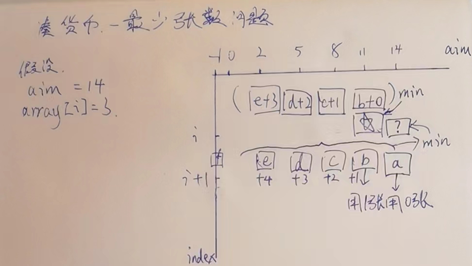

```java
public static int dp2(int[] arr, int aim) {
   if (aim == 0) {
      return 0;
   }
   int N = arr.length;
   int[][] dp = new int[N + 1][aim + 1];
   dp[N][0] = 0;
   for (int j = 1; j <= aim; j++) {
      dp[N][j] = Integer.MAX_VALUE;
   }
   for (int index = N - 1; index >= 0; index--) {
      for (int rest = 0; rest <= aim; rest++) {
         dp[index][rest] = dp[index + 1][rest];
         if (rest - arr[index] >= 0 
               && dp[index][rest - arr[index]] != Integer.MAX_VALUE) {
            dp[index][rest] = Math.min(dp[index][rest], dp[index][rest - arr[index]] + 1);
         }
      }
   }
   return dp[0][aim];
```


### 整数裂开问题

> 给定一个正数n，求n的裂开方法数，
> 规定：后面的数不能比前面的数小
> 比如4的裂开方法有：
> 1+1+1+1、1+1+2、1+3、2+2、4
> 5种，所以返回5

#### 暴力方法.

```java
// n为正数
public static int ways(int n) {
   if (n < 0) {
      return 0;
   }
   if (n == 1) {
      return 1;
   }
   return process(1, n);
}

// 上一个拆出来的数是pre
// 还剩rest需要去拆
// 返回拆解的方法数
public static int process(int pre, int rest) {
  //pre == rest的时候,下一次进来,rest就是0
   if (rest == 0) {
      return 1;
   }
  //已经前一个比剩下的数大了,分裂错了,返回0种分裂法.
   if (pre > rest) {
      return 0;
   }
   int ways = 0;
  //从前一个数的大小开始,一直试到rest大小,累加所有成功方法数.
   for (int first = pre; first <= rest; first++) {
      ways += process(first, rest - first);
   }
   return ways;
}
```

#### 动态规划1-有枚举,

```java
public static int dp1(int n) {
   if (n < 0) {
      return 0;
   }
   if (n == 1) {
      return 1;
   }
  //两个可变参数,pre,rest,都是0~N范围,所以准备N+1.
   int[][] dp = new int[n + 1][n + 1];
  //base case 
   for (int pre = 1; pre <= n; pre++) {
      dp[pre][0] = 1;
      dp[pre][pre] = 1;
   }
   for (int pre = n - 1; pre >= 1; pre--) {
      for (int rest = pre + 1; rest <= n; rest++) {
        //普遍位置,直接抄过来.
         int ways = 0;
         for (int first = pre; first <= rest; first++) {
            ways += dp[first][rest - first];
         }
         dp[pre][rest] = ways;
      }
   }
   return dp[1][n];
}
```

#### 动态规划2-省枚举

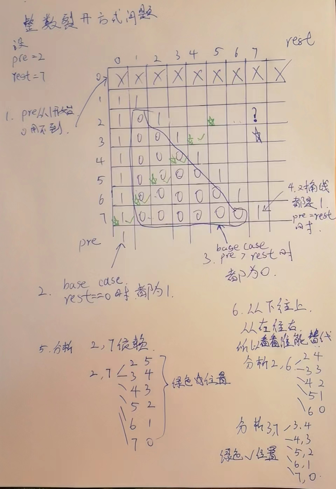

经过上面的分析,我们发现下面的⭐️位置可以替代除了左边的其他位置,所以,

下面⭐️ =`dp[pre+1][rest]`,

左侧没覆盖的绿色⭐️=`dp[pre][rest-pre]`

所以,?位置=`dp[pre+1][rest]`+`dp[pre][rest-pre]`

```java
public static int dp2(int n) {
   if (n < 0) {
      return 0;
   }
   if (n == 1) {
      return 1;
   }
   int[][] dp = new int[n + 1][n + 1];
   for (int pre = 1; pre <= n; pre++) {
      dp[pre][0] = 1;
      dp[pre][pre] = 1;
   }
   for (int pre = n - 1; pre >= 1; pre--) {
      for (int rest = pre + 1; rest <= n; rest++) {
         dp[pre][rest] = dp[pre + 1][rest];
         dp[pre][rest] += dp[pre][rest - pre];
      }
   }
   return dp[1][n];
}
```

## 暴力递归到动态规划(六)

### 一个整数数组拆分组成2个尽量接近累加和问题

> 给定一个正数数组arr，
> 请把arr中所有的数分成两个集合，尽量让两个集合的累加和接近
> 返回：
> 最接近的情况下，较小集合的累加和

这就是一个背包问题.要还是不要,返回接近总值一半的最大可能的结果.

#### 暴力方法.

```java
public static int right(int[] arr) {
   if (arr == null || arr.length < 2) {
      return 0;
   }
   int sum = 0;
   for (int num : arr) {
      sum += num;
   }
  //凑一半值嘛.就是尽可能接近
   return process(arr, 0, sum / 2);
}

// arr[i...]可以自由选择，请返回累加和尽量接近rest，但不能超过rest的情况下，最接近的累加和是多少？
public static int process(int[] arr, int i, int rest) {
  //没数了那肯定是返回0
   if (i == arr.length) {
      return 0;
   } else { // 还有数，arr[i]这个数
      // 可能性1，不使用arr[i]
      int p1 = process(arr, i + 1, rest);
      // 可能性2，要使用arr[i]
      int p2 = 0;
      if (arr[i] <= rest) {
         p2 = arr[i] + process(arr, i + 1, rest - arr[i]);
      }
     //返回两种选择,最接近那个,所以是max
      return Math.max(p1, p2);
   }
}
```

#### 动态规划

两个可变参数,i,rest(0~sum/2),

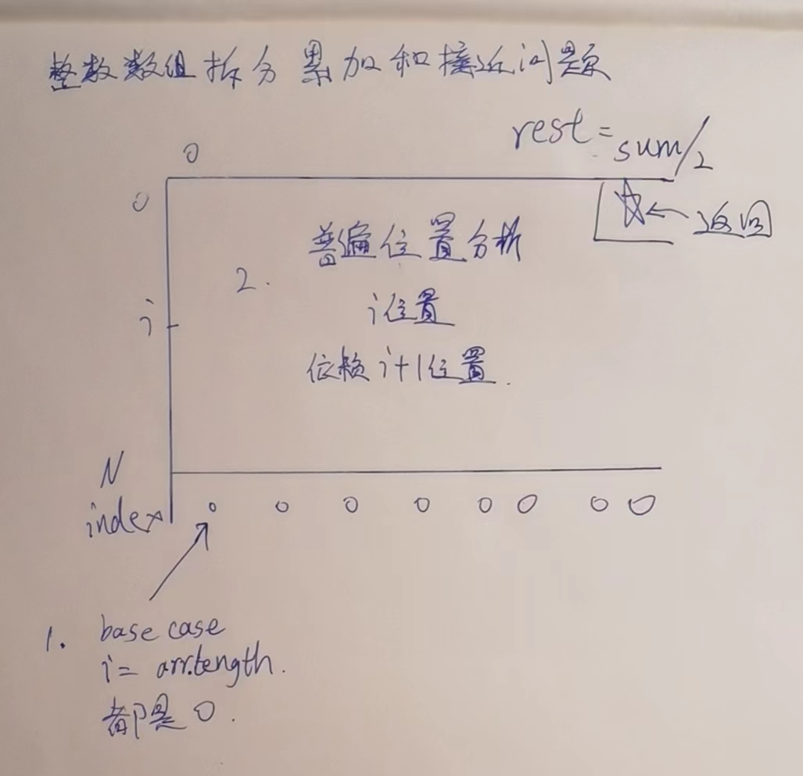

N行位置填好了,又依赖i+1行,所以,从下往上,从左往右,

```java
public static int dp(int[] arr) {
   if (arr == null || arr.length < 2) {
      return 0;
   }
   int sum = 0;
   for (int num : arr) {
      sum += num;
   }
   sum /= 2;
   int N = arr.length;
   int[][] dp = new int[N + 1][sum + 1];
   for (int i = N - 1; i >= 0; i--) {
      for (int rest = 0; rest <= sum; rest++) {
         // 可能性1，不使用arr[i]
         int p1 = dp[i + 1][rest];
         // 可能性2，要使用arr[i]
         int p2 = 0;
         if (arr[i] <= rest) {
            p2 = arr[i] + dp[i + 1][rest - arr[i]];
         }
         dp[i][rest] = Math.max(p1, p2);
      }
   }
   return dp[0][sum];
}
```

### 一个整数数组拆分组成2个尽量接近累加和问题-两个数组一样长(21年字节原题)

> 给定一个正数数组arr，请把arr中所有的数分成两个集合
> 如果arr长度为偶数，两个集合包含数的个数要一样多
> 如果arr长度为奇数，两个集合包含数的个数必须只差一个
> 请尽量让两个集合的累加和接近
> 返回：
> 最接近的情况下，较小集合的累加和

一样的问题,只是多了一个限制,我必须得选够多少个数,多一个少一个都不行.就是多了一个参数,(一个维度)

#### (arr.length & 1) == 0 区分奇数偶数

```java
public static int right(int[] arr) {
   if (arr == null || arr.length < 2) {
      return 0;
   }
   int sum = 0;
   for (int num : arr) {
      sum += num;
   }
  //主方法区分奇数还是偶数,
   if ((arr.length & 1) == 0) {
      return process(arr, 0, arr.length / 2, sum / 2);
   } else {
     //如果是技术,我看看多一个可以凑得更接近一半,还是偶数可以凑得更接近一半
      return Math.max(process(arr, 0, arr.length / 2, sum / 2), process(arr, 0, arr.length / 2 + 1, sum / 2));
   }
}

// arr[i....]自由选择，挑选的个数一定要是picks个，累加和<=rest, 离rest最近的返回
public static int process(int[] arr, int i, int picks, int rest) {
   if (i == arr.length) {
     //如果还有数没挑呢,说明这种分法不行,返回-1种.
      return picks == 0 ? 0 : -1;
   } else {
     //不用当前的
      int p1 = process(arr, i + 1, picks, rest);
      // 就是要使用arr[i]这个数
      int p2 = -1;
      int next = -1;
     //第二种情况存在,
      if (arr[i] <= rest) {
        //第二种情况能行,
         next = process(arr, i + 1, picks - 1, rest - arr[i]);
      }
     //第二种情况能行,
      if (next != -1) {
         p2 = arr[i] + next;
      }
     //返回更接近的那个方法
      return Math.max(p1, p2);
   }
}
```

#### 动态规划1.

#### tips:向上取整:(i+1)/2

先+1再÷2,就可以做到向上取整,例如(4+1)/2=2. (5+1)/2=3

```java
public static int dp(int[] arr) {
   if (arr == null || arr.length < 2) {
      return 0;
   }
   int sum = 0;
   for (int num : arr) {
      sum += num;
   }
  //从这往上,跟暴力一毛一样
   sum /= 2;
   int N = arr.length;
   int M = (N + 1) / 2;
   int[][][] dp = new int[N + 1][M + 1][sum + 1];
  //所有格子初始化为-1,
   for (int i = 0; i <= N; i++) {
      for (int j = 0; j <= M; j++) {
         for (int k = 0; k <= sum; k++) {
            dp[i][j][k] = -1;
         }
      }
   }
  //base case 
  //i == N时picks == 0 则为0,无论rest是多少.
   for (int rest = 0; rest <= sum; rest++) {
      dp[N][0][rest] = 0;
   }
  //普遍位置依赖.
  //N填好了,从N-1开始.
   for (int i = N - 1; i >= 0; i--) {
      for (int picks = 0; picks <= M; picks++) {
         for (int rest = 0; rest <= sum; rest++) {
           //直接抄暴力方法,换成dp取值
            int p1 = dp[i + 1][picks][rest];
            // 就是要使用arr[i]这个数
            int p2 = -1;
            int next = -1;
            if (picks - 1 >= 0 && arr[i] <= rest) {
               next = dp[i + 1][picks - 1][rest - arr[i]];
            }
            if (next != -1) {
               p2 = arr[i] + next;
            }
            dp[i][picks][rest] = Math.max(p1, p2);
         }
      }
   }
  
  
  //从这往下,都是直接改从表取,跟暴力一毛一样
   if ((arr.length & 1) == 0) {
      return dp[0][arr.length / 2][sum];
   } else {
      return Math.max(dp[0][arr.length / 2][sum], dp[0][(arr.length / 2) + 1][sum]);
   }
}
```

## 动态规划总结

### 什么暴力递归可以继续优化

1. 有重复调用同一个子问题的解,这种递归可以优化.
2. 如果每一个子问题都是不同的解,无法优化也不用优化.

### 暴力递归和动态规划的关系

某个暴力递归,有解的重复调用,就可以把他优化成动态规划

任何动态规划问题,都一定对应着某个有重复过程的暴力递归

但不是所有的暴力递归,都一定对应着动态规划.--N皇后问题

### 如何找到某个问题的动态规划方式

1. 设计暴力递归:重要原则+4种常见的尝试模型,!!重点.核心点,找到这个萌发的种子--尝试!!!
2. 分析有没有重复解:套路解决,有就能动态规划.
3. 改记忆化搜索,->推出严格表结构实现动态规划:套路解决
   1. 分析记忆化分析这个表
   2. 可变参数画多大,
   3. 普遍位置怎么依赖
   4. basecase怎么填
   5. 最重要的位置是哪一个
   6. 得到严格表依赖的解--解决枚举的
4. 看看能否继续优化,套路解决

### 面试中涉及暴力递归的原则

1. 每一个可变参数的类型,一定不要突破到整型以上
   1. 一个可变参数就是一维的,两个就是二维的,三个就是三维的,但是,一定不要让某个参数更复杂,突破整型,例如f(int[] a,int b),竟然有个参数是数组的,这个概率绝对低于5%,而且爆难,面试场上不会出现这么难的.马上放弃这种猜法,换下一种.
   2. 原则1可以违反,但是,确保单一可变参数,
      1. 贴纸问题,哪个f(String)
   3. 如果,违反了原则1,不违反原则2,只需要做到记忆化搜索即可,无需再优化
   4. 可变参数的个数,能少则少.
      1. 有个玄变串的题,样本对应的,L1,L2,R1,R2,就是4个参数,然后省到3个,L1,L2,N

### 知道了面试中设计暴力递归过程的原则,然后呢?

1. 一定要逼迫自己,找到不违反原则的情况下进行暴力尝试.
2. 如果你找到暴力尝试,不符合原则,马上舍弃,找新的.千奇百怪的尝试方法,一定要遵循原则.
3. 如果某个题目突破了设计原则,一定极难极难,概率低于5%.

### 常见的四种尝试模型

1. 从左到右的尝试模型-- i位置 要或者不要
2. 范围尝试模型-- 从小的一段推出整段来
3. 样本对应模型 -- 一般看到两个字符串怎么怎么样,就是这个了,两个字符串的某段对应下返回true.false这种.
4. 业务限制类尝试模型.

### 如何分析有没有重复解

找一个具体的例子,只要找到一个重复解,那就是有利可图,就可以改

### 暴力递归到动态规划的总套路

1. 你已经找到了一个不违反原则的暴力递归过程,而且确定存在解的重复调用,--种子,找到了!
2. 找到哪些参数的变化会影响返回值,对每个参数列出变化范围.
3. 参数间的所有组合数量,意味着表大小
4. 记忆化搜索的方法就是傻缓存,非常容易得到
5. 规定好严格表的大小,分析位置的依赖顺序,然后从基础填写到最终解.从下往上,从左往右这种.
6. 对于有枚举行为的决策过程,可以进一步优化.

### 动态规划进一步优化方法

1. 空间压缩
2. 状态化简
3. 四边形不等式--体系班40-41,干死谷歌80%面试官的难度.
4. 其他优化技巧
