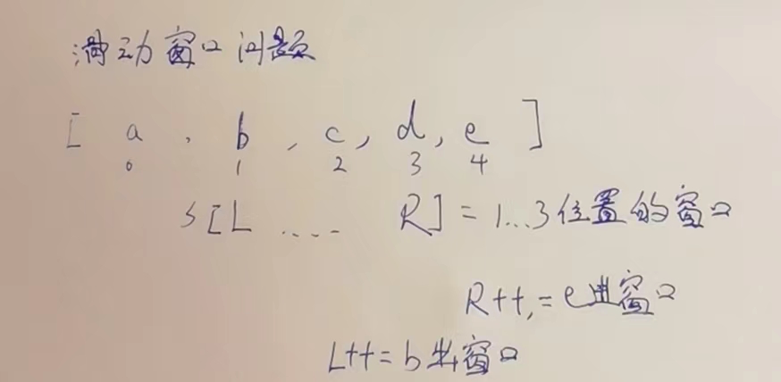
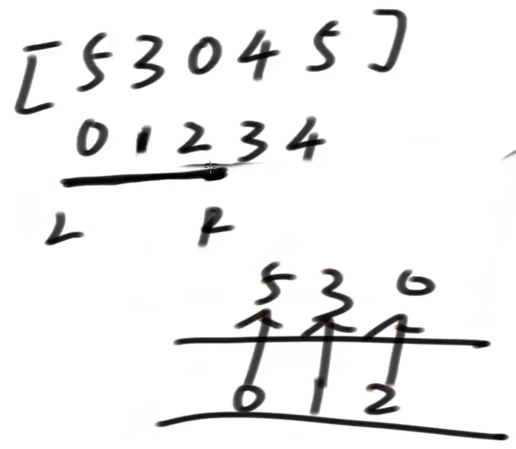
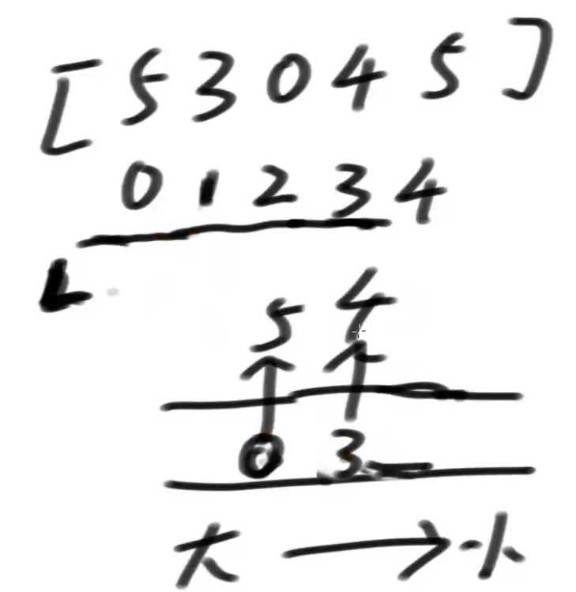
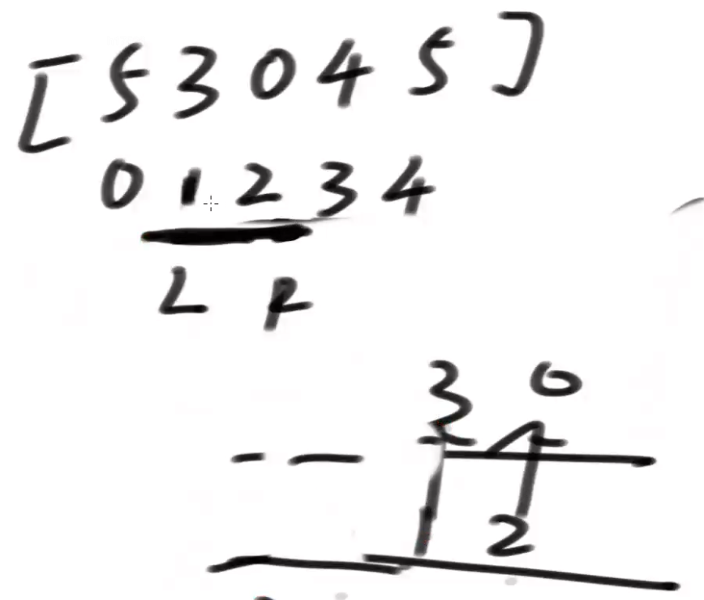
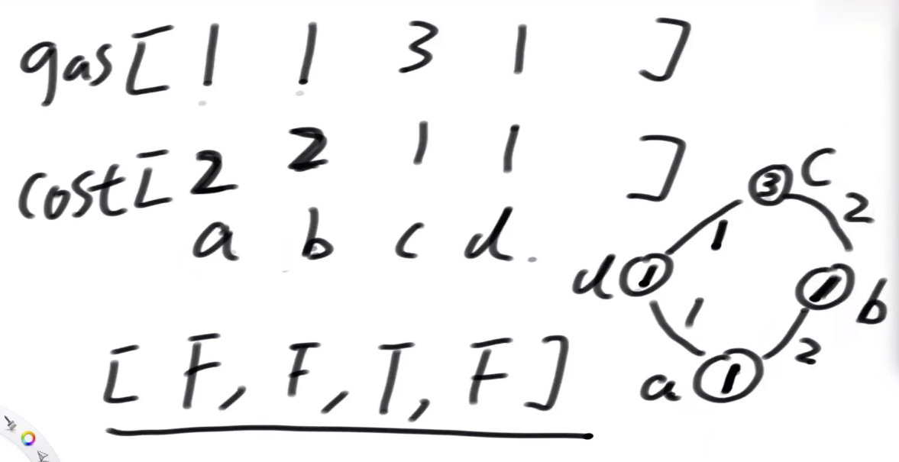

# 滑动窗口内最大值或最小值问题

### 滑动窗口是什么？

滑动窗口是一种想象出来的数据结构：

滑动窗口有左边界L和有边界R

在数组或者字符串或者一个序列上，记为S，窗口就是S[L..R]这一部分

L往右滑意味着一个样本出了窗口，R往右滑意味着一个样本进了窗口

L和R都只能往右滑

我想知道,任何时刻,不论L,R移动到什么时候,窗口是什么,此时,窗口内最大值或最小值是多少.



### 滑动窗口是想干啥,他的意义是啥?

如果此时让窗口依次缩小,哪些位置的数会成为窗口内的最大(或最小)值

### 滑动窗口最大值如何实现?

搞一个双端队列.  

R往右扩,当一个数进窗口的时候,从双端队列右侧进,进之前,将所有比他小的,全部踢出去,再也不找回来了,严格按照由大到小的位置放,



为什么可以踢走就不管了,因为R不能回退,L只能右扩缩小窗口,而后面的数一定后过期,所以**如果后面的数比前面的大,还留着前面的干嘛呢**?



<font color="red" >窗口任何时候,双端队列头部的值就是当前窗口内的最大值</font>,例如上图就是5,

L右扩,0位置的5出窗口,1位置的3就是此时最大值



### 时间复杂度

总代价:O(N)

假设LR滑过所有的数字,所有的数最多进一次,出1次.所以均摊总代价.O(N)

### 经典题目1-98年微软

> 假设一个固定大小为W的窗口，依次划过arr，
> 返回每一次滑出状况的最大值
> 例如，arr = [4,3,5,4,3,3,6,7], W = 3
> 返回：[5,5,5,4,6,7]

#### 暴力解

每次都遍历一遍,找到最大值.

```java
// 暴力的对数器方法
public static int[] right(int[] arr, int w) {
   if (arr == null || w < 1 || arr.length < w) {
      return null;
   }
   int N = arr.length;
   int[] res = new int[N - w + 1];
   int index = 0;
   int L = 0;
   int R = w - 1;
   while (R < N) {
      int max = arr[L];
      for (int i = L + 1; i <= R; i++) {
         max = Math.max(max, arr[i]);

      }
      res[index++] = max;
      L++;
      R++;
   }
   return res;
}
```

滑动窗口解:

```java
public static int[] getMaxWindow(int[] arr, int w) {
   if (arr == null || w < 1 || arr.length < w) {
      return null;
   }
   // qmax 窗口最大值的更新结构
   // 结构里放下标
   LinkedList<Integer> qmax = new LinkedList<Integer>();
   int[] res = new int[arr.length - w + 1];
   int index = 0;
  //R从0开始,一直滑到最后,期间如果凑够了一个窗口,L跟着一起往右滑,直到滑完一遍.
   for (int R = 0; R < arr.length; R++) {
     //如果不为空且最后一个数<=要进来的数,一直弹,弹空为止.
      while (!qmax.isEmpty() && arr[qmax.peekLast()] <= arr[R]) {
         qmax.pollLast();
      }
     //从队尾加入
      qmax.addLast(R);
     //队首的就是最大值,
     //R-w是L前一个的位置,看看队首位置是否过期了(滑出窗口)
      if (qmax.peekFirst() == R - w) {
        //如果过期,弹出队首
         qmax.pollFirst();
      }
     //凑够了一个窗口了,收集一个答案.
      if (R >= w - 1) {
         res[index++] = arr[qmax.peekFirst()];
      }
   }
   return res;
}
```

### 子数组达标问题

> 给定一个整型数组arr，和一个整数num
> 某个arr中的子数组sub，如果想达标，必须满足：
> sub中最大值 – sub中最小值 <= num，
> 返回arr中达标子数组的数量

#### 1.这个题有一个关键点,就是要认识到,如果一个L,,R范围上,满足max-min<=sum,那么L+1,,,,,R-1上任何一个子数组,都满足.

为什么,因为L,,,R范围上满足,期间的最大值不可能大于L,,R范围的最大值,否则L,,,R上的最大值就不是你得到那个了,并且期间的最小值同样大于L,,,R范围的最小值,那么期间的最大值(相对小)-期间最小值(相对大),一定小于L,,,R范围的max-min.例如10-2一定>=8-3

#### 2.那么假如一个L,,,R范围上满足了,他里面有多少个满足的子数组呢.全满足哦.

我们只计算他包含L这个值的,那就是L~R-1,L~R-2,L~R-3,L~R-4.....

#### 3.我们先让R一直往右扩,直到他不达标了停下.

这时候,这个大的L~R是满足条件的,我们能一下子算出其中符合2步骤的有多少子数组达标,R-L个.

#### 4.然后我们让L右扩,然后R继续右扩,扩到不达标停下,继续收集必须包含L的答案.

```java
public static int num(int[] arr, int sum) {
   if (arr == null || arr.length == 0 || sum < 0) {
      return 0;
   }
   int N = arr.length;
   int count = 0;
  //做2个双端队列,分别收集最大值和最小值.
   LinkedList<Integer> maxWindow = new LinkedList<>();
   LinkedList<Integer> minWindow = new LinkedList<>();
  //共享一个R,R不会回退
   int R = 0;
  //L从0位置开始
   for (int L = 0; L < N; L++) {
     //判断是否R走到头了,且没有被Break.
      while (R < N) {
        //滑动窗口处理最大值的双端队列
         while (!maxWindow.isEmpty() && arr[maxWindow.peekLast()] <= arr[R]) {
            maxWindow.pollLast();
         }
         maxWindow.addLast(R);
        //滑动窗口处理最小值的双端队列
         while (!minWindow.isEmpty() && arr[minWindow.peekLast()] >= arr[R]) {
            minWindow.pollLast();
         }
         minWindow.addLast(R);
        //是否不达标了,如果不达标了,就跳出去,
         if (arr[maxWindow.peekFirst()] - arr[minWindow.peekFirst()] > sum) {
            break;
           //否则R继续右扩.
         } else {
            R++;
         }
      }
     //跳出了上面的while,代表到头了,或者break了(当前L~R不达标了,但是L~R-1可是达标的哦),一次性收集答案.
      count += R - L;
     //判断最大,最小的滑动窗口队首位置是否过期,过期了要弹出.
      if (maxWindow.peekFirst() == L) {
         maxWindow.pollFirst();
      }
      if (minWindow.peekFirst() == L) {
         minWindow.pollFirst();
      }
   }
   return count;
}
```

#### 暴力对数器方法

```java
// 暴力的对数器方法
public static int right(int[] arr, int sum) {
   if (arr == null || arr.length == 0 || sum < 0) {
      return 0;
   }
   int N = arr.length;
   int count = 0;
  //收集每个子数组,然后再遍历找到最大,最小值
   for (int L = 0; L < N; L++) {
      for (int R = L; R < N; R++) {
         int max = arr[L];
         int min = arr[L];
         for (int i = L + 1; i <= R; i++) {
            max = Math.max(max, arr[i]);
            min = Math.min(min, arr[i]);
         }
         if (max - min <= sum) {
            count++;
         }
      }
   }
   return count;
}
```

### 加油站的良好出发点问题-这个题最优解在大厂刷题班

> 如图所示,给定2个数组,长度相同,代表当前油量和到下一个站的距离.只有是正数的时候,才能到下一个站,才能加到下一个站的油,问,从哪个加油站出发,能跑完一圈.



```java
/**
 * 准备一个2倍长的数组.为了让他从任何一个站出发,都能跑一圈,在数组上表示出来.
 * 这个数组,要做成一个前缀和数组,
 * @param g
 * @param c
 * @return
 */
public static boolean[] goodArray(int[] g, int[] c) {
   int N = g.length;
   int M = N << 1;
   //准备一个两倍长的数组,
   int[] arr = new int[M];
   //初始化,i+N是从最后链接到前面的循环
   for (int i = 0; i < N; i++) {
      arr[i] = g[i] - c[i];
      arr[i + N] = g[i] - c[i];
   }
   //制作前缀和
   for (int i = 1; i < M; i++) {
      arr[i] += arr[i - 1];
   }
   //制作一个双端队列,滑动窗口,这个求最小值
   //窗口多大?窗口就是所有站的个数,因为要保证跑完一圈,意思就是,这个一圈的窗口内,最小值都大于0,才能继续跑下去,
   LinkedList<Integer> w = new LinkedList<>();
   for (int i = 0; i < N; i++) {
      while (!w.isEmpty() && arr[w.peekLast()] >= arr[i]) {
         w.pollLast();
      }
      w.addLast(i);
   }
   boolean[] ans = new boolean[N];
   //这里有一个特殊的地方需要注意,那就是咱们的窗口是前缀和,所以,每次计算最小值的时候,要注意窗口内的值要减去窗口前第一个值,才是实际的值.
   //j = N:直接让窗口形成,offset = 0:从第一个开始,偏移量是0,然后带着这个窗口,挨个滑入,滑出,找到任何站点出发的时候,是否最小值>0.
   for (int offset = 0, i = 0, j = N; j < M; offset = arr[i++], j++) {
      if (arr[w.peekFirst()] - offset >= 0) {
         ans[i] = true;
      }
      //滑出窗口了
      if (w.peekFirst() == i) {
         w.pollFirst();
      }
      //滑入窗口了
      while (!w.isEmpty() && arr[w.peekLast()] >= arr[j]) {
         w.pollLast();
      }
      w.addLast(j);
   }
   return ans;
}
```