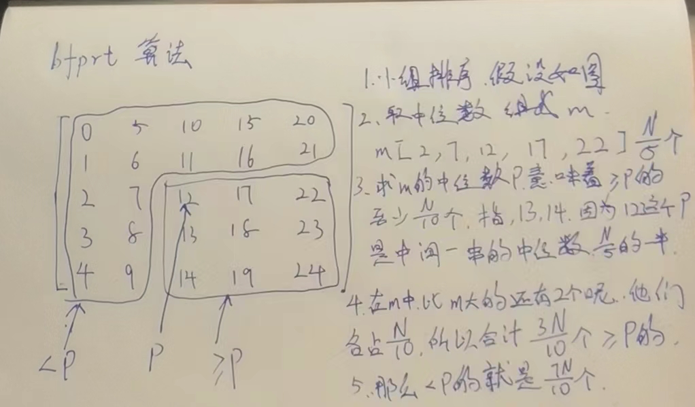

# bfprt算法

> 在无序数组中,找到第k小的数.这个是一个面试场上被问到比较多的问题

bfprt是五个人的名字

### 在无序数组中,找到第k小的数.

#### 暴力解

我们可以给整个数组排个序,然后找到第k小的数.

这种解法,我们知道基于比较的排序,最好就是可以做到O(N*logN).面试场上,只说基于比较的排序,不考虑那种桶排序的.

#### 比较优秀的解:

这种解法,虽然他很优秀,已经达到了最优解,但是千篇一律的回答可能会让面试官觉得无聊但是笔试足够好了(bfprt就是装逼的)

核心思想:改写快排的方法

我们知道,快排的思想就是荷兰国旗问题,

这道题的解法:随机选出一个数,等于的放中间,小于的放左边,大于放右边.左右不要求有序,这个过程,完全可以做到O(N).

我们假设300个数,我们求第100小的数,如果说,等于区的区间,恰好跨过100,我们是不是就找到了第100小的数,

如果没命中,假设等于区是200开始的,那是不是答案在左侧区啊,那我再随机选一个,然后再左边的数据中,做一次上面的荷兰国旗操作,如果跨过了100,找到了.

```java
// 改写快排，时间复杂度O(N)
	// k >= 1
	public static int minKth2(int[] array, int k) {
		int[] arr = copyArray(array);
		return process2(arr, 0, arr.length - 1, k - 1);
	}

// arr 第k小的数
// process2(arr, 0, N-1, k-1)
// arr[L..R]  范围上，如果排序的话(不是真的去排序)，找位于index的数
// index [L..R]
public static int process2(int[] arr, int L, int R, int index) {
   if (L == R) { // L = =R ==INDEX
      return arr[L];
   }
   // 不止一个数  L +  [0, R -L],随机挑选一个数
   int pivot = arr[L + (int) (Math.random() * (R - L + 1))];
  //做一个荷兰国旗操作,返回的是等于区的开始和结束范围
   int[] range = partition(arr, L, R, pivot);
  //如果第index小的数正好在等于区间,我找到了,
   if (index >= range[0] && index <= range[1]) {
      return arr[index];
     //如果第index小的数在我左边,那我去我左边找
   } else if (index < range[0]) {
      return process2(arr, L, range[0] - 1, index);
     //如果第index小的数在我右边,那我去我右边找
   } else {
      return process2(arr, range[1] + 1, R, index);
   }
}
```

注意,这个算法,是完全基于概率的,如果选的好,很快就能找到,如果选的不好,极端情况可能选到最后.综合下来,O(N)


### bfprt算法

这个就是一个跟面试官有的聊的这么个东西

有上面那个比较优秀的解已经足够了,不管是笔试,还是工作中.

这个算法,在算法导论的9.3章节.有证明.

| 比较优秀的解:                                | bfprt算法:                                   |
| -------------------------------------------- | -------------------------------------------- |
| 1.随机选一个p作为荷兰国旗分隔值              | 1.精挑细选一个p作为荷兰国旗分隔值            |
| 2.<P =P >P 做一个分割 O(N)                   | 2.<P =P >P 做一个分割 O(N)                   |
| 3.k在=区命中了吗?命中返回,否则选一侧重复操作 | 3.k在=区命中了吗?命中返回,否则选一侧重复操作 |

对比上面的表格,唯一的区别,就是第一步.如何精挑细选一个P值.

==有多讲究??????==

1. 5个数分一组.这是一个逻辑概念,下标0-4,5-9.....分组,最后不足5个当做一组,O(1)
2. 每个小组上排序,这是一个O(N)的复杂度,不是全部排序,所以是O(N),5个数排序,N?5个数走一遍,是O(N)
3. 每个小组上排序后,拿出一个上中位数,重新组成一个数组m,
4. 最关键的一步,p=bfprt(m,N/10),这个bfprt(arr,k),是求数组中,第k小的数,我们bfprt(m,N/10)求得是m数组的中位数,例如50个数,m数组应该有10个数,是N/5,那么这个m的中位数,是不是应该是第5个数,N/10.

扯了这么大个蛋,才给第一步弄完, 是为什么啊.

原来,我们不知道<P 和>P 的区域,有多少个数.但是,经过这个精挑细选的,我们可以确定这个区域的至少范围.

我想估计下,<p区域,最多能有多少个数.我不知道,但是我获取可以知道>=区至少有多少个数.N-这个数就是<P区域的最多的数

#### 图例演示过程:为了简单,我直接画的就是排好序的



#### 总结:

1. 五个一组分组:(逻辑概念)O(1)

2. 5个数内排序,O(N)

3. 中位数拿出来组成一个数组.O(N)

4. 递归调用bfprt(m,k),T(N/5)

5. <p =p >p 拆分 O(N)

6. 命中了,就结束,最差情况,承担T(7N/10)代价.小于区最大7N/10个,反之大于区最大也是7N/10个,(3N/10是包含等于的,所以我们是排除他得到另外一边.)

   ```java
   // 利用bfprt算法，时间复杂度O(N)
   public static int minKth3(int[] array, int k) {
      int[] arr = copyArray(array);
      return bfprt(arr, 0, arr.length - 1, k - 1);
   }
   
   // arr[L..R]  如果排序的话，位于index位置的数，是什么，返回
   public static int bfprt(int[] arr, int L, int R, int index) {
      if (L == R) {
         return arr[L];
      }
      // L...R  每五个数一组
      // 每一个小组内部排好序
      // 小组的中位数组成新数组
      // 这个新数组的中位数返回
      int pivot = medianOfMedians(arr, L, R);
      int[] range = partition(arr, L, R, pivot);
      if (index >= range[0] && index <= range[1]) {
         return arr[index];
      } else if (index < range[0]) {
         return bfprt(arr, L, range[0] - 1, index);
      } else {
         return bfprt(arr, range[1] + 1, R, index);
      }
   }
   
   // arr[L...R]  五个数一组
   // 每个小组内部排序
   // 每个小组中位数领出来，组成marr
   // marr中的中位数，返回
   public static int medianOfMedians(int[] arr, int L, int R) {
      int size = R - L + 1;
      int offset = size % 5 == 0 ? 0 : 1;
      int[] mArr = new int[size / 5 + offset];
      for (int team = 0; team < mArr.length; team++) {
         int teamFirst = L + team * 5;
         // L ... L + 4
         // L +5 ... L +9
         // L +10....L+14
         mArr[team] = getMedian(arr, teamFirst, Math.min(R, teamFirst + 4));
      }
      // marr中，找到中位数
      // marr(0, marr.len - 1,  mArr.length / 2 )
      return bfprt(mArr, 0, mArr.length - 1, mArr.length / 2);
   }
   
   public static int getMedian(int[] arr, int L, int R) {
      insertionSort(arr, L, R);
      return arr[(L + R) / 2];
   }
   
   public static void insertionSort(int[] arr, int L, int R) {
      for (int i = L + 1; i <= R; i++) {
         for (int j = i - 1; j >= L && arr[j] > arr[j + 1]; j--) {
            swap(arr, j, j + 1);
         }
      }
   }
   ```

#### 答疑

为什么非要是5个数一组?三个数,7个数,都可以吗不是?

没错,就是都行,但是bfprt是五个人,他们喜欢.


### 题目:给定一个无序数组arr中，长度为N，给定一个正数k，返回top k个最大的数


不同时间复杂度三个方法：

1）`O(N*logN)`

N*logN一看就是排序,然后取第k个数,不说了

2）`O(N + K*logN)`

这个是加法.N是什么.我们在堆的那个地方学过,如果我们一下子给出所有的数据,从下往上建堆,是可以做到O(N)的,这个N就是建堆过程.

K*logN,logN那肯定就是heapify或者heapInsert了,那就是每次弹出一个最大值,弹出k个,就是`O(N + K*logN)`

3）`O(N + k*logk)`最优解

`O(N)`:根据bfprt算法,里面的改写快排方式,因为我们求前100个最大的数,那我们求第(N-100)最小的数(第X小的数),代价O(N)

`O( k*logk)` : 准备一个长度为k的数组,我们上面的步骤,找到了第X小的数假设是17,也就是第100大的是17,我们再过一遍这个数组,大于17就收集,收集完了再做一个从大到小的排序,因为长度是k,所以,O( k*logk) ;拿下