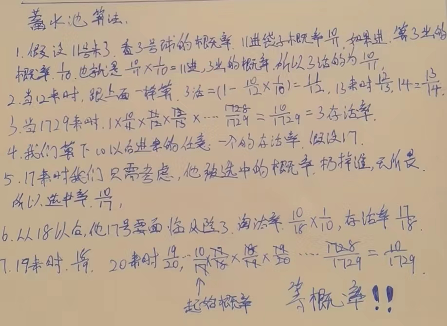

# 蓄水池算法

> 一边进,一边出,保持任何时刻,任意一个元素,留在池子里的概率,均等!

### 解决的问题示例：

假设有一个源源吐出不同球的机器，
只有装下10个球的袋子，每一个吐出的球，要么放入袋子，要么永远扔掉
如何做到机器吐出每一个球之后，所有吐出的球都等概率被放进袋子里

#### 解:

1. 当前袋子没满的时候,直接进,也就是说0-9号球,直接进到袋子里去.

2. 当袋子满了的时候,两个问题.1我要决定他是否进到袋子里?2如果他要进入到袋子里,袋子里谁要出袋子?

   

### 程序中如何表达10/11概率

我们知道,Math.random()会等概率返回一个**[0.0, 1.0)**的数字.

如果这个数字,我们✖️10,是不是就是0~9一个随机数.再加一,是不是就是1-10一个随机数,

好,如果说我们随机出来的数字小于等于7,我们就返回true,否则就返回false,也就是8910三个数false,剩下的7个数是true,我们是不是就是得到了一个7/10的概率.

相同的道理.我们做一个方法

```java
public static int random(int i) {
   return (int) (Math.random() * i) + 1;
}
```

判断`if (random(num) <= 10) { `是不是就得到了`10/i`的概率.

### 实际应用

我一个游戏做一个抽奖,要求,1.1号凌晨~1.2号凌晨,第一次登录的用户(仅第一次,这原有服务器应该有这个功能)都有一次抽奖功能,一共抽100人获奖.等概率,怎么做

如果说我先收集所有的用户,然后随机选出100个,有2个弊端.1.资源消耗极大,2.不能及时开奖,我要先收集,然后分析,才能确定名单.

如果我用蓄水池算法,实施的就可能进一个用户,出一个用户,完全等概率.!!!


