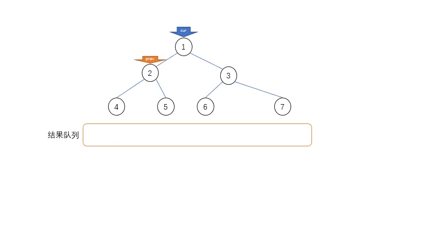
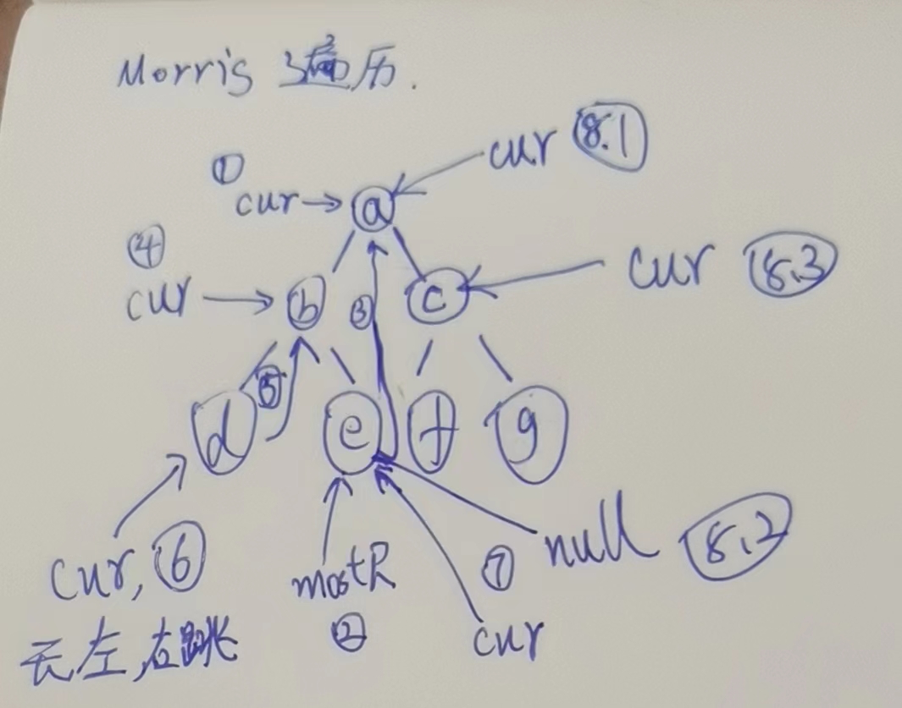

# Morris遍历

Morris遍历其实就是二叉树的遍历,只不过,他省额外空间,正常我们做二叉树遍历的时候,需要压栈,然后弹出时候,我们申请了一个"树高H"的额外空间.Morris可以省去这个空间.做到额外O(1).

Morris核心思想,在于利用了大量的叶子节点的空闲指针.而不是用额外的堆栈.来达到省空间的目的.

### Morris遍历细节

假设来到当前节点cur，开始时cur来到头节点位置   
1）如果cur没有左孩子，cur向右移动(cur = cur.right)  
2）如果cur有左孩子，找到左子树上最右的节点mostRight：  
	a.如果mostRight的右指针指向空，让其指向cur，   
	然后cur向左移动(cur = cur.left)   
	b.如果mostRight的右指针指向cur，让其指向null，  
	然后cur向右移动(cur = cur.right)   
3）cur为空时遍历停止  

太绕了,我们画个图  



### Morris遍历实质

建立一种机制：
对于没有左子树的节点只到达一次，
对于有左子树的节点会到达两次
morris遍历时间复杂度依然是O(N)

### Morris序



1. cur来到a,==第一次来到a==
2. 找到左树b最右e,
3. e右孩子指向null,让他指向cur
4. cur向左跳来到b,==第一次来到b==
5. b左孩子d最右就是d,右孩子指向null,让他指向自己,
6. cur向左跳来到d,==第一次来到d==
7. d无左孩子,向右跳,此时,右指针指向的是b,==第二次来到b==
8. b有左孩子,可是他右指针指向自己,让e指向null,cur右跳,来到e,==第一次来到e==
9. e没左孩子,右跳,来到a,==第二次来到a==
10. a左树最右孩子,指向的是自己,让他指向null,cur右跳.来到c,==第一次来到c==
11. 重复上面的规律操作,

以上图为例,Morris序,有左树的的到达两次,没有左树的到达一次,

Morris序:a,b,d,b,e,a,c,f,c,g

```java
/**
 * Morris遍历
 * @param head
 */
public static void morris(Node head) {
   if (head == null) {
      return;
   }
   Node cur = head;
   Node mostRight = null;
   while (cur != null) {
      //找到左孩子
      mostRight = cur.left;
      //一路找到左树最右孩子
      if (mostRight != null) {
         //最右不是空,或者最右不是自己,一直右跳
         while (mostRight.right != null && mostRight.right != cur) {
            mostRight = mostRight.right;
         }
         //右边空了,右孩子指向自己,cur继续左跳
         if (mostRight.right == null) {
            mostRight.right = cur;
            cur = cur.left;
            //cur左跳后,一切重新开始.看看有没有左孩子
            continue;
            //如果走else,一定是因为指向了自己,让他重新回到null
         } else {
            mostRight.right = null;
         }
      }
      //为空说明没有左孩子,直接右跳
      cur = cur.right;
   }
}
```

