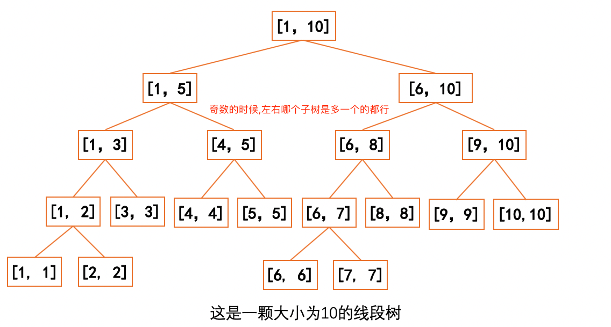
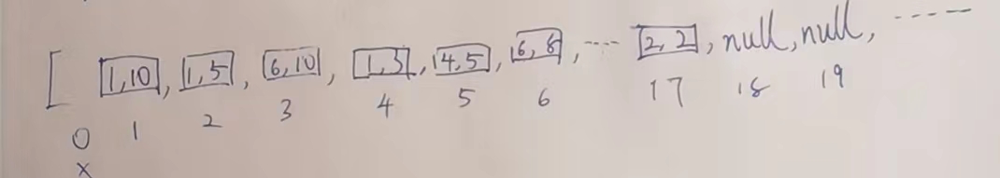
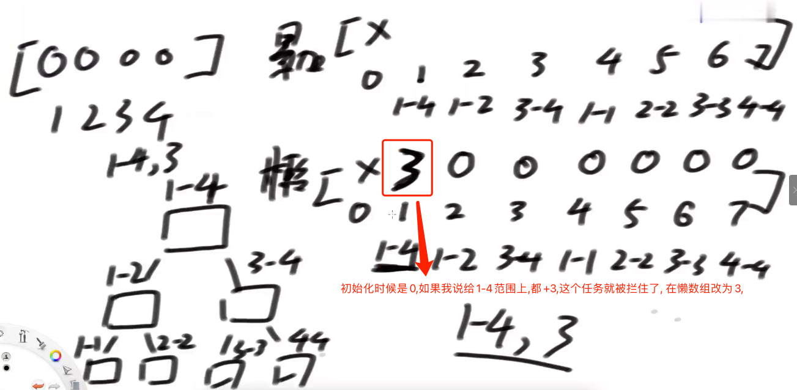
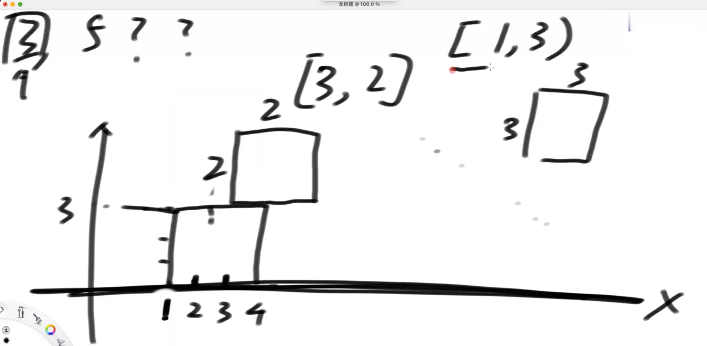

# 线段树

## 用途

1. 一种支持范围整体修改和范围整体查询的数据结构

2. 解决的问题范畴：  
   大范围信息可以只由左、右两侧信息加工出，   
   
   而不必遍历左右两个子范围的具体状况
   
   1. 例如:求最大值,累加和,==这种就可以==,因为左右都知道,我就是左右相加或者左右比max.
   2. 而求出现最多的字符,==这种就不行==,比如,左侧是a是5次,右侧b是6次,但是可能左侧c有4次,右侧c有4次.实际我应该是c有8次,左右信息我没办法简单的加工出来.

## 敏感度

线段树相关问题的题,不缺乏敏感度,一般只要提到某个范围修改,然后要查询,就可以联想到线段树解题思路.

## 本篇文章含金量

网上的其他的帖子解决的问题,基本都是单个add+查询或者单个Update+查询,几乎没有add+update+查询的,add和update是非常容易冲突的.所以本篇文章,很有含金量.

## 线段树实例一

> 给定一个数组arr，用户希望你实现如下三个方法  
> 1）void add(int L, int R, int V) :  让数组arr[L…R]上每个数都加上V  
> 2）void update(int L, int R, int V) :  让数组arr[L…R]上每个数都变成V  
> 3）int sum(int L, int R) :让返回arr[L…R]这个范围整体的累加和  
> 怎么让这三个方法，时间复杂度都是O(logN)  

暴力方法,如果说,我让每次加法,或者更新,再查累加和,是不是每次都是O(N),就是很慢.

如果我是logN的复杂度,那我太快了,2^64这种海量数据,也就是64次内搞定.

## 下标默认规定

线段树,默认数据下标从1开始,0位置,舍弃不用.

## 建树方式

就是二分,左右搞个几乎一半的方式,如果是偶数,平分即可, 如果是奇数,左右哪边都可以是多的,但是规则一致即可.



任何一个节点,他的父:`i/2`,他的左孩子,`2*i`,他的右孩子`2*i+1`.

注意,例如[3,3],他不是没有孩子,他有,只是左右孩子都是null.

我们把这个树型结构,用一个数组表示,就是,如下图所示,注意,同样0位置舍弃不用.



==这个数组,最多,多大够用?==4N,足矣.上图为例,算上全部的null,也不可能超过4N.

假设最省的情况,就是2^整数次个,最费情况,就是2^整数次+1个.底下只有1个,剩下都是null.

假设,n=5,2^2+1个,最费的情况下,建立前面4个的是2N个,底下又干出一层,又是2N,所以最多4N搞定.

## 懒更新

懒更新的意思就是,我给一个范围进行修改,从顶向下发送""任务"",如果这个任务范围,完全覆盖了我某个树节点,我直接拦住,不再下发,然后用一个数组记下来.



如果发现新任务来了,正好又覆盖了我的范围,看我有没有懒信息,2种处理方式,    

1.如果有,先下发一层.相当于把我之前懒得都清账了,然后我记录最新的懒信息.  

2.处理时候,发现又是完全覆盖,我不下发了,直接累加懒信息.  

## 线段树代码

1. 看定义的属性,大概的含义,
2. 看构造方法,初始化数组长度等,
3. 看build,将原数组,二分,放到新的数组中,最大4N肯定够放了.
4. 看add方法,将某段任务,下发,如果整个某段被hold住了,懒数组懒住.否则,先清账,将我的懒信息下发,然后任务下发到左右,最后我汇总我左右的信息.
5. 看pushUp ,就是汇总我的左孩子和右孩子的信息,最大值或者累加和这种信息.
6. 看pushDown,就是当我hold不住任务时候,我需要将整个任务下发,下发前做的操作,就是将我的懒信息给左右孩子,计算左右孩子的信息,清空懒信息,
7. 看query.如果,我hold住了整个任务,那我直接告诉你结果即可.否则,你得问问我的孩子们了,问之前,下发我的懒信息.

```java
public class Code01_SegmentTree {

   public static class SegmentTree {
      // arr[]为原序列origin的信息改装,origin从0开始，但在arr里是从1开始的
      // sum[]模拟线段树维护区间和
      // lazy[]为累加和懒惰标记
      // change[]为更新的值
      // update[]为更新慵懒标记
      private int MAXN;
      private int[] arr;
      private int[] sum;
      private int[] lazy;

      //下面两个是Update时候才用到的
      private int[] change;
      private boolean[] update;

      public SegmentTree(int[] origin) {
         MAXN = origin.length + 1;
         arr = new int[MAXN]; // arr[0] 不用 从1开始使用
         for (int i = 1; i < MAXN; i++) {
            arr[i] = origin[i - 1];
         }

         //准备4倍,一定够用
         sum = new int[MAXN << 2]; // 用来支持脑补概念中，某一个范围的累加和信息
         lazy = new int[MAXN << 2]; // 用来支持脑补概念中，某一个范围沒有往下传递的任务

         //这两个是更新用的,增加时候,用不到!
         change = new int[MAXN << 2]; // 用来支持脑补概念中，某一个范围有没有更新操作的任务
         update = new boolean[MAXN << 2]; // 用来支持脑补概念中，某一个范围更新任务，更新成了什么
      }

      //向上汇总
      private void pushUp(int rt) {
         //左移就是2*i.那么2*i+1就是左移后,右面的补0与上一个1,相当于+1.
         sum[rt] = sum[rt << 1] + sum[rt << 1 | 1];
      }

      // 之前的，所有懒增加，和懒更新，从父范围，发给左右两个子范围
      // 分发策略是什么
      // ln表示左子树元素结点个数，rn表示右子树结点个数
      private void pushDown(int rt, int ln, int rn) {
         //更新时候用到
         //如果来了这,更新和新增都有,为什么非要先更新,再新增,因为,两个都有,一定是先有更新,后有新增,因为更新直接就会清空懒信息.
         if (update[rt]) {
            update[rt << 1] = true;
            update[rt << 1 | 1] = true;
            change[rt << 1] = change[rt];
            change[rt << 1 | 1] = change[rt];
            lazy[rt << 1] = 0;
            lazy[rt << 1 | 1] = 0;
            sum[rt << 1] = change[rt] * ln;
            sum[rt << 1 | 1] = change[rt] * rn;
            update[rt] = false;
         }
         //懒方法.
         //如果懒位置有值,需要先将懒任务下发给子级.只下发一层
         if (lazy[rt] != 0) {
            //左移就是*2的意思,将父级的懒信息加到我的左孩子,2*i位置
            lazy[rt << 1] += lazy[rt];
            //累加和直接乘法一次算出.
            sum[rt << 1] += lazy[rt] * ln;
            //将父级的懒信息加到右孩子,2*i+1位置
            lazy[rt << 1 | 1] += lazy[rt];
            sum[rt << 1 | 1] += lazy[rt] * rn;
            //我自己的懒信息清空.
            lazy[rt] = 0;
         }
      }

      // 这个就是初始化,如何把原始数组,放到那个4N数组中,
      //举个例子,数据范围是1~5,根据之前说的,1~5放在1位置,然后1~2放在2位置,3~5放在3位置,所以第一次调用这个build的时候,就是(1,5,1),里面递归分别是(1,2,2),(3,5,3)
      //   (1,5,1)
      //   /     \
      //(1,2,2)  (3,5,3)
      // 在arr[l~r]范围上，去build，1~N，
      // rt : 这个范围在sum中的下标
      public void build(int l, int r, int rt) {
         if (l == r) {
            //l==r说明到了叶子节点了
            sum[rt] = arr[l];
            return;
         }
         int mid = (l + r) >> 1;
         build(l, mid, rt << 1);
         build(mid + 1, r, rt << 1 | 1);
         pushUp(rt);
      }

      
      // L~R  所有的值变成C
      // l~r  rt
      public void update(int L, int R, int C, int l, int r, int rt) {
         if (L <= l && r <= R) {
            update[rt] = true;
            change[rt] = C;
            sum[rt] = C * (r - l + 1);
            lazy[rt] = 0;
            return;
         }
         // 当前任务躲不掉，无法懒更新，要往下发
         int mid = (l + r) >> 1;
         pushDown(rt, mid - l + 1, r - mid);
         if (L <= mid) {
            update(L, R, C, l, mid, rt << 1);
         }
         if (R > mid) {
            update(L, R, C, mid + 1, r, rt << 1 | 1);
         }
         pushUp(rt);
      }

      // L~R, C 任务！总的那个
      // rt，l~r 子的那个
      public void add(int L, int R, int C, int l, int r, int rt) {
         // 任务如果把此时的范围全包了！懒住,不下发了
         if (L <= l && r <= R) {
            //计算所有数据加完了一个值后,累加和增加的值,一次算完,
            sum[rt] += C * (r - l + 1);
            //有个任务,需要懒住,将之前的和这次的一起懒住
            lazy[rt] += C;
            return;
         }
         // 任务没有把你全包！左右下发任务pushDown
         // l  r  mid = (l+r)/2
         int mid = (l + r) >> 1;
         //两个参数是 左边有多少个,右边有多少个
         pushDown(rt, mid - l + 1, r - mid);
         //上面的pushDown!,相当于给老任务都结清了!我可以搞新任务了.
         // L~R
         if (L <= mid) {
            add(L, R, C, l, mid, rt << 1);
         }
         if (R > mid) {
            add(L, R, C, mid + 1, r, rt << 1 | 1);
         }
         //我等着我左边调对了,等着我右边调对了,我调整我自己的,pushUp
         pushUp(rt);
      }

      // 1~6 累加和是多少？ 1~8 rt
      public long query(int L, int R, int l, int r, int rt) {
         if (L <= l && r <= R) {
            return sum[rt];
         }
         int mid = (l + r) >> 1;
         pushDown(rt, mid - l + 1, r - mid);
         long ans = 0;
         if (L <= mid) {
            ans += query(L, R, l, mid, rt << 1);
         }
         if (R > mid) {
            ans += query(L, R, mid + 1, r, rt << 1 | 1);
         }
         return ans;
      }

   }

   public static class Right {
      public int[] arr;

      public Right(int[] origin) {
         arr = new int[origin.length + 1];
         for (int i = 0; i < origin.length; i++) {
            arr[i + 1] = origin[i];
         }
      }

      public void update(int L, int R, int C) {
         for (int i = L; i <= R; i++) {
            arr[i] = C;
         }
      }

      public void add(int L, int R, int C) {
         for (int i = L; i <= R; i++) {
            arr[i] += C;
         }
      }

      public long query(int L, int R) {
         long ans = 0;
         for (int i = L; i <= R; i++) {
            ans += arr[i];
         }
         return ans;
      }

   }

   public static int[] genarateRandomArray(int len, int max) {
      int size = (int) (Math.random() * len) + 1;
      int[] origin = new int[size];
      for (int i = 0; i < size; i++) {
         origin[i] = (int) (Math.random() * max) - (int) (Math.random() * max);
      }
      return origin;
   }

   public static boolean test() {
      int len = 100;
      int max = 1000;
      int testTimes = 5000;
      int addOrUpdateTimes = 1000;
      int queryTimes = 500;
      for (int i = 0; i < testTimes; i++) {
         int[] origin = genarateRandomArray(len, max);
         SegmentTree seg = new SegmentTree(origin);
         int S = 1;
         int N = origin.length;
         int root = 1;
         seg.build(S, N, root);
         Right rig = new Right(origin);
         for (int j = 0; j < addOrUpdateTimes; j++) {
            int num1 = (int) (Math.random() * N) + 1;
            int num2 = (int) (Math.random() * N) + 1;
            int L = Math.min(num1, num2);
            int R = Math.max(num1, num2);
            int C = (int) (Math.random() * max) - (int) (Math.random() * max);
            if (Math.random() < 0.5) {
               seg.add(L, R, C, S, N, root);
               rig.add(L, R, C);
            } else {
               seg.update(L, R, C, S, N, root);
               rig.update(L, R, C);
            }
         }
         for (int k = 0; k < queryTimes; k++) {
            int num1 = (int) (Math.random() * N) + 1;
            int num2 = (int) (Math.random() * N) + 1;
            int L = Math.min(num1, num2);
            int R = Math.max(num1, num2);
            long ans1 = seg.query(L, R, S, N, root);
            long ans2 = rig.query(L, R);
            if (ans1 != ans2) {
               return false;
            }
         }
      }
      return true;
   }

   public static void main(String[] args) {
      int[] origin = { 2, 1, 1, 2, 3, 4, 5 };
      SegmentTree seg = new SegmentTree(origin);
      int S = 1; // 整个区间的开始位置，规定从1开始，不从0开始 -> 固定
      int N = origin.length; // 整个区间的结束位置，规定能到N，不是N-1 -> 固定
      int root = 1; // 整棵树的头节点位置，规定是1，不是0 -> 固定
      int L = 2; // 操作区间的开始位置 -> 可变
      int R = 5; // 操作区间的结束位置 -> 可变
      int C = 4; // 要加的数字或者要更新的数字 -> 可变
      // 区间生成，必须在[S,N]整个范围上build
      seg.build(S, N, root);
      // 区间修改，可以改变L、R和C的值，其他值不可改变
      seg.add(L, R, C, S, N, root);
      // 区间更新，可以改变L、R和C的值，其他值不可改变
      seg.update(L, R, C, S, N, root);
      // 区间查询，可以改变L和R的值，其他值不可改变
      long sum = seg.query(L, R, S, N, root);
      System.out.println(sum);

      System.out.println("对数器测试开始...");
      System.out.println("测试结果 : " + (test() ? "通过" : "未通过"));

   }

}
```

## 落方块问题

> 想象一下标准的俄罗斯方块游戏，X轴是积木最终下落到底的轴线  
> 下面是这个游戏的简化版：  
> 1）只会下落正方形积木  
> 2）[a,b] -> 代表一个边长为b的正方形积木，积木左边缘沿着X = a这条线从上方掉落  
> 3）认为整个X轴都可能接住积木，也就是说简化版游戏是没有整体的左右边界的  
> 4）没有整体的左右边界，所以简化版游戏不会消除积木，因为不会有哪一层被填满。  
>
> 给定一个N*2的二维数组matrix，可以代表N个积木依次掉落，  
> 返回每一次掉落之后的最大高度  

就是下面这样,先来个[1,3],再来个[3,2],只要卡住一点点,就会落在上面,而不会掉下来.没有重心问题.



这个问题核心思想就是,我在某个范围来了一个方块的时候,我先看看他的最大高度,然后累加我的高低,然后我这个范围的最大高度都统一更新.例如上图,[3,2]来了,他需要先知道3~5范围最大高度是多少,先调用一个线段树query,是3,然后我的高度是2,所以,我给3~5全部更新为5,这时候如果来的是10开始,毫不相干,就是高度+0,如果此刻来的是4,2,那我们发现4这个区间高度已经是5了,所以还要+2,然后给4~6范围都改为7.循环往复.每次一个方块落下来,我都能记录一个当前最高的高度.

```java
public class Code02_FallingSquares {

   public static class SegmentTree {
      private int[] max;
      private int[] change;
      private boolean[] update;

      public SegmentTree(int size) {
         int N = size + 1;
         max = new int[N << 2];

         change = new int[N << 2];
         update = new boolean[N << 2];
      }

      private void pushUp(int rt) {
         max[rt] = Math.max(max[rt << 1], max[rt << 1 | 1]);
      }

      // ln表示左子树元素结点个数，rn表示右子树结点个数
      private void pushDown(int rt, int ln, int rn) {
         if (update[rt]) {
            update[rt << 1] = true;
            update[rt << 1 | 1] = true;
            change[rt << 1] = change[rt];
            change[rt << 1 | 1] = change[rt];
            max[rt << 1] = change[rt];
            max[rt << 1 | 1] = change[rt];
            update[rt] = false;
         }
      }

      public void update(int L, int R, int C, int l, int r, int rt) {
         if (L <= l && r <= R) {
            update[rt] = true;
            change[rt] = C;
            max[rt] = C;
            return;
         }
         int mid = (l + r) >> 1;
         pushDown(rt, mid - l + 1, r - mid);
         if (L <= mid) {
            update(L, R, C, l, mid, rt << 1);
         }
         if (R > mid) {
            update(L, R, C, mid + 1, r, rt << 1 | 1);
         }
         pushUp(rt);
      }

      public int query(int L, int R, int l, int r, int rt) {
         if (L <= l && r <= R) {
            return max[rt];
         }
         int mid = (l + r) >> 1;
         pushDown(rt, mid - l + 1, r - mid);
         int left = 0;
         int right = 0;
         if (L <= mid) {
            left = query(L, R, l, mid, rt << 1);
         }
         if (R > mid) {
            right = query(L, R, mid + 1, r, rt << 1 | 1);
         }
         return Math.max(left, right);
      }

   }

   public HashMap<Integer, Integer> index(int[][] positions) {
      TreeSet<Integer> pos = new TreeSet<>();
      for (int[] arr : positions) {
         pos.add(arr[0]);
         pos.add(arr[0] + arr[1] - 1);
      }
      HashMap<Integer, Integer> map = new HashMap<>();
      int count = 0;
      for (Integer index : pos) {
         map.put(index, ++count);
      }
      return map;
   }

   public List<Integer> fallingSquares(int[][] positions) {
      HashMap<Integer, Integer> map = index(positions);
      int N = map.size();
      SegmentTree segmentTree = new SegmentTree(N);
      int max = 0;
      List<Integer> res = new ArrayList<>();
      // 每落一个正方形，收集一下，所有东西组成的图像，最高高度是什么
      for (int[] arr : positions) {
         int L = map.get(arr[0]);
         int R = map.get(arr[0] + arr[1] - 1);
         int height = segmentTree.query(L, R, 1, N, 1) + arr[1];
         max = Math.max(max, height);
         res.add(max);
         segmentTree.update(L, R, height, 1, N, 1);
      }
      return res;
   }

}
```

## 刷房子问题.

> 我有一排民居,编号1~N,我有56种颜色.我每次可以给[L,R]刷一个颜色,求任何时刻,我L~R范围,有多少种颜色.

线段树可以解决

我一共56种颜色,我用一个long型来记录,000...1为有第一种颜色, 000....10为有第二种颜色,000....11为第一种,第二种都有,所以,56个bit可以记录下来所有的颜色.

我让每个左右孩子都记录一个long值,代表他们的范围内有多少个颜色,叶子节点肯定就是只有1个颜色.只有1个1.

向上pushUp的时候,左右孩子怎么汇总,用|,例如4位简化,0101代表左侧第1,3种颜色,右侧0010代表右侧有第2种,我就有0101|0010=0111,我有三种颜色.


