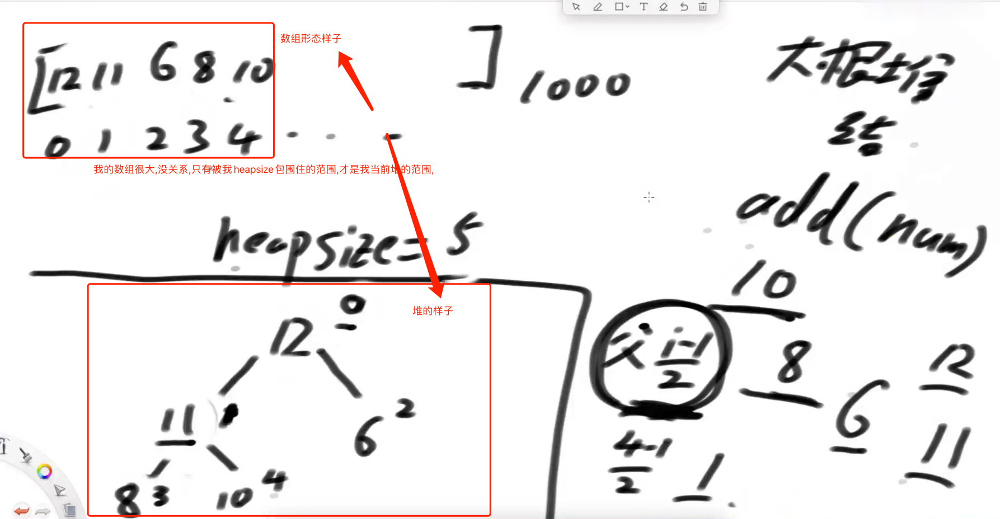
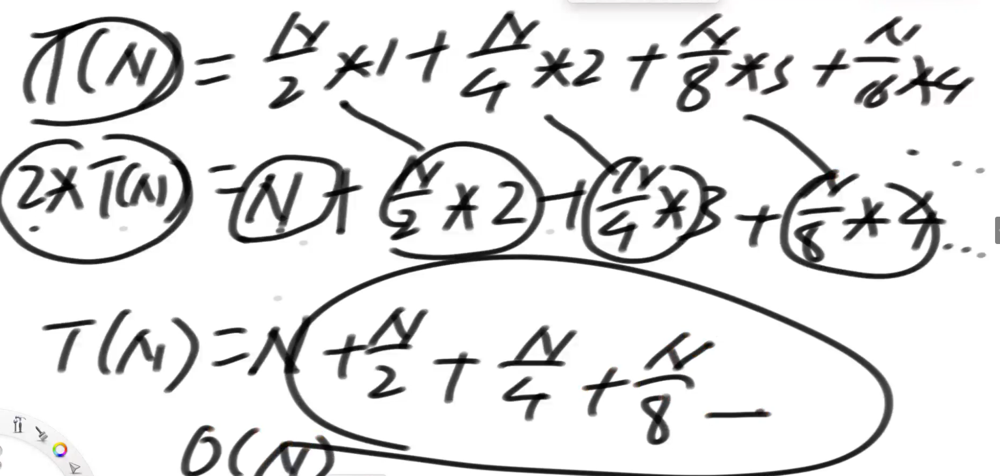
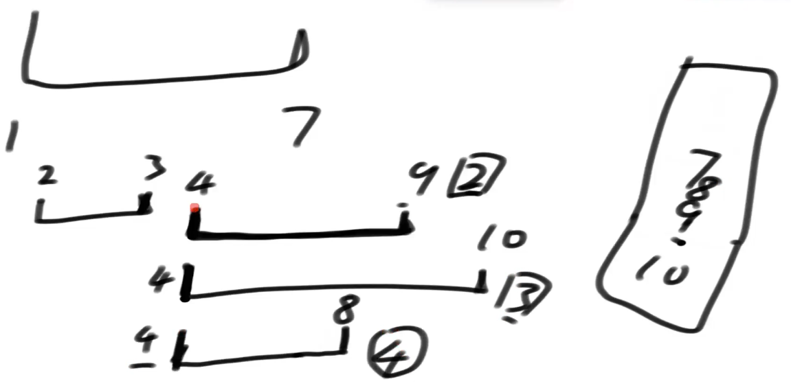

# 堆-被火车撞了都不能忘记的结构

## 堆结构

1. 堆结构就是用数组实现的完全二叉树结构
2. 完全二叉树中如果每棵子树的最大值都在顶部就是大根堆
3. 完全二叉树中如果每棵子树的最小值都在顶部就是小根堆
4. 堆结构的heapInsert和heapify操作
5. 堆结构的增大和减少
6. 优先级队列,就是堆结构

### 完全二叉树

1. 空树
2. 单个节点
3. 满树
4. 不是满树,但是是从左向右变满的过程

### 位置关系

* 任何一个节点的左孩子位置:2*i+1
* 任何一个节点的右孩子位置:2*i+2
* 任何一个节点的父节点位置:(i-1)/2取整

### 数组表示一个堆结构

数组中一个个数来,一个个加到堆中,堆调整后,会影响数组相对的位置,且堆的大小,受heapsize影响.



### heapInsert

从index位置开始,依次向上移动,直到0位置,或者干不过自己的父级,结束.

```java
public static void heapInsert(int[] arr, int index) {
  //当前是index,父级是[index-1]/2
  //这个判断表示2个条件,当为0时候,0不可能比0位置大.(取整)
   while (arr[index] > arr[(index - 1) / 2]) {
      swap(arr, index, (index - 1) / 2);
      index = (index - 1) / 2;
   }
}
```

### heapify

从index位置开始,依次向下移动,直到没孩子,或者比"较大的"孩子小,结束.

```java
public static void heapify(int[] arr, int index, int heapSize) {
   int left = index * 2 + 1;
  //如果有左孩子,如果没有左,不可能有右,
   while (left < heapSize) {
     //看看有没有右孩子,并且选出左右更大的那个.
      int largest = left + 1 < heapSize && arr[left + 1] > arr[left] ? left + 1 : left;
     //看看我跟较大孩子谁大,如果我最大,那就完事了,否则跟较大孩子换.
      largest = arr[largest] > arr[index] ? largest : index;
      if (largest == index) {
         break;
      }
      swap(arr, largest, index);
      index = largest;
      left = index * 2 + 1;
   }
}
```

### 调整堆

当数组中新加入一个孩子时,我不知道更大还是更小,但是我可以依次调用heapInsert和heapify,两个只会走一个.

### 堆排序额外空间复杂度 O(1)

```java
// 堆排序额外空间复杂度O(1)
   public static void heapSort(int[] arr) {
      if (arr == null || arr.length < 2) {
         return;
      }
      // O(N*logN)
//    for (int i = 0; i < arr.length; i++) { // O(N)
//       heapInsert(arr, i); // O(logN)
//    }
      // O(N)
      for (int i = arr.length - 1; i >= 0; i--) {
         heapify(arr, i, arr.length);
      }
      int heapSize = arr.length;
      swap(arr, 0, --heapSize);
      // O(N*logN)
      while (heapSize > 0) { // O(N)
         heapify(arr, 0, heapSize); // O(logN)
         swap(arr, 0, --heapSize); // O(1)
      }
   }
```

### 建堆过程比较

当一次性给出所有元素的时候,对比heapInsert和heapify建堆的效率

#### heapInsert:N*logN

数量 ✖️ 树的高度

#### heapify:N

调整次数:

N/2 1次(每个节点只看自己)

N/4 2次

N/8 3次

.........

错位相减,总体一定收敛于N



### 练习题:

#### 1.局部有序的数组排序问题

> 已知一个几乎有序的数组,几乎有序是指,如果把数组排好序的话,每个元素的移动距离不超过k,并且k相对整个数组长度来说,比较小.请排序.

局部排序思想:

整一个K个heapsize大小的小根堆,将前k个值放进去(移动最大距离不超过k),然后弹出第一个,他就是最小的,然后把下一个值放进去,然后弹出最小的,然后继续循环这个操作,直到所有数据弹出.

这种做法的复杂度就是:N*logK,k是堆的大小,每个数进来,做一次调整的代价是logK

如果是普通的数组:整个数组全部排序,`N*logN`,这个可以看下排序那里的总结,如果是普通的数组,没有任何前置调整的,最好只能做到`N*logN`

#### 2.最大线段重合问题

> 给定很多线段,每个线段都有起止两个数,[start,end].表示开始和结束位置,左右都是闭区间.
>
> 规定.1)线段开始结束,一定是整数.2)线段重合区域长度必须>=1.返回线段最多重合区域中,包含了几条线段.

思想:重合就是,先按起点排序,下一个线段来了,他结束点在上一个没结束的时候就先结束了.就有重合区域.

解法:将所有线段按照起点排序,顺序将线段结尾放到一个小根堆里,放之前,把小于等于当前开始值的弹出.

他的含义是:一个线段的起点,堆里比他小的,代表结束在他之前,无交集,而比他大的,一定穿过了当前线段,此时,堆大小,就是重合线段数.



```java 
public static int maxCover2(int[][] m) {
   Line[] lines = new Line[m.length];
   for (int i = 0; i < m.length; i++) {
      lines[i] = new Line(m[i][0], m[i][1]);
   }
  //按开始位置排序
   Arrays.sort(lines, new StartComparator());
   // 小根堆，每一条线段的结尾数值，使用默认的
   PriorityQueue<Integer> heap = new PriorityQueue<>();
   int max = 0;
   for (int i = 0; i < lines.length; i++) {
      // lines[i] -> cur 在黑盒中，把<=cur.start 东西都弹出
      while (!heap.isEmpty() && heap.peek() <= lines[i].start) {
         heap.poll();
      }
      heap.add(lines[i].end);
      max = Math.max(max, heap.size());
   }
   return max;
}
```

## 加强堆

### 代码核心思想

1. 建立反向索引表 --用来快速找到内部哪个元素变了,快速让他heapInsert或者heapify
2. 建立比较器
3. 核心在于各种结构相互配合,非常容易出错.

```java
/**
 * 主要用途:手写加强堆
 * java主要还是偏应用,
 * 1.假如现在你手里有一个堆，里面存着一些元素，你有其中一个内部属性发生变化,你怎么调整,还要高效,注意,普通堆,你找到这个元素,已经是N的复杂度了,
 * 2.此时你的用户又想删除堆中的某一个元素，你要怎么高效删除指定元素
 * 加强堆来了,加强堆,内部增加一个反向索引表,
 * 以前我们有个数组,只知道下标存的是谁,而不知道某个元素下标是谁,只能遍历,
 * [a,b,c,d...]
 *  0,1,2,3...
 * 于是增加反向索引表,HashMap<T,Integer>,这个就存了哪个元素在哪个下标位置.注意这有个问题,HashMap会将所有基本类型,基本包装类型,都转为基本类型,这样就无法存重复数据了,可以给T包一层,HashMap<Inner<T>,Integer>
 * 这样,删除方法实现逻辑,直接把最后一个元素跟他换,然后删除最后一个元素,换完了的元素heapInsert或者heapify,这两个只会中一个.高效完成.
 * 单个变了,就在他这个位置heapInsert或者heapify,这两个只会中一个.同样高效完成.
 * @author FengXinYang
 * @date 2022/10/12
 */
public class HeapGreater<T> {
    private ArrayList<T> heap;//这就是以前的熟悉的数组
    //private ArrayList<Inner<T>> heap;//这就是以前的熟悉的数组
    private HashMap<T, Integer> indexMap; //反向索引表
    //private HashMap<Inner<T>, Integer> indexMap; //反向索引表,如果有处理重复的需求,用这样的方式
    private int heapSize;
    private Comparator<? super T> comp;

    public HeapGreater(Comparator<? super T> c) {
        heap = new ArrayList<>();
        indexMap = new HashMap<>();
        heapSize = 0;
        comp = c;
    }
}
```

### 加强堆特殊功能

#### 删除

```java
public void remove(T obj) {
  //提前找一个变量,装起来最后一个元素
   T replace = heap.get(heapSize - 1);
  //反向索引表,找到删除的元素的位置,并且将这个反向记录删除
   int index = indexMap.get(obj);
   indexMap.remove(obj);
  //从堆中删除最后一个元素,
   heap.remove(--heapSize);
  //如果不是删除最后一个,那么就把删除元素和最后那个元素换位置
   if (obj != replace) {
      heap.set(index, replace);
      indexMap.put(replace, index);
      resign(replace);
   }
}
```

#### 某个值变了,重排

```java
public void resign(T obj) {
   heapInsert(indexMap.get(obj));
   heapify(indexMap.get(obj));
}
```

```java
private void swap(int i, int j) {
   T o1 = heap.get(i);
   T o2 = heap.get(j);
   heap.set(i, o2);
   heap.set(j, o1);
   indexMap.put(o2, i);
   indexMap.put(o1, j);
}
```

### 手动改写堆题目练习

给定一个整型数组，int[] arr;和一个布尔类型数组，Boolean[op],两个数组一定等长，假设长度为N，arr[i]表示客户编号，op[i]表示客户操作

arr=【3,3,1,2,1,2,5..

Op=【T,T,T,F,T,F...

依次表示:3用户购买了一件商品，3用户购买了一件商品，1用户购买了一件商品，2用户购买了一件商品，1用户退货了一件商品，2用户购买了一件商品，5用户退货了一件商品·

一对arr[]和op[]就代表一个事件;

用户号为arr[i]，op[i]==T就代表这个用户购买了一件商品,op[i] == F就代表这个用户退货了一件商品,现在你作为电商平台负责人，你想在每一个事件到来的时候都给购买次数最多的前K名用户颁奖。所以每个事件发生后，你都需要一个得奖名单(得奖区)

得奖系统的规则:
1,如果某个用户购买商品数为0，但是又发生了退货事件,则认为该事件无效，得奖名单和上一个事件发生后一致，例子中的5用户;

2,某用户发生购买商品事件，购买商品数+1，发生退货事件，购买商品数-1.

3,每次都是最多K个用户得奖，K也为传入的参数,如果根据全部规则，得奖人数确实不够K个，那就以不够的情况输出结果

4,得奖系统分为得奖区和候选区，任何用户只要购买数>0，一定在这两个区域中的一个

5, 购买数最大的前K名用户进入得奖区,在最初时如果得奖区没有到达K个用户，那么新来的用户直接进入得奖区

6,如果购买数不足以进入得奖区的用户，进入候选区

7,如果候选区购买数最多的用户，已经足以进入得奖区，该用户就会替换得奖区中购买数最少的用户(大于才能替换)

如果得奖区中购买数最少的用户有多个，就替换最早进入得奖区的用户

如果候选区中购买数最多的用户有多个，机会会给最早进入候选区的用户

8,候选区和得奖区是两套时间,

因用户只会在其中一个区域，所以只会有一个区域的时间，另一个没有从得奖区出来进入候选区的用户，得奖区时间删除,

进入候选区的时间就是当前事件的时间(可以理解为arr[i]和op中的i)从候选区出来进入得奖区的用户，候选区时间删除

进入得奖区的时间就是当前事件的时间(可以理解为arr[i]和op中的i)

9,如果某用户购买数==0，不管在哪个区域都离开，区域时间删除,离开是指彻底离开，哪个区域也不会找到该用户

如果下次该用户又发生购买行为，产生>0的购买数会再次根据之前规则回到某个区域中，进入区域的时间重记

解:TopK问题.类似的还有topK个最常用的单次那个题.

