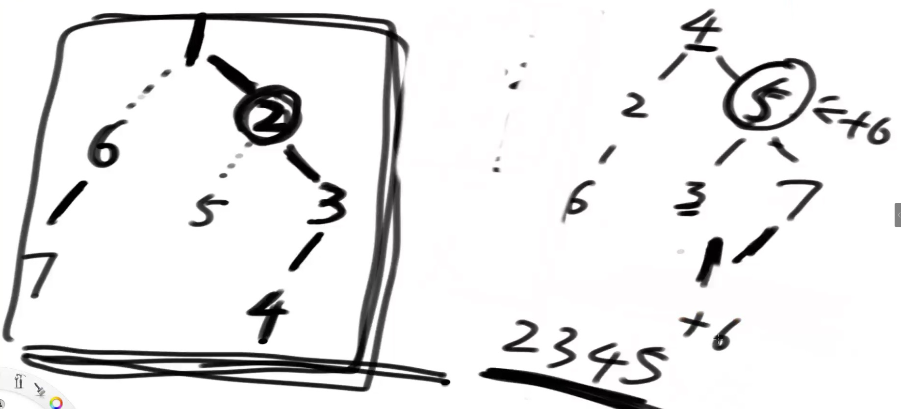
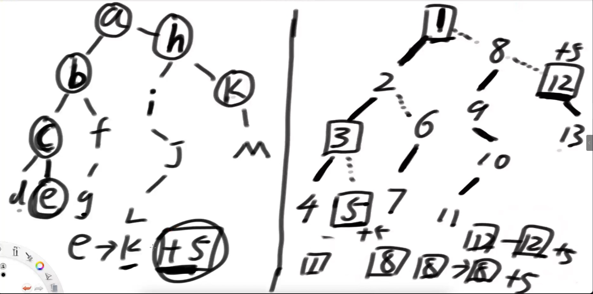

# 树链刨分

> 给定数组father，大小为N，表示一共有N个节点  
> father[i] = j 表示点i的父亲是点j， father表示的树一定是一棵树而不是森林  
> 给定数组values，大小为N，values[i]=v表示节点i的权值是v 
>
>
> 实现如下4个方法，保证4个方法都很快！  
> 1)让某个子树所有节点值加上v，入参：int head, int v  
> 2)查询某个子树所有节点值的累加和，入参：int head  
> 3)在树上从a到b的整条链上所有加上v，入参：int a, int b, int v  
> 4)查询在树上从a到b的整条链上所有节点值的累加和，入参：int a, int b  

线段树支持的,他都支持,本质就是用"线段树+dfs序"加速.

### 1.father数组

father数组,就是代表一个树的结构,假设`[2,0,2,2]`

0位置是2,代表0的父亲是2,1的父亲是0,2的父亲是2,3的父亲是2,

意思是2是头节点,0,1,3都是他的子节点.


### 2.重儿子

一个头节点,那边儿子数量多,那边就是重儿子,则另一边为轻儿子.

轻儿子下面的一定是有一个是重儿子,如果是空,其实就是有个重儿子指向空.同样的,他下面那边多,那边是重儿子.

所以你看这里,判断谁是重儿子,需要先知道,哪边的子级的儿子多.哪边多哪边才是重儿子.


### 3.实链/重链/重边

重儿子连接的路线,叫做实链/重链/重边

重链,类似与高速公路.加速用的.主要就是加速,

重链,这个事,对1,2,问题,没有实质的帮助,是为了34问题加速的.


### 4.重链的头

每一个重链,都有一个公共的头,这个头指的不是自己的上面一个,而是这条链的总头部.

如果一个节点只有自己,他自己的头也就是他自己.

这样的做法,可以极快的找到总的头部.x节点,找到他的链的头,通过轻链,向上跳转一个,来到重链上,找到这个重链的头,再向上找轻链,很快就能找到总头部.

代价logN,

构建链的时候,才能设置头.


### 5.dfs序

一颗朴素树,按照深度优先遍历,走重儿子,走过去的路叫重链,回来后,走向其他分支的叫轻链,全部按照这个规则走过的深度优先遍历顺序叫做dfs序.

dfs序是重新生成的,是通过遍历朴素树重新做出来的.



很有用!!!!!

1. 若干的东西,变成了有序的东西,做个跳转对应表`arr[4]=1,arr[5]=2`,这种,对应表很好做.  
2. 看,右边的数,dfs序遍历完了就是左边的样子,有一个特点,任何一个节点的子节点,都有序,是个连续的东西,虽然顺序乱的,但是都有.

​		想给5这个子树全部加个6,那不就是,2345这个区间统一加6吗????这不就是线段树吗??

​		我们在开始遍历树的时候,标记上每个节点算上他自己有多少个子节点,例如4有7个,5有4个,那搞5的时候,不就是对应2,然后数4个吗?2,3,4,5.

3. 还有个有序的,一条重链上的东西,有序,例如,2,3,4,因为我标记重链的时候,就是先走的重链标号嘛.


### 6.第三问题解法

如图,左侧是原始树,右侧是dfs序的树.



我要给从e到k,就是图中画圈的,都＋5.忍受不了一点点找,一点点加.

一个逐级汇总结算的想法.

* e,对应5,自己就是自己的头,所以,自己结算+5
* 上跳,到3,进入重链,直接找到头1,1~3全部+5,线段树可以搞定,
* 12,跟e一样,自己结算,轻链上跳,
* 8,跟e一样,自己结算,轻链上跳,
* 重叠到1,结束.

123这个重链,就加速了!

复杂度O((logN)^2),

#### 一个注意的点.

我们上面说的,一定会汇集到顶点,实际上,可能不经过顶级节点的,可能是下面的某个点.,也可能就在某个相同的链上.

怎么防止跳过头了呢.?

谁低谁蹦.蹦完了,重设置. 

### 7.关键变量

```java
		private int tim;
		// 节点个数是n，节点编号是1~n
		private int n;
		// 谁是头
		private int h;
		// 朴素树结构
		/**
		 * [4,1,1,0,1],平移后[5,2,2,1,2]
		 * [[],[4],[3,5],[],[],[1]]
		 * 0没有子节点,1的子节点是4,2的子节点是3,5,3没有,4,没有,5的子节点是1.
		 用二维数字代表朴素树结构
		 */
		private int[][] tree;
		// 权重数组 原始的0节点权重是6 -> val[1] = 6
		private int[] val;
		// father数组一个平移，因为标号要+1
		private int[] fa;
		// 深度数组！
		private int[] dep;
		// son[i] = 0 i这个节点，没有儿子
		// son[i] != 0 j i这个节点，重儿子是j
		private int[] son;
		// siz[i] i这个节点为头的子树，有多少个节点
		private int[] siz;
		// top[i] = j i这个节点，所在的重链，头是j
		private int[] top;
		// dfn[i] = j i这个节点，在dfs序中是第j个
		private int[] dfn;
		// 如果原来的节点a，权重是10
		// 如果a节点在dfs序中是第5个节点, tnw[5] = 10
		private int[] tnw;
		// 线段树，在tnw上，玩连续的区间查询或者更新
		private SegmentTree seg;
```


### 8.初始化

```java
public TreeChain(int[] father, int[] values) {
			// 原始的树 tree，弄好了，可以从i这个点，找到下级的直接孩子
			// 上面的一大堆结构，准备好了空间，values -> val
			// 找到头部点
			initTree(father, values);
			// fa;
			// dep;
			// son;
			// siz;
			dfs1(h, 0);
			// top;
			// dfn;
			// tnw;
			dfs2(h, h);
			seg = new SegmentTree(tnw);
			seg.build(1, n, 1);
		}

private void initTree(int[] father, int[] values) {
			tim = 0;
			n = father.length + 1;
			tree = new int[n][];
			val = new int[n];
			fa = new int[n];
			dep = new int[n];
			son = new int[n];
			siz = new int[n];
			top = new int[n];
			dfn = new int[n];
			tnw = new int[n--];
			int[] cnum = new int[n];
			for (int i = 0; i < n; i++) {
				val[i + 1] = values[i];
			}
			for (int i = 0; i < n; i++) {
				if (father[i] == i) {
					h = i + 1;
				} else {
					cnum[father[i]]++;
				}
			}
			tree[0] = new int[0];
			for (int i = 0; i < n; i++) {
				tree[i + 1] = new int[cnum[i]];
			}
			for (int i = 0; i < n; i++) {
				if (i + 1 != h) {
					tree[father[i] + 1][--cnum[father[i]]] = i + 1;
				}
			}
		}

// u 当前节点
		// f u的父节点
		private void dfs1(int u, int f) {
			fa[u] = f;
			dep[u] = dep[f] + 1;
			siz[u] = 1;
			int maxSize = -1;
			for (int v : tree[u]) { // 遍历u节点，所有的直接孩子
				dfs1(v, u);
				siz[u] += siz[v];
				if (siz[v] > maxSize) {
					maxSize = siz[v];
					son[u] = v;
				}
			}
		}

		// u当前节点
		// t是u所在重链的头部
		private void dfs2(int u, int t) {
			dfn[u] = ++tim;
			top[u] = t;
			tnw[tim] = val[u];
			if (son[u] != 0) { // 如果u有儿子 siz[u] > 1
				dfs2(son[u], t);
				for (int v : tree[u]) {
					if (v != son[u]) {
						dfs2(v, v);
					}
				}
			}
		}
```

