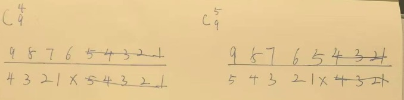
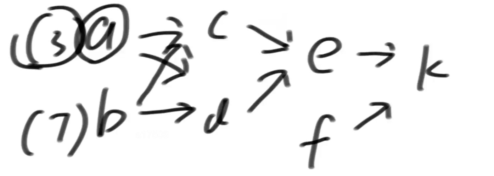

# 大厂刷题

## coding问题

#### 心得:

1. 如果求任意某个数超过一半,那么就每次消灭2个不同的,最后剩下来的,"有可能"是.
2. 如果求一堆中答案中的最小值,那么注意,初始值应该为最大值,然后被答案覆盖.
2. 带括号的字符串解析套路:全部可以这样解:我的方法只处理最简单的,然后遇到左括号就开启子递归,遇到右括号或结束就返回2个值,一个是结果,一个是处理到的位置.

#### 23-3-136-超级水王问题

https://www.bilibili.com/video/BV16o4y1c77G?p=182&vd_source=aa2ca96f997833d2dcbb3cf9f4cd33ac

> 超级水王问题
> 给定一个数组arr，长度为N，如果某个数出现次数大于N/2，称该数为水王数，如果arr中有水王数，打印这个数；如果没有水王数，打印没有水王数
> 要求时间复杂度O(N)，额外空间复杂度O(1)
> 扩展1：摩尔投票
> 扩展2：给定一个正数K，返回所有出现次数>N/K的数

一次消掉2个不同值的数字,这样消完了,如果一个数字,大于一半,那他最后一定会剩下来.但是剩下的不一定是水王,但是如果剩下来的都不是,那就没有水王了.

具体怎么做:

我们把超级水王比喻为子弹,把其他的数字比喻为靶子,如果水王超过一半,那么每颗子弹消耗一个靶子后,那么他一定还有剩余,例如,`[1,2,1,3,1]`这个数组,否则一定不存在,但是注意,如果有剩余,也不一定存在超级水王,需要再过一遍数组,例如`[1,2,3,4,5]`

扩展二:

先举个例子吧,假设K=7,也就是>N/7的数都符合,那,最多有几个,6个,怎么可能7个数都>N/7呢.

上面的超级水王问题就是>N/2,最多可能就1个.

那怎么搞呢,超级水王立一个靶子,就干他,那多个水王问题,就立多个靶子.

当遍历过程中靶子够了K-1个数了,来了个新的数,那得跟靶子里所有类型的靶子碰一下,并且自己也不要了,如果已有靶子表,记录某个类型的靶子已经为0了,删除这条记录.相当于一次删除了k个不同的数.

然后到了最后,看看所有水王候选,怕;判断下他们是不是.

#### 完美走位问题.

https://leetcode.cn/problems/replace-the-substring-for-balanced-string/description/

> 原题描述:
>
> 程序接收一个表示走位的字符串，通过统计A、S、D、W四个键的出现次数，然后使用滑动窗口和双指针技术寻找并返回能将走位变为完美走位的最小子串替换长度。如果原始走位已经是完美走位，则返回0。
>
> 翻译版本:
>
> 有一个只含有 `'Q', 'W', 'E', 'R'` 四种字符，且长度为 `n` 的字符串。
>
> 假如在该字符串中，这四个字符都恰好出现 `n/4` 次，那么它就是一个「平衡字符串」。
>
> 给你一个这样的字符串 `s`，请通过「替换一个子串」的方式，使原字符串 `s` 变成一个「平衡字符串」。
>
> 你可以用和「待替换子串」长度相同的 **任何** 其他字符串来完成替换。
>
> 请返回待替换子串的最小可能长度。
>
> 如果原字符串自身就是一个平衡字符串，则返回 `0`。

思路:

这个一个窗口题,中等偏难的难度.假如我有一个方法,我给他一个LR范围,看看这一段,随意变化,是否能让整体符合条件,  

从0开始,如果0-0不行,那我试试0-1,0-2试试,如果0-3可以了,则我得到了一个答案,以0开头,最小的一个答案,

然后,我让L右扩,1-3能不能行,如果可以,那最小答案就是1-3,范围更小了

假设1-3不行,那1-4呢,1-5呢,如果1-5可以,又得到一个答案,那我试试2-5,

直到,我得到min(所有答案的长度).

```java
public static void main(String[] args) {
    System.out.println(balancedString("QQRR"));
}
public static int balancedString(String s) {
    int n = s.length();
    //转换qwer为0123值
    int arr[] = new int[n];
    //qwer对应0123,统计一个词频统计
    //cnt 窗口外面的词频统计,一开始所有字符都在窗口外面,所以这里直接初始化
    int cnt[] = new int[4];
    char[] chars = s.toCharArray();
    for (int i = 0; i < n; i++) {
        char aChar = chars[i];
        int temp = 0;
        switch (aChar){
            case 'Q':
                temp = 0;
                break;
            case 'W':
                temp = 1;
                break;
            case 'E':
                temp = 2;
                break;
            case 'R':
                temp = 3;
                break;
        }
        //转换完成
        arr[i] = temp;
        //词频统计完成
        cnt[temp]++;
    }

    //长度一定是4的倍数,那么所有的字符全部调整一遍,也就是调整n个字符,一定可以做到.所以初始答案是n不是0.!!
    int result = n;
    for (int l = 0,r = 0; l < n; l++) {
        //这个lr范围,我怎么变都搞不定 并且 我都扩到头了都搞不定
        //如果不能做到,右扩窗口,如果扩到头了,也退出.还是搞不定
        while (!ok(cnt, l,r) && r < n){
            //这个什么意思??一开始,LR都是0,cnt包括所有的词频统计,r右扩后,区分里外,范围外,词频统计减去窗口内的值.
            //窗口扩大,外面的词频统计减少
            cnt[arr[r++]]--;

        }

        //上面跳出的2种情况
        //1,能做到了,那么我要L右扩了,
        if (ok(cnt,l,r)){
            //我收集一个答案,并且取最小的.
            result = Math.min(result,r-l);
        }else {
            //2.做不到,真的做不到,扩到头了都做不到,没得算了.
            break;
        }
        //l右扩,窗口减少,左侧的出窗口,进入到窗口外词频统计
        cnt[arr[l]]++;
    }

    return result;
}

/**
 * 拉齐窗口外面的短的到一样长,然后里面的剩余的字符,能均分,就说明ok,否则搞不定
 * @param cnt 窗口外面的词频统计
 * @param l
 * @param r
 * @return
 */
private static boolean ok(int[] cnt, int l, int r) {
  //哪个字母个数最多
    int maxCount = Math.max((Math.max(cnt[0],cnt[1])),(Math.max(cnt[2],cnt[3])));
  //凑4个字母的n份,就是maxCount * 4,减去窗口外面的,就是窗口内部的需要变多少个.
    int needChanged = maxCount * 4 - cnt[0] - cnt[1]- cnt[2]- cnt[3];
  //区间内,除去需要补齐4份的,剩下的正好能变 4个字母 * n份,代表能搞定.
    int rest = r-l-needChanged;
    //剩下的正好整除4
    return rest >=0 && rest % 4 == 0;
}
```


#### 3-017-双人乘船过河问题

https://www.mashibing.com/study?courseNo=465&sectionNo=34953&courseVersionId=1348

> 给定一个正数数组arr，代表若干人的体重
>
> 再给定一个正数limit，表示所有船共同拥有的载重量
>
> 每艘船最多坐两人，且不能超过载重
>
> 想让所有的人同时过河，并且用最好的分配方法,让船尽量少,返回最少的船数

思路:

我先给整个人的体重排序,然后,找到一个limit/2位置的值,在这个地方,左右,设置LR指针,

然后,此时L左移,不能配对就打叉,直到遇到第一个能配对的,不急着分配,R右移,直到遇到第一个不能配对的位置.R移动了几个位置,就拿L左侧的多少个值来配对,这样是最划算的,直接来给这R右移的所有的消化掉.搞定完了后,L从消耗完了的位置,继续重复上述步骤....R右移,消耗左侧右移位数个,

这样下来,总有一侧先耗尽的时候.

1.左侧先耗尽,

左侧的,滑过的,打叉的,直接除2一船,2人肯定能坐下,如果左侧最小的+右侧最大的超过limit,那么,肯定左侧先耗尽,左侧全部打叉.

那结果就是,✅/2 + 打叉的/2+右侧剩余的 = 所有需要的船

2.右侧先耗尽.

左侧没消耗的,剩下的全部打叉,✅/2+画叉子的/2 就是需要的船


#### 奇偶层树节点分配后差值<=1问题

https://www.bilibili.com/video/BV16o4y1c77G?p=5&vd_source=aa2ca96f997833d2dcbb3cf9f4cd33ac

> 来自腾讯音乐
> 给定一棵树，一共有n个点,每个点上没有值，
>
> 请把1~n这些数字，不重复的分配到二叉树上
>
> 做到 :奇数层节点的值总和 与 偶数层节点的值总和 相差不超过1
>
> 返回奇数层节点分配值的一个方案
>
> 2 <=n<= 10^5
>
> 假设5个节点,就是给1~5这个数字,分配到树上,然后,奇偶层查值<=1

首先,这个题,上来提到一棵树,但是他实际上是蛊惑你的,这个和树的关系不是非常的大,他求得是奇偶层的总和的比较.也就是,大约一半的节点数,,凑到所有数字累加和的一半,怎么凑.

这个题,数据量,10的5次方,如果做动态规划,这个表就爆了,所以这不是个动态规划题.

我们这样想,首先,得到一半的大小,然后确实是尽量去凑这个数,但是怎么凑,是重点.

我们先让k个数,分别取前k个,重点来了,我们看看边界,假如,我前面k个数,都比这个sum/2值(基数可能差1偶数必须相等)大,或者最后k个数,都没有sum/2值小,那么一定没结果,否则一定有值.我们只需要求一个.

假设,100个节点, 我们需要知道,奇数偶数层各多少节点,

例如1,49,51个,那么我们总数sum/2是5050,假设我们求凑x=50,或者x>100000,那么我们知道肯定没有答案,如果假设凑500,那么我们知道肯定有答案.那么就是说,k=49个数,我们要凑5050,或者前面的凑不出,51个数,我们要凑5050,首先我们算一个前49个数的小和,(1+49)*49/2=sumMinK,然后,我们看看单个数字能提升多少,就是让第49位的数,移动到100,单个数可以提升range=51,那么我们让(5050-sumMinK)/range = 需要移动多少个数字,我们让这些数字一次挪到后面,然后,5050-sumMinK)%range ,就是一个数,不需要完整的移动一个range,这些移动的数字和前面的每移动过的,全部加载一起,即是答案.


#### 4-025-大楼轮廓线问题

https://www.mashibing.com/study?courseNo=465&sectionNo=34961&courseVersionId=1348

https://leetcode.com/problems/the-skyline-problem/

思路:我们把输入值,按照起点排序,他升高到了某个点什么时候结束,不知道,要么,被其他升高的打断了,升的更高了,要么,自己到头了.掉下来了.

我们可以拆分这个输入值,组成2个对象,{起点,升高,升高值},{终点,降落,降落值},按照起点,,排序

我们要求的是每一个变化点或者每一个大楼高度有变化的点的轮廓,我们就记录下来每个点的数据,将上面的对象,2*N个输入值,因为一升一降,放到有序表里,怎么放,如果是true,按照升高值作为k,然后val+1,如果是false,按照下降至val-1,如果val = 0了,整条记录删除掉.

准备两个有序表,一个记录,最大高度为k,v为次数,另一个,记录,每个x位置,就是起点位置终点位置的最大高度是多少.我希望有序,所以用有序表.用linkedHashMap也行,因为我依次记录的.

为什么0次了,整条记录要干掉,不留着0,因为我要,求最大的k,他会干扰我.

用第一个有序表得到第二个有序表,即x位置最大高度,

然后根据x位置最大高度,得到轮廓线答案.


#### 8-048-字符串公式解析问题.

https://www.mashibing.com/study?courseNo=465&sectionNo=52248&courseVersionId=1348

> 给定一个字符串str，str表示一个公式
>
> 公式里可能有整数,加减乘除符号和左右括号
>
> 返回工时的计算结果,难点在于括号可能嵌套很多层
>
> `str="48*((70-65)-43)+8*1"`，返回-1816。
>
> `str="3+1*4"`返回7。
>
> `str="3+(1*4)"`
>
> 【说明】
>
> 1. 可以认为给定的字符串一定是正确的公式,不需要检查有效性
> 2. 如果是负数 就需要用括号括起来，比如`4*(-3)`,但是如果他作为开头或括号部分的开头,咋可以没有括号,例如`-3*4和(-3)*4`都是合法的.
> 3. 不用考虑计算过程中会发生溢出的情况。

思路:

这个题,我们用递归做,我每个方法中,只做最简单的加减乘除计算,记作int[] ans = f(arr,i)方法

其中,f方法,定义为:只计算简单的公式,如果遇到左括号,则开启新的子方法,等待返回值,返回值包括两个值,1.当前方法的计算结果,2.计算到str的位置.什么时候返回,当结束了,或者,遇到了右括号的时候.

简单计算方法,做一个栈,设置一个cur=0,遇到数字就cur*10然后加当前值,如果遇到符号,数字,符号依次放到栈中,当一个数加入到栈中时候,如果是乘除符号,直接拿出来,做一个计算,计算完了后,再整个将结果放进去.每个方法遇到左括号就开启新方法,这样每个方法都是最简单的计算.

-3这种负数怎么办.没关系.cur是0,0*10先进栈,负号进栈,3进栈,就是0-3嘛.答案就是-3,完全兼容了!!!

用这个套路,都可以解决,什么压缩后是abc3{aabbcc} 的,问原先字符什么样的,一样的解析.

#### 37-4-291-给一个压缩字符串给他展开

> 给定一个经过编码的字符串，返回它解码后的字符串。
> 编码规则为: k[encoded_string]，表示其中方括号内部的 encoded_string 正好重复 k 次。注意 k 保证为正整数。
> 你可以认为输入字符串总是有效的；输入字符串中没有额外的空格，且输入的方括号总是符合格式要求的。
> 此外，你可以认为原始数据不包含数字，所有的数字只表示重复的次数 k ，例如不会出现像 3a 或 2[4] 的输入。
> Leetcode题目 : https://leetcode.com/problems/decode-string/

公式套路可解:

遇到了括号,直接开启子方法,然后外面的数字,就乘这么多遍.

注意返回的2个参数,一般用int[]来装,只有2个值,一个是返回的值,一个是位置.因为父位置要接着这个位置往下撸.

对于本题这种,int值装不了答案的,需要自己封装个Info,也是一个答案String,一个撸到的位置int.

例如

3 [ 2 [ d s  ] 1 [  z   ]    ]

0 12 34 5 6 7 8 9 10 11

f1开启 -> 2倍的 f3 返回 ds 撸到6 所以f1就是dsds

f8开启 返回z 撸到10,所以f8 就是z

f1结束于11,返回dsdsz 撸到11,

主函数,3倍的, dsdsz dsdsz dsdsz结束.

#### 14-1-088 返回左右括号组成的字符串,最长的有效子串长度

https://www.mashibing.com/study?courseNo=465&sectionNo=35017&courseVersionId=1348

> 给定一个只由左括号和右括号的字符串
> 返回最长的有效括号子串的长度

子串:以i位置结尾往前最远推多远!

看到子串了吧,那就是遍历展开,然后以i位置结尾,最长,往前推多远.

basecase :

* i==0时,一定不可能,就一个怎么凑对呢.
* i==1是,得是右括号,并且0位置的得是左括号,那他才是2,否则,0.

普遍位置:

i位置时,看下他前面一个,如果他前面一个,一点都推不动,是0,那看看他俩能不能凑对,凑上了就是2,凑不上就是0,如果他前面凑上了,例如8,那他就要和i-8-1位置去凑对,凑上了,就是8+2,别急,还没完,i-8-1位置的前一个,还得看看,如果不是0,那还得加上,一路走来,不是0就记录一个最大值,遍历完了后,返回最大值.


#### 7-043-如果排序后,相邻两数最大差值问题

https://www.mashibing.com/study?courseNo=465&sectionNo=52880&courseVersionId=1348

> 给定一个数组arr，返回如果排序之后，相邻两数的最大差值
> 要求:时间复杂度O(N)

假设答案法!!又是假设,超难的题.

注意,是如果排序,不是真的排序,排序就已经O(N*logN)了

这个题非常难,难住很多国手,因为一般N*logN ,logN不会很大,一般当做较大的常数项了.而本题要求了,O(N)

这个题,不需要扩散性思维,出现这种题,就是非常难,记住这个一个题就行了,足够了.

这个题,利用了个桶排序的思想,桶排序,可以做到O(N)

假设答案是什么意思,我就假设:9个数,最小值0,最大数99,那我分10个桶,一定有一个会是空桶,如果是13个数呢,那就14个桶,分数一样的算,我取10个桶只是为了示例.

好,意义是什么,我9个数分10个桶,必有一个空桶,那么就是说,单个桶内,必不可能出现答案,也不一定是在空桶两侧,不一定的啊,例如1-19,差值18,19-31,差值才12,所以这个只是为了排除答案不可能出现在单个桶内.每个桶,只需要保留2个信息,最大值多少,最小值多少.

然后全过一遍后,每个桶的最大最小减一下,答案就知道了.


#### 09-058-线型点灯和环形点灯问题

https://www.mashibing.com/study?courseNo=465&sectionNo=57229&courseVersionId=1348

> 给定一个数组arr，长度为N，a中的值不是0就是1。arr[i]表示第i栈灯的状态，0代表灭灯，1代表亮灯
>
> 每一栈灯都有开关，但是按下i号灯的开关，会同时改变i-1、i、i+1栈灯的状态
>
> 问题一:如果N栈灯排成一条直线,请问最少按下多少次开关灯全亮?
>
> i为中间位置时，i号灯的开关能影响i-1、i和i+1
>
> 0号灯的开关只能影响0和1位置的灯
>
> N-1号灯的开关只能影响N-2和N-1位置的灯
>
> 
>
> 问题二:如果N栈灯排成一个圈,请问最少按下多少次开关,能让灯都亮起来
>
> i为中间位置时，i号灯的开关能影响i-1、i和i+1
>
> 0号灯的开关能影响N-1、0和1位置的灯
>
> N-1号灯的开关能影响N-2、N-1和0位置的灯

这个是以前字节的一个题,考的是第二个问题.这个题非常的难.

其解题思路用到了体系学习班最后的那个,结合外部信息猜解法的思想.

思路:

这个题,我们最麻烦的是,当前位置会改变已经做过决策位置的值,所以,我们要做出一个改变,我们当前位置的值,不由我改变,由我后面的改变.

所以我定义的方法为,f(arr,nextIndex,preStatus,curStatus),参数含义为

nextIndex:当前在i位置上,传i+1, nextIndex -1 = cur,当前,

cur-1 为preStatus,

cur 为 curStatus,

隐含的含义就是,我以前的我都搞定了,都亮起来,我由nextIndex的决定来帮我亮起来,如果我是灭的,那么下个开关必须按,同时传下去f(arr,nextIndex+1,cur=cur^1 这个就是我取反,因为开关必须按,arr(nextIndex)^1 按了以后,下一个状态也取反),如果我是亮的,那么下一个一定不能按,那就直接当前变pre,next变当前,直接传下去.f(arr.nextIndex+1,curStatus,arr(nextIndex)).

一直到最后,如果,最后一个开关,他俩都是亮的,那么不用按,如果都是灭的,开关按次数+1,否则状态不一致,怎么都搞不定.

这个思想有点像前面的二叉树相机覆盖问题,我的子如果没有被覆盖,我必须安置一个相机.

第二问:

第二问是环形了,跟上面的区别是,按0号灯会影响最后一个,最后一个会影响第一个,

根据第一个启发,我们依然是保持上面的思路,区别是,我们加2个参数,记住第一个和最后一个的状态,然后,我们从第2个开始,注意,不从第一个开始了,因为从2开始,有普遍性,第一个比较特殊,然后,我们0,1,这两个位置的,我们穷举,0不按,1按,00,01,10,11,四种穷举,挨个调用,返回最小值.这样,就得到了答案.


#### 09-059-无效括号串变有效的所有可能结果.

https://www.mashibing.com/study?courseNo=465&sectionNo=57230&courseVersionId=1348

首先,我们得知道,什么样的括号串,是错误的,那就是右括号比左括号多的时候,没有对应了.

设置一个count,当遇到左括号时候,count++,遇到右扩号的时候,count--,当count位负数的时候,那就是出现错误的时候.

那么,怎么修复这个错误的括号串,

那就是,从第一个右括号开始,可以开始删除,当后面接着的都是右括号,那都是一样的结果,跳过,当再遇到左括号的时候,可以继续删除右括号.

我定义的方法,传入的参数,剩余字符串,一个是我检查到哪里了,一个是我删除到哪里了,答案集合,再加一个当前传的字符(左括号还是右括号.),含义是,只要违规了,就给前缀调整对,任何一次调整完,我都return,

当我正着调整完了,我确定,右扩号一定不比左括号多,那么好了,我左括号有可能比右括号多,我给字符串反转,然后最后一个参数,改为")",左右互换,这样再走完一遍,我这个字符串,绝对正确.

这样走完了一遍了,我就收集到了一个答案.


#### 10-064-跳跃游戏

https://www.mashibing.com/study?courseNo=465&sectionNo=34993&courseVersionId=1348

https://leetcode.com/problems/jump-game-ii/

> 一个数组,每个值代表你从这里最远能跳多少步下去,返回跳到终点,最少需要多少步.

这个题,我们准备三个变量,

int step: 含义是走step步,最远能到cur位置

​	当前用了多少步了,当我遍历到终点时候,这个值,就是答案.一开始肯定是0步时候停在0位置.

next: 加入允许我多跳一步,我能到哪

​	提前准备好的,代表"如果"我多跳一步,我最远能到哪里,当数轴上面的值+下标 大于我的时候,我就更新.

​	初始值为数组的第一个值.

​	例如,[1,4,1,9,1,1,1,1,1],当i = 3时候,数轴9 + 3 > next,更新为12.

int cur:

​	初始肯定是0步可走,那只能到0位置,注意step和cur这两个属性,是伴生的.

​	如果i>cur,那就是我需要增加step了,增加step时候,next值直接拷贝过来,next置为null,

实例 [3,4,1,3,2,4,2,1,2,4,2,3,2]

初始值:step = 0; cur = 0; next = 3;

i走到1位置,走不动啊,step必须要加1,next直接来到cur上,next为null.代表,在1位置,要走一步,最远到3,

然后i来到2,4这个arr值+下标1,为5,更新next为5.

然后i来到3,不动,因为index<cur,但是3+3=6>5,所以next更新成6.代表"如果"多跳一步的话可以到6.

然后i来到4,不行了,step必须+1了,拷贝next到cur,next=null,代表,到4位置的2,必须2步了,next更新为2+4=6.

...............

当i来到n-1时候,step就是答案.


#### 13-3-86 超级洗衣机问题

https://www.mashibing.com/study?courseNo=465&sectionNo=35015&courseVersionId=1348

https://leetcode.com/problems/super-washing-machines/

> 就是说有N个洗衣机,每个洗衣机上面对着有衣服数量,每个洗衣机可以往左或往右扔一件衣服,一个回合内,所有的洗衣机都可以扔一次,问最少需要扔多少次.能让每个洗衣机上面的衣服一样多.

这个是一个求单个位置最大瓶颈问题,当一个瓶颈解决了的时候,全部就都解决了

首先,我们要得到,每个洗衣机上,应该有多少衣服,然后,来一个衣服小和的前缀数组,每个位置i看下,我左边,右边,各欠多少或者赋予多少件衣服.几个情况:

1. 如果一侧欠衣服,一侧富裕衣服,那就是取这两个值的max,就是i位置机器调整完的次数,
2. 如果两侧都欠,那也是取max,欠的多的调整完了,欠的少的肯定早调整完了,所以其实1,2是同样的处理方式
3. 如果两侧都富裕,也就是i位置欠的最多,那就是取左右的相加值,因为左右都给我,一次只能给1个,


#### 16-2-098-arr子集不能累加出的最小正数问题

https://www.mashibing.com/study?courseNo=465&sectionNo=35027&courseVersionId=1348

> 给定一个正数数组arr，
> 返回arr的子集不能累加出的最小正数
> 1）正常怎么做？
> 2）如果arr中肯定有1这个值，怎么做？

第一问:

首先,又是子集,那肯定又是从左往右了,要或者不要,

有点像16-1-097那个题,从左往右尝试,0~N,能不能搞定,能不能搞定2,能不能搞定3......搞不定,返回.

经典背包.

第二问:

我们先给数组排个序,

我们不从0开始,假设从1开始,如果肯定有1,那么1~1范围上,能搞定1,如果2位置是1,或者2,那肯定能搞定1~3,我们引入一个变量,叫range,此时,1~2范围上,可以搞定range1~3,如果2位置不是1或2,而是3呢,那我们发现,2,怎么都搞定不了,返回2,这个条件是什么呢,i位置>range+1,返回range+1,否则,range变成range+当前位置的值

如果题目要求是0开始的,那我们最终结果也减一.

如果不含1,那么最小的正整数就是1.


#### 16-3-099-patching-array问题

https://www.mashibing.com/study?courseNo=465&sectionNo=35026&courseVersionId=1348 

https://leetcode.com/problems/patching-array/

> 给定一个数组nums,再给定一个整数n,
>
> nums随便选择子数组,问问补充几个数,能搞定1~N所有的组合.
>
> 例如数组[1,5],n=10,问补充几个数,1~10全部能搞定.

还是上面的那个那个做法,我们要先搞定1~1,然后1~3,然后,,,其实就是让range再一个范围内,全部都能搞定,直到range超过n的时候,补充的数,就是我需要的数.

首先是在使用给定数组之前的,例如[4,5,17,39],凑83,我想用4,那不行啊,我得现有range1,那我得补充个1,我让range涨到3,我得补充个2,然后我可以用4了,!!!range涨到7,我想用5,需要满足range4,已经满足了,所以,range涨到12,想用17不行,需要range16,我再来个13,range涨到了25,使用17,我的range涨到42,可以无缝衔接39,涨到81,好的,没数了,孤独的往上涨吧,来个82,range超过了83了,得到了答案


#### 16-4-100-求长度为2的power次方的数组中逆序对的问题

https://www.mashibing.com/study?courseNo=465&sectionNo=35029&courseVersionId=1348

> 给定整数power，给定一个数组arr，给定一个数组reverse，
> 含义如下：
> arr的长度一定是2的power次方
> reverse中的每个值一定都在0~power范围。
> 例如power = 2, arr = {3, 1, 4, 2}，reverse = {0, 1, 0, 2}
>
> 任何一个在前的数字可以和任何一个在后的数组，构成一对数
> 可能是升序关系、相等关系或者降序关系
> 比如arr开始时有如下的降序对：(3,1)、(3,2)、(4,2)，一共3个
> 接下来根据reverse对arr进行调整：
> reverse[0] = 0, 表示在arr中，划分每1(2的0次方)个数一组然后每个小组内部逆序，那么arr变成[3,1,4,2]，此时有3个逆序对
>
> reverse[1] = 1, 表示在arr中，划分每2(2的1次方)个数一组，然后每个小组内部逆序，那么arr变成[1,3,2,4]，此时有1个逆序对
>
> reverse[2] = 0, 表示在arr中，划分每1(2的0次方)个数一组，然后每个小组内部逆序，那么arr变成[1,3,2,4]，此时有1个逆序对
>
> reverse[3] = 2, 表示在arr中，划分每4(2的2次方)个数一组，然后每个小组内部逆序，那么arr变成[4,2,3,1]，此时有4个逆序对
>
> 所以返回[3,1,1,4]，表示每次调整之后的逆序对数量
>
> 输入数据状况：
> power的范围[0,20]
> arr长度范围[1,10的7次方]
> reverse长度范围[1,10的6次方]

这个题,暴力解,我每次调整完了后,算出逆序对,然后收集答案,可是你看看数据量,绝对不可能过的了.

这个数据范围,最多,一个O(N*logN)

这个题用到了一个归并排序的merge思想.我们求这个降序对,N^2遍历一遍,能得到,我们也可以像归并那种,先求两个一组,多少降序对,再求2^2,也就是4个一组,多少降序对,注意不算刚刚的2个一组的,再求2^3,也就是8个一组,多少降序对,注意不算刚刚4个一组的,然后2^4,......直到2^20次方,我们要的是,每个次方的降序对合,当这些全部加在一起的时候,就是整个的答案.

上面说到的内容,我们用2个辅助数组,一个降序对,一个升序对.升序对,我们将整个源数组逆序,求降序对,就是升序对,一套方法搞定.

重点来了,干嘛用.

假如,我们2^3的数组,8个长度,2^1,2^2,2^3,三个逆序的范围的可能,例如现在来了个2次方的,实际就是4个逆序,左右逆序,但是左右,大的相对位置不变,例如[4,8,3,1,1,3,7,4],我们2^3时候,8个数一组,4个数来自左边,4个来自右边,如果现在2^2逆序了,影响2^3的吗?不影响,因为2^2逆序了,结果是[3,1,8,4,7,4,1,3],对于2^3来说,还是左边取4个配右边取4个,相对的位置不变.只有2^2,2^1变了,升序对变逆序对.

所以,当我们得到了2个辅助数组后,每次直到哪个逆序了,直接从他往下的,升序逆序互换,数值全部相加,就是答案.!非常快.


#### 17-1-103-返回数组中有没有num的数

https://www.mashibing.com/study?courseNo=465&sectionNo=35032&courseVersionId=1348

> 给定一个每一行有序、每一列也有序，整体可能无序的二维数组
> 再给定一个数num，
> 返回二维数组中有没有num这个数

这个题比较水,

从左往右,从上往下,都有序,

我从右上角开始,比num大吗?大就往左走,小就往下走,因为单边有序嘛.,一个m+n的复杂度,搞定

或者从左下角开始,也是一样的,比num大就往上走,因为上面的小,比num小就往右走,一样的复杂度,但是左上,右下不行,没有单调性.


#### 16-6-102-约瑟夫环问题

https://www.mashibing.com/study?courseNo=465&sectionNo=35031&courseVersionId=1348

https://leetcode-cn.com/problems/yuan-quan-zhong-zui-hou-sheng-xia-de-shu-zi-lcof/

> 约瑟夫环问题
> 给定一个链表头节点head，和一个正数m
> 从头开始，每次数到m就杀死当前节点
> 然后被杀节点的下一个节点从1开始重新数，
> 周而复始直到只剩一个节点，返回最后的节点

剃刀函数,这样的都从基础通项公式入手:y=x%i

1~i 对应1~i

当i+1时候,又回到1,当2i+1的时候,又回到1.

左加右减,上加下减,我这个函数由基础函数变完了,就是y=(m-1)%i+1,先向右,再向上嘛.

想求得是什么,最终活着的肯定就1个,他的编号,此时是1,那么上一轮,他的编号是几呢,再上一轮呢,直到一开始,,他的编号是几呢??

我们一点点推出这个公式.

S=被干掉的位置,公式是S=(m-1)%i+1,左加右减上加下减.

前一个号= (后-1+S)%i+1,左加右减上加下减.

带入S后,这个公式的复杂度O(1).前=(后-1+(m-1)%i+1)%i+1 ->前=(后+(m-1)%i)%i+1

进一步优化,我们可以认为,m-1是k*i+r余数,%就相当于k=0,就是m-1 = r

前=(后+r)%i+1->前=(后+m-1)%i+1


#### 14-4-091-first-missing-positive

https://www.mashibing.com/study?courseNo=465&sectionNo=35020&courseVersionId=1348

https://leetcode.com/problems/first-missing-positive/

> 几乎字节原题:非常难
>
> 给定一个数组,正负0都可能有,给我返回最小的缺失的正整数.
>
> 要求:时间复杂度O(N),额外空间复杂度O(1).
>
> 杀死了用辅助工具的可能.Hash表,不能用,不能申请大结构.
>
> 字节是求大于k的,所有数 减去 个k,再求最早缺失的正整数,是不是一个题.!!

这个题,给定了n个数,要求O(N),那就只能遍历一遍数组拿下.

我们想求一个东西,就是,假如说,6个数,我们就理想的认为,我们都能凑够,1~6,然后第一个丢掉的正整数是7.

我们从两头看,假设,中间一坨,完全搞定了,然后一点点剔除,什么意思

左右2个指针.LR,分别在0位置和N-1位置,我们假设的就是L~R这N个数全部都在嘛,那N就是第一个缺失的.

然后,我们干啥,我们既然认为每个位置的数都有,那我们就要让每个位置的数,都是i+1,也就是0位置是1,1位置是2.N-1位置是N,

让指针开始移动了,先看看L位置的数,如果小于1,那么直接让他跟最后一个位置换,他不是我们要找的,那换完了R位置左移,我们只能找到N-1个数了,也就是我们找到任何一个不想要的,都是垃圾数字,都会让我的预期变小,都要换到最后,R左移,也就是R右边,都是垃圾区.R位置,就是我第一个缺失了的数.那么有多少种垃圾数字呢.

1. 刚刚说的<1 的,实际是小于等于L的,都已经有了,不要了.
2. 已经大于R的,不可能到这来了.
3. 没出现过,但是换过去后,发现他也是这个,重复了,我只要一个就行了,进入垃圾区.

直到L,R重叠,所有数,看完了,R位置,就是第一个凑不上的正整数


#### 17-2-104-返回最小的第k个数.

https://www.mashibing.com/study?courseNo=465&sectionNo=35033&courseVersionId=1348

https://leetcode.com/problems/kth-smallest-element-in-a-sorted-matrix/

> 给定一个每一行有序、每一列也有序，整体可能无序的二维数组
> 在给定一个正数k，
> 返回二维数组中，最小的第k个数

这个题跟上一个题差不多,我们首先要知道,当我从右上角开始,求一个值,有多少个数,比我小??那么这个值,是什么?

我们先看一下,右下角的是多少.假设1000.二分,我找500,看看,他有多少比我小.

我右上角位置.出发,如果比我500大,我往左走,比我小,往下走,然后很快我就能用公式算出来,多少个比我小.

如果我要求第300小的,结果比我500小的,有200个,一共1000个,那我知道,第300小的,值一定在500值到1000值之间.再二分.找750来一遍.

发现比750小的有100个,那我知道,这个值一定在500~750值范围之间.

注意,我们每次二分的时候,需要注意下,收集个数的同时,还需要记录这次搜索过程中最小的数,因为未必等于我二分的值.

==当我算比我小的个数的时候,当比k小的时候,一定不是答案,当大于的时候,我先记录下这个答案,看看后续二分,有没有可能变得更小.==


#### 17-6-108,109,110后半部分50:17-多少个字符串对是回文问题.

https://www.mashibing.com/study?courseNo=465&sectionNo=35037&courseVersionId=1348

> 给一些个字符串,问其中哪些个字符串凑对,能组成回文的数量问题.
>
> 给定一个字符串数组arr，里面都是互不相同的单词，找出所有不同的索引对(i, j)，使得列表中的两个单词，words[i] + words[j]，可拼接成回文串。
> Leetcode题目：https://leetcode.com/problems/palindrome-pairs/

这个题,最好先去看下体系学习的manacher,更好的对你的回文加速有一个帮助.

首先暴力解:每个字符串,两两凑一块,暴力嘛,N^2,然后假设字符串平均长度,k,综合就是O(N^2*k).

另一个解:

我们拿到一个字符串,我们怎么搞,我们先看看,怎么他能变回文,

如果他一个字符,那么我给后面的逆序加到前面,可以搞定,如果2个回文,那么后面一坨逆序加到前面,可以搞定.....直到字符串长度.我们可以完全逆序拼到后面.

我们这个方案,需要注意,别算重复了

另一个,就是,我需要给所有的字符串加到哈希表里,记录每个字符串所在的位置,便于快速找到逆序字符串,返回位置.

这个复杂度多少呢?

假设字符串长度k,判断回文,k,生成逆序,k,去哈希表查,==不是O(1)==,我这是字符串,不是内存地址,所以要先把字符串给哈希一个东西,才能继续去找,不能忽略,这个O(K).

查询前缀是否回文,可以manacher加速为O(1),但是生成逆序,O(k)*查表O(k),时间复杂度O(K^2),然后,每个字符串走一遍.

总代价,O(N * k^2),

好的,两种方案,就要看数据量猜解法了:如果N大k小,就用第二种,如果k大,N小,就用第一种.


#### 19-1-116-LRU算法

https://www.mashibing.com/study?courseNo=465&sectionNo=35045&courseVersionId=1348

https://leetcode.com/problems/lru-cache/

> 一个缓存,当缓存满了的时候,按照最久不用的先淘汰,如何设计结构.

一个双端队列,一个哈希表,哈希表直接v的指针指着双端队列中的node,便于快速找到在双堆队列中的位置.

当第一个k来的时候,建立节点,放到队列中,头尾指向null,当来个新的时候,挂在后面,假设容量就2,再来个就满了.好

此时来个没来过的.那谁是最久的呢,队首的就是最早的,给他断掉,给新来的加到队尾.

如果此时来了个是之前出现过的或者get了,那我直接给他断掉,接在队尾,这样他就最新了.

总结==:双端队列+哈希表==


#### 19-1-117-LFU算法

https://www.mashibing.com/study?courseNo=465&sectionNo=35046&courseVersionId=1348

https://leetcode.com/problems/lfu-cache/

> 一个缓存,当缓存满了的时候,按照调用次数最少的先淘汰,相同调用次数的,最久不用的先淘汰,如何设计结构.

首先,假设,调用次数都一样的情况下,淘汰最久的,我们搞过了,就是LRU,一个双端队列.

其实一样的,只是规则不一样,一个是根据时间,一个是根据次数,不就是套一起吗?就算再来更多维度一样的.

就是2个双端队列,一个用于记录调用次数的,次数里面是相同次数下,时间轴的k的.

淘汰逻辑就是,先找调用次数的数组的头,然后,里面找到一个双端队列,淘汰这个里面的头,

更新或get逻辑:先找到他的位置,断掉.如果次数的队列都空了,连这个次数的队列这个整个的容器都断掉!然后找到对应的容器,取出队列,加进去.


#### 24-1-140-返回第k的数值对

https://www.mashibing.com/study?courseNo=465&sectionNo=35069&courseVersionId=1348

> 长度为N的数组arr，一定可以组成N^2个数字对
> 例如arr = [3,1,2]，数字对有(3,3) (3,1) (3,2) (1,3) (1,1) (1,2) (2,3) (2,1) (2,2)
> 也就是任意两个数都可以，而且自己和自己也算数字对
> 数字对怎么排序？
> 第一维数据从小到大；第一维数据一样的，第二维数组也从小到大
> 所以上面的数值对排序的结果为：(1,1)(1,2)(1,3)(2,1)(2,2)(2,3)(3,1)(3,2)(3,3)
> 给定一个数组arr，和整数k，返回第k小的数值对

按照第一维开始排序,第二维也从小到大排序.

排序后,我们知道整个数值对数组的长度,假设是M,那么以1开头的,假设2个1,那是不是2M个1开头的数,这是前2M个最小的数,因为1开头的嘛.

然后,假设M=20,1开头的2个,那就是40个数1开头,假设求第55小的数.那么我知道肯定不是1开头的数,找到下一个开头的数,看看他有多少个,假设,两个2,那这2开头的又40个,40+40超了55了.所以他在哪呢.在第一个2加上第15个数值对的第2位数字.

#### 24-4-143 -至少有多少种颜色可以完成任务

https://www.mashibing.com/study?courseNo=465&sectionNo=35072&courseVersionId=1348

> N * M的棋盘（N和M是输入参数）
> 每种颜色的格子数必须相同的
> 上下左右的格子算相邻
> 相邻格子染的颜色必须不同
> 所有格子必须染色
> 返回至少多少种颜色可以完成任务

暴力方法,观察规律,写出解.

从2种方法开始,最多N*M种颜色,

一个是N*M必须整除i,另一个是暴力方法可以验证能填上.

发现,结果是N*M的最小质数因子.

怎么来的,不关心,不知道,论证太长看不懂不管.


#### 25-3-148-max-points-on-a-line 罩住最多点的线问题

https://www.mashibing.com/study?courseNo=465&sectionNo=35077&courseVersionId=1348

https://leetcode.com/problems/max-points-on-a-line/

> 给定一个二维数组,代表一些点,求画一条线的话,最多能罩住多少个点.

每一个点为起点,和他后面的点化一条线,为什么前面的不用画?因为答案如果在前面的点,那前面的点已经和他连过了.

画一条线,有几种可能

1. 同一个点,共点
2. 垂直线
3. 水平线
4. 普通的斜率线

普通斜率怎么表示??

不能HashMap<double,int>,因为会有精度耗损.所以,用分数表示,2/5和20/50怎么约.

求公约数,不会就背住就完事了.

```java
public static int gcd(int a,int b){
	return b == 0?a:gcd(b,a%b)
}
```

能约了,我们用Map<Integer,Map<Integer,Integer>>来表示,2,{5,6}代表2/5斜率上有6个点.每遇到同一个斜率的,就加一个点.

每次走的过程中,收集上面4中情况,

每次比对,上次的result和此次max(2,3,4)+共点 的max返回


#### 28-2-160-StringToInteger

https://www.mashibing.com/study?courseNo=465&sectionNo=35089&courseVersionId=1348

https://leetcode.com/problems/string-to-integer-atoi/

> 请你来实现一个 myAtoi(string s) 函数，使其能将字符串转换成一个 32 位有符号整数（类似 C/C++ 中的 atoi 函数）
> 函数 myAtoi(string s) 的算法如下：
> 读入字符串并丢弃无用的前导空格
> 检查下一个字符（假设还未到字符末尾）为正还是负号，读取该字符（如果有）。确定最终结果是负数还是正数。 如果两者都不存在，则假定结果为正。
> 读入下一个字符，直到到达下一个非数字字符或到达输入的结尾。字符串的其余部分将被忽略。
> 将前面步骤读入的这些数字转换为整数（即，"123" -> 123， "0032" -> 32）。如果没有读入数字，则整数为 0 。必要时更改符号（从步骤 2 开始）。
> 如果整数数超过 32 位有符号整数范围 [−231,  231 − 1] ，需要截断这个整数，使其保持在这个范围内。具体来说，小于 −231 的整数应该被固定为 −231 ，大于 231 − 1 的整数应该被固定为231 − 1。
> 返回整数作为最终结果。
> 注意：本题中的空白字符只包括空格字符 ' ' 。除前导空格或数字后的其余字符串外，请勿忽略 任何其他字符。

又来转数字了,我们老传统了,先转负数接.

我们这么干,字符串一个个字符往下走,只要他是数字,就给他转数字,往下接,如果中途溢出了,就返回-1或者抛出异常.

我们用负数接,为什么,因为,负数的绝对值,比正数大,所以更安全.

比如就给你个"-2147483647",他是不是不溢出,但是你用正数接,他就溢出了!!!!!!!!

判断字符串的开头,"-"开头,就记录一个状态是负数,否则不是负数.然后继续往下撸数字.

既然用负数接,那我就用'0'的Ascii码减去当前遍历到的字符的....捞一下.,'0'的ascii码int值为48,付一个码表网址https://www.jyshare.com/front-end/6318/

然后 乘10 + 当前值,注意考虑溢出,乘完了可能溢出了.如果小于系统最小/10,那会溢出了!.等于呢,不一定,因为是正数,个位数是0,要考虑+cur是否溢出.膜一下,然后比一下.


#### 28-3-161-IntegerToRoman

https://www.mashibing.com/study?courseNo=465&sectionNo=35090&courseVersionId=1348

https://leetcode.com/problems/integer-to-roman/

> 罗马数字包含以下七种字符： I， V， X， L，C，D 和 M
> 字符          数值
> I             1
> V             5
> X             10
> L             50
> C             100
> D             500
> M             1000
> 例如， 罗马数字 2 写做 II ，即为两个并列的 1。12 写做 XII ，即为 X + II 。 27 写做  XXVII, 即为 XX + V + II 。
> 通常情况下，罗马数字中小的数字在大的数字的右边。但也存在特例，例如 4 不写做 IIII，而是 IV。数字 1 在数字 5 的左边，所表示的数等于大数 5 减小数 1 得到的数值 4 。同样地，数字 9 表示为 IX。这个特殊的规则只适用于以下六种情况：
> I 可以放在 V (5) 和 X (10) 的左边，来表示 4 和 9。
> X 可以放在 L (50) 和 C (100) 的左边，来表示 40 和 90。 
> C 可以放在 D (500) 和 M (1000) 的左边，来表示 400 和 900。
> 给你一个整数，将其转为罗马数字

这种转换的,主要搞情况进位是多少,

我们可以做一个二维数组,1维度指代位数,二维度指代到9.例如

`nums[3][3]`,代表千位是3,对应的是MMM,直接就拿到了这个MMM.

`nums[2][3]`,代表百位是2,对应的是CC,直接就拿到了这个CC.

我们给这个数字,从高位往下,求最高位数组,例如,3007.先/1000再%10,剩余3,对应MMM,

然后百位,求百位,就是除100,然后%10,去.表里取.

然后十位,各位,都拿到,依次拼接起来.

#### 28-4-162-RomanToInteger

https://www.mashibing.com/study?courseNo=465&sectionNo=35091&courseVersionId=1348

https://leetcode.com/problems/roman-to-integer/

> 罗马数字包含以下七种字符: I， V， X， L，C，D 和 M。
> 字符          数值
> I             1
> V             5
> X             10
> L             50
> C             100
> D             500
> M             1000
> 例如， 罗马数字 2 写做 II ，即为两个并列的 1。12 写做 XII ，即为 X + II 。 27 写做  XXVII, 即为 XX + V + II 。
> 通常情况下，罗马数字中小的数字在大的数字的右边。但也存在特例，例如 4 不写做 IIII，而是 IV。数字 1 在数字 5 的左边，所表示的数等于大数 5 减小数 1 得到的数值 4 
> 同样地，数字 9 表示为 IX。这个特殊的规则只适用于以下六种情况：
> I 可以放在 V (5) 和 X (10) 的左边，来表示 4 和 9。
> X 可以放在 L (50) 和 C (100) 的左边，来表示 40 和 90。 
> C 可以放在 D (500) 和 M (1000) 的左边，来表示 400 和 900。
> 给定一个罗马数字，将其转换成整数。输入确保在 1 到 3999 的范围内。

我们要知道罗马数字的规则,如果前面的比后面的一个小,那说明前面的是负数 ,否则后面的比前面的小,就是正数.

我们重新做一个数组,跟罗马数组一样长,将字符转换为阿拉伯数字.

然后我们遍历这个数组,如果后面的比前面的大,当前就是负数,否则当前就是正数,sum=所有的数累加起来.


#### 28-6-164-letter-combinations-of-a-phone-number/

https://leetcode.com/problems/letter-combinations-of-a-phone-number/

> 给定一个仅包含数字 2-9 的字符串，返回所有它能表示的字母组合。答案可以按 任意顺序 返回。
> 给出数字到字母的映射如下（与电话按键相同）。注意 1 不对应任何字母。
> 按键2对应：'a', 'b', 'c'
> 按键3对应：'d', 'e', 'f'
> 按键4对应：'g', 'h', 'i'
> 按键5对应：'j', 'k', 'l'
> 按键6对应：'m', 'n', 'o'
> 按键7对应：'p', 'q', 'r', 's'
> 按键8对应：'t', 'u', 'v'
> 按键9对应：'w', 'x', 'y', 'z'
> 示例 1：
> 输入：digits = "23"
> 输出：["ad","ae","af","bd","be","bf","cd","ce","cf"]
> 示例 2：
> 输入：digits = ""
> 输出：[]
> 示例 3：
> 输入：digits = "2"
> 输出：["a","b","c"]

这个就是个深度优先遍历,当前选一个,递归下去,比较简单的深度优先遍历题目.

带着一个path往下走,path代表0~index-1位置搞完了的记录,用来帮我收集答案用的.

path每次遍历当前号吗的下一个字符的时候,覆盖当前字符.然后带着path下去.

==深度优先遍历必须要写熟==


#### 28-7-165-remove-nth-node-from-end-of-list

https://leetcode.com/problems/remove-nth-node-from-end-of-list/

> 给你一个链表，删除链表的倒数第 n 个结点，并且返回链表的头结点。
> 进阶：你能尝试使用一趟扫描实现吗？

两个指针,第一个指针先走,走到n个节点了,第二个指针跟着走,第一个指针到结尾时候,第二个指针就是倒数n个节点,找到他的上一个,下一个,断开,重连,所以,开始的数量,不是n,是n+1.然后找打位置后,和+2位置连起来.


#### 28-8-166-valid-parentheses/

https://leetcode.com/problems/valid-parentheses/

> 给定一个只包括 '('，')'，'{'，'}'，'['，']' 的字符串 s ，判断字符串是否有效。
> 有效字符串需满足：
> 左括号必须用相同类型的右括号闭合。
> 左括号必须以正确的顺序闭合。

用栈.主流程如下:

遇到左括号,就压栈,遇到右括号,就弹出栈一个左括号,如果这个当前遇到的右括号和弹出的左括号配上了,就继续遍历,否则,肯定是出错了返回false.

处理边界条件

* 如果,遇到一个右,但是栈里面没东西,那也是不对的,说明右括号多了
* 如果,遍历完了,栈里面还有东西,说明左括号多了,也是不对的.

栈,可以用数组替代.char[],

但是记住如果数组范围不大的情况下,才可以用数组替代.我们想做什么,是想让值来做位置,然后让类型,代表的东西代表背后的东西.

例如,词频,我们有2个值,17出现3次,20亿出现2次.只有2个值!,却要开辟数组的长度要20亿,

这样就不如用HashMap来装,2个长度就够了

基本机构的,常数时间更好.


#### 28-9-167-创建包含n个左括号的所有合法的括号组合

https://leetcode.com/problems/generate-parentheses/

> 数字 n 代表生成括号的对数，请你设计一个函数，用于能够生成所有可能的并且有效的括号组合。
> 示例 1：
> 输入：n = 3
> 输出：["((()))","(()())","(())()","()(())","()()()"]
> 示例 2：
> 输入：n = 1
> 输出：["()"]

这个题,收集答案,那就是一个深度优先遍历.

我先做一个决定,当前index,用左还是右!!.然后接着往下走,做下一个决定.

重要优化就是剪枝,我第一步就发现错了,还需要继续做决定吗?明显不需要.

那么可以剪枝的方法有多少呢?

我们要知道,怎么判断括号是否合法,那就是,中间过程任何情况下,左括号多于右括号,直到最后补齐有括号.

所以我们需要2个变量,一个是leftMinusRight,左减右剩余数量,一个是leftRest,左括号剩余.

有leftRest我才能放左括号,中间过程中,我可以左括号比右扩号多

有leftRest我也可以放右,但是有leftMinusRight我才能放右括号.否则放置就会右括号多,直接错

这样,我收集到basecase,index到达数组结尾,代表我中间放置的都是对的,不然到不了,收集path中的答案.path是深度优先遍历中的老演员了.走过一个分支后,覆盖当前分支最后一个字符,继续向下.


#### 28-10-168-remove-duplicates-from-sorted-array/

https://leetcode.com/problems/remove-duplicates-from-sorted-array/

> 给你一个==有序==数组 nums ，请你 原地 删除重复出现的元素，使每个元素 只出现一次 ，返回删除后数组的新长度。
> 不要使用额外的数组空间，你必须在 原地 修改输入数组 并在使用 O(1) 额外空间的条件下完成。
> 示例 1：
> 输入：nums = [1,1,2]
> 输出：2, nums = [1,2,_]
> 解释：函数应该返回新的长度 2 ，并且原数组 nums 的前两个元素被修改为 1, 2 。不需要考虑数组中超出新长度后面的元素。
> 示例 2：
> 输入：nums = [0,0,1,1,1,2,2,3,3,4]
> 输出：5, nums = [0,1,2,3,4,_,_,_,_,_]
> 解释：函数应该返回新的长度 5 ， 并且原数组 nums 的前五个元素被修改为 0, 1, 2, 3, 4 。不需要考虑数组中超出新长度后面的元素。

两个指针,当前数cur,填到哪 指针fill,

cur,fill从0开始,cur开始走,如果cur 的值 != fill 的值 ,当前cur的值,拷贝到fill的下一个位置,同时fill跳下一个,

只要cur遇到不相等fill就拷贝fill下一个位置,然后fill跳,

相等就,cur自己往下跳.直到cur自己跳到了数组的结尾了,结束了,fill指针是最后一个不重复的,后面都是重复的.


#### 28-12-170-valid-sudoku/ 数独1-验证已填的数据是否合理

https://leetcode.com/problems/valid-sudoku/

> 请你判断一个 9x9 的数独是否有效。只需要 根据以下规则 ，验证已经填入的数字是否有效即可。
> 数字 1-9 在每一行只能出现一次。
> 数字 1-9 在每一列只能出现一次。
> 数字 1-9 在每一个以粗实线分隔的 3x3 宫内只能出现一次。（请参考示例图）
> 数独部分空格内已填入了数字，空白格用 '.' 表示。
> 注意：
> 一个有效的数独（部分已被填充）不一定是可解的。
> 只需要根据以上规则，验证已经填入的数字是否有效即可。

三个指标,行,列,桶.都ok则ok

我们用二维数组来表示,例如,行0-9行,1-9的数是否出现过.同样的还有列,桶,`col[][],bucket[][]`,第一维是行列桶值,第二维代表数是否出现.

`boolean[][] row = new boolean[9][10]`:例如`row[0][3]`代表第0行,3这个数是否出现过,第二维度,0我们是不用的,空着.

遍历所有的格子,重点是,桶的信息,怎么通过行列获取到,在哪个桶里.`int bid = 3 * (i/3) +(j/3)`.获取桶号.

如果当前位置不是'.',那我就要验证了,如果行,列,桶有任何一个,已经出现了,那就是false了,否则标记当前位置.


#### 28-13-171-sudoku-solver/ 数独2-填写完整数独.

https://leetcode.com/problems/sudoku-solver/

> 编写一个程序，通过填充空格来解决数独问题。
> 数独的解法需遵循如下规则：
> 数字 1-9 在每一行只能出现一次。
> 数字 1-9 在每一列只能出现一次。
> 数字 1-9 在每一个以粗实线分隔的 3x3 宫内只能出现一次
> 数独部分空格内已填入了数字，空白格用 '.' 表示。

填写数独,返回所有结果.

看到返回所有结果,就是深度优先遍历了.写个递归.

先扫一遍棋盘上面的数字,做三个二维验证数组记录下来.

然后每个位置做决定,试试1~9能不能填,记录结果,往下跳.

process,来到i,j位置,有了,就跳下一个,如果没有数,试试1~9能不能填,但是不能和三个二维验证数组冲突.

一般这种深度优先遍历,basecase都是ij某一个越界的时候,这时候代表之前的,决定都对,剪枝都没给我减掉.return true,

返回后,调用处设置下一个现场,继续深度优先遍历.

收集答案后,一般需要回复现场

==棋盘遍历方法==,`int nexti = j!=j的边界? i:i+1; int nextj = j!=j的边界?j+1:0`


#### 28-14-172-count-and-say/

https://leetcode.com/problems/count-and-say/

这是一个纯阅读理解题,+coding题,完全不是算法题,没啥意思

> 给定一个正整数 n ，输出的第 n 项。
> 前五项如下：
> 1.     1
> 2.     11
> 3.     21
> 4.     1211
> 5.     111221
> 第一项是数字 1 
> 描述前一项，这个数是 1 即 “ 一 个 1 ”，记作 "11"
> 描述前一项，这个数是 11 即 “ 二 个 1 ” ，记作 "21"
> 描述前一项，这个数是 21 即 “ 一 个 2 + 一 个 1 ” ，记作 "1211"
> 描述前一项，这个数是 1211 即 “ 一 个 1 + 一 个 2 + 二 个 1 ” ，记作 "111221"
> 返回第N项的字符串

写一个递归,basecase是n<1或者等于1的时候,否则,递归下去,想知道n,需要先知道n-1,想知道n-1,需要n-2......


#### 28-15-172-group-anagrams/

https://leetcode.com/problems/group-anagrams/

> 给定一个字符串数组，将字母异位词组合在一起。可以按任意顺序返回结果列表。
> 字母异位词指字母相同，但排列不同的字符串。
> 示例 1:
> 输入: strs = ["eat", "tea", "tan", "ate", "nat", "bat"]
> 输出: [["bat"],["nat","tan"],["ate","eat","tea"]]
> 示例 2:
> 输入: strs = [""]
> 输出: [[""]]
> 示例 3:
> 输入: strs = ["a"]
> 输出: [["a"]]

这个题,我们遍历这个字符串数组,给每个字符转成char,然后按照字母顺序排序,再转回string,放到map中,key是转之后的,val是遍历的原串,val是`List<String>`格式的.

最后按照map.getValues(),收集答案返回即可

如果字符串"词频"都不长,例如a~z26种,我们也可以遍历字符串,统计词频,做一个"1_0_2_4"这样的词频字符串.代表,a2个,b0个,c2个,d4个的字符串,然后把字符串词频相同的收集到一起.


#### 29-5-177-unique-paths/

https://leetcode.com/problems/unique-paths/

> 一个机器人位于一个 m x n 网格的左上角
> 机器人每次只能向下或者向右移动一步
> 机器人试图达到网格的右下角
> 问总共有多少条不同的路径？

这个不用动态规划,是因为他可以往下或者右,不需要收集东西,

所以理论是个数学题.C上n下m=m!/n!*(m-n)! n为右上角,m为右下角

指的是组合数的运算。组合数用于计算从m个元素中选择n个元素的组合方式的数量

例如5*6的格子.左上到右下,需要9步,右面最多5步,下面最多4步.排列组合,

中间如果太大的话,可能溢出,所以,最好是约一下,然后再算.虽然最终依然可能溢出,但是能尽可能的,算更多的数.

最大公约数算法:

```java
public static int gcd(long m,long n){
	return n == 0 ? m : gcd(n, m%n);
}
```



从i从right位置,j从1位置开始,,i++,j++,i<all,都乘进去,期间,注意约一下,然后再继续乘,这样避免本来能算的值就提前溢出的情况.

#### 29-6-178-plus-one/

https://leetcode.com/problems/plus-one/

> 给定一个由 整数 组成的 非空 数组所表示的非负整数，在该数的基础上加1
> 最高位数字存放在数组的首位， 数组中每个元素只存储单个数字
> 你可以假设除了整数 0 之外，这个整数不会以零开头
> 示例 1：
> 输入：digits = [1,2,3]
> 输出：[1,2,4]
> 解释：输入数组表示数字 123。
> 示例 2：
> 输入：digits = [9,9,9]
> 输出：[1,0,0,0]
> 解释：输入数组表示数字 1000。
> 示例 3：
> 输入：digits = [0]
> 输出：[1]

什么时候需要进位,需要数组重造,一定是,全部都是9的时候,但凡一位不是9,就不需要进位.

数组最后一个加个1嘛.从n-1,这个低位,开始计算.只要<9,算完了直接返回,如果算到最后了,都没返回,说明,有进位了,全进位了,(有进位当前位设置0.)那重造一个数组,长度为n+1,第一位设置1,返回即可,其他的默认都是0.


#### 29-8-180-炸弹人

https://leetcode.com/problems/set-matrix-zeroes/

> 给定一个 m x n 的矩阵，如果一个元素为 0 ，则将其所在行和列的所有元素都设为 0 。请使用 原地 算法。
> 进阶：
> 一个直观的解决方案是使用 O(m * n) 的额外空间，但这并不是一个好的解决方案。
> 一个简单的改进方案是使用 O(m + n) 的额外空间，但这仍然不是最好的解决方案。
> 你能想出一个仅使用常量空间的解决方案吗？

如果是m*n的额外空间,我遍历1遍,记录每个0的位置,然后根据这些位置,来设置他们所在行列的状态.

如果是m+n.两个boolean类型的数组,我用第一行列记录哪些行列是否一会要变成0.

如果是2个变量,一个记录第一行,一个记录第一列,一会是否要变成0,从`i==1,j==1`开始遍历,中间的是否要变化,==直接用原数组的第一行列来记录,不额外开辟空间.==

如果用1个变量,用左上角的格子,代表第一行是否变0,而不再代表列是否变,一个变量,为0列是否变0.先遍历下0列可以得出.

然后从0行,1列开始遍历.如果第一行某个值为0,左上角也改成0,剩下的都原数组替代.


#### 30-1-182-棋盘找一个单词

https://leetcode.com/problems/word-search/

> 给定一个 m x n 二维字符网格 board 和一个字符串单词 word 。如果 word 存在于网格中，返回 true ；否则，返回 false 。
> 单词必须按照字母顺序，通过相邻的单元格内的字母构成，其中“相邻”单元格是那些水平相邻或垂直相邻的单元格。同一个单元格内的字母不允许被重复使用。

这就是一个深度优先遍历,

方法设定`boolean isOk = f(char[][] board,i,j,char[] word,int k)`

basecase就是,单词到了越界为止了(word.length == k),返回true,因为代表剪枝没干掉我,我走的每一步都对.(返回什么是看方法设定的)

当前走到了越界为止,return false;没走出来单词就出界了.

制造一个现场,代表我当前做的决定,然后带着决定,深度优先遍历,

然后调用方恢复现场,继续返回.


#### 30-8-188-杨辉三角形

https://leetcode.com/problems/pascals-triangle/

> 给定一个非负整数 numRows，生成「杨辉三角」的前 numRows 行。
> 在「杨辉三角」中，每个数是它左上方和右上方的数的和。
>
> 1
>
> 1 1
>
> 1 2 1
>
> 1 3 3 1
>
> 1 4 6 4 1
>
> ..................

这个东西你不能那他当等腰三角形看,你得把他第一列对齐,然后你会发现,多出来的,一定是1,否则就等于上面的加左上的.

每行收集下来,不就完事了吗

#### 30-8-188-杨辉三角形2

> 给定一个非负索引 rowIndex，返回「杨辉三角」的第 rowIndex 行。
> 在「杨辉三角」中，每个数是它左上方和右上方的数的和。
> 你可以优化你的算法到 O(1) 空间复杂度吗？
> Leetcode题目 : https://leetcode.com/problems/pascals-triangle-ii/

返回值,不算额外空间复杂度.!

我们是不是能根据多少行,提前知道这一行有多少个,我先初始化出来,然后.实际上还是从1行开始,自我更新,直到更新到了i行,这不算开辟了额外的空间.

某一行,我们从后往前更新,我们需要上面的加左上的.

这样,我需要的东西不会被覆盖掉.直接就能用.

最后,每行末尾加个1.


#### 30-9-189-binary-tree-maximum-path-sum/

https://leetcode.com/problems/binary-tree-maximum-path-sum/

> 路径 被定义为一条从树中任意节点出发，沿父节点-子节点连接，达到任意节点的序列。同一个节点在一条路径序列中 至多出现一次 。该路径 至少包含一个 节点，且不一定经过根节点。
> 路径和 是路径中各节点值的总和。
> 给你一个二叉树的根节点 root ，返回其 最大路径和。
> 进阶：
> 如果返回最大路径和上的所有节点，该怎么做？


#### 31-2-192-word-ladder/

https://leetcode.com/problems/word-ladder/

> 字典 wordList 中从单词 beginWord 和 endWord 的 转换序列 是一个按下述规格形成的序列：
> 序列中第一个单词是 beginWord
> 序列中最后一个单词是 endWord
> 每次转换只能改变一个字母。
> 转换过程中的中间单词必须是字典 wordList 中的单词
> 给你两个单词 beginWord 和 endWord 和一个字典 wordList ，找到从 beginWord 到 endWord 的 最短转换序列 中的 单词数目 。如果不存在这样的转换序列，返回 0。

每次只能变一个,我收集我的邻居,到一层层haseMap中去,邻居是谁,每个单词,每个位置的字符,从a~z挨个变,并且能从字典中找到的,就是我的邻居.

注意,优化点,我start,end都收集邻居,哪个扩展出来的邻居少,我继续用小的进行扩展,我给start,end重定位,每次都让start等于小的,每次都从小的扩展,每次扩展完了,看看首尾扩展,能不能碰上,只要首尾的set中有相同的,代表,能变过去.

注意,访问过的单词,不要首尾两边都加.

每次扩的时候,记得增加距离,因为最后要返回步骤数.

假如,左侧变了5次,右侧变了4次,发现,有1样的了,那是不是一共需要变9次.

#### 26-5-154-word-ladder-ii/

https://leetcode.com/problems/word-ladder-ii/

> 这个题,是要收集上面的题的所有的答案.
>
> 按字典 wordList 完成从单词 beginWord 到单词 endWord 转化，一个表示此过程的 转换序列 是形式上像 beginWord -> s1 -> s2 -> ... -> sk 这样的单词序列，并满足：
> 每对相邻的单词之间仅有单个字母不同。
> 转换过程中的每个单词 si（1 <= i <= k）必须是字典 wordList 中的单词。注意，beginWord 不必是字典 wordList 中的单词
> 给你两个单词 beginWord 和 endWord ，以及一个字典 wordList
> 请你找出并返回所有从 beginWord 到 endWord 的 最短转换序列 ，如果不存在这样的转换序列，返回一个空列表
> 每个序列都应该以单词列表 [beginWord, s1, s2, ..., sk] 的形式返回
> Leetcode题目：https://leetcode.com/problems/word-ladder-ii/

这个题,用到了很多技巧,火车撞了都不能忘.一定要练.

一看到是收集所有答案,必然涉及到制造现场,恢复现场.深度/宽度优先遍历.

1. 现有小优化,搞出邻居表
2. 根据邻居表,搞出距离表,宽度优先遍历
3. 根据距离表,指导我每一步做剪枝,深度优先遍历.每一步距离都得加一,否则认为再走回头路.

第一步,先搞邻接表,`Map<String,List<String>>`.我要知道,我start,第一步能变为哪些个东西,例如abc,k为3,

要么我abc,字典里每个字符都看看是不是就跟他一个不一样,那就是O(K*N)的复杂度.

要么第二种方法:只有小写哦.26种,我穷举每个位置的所有的26种可能,然后,去hash表里看看,有没有这个,这个复杂度,O(26*k),再乘K,为啥,因为字符串长度不可忽略,我们之前说的set的,都是因为默认哈希地址,只有8字节,但是字符串必须要撸一遍,搞一个哈希值出来才行.

两种方法啊,看菜下碟.26K^2和K*N.

然后,有了邻接表.我要宽度优先遍历啊.搞出来一个距离表.距离表的宽度优先遍历就是,显示start进去,然后,他所有的邻居距离+1,然后,所有的邻居跑一遍,只有没计算过距离的,才加,然后此刻,距离为2.注意,所有的距离,都是对start负责的,只是说到start的距离.

最后,可以深度优先遍历了,用距离表指导我,只走距离严格+1的路,最后某个邻居=end 的,收集沿途所有的path中的单词,得到一个答案.

最后返回所有答案即可.

#### 31-9-198-evaluate-reverse-polish-notation/

> 根据 逆波兰表示法，求表达式的值。
> 有效的算符包括 +、-、*、/ 。每个运算对象可以是整数，也可以是另一个逆波兰表达式。
> 说明：整数除法只保留整数部分。给定逆波兰表达式总是有效的。换句话说，表达式总会得出有效数值且不存在除数为 0 的情况。
> 示例 1：
> 输入：tokens = ["2","1","+","3","*"]
> 输出：9
> 解释：该算式转化为常见的中缀算术表达式为：((2 + 1) * 3) = 9
> 示例 2：
> 输入：tokens = ["4","13","5","/","+"]
> 输出：6
> 解释：该算式转化为常见的中缀算术表达式为：(4 + (13 / 5)) = 6
> 示例 3：
> 输入：tokens = ["10","6","9","3","+","-11","*","/","*","17","+","5","+"]
> 输出：22
> 解释：
> 该算式转化为常见的中缀算术表达式为：
>   ((10 * (6 / ((9 + 3) * -11))) + 17) + 5
> = ((10 * (6 / (12 * -11))) + 17) + 5
> = ((10 * (6 / -132)) + 17) + 5
> = ((10 * 0) + 17) + 5
> = (0 + 17) + 5
> = 17 + 5
> = 22
> Leetcode题目 : https://leetcode.com/problems/evaluate-reverse-polish-notation/

起的名字挺玄幻,实际有啥的啊,

遇到一个数,就压栈,遇到一个符号,就弹出2个,用这个符号操作,结果放到栈里,循环这个操作,走完整个数组,

最后栈里剩下的数,就是答案.


#### 32-4-204-missing-ranges/

> 给定一个有序无重复的数组nums， 和两个整数lower和upper， 返回[lower,upper]上所有缺失的数字段
> 示例1:
> nums = [0,1,3,50,75], lower = 0, upper = 99
> 输出:["2","4->49","51->74","76->99"]
> 示例2:
> nums = [], lower = 1, upper = 1
> 输出: ["1"]
> 示例3:
> nums = [], lower = -3, upper = -1
> 输出： ["-3->-1"]
> 示例4:
> nums = [-1], lower = -1, upper = -1
> 输出: []
> 示例5: 
> nums = [-1], lower = -2, upper = -1
> 输出: ["-2"]
> Leetcode题目 : https://leetcode.com/problems/missing-ranges/

我们不断的推高lower.

遍历第一个数,如果lower不小于第一个数,说明第一个数到lower之间不缺东西,这种时候,应该不收集答案,直接遍历下一个字符.

否则如果lower<第一个数,那么lower->第一个数之间,做一个答案收集起来,然后lower来到第一个数+1,然后遍历第二个数,

直到遍历到最后一个数,如果还没到upper,那么最后的lower->upper就是最后一个答案.

中间遍历过程中也需要判断是否达到了upper,如果到了upper,需要提前停止.


#### 32-5-205-fraction-to-recurring-decimal/

> 给定两个整数，分别表示分数的分子 numerator 和分母 denominator，以 字符串形式返回小数 。
> 如果小数部分为循环小数，则将循环的部分括在括号内。
> 如果存在多个答案，只需返回 任意一个 。
> 对于所有给定的输入，保证 答案字符串的长度小于 104 。
> 示例 1：
> 输入：numerator = 1, denominator = 2
> 输出："0.5"
> 示例 2：
> 输入：numerator = 2, denominator = 1
> 输出："2"
> 示例 3：
> 输入：numerator = 2, denominator = 3
> 输出："0.(6)"
> 示例 4：
> 输入：numerator = 4, denominator = 333
> 输出："0.(012)"
> 示例 5：
> 输入：numerator = 1, denominator = 5
> 输出："0.2"
> Leetcode题目 : https://leetcode.com/problems/fraction-to-recurring-decimal/

没啥意思的一个题.就是一个考验coding的问题.

一直用公式除下去,每次小数都收集一个位置,用HashMap,然后每次发现重复的数来了的时候,你知道,循环开始了,插入一个左括号,插入一个有括号.

能写成分数的不可能是无理数,一定不会是无理数.


#### 32-6-206-excel-sheet-column-number/

> 给你一个字符串 columnTitle ，表示 Excel 表格中的列名称。返回该列名称对应的列序号。
> 例如，
>
>     A -> 1
>     B -> 2
>     C -> 3
>     ...
>     Z -> 26
>     AA -> 27
>     AB -> 28 
>     ...
> 示例 1:
> 输入: columnTitle = "A"
> 输出: 1
> 示例 2:
> 输入: columnTitle = "AB"
> 输出: 28
> 示例 3:
> 输入: columnTitle = "ZY"
> 输出: 701
> 示例 4:
> 输入: columnTitle = "FXSHRXW"
> 输出: 2147483647
> Leetcode题目 : https://leetcode.com/problems/excel-sheet-column-number/

这是一个伪26进制,为什么伪,因为没有0.

1~26对应A~Z.

那么每个位置,就是有几个26^0,26^1,26^2,,,,,,,

例如CEA,C就是3,E代表5,A是1,,,代表`3*26^2  +  5*26^1  +  1*26^0`

有几个怎么算,没有0,从1开始,所以A的ascii码-A的ascii码是0,再加个1.所以就是`(str[i]-'A') +1`


#### 32-7-207-factorial-trailing-zeroes/

> 给定一个整数 n，返回 n! 结果尾数中零的数量。
> 示例 1:
> 输入: 3
> 输出: 0
> 解释: 3! = 6, 尾数中没有零。
> 示例 2:
> 输入: 5
> 输出: 1
> 解释: 5! = 120, 尾数中有 1 个零.
> 说明: 你算法的时间复杂度应为 O(log n) 。
> Leetcode题目 : https://leetcode.com/problems/factorial-trailing-zeroes/

阶乘就是最后乘到1,

那我们看`9*8*7*6*5*4*3*2*1`,4是2*2,8是四个2相乘,我们看到每10个数,2的数,一定比5多,

问结尾有多少个0,就是问最后是多少个10相乘.2*5得10.其他的没有了.2一定比5多,那也就是有多少个5,就有多少个10.

那我们数数有多少个.

起码是n/5个,但是少了,25的时候,有2个5了,125的时候,有3个5了,625时候,有4个5了.....

所以,结果就是n/5个10,n/25,n/125....当某个数÷完了得0了,就不加了.

例如124.那结果就是124/5+124/25,因为124/125得0了,退出了.


#### 32-13-213-happy-number

> 编写一个算法来判断一个数 n 是不是快乐数。
> 「快乐数」定义为：
> 对于一个正整数，每一次将该数替换为它每个位置上的数字的平方和。
> 然后重复这个过程直到这个数变为 1，也可能是 无限循环 但始终变不到 1。
> 如果 可以变为  1，那么这个数就是快乐数。
> 如果 n 是快乐数就返回 true ；不是，则返回 false 。
> 示例 1：
> 输入：19
> 输出：true
> 解释：
> 1^2 + 9^2 = 82
> 8^2 + 2^2 = 68
> 6^2 + 8^2 = 100
> 1^2 + 0^2 + 0^2 = 1
> 示例 2：
> 输入：n = 2
> 输出：false
> 提示：
> 1 <= n <= 2^31 - 1
> Leetcode题目 : https://leetcode.com/problems/happy-number

设置一个set,每次的结果放到set中,如果先出现1了,那说明是快乐数.

如果出现了一个之前出现过的,那循环了,他肯定不是快乐数.

当然,这里有个试验证明,如果最后出现1,就是快乐数,如果出现4,那就不是快乐数,记住这个结论即可,这样就不需要set了.


#### 32-15-215-count-primes/

> 统计所有小于非负整数 n 的质数的数量。
> 示例 1：
> 输入：n = 10
> 输出：4
> 解释：小于 10 的质数一共有 4 个, 它们是 2, 3, 5, 7 。
> 示例 2：
> 输入：n = 0
> 输出：0
> 示例 3：
> 输入：n = 1
> 输出：0
> 提示：
> 0 <= n <= 5 * 10^6
> Leetcode题目 : https://leetcode.com/problems/count-primes/

偶数肯定都不是,所以直接砍一半.n/2

然后,从i的平方数开始,例如,3,先从3开始,`3*3,3*5,3*7....`,这种,肯定都不是,给他们排除掉.

然后是5,然后是7...9,,,,

就是

3->`3*3,3*5,3*7.....`

5->`5*5,5*7,5*9....`

7->`7*7,7*9,7*11....`

直到大于n的时候,结束,这期间,没出现过的数,都标记不是素数!!因为他们都是2个数乘出来的,然后每标记一个,--一个,

最终答案就是n/2-每一个算出来的非素数.


#### 33-8-226-product-of-array-except-self/

> 给你一个长度为 n 的整数数组 nums，其中 n > 1，返回输出数组 output ，其中 output[i] 等于 nums 中除 nums[i] 之外其余各元素的乘积。
> 示例:
> 输入: [1,2,3,4]
> 输出: [24,12,8,6]
> 说明: 请不要使用除法，且在 O(n) 时间复杂度内完成此题。
> 进阶：
> 你可以在常数空间复杂度内完成这个题目吗？（ 出于对空间复杂度分析的目的，输出数组不被视为额外空间。）
> Leetcode题目 : https://leetcode.com/problems/product-of-array-except-self/

除了自己这一位,剩下都乘起来的结果.不能用除法.

首先,做一个后缀积辅助数组,这个也是要返回的结果,所以,他不视为额外空间.

第一个代表0~N-1乘起来,第二个代表1~N-1乘起来.........

好,从第一个开始求,除了我,他就是第二个位置的值,后缀积嘛.

其实当前数,就是前缀积×后缀积.这不就是刨除去当前位置数的乘积吗.

然后用一个额外的变量,记录原数组乘原来的数的积.初始为1,例如[2,3,1,2],后缀积为[12,6,2,2],第一个位置为[6,,,],然后1乘原数组的2为2.到了下一个数,还是他后面的后缀积,乘那个变量,就是2*2=4,[6,4,,,],然后变量乘3,为6,后缀积2,则,[6,4,12,,],最后循环下去.

第二问:

如果原数组,自我更新,那你能知道怎么算出来吗?

首先,把不为0的全部乘起来,然后分析可能性.

1. 2个及以上个0,所有位置都是0
2. 1个0,除了0那个位置,是乘积,剩下位置都是0
3. 不含0.没辙了,抖机灵吧.他说不能用除法,我们可以用位运算替代除法.我们用除法,我只是做了个位运算.


#### 33-12-229-flatten-2d-vector/

> 给定一个二维数组，实现二维数组的迭代器，包含hasNext()和next()两个迭代器常见方法。
> Leetcode题目 : https://leetcode.com/problems/flatten-2d-vector/

curUse属性!!!

这个题的重点,如何搞定next和hasNext两个方法的关系.因为我一直不调用next而疯狂调用hasNext,这个有效的数,不能变.

在迭代器中,设置一个变量curUse,boolean类型,代表当前数,是否用过了,

当我这个数没用过的时候,一直给这个属性设置为false,当调用next的时候,返回这个数,给这个属性设置true,然后再调用下hasNext,hasNext这个方法,发现curUse用过了,是true,就会继续拿一个新的,如果拿到了,就设置hasNext的为true,curUse=false,

然后就是这个二维数组的遍历了,当一行结束了,开启下一行,如果下一行没有东西,继续调用下一行,如果到了最后一行,越界了,那就是真的hasNext=false了.

#### 33-16-234-明星问题

> 给定一个数n，所有人的编号从0到n-1
> 给定一个函数 boolean know(int i, int j)，该函数表示i这个人认不认识j这个人，认识关系是单向的
> 有了这个函数，你可以检查认识这件事情。
> 规定何为明星？1）所有人都认识这个人。2）这个人不认识自己之外的所有人。那么这个人就是明星
> 利用know函数，找到明星，返回明星的编号，如果没有明星返回-1。
> Leetcode题目 : https://leetcode.com/problems/find-the-celebrity/

根据这个""孤星""的特性.

遍历,一遍,如果从前到后,前面的数,认识后面的数,说明前面的数都不是明星,因为明星不认识任何人,当有一个数,不认识后面的数了,候选位置调到他这,i位置,i是否认识i+1~n-1位置的,如果都不认识,他就是全场唯一的,候选,可能是明星的人.

再遍历第二遍,从0~n-1,是否都认识他,明星必须所有人认识他.

再遍历第三遍,0~i-1位置是否全部不认识

中途没有返回-1,说明他是明星,否则没有明星.

#### 33-18-236-perfect-squares/

> 给定正整数 n，找到若干个完全平方数（比如 1, 4, 9, 16, ...）使得它们的和等于 n。你需要让组成和的完全平方数的个数最少。
> 给你一个整数 n ，返回和为 n 的完全平方数的 最少数量 。
> 完全平方数 是一个整数，其值等于另一个整数的平方；换句话说，其值等于一个整数自乘的积。例如，1、4、9 和 16 都是完全平方数，而 3 和 11 不是。
> 示例 1：
> 输入：n = 12
> 输出：3 
> 解释：12 = 4 + 4 + 4
> 示例 2：
> 输入：n = 13
> 输出：2
> 解释：13 = 4 + 9
> Leetcode题目 : https://leetcode.com/problems/perfect-squares/

暴力解找规律问题:

著名的四平方和定理:任何一个数,拆成平方和的数,不会超过4项.

暴力方法,发现最多4个平方数,一定可以搞定,背后的原理,不关心.

而且有几个规律:记不住没关系,做实验的方式.搞定.

1. 个数不超过4个
2. 出现1个的时候,显而易见的
3. 任何数%8==7,一定是4个
4. 任何数消去4的因子后,剩下的数rest,rest%8==7,一定是4个.

#### 34-10-247-power-of-three/

> 给定一个整数，写一个函数来判断它是否是 3 的幂次方。如果是，返回 true ；否则，返回 false 。
> Leetcode题目 : https://leetcode.com/problems/power-of-three/

我找一个int最大的,3的幂次方值,用这个数摩入参,如果为0,那就是true,否则就是false.这个最大值是1162261467.3的19次方,


34-13-250-flatten-nested-list-iterator/

> 给你一个嵌套的整数列表 nestedList 。每个元素要么是一个整数，要么是一个列表；
> 该列表的元素也可能是整数或者是其他列表。请你实现一个迭代器将其扁平化，使之能够遍历这个列表中的所有整数。
> 实现扁平迭代器类 NestedIterator ：
> `NestedIterator(List<NestedInteger> nestedList)` 用嵌套列表 nestedList 初始化迭代器。
> int next() 返回嵌套列表的下一个整数。
> boolean hasNext() 如果仍然存在待迭代的整数，返回 true ；否则，返回 false 。
> 你的代码将会用下述伪代码检测：
> initialize iterator with nestedList
> res = []
> while iterator.hasNext()
>     append iterator.next() to the end of res
> return res
> 如果 res 与预期的扁平化列表匹配，那么你的代码将会被判为正确。
> 示例 1：
> 输入：nestedList = [[1,1],2,[1,1]]
> 输出：[1,1,2,1,1]
> 解释：通过重复调用 next 直到 hasNext 返回 false，next 返回的元素的顺序应该是: [1,1,2,1,1]。
> 示例 2：
> 输入：nestedList = [1,[4,[6]]]
> 输出：[1,4,6]
> 解释：通过重复调用 next 直到 hasNext 返回 false，next 返回的元素的顺序应该是: [1,4,6]。
> Leetcode题目 : https://leetcode.com/problems/flatten-nested-list-iterator/

实现迭代器,那么就是要我在用的时候给他返回.

如果说,我们一开始就给整个结构都列出来,那是不是很浪费空间呢,我就get一个数,太浪费了.

迭代器的核心,应该是我随时准备好下一个数,在需要的时候给他返回,并且准备好hasNext,注意next()和hasNext()的联动.

几个关键的属性

* boolean curUsed 当前值是否用过了

我们用一个栈来做这个题.

栈里存的是一层层的位置,以及最后一个数,一定是代表一个int值.

例如`[1,2,[3,4,5,[6,7,8,[9,10]]]]`

假设,我遍历到9了,curUsed是false,栈里存的是,顶到底,2,3,3,0.第一个2是第一层的第二个,是个结构,第二个3是第二层的第三个,是个结构,第三个3是第三层的第三个,还是个结构,第四个0,代表第1个数,后面没了,他一定是个int值,就是9.给他取出来了.

当我这个一层的东西都遍历完了,我会回到上一层,重新组装栈中元素.重新压栈.

#### 34-17-252-画叉游戏

> tic-tac-toe游戏，不知道的同学可以自行搜索。请实现以下类TicTacToe。
> 构造方法：TicTacToe(int n) : TicTacToe游戏的类，n表示目前在n*n的棋盘上玩游戏。
> 内部方法：int move(int i, int j, int p) : p只可能是1和2，表示玩家1还是玩家2。当前玩家在i行j列上走了一步。返回值只可能是0、1、2，0表示没有玩家赢；1表示玩家1赢了；2表示玩家2赢了。
> Leetcode题目 : https://leetcode.com/problems/design-tic-tac-toe/

行列,左右对角线,设计一个二维数组,第二维只有1,2,0不要,所以开辟一个3的空间.代表1,2,下了多少个子.

这个就是每走一步,在对应的位置上,1,或者2这个人,在哪行,哪列,如果行列相等,对角线也得加.如果这个位置下过了,不能下,返回0,否则,返回是否行/列/对角线的数量等于N,对应的人

#### 34-18-253-insert-delete-getrandom-o1/

> 设计一个支持在平均 时间复杂度 O(1) 下，执行以下操作的数据结构。
> insert(val)：当元素 val 不存在时，向集合中插入该项。
> remove(val)：元素 val 存在时，从集合中移除该项。
> getRandom：随机返回现有集合中的一项。每个元素应该有相同的概率被返回。
> Leetcode题目 : https://leetcode.com/problems/insert-delete-getrandom-o1/

假设,没有数据被删除.我们假设有3个数进来了,那随机数,就是0-2随机一个,并且快速知道这个位置上的值是多少,

如果有删除,我们进来5个数,删除2个,中间有空的,我们0~4随机,可能随机到空的,这样,就要重新随机,效率有点低.我们可以给容器里最后一个,挪到删除的位置,然后左后一个数删除,就像没删除过,中间没有空缺.这样还是那样随机.

怎么快速做到这点,需要反向索引表.

1. index->val 用于随机的时候,随机一个数,然后直接get出来.
2. val->index 用于删除的时候,先找到他的位置,然后把左后一个,放到他的位置上去,更新最后一个数的反向索引信息.

#### 34-19-253-shuffle-an-array/

> 给你一个整数数组 nums ，设计算法来打乱一个没有重复元素的数组。
> 实现 Solution class:
> Solution(int[] nums) 使用整数数组 nums 初始化对象
> int[] reset() 重设数组到它的初始状态并返回
> int[] shuffle() 返回数组随机打乱后的结果
> Leetcode题目 : https://leetcode.com/problems/shuffle-an-array/

打乱数组,跟上个题比较像.

就是,我先随机一个数,然后把他和最后一个数换.然后在0~N-2位置上,随机,然后跟N-2位置换,然后0~N-3位置随机,换........


#### 35-5-258-一个很无聊的算法题,看你有没有写过代码的

> 写一个程序，输出从 1 到 n 数字的字符串表示。
> 1. 如果 n 是3的倍数，输出“Fizz”；
> 2. 如果 n 是5的倍数，输出“Buzz”；
> 3.如果 n 同时是3和5的倍数，输出 “FizzBuzz”。
> 示例：
> n = 15,
> 返回:
> [
>     "1",
>     "2",
>     "Fizz",
>     "4",
>     "Buzz",
>     "Fizz",
>     "7",
>     "8",
>     "Fizz",
>     "Buzz",
>     "11",
>     "Fizz",
>     "13",
>     "14",
>     "FizzBuzz"
> ]
> Leetcode题目 : https://leetcode.com/problems/fizz-buzz/

就是遍历,到了那个位置,打印.


#### 35-12-165-字符串所在所有字典序中的位置.

> 来自真实笔试
> 给定一个长度len，表示一共有几位
> 所有字符都是小写(a~z)，可以生成长度为1，长度为2，
> 长度为3...长度为len的所有字符串
> 如果把所有字符串根据字典序排序，每个字符串都有所在的位置。
> 给定一个字符串str，给定len，请返回str是总序列中的第几个
> 比如len = 4，字典序的前几个字符串为:
> a aa aaa aaaa aaab ... aaaz ... azzz b ba baa baaa ... bzzz c ...
> a是这个序列中的第1个，bzzz是这个序列中的第36558个

又是一个类26进制的题.假设len5,给定的是ecabd,我怎么算.

不管什么开头,后面还4长度,有多少个可能性,26^4+26^3+26^2+26+1(这个1是开头自己,后面还0个长度)

设置一个方法;int f(int len):不管什么开头,剩下0~len的所有可能有多少个.就是上面那个26进制的公式.

f方法外面套个方法,来获得,我这个开头,至少压着多少个数,例如d开头,'d'-'a'的ascii码,乘f(长度)返回的结果,然后+1,这个1还是开头自己的长度.d往上压着的,交给第二位去看看压着多少.

#### 36-1-270-字符位置题

> 来自网易
> 规定：L[1]对应a，L[2]对应b，L[3]对应c，...，L[25]对应y
> S1 = a
> S(i) = S(i-1) + L[i] + reverse(invert(S(i-1)));
> 解释invert操作：
> S1 = a
> S2 = aby
> 假设invert(S(2)) = 甲乙丙
> a + 甲 = 26, 那么 甲 = 26 - 1 = 25 -> y
> b + 乙 = 26, 那么 乙 = 26 - 2 = 24 -> x
> y + 丙 = 26, 那么 丙 = 26 - 25 = 1 -> a
> 如上就是每一位的计算方式，所以invert(S2) = yxa
> 所以S3 = S2 + L[3] + reverse(invert(S2)) = aby + c + axy = abycaxy
> invert(abycaxy) = yxawyba, 再reverse = abywaxy
> 所以S4 = abycaxy + d + abywaxy = abycaxydabywaxy
> 直到S25结束
> 给定两个参数n和k，返回Sn的第k位是什么字符，n从1开始，k从1开始
> 比如n=4，k=2，表示S4的第2个字符是什么，返回b字符

这个题.我们根据S几,可以知道,共有多少个字符,例如S1就1个,S2,3个,S3,7个,S4,15个.......

还能知道,怎么来的,上一个值的前半部分,加当前的一个字符,+一个逆序了又怎么着了的一个串,和左半边相同长度.打表生成一共多长.

所以k,要么在左侧,右侧,或者中间.

如果k是中间,那么直接返回.

如果是左侧,例如,S6,63个,k=17,那么是不是相当于也是求S5的第17位,在S5的右半区.

如果在右侧,例如:如果求k=58,那就是求S6的右半区.那么右半区是谁呢,是S5的整体,转换了下,又逆序了下,那是不是就是我倒着来,先逆序下,再转换下,然后就是求S5的对应的某个数了呢,

然后递归去吧,三个分支,必中一个,要么中途走到了中间,直接返回,要么直到basecase n == 1时候了,那么返回a,这时候k也必为1.

#### 36-2-271-切分01

> 来自京东
> 把一个01字符串切成多个部分，要求每一部分的0和1比例一样，同时要求尽可能多的划分
> 比如 : 01010101
> 01 01 01 01 这是一种切法，0和1比例为 1 : 1
> 0101 0101 也是一种切法，0和1比例为 1 : 1
> 两种切法都符合要求，但是那么尽可能多的划分为第一种切法，部分数为4
> 比如 : 00001111
> 只有一种切法就是00001111整体作为一块，那么尽可能多的划分，部分数为1
> 给定一个01字符串str，假设长度为N，要求返回一个长度为N的数组ans
> 其中ans[i] = str[0...i]这个前缀串，要求每一部分的0和1比例一样，同时要求尽可能多的划分下，部分数是多少
> 输入: str = "010100001"
> 输出: ans = [1, 1, 1, 2, 1, 2, 1, 1, 3]

这个题和那个25-3-148是一个类似的问题.

他问,01比例要一样的啊,那么不妨假设,我只分成一个部分.全部过一遍,假设,0和1的比例是3:7

那是不是说,我从头撸,只要撸到一个点,他的01比例是3:7,说明他可以,单独作为一个部分,剩下的加一块,依然是3:7

然后我从这个确定分割点,重新开始,继续当撸到3:7时候,分割.直到最后,我可以获得所有3:7的份数.

分数,如何表示呢?`HashMap<Integer,HashMap<Integer,Integer>>, <3,<7,2>>就代表3:7的份数已经有2份了`

注意,放分数的时候,要约到最后,然后再放到map中去,公约数gcd算法,辗转相除法;

```java 
public static int gcd(int a,int b){
	return b == 0?a:gcd(b,a%b)
}
```

#### 36-6-275-括号得分问题

> 来自美团
> () 分值为2
> (()) 分值为3
> ((())) 分值为4
> 也就是说，每包裹一层，分数就是里面的分值+1
> ()() 分值为2 * 2
> (())() 分值为3 * 2
> 也就是说，每连接一段，分数就是各部分相乘，以下是一个结合起来的例子
> (()())()(()) -> (2 * 2 + 1) * 2 * 3 -> 30
> 给定一个括号字符串str，已知str一定是正确的括号结合，不会有违规嵌套
> 返回分数

公式套路打这个题:

f(i)方法,代表,str[i....]i前面的东西,那不是我操心的事.

如果遇到右括号,或者终止位置,返回我的得分,和我的位置.用一个int[]表示,里面只有2个值,一个得分,一个位置.

遇到左括号,直接调用子方法f(i).

basecase,默认遇到右括号,就是1分,然后调用方,手动+1分数,

例如(),这样一个最简单的.f(0)是个左括号,开启f(1),发现是右括号,返回[1,1],分值1,位置1.然后啊,f(0)一看,返回了,val是1,手动再+1,然后,从1位置继续跳,发现到头了,结束,返回2.

(  (   )  (  (   )  )  )  (  ) 算这个吧:

0 1 2  3 4 5 6 7 8 9

f(0)->f(1)->f(2)->返回f(1) [1,2]

f(1)+1分值是2,f(3)->f(4)->f(5)返回f(4) [1,5]

f(4)+1分值就是2了,->f(6) 是右括号 返回f(3) [2,6] f(3)手动+1可就是3了,

f(3)和f(1)的关系是什么呢,乘法,3*2.

此时算到了6,继续7f(7),遇到又是右括号,返回给f(0), [6,7],f(0)还得+1呢,就是7了.

然后他就完事了,继续开始了f(8),然后f(9),得到2,与前面的7相乘.结果是14.

#### 36-11-280-拿走所有数后最大分数问题.

> 来自腾讯
> 给定一个数组arr，当拿走某个数a的时候，其他所有的数都+a
> 请返回最终所有数都拿走的最大分数
> 比如: [2,3,1]
> 当拿走3时，获得3分，数组变成[5,4]
> 当拿走5时，获得5分，数组变成[9]
> 当拿走9时，获得9分，数组变成[]
> 这是最大的拿取方式，返回总分17

这个题有个贪心,就是拿走一个数后,所有的数加的都是最大值,

那就排个序.然后从大到小挨个拿,那完了就算一个

拿一个数后,答案是上一个答案*2+当前值.这个是观察来了,自己写写,算算能搞出来.

#### 36-15-283-先后手-拿平方石子问题.

> 来自哈喽单车(Leetcode原题)
> Alice 和 Bob 两个人轮流玩一个游戏，Alice 先手。
> 一开始，有 n 个石子堆在一起。每个人轮流操作，正在操作的玩家可以从石子堆里拿走 任意 非零 平方数 个石子。
> 如果石子堆里没有石子了，则无法操作的玩家输掉游戏。
> 给你正整数 n ，且已知两个人都采取最优策略。如果 Alice 会赢得比赛，那么返回 True ，否则返回 False 。
> leetcode原题 : https://leetcode.com/problems/stone-game-iv/

跟之前的牛羊吃草问题一样.

一个方法,参数是:剩余点数.返回输赢.

先手给所有的平方数按个试,调用这个方法,传入后手,剩余的数,

后手作为后面的先手,返回输赢,如果返回输,那理论先手赢了,如果返回赢,那理论先手输了.

这种问题,可以通过大表法,尝试找找有没有规律,但是这个题没有规律.

这个题,只有一个可变参数,可以改动态规划.

复杂度估计:初始1000,依赖,-1,-4,-9,-16,,,,,,根号i的平方. 所以,n*根号n 大概是n^1.5,就是那个求质数的复杂度.

#### 37-7-292-插队报数问题

> 假设有打乱顺序的一群人站成一个队列，数组 people 表示队列中一些人的属性（不一定按顺序）。每个 people[i] = [hi, ki] 表示第 i 个人的身高为 hi ，前面 正好 有 ki 个身高大于或等于 hi 的人。
> 请你重新构造并返回输入数组 people 所表示的队列。返回的队列应该格式化为数组 queue ，其中 queue[j] = [hj, kj] 是队列中第 j 个人的属性（queue[0] 是排在队列前面的人）。
> 输入：people = [[7,0],[4,4],[7,1],[5,0],[6,1],[5,2]]
> 输出：[[5,0],[7,0],[5,2],[6,1],[4,4],[7,1]]
> 解释：
> 编号为 0 的人身高为 5 ，没有身高更高或者相同的人排在他前面。
> 编号为 1 的人身高为 7 ，没有身高更高或者相同的人排在他前面。
> 编号为 2 的人身高为 5 ，有 2 个身高更高或者相同的人排在他前面，即编号为 0 和 1 的人。
> 编号为 3 的人身高为 6 ，有 1 个身高更高或者相同的人排在他前面，即编号为 1 的人。
> 编号为 4 的人身高为 4 ，有 4 个身高更高或者相同的人排在他前面，即编号为 0、1、2、3 的人。
> 编号为 5 的人身高为 7 ，有 1 个身高更高或者相同的人排在他前面，即编号为 1 的人。
> 因此 [[5,0],[7,0],[5,2],[6,1],[4,4],[7,1]] 是重新构造后的队列。
> Leetcode题目 : https://leetcode.com/problems/queue-reconstruction-by-height/

这个题,需要看下体系学习班,有序表那三节,那里面有个结构,高效的插入,挪动,返回的一个结构.

AddRemoveGetIndexGreat方法.

大思路:

我先按照身高排序 大->小,然后身高相同的,按照需求 小->大 

例如一个数组排序后这样`[[7,0][7,1][5,0],[5,1]]`

开始玩呗,按照需要(数组第二个值),开始插队.

70插入到0为止,71插入到1位置,50插入到0为止,51插入到1位置.

注意,插入了后,如果后面有东西,后面的东西,要全部后挪.

为什么插完了都对.因为,我身高按大到小排序,我后面的数,全部是比我小的,因为大到小排序的,小的东西插入到我前面,无所谓的,不会对我的需求产生影响!!

所以,除了不能排序成,否则这个方法就是对的.

最后就剩下如何高效的插入,删除,调整了,看体系学习班的有序表改写的那个结构.

#### 38-5-302-cpu执行任务最小间隔问题

> 给你一个用字符数组 tasks 表示的 CPU 需要执行的任务列表。其中每个字母表示一种不同种类的任务。任务可以以任意顺序执行，并且每个任务都可以在 1 个单位时间内执行完。
> 在任何一个单位时间，CPU 可以完成一个任务，或者处于待命状态。
> 然而，两个 相同种类 的任务之间必须有长度为整数 n 的冷却时间，因此至少有连续 n 个单位时间内 CPU 在执行不同的任务，或者在待命状态。
> 你需要计算完成所有任务所需要的 最短时间 。
> 示例 1：
> 输入：tasks = ["A","A","A","B","B","B"], n = 2
> 输出：8
> 解释：A -> B -> (待命) -> A -> B -> (待命) -> A -> B
> 在本示例中，两个相同类型任务之间必须间隔长度为 n = 2 的冷却时间，而执行一个任务只需要一个单位时间，所以中间出现了（待命）状态。 
> 示例 2：
> 输入：tasks = ["A","A","A","B","B","B"], n = 0
> 输出：6
> 解释：在这种情况下，任何大小为 6 的排列都可以满足要求，因为 n = 0
> ["A","A","A","B","B","B"]
> ["A","B","A","B","A","B"]
> ["B","B","B","A","A","A"]
> ...
> 诸如此类
> 示例 3：
> 输入：tasks = ["A","A","A","A","A","A","B","C","D","E","F","G"], n = 2
> 输出：16
> 解释：一种可能的解决方案是：
> A -> B -> C -> A -> D -> E -> A -> F -> G -> A -> (待命) -> (待命) -> A -> (待命) -> (待命) -> A
> Leetcode题目 : https://leetcode.com/problems/task-scheduler/

这个题,我们首先找到出现次数最大的任务,例如A出现4次是最多的.间隔n为3.

我们至少可以确定,答案不可能少于A _ _ _ A _ _ _ A _ _ _  A,因为A之间间隔要是3.及以上.

然后假设还有3个B,3个C,2个E,2个F ,按顺序,挨个插入.A B _ _ A B _ _ A B _ _  A,  A B C _ A B C _ A B C _  A,  A B C E A B C E A B C F  A

最后刚插入了一个F,空间不够了,咋弄,太好了,这是CPU效率最高的,没有一点点浪费.继续从头插入.,  A B C E F A B C E A B C F  A

如果说,最大的个数有重复的,例如,AB都出现了4次.n还是3,那就 AB _ _ AB _ _ AB _ _ AB,看到吗?两个合并作为间隔开头,不过就是空格少一个,如果是ABC都出现4次,那就是ABC _ ABC _ ABC _ ABC,填的方法一样的.

#### 38-10-307-给两个数ab第i轮后ab一样大,需要多少轮.

> 来自字节
> 给定两个数a和b
> 第1轮，把1选择给a或者b
> 第2轮，把2选择给a或者b
> ...
> 第i轮，把i选择给a或者b
> 想让a和b的值一样大，请问至少需要多少轮？

我们给小,大两个数,分别加个值,累计,a,b,那么大-小= 差值S

也就是说a-b = 差值S,a+b是啥啊,是1.....i累加,那么就是a+b = i*(i+1) /2 sum

加一下,减一下求一下,a = (sum + S) /2  b = (sum - S) /2 .a>b嘛,所以,sum-S肯定是>=0的,那么sum+S一定得是2及2以上的偶数.sum-S是>=0的整数且是偶数,这样除完了才是整数不是分数.

sum-S成立了,sum+S也就成立了.

S是差值.sum-S >=0 那就是sum>=S.sum是跟i有关系的,我们让i以1,2,4,8,16....这样递增,直到sum追上了S,然后从这个i值及上一个达不到的i值二分.找到那个二分值后,+1尝试,最多不超过3次.

#### 40-1-314-数字分裂问题求有几个1问题.

> 腾讯
> 分裂问题
> 一个数n，可以分裂成一个数组[n/2, n%2, n/2]
> 这个数组中哪个数不是1或者0，就继续分裂下去
> 比如 n = 5，一开始分裂成[2, 1, 2]
> [2, 1, 2]这个数组中不是1或者0的数，会继续分裂下去，比如两个2就继续分裂
> [2, 1, 2] -> [1, 0, 1, 1, 1, 0, 1]
> 那么我们说，5最后分裂成[1, 0, 1, 1, 1, 0, 1]
> 每一个数都可以这么分裂，在最终分裂的数组中，假设下标从1开始
> 给定三个数n、l、r，返回n的最终分裂数组里[l,r]范围上有几个1
> n <= 2 ^ 50，n是long类型
> r - l <= 50000，l和r是int类型
> 我们的课加个码:
> n是long类型随意多大都行

这个题.我们首先看n分裂完了,应该有多少个字符.

中间的,一定只需要分解一次,非0即1,两边的,应该是logN个.并且,两边一样.

,LR范围,是在什么范围上,我知道的是,如果恰好拉在中间一个位置,我直接返回就行了,要么0要么1.

如果只在某一边,那么相当于N/2的,同样的LR范围上.

如果跨越了两边,那么相当于,左侧,就是相同的N/2的L~M-1,右边的M+1~R,就相当于,N/2的0~半截长度-R

一直递归下去,直到basecase,n=1的时候.

上面的这个算法,时间复杂度O(N),不够快.我们找一个logN的方法.

我们首先,求解每次n/2直到1的,长度是多少,存在一个map中,例如N=100,先求50,25,12,6,3,1分别有多长.

然后,求这些数,分别有多少个1,

再往下,就是有点像线段树那个做法.当我某个区间的,完全被覆盖住的时候,不需要下发,我直接能告诉结果有多少个1.大部分的hold不住,继续下分.

#### 41-323-下一个字典序排序问题.

> 实现获取 下一个排列 的函数，算法需要将给定数字序列重新排列成字典序中下一个更大的排列（即，组合出下一个更大的整数）。
> 如果不存在下一个更大的排列，则将数字重新排列成最小的排列（即升序排列）。
> 必须 原地 修改，只允许使用额外常数空间。
> 示例 1：
> 输入：nums = [1,2,3]
> 输出：[1,3,2]
> 示例 2：
> 输入：nums = [3,2,1]
> 输出：[1,2,3]
> 示例 3：
> 输入：nums = [1,1,5]
> 输出：[1,5,1]
> 示例 4：
> 输入：nums = [1]
> 输出：[1]
> leetcode题目 : https://leetcode.com/problems/next-permutation/

下一个字典序,题目职工说的是,展示出来了所有从小到大的字典序,然后给定一个,求他下一个长什么样.

变大的过程中,最初,一定是从左到右一次变大,

假设足够长的一个数,那第二个字典序是什么,最后两个数换,尽可能的保证前面小....345->354

下一个呢?倒数三个数操作,不过就是,让前面的尽量小,5上前,3下去,....534,下一个,543.

这个规律就是,从后往前,应该都是升序的,最后一个数,应该是完全升序.

中间的某个数,应该是,半截升序,那找到倒着升序断开的地方,例如53654321.123456下一个3就断开,从右侧,找到刚大于3的数,互换,然后逆序右侧.3,4互换,然后右侧逆序,54123356

找到刚刚大于断开处的数字,就是因为后面的已经到最大了,之后为了,让稍大一点点的数,提到前面来,后面的从小到大排序.就是下一个数.

#### 1-004-字符串中只有两种字符,分到一堆

> 一个数组中只有两种字符'G'和'B'，可以让所有的G都放在左侧，所有的B都放在右侧
> 或者可以让所有的G都放在右侧，所有的B都放在左侧，但是只能在相邻字符之间进行交换操作，返回至少需要交换几次

这个题核心点,我每个G或者B,没必要跨越相同的字符,也就是说,我只要知道,我假设让G来左边,这个G左边有几个B,G调整完了,B自然也就调整完了.

然后再假设让B来左边,取一个最小的交换次数即可.

#### 2-009-子数组排序使得整体有序最小子数组是多少

> 给定一个数组arr，只能对arr中的一个子数组排序，但是想让arr整体都有序，返回满足这一设定的子数组中最短的是多长

子数组那得连续.

核心思路是确定左边不用排序的,右边不用排序的,然后给中间的某一段,排好序就行了.

左边的数挨个看,同时记录着已经看过的数的最大值,然后记录下一个数是否比最大值大,如果大,更新最大值,继续跳,如果小,不更新,但是记录他的位置,mostRightIndex,只要小,就更新.

然后从右往左看,这次看最小值,只要大,记录mostLeftIndex的位置,

然后mostLeftIndex 到 mostRightIndex 的范围,就是最小范围.

原理,从左往右,右边某个数是比左侧最大值小的,右边的所有数,一定都比这个max大,而这个小的,及中间的位置的数,至少都要换到max左边.

#### 2-011-贩卖机卖可乐问题.

> 贩卖机只支持硬币支付，且收退都只支持10 ，50，100三种面额
> 一次购买只能出一瓶可乐，且投钱和找零都遵循优先使用大钱的原则
> 需要购买的可乐数量是m，其中手头拥有的10、50、100的数量分别为a、b、c，可乐的价格是x(x是10的倍数)
> 请计算出需要投入硬币次数

这个题货币面值很少,只有3种,


#### 42-328-整数转字符串.

> 给定一个整数num，返回一个字符串str，是num的英文表达
> leetcode题目 : https://leetcode.com/problems/integer-to-english-words/

英文数是3位一切的.

1~999,是有百的.

1~99,很特殊,1~19都是有自己的表达的,20~99是一样的.

4位数有千thousand,然后百万 million,十亿billion

注意负数,最小值,转不成整数,可以先给摩掉一个-20亿,剩下的东西再搞.

十亿,百万怎么提取.

直接除10亿,剩下的就直接拼billion,然后摩10亿的结果,除百万,答案拼million,...

42-329-路径交叉问题.

> 给定一个含有 n 个正数的数组 x。从点 (0,0) 开始，先向北移动 x[0] 米，然后向西移动 x[1] 米，向南移动 x[2] 米，向东移动 x[3] 米，持续移动
> 也就是说，每次移动后你的方位会发生逆时针变化
> 编写一个 O(1) 空间复杂度的一趟扫描算法，判断你所经过的路径是否相交。
> leetcode题目 : https://leetcode.com/problems/self-crossing/

来回逆时针转圈的画线.问是否会相交.

这个题在纸上画画,如果当前的线是i,看看他与谁,i-1,i-2,i-3,i-4,i-5,谁,会有冲突,什么条件会有冲突.然后就检查这些条件是否成立,

注意多列几种可能性.

最多,就是和i-5有关系.当然,这是5条线后的,5条线之前,是单独的判断的.

#### 18-2-113-最短搭桥距离问题

> 在给定的二维二进制数组 A 中，存在两座岛。（岛是由四面相连的 1 形成的一个最大组。）现在，我们可以将 0 变为 1，以使两座岛连接起来，变成一座岛。
> 返回必须翻转的 0 的最小数目。（可以保证答案至少是1）
> Leetcode题目：https://leetcode.com/problems/shortest-bridge/

只有2片岛,我让他们分别去按照宽度优先遍历的方法去扩,然后,取两个岛扩完了的集合,找加一起的最小值,就是最经济的搭桥方式.

#### 27-3-157-最少得人数问题

> 企鹅厂每年都会发文化衫，文化衫有很多种，厂庆的时候，企鹅们都需要穿文化衫来拍照
> 一次采访中，记者随机遇到的企鹅，企鹅会告诉记者还有多少企鹅跟他穿一种文化衫
> 我们将这些回答放在answers数组里，返回鹅厂中企鹅的最少数量
> Leetcode题目：https://leetcode.com/problems/rabbits-in-forest/

来自微信

这个题考的是,消掉相同的数,怎么消灭最经济.

那肯定是相同的数啊,那首先我们可以排序,将所有相同的数,先排到一起,然后再开始消.

例如,1,1,1,2,2,2,2,3,3,4,5,5,5,5,5,

题目意思,比如1,就是除了我自己,还有一个人和我一样,要么他也说1,要么他就没采访到.

那1就是两个1一起消,2,就是三个2一起消.3就是四个3一起消,如果不够,也至少有那么多人,例如只有1个三,那么也至少有4个人,只是另外三个人我没有采访到.

那好,这个规律就是,每个数字,就是至少当前数+1个人,如果3个1呢,前面2个一起消,后面1个自己消,一共至少4人.

就是向上取整嘛,假设同一种数,C个,数是X,那就是(C+X/X+1) * (X+1) 就是多少组 × 每组多少人,注意,X+1不能消.

什么时候结算,就是变量到下一个数,跟我这个组不一样了,或者数组结束了.

#### 27-4-158-两数和问题

简单题

> 给定一个整数数组nums和一个整数目标值target，请你在该数组中找出和为目标值target的那两个整数，并返回它们的数组下标
> 你可以假设每种输入只会对应一个答案。但是数组中同一个元素在答案里不能重复出现，你可以按任意顺序返回答案
> Leetcode题目：https://leetcode.com/problems/two-sum/

你要想2个数凑target这个事相对麻烦点,但是你要是想 (当前数 - target)剩下的数出没出现过,是不是就容易了.

就往哈希表里放,出现过,就返回答案,没出现过,给当前数,当前数的位置,放到哈希表里,看看下一个数,减完了出现过没有.搞定了.

#### 27-4-158-数字反转问题

> 给你一个32位的有符号整数x，返回将x中的数字部分反转后的结果，如果反转后整数超过 32 位的有符号整数的范围，就返回0
> 假设环境不允许存储 64 位整数（有符号或无符号）
> Leetcode题目：https://leetcode.com/problems/reverse-integer/

遇到转数字的题目,不管怎么着,全部先用负数接收,最后再转回正确的符号.

为什么呢,因为,负数,比正数,多1个,不管是什么系统,都是如此.

首先通过右移31位 & 1得到符号位,如果是正数,先转为负数,否则就直接操作了.

那就是从后面一个个取出来,然后拼新数时候一个个放最前头吗?

取出来的操作是,%10,然后/10,放上去的操作是,之前的数*10 再加上 这次取出来的值.

需要注意的是,在转换过程中,我们需要无时无刻的注意,"转完了以后"别越界,那我们就要转之前就判断越界不.

两个条件

1. 当前数,已经 < 系统最小值/10了,那后面再加个,指定超了啊.例如 -155,最小值 -1450/10 = 145,后面加任何都超
2. 那就是等于的时候 && 最后加上的数,得< 系统最小值最后的那个数,否则还是超啊.例如最后一位到8,我来个9,肯定超.

#### 47-2-353-计算右侧小于当前数的个数

> 给你一个整数数组 nums ，按要求返回一个新数组 counts 。数组 counts 有该性质： counts[i] 的值是  nums[i] 右侧小于 nums[i] 的元素的数量。
> 输入：nums = [5,2,6,1]
> 输出：[2,1,1,0] 
> 解释：
> 5 的右侧有 2 个更小的元素 (2 和 1)
> 2 的右侧仅有 1 个更小的元素 (1)
> 6 的右侧有 1 个更小的元素 (1)
> 1 的右侧有 0 个更小的元素
> leetcode题目：https://leetcode.com/problems/count-of-smaller-numbers-after-self/

方法一,利用归并排序的思想,归并过程中,收集答案.

方法二,开点线段树.

47-3-

> 给定一个字符串s和一个正数k，重新组织s使得每一种相同的字符距离至少有k，如果无法做到返回空字符串
> 示例1：
> 输入：s = "aabbcc", k = 3
> 输出："abcabc"
> 示例2：
> 输入：s = "aaabc", k = 3
> 输出：""
> 示例3：
> 输入：s = "aaadbbcc", k = 2
> 输出： "abacabcd"
> leetcode题目：https://leetcode.com/problems/rearrange-string-k-distance-apart/


#### 48-2-360-最小好进制问题

> 对于给定的整数 n, 如果n的k（k>=2）进制数的所有数位全为1，则称 k（k>=2）是 n 的一个好进制。
> 以字符串的形式给出 n, 以字符串的形式返回 n 的最小好进制。
> 示例 1：
> 输入："13"
> 输出："3"
> 解释：13 的 3 进制是 111。
> 示例 2：
> 输入："4681"
> 输出："8"
> 解释：4681 的 8 进制是 11111。
> 示例 3：
> 输入："1000000000000000000"
> 输出："999999999999999999"
> 解释：1000000000000000000 的 999999999999999999 进制是 11。
> leetcode题目：https://leetcode.com/problems/smallest-good-base/

我们假设,一个数,最小的好进制为2进制,2是最小的了,那如果2的时候,他的11111111进制数多长呢,假设17位,

好,那如果说2进制不是最好进制了,那我只能认为,可能是3进制了,如果是三进制,那他就不可能超过17位1了,进制越大,1111形式的数越短,直到,N-1进制.一定是.最大的.

好了,那我就这样尝试,必须17位,上限是多少进制,下限是多少进制,如果没有,必须16位,上限是多少进制,下限是多少进制,...直到3位时候,如果三位没有,返回N-1进制了.

我们怎么知道当前位数的,有没有最小进制呢,怎么试呢,例如,当前试到了5位数了,那5位数的上限,多少进制呢,我是k^4+k^3+k^2+k61+k^0来的,k^5<x,因为如果到了k^5,那就不是5位了,得是6位了.这个k就是进制数的上限.下限就是k^4>=x,否则,就是4位了.

#### 48-5-363-迷宫2

> 给定一个二维数组代表迷宫，0代表路，1代表障碍
> 给定一个球的位置，给定一个洞的位置
> 你每次可以拨动球往上、下、左、右四个方向中的一个移动，但是球只有撞倒边界或者障碍才会停，只有球停了，你才能再次拨动球。
> 你的目标是让球进洞，球在移动的过程中只要来到洞的位置，就认为球直接掉进洞里。你需要先保证球进洞的过程中，球移动的距离最短
> 如果只有一种方案，直接返回这种方案的决定。
> 如果有多个距离最短的方案，你需要返回其中字典序最小的决定。
> 比如，假设如下两个方案，球的移动距离都是最小的:
> 先往左拨动，球撞了墙之后，再往上拨，结果球进洞了，那么决定就是"lu" -> left up
> 先往上拨动，球撞了墙之后，再往左拨，结果球进洞了，那么决定就是"ul" -> up left
> 这两个方案如果都是移动距离最小的，那么应该返回lu，因为ul的字典序大
> leetcode题目：https://leetcode.com/problems/the-maze-iii/

这个题就是一个宽度优先遍历,每个点向4个方向走,然后看看,能不能进洞.不过有一些限制.

1. 任意一个走过的点,回退的方向没有意义,垂直方向才有意义.并且没走一步要记录我的操作.需要一个记录表,需要一个当前点信息
2. 必须撞到边界和撞到障碍物才能停,否则,不能改变方向,也就是说,要保持方向继续跳.

另外就是,当前到了一个点,停住后,如何跳下一个点,如何进行宽度优先遍历,可以用那种一层一层的遍历方式.

#### 49-2-365-等差数列划分II.

> 给你一个整数数组 nums ，返回 nums 中所有 等差子序列 的数目。
> 如果一个序列中 至少有三个元素 ，并且任意两个相邻元素之差相同，则称该序列为等差序列。
> 例如，[1, 3, 5, 7, 9]、[7, 7, 7, 7] 和 [3, -1, -5, -9] 都是等差序列。
> 再例如，[1, 1, 2, 5, 7] 不是等差序列。
> 数组中的子序列是从数组中删除一些元素（也可能不删除）得到的一个序列。
> 例如，[2,5,10] 是 [1,2,1,2,4,1,5,10] 的一个子序列。
> 题目数据保证答案是一个 32-bit 整数。
> 示例 1：
> 输入：nums = [2,4,6,8,10]
> 输出：7
> 解释：所有的等差子序列为：
> [2,4,6]
> [4,6,8]
> [6,8,10]
> [2,4,6,8]
> [4,6,8,10]
> [2,4,6,8,10]
> [2,6,10]
> 示例 2：
> 输入：nums = [7,7,7,7,7]
> 输出：16
> 解释：数组中的任意子序列都是等差子序列。
>
> **提示：**
>
> - `1 <= nums.length <= 1000`
> - `-231 <= nums[i] <= 231 - 1`
>
> leetcode题目：https://leetcode.com/problems/arithmetic-slices-ii-subsequence/

我任何一个位置,肯定是最好能跟前面的数组合起来,组成一个等差序列,但是我不能一个个去试,最好前面的算完了后,能直接为我加速.

每一个位置,我就那他当做结尾,看看我跟他的差值,他前面有没有.收集的是,>=2的数量的,注意,这里就是长度>=2,题目说的是>2,也就是3个.

挂的表,内容是,key是差值,v是子序列的长度

例如1,3,5,7,9,

1做结尾时候,挂个表,啥都没有,

3做结尾时候,挂个表,跟1碰一下,map<2,1>,代表,以3结尾,差值为2的,有1个,

5做结尾时候,挂个表,跟1,3,都碰一下,map<4,1>,<2,1>,当我碰到3的时候,发现差值2也有,3有1个,则我是2个了,

7做结尾时候,挂个表,跟1,3,5,都碰一下,map<6,1>,<4,1>,<2,1>,当我碰到5的时候,发现差值2也有5的差值2的是2个,则我是3个了,哪三个,1357,357,57,然后跟3碰,差值4的,3没有,所以我还是1个,6也是一样.

9做结尾时候,挂个表,跟1,3,5,7,都碰一下,map<8,1>,<6,1>,<4,1>,<2,1>,当我碰到7的时候,发现差值2也有,7差值为2的是3个,则我是4个了,哪三个,13579,3579,579,79,然后跟5碰,跟3,1碰,收集答案.

注意,答案是要求三个,而我,包含了只有2个的,那我在所有的答案中,都减去一个就可以了.

这个是O(N^2)的算法,看数据量,1000,完全足够了.

#### 49-6-369-找到整数n最近的回文数

> 给定一个整数 n ，你需要找到与它最近的回文数（不包括自身）。
> “最近的”定义为两个整数差的绝对值最小。
> 示例 1:
> 输入: "123"
> 输出: "121"注意:
> n 是由字符串表示的正整数，其长度不超过18。
> 如果有多个结果，返回最小的那个。
> leetcode题目：https://leetcode.com/problems/find-the-closest-palindrome/

我们先找到这个数的粗回文,粗回文就是以中间位置,直接把高位逆序过去,

要么就是比粗回文大的,那肯定也是紧着中间位置,先变大.

要么就是比粗回文小的,那肯定是紧着中间位置减,先变小.

注意,可能存在借位的情况,也可能有进位的情况.

例如10001,借位,就是9999,但是注意了,100001,借位的话,是99999,而不是9999,五位的.

题目思路不难,难得是这个题,进位,借位,非常考验coding.

#### 51-1-376-机器人能不能不撞到障碍物到达终点问题

> 力扣团队买了一个可编程机器人，机器人初始位置在原点(0, 0)。小伙伴事先给机器人输入一串指令command，机器人就会无限循环这条指令的步骤进行移动。指令有两种：
> U: 向y轴正方向移动一格
> R: 向x轴正方向移动一格。
> 不幸的是，在 xy 平面上还有一些障碍物，他们的坐标用obstacles表示。机器人一旦碰到障碍物就会被损毁。
> 给定终点坐标(x, y)，返回机器人能否完好地到达终点。如果能，返回true；否则返回false。
> 示例 1：
> 输入：command = "URR", obstacles = [], x = 3, y = 2
> 输出：true
> 解释：U(0, 1) -> R(1, 1) -> R(2, 1) -> U(2, 2) -> R(3, 2)。
> 示例 2：
> 输入：command = "URR", obstacles = [[2, 2]], x = 3, y = 2
> 输出：false
> 解释：机器人在到达终点前会碰到(2, 2)的障碍物。
> 示例 3：
> 输入：command = "URR", obstacles = [[4, 2]], x = 3, y = 2
> 输出：true
> 解释：到达终点后，再碰到障碍物也不影响返回结果。
> 限制：
> 2 <= command的长度 <= 1000
> command由U，R构成，且至少有一个U，至少有一个R
> 0 <= x <= 1e9, 0 <= y <= 1e9
> 0 <= obstacles的长度 <= 1000
> obstacles[i]不为原点或者终点
> 链接：https://leetcode-cn.com/problems/programmable-robot/

首先,我给一个回合内,所有能到达的点,都放到一个map里面

例如,URURR,x->3,y->2,[(0,1),(1,1),(2,1),(2,2),(2,3)],代表,一个回合内只可能到这五个位置,但是,注意,我少了个重要的,(0,0),这个初始点.

然后我这样想,我无限次循环动,操作都一致,我需要再这些循环中,判断是否能碰到答案位置,同时不能碰到所有障碍位置.

答案,和障碍,都只是一样的坐标.

怎么做,例如我问,(4,6)这个点能不能到.我首先得知道,一个循环结束后,x,y分别移动了多少,2,和3吧.所以到这个目标点位,至少需要多少回合呢,除一下,这个(4,6),2个回合,发现没有,如果没有(0,0),就错过了答案.

如果是(5,7)呢.也是,至少2个回合.减一下,剩余(1,1),你看,一个回合内,可能走到(1,1),所以,会撞到.

这个判断单个回合内,是否会撞到,这个装可能性的map,如何加速,

1.用set,把x_y装进去

2.用低20位,分为2个十位,装x << 10 | y,这样就避免了大的常数.

再优化的话,就用位图,装这个2^20次方的所有的组合,可以但没必要吧,数据简单反而太复杂.

## 二分答案法

二分法,国内外都很爱考.

#### 心得:

1. 找到单调性!!!只要有单调性的,都能二分.
2. 一般的能快速联想到二分的就是,定一个目标,问问条件够不够.

#### 2-1-008-能力内最大获得收益问题.

> 给定数组hard和money，长度都为N，hard[i]表示i号工作的难度， money[i]表示i号工作的收入
> 给定数组ability，长度都为M，ability[j]表示j号人的能力，每一号工作，都可以提供无数的岗位，难度和收入都一样
> 但是人的能力必须>=这份工作的难度，才能上班。返回一个长度为M的数组ans，ans[j]表示j号人能获得的最好收入
>
> hard,money 这两个数组是对应的, 代表这个难度,获得收益多少.
>
> ability就是我能干我能力内的工作,问所有的人的最大收入分别多少.

有一个小的贪心,如果说同样的难度下,收入小的,我有必要要吗?完全没必要,难度更大的,收入却更小,更没必要了.

所以,我先来一个比较器,组合hard和money数组,然后将这些不要的数据都干掉.

留下的数组,是不是有序的,难度递增,收入一定递增!!!,这就是单调性了,二分嘛.每个ability找到比我能力小的最靠右的数.

TreeMap是不是可以做到.floorKey()方法可以搞定.

#### 来自华为,工人吃大力丸问题.

https://www.bilibili.com/video/BV16o4y1c77G?p=4&spm_id_from=pageDriver&vd_source=aa2ca96f997833d2dcbb3cf9f4cd33ac

> 来自华为
> 给你 n个任务和 m 个工人
>
> 每个任务需要一定的力量值才能完成
>
> 需要的力量值保存在下标从 0 开始的整数数组 tasks 中
>
> 第 1 个任务需要 tasks[i]的力量才能完成
>
> 每个工人的力量值保存在下标从 0 开始的整数数组 workers 中
>
> 第j个工人的力量值为 workers[j]
> 每个工人只能完成 一个 任务且力量值需要 大于等于该任务的力量要求值，即 workers[j>m tasks[i]
>
> 除此以外，你还有 pills 个神奇药丸
>
> 可以给 一个工人的力量值 增加 strength
>
> 你可以决定给哪些工人使用药丸
>
> 但每个工人 最多 只能使用 一片 药丸
>
> 给你下标从 8开始的整数数组tasks 和 workers 以及
>
> 两个整数 pills 和 strength ，请你返回 最多 有多少个任务可以被完成。
>
> 测试链接:https://leetcode.cn/problems/maximum-number-of-tasks-you-can-assign/

这个题,有两个解法,

1. 二分法

   

2. 自定义窗口结构法.


#### 09-062-stepsum,判断一个数字,是不是某个数的step sum 

> 定义何为step sum？
> 比如680，680 + 68 + 6 = 754，680的step sum叫754
> 给定一个正数num，判断它是不是某个数的step sum

这个题,乍一看,位运算,一个公式,倒着就能推出来,但是,你恐怕是要定义一堆的double类型的变量吧.

实际上,这个题可以二分,我们发现了一个单调性!!

一个小的数,他的step sum,一定没有更大的数的step sum大,例如,238的step sum一定没有429的step sum大,这就是单调性.

所以,这个题,我们二分查找,先试试从0到他,能不能凑出来,如果不能,往两边走,如果最后都试了,都不行,那肯定不是,否则,我们logN的代价即可找到这个数.其实严谨来说,我们求步骤和,也是有代价的,那就是数的长度,假设是x,那就是log10为底,x,总体复杂度,加一起,很低!!

#### 12-2-079 两个有序数组,求合并后第k小个上中位数.

https://www.mashibing.com/study?courseNo=465&sectionNo=35008&courseVersionId=1348

https://leetcode.com/problems/median-of-two-sorted-arrays/description/

> 原题:
>
> 给定两个大小分别为 m 和 n 的正序（从小到大）数组 nums1 和 nums2。请你找出并返回这两个正序数组的中位数
>
> 进阶问题：
> 在两个都有序的数组中找整体第K小的数
> 可以做到O(log(Min(M,N)))

逆天时间复杂度.如果等长,O(logN).如果不等长,O(log Min(M,N)) 

这个题,不关注具体的值的内容,我们只需要知道有序,知道下标对应关系即可.

等长:求上中位数


不等长,求第k小


#### 28-11-169-find-first-and-last-position-of-element-in-sorted-array

https://leetcode.com/problems/find-first-and-last-position-of-element-in-sorted-array/

> 给定一个按照升序排列的整数数组 nums，和一个目标值 target。找出给定目标值在数组中的开始位置和结束位置。
> 如果数组中不存在目标值 target，返回 [-1, -1]。
> 要求：设计并实现时间复杂度为 O(log n) 的算法

有序,找一个值,二分,

我们之前学过一个方法,叫=="找到小于某个数的最右位置"==,是能做到logN的,

假如一个数组,找7的左右位置,我先调用这个方法找小于7的最右位置,这个位置的下一个位置,不等于7,则没有7.

如果找到了7,那找小于8的最右位置.这不就找到了7的左右位置了吗.

找到小于某个数的最右位置{

二分,只要m值小于target,记录一个临时答案,然后往右侧找,直到L>R,

}


#### 29-1-173-search-in-rotated-sorted-array/

https://leetcode.com/problems/search-in-rotated-sorted-array/

> 整数数组 nums 按升序排列，数组中的值 互不相同 。
> 在传递给函数之前，nums 在预先未知的某个下标 k（0 <= k < nums.length）上进行了 旋转，
> 使数组变为 [nums[k], nums[k+1], ..., nums[n-1], nums[0], nums[1], ..., nums[k-1]]（下标 从 0 开始 计数
> 例如， [0,1,2,4,5,6,7] 在下标 3 处经旋转后可能变为 [4,5,6,7,0,1,2] 。
> 给你 旋转后 的数组 nums 和一个整数 target ，如果 nums 中存在这个目标值 target ，则返回它的下标，否则返回 -1 。

二分,L,M,R,

如果M等于target了,返回,否则继续讨论

无重复时候,

很简单,这种情况,总能二分.通过LMR来判断,断点在哪,答案在哪个部分上,继续二分.

有重复的时候,

`L==M==R`我们不知道从哪里转了.例如12222222222,再中间某个地方切了转了,不知道切在哪里的

所以我们这种情况,只能让L++,直到L位置到M为止,或者中间某个位置,我们再M~R继续二分.LMR不完全相等了

当LMR不完全相等时候,可以二分.

如果,L!=M的数,如果L<M的数,则断点不可能在L~M之间,断点一定在M~R上,如果我找到值在LM之间,直接二分找即可.

如果target在有断点那部分, 重新二分,判断LMR的关系.


这个题重点难点就是,当前情况,二分后,怎么通过LMR来判断断点在哪里,然后答案所在的半边,到底在哪半边.


#### 29-2-174-Pow

https://leetcode.com/problems/powx-n/

> 实现 pow(x, n) ，即计算 x 的 n 次幂函数
>
> 有可能是负数

我们先说,计算一个整数的n次方,怎么算的最快.

例如,10^75,最慢的就是10乘个75次,

但是我们可以二分,怎么做,75的二进制,1个64+0个32+0个16+1个8+0个4+1个2+1个1.

所以啊,你看10^1,我是否需要,需要就乘进去,10^2,我需要吗,需要就乘进去,10^4,不需要不要,10^8,需要就乘进去,10^16,10^32都不需要,不乘,

10^64,乘进去.一共,乘了4次.

这个判断需不需要,我们让他&1,如果不是0,说明最后一位是1,需要,然后右移,继续&1,是0,则不需要,

种子如何增长,我不管,我每次都乘自己,谁需要这个种子时候,就乘进去.10^1初始,然后乘自己,10^2,然后乘自己10^4,10^8,10^16,10^32,10^64.......

logN可以搞定

再回来说这个题,可能是负数,那就是整数,最后1/这个结果,就是了.但是有个特殊的.系统最小值,他转不成正数.

所以遇到他,我单独处理下,前面转绝对值时候,先让他+1,然后后面1/这个值的时候,单独乘一个x.搞定.


#### 29-7-179-开根号

https://leetcode.com/problems/sqrtx/

> 实现 int sqrt(int x) 函数。
> 计算并返回 x 的平方根，其中 x 是非负整数。
> 由于返回类型是整数，结果只保留整数的部分，小数部分将被舍去。
> 示例 1:
> 输入: 4
> 输出: 2
> 示例 2:
> 输入: 8
> 输出: 2
> 说明: 8 的平方根是 2.82842...，由于返回类型是整数，小数部分将被舍去。

在1~x范围二分,每次相乘,如果,>向左二分,否则向右二分.

basecase:x==0 返回0,x<3返回1,

加强版,如果是开完了根号要小数呢?再给个k参数.保留k位小数.

例如10,保留4位,

那我们首先,确定,一定是3.几,那就是在3.0000到3.9999之间嘛.

二分呗.相当于0到9999之间二分,例如,分到500了,那我是算什么呢,3.0500*3.0500是否大于0,决定继续二分.


#### 32-18-218-出卷子

> 拼多多笔试题 : 给定一个数组arr，arr[i] = j，表示第i号试题的难度为j。给定一个非负数M
> 想出一张卷子，对于任何相邻的两道题目，前一题的难度不能超过后一题的难度+M
> 返回所有可能的卷子种数

我们按照难度,给所有的卷子排个序.从小到大.

当来一个新的卷子的时候,是不是他一定能插到最后的位置.

p1=之前的卷子数量

p2=之前的卷子,有多少个数,>= (当前数-M),这些数,都可以插入,不会破坏规则.这些都能做出来新卷子.

p1就是最后位置,p2就是中间位置,符合规则位置,所以加一起,就是当前数的卷子数.然后继续判断下一个数.

这个找多少数 >=arr[i]-M,二分或者indexTree都可以.加速到logN.

#### 38-11-308-长城守军

> 360笔试题
> 长城守卫军
> 题目描述：
> 长城上有连成一排的n个烽火台，每个烽火台都有士兵驻守。
> 第i个烽火台驻守着ai个士兵，相邻峰火台的距离为1。另外，有m位将军，
> 每位将军可以驻守一个峰火台，每个烽火台可以有多个将军驻守，
> 将军可以影响所有距离他驻守的峰火台小于等于x的烽火台。
> 每个烽火台的基础战斗力为士兵数，另外，每个能影响此烽火台的将军都能使这个烽火台的战斗力提升k。
> 长城的战斗力为所有烽火台的战斗力的最小值。
> 请问长城的最大战斗力可以是多少？
> 输入描述
> 第一行四个正整数n,m,x,k(1<=x<=n<=10^5,0<=m<=10^5,1<=k<=10^5)
> 第二行n个整数ai(0<=ai<=10^5)
> 输出描述 仅一行，一个整数，表示长城的最大战斗力
> 样例输入
> 5 2 1 2
> 4 4 2 4 4
> 样例输出
> 6

360支棱起来了,考了个这么个难度不低的题.

这个题,用到3个技巧:

1. 二分答案法.
2. 类似于魔法师AOE伤害的算法.
3. 线段树

大思路:我先找到长城的最大值和最小值,如果说,所有的将军,全部用上了,最大值,最小值加成多少,这个是有单调性的,我战力更强,一定需要更多的将军的.或者等于,不可能少于.

所以我在最大加成值和最小加成值之间,二分.调用这样一个方法 boolean = f(arr,m,x,k,limit).limit就是我二分的值,返回加成后能不能打到limit.

唯一剩下的方法,就是这个判断能不能达到limit怎么做了,我用类似AOE的算法,如果i位置,<limit,必须使用将军了,用几个能达到limit,然后,给x辐射范围内,全部+k,这是不是线段树.如果后面的n个数,走完了,全部大于limit,则返回true,继续二分,加大limit.

魔法师AOE伤害,就是遇到干不过的,以他开始,用技能,反正目前,他必须要使用,直接就用了.不犹豫. 

#### 47-4-355-供暖器问题.

> 冬季已经来临。 你的任务是设计一个有固定加热半径的供暖器向所有房屋供暖。
> 在加热器的加热半径范围内的每个房屋都可以获得供暖。
> 现在，给出位于一条水平线上的房屋 houses 和供暖器 heaters 的位置，请你找出并返回可以覆盖所有房屋的最小加热半径。
> 说明：所有供暖器都遵循你的半径标准，加热的半径也一样。
> 示例 1:
> 输入: houses = [1,2,3], heaters = [2]
> 输出: 1
> 解释: 仅在位置2上有一个供暖器。如果我们将加热半径设为1，那么所有房屋就都能得到供暖。
> 示例 2:
> 输入: houses = [1,2,3,4], heaters = [1,4]
> 输出: 1
> 解释: 在位置1, 4上有两个供暖器。我们需要将加热半径设为1，这样所有房屋就都能得到供暖。
> 示例 3：
> 输入：houses = [1,5], heaters = [2]
> 输出：3
> leetcode题目：https://leetcode.com/problems/heaters/

这个题,有两种解法.

假设房子的数量是N,供暖的数量是M

方法一:

我们给房子,供暖器都排序,

然后,遍历每个房子位置,然后开始找供暖器,计算每个房子需要的最小的扩供暖器半径,然后最后收集所有的半径中的max.

如何判断,每个房子,由谁供暖更为合适?

两层循环,外层为房子,内层为供暖器,当对某个房子i,供暖器j的扩半径趋势是先变小,再变大的,这个最小点,就是最好的最合适的供暖器.

注意,两个循环都是不回退的.总复杂度,收敛于排序的O(N * logN) + O(M * logM)

还要注意best的边界,数组越界了.

方法二:

二分法

我们只给供暖器/房子之间的一个排序,这样,供暖器/房子就有序了,就可以二分了.

然后,我们只循环房子/供暖器,房子不用排序,每个房子都找,我前面的,我后面的,最近的供暖器,这个差距!就是扩的距离.

所以,总的复杂度, 排序供暖O(M * logM) + 遍历房子找供暖O(N * logM)

整体的差距不大.

#### 48-1-359-所有数字对差值的绝对值第k小的是多少.

> 来自学员问题
> 比如{ 5, 3, 1, 4 }
> 全部数字对是：(5,3)、(5,1)、(5,4)、(3,1)、(3,4)、(1,4)
> 数字对的差值绝对值： 2、4、1、2、1、3
> 差值绝对值排序后：1、1、2、2、3、4
> 给定一个数组arr，和一个正数k
> 返回arr中所有数字对差值的绝对值，第k小的是多少
> arr = { 5, 3, 1, 4 }, k = 4
> 返回2

暴力方法,搞出所有差值对,然后,排序,找到第k个,这个肯定是N^2的,肯定过不了.

二分法:

首先给所有的数排个序,不能搞差值对,差值对就N^2了,

排序后,最大的差值,就是大-小.例如差值最大1~100,为99.

那我能找到一个单调性,就是这个差值,假设一个是a,一个是b,如果说a<b,那么差值<a的一定没差值<b的多.所有的差值一定都小于最大的差值,

所以,我们可以二分了,假设,我要找350小,我二分99,找差值<50的,如果是200个,那我就知道,得找差值<75的看看多少个,如果410个了,那我得找差值64的了,如果,330个,再往右,最后找到差值<65的355个了.那答案是不是就是64呢.

那剩下的问题,就是如何找到这个<一个差值的数值对,有多少个了.

双指针,不回退,

假设求<50的,那么LR从0位置开始,R先右移,如果R-L大了,就L右移,移动前,结算L位置有多少个数值对,R-L-1就是了.

如果小了,R继续右移,最后,结算所有的L收集的答案,就是当前<差值的数量.

#### 51-5-380-猴子吃香蕉问题

> 珂珂喜欢吃香蕉。这里有 N 堆香蕉，第 i 堆中有 piles[i] 根香蕉。警卫已经离开了，将在 H 小时后回来。
> 珂珂可以决定她吃香蕉的速度 K （单位：根/小时）。每个小时，她将会选择一堆香蕉，从中吃掉 K 根。如果这堆香蕉少于 K 根，她将吃掉这堆的所有香蕉，然后这一小时内不会再吃更多的香蕉。  
> 珂珂喜欢慢慢吃，但仍然想在警卫回来前吃掉所有的香蕉。
> 返回她可以在 H 小时内吃掉所有香蕉的最小速度 K（K 为整数）。
> 示例 1：
> 输入: piles = [3,6,7,11], H = 8
> 输出: 4
> 示例 2：
> 输入: piles = [30,11,23,4,20], H = 5
> 输出: 30
> 示例 3：
> 输入: piles = [30,11,23,4,20], H = 6
> 输出: 23
> leetcode题目：https://leetcode.com/problems/koko-eating-bananas/

明显的二分题.吃的越快,消耗的时间越短,这就是单调性.

首先,不管一堆有多少,他吃完一堆,至少需要一个单位,也就是,如果堆比H大,那无论如何吃不完.

如果堆等于H,则选出N堆里面的最大值即可.

否则,可以二分速度,最慢是等于最大值,

## 窗口问题

#### 心得:

1. 单调性才是最重要的,找到了单调性,什么二分,什么窗口,什么双指针,只是手段.最重要的,就是单调性!!.

#### 22-2-130一维接雨水问题

https://www.bilibili.com/video/BV16o4y1c77G?p=180&vd_source=aa2ca96f997833d2dcbb3cf9f4cd33ac

https://leetcode.com/problems/trapping-rain-water/

> 给定一个数组,你可以想象为一些柱状图,其中凹陷的位置,可以接住雨水,问,这个数组,最多能接住多少雨水.例如,`[3,1,3]`,中间的1能接住2个雨水,返回2.`[2,1,3,1,4]`,能接住1+2=3个水.第一个1能接住1个,再多会从左边溜走,第二个1能接住2个,再多会从左边的3溜走.

最优解:一个窗口,从左右往中间缩,哪边小,哪边开始缩,如果一样小,则两边可以同时缩,缩的时候,计算缩的位置的存水量,取值范围是,min(左窗口值,右窗口值)-自身的高度,如果为负数,储水量为0.一个个加完了,就是结果值


#### 8-050-盛最多水的容器

https://www.mashibing.com/study?courseNo=465&sectionNo=52250&courseVersionId=1348

https://leetcode.com/problems/container-with-most-water/

> 给定一个长度为 `n` 的整数数组 `height` 。有 `n` 条垂线，第 `i` 条线的两个端点是 `(i, 0)` 和 `(i, height[i])` 。
>
> 找出其中的两条线，使得它们与 `x` 轴共同构成的容器可以容纳最多的水。
>
> 返回容器可以储存的最大水量。
>
> **说明：**你不能倾斜容器。

这个题,和上面的一维接雨水一样,我就一个双指针,那边小开始缩那边,缩之前,结算水量,矮的那边是瓶颈.

我们不去严格的纠结每个位置的准确水量,我们只考虑,有没有那个位置能推高水量,这个答案如果存在,他一定能被推高.

我们从外,一直往里面缩,答案必在其中,一样大的时候,选谁先缩小都行,就看能不能推高答案.

这个题,背住就行了.


#### 双数组同时达标问题

https://www.bilibili.com/video/BV16o4y1c77G?p=6&vd_source=aa2ca96f997833d2dcbb3cf9f4cd33ac

> 来自微众银行
> 给出两个长度均为n的数组
> A={ a1, a2,..  ,an}
>
> B={ b1,b2,... ,bn }.
> 你需要求出其有多少个区间[L,R]满足:
>
> 数组A中下标在[L,R]中的元素之和在[La,Ra]之中
>
> 数组B中下标在[L,R]中的元素之和在[Lb,Rb]之中
>
> 输入
> 第一行有一个正整数N(1<=N<=100000)，代表两个数组的长度.
>
> 第二行有N个非负整数，范国在0到1000000000之间，代表数组中的元素,10的8次方
>
> 第三行有N个非负整数，范国在0到1000000000之间，代表数组中的元素。
>
> 第四行有4个整数La,Ra,Lb,Rb，范围在0到10^18之间，代表题目描述中的参数。
>
> 输出
> 一个整数，代表所求的答案。

这个问题,数据量这么大,任何N✖️的方法,一定过不了,所以,最多就是O(N),过一遍数组就完事.!

非负数,数越多,那么范围一定越大!!,这就是==,单调性!!!==,我们发现了单调性,就可以整活了.窗口过遍,我们找到以i位置开始,同时符合a的(小窗口范围WindowsAR1,大窗口WindowsAR2),b的达标区间((小窗口范围WindowsBR1,大窗口WindowsBR2))的交集,交集有多少个,那么,就有多少个答案,O(N),因为窗口不回退!!

#### 12-1-078-字符串中找到一个长度为m的连续子串,

> 给定长度为m的字符串aim，以及一个长度为n的字符串str
> 问能否在str中找到一个长度为m的连续子串，
> 使得这个子串刚好由aim的m个字符组成，顺序无所谓，
> 返回任意满足条件的一个子串的起始位置，未找到返回-1

启示:

* 求摘要的,多半是需要词频统计!int[256]来处理.
* 如果是某一段的,那就搞一个窗口.为词频统计的总长,在这个窗口内,统计词频,然后比较.


首先,我们要知道aim的长度,这个值,要作为窗口的,同时收集字符频次,用int[256]即可.不用map,和字符频次总count

我们用这个窗口,滑过str,收集信息

进来的时候,字符频次只要大于0,就词频-1,count-1,如果词频已经<=0了,count不减.

字符出窗口的时候,只要是结果大于0,就词频+1,count+1,如果词频还是<=0了,count不加.

什么时候,调整完了窗口,count为0,则代表找到了一个能组成的字符,如果越界了,也不为0,则返回-1.


#### 24-5-144-最短包含子串

https://www.mashibing.com/study?courseNo=465&sectionNo=35073&courseVersionId=1348

> 给定两个字符串str1和str2
> 在str1中寻找一个最短子串，能包含str2的所有字符
> 字符顺序无所谓，str1的这个最短子串也可以包含多余的字符
> 返回这个最短包含子串

求一个str2的长度length

扩一个长度为length的窗口,从str1开始走,如果不能配上str2的所有字符.求包含字符的,不是子串相等的,一个欠债问题,每个str2字符欠多少个,和总欠账多少个,窗口右扩,当str1被窗口多罩住一个,欠账就可能少一个,欠账count==0时候,说明,凑够了,记录一个范围.

此时窗口l开始缩.只要欠账count依然等于0,继续收集答案.如果count>0了,r右扩.直到越界,收集最短的答案即可.


#### 25-4-149-良好加油站问题

https://www.mashibing.com/study?courseNo=465&sectionNo=35078&courseVersionId=1348

https://leetcode.com/problems/gas-station/

> 给定两个数组,gas数组和dis数组,代表能源和到下一个站的距离,问从哪个站出发,能跑完一圈叫良好出发点,返回所有良好出发点.
>
> 要求,空间复杂度O(1),时间复杂度O(N)

这个题在体系学习班讲过,但是那时候说了,最优解留到大厂刷题班.

题目要的是一个结果数组,所以返回一个数组,不算额外空间.(就是说可以有个数组,然后原地调整.)

先用gas数组-dis数组-,原地修改gas数组,我们还能改回来,dis数组再＋这个数组就搞出来了

这个gas数组,负数的,一定不是良好的出发点.因为他都到不了下一站,

那好,正数的,我们从最后一个开始看,设置两个变量,rest我剩多少油,need我需要多少油能走到窗口最后

这个窗口啥意思啊,就是在图上画一下,他是从最后一个正数出发,然后下面可能有负数的,就会－他的rest,如果负数了,他就说明到不了了,那,首先当前点肯定不是良好出发点,看看能不能左扩,如果左边是正数,那可以,need是成本,说明可以往左扩,这样,我的rest就增加了,右扩,看看能不能扩大联通区,如果左边是负数呢?那左边也不是良好出发点,成本增加,例如左边-2,need就变成2了,再往左扩的时候,必须那个点的燃料>当前的need,才能拉进来.

他一点点右扩,扩一个,reset减掉距离,加上gas,如果走完一圈了,rest还>0,说明是良好出发点,

如果不行了,当前点记录,不是良好出发点,左扩,need= need➖油+距离,如果联通了,说明是良好出发点,否则,继续出发,如果联通了,都没有良好出发点,那不用找了,不会有了,

带着大于等于0的油都走不下去,小于0的出发更不可能.


#### 31-1-191-判断回文

https://leetcode.com/problems/valid-palindrome/

> 给定一个字符串，验证它是否是回文串，只考虑字母和数字字符，可以忽略字母的大小写。
> 说明：本题中，我们将空字符串定义为有效的回文串。
> 示例 1:
> 输入: "A man, a plan, a canal: Panama"
> 输出: true
> 解释："amanaplanacanalpanama" 是回文串
> 示例 2:
> 输入: "race a car"
> 输出: false
> 解释："raceacar" 不是回文串

两个指针,一个头一个尾,形成一个窗口,开始往里面缩.

每次缩的时候,如果遇到空格,继续缩.比较两个不是空格的字符是否相等,或者大的－小的ascii码是否为32,大写对应小写的差值是32.

LR撞上了,都没出错,说明,是回文,中间某一步没有比对上,返回false.

#### 34-12-249-longest-substring-with-at-most-k-distinct-characters/

> 给定一个字符串str，和一个正数k，返回字符种类不超过k种的最长子串长度。
> Leetcode题目 : https://leetcode.com/problems/longest-substring-with-at-most-k-distinct-characters/

这个题有单调性,

就是我窗口越大,只可能变多或者不变,缩窗口,只可能变少或者不变.

所以,那就可以用窗口了,当字符种类到达k时候,继续扩,直到下一个是新的字符,k+1中字符了,不能扩了,开始缩,直到能再次扩,中途.记录一个最大值.

#### 35-3-156-longest-substring-with-at-least-k-repeating-characters/

> 给你一个字符串 s 和一个整数 k ，请你找出 s 中的最长子串， 要求该子串中的每一字符出现次数都不少于 k 。返回这一子串的长度。
> 示例 1：
> 输入：s = "aaabb", k = 3
> 输出：3
> 解释：最长子串为 "aaa" ，其中 'a' 重复了 3 次。
> 示例 2：
> 输入：s = "ababbc", k = 2
> 输出：5
> 解释：最长子串为 "ababb" ，其中 'a' 重复了 2 次， 'b' 重复了 3 次。
> 提示：
> 1 <= s.length <= 10^4
> s 仅由小写英文字母组成
> Leetcode题目 : https://leetcode.com/problems/longest-substring-with-at-least-k-repeating-characters/

这个题,不简单,不能上来就干窗口,为啥,因为他没有单调性,你扩进来个字符,他可能是个新字符,不够k个,不一定达标,吐出去一个,不一定不达标.没有单调性.

我们加工下,加工出来单调性.

我们定义一个大流程:我只有小写字符,a-z

子串必须只有1种字符,>=k个,最大多长.

子串必须只有2种字符,>=k个,最大多长.

子串必须只有3种字符,>=k个,最大多长.

...............

子串必须只有26种字符,>=k个,最大多长.

撸26遍,他也是N的复杂度.

注意,我们这么搞完了,就有单调性了.窗口

我们规定了,必须有多少种字符,例如3种,窗口开始扩,如果,词频统计已经有三种了,下一次,来个字符,原先是0,那我们是不是知道了,他进来的话,会变成4种,同样的,吐出去的时候,如果一个字符是1,吐完了变0,我们是不是知道了,他出去,会少一种.这样,我们就可以通过窗口搞定必须1~26种字符,分别最大子串多长了,答案必在其中.撸26遍,他也是N的复杂度.


#### 38-1-298-包含多少个异位词问题.

> 给定两个字符串 s 和 p，找到 s 中所有 p 的 异位词 的子串，返回这些子串的起始索引。不考虑答案输出的顺序。
> 异位词 指字母相同，但排列不同的字符串。
> 示例 1:
> 输入: s = "cbaebabacd", p = "abc"
> 输出: [0,6]
> 解释:
> 起始索引等于 0 的子串是 "cba", 它是 "abc" 的异位词。
> 起始索引等于 6 的子串是 "bac", 它是 "abc" 的异位词。
> 示例 2:
> 输入: s = "abab", p = "ab"
> 输出: [0,1,2]
> 解释:
> 起始索引等于 0 的子串是 "ab", 它是 "ab" 的异位词。
> 起始索引等于 1 的子串是 "ba", 它是 "ab" 的异位词。
> 起始索引等于 2 的子串是 "ab", 它是 "ab" 的异位词。
> 提示:
> 1 <= s.length, p.length <= 3 * 10^4
> s 和 p 仅包含小写字母
> Leetcode题目 : https://leetcode.com/problems/find-all-anagrams-in-a-string/

就是欠债问题.

一个所有的p字符串的词频统计.然后弄个欠债count,

开始做窗口撸字符串s,当字符串再>=0的范围上增加或减少的时候,count要++或者--..

count一开始的大小,就是窗口的大小.

当窗口,吞吐字符串,正好count==0的时候,说明窗口内的内容,正好是个异位词.


#### 1-001-绳子压中最多的点的问题.

> 给定一个有序数组arr，代表坐落在X轴上的点，给定一个正数K，代表绳子的长度，返回绳子最多压中几个点？
> 即使绳子边缘处盖住点也算盖住

暴力解,两个for循环,别想了反正也没分.

经典窗口,足矣解决.

注意边界,只要R不越界,R一直往右,如果窗口不够了,L缩小,每移动一次,记录一个答案.

#### 2-014-能力差值为k的可以一起比赛,组队最多多少.

> 给定一个数组arr，代表每个人的能力值。再给定一个非负数k，如果两个人能力差值正好为k，那么可以凑在一起比赛
> 一局比赛只有两个人，返回最多可以同时有多少场比赛

我给能力重新排序,从小到大,如果小的,一定要去他右边,找一个能力比他大的,这样才有差值,

L,R初始位置都是0,都只往右动,不回退

1. 如果差值小于k,那么R动,
2. 如果差值==k,那么收集答案,LR都右动.
3. 如果差值大于k.那么L动.

数组越界了,收集结束了.

#### 44-1-336-收集整个数组中,含有k种不同字符的数的子数组数量

> 给定一个正整数数组arr，和正数k
> 如果arr的某个子数组中含有k种不同的数，称这个子数组为有效子数组
> 返回arr中有效子数组的数量
> leetcode题目 : https://leetcode.com/problems/subarrays-with-k-different-integers/

典型的用窗口做欠账问题.

这个题可以找到单调性啊,就是窗口扩,一定种类不变或者增加,往里面缩窗口,一定字符种类变少或不变.再加上子数组(连续).

这肯定是典型的窗口问题啊.

词频统计,用int[]来做,可以优化常数项.

然后就是扩窗口,统计词频,然后出窗口,消词频.这样给数组走一遍.就搞定了.

#### 52-3-384-k个关闭的灯泡

> 给定一个数组bulbs，bulds[i] = j，表示第i天亮起的灯是j。任何一天只会亮一盏灯，如果天数有1~i天，那么灯也一定只有1~i号。
> 给定一个正数k，如果两盏亮起的灯之间有正好k个不亮的灯，那么说这个是达标情况。
> 返回最早在哪一天，会出现达标情况，如果不存在达标情况，返回-1
> leetcode题目：https://leetcode.com/problems/k-empty-slots/

这个我们先把原始数组转换成灯泡亮起时间点数组.

然后,我们就认为灯放在那,不知道什么时候亮起,根据题意,要求达标的情况,最早的.

那是不是就是中间有一些灯,比两边的都晚亮起就行了呢?也就是中间的时间点min > max(两边的亮起时间点)

这就是一个滑动窗口问题啊,K就是窗口的大小.我挨个滑过,假设任何两个都是两边的柱子,任何一个可能都是答案,收集第一个达标的.

上面的方法O(N)就搞定了,

但是他还不是最优解,最优解,三个指针,不需要辅助结构.

首先还是两个指针,指着窗口的两头,然后,中间一个v指针,用于验证,是否,验证的都>max(L,R)的.

如果L~R之间的都符合条件,那就收集了一个答案了,否则,说明不合格,L直接跳到v指针位置,R同步右扩到L+K位置.省了额外空间.

## 堆问题

#### 22-3-131-二维接雨水问题

https://www.bilibili.com/video/BV16o4y1c77G?p=181&vd_source=aa2ca96f997833d2dcbb3cf9f4cd33ac

https://leetcode.com/problems/trapping-rain-water-ii/

> 还是接雨水,只是他是一个二维数组,问这个二维数组方块内,能接到多少雨水.

思路是:这个问题要用到堆,首先找到最外面一圈的最低点,也就是薄弱点,把这一圈,全部放到小根堆中,堆顶,就是薄弱点,也就是说,里面的水,都会最先从这里溜走,然后处理这个薄弱点的上下左右,(咱们讨论的是4个方向的,斜向的不会溜走),放入堆中(node节点除了value,还有位置信息),找到下一个薄弱点,然后处理他边上的上下左右.

1. 首先max=0;

2. 弹出一个最小值,能更新max吗?比他大就更新,
3. 接下来给他上下左右加进去堆里,加的时候,结算,如果小,那当前弹出点就是瓶颈,如果大,那结算值就是0.
4. 只要max不更新,就都是max的内湖区域


#### 10-065-最常使用的k个单词问题

https://www.mashibing.com/study?courseNo=465&sectionNo=34994&courseVersionId=1348

https://www.lintcode.com/problem/top-k-frequent-words-ii/

> 给定一组单词,实时的求返回的出现次数最多的k个单词,按从少到多返回.

这个题,要用到加强堆来解决.

回忆下自己写的加强堆有哪些属性

* node[] heap;堆实际就是数组结构做的,靠size来控制堆的大小.
* int heapSize;
* HashMap<String,Node> strNodeMap;词频表 字符串对应的节点
* HashMap<Node,Integer> nodeIndexMap;反向索引表 Integer表示的是在heap上的位置.
* NodeHeapComp comp;一个自定义的比较器.
* `TreeSet<Node> treeSet` 这个treeSet和堆本身没关系,跟题目有关,题目要求从少到多返回啊,我堆的父一定小于子,但是不知道我左右那个孩子会先上去,我可以先弹出来收集后排个序,也可以,给堆里的数据,全部加到TreeSet里面,直接就拍好了序,这样我返回直接这个TreeSet即可.


将单词+词频,组成一个小对象,放到堆里面.

来个新单词,先进词频表,再看在不在反向索引表,

* 一个大根堆,来实时的得到topK个单词(门槛堆),堆的大小等于k,多的我不要,不进堆.
* 堆顶就是出现次数最多的,一个map,存单词出现的次数,
* 一个map,加强堆的反向索引表
* 一个treeMap.小优化,用来存从小到大的topK个数,直接返回这个就是结果.

堆和有序表,都是不支持自己变化的,一个简单的操作就是,直接删除原来的,插入一个新的进去就行了.


#### 18-5-115-两个有序数组间相加和topk问题.

https://www.nowcoder.com/practice/7201cacf73e7495aa5f88b223bbbf6d1

> 两个有序数组,求相加和的topk,
>
> 
>
> 给定两个有序数组arr1和arr2，再给定一个整数k，返回来自arr1和arr2的两个数相加和最大的前k个，两个数必须分别来自两个数组，按照降序输出
> 时间复杂度为O(klogk)
> 输入描述：
> 第一行三个整数N, K分别表示数组arr1, arr2的大小，以及需要询问的数
> 接下来一行N个整数，表示arr1内的元素
> 再接下来一行N个整数，表示arr2内的元素
> 输出描述：
> 输出K个整数表示答案
> 牛客网题目：https://www.nowcoder.com/practice/7201cacf73e7495aa5f88b223bbbf6d1

topK,一般就是,堆.

我先搞个堆,两个数组的一哥,组成节点node,都进来,按累加和排序.

然后弹出一个,这是top1的数.

我看看给第一个数组的上一个数或第二个数组的上一个数,分别组成node放到大根堆中,较大的弹出,此时,这个是top2,

然后,他的弹出的继续,第一个数组的上一个数或者第二个数组的上一个数,两个数组放大大根堆,弹出,这是top3,,,按照这个规律,直到topK.

node是啥啊,三个属性

* 第一个数组的index,
* 第二个数组的index,
* 累加和,就按照这个东西大根堆排序的.一个比较器搞定.


#### 19-4-119-smallest-range-covering-elements-from-k-lists/

https://www.mashibing.com/study?courseNo=465&sectionNo=35048&courseVersionId=1348

https://leetcode.com/problems/smallest-range-covering-elements-from-k-lists/

> 给定n个有序数组,问,每个数组取一个值,组成的新的数组,区间最小的问题.
>
> 你有k个非递减排列的整数列表。找到一个最小区间，使得k个列表中的每个列表至少有一个数包含在其中
> 我们定义如果 b-a < d-c 或者在 b-a == d-c 时 a < c，则区间 [a,b] 比 [c,d] 小。

这个题,原视频是用有序表做的,就是每个数组里取最小的,加到有序表里,然后一次弹出一个加进去这个数组的下一个判断是否有变小.

我觉得用堆也能做(==新的见解:==为什么用有序表不用堆,是为了搞出来最大-最小值,算出这个范围的差距,而堆,只知道最小,不知道最大),做一个node,两个属性,一个是来源于第一个属性和第一个位置的数组,另一个是val.按val排小根堆.

弹出一个,在这个数组中,继续下一个,加入堆,每次记录一个答案看看有没有变小,如果某个数组到头了,那就结束了,因为必须包含每个数组的某个元素.


#### 26-2-151-MinRange/smallest-range-covering-elements-from-k-lists/

https://www.mashibing.com/study?courseNo=465&sectionNo=35079&courseVersionId=1348

https://leetcode.com/problems/smallest-range-covering-elements-from-k-lists/

> 有三个有序数组，分别在三个数组中挑出3个数，x、y、z
> 返回 |x-y| + |y-z| + |z-x|最小是多少？

这个公式啥意思啊,就是我一个数组拿一个数,这三个数一定是x<y<z的,这个指标 |x-y| + |y-z| + |z-x|就是x到z距离的2倍.

|x-y|+|y-z|+|z-x|=y-x+z-y+z-x=2z-2x 这个值越小越好,

那不就是,一个数组选一个,选完了的结果,最小值到最大值的区间越小越好.

跟之前有个题很类似

就是个堆,或者有序表,有序表呢就是能知道头多少,尾多少,能求差值,但是堆只能知道头多少,不知道尾多少.

这个题,每个有序数组开头放到有序表里,然后最小的弹出,下一个放到里面,依次重复这个操作,直到,某个数组的先走完了,在这个过程中,增加一个收集答案的过程,将最小范围的记录下来.

有序表会去重,重复的数值的会被过滤掉.重复值怎么处理???

放在node里,先用val处理,如果val相当,用内存地址比,一定不能覆盖掉.这个需要注意.

当然从大到小弹也是一样的.

#### 34-5-242-find-median-from-data-stream/

> 中位数是有序列表中间的数。如果列表长度是偶数，中位数则是中间两个数的平均值。
> 例如，
> [2,3,4] 的中位数是 3
> [2,3] 的中位数是 (2 + 3) / 2 = 2.5
> 设计一个支持以下两种操作的数据结构：
> void addNum(int num) - 从数据流中添加一个整数到数据结构中。
> double findMedian() - 返回目前所有元素的中位数。
> Leetcode题目 : https://leetcode.com/problems/find-median-from-data-stream/

中位数,那我肯定是要找到中间的一个数或者2个数,

这俩数是谁啊,整个数组一劈两半,左右两个部分

对于左部分,是最后一个数,而且是升序数组中最大的一个

对于右部分,是第一个数,而且是升序数组中最小的一个.

那不就是两个堆吗.左边是大根堆,最大的在上面,右边是小根堆,最小的在上面,

如果,平衡,说明是偶数,两个堆顶/2,如果是奇数,多的那个,堆顶就是答案.

平时来数调整的时候,保持两侧的数量不超过1,一旦超过1,将堆顶放在另外一个堆中.

#### 35-1-254-/top-k-frequent-elements/

> 给你一个整数数组 nums 和一个整数 k ，请你返回其中出现频率前 k 高的元素。你可以按 任意顺序 返回答案。
> 示例 1:
> 输入: nums = [1,1,1,2,2,3], k = 2
> 输出: [1,2]
> 示例 2:
> 输入: nums = [1], k = 1
> 输出: [1]
> 提示：
> 1 <= nums.length <= 10^5
> k 的取值范围是 [1, 数组中不相同的元素的个数]
> 题目数据保证答案唯一，换句话说，数组中前 k 个高频元素的集合是唯一的
> 进阶：你所设计算法的时间复杂度 必须 优于 O(n log n) ，其中 n 是数组大小。
> Leetcode题目 : https://leetcode.com/problems/top-k-frequent-elements/

这个题用堆解,做个门槛堆,容量是k.一个小根堆,按照词频次数排,堆顶是次数最少的.

我们先过一遍数组,N的代价.统计一个词频.然后过这个词频.往堆里放,能干掉堆顶的,就把堆顶弹出,把我放进去.堆顶就是门槛.

#### 35-13-265-石头变2种颜色成本最小问题

> 来自小红书
> [0,4,7] ： 0表示这里石头没有颜色，如果变红代价是4，如果变蓝代价是7
> [1,X,X] ： 1表示这里石头已经是红，而且不能改颜色，所以后两个数X无意义
> [2,X,X] ： 2表示这里石头已经是蓝，而且不能改颜色，所以后两个数X无意义
> 颜色只可能是0、1、2，代价一定>=0
> 给你一批这样的小数组，要求最后必须所有石头都有颜色，且红色和蓝色一样多，返回最小代价
> 如果怎么都无法做到所有石头都有颜色、且红色和蓝色一样多，返回-1

看下以前那个出租车分配问题.大厂刷题班第2节第五题.2-012题.

我们先过一遍整个数组,看看红色,蓝色,无色各多少,如果红色或者蓝色颜色已经超过一半,那么不可能做的到.

然后,假设啊,一共20个石头,4红,8蓝,8无色.

我们让所有的8无色全部变红,(假设),就是变红成本加一起.

然后,实际应该是6个变红,2个变蓝,也就是我有2个多了,变红,我得变回来,那么,让哪两个变成本最小呢????

数组第二个是红成本,第三个是蓝成本,减一下,是变蓝的成本,正数,越大,越说明,变蓝合适!!!!!!!!!给这些东西加到一个堆里,弹出差值最大的k个.去变蓝色,搞定.

#### 35-268-地图穿越最小代价

> 来自网易
> map[i][j] == 0，代表(i,j)是海洋，渡过的话代价是2
> map[i][j] == 1，代表(i,j)是陆地，渡过的话代价是1
> map[i][j] == 2，代表(i,j)是障碍，无法渡过
> 每一步上、下、左、右都能走，返回从左上角走到右下角最小代价是多少，如果无法到达返回-1

A*问题的一种做法.

basecase 如果,开头,结尾都是2,那无法渡过.

创建一个小根堆,将一个位置的上下左右,按照成本大小,都加到堆里,堆元素为成本,和坐标.只要不是2,不越界,没加过.皆可以加进去.

弹出堆顶,是最小的代价的路径.依次加他的上下左右,

假设,一个最左侧,往右走都是1,但是是死胡同,往下走,是成本2.

他会先往右侧走,然后压右侧,弹出,压右侧,直到遇到死胡同,压不进去了,继续弹出,是下侧的2成本的路径,如果最后,弹空了,都没有到终点,说明,到不了.

#### 40-3-316-会议最大收益问题.

> 给定int[][] meetings，比如
> {
>    {66, 70}   0号会议截止时间66，获得收益70
>    {25, 90}   1号会议截止时间25，获得收益90
>    {50, 30}   2号会议截止时间50，获得收益30
>  }
> 一开始的时间是0，任何会议都持续10的时间，但是一个会议一定要在该会议截止时间之前开始
> 只有一个会议室，任何会议不能共用会议室，一旦一个会议被正确安排，将获得这个会议的收益
> 请返回最大的收益

按截止日期给所有的会议排序.截止日期小的在前面.

然后,给第一个会议放到堆里面,此时,时间来到10.

然后看第二个,截止时间在10以内吗?如果不在,说明他和前一个会议,有冲突,那么安排谁呢,谁的收益大,安排谁,也就是说,如果他的价值比较大,则弹出堆顶,同时时间减少10,然后给这个价值较大的放进去,时间+10.,如果价值比堆顶小,直接舍弃当前会议.

这样给所有的会议过一遍,留在堆里面的就是收益最值得的.

#### 41-4-322-两个世界最短的花费问题.平行世界穿越的最快到达问题.

> 来自网易互娱
> N个结点之间，表世界存在双向通行的道路，里世界存在双向通行的传送门.
> 若走表世界的道路，花费一分钟.
> 若走里世界的传送门，不花费时间，但是接下来一分钟不能走传送门.
> 输入： T为测试用例的组数，对于每组数据:
> 第一行：N M1 M2 N代表结点的个数1到N
> 接下来M1行 每行两个数，u和v，表示表世界u和v之间存在道路
> 接下来M2行 每行两个数，u和v，表示里世界u和v之间存在传送门
> 现在处于1号结点，最终要到达N号结点，求最小的到达时间 保证所有输入均有效，不存在环等情况

这就是一个迪克斯特拉算法,不过没有权重.

入参是一个路,一个门,两个二维数组.

我做一个二维表,`distance[2][n]`的大小,因为他,一维只代表走路,还是穿越.0走路,1穿越.

然后做一个小根堆,以距离为排序,先给0,0,0放进去,代表,走路,到第一个世界,花费0,到达第一个了.

然后弹出,每个世界的值,只弹出的时候,做一次结算.

弹出的节点,给他接下来所有走路能到达的,都放到堆中.同时成本+1.

如果当前是走路来的,就是弹出节点是0,那么可以传送,否则不行.传送的不用增加成本,直接过去,

最后返回min(走路的最后一个成本,传送的最后一个成本.)

#### 51-3-378-选课问题

> 这里有 n 门不同的在线课程，他们按从 1 到 n 编号。每一门课程有一定的持续上课时间（课程时间）t 以及关闭时间第 d 天。一门课要持续学习 t 天直到第 d 天时要完成，你将会从第 1 天开始。
> 给出 n 个在线课程用 (t, d) 对表示。你的任务是找出最多可以修几门课。
> 示例：
> 输入: [[100, 200], [200, 1300], [1000, 1250], [2000, 3200]]
> 输出: 3
> 解释: 
> 这里一共有 4 门课程, 但是你最多可以修 3 门:
> 首先, 修第一门课时, 它要耗费 100 天，你会在第 100 天完成, 在第 101 天准备下门课。
> 第二, 修第三门课时, 它会耗费 1000 天，所以你将在第 1100 天的时候完成它, 以及在第 1101 天开始准备下门课程。
> 第三, 修第二门课时, 它会耗时 200 天，所以你将会在第 1300 天时完成它。
> 第四门课现在不能修，因为你将会在第 3300 天完成它，这已经超出了关闭日期。
> 提示:
> 整数 1 <= d, t, n <= 10,000 。
> 你不能同时修两门课程。
> leetcode题目：https://leetcode.com/problems/course-schedule-iii/

按修习的结束日期拍个序,学习时长的无所谓.先考虑先结束的课程.

然后准备一个大根堆,含义是,当我已花费的时间,加上当前这门课的时间,不超结束时间,则可以选择,否则,他需要被淘汰,淘汰后,可以省出来一些时间,

是否淘汰的标准,同样是学习一门课,是学之前的,还是淘汰之前的学习新的呢?

如果比堆顶大,则不来,否则淘汰堆顶,新的加入进来,这样,含义是反正是学习一节课,还不如学习一个时间花费更少的呢.

最后,全过一遍,堆里剩下的数量,就是可以选择的课程.

#### 52-1-382-避免洪水泛滥问题

> 你的国家有无数个湖泊，所有湖泊一开始都是空的。当第 n 个湖泊下雨的时候，如果第 n 个湖泊是空的，那么它就会装满水，否则这个湖泊会发生洪水。你的目标是避免任意一个湖泊发生洪水。
> 给你一个整数数组 rains ，其中：
> rains[i] > 0 表示第 i 天时，第 rains[i] 个湖泊会下雨。
> rains[i] == 0 表示第 i 天没有湖泊会下雨，你可以选择 一个 湖泊并 抽干 这个湖泊的水。
> 请返回一个数组 ans ，满足：
> ans.length == rains.length
> 如果 rains[i] > 0 ，那么ans[i] == -1 。
> 如果 rains[i] == 0 ，ans[i] 是你第 i 天选择抽干的湖泊。
> 如果有多种可行解，请返回它们中的 任意一个 。如果没办法阻止洪水，请返回一个 空的数组 。
> leetcode题目：https://leetcode.com/problems/avoid-flood-in-the-city/

这个问题的关键点,就是让一个湖泊别连着下两回雨,

* 如果只有1个湖泊下雨,那压根不用管了,他肯定不会泛滥
* 如果1个湖泊要下雨2次及以上,那必须尽快下雨后抽干,但是抽干时候,很可能很多湖泊需要抽水,先抽谁?

解决了上面第二个问题,就可以了,

我首先要知道哪些湖泊有水,需要抽,我们用一个set把他们装起来

然后就是,这些湖泊,哪些需要优先抽,我们用一个小根堆,记录的是,按日期优先到来排序,先来的先抽,注意,是必须已经在有水的set中有的,才进堆,

抽完了后,给set中的湖泊删掉,代表抽完了,然后给堆顶的删掉,代表他不紧急了,等下次再给他加进来.

如果出现了无论如何,抽不完,堆顶干不掉,而又要来这个湖,那就是做不到.

## 字符串问题

#### 心得

1. 如果是字符串,需要哈希表记录的,我们可以用数组int[]替代,这个速度快非常多.ascii码256个可以替代所有字符.

   词频统计思想/字符转换思想,例如qwer,我们可以用0123替代,然后int[0]=3代表q字符出现3次.

2. 字符串转数组然后for循环的操作

   `char[] c = str.toCharArray();`

3. 注意如果0位置我能直接知道答案的,切记给从1开始的循环中,用到的map或者其他辅助数组要设置0位置的初始值.

#### 3-015-最长无重复子串问题

https://www.mashibing.com/study?courseNo=465&sectionNo=34951&courseVersionId=1348

> 求一个字符串中,最长无重复子串的长度

子串,那就是连续的,一看到子串,我们直接就想到开头结尾，然后取以i开头或者结尾，最大推多远，取max.

然后i位置，能不能通过，前面的。。i-2，i-1，帮我，加速得到！

所以这个题,就依赖2个东西,

1. 我上一次出现的最右的位置，
2. i-1最远推到哪里了，这两个，取min

两种情况分别用图表示


注意,

1. 我不需要一个完整的dp数组,我只需要一个变量,来滚动记录,因为i位置只需要i-1位置的.
2. 我记录前面的位置,可以用int[]加速,这个比HashMap快很多.ascii最多256个,所以,任何字符我都能记录下来.


我觉得还有另一种思路,就是单调性,这个是有单调性的,从左往右遍历,当来一个新的字符的时候,他要么是新的,要么是已经有的,一定是多一个字符.左侧缩的话,一定是少字符了.那么我用一个int[256]装下这个区间内所有的字符,如果新的字符来了,发现有了,则开始缩,直到缩的字符,是和多的字符一样的,可以继续扩.

#### 36-4-273-求S1中有多少个S2子串.

> 来自美团
> 给定两个字符串s1和s2
> 返回在s1中有多少个子串等于s2

这个题要用KMP算法.

kmp核心就是一个next数组,但是我们在这里求next数组的时候,要多求1位.例如aaa,就假设他后面还有1位,next[-1,0,1,2]这个2就是多扩的一位,最长前缀2,最长后缀2.

然后,开始匹配了,就假设s1aaaaaa,6个a,那么我匹配完了第一个S2后,假装没匹配到,让他跳next数组,然后继续匹配下一个字符,如果又匹配到了,那就是又一个,结果数+1,然后继续装作没匹配到,跳next数组.

什么意思,还是假设S1aaaaa,5个a,S2,3个a,next[-1,0,1,2],2是多求的,

S1的0~2位置完整的匹配了S2,结果+1,然后假装没有匹配成功,跳next,就是2位置,结果发现S1[i]又匹配上了,结果+1,然后还跳next数组,还是2位置,然后S1[i]又匹配上了, 结果+1.

#### 36-14-283-长度为k的所有子序列中，字典序最大的子序列

> 来自腾讯
> 给定一个字符串str，和一个正数k
> 返回长度为k的所有子序列中，字典序最大的子序列

这个题,弄个栈,从上到下,遵从,小到大,相等的保留,摞一起,什么意思呢,

假设.adabdscdgzzzd.k=4,遇到小的或者等于的,往上摞,遇到大的,比他小的全弹出.这样,最底下的一定是最大的字典序开头,倒着出来就是最大的字典序.

注意,不能弹出来太多了.例如aaaza,k=3,我最少要3个呢,aaa进去了,z来了,理论上要全部弹出,但是,弹到第三个a的时候,再弹出就不够了,所以,弹出前要检查,如果=k了,那么就是栈里的元素加没遍历到的后面的元素.

#### 38-7-304-求回文子串的数量.

> 给你一个字符串 s ，请你统计并返回这个字符串中 回文子串 的数目。
> 回文字符串 是正着读和倒过来读一样的字符串。
> 子字符串 是字符串中的由连续字符组成的一个序列。
> 具有不同开始位置或结束位置的子串，即使是由相同的字符组成，也会被视作不同的子串。
> 示例 1：
> 输入：s = "abc"
> 输出：3
> 解释：三个回文子串: "a", "b", "c"
> 示例 2：
> 输入：s = "aaa"
> 输出：6
> 解释：6个回文子串: "a", "a", "a", "aa", "aa", "aaa"
> 提示：
> 1 <= s.length <= 1000
> s 由小写英文字母组成
> Leetcode题目 : https://leetcode.com/problems/palindromic-substrings/

需要一个manacher算法.

manacher算法就是每个位置的作为中心求一个数量,然后给这些位置都加一块,就是总的数量.

二:动态规划算法.

求`dp[0][N]`,那么`dp[i][j] = str[i] == str[j] &&  dp[i+1][j-1] + 1`

#### 38-9-306-尽可能多的分割字符串,相同类型的必须在同一组.

> 字符串 S 由小写字母组成。我们要把这个字符串划分为尽可能多的片段，同一字母最多出现在一个片段中。返回一个表示每个字符串片段的长度的列表。
> 示例：
> 输入：S = "ababcbacadefegdehijhklij"
> 输出：[9,7,8]
> 解释：
> 划分结果为 "ababcbaca", "defegde", "hijhklij"。
> 每个字母最多出现在一个片段中。
> 像 "ababcbacadefegde", "hijhklij" 的划分是错误的，因为划分的片段数较少。
> 提示：
> S的长度在[1, 500]之间。
> S只包含小写字母 'a' 到 'z' 。
> Leetcode题目 : https://leetcode.com/problems/partition-labels/

需要先求一个,每个字符,最右出现的位置.

然后,双指针LR,从0开始,找到0位置字符,最右位置,第一次分割,绝对不可能在这个R位置左边.然后L开始向R遍历,当遍历到的字符,最右位置,小于等于R,不管,如果大于R,R跳过去.当L>R时候,说明,第一次的分割,结束了,R也来到L的位置,从新开始这个步骤.

## 位运算题

#### 心得:

1. 妙用位图,一个int值就能代表32位.


#### 3-016-两个字符串摘要同类问题

> 只由小写字母(a~z)组成的一批字符串都放在字符类型的数组String[] arr中
>
> 如果其中某两个字符串所含有的字符种类完全一样就将两个字符串算作一类
>
> 比如:baacbba和bac就算作一类返回arr中有多少类?

这个大家都能想到,排个序,去个重,然后哈希set一放,数量为1就是一类,否则就是2类.

最优解:位运算,一个int值有32位,一共才26个字符,完全够了,我都不要排序,每个位置出现的1"或"到对应为止上,最后换算个int值,自动相当于排序了.

```java
int key = 0;
for(i = 0;i<chs.length;i++){
	key |= (1<<(chs[i] - 'a'))
}
```

#### 33-10-228-problems/valid-anagram/

> 给定两个字符串 s 和 t ，编写一个函数来判断 t 是否是 s 的字母异位词。
> 注意：若 s 和 t 中每个字符出现的次数都相同，则称 s 和 t 互为字母异位词。
> 示例 1:
> 输入: s = "anagram", t = "nagaram"
> 输出: true
> 示例 2:
> 输入: s = "rat", t = "car"
> 输出: false
> Leetcode题目 : https://leetcode.com/problems/valid-anagram/

就是欠债嘛,

字符全部加一块,也就是256种,我用int[256]一定能全部装下.

我遍历第一个字符串,给对应位置的字符++,

这是先搞出来每个字符,欠多少债.

然后遍历第二个字符串,给对应位置的字符--,

这是给第一个字符串还债.

一旦任何位置,<0了,说明不对应,直接return false.如果都遍历完了,都没return false.那就说明完全对应,return true.

#### 32-10-210-reverse-bits/

> 颠倒给定的 32 位无符号整数的二进制位。
> 进阶:
> 如果多次调用这个函数，你将如何优化你的算法？
> 示例 1：
> 输入：n = 00000010100101000001111010011100
> 输出：964176192 (00111001011110000010100101000000)
> 解释：输入的二进制串 00000010100101000001111010011100 表示无符号整数 43261596，
>      因此返回 964176192，其二进制表示形式为 00111001011110000010100101000000。
> 示例 2：
> 输入：n = 11111111111111111111111111111101
> 输出：3221225471 (10111111111111111111111111111111)
> 解释：输入的二进制串 11111111111111111111111111111101 表示无符号整数 4294967293，
>      因此返回 3221225471 其二进制表示形式为 10111111111111111111111111111111 。
> Leetcode题目 : https://leetcode.com/problems/reverse-bits/

先给高16位搞到低16位,再给低16位搞到高16位.

然后每16位,分为左右两半8位,,重复,左到右,右到左.

然后4位

然后2位,

然后1位,换完了位置.


#### 32-12-212- number-of-1-bits/

> 编写一个函数，输入是一个无符号整数（以二进制串的形式），返回其二进制表达式中数字位数为 '1' 的个数（也被称为汉明重量）。
> 示例 1：
> 输入：00000000000000000000000000001011
> 输出：3
> 解释：输入的二进制串 00000000000000000000000000001011 中，共有三位为 '1'。
> 示例 2：
> 输入：00000000000000000000000010000000
> 输出：1
> 解释：输入的二进制串 00000000000000000000000010000000 中，共有一位为 '1'。
> 示例 3：
> 输入：11111111111111111111111111111101
> 输出：31
> 解释：输入的二进制串 11111111111111111111111111111101 中，共有 31 位为 '1'。
> 提示：
> 输入必须是长度为 32 的 二进制串 。
> 进阶：
> 如果多次调用这个函数，你将如何优化你的算法？
> Leetcode题目 : https://leetcode.com/problems/number-of-1-bits/

有多个1,我们可以搞到最右侧的1,然后与进去,这就1个了,再搞出来最右侧的1,然后与进去,如果结果还不是1,再搞出来最右侧的1,与进去,如果是0了,那说明没有1了.

这个题还有个位运算的方法,看着有点晕,之后再看.

#### 34-3-240-生命游戏问题

> 生命游戏，是英国数学家约翰·何顿·康威在 1970 年发明的细胞自动机。
> 给定一个包含 m × n 个格子的面板，每一个格子都可以看成是一个细胞。
> 每个细胞都具有一个初始状态：1 即为活细胞（live），或 0 即为死细胞（dead）。每个细胞与其八个相邻位置（水平，垂直，对角线）的细胞都遵循以下四条生存定律：
> 如果活细胞周围八个位置的活细胞数少于两个，则该位置活细胞死亡；
> 如果活细胞周围八个位置有两个或三个活细胞，则该位置活细胞仍然存活；
> 如果活细胞周围八个位置有超过三个活细胞，则该位置活细胞死亡；
> 如果死细胞周围正好有三个活细胞，则该位置死细胞复活；
> 下一个状态是通过将上述规则同时应用于当前状态下的每个细胞所形成的，其中细胞的出生和死亡是同时发生的。给你 m x n 网格面板 board 的当前状态，返回下一个状态。
> Leetcode题目 : https://leetcode.com/problems/game-of-life/

我们首先找出来,当前位置,存活下来的可能性,我周围3个我一定活,或者我周围有2个,我活继续活,死的没办法

```java
int aliveCount = getAliveCount();
if(aliveCount==3 || (我是活的,与1后不为0, && aliveCount == 2)){
	我|=2,给2或进去,就是第二位,代表我下一轮的装填,除了这两个条件,其他的都会死.
}

然后
遍历下所有节点,右移1位.结束.
```


#### 1-3-3-给定一个非负整数num，如何不用循环语句，返回>=num，并且离num最近的，2的某次方

```java
public static final int tableSizeFor(int n) {
   n--;
   n |= n >>> 1;
   n |= n >>> 2;
   n |= n >>> 4;
   n |= n >>> 8;
   n |= n >>> 16;
   return (n < 0) ? 1 : n + 1;
}
```

这一坨代码干嘛呢,举个例子.假设,先不看n--.

就说一个数,例如10000000000000000.

n |= n >>> 1;11000000000000000.

n |= n >>>2;11110000000000000.

n |= n >>>4;11111111000000000.

最多右移16位或一下,因为int值就32位

为啥n--,最后再加个1,为了兼容本来就是2的某次方的.

例如16,二进制是 0000.....00010000.先减个1,0000.....0001111.一通右移,或上,就是0000.....0001111,最后15+1,正好是16.否则00000...0010000,这个东西,你还得特殊兼容一下.

#### 6-036-尼姆Nim博弈

> Nim博弈，给定一个正数数组arr，先手和后手每次可以选择在一个位置拿走若干值，这个值要大于0，但是要小于该处的剩余，谁最先拿空arr谁赢，根据arr返回谁赢

这个题,可以像打牌那样动态规划做.也可以用其他方法.最恐怖O(1)

假设,就2个数,[6,9],先手我就拿第二个数拿走3,[6,6],每次保持都是那完了后,让两个数一样,

这样后手 势必 会给某个数先拿到0,然后,先手把另一个数也拿到0,拿光了,先手赢了.

本质是什么.为什么两个数,一样了,先手必胜.

是因为异或和为0了,这样的情况下,后手怎么拿,都会让异或和变为非0.

然后先手再通过拿值,拿到异或和为0.

不一定是最大值拿,但是一定能拿出来.

## 链表

#### 31-8-198-sort-list/

> 给你链表的头结点 head ，请将其按 升序 排列并返回 排序后的链表头节点。
> 进阶：你可以在 O(n log n) 时间复杂度，对链表进行排序吗？额外空间复杂度O(1).常数级空间复杂度下
> Leetcode题目 : https://leetcode.com/problems/sort-list/

归并排序的merge过程,注意,数组的归并排序merge过程才需要扩展额外的空间.链表是不需要的!!.就是原来的链表拿出来,互相拼接.

注意!所以也不能递归了,因为递归有个压栈的过程,这个栈也是要空间的.

所以,步长的方式,非递归.

整体的流程是,拿到一个头节点,整体的头,一会要返回的.

中间的,分组,merge,每个merge后,返回排后的头,尾,接上.


#### 33-7-225-删除链表中某个节点.

> 请编写一个函数，使其可以删除某个链表中给定的（非末尾）节点。传入函数的唯一参数为 要被删除的节点 。
> Leetcode题目 : https://leetcode.com/problems/delete-node-in-a-linked-list/

这个题很差劲,是个抖机灵的做法.

正常的我们的链表的操作,是传入一个头,传入一个目标,再返回一个头节点,标准的函数.

这个题只有一个目标,根本没有头,他怎么抖机灵呢.

他给自己的next,val复制到自己,然后连接到next.next,删除掉next,相当于其实没删除掉目标.而是借尸还魂了.

注意,这个方法,是很差劲的方法,而且他没办法删除掉最后一个节点.

#### 34-11-248-odd-even-linked-list/

> 给定一个单链表，把所有的奇数节点和偶数节点分别排在一起。请注意，这里的奇数节点和偶数节点指的是节点编号的奇偶性，而不是节点的值的奇偶性。
> 请尝试使用原地算法完成。你的算法的空间复杂度应为 O(1)，时间复杂度应为 O(nodes)，nodes 为节点总数。
> 示例 1:
> 输入: 1->2->3->4->5->NULL
> 输出: 1->3->5->2->4->NULL
> 示例 2:
> 输入: 2->1->3->5->6->4->7->NULL 
> 输出: 2->3->6->7->1->5->4->NULL
> 说明:
> 应当保持奇数节点和偶数节点的相对顺序。
> 链表的第一个节点视为奇数节点，第二个节点视为偶数节点，以此类推。
> Leetcode题目 : https://leetcode.com/problems/odd-even-linked-list/

纯coding能力问题.

从头开始遍历,用一个变量,记录当前是奇数还是偶数,做连个头,一个是奇数头,一个是偶数头.

如果是奇数,挂在奇数头上,偶数挂在偶数头上,然后最后把偶数挂在奇数末尾上.

#### 36-11-280-链表按分类组成新链表

> 来自腾讯
> 给定一个单链表的头节点head，每个节点都有value(>0)，给定一个正数m
> value%m的值一样的节点算一类
> 请把所有的类根据单链表的方式重新连接好，返回每一类的头节点

这个题非常的简单,就是一个个遍历,然后模一个数,然后返回值,有头节点,就往后一直挂,没有,就建一个出来,

收集完了后,返回所有的新的头节点.

#### 36-18-284-公交最少换乘线路问题.

> 来自三七互娱(Leetcode原题)
> 给你一个数组 routes ，表示一系列公交线路，其中每个 routes[i] 表示一条公交线路，第 i 辆公交车将会在上面循环行驶。
> 例如，路线 routes[0] = [1, 5, 7] 表示第 0 辆公交车会一直按序列 1 -> 5 -> 7 -> 1 -> 5 -> 7 -> 1 -> ... 这样的车站路线行驶。
> 现在从 source 车站出发（初始时不在公交车上），要前往 target 车站。 期间仅可乘坐公交车。
> 求出 最少乘坐的公交车数量 。如果不可能到达终点车站，返回 -1 。
> Leetcode原题 : https://leetcode.com/problems/bus-routes/

这个题用宽度优先遍历,遍历的是线路,而不是某个站.

先给所有的线路过一下,看看每个站,涉及哪些个路线.收集了一个`map<Integer,ArrayList<Integer>>`

然后从初始点开始 宽度优先遍历,用一个queue,给初始点所有涉及的线路的点都遍历一遍,收集遍历到的点,的""新的""线路.

每次遍历新的线路的时候,len+1,len就是换成的站,线路就是len+1最后再+1.

1. 第一次加完了初始节点的时候,开始进入while.
2. 只要队列不为空,挨个线路,挨个点,遍历,一个双重for
3. 如果遍历到的某个点就是target,就返回len就行了,
4. 遍历的过程中,用一个nextRoute数组,加载下一行,遍历完当前的q的时候,nextRoute就是下一次的queue,继续遍历.如果空了跳出.
5. 没找到,返回-1.

## 数组问题(预处理数组)

#### 心得:

1. 求长方形,正方形的,

   遍历所有的长方形,时间复杂度,O(N^4),因为,在这个矩阵内部,我先点任意一个点,O(N^2),再点任意一个点,O(N^2),两个点组成的矩阵,就是O(N^4)

   那正方形呢,正方形是O(N^3),为什么,因为,在这个矩阵内部,我先点任意一个点,O(N^2),剩下的,就是0~N了,两个边一样长,所以O(N^3).

2. 当我一个操作,非常频繁的需要for循环了,我就要想办法,通过预加工数组,来省掉这个for,来做到O(1).例如判断是否全是1组成的正方形的

3. 根据数量猜解法,一般的,二维数组的时间复杂度比较高,所以优化是一方面,另一方面就是,根据条件给出的数量级猜测解法,例如矩阵最大100,那么我三次方,就是100w,10的7次方,不超过10的8次方,所以能过.但如果O(N^4),就过不了了

4. 如果给了多个数组,其中数据范围的数组极大,凑得值极大,看看有没有小的,如果某个数组小,直接分治.(动态规划二维表会爆!)

3. 看到子数组,子串,就是以某个位置结束,找往左扩到什么程度,最大.

#### 3-016-边框全是1的正方形面积问题

https://www.mashibing.com/study?courseNo=465&sectionNo=34952&courseVersionId=1348

> 给定一个只有0和1组成的二维数组
> 返回边框全是1（内部无所谓）的最大正方形面积
>
> - `1 <= grid.length <= 100`
> - `1 <= grid[0].length <= 100`
> - `grid[i][j]` is `0` or `1`
>
> https://leetcode.com/problems/largest-1-bordered-square

思路:

这个题没办法,我们要遍历每个位置,然后看看以这个顶点组成的正方形,组成的面积,收集答案,比较.所以至少是O(N^3).

```java
//先来一个双重for循环,因为要判断每一个点作为起点的时候.
for(int i=0;i<N;i++){
for (int j=0;j<M; j++){
  //这一层,我的边界,取右侧或者下侧先撞墙的那个,,
for (int border =1; border <= Math.min(N -i,M- j); border++){
  //这里来个O(1)的,才能让他10^8以内能过
}}}
```

我们看到这个最里面的for,判断是否可以组成边框为1的最大的面积,调用非常频繁,我们要通过预加工数组,来解决.

假设我们任意一个点,右侧的1和下侧的1我都能知道有多少个,那么我又能快速的知道4个点的位置,我就能知道他是否是正方形.

那么我们就可以预处理数据,


看图中右上角的那个二维数组,反映的是左侧图倒数2行的,预处理累计1数组,连续1则累加,0则断掉.这样,可以直到,一个点,右侧有多少连续的1.

右下角的,是从下到上,左图中右侧三列的累加预处理数组,我们可以快速知道,一个点,下次,有多少个连续的1,

这样遍历过程中,我就知道右侧,下侧有多少个1,

然后

for

​	for

​		两层遍历每个点,再来一层判断由大到小的长度,每次判断都是O(1),假设一个点,右侧宽剩余11,下面高9的点,

1. 左侧顶点,右侧有没有9个1的 &&左侧顶点,下面有没有9个1的 && `[x+9][j]`位置,下侧有没有9个1&&`[x][j+9]`右侧有没有9个1.
2. 然后判断有没有8个1,
3. 然后有没有7个1,
4. ........................


#### 3-018-leetcode最接近sum子序列累加和问题

https://www.mashibing.com/study?courseNo=465&sectionNo=34954&courseVersionId=1348

> //本题测试链接:https://leetcode.com/problems/closest-subsequence-sum/
>
> 给你一个数组,nums,nums.length 个数字,问返回一个子序列的累加和,最接近goal问题.
>
> // 本题数据量描述:
> //1<= nums.length <=40
>
> //-10^7 <= nums.[i]<= 10^7
>
> // -10^9 <= goal <= 10^9
>
> //通过这个数据量描述可知，需要用到分治，因为数组长度不大
>
> // 而值很大，用动态规划的话，表会爆

40个长度,我直接左右分两半,左边20个,右边20个.

左右,充分展开,都是2^20规模.104w+,百万级.肯定过.

然后,左侧,每个都去右侧配对,看看能不能找到goal,(写代码时候,我就选择左右配对的方式,而不认为答案在单独的某一边,因为,左边可以选0个,这样也算是左右选,不会错过答案.)给右侧加入到有序表中,开启二分查找,左右结合,很快找到答案.

有序表,100w个数,不是个事.


#### 4-019-一个数组查询频繁,返回查询结果

> 数组为{3,2,2,3,1}，查询为(0,3,2)
>
> 意思是在数组里下标0~3这个范围上，有几个2?答案返回2.
>
> 假设给你一个数组arr
>
> 都给出来对这个数组的查询非常频繁，
>
> 请返回所有查询的结果

首先,既然查询非常频繁,那肯定是要让你预处理数组了,

第一种,找到每个数字,哪个下标有,不能放在TreeSet中,因为他只能处理不重复的,我们手动写二分, 找到范围对应的位置,二分查找,logN级别.但是预处理的时候,占用的比较少.

第二种,找到每个数组,0~i位置范围上的数量,例如0-1,0-2,0-3上有多少个,如果想找12-17上,就是0-17减去0-12的结果.O(1),但是,对预处理消耗较大.

根据数据量猜解法,可以找到更合适的方法.

#### 4-020-前半部分-返回数组中,子数组最大累加和.

思路:看到子数组了,那就是以i位置作为结尾,左边最远能扩多远.

看一下体系学习班41节,数组三连问题,这都不是事.

先搞定0位置的答案,他肯定就是自己嘛,同时,确定了第一个答案.

然后从1位置开始,他要不要向左扩,如果不扩,那答案就是它自己,如果要扩,那他肯定是加上左边的最好的嘛.就是上一个数的答案嘛.

走一遍数组, 最后找到最大值,搞定.

扩不扩,其实就是动态规划那个.

1. 决定要之前的, dp[i] = dp[i-1]+arr[i]

2. 决定不要之前的, dp[i] = arr[i]

   取max

#### 4-020-后半部分-返回一个二维数组中,子矩阵最大累加和.

https://www.mashibing.com/study?courseNo=465&sectionNo=34956&courseVersionId=1348

> https://leetcode-cn.com/problems/max-submatrix-lcci/
>
> 给定一个正整数、负整数和 0 组成的 N × M 矩阵，编写代码找出元素总和最大的子矩阵。
>
> 返回一个数组 `[r1, c1, r2, c2]`，其中 `r1`, `c1` 分别代表子矩阵左上角的行号和列号，`r2`, `c2` 分别代表右下角的行号和列号。若有多个满足条件的子矩阵，返回任意一个均可。
>
> **注意：**本题相对书上原题稍作改动
>
> **示例：**
>
> ```
> 输入：
> [
>    [-1,0],
>    [0,-1]
> ]
> 输出：[0,1,0,1]
> 解释：输入中标粗的元素即为输出所表示的矩阵
> ```
>
>  
>
> **说明：**
>
> - `1 <= matrix.length, matrix[0].length <= 200`

这个题,用到了一个数组压缩技巧,我们上面说了一个一维数组,如何找到最大累加和,那么二维,我们把多行压缩到一起,然后来个一维数组的最大累加和求解,是不是就ok了.

就是说,我先求第0行的,然后求第0-1行的,这个0-1行的,就是0行和1行压缩,每个对应位置的加起来,然后成了个一维的,然后求解,然后是0-2行,这个就是刚刚压缩后的,跟他压缩,,然后0-3行,也是0-2的压缩结果跟他继续压缩,

求完了0开头的,然后求1行开头的,

然后求2行开头的......

所以,一行的压缩,就是一个n^2,再让每个压缩结果,来个那个判断,复杂度N.

结果就是O(行^2*列^1),所以,看到没有,让小的那个当行,多的那个当做列,这样,整体最省.

#### 4-021-返回一个数组中，选择的数字不能相邻的情况下最大子序列累加和

https://www.mashibing.com/study?courseNo=465&sectionNo=34957&courseVersionId=1348

> 返回一个数组中，选择的数字不能相邻的情况下最大子序列累加和

子序列,就不能想着以某个位置结束的时候了,只有子串,子数组这种连续的才行.

子序列那就是当前i位置,要还是不要.

那就从左往右尝试呗,我很容易,能得到,0-i,范围上,不相邻,这个子序列最大累加和多少. 怎么简单.

1. 假设0-17范围,

   1. p1 = 只要i位置的数
   2. p2 = 我就要17位置的数,好,那我就不能要16位置的,那就是0-15的那个结果,这个结果我有了,在dp里.
   3. p3 = 我不要17位置的数,注意,这也是0-17范围,我只是不要17位置这个数,那么,16我可要可不要,那不就是0-16范围的最好答案吗?

   dp[i] = max(p1,max(p2,p3))


#### 7-037-非负数组,两个数&结果最大问题.

> 给定一个非负数的数组,长度一定大于1,想知道数组中哪两个数&的结果最大.返回这个结果
>
> 时间复杂度O(N),额外空间复杂度O(1)

思路:

非负整数,那就看每个数的31位.

求&的结果,那肯定是高位&完了还是1才好,

我过一遍数组,从高到低位,收集,每一个位是1的,有哪些个数.额外空间复杂度O(1),所以不能全存下来.

那我就看31位,有几个数,是1的,

如果小于2个,那不行,这一位挑不出来,只能看下一个稍小点的位,

如果等于2个,那不用看了,这两个数,就是&完了最大的.

如果大于2个,好,那剩下的这位是0的全部淘汰只看这位是1的数.

怎么遍历啊,第一次遍历,看30位是1的,第二次看29位是1的,...一共遍历31次,是不是O(N)的啊.

那我怎么淘汰呢,不能记录状态啊.

注意,我们可以搞个双指针,其中一个指针从头开始找1的位(这个是那个31次的遍历),后面的指针,指着淘汰区开始的位置,

一旦要淘汰一个位数挑不出来的数组,给他们全部换到垃圾区前一个位置.

这样,到最后,剩下的数,一定是&完了最大的.

#### 7-045-有序数组,每个数平方后不同结果数问题

https://www.mashibing.com/study?courseNo=465&sectionNo=52882&courseVersionId=1348

> 给定一个有序数组arr，其中值可能为正、负、0返回arr中每个数都平方之后不同的结果有多少种?
> 给定一个数组arr，先递减然后递增,返回arr中有多少个绝对值不同的数字?

注意这个题是有序的.

一类问题,双指针解决.

两个指针,头尾,比绝对值,谁大,谁往里面滑,滑一次记录一个答案+1,这是一个不同的2个数字

如果2个数绝对值相等,两个指针一起滑,如果滑的值一样,一滑到底,直到遇到不同的.例如-8-8-8-7, 6,8,8,8,

当指针交错的时候,结束.拿到答案数.滑多少次,答案就是多少个.


#### 09-060-最长递增子序列问题

https://www.mashibing.com/study?courseNo=465&sectionNo=57231&courseVersionId=1348

https://leetcode.com/problems/longest-increasing-subsequence

一看到子序列,那就是可以不连续.但是相对顺序不能变.

一.拷贝个原数组,按升序排序,然后求最长公共子序列就是求最长递增子序列.

二.动态规划解法:

dp[i],含义是,0到i位置,最长可以多长.

那我这个暴力解,时间复杂度O(N^2),但是,这个最优解,可以为O(N*logN)

三.最优解:

我们设置一个end辅助数组,和原数组一样长,分为有效区和垃圾区.有数据的就是有效区.

有效区含义:end[i]代表遍历完i,没遍历i+1位置之前,代表目前,所有i+1长度的递增子序列中,以end[i]作为最小结尾是的值.

举例说明:

{ 2，1 ，5 ，3 ，6，4， 8 ，9， 7} 最长的应该是 2,3,6,8,9,共5个.

i=0.那就一个数,那最小值就是它自己呗,end[0] = 2 ,代表 1个长度的,最小结尾是2.

再来个数,i=1如果小于等于,是1啊,那他就给2干掉(或者说替换),end[0] = 1 ,代表 1个长度的,最小结尾是1.原先的end[0]已经没用了.

再来个数,当i=2时候,5来了,如果大于end[0],那就直接排在后面,end[1] = 5,代表 2个长度的,最小结尾是5.

再来个数,当i=3时候,3来了,他只能放在比他小的数后面,二分查找end数组,他得放在1和5之间,所以是替换了end[1] = 3.原先的end[1]已经没用了.代表 2个长度的,最长递增子序列,最小结尾是3.

重复上面的操作,end[]二分查找到的比他大的下标+1就是以他为结果的结果数,

总结:

如果新来一个数,从辅助数组中二分查找比他大的,如果没有比他大的,现在辅助数组有效区的长度+1就是他最长递增子序列长度,他放在最后一个.

如果有比他大的,那他就把比他小于等于的那个位置的替换掉,他前面有多少个,那就是这个位置+1个数.

这个做法,替换了原数组,前后的位置的都不影响.

注意啊,end数组代表的只是存储的最长的长度,最小的末尾是多少.理解就是,来了个数,9,找小于他的,假设在end[4]位置,代表比9小的,最长的递增长度,在end[4],长度是5,再加上9,那么长度就是6了.


#### 09-4-061-俄罗斯套娃问题

https://www.mashibing.com/study?courseNo=465&sectionNo=57232&courseVersionId=1348

https://leetcode.com/problems/russian-doll-envelopes/

> 输入一个两个维度的数组,长度和高度,约定大的能套在小的上面,

我们第一,按照长度排序,然后当长度相同的时候,按照高度高的在前面,高度低的在后面,这样然后再来一个最长递增子序列求解,答案,就是最多多少个套娃可以套在一起.

为什么?

我们想一下,当我们长度排序时候,后面的一定大于等于前面的,然后,如果我们看高度,我们收集递增子序列,前高后低,就是防止同样长度的捣乱.我们这样可以收集到同长度下,最小的那个,如果右边比我大,那他长度也一定比我大,他肯定能套住我,如果左边比我大,那他长度一定跟我相同,我们都套不住对方,我左边的也没啥用,淘汰.这样,我们得到递增子序列,就能得到最多套娃总数了.


#### 14-2-089 求arr中子数组累加和 <=K的,并且是最大的这个累加和的大小.

https://www.mashibing.com/study?courseNo=465&sectionNo=35018&courseVersionId=1348

> 请返回arr中，求子数组的累加和，是<=K的并且是最大的
> 返回这个最大的累加和

数组三连里面的第三问,求得是子数组的长度,这个求得是最大的累加和

数组的子数组,字符串的子串,都是考虑i位置作为开头结尾去讨论.

i位置作为结尾,最远,能推到多远,那这个题就是,i位置,往左,最远能推多大,并且,<=k

那么怎么**快速**的求最远累加和是多少呢.累加和辅助数组,然后相减,

例如,我k=300,现在i=83,累加和1000,那么实际上我就是要找累加和>=1000-300 也就是大于等于700的累加和的位置,

因为负数的存在,没有单调性,我们并不能让前一个数帮我快速得到答案.怎么办呢,

我把前缀和,放在有序表里,我们超快就能拿到我们想要的>=的某个值.

#### 23-1-134-左右数组中,最大值相减的绝对值最大的问题

> 给定一个数组arr，长度为N > 1，从中间切一刀，保证左部分和右部分都有数字，一共有N-1种切法
> 如此多的切法中，每一种都有:绝对值(左部分最大值 – 右部分最大值)，返回最大的绝对值是多少

1.暴力解,N^2,不多说了.

2.一个很容易想到的解:左边弄个help,右到左弄个help,记录0~i位置,最大值是多少.然后减一下就知道了.N.

3.最优解.过一遍数组,找一个全局最大值,max,然后减去min(arr[0] , arr[N-1]),

什么意思,就是说我最大值max一定会被划分到左或者右之间的一部分,如果左,那答案 max左-max右最大,是不是就得让max右尽量小啊,只有1个数时候,最小,他就是最大,同理,如果max分到右部分呢,让0位置单独作为最左.

#### 23-2-135-arr中最长可整合子数组的长度.

> 定义什么是可整合数组：一个数组排完序之后，除了最左侧的数外，有arr[i] = arr[i-1]+1
> 则称这个数组为可整合数组比如{5,1,2,4,3}、{6,2,3,1,5,4}都是可整合数组，返回arr中最长可整合子数组的长度

这个题,揭示了一个重要的道理,就是不能题目中给什么条件,你就得憋什么条件,

你排序不行的,例如0192,排序完了0129,返回3,根本不对,实际是01,

这个题,你得改他的设定,怎么叫符合条件,条件里说的条件,有个什么特点,没有重复,而且最大-最小值+1=个数.例如123

这样我2个for一套,

每次L去找符合这两个条件的第二个循环中的R,

每次当R重复了,说明不行了,换个L开头重新试吧.并且只要符合第二个条件了,收集一个答案.

#### 25-2-147-三和问题

https://www.mashibing.com/study?courseNo=465&sectionNo=35074&courseVersionId=1348

https://leetcode.com/problems/3sum/

> 给你一个包含 n 个整数的数组 nums，判断 nums 中是否存在三个元素 a，b，c ，使得 a + b + c = 0 ？请你找出所有和为 0 且不重复的三元组
>注意：答案中不可以包含重复的三元组
> 
>**Example 1:**
>  
>```
> Input: nums = [-1,0,1,2,-1,-4]
>Output: [[-1,-1,2],[-1,0,1]]
> Explanation: 
> nums[0] + nums[1] + nums[2] = (-1) + 0 + 1 = 0.
> nums[1] + nums[2] + nums[4] = 0 + 1 + (-1) = 0.
> nums[0] + nums[3] + nums[4] = (-1) + 2 + (-1) = 0.
> The distinct triplets are [-1,0,1] and [-1,-1,2].
> Notice that the order of the output and the order of the triplets does not matter.
> ```
> 
> **Example 2:**
> 
>```
> Input: nums = [0,1,1]
>Output: []
> Explanation: The only possible triplet does not sum up to 0.
> ```
> 
> **Example 3:**
> 
>```
> Input: nums = [0,0,0]
>Output: [[0,0,0]]
> Explanation: The only possible triplet sums up to 0.
> ```

要搞定这个问题,我们需要先搞定一个简单的问题,就是2和问题.2个数的和.当我拿到一个数5,我是不是,如果知道了哪两个数加一块是-5,是不是就得到答案了呢.

所以,我们先给他排个序,然后先求二元组,再某个范围上和等于k的,定义一个方法,`List<List> res = f(num[],end,target)`含义是,0~end范围,能组成target的二元组都返回,

L == 0 ,R = end入参,一个双指针,往中间缩,当L+R凑成了k时候,就缩,当然这都是再那个排过序的数组上玩的.注意L重复的数跳过,

为什么是要0~end??因为我先求前面的两和,然后收集到的答案,直接在后面加上arr[i]值,这样ArrayList的效率高啊.如果插入到前面,所有元素还要拷贝. 

大流程,排序后,我们倒着遍历数组,假设N-1位置是5,那我找`f(num[],N-2,-(N-1))`,找到的list结果,遍历第一层list,第二层list每个都加上一个N-1位置,然后这些都是答案,每个都收集,全部收集完了返回就是答案了.


#### 28-5-163-longest-common-prefix/

https://www.mashibing.com/study?courseNo=465&sectionNo=35092&courseVersionId=1348

https://leetcode.com/problems/longest-common-prefix/

> 编写一个函数来查找字符串数组中的最长公共前缀，如果不存在公共前缀，返回空字符串 ""。

公共的嘛,那我只要搞不到最长了,就缩,下一个来的时候,后面的更长的我都不看,只看到目前公共最长的.

第一个和第二个比较,假设第一个15长度,第二个13长度,公共相同的10.

那我第三个字符串来了,跟第二个比的时候,我只比到10,如果公共相同3,

我第四个字符串来的时候,我只比到3....依次下去比到最后一个.


#### 29-3-175-merge-intervals/

https://leetcode.com/problems/merge-intervals/

> 以数组 intervals 表示若干个区间的集合，其中单个区间为 intervals[i] = [starti, endi]
> 请你合并所有重叠的区间，并返回一个不重叠的区间数组，该数组需恰好覆盖输入中的所有区间

按开始位置,排个序,

然后挨个遍历,记录当前开始位置的最大的结束位置,如果下一个新的开始位置开始的时候,在这个结束位置里时候,更新这个结束位置,他们合并成一个了,当再新来一个,他>结束位置了,说明前一个区间找到了,我收集一个答案,

有点像那个,最大重叠区间的,那个题是用堆做的,那个题呢,是把结束的都放到堆里,然后比下一个头小的都弹出,代表没有交集,然后收集堆里面的答案.就是当时遍历到的最大的重叠数.

#### 30-2-182-merge-sorted-array/

这种题都写不对写不出来,一定挂

https://leetcode.com/problems/merge-sorted-array/

> 给你两个有序整数数组 nums1 和 nums2，请你将 nums2 合并到 nums1 中，使 nums1 成为一个有序数组。
> 初始化 nums1 和 nums2 的元素数量分别为 m 和 n 。你可以假设 nums1 的空间大小等于 m + n，这样它就有足够的空间保存来自 nums2 的元素。
> 示例 1：
> 输入：nums1 = [1,2,3,0,0,0], m = 3, nums2 = [2,5,6], n = 3
> 输出：[1,2,2,3,5,6]
> 示例 2：
> 输入：nums1 = [1], m = 1, nums2 = [], n = 0
> 输出：[1]

两个指针,指到两个数组的结尾位置,谁大拷贝谁,相同的时候,先拷贝长的,为了让他更早的给空间释放出来.

当短数组的while -- 跳出的时候,代表短数组拷贝完了,拷贝结束.


#### 32-9-209-rotate-array/

> 给定一个数组，将数组中的元素向右移动 k 个位置，其中 k 是非负数。
> 进阶：
> 尽可能想出更多的解决方案，至少有三种不同的方法可以解决这个问题。
> 你可以使用空间复杂度为 O(1) 的 原地 算法解决这个问题吗？
> 示例 1:
> 输入: nums = [1,2,3,4,5,6,7], k = 3
> 输出: [5,6,7,1,2,3,4]
> 解释:
> 向右旋转 1 步: [7,1,2,3,4,5,6]
> 向右旋转 2 步: [6,7,1,2,3,4,5]
> 向右旋转 3 步: [5,6,7,1,2,3,4]
> 示例 2:
> 输入：nums = [-1,-100,3,99], k = 2
> 输出：[3,99,-1,-100]
> 解释: 
> 向右旋转 1 步: [99,-1,-100,3]
> 向右旋转 2 步: [3,99,-1,-100]
> Leetcode题目 : https://leetcode.com/problems/rotate-array/

三逆序,arr.length为n,n-k为左边的大小,k为右边的大小.

左边先逆序,右边再逆序,整个再逆序,三逆序,就可以达到左右互换的效果.

如果逆序,两个指针,分别对应要逆序的两头,互换,然后同时缩.就逆序了.

这种额外空间O(1),一共只有2个指针.复杂度当然是O(1).

#### 22-5-133-最高的窗户

https://leetcode.com/problems/tallest-billboard/

> 你正在安装一个广告牌，并希望它高度最大。这块广告牌将有两个钢制支架，两边各一个。每个钢支架的高度必须相等。
> 你有一堆可以焊接在一起的钢筋 rods。举个例子，如果钢筋的长度为 1、2 和 3，则可以将它们焊接在一起形成长度为 6 的支架。
> 返回广告牌的最大可能安装高度。如果没法安装广告牌，请返回 0。
> Leetcode题目：https://leetcode.com/problems/tallest-billboard/
>
> 给你一个数字,代表不同长度的管子,两个竖着的一样高,能组成一个窗子,不限高度.多个管子可以拼接在一起,问最高,能拼多高.
>
> 如果拼不成,返回0.
>
> **Example 1:**
>
> ```
> Input: rods = [1,2,3,6]
> Output: 6
> Explanation: We have two disjoint subsets {1,2,3} and {6}, which have the same sum = 6.
> ```
>
> **Example 2:**
>
> ```
> Input: rods = [1,2,3,4,5,6]
> Output: 10
> Explanation: We have two disjoint subsets {2,3,5} and {4,6}, which have the same sum = 10.
> ```
>
> **Example 3:**
>
> ```
> Input: rods = [1,2]
> Output: 0
> Explanation: The billboard cannot be supported, so we return 0.
> ```

这个题,我们用一个map来装遍历的答案.key是差值,value是基线.什么意思,举例来说.

初始值,空集对空集.map<0,0>.

基线是什么意思,例如,我有个差值为2的,可能是6-4来的,也可能8-6来的,我要谁,当然要高的那个.

然后,老map滚动生成新map.

假设第一个,3来了,左右都能进,那就是进左3,0,或者进右0,3,差值都是3,基线是0.所以map<3,0>和老的抄过来<0,0>,组成新的老map,里面有两个记录.

然后3又来一个,左右都能进,注意,是进入到老map里面的数据里那个3,0,和0,0,那就是进左,6,0,进右,3,3(差值为0,基线为3),放到map里, map{{6,0},{0,3}(差值为0,基线为3),{注意,已经有k-v是0,3的了,00不能推高基线,不进来了.}}

最后,map.get(0),就是基线的位置.最大高度.

老map推新map,比较逻辑清楚,不至于乱了.

#### 33-19-237-move-zeroes/

> 给定一个数组 nums，编写一个函数将所有 0 移动到数组的末尾，同时保持非零元素的相对顺序。
> 示例:
> 输入: [0,1,0,3,12]
> 输出: [1,3,12,0,0]
> 说明:
> 必须在原数组上操作，不能拷贝额外的数组。
> 尽量减少操作次数。
> Leetcode题目 : https://leetcode.com/problems/move-zeroes/

两个指针,a代表有效位置,b代表遍历到的位置,都从0位置开始,b先判断是不是0,是0,跳下一个,是0继续跳,不是0,把这个位置搞到a的下一个位置,b继续下跳,直到b越界,a往后,都改成0即可.

#### 34-1-238-find-the-duplicate-number/

> 给定一个包含 n + 1 个整数的数组 nums ，其数字都在 1 到 n 之间（包括 1 和 n），可知至少存在一个重复的整数。
> 假设 nums 只有 一个重复的整数 ，找出 这个重复的数 。
> 你设计的解决方案必须不修改数组 nums 且只用常量级 O(1) 的额外空间。
> Leetcode题目 : https://leetcode.com/problems/find-the-duplicate-number/

这个题,有点像判断单链表是否有环的一个题,快慢指针,快指针一次跳2步,慢指针一次1步,相遇后,快指针回到原点,一次一步,当两个指针第一次相遇的时候,就是重复点.

那这个题,链表在哪呢,我们看0位置,假设是7,那看7位置,如果7位置是5,那看5位置,如果5位置是7,看,出现环了,当然这只是我看到出现环了,但是程序不知道,这个过程,就是一个链表.

我们用快慢指针走一遍这个流程,然后我们找到第一次相遇的点,就是重复的数.

#### 20-3-123-完美洗牌问题

> 完美洗牌问题
> 给定一个长度为偶数的数组arr，假设长度为N*2
> 左部分：arr[L1...Ln] 右部分： arr[R1...Rn]
> 请把arr"调整"成arr[L1,R1,L2,R2,L3,R3,...,Ln,Rn]
> 要求时间复杂度O(N)，额外空间复杂度O(1)

这个题真正的难点,就是限制,额外空间O(1),你不能额外扩展数组,只能原地调整.

重温一个原形,一个简单的数组题:例如`[a,b,c,d,e,f]`,假设某个位置,例如d,e之间,原地调整到,左右互换`[e,f,a,b,c,d]`

可以看下这个题:32-9-209,用到一个叫做三逆序或者三反转的一个操作.等会再说他干啥.

完美洗牌说的是什么,是R1,L1,R2,L2........题目中说的那个不就是再两两逆序下即可.

我们给数组从下标1开始,这样可以计算每个位置该去的位置.一个算法叫做"下标循环怼".

左半区,该去`2*i`位置.右半区该去`(i-长度/2) * 2 - 1`,

做一个方法`该去的位置 = f(i当前位置,N长度)`,例如,[1,2,3,4],1怼出来2,2怼出来4,4怼出来3,3怼出来,1闭环了

可是很遗憾啊,这个方法有点问题.例如[1,2,3,4,5,6],1怼2,2怼4,4怼到1位置,我去,3,5,6没人怼了.所以啊,只有在一些特殊情况下,才能用.

N=k^3-1的时候,例如2,8,26,80,...这意思就是,假设,N=30吧,当N为2时候,1是个出发点,当N=8时候,1,3,是个出发点,当N=26时候,1,3,9是个出发点,27-30这四个数,我不知道.我只能怼这些有规律的数,验证论文就别看了,记住这个规律.

有啥用呢?结合上面的就有用了.例如12偶数吧.

`[L1,L2,L3,L4,L5,L6,R1,R2,R3,R4,R5,R6]`,我的目标,`[R1,L1,R2,L2,R3,L3,R4,L4,R5,L5,L6,R6]`

最接近3^2-1 = 8,所以,我先用三翻转,给L5,L6,和R1,R2,R3,R4四个数互换,上面刚搞过,如何转.

我先用三反转,给他搞成8个,`[L1,L2,L3,L4,L5,L6,R1,R2,R3,R4,R5,R6]`,前8个,我从1,从3开始怼,都能怼完.怼完了就成了`[R1,L1,R2,L2,R3,L3,R4,L4,L5,L6,R5,R6],`然后,把L5,R5转到一起,怼出来,然后最后,L6,R6,怼出来.整个数组,完成了.

时间复杂度就算.假设N=152

1. 先找到离这个N最近的K,是个以3为底,求log下标3,N
2. 第一次最大的是80,我先要给这80个数靠到一起,O(80),
3. 然后给这80个数下标循环怼,怼成正确的,又是O(80),然后剩72,最近的是26,搞完了是46,再来26.
4. 然后是20,8最近,然后是8,剩12,再来个8,剩4,,然后两个2.
5. 最多一个数出现2次,因为log是以三为底的.

前面是小阶,后面的是大阶,这是个以三为底的等比数列,整体复杂度,O(N).

当然上面是个具体的例子,实际是log3N+O(N)+O(N),下一次是log3N+O(N/3)+O(N/3)....+O(N/9)....

#### 34-9-246-wiggle-sort-ii/

> 给你一个整数数组 nums，将它重新排列成 nums[0] < nums[1] > nums[2] < nums[3]... 的顺序。
> 你可以假设所有输入数组都可以得到满足题目要求的结果。
> 示例 1：
> 输入：nums = [1,5,1,1,6,4]
> 输出：[1,6,1,5,1,4]
> 解释：[1,4,1,5,1,6] 同样是符合题目要求的结果，可以被判题程序接受。
> 示例 2：
> 输入：nums = [1,3,2,2,3,1]
> 输出：[2,3,1,3,1,2]
> 进阶：你能用 O(n) 时间复杂度和原地 O(1) 额外空间来实现吗？
> Leetcode题目 : https://leetcode.com/problems/wiggle-sort-ii/

这个是一个超难的题,标的是中等,实际是超级难.

需要两个前置知识

* 改写快排,找到第k小的数
* 完美洗牌问题

我改写快排方法,并不要第k小的数,我是要让他给数组排成[小,中,大]这样一个样子.中的位置一定会压中一半小的位置.

假如,8个数,我求第4小,是不是就第4小的就是中间位置,

然后,完美洗牌,R1,L1,R2,L2,R3,L3,.....然后,整体逆序.L4,R4,L3,R3,.......小于大于小于大于.实现了

如果是奇数咋弄,比如9个,左边多来一个,右部分整体分半,例如0-8,0位置单算,1-8为L1~R4,做上面的操作.0位置是最小值.最后给他放在合适的位置即可.

重要的是,注意分析中间的位置的相等的数的个数,如果中的个数大于了一半,那绝对没戏,做不到.

#### 35-6-259-/4sum-ii/

> 给定四个包含整数的数组列表 A , B , C , D ,计算有多少个元组 (i, j, k, l) ，使得 A[i] + B[j] + C[k] + D[l] = 0。
> 为了使问题简单化，所有的 A, B, C, D 具有相同的长度 N，且 0 ≤ N ≤ 500 。所有整数的范围在 -228 到 228 - 1 之间，最终结果不会超过 231 - 1 。
> 例如:
> 输入:
> A = [ 1, 2]
> B = [-2,-1]
> C = [-1, 2]
> D = [ 0, 2]
> 输出:
> 2
> 解释:
> 两个元组如下:
> 1. (0, 0, 0, 1) -> A[0] + B[0] + C[0] + D[1] = 1 + (-2) + (-1) + 2 = 0
> 2. (1, 1, 0, 0) -> A[1] + B[1] + C[0] + D[0] = 2 + (-1) + (-1) + 0 = 0
> Leetcode题目 : https://leetcode.com/problems/4sum-ii/

分治:

四个数组,每个挑一个数,加一起等于0.

我分成2个大组,AB各出一个数,排列组合,也就是N^2的组合数,CD数组各出一个,也是N^2.结果放在一个<结果值,那些组合>的一个键值对结构中.

我先找到第一大组的值,例如是3,那我从另一个找到一个值为-3的,就是取反的,看看有哪些组合.收集所有答案.

#### 35-16-269-小朋友分糖果

> 来自网易
> 给定一个正数数组arr，表示每个小朋友的得分
> 任何两个相邻的小朋友，如果得分一样，怎么分糖果无所谓，但如果得分不一样，分数大的一定要比分数少的多拿一些糖果
> 假设所有的小朋友坐成一个环形，返回在不破坏上一条规则的情况下，需要的最少糖果数

最低洼处,一定是1块.这是个大的提示点.

假设不成环.

正着来一遍数组,后面的大就+1,后面的小就回到1.

然后再倒着来一遍数组,前面的大就+1,前面的小就回到1.

然后两个数组,取max就是答案.

原理就是一张曲线图,峰谷.谷底永远是1,一个峰顶,来自于左右推高,取max就是被左还是右给我推的更高.


如果是环形的.

先找到环中的最小值,然后拆开,拆成数组,给这个最小值,左边或者右边放一个,然后重复不成环的操作.注意最后-1.因为最小值我多放了一个.

为什么找到最小值,是为了最小值绝对是1,不会受其他的任何的小朋友影响.

#### 38-3-300-找到1~n范围上没有出现的数

> 给你一个含 n 个整数的数组 nums ，其中 nums[i] 在区间 [1, n] 内。请你找出所有在 [1, n] 范围内但没有出现在 nums 中的数字，并以数组的形式返回结果。
> 示例 1：
> 输入：nums = [4,3,2,7,8,2,3,1]
> 输出：[5,6]
> 示例 2：
> 输入：nums = [1,1]
> 输出：[2]
> 提示：
> n == nums.length
> 1 <= n <= 10^5
> 1 <= nums[i] <= n
> 进阶：你能在不使用额外空间且时间复杂度为 O(n) 的情况下解决这个问题吗? 你可以假定返回的数组不算在额外空间内。
> Leetcode题目 : https://leetcode.com/problems/find-all-numbers-disappeared-in-an-array/

一个下标循环怼的搞法.

我们设置一个目标,让所有值为i位置的数,都坐落在i-1位置上.例如,3在2位置,5在4位置.

循环怼,从0开始,假设,0是4,把4换到3位置,3位置值过来,挨个换过去,直到换过来的数,他的位置已经是目标值了,停,这个数不要了,跳下一个位置继续这个操作.

最后,i位置不是i+1值的,全部都是缺失的数.收集答案即可.

#### 41-1-319-无序数组变有序,最小交换次数

> 来自小红书
> 一个无序数组长度为n，所有数字都不一样，并且值都在[0...n-1]范围上
> 返回让这个无序数组变成有序数组的最小交换次数
>
> 原题问的是:左右两个数的绝对值如何能调整的最小,那实际就是问,升序或降序后,绝对值就是最小的,如何让他变有序.
>
> 无重复数字!!!

首先,所有数据,离散化,降低数据的值的范围,为N.所以,数字离散化之后,一定是0~N-1个值.

怎么做离散化,如果做离散化

```java
private static void discretization(int[] arr){
  //拷贝原数组,并排序.
	int[] copyArr = Arrays.copyOf(arr,arr.length);
  Arrays.sort(copy);
  Map<Integer ,Integer> map = new HashMap();
  for(copyArr){
    map.put(copyArr[i],i);//值对应的位置,或者说这个值,是第多少大,排多大.
  }
  //然后给原数组写回去,离散化完成
  for(arr){
    //例如map{{134,1},{32,0}}
    //copyArr{134,32}就变成了{1,0}
    arr[i] = copyArr.get(i);
  }
}
```

然后搞个下标循环怼,

N-1次,一定能怼完.

采用的策略是,如果当前位置的值不应该在这,给他怼到对应的位置,把那个数互换.在这一个位置上,一直怼到这个位置应该躺着的值到来.

然后i下跳.只要不等,就来这么一下,最多n-1次一定怼完.

#### 42-327-二维矩阵开会最小移动距离问题.

> 二维矩阵中只有0和1，每个1可以上、下、左、右的移动
> 想让所有的1汇聚在一个点上开会，请返回所有1移动的最小距离和
> leetcode题目 : https://leetcode.com/problems/best-meeting-point/

二维的不好求,我让他压缩,

首先找到最优行,再找到最优列,这样交点就是最优点.

假设0行,0~7.

0行9个1,7行6个1,我不知道1~6行有多少个1,最优是多少行,但是,6肯定不是,因为0行要移动9,还不如让7行6个去0行呢.

好,现在7行6个1去6行,了,假设,6行5个1,现在一共11个1了,那0行肯定不是,让0去1行,这样,最后会有个最优行.列也是一样.

#### 46-1-347-找出并返回矩阵内部矩形区域的不超过 k 的最大数值和

> 给你一个 m x n 的矩阵 matrix 和一个整数 k ，找出并返回矩阵内部矩形区域的不超过 k 的最大数值和。
> 题目数据保证总会存在一个数值和不超过 k 的矩形区域。
> leetcode题目：https://leetcode.com/problems/max-sum-of-rectangle-no-larger-than-k/

这个题,需要一个前置技巧,那就是,一个一维数组上,如何找到小于等于k的最大子数组累加和.

子数组,就是连续的,以每个i位置作为结尾讨论,往前推,能推多远,

例如[18,-9.4,5],k=10,那第一个数,就是没答案,它自己都大于10,第二个数,他往前推更好,答案是9,第三个数,不往前推好,答案是4,第四个数,往前推好,答案是9.所以,例如整个累加和是100,我想求<=10的,实际就是找,前缀和有没有哪个是>=90的.那么剩下的~N-1,就是最大的,<=10的.

这个问题解决了,再来看二维的,**==数组压缩技巧==**

我第0列,求一个最大累加和不大于k的,0~1行压缩到一起,求一个,0~2行压缩到一起,求一个....0~N-1行压缩后求一个.

然后1单独自己,1~2压缩,1~N-1压缩,就这样,全部压缩后,求的累加和不超过k的,答案必在其中.

估算下复杂度,例如N行M列,我们首先看下,这个压缩过程,复杂度N^2,每个压缩后的,求不超过k的最大累加和,M,所以O(N^2*M).

看菜下碟,如果100行,4列,那就扭转下,`4^2*100`.而不是`100^2*4`.

#### 24-3-142-整数数组,返回分成4个不同部分,每个部分累加和相同的问题.

> 给定一个正数数组arr，长度一定大于6（>=7），一定要选3个数字做分割点，从而分出4个部分，并且每部分都有数
> 分割点的数字直接删除，不属于任何4个部分中的任何一个。返回有没有可能分出的4个部分累加和一样大
> 如：{3,2,3,7,4,4,3,1,1,6,7,1,5,2}。可以分成{3,2,3}、{4,4}、{1,1,6}、{1,5,2}。分割点是不算的！

https://www.mashibing.com/study?courseNo=465&sectionNo=35071&courseVersionId=1348

因为选中的数要扔掉,所以不能直接简单的累加和/4算出平均值.

搞一个前缀和,从左到右,i位置做第一刀,看看行不行,累加和干掉当前值,因为砍掉了,

然后去前缀和里找,我前面的是temp,那找个`temp*2+我的值`,一定得有,否则他当不了第一刀,找到了,那这个位置下一个就是第二刀,找`temp*3+第一刀+第二刀`,一定得有.直到砍了3刀,结尾位置=`temp*4+第一刀+第二刀+第三刀的值`.

#### 49-5-368-有正负零的数组切三刀,累加和一样问题.

> 给定一个数组nums，请将nums切三刀，切出四个部分，被切的数字不算，要求每个部分累加和都一样大，返回能不能做到
> 比如
> 输入：nums = [1,2,1,2,1,2,1]
> 输出：true
> 解释：
> 三刀的位置分别为，i = 1, j = 3, k = 5，切完后这三个位置的数不算
> 所以切出的四个部分为(1) (1) (1) (1)，所以能做到返回true
> leetcode题目：https://leetcode.com/problems/split-array-with-equal-sum/

不知道为啥正负零的数组,上面的方法就不行了呢,

这个题的题解是O(N^3)的,

思路是,0~i做第一部分,假设16,然后从后往前找,累加和为16的,

然后中间的一坨,看看如何分2部分,各为16.累加和搞定,

总的是三次方的,都是暴力尝试.


## 由小构建大的问题,分治

#### 心得:

1. size个数达标,那么一半的数怎么达标,搞清楚规律是什么

#### 4-022-生成长度为size的达标数组问题.

https://www.mashibing.com/study?courseNo=465&sectionNo=34958&courseVersionId=1348

> 生成长度为size的达标数组，什么叫达标?
>
> 达标:对于任意的i<k<j、满足 [i]+ [j] != [k]* 2
>
> 给定一个正数size，返回长度为size的达标数组

思路:

考虑大于0的数,靠奇数偶数特性搞,任意一个数*2肯定是偶数,任何一个数x2+1肯定是奇数.奇数加偶数不可能是偶数,也就是不可能等于某个数x2的数.

我想要size为7,那我向上取整,4,有这个4长度的种子,就能搞出来长度为8的,不要最后一个不就行了.

然后搞个2个数的种子,然后需要一个长度为1的种子,1个数,那>0啥都行,1,2,3,都行.假设就给1,

假如就三个数,a,b,c,那么达标就是a+c!=2b.

那么一定符合2a,2b,2c -> 2a+2c!=2*2b ,那么一定符合2a+1,2b+1,2c+1 `2a+1 + 2c+1 != 2*(2b+1)`

左边偶数,右边奇数,那么我让他左右边一起选,肯定也达标,因为,任何奇数加偶数,不可能等于某个数的二倍.

所以假设size = 7,那么我搞个size=4的种子,然后,我搞个size=2的种子,然后,搞个为1的种子,这个为1的种子,就随便是多少都行.例如就选1.

好,那么为2的种子就是左边✖️二,右边✖️二加一[2,3],然后求4的种子[4,6,5,7],然后求8这个数组[8,12,10,14,9,13,11,15],然后不要最后一个值不就行了.

分治,左侧搞定单独,右侧搞定单独,然后想整合.


## 动态规划问题

### 心得:

1. **从左到右模型** ：`arr[index ...]` 从 `index`开始往后看,index 之前的不用考虑，**只考虑后面的该如何选择** 。

2. **范围尝试模型** ：思考 `[L ,R]` 两端，即 ***开头和结尾\*** 处分别该如何取舍。L要或者不要,R要或者不要.

3. **样本对应模型** ：以 ***结尾位置\*** 为出发点，思考两个样本的结尾都会产生哪些可能性 。

4. **业务限制模型** ：不能够明确的知道一个参数的变化范围，通过业务的限制找到 ***最差情况\*** 进行估计。

### 暴力递归

#### 18-1-111-汉诺塔最优状态问题

https://www.mashibing.com/study?courseNo=465&sectionNo=35040&courseVersionId=1348

> 给定一个数组arr，长度为N，arr中的值只有1，2，3三种
> arr[i] == 1，代表汉诺塔问题中，从上往下第i个圆盘目前在左
> arr[i] == 2，代表汉诺塔问题中，从上往下第i个圆盘目前在中
> arr[i] == 3，代表汉诺塔问题中，从上往下第i个圆盘目前在右
> 那么arr整体就代表汉诺塔游戏过程中的一个状况
> 如果这个状况不是汉诺塔最优解运动过程中的状况，返回-1
> 如果这个状况是汉诺塔最优解运动过程中的状况，返回它是第几个状况

汉诺塔最优状态是什么:1->右,2->中,1->中,3->右,1->左,2->右,1->右.七步.

问我在完美的走汉诺塔的时候,会不会有某一步,等于他给定的步骤,如果有返回是第多少步,否则返回-1

首先明确下,汉诺塔最少步数,N层的话,(2^N) -1步,例如3层就是7步.

我们给汉诺塔的三个柱子,定义为,from 1,other 2,to 3

不管有多少层,N层,我们都是一个大的逻辑.三步走

1. N-2层,全部挪到other,
2. N-1从from->to,
3. N-2层,从other到to.

如果N-1很大,那就是无限次递归下去的.

那我就真的走一遍呗,每走一步,记录下步骤数,然后看看:

我们主函数,调用f(i,from,to,other),假设7层,就是arr[0~6],f,f(6,1,3,2),

我们看下这个i,有没有任何可能,i,在other上,绝对不可能,根据上面的大逻辑,要么i上面的一坨还没挪走,那么要让i-1挪到other,要么就是上面一坨走了,那好我i直接到to,一步到位,

basecase :i == -1.没有盘子了,返回0

根据上面的分析:

* arr[i] == other return -1;
* arr[i] == from 那说明,我还在起点呢,让我上面一坨去other,那我就调递归呗.f(i-1,from,other,to).
* 最后的情况 arr[i] == to,那说明,第一大步走完了,那就是i-1层走完了,那继续呗.
  * p1 = (2^i)  - 1
  * p2 = 1
  * p3 = f(i -1 ,other,to ,from)
  * 当然这个是p3!=-1的情况下,return p1+p2+p3,否则直接返回-1.


#### 44-2-337-所有人开会地点最小成本问题.

> 给定一个二维矩阵，其中的值0代表路，1代表人，2代表障碍
> 每个人都可以上下左右移动，但是只能走值为0的格子
> 想把所有的人聚集在某个值为0的地方开会，希望所有人到会议点的总距离最短
> 返回最短的开会总距离
> 如果无论如何都无法让所有的人聚集到一起，返回-1
>
> 障碍不能走.
>
> leetcode题目 : https://leetcode.com/problems/shortest-distance-from-all-buildings/

多元宽度优先遍历.宽度优先遍历,bfs

这个就是最优解:

每个为1的位置,进行扩展,上下左右,相当于每个1,在这个图上都走一遍,到任意的格子,需要多少步,这样我就得到的每个格子,累加起来,最小值,就是最佳会议地点.

剩下的就是如何优雅的实现了.

我就搞一张额外的表,这个表示,距离表,剩下的直接在这两个表里直接改,

怎么弄呢,我再原数组中,我设置一个参数,叫,谁是路!.whoIsRoad.什么意思,

我两个表对比着弄,左边的1可以走,走bfs时候,右侧表代表距离,走一次,距离+1,左侧表,第一次代表0是路,走完的,给他设置-1,第二个1走的时候,认为-1是路,然后直接往距离表里怼,然后走过的路变-2.第三个1则认为-2是路.就这样下去,时间复杂度一样,但是很省.

#### 46-3-349-缩写替代字符问题

> 一个字符串可以用缩写的形式来代替，比如单词"substitution"，可以有以下几种缩写：
> "s10n" ("s+省略10个字符+n")
> "sub4u4" ("sub+省略4个字符+u+省略4个字符")
> "12" ("省略12个字符")
> 等等还有很多
> 给定一个字符串target、给定一个字符串数组作为字典dictionary，要求把target缩写成长度最短的形式，但是又不会和dictionary中任何单词混淆
> 返回缩写最短形式的一种结果就可以
> 例子1：
> 输入：target = "apple", dictionary = ["blade"]
> 输出: "a4"
> 解释：
> "apple"最短的缩写是"5"，但是字典中"blade"长度也是5，所以会混淆
> "apple"第二短的缩写，有一种是"4e"，但是"4e"也可以是字典中"blade"，所以会混淆
> "apple"第二短的缩写，有一种是"a4"，字典中"blade"不以a开头，所以不会混淆
> 例子2：
> 输入: target = "apple", dictionary = ["blade","plain","amber"]
> 输出: "1p3"
>
> 数据范围
>
> * target.length == m
> * dictionary.length === n
> * 1 <= m <= 21
> * 0<= n <= 1000
> * 1 <= dictionary[i] <= 100
> * log(n) + m <= 21 if n > 0
>
> leetcode题目：https://leetcode.com/problems/minimum-unique-word-abbreviation/

这个题就是考递归能力.没有什么动态规划.

首先就是,如果字典长度不是跟target一样的,不需要管,一定不会打架.

target,每个位置,要/不要,完全展开,然后跟字典里的看看打架不.不打架说明能用,选一个最小的.

暴力方法的复杂度是多少呢?2^21展开所有情况,要/不要,是2097152,2 × 10^6,然后判断是否打架,,打架判断需要 ×n,1000,所以,好像是超了,但是,注意看,最后一个条件,log(n) + m <= 21 if n > 0,有他在,如果m真的疯狂到21,20,19,18,那m也就是有限几个变量.但是,m的范围,可是急剧下降的,2^18 = 262144 也就是 2 × 10^5,很小了.

也就是说,暴力方法也能过.

不过这个题,一个大的优化点,是优化在 ×1000 那里,用位运算.

我给target跟字典里面每个数,相同的为0,不同的为1,先初步得到一个答案.

例如,target = "apple", dictionary = ["apabd","bpple"],那么初步答案,["00111","10000"],相同为0,不同为1嘛.干啥用!!重点来了.

例如我现在,做了一个决定,apple的第二个p,我要了,其他的都不要,那就是"01000",然后,跟字典里所有的单词&一下,如果为0,说明,1p3这个缩写,分辨不出来啊,所以,看到没,加速了,一下我就知道是不是能分辨出来.

#### 49-4-367-单词缩写II

> 规定单词一定要遵循如下的缩写规则：
> 1）一个单词保留若干长度的前缀，以及保留最后一个字符，中间用数字代表长度的方式来缩写
> 2）如果缩写后的长度没有原始长度小，则该缩写依然保持原始串的样子
> 比如:
> apple可以缩写成"a3e"，表示保留长度为1的前缀"a"，以及保留最后一个字符"e"，中间用3来代表"ppl"的长度。
> apple也可以缩写成"ap2e"，表示保留长度为2的前缀"ap"，以及保留最后一个字符"e"，中间用2来代表"pl"的长度。
> apple也可以缩写成"app1e"，但是因为"app1e"没有原始长度小，所以 该缩写不能写成"app1e"，应该写成"apple"
> 也就是说，你可以去选择保留前缀的长度，一旦前缀确定，那么缩写剩下的内容也就都决定了。因为一定要保留最后一个字符，以及中间部分用数字代表长度。
> 理解了缩写规定之后，请理解对几个字符串都做缩写，但是不能混淆的规定。
> 比如："abkkf"和"abcde"
> "abkkf"缩写为"a3f"，"abcde"缩写为"a3e"，两个字符串的缩写都能变得最短，且不会混淆。因为最后的字符不一样，所以可以区分开
> 比如："abkkkkc"和"abkskkc"
> "abkkkkc"缩写为"a5c"，"abkskkc"缩写为"a5c"，此时发现会混淆，因为缩写之后完全一样
> "abkkkkc"缩写为"abkk2c"，"abkskkc"缩写为"abks2c"，这是两个字符串缩写都尽可能短，且不会混淆的缩写。
> 给你一个字符串数组arr，请完成对每个字符串的缩写，要求任意两个字符串都不会混淆，且每个字符串的缩写都尽可能的短。
> 例子一
> 输入：["like","god","internal","me","internet","interval","intension","face","intrusion"]
> 输出：["l2e","god","internal","me","i6t","interval","inte4n","f2e","intr4n"]
> 例子二
> 输入: words = ["aa","aaa"]
> 输出: ["aa","aaa"]
> leetcode题目：https://leetcode.com/problems/word-abbreviation/

这个和之前那个单词缩写,题意很像啊,但是,不是一样的思路.

他不是说给所有的尽量区分开吗?实际就是说,每种缩写,就只有1个单词对应着.

好,我就认为,所有的单词,都可以最优缩写.

例如,[afccce,afcdee,bdac]

那我就认为,所有的单词都能最优缩写,a4e,有谁呢,[0,1],bc有谁呢,[2],

这一看,不行啊,a4e有俩,那我只能增加前缀了,af3e,有谁呢,[0,1],我去,还不行啊,继续加前缀,afc2e[0,1],还不行,继续加,afcc1e,[0],afcd1e,[1],

可以了,但是,已经是1了,没有更优化,直接写原单词.

当所有的都是1个单词了,收集答案就行了.

#### 47-6-357-最优账单平衡-求最多划分问题.

> 一开始所有人手上都是0元钱，[a,b,c]代表，a给b了c元钱。有很多这样的转账记录
> 那么所有转账完成后，有的人剩余的钱是正数，有的人剩余的钱是负数
> 现在想重新让所有人的钱都是0元，也就是回到初始状态，请问最少多少笔转账可以做到这一点
> 例子1：
> 输入：[[0,1,10],[2,0,5]]
> 输出：2
> 解释：0号转给1号10元，2号转给0号5元。上面所有转账完成后：0号-5，1号10，2号-5
> 所以如果想所有人的钱都是0元，1号需要分别给0号和2号转账5元。所以最少2笔转账。
> 例子2：
> 输入：[[0,1,10],[1,0,1],[1,2,5],[2,0,5]]
> 输出：1
> 解释：如上的转账完成后，0号-4元，1号4元，2号0元，所以如果想所有人的钱都是0元，1号需要给0号转账4元。所以最少1比交易。
> leetcode题目：https://leetcode.com/problems/optimal-account-balancing/

大思路,是求用最少的交易次数,让相关账户,快速清0的操作.例如,3,-1,-2,2,3,如果(3,-1,-2)剩下2,3,则当前情况下,至少还需要2次交易,如果,(-1,1),(-3,3),(-1),这样,我可能再有一次就能清账,所以,实际找的是单词,最多划分问题.

复杂问题简单化,猛的一看,我不知道最终答案,是如何划分的,但是,如果只有1个账户了,他欠-5元需要清账,那我是不是最好能来个有5账户的啊.

最多,肯定是N个账户的话N笔交易,一定能平.

实例:假设一共8个账户,最多8次,直接搞定,其中,2对人,可以直接转一笔,就能平,是不是就省了2笔交易,剩下4个人,凑一起,才能归0,一共是三堆,所以,最终结果,就是8-3=5次交易.即可平账.也就是我就是想求,有多少个能凑成0的小数组,尽量多.

这个方法怎么做呢,我既然做交易,那肯定是有一笔账最后做,是谁呢,都可以,所以,0~N-1的我挨个尝试,然后,看看,谁作为最后的时候,返回的清0子数组最多,数多了肯定看不出来嘛,然后继续调用递归下去,剩下的人中,每个作为最后交易的,直到!!!就剩一个人了,他肯定没清账,清账了不会在入参数组中,返回0.

注意,如果我能考虑最后交易的都考虑完了,并且当前进来的sum是0呢,说明了,调用进来的,甭管我几个账户,我的递归剩下的福根,肯定跟我调用方的这个数,能凑个0,所以要加一.如果当前sum不为0,那说明,胜出后的结果,和我的调用方的数,也凑不出来0,不加一.

我判断哪个账户,是否可以考虑,用int的低8位是不是1来判断,

```java
// 尝试，每一个人都最后考虑
		// 0,如果最后考虑
		// 1,如果最后考虑
		// 2,如果最后考虑
		// ....
		// n-1，最后考虑
		// 011001
		// 0（在）
		// 1（不能考虑！因为不在集合里！）
		for (int i = 0; i < N; i++) {
			value = debt[i];
			if ((set & (1 << i)) != 0) { // i号人真的在集合里，才能考虑！
				// 011001
				// 3号人在
				// 3号人之前，010001（考虑0号人和4号人剩下的情况）
				// process ( set ^ (1 << i) , sum - value )
				max = Math.max(max, process1(debt, set ^ (1 << i), sum - value, N));
			}
		}
```

判断是不是就剩一个人,用下面的方法判断

```java
if ((set & (set - 1)) == 0) {
   return 0;
}
```

#### 49-3-366-扫地机器人问题

> 如下是机器人的类
> interface Robot {
>   // 如果机器人面朝的方向没有障碍，那么机器人将移动一步，并且返回true
>   // 如果机器人面朝的方向有障碍，那么机器人将停在原地，并且返回false
>   boolean move();
>   //机器人面朝的方向向左转动90度
>   void turnLeft();
>   //机器人面朝的方向向右转动90度
>   void turnRight();
>   // 机器人执行原地打扫的动作
>   void clean();
> }
> 机器人将空降在房屋的某个地点，这一片局域会有障碍物，房屋的整片区域也一定有边界，边界等同于障碍
> 房屋的整片区域假设是由1*1的格子拼成的，并且机器人自己占地也是1*1的格子
> 但是你只能通过机器人的move方法，来让机器人移动并且探知障碍
> 当然也可以让机器人通过turnLeft或者turnRight方法，来改变面朝的方向
> 你如何只通过调用上面提到的方法，就控制机器人打扫房间的每个格子
> 请实现如下的这个方法：
> public void cleanRoom(Robot robot) 
> leetcode题目：https://leetcode.com/problems/robot-room-cleaner/

我让空降的位置,就是0,0位置,不管他降到哪里了.

然后我要自己探知,说明空间一定是有界的,我可以弄一个`HashSet<String>`来记录,这个位置,是否打扫过了.

然后我还需要一个变量,来记录方向,4个方向的话,我用0123来代替.那我如何让他循环转圈,不管他是什么方向,都能给四个方向转一下呢?

一个剃刀型的函数,我for0~3,然后跟当前的方向搞一下,得到了接下来的四次方向.

然后,我需要知道,下次的方向定了后,位置在哪里,

当这些都确定了,我可以去了,只要没打扫过,并且可以移动并返回true,调用递归,去那个位置打扫.

打扫完一个方向后,我需要右转.

四个方向都打扫完后,我需要回去,回到原地,

如何回到原地,且方向一致呢,

右转右转,+一个move,就回到原地了,但是方向是180度的,再右转右转.就一模一样了.

==一定要把思想分开,整个操作是分为两段的,一段是我就看看能不能去那边扫,扫完了我就不管了,一段是,我不管别的,上游反正让我过来了,我得回去,我就管怎么回到原点就完事了.==

### 动态规划->从左往右模型

#### 1-5-5-每个数字前添加符号结果等于target的方法数

> 给定一个数组arr，你可以在每个数字之前决定+或者-但是必须所有数字都参与，再给定一个数target
> 请问最后算出target的方法数
>
> 例如,1,2,3,4,5,target =3
>
> 那么+1-2+3-4+5 = 3这就是1种.

1.纯暴力的方法,那就是从左往右的尝试,每个数组试试+,然后调process(arr,i+1,rest+/-arr[i]).

basecase就是当没数了的时候,如果rest正好是0了,那就是1种方法,否则0种.

觉得简单,继续往下看,可以很优化.

2.傻缓存的方法,挂上去,这个傻缓存,用双层map来装,外层是index,内层的k是rest,val是当前的情况的答案数.

3.严格位置依赖的动态规划.`dp[i][j]`

其他优化点

1.数组可能有负数,但是,我给他就当做正数处理,对结果,没有影响,为什么,因为,我本身就是要加符号的,对负数加一个-号,就是正数了.

2.已经非负了,,累加和sum,target>sum?那就不可能有答案.

3.所有数加起来这个sum是个奇数,那么,target的奇偶性,一定得和sum一样,不然肯定搞不出来.

4.这就是个背包.任意选,0~i范围上,随便选,任意选,凑够j.有多少种方法.

​	`dp[i][j] = dp[i-1][j](不使用i位置的数) + dp[i-1][j-arr[i]](一定要用i位置的数)`

5.每个格子,都只依赖于自己上一个格子的值,数组压缩技巧,原来是二维表,现在,一个数组,滚动下去就行了.

#### 7-046-由去重数组arr,无限次使用拼出大字符串问题

https://www.mashibing.com/study?courseNo=465&sectionNo=52884&courseVersionId=1348

> 假设所有字符都是小写字母
>
> 大字符串是str
>
> arr是去重的单词表,每个单词都不是空字符串且可以使用任意次使用arr中的单词
>
> 有多少种拼接str的方式.返回方法数

从左往右的动态规划,一个个试试,要与不要,能不能搞出来.O(N^2),真的是O(N^2)吗?不是,实际是O(N^3),因为我搞定当前位置的时候,要判断前缀串,在不在arr->set中,这又是O(N),总代价O(N^3).

怎么优化!!!

刚刚学过前缀树,我们先给arr所有的单词放在前缀树中,然后遍历str,

我们拿第一个字符,到前缀树中找,如果是isEnd=true的,那么1种方法,调用process方法.

继续for,如果前两个字符,isEnd=true,又一种,继续调用process方法.

三个字符,如果isEnd=false了,好,后面的都不用看了,没有了.当前开头只能拆分1个字符,2个字符,这么2种情况.

复杂度.字符总量是M,建树代价,O(M)+O(N^2),


#### 08-052矩阵正负零,蛇从左往右走,最大成长值问题.

https://www.mashibing.com/study?courseNo=465&sectionNo=57885&courseVersionId=1348

> 给定一个矩阵matrix，值有正、负、0
> 蛇可以空降到最左列的任何一个位置，初始增长值是0
> 蛇每一步可以选择右上、右、右下三个方向的任何一个前进
> 沿途的数字累加起来，作为增长值；但是蛇一旦增长值为负数，就会死去
> 蛇有一种能力，可以使用一次：把某个格子里的数变成相反数
> 蛇可以走到任何格子的时候停止
> 返回蛇能获得的最大增长值

思路:

这个题,乍一看,很简单的一个从左往右,要不要就完事了,但是不对,不够,因为他可以用一次能力,

我们需要返回2个信息,一个是用了能力的最大成长值,一个是不用能力的最大成长值,然后返回一个max,

好,定义一个函数,info = f(arr[],i,j),代表,走到ij位置,必须停,用和没用能力的最大成长值返回,

那basecase就是,0列,随机降落,

否则,那就要依赖于前一列的值了,注意,我最多依赖i-1,i,i+1,如果我在0行,那不可能来自i-1行,如果在N-1行,不可能来自i行,

三种可能性求最大值,然后,继续往下走,前提都是,之前的都能到,

这三种可能性判断的时候,分2种,

1. 我绝对不用能力,那就没什么好说了,最简单的情况.
2. 我要用能力,如果决定这次用,那我只能用之前no的结果,如果之前就用了能力了,那我这次就只能用no的结果了.

最后一个问题, 我这个动态规划,如何展示,我定义个三维`int[][][]`,但是,实际上,这是个二维的,因为,最后一个维度,我只代表,是用了还是没用能力.非0即1.


#### 11-075-字符串最少切几刀能全部变成回文串问题

https://www.mashibing.com/study?courseNo=465&sectionNo=35004&courseVersionId=1348

> 问题一：一个字符串至少要切几刀能让切出来的子串都是回文串
>
> 问题二：返回问题一的其中一种划分结果
>
> 问题三：返回问题一的所有划分结果

问题一解法:

一个从左往右的尝试,但是,这个是2个动态规划题.

首先第一部分,从左往右尝试的动态规划.

我定义一个方法,int  = f(str,i),代表从i~N,最少需要多少份.主函数调用f(str,0)

方法含义,我用每一个部分,如果他是回文,那我当做第一部分,剩下的部分,分多少份.

例如,单独第一个字符,前面两个字符是回文,或者前面三个是回文.

那么i...i+1,i...i+2,i...i+3,,,,,i...N-1这些每个,我都要判断 是不是回文串,是的话,后面最少分多少份

大概的意思就是,发现了一个回文串了,然后剩下的分多少个回文(再剩下的里面,又发现了个回文,再继续剩下的递归.).

分析一下这个复杂度,首先,每个i位置,都要来一遍i....i...N-1,这就是N^2了,但是真正的时间复杂度不止于此,因为,还有个判断是否回文串的过程,需要一个O(N),所以,综合下来,这个过程O(N^3),这个效率太低了,我们怎么弄,能让他降低复杂度呢.

如果我们知道了,i...N-1任意范围上,是不是回文串,O(1),那是不是就能降低复杂度了呢.怎么得到呢.

第二个动态规划,一张二维表.

​     0    1    2    3    4    5   i

0   T    

1         T

2             T

3                   T

4                          T

5                                 T 

j

只画对角线及以上的位置,对角线都是true,因为自己和自己肯定是回文,00,11,22......

然后上面的对角线,两两对比,相同为true,不同为false,01,12,23,34.....

再往上,那就是,两头相等,且中间一坨也是true,那就是true,`str[i] == str[j] && dp[i+1][j-1] == true` 0位置==3位置,12也是回文.

至此,我们可以得到任意范围上,是不是回文.

最终上面的N^2的dp表,一维的,我们返回dp[0]即可,代表了0...N-1,最少分多少份


问题二:返回一种划分结果

回溯:

我们举一个实例:[a,a,e,e,f,f,c,f,f,] 

对应的dp,实际是从后往前填:[3,3,2,2,1,2,2,1,1,0]

我们看这个dp,0~0能不能划做一份,不能,因为dp[0]!=dp[1]+1,所以,第一份至少是0~1,然后dp[0]==dp[1]+1,且0~1是回文,我找到了第一份.

然后从2开始,因为,dp[2] != dp[3]+1,dp[2] == dp[4]+1且2~3是回文.,所以2~3是一份.找到了第二份.

然后跳4,dp[4] != dp[5]+1...直到dp[4] != dp[9]+1,且4~9都是回文,所以找到了第三份.

dp的结果,可以指导我找到一个结果.


问题三:返回所有的划分结果.

深度优先遍历,path收集答案.

制造现场,调递归.还原现场.


#### 13-1-084 谷歌面试题扩展版

https://www.mashibing.com/study?courseNo=465&sectionNo=35013&courseVersionId=1348

> 谷歌面试题扩展版
> 面值为1~N的牌组成一组，
> 每次你从组里等概率的抽出1~N中的一张
> 下次抽会换一个新的组，有无限组
> 当累加和<a时，你将一直抽牌
> 当累加和>=a且<b时，你将获胜
> 当累加和>=b时，你将失败
> 返回获胜的概率，给定的参数为N，a，b

概率是什么?概率怎么求?

求的答案的可能性数量/所有可能出现的情况数量 = 概率

这个题:主要是为了省掉一个枚举过程:这个枚举过程是,当到了一个一个值的时候,如果他远没有到达最后的时候,需要每个牌点数都试试,然后算概率.这里就涉及了1~N的牌组枚举过程.

我们分析下,假设,N=3,1000<累加和<1003时候获胜,问概率,那么我假设到5的时候,如何快速的获取?

对于5来说,他依赖678,三个位置,因为N=3,如果说678的答案分别是abc,则f(5)=(a+b+c)/3,那你在看4是啥,4依赖的是567三个位置啊.

已知f(5)=(a+b+c)/3,我们给f(5)的答案,用x替代,左右✖️个3,那么是不是 3x =  a+b+c,好那a+b 咋来啊,c是谁啊,c是f(8),那是不是说,3x-f(9)=a+b+c-f(8).那么f(4) = (x + a + b) /3也就等于 f(4)=(x+3x-f(8))/3,带进去实际就是f(4) = (f(5)+3 f(5) - f(8))/3

抽象一下,f(i) = f(i+1) * f(i+1)*N -f(i+N+1),注意,这只是,普遍位置!!!当来到获胜边界位置时候,这个公式不适用!!因为他是basecase. 

1.  当到a的前一个适合,概率为(b-a)/N
2. 再往前推,当N罩不住了,开始漏出小尾巴的时候,也就是cur+1+N<b了,需要上面公式的减去的内容,否则不需要减掉.

然后我们拿动态规划第一个格子的值,就是答案.


#### 16-1-097 返回arr子集能否累加出k问题

https://www.mashibing.com/study?courseNo=465&sectionNo=35026&courseVersionId=1348

> 给定一个有正、有负、有0的数组arr，
> 给定一个整数k，
> 返回arr的子集是否能累加出k
> 1）正常怎么做？
> 2）如果arr中的数值很大，但是arr的长度不大,40个，怎么做？

思路:

看到子集了,那就是每个字符,要或者不要,经典的从左往右模型可解.或者理解为,i位置的数,我用,或者不用,

##### 暴力方法:

经典背包:

用呢,就是0~i-1来搞定K-arr[i-1],不用呢,就是0~i-1来搞定K,跟arr[i]就没任何关系.他俩取个||

`dp[i][j]`的=含义就是,从0~i,随便选,能不能搞出来j

##### 优化一:dp

问题是,这个题说的是,有负数!!,其实也没啥,我们可以整个的将这个二维表负数区,推到正数区.

啥意思,就是说你搞二维表嘛,因为存在负数,假设k=10,0~5是15,所以你的j不能只是0~10,而是,我们过一遍数组,所有的负数加一块是min,所有正数加一块,是max,这个才是j的取值范围,但是你的数组怎么能有-1位置呢,肯定从0开始嘛,所以我就平移到正数区,例如-10就加个10就是0位置,那原先的10就变成20位置了嘛.

初始值,`dp[0][0]=true`,我们不用0位置字符,搞出来0,`dp[0][arr[0]]`,用第0个数字,搞定数组第一个值.

i,j一个双重for,搞`dp[i][j] = dp[i-1][j]不用i位置 |= dp[i-1][j-arr[i]]要用i位置`

最终,拿到`dp[N-1][K]`返回.


##### 问题2,数值很大怎么办

数值很大,代表着,min~max数值范围区间非常大,那么我们的二维表可能就爆了.搞不定.但是,我们发现,arr个数不多.假设就40个,怎么办,

==分治==:

我们分成左右各20个,20个要或者不要,然后收集他们的结果,放到set中,,也就是2^20,100来万,这个成本完全可以接受啊,然后,我们分别算左边和右边,算完了以后,我们整合左边和右边,左边set取一个,右边set取一个,看看能不能搞出K.搞定

```java
for leftSet{
		//假设k=17 left.get(i) == 3;
		if(rightSet.contains(k-left.get(i))){//17-3=14
			return true;
		}
}
return false;
```


#### 15-1-093-股票问题1

https://www.mashibing.com/study?courseNo=465&sectionNo=35023&courseVersionId=1348

> 股票问题说的就是,给定一个数组,代表的是每个时刻,股价多少,问在各种不同的限制下,如何获得最大收益.

##### 股票问题1

https://leetcode.com/problems/best-time-to-buy-and-sell-stock/

> 只能做一次交易,获得的利益最大是多少,如果不能获得,返回0.

这个题,就是看看每个位置卖出,能获得的利益多少,然后取max

卖出的时候,当前买入的时刻越低越好,所以要设置一个min,来收集i位置前面的min,max(i-min,0).

##### 股票问题2

https://leetcode.com/problems/best-time-to-buy-and-sell-stock-ii/

> 可以做无限次交易,获得的利益最多是多少.

我可以无限次交易,那我就每次低买高抛才是合适的,

可是我不知道每次最高点,最低点是多少,但是呢,我能知道当前时刻,和下一次,是赔了还是赚了,那我就只要任何时刻,赚了前我就落袋为安不就行了吗?把一次持续上升的趋势,我都赚钱.如果是下行的,我就不买.这样过一遍数组,我就得到了最大收益.

##### 股票问题3

https://leetcode.cn/problems/best-time-to-buy-and-sell-stock-iii/

> 给定一个数组，它的第 `i` 个元素是一支给定的股票在第 `i` 天的价格。
>
> 设计一个算法,你最多可以完成 **两笔**  ,计算你所能获取的最大利润。
>
> 升级版是最多可以完成K笔交易。
>
> **注意：**你不能同时参与多笔交易（你必须在再次购买前出售掉之前的股票）。

这个题,是一个从左向右的尝试,二维表展开,是0~N数组位置能搞定最多0~K次交易,最多收入多少.

basecase,0行,0列,都是0,不用管.

分析普遍位置,假设.i=5,k=2,就是0~5,最多交易2次,问,最大收益多少.

最大收益,和我的5位置,有关吗?

1. 无关:那`p1=dp[4][2]`,反正跟我5位置没关系嘛.
2. 有关:那必须5位置参与了一次交易.那5位置可以是什么交易呢.
   1. 直接5买了就卖,诶我就是玩,我就浪费一次交易机会.那`p2=dp[5][1]+arr[5]-arr[5]`前面的0~5完成1笔,然后5位置花了`arr[5]`,赚了`arr[5]`
   2. 5位置是卖出,前面的位置买入,那我可能43210位置是买入
      * `p3=dp[4][1]+arr[5]-arr[4]`四五共同组成第二次交易,0~4位置组成第一次交易.赚了`arr[5]`,花了`arr[4]`
      * `p4=dp[3][1]+arr[5]-arr[3]`三五共同组成第二次交易,0~3位置组成第一次交易.赚了`arr[5]`,花了`arr[3]`
      * `p5=dp[2][1]+arr[5]-arr[2]`二五共同组成第二次交易,0~2位置组成第一次交易.赚了`arr[5]`,花了`arr[2]`
      * `p6=dp[1][1]+arr[5]-arr[1]`一五共同组成第二次交易,0~1位置组成第一次交易.赚了`arr[5]`,花了`arr[1]`
      * `p7=dp[0][1]+arr[5]-arr[0]`零五共同组成第二次交易,0~0位置组成第一次交易.赚了`arr[5]`,花了`arr[0]`
   3. 所有的上面的可能性,取最大值,就是我`dp[5][2]`的值.

看到枚举行为了,我们理应想到,通过临近位置,替代枚举行为.

临近位置:`dp[5][3]`,`dp[6][2]`,

展开`dp[6][2]`,我们发现,

6位置可以要或者不要.

1. 6位置无关,那`dp[6][2]的 p1=dp[5][2]`
2. 6位置有关,那必须6位置参与了一次交易,
   1. 直接6位置买了就卖,`p2=dp[6][1]+arr[6]-arr[6]`.
   2. 5买6卖,`p3=dp[5][1]+arr[6]-arr[5]`
   3. 4买6卖,`p4=dp[4][1]+arr[6]-arr[4]`
   4. 3买6卖,`p5=dp[3][1]+arr[6]-arr[3]`
   5. 2买6卖,`p6=dp[2][1]+arr[6]-arr[2]`
   6. 1买6卖,`p7=dp[1][1]+arr[6]-arr[1]`
   7. 0买6卖,`p8=dp[0][1]+arr[6]-arr[0]`

有替代的可能性吗???好像不行啊,但是,我们换个想法,把中间的一坨,+arr[]去掉,这样,就出现了完全一样的内容了.

所有值加相同值求最大值,和最大值求完了再加这个值,是一样的!!.

那么`dp[5][2]`给`dp[6][2]`提供了哪些帮助呢?

我们看不同点,

1. 一个ij位置,首先不参与的时候,一个可能是`dp[i-1][j]`,因为我i位置不参与嘛.
2. 然后,看我6-2比5-2,多了个到6的,是我i专属的,也就是`dp[i][j-1]-arr[i]`,对应上面的`p2=dp[6][1]+arr[6]-arr[6]`,
3. 最后就是重复的一坨,依赖上一次,最好的期望,去掉+arr[]的那个,的best值.也就是`p3~p8`这段是`dp[5][2]`搞过了的.提取出不加arr[]的部分就是,从上往下,每次都比较,然后留下best.

原题中的不能超过2笔,我们给k=2带进去,即可搞定.

##### 股票问题4

https://leetcode.cn/problems/best-time-to-buy-and-sell-stock-iv/description/?utm_source=LCUS&utm_medium=ip_redirect&utm_campaign=transfer2china

> 这个题就是上题k=2的原题

##### 股票问题5

https://leetcode.com/problems/best-time-to-buy-and-sell-stock-with-cooldown/

> 存在cooldown,也就是冷却, 每次买完了,需要等1个时刻,才能再买入.问最大收益多少.无限次交易.

这个题和上面的3,4,区别在于,这是无限次,上面的是有k次限制,

这样想,我在一个i位置,我必须卖出,那么就要求,我前面的范围中,我能得到的最好收益,再选择一个最好的买入点,再提前减去这个买入点的成本.我用一个buy数组代替他.

`buy[i]`,含义就是0~i买入最好收益减去一个良好买入位置,最好的情况,

i位置,是否买入,如果这个i不买入,那就跟我没关系,那就是`buy[i-1]`和 sell[i-2]-arr[i]求max,因为有colldown,所以i-1位置不能操作.sell是,我卖出的获取的最好的收益,我们下面讨论.

`sell[i]`,要么我i位置不卖出,那就是sell[i-1]和buy[i-1] +arr[i]取max.

basecase是:当0~1范围时,buy[1]=谁比较小,选谁,因为有colldown,无法完成一次交易再买入,而buy是综合良好买入,必须买了,所以选个小的买入.

当0~1范围时,sell最大的值,就是第二个值减去第一个值,如果赚了,就交易,否则,不交易,sell[1] = max(0,arr[1]-arr[0])

i从2开始,滚动下去,返回sell最后一个格子的值即可.

后续可以空间压缩,用有限变量,替代数组.

##### 股票问题6

https://leetcode.com/problems/best-time-to-buy-and-sell-stock-with-transaction-fee/

> 可以无限次交易,也没有colldown,但是每笔交易,有个fee的手续费.

这题跟上面的一样,甚至更简单了,都没有colldown,

唯一的区别是,交易达成的时候,扣fee,但是,先扣费,和后扣费,一样不?固定金额的.

所以还是,buy,sell,每个最好值bestbuy,bestSell往后推,实际上就是压缩数组.

唯一的跟上面的题不一样的是,我buy的时候,要扣掉一个fee,先扣,这样,卖的时候,我就能直接加了.

basecase,0位置算出来bestbuy,bestsell,

如果i位置必须买,前面的良好卖➖当前买入价➖fee,fee应该也可以放在sell－

如果i位置必须卖,前面的良好买(包含买入价和扣费了),bestbuy,直接怼上当前arr[i]

返回最后的bestsell即可.

#### 17-5-107-返回str所有子序列有多少种不同字面值

https://www.mashibing.com/study?courseNo=465&sectionNo=35036&courseVersionId=1348

https://leetcode.com/problems/distinct-subsequences-ii/

> 给定一个字符串Str
> 返回Str的所有子序列中有多少不同的字面值

子序列问题,我可以选择i位置,要或者不要,但是我不能改变原数组的位置.

这个题,你写一个数组,随便写,然后,列出来所有的结果集,你找一下规律看看.

他主要想考的是,如果处理重复的问题.然后最后返回的是数量,不是所有内容,这就意味着,应该是可以通过公式,算出来的.

我们先看下,

0~0时,多少种,2种,空的和{空的+它自己}.

0~1时候,多少,如果不同,是否与我有关?

* 无关=上面的全部拷贝过来,2种,
* 有关=每种里面加个当前的i,
* 两者相加,就是我的值

0~2的时候,多少,假设,开始重复了,那么,重复的,是谁??假设12112这个数组.

* 第一次,无重复:与我无关的{},与我有关的{1}

* 第二次,无重复:与我无关的{},{1},与我有关的{2},{1,2},

* 第三次,有重复:与我无关的{},=={1}==,{2},{1,2},,与我有关的{1},{1,1},{2,1},{1,2,1}

  出现重复了,这个重复的1是谁,是第一次出现1的时候,那个"新"集合,"与我有关"那个集合

* 第四次,有重复:与我无关的{},{2},{1,2},=={1}====,{1,1}==,=={2,1},{1,2,1}==,与我有关的{1},{2,1},{1,2,1},{1,1},{1,1,1},{2,1,1},{1,2,1,1}

  出现重复了,这个重复的是=={1}====,{1,1}==,=={2,1},{1,2,1}==,是上次我出现时候,"与我有关"的那个集合.

* 第五次,有重复:与我无关的{},=={2},{1,2}==,{1},{2,1},{1,2,1},{1,1},{1,1,1},{2,1,1},{1,2,1,1},与我有关的,{2},{2,2},{1,2,2},{1,2},{2,1,2},{1,2,1,2},{1,1,2},{1,1,1,2},{2,1,1,2},{1,2,1,1,2}

  出现重复了,这个重复是=={2},{1,2}==,是上次我出现时候,"与我有关"的那个集合.

我发现,这个规律,每次当出现了重复值的时候,他出现的重复值是什么?是上次,我出现的时候,与我有关的那些个东西,也就是说如果,我弄个辅助数组,给我上次出现的,与我有关的答案,都记录下来,那么,是不是这次结果算完了,然后直接给那个辅助数组的值减掉就行了呢?这样应该就正确的.

原视频中,讲的没有动态规划,这个动态规划是我自己根据学的技巧,子序列想到的背包,i位置要不要,与我是否有关等,然后想出来的,到时候可以放到对数器中一起试一下.


#### 18-4-114-最大路径和问题

https://www.nowcoder.com/questionTerminal/8ecfe02124674e908b2aae65aad4efdf

> 这个是贪心的那节课讲的一个题,一个二维矩阵,从左上到右下,再回来,最大的收益多少
>
> 去的时候,只能右或者下,回来时候,只能左或者上
>
> 给定一个矩阵matrix，先从左上角开始，每一步只能往右或者往下走，走到右下角。然后从右下角出发，每一步只能往上或者往左走，再回到左上角。任何一个位置的数字，只能获得一遍。返回最大路径和。
> 输入描述:
> 第一行输入两个整数M和N，M,N<=200
> 接下来M行，每行N个整数，表示矩阵中元素
> 输出描述:
> 输出一个整数，表示最大路径和
> 牛客网题目：https://www.nowcoder.com/questionTerminal/8ecfe02124674e908b2aae65aad4efdf

问一下,这个玩意,跟我从左上到右下,来2次,有什么区别,不就是第二次到达同一个坑位的时候,果实只计一份吗??

那就AB两个,小人,a,b,c,d四个坐标代表AB的位置,

best = 0,一开始的时候,最好的结果是0.然后看看右或者下,能不能让best更好.

* best = A右的时候,
  * best = max(best,B右,)
  * best = max(best,B下,)
* A下的时候
  * B右
  * B下

注意判断下边界,能不能走下或者走右.

就这四种情况,当arr[i],A走到某个点的时候,如果B走到了同一个点,他们一定是完全相同的步骤.不可能不同步骤.

走完了以后, 算算当前能得到多少

if(a==c),走到一个格子了.cur = 当前格子

else 不同的格子,cur = 两个位置的格子相加.

return cur+best;

basecase是啥,走到最后一个位置了,返回dp右下角的格子的值.


优化:根据之前体系学习班里面说的,可变参数能省则省,这里abcd是4个,就是4维动态规划.

简化d,a+b=c+d,我只给abc,a+b-c就是d.这样就变成了3维动态规划.


#### 19-5-120-扑克牌达标数量问题

https://www.mashibing.com/study?courseNo=465&sectionNo=35049&courseVersionId=1348

> 一张扑克有3个属性，每种属性有3种值（A、B、C）
> 比如"AAA"，第一个属性值A，第二个属性值A，第三个属性值A
> 比如"BCA"，第一个属性值B，第二个属性值C，第三个属性值A
> 给定一个字符串类型的数组cards[]，每一个字符串代表一张扑克
> 从中挑选三张扑克，一个属性达标的条件是：这个属性在三张扑克中全一样，或全不一样
> 挑选的三张扑克达标的要求是：每种属性都满足上面的条件
> 比如："ABC"、"CBC"、"BBC"
> 第一张第一个属性为"A"、第二张第一个属性为"C"、第三张第一个属性为"B"，全不一样
> 第一张第二个属性为"B"、第二张第二个属性为"B"、第三张第二个属性为"B"，全一样
> 第一张第三个属性为"C"、第二张第三个属性为"C"、第三张第三个属性为"C"，全一样
> 每种属性都满足在三张扑克中全一样，或全不一样，所以这三张扑克达标
> 返回在cards[]中任意挑选三张扑克，达标的方法数

这个题,我如果每个排,3个3个组队,然后判断,那就是N^3,那肯定废了.

我们发现,只有3个属性,ABC,那所有的牌,只可能有多少牌面啊.27中.3^3,我们给所有牌面做个词频表.

AAA,AAB,AAC~~~~CCC 27种.

然后我们从左到右,找找能不能成功呗,如果成功了,我们去词频表,直接取数量,相乘,就是这三种牌面能得到的数量.

但是AAA,BBB,CCC,这三个和,BBB,CCC,AAA,组成的一样不.是不是完全一样,那==就不能算重复了啊.咋弄呢???==.

我们只往后算,意思是我们给27种牌面分别定义为1~27,例如AAA,就是1, 我后续配对的只找比pre大的..这样可以防止重复.


#### 30-3-183-decode-ways/

https://leetcode.com/problems/decode-ways/

> 一条包含字母 A-Z 的消息通过以下映射进行了 编码 ：
> 'A' -> 1
> 'B' -> 2
> ...
> 'Z' -> 26
> 要 解码 已编码的消息，所有数字必须基于上述映射的方法，反向映射回字母（可能有多种方法）。例如，"11106" 可以映射为：
> "AAJF" ，将消息分组为 (1 1 10 6)
> "KJF" ，将消息分组为 (11 10 6)
> 注意，消息不能分组为  (1 11 06) ，因为 "06" 不能映射为 "F" ，这是由于 "6" 和 "06" 在映射中并不等价。
> 给你一个只含数字的 非空 字符串 s ，请计算并返回 解码 方法的 总数 。
> 题目数据保证答案肯定是一个 32 位 的整数。

这个是体系学习班中学习过的题,这个题的重点是,不能让0独立面对翻译.所以,就是发现当前是0时候,说明之前的决定不正确,

然后就从左往右尝试嘛,当前1个独立面对,当前加下一个一起面对,然后跳n+2.

```java
public static int process(char[],int index)
```

注意,我只需要关心,之前的决定能不能行,具体他是什么我根本不关心,所以,当他是1位,或者2位,跳递归之前,先判断,如果可以,直接跳,调过来说明可以,如果不行,直接返回了,剪枝了.!!!

#### 30-3-184-decode-ways-ii/

https://leetcode.com/problems/decode-ways-ii/

> 一条包含字母 A-Z 的消息通过以下的方式进行了编码：
> 'A' -> 1
> 'B' -> 2
> ...
> 'Z' -> 26
> 除了上述的条件以外，现在加密字符串可以包含字符` '*'`了，字符`'*'`可以被当做1到9当中的任意一个数字。
> 给定一条包含数字和字符`'*'`的加密信息，请确定解码方法的总数。
> 同时，由于结果值可能会相当的大，所以你应当对10^9 + 7取模。（翻译者标注：此处取模主要是为了防止溢出）
> 示例 1 :
> 输入:` "*"`
> 输出: 9
> 解释: 加密的信息可以被解密为: "A", "B", "C", "D", "E", "F", "G", "H", "I".
> 示例 2 :
> 输入: `"1*"`
> 输出: 9 + 9 = 18（翻译者标注：这里`1*`可以分解为`(1,*)` 或者当做(`1*`)来处理，所以结果是9+9=18）

这个是183题的加强版,他是在里面加入了*,这个可以替代1~9,注意不包含0.

所以,主流程是这样的,

basecase不变,还是,走到了最后为止了,就是返回1,代表这是一种方法.

如果当前0单独面对当前转换,return0,剪枝.

当前位置是不是`*`,分开讨论

不是{

​	p1= 单转,跳下一个

​	p2=不越界超范围的情况下,不超26,可以联合转,跳+2位置.

​	注意啊,p2是需要讨论下一个位置是不是*的啊,

​	不是,{

​		不超就是一种,

​	}是{

​		第一位是1或者2的情况下,*,2可以转化为123456六种,1可以转化为9中,,则`[i]==1?9:6*process(跳+2位置)`

​	}

​	return p1+p2

}是{	

​	那我得看看下一个是不是啊,

​	不是{

​		如果下一个是0123456,我可以是1,2,两种,如果是6789,我只能是1,

​	}是{

​		`**`这种情况,1拼个1~9 2拼个1到6共15种.

​	}

}

所有情况列举完了.

这个题,结果比较大, 结果需要取个摩.

挂缓存,动态规划,都可以搞了.可以自己试试.


#### 32-1-201-maximum-product-subarray/

> 给你一个整数数组 nums ，请你找出数组中乘积最大的连续子数组（该子数组中至少包含一个数字），并返回该子数组所对应的乘积。
> Leetcode题目 : https://leetcode.com/problems/maximum-product-subarray/

子数组,理应想到,以i位置结尾,往前推,能推的多远的位置,能获得最好的收益.当然这个题他还告诉你了连续子数组.

我们以往的,就是`单独dp[i]`或者`dp[i]`乘一个`dp[i-1]`位置的最好收益,两个可能性求最大的,

但是这个题,最大的问题是他有负数,本来一个数,负数,但是如果我当前也是负数,就能变得很大,例如,`arr[3,5,-3,-5]`,`dp[2]`最好的结果就是他自己,因为前三个数相乘会变得更小,但是本来`dp[3]`应该是185,如果只按照前一个的提示,会的不到正确答案.

我们可以收集两个答案,最大值和最小值,

这样,计算`dp[i]`的时候,我们三种可能性

* p1=当前
* p2=当前*i-1位置的最大值
* p3=当前*i-1位置的最小值

这样我就得到了当前位置的最大值.同时收集当前位置最小值.设置到dp中即可.

中途收集最大值.

优化:可以压缩数组,因为我i位置只需要i-1位置的值


#### 22-1-129-找到三个不空的不重合的子数组,累加和最大.

https://leetcode.com/problems/maximum-sum-of-3-non-overlapping-subarrays/

这个题有点难

> 给定数组 nums 由正整数组成，找到三个互不重叠的子数组的最大和。每个子数组的长度为k，我们要使这3*k个项的和最大化。返回每个区间起始索引的列表（索引从 0 开始）。如果有多个结果，返回字典序最小的一个。
>
> **Example 1:**
>
> ```
> Input: nums = [1,2,1,2,6,7,5,1], k = 2
> Output: [0,3,5]
> Explanation: Subarrays [1, 2], [2, 6], [7, 5] correspond to the starting indices [0, 3, 5].
> We could have also taken [2, 1], but an answer of [1, 3, 5] would be lexicographically larger.
> ```
>
> **Example 2:**
>
> ```
> Input: nums = [1,2,1,2,1,2,1,2,1], k = 2
> Output: [0,2,4]
> ```

大思路:

三个数组长度都得是k长度,

那么中间,至少是k位置开始,最早是2k位置结束,这样的一个长度为k的窗口,一值滑动,作为中间数组的大小,直到窗口右边界到达了N-1-k位置.剩下的位置是右边数组的.

我们求左边的数组范围,0~i范围,长度为k的最大累加和是多少,

1. 首先,一个help数组,用窗口方法搞定,必须以i位置结尾,长度为k的子数组,累加和是多少,help[i]就是0~i范围内,i结尾,k长度,累加和是多少.

   然后根据help数组,推出来一个dp数组,dp[i]含义是,0~i范围内,随便选1个子数组,长度为k的最大累加和是多少.


2. 然后我们按照同样的方法,求出 i+1 ~N-1位置,随便选1个子数组,长度为k的最大累加和是多少.

3. 再然后,就变成了,枚举中间的k形成的位置,直到k不能形成的位置,
   1. 例如15个数,下标0-14,K=3,那01都没意义,2的时候,左侧数组刚刚成立,得到第一个值,就是012的累加和,也就是dp[2],含义是0~2范围内随便选,k=3的子数组,最大累加和是多少.
   2. 中间范围枚举3个值,就是中间范围的累加和是多少
   3. 然后6~14,选长度为3的,直接查dp[6]即可知道最大的累加和为多少.
   4. 然后中间部分右移,从dp[3]选左累加和最大,枚举中间,然后从dp[i+k]取右侧最大,循环到中间窗口碰到最后的右侧窗口的左边界,

也就是,中间窗口从3到11,枚举,左边0~i选三个累加和是p1,中间三个是p2,左边i+1~n-1选三个累加和是p3.当p1,p2.p3累加最大时候,就是整个答案.


#### 33-4-222-打家劫舍问题2

> 你是一个专业的小偷，计划偷窃沿街的房屋，每间房内都藏有一定的现金。
> 这个地方所有的房屋都 围成一圈 ，这意味着第一个房屋和最后一个房屋是紧挨着的。
> 同时，相邻的房屋装有相互连通的防盗系统，如果两间相邻的房屋在同一晚上被小偷闯入，系统会自动报警 。
> 给定一个代表每个房屋存放金额的非负整数数组，计算你 在不触动警报装置的情况下 ，今晚能够偷窃到的最高金额。
> 示例 1：
> 输入：nums = [2,3,2]
> 输出：3
> 解释：你不能先偷窃 1 号房屋（金额 = 2），然后偷窃 3 号房屋（金额 = 2）, 因为他们是相邻的。
> 示例 2：
> 输入：nums = [1,2,3,1]
> 输出：4
> 解释：你可以先偷窃 1 号房屋（金额 = 1），然后偷窃 3 号房屋（金额 = 3）。
>      偷窃到的最高金额 = 1 + 3 = 4 。
> 示例 3：
> 输入：nums = [0]
> 输出：0
> Leetcode题目 : https://leetcode.com/problems/house-robber-ii/

这个题重点是,首尾是相邻的,所以0位置,会影响最后一个,

实际非常简单,那就是如果我决定偷第一家了,那我就到n-2停呗.如果决定偷最后一家了,那我从1开始,就是第二家开始呗.0我不动.

经典的0-i位置随便选结果最大问题

* i要,`p1 = arr[i]`

* i不要,那就跟之前一样呗,`p2=dp[i-1]`

* i要,前面的也要,条件是不能相邻.`p3 = arr[i] + dp[i-2]`

  求max.

  返回dp[i-1]位置即可.

有限几个变量滚动下去就行了.

这个动态规划算法思想是:0~i位置随便选,最大值是多少.

#### 27-1-155-pickbands

https://www.mashibing.com/study?courseNo=465&sectionNo=35084&courseVersionId=1348

> 每一个项目都有三个数，[a,b,c]表示这个项目a和b乐队参演，花费为c
> 每一个乐队可能在多个项目里都出现了，但是只能被挑一次
> nums是可以挑选的项目数量，所以一定会有nums×2只乐队被挑选出来
> 返回一共挑nums轮(也就意味着一定请到所有的乐队)，最少花费是多少
> 如果怎么都无法在nums轮请到nums×2只乐队且每只乐队只能被挑一次
> 返回-1
> nums<9，programs长度小于500
> 每组测试乐队的全部数量一定是nums×2，且标号一定是0 ~ nums×2-1

nums<9,则一共可以挑选8次,16只乐队.而且根据题意,nums=8的时候,编号一定是0~15,

所以,16个乐队,任意2个乐队一个组合,也就是C16,2,排列组合,为120.所以,500个项目,有380个都是重复的.

所以啊,我们给这个二维数组,按照小号的乐队在前,大号的在后,排序,然后,同一个乐队组合的,花费小的留下,大的过滤掉,最后应该最多剩下120个项目.过滤操作可以用=null来操作.

然后我们选16个乐队嘛,我们一个整数是32位,我们用低16位,都是1来表示0~16号乐队都收集全了,然后开始玩.最多挑选8次,所以rest是8,

这里我们了解下,如果说,没有rest,那就是要/不要,选完,是2^N,如果有rest,那就是C N,rest,按照题意,清洗后是120个项目,选8组,C 120 8,

总体思路:

basecase,如果rest==0了,并且16只乐队都挑完了,这个判断挑选完了,有技巧的,

如果nums == 8,那就是16只乐队,那就是(1<<16)-1,左移16位再减一.后16位都是1.那如果nums不是8呢,抽象化的,那就是2×nums只乐队.

那就是,nums×2倍就是nums << 1这么多只乐队,那么(1<< (nums<<1)) -1,就是抽象化的结果了.

那么代表我从头到尾做了一个决定,当前的决定和之前的最小值,取min.

否则,还有的走.当然,得有"清洗过的"项目能挑,才能往下走.

* 不考虑当前项目,直接index跳下一个.
* 考虑当前项目.
  * 首先,当前项目的 0位置,1位置,或一下,代表哪两个乐队我要选,记作cur.
  * 然后判断这两个乐队没选过,pick&cur == 0,代表从没选过.可以选了,pick是传来的参数,代表之前挑过的结果.
  * rest-1,pick或进去选的乐队,cost加上当前项目的成本,跳下一个位置.


可是:这个C 120 8,超了10^8了,所以,我们考虑分治,.

我们做一个数组,数组大小为 1 << 16,可以表示下来 低16为都可能是1的时候的所有的情况.

我们不选16个了,我们选8个,选一半,那就是低16位一定是8个0,8个1,2^16,那就是6万多,65536,假设啊,我任意1个 "8个1"的最小代价得到了,取反,再从数组里拿一下,我们也有,

注意,现在是C120 4了,因为我只选4次,8个乐队,这个值是8*10^6,拿下了.

这个nums是小于9,如果是7呢,我们一次选择4,一次选择3,一样取反,只不过,我的低16位变成了低14位.

如果是偶数,那么map1等于map2,如果是奇数,那map1选4次乐队,map2选3次乐队.一样的.

#### 26-4-153-expression-add-operators/

https://leetcode.com/problems/expression-add-operators/

> 这个题是说,给定一个字符串,纯数字的,例如,123,然后给定一个target,例如,6,问,每个字符之间,可以插入`+-*`三种符号,问,最后组成的公式,是否可以得到target.

这个题很难的;

这个题无非还是从左到右,尝试每两个字符之间,插入三种字符,然后做完了决定后,算算公式,等于否target.

问题是,怎么样更快.怎么能不用到最后,做完了决定,才去重新计算公式.

首先,我用一个char[]来记录所有可能的公式,两倍的nums长度一定能装下所有的.

然后,我首先决定,谁作为第一个数组,单独第一个,1+2位,1+2+3位.......全部作为第一个,注意,如果0开头的话,0,必须单独第一个数开始.

决定了开始数字了,开始往下走了,玩递归,几个变量,path:里面只有0~9或者三种符号.len代表char用到了多少位,例如1 3 + ,len就是3.

然后,递归,每次到了i,我要做一个决定:i位置前面的符号.然后引入两个变量,left和cur.left是指一定不会再变的值,而cur是可能因为我的符号而变化的值,例如,10+2+3*4  5此时i位置,val是5,他前面要做一个决定,left是12,就是说不不管做什么决定,left都是不变的,都是10+2=12,那么cur是`3*4=12`,因为我的符号,可能影响到cur,如果是+或者-,那么,left就能确定了,就是left+cur,然后cur变成了,+5或者-5.如果是乘号,那么left保持为12,但是cur,变成了60,然后i下跳,继续决定.

basecase是,当我的数字字符串遍历完了时候,left+cur == target ? 就是是否收集答案. 

注意就是记得每个位置都遍历从第i个字符拼起来,当做整个数字去试,

#### 37-12-297-扑克牌最大分数问题.

> 来自字节
> 扑克牌中的红桃J和梅花Q找不到了，为了利用剩下的牌做游戏，小明设计了新的游戏规则
>
> 1) A,2,3,4....10,J,Q,K分别对应1到13这些数字，大小王对应0
> 2) 游戏人数为2人，轮流从牌堆里摸牌，每次摸到的牌只有“保留”和“使用”两个选项，且当前轮必须做出选择
> 3) 如果选择“保留”当前牌，那么当前牌的分数加到总分里，并且可以一直持续到游戏结束
> 4) 如果选择“使用”当前牌，那么当前牌的分数*3，加到总分上去，但是只有当前轮，下一轮，下下轮生效，之后轮效果消失。
> 5) 每一轮总分大的人获胜
> 假设小明知道每一轮对手做出选择之后的总分，返回小明在每一轮都赢的情况下，最终的最大分是多少
> 如果小明怎么都无法保证每一轮都赢，返回-1

第一句话,红桃J和梅花Q找不到了,应该想到,只有54-2=52张牌,这是总的数据量.

影响三轮,所以,从倒数第3轮开始,我必爆发,这样就能在结束时候,拿到3倍的积分.

三轮的话.影响怎么计算.有点像之前的那个点灯的问题,我之前的会对后面的有影响.所以怎么给这个影响传递下去.

```java
//cand是我的牌,
//sroces是对手的牌.
//index 当前来到i
//hold i之前的已经得到的分数.
//lastEffectForCur 上一轮爆发后,对当前轮的影响加成是多少. 一个牌,如果0爆发了,能影响012三轮,0爆发了,能传递到1,和2.当前轮受谁影响呢,牌面本身+是否爆发+上轮给我的加成,三个.
//effectForNext 对下一轮的加成是多少.
//如果不能赢,返回-1
f(int cand[],int sroces,int index,int hold,int lastEffectForCur,int effectForNext)


```

一共52张,一人26张,当i == 25时候,就是最后一张了,当来到最后一张,算分,大了说明,赢了,

否则没到呢,过程中.

1. 我保留

   我当前的分是 p1 = hold+lastEffectForCur(上一轮爆发后对当前轮的)+ cand[index] 当前候选牌

   能赢过对手吗?赢过继续传下去.

   调用f(index+1,hold+cand[index]因为保留了,所以hold里面就会加上这个值 ,next 我没爆发,所以上一轮的爆发的影响只能传递到下一轮了,0 我没爆发,没什么能给下一轮的.)

2. 我爆发

   我当前的分是p2=hold+cand[index]×3+lastEffectForCur 如果能赢过对手.

   传下去:

   f(index+1,hold 我爆发了,留不住了,三轮就没了,effectForNext+cand[index]×3 我上一轮的影响+我爆发值能传递给下一轮的当前加成,cand[index]×3 但是只有我当前轮的值,能让下一轮,传下去.)

然后,p1,p2取max

注意啊,我并不是hold是答案.而是到了最后一轮的时候,通过规则,爆发不爆发,算出来的一个,p1或者p2.

#### 39-1-309-字符串最大获得值问题

> 来自腾讯
> 给定一个只由0和1组成的字符串S，假设下标从1开始，规定i位置的字符价值V[i]计算方式如下:
> 1) i == 1时，V[i] = 1
> 2) i > 1时，如果S[i] != S[i-1]，V[i] = 1
> 3) i > 1时，如果S[i] == S[i-1]，V[i] = V[i-1] + 1
> 你可以随意删除S中的字符，返回整个S的最大价值
> 字符串长度<=5000

如果连续的1,那么值会一直递增.否则会回到1.

一个标准的从左往右尝试模型.当前数字,保留还是不保留,然后取max

上一个数lastNum得传给我,我才能比较.上一个数已经推到的高度baseVal得告诉我,我才能算出来我最大能到多少高度

先算我的值curVal = .跟上一个数一样,前一个数的高度+1,不一样,则回到1.

1. 保留

   index+1,arr[index],curVal

2. 不保留

   index+1,laseNum 因为我没要当前数嘛,所以是上一个数传下去,baseVal. 

#### 39-3-311-子序列必须k种,有多少子序列问题.

> 来自百度
> 给定一个字符串str，和一个正数k
> str子序列的字符种数必须是k种，返回有多少子序列满足这个条件
> 已知str中都是小写字母

子序列,可以不连续,要求包含有k种字符,每种字符有多少个没说,无所谓,全算上.

我们先搞一个词频.a 10个, b8个,  c 7个,d 3个 这样.

然后,给这个a~z编桶,0位置不要,1~26代表a,b,c,d....z各多少个.bu[]

我们的主方法 int = f(bu,i,rest) 当前来到i,还剩多少种,返回有多少形成子序列的方法.

如果到最后一步了,rest==0,说明刚刚好凑够,返回1,代表之前做的决定有效,否则返回0.代表之前做的决定无效

那就分为两种情况呗.

1. 当前这种字符我不要,p1 = f(bu,i+1,rest)

2. 当前这种共字符我要,p2 得在rest还有的选的情况下,才能选,也就是rest>0. p2 = (1 << bu[index] -1) * f(bu,i+1,rest-1).

   重点说下,这个要的时候的前面的是什么,假设a 10个,我有哪些选择呢,选1个,2个,3个....10个,...然后拼上后面的答案数,都可以啊,那这是啥呢,C10,1+C10,2+C10,3+.....C10,10,就等于 2^n -1 ,也就是1 << bu[index] -1.

#### 40-5-318-数组凑一个能被3整除的最大的数字.

> 来自去哪儿网
> 给定一个arr，里面的数字都是0~9
> 你可以随意使用arr中的数字，哪怕打乱顺序也行
> 请拼出一个能被3整除的，最大的数字，用str形式返回

首先数组从大到小排序,这样,我让较大的数字,尽可能的在前面

从左往右尝试每个数组,

1. 不要当前数,那我就直接继续往下传

2. 要当前数,当前数可能整除3也可能不能整除3.我要把,要求,下一步的要求传递下去

   1. 当要求是0
      1. 当前余数是1,下一个要求是2
      2. 当前余数是2,下一个要求是1
      3. 当前余数是0,下一个要求还是0
   2. 当要求是1
      1. 当前余数是1,下一个要求是1
      2. 当前余数是2,下一个要求是0
      3. 当前余数是0,下一个要求是2
   3. 当前要求是2
      1. 当前余数是1,下一个要求是0
      2. 当前余数是2,下一个要求是2
      3. 当前余数是0,下一个要求是1

   就这么多的可能性,我要根据当前要求的,当前的余数,算一下,下一个要求的余数.

所以往下传的就是f(arr,i+1,nextMod)

最后,拿一个方法,判断p1,p2,取较大的,注意,判断无效的解.

#### 40-4-317-A数组从B中换然后有序.

> 给定两个数组A和B，长度都是N
> A[i]不可以在A中和其他数交换，只可以选择和B[i]交换(0<=i<n)
> 你的目的是让A有序，返回你能不能做到

那就是首先保证,A或者B的下一个数,得是升序的,不然,就得返回false了,

如果是升序,那就可换可不换,否则,就必须换B的,如果B的也不行,就false了.

boolean = f(A,B,i,lastA)

如果A可以,那就不换A,调用f(A,B,i+1,当前A值)

如果B可以,尝试换一个B,调用f(A,B,i+1,当前B值)

升级问题:如果让AB都有序呢.

那就改成boolean = f(A,B,i,lastA,lastB),三个可变参数.

#### 42-2-325-房子涂色问题

> 给定一个二维数组`cost[N][K] `
> N表示有0...N-1这么多房子，所有房子排成一条直线，i号房子和i-1号房子相邻、也和i+1号房子相邻
> K表示有0...K-1这么多颜色，每个房子都必须选择一种颜色
> cost[i][j]表示i号房子涂上j颜色的花费，并且要求相邻的房子不能是一种颜色
> 返回所有房子都涂上颜色，最小的总花费
> leetcode题目 : https://leetcode.com/problems/paint-house-ii/

这个题有个不难猜的解,x轴三种颜色,Y轴0~N-1号房子

第一行,就是三个代价.第二行,红色取上一行的黄蓝min.蓝色取红黄min,黄色取红蓝min.

就是当前的列,不能取上一行的当前列的,最小值.很简单对吧.直到推到N-1行,三个里面取min,就得到了总代价最小的.

但是有个不爽的点.我要对上面的行做一个for,才能找到除了我以外的min(如果有超级多呢?不只红黄蓝.)

我们实际想,由0~i一直推到N.也就是用i位置的min,推i+1位置,但是妈的做不到,很烦.比如.

0             1

红  黄     红  黄

7    10     3   30

你看这个,i=0位置是7,红色,i+1位置应该是 7+3=10,但是冲突了,我不知道撞上了没有,那我加个颜色,我知道撞上了,也没办法.

咋弄,我弄个最小成本,最小成本的颜色,次小成本,次小成本颜色.都一块,4个参数扔给下一轮.

我就算当前轮,最小的成本,颜色,跟上一轮撞了,我试试我的次小+上轮的最小或者我的最小+上轮的次小,取min.滚动到最后,搞定

#### 2-012-调度司机,出租车司机分配问题.

> 现有司机N*2人，调度中心会将所有司机平分给A、B两区域，
>
> i号司机
>
> 去A可得收入为`income[i][0]`，
>
> 去B可得收入为`income[i][1]`
> 返回能使所有司机总收入最高的方案是多少钱?

首先,动态规划的解法:

我先算出来,多少个司机去A,这就是rest,

然后process(income,i,rest),这个动态规划跑完了,就知道了,跟背包无异.从0~i自由选择凑够j.

动态规划的复杂度O(N^2)

最优解:

我先让所有的司机全部去A,然后,让其中的一半再去B,让哪一半去呢???成本最小的.

假设全去A了,司机收益是所有的`income[i][0]`的累加和.

然后,改去B的成本是啥呢,`income[i][1] - income[i][0]`,这是差值,结果越小,说明去B成本越小,越不应该去B,数越大,说明B的收益越高,去B的成本越小,越应该去,我给这些差值全部放到堆里面,然后,弹出一半,让他们去B,他们是最合适去B的.O(N*logN)

6-035-切分成若干个子数组,异或和为0,最多多少个

> 数组中所有数都异或起来的结果，叫做异或和。
>
> 给定一个数组arr，可以任意切分成若干个不相交的子数组。其中一定存在一种最优方案

这个题用到了一个思想,数组三连的第三问,那个假设答案法.

就是说,我假设,(   )(      )(     )(            ),我给一个数组分了几堆.那么我最后一堆,他是怎么分的.分析特征/性质.

要么N-1位置直接就不参加最终的答案.那么,就直接舍弃这个位置.

要么N-1位置参加.如果我让最后一堆,为0,如果0~N-1位置异或和为一个值,例如100.那我是不是一定应该存在某个k位置,也是100.这样k+1~N-1位置异或和就为0!.

用一个从左往右的尝试模型解决.

dp[i]含义是,0~i随便选,最多能选出来多少.

不参加就是dp[i] = dp[i-1];

参加,而且假设k位置,当前异或和==k位置异或和 ,就是dp[i] = dp[k] + 1,如果前面完全没有凑出来,dp[k]为-1,那么,直接就是1.

取个max即可.

不理解为什么 当前异或和==k位置异或和 ,就是dp[i] = dp[k] + 1,可以看下6-031题目.

假设答案法真的很难.据说这个题网易通过率只有1.2%.笔试第四题.

#### 43-1-330-执行不同的操作,使数组累加和为负数,代价最小,

> 来自微软面试
> 给定一个正数数组arr长度为n、正数x、正数y
> 你的目标是让arr整体的累加和<=0
> 你可以对数组中的数num执行以下三种操作中的一种，且每个数最多能执行一次操作 : 
> 1）不变
> 2）可以选择让num变成0，承担x的代价
> 3）可以选择让num变成-num，承担y的代价
> 返回你达到目标的最小代价
> 数据规模 : 面试时面试官没有说数据规模

不考虑数据规模的情况下,这就是一个很简单的从左往右尝试模型.经典背包问题

f(i,sum),就是从i往后,搞定sum,最小代价是多少.

但是,弊端就是,sum如果很大的情况,效率就很差了.

因为背包问题,通常是二维数组的dp,含义是从0~i 选择操作,凑sum,如果sum过大,代表列会急剧增加.整个二维表膨胀的很大.

贪心算法.

如果说,变负数的代价如果比变0的代价小,那还有必要变0吗?完全没必要啊.我只需要排个序,看从0开始,到哪个位置,超过整个数组一半大小了,给这些全部变0即可.

如果变0的代价更小.

那么我可以想象,整个排序后的数组,是三段的 变Y  变X  不变 这三段.

我整个搞一个后缀和,当我第一个数变Y,我找后缀和,<=arr[0] 的 位置 H,然后从三段就变成了 0位置变Y,  1~H变0, H+1~N-1不变.

然后01两个变Y,找到一个H,然后剩下的不变,直到.0~N-1全部变Y.

这样的一个过程,时间复杂度,`O(N*logN)`,排序是`N*logN`,然后遍历是N,后边找H,是个二分的,是logN,整个也是N*logN,整体收敛于`N*logN`,跟sum的大小是没关系的.

一个小优化:

更多的变Y,不变的数只会变多,不回退的,所以这一步,时间复杂度可以为N,但是因为排序已经锁死了N*logN,所以不重要了.

#### 43-3-332-数组多少步执行能变成yeah数组

> 来自360笔试
> 给定一个正数数组arr，长度为n，下标0~n-1
> arr中的0、n-1位置不需要达标，它们分别是最左、最右的位置
> 中间位置i需要达标，达标的条件是 : arr[i-1] > arr[i] 或者 arr[i+1] > arr[i]哪个都可以
> 你每一步可以进行如下操作：对任何位置的数让其-1
> 你的目的是让arr[1~n-2]都达标，这时arr称之为yeah！数组
> 返回至少要多少步可以让arr变成yeah！数组
> 数据规模 : 数组长度 <= 10000，数组中的值<=500

这个题,最优解带来的提升不是最多的,提升最多的,不是最优解,很一般,但是可以练一个技巧,这个技巧可能在这不是最优,但是在很多别的地方,可能是最优解.

根据这个达标条件,我们可以看出来,他这个数组如果用一个图形表示的话,一定是一个只有一个波底的图,就是一个V型的图,当然波底可以在0位置和N-1位置,也就是一路下降,或者一路上升.

最优解:贪心了

核心思路,我让0~N-1位置,每个i位置都作为波底,然后0~i位置,下坡,i+1~N-1位置上坡.

我首先求一个,0~N-1范围上,最少需要多少步.然后再求一个后缀的,这样,for循环一遍,每个i位置,从前缀,后缀中,找到最少步骤,不就能算出每个i位置的成本吗?取min,答案必在其中.

不是那个最优的解:动态规划

学习算法的基础!是为了提高能力的下限,能让你即使不是天才,想不出来贪心的解,有的题也能做出来.

还是一样的,数组需要达标的话,那我一步步走,看看我当前作出的决定,能不能成功呢?如果成功了,成本是不是最小呢?

准备一个这样的方法

```java
// 当前来到index位置，值arr[index]
// pre : 前一个位置的值，可能减掉了一些，所以不能用arr[index-1]
// preOk : 前一个位置的值，是否被它左边的数变有效了
// 返回 : 让arr都变有效，最小代价是什么？
public static int process1(int[] arr, int index, int pre, boolean preOk) {

}
```

什么意思,举个例子,我们最终还是要让整个路线变成V型.

如果到了i位置,前一个数被搞定了,

如果当前数大于等于pre,他是不是可以升(让前一个数当真波底,传没被搞定),也可以继续降(减到比前一个数小,传被搞定了)

如果当前数小于pre,他是不是只能保持或者继续降啊(传被搞定了).

注意,当i位置,决定走降序的时候,不是只减到前一个数的-1,而是可以见到平凡数,平凡数是多少,例如[3,2,1,1,3,4],先找到最小的,1,然后fori -- ,平凡数就是-5,也就是说,所有数,最多到-5就不用继续降低了.

也就是每个数,决定下降时候,最大下降到平凡数.

#### 45-1-341-利用魔法积木来做到最大合并问题

> 来自京东笔试
> 小明手中有n块积木，并且小明知道每块积木的重量。现在小明希望将这些积木堆起来
> 要求是任意一块积木如果想堆在另一块积木上面，那么要求：
> 1) 上面的积木重量不能小于下面的积木重量
> 2) 上面积木的重量减去下面积木的重量不能超过x
> 3) 每堆中最下面的积木没有重量要求
> 现在小明有一个机会，除了这n块积木，还可以获得k块任意重量的积木。
> 小明希望将积木堆在一起，同时希望积木堆的数量越少越好，你能帮他找到最好的方案么？
> 输入描述:
> 第一行三个整数n,k,x，1<=n<=200000，0<=x,k<=1000000000
> 第二行n个整数，表示积木的重量，任意整数范围都在[1,1000000000]
> 样例输出：
> n = 13 k = 1 x = 38
> arr : 20 20 80 70 70 70 420 5 1 5 1 60 90
> 输出：2
> 解释：
> 两堆分别是
> 1 1 5 5 20 20 x 60 70 70 70 80 90
> 420
> 其中x是一个任意重量的积木，夹在20和60之间可以让积木继续往上搭

把一个数组的数据,摞成一些V型的堆.怎么让堆的数量最少.

首先得,一定能想到的贪心,

1. 我要给所有的数据拍个序,从小到大.
2. 数据从小到大排,我只要小于差值,我就没任何必要分出来更多的堆.而是应该合并为一堆.

最优解.

我首先,就不用任何的魔法积木,搞出来尽量少的堆,其实就是,只要2个数,差值大于x了,就断了,分成了几个不同的子数组了.

然后,我计算下每个子数组之间的差值,后一个数组的第一个减去前一个数组的做后一个,就是差值.

这里也有个贪心,差值越小的,越值得优先去合并.!

就这样搞下去,直到魔法积木用完,剩下的,就是最少的分堆数量.

动态规划解.

就是当无法连接的时候,我尝试0~k的数量个魔法积木,返回最少堆数.当然, 根据数据量猜解法,这个方法就爆了,因为,k是10^9.

所以一定不能围绕k展开.

只能是用的过程中,如果需要连接,看看用多少个,用的魔法积木个数r,是否超过k个.

#### 45-6-346-青蛙过河问题.

> 一只青蛙想要过河。 假定河流被等分为若干个单元格，并且在每一个单元格内都有可能放有一块石子（也有可能没有）。 青蛙可以跳上石子，但是不可以跳入水中
> 给你石子的位置列表 stones（用单元格序号 升序 表示）， 请判定青蛙能否成功过河（即能否在最后一步跳至最后一块石子上）
> 开始时， 青蛙默认已站在第一块石子上，并可以假定它第一步只能跳跃一个单位（即只能从单元格 1 跳至单元格 2 ）
> 如果青蛙上一步跳跃了 k 个单位，那么它接下来的跳跃距离只能选择为 k - 1、k 或 k + 1 个单位。 另请注意，青蛙只能向前方（终点的方向）跳跃
> 示例 1：
> 输入：stones = [0,1,3,5,6,8,12,17]
> 输出：true
> 解释：青蛙可以成功过河，按照如下方案跳跃：跳 1 个单位到第 2 块石子, 然后跳 2 个单位到第 3 块石子, 接着 跳 2 个单位到第 4 块石子, 然后跳 3 个单位到第 6 块石子, 跳 4 个单位到第 7 块石子, 最后，跳 5 个单位到第 8 个石子（即最后一块石子）。
> 示例 2：
> 输入：stones = [0,1,2,3,4,8,9,11]
> 输出：false
> 解释：这是因为第 5 和第 6 个石子之间的间距太大，没有可选的方案供青蛙跳跃过去。
> leetcode题目：https://leetcode.com/problems/frog-jump/

一个很简单的从左往右尝试.

当前来到了i位置,之前跳了多少步到达我pre,我要去哪里end,我能跳多少步,pre-1,pre,pre+1.所有能到达的石头的值set.

如果三步,都没有在set中,代表,跳不到,返回false,

挂个二维dp表,直接过.

#### 45-4-344-整个数组分两半,差值的绝对值尽量小问题.

> 给你一个长度为 2 * n 的整数数组。你需要将 nums 分成 两个 长度为 n 的数组，分别求出两个数组的和，并 最小化 两个数组和之 差的绝对值 。nums 中每个元素都需要放入两个数组之一。
> 请你返回 最小 的数组和之差。
> 数据范围：
> 1 <= n <= 15
> nums.length == 2 * n
> -10^7 <= nums[i] <= 10^7
> leetcode题目：https://leetcode.com/problems/partition-array-into-two-arrays-to-minimize-sum-difference/

这个题,乍一看就是背包,0~i随便选看看搞个sum,但是,这个题,sum太大了,二维表就爆了.

n的范围是不是很小啊,才30.分治的话,15诶,2^15,也就三万多.

整个30个数,分两半,一边15个,都展开,每个数,要或者不要.我选任何个数,都拉个有序表.例如,选1,3,或者选2,4,,都是选2个数,但是值不同,我拉个有序表等着做匹配.

然后搞出来30个数的整体的累加和的一半,我分两半了,是不是得15个数尽量的凑到一半啊.这样合并后最小.

假设,我左边选了4个,整个累加和100,那是不是得右半部分的,选11个数.累加和尽量接近50啊,

这样,我左侧从0~15个数,从右侧找15~0个数,分别找差值接近一半的,答案必在其中.

#### 49-1-364-组合总数和问题

> 给你一个由 **不同** 整数组成的数组 `nums` ，和一个目标整数 `target` 。请你从 `nums` 中找出并返回总和为 `target` 的元素组合的个数。
>
> 题目数据保证答案符合 32 位整数范围。
>
> **示例 1：**
>
> ```
> 输入：nums = [1,2,3], target = 4
> 输出：7
> 解释：
> 所有可能的组合为：
> (1, 1, 1, 1)
> (1, 1, 2)
> (1, 2, 1)
> (1, 3)
> (2, 1, 1)
> (2, 2)
> (3, 1)
> 请注意，顺序不同的序列被视作不同的组合。
> ```
>
> **示例 2：**
>
> ```
> 输入：nums = [9], target = 3
> 输出：0
> ```
>
> **提示：**
>
> - `1 <= nums.length <= 200`
> - `1 <= nums[i] <= 1000`
> - `nums` 中的所有元素 **互不相同**
> - `1 <= target <= 1000`
>
> **进阶：**如果给定的数组中含有负数会发生什么？问题会产生何种变化？如果允许负数出现，需要向题目中添加哪些限制条件？

既然任何一个都能用,且都能用无数次,那不就和那个贴纸问题一样的,

方法有两个参数,一个rest,一个贴纸集合.

如果rest为负数了,则这种方法不行,return 0;

如果rest为0了,则这种分解方法可以,return 1;

否则,每种贴纸作为第一块,我试试,rest减去当前的选择,给贴纸集合传下去.

挂个缓存,直接就能过.

#### 50-5-375-不含连续的1的非负整数的个数

> 给定一个正整数 n，找出小于或等于 n 的非负整数中，其二进制表示不包含 连续的1 的个数。
> 示例 1:
> 输入: 5
> 输出: 5
> 解释: 
> 下面是带有相应二进制表示的非负整数<= 5：
> 0 : 0
> 1 : 1
> 2 : 10
> 3 : 11
> 4 : 100
> 5 : 101
> 其中，只有整数3违反规则（有两个连续的1），其他5个满足规则。
> 说明：1 <= n <= 10^9
> leetcode题目：https://leetcode-cn.com/problems/non-negative-integers-without-consecutive-ones/

这个题,不要关注n的范围,而是应该关注n的二进制位数.

从高位往低位一位一位看,

我得知道我到哪里了,所以需要index参数,取值范围,logN

我得知道前面是什么选择,所以我得用个pre 记录一下,取值0/1,

如果前面的位是1,则下一位,必须得是0,

如果前面的位是0,则下一位,可以是0,也一定可以是1吗?

不一定,如果直接设置为1,可能会超n,例如.1000,我10完了,给个101,那就超了,

但是,如果前面的原数是1,而我给个0,后面的数,一定比n小了,则我可以给0或者1,

我得在参数调用过程中,传递下去这个参数,alreadyLess,这个参数,是憋不下去了的时候,加的参数,取值范围,不是true.就是false.

改dp的过程中,这不就是个`int[]][][] dp`我给alreadyLess也用0/1替代,不用true/false了.

### 动态规划->样本对应模型

#### 心得:

1. 样本对应模型,就是根据结尾位置做可能性判断.!!
1. 样本大小,数据量范围为m*k大小的.
2. 给定两个东西,凑第三个东西的!!!例如str1 for i,str2 for  j,凑str3的,要么str[i+j-1]位置完全来自第一个,要么str[i+j-1]位置完全来自第二个,要么dp[i+j-1]等于str1的i-1字符,并且除了最后一个字符由str1搞定,前面的都可以搞定(`dp[i-1][j]`),要么dp[i+j-1]等于str2的j-1字符,并且除了最后一个字符由str1搞定,前面的都可以搞定(`dp[i][j-1]`)


#### 4-022-字符串交错组成问题

https://www.mashibing.com/study?courseNo=465&sectionNo=34959&courseVersionId=1348

https://leetcode.com/problems/interleaving-string/description/

> 给定str1,str2,保证相对顺序不变,把两个字符串随机交错在一起,组成一个字符串,问,给定的str3,是否是str1和str2交错而成.

思路:这个题,用merge的思路解决不了,因为你不知道要消str1还是str2.消错了相对次序就乱了.

这个题用动态规划,样本对应,

首先边界,如果str1.length+str2.length !+ str3.length,那肯定不是交错组成的.

一张ij二维表,含义是,从str1取i个,从str2取j个,加一起,能不能凑出来str3 i+j 个.

第0行,j列,代表完全从str2取j个,能不能凑出`str3(0+j)个字符`,第0列,代表完全从str1取,能不能凑出str3(i+0)个.

普遍位置的话,就是从str1取i个,从str2取j个,能不能凑出来str3(i+j)个,一张二维表,右下角的位置,就是答案.

`p1 = str3[i+j-1] == str1[i-1] && dp[i-1][j]`,前面的代表,交错字符的最后个位置,可以来自str1,因为他们相等, 并且,交错字符前面那一坨是能搞定的.是true

`p2 = str3[i+j-1] == str2[j-1] && dp[i][j-1]`,前面的代表,交错字符的最后个位置,可以来自str2,因为他们相等, 并且,交错字符前面那一坨是能搞定的.是true

`dp[i][j] = p1 || p2`, 搞定


#### 5-028-视频24分40秒开始,编辑距离问题  复杂度O(M*N)

https://www.mashibing.com/study?courseNo=465&sectionNo=34964&courseVersionId=1348 后半部分

经典问题,年年都考

> 给定两个字符串,例如ab1c,abc,如果保留代价是0,删除代价是d,增加代价是a,替换代价是r,问右第一个搞到第二个字符,最小代价的编辑方式代价是多少.

这个东西很有用,例如搜索时候,搜索今晚吃什么,可能有100条答案,但是今夜吃什么有1亿条答案.

这个东西就可以判断两个搜索东西的相似程度.

思路:

样本对应模型.

很简单的一个题.二维表拉开.`dp[][]`含义:str1前缀取i个字符,编辑成str2前j个字符,最小的代价是什么,填完了,右下角就是答案.

0行就是0个从str1取,纯添加,搞出str2,1,2,3,4,5...个字符.

0列就是从str1取1,2,3,4,5.....搞出来str2 0个字符,那就全是删除.

抛开0行0列的计算,剩下的普遍位置,就四种可能性

1. 删 不要结尾 str1最后一个字符之前面一坨,搞定str2字符这么多代价,然后加一个删除代价.`dp[i-1][j] + d`
2. 增 不要开头 str1当前i个,搞定str2字符除了最后一个字符这么多代价,然后加一个str1增加一个j-1的代价.`dp[i][j-1] + a`
3. 当str1的i-1位置字符==str2的j-1位置的字符,那么只需要一个之前的代价,`dp[i-1][j-1]`
4. 替换 当str1的i-1位置字符!=str2的j-1位置的字符,那么需要一个之前的代价+一个替换字符的代价,`dp[i-1][j-1]+r`
5. 四种代价取最小即可.

时间复杂度O(M*N)


#### 4-029-编辑距离变体-最少删除多少个字符,可以让第一个为第二个的子串.

https://www.mashibing.com/study?courseNo=465&sectionNo=34966&courseVersionId=1348

> 给定两个字符串,问最少str2删除多个个字符串,能使他变成str1的"子串".
>
> 例如,s1 = "abcde",s2 = "axbc" 返回1 s1的子串abc, s2只要删除x就是abc了.

1. 第一种暴力解法:

   如果str1 = M ,str2 = N

   我列举str2的所有子序列组合,那就是2^N,这么多个,每个都完全展开嘛,要或不要,然后,按照从长到短,排个序,挨个做kmp,先看看长的是不是能作为子串,然后找到后,长度减一下,就能得到删除几个字符了,时间复杂度O(2^N * M) 如果N很小,用这个

2. 我们上面刚刚看过编辑距离问题,:

   如果.我们给str1,每一个子串都列出来,然后,str2编辑成每一个子串,求一个最小代价.

   时间复杂度.所有子串*每个编辑距离 O(M^2 * N*M) 也就是 O(M^3 * N) 如果N比较大,就选这个

   拉出来一张二维表,只能删除,所以右上部分没有用.只能多变少

3. 2方法的优化.视频40分钟后开始.

   我们发现,是每一个子串,都画一张表,所以是M^2 ✖️ 编辑距离.

   但是我们发现,0-0我们填完了,画0-1这张表的时候,0-0我们又重新算了一遍,这不就是0-0扩出来一列吗???

   0-2的时候,不就是0-1这个表又扩了一列吗?

   那么现在复杂度如何变化了呢.假设一共5列,N=5,0-0~0-5搞的时候,实际就走了个5遍,1-1~1-5呢,4遍,然后2-2,3遍...这就是个M^2

   竖着每列走个N.复杂度,降为O(M^2 * N),复杂度降了一阶.


#### 08-055-给定一个字符串str,问从某个点出发,能否走出某个字符串问题

https://www.mashibing.com/study?courseNo=465&sectionNo=52254&courseVersionId=1348

> 给定一个char[][] matrix，也就是char类型的二维数组，再给定一个字符串word，
> 可以从任何一个某个位置出发，可以走上下左右，能不能找到word？
>  char[][] m = {  { 'a', 'b', 'z' }, 
>                        { 'c', 'd', 'o' }, 
>                        { 'f', 'e', 'o' },  
> 设定1：可以走重复路的情况下，返回能不能找到
> 比如，word = "zoooz"，是可以找到的，z -> o -> o -> o -> z，因为允许走一条路径中已经走过的字符
> 设定2：不可以走重复路的情况下，返回能不能找到
> 比如，word = "zoooz"，是不可以找到的，因为允许走一条路径中已经走过的字符不能重复走 

首先得是一个for循环,作为起始位置,

然后深度优先遍历.

第一问他可以改动态规划,因为只有ij,k三个变量.arr是不变的.

一个样本对应模型,

我从f(i,j,k),代表从ij出发,能不能把string开头走出来前k个.

从任何位置都能触发,所以我先来个N^2的遍历,代表任何位置出发,

basecase,1.我k走到头了,那么能搞定,2.ij越界了,那肯定不能,字符不相等,那肯定也不能了,

否则,那就继续上下左右四个方向调用呗.

很简单的一个样本对应.

第二问,如果不能走回头路了,那怎么办呢,我走过的路,给他置成0,然后,再往下调用,这样子过程走回来的时候,发现我是0,走不下去,但是记住了,如果是return回来的,要恢复现场,

多问一句,这个第二种方法,能改动态规划吗?

不能!!为什么,因为他改变了原数组,arr,一个二维的数组是变量,改不动.!!就像那个开关灯,环形开灯的问题,那个是加的变量来记住,前后位置灯的状态,而没有在原数组中改,否则就废了,改不动了.

#### 10-067-k个逆序对问题

https://leetcode.com/problems/k-inverse-pairs-array/

> 对于一个整数数组 `nums`，**逆序对**是一对满足 `0 <= i < j < nums.length` 且 `nums[i] > nums[j]`的整数对 `[i, j]` 。
>
> 给你两个整数 `n` 和 `k`，找出所有包含从 `1` 到 `n` 的数字，且恰好拥有 `k` 个 **逆序对** 的不同的数组的个数。由于答案可能很大，只需要返回对 `10^9 + 7` 取余的结果。
>
> **示例 1：**
>
> ```
> 输入：n = 3, k = 0
> 输出：1
> 解释：
> 只有数组 [1,2,3] 包含了从1到3的整数并且正好拥有 0 个逆序对。
> ```
>
> **示例 2：**
>
> ```
> 输入：n = 3, k = 1
> 输出：2
> 解释：
> 数组 [1,3,2] 和 [2,1,3] 都有 1 个逆序对。
> ```
>
> **提示：**
>
> - `1 <= n <= 1000`
> - `0 <= k <= 1000`

一看这个数据量,他想要的应该是个n*k的解,这样肯定能过,才6次方.

n*k,不就是行列模型,也就是样本对应模型.我们用`dp[i][j]`代表`dp[n][k]`

那么如何赋予这个dp含义呢,就是从0...i搞出来正好是k个逆序对的.

再来说,样本对应模型,一般我们是以结尾位置来做假设.

我们假设,1234,用abcd来替代4个位置的值,他们不一定是1234这个顺序,可以是任何顺序,我们关注的是他的逆序对.例如,k=3,

假设5位置,我们求`dp[5][3]`,假设我要把5放在最后,也就是abcd5,那么我们关注的是`dp[4][3]`,我就能搞定其中一种类型的答案.

也可以abc5d,那么5d已经是一个逆序对了,我需要`dp[4][2]`,如果是ab5cd,5c,5d都是,那么我需要`dp[4][1]`,

最多到`dp[4][0]`,然后是a5bcd这样子,而不可能是5abcd,因为这样的话,已经4个逆序对了.


上面说的是j<i的情况.

如果j>=i呢,恐怕就是`dp[i-1][j到不了0了吧,应该是到j-i位置]`

搞不清楚直接举例.`求dp[5][5]`,

1. `dp[4][5]`,我就把5放最后.
2. abc5d,要求`dp[4][4]`,ab5cd,要求`dp[4][3]`,a5bcd,要求`dp[4][2]`,5abcd,要求`dp[4][1]`,
3. 看到了吧,上面5已经到最前面了,j也没有到0,而是j-i位置.


不论是j<i还是j>=i,都有一个枚举行为,我们要想办法替换掉.

求`dp[5][5]`

1. dp55就是由`dp[4][5]`推出来的 = `dp[4][5,4,3,2,1]`
2. 那,`dp[5][4]`是啥  `dp[4][4,3,2,1,0]`
3. 少了个`dp[4][5]`多了个`dp[4][0]`
4. 那么就可以通过有限几个位置推出来,`dp[5][5] =  dp[4][5] + dp[5][4] - dp[4][0]`
5. 当然最后减去的那个,仅限j>=i的时候.

抽象化一下,就是

```java
dp[i][j] = dp[i-1][j] + dp[i][j-1];
if(j>=i){
	dp[i][j] -= dp[i-1][j-i];
}
```


这个题,最终是让求mod后返回.

```java
dp[i][j] = (dp[i-1][j] + dp[i][j-1]) % mod;
if(j>=i){
  //因为两个数mod完了,不知道原来的数谁大,可能减出负数来,所以先+mod再mod,一定不会是负数.
	dp[i][j] = (dp[i][j] - dp[i-1][j-i] + mod) % mod;
}
```


#### 13-3-086 扰乱字符串,玄变字符串问题

https://www.mashibing.com/study?courseNo=465&sectionNo=35015&courseVersionId=1348

https://leetcode.com/problems/scramble-string/

> 一个字符串s1,从任意字符位置可以劈2半,然后,左右子树上分,最后呢,左右子树的内容可以互换,然后再拼到一起,得到一个新字符串s2,称之为s2为s1的玄变串.
>
> 给定一个字符串s1和一个字符串s2,问,是否互为玄变串.

这个看到了2个字符串,是否互为 这几个字样,我们应该想到,样本对应模型!!!!!!!

两个字符串对着比较,这个题,有个潜台词,分开的两段,可以互换位置,例如ab分开后,a,b 可以互换为b,a.

那其实就是说2种互为玄变串的成立条件.假设某位置,0~N-1位置上任意选择位置一刀下去,然后

1. 都没旋转,或者都旋转了,相对位置的内容应该一样.也就是左对左,右对右.
2. 其中一个旋转了,另一个没动,那就是左对右,右对左

base case是什么,(左相等左 && 右相等右) || (左相等右 && 右相等左) 一直往下分,L==R了,只有一个字符了,相等就是,不等就不是,

这个递归写出来后,我们发现是个4个可变参数的,L1,R1,L2,R2,这个太复杂了,我试了下,可以省掉一个参数,L1,L2,N,N代表共同长度,三个参数,改动态规划,三维搞定,N^3的复杂度,


#### 12-5-82-正则表达式匹配问题

https://www.mashibing.com/study?courseNo=465&sectionNo=35011&courseVersionId=1348

https://leetcode.com/problems/regular-expression-matching/

> 给定一个字符串str1,并且他一定不包含.或者*字符.
>
> 再给定一个字符串exp,他可能含有.或者*,是个正则表达式.
>
> 规则:.代表一个字符,可以变成任意的字符,*必须搭配前面一个使用,意思是,可以变成0~任意多个相同的前一个字符,
>
> 所以.*可以匹配任意字符.
>
> 问,exp,能否变成str1.

两个字符串,能不能凑出来,这是一个很明显的样本对应模型,也叫行列模型.

核心思想就是,str1的某一段,是否能被exp的某一段,凑出来.

那么怎么凑呢,我们以exp的i位置的下一个位置,是否为`*`来区分.

1. basecase是:exp到头了,str1也到头了,都没有字符了,好的,凑出来了,
2. 普遍位置:exp下一个位置不是* || 下一个位置到exp头了
   1. 那么非常简单了,那就是必须得能对上,相等,或者能变成,都算凑得出来str[i] == exp[j] || "."== exp[j] 并且,后面的一坨,也能搞定,就是说str[i+1....],exp[j+1....]也能搞定
3. 下一个位置是*了,这种情况比较复杂
   1. 我可能让`*`变成0个字符,那就是说,我str[i]和exp[j]凑出来了,例如,aaaab,和a`*`b,那我直接跳过第一个,让str[i+1]对位exp[j]试试,代表着,我让`a*`变成了一个a,抵消了str1的第一个a,如果我让str[i+2]和exp[j]对位呢,那就是让`a*`变成了两个a,抵消了str1的前两个a.==注意,这,其实是一个枚举行为,我们应该想办法给他搞掉,但是现在不考虑==
   2. 当跳出上面的while的时候,那说明,当前str[i]位置,跟我的exp[j]位置,凑不出来了,例如`aaaab`,`a*b`,上面的b凑下面的a,凑不出来了,好,那么调用一次str[i]对比exp[j+2],跳过下面的`a*`,往后位置接着对比.

##### 优化1:

挂个dp,直接傻缓存法

我们弄一个`dp[][]`数组,0代表没走过,-1代表false,1代表true,带着这个缓存走,这已经足够优秀了,笔试,基本都能过,但是,他没有省略掉上面的枚举行为.

##### 优化2:

所谓的枚举行为优化,基本就是找一个我上下左右的位置,来替代掉枚举行为,这个题也是一样,我看看从枚举行为的前一个str字符,后面的路,我都要走一遍,为什么不直接用后面的给我要走的替换掉呢.str[i],exp[j+2] || str[i+1],exp[j],这样,我们就用临近位置替换掉了枚举行为.


#### 14-3-105 给定两个字符串S和T，返回S的所有子序列中有多少个子序列的字面值等于T

https://www.mashibing.com/study?courseNo=465&sectionNo=35034&courseVersionId=1348

> 给定两个字符串S和T
> 返回S的所有子序列中
> 有多少个子序列的字面值等于T

看到两个字符串了首先就得想到,样本对应模型.

二维表,`dp[i][j]`,含义就是,字符串S的0~i范围随便选,是否能搞定字符串T的从0~j范围全选的内容.

basecase是啥,?

`dp[0][0] = s[0] == t[0][0] ? 1 : 0`,就一个字符,相等就是1,不等就是0.s字符串0~0随便选,凑出来t字符串0~0.

第一列,我i都比j少,那肯定搞不出来.

第一行,j不变,我i一个个字符变多,我只要当前位置等于j了,就多一个方法,否则直接拷贝前面的格子的.

普遍位置依赖.

i对应j,

要么我跟我i没关系,那么`p1 = dp[i-1][j]`,

要么跟我一定有关系,前提条件是,咱俩ij相等.

if(s[i] = t[j]){

​	`p2 = dp[i-1][j-1]`,

}

`dp[i][j]=p1+p2` 

最后,返回右下角的格子即可.代表S字符串,整个范围内随便选凑出来的子串,能凑出来T整个字符串的,有多少种方法.

#### 45-3-343-单词匹配规律问题

> 给定两个字符串pattern和s，返回s是否符合pattern的规定
> 这里的符合是指，pattern里的每个字母和字符串s中子串，存在着单一映射双向连接的对应
> 例子1：
> 输入：pattern = "abab", s = "redblueredblue"
> 输出：true
> 解释：
> 映射如下
> 'a' -> "red"
> 'b' -> "blue"
> 例子2
> 输入：pattern = "aaaa", s = "asdasdasdasd"
> 输出：true
> 解释:
> 映射如下
> 'a' -> "asd"
> 例子3
> 输入: pattern = "abab", s = "asdasdasdasd"
> 输出: true
> 解释:
> 映射如下
> 'a' -> "a"
> 'b' -> "sdasd"
> 例子4
> 输入：pattern = "aabb", s = "xyzabcxzyabc"
> 输出：false
> Leetcode题目 : https://leetcode.com/problems/word-pattern-ii/

大思路,我让String的0~0,0~1,,,,0~N-1,每一个作为前缀,来充当p的每个开头字符,

然后,一定确定过了,那就不能换了,如果后面匹配失败,那就得换个开头.

需要一个String[] map,记录p中的,每个字符,代表String中的什么,为啥是String[],因为常数项快,String[1] = "abc" 代表 a->"abc",

然后还需要个Hashset,代表,map中,指代了哪些字符串,和map是搭配使用的.就是说,例如a->"abc",现在b就不能是"abc"了.只要是之前没指定过的前缀,我就都试试.

#### 51-6-381-不相交的线

> 在两条独立的水平线上按给定的顺序写下 nums1 和 nums2 中的整数。
> 现在，可以绘制一些连接两个数字 nums1[i] 和 nums2[j] 的直线，这些直线需要同时满足满足：
> nums1[i] == nums2[j]
> 且绘制的直线不与任何其他连线（非水平线）相交。
> 请注意，连线即使在端点也不能相交：每个数字只能属于一条连线。
> 以这种方法绘制线条，并返回可以绘制的最大连线数。
> leetcode题目：https://leetcode.com/problems/uncrossed-lines/

这个实际就是求最长公共子序列.

用范围尝试.

String1 的 从0~i范围上,与String2 的 从0~j范围上,最长公共子序列是多少.如果String1的长度是m,String2的长度是n,这是个m*n的复杂度

要不一定不要str1(跟str1的最后一个字符就没有任何关系,不影响答案) i-1

要么一定不要str2(跟str2的最后一个字符就没有任何关系,不影响答案) j-1

要么都要(两个字符串当前最后的字符,恰好一样,就让他们配对吧,各自减一字符继续比) i-1 , j-1

当两个字符串都各自只有1个字符的时候,直接我就能比较,相等就是一个公共子序列,否则就是0个.

依赖位置,

任何普遍位置,依赖,左边,上边,左上,取max.


### 动态规划->范围尝试模型

#### 10-070-布尔表达式添加括号,是结果等于期望值.

> 给定一个布尔表达式和一个期望的布尔结果 result，布尔表达式由 0 (false)、1 (true)、& (AND)、 | (OR) 和 ^ (XOR) 符号组成。实现一个函数，算出有几种可使该表达式得出 result 值的括号方法。
> Leetcode题目：https://leetcode-cn.com/problems/boolean-evaluation-lcci/

范围尝试模型

题目限定:字符个数一定是奇数个,例如X是字符,Y是符号,那就是XYXYXYXYXYX,

我们以每一个Y作为最后一个计算的符号,

由于存在 异或等值, 所以光有true,或者光有false,是不够的,需要两个信息都有,

basecase是啥,当LR撞上了,就是只有1个字符的时候,t信息就是, arr[L] == '1' ? 1 : 0;f信息就是, arr[L] == '0' ? 1 : 0;封装一个对象返回即可.

否则,一定是>=3个字符的.那,依然for循环,i每次加2,每一个符号作为最后计算,试试.答案必在其中.

规则是什么?

假设啊,以当前的符号为界,左侧的信息有t和f,记为a,b,右侧的信息有t和f.记为c,d

1. 如果当前符号是&,那么当前位置为最后计算的符号,那就是`t += a*c ,f += b*c + b*d + a*d`
2. 如果当前符号是|,那么当前位置为最后计算的符号,那就是`t += a*c + a*d + b*c ,f += b*d`
3. 如果当前符号是^,那么当前位置为最后计算的符号,那就是`t += a*d + b*c ,f += a*c + b*d`

上面的答案,可能超时,但是,挂个缓存表,随便跑.一个二维Info数组搞定.


#### 11-1-71-字符串至少添加多少个字符可以变成回文串问题

https://www.mashibing.com/study?courseNo=465&sectionNo=35000&courseVersionId=1348

> 问题一：一个字符串至少需要添加多少个字符能整体变成回文串
>
> 问题二：返回问题一的其中一种添加结果
>
> 问题三：返回问题一的所有添加结果

这是个范围尝试题.范围尝试模型,dp含义就是,取L~R范围,或者说i~j范围,需要加几个字符,可以整体变回文.

你像这个题,那就是0~0,1~1,2~2,一个字符,自己就是回文,一个都不用添加,所以对角线都是0.

1. 我们先试试每个字符单个的时候,这个范围,这就是对角线
2. 我们在尝试下2个字符的时候,这就是中间对角线上面的一条.这个过程可以简单的过程就获取到.相同的就是0个,不同的就是1个,就是你添加哪个字符,2个都能回文.
3. 然后对于普遍的位置,我们分析可能性,
   1. 假设前面的一坨,我通过添加X个字符,都能搞定了,最后一个字符复制到第一个位置(+1).`dp[i][j-1] + 1`
   2. 假设后面的一坨,都通过添加X个字符,都能搞定了,第一个字符复制到最后一个位置(+1).`dp[i+1][j] + 1`
   3. 只有当首尾相等时候才存在这种情况,需要加判断,去除首尾,中间一坨自己搞定.就是直接调用`dp[i+1][j-1]`
4. 位置分析,当不存在3的时候,依赖下侧,左侧,当存在3的时候,依赖左下角.
5. 三种情况,取min.


#### 20-4-124-返回有多少个子序列是回文子序列

> 给定一个字符串str，当然可以生成很多子序列，返回有多少个子序列是回文子序列，空序列不算回文
> 比如，str = “aba”，回文子序列：{a}、{a}、 {a,a}、 {b}、{a,b,a}，返回5

子序列就要考虑,当前位置要不要.==回文子序列,就是两边位置要不要.==

子数组那种玩意,才是当前位置作为结尾往前能推多远了.

这个题很骚.

我们定义一个方法,返回L,R范围上有多少个回文子序列.

提到范围了,那自然应当是范围尝试了.

分析可能性.

* L一定不要,R一定不要 a
* L一定不要,R一定要 b
* L一定要,R一定不要 c
* L一定要,R一定要 d

就这四种可能性,全加一块,就是最终答案.`dp[L][R]`就是abcd加一块.那abdc分别是啥呢.

万变不离其宗,一定来自于这三种情况,加工下给`dp[L][R]`弄出来.

* `dp[L+1][R]`
* `dp[L][R-1]`
* `dp[L+1][R-1]`

首先我们分2种情况,首先LR位置不相等,就不存在d这种可能性,

那么`dp[L+1][R]`不就是a+b吗,`dp[L][R-1]`不就是a+c吗,当第四种情况不存在时候,我想要a+b+c,前面两个加一起,是2a+b+c,多了一个a,a不就是L不要,R不要吗.就是`dp[L+1][R]`+`dp[L][R-1]`-`dp[L+1][R-1]`.

好,那么另一种情况,就是存在第四种情况,那就得L==R,

d是谁啊,L==R时候,L`dp[L+1][R-1]`R,这样的一个东西,就是d,中间一坨是回文的时候,两边加任意的相等的东西,都是回文,注意,中间的没有算空串,但是,空串,左右两个一样的,也是回文,所以要再加一.

这是谁啊,就是啥也不减,直接加个1,`dp[L+1][R]`+`dp[L][R-1]`+1

#### 23-4-137-按k个一堆合并,最小代价问题.

> 有 N 堆石头排成一排，第 i 堆中有 stones[i] 块石头。每次移动（move）需要将连续的 K 堆石头合并为一堆，而这个移动的成本为这 K 堆石头的总数。
> 找出把所有石头合并成一堆的最低成本。如果不可能，返回 -1 。
> Leetcode题目：https://leetcode.com/problems/minimum-cost-to-merge-stones/

这个既是范围尝试模型,也是业务限制类模型的题.

定义函数 int min代价 = f(L,R,K);K份,业务限制,LR,范围尝试.

假设,7个数,k=3,最小代价就是f(0,7,1),那咋分解呢,f(0,7,3),0~7范围内,搞出来3份,一下就能合并了就行了, 

再往下怎么搞呢,我也不会啊,那只能0~0范围内分一份,1~7范围上分2份,让1~7自己分去吧.然后0~1,0~2,0~3,,,,,当做第一份,剩下当做第二份,试试呗,答案必在其中.

挂一个缓存表,就能过,就3个可变参数.LRK.

再进一步优化,就是常数的,明确的找到谢谢错误答案,跳过,剪枝.,(三维四边形不等式,没必要,太难了,过大厂不需要,缓存已经绰绰有余),

注意,这个题可以挂个前缀和数组,用于加速.

#### 37-2-287-01矩阵内找到最大1组成的正方形

> 在一个由 '0' 和 '1' 组成的二维矩阵内，找到只包含 '1' 的最大正方形，并返回其面积。
> Leetcode题目 : https://leetcode.com/problems/maximal-square/

这个就是一个动态规划题,

我从左上角走到右下角,

任何一个为1 的位置,我检查,

* 我左边最大的1的正方形多大
* 我上边最大的1的正方形多大
* 我左上边最大的1的正方形多大

取三者的min.+1这个加一就是加的我自己.

沿途搜集最大值即可.

#### 39-4-313-二维数组最小可以跳到右下角次数

> 来自京东
> 给定一个二维数组matrix，matrix[i][j] = k代表:
> 从(i,j)位置可以随意往右跳<=k步，或者从(i,j)位置可以随意往下跳<=k步
> 如果matrix[i][j] = 0，代表来到(i,j)位置必须停止
> 返回从matrix左上角到右下角，至少要跳几次
> 已知matrix中行数n <= 5000, 列数m <= 5000
> matrix中的值 <= 1000

我们搞个动态规划,

basecase,当 i j 来到右下角的时候,需要0步,

然后for一遍,搞定最后一列,如果能一步到就是1,否则就加步数,这个最少多少步到终点之前搞过吧

然后for一遍,搞定最后一行,如果能一步到就是1,否则就加步数,这个最少多少步到终点之前搞过吧

然后,搞普遍位置,普遍位置,依赖右侧当前格子val的值,依赖下侧当前val的值,取两个范围中dp值最小的

取一个范围上,最小值是什么,这是什么,这是线段树.

但是,线段树,是从1开始的,我们需要加工下我们的数组,左侧,上侧各加一列,防止搞这搞这乱了.然后0行,0列弃而不用,所有数据从1行1列开始.然后,给所有行,所有列,都搞一个线段树.搞定.

#### 39-5-313-连续消消乐

> 真实笔试，忘了哪个公司，但是绝对大厂
> 一个子序列的消除规则如下:
> 1) 在某一个子序列中，如果'1'的左边有'0'，那么这两个字符->"01"可以消除
> 2) 在某一个子序列中，如果'3'的左边有'2'，那么这两个字符->"23"可以消除
> 3) 当这个子序列的某个部分消除之后，认为其他字符会自动贴在一起，可以继续寻找消除的机会
> 比如，某个子序列"0231"，先消除掉"23"，那么剩下的字符贴在一起变成"01"，继续消除就没有字符了
> 如果某个子序列通过最优良的方式，可以都消掉，那么这样的子序列叫做“全消子序列”,这个是子序列就可以删除,不是挨着才能删除.
> 一个只由'0'、'1'、'2'、'3'四种字符组成的字符串str，可以生成很多子序列，返回“全消子序列”的最大长度
> 字符串str长度 <= 200

basecase 

一个字符消不了或不是合理范围,L >= R

LR两个字符可以消 L == R-1 && 0遇到了1 或者 2遇到了3

否则:大于2个,那我分析可能性.

p1:L位置的字符不要

而且 ,如果L位置是1,或者3,那只能是P1只能不考虑L,因为我左边需要时0或者2才能消除.

p2:L位置的字符要,初始可能性0

那肯定不是0就是2了,否则上面就return了,那,我0就找1,2就找3.

从L往右,每个位置我都尝试,只要是我要找到1或者3,我就尝试.

for i

返回max(p2,f(str,L+1,i-1)+ 2 + f(str,i+1,R))

#### 40-2-315-只能选择一个位置,最少多少次操作,给整个数组刷成一个值

> 来自腾讯
> 比如arr = {3,1,2,4}
> 下标对应是：0 1 2 3
> 你最开始选择一个下标进行操作，一旦最开始确定了是哪个下标，以后都只能在这个下标上进行操作
> 比如你选定1下标，1下标上面的数字是1，你可以选择变化这个数字，比如你让这个数字变成2
> 那么arr = {3,2,2,4}
> 下标对应是：0 1 2 3
> 因为你最开始确定了1这个下标，所以你以后都只能对这个下标进行操作，
> 但是，和你此时下标上的数字一样的、且位置连成一片的数字，会跟着一起变
> 比如你选择让此时下标1的数字2变成3，
> 那么arr = {3,3,3,4} 可以看到下标1和下标2的数字一起变成3，这是规则！一定会一起变
> 下标对应是：0 1 2 3
> 接下来，你还是只能对1下标进行操作，那么数字一样的、且位置连成一片的数字(arr[0~2]这个范围)都会一起变
> 决定变成4
> 那么arr = {4,4,4,4}
> 下标对应是：0 1 2 3
> 至此，所有数都成一样的了，你在下标1上做了3个决定(第一次变成2，第二次变成3，第三次变成4)，
> 因为联动规则，arr全刷成一种数字了
> 给定一个数组arr，最开始选择哪个下标，你随意
> 你的目的是一定要让arr都成为一种数字，注意联动效果会一直生效
> 返回最小的变化数
> arr长度 <= 200, arr中的值 <= 10^6

我们这样想.数组中,任何的i位置,都可能是我选中的点.所以我都要进行尝试.

如何尝试呢?

任何i位置,我要给两边的数,拉进来.变成跟我一样.怎么拉进来.

我给整个数组,分为 l~????~R位置,就是中间有一坨东西,假设,我已经刷好了,就是midV,代表中间刷好了的所有的值的V.

那就是左边还剩一堆,等着被刷,右边还剩一堆,等着被刷.

我给左右,挨着中间一坨的两个左右位置,设置LR两个指针.

basecase.LR到左右,越界了,那没有数,可以刷了,那返回0

如果说L--.R++过程中,遇到了相同的,我不需要付出代价,直接他们连到一起,继续移动.直到不一样的来了.

那我中间这一坨,就得跟着变啦!!.

如果跟左边变.

p1 = f(arr,L-1,arr[L],R)+1这个+1就是我这次变化的代价.

如果跟右边变.

p2 = f(arr,L,arr[R],R+1)+1这个+1就是我这次变化的代价.

然后p1,p2取min.

理论上,这个题,结束了,但是你看下数据量,估算下复杂度,你看看动态规划能过吗?

LR的范围N,然后,再来个中间的minV是啥,10^6次方,N方再乘个10^6,肯定过不了了.

一共才200个数,离散化呗[294,134522,5]对应成[1,2,0],这样一来,midV,也是最大200,N^3,200数据量,必过.

#### 41-2-320-诗歌韵律问题

> 来自小红书
> 有四种诗的韵律分别为: AABB、ABAB、ABBA、AAAA
> 比如 : 1 1 3 3就属于AABB型的韵律、6 6 6 6就属于AAAA型的韵律等等
> 一个数组arr，当然可以生成很多的子序列，如果某个子序列一直以韵律的方式连接起来，我们称这样的子序列是有效的
> 比如, arr = { 1, 1, 15, 1, 34, 1, 2, 67, 3, 3, 2, 4, 15, 3, 17, 4, 3, 7, 52, 7, 81, 9, 9 }
> arr的一个子序列为{1, 1, 1, 1, 2, 3, 3, 2, 4, 3, 4, 3, 7, 7, 9, 9}
> 其中1, 1, 1, 1是AAAA、2, 3, 3, 2是ABBA、4, 3, 4, 3是ABAB、7, 7, 9, 9是AABB
> 可以看到，整个子序列一直以韵律的方式连接起来，所以这个子序列是有效的
>  给定一个数组arr, 返回最长的有效子序列长度
> 题目限制 : arr长度 <= 4000, arr中的值<= 10^9

很难的一个题:

只有4种韵律,且值明显的,超过长度4000,那么先给他离散化了.把值也搞到4000.

我们尝试一下.

首先第一种可能性,我就不要了,

第二种,让他作为第一个韵律AABB的开头A试试能不能凑出来,且它自己占用的尽量短.使整体的返回能作为韵律的尽量多.

第三种,让他作为第一个韵律ABAB的开头A试试能不能凑出来,且它自己占用的尽量短.使整体的返回能作为韵律的尽量多.

第四种,让他作为第一个韵律ABBA的开头A试试能不能凑出来,且它自己占用的尽量短.使整体的返回能作为韵律的尽量多.

第五种,让他作为第一个韵律AAAA的开头A试试能不能凑出来,且它自己占用的尽量短.使整体的返回能作为韵律的尽量多.

定一个方法:int = f(arr,i),一开始就是f(arr,0),想看看0开始,最大诗歌韵律是多少.

我们分别分析这下面的4个可能性

1. AABB

   我们让第一个是就作为A,然后for循环,找到下面的等于第一个数的所有的数,这些数都可以作为第二个A,我们相当于找到了AA,然后A的下一个数是B,我们再for,找到所有的B.这样.我们找到了当前位置开始,所有的符合条件的AABB.

2. ABAB

   我们还是第一个作为A,但是下一个不为A的都可以做B,然后找到下一个A,然后找到下一个B,这些所有的组合全部可以

3. ABBA

   这个就是第一个为A,第二个开始,不等的全部可以作为B,然后,下一个找相等的B,最后找相等的A.

4. AAAA

   这个是最简单的,就是挨个往下找,相同的数.连找四个即可.

以上四种,找的到,返回最后一个字符的位置,然后,下一个子过程,从这个结尾+1位置重新开始,跑上面的过程.

但是我们可以做个外挂表,直接告诉我,我这个值,在我右边,离我最近的是谁.

搞一个离散化后的二维表.为啥不用HashMap,因为那个慢.离散化后,二维表小.

一维,是代表的数字有哪些,二维,是他们出现过的所有的位置.搞个`imap[][]`,

离散化时候,给词频统计做好

先收集所有的数离散化后有哪些,挨个初始化好长度,根据词频统计.

然后,找到数组中对应的离散化位置,然后根据词频,分别记录下每个数字的原先位置.最后给imap挂上.然后就行了,即使里面还有A确定了找B这个for,但是没关系,这个4000数据量,能过.

### 动态规划->从顶向下的动态规划

#### 1-6-6-二维数组最长递增链问题

> 给定一个二维数组matrix，你可以从任何位置出发，走向上、下、左、右四个方向，返回能走出来的最长的递增链长度

首先免不了的一个,双层for循环,遍历每一个点,尝试作为起点.

然后,每个点,调用processor,看看只要不越界&&是递增的,就上下左右调用一下processor,

然后返回上下左右中最大的值,

这个方法是非常暴力的,可能会超时,就挂一个傻缓存,一个二维数组,防止固定起点的情况下,每个相同的点,重复算.

缓存初始值为0,任何的点,一定不可能是0,除非越界.因为一个格子自己,那最少也是1.

### 动态规划->数位DP

数位dp是一个比较少见的动态规划.常见的就是问某个范围内有多少个符合要求的数.

#### 44-4-339-给定一个范围,有多少个反转后还是自己的有效数.

> 给定两个字符串low和high，它们只由数字字符组成，代表两个数字并且low<=high，返回在[low, high]范围上旋转有效串的数量
> 旋转有效串：一个字符串以中心点为支点，旋转180度之后依然是原来字符串，叫做旋转有效串，比如：
> 181旋转之后还是181，是旋转有效串
> 8008旋转之后还是8008，是旋转有效串
> 689旋转之后还是689，是旋转有效串
> 而6816就不是旋转有效串，因为旋转之后是9189
> leetcode题目 : https://leetcode.com/problems/strobogrammatic-number-iii/

还是那个想法,计算机是很傻的,他只是重复的东西算的快,

你要用自然智慧一点点的剖析这个问题.分段治理.

1. 首先如果high<low,玩个锤子.
2. 如果high位数 == low位数,那就先看low到这么多位数到顶,多少个,在看看high到顶,相减, 在看看high它自己是不是.是的话+1.例如,283~698,先算283到999,再算698到999,然后相减.
3. 如果位数差着呢,咋弄,还是分段,例如283~3457389这么大,没关系,先算283到999,再算4位数总共多少个,1000~9999,再算5,6,位数的总共多少个,再算100000到9999999的,再算3457389到9999999的,相减.全部加在一起,就是答案.

首先研究第一个算法,就是整个位数区间的时候,有多少个数.

在搞清楚这个问题之前,我得先知道,有多少个数,可能可以转,可以转换的有.0,1,6,8,9,剩下都不行.

那如果只有1位呢,0,1,8,三个数,

如果是2位呢,00不行,11可以,88可以,69,96可以,所以是4个数,

但是,如果是4位数,中间夹着的2位呢,那是可以00的,所以是5个.

所以,假设5位数,首先他是初始的,外面没有大哥罩着,所以他不能00,只有4种,然后剥掉2位,这下有大哥罩着了,里面可以有00了,所以5种,然后,剥掉2位,中间剩下1个了,只有3种.所以,4×5×3=60个数,每个整个区间,都适用这种方案.

如果是不够的呢,例如283到999的,

实际上,就是3位数的计算,不过呢,多了个限制,我假设5位数,0位置跟4位置肯定一起看,1跟3一起看,2单独看.重点是就是,1,2,不是从0开始了,而是有个最低起跳的大小.例如283,就没有1的可能性,第一位只能是6,8,9,如果是6891呢,第一位可以是689.第二位只能是89.

这个是算up的,算down的就是反过来,例如100000到345678,实际就是right的位置,不能超过上限范围.

## 树-二叉树

#### 心得:

1. 前驱后继节点是什么:

#### 5-026-给定一个BST 搜索二叉树,二叉树的先序遍历数组arr,请构建一棵树并返回头节点.

https://www.mashibing.com/study?courseNo=465&sectionNo=34962&courseVersionId=1348

https://leetcode.com/problems/construct-binary-search-tree-from-preorder-traversal/

思路:

1. 先序遍历,那就是头左右,
2. bst,那么就是说,从第1位置开始数,直到遇到第一个比我大的数的时候,那就是我右孩子的开始.
3. 递归下去,我们把0位置构建为整个头节点,一会要返回的,1位置想象为L,R为第一个比我大的位置,那么L位置就是我的左子,R+1位置就是我的右子,我的主函数调process(arr[],L,R),他就能返回整棵树的头节点,它里面的子树,再继续找到属于他的LR,返回后,挂在我的头节点,继续下去.直到遍历完成.
4. 注意处理L,R边界.L>R return null;例如没有左树的情况.
5. <font color = "red" >这里面,每次process,需要遍历数组,找到第一个比头节点大的那个数字,这个阶段,很耗资源,离我最近的比我大的,是什么!!!单调栈!!,我们先走一遍数组,用单调栈,得到每个元素比我大的在哪.然后我们就可以用process(arr[],L,R,nearBig[])了,直接拿到谁是比我大的.</font>


#### 5-027-一个节点,有多少相同的左右结构的子树问题

https://www.mashibing.com/study?courseNo=465&sectionNo=34964&courseVersionId=1348

> 节点x,如果左树结构和右树一样,算一个相同子树,给定一颗二叉树的头节点返回head整颗树上有多少颗相同子树(下)

思路:

1. 首先,一个经典的递归过程,==每一个节点==跟我的左孩子,右孩子要信息,然后我汇总下.
2. 我定义两个方法,一个g(TreeNode TreeNode)方法,传入一个节点,返回相同子树个数,一个f(TreeNode t1,TreeNode t2),返回子树是否相等,那么我就调g(x.left)+g(x.right)+f(x.left+x.right)?1:0,就可以得到答案.
3. 判断是否左右是否完全相等.我们需要几个信息,左边的加上右边的

我们估算一下上面的时间复杂度,当我每个元素都是一样的,也就是不会提前Break或者return的时候,是最差的,g分左右,且验左右树,都得跑一遍,傻乎乎的O(N),那就是`T(N) = 2T(N/2)+O(N)` 这个不就是归并排序的复杂度吗?根据master公式,这就是O(N*logN)的复杂度.

如果这个傻乎乎的跑一遍,验证子树是否相等的过程,能够省掉,变成O(1)的,那是不是就太爽了,整个过程,O(N)复杂度拿下.

1. 我们看任意一个节点,如果他的左右子树,序列化成一个字符串,且有限长度,是不是这个比较过程是O(1)的.
2. 我们让一个子树序列化,很容易,但是,我们怎么能变成有限长度呢,头左右一直加在一起,很快就超长了.
3. 哈希!!根据哈希的特性,相同的输入,返回有限的输出,且输入相同,输出必定相同.
4. 我们将null用一个东西替代.然后将每一个子树序列化,那么我们这个事就能玩下去了,每个子树序列化结果,哈希后,交给父级树,
5. 哈希方法的时间复杂度,需要考虑吗?好问题!!因为用到了外届方法,这个哈希方法,他是跟输入有关的,我们的输入是固定长度的,所有,就是O(1).
6. 哈希碰撞怎么办,概率太低,5000年都遇不上,忽略不计.


#### 7-039-相机最小覆盖问题

https://www.mashibing.com/study?courseNo=465&sectionNo=52876&courseVersionId=1348

https://leetcode.cn/problems/binary-tree-cameras/description/?utm_source=LCUS&utm_medium=ip_redirect&utm_campaign=transfer2china

> 给定一个二叉树，我们在树的节点上安装摄像头。
>
> 节点上的每个摄影头都可以监视**其父对象、自身及其直接子对象。**
>
> 计算监控树的所有节点所需的最小摄像头数量。
>
>  
>
> **示例 1：**
>
> 
>
> ```
> 输入：[0,0,null,0,0]
> 输出：1
> 解释：如图所示，一台摄像头足以监控所有节点。
> ```

二叉树递归套路暴打一切!!

好的,来分析吧.要信息吧.

首先我所有返回的信息都保证一个前提,那就是返回的时候,他的子都已经确保被覆盖了,它自己无所谓,因为他还能被父的相机罩住,但是孙子级的,再也没有补救机会了.!!

要信息吧.左树需要几个相机,右树需要几个相机,左树什么状态,右树什么状态,状态:没被覆盖,覆盖了有相机,覆盖了无相机,

我把头节点调用这个process方法,他给我返回信息,每个头节点,去左右要信息,如果任何一个,没被覆盖,我,必须放一个,+1,如果左右任何一个有相机了,那我就可以没有,直接返回,相机数"不用+1",如果左右都只是被覆盖了,但是都没有相机,那么也不用+1,只需状态改为没被覆盖状态,因为两个子都没有相机.

到顶后,就得到了所有相机数.

最底下的叶子节点的子节点,返回被覆盖了,但是没有相机.这个是一个贪心的点.

#### 14-3-090-求一个完全二叉树的节点数量,要求,时间复杂度,不超过O(节点个数)

https://www.mashibing.com/study?courseNo=465&sectionNo=35019&courseVersionId=1348

> 给定一个棵完全二叉树，
> 返回这棵树的节点个数，
> 要求时间复杂度小于O(树的节点数)

可以做到LogN

完全二叉树,就算不满,也一定是从左到右变满的过程.

利用这个特性,我们要知道,左右到底满不满,这就能快速的求出,一半的数量.我们首先,一路向左,直到null,看看树的高度.h

1. 如果右树一路向左,h1和h一样,说明,左树肯定满了,那么整个左侧,2^(h-level),也就是1<<(h-level).这里的2^(h-level),例如h=3,level=1时,一侧满了,2^2=4,是算上了单边整个子树和头节点的!
2. 否则就是右树的高度,比h小1个,那说明,最底下那层还没越过中线,左侧都不满,那右侧肯定是满的,那右侧就有2^(h-level-1),也就是1<<(h-level-1).
3. 不管上述的1,2,哪侧不满,我们都能快速的算出另外一侧,然后针对不满的一侧,我们可以继续这个方法,bs(node.right/left,level+1,h);

basecase是什么,就是不管哪一侧,一层层往下,直到,level == h return 1;最低下一层了,直接返回,1个,

#### 14-4-091 后半部分40分钟开始,求搜索二叉树,两个节点错了,怎么调整对.

> 给定一个棵搜索二叉树的头节点head，其中有两个节点错了，交换过来就能让整棵树重新变成搜索二叉树，怎么找到并调整正确？
> Leetcode题目：https://leetcode.com/problems/recover-binary-search-tree/

做出来容易写对难.其实是hard难度的

提到了搜索二叉树,就要想到利用他的特性,

搜索二叉树的中序遍历结果,一定是递增的.

如果,某两个节点换了位置,一定会出现至少1个降序,也可能是2个.

第一个错误,是第一个降序的第一个.第二个错误,是第二个降序的第二个,

例如,正常12345,错误1,14325,两个降序,4,2分别是两个不对的.

如果是12435,那4,3,就是两个不对的,

如果只是处理这个题,那就直接互换值就行了

但是真的工程上,这是非常不好的,应该将两个节点引用,断开,重连,才行,一共14种可能性.虽然面试场上不会让你现场调14种情况.

#### 14-5-092 最大子拓扑结构的节点数

https://www.mashibing.com/study?courseNo=465&sectionNo=35021&courseVersionId=1348

> 从二叉树的某个节点x开始，往下子节点都要的，叫子树；
> 在二叉树上只要能连起来的任何结构，叫子拓扑结构；
> 返回二叉树上满足搜索二叉树性质的、最大子拓扑结构的节点数

这个题,引入了一个重要的概念:==贡献记录==

当某个左右子节点的信息,对当前头节点的负责的时候,我们如何将这些信息,快速的改造到,让他们继续向上的头节点负责.

对于二叉搜索子树来说,

所有的左树,都比我小,右边的都比我大.

那么对于他的头节点h来说,他的左树,一定全部比h小,可以直接使用.直接改为对h负责.

但是对于右树来说,他不一定全部比新的头更小,怎么筛选,右树的头节点叫right,right如果符合,那right的左的贡献记录,一定都可用,然后right的右孩子,是否比h大,?如果大,就结束了,如果小,他变成right,看看他的左,如果小,全部可用,再看右,循环下去.


#### 20-1-121-能否不重建树的情况下,给定先序,中序,得到后序.

https://www.mashibing.com/study?courseNo=465&sectionNo=35050&courseVersionId=1348

> 如果只给定一个二叉树前序遍历数组pre和中序遍历数组in，
> 能否不重建树，而直接生成这个二叉树的后序数组并返回
> 已知二叉树中没有重复值

知识回顾:

先序:头左右

中序:左头右

后序:左右头

二叉树递归套路,暴打一切.

先序的头,在后续的哪里,最后一个位置是吧.是不是直接确定了一个了,哪段是左树呢??中序,在这里,找到头,L~头-1位置是做,头+1~R位置是右,对于先序来说,这个中序的L~头-1位置,这个长度,从先序里取这么长,就是一个新的先序,这两段加一块,是不是和一颗新的树一样呢?

唯一的就是位置怎么用LR替代,怎么抽象化,

画几个实际的例子,比划比划就出来了.

注意边界条件.

中序数组中,X可能在开头或者结尾,这样的时候,X左边或者右边没有数,也就是中序推先序的时候,推了个错误的位置,L1>R1,这种情况,直接return.

#### 23-5-138-返回数组频繁查询的公共祖先.

> 给定数组father大小为N，表示一共有N个节点
> father[i] = j 表示点i的父亲是点j， father表示的树一定是一棵树而不是森林
> queries是二维数组，大小为M*2，每一个长度为2的数组都表示一条查询
> [4,9], 表示想查询4和9之间的最低公共祖先… 
> [3,7], 表示想查询3和7之间的最低公共祖先…
> tree和queries里面的所有值，都一定在0~N-1之间
> 返回一个数组ans，大小为M，ans[i]表示第i条查询的答案


#### 30-5-185-判断是否二叉搜索树

 https://leetcode.com/problems/validate-binary-search-tree/

> 给定一个二叉树，判断其是否是一个有效的二叉搜索树。

二叉树递归套路暴打一切,

用二叉树递归套路生成一个中序数组,判断这个中序的是否都是从小到大的,如果是,那就是搜索树.


#### 30-6-186-判断一棵树是不是镜面树

 https://leetcode.com/problems/symmetric-tree/

> 给定一个二叉树，检查它是否是镜像对称的。

二叉树递归套路暴打一切,

我跟我的孩子要信息,对于任意子树一视同仁.

basecase都是null,返回true

左孩子是不是镜面树,右孩子是不是镜面树,左孩子等于右孩子吗?递归一遍,主函数调用head,head,跟调用head.left,head.right一样的.


#### 30-6-187-binary-tree-zigzag-level-order-traversal/

https://leetcode.com/problems/binary-tree-zigzag-level-order-traversal/

> 给定一个二叉树，返回其节点值的锯齿形层序遍历。（即先从左往右，再从右往左进行下一层遍历，以此类推，层与层之间交替进行）。

-zigzag就是先左到右,然后再右到左,在左到右....这样遍历的方法.

树宽度优先遍历,队列嘛.

我们优雅的宽度优先遍历,是用一个变量,记录当前行的size,

我们先把头节点放进度,记录size,然后遍历size个,弹出时候,给他的孩子挨个放进去,size到0时候,重新计算size,开始遍历,弹出一个,加载孩子进去,这样,可以优雅的按层遍历.

zigzag的方式,我们可以设置一个变量,每次遍历后取反来控制状态.

我们根据这个状态,控制当前从队列的头还是尾拿出来,然后判断从头还是尾加入.


#### 30-6-188-convert-sorted-array-to-binary-search-tree/

https://leetcode.com/problems/convert-sorted-array-to-binary-search-tree/

> 给你一个整数数组 nums ，其中元素已经按 升序 排列，请你将其转换为一棵 高度平衡 二叉搜索树。
> 高度平衡二叉树是一棵满足每个节点的左右两个子树的高度差的绝对值不超过1的二叉树

Node head = f(arr,L,R),做一个这样的函数,

M位置就是head,返回head,

head的左就是L,M范围返回的头,连上呗.

右边连上M+1,R的返回的node,


#### 30-7-189-populating-next-right-pointers-in-each-node/

https://leetcode.com/problems/populating-next-right-pointers-in-each-node/

> 给定一个 完美二叉树 ，其所有叶子节点都在同一层，每个父节点都有两个子节点。二叉树定义如下：
> struct Node {
>   int val;
>   Node *left;
>   Node *right;
>   Node *next;
> }
> 填充它的每个 next 指针，让这个指针指向其下一个右侧节点。如果找不到下一个右侧节点，则将 next 指针设置为 NULL。
> 初始状态下，所有 next 指针都被设置为 NULL。
> 进阶：
> 这棵树如果是普通二叉树，该怎么做。
> 你只能使用常量级额外空间。

你不能用队列, 要求额外空间复杂度O(1),

这个还是宽度优先遍历,但是不能使用额外的队列.

那就借用他本身的节点呗, 我不再额外的开辟空间了,我自定义一个queue,只记录,头,尾,size.

题目本身就是让我弄next,链接他右边的,那不是正好吗?

我还是每次来节点的时候,我只记录头尾,让他们自己的next去连去,我只记录头尾,size.

依然是,每次的for循环,只for  size个.

#### 35-10-163-longest-univalue-path/

> 给定一个二叉树，找到最长的路径，这个路径中的每个节点具有相同值。 这条路径可以经过也可以不经过根节点。
> 注意：两个节点之间的路径长度由它们之间的边数表示。
> 注意: 给定的二叉树不超过10000个结点。 树的高度不超过1000。
> Leetcode题目 : https://leetcode.com/problems/longest-univalue-path/

二叉树递归套路暴打一切.所有节点一视同仁,跟我的左右孩子要信息,我再进行加工.

先说可能性有什么呢?

* 答案跟我没关系,那一定是左孩子或者右孩子的答案.
* 答案跟我有关系,那么要么是我自己,要么我连着我的子或者右.或者左头右相连.

所以收集信息收集什么呢?

* 不经过头节点最大路径多少
* 经过头节点最大路径多少

所有的左右孩子都按照这个收集.

basecase,如果左右孩子是null,那就返回0.好加工的信息.

#### 23-6-139-所有问题的最低公共祖先问题.

> 给定数组father大小为N，表示一共有N个节点
> father[i] = j 表示点i的父亲是点j， father表示的树一定是一棵树而不是森林
> queries是二维数组，大小为M*2，每一个长度为2的数组都表示一条查询
> [4,9], 表示想查询4和9之间的最低公共祖先… 
> [3,7], 表示想查询3和7之间的最低公共祖先…
> tree和queries里面的所有值，都一定在0~N-1之间
> 返回一个数组ans，大小为M，ans[i]表示第i条查询的答案

这个题有几个解决方法.

暴力方法:

我找到问题中,某行数据的第一个元素,给他和他所有的父级,都放到一个set中,然后再找第二个元素的往上,看看set中有没有,总会有的,第一个重复的,就是最低公共祖先.这样的话,每个都是O(N),共M个,所以,O(M*N).

树链刨分:

这个可以做到在线的,复杂度O(M*logN)+O(N),,共M个问题,每次的复杂度 × lonN,跳重链,+ N(这个是建立数链的复杂度)

在线的什么意思:就是我的树,建立好了,问题随时随地来,来一个我都logN的复杂度返回答案.

那么有在线就有离线:离线就是,我不会再随时增加问题,一次性给你所有的问题,你返回答案.这个,就是:

tag法:

这个可以做到O(M+N).

用到了一个并查集的思想.一开始不关注树,而是关注""问题"",做一个这样的结构,例如问题是:[[a,c],[x,y],[a,d]],

* 我遍历ac时候,他是0号问题,所以将来他们的答案就在0号答案处!!这有个ans[]用来收集答案.a->c,0位置,c->a,0位置.是两对儿,正着反着都生成一个.
* 遍历x,y时候,他是1号问题,x->y,1位置,y->x,1位置.是两对儿,正着反着都生成一个.
* 遍历a,d时候,他是2号问题,a->{c,d},{0,2}位置,d->a,2位置.是两对儿,正着反着都生成一个.如果有相同的,合并.

然后,遍历树,从头到底,触底返回,深度优先遍历,遍历的时候,当我遍历到的,在问题里面有的时候,如果,问题的两个都遍历过,直接就能得到答案,因为我遍历的时候,知道那些节点,是同一个tag,当我遍历问题第一个,发现遍历过,如果第二个也在,那么此时的tag,便是,否则,擦掉这个问题.不管.直到第二个键值对的时候,那个时候,一定遍历过了!,两个都遍历过了.再记录答案.

最终,用几个变量搞定.head,`mt[][],用来记录树的遍历,`,`mq[][]用来记录问题列表,例如,上面的a->c,d `,`mi[][]记录每个答案位置,分别在什么位置.例如a,c答案在23位置,去ans[23]找答案`,最后就是`ans[]代表答案了,在对应的位置存着mq问题的答案,位置通过mi数组告诉.`

#### 36-9-278-整颗树所有节点的权值问题.

> 来自美团
> 有一棵树，给定头节点h，和结构数组m，下标0弃而不用
> 比如h = 1, m = [ [] , [2,3], [4], [5,6], [], [], []]
> 表示1的孩子是2、3; 2的孩子是4; 3的孩子是5、6; 4、5和6是叶节点，都不再有孩子
> 每一个节点都有颜色，记录在c数组里，比如c[i] = 4, 表示节点i的颜色为4
> 一开始只有叶节点是有权值的，记录在w数组里，
> 比如，如果一开始就有w[i] = 3, 表示节点i是叶节点、且权值是3
> 现在规定非叶节点i的权值计算方式：
> 根据i的所有直接孩子来计算，假设i的所有直接孩子，颜色只有a,b,k
> w[i] = Max {
>              (颜色为a的所有孩子个数 + 颜色为a的孩子权值之和), 
>              (颜色为b的所有孩子个数 + 颜色为b的孩子权值之和),
>              (颜色为k的所有孩子个数 + 颜色k的孩子权值之和)
>            }
> 请计算所有孩子的权值并返回

就是一个后续遍历,多叉树也有后续遍历,就是从左到右所有孩子的算完了权值,汇总给自己的头,然后自己的头这一整层,作为孩子,继续向上

#### 37-1-286- 二叉树转链表问题

> 给你二叉树的根结点 root ，请你将它展开为一个单链表：
> 展开后的单链表应该同样使用 TreeNode ，其中 right 子指针指向链表中下一个结点，而左子指针始终为 null 。
> 展开后的单链表应该与二叉树 先序遍历 顺序相同。
> Leetcode题目 : https://leetcode.com/problems/flatten-binary-tree-to-linked-list/

二叉树递归套路.

与先序遍历一致,那就是头左右.

树的便利是头左右,对于根节点,那就是我的根节点是头,左子树,去拍成一个链表,然后左子树返回新的头,新的尾,

我根节点,尾指向左子树的头,左子树的尾指向右子树的头.二叉树递归套路可以搞定.

#### 37-3-288-翻转一颗二叉树

> 翻转一棵二叉树
> 任何节点的左右两个孩子交换
> Leetcode题目 : https://leetcode.com/problems/invert-binary-tree/

这个和镜面树什么的都一样.二叉树递归套路可解.

就是我从根节点,左右互换.

子节点的子节点,依然左右互换.整体就互换了.很简单.

#### 37-9-294-二叉树节点和等于target问题.

> 给定一个二叉树的根节点 root ，和一个整数 targetSum ，求该二叉树里节点值之和等于 targetSum 的 路径 的数目。
> 路径 不需要从根节点开始，也不需要在叶子节点结束，但是路径方向必须是向下的（只能从父节点到子节点）。
> Leetcode题目 : https://leetcode.com/problems/path-sum-iii/

这个其实是一个前缀和问题.

可以先看下体系学习班那个41节,,子数组三连问题,第二问问了个,一个数组中,有多少个子数组,累加和等于100.

看到子数组,子数组肯定是连续的,我们的思想那就是,必须以i位置结尾,最远往前推多远.

这个树和前缀和数组的关系是:

我们给这个树,标记个层级.设置个map,一开始放个0,0.代表,0层,前缀和有个0.

假设target 8.

然后第一层,假设10,我是不是找找,前缀和有没有10-8=2的啊,map里没有,放入10,1,

再往左孩子扎,来个5,我要找,15-8=7的,map里有没有,没有,放一个15,2

再往左孩子扎,来个3,我要找,18-8-10的,map里,有了!!,所以我找到了一个答案,ans+1.放一个18,3.

然后再来个3,我要找,21-8-13的,map没有,放一个,21,4

再往下,没了,返回,返回时候,擦掉自己的信息,map里移除21,4,就这么玩下去,直到遍历到右孩子最后一个.

#### 38-4-301-合并两颗二叉树问题.

> 给定两个二叉树，想象当你将它们中的一个覆盖到另一个上时，两个二叉树的一些节点便会重叠。
> 你需要将他们合并为一个新的二叉树。合并的规则是如果两个节点重叠，那么将他们的值相加作为节点合并后的新值，否则不为 NULL 的节点将直接作为新二叉树的节点。
> Leetcode题目 : https://leetcode.com/problems/merge-two-binary-trees/

二叉树递归套路即可.

两棵树一起遍历,左合并左,右合并右,左右为空了,直接返回另一个.都不为空,就把两个节点的值相加,组成新的节点,返回即可.

#### 42-326-最接近的二叉树

> 给定一棵搜索二叉树的头节点root，搜索二叉树默认是没有重复值的，给定一个double类型的数target，给定一个正数k
>
> 请返回在这棵二叉树里最接近target的k个值，作为链表返回
>
> 要求：如果二叉树的节点个数为n，而k相比于n较小的话，实现时间复杂度低于O(n)的方法
>
> leetcode题目 : https://leetcode.com/problems/closest-binary-search-tree-value-ii/

这个题要用到前驱后继节点:一定是中序遍历中.

1. 后继:中序遍历中,一个节点的下一个节点,就是后继.最后一个节点没有后继.
   1. 树中的一个x节点,他的右树的最左孩子,就是他的后继.
   2. 如果X他没有右孩子,那么,他与他的父亲是右链接,就继续往上找.直到找到第一个左连接关系的Y,Y就是X的后继.
2. 前驱:中序遍历中,一个节点的前一个节点,就是前驱.第一个节点没有前驱.跟后继是反着的.
   1. 树中的一个x节点,他的左树的最右孩子,就是他的前驱节点.
   2. 如果x他没有左孩子,那么,他与他的父亲是左连接,就继续往上找,直到找到第一个右连接关系的Y,Y就是X的前驱.

有了这个概念干啥呢,

我们知道bst的中序遍历,是有序的,递增.那么TreeSet,我们就能够,查询>=target和<=target的值,如果说,这个target存在,那么,<=和>=的值应该是同一个.然后,我们挨个找,前驱,后继,谁离target更近,我们就要谁,直到凑够k个.

那么就剩一个问题了,如何快速的,找到前驱,后继节点.

用栈,以 前驱 举例.做一个栈.

从头节点开始,所有的数,只要>target,先压栈,就往左滑,

看看左滑的数,是否>target,如果小于,往右滑,重复上面的步骤,右滑后,大于,压栈,然后左滑.

然后小于的话,直接右滑,,右滑后大于则压栈然后左滑,

走完了,或者找到了等于target的值,压栈,退出.

栈里的是什么,是target的所有的要往左滑的节点.如果说,X的没有左树,那就要一个个的弹出,弹出的就是前驱节点.

用这个结构可以快速的找到前驱,后继.

#### 10-069-搜索二叉树转化首尾相接的有序双向链表.

https://leetcode.com/problems/convert-binary-search-tree-to-sorted-doubly-linked-list/

> 给定一棵搜索二叉树头节点，转化成首尾相接的有序双向链表（节点都有两个方向的指针）

二叉树递归套路.简单题

头节点分别向左子树,右子树要信息,要求,左树串好了,返回头节点,尾节点.

然后 左孩子的尾的next连接我,我last连接左孩子的尾,next连接右孩子的头,右孩子的头的last指向我,右孩子的next指向左孩子的头.

左孩子的last指向右孩子的尾.

一路向上扔.

#### 47-5-356-多叉树的序列化和反序列化问题

> 设计多叉树的序列化和反序列化方案
> 序列化：给定一棵多叉树的头节点，把整棵二叉树变成一个字符串返回
> 反序列化：给定一个字符串，一定是某棵多叉树的序列化结果，生成整棵多叉树并返回头节点
> leetcode题目：https://leetcode.com/problems/serialize-and-deserialize-n-ary-tree/


## 前缀树

#### 6-031-异或和最大问题

https://www.mashibing.com/study?courseNo=465&sectionNo=34967&courseVersionId=1348

> 数组中所有数异或的结果叫做异或和,给定一个数组arr,返回arr的最大子数组异或和.

第一步

申请一个和原始数组一样长的前缀异或和数组

```java
int[] eor = new int[arr.length];
```

其中`eor[i]`表示原始数组 0 位置到 i 位置的异或和是多少，实现代码如下：

```java
    eor[0] = arr[0];
    for (int i = 1; i < n; i++) {
      eor[i] = eor[i - 1] ^ arr[i];
    }
```

有了 eor 数组以后，对于任意 i 位置，0 到 i 区间的异或和就可以直接获取到了.

0............i-1,i..............j

eor[j] ^ eor[i-1]举例 1~5 的异或和 等于 eor[1~5] = eor[0~5] ^ eor[0~1] 即eor[1~5] = eor[5] ^ eor[1]

<font color = "red" >i ~ j 之间的异或和等于 `eor[j] ^ eor[i-1]`(i > 0)</font>

最优解，可以使用前缀树进行加速匹配，

以数组`[11,1,15,10,13,4]`为例，我们把其前缀异或和数组转换成二进制，结果如下(其中eor[i..j]表示i~j的异或和)

eor[0..0] = 1011

eor[0..1] = 1010

eor[0..2] = 0101

eor[0..3] = 1111

eor[0..4] = 0010

eor[0..5] = 0110

把这些前缀异或和加入前缀树,

接下来，对于任何一个`eor[i]`(0~i的异或和)来说，进入前缀树以后，前缀树需要快速找到和其匹配的`eor[j]`，使得`i~j`之间的异或和最大，规则就是**最高位（符号位）期待一样，紧着高位要期待不一样的值**

这个题最重要的要理解前缀和如何快速获取.

假如0-5个数,以5为结尾,0-5异或和为a

如果1个数都不选,那就是a^0,

如果0-1假设异或和为b,a^b 代表1-5的异或和.

#### 6-032-数组中两个数异或和最大的问题

> 数组中所有数都异或起来的结果，叫做异或和。给定一个数组arr，想知道arr中哪两个数的异或结果最大，返回最大的异或结果
> Leetcode题目：https://leetcode.com/problems/maximum-xor-of-two-numbers-in-an-array/

这个和上面的031一样,但是难度低了很多啊,

这个你就给每个数放到前缀树里面,然后,走一下maxXor方法,跟之前的所有的数结合下,取个最大值,

整个复杂度O(N).

#### 6-033-031的升级版,子数组最大前缀和,但是不能超过m

> 给定一个非负整数组成的数组nums。另有一个查询数组queries，其中queries[i]=[xi, mi]
> 第i个查询的答案是xi和任何nums数组中不超过mi的元素按位异或（XOR）得到的最大值
> 换句话说，答案是max(nums[j] XOR xi)，其中所有j均满足nums[j]<= mi。如果nums中的所有元素都大于mi，最终答案就是-1
> 返回一个整数数组answer作为查询的答案，其中answer.length==queries.length且answer[i]是第i个查询的答案
> Leetcode题目：https://leetcode.com/problems/maximum-xor-with-an-element-from-array/

这个题和031比,就是要给前缀树升级下,加一个属性minVal,表示每个节点,走过的数的最小值是多少.

这个加减属性的方法,要使用熟练,后面还有增加sum的等等这种用于加速的属性.

和031一样,不过就是,当想要选择某一边的时候, 看下,最小值,加上当前值,是不是已经超过M了,如果是,那只能选择另一边.

如果不是,可以选,然后到下个抉择时候,继续选.

整体思路和031一样.

#### 26-3-152-wordSearch2

https://www.mashibing.com/study?courseNo=465&sectionNo=35081&courseVersionId=1348

https://leetcode.com/problems/word-search-ii/

> 给定一个m*n大小的单词表,再给定"一组"单词,问能否找到能走出来的单词.不能走回头路,走出来的,记录,返回所有能走出来的单词

注意看到一组单词的时候,就应该想到前缀树了,如果走单个单词,一般就是深度优先遍历.动态规划等.

最优解,前缀树,先给这组单词组成一颗前缀树.用这颗前缀树来提示我.

这个是考察一个暴力递归,深度优先遍历.写的熟不熟.

一个双重for,代表每个点出发,

每个点出发后,我可以上下左右走,但是有没有必要走,前缀树可以指导我,当前节点能不能调,就看前缀树有没有这个节点,如果有,只要不越界,可以上下左右跳,跳下一个节点,没有直接不走了,

跳下一个节点了,前缀树有没有去这个节点的,有,继续深度优先遍历,直到,找到了一个单词,是end了,开始回退,

==重要优化,回退时候,前缀树的pass属性,-1,我已经找到了目标数组中的,假设这条路的pass是0了,没必要再走了,重要剪枝!!.==


#### 31-6-196-word-break/

> 给定一个非空字符串 s 和一个包含非空单词的列表 wordDict，判定 s 是否可以被空格拆分为一个或多个在字典中出现的单词。
> 说明：拆分时可以重复使用字典中的单词。你可以假设字典中没有重复的单词。
> Leetcode题目 : https://leetcode.com/problems/word-break/
> Lintcode题目 : https://www.lintcode.com/problem/107/

这种有单词表的题,理论上,都可以搞一个前缀树来加速匹配过程.

前缀树如何加速的.例如set里面有ab,abcc两个,那么有ab的路,b是end,有abcc的路,第二个c是end,

如果说我的单词是abccdef,我到了第二个c,发现end=true,可以快速知道可以搞定,然后调用f(i+4),但是下一个呢,还需要试abccd吗?不需要,因为我的前缀是abcc已经没路了.

题目本身,他就问,能不能搞出来,没问方法数.

从左往右尝试,0位置是否可以搞定,0-1是否可以搞定,0-2是否可以搞定,任意位置搞定的话,跳+1位置,重新开始,

basecase,数组到了最后,0个字符,肯定可以搞定,return true.

例如abccde,

假设ab能搞定,那继续调用f(i+2),如果abcc能搞定,那就调用f(i+4).

所以,如果0-0可以,那依赖1~N-1,如果0~1可以,那依赖2~N-1

所以分析位置看到,i位置,依赖i+1,i+2,i+3.......n-1.

所以从后往前推.dp[0]就是我的结果.dp含义是,从i到N-1位置,是否能被单词表搞定.


#### 32-7-197-word-break-ii/

> 给定一个非空字符串 s 和一个包含非空单词列表的字典 wordDict，在字符串中增加空格来构建一个句子，使得句子中所有的单词都在词典中。返回所有这些可能的句子。
> 说明：分隔时可以重复使用字典中的单词。你可以假设字典中没有重复的单词。
> 示例 1：
> 输入:
> s = "catsanddog"
> wordDict = ["cat", "cats", "and", "sand", "dog"]
> 输出:
> [
>   "cats and dog",
>   "cat sand dog"
> ]
> 示例 2：
> 输入:
> s = "pineapplepenapple"
> wordDict = ["apple", "pen", "applepen", "pine", "pineapple"]
> 输出:
> [
>   "pine apple pen apple",
>   "pineapple pen apple",
>   "pine applepen apple"
> ]
> 解释: 注意你可以重复使用字典中的单词。
> 示例 3：
> 输入:
> s = "catsandog"
> wordDict = ["cats", "dog", "sand", "and", "cat"]
> 输出:
> []
> Leetcode题目 : https://leetcode.com/problems/word-break-ii/

和上面的题一样,就是一个从左到右的,深度优先遍历,

深度优先遍历,我要判断是否能被分解的时候,不是用前缀树加速了吗.这里还可以讨个巧,如果说,isEnd是true,那我可以给他加个属性,就是他的路径和.例如,a,b,c,c是end,那么给c来个属性path="abc",这样快速的得到一个设置现场.

剩下的就没区别了.

#### 46-5-351-单词方阵

> 给定n个字符串，并且每个字符串长度一定是n，请组成单词方阵，比如：
> 给定4个字符串，长度都是4，["ball","area","lead","lady"]
> 可以组成如下的方阵：
> b a l l
> a r e a
> l e a d
> l a d y
> 什么叫单词方阵？如上的方阵可以看到，第1行和第1列都是"ball"，第2行和第2列都是"area"，第3行和第3列都是"lead"，第4行和第4列都是"lady"
> 所以如果有N个单词，单词方阵是指，一个N*N的二维矩阵，并且i行和i列都是某个单词，不要求全部N个单词都在这个方阵里。
> 请返回所有可能的单词方阵。
> 示例：
> 输入: words = ["abat","baba","atan","atal"]
> 输出: [["baba","abat","baba","atal"],["baba","abat","baba","atan"]]
> 解释：
> 可以看到输出里，有两个链表，代表两个单词方阵
> 第一个如下：
> b a b a
> a b a t
> b a b a
> a t a l
> 这个方阵里没有atan，因为不要求全部单词都在方阵里
> 第二个如下：
> b a b a
> a b a t
> b a b a
> a t a n
> 这个方阵里没有atal，因为不要求全部单词都在方阵里
> leetcode题目：https://leetcode.com/problems/word-squares/

这个题,我们要能看到,一旦我定了第一个词,剩下的范围会急剧缩小.

前缀树可以解决什么问题.

当我一个没填时候,空的对应什么,所有单词都可以填,我挨个试试,(一个map,每个前缀,对应哪些个单词,`<String,List>`)

挨个试就是深度优先遍历嘛,制造现场,(塞一个单词),恢复现场(取消当前单词,准备换下一个单词),linkedList,addLast,pollLast,

然后,就是从下一个位置的作为开头,看看有哪些决定可以做,

前缀树可以指导我,有没有路,主要就是搞清楚,你选定了一个答案后,知不知道,下一个该怎么走了.

#### 48-3-361-连接词

> 给定一个 不含重复 单词的字符串数组 words ，编写一个程序，返回 words 中的所有 连接词 。
> 连接词 的定义为：一个字符串完全是由至少两个给定数组中的单词组成的。
> 示例 1：
> 输入：words = ["cat","cats","catsdogcats","dog","dogcatsdog","hippopotamuses","rat","ratcatdogcat"]
> 输出：["catsdogcats","dogcatsdog","ratcatdogcat"]
> 解释："catsdogcats"由"cats", "dog" 和 "cats"组成; 
>      "dogcatsdog"由"dog", "cats"和"dog"组成; 
>      "ratcatdogcat"由"rat", "cat", "dog"和"cat"组成。
> 示例 2：
> 输入：words = ["cat","dog","catdog"]
> 输出：["catdog"]
> leetcode题目：https://leetcode.com/problems/concatenated-words/

看到词典了,很容易想到前缀树啊.

题目问的就是,长的单词是不是能被短的分解.也就是,短的是组成长的单词的元件.

我们就是要收集元件到前缀树中,如果当前遍历到的是完全可以被分解的长的单词,就不用收集到前缀树里了.收集答案即可.

当来到一个单词时候,我从前缀树顶点开始,当遍历到某个点,是end的,则可以继续调用递归,如果走到单词的结尾,则可以收集.

#### 50-4-374-设计内存文件系统结构

> 设计一个数据结构，和文件系统很像
> 类中的方法如下：
> FileSystem()：初始化这个数据结构
> `List<String> ls(String path)`：如果根据路径path找到的是文件，列出这个文件的名字，如果path找到的是文件夹，列出这个文件夹里的所有文件夹和文件名。（就像ls命令一样）
> void mkdir(String path)：根据path路径建出文件夹，如果中间的文件夹缺失，一路都建立出来。
> void addContentToFile(String filePath, String content)：根据filePath路径找到文件，如果不存在就新建。然后把内容content加在这个文件的尾部。
> String readContentFromFile(String filePath)：根据filePath读出文件内容并返回。
> leetcode题目：https://leetcode.com/problems/design-in-memory-file-system/

实现题中的几个方法.

mkdir,就是建树的过程.底下是文件就设置为文件,是目录就设置成目录

addContentToFile,就是找,找不到就创建,只不过是文件类型的,然后,给内容加上去,

readContentFromFile,就是找到了后,读取内容.

ls,就是给一个路径下,宽度优先遍历.

#### 51-4-379-设计搜索自动补全的方法

> 为搜索引擎设计一个搜索自动完成系统。用户可以输入一个句子(至少一个单词，并以一个特殊的字符'#'结尾)。
> 对于除'#'之外的每个字符，您需要返回与已输入的句子部分前缀相同的前3个历史热门句子。具体规则如下:
> 一个句子的热度定义为用户输入完全相同句子的次数。 返回的前3个热门句子应该按照热门程度排序(第一个是最热的)。
> 如果几个句子的热度相同，则需要使用ascii代码顺序(先显示较小的一个)。 如果少于3个热门句子，那么就尽可能多地返回。 
> 当输入是一个特殊字符时，它意味着句子结束，在这种情况下，您需要返回一个空列表。 您的工作是实现以下功能:
> 构造函数:
> AutocompleteSystem(String[] sentence, int[] times):这是构造函数。输入是历史数据。
> 句子是由之前输入的句子组成的字符串数组。Times是输入一个句子的相应次数。您的系统应该记录这些历史数据。
> 现在，用户想要输入一个新句子。下面的函数将提供用户类型的下一个字符:
> List input(char c)：输入c是用户输入的下一个字符。字符只能是小写字母(“a”到“z”)、空格(“”)或特殊字符(“#”)。
> 另外，前面输入的句子应该记录在系统中。输出将是前3个历史热门句子，它们的前缀与已经输入的句子部分相同。
> 例子: 
> 操作:AutocompleteSystem(["i love you"， "island"，"ironman"， "i love leetcode"]， [5,3,2,2]) 系统已经追踪到以下句子及其对应的时间:
> "i love you" : 5 times 
> "island" : 3 times 
> "ironman" : 2 times 
> "i love leetcode" : 2 times
> 现在，用户开始另一个搜索:
> 操作:输入(“i”) 输出:["i love you"， "island"，"i love leetcode"]
> 解释: 有四个句子有前缀“i”。其中，《ironman》和《i love leetcode》有着相同的热度。既然“ ” ASCII码为32，“r”ASCII码为114，
> 那么“i love leetcode”应该在“ironman”前面。此外，我们只需要输出前3个热门句子，所以“ironman”将被忽略。
> 操作:输入(' ') 输出:[“i love you”，“i love leetcode”] 解释: 只有两个句子有前缀“i”。
> 操作:输入(' a ') 输出:[] 解释: 没有以“i a”为前缀的句子。
> 操作:输入(“#”) 输出:[] 解释: 用户完成输入后，在系统中将句子“i a”保存为历史句。下面的输入将被计算为新的搜索。
> 注意:
> 输入的句子总是以字母开头，以“#”结尾，两个单词之间只有一个空格。 
> 要搜索的完整句子不会超过100个。包括历史数据在内的每句话的长度不会超过100句。
> 设计一个搜索自动补全系统，它需要包含如下两个方法：
> 构造方法：
> AutocompleteSystem(String[] sentences, int[] times): 输入句子sentences，及其出现次数times
> 输入方法：
> List input(char c): 输入字符c可以是26个小写英文字母，也可以是空格，以'#'结尾。返回输入字符前缀对应频率最高的至多3个句子，频率相等时按字典序排列。
> leetcode题目：https://leetcode.com/problems/design-search-autocomplete-system/

这就是个前缀树,只不过稍微多了个东西.

那就是,每个节点,我得记录下,当前位置的前缀(客户输入的内容),先按count,再按字典序排序后,前几名如何能生成出来.

这个可以存在每个节点内部,可以外挂一个总的map来记录.

每次输入#创建单词时候,回溯到顶上,每个都创建.

否则,就当是在查询,每次输入一个新的时候,记住之前输入过一些内容了,得接在一起往下给推荐.

## 并查集

#### 13-087 bricks falling when hit 打方块,消消乐问题

https://www.mashibing.com/study?courseNo=465&sectionNo=35016&courseVersionId=1348

https://leetcode.com/problems/bricks-falling-when-hit/

> 就是说一个二维矩阵,其中最上面的一行是天花板,然后呢,1代表一些砖块,上下左右是有粘性的,如果1上面是天花板,他会粘在天花板上,侧面不会,如果1的左右,或者上面连着1,且他这个1是天花板相连的,那他能挂住,否则实际上一开始,不连着的,就掉下去了.
>
> 再给定一个只有2列的数组,这个数组代表的是炮弹的位置,如果说,开炮后,打中了0位置,那就相当于没法说,如果打中了1,那这个1就会被打碎了,他后面连着的1,如果没有其他链接了,就会断了,掉下去了,
>
> 问,打了每一炮之后,剩余的砖块数量.

这个题,我们倒着来求解,也就是假设3发炮弹,我们先求第三发影响了多少,然后求2影响了多少,然后求1,

我们给每一个炮弹的影响,都把1改为2,然后全部开炮完了后,剩下的内容,做并查集,唯一的区别是,这个并查集,加了一个属性,判断是否是连接天花板,

然后开始回退炮弹,每次回退时,如果是2,改为1,然后加入到并查集中,连接他的上下左右,当影响了一个是天花板,一个不是的时候,会影响天花板的砖块数量,否则没实际影响.直到回退完所有的炮弹,也就得出了每一步的结果.

#### 20-2-122-相同公因数的数合并问题.

> 给定一个由不同正整数的组成的非空数组 A，考虑下面的图：有 A.length 个节点，按从 A[0] 到 A[A.length - 1] 标记；
> 只有当 A[i] 和 A[j] 共用一个大于 1 的公因数时，A[i] 和 A[j] 之间才有一条边。返回图中最大连通集合的大小
> Leetcode题目：https://leetcode.com/problems/largest-component-size-by-common-factor/

这个就是朋友圈问题,他就是说,如果数有公因数相同,那就合并到一起,问最后有多少堆.

这个一看就是并查集,但是,如果暴力方法,第一个数,跟剩下的所有合并,然后第二个跟所有合并,第三个,,,,

这是个N^2的解,这个肯定是过不了的啊.

并查集不难想到,难得是怎么不用N^2的过这个题.

我们首先要知道那个,查一个树有哪些公因数的方法,有个根号X的复杂度的方法.

我们这么做,求一个数的所有因子,1除外,然后放在Map里,记录因子-位置的信息.

例如20,根号是4.几,就是1~4循环下,

20如果%i后是0,说明是因子,不是1,就装进map,如果说这个因子,在之前的map已经存在过了,并查集合并他们,

这个复杂度是多少,N*根号Val的复杂度.

所以,这也是个看菜下碟问题,如果val开根号,比N还大,那就不如N^2的复杂度了.

#### 31-4-194-/surrounded-regions/

https://leetcode.com/problems/surrounded-regions/

> 给你一个 m x n 的矩阵 board ，由若干字符 'X' 和 'O' ，找到所有被 'X' 围绕的区域，并将这些区域里所有的 'O' 用 'X' 填充。

这个很像当时讲岛问题的时候,哪个感染的做法,infect,

我先沿着四条边,遇到右O的进行感染,我先给他们感染为Y字符.

他们贴着边,他们肯定没有被包裹住嘛,这个感染完了,说明他们最终是不会被改成X的,

然后,遍历一遍,给所有的O都改成X,这些能被改的,一定是被包裹住的,不能连接到边界的.

然后,再给之前感染的Y字符,改回O字符,就完成了.


## 贪心问题

#### 24-6-145-remove-duplicate-letters

https://www.mashibing.com/study?courseNo=465&sectionNo=35074&courseVersionId=1348

https://leetcode.com/problems/remove-duplicate-letters/

> 给你一个字符串 s ，请你去除字符串中重复的字母，使得每个字母只出现一次。需保证 返回结果的字典序最小（要求不能打乱其他字符的相对位置）

统计所有的词频!

然后扩窗口,扩一个,对应的词频－1,当某个字符耗尽的时候,任何的字符耗尽都行,

这个窗口里,取个最小的字符,然后,

1. 删除后续所有的选中的字符,我已经选完了要哪个了,剩下的删掉.
2. 窗口的左边界,来到选中字符的下一个位置,重新扩,重复上面的步骤.

k种字符,每个走N遍.复杂度O(k*N)大写加小写一般52中,所以O(N)


## 单调栈

#### 22-4-132-山峰可见度问题

https://www.mashibing.com/study?courseNo=465&sectionNo=35061&courseVersionId=1348

> 一个不含有负数的数组可以代表一圈环形山，每个位置的值代表山的高度
> 比如， {3,1,2,4,5}、{4,5,3,1,2}或{1,2,4,5,3}都代表同样结构的环形山
> 山峰A和山峰B能够相互看见的条件为: 
> 1.如果A和B是同一座山，认为不能相互看见
> 2.如果A和B是不同的山，并且在环中相邻，认为可以相互看见
> 3.如果A和B是不同的山，并且在环中不相邻，假设两座山高度的最小值为min。
>        1)如果A通过顺时针方向到B的途中没有高度比min大的山峰，认为A和B可以相互看见
>        2)如果A通过逆时针方向到B的途中没有高度比min大的山峰，认为A和B可以相互看见
> 两个方向只要有一个能看见，就算A和B可以相互看见
> 给定一个不含有负数且没有重复值的数组 arr，请返回有多少对山峰能够相互看见。
>
> 进阶问题
> 给定一个不含有负数但可能含有重复值的数组arr，返回有多少对山峰能够相互看见。

这个题,是有一点小的贪心的,我们永远让小的去找大的山峰.

一,如果没有重复值,那么可以做到O(1),公式直接算出来.

我们假设找到了最大值A和次大值B.那么任意一个点,肯定是左右两条路可以到达AB,那么我们秉持小找大的原则,任意一个点,一定可以找到一个比我大的点,最大就是到达AB点.当然也可以不是,假设CD点,是分别去AB中间比我大的,实际上,我根本不关心,因为,CD会给我挡住,看不见了.所以,任何一个点,都至少有2个可见山峰对.

所以(N-2)*2+1,减去两个最大和次大,最后,次大到最大还有一条路呢.精简下就是2N-3.

二,有重复值,就不行了,我们借助单调栈.

我们一定找到一个全程最大的点,垫底,开始遍历.为什么找最大的,因为随便找一个,你不能确定左边方向,有比你大的数,没法结算.

做一个栈,元素为,(value+个数)的组合,从小到大压栈,上小下大.如果遇到小的直接压,遇到相同的,个数++.

1. 遇到比我大的!!!!
   1. 我弹出,结算我,我左边(压着)的比我大,右边(刚来的)比我大,我对外,我有k个就有2*k个,因为每个我都能到左右,2个嘛.
   2. 对内呢,Ck2,排列组合,例如2个,就是1,3个,就是,3×2×1/2 = 3种,都加一起.
2. 转完了,开始清栈了,怎么清
   1. 栈倒数2个之外的,逆时针看左边是我压着的,顺时针看右边是栈底最大的.还是,对外k*2,对内Ck2.
   2. 如果是倒数第二个呢.我得看max有几个,如果是>=2个,那就是不同的max,那么对外还是`2*k`,对内还是Ck2,
   3. 但是如果只有1个max,左边,右边都是同一个max,所以是1*k,但是对内还是Ck2.
   4. 倒数第一个数了,只能排列组合了.


#### 38-8-305-更高温度问题.

> 请根据每日 气温 列表 temperatures ，请计算在每一天需要等几天才会有更高的温度。如果气温在这之后都不会升高，请在该位置用 0 来代替。
> 示例 1:
> 输入: temperatures = [73,74,75,71,69,72,76,73]
> 输出: [1,1,4,2,1,1,0,0]
> 示例 2:
> 输入: temperatures = [30,40,50,60]
> 输出: [1,1,1,0]
> 示例 3:
> 输入: temperatures = [30,60,90]
> 输出: [1,1,0]
> 提示：
> 1 <= temperatures.length <= 10^5
> 30 <= temperatures[i] <= 100
> Leetcode题目 : https://leetcode.com/problems/daily-temperatures/

这个就是一个最基础的单调栈.

看我右侧,离我最近的比我大的位置是多少,然后减一下,看看距离.

#### 39-2-310-数组中有多少个子数组,是最小值和次小值为两端的

> 来自腾讯
> 给定一个长度为n的数组arr，求有多少个子数组满足:
> 子数组两端的值，是这个子数组的最小值和次小值，最小值和次小值谁在最左和最右无所谓
> n<=100000

单调栈.很像可见山峰对那个题.

例如[3,2,1,2,3,2,1,1,0]

一个单调栈,从底向上是小到大的.含义就是,以i位置,作为最小值,我能让栈里面弹出来的,一定是离我最近的,比我大的,那我就是最小值,我弹出的就是次小值.然后我进去,此时也收集了个答案.

然后1来了,让2弹出.此时的2,1,是一个答案.收集了,然后2来了,放进去,栈是上到下,2,1,.

然后3来了,栈上到下变成3,2,1,然后2来了,让3弹出,收集一个32答案.此时,栈中为(2,2个),1,

然后,1又来了,让2,2个弹出,收集2个对外的,收集一个C2,2,对内的.然后1进去,1,2个,又来了,1,3个,0来了,弹出,对外三个,对内C3,2,.

正着来一遍,再倒着来遍.不过不同的就是,倒着的时候,不需要算对内的.

## 图

#### 33-1-219-排课程

> 你这个学期必须选修 numCourses 门课程，记为 0 到 numCourses - 1 。
> 在选修某些课程之前需要一些先修课程。 先修课程按数组 prerequisites 给出，其中 prerequisites[i] = [ai, bi] ，表示如果要学习课程 ai 则 必须 先学习课程  bi 。
> 例如，先修课程对 [0, 1] 表示：想要学习课程 0 ，你需要先完成课程 1 。
> 请你判断是否可能完成所有课程的学习？如果可以，返回 true ；否则，返回 false 。
> 示例 1：
> 输入：numCourses = 2, prerequisites = [[1,0]]
> 输出：true
> 解释：总共有 2 门课程。学习课程 1 之前，你需要完成课程 0 。这是可能的。
> 示例 2：
> 输入：numCourses = 2, prerequisites = [[1,0],[0,1]]
> 输出：false
> 解释：总共有 2 门课程。学习课程 1 之前，你需要先完成课程 0 ；并且学习课程 0 之前，你还应先完成课程 1 。这是不可能的。
> Leetcode题目 : https://leetcode.com/problems/course-schedule/

这个就是一个图的拓扑排序

所谓的拓扑排序:就是检查一个图,是否有环.就是一个图,一层层消除掉入度为0的影响.然后一层层消完了看看能不能消完.

解法一:

要么就标准的弄一个node,里面有val,list-next:邻居.in:入度的数量.

弄个map记录位置,然后先遍历一遍这个,给所有的node都设置好入度,邻居.

然后做一个queue并且记录一下图的总节点数,这个q就是,遍历一下,给入度为0的加入到这里,然后依次出队列,出的时候,节点数-1,消对应邻居的入度-1,记录一个数量c+1代表消了一个点,然后依次给入度为0的加进去q,然后跳出的时候,一定是q空了,这时候判断下,c和节点总数count是否相同,判断是否都消了,都消了,代表无环.

解法二:

也不搞什么node了,

用一个`list<list>`代表邻居,用一个in[]代表入度,例如in[1]=2,代表1的入度为2,

还需要一个队列,怎么搞,用一个足够长的一维数组做,

假如1,2入队列,那么arr[0] = 1,arr[1] =2,然后1出队列了,左指针指到1位置,右指针也在1位置,代表,队首队尾.3进队列时候,来到arr[2]位置,0位置永远不用了,就空着.右指针来到2位置.

剩下的操作都是一样的.


#### 33-2-220-排课程2

这个就是问你课的正确排序是什么,就是拓扑排序的收集答案版.

> 现在你总共有 n 门课需要选，记为 0 到 n-1。
> 在选修某些课程之前需要一些先修课程。 例如，想要学习课程 0 ，你需要先完成课程 1 ，我们用一个匹配来表示他们: [0,1]
> 给定课程总量以及它们的先决条件，返回你为了学完所有课程所安排的学习顺序。
> 可能会有多个正确的顺序，你只要返回一种就可以了。如果不可能完成所有课程，返回一个空数组。
> 示例 1:
> 输入: 2, [[1,0]] 
> 输出: [0,1]
> 解释: 总共有 2 门课程。要学习课程 1，你需要先完成课程 0。因此，正确的课程顺序为 [0,1] 。
> 示例 2:
> 输入: 4, [[1,0],[2,0],[3,1],[3,2]]
> 输出: [0,1,2,3] or [0,2,1,3]
> 解释: 总共有 4 门课程。要学习课程 3，你应该先完成课程 1 和课程 2。并且课程 1 和课程 2 都应该排在课程 0 之后。
>      因此，一个正确的课程顺序是 [0,1,2,3] 。另一个正确的排序是 [0,2,1,3] 。
> Leetcode题目 : https://leetcode.com/problems/course-schedule-ii/


#### 33-13-230-外星人字典序

> 出版社印发了一个名单，名单上的每一行都是一个字符串，字符串都是小写字母，但是字符串出现的先后顺序和日常的字典序不一样
> 现在怀疑出版社内部对于字符有自己的字典序规则，请根据字符串之间出现的顺序，返回可能存在的、出版社内部的字符顺序
> 如果从名单来看不存在这样的字符顺序，返回空字符串
> Leetcode题目 : https://leetcode.com/problems/alien-dictionary/

这个题,我就做一个拓扑排序,如果说,成环了,说明没有这样的字典序,如果没成环,拓扑排序就是字典序.

#### 37-11-296-项目规划问题.

> 来自网易
> 刚入职网易互娱，新人mini项目便如火如荼的开展起来。为了更好的项目协作与管理，
> 小易决定将学到的甘特图知识用于mini项目时间预估。小易先把项目中每一项工作以任务的形式列举出来，
> 每项任务有一个预计花费时间与前置任务表，必须完成了该任务的前置任务才能着手去做该任务。
> 作为经验PM，小易把任务划分得井井有条，保证没有前置任务或者前置任务全数完成的任务，都可以同时进行。
> 小易给出了这样一个任务表，请作为程序的你计算需要至少多长时间才能完成所有任务。
> 输入第一行为一个正整数T，表示数据组数。
> 对于接下来每组数据，第一行为一个正整数N，表示一共有N项任务。
> 接下来N行，每行先有两个整数Di和Ki，表示完成第i个任务的预计花费时间为Di天，该任务有Ki个前置任务。
> 之后为Ki个整数Mj，表示第Mj个任务是第i个任务的前置任务。
> 数据范围：对于所有数据，满足1<=T<=3, 1<=N, Mj<=100000, 0<=Di<=1000, 0<=sum(Ki)<=N*2。

说了一大堆,就是问,拓扑排序的情况下,如何将一批次的并行,并行就是取个最大的.作为瓶颈.

这个题稍有点特殊的

我首先得到个拓扑排序的顺序.

然后,所有的节点,一开始都是0的时间点.

假设图这样.



a, b ,c, d,  e,  f,  k

0, 0 ,0, 0,  0,  0, 0,

然后执行过程中,前置的时间是否比我的大.大就更新我.

例如,a需要3搞定.接下来是cd,c更新成3,d更新成3

然后b需要7搞定,接下来推动cd,大就更新c更新成7,d更新成7.

然后c需要5,d需要9.

c完成了推动e,自己加上自己的附加值,5+7=12,比e的0大,e附加值更新成12.

d的是9+7=16,比e的12大,更新成16.

然后一直更新到最后一个k,就是所有的需要的最少时间.


#### 1-002-查询文件目录下有多少文件数量的问题.

> 给定一个文件目录的路径，写一个函数统计这个目录下所有的文件数量并返回
>
> ，隐藏文件也算，但是文件夹不算

一定,一定,把如何读取文件练熟,笔试时候,很可能用到读取文件的方法,这都不熟很容易挂.

这个题考的是一个宽度优先遍历

从顶层开始,往下,如果是文件,直接count++,记录个数,如果是文件夹,那就往队列里面放就行了.这样就都遍历完了.

#### 3-013-二叉树某个节点k距离的有节点.

> 给定三个参数，二叉树的头节点head，树上某个节点target，正数K。
>
> 从target开始，可以向上走或者向下走，返回与target的距离是K的所有节点

这个看着像个树,但是他说可以往上走,然后说给了你个target,如果你给target拿出来,但是连线不断的情况下,这是不是变成了个图啊.

那么我假设target拿到最左边,是不是就从左到右宽度优先遍历啊,遍历那些k次遍历的节点.

唯一的问题,我的树是从上到下,例如1→3,3不知道自己父亲是谁,也就是不知道自己如果向上找,下一个宽度优先变量对象是谁,

所以我要先统计每个节点的父map是谁,

咋弄,二叉树递归套路,左右孩子递归下去,就收集好了.

## 分治专题

#### 35-15-267-电影排场最大观影时间问题.

> 来自小红书
> 一场电影开始和结束时间可以用一个小数组来表示["07:30","12:00"]
> 已知有2000场电影开始和结束都在同一天，这一天从00:00开始到23:59结束
> 一定要选3场完全不冲突的电影来观看，返回最大的观影时间
> 如果无法选出3场完全不冲突的电影来观看，返回-1

这个题.我们2000场,选3场,C 2000 3 超了 10^8了,搞不定.暴力解拿不下来.

加工下.时间到分钟,没有秒,一天最多,1440分钟.按照开始时间排序,开始时间相同的,按照结束早的在前.

然后,变了,变成了,`process(movies[][],当前来到了多少号电影(排过序),来到的时间点,还剩多少部要选)`,三个可变参数,2000,1440,3,10^7以内,拿下.

## 线段树

#### 1-7-7-法师清怪问题.

> 给定两个非负数组x和hp，长度都是N，再给定一个正数range
> x有序，x[i]表示i号怪兽在x轴上的位置
> hp[i]表示i号怪兽的血量
> 再给定一个正数range，表示如果法师释放技能的范围长度
> 被打到的每只怪兽损失1点血量。返回要把所有怪兽血量清空，至少需要释放多少次AOE技能？

首先,我没有任何必要,在一个怪的左边释放技能,我一定是在以这个怪头顶作为最左边的位置释放AOE,往右给range内的所有怪都打一下.

然后,给一个范围内的所有数的val-1,这是啥,这不是就是线段树吗??

当然了,不一定是-1,比如,最左侧的怪是5,那我至少需要5次技能,那就是从我开始,range范围内,全部-5.

N*logN拿下.

#### 36-7-277-做一个高效的结构,查询LR范围累加和,最大值,和自定义值

> 来自美团
> 给定一个数组arr，长度为N，做出一个结构，可以高效的做如下的查询
> 1) int querySum(L,R) : 查询arr[L...R]上的累加和
> 2) int queryAim(L,R) : 查询arr[L...R]上的目标值，目标值定义如下：
>        假设arr[L...R]上的值为[a,b,c,d]，a+b+c+d = s
>        目标值为 : (s-a)^2 + (s-b)^2 + (s-c)^2 + (s-d)^2
> 3) int queryMax(L,R) : 查询arr[L...R]上的最大值
> 要求：
> 1) 初始化该结构的时间复杂度不能超过O(N*logN)
> 2) 三个查询的时间复杂度不能超过O(logN)
> 3) 查询时，认为arr的下标从1开始，比如 : 
>    arr = [ 1, 1, 2, 3 ];
>    querySum(1, 3) -> 4
>    queryAim(2, 4) -> 50
>    queryMax(1, 4) -> 3

第一问:如果仅是累加和,那我一个前缀和数组就搞定了,任意位置的LR的累加和都能得到.

第三问:如果是求最大值,不就是一个线段树吗?LR范围上的最大值,线段树可以搞定.

主要是第二问:s是累加和能搞定的.

 (s-a)^2 + (s-b)^2 + (s-c)^2 + (s-d)^2 = 完全平方和展开 4s^2 +a^2+b^2+c^2+d^2-2s(a+b+c+d)

= 4s^2 -2s^2  +a^2+b^2+c^2+d^2 = 2s^2  +a^2+b^2+c^2+d^2 

都是减得2s^2,如果是5个数,剩下3s^2,

所以,表达式进一步抽象,(k-2)s^2 + a^2+b^2+c^2+d^2 ........

s就是累加和,第一问搞定了,后面平方数怎么办,那不就是平方数的辅助数组吗?跟累加和类似.

所有的变量我都有了,搞定.

## 设计数据结构

#### 2-3-010-map的put,get,setAll都是O(1)复杂度

> 设计有setAll功能的哈希表，put、get、setAll方法，时间复杂度O(1)

正常来看,put,get方法,都本来是O(1)的,(字符串的那种key很长的除外)

但是setAll,看着像是给所有的数设置新值,如果真的改所有值,这绝对不可能O(1)

所以,我们设计一个公共变量,叫setAllVal,再加入一个时间戳的概念,key是普通key,val是时间戳加val的组合对象

首先put一个值,key = a, time = 1,val = 3

..................

当某个时间点5,setAll为8,记录setAllTime = 5,setAllVal = 8;

这个时候,get(a),由于setAllTime>a的time,返回8.

如果某个时间9,put(a) = 14,这时候get(a),由于setAllTime<a的time,返回14.

#### 2-3-010-设计一个结构,接受散乱的信息整理后按顺序打印出

> 已知一个消息流会不断地吐出整数1~N，但不一定按照顺序依次吐出，
>
> 如果上次打印的序号为i， 那么当i+1出现时
>
> 请打印i+1及其之后接收过的并且连续的所有数，直到1~N全部接收并打印完，
>
> 请设计这种接收并打印的结构

就像电视直播,录制完了后,按照一个个包发出来,我接收到,先组装好顺序了,才能按顺序播放.

设计下面三个东西 

​                                  头表(HashMap)                        尾表(HashMap)                               waitPoint(判断打印时候用,本题初始是1)

第一个3,C                     3,C                                              3,C                                                

第二个5,E                     5,E                                               5,E                                               

头表,尾表记录 链表的头节点和尾节点.这些节点都是单链表形式的,他们后面可能挂东西的.

第三个4,D,空降一个节点的时候,先加进去,看看尾表,有没有能跟我连的,看看头表我能不能跟谁接上.

发现尾表的3C,能接上我,C的next指针,指向我,同时把我的头干掉,把头表中的尾干掉,

剩余的状况是               3,C→D→E                                              5,E     

最后看看来的数是不是waitPoint了,如果是,打印.  

## 结论题,背住就行

#### 46-2-348-完美矩形

> 我们有 N 个与坐标轴对齐的矩形, 其中 N > 0, 判断它们是否能精确地覆盖一个矩形区域。
> 每个矩形用左下角的点和右上角的点的坐标来表示。例如， 一个单位正方形可以表示为 [1,1,2,2]。 ( 左下角的点的坐标为 (1, 1) 以及右上角的点的坐标为 (2, 2) )。
> 示例 1:
> rectangles = [
>   [1,1,3,3],
>   [3,1,4,2],
>   [3,2,4,4],
>   [1,3,2,4],
>   [2,3,3,4]
> ]
> 返回 true。5个矩形一起可以精确地覆盖一个矩形区域。
> 示例 2:
> rectangles = [
>   [1,1,2,3],
>   [1,3,2,4],
>   [3,1,4,2],
>   [3,2,4,4]
> ]
> 返回 false。两个矩形之间有间隔，无法覆盖成一个矩形。
> 示例 3:
> rectangles = [
>   [1,1,3,3],
>   [3,1,4,2],
>   [1,3,2,4],
>   [3,2,4,4]
> ]
> 返回 false。图形顶端留有间隔，无法覆盖成一个矩形。
> 示例 4:
> rectangles = [
>   [1,1,3,3],
>   [3,1,4,2],
>   [1,3,2,4],
>   [2,2,4,4]
> ]
> 返回 false。因为中间有相交区域，虽然形成了矩形，但不是精确覆盖。
> leetcode题目：https://leetcode.com/problems/perfect-rectangle/

这个题,就是一个结论,四个顶点出现1次,剩下的点,一定是偶数次,否则,就不是完美矩形. 

用面积法不行,不一定面积对上了就是完美矩形.

用map套map,来收集点的次数即可.                 
