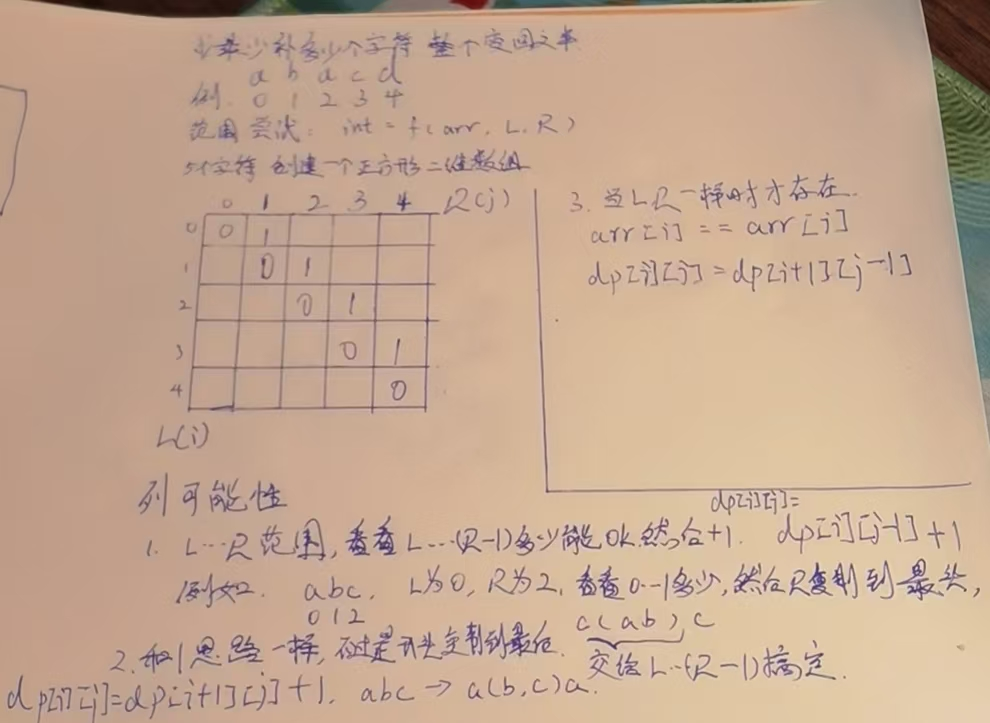

# 大厂刷题

## coding问题

#### 心得:

1. 如果求任意某个数超过一半,那么就每次消灭2个不同的,最后剩下来的,"有可能"是.
2. 如果求一堆中答案中的最小值,那么注意,初始值应该为最大值,然后被答案覆盖.
2. 带括号的字符串解析套路:全部可以这样解:我的方法只处理最简单的,然后遇到左括号就开启子递归,遇到右括号或结束就返回2个值,一个是结果,一个是处理到的位置.

#### 超级水王问题

https://www.bilibili.com/video/BV16o4y1c77G?p=182&vd_source=aa2ca96f997833d2dcbb3cf9f4cd33ac

> 在一个数组中,如果有一个数超过一半,那他就是超级水王,返回超级水王,如果不存在,返回null.额外空间O(1),时间复杂度O(N)

我们把超级水王比喻为子弹,把其他的数字比喻为靶子,如果水王超过一半,那么每颗子弹消耗一个靶子后,那么他一定还有剩余,例如,`[1,2,1,3,1]`这个数组,否则一定不存在,但是注意,如果有剩余,也不一定存在超级水王,需要再过一遍数组,例如`[1,2,3,4,5]`


#### 完美走位问题.

https://leetcode.cn/problems/replace-the-substring-for-balanced-string/description/

> 原题描述:
>
> 程序接收一个表示走位的字符串，通过统计A、S、D、W四个键的出现次数，然后使用滑动窗口和双指针技术寻找并返回能将走位变为完美走位的最小子串替换长度。如果原始走位已经是完美走位，则返回0。
>
> 翻译版本:
>
> 有一个只含有 `'Q', 'W', 'E', 'R'` 四种字符，且长度为 `n` 的字符串。
>
> 假如在该字符串中，这四个字符都恰好出现 `n/4` 次，那么它就是一个「平衡字符串」。
>
> 给你一个这样的字符串 `s`，请通过「替换一个子串」的方式，使原字符串 `s` 变成一个「平衡字符串」。
>
> 你可以用和「待替换子串」长度相同的 **任何** 其他字符串来完成替换。
>
> 请返回待替换子串的最小可能长度。
>
> 如果原字符串自身就是一个平衡字符串，则返回 `0`。

思路:

这个一个窗口题,中等偏难的难度.假如我有一个方法,我给他一个LR范围,看看这一段,随意变化,是否能让整体符合条件,  

从0开始,如果0-0不行,那我试试0-1,0-2试试,如果0-3可以了,则我得到了一个答案,以0开头,最小的一个答案,

然后,我让L右扩,1-3能不能行,如果可以,那最小答案就是1-3,范围更小了

假设1-3不行,那1-4呢,1-5呢,如果1-5可以,又得到一个答案,那我试试2-5,

直到,我得到min(所有答案的长度).

```java
public static void main(String[] args) {
    System.out.println(balancedString("QQRR"));
}
public static int balancedString(String s) {
    int n = s.length();
    //转换qwer为0123值
    int arr[] = new int[n];
    //qwer对应0123,统计一个词频统计
    //cnt 窗口外面的词频统计,一开始所有字符都在窗口外面,所以这里直接初始化
    int cnt[] = new int[4];
    char[] chars = s.toCharArray();
    for (int i = 0; i < n; i++) {
        char aChar = chars[i];
        int temp = 0;
        switch (aChar){
            case 'Q':
                temp = 0;
                break;
            case 'W':
                temp = 1;
                break;
            case 'E':
                temp = 2;
                break;
            case 'R':
                temp = 3;
                break;
        }
        //转换完成
        arr[i] = temp;
        //词频统计完成
        cnt[temp]++;
    }

    //长度一定是4的倍数,那么所有的字符全部调整一遍,也就是调整n个字符,一定可以做到.所以初始答案是n不是0.!!
    int result = n;
    for (int l = 0,r = 0; l < n; l++) {
        //这个lr范围,我怎么变都搞不定 并且 我都扩到头了都搞不定
        //如果不能做到,右扩窗口,如果扩到头了,也退出.还是搞不定
        while (!ok(cnt, l,r) && r < n){
            //这个什么意思??一开始,LR都是0,cnt包括所有的词频统计,r右扩后,区分里外,范围外,词频统计减去窗口内的值.
            //窗口扩大,外面的词频统计减少
            cnt[arr[r++]]--;

        }

        //上面跳出的2种情况
        //1,能做到了,那么我要L右扩了,
        if (ok(cnt,l,r)){
            //我收集一个答案,并且取最小的.
            result = Math.min(result,r-l);
        }else {
            //2.做不到,真的做不到,扩到头了都做不到,没得算了.
            break;
        }
        //l右扩,窗口减少,左侧的出窗口,进入到窗口外词频统计
        cnt[arr[l]]++;
    }

    return result;
}

/**
 * 拉齐窗口外面的短的到一样长,然后里面的剩余的字符,能均分,就说明ok,否则搞不定
 * @param cnt 窗口外面的词频统计
 * @param l
 * @param r
 * @return
 */
private static boolean ok(int[] cnt, int l, int r) {
  //哪个字母个数最多
    int maxCount = Math.max((Math.max(cnt[0],cnt[1])),(Math.max(cnt[2],cnt[3])));
  //凑4个字母的n份,就是maxCount * 4,减去窗口外面的,就是窗口内部的需要变多少个.
    int needChanged = maxCount * 4 - cnt[0] - cnt[1]- cnt[2]- cnt[3];
  //区间内,除去需要补齐4份的,剩下的正好能变 4个字母 * n份,代表能搞定.
    int rest = r-l-needChanged;
    //剩下的正好整除4
    return rest >=0 && rest % 4 == 0;
}
```


#### 双人乘船过河问题

https://www.mashibing.com/study?courseNo=465&sectionNo=34953&courseVersionId=1348

> 给定一个正数数组arr，代表若干人的体重
>
> 再给定一个正数limit，表示所有船共同拥有的载重量
>
> 每艘船最多坐两人，且不能超过载重
>
> 想让所有的人同时过河，并且用最好的分配方法,让船尽量少,返回最少的船数

思路:

我先给整个人的体重排序,然后,找到一个limit/2位置的值,在这个地方,左右,设置LR指针,

然后,此时L左移,不能配对就打叉,直到遇到第一个能配对的,不急着分配,R右移,直到遇到第一个不能配对的位置.R移动了几个位置,就拿L左侧的多少个值来配对,这样是最划算的,直接来给这R右移的所有的消化掉.搞定完了后,L从消耗完了的位置,继续重复上述步骤....R右移,消耗左侧右移位数个,

这样下来,总有一侧先耗尽的时候.

1.左侧先耗尽,

左侧的,滑过的,打叉的,直接除2一船,2人肯定能坐下,如果左侧最小的+右侧最大的超过limit,那么,肯定左侧先耗尽,左侧全部打叉.

那结果就是,✅/2 + 打叉的/2+右侧剩余的 = 所有需要的船

2.右侧先耗尽.

左侧没消耗的,剩下的全部打叉,✅/2+画叉子的/2 就是需要的船


#### 奇偶层树节点分配后差值<=1问题

https://www.bilibili.com/video/BV16o4y1c77G?p=5&vd_source=aa2ca96f997833d2dcbb3cf9f4cd33ac

> 来自腾讯音乐
> 给定一棵树，一共有n个点,每个点上没有值，
>
> 请把1~n这些数字，不重复的分配到二叉树上
>
> 做到 :奇数层节点的值总和 与 偶数层节点的值总和 相差不超过1
>
> 返回奇数层节点分配值的一个方案
>
> 2 <=n<= 10^5
>
> 假设5个节点,就是给1~5这个数字,分配到树上,然后,奇偶层查值<=1

首先,这个题,上来提到一棵树,但是他实际上是蛊惑你的,这个和树的关系不是非常的大,他求得是奇偶层的总和的比较.也就是,大约一半的节点数,,凑到所有数字累加和的一半,怎么凑.

这个题,数据量,10的5次方,如果做动态规划,这个表就爆了,所以这不是个动态规划题.

我们这样想,首先,得到一半的大小,然后确实是尽量去凑这个数,但是怎么凑,是重点.

我们先让k个数,分别取前k个,重点来了,我们看看边界,假如,我前面k个数,都比这个sum/2值(基数可能差1偶数必须相等)大,或者最后k个数,都没有sum/2值小,那么一定没结果,否则一定有值.我们只需要求一个.

假设,100个节点, 我们需要知道,奇数偶数层各多少节点,

例如1,49,51个,那么我们总数sum/2是5050,假设我们求凑x=50,或者x>100000,那么我们知道肯定没有答案,如果假设凑500,那么我们知道肯定有答案.那么就是说,k=49个数,我们要凑5050,或者前面的凑不出,51个数,我们要凑5050,首先我们算一个前49个数的小和,(1+49)*49/2=sumMinK,然后,我们看看单个数字能提升多少,就是让第49位的数,移动到100,单个数可以提升range=51,那么我们让(5050-sumMinK)/range = 需要移动多少个数字,我们让这些数字一次挪到后面,然后,5050-sumMinK)%range ,就是一个数,不需要完整的移动一个range,这些移动的数字和前面的每移动过的,全部加载一起,即是答案.


#### 大楼轮廓线问题

https://www.mashibing.com/study?courseNo=465&sectionNo=34961&courseVersionId=1348

https://leetcode.com/problems/the-skyline-problem/

思路:我们把输入值,按照起点排序,他升高到了某个点什么时候结束,不知道,要么,被其他升高的打断了,升的更高了,要么,自己到头了.掉下来了.

我们可以拆分这个输入值,组成2个对象,{起点,升高,升高值},{终点,降落,降落值},按照起点,,排序

我们要求的是每一个变化点或者每一个大楼高度有变化的点的轮廓,我们就记录下来每个点的数据,将上面的对象,2*N个输入值,因为一升一降,放到有序表里,怎么放,如果是true,按照升高值作为k,然后val+1,如果是false,按照下降至val-1,如果val = 0了,整条记录删除掉.

准备两个有序表,一个记录,最大高度为k,v为次数,另一个,记录,每个x位置,就是起点位置终点位置的最大高度是多少.我希望有序,所以用有序表.用linkedHashMap也行,因为我依次记录的.

为什么0次了,整条记录要干掉,不留着0,因为我要,求最大的k,他会干扰我.

用第一个有序表得到第二个有序表,即x位置最大高度,

然后根据x位置最大高度,得到轮廓线答案.


#### 字符串公式解析问题.

https://www.mashibing.com/study?courseNo=465&sectionNo=52248&courseVersionId=1348

> 给定一个字符串str，str表示一个公式
>
> 公式里可能有整数,加减乘除符号和左右括号
>
> 返回工时的计算结果,难点在于括号可能嵌套很多层
>
> `str="48*((70-65)-43)+8*1"`，返回-1816。
>
> `str="3+1*4"`返回7。
>
> `str="3+(1*4)"`
>
> 【说明】
>
> 1. 可以认为给定的字符串一定是正确的公式,不需要检查有效性
> 2. 如果是负数 就需要用括号括起来，比如`4*(-3)`,但是如果他作为开头或括号部分的开头,咋可以没有括号,例如`-3*4和(-3)*4`都是合法的.
> 3. 不用考虑计算过程中会发生溢出的情况。

思路:

这个题,我们用递归做,我每个方法中,只做最简单的加减乘除计算,记作int[] ans = f(arr,i)方法

其中,f方法,定义为:只计算简单的公式,如果遇到左括号,则开启新的子方法,等待返回值,返回值包括两个值,1.当前方法的计算结果,2.计算到str的位置.什么时候返回,当结束了,或者,遇到了右括号的时候.

简单计算方法,做一个栈,设置一个cur=0,遇到数字就cur*10然后加当前值,如果遇到符号,数字,符号依次放到栈中,当一个数加入到栈中时候,如果是乘除符号,直接拿出来,做一个计算,计算完了后,再整个将结果放进去.每个方法遇到左括号就开启新方法,这样每个方法都是最简单的计算.

-3这种负数怎么办.没关系.cur是0,0*10先进栈,负号进栈,3进栈,就是0-3嘛.答案就是-3,完全兼容了!!!

用这个套路,都可以解决,什么压缩后是abc3{aabbcc} 的,问原先字符什么样的,一样的解析.


#### 14-1-88 返回左右括号组成的字符串,最长的有效子串长度

https://www.mashibing.com/study?courseNo=465&sectionNo=35017&courseVersionId=1348

> 给定一个只由左括号和右括号的字符串
> 返回最长的有效括号子串的长度

看到子串了吧,那就是遍历展开,然后以i位置结尾,最长,往前推多远.

basecase :

* i==0时,一定不可能,就一个怎么凑对呢.
* i==1是,得是右括号,并且0位置的得是左括号,那他才是2,否则,0.

普遍位置:

i位置时,看下他前面一个,如果他前面一个,一点都推不动,是0,那看看他俩能不能凑对,凑上了就是2,凑不上就是0,如果他前面凑上了,例如8,那他就要和i-8-1位置去凑对,凑上了,就是8+2,别急,还没完,i-8-1位置的前一个,还得看看,如果不是0,那还得加上,一路走来,不是0就记录一个最大值,遍历完了后,返回最大值.


#### 如果排序后,相邻两数最大差值问题

https://www.mashibing.com/study?courseNo=465&sectionNo=52880&courseVersionId=1348

> 给定一个数组arr，返回如果排序之后，相邻两数的最大差值
> 要求:时间复杂度O(N)

假设答案法!!

注意,是如果排序,不是真的排序,排序就已经O(N*logN)了

这个题非常难,难住很多国手,因为一般N*logN ,logN不会很大,一般当做较大的常数项了.而本题要求了,O(N)

这个题,不需要扩散性思维,出现这种题,就是非常难,记住这个一个题就行了,足够了.

这个题,利用了个桶排序的思想,桶排序,可以做到O(N)

假设答案是什么意思,我就假设:9个数,最小值0,最大数99,那我分10个桶,一定有一个会是空桶,如果是13个数呢,那就14个桶,分数一样的算,我取10个桶只是为了示例.

好,意义是什么,我9个数分10个桶,必有一个空桶,那么就是说,单个桶内,必不可能出现答案,也不一定是在空桶两侧,不一定的啊,例如1-19,差值18,19-31,差值才12,所以这个只是为了排除答案不可能出现在单个桶内.每个桶,只需要保留2个信息,最大值多少,最小值多少.

然后全过一遍后,每个桶的最大最小减一下,答案就知道了.


#### 9-1-58.线型点灯和环形点灯问题

https://www.mashibing.com/study?courseNo=465&sectionNo=57229&courseVersionId=1348

> 给定一个数组arr，长度为N，a中的值不是0就是1。arr[i]表示第i栈灯的状态，0代表灭灯，1代表亮灯
>
> 每一栈灯都有开关，但是按下i号灯的开关，会同时改变i-1、i、i+1栈灯的状态
>
> 问题一:如果N栈灯排成一条直线,请问最少按下多少次开关灯全亮?
>
> i为中间位置时，i号灯的开关能影响i-1、i和i+1
>
> 0号灯的开关只能影响0和1位置的灯
>
> N-1号灯的开关只能影响N-2和N-1位置的灯
>
> 
>
> 问题二:如果N栈灯排成一个圈,请问最少按下多少次开关,能让灯都亮起来
>
> i为中间位置时，i号灯的开关能影响i-1、i和i+1
>
> 0号灯的开关能影响N-1、0和1位置的灯
>
> N-1号灯的开关能影响N-2、N-1和0位置的灯

这个是以前字节的一个题,考的是第二个问题.这个题非常的难.

其解题思路用到了体系学习班最后的那个,结合外部信息猜解法的思想.

思路:

这个题,我们最麻烦的是,当前位置会改变已经做过决策位置的值,所以,我们要做出一个改变,我们当前位置的值,不由我改变,由我后面的改变.

所以我定义的方法为,f(arr,nextIndex,preStatus,curStatus),参数含义为

nextIndex:当前在i位置上,传i+1, nextIndex -1 = cur,当前,

cur-1 为preStatus,

cur 为 curStatus,

隐含的含义就是,我以前的我都搞定了,都亮起来,我由nextIndex的决定来帮我亮起来,如果我是灭的,那么下个开关必须按,同时传下去f(arr,nextIndex+1,cur=cur^1 这个就是我取反,因为开关必须按,arr(nextIndex)^1 按了以后,下一个状态也取反),如果我是亮的,那么下一个一定不能按,那就直接当前变pre,next变当前,直接传下去.f(arr.nextIndex+1,curStatus,arr(nextIndex)).

一直到最后,如果,最后一个开关,他俩都是亮的,那么不用按,如果都是灭的,开关按次数+1,否则状态不一致,怎么都搞不定.

第二问:

第二问是环形了,跟上面的区别是,按0号灯会影响最后一个,最后一个会影响第一个,

根据第一个启发,我们依然是保持上面的思路,区别是,我们加2个参数,记住第一个和最后一个的状态,然后,我们从第2个开始,注意,不从第一个开始了,因为从2开始,有普遍性,第一个比较特殊,然后,我们0,1,这两个位置的,我们穷举,0不按,1按,00,01,10,11,四种穷举,挨个调用,返回最小值.这样,就得到了答案.


#### 9-2-59,无效括号串变有效的所有可能结果.

https://www.mashibing.com/study?courseNo=465&sectionNo=57230&courseVersionId=1348

首先,我们得知道,什么样的括号串,是错误的,那就是右括号比左括号多的时候,没有对应了.

设置一个count,当遇到左括号时候,count++,遇到右扩号的时候,count--,当count位负数的时候,那就是出现错误的时候.

那么,怎么修复这个错误的括号串,

那就是,从第一个右括号开始,可以开始删除,当后面接着的都是右括号,那都是一样的结果,跳过,当再遇到左括号的时候,可以继续删除右括号.

我定义的方法,传入的参数,剩余字符串,一个是我检查到哪里了,一个是我删除到哪里了,答案集合,再加一个当前传的字符(左括号还是右括号.),含义是,只要违规了,就给前缀调整对,任何一次调整完,我都return,

当我正着调整完了,我确定,右扩号一定不必左括号多,那么好了,我左括号有可能比右括号多,我给字符串反转,然后最后一个参数,改为")",左右互换,这样再走完一遍,我这个字符串,绝对正确.

这样走完了一遍了,我就收集到了一个答案.


#### 10-2-64 跳跃游戏

https://www.mashibing.com/study?courseNo=465&sectionNo=34993&courseVersionId=1348

https://leetcode.com/problems/jump-game-ii/

> 一个数组,每个值代表你从这里最远能跳多少步下去,返回跳到终点,最少需要多少步.

这个题,我们准备三个变量,

step:当前用了多少步了,当我遍历到终点时候,这个值,就是答案.

cur:当step增加的时候,我把next的值拷贝过来,next= null,如果i>cur,那就是我需要增加步数了,增加步数时候,next拷贝过来,next=null

next:提前准备好的,代表如果我多跳一步,我最远能到哪里,当数轴上面的值+下标大于我的时候,我就更新.


#### 13-3-86 超级洗衣机问题

https://www.mashibing.com/study?courseNo=465&sectionNo=35015&courseVersionId=1348

https://leetcode.com/problems/super-washing-machines/

> 就是说有N个洗衣机,每个洗衣机上面对着有衣服数量,每个洗衣机可以往左或往右扔一件衣服,一个回合内,所有的洗衣机都可以扔一次,问最少需要扔多少次.能让每个洗衣机上面的衣服一样多.

这个是一个求单个位置最大瓶颈问题,当一个瓶颈解决了的时候,全部就都解决了

首先,我们要得到,每个洗衣机上,应该有多少衣服,然后,来一个衣服小和的前缀数组,每个位置i看下,我左边,右边,各欠多少或者赋予多少件衣服.几个情况:

1. 如果一侧欠衣服,一侧富裕衣服,那就是取这两个值的max,就是i位置机器调整完的次数,
2. 如果两侧都欠,那也是取max,欠的多的调整完了,欠的少的肯定早调整完了,所以其实1,2是同样的处理方式
3. 如果两侧都富裕,也就是i位置欠的最多,那就是取左右的相加值,因为左右都给我,一次只能给1个,


#### 16-2-98-arr子集不能累加出的最小正数问题

https://www.mashibing.com/study?courseNo=465&sectionNo=35027&courseVersionId=1348

> 给定一个正数数组arr，
> 返回arr的子集不能累加出的最小正数
> 1）正常怎么做？
> 2）如果arr中肯定有1这个值，怎么做？

第一问:

首先,又是子集,那肯定又是从左往右了,要或者不要,

有点像16-1-97那个题,从左往右尝试,0~N,能不能搞定,能不能搞定2,能不能搞定3......搞不定,返回.

第二问:

我们先给数组排个序,

我们不从0开始,假设从1开始,如果肯定有1,那么1~1范围上,能搞定1,如果2位置是1,或者2,那肯定能搞定1~3,我们引入一个变量,叫range,此时,1~2范围上,可以搞定range1~3,如果2位置不是1或2,而是3呢,那我们发现,2,怎么都搞定不了,返回2,这个条件是什么呢,i位置>range+1,返回range+1,否则,range变成range+当前位置的值

如果题目要求是0开始的,那我们最终结果页减一.

如果不含1,那么最小的正整数就是1.


#### 16-3-99-patching-array问题

https://www.mashibing.com/study?courseNo=465&sectionNo=35026&courseVersionId=1348 

https://leetcode.com/problems/patching-array/

> 给定一个数组nums,再给定一个整数n,
>
> nums随便选择子数组,问问补充几个数,能搞定1~N所有的组合.
>
> 例如数组[1,5],n=10,问补充几个数,1~10全部能搞定.

还是上面的那个那个做法,我们要先搞定1~1,然后1~3,然后,,,其实就是让range再一个范围内,全部都能搞定,直到range超过n的时候,补充的数,就是我需要的数.

首先是在使用给定数组之前的,例如[4,5,17,39],凑83,我想用4,那不行啊,我得现有range1,那我得补充个1,我让range涨到3,我得补充个2,然后我可以用4了,!!!range涨到7,我想用5,需要满足range4,已经满足了,所以,range涨到12,想用17不行,需要range16,我再来个13,range涨到了25,使用17,我的range涨到42,可以无缝衔接39,涨到81,好的,没数了,孤独的往上涨吧,来个82,range超过了83了,得到了答案


#### 16-4-100-求长度为2的power次方的数组中逆序对的问题

https://www.mashibing.com/study?courseNo=465&sectionNo=35029&courseVersionId=1348

> 给定整数power，给定一个数组arr，给定一个数组reverse，
> 含义如下：
> arr的长度一定是2的power次方
> reverse中的每个值一定都在0~power范围。
> 例如power = 2, arr = {3, 1, 4, 2}，reverse = {0, 1, 0, 2}
>
> 任何一个在前的数字可以和任何一个在后的数组，构成一对数
> 可能是升序关系、相等关系或者降序关系
> 比如arr开始时有如下的降序对：(3,1)、(3,2)、(4,2)，一共3个
> 接下来根据reverse对arr进行调整：
> reverse[0] = 0, 表示在arr中，划分每1(2的0次方)个数一组然后每个小组内部逆序，那么arr变成[3,1,4,2]，此时有3个逆序对
>
> reverse[1] = 1, 表示在arr中，划分每2(2的1次方)个数一组，然后每个小组内部逆序，那么arr变成[1,3,2,4]，此时有1个逆序对
>
> reverse[2] = 0, 表示在arr中，划分每1(2的0次方)个数一组，然后每个小组内部逆序，那么arr变成[1,3,2,4]，此时有1个逆序对
>
> reverse[3] = 2, 表示在arr中，划分每4(2的2次方)个数一组，然后每个小组内部逆序，那么arr变成[4,2,3,1]，此时有4个逆序对
>
> 所以返回[3,1,1,4]，表示每次调整之后的逆序对数量
>
> 输入数据状况：
> power的范围[0,20]
> arr长度范围[1,10的7次方]
> reverse长度范围[1,10的6次方]

这个题,暴力解,我每次调整完了后,算出逆序对,然后收集答案,可是你看看数据量,绝对不可能过的了.

这个数据范围,最多,一个O(N*logN)

这个题用到了一个归并排序的merge思想.我们求这个降序对,N^2遍历一遍,能得到,我们也可以像归并那种,先求两个一组,多少降序对,再求2^2,也就是4个一组,多少降序对,注意不算刚刚的2个一组的,再求2^3,也就是8个一组,多少降序对,注意不算刚刚4个一组的,然后2^4,......直到2^20次方,我们要的是,每个次方的降序对合,当这些全部加在一起的时候,就是整个的答案.

上面说到的内容,我们用2个辅助数组,一个降序对,一个升序对.升序对,我们将整个源数组逆序,求降序对,就是升序对,一套方法搞定.

重点来了,干嘛用.

假如,我们2^3的数组,8个长度,2^1,2^2,2^3,三个逆序的范围的可能,例如现在来了个2次方的,实际就是4个逆序,左右逆序,但是左右,大的相对位置不变,例如[4,8,3,1,1,3,7,4],我们2^3时候,8个数一组,4个数来自左边,4个来自右边,如果现在2^2逆序了,影响2^3的吗?不影响,因为2^2逆序了,结果是[3,1,8,4,7,4,1,3],对于2^3来说,还是左边取4个配右边取4个,相对的位置不变.只有2^2,2^1变了,升序对变逆序对.

所以,当我们得到了2个辅助数组后,每次直到哪个逆序了,直接从他往下的,升序逆序互换,数值全部相加,就是答案.!非常快.


#### 17-1-103-返回数组中有没有num的数

https://www.mashibing.com/study?courseNo=465&sectionNo=35032&courseVersionId=1348

> 给定一个每一行有序、每一列也有序，整体可能无序的二维数组
> 再给定一个数num，
> 返回二维数组中有没有num这个数

这个题比较水,

从左往右,从上往下,都有序,

我从右上角开始,比num大吗?大就往左走,小就往下走,因为单边有序嘛.,一个m+n的复杂度,搞定

或者从左下角开始,也是一样的,比num大就往上走,因为上面的小,比num小就往右走,一样的复杂度,但是左上,右下不行,没有单调性.


#### 16-6-102-约瑟夫环问题

https://www.mashibing.com/study?courseNo=465&sectionNo=35031&courseVersionId=1348

https://leetcode-cn.com/problems/yuan-quan-zhong-zui-hou-sheng-xia-de-shu-zi-lcof/

> 约瑟夫环问题
> 给定一个链表头节点head，和一个正数m
> 从头开始，每次数到m就杀死当前节点
> 然后被杀节点的下一个节点从1开始重新数，
> 周而复始直到只剩一个节点，返回最后的节点

剃刀函数,这样的都从基础通项公式入手:y=x%i

左加右减,上加下减,我这个函数由基础函数变完了,就是y=(m-1)%i+1,先向右,再向上嘛.

想求得是什么,最终活着的肯定就1个,他的编号,此时是1,那么上一轮,他的编号是几呢,再上一轮呢,直到一开始,,他的编号是几呢??

我们一点点推出这个公式.

S=被干掉的位置,公式是S=(m-1)%i+1,左加右减上加下减.

前一个号= (后-1+S)%i+1,左加右减上加下减.

带入S后,这个公式的复杂度O(1).前=(后-1+(m-1)%i+1)%i+1 ->前=(后+(m-1)%i)%i+1

进一步优化,我们可以认为,m-1是k*i+r余数,%就相当于k=0,就是m-1 = r

前=(后+r)%i+1->前=(后+m-1)%i+1


#### 14-4-91-first-missing-positive

https://www.mashibing.com/study?courseNo=465&sectionNo=35020&courseVersionId=1348

https://leetcode.com/problems/first-missing-positive/

> 几乎字节原题:非常难
>
> 给定一个数组,正负0都可能有,给我返回最小的缺失的正整数.
>
> 要求:时间复杂度O(N),额外空间复杂度O(1).
>
> 杀死了用辅助工具的可能.Hash表,不能用,不能申请大结构.
>
> 字节是求大于k的,所有数－个k,再求最早缺失的正整数,是不是一个题.!!

这个题,给定了n个数,要求O(N),那就只能遍历一遍数组拿下.

我们想求一个东西,就是,假如说,6个数,我们就理想的认为,我们都能凑够,1~6,然后第一个丢掉的正整数是7.

我们从2头看,假设,中间一坨,完全搞定了,然后一点点剔除,什么意思

左右2个指针.LR,分别在0位置和N-1位置,我们假设的就是L~RN个数全部都在嘛,那N就是第一个缺失的.

然后,我们干啥,我们既然认为每个位置的数都有,那我们就要让每个位置的数,都是i+1,也就是0位置是1,1位置是2.N-1位置是N,

让指针开始移动了,先看看L位置的数,如果小于1,那么直接让他跟最后一个位置换,他不是我们要找的,那换完了R位置左移,我们只能找到N-1个数了,也就是我们找到任何一个不想要的,都是垃圾数字,都会让我的预期变小,都要换到最后,R左移,也就是R右边,都是垃圾区.R位置,就是我第一个缺失了的数.那么有多少种垃圾数字呢.

1. 刚刚说的<1 的,实际是小于等于L的,都已经有了,不要了.
2. 已经大于R的,不可能到这来了.
3. 没出现过,但是换过去后,发现他也是这个,重复了,我只要一个就行了,进入垃圾区.

直到L,R重叠,所有数,看完了,R位置,就是第一个凑不上的正整数


#### 17-2-104-返回最小的第k个数.

https://www.mashibing.com/study?courseNo=465&sectionNo=35033&courseVersionId=1348

https://leetcode.com/problems/kth-smallest-element-in-a-sorted-matrix/

> 给定一个每一行有序、每一列也有序，整体可能无序的二维数组
> 在给定一个正数k，
> 返回二维数组中，最小的第k个数

这个题跟上一个题差不多,我们首先要知道,当我从右上角开始,求一个值,有多少个数,比我小??那么这个值,是什么?

我们先看一下,右下角的是多少.假设1000.二分,我找500,看看,他有多少比我小.

我右上角位置.出发,如果比我500大,我往左走,比我小,往下走,然后很快我就能用公式算出来,多少个比我小.

如果我要求第300小的,结果比我500小的,有200个,一共1000个,那我知道,第300小的,值一定在500值到1000值之间.再二分.找750来一遍.

发现比750小的有100个,那我知道,这个值一定在500~750值范围之间.

注意,我们每次二分的时候,需要注意下,收集个数的同时,还需要记录这次搜索过程中最小的数,因为未必等于我二分的值.

==当我算比我小的个数的时候,当比k小的时候,一定不是答案,当大于的时候,我先记录下这个答案,看看后续二分,有没有可能变得更小.==


#### 17-6-108后半部分50:17-多少个字符串对是回文问题.

https://www.mashibing.com/study?courseNo=465&sectionNo=35037&courseVersionId=1348

https://leetcode.com/problems/palindrome-pairs/

> 给一些个字符串,问其中哪些个字符串凑对,能组成回文的数量问题.

这个题,最好先去看下体系学习的manacher,更好的对你的回文加速有一个帮助.

首先暴力解:每个字符串,两两凑一块,暴力嘛,N2,然后假设字符串平均长度,k,综合就是O(N^2*k).

另一个解:

我们拿到一个字符串,我们怎么搞,我们先看看,怎么他能变回文,

如果他一个字符,那么我给后面的逆序加到前面,可以搞定,如果2个回文,那么后面一坨逆序加到前面,可以搞定.....直到字符串长度.我们可以完全逆序拼到后面.

我们这个方案,需要注意,别算重复了

另一个,就是,我需要给所有的字符串加到哈希表里,记录每个字符串所在的位置,便于快速找到逆序字符串,返回位置.

这个复杂度多少呢?

假设字符串长度k,判断回文,k,生成逆序,k,去哈希表查,==不是O(1)==,我这是字符串,不是内存地址,所以要先把字符串给哈希一个东西,才能继续去找,不能忽略,这个O(K).

查询前缀是否回文,可以manacher加速为O(1),但是生成逆序,O(k)*查表O(k),时间复杂度O(K^2),然后,每个字符串走一遍.

总代价,O(N * k^2),

好的,两种方案,就要看数据量猜解法了:如果N大k小,就用第二种,如果k大,N小,就用第一种.


#### 19-1-116-LRU算法

https://www.mashibing.com/study?courseNo=465&sectionNo=35045&courseVersionId=1348

https://leetcode.com/problems/lru-cache/

> 一个缓存,当缓存满了的时候,按照最久不用的先淘汰,如何设计结构.

一个双端队列,一个哈希表,哈希表直接v的指针指着node,便于快速找到在双堆队列中的位置.

当第一个k来的时候,建立节点,放到队列中,头尾指向null,当来个新的时候,挂在后面,假设容量就2,再来个就满了.好

此时来个没来过的.那谁是最久的呢,队首的就是最早的,给他断掉,给新来的加到队尾.

如果此时来了个是之前出现过的或者get了,那我直接给他断掉,接在队尾,这样他就最新了.

总结==:双端队列+哈希表==


#### 19-1-117-LFU算法

https://www.mashibing.com/study?courseNo=465&sectionNo=35046&courseVersionId=1348

https://leetcode.com/problems/lfu-cache/

> 一个缓存,当缓存满了的时候,按照调用次数最少的先淘汰,相同调用次数的,最久不用的先淘汰,如何设计结构.

首先,假设,调用次数都一样的情况下,淘汰最久的,我们搞过了,就是LRU,一个双端队列.

其实一样的,只是规则不一样,一个是根据时间,一个是根据次数,不就是套一起吗?就算再来更多维度一样的.

就是2个双端队列,一个用于记录调用次数的,次数里面是相同次数下,时间轴的k的.

淘汰逻辑就是,先找调用次数的数组的头,然后,里面找到一个双端队列,淘汰这个里面的头,

更新或get逻辑:先找到他的位置,断掉.如果次数的队列都空了,连这个次数的队列这个整个的容器都断掉!然后找到对应的容器,取出队列,加进去.


## 二分答案法

二分法,国内外都很爱考.

#### 心得:

1. 找到单调性!!!只要有单调性的,都能二分.

2. 一般的能快速联想到二分的就是,定一个目标,问问条件够不够.

   

#### 来自华为,工人吃大力丸问题.

https://www.bilibili.com/video/BV16o4y1c77G?p=4&spm_id_from=pageDriver&vd_source=aa2ca96f997833d2dcbb3cf9f4cd33ac

> 来自华为
> 给你 n个任务和 m 个工人
>
> 每个任务需要一定的力量值才能完成
>
> 需要的力量值保存在下标从 0 开始的整数数组 tasks 中
>
> 第 1 个任务需要 tasks[i]的力量才能完成
>
> 每个工人的力量值保存在下标从 0 开始的整数数组 workers 中
>
> 第j个工人的力量值为 workers[j]
> 每个工人只能完成 一个 任务且力量值需要 大于等于该任务的力量要求值，即 workers[j>m tasks[i]
>
> 除此以外，你还有 pills 个神奇药丸
>
> 可以给 一个工人的力量值 增加 strength
>
> 你可以决定给哪些工人使用药丸
>
> 但每个工人 最多 只能使用 一片 药丸
>
> 给你下标从 8开始的整数数组tasks 和 workers 以及
>
> 两个整数 pills 和 strength ，请你返回 最多 有多少个任务可以被完成。
>
> 测试链接:https://leetcode.cn/problems/maximum-number-of-tasks-you-can-assign/

这个题,有两个解法,

1. 二分法

   

2. 自定义窗口结构法.


#### 9-5-62 判断一个数字,是不是某个数的step sum

> 定义何为step sum？
> 比如680，680 + 68 + 6 = 754，680的step sum叫754
> 给定一个正数num，判断它是不是某个数的step sum

这个题,乍一看,位运算,一个公式,倒着就能退出来,但是,你恐怕是要定义一堆的double类型的变量吧.

实际上,这个题可以二分,我们发现了一个单调性!!

一个小的数,他的step sum,一定没有更大的数的step sum大,例如,238的step sum一定没有429的step sum大,这就是单调性.

所以,这个题,我们二分查找,先试试从0到他,能不能凑出来,如果不能,往两边走,如果最后都试了,都不行,那肯定不是,否则,我们logN的代价即可找到这个数.其实严谨来说,我们求步骤和,也是有代价的,那就是数的长度,假设是x,那就是log10为底,x,总体复杂度,加一起,很低!!

#### 12-2-79 两个有序数组,求合并后第k小个上中位数.

https://www.mashibing.com/study?courseNo=465&sectionNo=35008&courseVersionId=1348

https://leetcode.com/problems/median-of-two-sorted-arrays/description/

> 上面说的是原题,
>
> 进阶问题：
> 在两个都有序的数组中找整体第K小的数
> 可以做到O(log(Min(M,N)))

逆天时间复杂度.如果等长,O(logN).如果不等长,O(log Min(M,N)) 

这个题,不关注具体的值的内容,我们只需要知道有序,知道下标对应关系即可.

等长:求上中位数


不等长,求第k小


## 窗口问题

#### 心得:

1. 单调性才是最重要的,找到了单调性,什么二分,什么窗口,什么双指针,只是手段.最重要的,就是单调性!!.

#### 一维接雨水问题

https://www.bilibili.com/video/BV16o4y1c77G?p=180&vd_source=aa2ca96f997833d2dcbb3cf9f4cd33ac

> 给定一个数组,你可以想象为一些柱状图,其中凹陷的位置,可以接住雨水,问,这个数组,最多能接住多少雨水.例如,`[3,1,3]`,中间的1能接住2个雨水,返回2.`[2,1,3,1,4]`,能接住1+2=3个水.第一个1能接住1个,再多会从左边溜走,第二个1能接住2个,再多会从左边的3溜走.

最优解:一个窗口,从左右往中间缩,哪边小,哪边开始缩,如果一边小,则两边可以同时缩,缩的时候,计算缩的位置的存水量,取值范围是,min(左窗口值,右窗口值)-自身的高度,如果为负数,储水量为0.一个个加完了,就是结果值


#### 8-3-50盛最多水的容器

https://www.mashibing.com/study?courseNo=465&sectionNo=52250&courseVersionId=1348

https://leetcode.com/problems/container-with-most-water/

> You are given an integer array `height` of length `n`. There are `n` vertical lines drawn such that the two endpoints of the `ith` line are `(i, 0)` and `(i, height[i])`.
>
> Find two lines that together with the x-axis form a container, such that the container contains the most water.
>
> Return *the maximum amount of water a container can store*.
>
> **Notice** that you may not slant the container.

这个题,和上面的一维接雨水一样,我就一个双指针,那边小开始缩那边,缩之前,结算水量,矮的那边是瓶颈.

我们不去严格的纠结每个位置的准确水量,我们只考虑,有没有那个位置能推高水量,这个答案如果存在,他一定能被推高.

我们从外,一直往里面缩,答案必在其中,一样大的时候,选谁先缩小都行,就看能不能推高答案.

这个题,背住就行了.


#### 双数组同时达标问题

https://www.bilibili.com/video/BV16o4y1c77G?p=6&vd_source=aa2ca96f997833d2dcbb3cf9f4cd33ac

> 来自微众银行
> 给出两个长度均为n的数组
> A={ a1, a2,..  ,an}
>
> B={ b1,b2,... ,bn }.
> 你需要求出其有多少个区间[L,R]满足:
>
> 数组A中下标在[L,R]中的元素之和在[La,Ra]之中
>
> 数组B中下标在[L,R]中的元素之和在[Lb,Rb]之中
>
> 输入
> 第一行有一个正整数N(1<=N<=100000)，代表两个数组的长度.
>
> 第二行有N个非负整数，范国在0到1000000000之间，代表数组中的元素,10的8次方
>
> 第三行有N个非负整数，范国在0到1000000000之间，代表数组中的元素。
>
> 第四行有4个整数La,Ra,Lb,Rb，范围在0到10^18之间，代表题目描述中的参数。
>
> 输出
> 一个整数，代表所求的答案。

这个问题,数据量这么大,任何N✖️的方法,一定过不了,所以,最多就是O(N),过一遍数组就完事.!

非负数,数越多,那么范围一定越大!!,这就是==,单调性!!!==,我们发现了单调性,就可以整活了.窗口过遍,我们找到以i位置开始,同时符合a的(小窗口范围WindowsAR1,大窗口WindowsAR2),b的达标区间((小窗口范围WindowsBR1,大窗口WindowsBR2))的交集,交集有多少个,那么,就有多少个答案,O(N),因为窗口不回退!!

#### 12-1-78-字符串中找到一个长度为m的连续子串,

> 给定长度为m的字符串aim，以及一个长度为n的字符串str
> 问能否在str中找到一个长度为m的连续子串，
> 使得这个子串刚好由aim的m个字符组成，顺序无所谓，
> 返回任意满足条件的一个子串的起始位置，未找到返回-1

启示:

* 求摘要的,多半是需要词频统计!int[256]来处理.
* 如果是某一段的,那就搞一个窗口.为词频统计的总长,在这个窗口内,统计词频,然后比较.


首先,我们要知道aim的长度,这个值,要作为窗口的,同时收集字符频次,用int[256]即可.不用map,和字符频次总count

我们用这个窗口,滑过str,收集信息

进来的时候,字符频次只要大于0,就词频-1,count-1,如果词频已经<=0了,count不减.

字符出窗口的时候,只要是结果大于0,就词频+1,count+1,如果词频还是<=0了,count不加.

什么时候,调整完了窗口,count为0,则代表找到了一个能组成的字符,如果越界了,也不为0,则返回-1.


## 堆问题

#### 二维接雨水问题

https://www.bilibili.com/video/BV16o4y1c77G?p=181&vd_source=aa2ca96f997833d2dcbb3cf9f4cd33ac

> 还是接雨水,只是他是一个二维数组,问这个二维数组方块内,能接到多少雨水.

思路是:这个问题要用到堆,首先找到最外面一圈的最低点,也就是薄弱点,把这一圈,全部放到小根堆中,堆顶,就是薄弱点,也就是说,里面的水,都会最先从这里溜走,然后处理这个薄弱点的上下左右,(咱们讨论的是4个方向的,斜向的不会溜走),放入堆中(node节点除了value,还有位置信息),找到下一个薄弱点,然后处理他边上的上下左右.

1. 首先max=0;

2. 弹出一个最小值,能更新max吗?比他大就更新,
3. 接下来给他上下左右加进去堆里,加的时候,结算,如果小,那当前弹出点就是瓶颈,如果大,那结算值就是0.
4. 只要max不更新,就都是max的内湖区域


#### 10-3-65 最常使用的k个单词问题

https://www.mashibing.com/study?courseNo=465&sectionNo=34994&courseVersionId=1348

https://www.lintcode.com/problem/top-k-frequent-words-ii/

> 给定一组单词,实时的求返回的出现次数最多的k个单词,按从少到多返回.

这个题,要用到加强堆来解决.

* 一个大根堆,来实时的得到topK个单词,堆的大小等于k,多的我不要,不进堆.
* 堆顶就是出现次数最多的,一个map,存单词出现的次数,
* 一个map,加强堆的反向索引表
* 一个treeMap.小优化,用来存从小到大的topK个数,直接返回这个就是结果.


#### 18-5-115-两个有序数组间相加和topk问题.

https://www.nowcoder.com/practice/7201cacf73e7495aa5f88b223bbbf6d1

> 两个有序数组,求相加和的topk,

topK,一般就是,堆.

我先搞个堆,两个数组的一哥,组成节点node,都进来,按累加和排序.

然后弹出一个,这是top1的数.

我看看给第一个数组的上一个数或第二个数组的上一个数,分别组成node放到大根堆中,较大的弹出,此时,这个是top2,

然后,他的弹出的继续,第一个数组的上一个数或者第二个数组的上一个数,两个数组放大大根堆,弹出,这是top3,,,按照这个规律,直到topK.

node是啥啊,三个属性

* 第一个数组的index,
* 第二个数组的index,
* 累加和,就按照这个东西大根堆排序的.一个比较器搞定.


#### 19-4-119-smallest-range-covering-elements-from-k-lists/

https://www.mashibing.com/study?courseNo=465&sectionNo=35048&courseVersionId=1348

https://leetcode.com/problems/smallest-range-covering-elements-from-k-lists/

> 给定n个有序数组,问,每个数组取一个值,组成的新的数组,区间最小的问题.

这个题,原视频是用有序表做的,就是每个数组里取最小的,加到有序表里,然后一次弹出一个加进去这个数组的下一个判断是否有变小.

我觉得用堆也能做,做一个node,两个属性,一个是来源于第一个属性和第一个位置的数组,另一个是val.按val排小根堆.

弹出一个,在这个数组中,继续下一个,加入堆,每次记录一个答案看看有没有变小,如果某个数组到头了,那就结束了,因为必须包含每个数组的某个元素.


## 字符串问题

#### 心得

1. 如果是字符串,需要哈希表记录的,我们可以用数组int[]替代,这个速度快非常多.ascii码256个可以替代所有字符.

   词频统计思想/字符转换思想,例如qwer,我们可以用0123替代,然后int[0]=3代表q字符出现3次.

2. 字符串转数组然后for循环的操作

   `char[] c = str.toCharArray();`

3. 注意如果0位置我能直接知道答案的,切记给从1开始的循环中,用到的map或者其他辅助数组要设置0位置的初始值.

#### 最长无重复子串问题

https://www.mashibing.com/study?courseNo=465&sectionNo=34951&courseVersionId=1348

> 求一个字符串中,最长无重复子串的长度

子串,那就是连续的,一看到子串,我们直接就想到开头结尾，然后取以i开头或者结尾，最大推多远，取max.

然后i位置，能不能通过，前面的。。i-2，i-1，帮我，加速得到！

所以这个题,就依赖2个东西,

1. 我上一次出现的最右的位置，
2. i-1最远推到哪里了，这两个，取min

两种情况分别用图表示


注意,

1. 我不需要一个完整的dp数组,我只需要一个变量,来滚动记录,因为i位置只需要i-1位置的.
2. 我记录前面的位置,可以用int[]加速,这个比HashMap快很多.ascii最多256个,所以,任何字符我都能记录下来.


## 位运算题

#### 心得:

1. 妙用位图,一个int值就能代表32位.


#### 两个字符串摘要同类问题

> 只由小写字母(a~z)组成的一批字符串都放在字符类型的数组String[] arr中
>
> 如果其中某两个字符串所含有的字符种类完全一样就将两个字符串算作一类
>
> 比如:baacbba和bac就算作一类返回arr中有多少类?

这个大家都能想到,排个序,去个重,然后哈希set一放,数量为1就是一类,否则就是2类.

最优解:位运算,一个int值有32位,一共才26个字符,完全够了,我都不要排序,每个位置出现的1"或"到对应为止上,最后换算个int值,自动相当于排序了.

```java
int key = 0;
for(i = 0;i<chs.length;i++){
	key |= (1<<(chs[i] - 'a'))
}
```


## 数组问题(预处理数组)

#### 心得:

1. 求长方形,正方形的,

   遍历所有的长方形,时间复杂度,O(N^4),因为,在这个矩阵内部,我先点任意一个点,O(N^2),再点任意一个点,O(N^2),两个点组成的矩阵,就是O(N^4)

   那正方形呢,正方形是O(N^3),为什么,因为,在这个矩阵内部,我先点任意一个点,O(N^2),剩下的,就是0~N了,两个边一样长,所以O(N^3).

2. 当我一个操作,非常频繁的需要for循环了,我就要想办法,通过预加工数组,来省掉这个for,来做到O(1).例如判断是否全是1组成的正方形的

3. 根据数量猜解法,一般的,二维数组的时间复杂度比较高,所以优化是一方面,另一方面就是,根据条件给出的数量级猜测解法,例如矩阵最大100,那么我三次方,就是100w,10的7次方,不超过10的8次方,所以能过.但如果O(N^4),就过不了了

4. 如果给了多个数组,其中数据范围的数组极大,凑得值极大,看看有没有小的,如果某个数组小,直接分治.(动态规划二维表会爆!)

3. 看到子数组,子串,就是以某个位置结束,找往左扩到什么程度,最大.

#### 边框全是1的正方形面积问题

https://www.mashibing.com/study?courseNo=465&sectionNo=34952&courseVersionId=1348

> 给定一个只有0和1组成的二维数组
> 返回边框全是1的最大正方形面积
>
> - `1 <= grid.length <= 100`
> - `1 <= grid[0].length <= 100`
> - `grid[i][j]` is `0` or `1`
>
> https://leetcode.com/problems/largest-1-bordered-square

思路:

这个题没办法,我们要遍历每个位置,然后看看以这个顶点组成的正方形,组成的面积,收集答案,比较.所以至少是O(N^3).

```java
for(int i=0;i<N;i++){
for (int j=0;j<M; j++){
  //这一层,我的边界,取右侧或者下侧先撞墙的那个,,
for (int border =1; border <= Math.min(N -i,M- j); border++){
  //这里来个O(1)的,才能让他10^8以内能过
}}}
```

我们看到这个最里面的for,判断是否可以组成边框为1的最大的面积,调用非常频繁,我们要通过预加工数组,来解决.

假设我们任意一个点,右侧的1和下侧的1我都能知道有多少个,那么我又能快速的知道4个点的位置,我就能知道他是否是正方形.

那么我们就可以预处理数据,


我们发现,如果我们从左往右看,我们没办法知道右侧的较小的是否有正方形,起码O(1)不行,所以我们从大到小,挨个判断,先判断一个最小的初始值,然后让更大值覆盖,这样,假如从右向左,我们找到一个更大的,就覆盖下.


#### leetcode最接近sum子序列累加和问题

https://www.mashibing.com/study?courseNo=465&sectionNo=34954&courseVersionId=1348

> //本题测试链接:https://leetcode.com/problems/closest-subsequence-sum/
>
> 给你一个数组,nums,nums.length 个数字,问返回一个子序列的累加和,最接近goal问题.
>
> // 本题数据量描述:
> //1<= nums.length <=40
>
> //-10^7 <= nums.[i]<= 10^7
>
> // -10^9 <= goal <= 10^9
>
> //通过这个数据量描述可知，需要用到分治，因为数组长度不大
>
> // 而值很大，用动态规划的话，表会爆

40个长度,我直接左右分两半,左边20个,右边20个.

左右,充分展开,都是2^20规模.104w+,百万级.肯定过.

然后,左侧,每个都去右侧配对,看看能不能找到goal,(写代码时候,我就选择左右配对的方式,而不认为答案在单独的某一边,因为,左边可以选0个,这样也算是左右选,不会错过答案.)给右侧加入到有序表中,开启二分查找,左右结合,很快找到答案.

有序表,100w个数,不是个事.


#### 一个数组查询频繁,返回查询结果

> 数组为{3,2,2,3,1}，查询为(0,3,2)
>
> 意思是在数组里下标0~3这个范围上，有几个2?答案返回2.
>
> 假设给你一个数组arr
>
> 都给出来对这个数组的查询非常频繁，
>
> 请返回所有查询的结果

首先,既然查询非常频繁,那肯定是要让你预处理数组了,

第一种,找到每个数字,哪个下标有,有序数组中, 找到范围对应的位置,二分查找,logN级别.但是预处理的时候,占用的比较少.

第二种,找到每个数组,0~i位置范围上的数量,例如0-1,0-2,0-3上有多少个,如果想找12-17上,就是0-17减去0-12的结果.O(1),但是,对预处理消耗较大.

根据数据量猜解法,可以找到更合适的方法.

#### 返回数组中,子数组最大累加和.

思路:

先搞定0位置的答案,他肯定就是自己嘛,同时,确定了第一个答案.

然后从1位置开始,他要不要向左扩,如果不扩,那答案就是它自己,如果要扩,那他肯定是加上左边的最好的嘛.就是上一个数的答案嘛.

走一遍数组, 最后找到最大值,搞定.


#### 返回一个二维数组中,子矩阵最大累加和.

https://www.mashibing.com/study?courseNo=465&sectionNo=34956&courseVersionId=1348

> https://leetcode-cn.com/problems/max-submatrix-lcci/
>
> 给定一个正整数、负整数和 0 组成的 N × M 矩阵，编写代码找出元素总和最大的子矩阵。
>
> 返回一个数组 `[r1, c1, r2, c2]`，其中 `r1`, `c1` 分别代表子矩阵左上角的行号和列号，`r2`, `c2` 分别代表右下角的行号和列号。若有多个满足条件的子矩阵，返回任意一个均可。
>
> **注意：**本题相对书上原题稍作改动
>
> **示例：**
>
> ```
> 输入：
> [
>    [-1,0],
>    [0,-1]
> ]
> 输出：[0,1,0,1]
> 解释：输入中标粗的元素即为输出所表示的矩阵
> ```
>
>  
>
> **说明：**
>
> - `1 <= matrix.length, matrix[0].length <= 200`

这个题,用到了一个数组压缩技巧,我们上面说了一个一维数组,如何找到最大累加和,那么二维,我们把多行压缩到一起,然后来个一维数组的最大累加和求解,是不是就ok了.

就是说,我先求第0行的,然后求第0-1行的,这个0-1行的,就是0行和1行压缩,每个对应位置的加起来,然后成了个一维的,然后求解,然后是0-2行,这个就是刚刚压缩后的,跟他压缩,,然后0-3行,也是0-2的压缩结果跟他继续压缩,所以,结果就是O(行^2*列^1),所以,看到没有,让小的那个当行,多的那个当做列,这样,整体最省.


#### 返回一个数组中，选择的数字不能相邻的情况下最大子序列累加和

https://www.mashibing.com/study?courseNo=465&sectionNo=34957&courseVersionId=1348

> 返回一个数组中，选择的数字不能相邻的情况下最大子序列累加和

子序列,就不能想着以某个位置结束的时候了,只有子串,子数组这种连续的才行.

那就从左往右尝试呗,我很容易,能得到,0-i,范围上,不相邻,这个子序列最大累加和多少. 怎么简单.

1. 假设0-17范围,

   1. p1 = 只要i位置的数
   2. p2 = 我就要17位置的数,好,那我就不能要16位置的,那就是0-15的那个结果,这个结果我有了,在dp里.
   3. p3 = 我不要17位置的数,注意,这也是0-17范围,我只是不要17位置这个数,那么,16我可要可不要,那不就是0-16范围的最好答案吗?

   dp[i] = max(p1,max(p2,p3))


#### 非负数组,两个数&结果最大问题.

> 给定一个非负数的数组,长度一定大于1,想知道数组中哪两个数&的结果最大.返回这个结果
>
> 时间复杂度O(N),额外空间复杂度O(1)

思路:

非负整数,那就看每个数的31位.

求&的结果,那肯定是高位&完了还是1才好,

那我就看31位,有几个数,是1的,

如果小于2个,那不行,这一位挑不出来,只能看下一个稍小点的位,

如果等于2个,那不用看了,这两个数,就是&完了最大的.

如果大于2个,好,那剩下的这位是0的全部淘汰只看这位是1的数.

注意,我们可以搞个双指针,其中一个指针从头开始找1的位,后面的指针,指着淘汰区位置,


#### 有序数组,每个数平方后不同结果数问题

https://www.mashibing.com/study?courseNo=465&sectionNo=52882&courseVersionId=1348

> 给定一个有序数组arr，其中值可能为正、负、0返回arr中每个数都平方之后不同的结果有多少种?
> 给定一个数组arr，先递减然后递增,返回arr中有多少个绝对值不同的数字?

一类问题,双指针解决.

两个指针,头尾,比绝对值,谁大,谁内滑,滑一次记录一个答案,如果相等,两个指针一起滑,如果滑的值一样,一滑到底,直到遇到不同的.

当指针交错的时候,结束.拿到答案数.


#### 9-3-60最长递增子序列问题

https://www.mashibing.com/study?courseNo=465&sectionNo=57231&courseVersionId=1348

https://leetcode.com/problems/longest-increasing-subsequence

一看子序列,那就是可以不连续.

dp[i],含义是,到i位置,最长可以多长.

那我这个暴力解,时间复杂度O(N^2),但是,这个最优解,可以为O(N*logN)

我们设置一个end辅助数组,和原数组一样长,分为有效区和垃圾区.有数据的就是有效区.

有效区含义:end[i]代表遍历完i,没遍历i+1位置之前,代表目前,所有i+1长度的递增子序列中,最小结尾是end[i]的值.

i=0.那就一个数,那最小值就是它自己被,再来个数,i=1如果小于等于,那他就给3干掉(或者说替换),如果大于3,那就直接排在3后面,当i=2时候,重复i=1的操作,end[]二分查找到的比他大的下标+1就是结果数,

如果新来一个数,从辅助数组中二分查找比他大的,如果没有比他大的,现在辅助数组有效区的长度+1就是他最长递增子序列长度,如果没有,那他就把比他小于等于的那个位置的替换掉,他前面有多少个,那就是这个位置+1个数.这个做法,替换了原数组,前后的位置的都不影响.


#### 9-4-61俄罗斯套娃问题

https://www.mashibing.com/study?courseNo=465&sectionNo=57232&courseVersionId=1348

https://leetcode.com/problems/russian-doll-envelopes/

> 输入一个两个维度的数组,长度和高度,约定大的能套在小的上面,

我们第一,按照长度排序,然后当长度相同的时候,按照高度高的在前面,高度低的在后面,这样然后再来一个最长递增子序列求解,答案,就是最多多少个套娃可以套在一起.

为什么?

我们想一下,当我们长度排序时候,后面的一定大于等于前面的,然后,如果我们看高度,我们收集递增子序列,前高后低,就是防止同样长度的捣乱.我们这样可以收集到同长度下,最小的那个,如果右边比我大,那他长度也一定比我大,他肯定能套住我,如果左边比我大,那他长度一定跟我相同,我们都套不住对方,我左边的也没啥用,淘汰.这样,我们得到递增子序列,就能得到最多套娃总数了.


#### 14-2-89 求arr中子数组累加和 <=K的,并且是最大的这个累加和的大小.

https://www.mashibing.com/study?courseNo=465&sectionNo=35018&courseVersionId=1348

> 请返回arr中，求子数组的累加和，是<=K的并且是最大的
> 返回这个最大的累加和

看着子数组,实际上和字符串中的子串是一样的,都是以i位置结尾,然后往前看看,最远,能推到多远,那这个题就是,i位置,往左,最远能推多大,并且,<=k

那么怎么**快速**的求最远累加和是多少呢.累加和辅助数组,然后相减,

例如,我k=300,现在i=83,累加和1000,那么实际上我就是要找累加和>=1000-300 也就是大于等于700的累加和的位置,

因为负数的存在,没有单调性,我们并不能让前一个数帮我快速得到答案.怎么办呢,

我把前缀和,放在有序表里,我们超快就能拿到我们想要的>=的某个值.


## 由小构建大的问题,分治

#### 心得:

1. size个数达标,那么一半的数怎么达标,搞清楚规律是什么

#### 生成长度为size的达标数组问题.

https://www.mashibing.com/study?courseNo=465&sectionNo=34958&courseVersionId=1348

> 生成长度为size的达标数组，什么叫达标?
>
> 达标:对于任意的i<k<j、满足 [i]+ [j] != [k]* 2
>
> 给定一个正数size，返回长度为size的达标数组

思路:

假如就三个数,a,b,c,那么达标就是a+c!=2b.

那么一定符合2a,2b,2c -> 2a+2c!=2*2b ,那么一定符合2a+1,2b+1,2c+1 `2a+1 + 2c+1 != 2*(2b+1)`

左边偶数,右边奇数,那么我让他左右边一起选,肯定也达标,因为,任何奇数加偶数,不可能等于某个数的二倍.

所以假设size = 7,那么我搞个size=4的种子,然后,我搞个size=2的种子,然后,搞个为1的种子,这个为1的种子,就随便是多少都行.例如就选1.

好,那么为2的种子就是左边✖️二,右边✖️二加一[2,3],然后求4的种子[4,6,5,7],然后求8这个数组[8,12,10,14,9,13,11,15],然后不要最后一个值不就行了.

分治,左侧搞定单独,右侧搞定单独,然后想整合.


## 动态规划问题

### 暴力递归

#### 汉诺塔最优状态问题

https://www.mashibing.com/study?courseNo=465&sectionNo=35040&courseVersionId=1348

> 给定一个数组arr，长度为N，arr中的值只有1，2，3三种
> arr[i] == 1，代表汉诺塔问题中，从上往下第i个圆盘目前在左
> arr[i] == 2，代表汉诺塔问题中，从上往下第i个圆盘目前在中
> arr[i] == 3，代表汉诺塔问题中，从上往下第i个圆盘目前在右
> 那么arr整体就代表汉诺塔游戏过程中的一个状况
> 如果这个状况不是汉诺塔最优解运动过程中的状况，返回-1
> 如果这个状况是汉诺塔最优解运动过程中的状况，返回它是第几个状况

汉诺塔最优状态是什么:1->右,2->中,1->中,3->右,1->左,2->右,1->右.七步.

问我在完美的走汉诺塔的时候,会不会有某一步,等于他给定的步骤,如果有返回是第多少步,否则返回-1

首先明确下,汉诺塔最少步数,N层的话,(2^N) -1步,例如3层就是7步.

我们给汉诺塔的三个柱子,定义为,from 1,other 2,to 3

不管有多少层,N层,我们都是一个大的逻辑.三步走

1. N-2层,全部挪到other,
2. N-1从from->to,
3. N-2层,从other到to.

如果N-1很大,那就是无限次递归下去的.

那我就真的走一遍呗,每走一步,记录下步骤数,然后看看:

我们主函数,调用f(i,from,to,other),假设7层,就是arr[0~6],f,f(6,1,3,2),

我们看下这个i,有没有任何可能,i,在other上,绝对不可能,根据上面的大逻辑,要么i上面的一坨还没挪走,那么要让i-1挪到other,要么就是上面一坨走了,那好我i直接到to,一步到位,

basecase :i == -1.没有盘子了,返回0

根据上面的分析:

* arr[i] == other return -1;
* arr[i] == from 那说明,我还在起点呢,让我上面一坨去other,那我就调递归呗.f(i-1,from,other,to).
* 最后的情况 arr[i] == to,那说明,第一大步走完了,那就是i-1层走完了,那继续呗.
  * p1 = (2^i)  - 1
  * p2 = 1
  * p3 = f(i -1 ,other,to ,from)
  * 当然这个是p3!=-1的情况下,return p1+p2+p3,否则直接返回-1.


### 动态规划->从左往右模型

#### 由去重数组arr,无限次使用拼出大字符串问题

https://www.mashibing.com/study?courseNo=465&sectionNo=52884&courseVersionId=1348

> 假设所有字符都是小写字母
>
> 大字符串是str
>
> arr是去重的单词表,每个单词都不是空字符串且可以使用任意次使用arr中的单词
>
> 有多少种拼接str的方式.返回方法数

从左往右的动态规划,一个个试试,要与不要,能不能搞出来.O(N^2),真的是O(N^2)吗?不是,实际是O(N^3),因为我搞定当前位置的时候,要判断前缀串,在不在arr->set中,这又是O(N),总代价O(N^3).

怎么优化!!!

刚刚学过前缀树,我们先给arr放在前缀树中,当我们到一个i位置的时候,我们拿第一个字符,到前缀树中找,如果是isEnd=true的,那么1种方法,可以继续for,如果前两个字符,isEnd=true,又一种,继续三个字符,如果isEnd=false了,好,后面的都不用看了,没有了.字符总量是M,建树代价,O(M)+O(N^2),


#### 8-5-52矩阵正负零,蛇从左往右走,最大成长值问题.

https://www.mashibing.com/study?courseNo=465&sectionNo=57885&courseVersionId=1348

> 给定一个矩阵matrix，值有正、负、0
> 蛇可以空降到最左列的任何一个位置，初始增长值是0
> 蛇每一步可以选择右上、右、右下三个方向的任何一个前进
> 沿途的数字累加起来，作为增长值；但是蛇一旦增长值为负数，就会死去
> 蛇有一种能力，可以使用一次：把某个格子里的数变成相反数
> 蛇可以走到任何格子的时候停止
> 返回蛇能获得的最大增长值

思路:

这个题,乍一看,很简单的一个从左往右,要不要就完事了,但是不对,不够,因为他可以用一次能力,

我们需要返回2个信息,一个是用了能力的最大成长值,一个是不用能力的最大成长值,然后返回一个max,

好,定义一个函数,info = f(arr[],i,j),代表,走到ij位置,必须停,用和没用能力的最大成长值返回,

那basecase就是,0列,随机降落,

否则,那就要依赖于前一列的值了,注意,我最多依赖i-1,i,i+1,如果我在0行,那不可能来自i-1行,如果在N-1行,不可能来自i行,

三种可能性求最大值,然后,继续往下走,前提都是,之前的都能到,

这三种可能性判断的时候,分2中,

1. 我绝对不用能力,那就没什么好说了,最简单的情况.
2. 我要用能力,如果决定这次用,那我只能用之前no的结果,如果之前就用了能力了,那我这次就只能用no的结果了.

最后一个问题, 我这个动态规划,如何展示,我定义个三维`int[][][]`,但是,实际上,这是个二维的,因为,最后一个维度,我只代表,是用了还是没用能力.非0即1.


#### 11-5-75-字符串最少切几刀能全部变成回文串问题

https://www.mashibing.com/study?courseNo=465&sectionNo=35004&courseVersionId=1348


> 问题一：一个字符串至少要切几刀能让切出来的子串都是回文串
>
> 问题二：返回问题一的其中一种划分结果
>
> 问题三：返回问题一的所有划分结果

问题一解法:

一个从左往右的尝试,但是,这个是2个动态规划题.

首先尝试,我从i开始,那么i...i+1,i...i+2,i...i+3,,,,,i...N-1 是不是回文串,是的话,后面最少分多少份

分析一下这个复杂度,首先,每个i位置,都要来一遍i....i...N-1,这就是N^2了,但是真正的时间复杂度不止于此,因为,还有个判断是否回文串的过程,需要一个O(N),所以,综合下来,这个过程O(N^3),这个效率太低了,我们怎么弄,能让他降低复杂度呢.

如果我们知道了,i...N-1任意范围上,是不是回文串,O(1),那是不是就能降低复杂度了呢.怎么得到呢.

动态规划,一张二维表.

同样的对角线,都是true,因为自己和自己肯定是回文,然后上面的对角线,两两对比,相同为true,不同为false,再往上,那就是,两头相等,且中间一坨也是true,那就是true,至此,我们可以得到任意范围上,是不是回文.

最终上面的N^2的dp表,一维的,我们返回dp[0]即可,代表了0...N-1,最少分多少份


#### 13-1-84 谷歌面试题扩展版

https://www.mashibing.com/study?courseNo=465&sectionNo=35013&courseVersionId=1348

> 谷歌面试题扩展版
> 面值为1~N的牌组成一组，
> 每次你从组里等概率的抽出1~N中的一张
> 下次抽会换一个新的组，有无限组
> 当累加和<a时，你将一直抽牌
> 当累加和>=a且<b时，你将获胜
> 当累加和>=b时，你将失败
> 返回获胜的概率，给定的参数为N，a，b

概率是什么?概率怎么求?

求的答案的可能性数量/所有可能出现的情况数量 = 概率

这个题:主要是为了省掉一个枚举过程:这个枚举过程是,当到了一个一个值的时候,如果他远没有到达最后的时候,需要每个牌点数都试试,然后算概率.这里就涉及了1~N的牌组枚举过程.

我们分析下,假设,N=3,1000<累加和<1003时候获胜,问概率,那么我假设到5的时候,如何快速的获取?

对于5来说,他依赖678,三个位置,因为N=3,如果说678的答案分别是abc,则f(5)=(a+b+c)/3,那你在看4是啥,4依赖的是567三个位置啊.

已知f(5)=(a+b+c)/3,我们给f(5)的答案,用x替代,左右✖️个3,那么是不是 3x =  a+b+c,好那a+b 咋来啊,c是谁啊,c是f(8),那是不是说,3x-f(9)=a+b+c-f(8).那么f(4) = (x + a + b) /3也就等于 f(4)=(x+3x-f(8))/3,带进去实际就是f(4) = (f(5)+3 f(5) - f(8))/3

抽象一下,f(i) = f(i+1) * f(i+1)*N -f(i+N+1),注意,这只是,普遍位置!!!当来到获胜边界位置时候,这个公式不适用!!因为他是basecase. 

1.  当到a的前一个适合,概率为(b-a)/N
2. 再往前推,当N罩不住了,开始漏出小尾巴的时候,也就是cur+1+N<b了,需要上面公式的减去的内容,否则不需要减掉.

然后我们拿动态规划第一个格子的值,就是答案.


#### 16-1-97 返回arr子集能否累加出k问题

https://www.mashibing.com/study?courseNo=465&sectionNo=35026&courseVersionId=1348

> 给定一个有正、有负、有0的数组arr，
> 给定一个整数k，
> 返回arr的子集是否能累加出k
> 1）正常怎么做？
> 2）如果arr中的数值很大，但是arr的长度不大,40个，怎么做？

思路:

看到子集了,那就是每个字符,要或者不要,经典的从左往右模型可解.或者理解为,i位置的数,我用,或者不用,

##### 暴力方法:

用呢,就是0~i-1来搞定K-arr[i-1],不用呢,就是0~i-1来搞定K,跟arr[i]就没任何关系.他俩取个||


##### 优化一:dp

问题是,这个题说的是,有负数!!,其实也没啥,我们可以整个的将这个二维表负数区,推到正数区.

我们过一遍数组,最小值min和最大值max都搞出来,这个就是我们二维表的范围,全部推到正数区

初始值,`dp[0][0]=true`,我们不用0位置字符,搞出来0,`dp[0][arr[0]]`,用第0个数字,搞定数组第一个值.

i,j一个双重for,搞`dp[i][j] = dp[i-1][j]不用i位置 |= dp[i-1][j-arr[i]]要用i位置`

最终,拿到`dp[N-1][K]`返回.


##### 问题2,数值很大怎么办

数值很大,代表着,min~max数值范围区间非常大,那么我们的二维表可能就爆了.搞不定.但是,我们发现,arr个数不多,怎么办,

==分治==:

我们分成左右各20个,20个要或者不要,然后收集他们的结果,放到set中,,也就是2^20,100来万,这个成本完全可以接受啊,然后,我们分别算左边和右边,算完了以后,我们整合左边和右边,左边set取一个,右边set取一个,看看能不能搞出K.搞定


#### 15-1-93-股票问题

https://www.mashibing.com/study?courseNo=465&sectionNo=35023&courseVersionId=1348

> 股票问题说的就是,给定一个数组,代表的是每个时刻,股价多少,问在各种不同的限制下,如何获得最大收益.

##### 股票问题1

https://leetcode.com/problems/best-time-to-buy-and-sell-stock/

> 只能做一次交易,获得的利益最大是多少,如果不能获得,返回0.

这个题,就是看看每个位置卖出,能获得的利益多少,然后取max

卖出的时候,当前买入的时刻越低越好,所以要设置一个min,来收集i位置前面的min,max(i-min,0).

##### 股票问题2

https://leetcode.com/problems/best-time-to-buy-and-sell-stock-ii/

> 可以做无限次交易,获得的利益最多是多少.

我可以无限次交易,那我就每次低买高抛才是合适的,

可是我不知道每次最高点,最低点是多少,但是呢,我能知道当前时刻,和下一次,是赔了还是赚了,那我就只要任何时刻,赚了前我就落袋为安不就行了吗?把一次持续上升的趋势,我都赚钱.如果是下行的,我就不买.这样过一遍数组,我就得到了最大收益.

##### 股票问题3

https://leetcode.cn/problems/best-time-to-buy-and-sell-stock-iii/

> 给定一个数组，它的第 `i` 个元素是一支给定的股票在第 `i` 天的价格。
>
> 设计一个算法来计算你所能获取的最大利润。你最多可以完成 **两笔**  升级版是K笔交易。
>
> **注意：**你不能同时参与多笔交易（你必须在再次购买前出售掉之前的股票）。

这个题,是一个从左向右的尝试,二维表展开,是0~N数组位置能搞定最多0~K次交易,最多收入多少.

basecase,0行,0列,都是0,不用管.

分析普遍位置,假设.i=5,k=2,就是0~5,最多交易2次,问,最大收益多少.

最大收益,和我的5位置,有关吗?

1. 无关:那`p1=dp[4][2]`,反正跟我5位置没关系嘛.
2. 有关:那必须5位置参与了一次交易.那5位置可以是什么交易呢.
   1. 直接5买了就买,诶我就是玩,我就浪费一次交易机会.那`p2=dp[5][1]+arr[5]-arr[5]`前面的0~5完成1笔,然后5位置花了`arr[5]`,赚了`arr[5]`
   2. 5位置是卖出,前面的位置买入,那我可能43210位置是买入
      * `p3=dp[4][1]+arr[5]-arr[4]`四五共同组成第二次交易,0~4位置组成第一次交易.赚了`arr[5]`,花了`arr[4]`
      * `p4=dp[3][1]+arr[5]-arr[3]`三五共同组成第二次交易,0~3位置组成第一次交易.赚了`arr[5]`,花了`arr[3]`
      * `p5=dp[2][1]+arr[5]-arr[2]`二五共同组成第二次交易,0~2位置组成第一次交易.赚了`arr[5]`,花了`arr[2]`
      * `p6=dp[1][1]+arr[5]-arr[1]`一五共同组成第二次交易,0~1位置组成第一次交易.赚了`arr[5]`,花了`arr[1]`
      * `p7=dp[0][1]+arr[5]-arr[0]`零五共同组成第二次交易,0~0位置组成第一次交易.赚了`arr[5]`,花了`arr[0]`
   3. 所有的上面的可能性,取最大值,就是我`dp[5][2]`的值.

看到枚举行为了,我们理应想到,通过临近位置,替代枚举行为.

临近位置:`dp[5][3]`,`dp[6][2]`,

展开`dp[6][2]`,我们发现,

6位置可以要或者不要.

1. 6位置无关,那`dp[6][2]的 p1=dp[5][2]`
2. 6位置有关,那必须6位置参与了一次交易,
   1. 直接6位置买了就卖,`p2=dp[6][1]+arr[6]-arr[6]`.
   2. 5买6卖,`p3=dp[5][1]+arr[6]-arr[5]`
   3. 4买6卖,`p4=dp[4][1]+arr[6]-arr[4]`
   4. 3买6卖,`p5=dp[3][1]+arr[6]-arr[3]`
   5. 2买6卖,`p6=dp[2][1]+arr[6]-arr[2]`
   6. 1买6卖,`p7=dp[1][1]+arr[6]-arr[1]`
   7. 0买6卖,`p8=dp[0][1]+arr[6]-arr[0]`

有替代的可能性吗???好像不行啊,但是,我们换个想法,把中间的一坨,+arr[]去掉,这样,就出现了完全一样的内容了.

所有值加相同值求最大值,和最大值求完了再加这个值,是一样的!!.

那么`dp[5][2]`给`dp[6][2]`提供了哪些帮助呢?

我们看不同点,

1. 一个ij位置,首先不参与的时候,一个可能是`dp[i-1][j]`,因为我i位置不参与嘛.
2. 然后,看我6-2比5-2,多了个到6的,是我i专属的,也就是`dp[i][j-1]-arr[i]`,对应上面的`p2=dp[6][1]+arr[6]-arr[6]`,
3. 最后就是重复的一坨,依赖上一次,最好的期望,去掉+arr[]的那个,的best值.也就是`p3~p8`这段是`dp[5][2]`搞过了的.提取出不加arr[]的部分就是,从上往下,每次都比较,然后留下best.

原题中的不能超过2笔,我们给k=2带进去,即可搞定.

##### 股票问题4

https://leetcode.cn/problems/best-time-to-buy-and-sell-stock-iv/description/?utm_source=LCUS&utm_medium=ip_redirect&utm_campaign=transfer2china

> 这个题就是上题k=2的原题

##### 股票问题5

https://leetcode.com/problems/best-time-to-buy-and-sell-stock-with-cooldown/

> 存在cooldown,也就是冷却, 每次买完了,需要等1个时刻,才能再买入.问最大收益多少.无限次交易.

这个题和上面的3,4,区别在于,这是无限次,上面的是有k次限制,

这样想,我在一个i位置,我必须卖出,那么就要求,我前面的范围中,我能得到的最好收益,在选择一个最好的买入点,再提前减去这个买入点的成本.我用一个buy数组代替他.

`buy[i]`,含义就是0~i买入最好收益减去一个良好买入位置,最好的情况,

i位置,是否买入,如果这个i不买入,那就跟我没关系,那就是`buy[i-1]`和 sell[i-2]-arr[i]求max,因为有colldown,所以i-1位置不能操作.sell是,我卖出的获取的最好的收益,我们下面讨论.

`sell[i]`,要么我i位置不卖出,那就是sell[i-1]和buy[i-1] +arr[i]取max.

basecase是:当0~1范围时,buy[1]=谁比较小,选谁,因为有colldown,无法完成一次交易再买入,而buy是综合良好买入,必须买了,所以选个小的买入.

当0~1范围时,sell最大的值,就是第二个值减去第一个值,如果赚了,就交易,否则,不交易,sell[1] = max(0,arr[1]-arr[0])

i从2开始,滚动下去,返回sell最后一个格子的值即可.

后续可以空间压缩,用有限变量,替代数组.

##### 股票问题6

https://leetcode.com/problems/best-time-to-buy-and-sell-stock-with-transaction-fee/

> 可以无限次交易,也没有colldown,但是每笔交易,有个fee的手续费.

这题跟上面的一样,甚至更简单了,都没有colldown,

唯一的区别是,交易达成的时候,扣fee,但是,先扣费,和后扣费,一样不?固定金额的.

所以还是,buy,sell,每个最好值bestbuy,bestSell往后推,实际上就是压缩数组.

唯一的跟上面的题不一样的是,我buy的时候,要扣掉一个fee,先扣,这样,卖的时候,我就能直接加了.

basecase,0位置算出来bestbuy,bestsell,

如果i位置必须买,前面的良好卖➖当前买入价➖fee,fee应该也可以放在sell－

如果i位置必须卖,前面的良好买(包含买入价和扣费了),bestbuy,直接怼上当前arr[i]

返回最后的bestsell即可.


#### 17-5-107-返回str所有子序列有多少种不同字面值

https://www.mashibing.com/study?courseNo=465&sectionNo=35036&courseVersionId=1348

https://leetcode.com/problems/distinct-subsequences-ii/

> 给定一个字符串Str
> 返回Str的所有子序列中有多少不同的字面值

子序列问题,我可以选择i位置,要或者不要,但是我不能改变原数组的位置.

这个题,你写一个数组,随便写,然后,列出来所有的结果集,你找一下规律看看.

他主要想考的是,如果处理重复的问题.然后最后返回的是数量,不是所有内容,这就意味着,应该是可以通过公式,算出来的.

我们先看下,

0~0时,多少种,2种,空的和{空的+它自己}.

0~1时候,多少,如果不同,是否与我有关?

* 无关=上面的全部拷贝过来,2种,
* 有关=每种里面加个当前的i,
* 两者相加,就是我的值

0~2的时候,多少,假设,开始重复了,那么,重复的,是谁??假设12112这个数组.

* 第一次,{},{1}
* 第二次,无重复:与我无关的{},{1},与我有关的{2},{1,2},
* 第三次,有重复:与我无关的{},=={1}==,{2},{1,2},,与我有关的{1},{1,1},{2,1},{1,2,1}
* 第四次,有重复:与我无关的{},{2},{1,2},=={1}====,{1,1}==,=={2,1},{1,2,1}==,与我有关的{1},{2,1},{1,2,1},{1,1},{1,1,1},{2,1,1},{1,2,1,1}
* 第五次,有重复:与我无关的{},=={2},{1,2}==,{1},{2,1},{1,2,1},{1,1},{1,1,1},{2,1,1},{1,2,1,1},与我有关的,{2},{2,2},{1,2,2},{1,2},{2,1,2},{1,2,1,2},{1,1,2},{1,1,1,2},{2,1,1,2},{1,2,1,1,2}

我发现,这个规律,每次当出现了重复值的时候,他出现的重复值是什么?是上次,我出现的时候,与我有关的那些个东西,也就是说如果,我弄个辅助数组,给我上次出现的,与我有关的答案,都记录下来,那么,是不是这次结果算完了,然后直接给那个辅助数组的值减掉就行了呢?这样应该就正确的.

原视频中,讲的没有动态规划,这个动态规划是我自己根据学的技巧,子序列想到的背包,i位置要不要,与我是否有关等,然后想出来的,到时候可以放到对数器中一起试一下.


#### 18-4-114-最大路径和问题

https://www.nowcoder.com/questionTerminal/8ecfe02124674e908b2aae65aad4efdf

> 这个是贪心的那节课讲的一个题,一个二维矩阵,从左上到右下,再回来,最大的收益多少
>
> 去的时候,只能右或者下,回来时候,只能左或者上

问一下,这个玩意,跟我从左上到右下,来2次,有什么区别,不就是第二次到达同一个坑位的时候,果实只计一份吗??

那就AB两个,小人,a,b,c,d四个坐标代表AB的位置,

best = 0

* best = A右的时候,
  * best = max(best,B右,)
  * best = max(best,B下,)
* A下的时候
  * B右
  * B下

注意判断下边界,能不能走下或者走右.

就这四种情况,当arr[i],A走到某个点的时候,如果B走到了同一个点,他们一定是完全相同的步骤.不可能不同步骤.

走完了以后, 算算当前能得到多少

if(a==c),走到一个格子了.cur = 当前格子

else 不同的格子,cur = 两个位置的格子相加.

return cur+best;

basecase是啥,走到最后一个位置了,返回dp右下角的格子的值.


优化:根据之前体系学习班里面说的,可变参数能省则省,这里abcd是4个,就是4维动态规划.

简化d,a+b=c+d,我只给abc,a+b-c就是d.这样就变成了3维动态规划.


19-5-120-扑克牌达标数量问题

https://www.mashibing.com/study?courseNo=465&sectionNo=35049&courseVersionId=1348

> 一张扑克有3个属性，每种属性有3种值（A、B、C）
> 比如"AAA"，第一个属性值A，第二个属性值A，第三个属性值A
> 比如"BCA"，第一个属性值B，第二个属性值C，第三个属性值A
> 给定一个字符串类型的数组cards[]，每一个字符串代表一张扑克
> 从中挑选三张扑克，一个属性达标的条件是：这个属性在三张扑克中全一样，或全不一样
> 挑选的三张扑克达标的要求是：每种属性都满足上面的条件
> 比如："ABC"、"CBC"、"BBC"
> 第一张第一个属性为"A"、第二张第一个属性为"C"、第三张第一个属性为"B"，全不一样
> 第一张第二个属性为"B"、第二张第二个属性为"B"、第三张第二个属性为"B"，全一样
> 第一张第三个属性为"C"、第二张第三个属性为"C"、第三张第三个属性为"C"，全一样
> 每种属性都满足在三张扑克中全一样，或全不一样，所以这三张扑克达标
> 返回在cards[]中任意挑选三张扑克，达标的方法数

这个题,我如果每个排,3个3个组队,然后判断,那就是N^3,那肯定废了.

我们发现,只有3个属性,ABC,那所有的牌,只可能有多少牌面啊.27中.3^3,我们给所有牌面做个词频表.

AAA,AAB,AAC~~~~CCC 27种.

然后我们从左到右,找找能不能成功呗,如果成功了,我们去词频表,直接取数量,相乘,就是这三种牌面能得到的数量.

但是AAA,BBB,CCC,这三个和,BBB,CCC,AAA,组成的一样不.是不是完全一样,那==就不能算重复了啊.咋弄呢???==.

我们只往后算,意思是我们给27种牌面分别定义为1~27,例如AAA,就是1, 我后续配对的只找比pre大的..这样可以防止重复.


### 动态规划->样本对应模型

#### 心得:

1. 样本对应模型,就是根据结尾位置做可能性判断.!!
2. 给定两个东西,凑第三个东西的!!!例如str1 for i,str2 for  j,凑str3的,要么str[i+j-1]位置完全来自第一个,要么str[i+j-1]位置完全来自第二个,要么dp[i+j-1]等于str1的i-1字符,并且除了最后一个字符由str1搞定,前面的都可以搞定(`dp[i-1][j]`),要么dp[i+j-1]等于str2的j-1字符,并且除了最后一个字符由str1搞定,前面的都可以搞定(`dp[i][j-1]`)


#### 字符串交错组成问题

https://www.mashibing.com/study?courseNo=465&sectionNo=34959&courseVersionId=1348

https://leetcode.com/problems/interleaving-string/description/

> 给定str1,str2,保证相对顺序不变,把两个字符串随机交错在一起,组成一个字符串,问,给定的str3,是否是str1和str2交错而成.

思路:这个题,用merge的思路解决不了,因为你不知道要消str1还是str2.消错了相对次序就乱了.

这个题用动态规划,样本对应,

首先边界,如果str1.length+str2.length !+ str3.length,那肯定不是交错组成的.

一张ij二维表,第0行,j列,代表完全从str2取j个,能不能凑出`str3(0+j)个字符`,第0列,代表完全从str1取,能不能凑出str3(i+0)个.

普遍位置的话,就是从str1取i个,从str2取j个,能不能凑出来str3(i+j)个,一张二维表,右下角的位置,就是答案.

`p1 = str3[i+j-1] == str1[i-1]  && dp[i-1][j]`,前面的代表,交错字符的最后个位置,可以来自str1,因为他们相等, 并且,交错字符前面那一坨是能搞定的.是true

`p2 = str3[i+j-1] == str2[j-1]  && dp[i][j-1]`,前面的代表,交错字符的最后个位置,可以来自str2,因为他们相等, 并且,交错字符前面那一坨是能搞定的.是true

`dp[i][j] = p1 || p2`, 搞定


#### 编辑距离问题

https://www.mashibing.com/study?courseNo=465&sectionNo=34964&courseVersionId=1348 后半部分

经典问题,年年都考

> 给定两个字符串,例如ab1c,abc,如果保留代价是0,删除代价是d,增加代价是a,替换代价是r,问右第一个搞到第二个字符,最小代价的编辑方式代价是多少.

思路:

样本对应模型.

很简单的一个题.二维表拉开.`dp[][]`

抛开0行0列的计算,剩下的普遍位置,就四种可能性

1. str1最后一个字符之前面一坨,搞定str2字符这么多代价,然后加一个删除代价.`dp[i-1][j] + d`
2. str1当前i个,搞定str2字符除了最后一个字符这么多代价,然后加一个str1增加一个j-1的代价.`dp[i][j-1] + a`
3. 当str1的i-1位置字符==str2的j-1位置的字符,那么只需要一个之前的代价,`dp[i-1][j-1]`
4. 当str1的i-1位置字符!=str2的j-1位置的字符,那么需要一个之前的代价+一个替换字符的代价,`dp[i-1][j-1]+r`
5. 四种代价取最小即可.

时间复杂度O(M*N)


#### 编辑距离变体-最少删除多少个字符,可以让第一个为第二个的子串.

https://www.mashibing.com/study?courseNo=465&sectionNo=34966&courseVersionId=1348

> 给定两个字符串,问最少str2删除多个个字符串,能使他变成str1的子串.
>
> 例如,s1 = "abcde",s2 = "axbc" 返回1

1. 第一种暴力解法:

   如果str1 = M ,str2 = N

   我列举str2的所有子序列组合,那就是2^N,这么多个,每个都完全展开嘛,要或不要,然后,按照从长到短,排个序,挨个做kmp,先看看长的是不是能作为子串,然后找到后,长度减一下,就能得到删除几个字符了,时间复杂度O(2^N * M) 如果N很小,用这个

2. 我们上面刚刚看过编辑距离问题,:

   如果.我们给str1,每一个子串都列出来,然后,str2编辑成每一个子串,求一个最小代价.

   时间复杂度.所有子串*每个编辑距离 O(M^2 * N*M) 也就是 O(M^3 * N) 如果N比较大,就选这个

   拉出来一张二维表,只能删除,所以右上部分没有用.只能多变少

3. 2方法的优化.视频40分钟后开始.

   我们发现,是每一个子串,都画一张表,所以是M^2 ✖️ 编辑距离.

   但是我们发现,0-0我们填完了,画0-1这张表的时候,0-0我们又重新算了一遍,这不就是0-0扩出来一列吗???

   0-2的时候,不就是0-1这个表又扩了一列吗?

   那么现在复杂度如何变化了呢.假设一共5列,N=5,0-0~0-5搞的时候,实际就走了个5遍,1-1~1-5呢,4遍,然后2-2,3遍...这就是个M^2

   竖着每列走个N.复杂度,降为O(M^2 * N),复杂度降了一阶.


#### 给定一个字符串str,问从某个点出发,能否走出某个字符串问题

https://www.mashibing.com/study?courseNo=465&sectionNo=52254&courseVersionId=1348

> 给定一个char[][] matrix，也就是char类型的二维数组，再给定一个字符串word，
> 可以从任何一个某个位置出发，可以走上下左右，能不能找到word？
>  char[][] m = {  { 'a', 'b', 'z' }, 
>                        { 'c', 'd', 'o' }, 
>                        { 'f', 'e', 'o' },  
> 设定1：可以走重复路的情况下，返回能不能找到
> 比如，word = "zoooz"，是可以找到的，z -> o -> o -> o -> z，因为允许走一条路径中已经走过的字符
> 设定2：不可以走重复路的情况下，返回能不能找到
> 比如，word = "zoooz"，是不可以找到的，因为允许走一条路径中已经走过的字符不能重复走 

一个样本对应模型,

我从f(i,j,k),代表从ij出发,能不能把string开头走出来前k个.

从任何位置都能触发,所以我先来个N^2的遍历,代表任何位置出发,

basecase,1.我k走到头了,那么能搞定,2.ij越界了,那肯定不能,字符不相等,那肯定也不能了,

否则,那就继续上下左右四个方向调用呗.

很简单的一个样本对应.

第二问,如果不能走回头路了,那怎么办呢,我走过的路,给他置成0,然后,再往下调用,这样子过程走回来的时候,发现我是0,走不下去,但是记住了,如果是return回来的,要恢复现场,

多问一句,这个第二种方法,能改动态规划吗?

不能!!为什么,因为他改变了原数组,arr,一个二维的数组是变量,改不动.!!就像那个开关灯,环形开灯的问题,那个是加的变量来记住,前后位置灯的状态,而没有在原数组中改,否则就废了,改不动了.


#### 13-3-86 扰乱字符串,玄变字符串问题

https://www.mashibing.com/study?courseNo=465&sectionNo=35015&courseVersionId=1348

https://leetcode.com/problems/scramble-string/

> 一个字符串s1,从任意字符位置可以劈2半,然后,左右子树上分,最后呢,左右子树的内容可以互换,然后再拼到一起,得到一个新字符串s2,称之为s2为s1的玄变串.
>
> 给定一个字符串s1和一个字符串s2,问,是否互为玄变串.

这个看到了2个字符串,是否互为 这几个字样,我们应该想到,样本对应模型!!!!!!!

两个字符串对着比较,这个题,有个潜台词,分开的两段,可以互换位置,例如ab分开后,a,b 可以互换为b,a.

那其实就是说2种互为玄变串的成立条件.假设某位置,0~N-1位置上任意选择位置一刀下去,然后

1. 都没旋转,或者都旋转了,相对位置的内容应该一样.也就是左对左,右对右.
2. 其中一个旋转了,另一个没懂,那就是左对右,右对左

base case是什么,(左相等左 && 右相等右) || (左相等右 && 右相等左) 一直往下分,L==R了,只有一个字符了,相等就是,不等就不是,

这个递归写出来后,我们发现是个4个可变参数的,L1,R1,L2,R2,这个太复杂了,我试了下,可以省掉一个参数,L1,L2,N,N代表共同长度,三个参数,改动态规划,三维搞定,N^3的复杂度,


#### 12-5-82-正则表达式匹配问题

https://www.mashibing.com/study?courseNo=465&sectionNo=35011&courseVersionId=1348

https://leetcode.com/problems/regular-expression-matching/

> 给定一个字符串str1,并且他一定不包含.或者*字符.
>
> 再给定一个字符串exp,他可能含有.或者*,是个正则表达式.
>
> 规则:.代表一个字符,可以变成任意的字符,*必须搭配前面一个使用,意思是,可以变成0~任意多个相同的前一个字符,
>
> 所以.*可以匹配任意字符.
>
> 问,exp,能否变成str1.

两个字符串,能不能凑出来,这是一个很明显的样本对应模型,也叫行列模型.

核心思想就是,str1的某一段,是否能被exp的某一段,凑出来.

那么怎么凑呢,我们以exp的i位置的下一个位置,是否为`*`来区分.

1. basecase是:exp到头了,str1也到头了,都没有字符了,好的,凑出来了,
2. 普遍位置:exp下一个位置不是* || 下一个位置到exp头了
   1. 那么非常简单了,那就是必须得能对上,相等,或者能变成,都算凑得出来str[i] == exp[j] || "."== exp[j] 并且,后面的一坨,也能搞定,就是说str[i+1....],exp[j+1....]也能搞定
3. 下一个位置是*了,这种情况比较复杂
   1. 我可能让`*`变成0个字符,那就是说,我str[i]和exp[j]凑出来了,例如,aaaab,和a`*`b,那我直接跳过第一个,让str[i+1]对位exp[j]试试,代表着,我让`a*`变成了一个a,抵消了str1的第一个a,如果我让str[i+2]和exp[j]对位呢,那就是让`a*`变成了两个a,抵消了str1的前两个a.==注意,这,其实是一个枚举行为,我们应该想办法给他搞掉,但是现在不考虑==
   2. 当跳出上面的while的时候,那说明,当前str[i]位置,跟我的exp[j]位置,凑不出来了,例如`aaaab`,`a*b`,上面的b凑下面的a,凑不出来了,好,那么调用一次str[i]对比exp[j+2],跳过下面的`a*`,往后位置接着对比.

##### 优化1:

挂个dp,直接傻缓存法

我们弄一个`dp[][]`数组,0代表没走过,-1代表false,1代表true,带着这个缓存走,这已经足够优秀了,笔试,基本都能过,但是,他们有省略掉上面的枚举行为.

##### 优化2:

所谓的枚举行为优化,基本就是找一个我上下左右的位置,来替代掉枚举行为,这个题也是一样,我看看从枚举行为的前一个str字符,后面的路,我都要走一遍,为什么不直接用后面的给我要走的替换掉呢.str[i],exp[j+2] || str[i+1],exp[j],这样,我们就用临近位置替换掉了枚举行为.


#### 14-3-105 

https://www.mashibing.com/study?courseNo=465&sectionNo=35034&courseVersionId=1348

> 给定两个字符串S和T
> 返回S的所有子序列中
> 有多少个子序列的字面值等于T

看到两个字符串了首先就得想到,样本对应模型.

二维表,`dp[i][j]`,含义就是,字符串S的0~i范围,是否能搞定字符串T的从0~j范围.

basecase是啥,?

`dp[0][0] = s[0] == t[0][0] ? 1 : 0`,就一个字符,相等就是1,不等就是0.

第一列,我i都比j少,那肯定搞不出来.

第一行,j不变,我i一个个字符变多,我只要当前位置等于j了,就多一个方法,否则直接拷贝前面的格子的.

普遍位置依赖.

i对应j,要么我跟我i没关系,那么`p1 = dp[i-1][j]`,要么跟我一定有关系,前提条件是,咱俩ij相等.`p2 = dp[i-1][j-1]`,

`dp[i][j]=p1+p2`

最后,返回右下角的格子即可.


### 动态规划->范围尝试模型

#### 11-1-71-字符串至少添加多少个字符可以变成回文串问题

https://www.mashibing.com/study?courseNo=465&sectionNo=35000&courseVersionId=1348

> 问题一：一个字符串至少需要添加多少个字符能整体变成回文串
>
> 问题二：返回问题一的其中一种添加结果
>
> 问题三：返回问题一的所有添加结果

这是个范围尝试题.

1. 我们先试试每个字符单个的时候,这个范围,这就是对角线
2. 我们在尝试下2个字符的时候,这就是中间对角线上面的一条.这个过程可以简单的过程就获取到.
3. 然后我们分析可能性,
   1. 假设中间一坨,都能搞定,最后一个复制到第一个.
   2. 假设中间一坨,都能搞定,第一个字符复制到最后一个.
   3. 当收尾相等时候才存在,去除收尾,中间一坨自己搞定.
4. 位置分析,当不存在3的时候,依赖下侧,左侧,当存在3的时候,依赖左下角.
5. 取min.




## 树-二叉树

#### 心得:

1. 

#### 给定一个BST,二叉树的先序遍历数组,请构建一棵树并返回头节点.

https://www.mashibing.com/study?courseNo=465&sectionNo=34962&courseVersionId=1348

https://leetcode.com/problems/construct-binary-search-tree-from-preorder-traversal/

思路:

1. 先序遍历,那就是头左右,
2. bst,那么就是说,从第1位置开始数,直到遇到第一个比我大的数的时候,那就是我右孩子的开始.
3. 递归下去,我们把0位置构建为整个头节点,一会要返回的,1位置想象为L,R为第一个比我大的位置,那么L位置就是我的左子,R+1位置就是我的右子,我的主函数调process(arr[],L,R),他就能返回整棵树的头节点,它里面的子树,再继续找到属于他的LR,返回后,挂在我的头节点,继续下去.直到遍历完成.
4. 注意处理L,R边界.L>R return null;例如没有左树的情况.
5. 这里面,每次process,需要遍历数组,找到第一个比头节点大的那个数字,这个阶段,很耗资源,离我最近的比我大的,是什么!!!单调栈!!,我们先走一遍数组,用单调栈,得到每个元素比我大的在哪.然后我们就可以用process(arr[],L,R,nearBig[])了,直接拿到谁是比我大的.


#### 一个节点,有多少相同的左右结构的子树问题

https://www.mashibing.com/study?courseNo=465&sectionNo=34964&courseVersionId=1348

> 节点x,如果左树结构和右树一样,算一个相同子树,给定一颗二叉树的头节点返回head整颗树上有多少颗相同子树(下)

思路:

1. 首先,一个经典的递归过程,==每一个节点==跟我的左孩子,右孩子要信息,然后我汇总下.
2. 我定义两个方法,一个g(TreeNode TreeNode)方法,传入一个节点,返回相同子树个数,一个f(TreeNode t1,TreeNode t2),返回子树是否相等,那么我就调g(x.left)+g(x.right)+f(x.left+x.right)?1:0,就可以得到答案.
3. 判断是否左右是否完全相等.我们需要几个信息,左边的加上右边的

我们估算一下上面的时间复杂度,当我每个元素都是一样的,也就是不会提前Break或者return的时候,是最差的,g分左右,且验左右树,都得跑一遍,傻乎乎的O(N),那就是`T(N) = 2T(N/2)+O(N)` 这个不就是归并排序的复杂度吗?根据master公式,这就是O(N*logN)的复杂度.

如果这个傻乎乎的跑一遍,验证子树是否相等的过程,能够省掉,变成O(1)的,那是不是就太爽了,整个过程,O(N)复杂度拿下.

1. 我们看任意一个节点,如果他的左右子树,序列化成一个字符串,且有限长度,是不是这个比较过程是O(1)的.
2. 我们让一个子树序列化,很容易,但是,我们怎么能变成有限长度呢,头左右一直加在一起,很快就超长了.
3. 哈希!!根据哈希的特性,相同的输入,返回有限的输出,且输入相同,输出必定相同.
4. 我们将null用一个东西替代.然后将每一个子树序列化,那么我们这个事就能玩下去了,每个子树序列化结果,哈希后,交给父级树,
5. 哈希方法的时间复杂度,需要考虑吗?好问题!!因为用到了外届方法,这个哈希方法,他是跟输入有关的,我们的输入是固定长度的,所有,就是O(1).
6. 哈希碰撞怎么办,概率太低,5000年都遇不上,忽略不计.


#### 相机最小覆盖问题

https://www.mashibing.com/study?courseNo=465&sectionNo=52876&courseVersionId=1348

https://leetcode.cn/problems/binary-tree-cameras/description/?utm_source=LCUS&utm_medium=ip_redirect&utm_campaign=transfer2china

> 给定一个二叉树，我们在树的节点上安装摄像头。
>
> 节点上的每个摄影头都可以监视**其父对象、自身及其直接子对象。**
>
> 计算监控树的所有节点所需的最小摄像头数量。
>
>  
>
> **示例 1：**
>
> 
>
> ```
> 输入：[0,0,null,0,0]
> 输出：1
> 解释：如图所示，一台摄像头足以监控所有节点。
> ```

二叉树递归套路暴打一切!!

好的,来分析吧.要信息吧.

首先我所有返回的信息都保证一个前提,那就是返回的时候,他的子都已经确保被覆盖了,它自己无所谓,因为他还能被父的相机罩住,但是孙子级的,再也没有补救机会了.!!

要信息吧.左树需要几个相机,右树需要几个相机,左树什么状态,右树什么状态,状态:没被覆盖,覆盖了有相机,覆盖了无相机,

我把头节点调用这个process方法,他给我返回信息,每个头节点,去左右要信息,如果任何一个,没被覆盖,我,必须放一个,+1,如果左右任何一个有,那我就可以没有,直接返回,相机数不用+1,如果左右都被覆盖了,也都没有相机,那么也不用+1,只需状态改为没被覆盖状态,因为两个子都没有相机.

到顶后,就得到了所有相机数.


#### 14-3-90-求一个完全二叉树的节点数量,要求,时间复杂度,不超过O(节点个数)

https://www.mashibing.com/study?courseNo=465&sectionNo=35019&courseVersionId=1348

> 给定一个棵完全二叉树，
> 返回这棵树的节点个数，
> 要求时间复杂度小于O(树的节点数)

可以做到LogN

完全二叉树,就算不满,也一定是从左到右变满的过程.

利用这个特性,我们要知道,左右到底满不满,这就能快速的求出,一半的数量.我们首先,一路向左,直到null,看看树的高度.h

1. 如果右树一路向左,h1和h一样,说明,左树肯定满了,那么整个左侧,2^(h-level),也就是1<<(h-level).这里的2^(h-level),例如h=3,level=1时,一侧满了,2^2=4,是算上了单边整个子树和头节点的!
2. 否则就是右树的高度,比h小1个,那说明,最底下那层还没越过中线,左侧都不满,那右侧肯定是满的,那右侧就有2^(h-level-1),也就是1<<(h-level-1).
3. 不管上述的1,2,哪侧不满,我们都能快速的算出另外一侧,然后针对不满的一侧,我们可以继续这个方法,bs(node.right/left,level+1,h);

basecase是什么,就是不管哪一侧,一层层往下,直到,level == h return 1;最低下一层了,直接返回,1个,


#### 14-5-92 最大子拓扑结构的节点数

https://www.mashibing.com/study?courseNo=465&sectionNo=35021&courseVersionId=1348

> 从二叉树的某个节点x开始，往下子节点都要的，叫子树；
> 在二叉树上只要能连起来的任何结构，叫子拓扑结构；
> 返回二叉树上满足搜索二叉树性质的、最大子拓扑结构的节点数

这个题,引入了一个重要的概念:==贡献记录==

当某个左右子节点的信息,对当前头节点的负责的时候,我们如何将这些信息,快速的改造到,让他们继续向上的头节点负责.

对于二叉搜索子树来说,

所有的左树,都比我小,右边的都比我大.

那么对于他的头节点h来说,他的左树,一定全部比h小,可以直接使用.直接改为对h负责.

但是对于右树来说,他不一定全部比新的头更小,怎么筛选,右树的头节点叫right,right如果符合,那right的左的贡献记录,一定都可用,然后right的右孩子,是否比h大,?如果大,就结束了,如果小,他变成right,看看他的左,如果小,全部可用,再看右,循环下去.


#### 20-1-121-能否不重建树的情况下,给定先序,中序,得到后序.

https://www.mashibing.com/study?courseNo=465&sectionNo=35050&courseVersionId=1348

> 如果只给定一个二叉树前序遍历数组pre和中序遍历数组in，
> 能否不重建树，而直接生成这个二叉树的后序数组并返回
> 已知二叉树中没有重复值

知识回顾:

先序:头左右

中序:左头右

后序:左右头

二叉树递归套路,暴打一切.

先序的头,在后续的哪里,最后一个位置是吧.是不是直接确定了一个了,哪段是左树呢??中序,在这里,找到头,L~头-1位置是做,头+1~R位置是右,对于先序来说,这个中序的L~头-1位置,这个长度,从先序里取这么长,就是一个新的先序,这两段加一块,是不是和一颗新的树一样呢?

唯一的就是位置怎么用LR替代,怎么抽象化,

画几个实际的例子,比划比划就出来了.

注意边界条件.

中序数组中,X可能在开头或者结尾,这样的时候,X左边或者右边没有数,也就是中序推先序的时候,推了个错误的位置,L1>R1,这种情况,直接return.


## 前缀树

#### 异或和最大问题

https://www.mashibing.com/study?courseNo=465&sectionNo=34967&courseVersionId=1348

> 数组中所有数异或的结果叫做异或和,给定一个数组arr,返回arr的最大子数组异或和.

思路:前缀树,

看到子数组,肯定是以某个位置结尾,看看前面推到哪里

假如0-5个数,以5为结尾,0-5异或和为a

如果1个数都不选,那就是a^0,

如果选0-1,那假设为b,a^b 代表1-5的异或和.


## 并查集

#### 13-4-87 bricks falling when hit 打方块,消消乐问题

https://www.mashibing.com/study?courseNo=465&sectionNo=35016&courseVersionId=1348

https://leetcode.com/problems/bricks-falling-when-hit/

> 就是说一个二维矩阵,其中最上面的一行是天花板,然后呢,1代表一些砖块,上下左右是有粘性的,如果1上面是天花板,他会粘在天花板上,侧面不会,如果1的左右,或者上面连着1,且他这个1是天花板相连的,那他能挂住,否则实际上一开始,不连着的,就掉下去了.
>
> 再给定一个只有2列的数组,这个数组代表的是炮弹的位置,如果说,开炮后,打中了0位置,那就相当于没法说,如果打中了1,那这个1就会被打碎了,他后面连着的1,如果没有其他链接了,就会断了,掉下去了,
>
> 问,打了每一炮之后,剩余的砖块数量.

这个题,我们倒着来求解,也就是假设3发炮弹,我们先求第三发影响了多少,然后求2影响了多少,然后求1,

我们给每一个炮弹的影响,都把1改为2,然后全部开炮完了后,剩下的内容,做并查集,唯一的区别是,这个并查集,加了一个属性,判断是否是连接天花板,

然后开始回退炮弹,每次回退时,如果是2,改为1,然后加入到并查集中,连接他的上下左右,当影响了一个是天花板,一个不是的时候,会影响天花板的砖块数量,否则没实际影响.直到回退完所有的炮弹,也就得出了每一步的结果.
