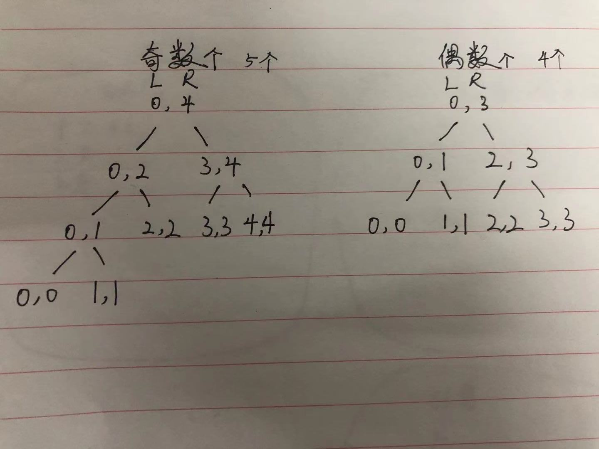

# 算法基础学习

内容学习自"左程云_算法与数据结构基础班.20200418"

## 

## ONE 认识复杂度,对数器,二分法,与异或运算

### 1.时间复杂度是什么,有哪些

**如何确定算法流程复杂度**

当完成了表达式的建立，只要把最高阶项留下即可。低阶项都去掉，高阶项的系数也去掉。

**常见的常数时间操作**

* 常见的算术运算（+、-、*、/、% 等）
* 常见的位运算（>>、>>>、<<、|、&、^等）
* 赋值、比较、自增、自减操作等
* 数组寻址操作

### 2.常见的排序方法比较

1. 选择排序

   ```java
   过程：
   arr[0～N-1]范围上，找到最小值所在的位置，然后把最小值交换到0位置。
   arr[1～N-1]范围上，找到最小值所在的位置，然后把最小值交换到1位置。
   arr[2～N-1]范围上，找到最小值所在的位置，然后把最小值交换到2位置。
   …
   arr[N-1～N-1]范围上，找到最小值位置，然后把最小值交换到N-1位置。
   
   估算：
   很明显，如果arr长度为N，每一步常数操作的数量，如等差数列一般
   所以，总的常数操作数量 = a*(N^2) + b*N + c (a、b、c都是常数)
   
   所以选择排序的时间复杂度为O(N^2)。
   public static void selectionSort(int[] arr) {
   		if (arr == null || arr.length < 2) {
   			return;
   		}
   		// 0～n-1
   		// 1～n-1
   		// 2～n-1
   		for (int i = 0; i < arr.length - 1; i++) { // i ~ N-1
   			// 最小值在哪个位置上  i～n-1
   			int minIndex = i;
   			for (int j = i + 1; j < arr.length; j++) { // i ~ N-1 上找最小值的下标 
   				//比当前位置的值小就记住这个最小的位置,
   				minIndex = arr[j] < arr[minIndex] ? j : minIndex;
   			}
   			//找到最小值的位置,并且和当前位置交换
   			swap(arr, i, minIndex);
   		}
   	}
   ```

2. 冒泡排序

   ```java
   过程：
   在arr[0～N-1]范围上：
   arr[0]和arr[1]，谁大谁来到1位置；arr[1]和arr[2]，谁大谁来到2位置…arr[N-2]和arr[N-1]，谁大谁来到N-1位置
   
   在arr[0～N-2]范围上，重复上面的过程，但最后一步是arr[N-3]和arr[N-2]，谁大谁来到N-2位置
   在arr[0～N-3]范围上，重复上面的过程，但最后一步是arr[N-4]和arr[N-3]，谁大谁来到N-3位置
   …
   最后在arr[0～1]范围上，重复上面的过程，但最后一步是arr[0]和arr[1]，谁大谁来到1位置
   
   
   估算：
   很明显，如果arr长度为N，每一步常数操作的数量，依然如等差数列一般
   所以，总的常数操作数量 = a*(N^2) + b*N + c (a、b、c都是常数)
   
   所以冒泡排序的时间复杂度为O(N^2)。
   public static void bubbleSort(int[] arr) {
   		if (arr == null || arr.length < 2) {
   			return;
   		}
   		for (int e = arr.length - 1; e > 0; e--) { // 0 ~ e
   			for (int i = 0; i < e; i++) {
   				if (arr[i] > arr[i + 1]) {
   					swap(arr, i, i + 1);
   				}
   			}
   		}
   	}
   ```

3. 插入排序

   ```java
   过程：
   想让arr[0~0]上有序，这个范围只有一个数，当然是有序的。
   想让arr[0~1]上有序，所以从arr[1]开始往前看，如果arr[1]<arr[0]，就交换。否则什么也不做。
   …
   想让arr[0~i]上有序，所以从arr[i]开始往前看，arr[i]这个数不停向左移动，一直移动到左边的数字不再比自己大，停止移动。
   最后一步，想让arr[0~N-1]上有序， arr[N-1]这个数不停向左移动，一直移动到左边的数字不再比自己大，停止移动。
   
   估算时发现这个算法流程的复杂程度，会因为数据状况的不同而不同。
   
   你发现了吗？
   如果某个算法流程的复杂程度会根据数据状况的不同而不同，那么你必须要按照最差情况来估计。
   
   很明显，在最差情况下，如果arr长度为N，插入排序的每一步常数操作的数量，还是如等差数列一般
   
   所以，总的常数操作数量 = a*(N^2) + b*N + c (a、b、c都是常数)
   
   所以插入排序排序的时间复杂度为O(N^2)。	
   public static void insertionSort(int[] arr) {
   		if (arr == null || arr.length < 2) {
   			return;
   		}
   		// 0~0 有序的
   		// 0~i 想有序
   		for (int i = 1; i < arr.length; i++) { // 0 ~ i 做到有序
   			// arr[i]往前看，一直交换到合适的位置停止
   			// ...(<=)  ?       <- i
   			for (int j = i - 1; j >= 0 && arr[j] > arr[j + 1]; j--) {
   				swap(arr, j, j + 1);
   			}
   		}
   	}
   ```


### 3.常见时间复杂度

排名从好到差：
O(1)   
O(logN)   
O(N)   
O(N*logN)   
O(N^2)   O(N^3)   …   O(N^K)
O(2^N)   O(3^N)   …   O(K^N)
O(N!)

### 4.认识对数器

1，你想要测的方法a  
2，实现复杂度不好但是容易实现的方法b  
3，实现一个随机样本产生器  
4，把方法a和方法b跑相同的随机样本，看看得到的结果是否一样  
5，如果有一个随机样本使得比对结果不一致，打印样本进行人工干预，改对方法a和方法b  
6，当样本数量很多时比对测试依然正确，可以确定方法a已经正确。   

### 5.认识异或运算

异或运算：相同为0，不同为1  
同或运算：相同为1，不同为0    

能长时间记住的概率接近0%  

所以，异或运算就记成无进位相加！

**异或运算的性质**

0^N == N      N^N == 0
异或运算满足交换律和结合率  

上面的两个性质用无进位相加来理解就非常的容易

### 6.异或运算实用及常见面试题

1. 如何不用额外变量交换两个数.

   ```java
   // 交换arr的i和j位置上的值
   //注意,当交换的两个值,在内存上是同一个地址的话,会出错.(两个相同的数异或,则为0)
   	public static void swap(int[] arr, int i, int j) {
   		arr[i] = arr[i] ^ arr[j];
   		arr[j] = arr[i] ^ arr[j];
   		arr[i] = arr[i] ^ arr[j];
   	}
   //原理:1.A = A^B 2.B = A^B(此时A为A^B,即B=A^B^B,那么,根据 N^N == 0 ,B是不是已经等于A了呢.).3. A=A^B(此时A=A^B,B=A,那么,原有公式A=A^B^A,就是A=B),如此一来,A和B就在没有第三个变量的情况下,互换了.
   ```

   

2. 一个数组中有一种数出现了奇数次，其他数都出现了偶数次，怎么找到并打印这种数 

   ```java
   // arr中，只有一种数，出现奇数次
   	public static void printOddTimesNum1(int[] arr) {
   		int eor = 0;
   		for (int i = 0; i < arr.length; i++) {
   			eor ^= arr[i];
   		}
   		System.out.println(eor);
   	}
   //什么原理呢,偶数次的数,两两相互异或,都为0,0^N==N.最后剩下了那个奇数个数的数,超简单的思路
   ```

   

3. 怎么把一个int类型的数，提取出最右侧的1来

   ```java
   //这个超级常用,很多地方都可以用到.
   public static void printRightOne(int eor){
   		//一个数的二进制形式下,最右边第一次出现的1的位置的数.例如.0010,对应2;0011,对应1;11111110100,对应8
   		int rightOne = eor & (~eor + 1); // 提取出最右的1
   		System.out.println(rightOne);
   	}
   ```

   

4. 一个数组中有两种数出现了奇数次，其他数都出现了偶数次，怎么找到并打印这两种数 

   ```java
   // arr中，有两种数，出现奇数次
   	public static void printOddTimesNum2(int[] arr) {
   		int eor = 0;
   		for (int i = 0; i < arr.length; i++) {
   			eor ^= arr[i];
   		}
   		//上面这一步结束后,eor等于什么呢,加入两个数为AB,那么eor=A^B;因为,剩下的出现的偶数次数的,都=0了.
   		// eor必然有一个位置上是1,比如3,5这两个数各出现三次,3=..0011,5为..00101,这个值异或后,为..00000,
   		//这两个数只有不同,那么说明,一定有某一位数,随机某位数,假设X位,不等,一个是1,一个是0.
   		int rightOne = eor & (~eor + 1); // 提取出最右的1
   		int onlyOne = 0; // eor'
   		for (int i = 0 ; i < arr.length;i++) {
   			//这一步的意思,是将所有数组里的数据分堆,分为X位是1,X位不是1的.
   			if ((arr[i] & rightOne) != 0) {//与运算,都是1则为1,否则为0,例如,01110,rightOne为00010,此时结果为00010,不为0,说明为同类数,X位不为0
   				onlyOne ^= arr[i];//将这一类数,进行异或运算,即可得到一个奇数个数的数据.
   			}
   		}
   		//那么另一个数据就是,eor=A^B^A,
   		System.out.println(onlyOne + " " + (eor ^ onlyOne));
   	}
   ```

   

## TWO 链表结构,栈,队列,递归行为,哈希表

### 1.单向链表

```java
//一个指针,挨着指向后面
public class Node {
    public int value;
    public Node next;
    public Node(int data) {
        value = data;
    }
}
```

### 2.双向链表

```java
//两个指针,一个指向前面,一个指向后面
public class DoubleNode {
    public int value;
    public DoubleNode last;
    public DoubleNode next;
    public DoubleNode(int data) {
        value = data;
    }
}
```

### 3.链表相关常见题

1. 单链表,双向链表如何反转

   ```java
   //1.传入头,先拿到下一个,头指向pre(第一次为空),然后pre变成上个节点,头节点指向下个节点
   //2.重复,拿到当前头下个节点,当前头指向pre,然后pre变成上个节点,头节点指向下个节点,,,,,,,
   public static Node reverseLinkedList(Node head) {
   		Node pre = null;
   		Node next = null;
   		while (head != null) {
   			next = head.next;
   			head.next = pre;
   			pre = head;
   			head = next;
   		}
   		return pre;
   	}
   ```

2. 双向链表,

   ```java
   //
   public static DoubleNode reverseDoubleList(DoubleNode head) {
   		DoubleNode pre = null;
   		DoubleNode next = null;
   		while (head != null) {
   			next = head.next;
   			head.next = pre;
   			head.last = next;
   			pre = head;
   			head = next;
   		}
   		return pre;
   	}
   ```

### 4.栈和队列

* 栈:先进后出,犹如弹夹

* 队列:先进先出,好似排队

### 5.栈和队列的实际实现

1. 双向链表实现栈和队列

   ```java
   //标记有一个头,一个尾,
   //例如:头部插入,先创建节点,如果是第一个来的,头尾都指向他,否则,新的的next指向他,他的pre指向新的,头指向新的,
   //其他类似
   public static class Node<T> {
   		public T value;
   		public Node<T> last;
   		public Node<T> next;
   
   		public Node(T data) {
   			value = data;
   		}
   	}
   //链表结构,操作方法
   public static class DoubleEndsQueue<T> {
   		public Node<T> head;
   		public Node<T> tail;
   
   		public void addFromHead(T value) {
   			Node<T> cur = new Node<T>(value);
   			if (head == null) {
   				head = cur;
   				tail = cur;
   			} else {
   				cur.next = head;
   				head.last = cur;
   				head = cur;
   			}
   		}
   
   		public void addFromBottom(T value) {
   			Node<T> cur = new Node<T>(value);
   			if (head == null) {
   				head = cur;
   				tail = cur;
   			} else {
   				cur.last = tail;
   				tail.next = cur;
   				tail = cur;
   			}
   		}
   
   		public T popFromHead() {
   			if (head == null) {
   				return null;
   			}
   			Node<T> cur = head;
   			if (head == tail) {
   				head = null;
   				tail = null;
   			} else {
   				head = head.next;
   				cur.next = null;
   				head.last = null;
   			}
   			return cur.value;
   		}
   
   		public T popFromBottom() {
   			if (head == null) {
   				return null;
   			}
   			Node<T> cur = tail;
   			if (head == tail) {
   				head = null;
   				tail = null;
   			} else {
   				tail = tail.last;
   				tail.next = null;
   				cur.last = null;
   			}
   			return cur.value;
   		}
   
   		public boolean isEmpty() {
   			return head == null;
   		}
   	}
   //实现栈,先入后出,头插头出,
   public static class MyStack<T> {
   		private DoubleEndsQueue<T> queue;
   
   		public MyStack() {
   			queue = new DoubleEndsQueue<T>();
   		}
   
   		public void push(T value) {
   			queue.addFromHead(value);
   		}
   
   		public T pop() {
   			return queue.popFromHead();
   		}
   
   		public boolean isEmpty() {
   			return queue.isEmpty();
   		}
   
   	}
   //实现队列,头插尾出
   	public static class MyQueue<T> {
   		private DoubleEndsQueue<T> queue;
   
   		public MyQueue() {
   			queue = new DoubleEndsQueue<T>();
   		}
   
   		public void push(T value) {
   			queue.addFromHead(value);
   		}
   
   		public T poll() {
   			return queue.popFromBottom();
   		}
   
   		public boolean isEmpty() {
   			return queue.isEmpty();
   		}
   
   	}
   ```

2. 数组实现栈和队列(怎么用数组实现不超过固定大小的队列和栈)

   1. 栈:正常使用
   2. 队列:环形数组

```java
//确定数组多大
//超过数组个数了还插入,报错,小于数组个数了,还取,报错
//插入,只要没满,size++,pushIndex就是当前插入值,pushIndex指向下个位置.
//取出,只要还有,size__,pollIndex的直接拿走,pollIndex指向下个位置.
public static class MyQueue {
		private int[] arr;
		private int pushi;
		private int polli;
		private int size;
		private final int limit;

		public MyQueue(int l) {
			arr = new int[l];
			pushi = 0;
			polli = 0;
			size = 0;
			limit = l;
		}

		public void push(int value) {
			if (size == limit) {
				throw new RuntimeException("栈满了，不能再加了");
			}
			size++;
			arr[pushi] = value;
			pushi = nextIndex(pushi);
		}

		public int pop() {
			if (size == 0) {
				throw new RuntimeException("栈空了，不能再拿了");
			}
			size--;
			int ans = arr[polli];
			polli = nextIndex(polli);
			return ans;
		}

		public boolean isEmpty() {
			return size == 0;
		}
	//到最后了吗,到了就回到首,否则就是下个位置.
		private int nextIndex(int i) {
			return i < limit - 1 ? i + 1 : 0;
		}

	}
```

### 6.栈和队列常见题

1. 实现一个特殊的栈，在基本功能的基础上，再实现返回栈中最小元素的功能  

   1）pop、push、getMin操作的时间复杂度都是 O(1)。 

   2）设计的栈类型可以使用现成的栈结构。

   ```java
   //同时压两个栈,一个是普通的数据栈,另一个是最小值栈.
   //最小值栈压入规则,1.如果没有,直接压一个,如果新的<=当前最小值,插入当前值,如果新的>当前最小值,插入当前最小值.
   public static class MyStack1 {
   		private Stack<Integer> stackData;
   		private Stack<Integer> stackMin;
   
   		public MyStack1() {
   			this.stackData = new Stack<Integer>();
   			this.stackMin = new Stack<Integer>();
   		}
   
   		public void push(int newNum) {
   			if (this.stackMin.isEmpty()) {
   				this.stackMin.push(newNum);
   			} else if (newNum <= this.getmin()) {
   				this.stackMin.push(newNum);
   			}
   			this.stackData.push(newNum);
   		}
   
   		public int pop() {
   			if (this.stackData.isEmpty()) {
   				throw new RuntimeException("Your stack is empty.");
   			}
   			int value = this.stackData.pop();
   			if (value == this.getmin()) {
   				this.stackMin.pop();
   			}
   			return value;
   		}
   
   		public int getmin() {
   			if (this.stackMin.isEmpty()) {
   				throw new RuntimeException("Your stack is empty.");
   			}
   			return this.stackMin.peek();
   		}
   	}
   /////////////////////////////////////////////////////////////////////////
   //还有另一种思路,也是有两个栈.
   //当新的值小于等于时候,插入,大于时候不插入,
   //弹出的时候,如果data栈的弹出值不等于min栈顶值,min栈不弹出.否则同步弹出.
   ```

   

2. 互相实现

   1）如何用栈结构实现队列结构

   ```java
   //两个栈.一个是正常压栈data栈,一个是倒入用的栈.help栈
   //当进行任何操作时候,尝试将data的倒入help,注意,只有help为空的时候才能倒入.
   //取数的时候,从help中取,先压入data中的数据,倒入help中,两次操作就变成了,先入先出.
   public static class TwoStacksQueue {
   		public Stack<Integer> stackPush;
   		public Stack<Integer> stackPop;
   
   		public TwoStacksQueue() {
   			stackPush = new Stack<Integer>();
   			stackPop = new Stack<Integer>();
   		}
   
   		// push栈向pop栈倒入数据
   		private void pushToPop() {
   			if (stackPop.empty()) {
   				while (!stackPush.empty()) {
   					stackPop.push(stackPush.pop());
   				}
   			}
   		}
   
   		public void add(int pushInt) {
   			stackPush.push(pushInt);
   			pushToPop();
   		}
   
   		public int poll() {
   			if (stackPop.empty() && stackPush.empty()) {
   				throw new RuntimeException("Queue is empty!");
   			}
   			pushToPop();
   			return stackPop.pop();
   		}
   
   		public int peek() {
   			if (stackPop.empty() && stackPush.empty()) {
   				throw new RuntimeException("Queue is empty!");
   			}
   			pushToPop();
   			return stackPop.peek();
   		}
   	}
   ```

   2）如何用队列结构实现栈结构

   ```java
   //两个队列.一个data,一个help
   //正常进数据到data.当取出的时候,data数据进入到help,然后剩余一个的时候,返回这个值.然后data和help身份互换.
   //先入的,后出了,就变成了栈, 
   public static class TwoQueueStack<T> {
   		public Queue<T> queue;
   		public Queue<T> help;
   
   		public TwoQueueStack() {
   			queue = new LinkedList<>();
   			help = new LinkedList<>();
   		}
   
   		public void push(T value) {
   			queue.offer(value);
   		}
   
   		public T poll() {
   			while (queue.size() > 1) {
   				help.offer(queue.poll());
   			}
   			T ans = queue.poll();
   			Queue<T> tmp = queue;
   			queue = help;
   			help = tmp;
   			return ans;
   		}
   
   		public T peek() {
   			while (queue.size() > 1) {
   				help.offer(queue.poll());
   			}
   			T ans = queue.peek();
   			Queue<T> tmp = queue;
   			queue = help;
   			help = tmp;
   			help.offer(ans);
   			return ans;
   		}
   
   		public boolean isEmpty() {
   			return queue.isEmpty();
   		}
   
   	}
   ```

### 7.递归

对于新手来说，把调用的过程画出结构图是必须的，这有利于分析递归

递归并不是玄学，递归底层是利用系统栈来实现的

任何递归函数都一定可以改成非递归

**例子**

求数组arr[L..R]中的最大值，怎么用递归方法实现。

1）将[L..R]范围分成左右两半。左：[L..Mid]  右[Mid+1..R]
2）左部分求最大值，右部分求最大值
3） [L..R]范围上的最大值，是max{左部分最大值，右部分最大值}

注意：2）是个递归过程，当范围上只有一个数，就可以不用再递归了

//可以用二叉树的方式理解,例如int[] arr = {1,2,3,4,5};  
//二分下去,直到只剩一个就返回,  




```java

	// 求arr中的最大值
	public static int getMax(int[] arr) {
		return process(arr, 0, arr.length - 1);
	}

	// arr[L..R]范围上求最大值
	public static int process(int[] arr, int L, int R) {
		if (L == R) { // arr[L..R]范围上只有一个数，直接返回，base case
			return arr[L];
		}
		//  L..mid  mid+1...R
		// int mid = (L+R)/2
		int mid = L + ((R - L) >> 1); // 中点
		int leftMax = process(arr, L, mid);
		int rightMax = process(arr, mid + 1, R);
		return Math.max(leftMax, rightMax);
	}
public static void main(String[] args) {
		int[] arr = {1,2,3,4,5};
		System.out.println(process(arr,0,3));
		//System.out.println(getMax(arr));
	}
```

**Master公式**

形如
T(N) = a * T(N/b) + O(N^d)(其中的a、b、d都是常数)的递归函数，可以直接通过Master公式来确定时间复杂度

a:递归内部调用了多少次.例如左半边调用一次,右半边调用一次,此时a就是2,如果是1/3计算一次大小,就需要左,中,右,就是三次.a就是3.

b:b表示每次递归是原来的1/b之一个规模,取了多大,如果是一半,那么b就是2,如果是疯了,前边就2/3,后边也2/3,结果也是对的,但是中间就要重复计算下,那么b就是1/b = 2/3,b = 3/2.

d:d就是除了递归子问题后,剩余代码的时间复杂度.假如真疯了,代码里非要加个循环,这时候d就是1,也就是O(N),循环套循环,就是O(N^2).

如果 log(b,a) < d，复杂度为O(N^d)  
如果 log(b,a) > d，复杂度为O(N^log(b,a))  
如果 log(b,a) == d，复杂度为O(N^d  * logN)  

根据上述公式,

1. 一半一半时候,a=2,b=2,d=0,log(2,2)>0.是第二种情况.O(N^log(2,2)),就是O(N).
2. 假如疯了,就要打印两个循环套循环,d就是2了,是第一种情况,就是O(N^2).
3. 其他情况......套公式.

### 8.哈希表

1)哈希表在使用层面上可以理解为一种集合结构
2)如果只有key，没有伴随数据value，可以使用HashSet结构
3)如果既有key，又有伴随数据value，可以使用HashMap结构
4)有无伴随数据，是HashMap和HashSet唯一的区别，实际结构是一回事 
5)<font color="red">使用哈希表增(put)、删(remove)、改(put)和查(get)的操作，可以认为时间复杂度为 O(1)，但是常数时间比较大 </font>
6)放入哈希表的东西，如果是基础类型，内部按值传递，内存占用是这个东西的大小 
7)放入哈希表的东西，如果不是基础类型，内部按引用传递，内存占用是8字节

### 9.有序表

<font color="red">比哈希表功能多，时间复杂度都是O(logN)</font>

1)有序表在使用层面上可以理解为一种集合结构
2)如果只有key，没有伴随数据value，可以使用TreeSet结构
3)如果既有key，又有伴随数据value，可以使用TreeMap结构
4)有无伴随数据，是TreeSet和TreeMap唯一的区别，底层的实际结构是一回事
5)有序表把key按照顺序组织起来，而哈希表完全不组织
6)红黑树、AVL树、size-balance-tree和跳表等都属于有序表结构，只是底层具体实现不同
7)放入如果是基础类型，内部按值传递，内存占用就是这个东西的大小
8)放入如果不是基础类型，内部按引用传递，内存占用是8字节
9)不管是什么底层具体实现，只要是有序表，都有以下固定的基本功能和固定的时间复杂度 

```
1)void put(K key, V value)
将一个(key，value)记录加入到表中，或者将key的记录 更新成value。
2)V get(K key)
根据给定的key，查询value并返回。
3)void remove(K key)
移除key的记录。 
4)boolean containsKey(K key)
询问是否有关于key的记录。
5)K firstKey()
返回所有键值的排序结果中，最小的那个。
6)K lastKey()
返回所有键值的排序结果中，最大的那个。
7)K floorKey(K key)
返回<= key 离key最近的那个
8)K ceilingKey(K key）
返回>= key 离key最近的那个
```

## THREE 归并排序与随机快排

### 1.归并排序

1）整体是递归，左边排好序+右边排好序+merge让整体有序  
2）让其整体有序的过程里用了排外序方法  
3）利用master公式来求解时间复杂度  
4）当然可以用非递归实现  

**归并排序复杂度**

T(N) = 2*T(N/2) + O(N^1) 根据master可知时间复杂度为O(N * logN)  

merge过程需要辅助数组，所以额外空间复杂度为O(N)  

归并排序的实质是把比较行为变成了有序信息并传递，比O(N^2)的排序快  

**归并排序实现**

```java
//什么思路,二分,分别排序,再merge.
public static void merge(int[] arr, int L, int M, int R) {
		int[] help = new int[R - L + 1];
		int i = 0;
		int p1 = L;
		int p2 = M + 1;
		//merge规则,1.左右两部分有序结果再排序,如果左边<=右边,从左边拿,否则拿右边,2.如果某一边拿完了,那么将另一边的直接刷写在help[]后边.
		//左右都没越界,
		while (p1 <= M && p2 <= R) {
			help[i++] = arr[p1] <= arr[p2] ? arr[p1++] : arr[p2++];
		}
		//左边没越界
		while (p1 <= M) {
			help[i++] = arr[p1++];
		}
		//右边没越界
		while (p2 <= R) {
			help[i++] = arr[p2++];
		}
		//区域内排序完毕.
		//覆写原数组
		for (i = 0; i < help.length; i++) {
			arr[L + i] = help[i];
		}
	}

	// 递归方法实现
	public static void mergeSort1(int[] arr) {
		if (arr == null || arr.length < 2) {
			return;
		}
		process(arr, 0, arr.length - 1);
	}

	public static void process(int[] arr, int L, int R) {
		if (L == R) {
			return;
		}
		int mid = L + ((R - L) >> 1);
		process(arr, L, mid);
		process(arr, mid + 1, R);
		merge(arr, L, mid, R);
	}

	// 非递归方法实现
	public static void mergeSort2(int[] arr) {
		if (arr == null || arr.length < 2) {
			return;
		}
		int N = arr.length;
		int mergeSize = 1;
		while (mergeSize < N) {
			int L = 0;
			while (L < N) {
				int M = L + mergeSize - 1;
				if (M >= N) {
					break;
				}
				int R = Math.min(M + mergeSize, N - 1);
				merge(arr, L, M, R);
				L = R + 1;
			}
			if (mergeSize > N / 2) {
				break;
			}
			mergeSize <<= 1;
		}
	}
```

**归并排序常见面试题**

在一个数组中，一个数左边比它小的数的总和，叫数的小和，所有数的小和累加起来，叫数组小和。求数组小和。  
例子： [1,3,4,2,5]   
1左边比1小的数：没有  
3左边比3小的数：1  
4左边比4小的数：1、3  
2左边比2小的数：1  
5左边比5小的数：1、3、4、 2  
所以数组的小和为1+1+3+1+1+3+4+2=16   

```java
public static int smallSum(int[] arr) {
		if (arr == null || arr.length < 2) {
			return 0;
		}
		return process(arr, 0, arr.length - 1);
	}

	// arr[L..R]既要排好序，也要求小和返回
	public static int process(int[] arr, int l, int r) {
		if (l == r) {
			return 0;
		}
		int mid = l + ((r - l) >> 1);
		return 
				//左边小和,
				process(arr, l, mid) 
				+
						//右边小和
				process(arr, mid + 1, r) 
				+ 
						//这个左右合并的小和
				merge(arr, l, mid, r);
	}

	public static int merge(int[] arr, int L, int m, int r) {
		int[] help = new int[r - L + 1];
		int i = 0;
		int p1 = L;
		int p2 = m + 1;
		int res = 0;
		while (p1 <= m && p2 <= r) {
			res += arr[p1] < arr[p2] ? (r - p2 + 1) * arr[p1] : 0;//左边比右边小,说明右边下边到结尾一定有多少个数比这个数大,小和=剩余下标个数*左边当前数
			help[i++] = arr[p1] < arr[p2] ? arr[p1++] : arr[p2++];//排序操作
		}
		//排序
		while (p1 <= m) {
			help[i++] = arr[p1++];
		}
		while (p2 <= r) {
			help[i++] = arr[p2++];
		}
		//覆写
		for (i = 0; i < help.length; i++) {
			arr[L + i] = help[i];
		}
		return res;
	}

	// for test
	public static int comparator(int[] arr) {
		if (arr == null || arr.length < 2) {
			return 0;
		}
		int res = 0;
		for (int i = 1; i < arr.length; i++) {
			for (int j = 0; j < i; j++) {
				res += arr[j] < arr[i] ? arr[j] : 0;
			}
		}
		return res;
	}

```

### 2.快速排序

**Partition过程**  

给定一个数组arr，和一个整数num。请把小于等于num的数放在数组的左边，大于num的数放在数组的右边。  

要求额外空间复杂度O(1)，时间复杂度O(N)   

**荷兰国旗问题**

给定一个数组arr，和一个整数num。请把小于num的数放在数组的左边，等于num的数放在中间，大于num的数放在数组的右边。

要求额外空间复杂度O(1)，时间复杂度O(N) 

#### 1.快速排序1.0 

在arr[L..R]范围上，进行快速排序的过程：  
1）用arr[R]对该范围做partition，<= arr[R]的数在左部分并且保证arr[R]最后来到左部分的最后一个位置，记为M； <= arr[R]的数在右部分（arr[M+1..R]）  
2）对arr[L..M-1]进行快速排序(递归)  
3）对arr[M+1..R]进行快速排序(递归)  
因为每一次partition都会搞定一个数的位置且不会再变动，所以排序能完成  

#### 2.快速排序2.0

在arr[L..R]范围上，进行快速排序的过程：  
1）用arr[R]对该范围做partition，< arr[R]的数在左部分，== arr[R]的数中间，>arr[R]的数在右部分。假设== arr[R]的数所在范围是[a,b]
2）对arr[L..a-1]进行快速排序(递归)  
3）对arr[b+1..R]进行快速排序(递归)  
因为每一次partition都会搞定一批数的位置且不会再变动，所以排序能完成

**1.0和2.0的比较**

数组已经有序的时候就是复杂度最高的时候

时间复杂度O(N^2)

#### 3.快速排序3.0(随机快排+荷兰国旗技巧优化)

在arr[L..R]范围上，进行快速排序的过程：  
1）在这个范围上，随机选一个数记为num，  
1）用num对该范围做partition，< num的数在左部分，== num的数中间，>num的数在右部分。假设== num的数所在范围是[a,b]
2）对arr[L..a-1]进行快速排序(递归)  
3）对arr[b+1..R]进行快速排序(递归)  
因为每一次partition都会搞定一批数的位置且不会再变动，所以排序能完成  

**随机快排的时间复杂度分析**

1）通过分析知道，划分值越靠近中间，性能越好；越靠近两边，性能越差  
2）随机选一个数进行划分的目的就是让好情况和差情况都变成概率事件  
3）把每一种情况都列出来，会有每种情况下的时间复杂度，但概率都是1/N  
4）那么所有情况都考虑，时间复杂度就是这种概率模型下的长期期望！  

时间复杂度O(N*logN)，额外空间复杂度O(logN)都是这么来的。