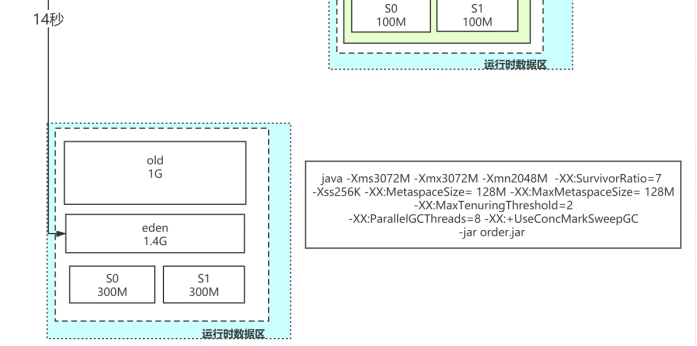

## JVM2024-上

## 一.jvm基础

## 1.说一下 JVM 的主要组成部分及其作用？


JVM包含两个子系统和两个组件，两个子系统为Class loader(类装载)、Execution engine(执行引擎)；两个组件为Runtime data area(运行时数据区)、Native Interface(本地接口)。

Class loader(类装载)：根据给定的全限定名类名(如：java.lang.Object)来装载class文件到Runtime data area中的method area。
Execution engine（执行引擎）：执行classes中的指令。
Native Interface(本地接口)：与native libraries交互，是其它编程语言交互的接口。
Runtime data area(运行时数据区域)：这就是我们常说的JVM的内存。
作用 ：首先通过编译器把 Java 代码转换成字节码，类加载器（ClassLoader）再把字节码加载到内存中，将其放在运行时数据区（Runtime data area）的方法区内，而字节码文件只是 JVM 的一套指令集规范，并不能直接交给底层操作系统去执行，因此需要特定的命令解析器执行引擎（Execution Engine），将字节码翻译成底层系统指令，再交由 CPU 去执行，而这个过程中需要调用其他语言的本地库接口（Native Interface）来实现整个程序的功能。

下面是Java程序运行机制详细说明

Java程序运行机制步骤

首先利用IDE集成开发工具编写Java源代码，源文件的后缀为.java；
再利用编译器(javac命令)将源代码编译成字节码文件，字节码文件的后缀名为.class；
运行字节码的工作是由解释器(java命令)来完成的。

从上图可以看，java文件通过编译器变成了.class文件，接下来类加载器又将这些.class文件加载到JVM中。
其实可以一句话来解释：类的加载指的是将类的.class文件中的二进制数据读入到内存中，将其放在运行时数据区的方法区内，然后在堆区创建一个 java.lang.Class对象，用来封装类在方法区内的数据结构。

## 2.说一下堆栈的区别？

**物理地址**

堆的物理地址分配对对象是不连续的。因此性能慢些。在GC的时候也要考虑到不连续的分配，所以有各种算法。比如，标记-消除，复制，标记-压缩，分代（即新生代使用复制算法，老年代使用标记——压缩）

栈使用的是数据结构中的栈，先进后出的原则，物理地址分配是连续的。所以性能快。


**内存分别**

堆因为是不连续的，所以分配的内存是在运行期确认的，因此大小不固定。一般堆大小远远大于栈。

栈是连续的，所以分配的内存大小要在编译期就确认，大小是固定的。

**存放的内容**

堆存放的是对象的实例和数组。因此该区更关注的是数据的存储

栈存放：局部变量，操作数栈，返回结果。该区更关注的是程序方法的执行。

PS：

静态变量放在方法区
静态的对象还是放在堆。
**程序的可见度**

堆对于整个应用程序都是共享、可见的。

栈只对于线程是可见的。所以也是线程私有。他的生命周期和线程相同。

## 3.介绍一下强引用、软引用、弱引用、虚引用的区别？

> 1.**强引用**
>
> JVM内存管理器从根引用集合（Root Set）出发遍寻堆中所有到达对象的路径。当到达某对象的任意路径都不含有引用对象时，对这个对象的引用就被称为强引用
>
> 2.软引用
>
> 软引用是用来描述一些还有用但是非必须的对象。对于软引用关联的对象，在系统将于发生内存溢出异常之前，将会把这些对象列进回收范围中进行二次回收。
>
> （当你去处理占用内存较大的对象  并且生命周期比较长的，不是频繁使用的）
>
> 问题：软引用可能会降低应用的运行效率与性能。比如：软引用指向的对象如果初始化很耗时，或者这个对象在进行使用的时候被第三方施加了我们未知的操作。
>
> 用处： 软引用在实际中有重要的应用，例如浏览器的后退按钮。按后退时，这个后退时显示的网页内容是重新进行请求还是从缓存中取出呢？这就要看具体的实现策略了。
>
> （1）如果一个网页在浏览结束时就进行内容的回收，则按后退查看前面浏览过的页面时，需要重新构建
>
> （2）如果将浏览过的网页存储到内存中会造成内存的大量浪费，甚至会造成内存溢出
>
> 3.弱引用
>
> 弱引用（Weak Reference）对象与软引用对象的最大不同就在于：GC在进行回收时，需要通过算法检查是否回收软引用对象，而对于Weak引用对象， GC总是进行回收。因此Weak引用对象会更容易、更快被GC回收
>
> 4.虚引用
>
> 也叫幽灵引用和幻影引用，为一个对象设置虚引用关联的唯一目的就是能在这个对象被回收时收到一**个系统通知。也就是说,如果一个对象被设置上了一个虚引用,实际上跟没有设置引用没有**任何的区别
>
> 一般不用，辅助咱们的Finaliza函数的使用

## 4.JVM类加载机制的三种特性

* 全盘负责，当一个类加载器负责加载某个Class时，该Class所依赖的和引用的其他Class也将由该类加载器负责载入，除非显示使用另外一个类加载器来载入

> 例如，系统类加载器AppClassLoader加载入口类（含有main方法的类）时，会把main方法所依赖的类及引用的类也载入，依此类推。“全盘负责”机制也可称为当前类加载器负责机制。显然，入口类所依赖的类及引用的类的当前类加载器就是入口类的类加载器。
>
> 以上步骤只是调用了ClassLoader.loadClass(name)方法，并没有真正定义类。真正加载class字节码文件生成Class对象由“双亲委派”机制完成。

* 父类委托，“双亲委派”是指子类加载器如果没有加载过该目标类，就先委托父类加载器加载该目标类，只有在父类加载器找不到字节码文件的情况下才从自己的类路径中查找并装载目标类。

> 父类委托别名就叫双亲委派机制。
>
> “双亲委派”机制加载Class的具体过程是：
>
> 1. ClassLoader先判断该Class是否已加载，如果已加载，则返回Class对象；如果没有则委托给父类加载器。
> 2. 父类加载器判断是否加载过该Class，如果已加载，则返回Class对象；如果没有则委托给祖父类加载器。
> 3. 依此类推，直到始祖类加载器（引用类加载器）。
> 4. 始祖类加载器判断是否加载过该Class，如果已加载，则返回Class对象；如果没有则尝试从其对应的类路径下寻找class字节码文件并载入。如果载入成功，则返回Class对象；如果载入失败，则委托给始祖类加载器的子类加载器。
> 5. 始祖类加载器的子类加载器尝试从其对应的类路径下寻找class字节码文件并载入。如果载入成功，则返回Class对象；如果载入失败，则委托给始祖类加载器的孙类加载器。
> 6. 依此类推，直到源ClassLoader。
> 7. 源ClassLoader尝试从其对应的类路径下寻找class字节码文件并载入。如果载入成功，则返回Class对象；如果载入失败，源ClassLoader不会再委托其子类加载器，而是抛出异常。

> “双亲委派”机制只是Java推荐的机制，并不是强制的机制。
>
> 我们可以继承java.lang.ClassLoader类，实现自己的类加载器。如果想保持双亲委派模型，就应
>
> 该重写findClass(name)方法；如果想破坏双亲委派模型，可以重写loadClass(name)方法。
>
> 

* 缓存机制，缓存机制将会保证所有加载过的Class都将在内存中缓存，当程序中需要使用某个Class时，类加载器先从内存的缓存区寻找该Class，只有缓存区不存在，系统才会读取该类对应的二进制数据，并将其转换成Class对象，存入缓存区。这就是为什么修改了Class后，必须重启JVM，程序的修改才会生效.对于一个类加载器实例来说，相同全名的类只加载一次，即 loadClass方法不会被重复调用。

> 而这里我们JDK8使用的是直接内存，所以我们会用到直接内存进行缓存。这也就是我们的类变量为什么只会被初始化一次的由来。

```java
   protected Class<?> loadClass(String name, boolean resolve)
        throws ClassNotFoundException
    {
        synchronized (getClassLoadingLock(name)) {
            // First，在虚拟机内存中查找是否已经加载过此类...类缓存的主要问题所在！！！
            Class<?> c = findLoadedClass(name);
            if (c == null) {
                long t0 = System.nanoTime();
                try {
                    if (parent != null) {
						//先让上一层加载器进行加载
                        c = parent.loadClass(name, false);
                    } else {
                        c = findBootstrapClassOrNull(name);
                    }
                } catch (ClassNotFoundException e) {
                    // ClassNotFoundException thrown if class not found
                    // from the non-null parent class loader
                }

                if (c == null) {
                    // If still not found, then invoke findClass in order
                    // to find the class.
                    long t1 = System.nanoTime();
					//调用此类加载器所实现的findClass方法进行加载
                    c = findClass(name);

                    // this is the defining class loader; record the stats
                    sun.misc.PerfCounter.getParentDelegationTime().addTime(t1 - t0);
                    sun.misc.PerfCounter.getFindClassTime().addElapsedTimeFrom(t1);
                    sun.misc.PerfCounter.getFindClasses().increment();
                }
            }
            if (resolve) {
				//resolveClass方法是当字节码加载到内存后进行链接操作，对文件格式和字节码验证，并为 static 字段分配空间并初始化，符号引用转为直接引用，访问控制，方法覆盖等
                resolveClass(c);
            }
            return c;
        }
    }
```

## 5.常量池分类：

#### 1.静态常量池

静态常量池是相对于运行时常量池来说的，属于描述class文件结构的一部分

由**字面量**和**符号引用**组成，在类被加载后会将静态常量池加载到内存中也就是运行时常量池

**字面量** ：文本，字符串以及Final修饰的内容

**符号引用** ：类，接口，方法，字段等相关的描述信息。

直接引用：我的符号引用已经具体的落地到了内存，有了自己的地址

#### 2.运行时常量池

当静态常量池被加载到内存后就会变成运行时常量池。

> 也就是真正的把文件的内容落地到JVM内存了

#### 3.字符串常量池

**设计理念：**字符串作为最常用的数据类型，为减小内存的开销，专门为其开辟了一块内存区域（字符串常量池）用以存放。

JDK1.6及之前版本，字符串常量池是位于永久代（相当于现在的方法区）。

JDK1.7之后，字符串常量池位于Heap堆中

**面试常问点：（笔试居多）**

下列三种操作最多产生哪些对象

**1.直接赋值**

`String a ="aaaa";`

解析：

最多创建一个字符串对象。

首先“aaaa”会被认为字面量，先在字符串常量池中查找（.equals()）,如果没有找到，在堆中创建“aaaa”字符串对象，并且将“aaaa”的引用维护到字符串常量池中（实际是一个hashTable结构，存放key-value结构数据），再返回该引用；如果在字符串常量池中已经存在“aaaa”的引用，直接返回该引用。

**2.new String()**

`String  a  =new  String("aaaa");`

解析：

最多会创建两个对象。

首先“aaaa”会被认为字面量，先在字符串常量池中查找（.equals()）,如果没有找到，在堆中创建“aaaa”字符串对象，然后再在堆中创建一个“aaaa”对象，返回后面“aaaa”的引用；
**3.intern()**

```java
String s1 = new String("yzt");
String s2 = s1.intern();
System.out.println(s1 == s2); //false
```

解析：

String中的intern方法是一个 native 的方法，当调用 intern方法时，如果常量池已经包含一个等于此String对象的字符串（用equals(object)方法确定），则返回池中的字符串。否则，将intern返回的引用指向当前字符串 s1(jdk1.6版本需要将s1 复制到字符串常量池里)

常量池在内存中的布局：


## 6.访问对象有哪几种方式

句柄池访问：


直接指针访问对象图解:


**区别:**

**句柄池:**

使用句柄访问对象，会在堆中开辟一块内存作为句柄池，句柄中储存了对象实例数据(属性值结构体) 的内存地址，访问类型数据的内存地址(类信息，方法类型信息)，对象实例数据一般也在heap中开 辟，类型数据一般储存在方法区中。

**优点** :reference存储的是稳定的句柄地址，在对象被移动(垃圾收集时移动对象是非常普遍的行为) 时只会改变句柄中的实例数据指针，而reference本身不需要改变。

**缺点** :增加了一次指针定位的时间开销。

**直接访问:**

直接指针访问方式指reference中直接储存对象在heap中的内存地址，但对应的类型数据访问地址需要 在实例中存储。

**优点** :节省了一次指针定位的开销。

**缺点** :在对象被移动时(如进行GC后的内存重新排列)，reference本身需要被修改

## 7.对象的生命周期可以描述一下吗


**创建阶段**

（1）为对象分配存储空间

（2）开始构造对象

（3）从超类到子类对static成员进行初始化

（4）超类成员变量按顺序初始化，递归调用超类的构造方法

（5）子类成员变量按顺序初始化，子类构造方法调用，并且一旦对象被创建，并被分派给某些变量赋值，这个对象的状态就切换到了应用阶段

**应用阶段**

（1）系统至少维护着对象的一个强引用（Strong Reference）

（2）所有对该对象的引用全部是强引用（除非我们显式地使用了：软引用（Soft Reference）、弱引用（Weak Reference）或虚引用（Phantom Reference））

finalize方法代码Demo：

```java
public class Finalize {

    private static Finalize save_hook = null;//类变量

    public void isAlive() {
        System.out.println("我还活着");
    }

    @Override
    public void finalize() {
        System.out.println("finalize方法被执行");
        Finalize.save_hook = this;
    }

    public static void main(String[] args) throws InterruptedException {


        save_hook = new Finalize();//对象
        //对象第一次拯救自己
        save_hook = null;
        System.gc();
        //暂停0.5秒等待他
        Thread.sleep(500);
        if (save_hook != null) {
            save_hook.isAlive();
        } else {
            System.out.println("好了，现在我死了");
        }

        //对象第二次拯救自己
        save_hook = null;
        System.gc();
        //暂停0.5秒等待他
        Thread.sleep(500);
        if (save_hook != null) {
            save_hook.isAlive();
        } else {
            System.out.println("我终于死亡了");
        }
    }
}
```

**不可见阶段**

不可见阶段的对象在虚拟机的对象根引用集合中再也找不到直接或者间接的强引用，最常见的就是线程或者函数中的临时变量。程序不在持有对象的强引用。  （但是某些类的静态变量或者JNI是有可能持有的 ）

**不可达阶段**

指对象不再被任何强引用持有，GC发现该对象已经不可达。

## 8.你能聊一聊对象模型的对齐填充设计原因吗？

对齐填充的意义是 **提高CPU访问数据的效率** ，主要针对会存在**该实例对象数据跨内存地址区域存储**的情况。

例如：在没有对齐填充的情况下，内存地址存放情况如下:


因为处理器只能0x00-0x07，0x08-0x0F这样读取数据，所以当我们想获取这个long型的数据时，处理 器必须要读两次内存，第一次(0x00-0x07)，第二次(0x08-0x0F)，然后将两次的结果才能获得真正的数值。

那么在有对齐填充的情况下，内存地址存放情况是这样的:


现在处理器只需要直接一次读取(0x08-0x0F)的内存地址就可以获得我们想要的数据了。

## 9.对象的垃圾回收流程

一般情况下，新创建的对象都会被分配到Eden区，一些特殊的大的对象会直接分配到Old区。

我是一个普通的Java对象,我出生在Eden区,在Eden区我还看到和我长的很像的小兄弟,我们在Eden区中玩了挺长时间。有一天Eden区中的人实在是太多了,我就被迫去了Survivor区的“From”区,自从去了Survivor区,我就开始漂了,有时候在Survivor的“From”区,有时候在Survivor的“To”区,居无定所。直到我18岁的时候,爸爸说我成人了,该去社会上闯闯了。于是我就去了年老代那边,年老代里,人很多,并且年龄都挺大的。


## 10.为什么需要两个Survivor区？

最大的好处就是解决了碎片化。也就是说为什么一个Survivor区不行?第一部分中,我们知道了必须设置Survivor区。假设现在只有一个Survivor区,我们来模拟一下流程:
刚刚新建的对象在Eden中,一旦Eden满了,触发一次Minor GC,Eden中的存活对象就会被移动到Survivor区。这样继续循环下去,下一次Eden满了的时候,问题来了,此时进行Minor GC,Eden和Survivor各有一些存活对象,如果此时把Eden区的存活对象硬放到Survivor区,很明显这两部分对象所占有的内存是不连续的,也就导致了内存碎片化。
永远有一个Survivor space是空的,另一个非空的Survivor space无碎片。

## 11.堆内存中都是线程共享的区域吗？

JVM默认为每个线程在Eden上开辟一个buffer区域，用来加速对象的分配，称之为TLAB，全称:Thread Local Allocation Buffer。
对象优先会在TLAB上分配，但是TLAB空间通常会比较小，如果对象比较大，那么还是在共享区域分配。

## 12.方法区与元数据区以及持久代到底是什么关系

规范与实现        元数据区 元空间    MetaSpace       直接内存      持久代    永久代    permSpace    JVM的内存

## 13.栈帧结构是什么样子的？


## 14.栈帧的动态链接怎么去聊

动态链接是为了支持方法的动态调用过程 。

动态链接将这些符号方法引用转换为具体的方法引用       解析 （静态链接）    动态链接

符号引用转变为直接引用      为了支持java的多态

void    a(){

b();

}

void    b(){

c();

}

void    c(){

}


## 二.JVM调优

## JVM常用参数以及垃圾收集器常见参数（一般会问你怎么调整的垃圾收集器的具体参数，上节课是泛参数）：

## JVM调优  调整某些参数 为了让程序达到硬件性能瓶颈

### GC常用参数（一般各个垃圾收集器都可以使用的一些打印类参数以及大（类似于堆内存大小这种）参数）

-Xmx：设置堆的最大值，一般为操作系统的 2/3 大小   MaxHeapSize

-Xms：设置堆的初始值，一般设置成和 Xmx 一样的大小来避免动态扩容。  InitialHeapSize

项目启动直接Full GC

-Xmn：表示年轻代的大小，默认新生代占堆大小的 1/3。高并发、对象快消亡场景可适当加大这个区域，对半，或者更多，都是可以的。但是在 G1 下，就不用再设置这个值了，它会自动调整。

-Xss：用于设置栈的大小，默认为 1M，如果代码中局部变量不多，可设置成256K节约空间。

-XX:+UseTLAB		使用TLAB，默认打开

-XX:+PrintTLAB	打印TLAB的使用情况

-XX:TLABSize		设置TLAB大小

-XX:+DisableExplicitGC		启用用于禁用对的调用处理的选项System.gc()

-XX:+PrintGC			查看GC基本信息

-XX:+PrintGCDetails		查看GC详细信息

-XX:+PrintHeapAtGC		每次一次GC后，都打印堆信息

-XX:+PrintGCTimeStamps	启用在每个GC上打印时间戳的功能

-XX:+PrintGCApplicationConcurrentTime	打印应用程序时间(低)

-XX:+PrintGCApplicationStoppedTime 	打印暂停时长（低）

-XX:+PrintReferenceGC 	记录回收了多少种不同引用类型的引用（重要性低）

-verbose:class		类加载详细过程

-XX:+PrintVMOptions	可在程序运行时，打印虚拟机接受到的命令行显示参数

-XX:+PrintFlagsFinal -XX:+PrintFlagsInitial	打印所有的JVM参数、查看所有JVM参数启动的初始值（必须会用）

-XX:MaxTenuringThreshold

升代（分代）年龄，这个值在CMS 下默认为 6，G1 下默认为 15，这个值和我们前面提到的对象提升有关，改动效果会比较明显。对象的年龄分布可以使用 -XX:+PrintTenuringDistribution 打印，如果后面几代的大小总是差不多，证明过了某个年龄后的对象总能晋升到老生代，就可以把晋升阈值设小。

### Parallel常用参数

**-XX:SurvivorRatio    你要讲的出道理**

设置伊甸园空间大小与幸存者空间大小之间的比率。默认情况下，此选项设置为**8**

**-XX:PreTenureSizeThreshold       对象到达一定的限定值的时候  会直接进入老年代**

大对象到底多大，大于这个值的参数直接在老年代分配

**-XX:MaxTenuringThreshold**

升代年龄，最大值15   **并行（吞吐量）收集器的默认值为**15，而CMS收集器的默认值为6。

**-XX:+ParallelGCThreads**

并行收集器的线程数，同样适用于**CMS**，一般设为和CPU核数相同          N+1

**-XX:+UseAdaptiveSizePolicy**

自动选择各区大小比例

### **CMS常用参数**

**-XX:+UseConcMarkSweepGC**

**启用**CMS垃圾回收器

**-XX:+ParallelGCThreads**

并行收集器的线程数，同样适用于**CMS**，一般设为和CPU核数相同

**-XX:CMSInitiatingOccupancyFraction           并发失败的模式**

**使用多少比例的老年代后开始**CMS收集，默认是68%(近似值)，如果频繁发生SerialOld卡顿，应该调小，（频繁CMS回收）

**-XX:+UseCMSCompactAtFullCollection**

**在**FGC时进行压缩

**-XX:CMSFullGCsBeforeCompaction**

**多少次**FGC之后进行压缩

**-XX:+CMSClassUnloadingEnabled**

使用并发标记扫描（**CMS**）垃圾收集器时，启用类卸载。默认情况下启用此选项。

**-XX:CMSInitiatingPermOccupancyFraction**

**达到什么比例时进行**Perm Space回收，**JDK 8**中不推荐使用此选项，不能替代。

-XX:GCTimeRatio

设置**GC**时间占用程序运行时间的百分比（不推荐使用）

**-XX:MaxGCPauseMillis**

停顿时间，是一个建议时间，**GC**会尝试用各种手段达到这个时间，比如减小年轻代

### **G1常用参数**

**-XX:+UseG1GC**

启用G1垃圾收集器

**-XX:MaxGCPauseMillis**

**设置最大**GC暂停时间的目标（以毫秒为单位）。这是一个软目标，并且JVM将尽最大的努力（G1会尝试调整Young区的块数来）来实现它。默认情况下，没有最大暂停时间值。

**-XX:GCPauseIntervalMillis**

GC的间隔时间

**-XX:+G1HeapRegionSize         你的堆内存小于2G的时候       4C8G起步**

**单个Region大小，取值是1M-32M，建议逐渐增大该值，**1 2 4 8 16 32**。随着size增加，垃圾的存活时间更长，GC间隔更长，但每次GC的时间也会更长-XX:G1NewSizePercent**		**新生代最小比例，默认为**1/2000

**-XX:G1MaxNewSizePercent**

**新生代最大比例，默认为**60%

**-XX:GCTimeRatioGC**

时间建议比例，**G1**会根据这个值调整堆空间

**-XX:ConcGCThreads**

初始标记线程数量

**-XX:InitiatingHeapOccupancyPercent**

**启动**G1**的堆空间占用比例，根据整个堆的占用而触发并发**GC周期

## **亿级流量电商系统JVM调优**

### **亿级流量系统**


亿级流量系统，其实就是每天点击量在亿级的系统，根据淘宝的一个官方的数据分析。

每个用户一次浏览点击20~40次之间，推测出每日活跃用户（日活用户）在500万左右。

同时结合淘宝的一个点击数据，可以发现，能够付费的也就是橙色的部分（cart）的用户，比例只有10%左右。

90%的用户仅仅是浏览，那么我们可以通过图片缓存、Redis缓存等技术，我们可以把90%的用户解决掉。

10%的付费用户，大概算出来是每日成交50万单左右。


#### **GC**预估

如果是普通业务，一般处理时间比较平缓，大概在3,4个小时处理，算出来每秒只有几十单，这个一般的应用可以处理过来（不需要JVM预估调优）

另外电商系统中有大促场景（秒杀、限时抢购等），一般这种业务是几种在几分钟。我们算出来大约每秒2000单左右的数据，

承受大促场景的使用4台服务器（使用负载均衡）。每台订单服务器也就是大概500单/秒

我们测试发现，每个订单处理过程中会占据0.2MB大小的空间（什么订单信息、优惠券、支付信息等等），那么一台服务器每秒产生100M的内存空间，这些对象基本上都是朝生夕死，也就是1秒后都会变成垃圾对象。


加入我们设置堆的空间最大值为3个G，我们按照默认情况下的设置，新生代1/3的堆空间，老年代2/3的堆空间。Eden:S0:S1=8:1:1

我们推测出，old区=2G,Eden区=800M,S0=S1=100M

根据对象的分配原则（对象优先在Eden区进行分配），由此可得，8秒左右Eden区空间满了。

每8秒触发一个MinorGC（新生代垃圾回收），这次MinorGC时，JVM要STW，但是这个时候有100M的对象是不能回收的（线程暂停，对象需要1秒后都会变成垃圾对象），那么就会有100M的对象在本次不能被回收（只有下次才能被回收掉）

所以经过本次垃圾回收后。本次存活的100M对象会进入S0区，但是由于另外一个JVM对象分配原则（如果在Survivor空间中相同年龄所有对象大小的总和大于Survivor空间的一半，年龄大于或等于该年龄的对象就可以直接进入老年代，无须等到MaxTenuringThreshold中要求的年龄）

所以这样的对象本质上不会进去Survivor区，而是进入老年代


所以我们推算，大概每个8秒会有100M的对象进入老年代。大概20*8=160秒，也就是2分40秒左右old区就会满掉，就会触发一次FullGC,一般来说，这次FullGC是可以避免的，同时由于FullGC不单单回收老年代+新生代，还要回收元空间，这些FullGC的时间可能会比较长（老年代回收的朝生夕死的对象，使用标记清除/标记整理算法决定了效率并不高,同时元空间也要回收一次，进一步加大GC时间）。

所以问题的根本就是做到如何避免没有必要的FullGC

#### **GC预估,调优**

我们在项目中加入VM参数：

-Xms3072M -Xmx3072M -Xmn2048M  -XX:SurvivorRatio=7

-Xss256K -XX:MetaspaceSize= 128M -XX:MaxMetaspaceSize= 128M

-XX:MaxTenuringThreshold=2

-XX:ParallelGCThreads=8

-XX:+UseConcMarkSweepGC

1、首先看一下堆空间：old区=1G，Eden区=1.4G,S0=S1=300M



1、那么第一点，Eden区大概需要14秒才能填满，填满之后，100M的存活对象会进入S0区（由于这个区域变大，不会触发动态年龄判断）


2、再过14秒，Eden区，填满之后，还是剩余100M的对象要进入S1区。但是由于原来的100M已经是垃圾了（过了14秒了），所以，S1也只会有Eden区过来的100M对象，S0的100M已经别回收，也不会触发动态年龄判断。


3、反反复复，这样就没有对象会进入old区，就不会触发FullGC,同时我们的MinorGC的频次也由之前的8秒变为14秒，虽然空间加大，但是换来的还是GC的总时间会减少。


4、-Xss256K -XX:MetaspaceSize= 128M -XX:MaxMetaspaceSize= 128M  栈一般情况下很少用到1M。所以为了线程占用内存更少，我们可以减少到256K

元空间一般启动后就不会有太多的变化，我们可以设定为128M，节约内存空间。

5、-XX:MaxTenuringThreshold=2  这个是分代年龄（年龄为2就可以进入老年代），因为我们基本上都使用的是Spring架构，Spring中很多的bean是长期要存活的，没有必要在Survivor区过渡太久，所以可以设定为2，让大部分的Spring的内部的一些对象进入老年代。

6、-XX:ParallelGCThreads=8  线程数可以根据你的服务器资源情况来设定（要速度快的话可以设置大点，根据CPU的情况来定，一般设置成CPU的整数倍）

7、-XX:+UseConcMarkSweepGC  因为这个业务响应时间优先的，所以还是可以使用CMS垃圾回收器或者G1垃圾回收器。


8、-XX:+UseConcMarkSweepGC  因为这个业务响应时间优先的，所以还是可以使用CMS垃圾回收器或者G1垃圾回收器。


