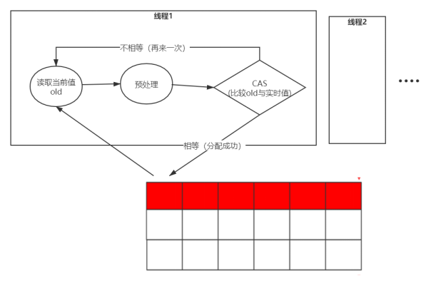
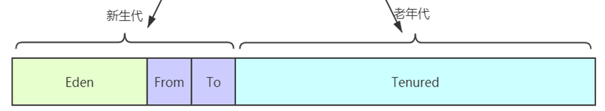

## JVM2024-下

## 一.JVM基础

## 1、说一说JDK、JRE与JVM的区别

JVM只是一个翻译，把Class翻译成机器识别的代码，但是需要注意，JVM 不会自己生成代码，需要大家编写代码，同时需要很多依赖类库，这个时候就需要用到JRE。

JRE是什么，它除了包含JVM之外，提供了很多的类库（就是我们说的jar包，它可以提供一些即插即用的功能，比如读取或者操作文件，连接网络，使用I/O等等之类的）这些东西就是JRE提供的基础类库。JVM 标准加上实现的一大堆基础类库，就组成了 Java 的运行时环境，也就是我们常说的 JRE（Java Runtime Environment）。

但对于程序员来说，JRE还不够。我写完要编译代码，还需要调试代码，还需要打包代码、有时候还需要反编译代码。所以我们会使用JDK，因为JDK还提供了一些非常好用的小工具，比如 javac（编译代码）、java、jar （打包代码）、javap（反编译<反汇编>）等。这个就是JDK。

## 2、介绍下JVM运行时数据区

**运行时数据区的定义** ：Java虚拟机在执行Java程序的过程中会把它所管理的内存划分为若干个不同的数据区域。

在JVM中，JVM 内存主要分为堆、程序计数器、方法区、虚拟机栈和本地方法栈等。

## 3、JVM会存在哪些OOM？详细讲一讲

### **栈溢出**

参数：-Xss1m， 具体默认值需要查看官网：[https://docs.oracle.com/javase/8/docs/technotes/tools/unix/java.html#BABHDABI](#BABHDABI)

HotSpot版本中栈的大小是固定的，是不支持拓展的。

java.lang.StackOverflowError一般的方法调用是很难出现的，如果出现了可能会是无限递归。

虚拟机栈带给我们的启示：方法的执行因为要打包成栈桢，所以天生要比实现同样功能的循环慢，所以树的遍历算法中：递归和非递归(循环来实现)都有存在的意义。递归代码简洁，非递归代码复杂但是速度较快。

OutOfMemoryError：不断建立线程，JVM申请栈内存，机器没有足够的内存。（一般演示不出，演示出来机器也死了）

**同时要注意，栈区的空间JVM没有办法去限制的，因为JVM在运行过程中会有线程不断的运行，没办法限制，所以只限制单个虚拟机栈的大小。**

### **堆溢出**

内存溢出：申请内存空间,超出最大堆内存空间。

如果是内存溢出，则通过调大 -Xms，-Xmx参数。

如果不是内存泄漏，就是说内存中的对象却是都是必须存活的，那么久应该检查JVM的堆参数设置，与机器的内存对比，看是否还有可以调整的空间，再从代码上检查是否存在某些对象生命周期过长、持有状态时间过长、存储结构设计不合理等情况，尽量减少程序运行时的内存消耗。

### **方法区溢出**

（1） 运行时常量池溢出

**（2）** 方法区中保存的**Class**对象没有被及时回收掉或者Class信息占用的内存超过了我们配置。

**注意Class要被回收，条件比较苛刻（仅仅是可以，不代表必然，因为还有一些参数可以进行控制）：**

1、 该类所有的实例都已经被回收，也就是堆中不存在该类的任何实例。

2、 加载该类的ClassLoader已经被回收。

3、 该类对应的java.lang.Class对象没有在任何地方被引用，无法在任何地方通过反射访问该类的方法。

### **本机直接内存溢出**

直接内存的容量可以通过MaxDirectMemorySize来设置（默认与堆内存最大值一样），所以也会出现OOM异常；

由直接内存导致的内存溢出，一个比较明显的特征是在HeapDump文件中不会看见有什么明显的异常情况，如果发生了OOM，同时Dump文件很小，可以考虑重点排查下直接内存方面的原因。

## 4、JVM的哪块内存区域不会发生OOM

程序计数器也是JVM中唯一不会OOM(OutOfMemory)的内存区域。

## 5、讲一讲虚拟机栈的细节，另外还有栈帧共享技术了解吗？

1. JVM 向操作系统申请内存：

JVM 第一步就是通过配置参数或者默认配置参数向操作系统申请内存空间，根据内存大小找到具体的内存分配表，然后把内存段的起始地址和终止地址分配给 JVM，接下来 JVM 就进行内部分配。

2. JVM 获得内存空间后，会根据配置参数分配堆、栈以及方法区的内存大小

-Xms30m -Xmx30m  -Xss1m -XX:MaxMetaspaceSize=30m

3. 类加载（类加载的细节后续章节会讲）：

这里主要是把class放入方法区、还有class中的静态变量和常量也要放入方法区

4. 执行方法及创建对象：

启动 main 线程，执行 main 方法，开始执行第一行代码。此时堆内存中会创建一个 student 对象，对象引用 student 就存放在栈中。

后续代码中遇到new关键字，会再创建一个 student 对象，对象引用 student 就存放在栈中。

**总结一下JVM运行内存的整体流程**

JVM在操作系统上启动，申请内存，先进行运行时数据区的初始化，然后把类加载到方法区，最后执行方法。

方法的执行和退出过程在内存上的体现上就是虚拟机栈中栈帧的入栈和出栈。

同时在方法的执行过程中创建的对象一般情况下都是放在堆中，最后堆中的对象也是需要进行垃圾回收清理的。

操作数栈的笔记：

## 6、讲一讲JVM中对象的创建过程

### **对象的内存分配**

虚拟机遇到一条new指令时，首先检查是否被类加载器加载，如果没有，那必须先执行相应的类加载过程。

类加载就是把class加载到JVM的运行时数据区的过程（类加载后面有专门的专题讲）。

#### **1）检查加载**

首先检查这个指令的参数是否能在常量池中定位到一个类的符号引用（**符号引用**  **：** 符号引用以一组符号来描述所引用的目标），并且检查类是否已经被加载、解析和初始化过。

#### **2）分配内存**

接下来虚拟机将为新生对象分配内存。为对象分配空间的任务等同于把一块确定大小的内存从Java堆中划分出来。

##### **指针碰撞**

如果Java堆中内存是绝对规整的，所有用过的内存都放在一边，空闲的内存放在另一边，中间放着一个指针作为分界点的指示器，那所分配内存就仅仅是把那个指针向空闲空间那边挪动一段与对象大小相等的距离，这种分配方式称为“ **指针碰撞** ”。

##### **空闲列表**

如果Java堆中的内存并不是规整的，已使用的内存和空闲的内存相互交错，那就没有办法简单地进行指针碰撞了，虚拟机就必须维护一个列表，记录上哪些内存块是可用的，在分配的时候从列表中找到一块足够大的空间划分给对象实例，并更新列表上的记录，这种分配方式称为“ **空闲列表** ”。

选择哪种分配方式由Java堆是否规整决定，而Java堆是否规整又由所采用的垃圾收集器是否带有压缩整理功能决定。

**（这部分知识先了解，后续结合垃圾回收器一起去理解）**

如果是Serial、ParNew等带有压缩的整理的垃圾回收器的话，系统采用的是指针碰撞，既简单又高效。

如果是使用CMS这种不带压缩（整理）的垃圾回收器的话，理论上只能采用较复杂的空闲列表。

##### **并发安全**

除如何划分可用空间之外，还有另外一个需要考虑的问题是对象创建在虚拟机中是非常频繁的行为，即使是仅仅修改一个指针所指向的位置，在并发情况下也并不是线程安全的，可能出现正在给对象A分配内存，指针还没来得及修改，对象B又同时使用了原来的指针来分配内存的情况。

###### **CAS机制**

解决这个问题有两种方案，一种是对分配内存空间的动作进行同步处理——实际上虚拟机采用CAS配上失败重试的方式保证更新操作的原子性；

###### **分配缓冲**

另一种是把内存分配的动作按照线程划分在不同的空间之中进行，即每个线程在Java堆中预先分配一小块私有内存，也就是本地线程分配缓冲（Thread Local Allocation Buffer,TLAB），JVM在线程初始化时，同时也会申请一块指定大小的内存，只给当前线程使用，这样每个线程都单独拥有一个Buffer，如果需要分配内存，就在自己的Buffer上分配，这样就不存在竞争的情况，可以大大提升分配效率，当Buffer容量不够的时候，再重新从Eden区域申请一块继续使用。

TLAB的目的是在为新对象分配内存空间时，让每个Java应用线程能在使用自己专属的分配指针来分配空间，减少同步开销。

TLAB只是让每个线程有私有的分配指针，但底下存对象的内存空间还是给所有线程访问的，只是其它线程无法在这个区域分配而已。当一个TLAB用满（分配指针top撞上分配极限end了），就新申请一个TLAB。

**参数：**

-XX:+UseTLAB

允许在年轻代空间中使用线程本地分配块（TLAB）。默认情况下启用此选项。要禁用TLAB，请指定-XX:-UseTLAB。

[https://docs.oracle.com/javase/8/docs/technotes/tools/unix/java.html

#### **3）内存空间初始化**

（注意不是构造方法）内存分配完成后，虚拟机需要将分配到的内存空间都初始化为零值(如int值为0，boolean值为false等等)。这一步操作保证了对象的实例字段在Java代码中可以不赋初始值就直接使用，程序能访问到这些字段的数据类型所对应的零值。

#### **4）设置**

接下来，虚拟机要对对象进行必要的设置，例如这个对象是哪个类的实例、如何才能找到类的元数据信息（Java classes在Java hotspot VM内部表示为类元数据）、对象的哈希码、对象的GC分代年龄等信息。这些信息存放在对象的对象头之中。

#### **5）对象初始化**

在上面工作都完成之后，从虚拟机的视角来看，一个新的对象已经产生了，但从Java程序的视角来看，对象创建才刚刚开始，所有的字段都还为零值。所以，一般来说，执行new指令之后会接着把对象按照程序员的意愿进行初始化(构造方法)，这样一个真正可用的对象才算完全产生出来。

## 二.垃圾回收

## 1、什么是垃圾回收（GC/垃圾收集器）？为什么需要垃圾回收

Java与C++等语言最大的技术区别：自动化的垃圾回收机制（GC）

为什么要了解GC和内存分配策略

1、面试需要

2、GC对应用的性能是有影响的；

3、写代码有好处

**栈：** 栈中的生命周期是跟随线程，所以一般不需要关注

**堆：** 堆中的对象是垃圾回收的重点

方法区/元空间：这一块也会发生垃圾回收，不过这块的效率比较低，一般不是我们关注的重点

## 2、垃圾回收的触发条件是什么？空间满了

就是空间满了，比如新生代满了触发YGC。

1、 新生代回收（Minor GC/Young GC）:指只是进行新生代的回收。

2、 老年代回收（Major GC/Old GC）:指只是进行老年代的回收。目前只有CMS垃圾回收器会有这个单独的回收老年代的行为。

（Major GC定义是比较混乱，有说指是老年代，有的说是做整个堆的收集，这个需要你根据别人的场景来定，没有固定的说法）

3、 整堆回收（Full GC）:收集整个Java堆和方法区( **注意包含方法区** )

## 3、垃圾回收时，怎么判断对象是垃圾的？

来判定对象是否存活的。这个算法的基本思路就是通过一系列的称为“GC Roots”的对象作为起始点，从这些节点开始向下搜索，搜索所走过的路径称为引用链（Reference Chain），当一个对象到GC Roots没有任何引用链相连时，则证明此对象是不可用的。

作为GC Roots的对象包括下面几种（重点是前面4种）：

l 虚拟机栈（栈帧中的本地变量表）中引用的对象；各个线程调用方法堆栈中使用到的参数、局部变量、临时变量等。

l 方法区中类静态属性引用的对象；java类的引用类型静态变量。

l 方法区中常量引用的对象；比如：字符串常量池里的引用。

l 本地方法栈中JNI（即一般说的Native方法）引用的对象。

l JVM的内部引用（class对象、异常对象NullPointException、OutofMemoryError，系统类加载器）。（非重点）

l 所有被同步锁(synchronized关键)持有的对象。（非重点）

l JVM内部的JMXBean、JVMTI中注册的回调、本地代码缓存等（非重点）

l JVM实现中的“临时性”对象，跨代引用的对象（ **在使用分代模型回收只回收部分代的对象，这个后续会细讲，先大致了解概念** ）（非重点）

## 4、说一说java的四种引用及GC的关系

### **强引用**

一般的Object obj = new Object() ，就属于强引用。在任何情况下，只有有强引用关联（与根可达）还在，垃圾回收器就永远不会回收掉被引用的对象。

### **软引用SoftReference**

一些有用但是并非必需，用软引用关联的对象，系统将要发生内存溢出（OuyOfMemory）之前，这些对象就会被回收（如果这次回收后还是没有足够的空间，才会抛出内存溢出）。

### **弱引用WeakReference**

一些有用（程度比软引用更低）但是并非必需，用弱引用关联的对象，只能生存到下一次垃圾回收之前，GC发生时，不管内存够不够，都会被回收。

**注意：** 软引用SoftReference和弱引用 WeakReference，可以用在内存资源紧张的情况下以及创建不是很重要的数据缓存。当系统内存不足的时候，缓存中的内容是可以被释放的。

实际运用（WeakHashMap、ThreadLocal）

### **虚引用PhantomReference**

幽灵引用，最弱（随时会被回收掉）

## 5、说一说分代收集理论

当前商业虚拟机的垃圾回收器，大多遵循“分代收集”的理论来进行设计，这个理论大体上是这么描述的：

1、 绝大部分的对象都是朝生夕死。

2、 熬过多次垃圾回收的对象就越难回收。

根据以上两个理论，朝生夕死的对象放一个区域，难回收的对象放另外一个区域，这个就构成了**新生代**和 **老年代** 。

## 6、垃圾收集算法有哪些?

### **复制算法（Copying）**

将可用内存按容量划分为大小相等的两块，每次只使用其中的一块。当这一块的内存用完了，就将还存活着的对象复制到另外一块上面，然后再把已使用过的内存空间一次清理掉。这样使得每次都是对整个半区进行内存回收，内存分配时也就不用考虑内存碎片等复杂情况，只要按顺序分配内存即可，实现简单，运行高效。只是这种算法的代价是将内存缩小为了原来的一半。

但是要注意：内存移动是必须实打实的移动（复制）， **所以对应的引用(直接指针)需要调整** 。

复制回收算法适合于新生代，因为大部分对象朝生夕死，那么复制过去的对象比较少，效率自然就高，另外一半的一次性清理是很快的。

### **Appel式回收 **

一种更加优化的复制回收分代策略：具体做法是分配一块较大的Eden区和两块较小的Survivor空间（你可以叫做From或者To，也可以叫做Survivor1和Survivor2）

专门研究表明，新生代中的对象98%是“朝生夕死”的，所以并不需要按照1:1的比例来划分内存空间，而是将内存分为一块较大的Eden空间和两块较小的Survivor空间，每次使用Eden和其中一块Survivor[1]。当回收时，将Eden和Survivor中还存活着的对象一次性地复制到另外一块Survivor空间上，最后清理掉Eden和刚才用过的Survivor空间。

HotSpot虚拟机默认Eden和Survivor的大小比例是8:1，也就是每次新生代中可用内存空间为整个新生代容量的90%（80%+10%），只有10%的内存会被“浪费”。当然，98%的对象可回收只是一般场景下的数据，我们没有办法保证每次回收都只有不多于10%的对象存活，当Survivor空间不够用时，需要依赖其他内存（这里指老年代）进行分配担保（Handle Promotion）

### **标记-清除算法（Mark-Sweep）**

算法分为“标记”和“清除”两个阶段：首先扫描所有对象标记出需要回收的对象，在标记完成后扫描回收所有被标记的对象，所以需要扫描两遍。

回收效率略低，如果大部分对象是朝生夕死，那么回收效率降低，因为需要大量标记对象和回收对象，对比复制回收效率要低。

它的主要问题，标记清除之后会产生大量不连续的内存碎片，空间碎片太多可能会导致以后在程序运行过程中需要分配较大对象时，无法找到足够的连续内存而不得不提前触发另一次垃圾回收动作。

回收的时候如果需要回收的对象越多，需要做的标记和清除的工作越多，所以标记清除算法适用于老年代。

### **标记-整理算法（Mark-Compact）**

首先标记出所有需要回收的对象，在标记完成后，后续步骤不是直接对可回收对象进行清理，而是让所有存活的对象都向一端移动，然后直接清理掉端边界以外的内存。标记整理算法虽然 **没有内存碎片** ，但是 **效率偏低** 。

我们看到标记整理与标记清除算法的区别主要在于对象的移动。对象移动不单单会加重系统负担，同时需要全程暂停用户线程才能进行，同时所有引用对象的地方都需要更新（ **直接指针需要调整** ）。

所以看到，老年代采用的标记整理算法与标记清除算法，各有优点，各有缺点。

## 7、说一说常用的垃圾回收器

JDK8的如图：

**请记住下图的垃圾收集器和之间的连线关系。**

**Oracle官方也有对应英文解释**[https://docs.oracle.com/en/java/javase/13/gctuning/ergonomics.html#GUID-DB4CAE94-2041-4A16-90EC-6AE3D91EC1F1](#GUID-DB4CAE94-2041-4A16-90EC-6AE3D91EC1F1)

（基于java13的）

## 8、什么是 STW ?为什么需要STW

单线程进行垃圾回收时，必须暂停所有的工作线程，直到它回收结束。这个暂停称之为“Stop The World”,但是这种STW带来了恶劣的用户体验,例如:应用每运行一个小时就需要暂停响应5分。这个也是早期JVM和java被C/C++语言诟病性能差的一个重要原因。所以JVM开发团队一直努力消除或降低STW的时间。

## 9、什么是安全点?什么是安全区域

### **安全点**

用户线程暂停，GC线程要开始工作，但是要确保用户线程暂停的这行字节码指令是不会导致引用关系的变化。所以JVM会在字节码指令中，选一些指令，作为“安全点”，比如方法调用、循环跳转、异常跳转等，一般是这些指令才会产生安全点。

为什么它叫安全点，是这样的，GC时要暂停业务线程，并不是抢占式中断（立马把业务线程中断）而是主动是中断。

主动式中断是设置一个标志，这个标志是中断标志，各业务线程在运行过程中会不停的主动去轮询这个标志，一旦发现中断标志为True,就会在自己最近的“安全点”上主动中断挂起。

### **安全区域**

为什么需要安全区域？

要是业务线程都不执行（业务线程处于Sleep或者是Blocked状态），那么程序就没办法进入安全点，对于这种情况，就必须引入安全区域。

安全区域是指能够确保在某一段代码片段之中，引用关系不会发生变化，因此，在这个区域中任意地方开始垃圾收集都是安全的。我们也可以把安全区城看作被扩展拉伸了的安全点。

当用户线程执行到安全区域里面的代码时，首先会标识自己已经进入了安全区域，这段时间里JVM要发起GC就不必去管这个线程了。

当线程要离开安全区域时，它要JVM是否已经完成了（根节点枚举，或者其他GC 中需要暂停用户线程的阶段)

1、如果完成了，那线程就当作没事发生过，继续执行。

2、否则它就必须一直等待， 直到收到可以离开安全区域的信号为止。

## 10、说一说对象的栈上分配（对应：几乎所有的对象都是在堆空间分配）

如果是逃逸分析出来的对象可以在栈上分配的话，那么该对象的生命周期就跟随线程了，就不需要垃圾回收，如果是频繁的调用此方法则可以得到很大的性能提高。

采用了逃逸分析后，满足逃逸的对象在栈上分配

**关闭了逃逸分析，** **JVM** **在频繁的进行垃圾回收（**  **GC** **），正是这一块的操作导致性能有较大的差别。**
