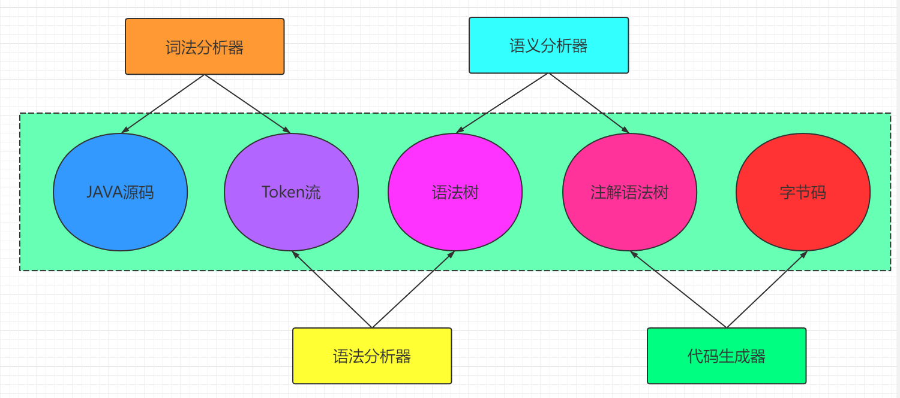
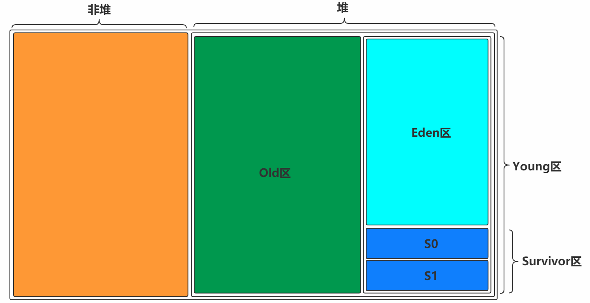
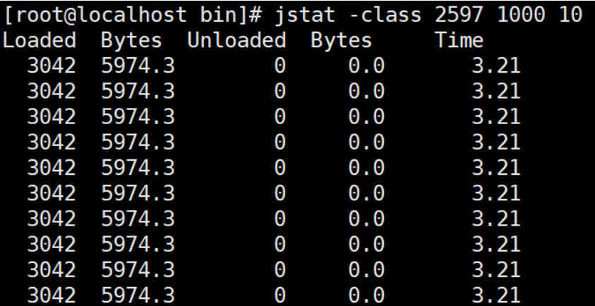
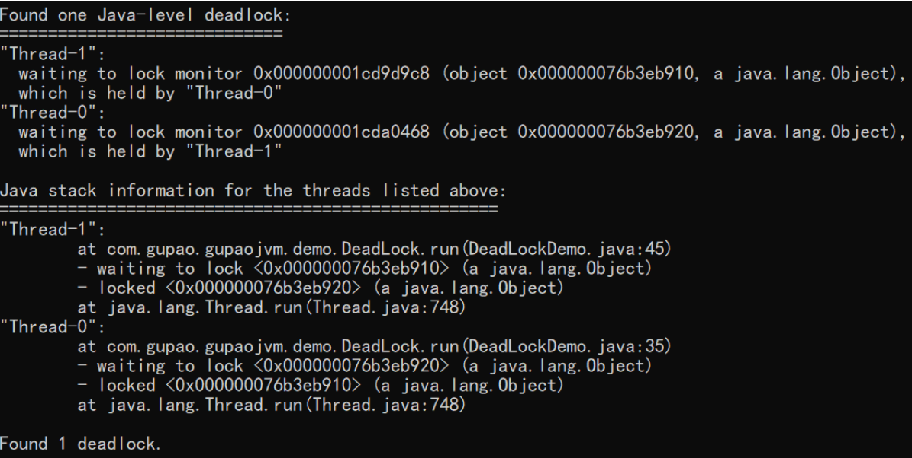
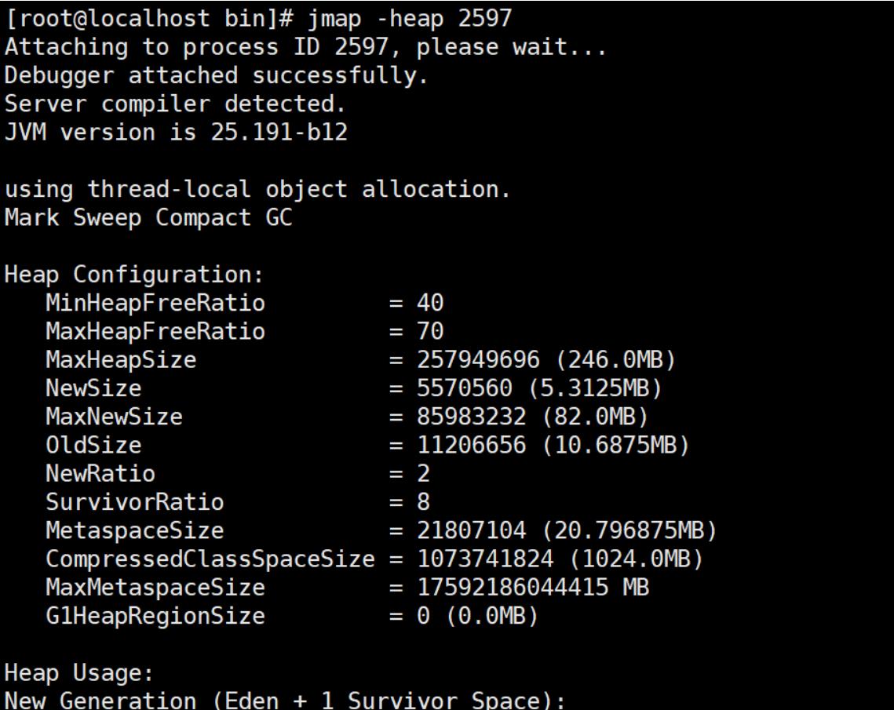

## JVM面试突击班2025-1

## 一.JDK，JRE以及JVM的关系


## 二.我们的编译器到底干了什么事？

仅仅是将我们的 .java 文件转换成了 .class 文件，实际上就是文件格式的转换，对等信息转换。



## 三.类加载机制是什么？


> **所谓类加载机制就是**

> ```
> 虚拟机把Class文件加载到内存
> 并对数据进行校验，转换解析和初始化
> 形成可以虚拟机直接使用的Java类型，即java.lang.Class
> ```

### 装载(Load)

ClassFile---   字节流   ----  类加载器

> 查找和导入class文件

（1）通过一个类的全限定名获取定义此类的二进制字节流
（2）将这个字节流所代表的静态存储结构转化为方法区的运行时数据结构
（3）在Java堆中生成一个代表这个类的java.lang.Class对象，作为对方法区中这些数据的访问入口

### 链接(Link)

#### 验证(Verify)

> 保证被加载类的正确性

* 文件格式验证
* 元数据验证
* 字节码验证
* 符号引用验证

#### 准备(Prepare)

> 为类的静态变量分配内存，并将其初始化为默认值

```java
public class Demo1 {
private static int i;

public static void main(String[] args) {
    // 正常打印出0，因为静态变量i在准备阶段会有默认值0
    System.out.println(i);
}
}
```

```java
public class Demo2 {
    public static void main(String[] args) {
        // 编译通不过，因为局部变量没有赋值不能被使用
        int i;
        System.out.println(i);
    }
}
```

#### 解析(Resolve)

> 把类中的符号引用转换为直接引用
>
> ```
> 符号引用就是一组符号来描述目标，可以是任何字面量。
> 直接引用就是直接指向目标的指针、相对偏移量或一个间接定位到目标的句柄。
> ```

```
解析阶段是虚拟机将常量池内的符号引用替换为直接引用的过程。   
解析动作主要针对类或接口、字段、类方法、接口方法、方法类型、方法句柄和调用限定符7类符号引用进
行。
```

### 初始化(Initialize)

> 对类的静态变量，静态代码块执行初始化操作   执行了Clinit方法

## 四.类加载器有哪些？

### 类加载器ClassLoader

> 在装载(Load)阶段，其中第(1)步:通过类的全限定名获取其定义的二进制字节流，需要借助类装载器完成，顾名思义，就是用来装载Class文件的。

图解：


1）Bootstrap ClassLoader 负责加载 JAVA_HOME中 jre/lib/rt.jar 里所有的class或Xbootclassoath选项指定的jar包。由C++实现，不是ClassLoader子类。

2）Extension ClassLoader 负责加载java平台中扩展功能的一些jar包，包括`$$JAVA_HOME中jre/lib/*.jar 或 -Djava.ext.dirs指定目录下的jar包。

3）App ClassLoader 负责加载classpath中指定的jar包及 Djava.class.path 所指定目录下的类和jar包。

4）Custom ClassLoader 通过java.lang.ClassLoader的子类自定义加载class，属于应用程序根据自身需要自定义的ClassLoader，如tomcat、jboss都会根据j2ee规范自行实现ClassLoader。

## 五.双亲委派以及打破双亲委派   父类委托机制

```
protected Class<?> loadClass(String name, boolean resolve)
        throws ClassNotFoundException
    {
        synchronized (getClassLoadingLock(name)) {
            // First, check if the class has already been loaded
            Class<?> c = findLoadedClass(name);
            if (c == null) {
                long t0 = System.nanoTime();
                try {
                    if (parent != null) {
                        c = parent.loadClass(name, false);
                    } else {
                        c = findBootstrapClassOrNull(name);
                    }
                } catch (ClassNotFoundException e) {
                    // ClassNotFoundException thrown if class not found
                    // from the non-null parent class loader
                }

                if (c == null) {
                    // If still not found, then invoke findClass in order
                    // to find the class.
                    long t1 = System.nanoTime();
                    c = findClass(name);

                    // this is the defining class loader; record the stats
                    sun.misc.PerfCounter.getParentDelegationTime().addTime(t1 - t0);
                    sun.misc.PerfCounter.getFindClassTime().addElapsedTimeFrom(t1);
                    sun.misc.PerfCounter.getFindClasses().increment();
                }
            }
            if (resolve) {
                resolveClass(c);
            }
            return c;
        }

```


向上检查   向下委派

打破双亲委派：

3种方式

复写

SPI   Service  Provider Interface       接口


OSGI   热更新  热部署     外包中的外包

## 六.运行时数据区


（1）方法区是各个线程共享的内存区域，在虚拟机启动时创建

```
The Java Virtual Machine has a method area that is shared among all Java Virtual Machine threads. 
The method area is created on virtual machine start-up.
```

（2）虽然Java虚拟机规范把方法区描述为堆的一个逻辑部分，但是它却又一个别名叫做Non-Heap(非堆)，目的是与Java堆区分开来

```
Although the method area is logically part of the heap,......
```

（3）用于存储已被虚拟机加载的类信息、常量、静态变量、即时编译器编译后的代码等数据

```
It stores per-class structures such as the run-time constant pool, field and method data, and the code for methods and constructors, including the special methods (§2.9) used in class and instance initialization and interface initialization.
```

（4）当方法区无法满足内存分配需求时，将抛出OutOfMemoryError异常

```
If memory in the method area cannot be made available to satisfy an allocation request, the Java Virtual Machine throws an OutOfMemoryError.
```

> 注意：JVM运行时数据区是一种规范，真正的实现在JDK 8中就是Metaspace，在JDK6或7中就是Perm Space

#### Heap(堆)

（1）Java堆是Java虚拟机所管理内存中最大的一块，在虚拟机启动时创建，被所有线程共享。

（2）Java对象实例以及数组都在堆上分配。

#### Java Virtual Machine Stacks(虚拟机栈)

假如目前的阶段是初始化完成了，后续做啥呢？肯定是Use使用咯，不用的话这样折腾来折腾去有什么意义？那怎样才能被使用到？换句话说里面内容怎样才能被执行？比如通过主函数main调用其他方法，这种方式实际上是main线程执行之后调用的方法，即要想使用里面的各种内容，得要以线程为单位，执行相应的方法才行。**那一个线程执行的状态如何维护？一个线程可以执行多少个方法？这样的关系怎么维护呢？

（1）虚拟机栈是一个线程执行的区域，保存着一个线程中方法的调用状态。换句话说，一个Java线程的运行状态，由一个虚拟机栈来保存，所以虚拟机栈肯定是线程私有的，独有的，随着线程的创建而创建。

```
Each Java Virtual Machine thread has a private Java Virtual Machine stack, created at the same time as the thread.
```

（2）每一个被线程执行的方法，为该栈中的栈帧，即每个方法对应一个栈帧。

调用一个方法，就会向栈中压入一个栈帧；一个方法调用完成，就会把该栈帧从栈中弹出。

```
 A Java Virtual Machine stack stores frames (§2.6). 
```

```
A new frame is created each time a method is invoked. A frame is destroyed when its method invocation completes.
```

栈帧：每个栈帧对应一个被调用的方法，可以理解为一个方法的运行空间。

每个栈帧中包括局部变量表(Local Variables)、操作数栈(Operand Stack)、指向运行时常量池的引用(A reference to the run-time constant pool)、方法返回地址(Return Address)和附加信息。

```
局部变量表:方法中定义的局部变量以及方法的参数存放在这张表中
局部变量表中的变量不可直接使用，如需要使用的话，必须通过相关指令将其加载至操作数栈中作为操作数使用。
```

```
操作数栈:以压栈和出栈的方式存储操作数的
```

```
动态链接:每个栈帧都包含一个指向运行时常量池中该栈帧所属方法的引用，持有这个引用是为了支持方法调用过程中的动态连接(Dynamic Linking)。
```

```
方法返回地址:当一个方法开始执行后,只有两种方式可以退出，一种是遇到方法返回的字节码指令；一种是遇见异常，并且这个异常没有在方法体内得到处理。
```

## 七.栈帧的结构


局部变量表：方法中的局部变量以及方法的参数会存放在这

操作数栈：也是一个栈，他是以压栈以及出栈的方式来存储操作数的

```
int   a  =  1；

int   b   = 1 ；

int  c   = a  + b；
```

方法的返回地址：

一个方法执行之后，只有两种情况可以退出，遇到返回的字节码指令      异常返回

动态链接：动态链接将这些符号方法引用转换为具体的方法引用

符号引用转化成直接引用

```
void   a(){

b();

}

void   b(){

c();

}

void   c(){
XXXXX
}
```

## 八.堆为什么进行分代设计



## 九.老年代的担保机制

## 十.为什么Eden：S0：S1 是8：1：1

## 十一.对象的创建以及分配过程


## 十二.方法区与元数据区以及持久代到底是什么关系？

Full GC =  young  GC   +  Old  GC   +   Meta Space  GC

规范：方法区

实现：

JDK1.7之前     永久代  持久代   Perm Space   类的总数    常量池大小    方法的数量

JDK1.8以及其之后    元空间  元数据区    MetaSpace

JVMTI      开后门


## 十三.对象的内存布局


为了加快CPU的读取效率  哪怕是引用类型  也只是读取一次


## 十四.对象被判定为不可达对象之后就“死”了吗


## 十五.垃圾收集算法

> **已经能够确定一个对象为垃圾之后，接下来要考虑的就是回收，怎么回收呢？得要有对应的算法，下面介绍常见的垃圾回收算法。高效   健壮**

#### 标记-清除(Mark-Sweep)

* **标记**

**找出内存中需要回收的对象，并且把它们标记出来**

> **此时堆中所有的对象都会被扫描一遍，从而才能确定需要回收的对象，比较耗时**
>
> 

* **清除**

**清除掉被标记需要回收的对象，释放出对应的内存空间**


`缺点`

```
标记清除之后会产生大量不连续的内存碎片，空间碎片太多可能会导致以后在程
序运行过程中需要分配较大对象时，无法找到足够的连续内存而不得不提前触发另一次垃圾收集动作。
(1)标记和清除两个过程都比较耗时，效率不高
(2)会产生大量不连续的内存碎片，空间碎片太多可能会导致以后在程序运行过程中需要分配较大对象时，无法找到足够的连续内存而不得不提前触发另一次垃圾收集动作。
```

#### 标记-复制(Mark-Copying)

**将内存划分为两块相等的区域，每次只使用其中一块，如下图所示：**


**当其中一块内存使用完了，就将还存活的对象复制到另外一块上面，然后把已经使用过的内存空间一次清除掉。**


`缺点:`空间利用率降低。

#### 标记-整理(Mark-Compact)

> **复制收集算法在对象存活率较高时就要进行较多的复制操作，效率将会变低。更关键的是，如果不想浪费50%的空间，就需要有额外的空间进行分配担保，以应对被使用的内存中所有对象都有100%存活的极端情况，所以老年代一般不能直接选用这种算法。**

**标记过程仍然与"标记-清除"算法一样，但是后续步骤不是直接对可回收对象进行清理，而是让所有存活的对象都向一端移动，然后直接清理掉端边界以外的内存。**

> **其实上述过程相对"复制算法"来讲，少了一个"保留区"**


**让所有存活的对象都向一端移动，清理掉边界意外的内存。**


### 分代收集算法

> **既然上面介绍了3中垃圾收集算法，那么在堆内存中到底用哪一个呢？**

**Young区：复制算法(对象在被分配之后，可能生命周期比较短，Young区复制效率比较高)**

**Old区：标记清除或标记整理(Old区对象存活时间比较长，复制来复制去没必要，不如做个标记再清理)**

## 十六.垃圾收集器

> **如果说收集算法是内存回收的方法论，那么垃圾收集器就是内存回收的具体实现。**


* Serial

**Serial收集器是最基本、发展历史最悠久的收集器，曾经（在JDK1.3.1之前）是虚拟机新生代收集的唯一选择。**

**它是一种单线程收集器，不仅仅意味着它只会使用一个CPU或者一条收集线程去完成垃圾收集工作，更重要的是其在进行垃圾收集的时候需要暂停其他线程。**

```
优点：简单高效，拥有很高的单线程收集效率
缺点：收集过程需要暂停所有线程
算法：复制算法
适用范围：新生代
应用：Client模式下的默认新生代收集器
```


* Serial Old

Serial Old收集器是Serial收集器的老年代版本，也是一个单线程收集器，不同的是采用"**标记-整理算法**"，运行过程和Serial收集器一样。


* ParNew

**可以把这个收集器理解为Serial收集器的多线程版本。**

```
优点：在多CPU时，比Serial效率高。
缺点：收集过程暂停所有应用程序线程，单CPU时比Serial效率差。
算法：复制算法
适用范围：新生代
应用：运行在Server模式下的虚拟机中首选的新生代收集器
```


* Parallel Scavenge

**Parallel Scavenge收集器是一个新生代收集器，它也是使用复制算法的收集器，又是并行的多线程收集器，看上去和ParNew一样，但是Parallel Scanvenge更关注系统的吞吐量**。

> **吞吐量=运行用户代码的时间/(运行用户代码的时间+垃圾收集时间)**
>
> **比如虚拟机总共运行了100分钟，垃圾收集时间用了1分钟，吞吐量=(100-1)/100=99%。**
>
> **若吞吐量越大，意味着垃圾收集的时间越短，则用户代码可以充分利用CPU资源，尽快完成程序的运算任务。**

```
-XX:MaxGCPauseMillis控制最大的垃圾收集停顿时间，
-XX:GCRatio直接设置吞吐量的大小。
```

* Parallel Old

**Parallel Old收集器是Parallel Scavenge收集器的老年代版本，使用多线程和标记-整理算法**进行垃圾回收，也是更加关注系统的**吞吐量**。

* CMS

> `官网`： [https://docs.oracle.com/javase/8/docs/technotes/guides/vm/gctuning/cms.html#concurrent_mark_sweep_cms_collector](https://docs.oracle.com/javase/8/docs/technotes/guides/vm/gctuning/cms.html#concurrent_mark_sweep_cms_collector)
>
> **CMS(Concurrent Mark Sweep)收集器是一种以获取** `最短回收停顿时间`为目标的收集器。
>
> **采用的是"标记-清除算法",整个过程分为4步**

```
(1)初始标记 CMS initial mark     标记GC Roots直接关联对象，不用Tracing，速度很快
(2)并发标记 CMS concurrent mark  进行GC Roots Tracing
(3)重新标记 CMS remark           修改并发标记因用户程序变动的内容
(4)并发清除 CMS concurrent sweep 清除不可达对象回收空间，同时有新垃圾产生，留着下次清理称为浮动垃圾
```

> **由于整个过程中，并发标记和并发清除，收集器线程可以与用户线程一起工作，所以总体上来说，CMS收集器的内存回收过程是与用户线程一起并发地执行的。**


```
优点：并发收集、低停顿
缺点：产生大量空间碎片、并发阶段会降低吞吐量
```

* G1(Garbage-First)

> `官网`： [https://docs.oracle.com/javase/8/docs/technotes/guides/vm/gctuning/g1_gc.html#garbage_first_garbage_collection](https://docs.oracle.com/javase/8/docs/technotes/guides/vm/gctuning/g1_gc.html#garbage_first_garbage_collection)
>
> **使用G1收集器时，Java堆的内存布局与就与其他收集器有很大差别，它将整个Java堆划分为多个大小相等的独立区域（Region），虽然还保留有新生代和老年代的概念，但新生代和老年代不再是物理隔离的了，它们都是一部分Region（不需要连续）的集合。 **
>
> **每个Region大小都是一样的，可以是1M到32M之间的数值，但是必须保证是2的n次幂**
>
> **如果对象太大，一个Region放不下[超过Region大小的50%]，那么就会直接放到H中**
>
> **设置Region大小：-XX:G1HeapRegionSize=M**
>
> **所谓Garbage-Frist，其实就是优先回收垃圾最多的Region区域**

（1）分代收集（仍然保留了分代的概念）
（2）空间整合（整体上属于“标记-整理”算法，不会导致空间碎片）
（3）可预测的停顿（比CMS更先进的地方在于能让使用者明确指定一个长度为M毫秒的时间片段内，消耗在垃圾收集上的时间不得超过N毫秒）


**工作过程可以分为如下几步**

```
初始标记（Initial Marking）      标记以下GC Roots能够关联的对象，并且修改TAMS的值，需要暂停用户线程
并发标记（Concurrent Marking）   从GC Roots进行可达性分析，找出存活的对象，与用户线程并发执行
最终标记（Final Marking）        修正在并发标记阶段因为用户程序的并发执行导致变动的数据，需暂停用户线程
筛选回收（Live Data Counting and Evacuation） 对各个Region的回收价值和成本进行排序，根据用户所期望的GC停顿时间制定回收计划
```


* ZGC

> `官网`： [https://docs.oracle.com/en/java/javase/11/gctuning/z-garbage-collector1.html#GUID-A5A42691-095E-47BA-B6DC-FB4E5FAA43D0](https://docs.oracle.com/en/java/javase/11/gctuning/z-garbage-collector1.html#GUID-A5A42691-095E-47BA-B6DC-FB4E5FAA43D0)
>
> **JDK11新引入的ZGC收集器，不管是物理上还是逻辑上，ZGC中已经不存在新老年代的概念了**
>
> **会分为一个个page，当进行GC操作时会对page进行压缩，因此没有碎片问题**
>
> **只能在64位的linux上使用，目前用得还比较少**

**（1）可以达到10ms以内的停顿时间要求**

**（2）支持TB级别的内存**

**（3）堆内存变大后停顿时间还是在10ms以内**

## 十七.对象的生命周期


**创建阶段**

（1）为对象分配存储空间

（2）开始构造对象

（3）从超类到子类对static成员进行初始化

（4）超类成员变量按顺序初始化，递归调用超类的构造方法

（5）子类成员变量按顺序初始化，子类构造方法调用，并且一旦对象被创建，并被分派给某些变量赋值，这个对象的状态就切换到了应用阶段

**应用阶段**

（1）系统至少维护着对象的一个强引用（Strong Reference）

（2）所有对该对象的引用全部是强引用（除非我们显式地使用了：软引用（Soft Reference）、弱引用（Weak Reference）或虚引用（Phantom Reference））

> 引用的定义：
>
> 1.我们的数据类型必须是引用类型
>
> 2.我们这个类型的数据所存储的数据必须是另外一块内存的起始地址


> 引用：
>
> 1.**强引用**
>
> JVM内存管理器从根引用集合（Root Set）出发遍寻堆中所有到达对象的路径。当到达某对象的任意路径都不含有引用对象时，对这个对象的引用就被称为强引用
>
> 2.软引用
>
> 软引用是用来描述一些还有用但是非必须的对象。对于软引用关联的对象，在系统将于发生内存溢出异常之前，将会把这些对象列进回收范围中进行二次回收。
>
> （当你去处理占用内存较大的对象  并且生命周期比较长的，不是频繁使用的）
>
> 问题：软引用可能会降低应用的运行效率与性能。比如：软引用指向的对象如果初始化很耗时，或者这个对象在进行使用的时候被第三方施加了我们未知的操作。
>
> 3.弱引用
>
> 弱引用（Weak Reference）对象与软引用对象的最大不同就在于：GC在进行回收时，需要通过算法检查是否回收软引用对象，而对于Weak引用对象， GC总是进行回收。因此Weak引用对象会更容易、更快被GC回收
>
> 4.虚引用
>
> 也叫幽灵引用和幻影引用，为一个对象设置虚引用关联的唯一目的就是能在这个对象被回收时收到一**个系统通知。也就是说,如果一个对象被设置上了一个虚引用,实际上跟没有设置引用没有**任何的区别

软引用代码Demo：

```java
public class SoftReferenceDemo {
    public static void main(String[] args) {
        //。。。一堆业务代码

        Worker a = new Worker();
//。。业务代码使用到了我们的Worker实例

        // 使用完了a，将它设置为soft 引用类型，并且释放强引用；
        SoftReference sr = new SoftReference(a);
        a = null;
//这个时候他是有可能执行一次GC的
        System.gc();

        // 下次使用时
        if (sr != null) {
            a = (Worker) sr.get();
            System.out.println(a );
        } else {
            // GC由于内存资源不足，可能系统已回收了a的软引用，
            // 因此需要重新装载。
            a = new Worker();
            sr = new SoftReference(a);
        }
    }


}
```

弱引用代码Demo：

```java
public class WeakReferenceDemo {
    public static void main(String[] args) throws InterruptedException {
        //100M的缓存数据
        byte[] cacheData = new byte[100 * 1024 * 1024];
        //将缓存数据用软引用持有
        WeakReference<byte[]> cacheRef = new WeakReference<>(cacheData);
        System.out.println("第一次GC前" + cacheData);
        System.out.println("第一次GC前" + cacheRef.get());
        //进行一次GC后查看对象的回收情况
        System.gc();
        //因为我们不确定我们的System什么时候GC
        Thread.sleep(1000);
        System.out.println("第一次GC后" + cacheData);
        System.out.println("第一次GC后" + cacheRef.get());

        //将缓存数据的强引用去除
        cacheData = null;
        System.gc();    //默认通知一次Full  GC
        //等待GC
        Thread.sleep(500);
        System.out.println("第二次GC后" + cacheData);
        System.out.println("第二次GC后" + cacheRef.get());

//        // 弱引用Map
//        WeakHashMap<String, String> whm = new WeakHashMap<String,String>();
    }
}

```

虚引用代码Demo：

```java
public class PhantomReferenceDemo {
    public static void main(String[] args) throws InterruptedException {
        Object value = new Object();
        ReferenceQueue<Object> referenceQueue = new ReferenceQueue<>();
        Thread thread = new Thread(() -> {
            try {
                int cnt = 0;
                WeakReference<byte[]> k;
                while ((k = (WeakReference) referenceQueue.remove()) != null) {
                    System.out.println((cnt++) + "回收了:" + k);
                }
            } catch (InterruptedException e) {
                //结束循环
            }
        });
        thread.setDaemon(true);
        thread.start();


        Map<Object, Object> map = new HashMap<>();
        for (int i = 0; i < 10000; i++) {
            byte[] bytes = new byte[1024 * 1024];
            WeakReference<byte[]> weakReference = new WeakReference<byte[]>(bytes, referenceQueue);
            map.put(weakReference, value);
        }
        System.out.println("map.size->" + map.size());


    }
}
```

finalize方法代码Demo：

```java
public class Finalize {

    private static Finalize save_hook = null;//类变量

    public void isAlive() {
        System.out.println("我还活着");
    }

    @Override
    public void finalize() {
        System.out.println("finalize方法被执行");
        Finalize.save_hook = this;
    }

    public static void main(String[] args) throws InterruptedException {


        save_hook = new Finalize();//对象
        //对象第一次拯救自己
        save_hook = null;
        System.gc();
        //暂停0.5秒等待他
        Thread.sleep(500);
        if (save_hook != null) {
            save_hook.isAlive();
        } else {
            System.out.println("好了，现在我死了");
        }

        //对象第二次拯救自己
        save_hook = null;
        System.gc();
        //暂停0.5秒等待他
        Thread.sleep(500);
        if (save_hook != null) {
            save_hook.isAlive();
        } else {
            System.out.println("我终于死亡了");
        }
    }
}
```

**不可见阶段**

不可见阶段的对象在虚拟机的对象根引用集合中再也找不到直接或者间接的强引用，最常见的就是线程或者函数中的临时变量。程序不在持有对象的强引用。  （但是某些类的静态变量或者JNI是有可能持有的 ）

**不可达阶段**

指对象不再被任何强引用持有，GC发现该对象已经不可达。

引用  - > 对象

### 如何确定一个对象是垃圾？

> **要想进行垃圾回收，得先知道什么样的对象是垃圾。**

* 引用计数法     循环引用

**对于某个对象而言，只要应用程序中持有该对象的引用，就说明该对象不是垃圾，如果一个对象没有任何指针对其引用，它就是垃圾。**

`弊端`:如果AB相互持有引用，导致永远不能被回收。 循环引用    内存泄露   -->内存溢出


* 可达性分析/根搜索算法

**通过GC Root的引用，开始向下寻找，看某个对象是否可达**


> **能作为GC Root:类加载器、Thread、虚拟机栈的本地变量表、static成员、常量引用、本地方法栈的变量等。**

```
虚拟机栈（栈帧中的本地变量表）中引用的对象。
方法区中类静态属性引用的对象。
方法区中常量引用的对象。
本地方法栈中JNI（即一般说的Native方法）引用的对象。
```

## 十八.什么是STW（stop  the  world）？

Stop-The-World  简称 STW

是在垃圾回收算法执行过程中,将jvm内存冻结,停顿的一种状态，在Stw情况下，容易出现两种现象：

**该回收的对象没有被回收**

**不该回收的对象被回收了**

在STW状态下,所有的线程都是停止运行的 - >垃圾回收线程除外

当STW发生时,出了GC所需要的线程,其他的线程都将停止工作,中断了的线程知道GC线程结束才会继续任务

STW是不可避免的,垃圾回收算法的执行一定会出现STW,而我们最好的解决办法就是减少停顿的时间

GC各种算法的优化重点就是为了减少STW,这也是JVM调优的重点。

#### 标记-复制(Mark-Copying)

**将内存划分为两块相等的区域，每次只使用其中一块，如下图所示：**


**当其中一块内存使用完了，就将还存活的对象复制到另外一块上面，然后把已经使用过的内存空间一次清除掉。**


`缺点:`空间利用率降低。

#### 标记-整理(Mark-Compact)

> **复制收集算法在对象存活率较高时就要进行较多的复制操作，效率将会变低。更关键的是，如果不想浪费50%的空间，就需要有额外的空间进行分配担保，以应对被使用的内存中所有对象都有100%存活的极端情况，所以老年代一般不能直接选用这种算法。**

**标记过程仍然与"标记-清除"算法一样，但是后续步骤不是直接对可回收对象进行清理，而是让所有存活的对象都向一端移动，然后直接清理掉端边界以外的内存。**

> **其实上述过程相对"复制算法"来讲，少了一个"保留区"**


**让所有存活的对象都向一端移动，清理掉边界意外的内存。


### 分代收集算法

> **既然上面介绍了3中垃圾收集算法，那么在堆内存中到底用哪一个呢？**

**Young区：复制算法(对象在被分配之后，可能生命周期比较短，Young区复制效率比较高)**

**Old区：标记清除或标记整理(Old区对象存活时间比较长，复制来复制去没必要，不如做个标记再清理)**

## 十九.其他算法

增量回收算法：

垃圾回收其实就是对不需要的内存对象进行清理，前面提到的GC算法，无论哪种，基本都是过一段时间对所有的内存空间对象进行一次大扫除。 这种的GC缺点是一旦开始启动，管理程序可能就停止了，表现就是可能好多程序都没响应。可在服务端，这是大忌。增量式（incremental）出现就是解决这个问题的，这种垃圾回收采用和应用程序交替进行的方式来工作，表现就像是GC在不断的定时迭加操作。从而尽量减轻应用程序的停止时间，这就是增量式回收的特点。
在增量式回收里，比较容易接触到的就是三色标记算法。

### 三色标记

在并发标记的过程中，因为标记期间应用线程还在继续跑，对象间的引用可能发生变化，多标和漏标的情况就有可能发生。这里引入“三色标记”来给大家解释下，把Gc roots可达性分析遍历对象过程中遇到的对象， 按照“是否访问过”这个条件标记成以下三种颜色：

**黑色：**

```
表示对象已经被垃圾收集器访问过， 且这个对象的所有引用都已经扫描过。 黑色的对象代表已经扫描过， 它是安全存活的， 如果有其他对象引用指向了黑色对象， 无须重新扫描一遍。 黑色对象不可能直接（不经过灰色对象） 指向某个白色对象。
```

2.将GC Roots 直接引用到的对象 挪到 【灰色集合】中；

3.从灰色集合中获取对象：

4. 将本对象 引用到的 其他对象 全部挪到 【灰色集合】中；
5. 将本对象 挪到 【黑色集合】里面。

重复步骤3.4，直至【灰色集合】为空时结束。

结束后，仍在【白色集合】的对象即为GC Roots 不可达，可以进行回收


**多标-浮动垃圾**

```
在并发标记过程中，如果由于方法运行结束导致部分局部变量(gcroot)被销毁，这个gc  root引用的对象之前又被扫描过 (被标记为非垃圾对象)，那么本轮GC不会回收这部分内存。这部分本应该回收但是没有回收到的内存，被称之为“浮动 垃圾”。浮动垃圾并不会影响垃圾回收的正确性，只是需要等到下一轮垃圾回收中才被清除。

另外，针对并发标记(还有并发清理)开始后产生的新对象，通常的做法是直接全部当成黑色，本轮不会进行清除。这部分 对象期间可能也会变为垃圾，这也算是浮动垃圾的一部分。
```

**漏标-读写屏障**

漏标只有**同时满足**以下两个条件时才会发生：

```
条件一：灰色对象 断开了 白色对象的引用；即灰色对象 原来成员变量的引用 发生了变化。

条件二：黑色对象 重新引用了 该白色对象；即黑色对象 成员变量增加了 新的引用。
```

漏标会导致被引用的对象被当成垃圾误删除，这是严重bug，必须解决，有两种解决方案：  **增量更新（Incremental Update） 和原始快照（Snapshot At The Beginning，SATB）** 。

**增量更新**就是当黑色对象**插入新的指向**白色对象的引用关系时， 就将这个新插入的引用记录下来， 等并发扫描结束之后， 再将这些记录过的引用关系中的黑色对象为根， 重新扫描一次。 这可以简化理解为， 黑色对象一旦新插入了指向白色对象的引用之后， 它就变回灰色对象了。

**原始快照**就是当灰色对象要**删除指向**白色对象的引用关系时， 就将这个要删除的引用记录下来， 在并发扫描结束之后， 再将这些记录过的引用关系中的灰色对象为根， 重新扫描一次，这样就能扫描到白色的对象，将白色对象直接标记为黑色(目的就是让这种对象在本轮gc清理中能存活下来，待下一轮gc的时候重新扫描，这个对象也有可能是浮动垃圾)

以上**无论是对引用关系记录的插入还是删除， 虚拟机的记录操作都是通过写屏障实现的。**

**写屏障实现原始快照（SATB）：** 当对象B的成员变量的引用发生变化时，比如引用消失（a.b.d = null），我们可以利用写屏障，将B原来成员变量的引用对象D记录下来：

**写屏障实现增量更新：** 当对象A的成员变量的引用发生变化时，比如新增引用（a.d = d），我们可以利用写屏障，将A新的成员变量引用对象D 记录下来：

## 二十.什么是记忆集？

当我们进行young gc时，我们的**gc roots除了常见的栈引用、静态变量、常量、锁对象、class对象**这些常见的之外，如果 **老年代有对象引用了我们的新生代对象** ，那么老年代的对象也应该加入gc roots的范围中，但是如果每次进行young gc我们都需要扫描一次老年代的话，那我们进行垃圾回收的代价实在是太大了，因此我们引入了一种叫做记忆集的抽象数据结构来记录这种引用关系。

记忆集是一种用于记录从非收集区域指向收集区域的指针集合的数据结构。

```
如果我们不考虑效率和成本问题，我们可以用一个数组存储所有有指针指向新生代的老年代对象。但是如果这样的话我们维护成本就很好，打个比方，假如所有的老年代对象都有指针指向了新生代，那么我们需要维护整个老年代大小的记忆集，毫无疑问这种方法是不可取的。因此我们引入了卡表的数据结构
```

### 卡表

记忆集是我们针对于跨代引用问题提出的思想，而卡表则是针对于该种思想的具体实现。（可以理解为记忆集是结构，卡表是实现类）

[1字节，00001000，1字节，1字节]

```
在hotspot虚拟机中，卡表是一个字节数组，数组的每一项对应着内存中的某一块连续地址的区域，如果该区域中有引用指向了待回收区域的对象，卡表数组对应的元素将被置为1，没有则置为0；
```

(1)  卡表是使用一个字节数组实现:CARD_TABLE[],每个元素对应着其标识的内存区域一块特定大小的内存块,称为"卡页"。hotSpot使用的卡页是2^9大小,即512字节

(2)  一个卡页中可包含多个对象,只要有一个对象的字段存在跨代指针,其对应的卡表的元素标识就变成1,表示该元素变脏,否则为0。GC时,只要筛选本收集区的卡表中变脏的元素加入GC Roots里。

卡表的使用图例


并发标记的时候，A对象发生了所在的引用发生了变化，所以A对象所在的块被标记为脏卡


继续往下到了重新标记阶段，修改对象的引用，同时清除脏卡标记。


**卡表其他作用：**

老年代识别新生代的时候

对应的card table被标识为相应的值（card table中是一个byte，有八位，约定好每一位的含义就可区分哪个是引用新生代，哪个是并发标记阶段修改过的）

* G1(Garbage-First)

> `官网`： [https://docs.oracle.com/javase/8/docs/technotes/guides/vm/gctuning/g1_gc.html#garbage_first_garbage_collection](https://docs.oracle.com/javase/8/docs/technotes/guides/vm/gctuning/g1_gc.html#garbage_first_garbage_collection)
>
> **使用G1收集器时，Java堆的内存布局与就与其他收集器有很大差别，它将整个Java堆划分为多个大小相等的独立区域（Region），虽然还保留有新生代和老年代的概念，但新生代和老年代不再是物理隔离的了，它们都是一部分Region（不需要连续）的集合。 **
>
> **每个Region大小都是一样的，可以是1M到32M之间的数值，但是必须保证是2的n次幂**
>
> **如果对象太大，一个Region放不下[超过Region大小的50%]，那么就会直接放到H中**
>
> **设置Region大小：-XX:G1HeapRegionSize=M**
>
> **所谓Garbage-Frist，其实就是优先回收垃圾最多的Region区域**
>
> ```
> （1）分代收集（仍然保留了分代的概念）
> （2）空间整合（整体上属于“标记-整理”算法，不会导致空间碎片）
> （3）可预测的停顿（比CMS更先进的地方在于能让使用者明确指定一个长度为M毫秒的时间片段内，消耗在垃圾收集上的时间不得超过N毫秒）
> ```


**工作过程可以分为如下几步**

```
初始标记（Initial Marking）      标记以下GC Roots能够关联的对象，并且修改TAMS的值，需要暂停用户线程
并发标记（Concurrent Marking）   从GC Roots进行可达性分析，找出存活的对象，与用户线程并发执行
最终标记（Final Marking）        修正在并发标记阶段因为用户程序的并发执行导致变动的数据，需暂停用户线程
筛选回收（Live Data Counting and Evacuation） 对各个Region的回收价值和成本进行排序，根据用户所期望的GC停顿时间制定回收计划
```


* ZGC

> `官网`： [https://docs.oracle.com/en/java/javase/11/gctuning/z-garbage-collector1.html#GUID-A5A42691-095E-47BA-B6DC-FB4E5FAA43D0](https://docs.oracle.com/en/java/javase/11/gctuning/z-garbage-collector1.html#GUID-A5A42691-095E-47BA-B6DC-FB4E5FAA43D0)
>
> **JDK11新引入的ZGC收集器，不管是物理上还是逻辑上，ZGC中已经不存在新老年代的概念了**
>
> **会分为一个个page，当进行GC操作时会对page进行压缩，因此没有碎片问题**
>
> **只能在64位的linux上使用，目前用得还比较少**

**（1）可以达到10ms以内的停顿时间要求**

**（2）支持TB级别的内存**

**（3）堆内存变大后停顿时间还是在10ms以内**

## 二十一.JVM常用参数有哪些？

## 二十二.JVM参数

### 3.1.1 标准参数

```
-version
-help
-server
-cp
```


### 3.1.2 -X参数

> 非标准参数，也就是在JDK各个版本中可能会变动

```
-Xint     解释执行
-Xcomp    第一次使用就编译成本地代码
-Xmixed   混合模式，JVM自己来决定
```


### 3.1.3 -XX参数

> 使用得最多的参数类型
>
> 非标准化参数，相对不稳定，主要用于JVM调优和Debug

```
a.Boolean类型
格式：-XX:[+-]<name>            +或-表示启用或者禁用name属性
比如：-XX:+UseConcMarkSweepGC   表示启用CMS类型的垃圾回收器
	 -XX:+UseG1GC              表示启用G1类型的垃圾回收器
b.非Boolean类型
格式：-XX<name>=<value>表示name属性的值是value
比如：-XX:MaxGCPauseMillis=500   
```

### 3.1.4 其他参数

```
-Xms1000M等价于-XX:InitialHeapSize=1000M
-Xmx1000M等价于-XX:MaxHeapSize=1000M
-Xss100等价于-XX:ThreadStackSize=100
```

> 所以这块也相当于是-XX类型的参数

### 3.1.5 查看参数

> java -XX:+PrintFlagsFinal -version > flags.txt


> 值得注意的是"="表示默认值，":="表示被用户或JVM修改后的值
> 要想查看某个进程具体参数的值，可以使用jinfo，这块后面聊
> 一般要设置参数，可以先查看一下当前参数是什么，然后进行修改

### 3.1.6 设置参数的常见方式

* 开发工具中设置比如IDEA，eclipse
* 运行jar包的时候:java  -XX:+UseG1GC xxx.jar
* web容器比如tomcat，可以在脚本中的进行设置
* 通过jinfo实时调整某个java进程的参数(参数只有被标记为manageable的flags可以被实时修改)

### 3.1.7 实践和单位换算

```
1Byte(字节)=8bit(位)
1KB=1024Byte(字节)
1MB=1024KB
1GB=1024MB
1TB=1024GB
```

```
(1)设置堆内存大小和参数打印
-Xmx100M -Xms100M -XX:+PrintFlagsFinal
(2)查询+PrintFlagsFinal的值
:=true
(3)查询堆内存大小MaxHeapSize
:= 104857600
(4)换算
104857600(Byte)/1024=102400(KB)
102400(KB)/1024=100(MB)
(5)结论
104857600是字节单位
```

### 3.1.8 常用参数含义

| 参数                                                         |                             含义                             |                             说明                             |
| :----------------------------------------------------------- | :----------------------------------------------------------: | :----------------------------------------------------------: |
| -XX:CICompilerCount=3                                        |                        最大并行编译数                        | 如果设置大于1，虽然编译速度会提高，但是同样影响系统稳定性，会增加JVM崩溃的可能 |
| -XX:InitialHeapSize=100M                                     |                         初始化堆大小                         |                         简写-Xms100M                         |
| -XX:MaxHeapSize=100M                                         |                          最大堆大小                          |                         简写-Xms100M                         |
| -XX:NewSize=20M                                              |                       设置年轻代的大小                       |                                                              |
| -XX:MaxNewSize=50M                                           |                        年轻代最大大小                        |                                                              |
| -XX:OldSize=50M                                              |                        设置老年代大小                        |                                                              |
| -XX:MetaspaceSize=50M                                        |                        设置方法区大小                        |                                                              |
| -XX:MaxMetaspaceSize=50M                                     |                        方法区最大大小                        |                                                              |
| -XX:+UseParallelGC                                           |                      使用UseParallelGC                       |                      新生代，吞吐量优先                      |
| -XX:+UseParallelOldGC                                        |                     使用UseParallelOldGC                     |                      老年代，吞吐量优先                      |
| -XX:+UseConcMarkSweepGC                                      |                           使用CMS                            |                     老年代，停顿时间优先                     |
| -XX:+UseG1GC                                                 |                           使用G1GC                           |                 新生代，老年代，停顿时间优先                 |
| -XX:NewRatio                                                 |                        新老生代的比值                        | 比如-XX:Ratio=4，则表示新生代:老年代=1:4，也就是新生代占整个堆内存的1/5 |
| -XX:SurvivorRatio                                            |                    两个S区和Eden区的比值                     | 比如-XX:SurvivorRatio=8，也就是(S0+S1):Eden=2:8，也就是一个S占整个新生代的1/10 |
| -XX:+HeapDumpOnOutOfMemoryError                              |                      启动堆内存溢出打印                      |      当JVM堆内存发生溢出时，也就是OOM，自动生成dump文件      |
| -XX:HeapDumpPath=heap.hprof                                  |                    指定堆内存溢出打印目录                    |             表示在当前目录生成一个heap.hprof文件             |
| -XX:+PrintGCDetails -XX:+PrintGCTimeStamps -XX:+PrintGCDateStamps -Xloggc:g1-gc.log |                         打印出GC日志                         |           可以使用不同的垃圾收集器，对比查看GC情况           |
| -Xss128k                                                     |                    设置每个线程的堆栈大小                    |                    经验值是3000-5000最佳                     |
| -XX:MaxTenuringThreshold=6                                   |                    提升年老代的最大临界值                    |                         默认值为 15                          |
| -XX:InitiatingHeapOccupancyPercent                           |                启动并发GC周期时堆内存使用占比                | G1之类的垃圾收集器用它来触发并发GC周期,基于整个堆的使用率,而不只是某一代内存的使用比. 值为 0 则表示”一直执行GC循环”. 默认值为 45. |
| -XX:G1HeapWastePercent                                       |                    允许的浪费堆空间的占比                    | 默认是10%，如果并发标记可回收的空间小于10%,则不会触发MixedGC。 |
| -XX:MaxGCPauseMillis=200ms                                   |                        G1最大停顿时间                        | 暂停时间不能太小，太小的话就会导致出现G1跟不上垃圾产生的速度。最终退化成Full GC。所以对这个参数的调优是一个持续的过程，逐步调整到最佳状态。 |
| -XX:ConcGCThreads=n                                          |                 并发垃圾收集器使用的线程数量                 |               默认值随JVM运行的平台不同而不同                |
| -XX:G1MixedGCLiveThresholdPercent=65                         |        混合垃圾回收周期中要包括的旧区域设置占用率阈值        |                       默认占用率为 65%                       |
| -XX:G1MixedGCCountTarget=8                                   | 设置标记周期完成后，对存活数据上限为 G1MixedGCLIveThresholdPercent 的旧区域执行混合垃圾回收的目标次数 | 默认8次混合垃圾回收，混合回收的目标是要控制在此目标次数以内  |
| -XX:G1OldCSetRegionThresholdPercent=1                        |           描述Mixed GC时，Old Region被加入到CSet中           |        默认情况下，G1只把10%的Old Region加入到CSet中         |
|                                                              |                                                              |                                                              |

## 二十三.JVM常用命令有哪些

### jps

> 查看java进程

```
The jps command lists the instrumented Java HotSpot VMs on the target system. The command is limited to reporting information on JVMs for which it has the access permissions.
```


### jinfo

> （1）实时查看和调整JVM配置参数

```
The jinfo command prints Java configuration information for a specified Java process or core file or a remote debug server. The configuration information includes Java system properties and Java Virtual Machine (JVM) command-line flags.
```

> （2）查看用法
>
> jinfo -flag name PID     查看某个java进程的name属性的值

```
jinfo -flag MaxHeapSize PID 
jinfo -flag UseG1GC PID
```


> （3）修改
>
> **参数只有被标记为manageable的flags可以被实时修改**

```
jinfo -flag [+|-] PID
jinfo -flag <name>=<value> PID
```

> （4）查看曾经赋过值的一些参数

```
jinfo -flags PID
```


### jstat

> （1）查看虚拟机性能统计信息

```
The jstat command displays performance statistics for an instrumented Java HotSpot VM. The target JVM is identified by its virtual machine identifier, or vmid option.
```

> （2）查看类装载信息

```
jstat -class PID 1000 10   查看某个java进程的类装载信息，每1000毫秒输出一次，共输出10次
```



> （3）查看垃圾收集信息

```
jstat -gc PID 1000 10
```


### jstack

> （1）查看线程堆栈信息

```
The jstack command prints Java stack traces of Java threads for a specified Java process, core file, or remote debug server.
```

> （2）用法

```
jstack PID
```


> (4)排查死锁案例

* DeadLockDemo

```java
//运行主类
public class DeadLockDemo
{
    public static void main(String[] args)
    {
        DeadLock d1=new DeadLock(true);
        DeadLock d2=new DeadLock(false);
        Thread t1=new Thread(d1);
        Thread t2=new Thread(d2);
        t1.start();
        t2.start();
    }
}
//定义锁对象
class MyLock{
    public static Object obj1=new Object();
    public static Object obj2=new Object();
}
//死锁代码
class DeadLock implements Runnable{
    private boolean flag;
    DeadLock(boolean flag){
        this.flag=flag;
    }
    public void run() {
        if(flag) {
            while(true) {
                synchronized(MyLock.obj1) {
                    System.out.println(Thread.currentThread().getName()+"----if获得obj1锁");
                    synchronized(MyLock.obj2) {
                        System.out.println(Thread.currentThread().getName()+"----if获得obj2锁");
                    }
                }
            }
        }
        else {
            while(true){
                synchronized(MyLock.obj2) {
                    System.out.println(Thread.currentThread().getName()+"----否则获得obj2锁");
                    synchronized(MyLock.obj1) {
                        System.out.println(Thread.currentThread().getName()+"----否则获得obj1锁");

                    }
                }
            }
        }
    }
}
```

* 运行结果
* 

* jstack分析


> 把打印信息拉到最后可以发现



### jmap

> （1）生成堆转储快照

```
The jmap command prints shared object memory maps or heap memory details of a specified process, core file, or remote debug server.
```

> （2）打印出堆内存相关信息

```
jmap -heap PID
```

```
jinfo -flag UsePSAdaptiveSurvivorSizePolicy 35352
-XX:SurvivorRatio=8
```



> （3）dump出堆内存相关信息

```
jmap -dump:format=b,file=heap.hprof PID
```


> （4）要是在发生堆内存溢出的时候，能自动dump出该文件就好了

一般在开发中，JVM参数可以加上下面两句，这样内存溢出时，会自动dump出该文件

-XX:+HeapDumpOnOutOfMemoryError     -XX:HeapDumpPath=heap.hprof

```
设置堆内存大小: -Xms20M -Xmx20M
启动，然后访问localhost:9090/heap，使得堆内存溢出
```

## 二十四.你会估算GC频率吗?

正常情况我们应该根据我们的系统来进行一个内存的估算，这个我们可以在测试环境进行测试，最开始可以将内存设置的大一些，比如4G这样，当然这也可以根据业务系统估算来的。
比如从数据库获取一条数据占用128个字节，需要获取1000条数据，那么一次读取到内存的大小就是(（128 B/1024 Kb/1024M）* 1000 = 0.122M，那么我们程序可能需要并发读取，比如每秒读取100次，那么内存占用就是0.122100 = 12.2M，如果堆内存设置1个G，那么年轻代大小大约就是333M，那么333M*80%/12.2M =21.84s，也就是说我们的程序几乎每分钟进行两到三次youngGC。这样可以让我们对系统有一个大致的估算。

## 二十五.内存优化

### 4.1.1 内存分配

> 正常情况下不需要设置，那如果是促销或者秒杀的场景呢？
>
> 每台机器配置2c4G，以每秒3000笔订单为例，整个过程持续60秒


### 4.1.2 内存溢出(OOM)

> 一般会有两个原因：
>
> （1）大并发情况下
>
> （2）内存泄露导致内存溢出

#### 4.1.2.1 大并发[秒杀]

浏览器缓存、本地缓存、验证码

CDN静态资源服务器

集群+负载均衡

动静态资源分离、限流[基于令牌桶、漏桶算法]

应用级别缓存、接口防刷限流、队列、Tomcat性能优化

异步消息中间件

Redis热点数据对象缓存

分布式锁、数据库锁

5分钟之内没有支付，取消订单、恢复库存等

#### 4.1.2.2 内存泄露导致内存溢出

> ThreadLocal引起的内存泄露，最终导致内存溢出
>
> ```Java
> public class TLController {
> @RequestMapping(value = "/tl")
> public String tl(HttpServletRequest request) {
>   ThreadLocal<Byte[]> tl = new ThreadLocal<Byte[]>();
>   // 1MB
>   tl.set(new Byte[1024*1024]);
>   return "ok";
> }
> }
> ```

（1）上传到阿里云服务器

jvm-case-0.0.1-SNAPSHOT.jar

（2）启动

```
java -jar -Xms1000M -Xmx1000M -XX:+HeapDumpOnOutOfMemoryError -XX:HeapDumpPath=jvm.hprof  jvm-case-0.0.1-SNAPSHOT.jar
```

（3）使用jmeter模拟10000次并发

39.100.39.63:8080/tl

（4）top命令查看

```
top
top -Hp PID
```

（5）jstack查看线程情况，发现没有死锁或者IO阻塞的情况

```
jstack PID
java -jar arthas.jar   --->   thread
```

（6）查看堆内存的使用，发现堆内存的使用率已经高达88.95%

```
jmap -heap PID
java -jar arthas.jar   --->   dashboard
```

（7）此时可以大体判断出来，发生了内存泄露从而导致的内存溢出，那怎么排查呢？

```
jmap -histo:live PID | more
获取到jvm.hprof文件，上传到指定的工具分析，比如heaphero.io
```

GC的垃圾回收条件模式图：

https://www.processon.com/view/link/62bc50e47d9c08073522779c

