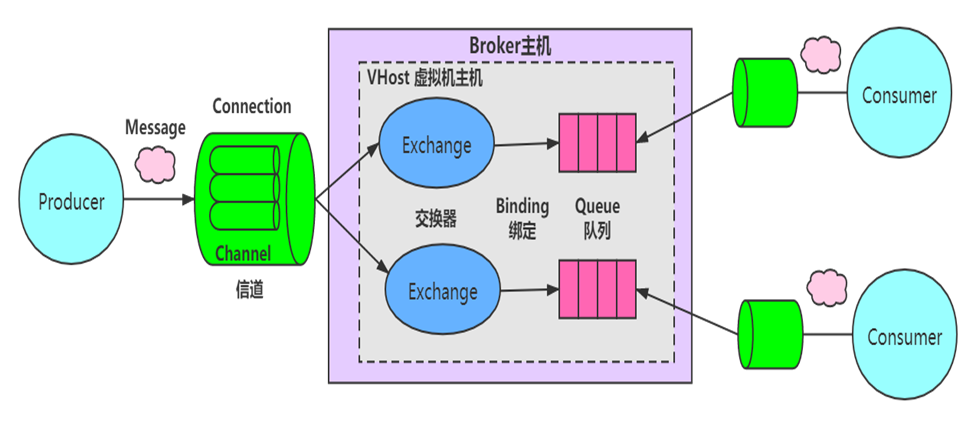

## MQ-2024上

## 1、为什么要用MQ？MQ有哪些使用场景？

### 什么是消息队列

消息队列是一种异步的通信方式，用于在分布式系统中管理消息传递。消息队列采用了生产者-消费者模型，生产者将消息发送到队列中，而消费者则从队列中接收消息。

### 为什么要使用消息队列

其实就是问问你消息队列都有哪些使用场景，然后你项目里具体是什么场景，说说你在这个场景里用消息队列是什么？

面试官问你这个问题，期望的一个回答是说，你们公司有个什么业务场景，这个业务场景有个什么技术挑战，如果不用MQ可能会很麻烦，但是你现在用了MQ之后带给了你很多的好处。消息队列的常见使用场景，其实场景有很多，但是比较核心的有3个：解耦、异步、削峰。

#### 解耦

A系统发送个数据到BCD三个系统，接口调用发送，那如果E系统也要这个数据呢？那如果C系统现在不需要了呢？现在A系统又要发送第二种数据了呢？而且A系统要时时刻刻考虑BCDE四个系统如果挂了咋办？要不要重发？我要不要把消息存起来？

--------补入课程手画图

你需要去考虑一下你负责的系统中是否有类似的场景，就是一个系统或者一个模块，调用了多个系统或者模块，互相之间的调用很复杂，维护起来很麻烦。但是其实这个调用是不需要直接同步调用接口的，如果用MQ给他异步化解耦，也是可以的，你就需要去考虑在你的项目里，是不是可以运用这个MQ去进行系统的解耦。

#### 异步

A系统接收一个请求，需要在自己本地写库，还需要在BCD三个系统写库，自己本地写库要30ms，BCD三个系统分别写库要300ms、450ms、200ms。最终请求总延时是30 + 300 + 450 + 200 = 980ms，接近1s。

异步后，BCD三个系统分别写库的时间，A系统就不再考虑了。

#### 削峰

每天0点到16点，A系统风平浪静，每秒并发请求数量就100个。结果每次一到16点~23点，每秒并发请求数量突然会暴增到1万条。但是系统最大的处理能力就只能是每秒钟处理1000个请求啊。怎么办？需要我们进行流量的削峰，让系统可以平缓的处理突增的请求。

## 2、讲一讲RabbitMQ的AMQP协议

### **AMQP**

是应用层协议的一个开放标准,为面向消息的中间件设计。基于此协议的客户端与消息中间件可传递消息，并不受客户端/中间件不同产品，不同的开发语言等条件的限制。目标是实现一种在全行业广泛使用的标准消息中间件技术，以便降低企业和系统集成的开销，并且向大众提供工业级的集成服务。主要实现有 RabbitMQ。

### 客户端与RabbitMQ的通讯

#### 连接

首先作为客户端（无论是生产者还是消费者），你如果要与RabbitMQ通讯的话，你们之间必须创建一条TCP连接，当然同时建立连接后，客户端还必须发送一条“问候语”让彼此知道我们都是符合AMQP的语言的，比如你跟别人打招呼一般会说“你好！”，你跟国外的美女一般会说“hello!”一样。你们确认好“语言”之后，就相当于客户端和RabbitMQ通过“认证”了。你们之间可以创建一条AMQP的信道。

#### 信道

概念：信道是生产者/消费者与RabbitMQ通信的渠道。信道是建立在TCP连接上的虚拟连接，什么意思呢？就是说rabbitmq在一条TCP上建立成百上千个信道来达到多个线程处理，这个TCP被多个线程共享，每个线程对应一个信道，信道在RabbitMQ都有唯一的ID ,保证了信道私有性，对应上唯一的线程使用。

疑问：为什么不建立多个TCP连接呢？原因是rabbit保证性能，系统为每个线程开辟一个TCP是非常消耗性能，每秒成百上千的建立销毁TCP会严重消耗系统。所以rabbitmq选择建立多个信道（建立在tcp的虚拟连接）连接到rabbit上。

从技术上讲，这被称之为“多路复用”，对于执行多个任务的多线程或者异步应用程序来说，它非常有用。

### 虚拟主机

虚拟消息服务器，vhost，本质上就是一个mini版的mq服务器，有自己的队列、交换器和绑定，最重要的，自己的权限机制。Vhost提供了逻辑上的分离，可以将众多客户端进行区分，又可以避免队列和交换器的命名冲突。Vhost必须在连接时指定，rabbitmq包含缺省vhost：“/”，通过缺省用户和口令guest进行访问。

rabbitmq里创建用户，必须要被指派给至少一个vhost，并且只能访问被指派内的队列、交换器和绑定。Vhost必须通过rabbitmq的管理控制工具创建。

#### 交换器类型

共有四种direct,fanout,topic,headers，其种headers(几乎和direct一样)不实用，可以忽略。

##### Direct

路由键完全匹配，消息被投递到对应的队列， direct交换器是默认交换器。声明一个队列时，会自动绑定到默认交换器，并且以队列名称作为路由键：channel->basic_public($msg,’’,’queue-name’)

##### Fanout

消息广播到绑定的队列，不管队列绑定了什么路由键，消息经过交换器，每个队列都有一份。

##### Topic

通过使用“*”和“#”通配符进行处理，使来自不同源头的消息到达同一个队列，”.”将路由键分为了几个标识符，“*”匹配1个，“#”匹配一个或多个。

## 3、RabbitMQ如何才能做到消息不丢失？

1. 持久化

在发送消息时，可以设置消息属性 `delivery_mode` 为 2，表示该消息需要被持久化，即将消息保存到磁盘中，即使 RabbitMQ 服务器宕机也能够保证消息不会丢失。可以在创建队列时将 `durable` 属性设置为 `True`，表示该队列也需要被持久化，以便在 RabbitMQ 服务器宕机后能够重新创建队列和绑定。

2. 确认机制

在 RabbitMQ 中，消费者通过 `basic.ack` 命令向 RabbitMQ 服务器确认已经消费了某条消息。如果消费者在处理消息时发生错误或宕机，RabbitMQ 服务器会重新将消息发送给其他消费者。在确认消息之前，RabbitMQ 会将消息保存在内存中，只有在收到消费者的确认消息后才会删除消息。

3. 发布者确认

RabbitMQ 支持发布者确认（Publisher Confirm）机制，即发布者在将消息发送到队列后，等待 RabbitMQ 服务器的确认消息。如果 RabbitMQ 成功将消息保存到队列中，会返回一个确认消息给发布者。如果 RabbitMQ 服务器无法将消息保存到队列中，会返回一个 Nack（Negative Acknowledgement）消息给发布者。通过发布者确认机制，可以确保消息被成功发送到 RabbitMQ 服务器。

4. 备份队列

RabbitMQ 支持备份队列（Alternate Exchange）机制，即在消息发送到队列之前，先将消息发送到备份队列中。如果主队列无法接收消息，RabbitMQ 会将消息发送到备份队列中。备份队列通常是一个交换机，可以在创建队列时通过 `x-dead-letter-exchange` 属性来指定备份队列。

## 4、Kafka如何做到消息不丢失？

Kafka 通过多种机制来确保消息不丢失，包括副本机制、ISR（In-Sync Replicas）机制、ACK 机制等。

1. 副本机制

Kafka 通过副本机制来确保消息不会丢失。在 Kafka 中，每个分区都可以配置多个副本，每个副本保存分区的完整副本，当一个副本宕机时，Kafka 会自动将副本切换到其他可用的副本上。因此，即使其中一个副本宕机，也能够保证消息不会丢失。

2. ISR 机制

在 Kafka 中，副本分为 Leader 副本和 Follower 副本。Leader 副本负责处理消息，Follower 副本只是简单地复制 Leader 副本的数据。当 Follower 副本落后于 Leader 副本时，Kafka 会将 Follower 副本从 ISR 中移除。只有当 Follower 副本与 Leader 副本的差距不大时，才会将 Follower 副本重新加入 ISR，确保消息不会丢失。

3. ACK 机制

在 Kafka 中，生产者发送消息时可以指定 `acks` 参数，表示生产者等待的确认数。`acks` 参数有三个取值：

* `acks=0` 表示生产者不等待确认消息，直接将消息发送到 Kafka 集群。这种方式可能会导致消息丢失，不建议使用。
* `acks=1` 表示生产者在 Leader 副本收到消息后，就将消息视为发送成功。如果 Leader 副本在发送消息后立即宕机，消息可能会丢失。如果 Follower 副本成功复制了消息，但 Leader 副本在宕机前没有来得及将消息写入磁盘，则这条消息将会丢失。
* `acks=all` 表示生产者在所有 ISR 副本都确认接收到消息后，才将消息视为发送成功。这种方式可以最大程度地确保消息不会丢失，但是会降低消息发送的性能。

通过上述机制的使用，可以最大程度地确保 Kafka 中的消息不会丢失。需要根据实际场景选择合适的参数配置来平衡消息发送的性能和可靠性。

## 5、RocketMQ如何做到消息不丢失？

RocketMQ 通过多种机制来确保消息不丢失，包括刷盘机制、消息拉取机制、ACK 机制等。

1. 刷盘机制

RocketMQ 中的消息分为内存消息和磁盘消息，内存消息在 Broker 内存中进行读写，磁盘消息则保存在磁盘上。RocketMQ 支持同步刷盘和异步刷盘两种方式，通过刷盘机制可以确保消息在 Broker 宕机时不会丢失。在同步刷盘模式下，消息写入磁盘时，会等待磁盘的写入完成才返回写入成功的响应。在异步刷盘模式下，消息写入磁盘后立即返回写入成功的响应，但是不等待磁盘写入完成

3. ACK 机制

在 RocketMQ 中，Producer 发送消息后，Broker 会返回 ACK 确认信号，表示消息已经成功发送。如果 Broker 没有收到 ACK 确认信号，就会尝试重新发送该消息，直到消息被确认为止。

RocketMQ 采用主从复制机制，每个消息队列都有一个主节点和多个从节点，主节点负责消息的写入和读取，从节点负责备份数据。当主节点宕机时，从节点会自动接管主节点的工作，确保消息不会丢失

3. 消息存储机制

RocketMQ 默认使用双写模式来存储消息，即将消息同时写入内存和磁盘中，然后再将内存中的消息异步刷盘到磁盘中。这种方式可以保证消息的可靠性，即使系统宕机，也能够尽可能地保证消息不会丢失。

除此之外，RocketMQ 还提供了多种机制来保证消息不丢失，例如事务消息、延迟消息、顺序消息等，这些机制可以根据业务需求进行选择和使用。

需要注意的是，为了确保消息的可靠性，RocketMQ 的发送消息的速度可能会受到一定的限制，需要在消息可靠性和性能之间进行权衡。

## 6、关于重复消费---幂等性处理方案

#### ***什么是幂等性？***

对于消息接收端的情况,幂等的含义是采用同样的输入多次调用处理函数,得到同样的结果。例如，一个SQL操作

update stat_table set count= 10 where id =1

这个操作多次执行,id等于1的记录中的 count字段的值都为10,这个操作就是幂等的,我们不用担心这个操作被重复。

再来看另外一个SQL操作

update stat_table set count= count +1 where id= 1;

这样的SQL操作就不是幂等的,一旦重复,结果就会产生变化。

#### ***常见办法***

因此应对消息重复的办法是,使消息接收端的处理是一个幂等操作。这样的做法降低了消息中间件的整体复杂性,不过也给使用消息中间件的消息接收端应用带来了一定的限制和门槛。

##### 1. MVCC：

多版本并发控制，乐观锁的一种实现，在生产者发送消息时进行数据更新时需要带上数据的版本号，消费者去更新时需要去比较持有数据的版本号，版本号不一致的操作无法成功。例如博客点赞次数自动+1的接口：

public boolean addCount(Long id, Long version);

update blogTable set count= count+1,version=version+1 where id=321 and version=123

每一个version只有一次执行成功的机会，一旦失败了生产者必须重新获取数据的最新版本号再次发起更新。

##### 2. 去重表：

利用数据库表单的特性来实现幂等，常用的一个思路是在表上构建唯一性索引，保证某一类数据一旦执行完毕，后续同样的请求不再重复处理了（利用一张日志表来记录已经处理成功的消息的ID，如果新到的消息ID已经在日志表中，那么就不再处理这条消息。）

以电商平台为例子，电商平台上的订单id就是最适合的token。当用户下单时，会经历多个环节，比如生成订单，减库存，减优惠券等等。每一个环节执行时都先检测一下该订单id是否已经执行过这一步骤，对未执行的请求，执行操作并缓存结果，而对已经执行过的id，则直接返回之前的执行结果，不做任何操作。这样可以在最大程度上避免操作的重复执行问题，缓存起来的执行结果也能用于事务的控制等。

## 1、讲一讲Kafka的ISR机制

### **生产者发送确认（ACKS）**

生产者可以选择以下3 种不同的确认模式。

acks=0 意味着如果生产者能够通过网络把消息发送出去，那么就认为消息已成功写入Kafka 。

acks=1 意味若首领（Leader）在收到消息并把它写入到分区数据文件（到内存而不是要到磁盘）时会返回确认或错误响应。

acks=all 意味着首领在返回确认或错误响应之前，会等待所有同步副本都收到消息，才会返回确认或错误响应。

### 三种模式的性能差别

acks=0

在acks=0 模式下的运行速度是非常快的，因为这里不太需要数据到副本

不过这种**模式会丢失消息**：比如发送的对象无法被序列化或者网卡发生故障，但如果是分区离线或整个集群长时间不可用，那就不会收到任何错误。所以选择了这种模式， 一定会丢失一些消息（一些异常、极端的情况）。

acks=1

在这个模式下，如果发生正常的首领选举，生产者会在选举时收到一个异常，如果生产者能正确的处理这个错误，它会**重试**发送消息，最终消息会安全到达新的首领那里。不过在这个模式下仍然有可能丢失数据，比如消息已经成功写入首领，但在消息被复制到跟随者副本之前首领发生崩溃。

acks=all

这是最保险的做法——生产者会一直重试直到消息被成功提交。不过这也是最慢的做法，生产者在继续发送其他消息之前需要等待所有副本都收到当前的消息。

### ISR的动态复制方案

站在消费者的来说，因为生产发送消息时的acks对于消费来说有很大的延迟性（如果是用acks=all的话），那么这种情况下消费者可能要很长时间才能消费消息，这点对于消费者来说可能不能容忍。

这里就是有一个ISR机制：ISR的动态复制方案。ISR，也即In-Sync Replica

配置参数：Broker的min.insync.replicas参数，这个参数只表示最小的同步的副本数

这个参数的控制下，每个Partition的Leader都会维护这样一个列表，该列表中，包含了所有与之同步的Replica（包含Leader自己）。

每次数据写入时，只有ISR中的所有Replica都复制完，Leader才会将其置为Commit，这样的数据它才能被Consumer所消费。

并不是所有保存在分区首领上的数据都可以被客户端读取。大部分客户端只能读取已经被写入所有同步副本的消息。分区首领知道每个消息会被复制到哪个副本上, 在消息还没有被写入所有同步副本之前, 是不会发送给消费者的，尝试获取这些消息的请求会得到空的响应而不是错误。所以这里针对消费者消费该如何做呢？

### 示例

设置acks=all，且副本数为3
极端情况1：
默认min.insync.replicas=1，极端情况下如果ISR中只有leader一个副本时满足min.insync.replicas=1这个条件，此时producer发送的数据只要leader同步成功就会返回响应，如果此时leader所在的broker crash了，就必定会丢失数据！这种情况不就和acks=1一样了！所以我们需要适当的加大min.insync.replicas的值。

极端情况2：
min.insync.replicas=3（等于副本数），这种情况下要一直保证ISR中有所有的副本，且producer发送数据要保证所有副本写入成功才能接收到响应！一旦有任何一个broker crash了，ISR里面最大就是2了，不满足min.insync.replicas=3，就不可能发送数据成功了！

根据这两个极端的情况可以看出min.insync.replicas的取值，是kafka系统可用性和数据可靠性的平衡！

减小 min.insync.replicas 的值，一定程度上增大了系统的可用性，允许kafka出现更多的副本broker crash并且服务正常运行；但是降低了数据可靠性，可能会丢数据（极端情况1）。
增大 min.insync.replicas 的值，一定程度上增大了数据的可靠性，允许一些broker crash掉，且不会丢失数据（只要再次选举的leader是从ISR中选举的就行）；但是降低了系统的可用性，会允许更少的broker crash（极端情况2）。

以上配置：min.insync.replicas=3

在第一步中，Leader A总共收到3条消息，但由于ISR中的Follower只同步了第1条消息（m1），故只有m1被Commit，也即只有m1可被Consumer消费（因为min.insync.replicas=3）。

当然如果说min.insync.replicas=2 的话，那么消费者就可以消费m1和m2的消息。

**上图中的蓝色的虚线就是HW（High Watermark），HW 是指在分区中，已经被所有追随者（Follower）副本复制的消息的位置。**

还有一个概念就是**LEO（Log End Offset）**

LEO 是指在分区中当前最新消息的位置。LEO 表示分区日志中的最后一条消息的偏移量。LEO 包括已经被写入但尚未被所有追随者副本复制的消息，以及正在等待被写入的消息。LEO 是一个动态的属性，它会随着新消息的写入而逐渐增加。

这种方案，与同步复制非常接近。但不同的是，这个ISR是由Leader动态维护的。如果Follower不能紧“跟上”Leader，它将被Leader从ISR中移除，待它又重新“跟上”Leader后，会被Leader再次加加ISR中。每次改变ISR后，Leader都会将最新的ISR持久化。

### 总结

Kafka的复制机制既不是完全的同步复制，也不是单纯异步复制。（虽然Leader是Follower之间是异步复制的，不过有ACKS和min.insync.replicas 两种参数来控制），ISR机制则有效地权衡了数据可靠性和性能之间的关系。

同时，当Leader故障时，在ISR集合中的Follower才有资格被选举为新的Leader。

## 2、讲一讲零拷贝原理以及MQ的运用

### **什么是零拷贝?**

零拷贝(英语: Zero-copy) 技术是指计算机执行操作时，CPU不需要先将数据从某处内存复制到另一个特定区域。这种技术通常用于通过网络传输文件时节省CPU周期和内存带宽。

➢零拷贝技术可以减少数据拷贝和共享总线操作的次数，消除传输数据在存储器之间不必要的中间拷贝次数，从而有效地提高数据传输效率

➢零拷贝技术减少了用户进程地址空间和内核地址空间之间因为上:下文切换而带来的开销

可以看出没有说不需要拷贝，只是说减少冗余[不必要]的拷贝。

下面这些组件、框架中均使用了零拷贝技术：Kafka、Netty、Rocketmq、Nginx、Apache。

### **传统数据传送机制**

比如：读取文件，再用socket发送出去，实际经过四次copy。

伪码实现如下：

buffer = File.read()

Socket.send(buffer)

1、第一次：将磁盘文件，读取到操作系统内核缓冲区；

2、第二次：将内核缓冲区的数据，copy到应用程序的buffer；

3、第三步：将application应用程序buffer中的数据，copy到socket网络发送缓冲区(属于操作系统内核的缓冲区)；

4、第四次：将socket buffer的数据，copy到网卡，由网卡进行网络传输。

#### ***mmap内存映射***

硬盘上文件的位置和应用程序缓冲区(application buffers)进行映射（建立一种一一对应关系），由于mmap()将文件直接映射到用户空间，所以实际文件读取时根据这个映射关系，直接将文件从硬盘拷贝到用户空间，只进行了一次数据拷贝，不再有文件内容从硬盘拷贝到内核空间的一个缓冲区。

mmap内存映射将会经历：3次拷贝: 1次cpu copy，2次DMA copy；

#### ***sendfile***

linux 2.1支持的sendfile

当调用sendfile()时，DMA将磁盘数据复制到kernel buffer，然后将内核中的kernel buffer直接拷贝到socket buffer。在硬件支持的情况下，甚至数据都并不需要被真正复制到socket关联的缓冲区内。取而代之的是，只有记录数据位置和长度的描述符被加入到socket缓冲区中，DMA模块将数据直接从内核缓冲区传递给协议引擎，从而消除了遗留的最后一次复制。

一旦数据全都拷贝到socket buffer，sendfile()系统调用将会return、代表数据转化的完成。socket buffer里的数据就能在网络传输了。

sendfile会经历：3次拷贝，1次CPU copy ，2次DMA copy；硬件支持的情况下，则是2次拷贝，0次CPU copy， 2次DMA copy。

## 3、讲一讲RocketMQ中Netty框架的运用

见随堂笔记图

RocketMQ实现Netty的通讯模型：总结几句话--应对面试：
1、Netty框架--基于NIO 的事件驱动的 异步的框架

2、RocketMQ里面简化了客户端、服务端 Remoting类

3、使用requestCode  可以实现不同的功能，交给不同的处理器（Processer）

4、里面使用了一大堆的JUC的，阻塞唤醒模型（异步转同步调用）：发令枪，信号量：限流、。这些

5、以上 如果你以后要自己实现基于Netty 复杂一点的自定义的框架，就可以参考RocketMQ的remoting的写法
