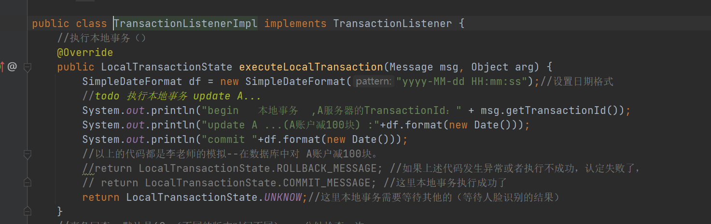

## MQ-2024下

## 1、什么是延时消息，各种MQ的实现？

具体见PPT

## 2、如何确保消息的顺序性

基本上只要确保一个生产者、一个消费者。即可。

其他的可以见PPT和老师视频讲解。

## 3、讲一讲零拷贝原理以及MQ的运用

### **什么是零拷贝?**

零拷贝(英语: Zero-copy) 技术是指计算机执行操作时，CPU不需要先将数据从某处内存复制到另一个特定区域。这种技术通常用于通过网络传输文件时节省CPU周期和内存带宽。

➢零拷贝技术可以减少数据拷贝和共享总线操作的次数，消除传输数据在存储器之间不必要的中间拷贝次数，从而有效地提高数据传输效率

➢零拷贝技术减少了用户进程地址空间和内核地址空间之间因为上:下文切换而带来的开销

可以看出没有说不需要拷贝，只是说减少冗余[不必要]的拷贝。

下面这些组件、框架中均使用了零拷贝技术：Kafka、Netty、Rocketmq、Nginx、Apache。

### **传统数据传送机制**

比如：读取文件，再用socket发送出去，实际经过四次copy。

伪码实现如下：

buffer = File.read()

Socket.send(buffer)

1、第一次：将磁盘文件，读取到操作系统内核缓冲区；

2、第二次：将内核缓冲区的数据，copy到应用程序的buffer；

3、第三步：将application应用程序buffer中的数据，copy到socket网络发送缓冲区(属于操作系统内核的缓冲区)；

4、第四次：将socket buffer的数据，copy到网卡，由网卡进行网络传输。

#### ***mmap内存映射***

硬盘上文件的位置和应用程序缓冲区(application buffers)进行映射（建立一种一一对应关系），由于mmap()将文件直接映射到用户空间，所以实际文件读取时根据这个映射关系，直接将文件从硬盘拷贝到用户空间，只进行了一次数据拷贝，不再有文件内容从硬盘拷贝到内核空间的一个缓冲区。

mmap内存映射将会经历：3次拷贝: 1次cpu copy，2次DMA copy；

#### ***sendfile***

linux 2.1支持的sendfile

当调用sendfile()时，DMA将磁盘数据复制到kernel buffer，然后将内核中的kernel buffer直接拷贝到socket buffer。在硬件支持的情况下，甚至数据都并不需要被真正复制到socket关联的缓冲区内。取而代之的是，只有记录数据位置和长度的描述符被加入到socket缓冲区中，DMA模块将数据直接从内核缓冲区传递给协议引擎，从而消除了遗留的最后一次复制。

一旦数据全都拷贝到socket buffer，sendfile()系统调用将会return、代表数据转化的完成。socket buffer里的数据就能在网络传输了。

sendfile会经历：3次拷贝，1次CPU copy ，2次DMA copy；硬件支持的情况下，则是2次拷贝，0次CPU copy， 2次DMA copy。

## 4、分布式事物消息以及在RocketMQ的运用及原理

## 什么是分布式事务？

业务场景：用户A转账100元给用户B，这个业务比较简单，具体的步骤：
1、用户A的账户先扣除100元
2、再把用户B的账户加100元

如果在同一个数据库中进行，事务可以保证这两步操作，要么同时成功，要么同时不成功。这样就保证了转账的数据一致性。
但是在微服务架构中，因为各个服务都是独立的模块，都是远程调用，都没法在同一个事务中，都会遇到分布式事务问题。

## RocketMQ的解决方案

RocketMQ采用两阶段提交，把扣款业务和加钱业务异步化，在A系统扣款成功后，发送“扣款成功消息”到消息中间件；B系统中加钱业务订阅“扣款成功消息”，再对用户进行加钱。

#### 具体的处理方案

1. 生产者发送半消息（half message）到RocketMQ服务器
2. RocketMQ服务器向生产者返回半消息的提交结果

   
3. 生产者执行本地的事务

   

   1）这里如果是标记为可提交状态（commit），消费者监听主题即可立马消费（TransactionTopic主题），消费者进行事务处理，提交。

   2）如果这里标记为回滚，那么消费者就看不到这条消息，整个事务都是回滚的

   

   3）当然本地事务中还有一种情况，那就是没执行完，这个时候，可以提交UNKNOW,交给事务回查机制。 如果是事务回查中，生产者本地事务执行成功了，则提交commit，消费者监听主题即可立马消费，消费者进行事务处理，提交。                                                                                                                            如果这里标记为回滚，那么消费者就看不到这条消息，整个事务都是回滚的。                                             当然本地事务中还有一种情况，那就是还没执行完，这个时候还是可以继续提交UNKNOW,交给事务回查机制（过段时间继续进入事务回查）。

## RocketMQ分布式事务方案中的异常处理

### 事务回查失败的处理机制

在生产者有可能是要进行定时的事务回查的，所以在这个过程中有可能生产者宕机导致这条分布式事务消息不能正常进行。那么在RocketMQ中的生产者分组就会发挥作用

也就是如果在进行分布式事务回查中（RocketMQ去调用生产者客户端）某一台生产者宕机了，这个时候只要还有一台分组名相同的生产者在运行，那么就可以帮助之前宕机的生产者完成事务回查。

### 消费者失败补偿机制

虽然在消费者采用最大可能性的方案（重试的机制）确保这条消息能够执行成功，从而确保消费者事务的确保执行。但是还是有可能会发生消费者无法执行事务的情况，这个时候就必须要使用事务补偿方案。

业务场景：用户A转账100元给用户B，这个业务比较简单，具体的步骤：
1、用户A的账户先扣除100元----生产者成功执行了
2、再把用户B的账户加100元----消费者一直加100元失败。

那么就需要去通知生产者把之前扣除100元的操作进行补偿回滚操作。

