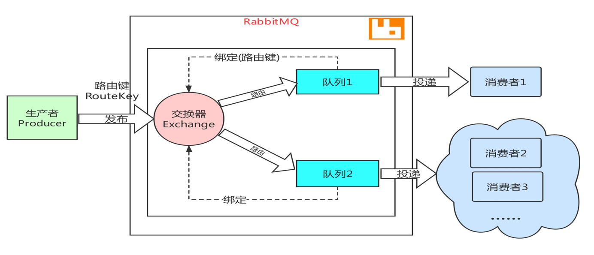
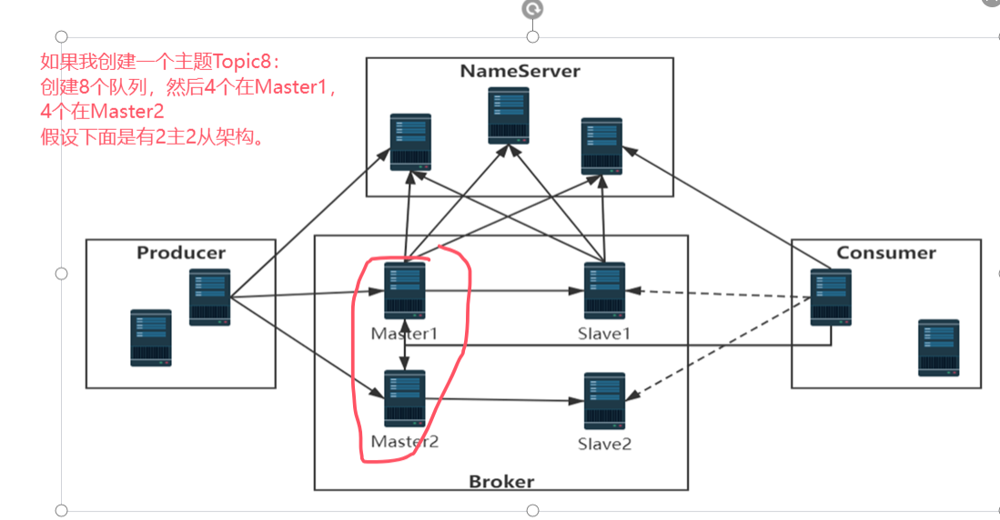
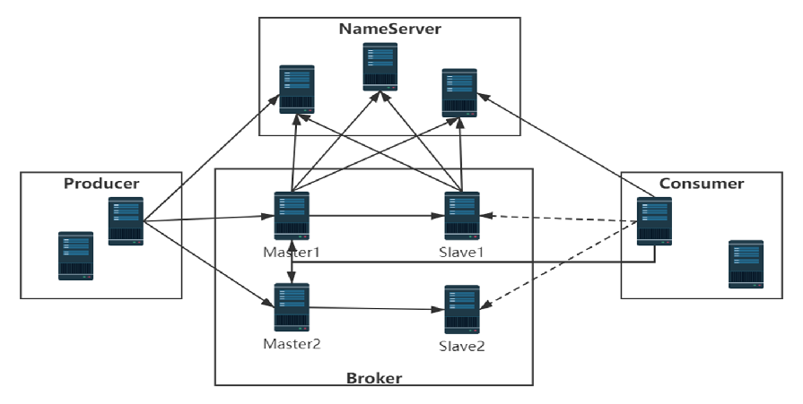
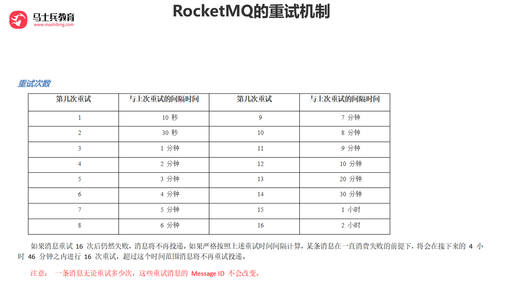
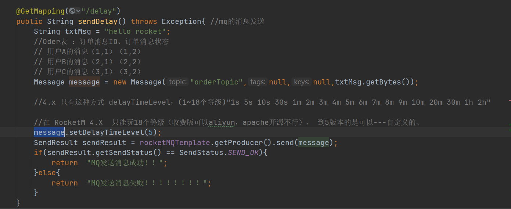
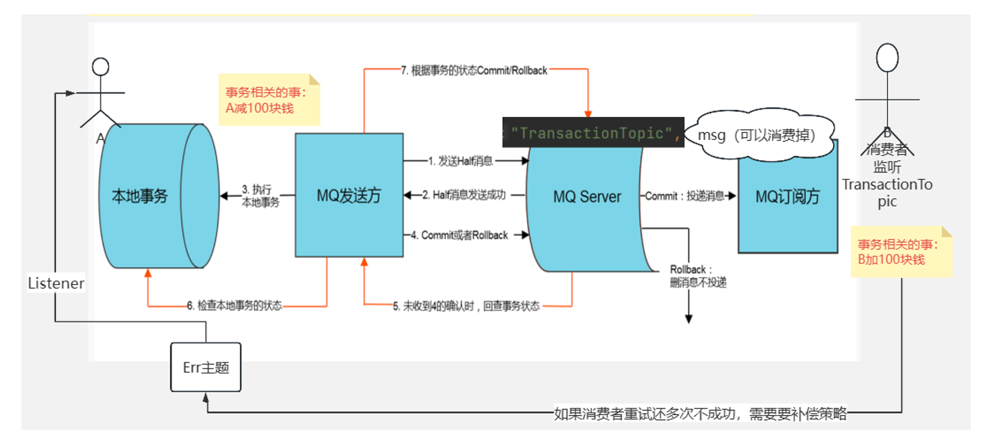

## MQ-2025上

## RabbitMQ的消息处理模型

### RabbitMQ的消息处理模型



RabbitMQ 是一个基于 **AMQP（Advanced Message Queuing Protocol）** 协议的消息队列系统

1. **生产者（Producer）**
2. **交换器（Exchange）**
3. **路由键（Routing Key）**
4. **队列（Queue）**
5. **消费者（Consumer）**
6. **生产者（Producer）**

生产者是消息的发送者，负责创建消息并将其发送到 RabbitMQ 的交换器（Exchange）。

生产者通过 `RabbitTemplate` 或 AMQP 客户端将消息发送到交换器

2. **交换器（Exchange）**

交换器是消息的路由中心，负责接收生产者发送的消息，并根据 **路由键（Routing Key）** 和 **绑定规则（Binding）** 将消息分发到一个或多个队列。

* **类型** ：RabbitMQ 支持多种交换器类型，每种类型有不同的路由规则：

  * **Direct Exchange** ：精确匹配路由键。
  * **Topic Exchange** ：基于通配符匹配路由键。
  * **Fanout Exchange** ：广播消息到所有绑定的队列。

**3.路由键（Routing Key）**

路由键是生产者发送消息时指定的一个字符串，用于决定消息如何从交换器路由到队列。

* **作用** ：交换器根据路由键和绑定规则将消息分发到队列。
* **匹配规则** ：不同的交换器类型对路由键的匹配方式不同。

**4.队列（Queue）**

队列是消息的存储容器，用于存储从交换器路由过来的消息，直到消费者处理它们。

**5.消费者（Consumer）**

消费者是消息的接收者，负责从队列中获取消息并进行处理。

* 消费者订阅队列，RabbitMQ 会将队列中的消息推送给消费者。
* 消费者处理完消息后，需要向 RabbitMQ 发送确认（ACK），表示消息已成功处理。

### Kafka的消息处理模型


Kafka 是一个分布式的流处理平台，其消息处理模型基于  **发布-订阅模式** ，核心组件包括  **生产者（Producer）** 、 **Kafka 集群（Brokers）** 、 **主题（Topic）** 、**分区（Partition）** 和 **消费者（Consumer）**

1. **生产者发送消息** ：

   * 生产者将消息发送到  **主题 A** 。
   * 根据消息的键（Key）或轮询策略，消息被分配到 **分区 0** 或  **分区 1** 。
2. **消息存储** ：

   * 如果消息被分配到  **分区 0** ，它会被存储在 **Broker1** 上（因为 **分区 0** 的首领在 **Broker1** 上）。
   * 如果消息被分配到  **分区 1** ，它会被存储在 **Broker2** 上（因为 **分区 1** 的首领在 **Broker2** 上）。
3. **消费者消费消息** ：

   * 消费者组中的消费者订阅  **主题 A** 。
   * 消费者 1 从  **分区 0** （位于  **Broker1** ）读取消息。
   * 消费者 2 从  **分区 1** （位于  **Broker2** ）读取消息。
4. **并行处理** ：

   * 由于 **分区 0** 和 **分区 1** 位于不同的 Broker 上，消费者可以并行处理消息，提高吞吐量。



### RocketMQ的消息处理模型



RocketMQ 是一个分布式消息中间件，其消息处理模型基于  **发布-订阅模式** ，核心组件包括  **生产者（Producer）** 、 **Broker** 、 **NameServer** 、**主题（Topic）、队列** 和 **消费者（Consumer）**

NameServer 是 RocketMQ 的轻量级服务发现组件，负责管理 Broker 的路由信息。

Broker 是 RocketMQ 的消息存储和转发节点，负责存储消息、处理生产者和消费者的请求。

**主题（Topic）**

* 主题可以创建在一台 Master 上，也可以创建在多台 Master 上以提高并发能力。
* 如果主题创建在多台 Master 上，消息会被均匀分布到不同的 Master。

**消息处理流程**

1. **主题创建** ：
   * **主题 A** 可以创建在 **Master1** 上，也可以同时创建在 **Master1** 和 **Master2** 上。
   * 如果创建在 **Master1** 和 **Master2** 上，消息会被均匀分布到两个 Master，提高并发能力。
2. **生产者发送消息** ：
   * 生产者将消息发送到  **主题 A** 。
   * 如果 **主题 A** 创建在 **Master1** 和 **Master2** 上，消息会被均匀分布到 **Master1** 和  **Master2** 。
3. **消息存储** ：
   * 消息被存储在 **Master1** 或 **Master2** 的队列中。
   * **Slave1** 和 **Slave2** 分别从 **Master1** 和 **Master2** 同步数据，提供数据备份。
4. **消费者消费消息** ：
   * 消费者从 **Master1** 或 **Master2** 的队列中拉取消息。
   * 如果 **Master1** 阻塞或宕机，消费者可以从 **Slave1** 消费消息。
   * 如果 **Master2** 阻塞或宕机，消费者可以从 **Slave2** 消费消息。

## 如何在MQ中实现消息的顺序性，分析相关的设计与实现细节！

为了保证消息的顺序性，通常需要遵循以下规则：

* **单线程生产** ：确保生产者以单线程方式发送消息，避免并发发送导致消息乱序。
* **单线程消费** ：确保消费者以单线程方式消费消息，避免并发消费导致消息乱序。
* **单个队列** ：将所有消息发送到同一个队列中，确保消息的顺序性。
* **单个生产者/消费者** ：避免多个生产者或消费者同时操作同一个队列，导致消息顺序混乱。

### RabbitMQ

消息重试机制可以确保消息在消费失败后重新入队，从而保证消息的顺序性。

如果消费者处理消息失败，将消息重新放回队列头部，确保消息顺序不变。

#### **事务消息**

事务消息可以确保消息的发送和业务逻辑的原子性，从而保证消息的顺序性。

如果对消息顺序性要求极高，且可以接受性能损失，可以选择  **事务消息** 。

#### **RPC 模式**

RPC 模式可以确保消息的顺序性，通过同步调用方式实现。

如果需要同步调用并保证顺序性，可以选择  **RPC 模式** 。

### Kafka和RocketMQ

在 Kafka 和RocketMQ中，一个分区/队列只能被同一个消费者组中的一个消费者消费。通过限制消费者组的消费者数量，可以确保消息的顺序性。

Kafka中：

`max.in.flight.requests.per.connection`：**控制每个连接上未确认的请求数量。设置为1

RocketMQ中：
选用顺序的消费者方法或者类。

## 描述MQ中的消息确认机制（如RabbitMQ\RocketMQ的ack机制），分析源码中如何处理消息的确认与重发

RabbitMQ与Kafka和RocketMQ不一样，进行完ACK确认后，RabbitMQ会删除消息，其他的（kafka和RocketMQ）他们是不会删除，只会进行消费偏移量管理的。

RocketMQ 的消息确认机制基于 **消费者拉取消息** 和  **消费进度提交** 。

Kafka 的消息确认机制基于  **消费者提交偏移量（Offset）** 。

1. **RabbitMQ** ：
   * 通过 Confirm 模式和手动 ACK 确保消息可靠传递。
   * 支持 NACK 重新入队和重试机制。
2. **RocketMQ** ：
   * 通过消费进度提交确保消息可靠传递。
   * 支持重试队列，提供多级别重试策略。
3. **Kafka** ：
   * 通过偏移量提交确保消息可靠传递。
   * 无内置重试机制，需开发者自行实现。



## 使用MQ的延迟消息实现限时订单

### RabbitMQ

RabbitMQ本身不支持延迟消息，但可以通过死信队列（DLX）和消息TTL（Time-To-Live）来实现延迟效果。

1. **创建普通队列和死信队列** ：
   * 创建一个普通队列，并设置消息的TTL（即消息的存活时间）。
   * 创建一个死信队列，用于接收超时的消息。
2. **绑定死信队列** ：
   * 在普通队列中配置死信交换器（DLX），当消息在普通队列中过期后，会被转发到死信队列。
3. **发送延迟消息** ：
   * 当用户下单时，将订单信息发送到普通队列，并设置消息的TTL为订单的超时时间（如30分钟）。
4. **处理超时订单** ：
   * 消费者监听死信队列，当消息从普通队列过期并进入死信队列时，消费者会收到该消息，表示订单超时，可以进行取消订单等操作。

### RocketMQ：延时消息

RocketMQ原生支持延迟消息，可以直接设置消息的延迟级别来实现订单超时处理。在RocketMQ5的版本中可以设置任意的延迟时间。

```
// 设置延迟级别，3对应10分钟，4对应30分钟
        msg.setDelayTimeLevel(4);
```

* 在RocketMQ 5.x中，发送消息时可以通过 `setDelayTimeMs`方法设置任意的延迟时间（以毫秒为单位）。
* 例如，设置延迟30分钟，可以将延迟时间设置为 `30 * 60 * 1000`毫秒。

  

```
 Message message = provider.newMessageBuilder()
                .setTopic("order_topic")
                .setBody(body)
                .setDelayTimeMs(30 * 60 * 1000) // 设置延迟时间（30分钟）
                .build();
```

## 在支付系统中，如何利用MQ处理支付请求，确保支付的可靠性和事务的一致性



其他的细讲见代码

## MQ中流量控制的实现，包括限流策略和流量监控，分析源码中相关的实现逻辑

### **RabbitMQ**

通过设置消费者的预取数量（prefetch count），可以限制消费者从队列中拉取的消息数量，从而控制消费速率。

```
 @Bean
    public SimpleRabbitListenerContainerFactory rabbitListenerContainerFactory(ConnectionFactory connectionFactory) {
        SimpleRabbitListenerContainerFactory factory = new SimpleRabbitListenerContainerFactory();
        factory.setConnectionFactory(connectionFactory);
        // 设置 prefetchCount，限制消费者每次从队列中拉取的消息数量
        factory.setPrefetchCount(10); // 每次最多拉取 10 条消息
        return factory;
    }

```

### **Kafka**

#### 生产者

通过配置 `producer.properties` 中的 `max.in.flight.requests.per.connection` 和 `linger.ms` 参数，控制生产者的发送速率。

```
       // 设置 max.in.flight.requests.per.connection
        props.put(ProducerConfig.MAX_IN_FLIGHT_REQUESTS_PER_CONNECTION, 1);
        // 设置 linger.ms
        props.put(ProducerConfig.LINGER_MS_CONFIG, 100);
```

`max.in.flight.requests.per.connection`：**控制每个连接上未确认的请求数量。

* **未确认请求** ：
  未确认请求是指生产者已经发送给 Broker 但尚未收到确认（acknowledgment）的消息。
* **并发性** ：
  增加该值可以提高生产者的并发性，从而提升吞吐量，因为生产者可以同时发送更多的消息。
* **顺序性** ：
  如果该值大于 1，可能会导致消息乱序。例如：

  * 假设生产者发送了消息 A 和消息 B。
  * 如果消息 A 发送失败并重试，而消息 B 已经成功发送，那么消息 B 可能会先于消息 A 被写入分区，导致消息顺序错乱。
  * 如果需要严格保证消息顺序，建议将该值设置为 `1`。

#### **消费者**

使用 Kafka 的 `fetch.max.bytes` 和 `max.poll.records` 参数控制消费者每次拉取的消息数量。

它们分别用于控制每次拉取的最大字节数和最大消息数。

`fetch.max.bytes`：该参数限制了消费者每次从 Kafka Broker 拉取数据的最大字节数。它决定了消费者单次请求能够获取的数据量。

* **影响拉取的数据量** ：
  如果设置的值较小，消费者每次拉取的数据量会减少，从而降低网络带宽的占用，但可能会增加拉取请求的频率。
* **与分区大小的关系** ：
  如果单个分区中的数据量超过了 `fetch.max.bytes`，消费者仍然会拉取整个分区的数据，因此该参数并不能严格限制单次拉取的数据量。

max.poll.records：控制每次拉取的最大消息数：

该参数限制了消费者每次调用 poll() 方法时返回的最大消息数。

* **影响单次处理的消息量** ：
  如果设置的值较小，消费者每次处理的消息数量会减少，从而降低单次处理的开销，但可能会增加 `poll()` 方法的调用频率。
* **与消费者处理能力的关系** ：
  如果消费者的处理能力有限，可以适当减小该值，以避免消息积压。
* **适用场景** ：
  * 如果消费者的处理速度较慢，可以减小该值以避免消息堆积。
  * 如果需要减少单次处理的消息量以降低内存占用，也可以调整该值。

**综合**

* **消费者处理能力** ：
  如果消费者的处理速度较慢，可以适当减小 `max.poll.records` 的值，以避免消息堆积。
* **网络带宽** ：
  如果网络带宽有限，可以适当减小 `fetch.max.bytes` 的值，以减少单次拉取的数据量。
* **与 `max.poll.interval.ms` 的关系** ：
  `max.poll.interval.ms` 参数定义了消费者两次 `poll()` 调用之间的最大时间间隔。如果消费者处理消息的时间过长，可能会导致消费者被踢出组（rebalance）。因此，在调整 `max.poll.records` 时，也需要考虑 `max.poll.interval.ms` 的设置。

### RocketMQ

#### **生产者限流**

**发送速率限制** ：
通过设置 `sendMsgTimeout` 和 `maxMessageSize` 参数，控制生产者的发送速率。

* **`sendMsgTimeout`作用** ：
  该参数用于设置生产者发送消息的超时时间。如果消息在指定时间内未发送成功，生产者会抛出超时异常。
* **默认值** ：
  默认值为 `3000`（即 3 秒）。
* **适用场景** ：

  * 如果网络延迟较高或 Broker 处理较慢，可以适当增加该值。
  * 如果需要快速失败（fail-fast），可以减小该值。
* **`maxMessageSize：`作用** ：
  该参数用于设置单条消息的最大大小。如果消息大小超过该值，生产者会抛出异常。
* **默认值** ：
  默认值为 `4 MB`（即 `4194304` 字节）。
* **适用场景** ：

  * 如果需要发送较大的消息，可以适当增加该值。
  * 如果对消息大小有严格限制，可以减小该值。

#### **消费者限流**

**拉取速率限制** ：
通过设置 `pullBatchSize` 和 `pullInterval` 参数，控制消费者的拉取速率。

`pullBatchSize`

* **作用** ：
  该参数用于设置消费者每次从 Broker 拉取的消息数量。
* **默认值** ：
  默认值为 `32`。
* **适用场景** ：
  * 如果消费者的处理能力较强，可以适当增加该值以提高吞吐量。
  * 如果消费者的处理能力有限，可以减小该值以避免消息堆积。

`pullInterval`

* **作用** ：
  该参数用于设置消费者两次拉取操作之间的时间间隔（毫秒）。
* **默认值** ：
  默认值为 `0`，表示消费者会立即进行下一次拉取。
* **适用场景** ：
  * 如果需要降低消费者的拉取频率，可以适当增加该值。
  * 如果需要实时处理消息，可以减小该值。

## MQ系统如何实现高可用性（如集群模式、主从复制等）

### RabbitMQ

RabbitMQ一般是通过镜像队列来实现高可用。（RabbitMQ的集群功能不行，消息本身不会在集群节点之间复制，如果某个节点故障，其上的队列和消息将不可用）

镜像队列实现方式

* **主从复制** ：
  每个队列可以配置多个镜像（副本），分布在不同的节点上。主节点负责处理消息，从节点同步主节点的数据。
* **自动故障转移** ：
  如果主节点故障，RabbitMQ 会自动选举一个从节点作为新的主节点。

### RocketMQ

#### 2.1 主从复制

RocketMQ 通过 **主从复制** 实现高可用性。

##### 实现方式

* **Broker 主从架构** ：
  每个 Broker 组包含一个主节点（Master）和多个从节点（Slave）。主节点负责处理读写请求，从节点同步主节点的数据。
* **消息同步** ：
  主节点将消息同步到从节点，确保从节点上有完整的数据副本。
* **故障转移** ：
  如果主节点故障，RocketMQ 会自动切换到从节点继续提供服务。

##### 配置步骤

1. 部署多个 Broker 组，每个组包含一个主节点和多个从节点。
2. 在配置文件中指定主从关系：
   properties

   复制

   ```
   brokerClusterName=DefaultCluster
   brokerName=broker-a
   brokerId=0 # 0 表示主节点，大于 0 表示从节点
   ```
3. 客户端配置 NameServer 地址，NameServer 会管理 Broker 的主从关系。

##### 优点

* 提高消息的可用性和可靠性。
* 自动故障转移，保证服务连续性。

##### 缺点

* 从节点只提供读服务，写操作仍然依赖主节点。

---

#### 2.2 DLedger 模式（Raft 协议）

RocketMQ 4.5 及以上版本支持  **DLedger 模式** ，基于 Raft 协议实现高可用性。

##### 实现方式

* **多副本一致性** ：
  使用 Raft 协议保证多个副本之间的一致性。
* **自动选举** ：
  如果主节点故障，DLedger 会自动选举新的主节点。

##### 配置步骤

1. 在 Broker 配置文件中启用 DLedger：
   properties

   复制

   ```
   enableDLegerCommitLog=true
   dLegerGroup=broker-a
   dLegerPeers=n0-127.0.0.1:40911;n1-127.0.0.1:40912;n2-127.0.0.1:40913
   ```
2. 启动多个 Broker 节点，每个节点运行一个 DLedger 实例。

##### 优点

* 强一致性，保证数据不丢失。
* 自动故障转移，提高系统可用性。

##### 缺点

* 增加了系统复杂性和性能开销。

---

### 3. Kafka

#### 3.1 分区副本机制

Kafka 通过 **分区副本** 机制实现高可用性。

##### 实现方式

* **分区和副本** ：
  每个主题（Topic）分为多个分区（Partition），每个分区可以有多个副本（Replica），分布在不同的 Broker 上。
* **主从复制** ：
  每个分区有一个主副本（Leader）和多个从副本（Follower）。主副本负责处理读写请求，从副本同步主副本的数据。
* **故障转移** ：
  如果主副本故障，Kafka 会从从副本中选举一个新的主副本。

##### 配置步骤

1. 创建主题时指定分区和副本数：
   bash

   复制

   ```
   kafka-topics.sh --create --topic my-topic --partitions 3 --replication-factor 2 --bootstrap-server localhost:9092
   ```

   * `partitions`：分区数。
   * `replication-factor`：副本数。
2. Kafka 会自动管理分区副本的分布和主从关系。

##### 优点

* 提高消息的可用性和可靠性。
* 自动故障转移，保证服务连续性。

##### 缺点

* 副本数增加会占用更多的存储和网络带宽。

---

#### 3.2 ISR 机制

Kafka 使用 **ISR（In-Sync Replicas）** 机制来保证数据的一致性。

##### 实现方式

* **ISR 集合** ：
  ISR 集合包含所有与主副本保持同步的从副本。
* **消息确认** ：
  生产者可以配置 `acks` 参数来控制消息的确认方式：
  * `acks=0`：不等待确认。
  * `acks=1`：等待主副本确认。
  * `acks=all`：等待所有 ISR 副本确认。

##### 优点

* 灵活的消息确认机制，平衡性能和可靠性。
* 保证数据的一致性。

##### 缺点

* `acks=all` 会增加消息的延迟。
