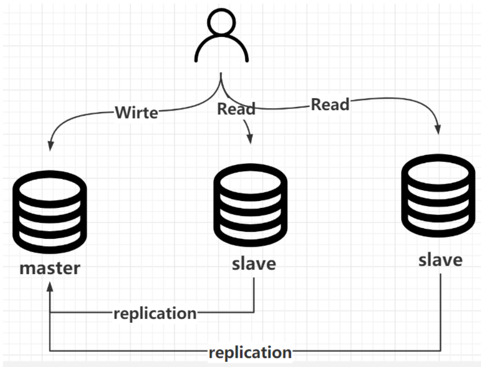
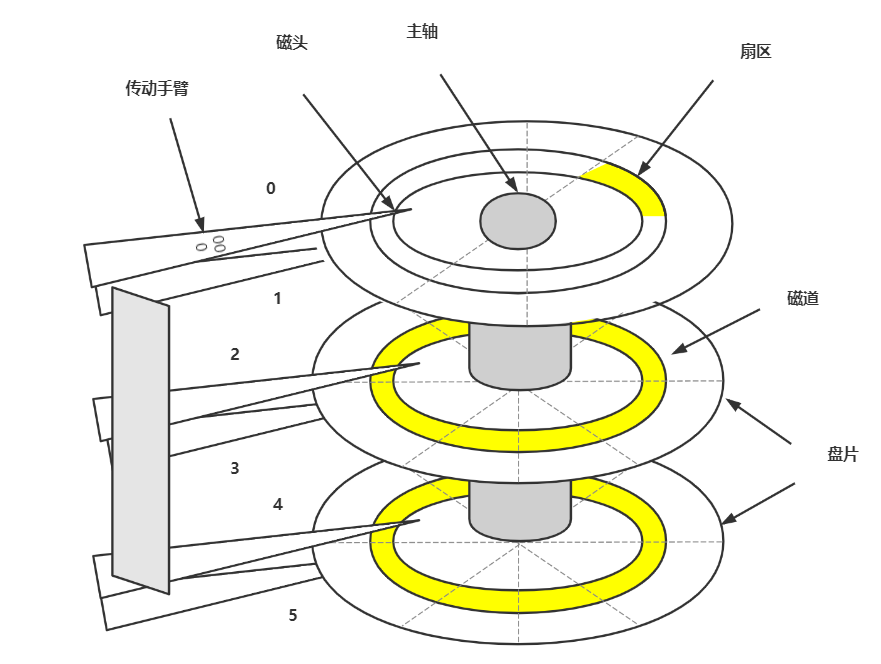

## Mysql

## 1.Mysql的体系结构是什么样子的（一条查询语句它到底是怎么执行的？）


## 2.查询缓存(Query Cache)(不好用,废弃了)

MySQL 内部自带了一个缓存模块。默认是关闭的。主要是因为 MySQL 自带的缓存的应用场景有限，第一个是它要求 SQL 语句必须一模一样。第二个是表里面任何一条数据发生变化的时候，这张表所有缓存都会失效。

在 MySQL 5.8 中，查询缓存已经被移除了。

## 3.语法解析和预处理(Parser & Preprocessor)

下一步我们要做什么呢？

假如随便执行一个字符串 fkdljasklf ，服务器报了一个 1064 的错：

```
[Err] 1064 - You have an error in your SQL syntax; check the manual that corresponds to your MySQL server version for the right syntax to use near 'fkdljasklf' at line 1
```

服务器是怎么知道我输入的内容是错误的？

或者，当我输入了一个语法完全正确的 SQL，但是表名不存在，它是怎么发现的？

这个就是 MySQL 的 Parser 解析器和 Preprocessor 预处理模块。

这一步主要做的事情是对 SQL 语句进行词法和语法分析和语义的解析。

#### **词法解析**

词法分析就是把一个完整的 SQL 语句打碎成一个个的单词。

比如一个简单的 SQL 语句：

select name from user where id = 1;

它会打碎成 8 个符号，记录每个符号是什么类型，从哪里开始到哪里结束。

#### **语法解析**

第二步就是语法分析，语法分析会对 SQL 做一些语法检查，比如单引号有没有闭合，然后根据 MySQL

定义的语法规则，根据 SQL 语句生成一个数据结构。这个数据结构我们把它叫做解析树。


#### **预处理器（Preprocessor）**

如果表名错误，会在预处理器处理时报错。

它会检查生成的解析树，解决解析器无法解析的语义。比如，它会检查表和列名是否存在，检查名字和别名，保证没有歧义。

## 4.查询优化（Query Optimizer）与查询执行计划

### **什么优化器？**

问题：一条 SQL 语句是不是只有一种执行方式？或者说数据库最终执行的 SQL 是不是就是我们发送 的 SQL？

这个答案是否定的。一条 SQL 语句是可以有很多种执行方式的。但是如果有这么多种执行方式，这些执行方式怎么得到的？最终选择哪一种去执行？根据什么判断标准去选择？

这个就是 MySQL 的查询优化器的模块（Optimizer）。

查询优化器的目的就是根据解析树生成不同的**执行计划**，然后选择一种最优的执行计划，MySQL 里面使用的是基于开销（cost）的优化器，那种执行计划开销最小，就用哪种。

```
使用如下命令查看查询的开销：
    show status like 'Last_query_cost'; 
    --代表需要随机读取几个 4K 的数据页才能完成查找。 
```

如果我们想知道优化器是怎么工作的，它生成了几种执行计划，每种执行计划的 cost 是多少，应该怎么做？

### **优化器是怎么得到执行计划的？**

[https://dev.mysql.com/doc/internals/en/optimizer-tracing.html](https://dev.mysql.com/doc/internals/en/optimizer-tracing.html)

首先我们要启用优化器的追踪（默认是关闭的）：

```
SHOW VARIABLES LIKE 'optimizer_trace'; 

set optimizer_trace="enabled=on"; 
```

注意开启这开关是会消耗性能的，因为它要把优化分析的结果写到表里面，所以不要轻易开启，或者查看完之后关闭它（改成 off）。

接着我们执行一个 SQL 语句，优化器会生成执行计划：

```
select t.tcid from teacher t,teacher_contact tc where t.tcid = tc.tcid; 
```

这个时候优化器分析的过程已经记录到系统表里面了，我们可以查询：

```
select * from information_schema.optimizer_trace\G 
```

expanded_query 是优化后的 SQL 语句。

```
considered_execution_plans 里面列出了所有的执行计划。 
```

记得关掉它：

```
        set optimizer_trace="enabled=off"; 

•       SHOW VARIABLES LIKE 'optimizer_trace'; 
```

### **优化器可以做什么？**

MySQL 的优化器能处理哪些优化类型呢？

比如：

```
1、当我们对多张表进行关联查询的时候，以哪个表的数据作为基准表。 

2、select * from user where a=1 and b=2 and c=3，如果 c=3 的结果有 100 条，b=2 的结果有 200 条，		a=1 的结果有 300 条，你觉得会先执行哪个过滤？ 

3、如果条件里面存在一些恒等或者恒不等的等式，是不是可以移除。 

4、查询数据，是不是能直接从索引里面取到值。 

5、count()、min()、max()，比如是不是能从索引里面直接取到值。 

6、其他。
```

### **优化器得到的结果**

优化器最终会把解析树变成一个查询执行计划，查询执行计划是一个数据结构。

当然，这个执行计划是不是一定是最优的执行计划呢？不一定，因为 MySQL 也有可能覆盖不到所有的执行计划。

MySQL 提供了一个执行计划的工具。我们在 SQL 语句前面加上 EXPLAIN，就可以看到执行计划的信息。

```
EXPLAIN select name from user where id=1; 
```

## 5.一条更新语句要经历那些流程

请问索引会对更新语句生效吗？？？    更新语句的流程是包含了查询语句的流程的  


### Bin log是什么，有什么用？（数据库被人干掉了怎么办？）

1.bin Log:     数据恢复   主从复制

MySQL Server 层也有一个日志文件，叫做 binlog，它可以被所有的存储引擎使用。

```
bin log 以事件的形式记录了所有的 DDL 和 DML 语句（因为它记录的是操作而不是数据值，属于逻辑日志），可以用来做主从复制和数据恢复。

凌晨1点钟全量备份   程序员  1点---9点钟      10点钟    数据文件全部删掉了   恢复1点钟   恢复到9点钟   
```




数据恢复：区别于Redo Log的崩溃恢复，数据恢复是基于业务数据的，比如删库跑路，而崩溃恢复是断电重启的

## 6.**什么是预读？**

磁盘读写，并不是按需读取，而是按页读取，一次至少读一页数据（操作系统一般是4K）但是Mysql的数据页是16K，如果未来要读取的数据就在页中，就能够省去后续的磁盘IO，提高效率。


## 7.Buffer Poll

### 什么是Buffer  Pool？   性能优化的一个点

Buffer Pool（缓冲区、缓冲池）是MySQL主存中的一个区域。InnoDB在访问表数据时，会将数据从磁盘中拉取到Buffer Pool。而这个数据明面上就是多行数据，其实就是以页(16KB)的形式存在的。他的目的就是为了加快查询和写入的速度。基于官方文档，可以看到，MySQL一般占用服务器的80%左右的内存。

MySQL可以利用缓冲池实现优化的一个点。

缓存表数据与索引数据，把磁盘上的数据加载到缓冲池，避免每次访问都进行磁盘IO，起到加速访问的作用。


### Buffer Pool的内存淘汰策略

Buffer Pool毕竟是存在在内存里面的，内存空间有限，所以无法将所有数据都扔进来，需要提供一些机制实现内存淘汰的策略。

存储结构是将整个Buffer Pool分为了两大块区域。

* New SubList：占用Buffer Pool的5/8的大小
* Old SubList：占用Buffer Pool的3/8的大小

内部的数据都是页，页直接是基于 **链表连接** 的。

其次关于数据写入和淘汰的策略其实也很简单，他使用的机制是 **LRU** （最近最少使用的就被干掉！）

当需要将从磁盘中获取的页存储到Buffer Pool时，会先将这个页的数据存放到Old SubList的head位置。

当某个页的数据被操作（读写）了，就会放到New SubList的head位置。

如果某个页没有被操作（读写），慢慢的就会被放到Old SubList的tail位置。

当我需要再次将一个新的页，存放到Buffer Pool时，如果空间不足，会将Old SubList的tail位置的页淘汰掉


**数据页第一次加载进来，放在LRU链表的什么地方？**

放在冷数据区域的头部

**冷数据区域的缓存页什么时候放入热数据区域？**

MySQL设定了一个规则，在 innodb_old_blocks_time 参数中，默认值为1000，也就是1000毫秒。

意味着，只有把数据页加载进缓存里，在经过1s之后再次对此缓存页进行访问才会将缓存页放到LRU链表热数据区域的头部。

**为什么是1秒？**

因为通过预读机制和全表扫描加载进来的数据页通常是1秒内就加载了很多，然后对他们访问一下，这些都是1秒内完成，他们会存放在冷数据区域等待刷盘清空，基本上不太会有机会放入到热数据区域，除非在1秒后还有人访问，说明后续可能还会有人访问，才会放入热数据区域的头部。

### Redo Log跟Buffer Pool的关系

崩溃恢复  基本保障   系统自动做的

> InnoDB 引入了一个日志文件，叫做 redo log（重做日志），我们把所有对内存数据的修改操作写入日志文件，如果服务器出问题了，我们就从这个日志文件里面读取数据，恢复数据——用它来实现事务的持久性。
>
> redo log 有什么特点？
>
> 1.记录修改后的值，属于物理日志
>
> 2.redo log 的大小是固定的，前面的内容会被覆盖，所以不能用于数据回滚/数据恢复。
>
> 3.redo log 是 InnoDB 存储引擎实现的，并不是所有存储引擎都有。


### Buffer Pool的线程问题？

Buffer Pool是整个MySQL在InnoDB中的一个共享的内存区域，多个线程在和MySQL交互时，都会操作这个Buffer Pool的结构，会出现多线程操作临界资源（共享东西~），可能会有线程安全问题。

因为每次操作Buffer Pool中的页时，都需要将页的位置做一些移动，如果多个线程同时移动，可能会导致指针出问题。

即便这种内存动指针的操作贼快，甚至可能就是毫秒甚至是微秒级别的，但是依然存在问题。

所以线程在操作Buffer Pool时，需要基于锁的形式，拿到锁之后，才能去动Buffer Pool中的页……

So，**Buffer Pool其实是可以支持多实例的**。MySQL支持的。

MySQL中可以基于参数 `innodb_buffer_pool_instances` 去设置Buffer Pool实例的个数，默认是一个，最大可以设置为64个。并且多Buffer Pool实例需要至少给Buffer Pool设置1G的空闲才会生效。


他是将数据基于hash的形式，分散到不同的Buffer Pool实例中。多个Buffer Pool的数据是不同的！！

## 8.为什么Mysql要使用B+树做为索引     B树

1. B+树能显著减少IO次数，提高效率
2. B+树的查询效率更加稳定，因为数据放在叶子节点
3. B+树能提高范围查询的效率，因为叶子节点指向下一个叶子节点
4. B+树采取顺序读

## 9.磁盘的顺序读以及随机读有什么区别？（这个在面大厂的时候有可能会让你聊，问法有很多种）



1.盘片

2.磁头

3.主轴

4.集成电路板

磁盘是如何完成单次IO的

单次的IO时间 =   寻道时间 + 旋转延迟 + 传送时间

## 10.什么是Hash索引


## 11.**索引使用原则（索引怎么使用才合理）**

我们容易有一个误区，就是在经常使用的查询条件上都建立索引，索引越多越好，那到底是不是这样呢？ 

### **列的离散（sàn）度**

第一个叫做列的离散度，我们先来看一下列的离散度的公式：

不同值得数量：总行数 越接近1 那么离散度越高，越接近0，离散度越低

```
count(distinct(column_name)) : count(*)，列的全部不同值和所有数据行的比例。数据行数相同的情况下，分子越大，列的离散度就越高。
```

### **联合索引最左匹配**

前面我们说的都是针对单列创建的索引，但有的时候我们的多条件查询的时候，也会建立联合索引，举例：查询成绩的时候必须同时输入身份证和考号。

联合索引在 B+Tree 中是复合的数据结构，它是按照从左到右的顺序来建立搜索树的（name 在左边，phone 在右边）。

从这张图可以看出来，name 是有序的，phone 是无序的。当 name 相等的时候，phone 才是有序的。

这个时候我们使用 where name= 'jim' and phone = '136xx '去查询数据的时候，B+Tree 会优先比较 name 来确定下一步应该搜索的方向，往左还是往右。如果 name相同的时候再比较 phone。但是如果查询条件没有 name，就不知道第一步应该查哪个节点，因为建立搜索树的时候 name 是第一个比较因子，所以用不到索引。

### **如何创建联合索引**

有一天我们的 DBA 找到我，说我们的项目里面有两个查询很慢，按照我们的想法，一个查询创建一个索引，所以我们针对这两条 SQL 创建了两个索引，这种做法觉得正确吗？

```
CREATE INDEX idx_name on user_innodb(name); 
CREATE INDEX idx_name_phone on user_innodb(name,phone);
```

当我们创建一个联合索引的时候，按照最左匹配原则，用左边的字段 name 去查询的时候，也能用到索引，所以第一个索引完全没必要。

相当于建立了两个联合索引(name),(name,phone)。

```
如果我们创建三个字段的索引 index(a,b,c)，相当于创建三个索引：

index(a) 

index(a,b) 

index(a,b,c) 

用 where b=? 和 where b=? and c=? 是不能使用到索引的。

这里就是 MySQL 里面联合索引的最左匹配原则。 
```

### **覆盖索引与回表**

什么叫回表：   不需要回表  叫覆盖索引

聚集索引 ：id

二级索引  ：name


非主键索引，我们先通过索引找到主键索引的键值，再通过主键值查出索引里面没

有的数据，它比基于主键索引的查询多扫描了一棵索引树，这个过程就叫回表。

在辅助索引里面，不管是单列索引还是联合索引，如果 select 的数据列只用从索引中就能够取得，不必从数据区中读取，这时候使用的索引就叫做覆盖索引，这样就避免了回表。

Extra 里面值为“Using index”代表使用了覆盖索引。

## **12.** **索引的创建与使用**

因为索引对于改善查询性能的作用是巨大的，所以我们的目标是尽量使用索引。

### **在什么字段上索引？**

1、在用于 where 判断 order 排序和 join 的（on）字段上创建索引

2、索引的个数不要过多。

——浪费空间，更新变慢。

3、区分度低的字段，例如性别，不要建索引。

——离散度太低，导致扫描行数过多。

4、频繁更新的值，不要作为主键或者索引。

——页分裂

5、随机无序的值，不建议作为主键索引，例如身份证、UUID。

——无序，分裂

6、创建复合索引，而不是修改单列索引

### **什么时候索引失效？**

1、索引列上使用函数（replace\SUBSTR\CONCAT\sum count avg）、表达式

2、字符串不加引号，出现隐式转换

3、like 条件中前面带%

4、负向查询   NOT LIKE 不能

**## MyiSAM与Innodb**

myi     index

myd     data


我们表内的数据是按照聚集索引的顺序排列的


## 13.事务的四大特性

A账户   10000    -2000   8000+2000=10000    8000+2000   写入buffer  Pool（内存缓冲池）  Redo  Log 环形日志   磁盘

B账户   5000   +2000    7000

### **原子性（Atomicity）**

也就是我们刚才说的不可再分，也就意味着我们对数据库的一系列的操作，要么都是成功，要么都是失败，不可能出现部分成功或者部分失败的情况，以刚才提到的转账的场景为例，一个账户的余额减少，对应一个账户的增加，这两个一定是同时成功或者同时失败的。全部成功比较简单，问题是如果前面一个操作已经成功了，后面的操作失败了，怎么让它全部失败呢？这个时候我们必须要回滚。

原子性，在 InnoDB 里面是通过 undo log （回滚日志，撤销日志）来实现的，它记录了数据修改之前的值（逻辑日志），一旦发生异常，就可以用 undo log 来实现回滚操作。

### **一致性（consistent）**

指的是数据库的完整性约束没有被破坏，事务执行的前后都是合法的数据状态。比如主键必须是唯一的，字段长度符合要求。

除了数据库自身的完整性约束，还有一个是用户自定义的完整性。

**举例：**

1.比如说转账的这个场景，A 账户余额减少 1000，B 账户余额只增加了 500，这个时候因为两个操作都成功了，按照我们对原子性的定义，它是满足原子性的， 但是它没有满足一致性，因为它导致了会计科目的不平衡。

2.还有一种情况，A 账户余额为 0，如果这个时候转账成功了，A 账户的余额会变成-1000，虽然它满足了原子性的，但是我们知道，借记卡的余额是不能够小于 0 的，所以也违反了一致性。用户自定义的完整性通常要在代码中控制。

### **隔离性（isolation）**

有了事务的定义以后，在数据库里面会有很多的事务同时去操作我们的同一张表或者同一行数据，必然会产生一些并发或者干扰的操作，对隔离性就是这些很多个的事务，对表或者 行的并发操作，应该是透明的，互相不干扰的。通过这种方式，我们最终也是保证业务数据的一致性。

### **持久性（Durable）**

我们对数据库的任意的操作，增删改，只要事务提交成功，那么结果就是永久性的，不可能因为我们重启了数据库的服务器，它又恢复到原来的状态了。     Redo   Log   二阶段提交的

持久性怎么实现呢？数据库崩溃恢复（crash-safe）是通过什么实现的？持久性是通过 redo log 来实现的，我们操作数据的时候，会先写到内存的 buffer pool 里面，同时记录 redo log，如果在刷盘之前出现异常，在重启后就可以读取 redo log的内容，写入到磁盘，保证数据的持久性。

总结：原子性，隔离性，持久性，最后都是为了实现一致性

## 14.事务并发会带来什么问题？

当很多事务并发地去操作数据库的表或者行的时候，如果没有我们刚才讲的事务的Isolation 隔离性的时候，会带来哪些问题呢？

### **脏读**


大家看一下，我们有两个事务，一个是 Transaction A，一个是 Transaction B，在第一个事务里面，它首先通过一个 where id=1 的条件查询一条数据，返回 name=Ada，age=16 的这条数据。然后第二个事务呢，它同样地是去操作 id=1 的这行数据，它通过一个 update 的语句，把这行 id=1 的数据的 age 改成了 18，但是大家注意，它没有提交。

这个时候，在第一个事务里面，它再次去执行相同的查询操作，发现数据发生了变化，获取到的数据 age 变成了 18。那么，这种在一个事务里面，由于其他的时候修改了数据并且没有提交，而导致了前后两次读取数据不一致的情况，这种事务并发的问题，我们把它定义成脏读。

### **不可重复读**


```
同样是两个事务，第一个事务通过 id=1 查询到了一条数据。然后在第二个事务里面执行了一个 update 操作，这里大家注意一下，执行了 update 以后它通过一个 commit提交了修改。然后第一个事务读取到了其他事务已提交的数据导致前后两次读取数据不一致的情况，就像这里，age 到底是等于 16 还是 18，那么这种事务并发带来的问题，我们把它叫做不可重复读。
```

### **幻读**

```
在第一个事务里面我们执行了一个范围查询，这个时候满足条件的数据只有一条。在第二个事务里面，它插入了一行数据，并且提交了。重点：插入了一行数据。在第一个事务里面再去查询的时候，它发现多了一行数据。
```


```
一个事务前后两次读取数据数据不一致，是由于其他事务插入数据造成的，这种情况我们把它叫做幻读。
```

### **总结：**

不可重复读是修改或者删除，幻读是插入。

无论是脏读，还是不可重复读，还是幻读，它们都是数据库的读一致性的问题，都是在一个事务里面前后两次读取出现了不一致的情况。

## 15.如何解决数据的读一致性问题

两大方案:

### **LBCC**

第一种，既然要保证前后两次读取数据一致，那么读取数据的时候，锁定我要操作的数据，不允许其他的事务修改就行了。这种方案叫做基于锁的并发控制 Lock Based  Concurrency Control（LBCC）。

如果仅仅是基于锁来实现事务隔离，一个事务读取的时候不允许其他时候修改，那就意味着不支持并发的读写操作，而我们的大多数应用都是读多写少的，这样会极大地影响操作数据的效率。

### **MVCC**

https://dev.mysql.com/doc/refman/5.7/en/innodb-multi-versioning.html

另一种解决方案，如果要让一个事务前后两次读取的数据保持一致，那么我们可以在修改数据的时候给它建立一个备份或者叫快照，后面再来读取这个快照就行了。这种方案我们叫做多版本的并发控制 Multi Version Concurrency Control（MVCC）

MVCC 的核心思想是： 我可以查到在我这个事务开始之前已经存在的数据，即使它在后面被修改或者删除了。在我这个事务之后新增的数据，我是查不到的。


通过以上演示我们能看到，通过版本号的控制，无论其他事务是插入、修改、删除，第一个事务查询到的数据都没有变化。

在 InnoDB 中，MVCC 是通过 Undo log 实现的。

Oracle、Postgres 等等其他数据库都有 MVCC 的实现。

需要注意，在 InnoDB 中，MVCC 和锁是协同使用的来实现隔离性的，这两种方案并不是互斥的。

第一大类解决方案是锁，锁又是怎么实现读一致性的呢？

## 16.MVCC

### MVCC为什么不能完全解决幻读

MVCC（多版本并发控制）通过快照读机制实现可重复读隔离级别，但其设计特性决定了无法彻底消除幻读问题，具体表现如下：

#### 1. **快照读与当前读的隔离性差异**‌

* **快照读**‌ （如普通SELECT）基于事务开始时创建的Read View，仅读取历史版本数据，可屏蔽其他事务的插入操作‌。
* **当前读**‌ （如带锁的SELECT FOR UPDATE、INSERT/UPDATE/DELETE操作）直接读取最新提交数据，若其他事务在两次查询之间插入新数据，仍会导致幻读‌。
* **示例**‌ ：事务A首次快照读未命中某条件，事务B插入符合该条件的数据并提交，事务A执行当前读时会读取到新数据，导致幻读‌。

#### 2. **范围查询的边界漏洞**‌

* MVCC对单行数据的版本控制有效，但在 **范围查询**‌ （如 `WHERE id > 100`）场景中，事务无法感知其他事务在查询范围内插入的新行‌。
* **示例**‌ ：事务A查询 `id > 100`的记录（快照读），事务B插入 `id=200`并提交，事务A再次执行相同查询（当前读）会包含新插入的 `id=200`‌。

#### 3. **插入操作无历史版本依赖**‌

* MVCC依赖数据行的版本链回溯历史，但**新插入的行**‌没有历史版本，其他事务的插入操作会绕过MVCC的快照隔离机制‌。
* **示例**‌ ：事务A未开启间隙锁时，事务B插入新行并提交，事务A即使处于RR隔离级别，仍可能通过当前读感知到新行‌。

#### 4. **隔离级别与锁机制的依赖**‌

* 在MySQL的RR隔离级别下，**间隙锁（Gap Lock）** ‌才是彻底解决幻读的关键，而非MVCC本身。MVCC仅通过快照读减少锁冲突，但无法阻止其他事务插入新数据‌。
* **示例**‌：若事务A未对查询范围加间隙锁，事务B仍可插入新数据，导致事务A后续操作出现幻读‌。

10    20     30    40

**出现幻读的案例：**

#### **案例一：快照读与当前读混合引发的幻读**‌

**场景复现**‌

1. **事务A（可重复读隔离级别）** ‌
   * **T1**‌ ：执行快照读 `SELECT * FROM book WHERE id > 100` → 结果为空（基于事务开始时的Read View）‌。
   * **T2**‌：事务B插入一条 `id=200` 的数据并提交。
   * **T3**‌ ：事务A执行当前读 `SELECT * FROM book WHERE id > 100 FOR UPDATE` → 结果包含 `id=200`（直接读取最新提交数据）‌。

**结论**‌

* MVCC通过快照读屏蔽了事务B插入的新数据（T1结果为空），但当前读（如 `FOR UPDATE`）会绕过MVCC，直接读取最新数据，导致事务A感知到新插入的 `id=200`，产生幻读‌。

---

#### **案例二：无间隙锁保护的范围查询**‌

**场景复现**‌

1. **事务A（可重复读隔离级别）** ‌
   * **T1**‌ ：快照读 `SELECT * FROM book WHERE id BETWEEN 100 AND 300` → 结果为空。
   * **T2**‌ ：事务B插入 `id=150` 并提交。
   * **T3**‌ ：事务A执行更新操作 `UPDATE book SET name='test' WHERE id BETWEEN 100 AND 300` → 更新语句触发当前读，实际修改了事务B插入的 `id=150`‌。

=‌**结论**‌=

* MVCC在快照读时未感知新插入的 `id=150`，但事务A后续的更新操作（当前读）会操作新数据，导致逻辑冲突。若事务A未对查询范围加间隙锁，MVCC无法阻止新数据的插入‌。

---

#### **案例三：插入操作绕过MVCC版本链**‌

**场景复现**‌

1. **事务A（可重复读隔离级别）** ‌
   * **T1**‌ ：快照读 `SELECT * FROM book WHERE name='java'` → 结果为空。
   * **T2**‌ ：事务B插入 `name='java'` 的新记录并提交。
   * **T3**‌ ：事务A执行插入操作 `INSERT INTO book (name) VALUES ('java')` → 触发主键冲突（因事务B已插入相同数据）‌。

**结论**‌

* MVCC的快照读未感知事务B的插入操作，但事务A的插入操作需校验唯一约束（如主键），此时直接读取最新数据，发现冲突。新插入数据无历史版本，MVCC无法通过版本链回溯规避此问题‌。

结论：

MVCC通过快照读解决了不可重复读和部分幻读问题，但**无法完全消除幻读的根本原因**‌在于：

1. **当前读与快照读的混合使用**‌导致数据可见性差异‌；
2. **新插入数据无历史版本**‌ ，直接绕过MVCC隔离机制‌；
3. **范围查询的天然漏洞**‌=需依赖锁机制（如间隙锁）弥补‌。

实际生产中，需结合 **间隙锁+MVCC**‌=（如MySQL RR隔离级别）或提升至**串行化隔离级别**‌ ，才能完全规避幻读‌

## 17.如何分析执行计划

[https://dev.mysql.com/doc/refman/5.7/en/explain-output.html](https://dev.mysql.com/doc/refman/5.7/en/explain-output.html)

我们先创建三张表。一张课程表，一张老师表，一张老师联系方式表（没有任何索引）。

我们先创建三张表。一张课程表，一张老师表，一张老师联系方式表（没有任何索引）。

```sql
DROP TABLE
IF
	EXISTS course;

CREATE TABLE `course` ( `cid` INT ( 3 ) DEFAULT NULL, `cname` VARCHAR ( 20 ) DEFAULT NULL, `tid` INT ( 3 ) DEFAULT NULL ) ENGINE = INNODB DEFAULT CHARSET = utf8mb4;

DROP TABLE
IF
	EXISTS teacher;

CREATE TABLE `teacher` ( `tid` INT ( 3 ) DEFAULT NULL, `tname` VARCHAR ( 20 ) DEFAULT NULL, `tcid` INT ( 3 ) DEFAULT NULL ) ENGINE = INNODB DEFAULT CHARSET = utf8mb4;

DROP TABLE
IF
	EXISTS teacher_contact;

CREATE TABLE `teacher_contact` ( `tcid` INT ( 3 ) DEFAULT NULL, `phone` VARCHAR ( 200 ) DEFAULT NULL ) ENGINE = INNODB DEFAULT CHARSET = utf8mb4;

INSERT INTO `course`
VALUES
	( '1', 'mysql', '1' );

INSERT INTO `course`
VALUES
	( '2', 'jvm', '1' );

INSERT INTO `course`
VALUES
	( '3', 'juc', '2' );

INSERT INTO `course`
VALUES
	( '4', 'spring', '3' );

INSERT INTO `teacher`
VALUES
	( '1', 'bobo', '1' );

INSERT INTO `teacher`
VALUES
	( '2', '老严', '2' );

INSERT INTO `teacher`
VALUES
	( '3', 'dahai', '3' );

INSERT INTO `teacher_contact`
VALUES
	( '1', '13688888888' );

INSERT INTO `teacher_contact`
VALUES
	( '2', '18166669999' );

INSERT INTO `teacher_contact`
VALUES
	( '3', '17722225555' );
```

```
explain 的结果有很多的字段，我们详细地分析一下。
```

```
先确认一下环境：
```

```sql
select version(); 
show variables like '%engine%';
```

##### **4.3.1** **id**

```
id 是查询序列编号。
```

**id 值不同**

```
id 值不同的时候，先查询 id 值大的（先大后小）。
```

```sql
-- 查询 mysql 课程的老师手机号
EXPLAIN SELECT
	tc.phone 
FROM
	teacher_contact tc 
WHERE
	tcid = ( SELECT tcid FROM teacher t WHERE t.tid = ( SELECT c.tid FROM course c WHERE c.cname = 'mysql' ) );
```

```
查询顺序：course c——teacher t——teacher_contact tc。
```


```
先查课程表，再查老师表，最后查老师联系方式表。子查询只能以这种方式进行，只有拿到内层的结果之后才能进行外层的查询。
```

**id 值相同（从上往下）**

```sql
-- 查询课程 ID 为 2，或者联系表 ID 为 3 的老师 
EXPLAIN SELECT
	t.tname,
	c.cname,
	tc.phone 
FROM
	teacher t,
	course c,
	teacher_contact tc 
WHERE
	t.tid = c.tid 
	AND t.tcid = tc.tcid 
	AND ( c.cid = 2 OR tc.tcid = 3 );
```


```
id 值相同时，表的查询顺序是
```

**从上往下**顺序执行。例如这次查询的 id 都是 1，查询的顺序是 teacher t（3 条）——course c（4 条）——teacher_contact tc（3 条）。

**既有相同也有不同**

```
如果 ID 有相同也有不同，就是 ID 不同的先大后小，ID 相同的从上往下。
```

##### **4.3.2** **select type** **查询类型**

```
这里并没有列举全部（其它：DEPENDENT UNION、DEPENDENT SUBQUERY、MATERIALIZED、UNCACHEABLE SUBQUERY、UNCACHEABLE UNION）。
```

```
下面列举了一些常见的查询类型：
```

**SIMPLE**

```
简单查询，不包含子查询，不包含关联查询 union。
```

```sql
EXPLAIN SELECT * FROM teacher;
```


再看一个包含子查询的案例：

```sql
-- 查询 mysql 课程的老师手机号 
EXPLAIN SELECT
	tc.phone 
FROM
	teacher_contact tc 
WHERE
	tcid = ( SELECT tcid FROM teacher t WHERE t.tid = ( SELECT c.tid FROM course c WHERE c.cname = 'mysql' ) );
```


**PRIMARY**

```
子查询 SQL 语句中的主查询，也就是最外面的那层查询。
```

**SUBQUERY**

```
子查询中所有的内层查询都是 SUBQUERY 类型的。
```

**DERIVED**

```
衍生查询，表示在得到最终查询结果之前会用到临时表。例如：
```

```sql
-- 查询 ID 为 1 或 2 的老师教授的课程
EXPLAIN SELECT
	cr.cname 
FROM
	( SELECT * FROM course WHERE tid = 1 UNION SELECT * FROM course WHERE tid = 2 ) cr;
```


```
对于关联查询，先执行右边的 table（UNION），再执行左边的 table，类型是DERIVED
```

**UNION**

```
用到了 UNION 查询。同上例。
```

**UNION RESULT**

```
主要是显示哪些表之间存在 UNION 查询。<union2,3>代表 id=2 和 id=3 的查询存在 UNION。同上例。
```

##### **4.3.3** **type** **连接类型**

https://dev.mysql.com/doc/refman/5.7/en/explain-output.html#explain-join-types

```
所有的连接类型中，上面的最好，越往下越差。
```

```
在常用的链接类型中：system > const > eq_ref > ref > range > index > all
```

```
这 里 并 没 有 列 举 全 部 （ 其 他 ： fulltext 、 ref_or_null 、 index_merger 、unique_subquery、index_subquery）。
```

以上访问类型除了 all，都能用到索引。

**const**

```
主键索引或者唯一索引，只能查到一条数据的 SQL。
```

```sql
DROP TABLE
IF
	EXISTS single_data;
CREATE TABLE single_data ( id INT ( 3 ) PRIMARY KEY, content VARCHAR ( 20 ) );
INSERT INTO single_data
VALUES
	( 1, 'a' );
EXPLAIN SELECT
	* 
FROM
	single_data a 
WHERE
	id = 1;
```

**system**

```
system 是 const 的一种特例，只有一行满足条件。例如：只有一条数据的系统表。
```

```sql
EXPLAIN SELECT * FROM mysql.proxies_priv;
```


**eq_ref**

```
通常出现在多表的 join 查询，表示对于前表的每一个结果,，都只能匹配到后表的一行结果。一般是唯一性索引的查询（UNIQUE 或 PRIMARY KEY）。
```

```
eq_ref 是除 const 之外最好的访问类型。
```

```
先删除 teacher 表中多余的数据，teacher_contact 有 3 条数据，teacher 表有 3条数据。
```

```sql
DELETE 
FROM
	teacher 
WHERE
	tid IN ( 4, 5, 6 );
COMMIT;
-- 备份
INSERT INTO `teacher`
VALUES
	( 4, '老严', 4 );
INSERT INTO `teacher`
VALUES
	( 5, 'bobo', 5 );
INSERT INTO `teacher`
VALUES
	( 6, 'seven', 6 );
COMMIT;
```

```
为 teacher_contact 表的 tcid（第一个字段）创建主键索引。
```

```sql
-- ALTER TABLE teacher_contact DROP PRIMARY KEY; 
ALTER TABLE teacher_contact ADD PRIMARY KEY(tcid);
```

```
为 teacher 表的 tcid（第三个字段）创建普通索引。
```

```sql
-- ALTER TABLE teacher DROP INDEX idx_tcid;
ALTER TABLE teacher ADD INDEX idx_tcid (tcid);
```

```
执行以下 SQL 语句：
```

```sql
select t.tcid from teacher t,teacher_contact tc where t.tcid = tc.tcid;
```


```
此时的执行计划（teacher_contact 表是 eq_ref）：
```


**小结：**

以上三种 system，const，eq_ref，都是可遇而不可求的，基本上很难优化到这个状态。

**ref**

```
查询用到了非唯一性索引，或者关联操作只使用了索引的最左前缀。
```

```
例如：使用 tcid 上的普通索引查询：
```

```sql
explain SELECT * FROM teacher where tcid = 3;
```


**range**

```
索引范围扫描。
```

```
如果 where 后面是 between and 或 <或 > 或 >= 或 <=或 in 这些，type 类型就为 range。
```

```
不走索引一定是全表扫描（ALL），所以先加上普通索引。
```

```sql
-- ALTER TABLE teacher DROP INDEX idx_tid; 
ALTER TABLE teacher ADD INDEX idx_tid (tid);
```

```
执行范围查询（字段上有普通索引）：
```

```sql
EXPLAIN SELECT * FROM teacher t WHERE t.tid <3; 
-- 或
EXPLAIN SELECT * FROM teacher t WHERE tid BETWEEN 1 AND 2;
```


```
IN 查询也是 range（字段有主键索引）
```

```sql
EXPLAIN SELECT * FROM teacher_contact t WHERE tcid in (1,2,3);
```


**index**

```
Full Index Scan，查询全部索引中的数据（比不走索引要快）。
```

```sql
EXPLAIN SELECT tid FROM teacher;
```


**all**

```
Full Table Scan，如果没有索引或者没有用到索引，type 就是 ALL。代表全表扫描。
```

**小结：**

```
一般来说，需要保证查询至少达到 range 级别，最好能达到 ref。
```

```
ALL（全表扫描）和 index（查询全部索引）都是需要优化的。
```

##### **4.3.4** **possible_key、key**

```
可能用到的索引和实际用到的索引。如果是 NULL 就代表没有用到索引。
```

```
possible_key 可以有一个或者多个，可能用到索引不代表一定用到索引。
```

```
反过来，possible_key 为空，key 可能有值吗？
```

```
表上创建联合索引：
```

```sql
ALTER TABLE user_innodb DROP INDEX comidx_name_phone; 
ALTER TABLE user_innodb add INDEX comidx_name_phone (name,phone);
```

```
执行计划（改成 select name 也能用到索引）：
```

```sql
explain select phone from user_innodb where phone='126';
```


```
结论：是有可能的（这里是覆盖索引的情况）。
```

```
如果通过分析发现没有用到索引，就要检查 SQL 或者创建索引。
```

##### **4.3.5** **key_len**

```
索引的长度（使用的字节数）。跟索引字段的类型、长度有关。
```

```
表上有联合索引：KEY
```

`comidx_name_phone` (`name`,`phone`)

```sql
explain select * from user_innodb where name ='jim';
```

##### **4.3.6** **rows**

```
MySQL 认为扫描多少行才能返回请求的数据，是一个预估值。一般来说行数越少越好。
```

##### **4.3.7** **filtered**

```
这个字段表示存储引擎返回的数据在 server 层过滤后，剩下多少满足查询的记录数量的比例，它是一个百分比。
```

##### **4.3.8** **ref**

```
使用哪个列或者常数和索引一起从表中筛选数据。
```

##### **4.3.9** **Extra**

```
执行计划给出的额外的信息说明。
```

**using index**

```
用到了覆盖索引，不需要回表。
```

```sql
EXPLAIN SELECT tid FROM teacher ;
```

**using where**

```
使用了 where 过滤，表示存储引擎返回的记录并不是所有的都满足查询条件，需要在 server 层进行过滤（跟是否使用索引没有关系）。
```

```sql
EXPLAIN select * from user_innodb where phone ='13866667777';
```


**using filesort**

```
不能使用索引来排序，用到了额外的排序（跟磁盘或文件没有关系）。需要优化。（复合索引的前提）
```

```sql
ALTER TABLE user_innodb DROP INDEX comidx_name_phone; 
ALTER TABLE user_innodb add INDEX comidx_name_phone (name,phone);
```

```sql
EXPLAIN select * from user_innodb where name ='jim' order by id;
```

```
（order by id 引起）
```


**using temporary**

```
用到了临时表。例如（以下不是全部的情况）：
```

```
1、distinct 非索引列
```

```sql
EXPLAIN select DISTINCT(tid) from teacher t;
```

```
2、group by 非索引列
```

```sql
EXPLAIN select tname from teacher group by tname;
```

```
3、使用 join 的时候，group 任意列
```

```sql
EXPLAIN select t.tid from teacher t join course c on t.tid = c.tid group by t.tid;
```

```
需要优化，例如创建复合索引。
```

总结一下：

模拟优化器执行 SQL 查询语句的过程，来知道 MySQL 是怎么处理一条 SQL 语句的。通过这种方式我们可以分析语句或者表的性能瓶颈。

分析出问题之后，就是对 SQL 语句的具体优化。

## 18.数据库死锁怎么办，你会怎么处理？

数据库死锁是多个事务因互相等待对方释放资源而无法继续执行的阻塞现象。以下是常见死锁场景及处理方案：

---

### **一、常见死锁场景**

1. **交叉资源访问顺序**
   * **场景** ：事务A先锁资源X，再请求资源Y；事务B先锁资源Y，再请求资源X。
   * **原因** ：事务对资源的加锁顺序不一致。
2. **长事务占用资源**
   * **场景** ：事务A长时间持有锁未提交，事务B等待该锁时自身持有的锁也被其他事务等待。
   * **原因** ：未及时提交/回滚事务，导致锁长期占用。
3. **批量操作锁升级**
   * **场景** ：批量更新/删除未走索引，导致行锁升级为表锁，阻塞其他事务。
   * **原因** ：索引缺失或SQL优化不足，引发全表扫描。
4. **间隙锁（Gap Lock）冲突**
   * **场景** ：事务A锁定某范围的间隙，事务B尝试插入该范围内的数据。
   * **常见于** ：MySQL的 `REPEATABLE READ`隔离级别。

---

### **二、死锁处理方案**

#### **1. 自动处理机制**

* **死锁检测**
  数据库（如InnoDB）自动检测死锁，强制回滚代价较小的事务。

  ```
  SHOW ENGINE INNODB STATUS; -- 查看MySQL死锁日志
  ```

* **锁超时设置**
  设置事务等待锁的超时时间，超时后自动回滚。

  ```
  SET innodb_lock_wait_timeout = 30; -- MySQL设置锁超时时间（秒）
  ```

#### **2. 代码与设计优化**

* **统一资源访问顺序**
  确保所有事务按固定顺序访问资源（如按主键排序更新）。
* **短事务原则**
  减少事务执行时间，尽快提交或回滚，避免长事务占用锁。
* **优化SQL与索引**
  * 为查询条件添加索引，避免全表扫描。
  * 避免批量操作锁大量数据，分批处理。
  * 使用 `SELECT ... FOR UPDATE`时明确指定索引。
* **降低隔离级别**
  使用 `READ COMMITTED`代替 `REPEATABLE READ`，减少间隙锁的使用（需权衡数据一致性）。

#### **3. 程序容错机制**

* **重试策略**
  捕获死锁异常（如MySQL的 `1213`错误码），在代码层重试事务。

  ```
  import org.springframework.retry.annotation.Backoff;
  import org.springframework.retry.annotation.Retryable;
  import org.springframework.stereotype.Service;
  
  @Service
  public class AccountService {
  
      @Retryable(
          value = {DeadlockLoserDataAccessException.class}, 
          maxAttempts = 3, 
          backoff = @Backoff(delay = 1000, multiplier = 2)
      )
      @Transactional
      public void transferWithRetry(int fromId, int toId, BigDecimal amount) {
          // 转账业务逻辑
          jdbcTemplate.update("UPDATE account SET balance = balance - ? WHERE id = ?", amount, fromId);
          jdbcTemplate.update("UPDATE account SET balance = balance + ? WHERE id = ?", amount, toId);
      }
  }
  ```

* **乐观锁**
  通过版本号或时间戳避免显式加锁（适用于冲突较少的场景）。

  ```
  UPDATE table SET col = new_val, version = version + 1 
  WHERE id = 1 AND version = old_version;
  ```

---

### **三、排查工具**

1. **数据库日志**
   * MySQL：`SHOW ENGINE INNODB STATUS`
   * PostgreSQL：`pg_locks`视图 + `deadlock_timeout`参数
2. **监控工具**
   * Prometheus + Grafana监控锁等待。
   * 第三方工具（如Percona Toolkit、pt-deadlock-logger）。

---

### **总结**

预防死锁的核心是规范资源访问顺序、优化事务设计。处理时优先依赖数据库的自动回滚机制，并通过日志分析根因。在代码层添加重试逻辑和监控，可显著降低死锁对业务的影响。


## 21.**MySQL InnoDB** **锁的基本类型**

`官网`：https://dev.mysql.com/doc/refman/5.7/en/innodb-locking.html

### **锁的基本模式——共享锁**

第一个行级别的锁就是我们在官网看到的 Shared Locks （共享锁），我们获取了一行数据的读锁以后，可以用来读取数据，所以它也叫做读锁。而且多个事务可以共享一把读锁。那怎么给一行数据加上读锁呢？

我们可以用 select lock in share mode;的方式手工加上一把读锁。

释放锁有两种方式，只要事务结束，锁就会自动事务，包括提交事务和结束事务。

### **锁的基本模式——排它锁**

第二个行级别的锁叫做 Exclusive Locks（排它锁），它是用来操作数据的，所以又叫做写锁。只要一个事务获取了一行数据的排它锁，其他的事务就不能再获取这一行数据的共享锁和排它锁。

排它锁的加锁方式有两种，第一种是自动加排他锁，可能是同学们没有注意到的：

我们在操作数据的时候，包括增删改，都会默认加上一个排它锁。

还有一种是手工加锁，我们用一个 FOR UPDATE 给一行数据加上一个排它锁，这个无论是在我们的代码里面还是操作数据的工具里面，都比较常用。

### **锁的基本模式——意向锁**

意向锁是由数据库自己维护的。

也就是说，当我们给一行数据加上共享锁之前，会自动在这张表上面加一个意向共享锁。

当我们给一行数据加上排他锁之前，会自动在这张表上面加一个意向排他锁。

反过来说：如果一张表上面至少有一个意向共享锁，说明有其他的事务给其中的某些数据行加上了共享锁。

那么这两个表级别的锁存在的意义是什么呢？第一个，我们有了表级别的锁，在 InnoDB 里面就可以支持更多粒度的锁。它的第二个作用，我们想一下，如果说没有意向锁的话，当我们准备给一张表加上表锁的时候，我们首先要做什么？是不是必须先要去判断有没其他的事务锁定了其中了某些行？如果有的话，肯定不能加上表锁。那么这个时候我们就要去扫描整张表才能确定能不能成功加上一个表锁，如果数据量特别大，比如有上千万的数据的时候，加表锁的效率是不是很低？

但是我们引入了意向锁之后就不一样了。我只要判断这张表上面有没有意向锁，如果有，就直接返回失败。如果没有，就可以加锁成功。所以 InnoDB 里面的表锁，我们可以把它理解成一个标志。就像火车上厕所有没有人使用的灯，是用来提高加锁的效率的。


mysql面试的时候怎么去聊       1天基本的原理     案例    原理  

mysql性能优化      中间件     标准    SQL标准  不能执行时间超过1S       业务结合数据库进行的 

延迟关联     游标分页   索引分析    覆盖索引
