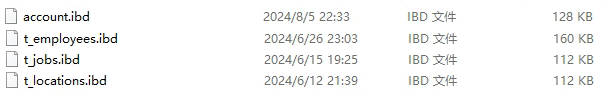

# MySQL2024-下

## MySQL.一

## 一、MySQL中常见数据类型的基本区别

> MySQL中咱们聊常见的数值、字符串、时间类型。
>
> 对于每个类型的数据的大小和一些基本区别先去掌握一下。
>
> **数值类型：**
>
> * 整型：主要分为了5个整型的数据类型。MySQL中的整型常用的这5种，其中根据字节咱们就可以大致对应到Java中的具体类型，其中3byte几乎很少用到。他们的区别就是存储的范围大小不一样，一般在使用数据类型的时候，**如果可以用小的，就用小的**！
> * 
> * 浮点型：MySQL中常见的浮点类型就三，Float，Double， **Decimal**
> *                                     
> * 其中Float和Double可以在图中很直观的看到他俩的区别。其中Float还有一个小细节，如果声明时，长度指定的太长，Float也会占用8字节，当长度25~53之间的时候。其中Decimal他并没有明确的指定他占用的大小，会根据声明时指定的(M,D)来决定大小。 decimal(18,9) [999999999.999999999]。根据官方文档可以看出，decimal中的数值是分别将整数和小数做计算。其中9个位置占4字节，细粒度的看这个表，剩余的位置，按照这个图算。                       
> * ​                                                            
> * 如果现在指定decimal(12,7)，整体的数字有12个长度，整数位5个（3字节），小数位7个（4字节)，一共7个字节。一般推荐使用Decimal，他存储的数值相对更精准一些，而且可以根据你需要的范围大小占用不同的空间。
>
> **字符串类型：**
>
> * **char：** 固定长度的字符串，你指定的长度是固定的占用字节的大小。
>   其中，在官方文档中可以看到，char(M)，需要占用 **M × w个字节**  ，w是你声明的字符集类型，其中常用的是utf8mb4，这哥们就代表w是4字节，如果用utf8mb3，w就代表是3字节。
> * **varchar：** 可变长度的字符串，会根据你输入的内容长度来计算占用空间的字节大小。如果你写入的字符串的实际大小是0~255，那么他额外追加1个字节。如果你写入的字符串空间超过了255个字节，那需要额外追加2个字节。对于占用空间大小，当varchar大小超过了255后，其实Text和varchar没啥区别。从占用空间的维度来说，如果固定这个字段的长度一定会超过255，你有用text也一样。
>
> **时间类型：**
>
> * date：存储年月日
> * datetime：存储年月日 时分秒
> * timestamp：存储年月日 时分秒
>
> 通过官方文档看到了一个细节，MySQL中的时间类型里，time，datetime，timestamp可以存储时间，并且可以精准到秒的后6位，也就是微秒单位。想精准到秒的后几位，是需要额外的空间存储的。
>
> 
>
> 其次，关于这哥三的空间占用大小，可以看这个图。
>
> 5.6.4的版本是一个分界点~fractional seconds storage的意思就是如果你要精确到秒的后几位，他需要额外占用空间，这个是上面聊的。
>
> 
>
> datetime和timestamp的区别：
>
> * 关于存储范围的情况
>   * datetime：用到死，到这 `'1000-01-01 00:00:00.000000' to '9999-12-31 23:59:59.499999'`
>   * timestamp：用到十几年后，`'1970-01-01 00:00:01.000000'` to `'2038-01-19 03:14:07.499999'`
> * 时区的区别
>   * timestamp：你写入的值会从当前时区转换为UTC进行存储，在查询时，会将UTC类型转换为当前系统的时区。
>   * datetime：不会关注时区的问题，你写入什么，他就存储什么，检索也一样。
>
> 默认情况下，每个连接的当前时区是服务器的时间，时间可以根据每个连接去设置，只要你保证时区不变，其实也没啥问题。如果你连接的时区变化了，你存储的是timestamp类型，那你再用别的时区查询这个值时，会发生变化。

## 二、MySQL中InnoDB逻辑存储结构（常识性的概念）

MySQL中的逻辑存储结构如图：

> * 表空间：已经覆盖了咱们所有的数据和索引，比如系统表在系统表空间，还有默认表空间…………
> * 段：多个段，组成表空间……
> * 区：多个区，组成段……一般每个区通常的大小是1MB。
> * **页：默认64个连续的页，组成一个区。每个页的默认大小是16kb。**
> * 行：多行数据都在页里…………
>
> 其次，MySQL每次去磁盘中读取数据到内存时，每次至少会将一个页的数据加载到内存中。
>
> 也就是说，在数据库中，不论是读一行，还是读多行，都需要将一个或多个页的数据加载到内存中（Buffer Pool）。页就是MySQL一次IO读取的最小单位。
>
> 连续的页在针对一些范围查询时，效果更佳。

## 三、MySQL中的物理存储结构

### 3.1、5.7 版本

#### 3.1.1、InnoDB存储引擎

> * 表数据：InnoDB的存储引擎，会将表数据和索引放在一个文件里。就是ibd
> * 表结构：表结构会放在这个frm的文件中
> * 重做日志（redo log）：用于做崩溃恢复的重要日志之一……
>
> 系统元数据：**这个是存储MySQL系统元数据的，和存储引擎无关！！！！**
>
> 

#### 3.1.2、MyISAM存储引擎

> * 表数据：在MyISAM中，数据和索引是分开存放的。其中MYD是存储数据的，MYI是存储索引的。
> * 表结构：和InnoDB一样，读是在frm文件中的
> * **重做日志：redo log是InnoDB特有的，MyISAM没有。。。。。。**
>
> 系统元数据：这个是MySQL服务的，无关存储引擎。

### 3.2、8.0 版本

#### 3.2.1 InnoDB存储引擎

> * 表数据：InnoDB中，数据和索引一样还是存在一个文件中。依然是.ibd文件中。
> * 表结构：在8.0中，frm文件被直接剔除掉了，表结构被直接放到了系统表中。
> * 重做日志：redo log，依然存在，存放在这个位置

#### 3.2.2 MyISAM存储引擎

> * 表数据：和5.7一样，依然是其中MYD是存储数据的，MYI是存储索引的。
> * 表结构：也是放到了系统元数据中，也就是information_schame库里。

#### 3.2.3 为啥砍掉frm文件？

> * MySQL8.0推出了一个原子性的DDL操作。针对个原子操作，可以利用information_schame这个库来操作，来确保表定义信息的一致性和可靠性。
> * 可以基于information_schame库来统一管理表结构信息。
> * 使用了information_schame之后，甚至可以对表结构来做一些加密操作。
> * 备份数据时，不需要再去单独的备份frm文件了，元数据库中就有。
> * ………………

## 四、MySQL常见的存储引擎和区别

MySQL中最常见的自然就是InnoDB。

除此之外就是MyISAM，5.1版本时，那也是默认的存储引擎。。。

主要来聊这两个存储引擎的区别，区别其实特别多……………………

在8.x的InnoDB和MyISAM中，支持的特性区别。

> * 关于聚簇索引的支持，InnoDB支持聚簇索引，MyISAM不支持聚簇索引
> * 关于数据缓存的支持，InnoDB支持数据缓存扔Buffer Pool，MyISAM不支持。
> * 关于外键的支持，InnoDB支持外键，MyISAM不支持外键。
> * 关于Hash索引，InnoDB和MyISAM都不支持。但是InnoDB支持一个AHI的自适应hash索引。
> * 关于锁的支持，InnoDB支持行锁，而MyISAM只支持表锁。
> * 关于MVCC，InnoDB支持，MyISAM不支持。
> * 关于存储容量的限制，InnoDB可以支持到64TB，而MyISAM支持到256TB
> * 关于事务，InnoDB支持，MyISAM不支持。

InnoDB：

MyISAM：

## MySQL.二

## 一、Buffer Pool-在2025中整理了,主要看2025

## 二、Change Buffer

### 2.1 Change Buffer是个啥？

> Change Buffer是针对MySQL中，使用二级索引（非聚簇索引）去写数据时优化的一个策略。是在进行DML操作时的一个优化。
>
> 如果写的是 **非聚簇索引** ，并且对应的 **数据页没有在Buffer Pool** ，此时他不会立即将磁盘中的数据库页加载到Buffer Pool中。而是先将写操作扔到Change Buffer中，做一个缓冲。
>
> 等后面，要修改的这个数据页被读取时，再将Change Buffer中的记录合并到Buffer Pool中。**这样就是为了减少磁盘IO次数，提高性能。**
>
> **一级索引不会触发Change Buffer，一级索引速度快，直接把磁盘数据扔到Buffer Pool中，然后内存修改即可。**
>
> Change Buffer占用的是Buffer Pool的空间，默认占用25%，最大允许到50%。可以根据配置来进行调整。一般25%足够了，除非你的MySQL写多读少，可以适当调大Change Buffer的比例。
>
> 
>
> 二级索引修改整体流程：
>
> * 更新一条记录时，当该记录在Buffer Pool缓冲区中时，直接在Buffer Pool中修改对应的页，一次内存操作。（end）
> * 如果该记录不在Buffer Pool缓冲区中时，在不影响数据一致性的前提下，InnoDB会将这些更新操作缓存在Change Buffer中，不去磁盘做IO操作。。
> * 当下次查询到该记录时，会将这个记录扔到Buffer Pool，然后Change Buffer会将和这个也有关的操作合并，进行修改。
>
> 

### 2.2 数据到ChangeBuffer后，MySQL宕机了咋整？

> 首先要清楚，当一个事务提交时，InnoDB会将事务的所有更改记录写到redo log（重做日志）中，包括哪些写入到Change Buffer中的内容。咱们的保障是基于redo log实现的，即便宕机，redo log也有完整的信息。当前MySQL还会基于bin log利用2PC的形式，确保数据一致性。

## 三、AHI

### 3.1 AHI是个啥？

> AHI（自适应Hash索引，Adaptive Hash Index），他是InnoDB存储特有的。是一个为了优化查询操作的特殊功能。
>
> 当AHI发现某些索引值使用的非常的频繁，建立hash索引来提升查询的效率。
>
> AHI也是存储再Buffer Pool中的，会在Buffer Pool中开辟一片区域，建议这种自适应hash索引。
>
> 而且AHI默认是开启的。
>
> 
>
> 画一个图，掌握这种AHI是啥效果。
>
> 
>
> AHI的一些参数，不需要做任何调整，默认即可。 在生成AHI的自适应Hash索引后，查询效率可以从B+Tree结构的 `O(logn)`  提升到  `O(1)` 的效率。

## 四、Log Buffer

> Log Buffer是存储要写入到磁盘上的日志文件的一片内存区域。主要是redo log。
>
> 默认占用16M的大小。可以用过 `innodb_log_buffer_size`  参数调整。
>
> 他的目的很简单，就是在你做写操作时，尽量减少日志写入磁盘时的IO损耗，减少IO的次数……

## 五、redo log

### 5.1 redo log是个啥？

> redo log（重做日志）是InnoDB独有的。它让MySQL用于了崩溃回复的能力（一般配合bin log）。也就是MySQL宕机后，他可以根据redo log来恢复近期的数据，保证之前还没有写入到磁盘中的数据不会丢失，保证持久性和完整性。
>
> 

### 5.2 redo log如何保证数据的完整。

> 首先，现在知道一个事情，MySQL写操作不会立即将数据落到磁盘上，无论是数据还是日志。
>
> 比如数据，他优先走Change Buffer以及Buffer Pool的内存中，也是MySQL优化的手段，减少IO的消耗。
>
> 所有，为了保证数据的完整和持久性，在修改Change Buffer和Buffer Pool中的数据时，数据会优先落到redo log中。
>
> 写入的流程，如下
>
> 
>
> 我只需要知道第4步的触发时机即可。
>
> **redo log大概存储表空间号 + 数据页号 + 偏移量 + 具体修改的数据………………**
>
> 而Log Buffer中的数据刷到磁盘中，一般主要由这个参数控制
>
> 
>
> 他的默认值是1。他可以提供三种值：
>
> * 0： 设置为0的时候，表示每次事务提交不刷盘……
> * 1： （默认值）设置为1的时候，表示每次事务提交后，会立即进行刷盘操作……
> * 2：设置为2的时候，标识每次事务提交，我需要将Log Buffer中的数据刷到系统内存中……
>
> 就用1，别用别的，别的会导致丢失数据…………
>
> 刷盘的流程大致长这样
>
> 
>
> 下面详细的把，0，1，2的配置的刷盘套路各画一个图。
>
> * 当设置为0的时候，没有任何机制会主动刷新，只能靠后台提供的一个线程，每一秒刷新Log Buffer数据到File Cache
> * 当设置为1的时候，只要提交事务，就一定会确保Log Buffer中的数据，落到File Cache并且，必须序列化到本地磁盘文件
> * 设置为2时，提交事务后，会确保Log Buffer的数据，一定要了File Cache中。
