# MySQL2024-下

## MySQL.一

## 一、MySQL中常见数据类型的基本区别

> MySQL中咱们聊常见的数值、字符串、时间类型。
>
> 对于每个类型的数据的大小和一些基本区别先去掌握一下。
>
> **数值类型：**
>
> * 整型：主要分为了5个整型的数据类型。MySQL中的整型常用的这5种，其中根据字节咱们就可以大致对应到Java中的具体类型，其中3byte几乎很少用到。他们的区别就是存储的范围大小不一样，一般在使用数据类型的时候，**如果可以用小的，就用小的**！
> * 
> * 浮点型：MySQL中常见的浮点类型就三，Float，Double， **Decimal**
> *                                     
> * 其中Float和Double可以在图中很直观的看到他俩的区别。其中Float还有一个小细节，如果声明时，长度指定的太长，Float也会占用8字节，当长度25~53之间的时候。其中Decimal他并没有明确的指定他占用的大小，会根据声明时指定的(M,D)来决定大小。 decimal(18,9) [999999999.999999999]。根据官方文档可以看出，decimal中的数值是分别将整数和小数做计算。其中9个位置占4字节，细粒度的看这个表，剩余的位置，按照这个图算。                       
> * ​                                                            
> * 如果现在指定decimal(12,7)，整体的数字有12个长度，整数位5个（3字节），小数位7个（4字节)，一共7个字节。一般推荐使用Decimal，他存储的数值相对更精准一些，而且可以根据你需要的范围大小占用不同的空间。
>
> **字符串类型：**
>
> * **char：** 固定长度的字符串，你指定的长度是固定的占用字节的大小。
>   其中，在官方文档中可以看到，char(M)，需要占用 **M × w个字节**  ，w是你声明的字符集类型，其中常用的是utf8mb4，这哥们就代表w是4字节，如果用utf8mb3，w就代表是3字节。
> * **varchar：** 可变长度的字符串，会根据你输入的内容长度来计算占用空间的字节大小。如果你写入的字符串的实际大小是0~255，那么他额外追加1个字节。如果你写入的字符串空间超过了255个字节，那需要额外追加2个字节。对于占用空间大小，当varchar大小超过了255后，其实Text和varchar没啥区别。从占用空间的维度来说，如果固定这个字段的长度一定会超过255，你有用text也一样。
>
> **时间类型：**
>
> * date：存储年月日
> * datetime：存储年月日 时分秒
> * timestamp：存储年月日 时分秒
>
> 通过官方文档看到了一个细节，MySQL中的时间类型里，time，datetime，timestamp可以存储时间，并且可以精准到秒的后6位，也就是微秒单位。想精准到秒的后几位，是需要额外的空间存储的。
>
> 
>
> 其次，关于这哥三的空间占用大小，可以看这个图。
>
> 5.6.4的版本是一个分界点~fractional seconds storage的意思就是如果你要精确到秒的后几位，他需要额外占用空间，这个是上面聊的。
>
> 
>
> datetime和timestamp的区别：
>
> * 关于存储范围的情况
>   * datetime：用到死，到这 `'1000-01-01 00:00:00.000000' to '9999-12-31 23:59:59.499999'`
>   * timestamp：用到十几年后，`'1970-01-01 00:00:01.000000'` to `'2038-01-19 03:14:07.499999'`
> * 时区的区别
>   * timestamp：你写入的值会从当前时区转换为UTC进行存储，在查询时，会将UTC类型转换为当前系统的时区。
>   * datetime：不会关注时区的问题，你写入什么，他就存储什么，检索也一样。
>
> 默认情况下，每个连接的当前时区是服务器的时间，时间可以根据每个连接去设置，只要你保证时区不变，其实也没啥问题。如果你连接的时区变化了，你存储的是timestamp类型，那你再用别的时区查询这个值时，会发生变化。

## 二、MySQL中InnoDB逻辑存储结构（常识性的概念）

MySQL中的逻辑存储结构如图：


> * 表空间：已经覆盖了咱们所有的数据和索引，比如系统表在系统表空间，还有默认表空间…………
> * 段：多个段，组成表空间……
> * 区：多个区，组成段……一般每个区通常的大小是1MB。
> * **页：默认64个连续的页，组成一个区。每个页的默认大小是16kb。**
> * 行：多行数据都在页里…………
>
> 其次，MySQL每次去磁盘中读取数据到内存时，每次至少会将一个页的数据加载到内存中。
>
> 也就是说，在数据库中，不论是读一行，还是读多行，都需要将一个或多个页的数据加载到内存中（Buffer Pool）。页就是MySQL一次IO读取的最小单位。
>
> 连续的页在针对一些范围查询时，效果更佳。

## 三、MySQL中的物理存储结构

### 3.1、5.7 版本

#### 3.1.1、InnoDB存储引擎

> * 表数据：InnoDB的存储引擎，会将表数据和索引放在一个文件里。就是ibd
> * 表结构：表结构会放在这个frm的文件中
> * 重做日志（redo log）：用于做崩溃恢复的重要日志之一……
>
> 系统元数据：**这个是存储MySQL系统元数据的，和存储引擎无关！！！！**
>
> 

#### 3.1.2、MyISAM存储引擎

> * 表数据：在MyISAM中，数据和索引是分开存放的。其中MYD是存储数据的，MYI是存储索引的。
> * 表结构：和InnoDB一样，读是在frm文件中的
> * **重做日志：redo log是InnoDB特有的，MyISAM没有。。。。。。**
>
> 系统元数据：这个是MySQL服务的，无关存储引擎。

### 3.2、8.0 版本

#### 3.2.1 InnoDB存储引擎

> * 表数据：InnoDB中，数据和索引一样还是存在一个文件中。依然是.ibd文件中。
> * 表结构：在8.0中，frm文件被直接剔除掉了，表结构被直接放到了系统表中。
> * 重做日志：redo log，依然存在，存放在这个位置

#### 3.2.2 MyISAM存储引擎

> * 表数据：和5.7一样，依然是其中MYD是存储数据的，MYI是存储索引的。
> * 表结构：也是放到了系统元数据中，也就是information_schame库里。

#### 3.2.3 为啥砍掉frm文件？

> * MySQL8.0推出了一个原子性的DDL操作。针对个原子操作，可以利用information_schame这个库来操作，来确保表定义信息的一致性和可靠性。
> * 可以基于information_schame库来统一管理表结构信息。
> * 使用了information_schame之后，甚至可以对表结构来做一些加密操作。
> * 备份数据时，不需要再去单独的备份frm文件了，元数据库中就有。
> * ………………

## 四、MySQL常见的存储引擎和区别

MySQL中最常见的自然就是InnoDB。

除此之外就是MyISAM，5.1版本时，那也是默认的存储引擎。。。

主要来聊这两个存储引擎的区别，区别其实特别多……………………

在8.x的InnoDB和MyISAM中，支持的特性区别。

> * 关于聚簇索引的支持，InnoDB支持聚簇索引，MyISAM不支持聚簇索引
> * 关于数据缓存的支持，InnoDB支持数据缓存扔Buffer Pool，MyISAM不支持。
> * 关于外键的支持，InnoDB支持外键，MyISAM不支持外键。
> * 关于Hash索引，InnoDB和MyISAM都不支持。但是InnoDB支持一个AHI的自适应hash索引。
> * 关于锁的支持，InnoDB支持行锁，而MyISAM只支持表锁。
> * 关于MVCC，InnoDB支持，MyISAM不支持。
> * 关于存储容量的限制，InnoDB可以支持到64TB，而MyISAM支持到256TB
> * 关于事务，InnoDB支持，MyISAM不支持。

InnoDB：


MyISAM：


## MySQL.二

## 一、Buffer Pool-在2025中整理了,主要看2025

## 二、Change Buffer

### 2.1 Change Buffer是个啥？

> Change Buffer是针对MySQL中，使用二级索引（非聚簇索引）去写数据时优化的一个策略。是在进行DML操作时的一个优化。
>
> 如果写的是 **非聚簇索引** ，并且对应的 **数据页没有在Buffer Pool** ，此时他不会立即将磁盘中的数据库页加载到Buffer Pool中。而是先将写操作扔到Change Buffer中，做一个缓冲。
>
> 等后面，要修改的这个数据页被读取时，再将Change Buffer中的记录合并到Buffer Pool中。**这样就是为了减少磁盘IO次数，提高性能。**
>
> **一级索引不会触发Change Buffer，一级索引速度快，直接把磁盘数据扔到Buffer Pool中，然后内存修改即可。**
>
> Change Buffer占用的是Buffer Pool的空间，默认占用25%，最大允许到50%。可以根据配置来进行调整。一般25%足够了，除非你的MySQL写多读少，可以适当调大Change Buffer的比例。
>
> 
>
> 二级索引修改整体流程：
>
> * 更新一条记录时，当该记录在Buffer Pool缓冲区中时，直接在Buffer Pool中修改对应的页，一次内存操作。（end）
> * 如果该记录不在Buffer Pool缓冲区中时，在不影响数据一致性的前提下，InnoDB会将这些更新操作缓存在Change Buffer中，不去磁盘做IO操作。。
> * 当下次查询到该记录时，会将这个记录扔到Buffer Pool，然后Change Buffer会将和这个也有关的操作合并，进行修改。
>
> 

### 2.2 数据到ChangeBuffer后，MySQL宕机了咋整？

> 首先要清楚，当一个事务提交时，InnoDB会将事务的所有更改记录写到redo log（重做日志）中，包括哪些写入到Change Buffer中的内容。咱们的保障是基于redo log实现的，即便宕机，redo log也有完整的信息。当前MySQL还会基于bin log利用2PC的形式，确保数据一致性。

## 三、AHI

### 3.1 AHI是个啥？

> AHI（自适应Hash索引，Adaptive Hash Index），他是InnoDB存储特有的。是一个为了优化查询操作的特殊功能。
>
> 当AHI发现某些索引值使用的非常的频繁，建立hash索引来提升查询的效率。
>
> AHI也是存储再Buffer Pool中的，会在Buffer Pool中开辟一片区域，建议这种自适应hash索引。
>
> 而且AHI默认是开启的。
>
> 
>
> 画一个图，掌握这种AHI是啥效果。
>
> 
>
> AHI的一些参数，不需要做任何调整，默认即可。 在生成AHI的自适应Hash索引后，查询效率可以从B+Tree结构的 `O(logn)`  提升到  `O(1)` 的效率。

## 四、Log Buffer

> Log Buffer是存储要写入到磁盘上的日志文件的一片内存区域。主要是redo log。
>
> 默认占用16M的大小。可以用过 `innodb_log_buffer_size`  参数调整。
>
> 他的目的很简单，就是在你做写操作时，尽量减少日志写入磁盘时的IO损耗，减少IO的次数……

## 五、redo log

### 5.1 redo log是个啥？

> redo log（重做日志）是InnoDB独有的。它让MySQL用于了崩溃回复的能力（一般配合bin log）。也就是MySQL宕机后，他可以根据redo log来恢复近期的数据，保证之前还没有写入到磁盘中的数据不会丢失，保证持久性和完整性。
>
> 

### 5.2 redo log以什么形式存储的。

> redo log可以在本地磁盘中直接看到
>
> 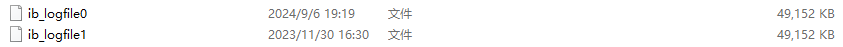
>
> 通过这个文件，可以看到，redo log是一个文件组的形式存在的，5.7里默认是2个文件，可以配置为多个文件。每个文件的大小是一样的。
>
> 默认情况下，可以看到，我现在环境里的redo log都存满了，默认大小是48M。
>
> 
>
> 其实在写入数据到redo log文件中时，为了提升他的写入性能，他的特点是 **顺序写** 的操作。
>
> 在写redo log文件的时候，他会有两个指针
>
> * write pos（应该没问题）：是记录当前要写入的位置，一边写入，这个指针一边往后移动
> * check point：记录当前要擦除的位置，一边删，一边往后移。
>
> 比如，模拟两个文件组的形式。
>
> 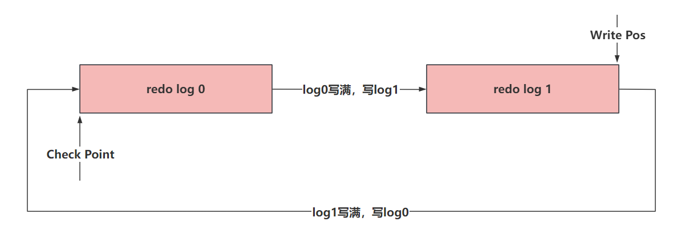

### 5.3 数据为何不直接落到具体的表中，而是优先写入到redo log

> 首先第一点，通过1.1里面聊的内容，知道了redo log是顺序写的操作，他不需要在内存中去做寻址操作，就沿着write pos去写就完事了，省去了寻址操作，速度自然快一些。
>
> 如果你要直接落到具体的表中，表再磁盘中的位置是随机的，你需要做各种寻址操作，这样的操作会影响到你提交事务的效率。
>
> 而且，如果你要回滚事务，还得再做这种寻址操作…………

### 5.4 redo log如何保证数据的完整。

> 首先，现在知道一个事情，MySQL写操作不会立即将数据落到磁盘上，无论是数据还是日志。
>
> 比如数据，他优先走Change Buffer以及Buffer Pool的内存中，也是MySQL优化的手段，减少IO的消耗。
>
> 所有，为了保证数据的完整和持久性，在修改Change Buffer和Buffer Pool中的数据时，数据会优先落到redo log中。
>
> 写入的流程，如下
>
> 
>
> 我只需要知道第4步的触发时机即可。
>
> **redo log大概存储表空间号 + 数据页号 + 偏移量 + 具体修改的数据………………**
>
> 而Log Buffer中的数据刷到磁盘中，一般主要由这个参数控制
>
> 
>
> 他的默认值是1。他可以提供三种值：
>
> * 0： 设置为0的时候，表示每次事务提交不刷盘……
> * 1： （默认值）设置为1的时候，表示每次事务提交后，会立即进行刷盘操作……
> * 2：设置为2的时候，标识每次事务提交，我需要将Log Buffer中的数据刷到系统内存中……
>
> 就用1，别用别的，别的会导致丢失数据…………
>
> 刷盘的流程大致长这样
>
> 
>
> 下面详细的把，0，1，2的配置的刷盘套路各画一个图。
>
> * 当设置为0的时候，没有任何机制会主动刷新，只能靠后台提供的一个线程，每一秒刷新Log Buffer数据到File Cache
> * 当设置为1的时候，只要提交事务，就一定会确保Log Buffer中的数据，落到File Cache并且，必须序列化到本地磁盘文件
> * 设置为2时，提交事务后，会确保Log Buffer的数据，一定要了File Cache中。

## MySQL.三

## 二、bin log

### 2.1 bin log干啥的？

> bin log不是属于某一个存储引擎的日志，他是MySQL服务层的一个日志文件。
>
> 可以在MySQL官方文档里看到全程Binary Log
>
> 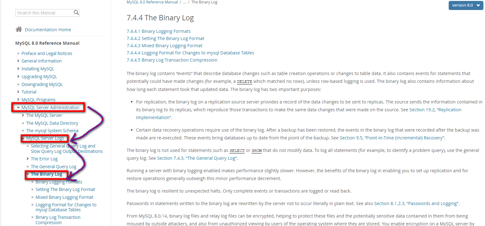
>
> bin log是逻辑日志，记录的内容是你执行的一个语句的原始逻辑，类似给 **ID = 1这一行的 age字段 加1。**
>
> MySQL数据库的 **数据备份，主从同步，崩溃恢复** 这些操作都基于bin log去实现的，需要依赖bin log做数据的同步，保证数据的一致性。

### 2.2 bin log的日志存储形式

> 通过官方文档可以看到，bin log提供了三种格式来存储信息。 通过 binlog_format指定存储的形式
>
> 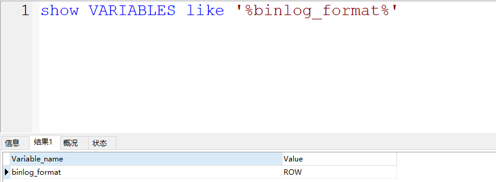
>
> **statement：** 如果指定statement记录，会记录的内容是 **SQL语句的原文** ，比如你在修改语句中涉及到了一些函数，比如 **now()**，在恢复数据时，如果是基于statement形式存储的bin log恢复的话，可能会造成重新执行 **now()** 函数，会斗导致时间会更新为当前系统时间，和原数据的时间 **不一致** 。
>
> **row（默认）：** 这个是默认的，他记录的内容不但具备SQL语句的内容，还会记录 **当前行的具体数据** ，他不会有函数之后的时间不一致的问题。 他记录的内容 **不会存在不一致** 的问题，但是他需要记录的内容更多，**占用的空间也会更大** ，自然同步的时候，需要的时间也就更多……
>
> **mixed：** mixed类似是在statement和row中做了一个 **权衡** ，如果设置为mixed，他会基于MySQL服务自行判断，当前数据是否会引起不一致的问题，如果没有不一致问题，用statement方式，如果可能存在不一致的问题，那就使用row。

### 2.3 bin log的存储数据的时机？

> bin log存储日志文件到磁盘的套路和redo log有点类似，在InnoDB中，也会和事务挂钩，同时bin log也有一个binlog cache的东西。在事务提交后，会将binlog cache中的内容存储到bin log文件中。
>
> 因为一个事务中的bin log不能拆，无论多大的事务，也要保证一次性写入，所以MySQL会给每一个线程分配一块binlog cache的空间。
>
> binlog cache的大小咱们可以自己指定，发现，binlog_cache_size的空间不大，就32kb，如果一个长事务，或者涉及 到操作的数据比较大，一个binlog_cache_size的空间不足，怎么办？
>
> 不用怕，如果查过了binlog_cache_size的空间，他会自动再次扩容内存，但是会有一个限制，不能超过max_binlog_cache_size这个参数的值，但是这个参数的值，贼大，基本不用考虑长事务或者数据量大的操作导致binlog_cache_size爆炸的问题………… 当然，咱们也要尽可能的规避这种长事务的情况……
>
> 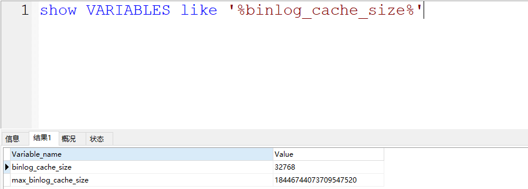

---

> 关于binlog cache的整体写入文件系统的流程：
>
> 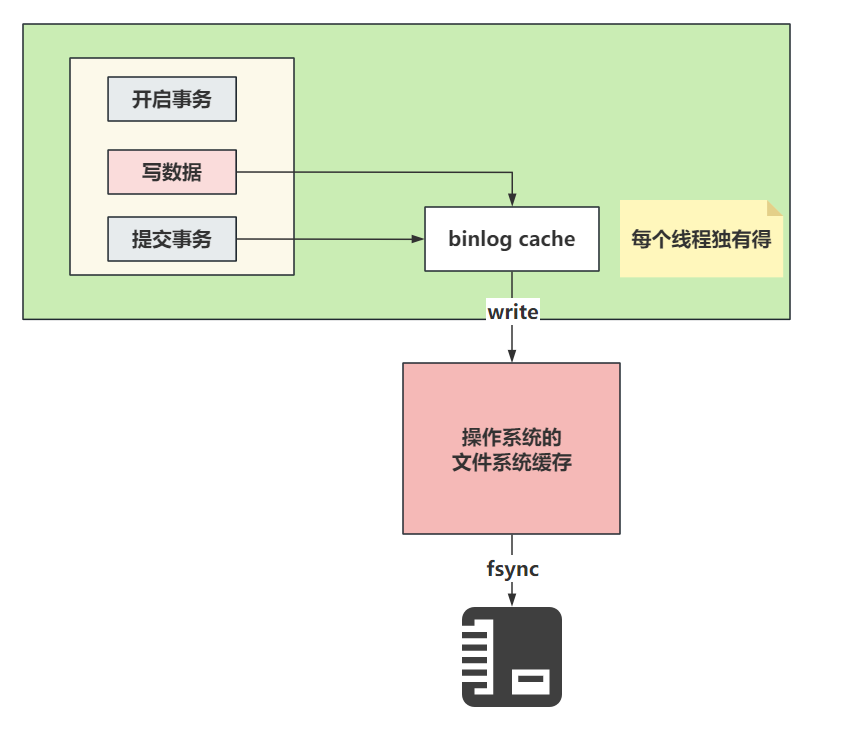
>
> 关于binlog cache中的数据什么时候写入到磁盘，是根据配置决定的：
>
> 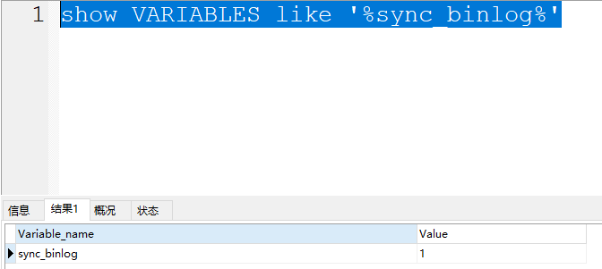
>
> 整个同步的配置默认值是1，在官方也看到可以设置为0
>
> * 0：设置为0时，表示每次提交事务都只会做write操作，将binlog cache中的数据甩到系统的内存中，至于系统什么时候执行fsync持久化到磁盘，由系统自行控制。
> * 1（默认值）：设置为1时，标识每次提交事务都会执行fsync操作，确保binlog cache中的数据一定能落到本地的磁盘中。数据是完整的。
> * 最后一个方式就是可以设置为大于1的值N，几都成。这种方式每次提交事务都会做write操作，当积累了N个事务才会主动的去做fsync操作。最惨的情况，就是丢失了N个事务的数据。优点就是，可以解决一部分IO瓶颈的问题。

## 三、两阶段提交

### 3.1 MySQL为啥要有2PC？

> 看到这个词，第一个想到的应当是分布式事务的一些解决方案。在MySQL中也存在一个类似的问题，也是关于数据不一致的点。在恢复数据时，单单看redo log或者单看bin log都会存在问题。恢复时，这哥俩都需要看一下，其中以bin log为主。
>
> redo log让InnoDB存储引擎拥有了崩溃恢复的能力。
>
> bin log保证MySQL集群架构的数据一致性。
>
> 虽然他们都属于持久化的保证，但是侧重点还有一些不同的。
>
> 举个栗子：
>
> 在执行更新操作时，并且有事务操作时，会记录redo log和bin log两个文件，redo log在事务的执行过程中就会 **不断的写入** 。而bin log只有 **提交事务的时候写入** ，才会执行write操作以及fsync的操作落到磁盘中。
>
> 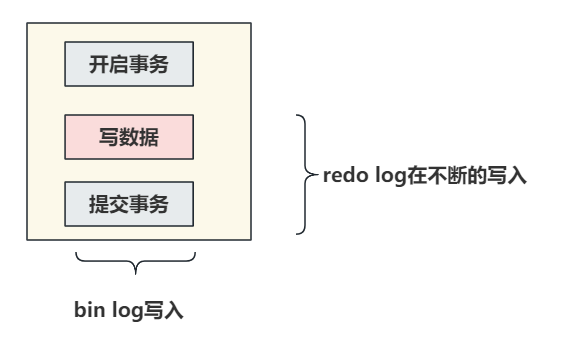
>
> 如果redo log和bin log在记录日志时，他们之间的数据不一致，会出现问题？
>
> 举个具体的栗子：
>
> 现在执行update语句，假设id = 1的一行数据，字段age是18，在执行修改操作，将age修改为38。
>
> `SQL：update table set age = 38 where id = 1`
>
> 假设redo log在没提交事务的时候，就将 **age = 38** 持久化到了redo log文件中
>
> 但是因为事务没正常提交，发生了异常，数据没有落到bin log中，bin log还是之前的 **age = 18** 。
>
> 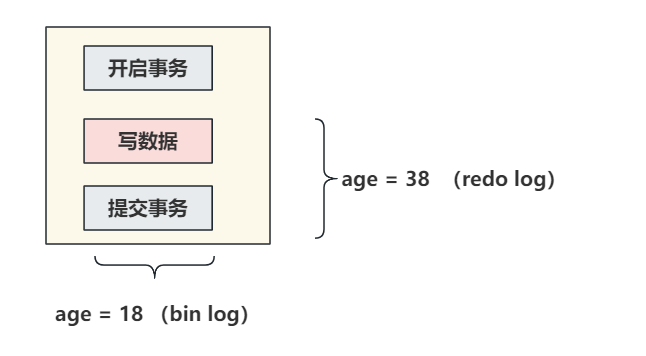
>
> 之后，MySQL崩溃了。此时重启MySQL需要恢复数据。
>
> 此时主库和从库可能就会出现数据不一致的问题。
>
> 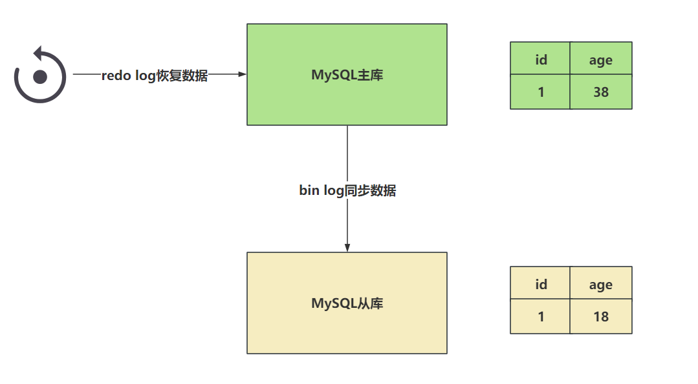
>
> 此时就需要2PC来帮助咱们解决这个问题。。。

### 3.2 MySQL的两阶段提交如何解决的上述问题？

> 原理非常的简单，就是将redo log的写入拆成了两个部署 **prepare** 和 **commit** ，这就是两阶段提交。
>
> 事务还未提交时，redo log中的数据是prepare阶段，而当你真正的提交了事务之后数据才是commit阶段。
>
> 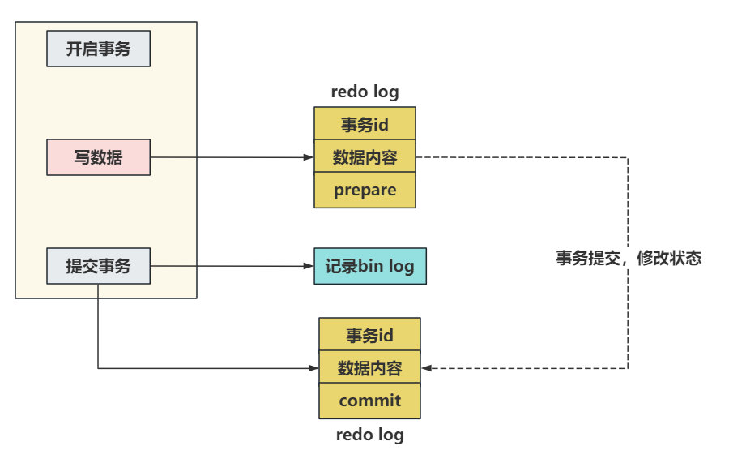
>
> 在知道两阶段提交的效果之后，写入bin log时发生异常也不会与影响。
>
> 因为MySQL根据redo log日志恢复时，查看一下redo log中的提交状态， **如果是prepare阶段，并且在bin log中没有对应内容** ，这个数据会被回滚。
>
> 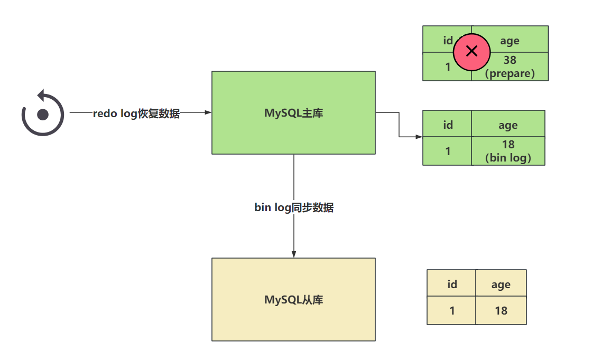下一个例子，如果现在redo log在设置日志状态为commit时，出现了异常，但是bin log正常的写入到了系统文件中。
>
> 现在出现了这个情况，redo log存储了age = 38，但是是prepare阶段。 bin log中存储了age = 38。
>
> 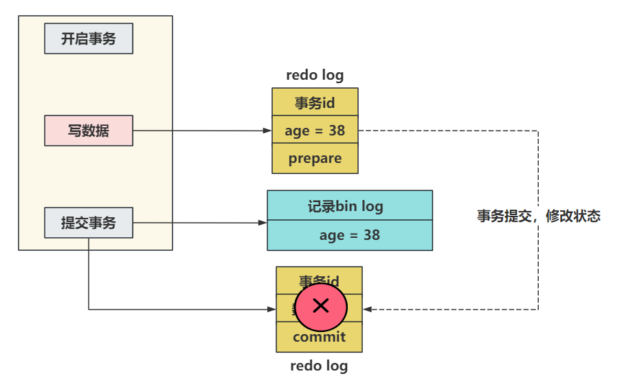这种情况，就是发现age = 38再redo log是prepare阶段，但是发现bin log中有完整的数据，那么此时这个数据不会回滚，会按照bin log的数据同步。
>
> 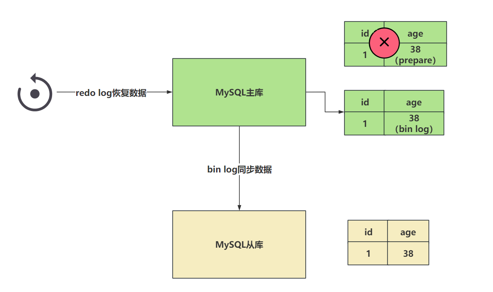
>
> **在恢复数据时，以bin log为主。**

## 四、undo log

### 4.1 undo log干啥的？

> undo log属于InnoDB存储引擎的一个日志文件。
>
> 存储数据的一些历史版本，一方面是为了做事务回滚时，可以找到需要 **回滚** 到的数据内容，另一个方面是**MVCC**的多版本并发控制操作时，需要读取快照信息，就要在undo log里面去读。
>
> 事务的四大特性，有一个是原子性，具体来说 **原子性是指数据库的一系列操作，要么全部成功，要么全部失败，不可能出现部分成功的情况。**
>
> 咱们知道如果要保证事务的原子性，就需要在出现异常时，对已经执行的修改操作进行回滚，在MySQL中，回复机制就是通过 undo log（回滚日志）实现。
>
> 为了确保即便数据库宕机，也能恢复到之前的版本，undo log在事务还未提交时，数据就已经落到磁盘中了。

### 4.2 事务的四大特性（常识，必会！）

> 原子性： **原子性是指数据库的一系列操作，要么全部成功，要么全部失败，不可能出现部分成功的情况。**
>
> 一致性： **事务提交后，预期的结果和最终的结果是一致的。/ 事务的结果必须使数据库从一个正确状态转为为另一个正确状态。/ 事务开始前后，数据库中的数据必须满足所有定义的完整性约束条件。**
>
> 隔离性： **每个事务都是相互隔离，独立存在的，事务之间的并发操作不会影响到彼此。具体隔离成啥样，得看事务的隔离级别。**
>
> 持久性：**事务提交后，做的修改是永久性的，会保存到磁盘中。**

### 4.3 事务的并发会产生的问题（常识，必会！）

> 脏读：**读到了其他活跃事务，未commit的数据。**
>
> 不可重复读： **在一次事务中，多次查询同一数据，结果不一致（因为其他事务修改了这个数据）。**
>
> 幻读、虚读：**在一次事务中，多次查询同一数据，结果不一致（因为其他事务增删了这个数据）。**

### 4.4 MySQL的事务隔离级别（常识，必会！）

> **读未提交（Read Uncommitted）：** 会读到未提交事务的数据。（啥问题都不能解决）
>
> **读已提交（Read Committed，RC）：** 可以读到已提交事务的数据。（能解决脏读）
>
> **可重复读（Repeatable Read，RR）：** MySQL的默认隔离级别。（能解决脏读和不可重复读）
>
> **串行化（Serializable）：** 啥问题都能解决，但是事务之间并发会上锁。

## MySQL.四

## 一、MVCC

### 1.1 MVCC是个啥？

> MVCC（Multi Version Concurrency Control），多版本并发控制。
>
> 他就是一种提升并发能力的技术。 最早的时候操作，基本只有读读是可以并发执行的。只要涉及到了写操作，那就必须要阻塞。
>
> 但是引入了MVCC之后，咱们可以做到读写，写读的并发。但是写写依然是互斥的。
>
> 在MVCC内部，是基于InnoDB通过undo log保存的数据记录的版本信息来实现的。每个事务读到的数据版本可能会不一样。在同一个事务中，用户只能看到当前事务创建快照前就已经提供了的数据，以及事务本身操作的数据。
>
> MVCC在 Read Committed以及Repeatable Read中才会使用到。
>
> MVCC的实现是基于三点来玩的：**隐藏字段、undo log、Read View** 这三者配合实现的。

### 1.2 隐藏字段是个啥？

> InnoDB向数据库中存储的每一行添加了三个字段：
>
> **DB_TRX_ID：** 标识最近一次对当前行数据做修改（Insert，Update）的事务ID。至于delete操作，属于Update。事务ID是递增的~~
>
> **DB_ROLL_PTR：** 回滚指针，undo log中记录的多个版本之间，使用DB_ROLL_PTR来连接上。
>
> **DB_ROW_ID：** 如果表里没有主键，没有非空唯一索引，那么这个隐藏字段会作为聚簇索引存在。这玩应和MVCC关系不大，了解即可。
>
> 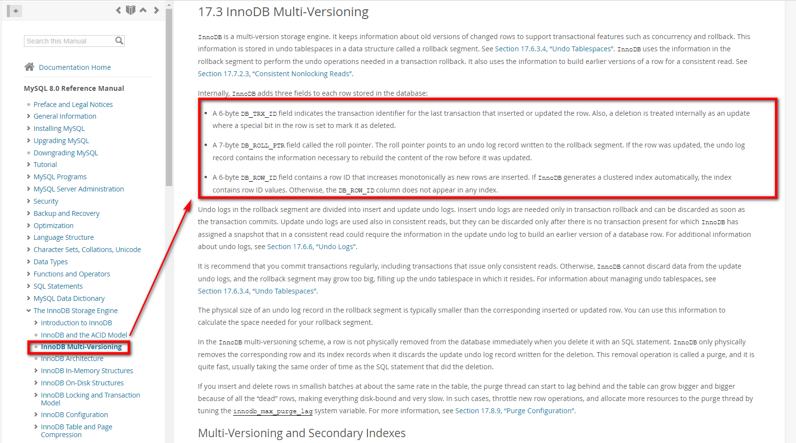

### 1.3 undo log存储的数据结构

> 比如现在有一张user表，里面有id，name两个字段。现在数据存在一条，id = 1，name = 张三
>
> 如果，现在长这样
>
> 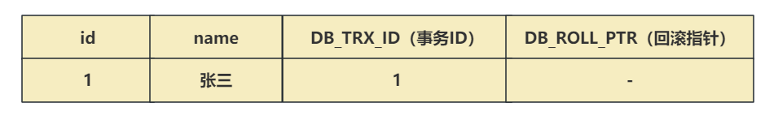
>
> 现在有一个事务ID为2，要修改这个数据，将name修改为李四
>
> * 获取互斥锁
> * 需要先将当前数据行复制到undo log中，作为旧版本。
> * 复制完毕后，将张三修改为李四，并且将DB_TRX_ID修改为2，并且将回滚指针指向undo log里的旧版本
> * 提交事务后，释放锁。
>
> 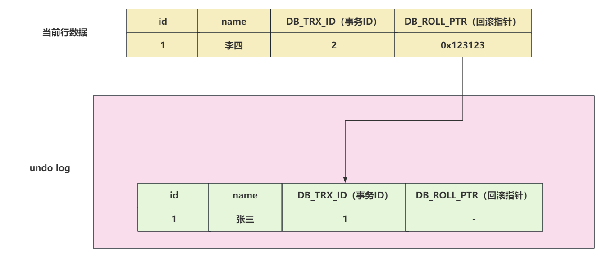
>
> 现在又来了一个事务ID为3，修改这行数据，将李四修改为王五
>
> * 获取互斥锁
> * 需要先将当前数据行复制到undo log中，作为旧版本。
> * 复制完毕后，将李四修改为王五，并且将DB_TRX_ID修改为3，并且将回滚指针指向undo log里的旧版本
> * 提交事务，释放锁
>
> 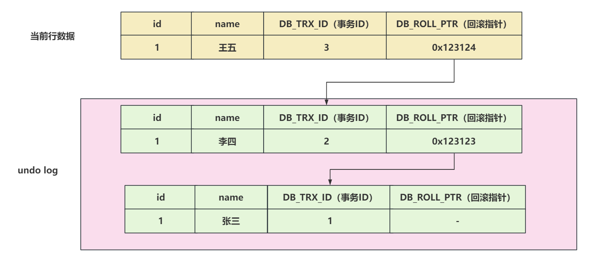

### 1.4 Read View内部结构存储了个啥？

> Read View其实和快照是一个意思。
>
> Read View是读操作中的可见性判断的核心，也就是当前事务能不能读取undo log中的某行数据以及当前行数据。Read View内部还维护的很多的属性以及逻辑。
>
> 在开启事务后， **执行第一个select操作后** ，会创建一个Read View，也就是快照。
>
> 在Read View中会保存不应该被当前事务看到的，其他 **活跃事务的列表** 。
>
> 当用户在这个事务中要读取某行记录时，InnoDB会将该行的 **DB_TRX_ID** 和 **Read View** 中的一些变量去做比较，判断当前数据能否查看到。
>
> 要查看一下Read View 里面的存储结构信息。
>
> https://github.com/facebook/mysql-8.0/blob/8.0/storage/innobase/include/read0types.h
>
> 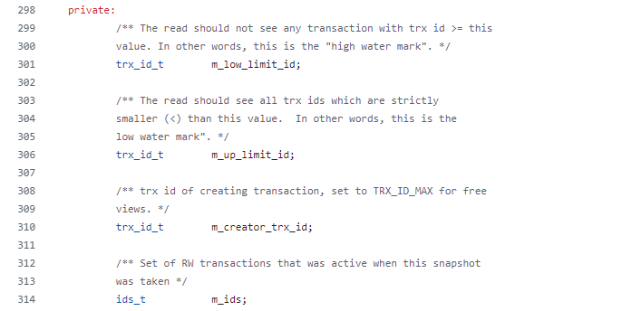
>
> 这四个属性中，分别聊一下：
>
> * **m_creator_trx_id：** 当前事务的TRX_ID，也就是事务ID
>   * 人话：当前事务的ID，当前事务要创建这个Read View快照。
> * **m_ids：** 创建快照时，处于活跃事务的ID集合。
>   * 人话：未提交事务的事务的集合。因为事务没提交，所以这里的数据是不可见的。并且活跃事务列表不会记录当前事务。
> * **m_low_limit_id：** 读取时不应看到任何trx id>=此值的事务。换句话说，这是“高水位线”
>   * 人话：当前行数据的事务ID，大于等于m_low_limit_id，数据是不可见的。说白了，当前事务在创建Read View快照时，这个事务他还没开始呢，他的数据必然是不可见的。通过查看m_low_limit_id的赋值，**可以得知他是还未被分配的事务的最小事务ID** ，**其实就是最大活跃事务 + 1。**
> * **m_up_limit_id：** 读取应该看到所有严格小于（<）此值的trx id。换句话说，这是低水位线”
>   * 人话： **他是活跃事务列表中的最小事务ID** ，比这个事务ID还要小的值，他事务必然已经提交了，所以如果当前行数据的事务ID 小于 m_up_limit_id，我是可见的。如果活跃事务列表为空，m_up_limit_id = m_low_limit_id。
>
> 
>
> **在RC的隔离级别下，每次执行select操作时，都会创建一个全新的Read View。**
>
> **在RR的隔离级别下，只有第一次select操作时，会创建Read View，后续再查询，都基于第一次的Read View做可见性判断。**

### 1.5 ReadView可见性判断的逻辑

> 在源码中，可以看到可见性判断的逻辑
>
> ```C
> // id参数，是你想查看的那行数据的事务ID
> bool changes_visible(
> 	trx_id_t		id, const table_name_t&	name) const MY_ATTRIBUTE((warn_unused_result)){
> 	ut_ad(id > 0);
> 	// m_up_limit_id 是活跃事务的最小id，如果当前行的事务ID，小于m_up_limit_id，说明这个事务必然已经提交了，这个数据是可见的。
> 	// 如果当前行的事务ID和当前创建ReadView的事务ID相等，说明就是当前事务修改的数据，必然可见。
> 	if (id < m_up_limit_id || id == m_creator_trx_id) {
> 		return(true);
> 	}
> 
> 	check_trx_id_sanity(id, name);
> 	// 当前行的事务ID，大于了m_low_limit_id，必然不可见。创建Read View的时候，m_low_limit_id这个事务还没有呢。
> 	if (id >= m_low_limit_id) {
> 		return(false);
> 	// 没有活跃事务，并且当前行数据的事务ID，还小于m_low_limit_id，那这个数据必然可见。
> 	} else if (m_ids.empty()) {
> 		return(true);
> 	}
> 
> 	const ids_t::value_type*	p = m_ids.data();
> 	// 如果上述情况都不满足，无法判断可见还是不可见，此时需要拿着当前行的事务ID，以及活跃事务列表开始判断。
>  // 1、如果我发现当前行的事务ID，在活跃事务列表中。此时在Read View来说，这个事务没提交，不可见。
>  // 2、如果我发现当前行的事务ID，不在活跃事务列表中，说明创建Read View时候，你就提交了，可见。
> 	return(!std::binary_search(p, p + m_ids.size(), id));
> }
> ```
>
> 各种例子：
>
> 1、id < up_limit_id，直接可见。
>
> 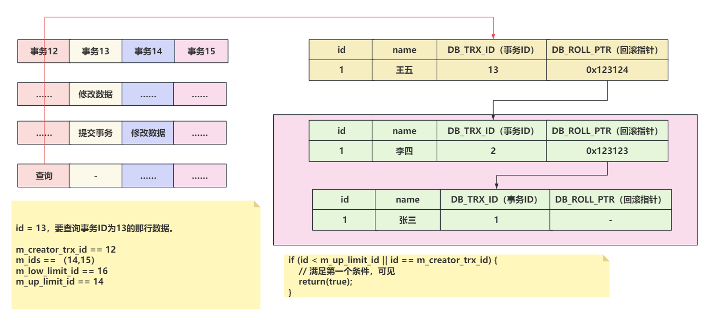
>
> 2、RC隔离级别下，第二次查询会重新创建Read View，可以读取到刚刚提交事务的数据
>
> 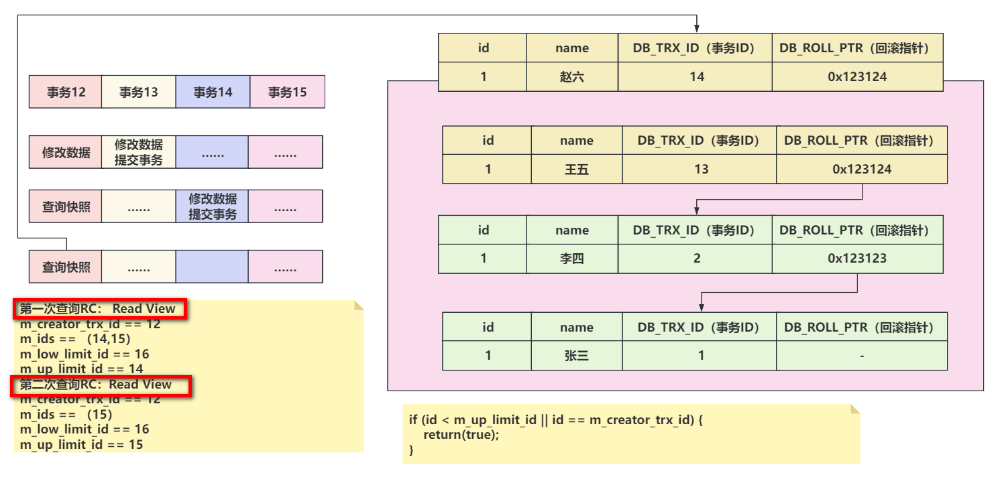
>
> 3、RR隔离级别下，第二次查询不会重新构建Read View，新数据不可见。
>
> 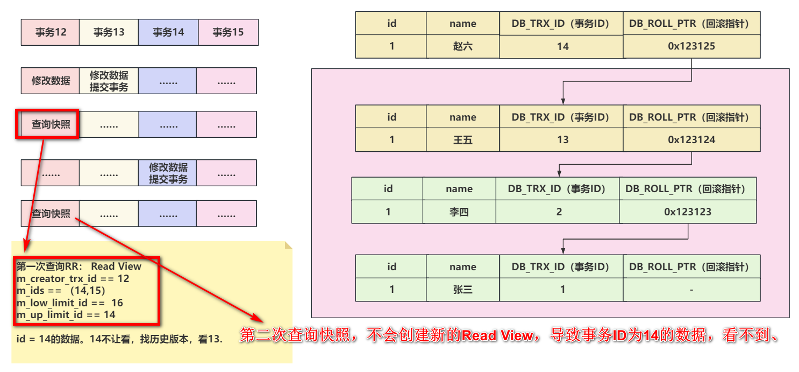
>
> 4、当前行事务ID不在活跃事务列表中。
>
> 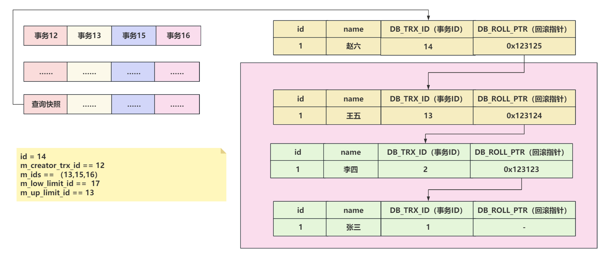

---

| 事务A        | 事务B                        |
| ------------ | ---------------------------- |
| 查询数据     |                              |
|              | 修改了这个数据，并且提交事务 |
| 再次查询数据 |                              |

事务A，能传到事务B提交的数据么？

面试被问到的话，先问是RC还是RR的隔离级别。~~~

## 二、MySQL主从同步的原理

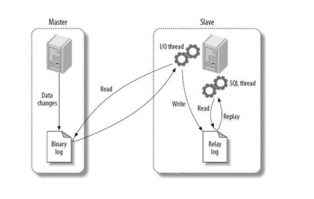

> MySQL的主从同步的过程中，要从几个维度聊。
>
> * 你的Master在做写操作时，会将写操作记录到bin log中。
> * 你的Slave从库会监听Master节点中的bin log的变化，如果有变化。
>   * Slave需要主动的找Master节点要bin log中的数据，发起请求
>   * Master会将bin log的内容发送给Slave。
> * Slave接收到bin log信息后，不会立即同步，会扔到relay log中缓冲一下。
> * Slave再从Relay log中将数据同步到Slave中。

## 三、MySQL主从同步必然有延迟，怎么办？

只能尽量的减少延迟，想解决的话，同步的成本很高。

如果必须要数据强一致，那就不能用主从的效果，自己搞一个众生平等的套路。

让写数据的时，同步写到多个MySQL节点中，都成功才成功！但是这样，写操作的效率必然大打折扣！（基本没有这么干的）

但是一般情况下，大多是尽可能的提升主从同步的效率。。。

* 优化查询等其他操作，让出服务器资源，避免影响同步时的资源被占用…………
* 规避大事务，别一次同步大量数据，这个成本也高…………
* MySQL从库同步时，可以指定多线程同步，提升效率：https://dev.mysql.com/doc/refman/8.0/en/replication-options-replica.html#sysvar_replica_parallel_workers    （搜workers）
* bin log同步可以指定具体的库，减少不必要的同步操作。https://dev.mysql.com/doc/refman/8.0/en/replication-options-replica.html#--replicate-do-db      （搜do-db）
* 服务器的资源给力点，网络的带宽大一点，磁盘必然上固态，多多监控一下，如果有延迟时间长的点，排查一下………………
* 半同步复制的套路………………


## N、bin log、undo log存哪了？（了解）

> bin log、undo log存哪了？
>
> 存到磁盘是必然的。
>
> 其次，bin log是你指定存在哪个位置，他就存在哪个位置。
>
> 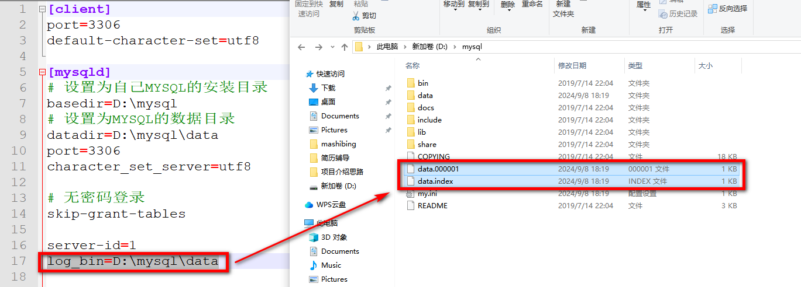undo log根据版本不同，存放的位置也各不一样。
>
> 在8.0之后，会有一个单独的undo log的目录，来存放undo log文件。
>
> 之前的版本也会存放到ibdata1文件中…………
