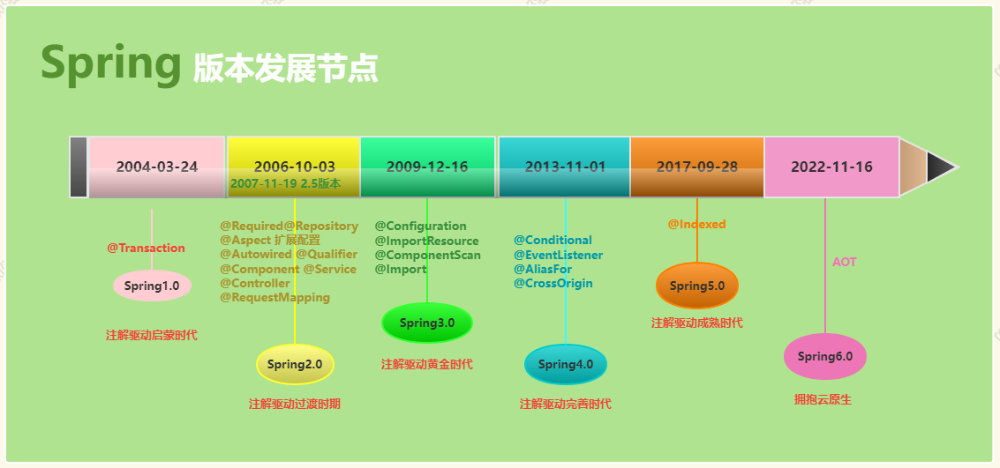
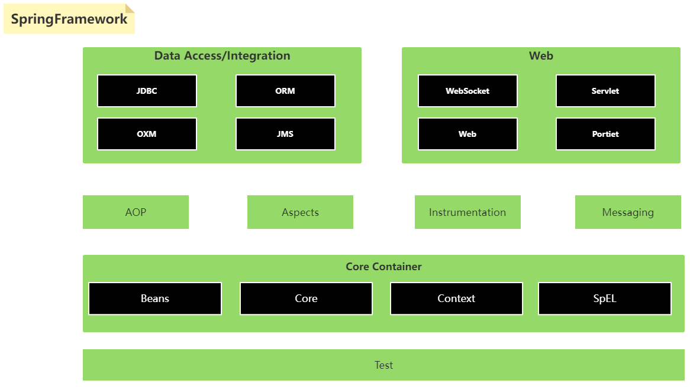
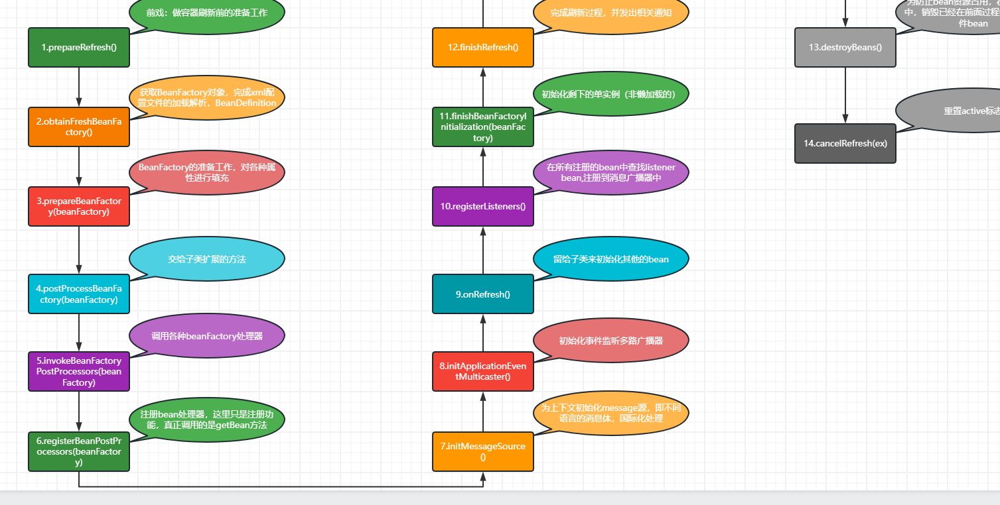
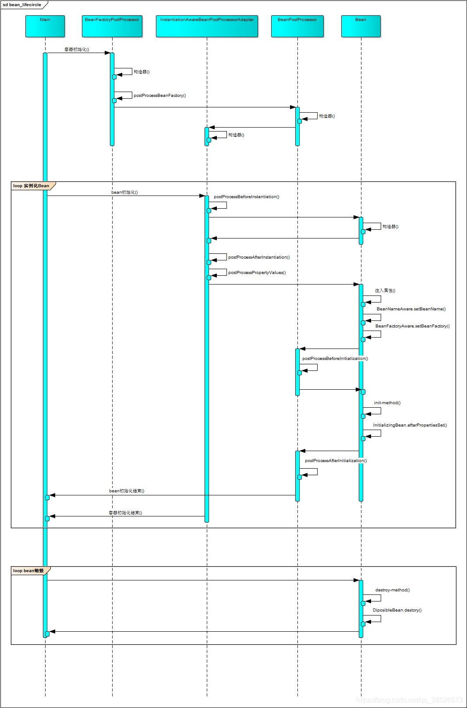
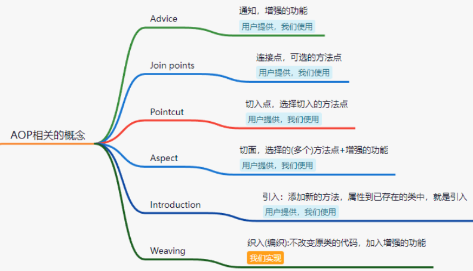
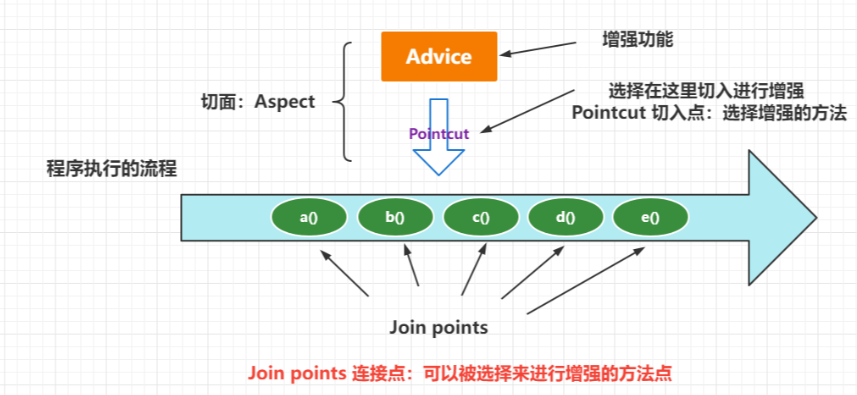
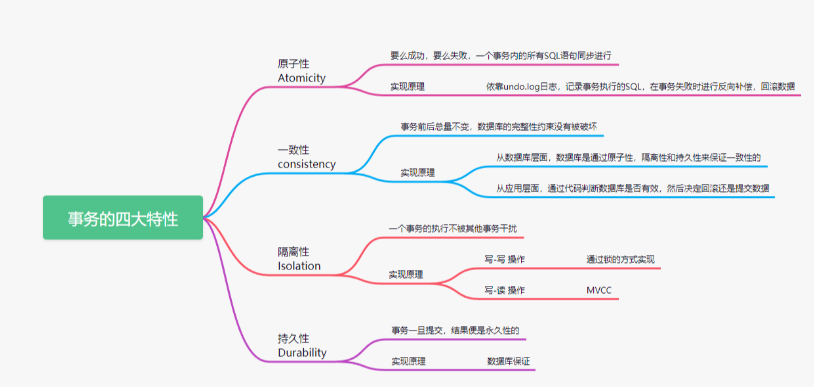
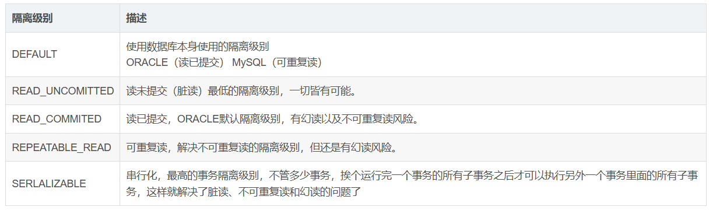
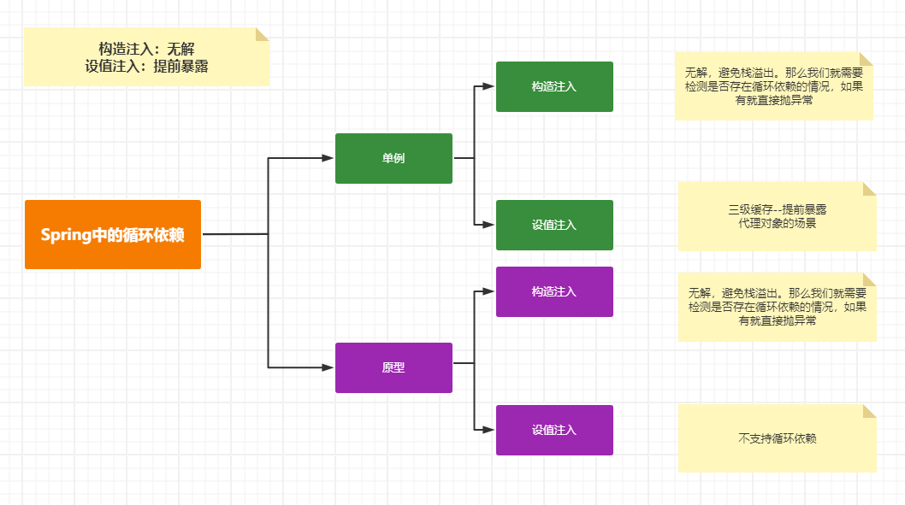

## Spring-2024上

## 2024上-Spring专题(上)

> lecture：波哥


IOC  DI  AOP 事务

## 一、谈谈你对Spring的理解

这个问题可以从多个角度来分析

https://www.processon.com/view/link/66128eec9212073d7f864f2d?cid=661233723f45151c41c284c3

### 1. Spring的发展历史



### 2. Spring的体系结构




### 3. Spring相关组件

- 1. Spring和SpringMVC的关系
  2. Spring和SpringBoot的关系
  3. Spring和SpringCloud的关系
  4. Spring和SpringSecurity的关系
  5. .....


## 二、谈谈你对IoC的理解

&emsp;&emsp;Spring的IoC（Inversion of Control，控制反转）是一种设计模式，它的核心思想是将对象的创建、组装和管理过程交给框架来完成，而不是由应用程序直接控制。这种模式通过将应用程序的控制权交给框架来提高应用程序的可扩展性、灵活性和可维护性。

### 1. IoC的应用

1. Bean的定义：基于xml的方式，基于配置类的方式，@Component注解
2. Bean的发现：@Resources @Autowired 注解

### 2. IoC的原理

Bean 的管理： bean的定义  bean加载  bean 存储。bean的实例化

Bean的定义==》 BeanDefinition  ==》 BeanFactory【存储了所有的BeanDefinition】==》BeanDefinitionRegistry ==》 Bean实例有两种类型 单例，原型  单例==》容器初始化的时候==》完成对应的实例。单例Bean保存在一级缓存中。  原型Bean  在我们获取Bean的时候getBean()会完成对象的实例化。

对应的Bean的创建也是穿插在Spring容器的初始化过程中的


https://www.processon.com/view/link/6612404756d26b10e7b5fc84?cid=624802a95653bb072bd6da1e





## 三、谈谈你对Bean的生命周期的理解

https://blog.csdn.net/qq_38526573/article/details/88143169

Servlet的生命周期

Fileter的生命周期

SpringBean对象：

对象的创建

对象的初始化

对象的使用

对象的销毁



具体流程的说明：

1. 如果实现了BeanFactoryPostProcessor接口，那么在容器启动的时候，该接口中的postProcessBeanFactory方法可以修改Bean中元数据中的信息。该方法是在实例化对象之前执行
2. 如果实现了InstantiationAwareBeanPostProcessor接口，那么在实例化Bean对象之前会调用**postProcessBeforeInstantiation**方法，该方法如果返回的不为null则会直接调用postProcessAfterInitialization方法，而跳过了Bean实例化后及初始化前的相关方法，如果返回null则正常流程，**postProcessAfterInstantiation**在实例化成功后执行，这个时候对象已经被实例化，但是该实例的属性还未被设置，都是null。因为它的返回值是决定要不要调用postProcessPropertyValues方法的其中一个因素（因为还有一个因素是mbd.getDependencyCheck()）；如果该方法返回false,并且不需要check，那么postProcessPropertyValues就会被忽略不执行；如果返回true, postProcessPropertyValues就会被执行,**postProcessPropertyValues**用来修改属性，在初始化方法之前执行。
3. 如果实现了Aware相关的结果，那么相关的set方法会在初始化之前执行。
4. 如果实现了BeanPostProcessor接口，那么该接口的方法会在实例化后的初始化方法前后执行。
5. 如果实现了InitializingBean接口则在初始化的时候执行afterPropertiesSet
6. 如果指定了init-method属性则在初始化的时候会执行指定的方法。
7. 如果指定了@PostConstruct则在初始化的时候会执行标注的方法。
8. 到此对象创建完成
9. 当对象需要销毁的时候。
10. 如果实现了DisposableBean接口会执行destroy方法
11. 如果指定了destroy-method属性则会执行指定的方法
12. 如果指定了@PreDestroy注解则会执行标注的方法


## 四、谈谈你对AOP的理解

### 1. AOP的概念

&emsp;&emsp;AOP（Aspect Oriented Programming）,即面向切面编程，可以说是OOP（Object Oriented Programming，面向对象编程）的补充和完善。面向切面是面向对象中的一种方式而已。在代码执行过程中，动态嵌入其他代码，叫做面向切面编程。

### 2. AOP的使用

https://blog.csdn.net/qq_38526573/article/details/86441916

### 3. AOP的原理

https://cloud.fynote.com/share/d/NqIAAHPPN






## 五、谈谈你对Spring事务管理的理解

单体的事务解决方案

分布式事务的解决方案

jdbc事务的概念

### 1. 事务的传播属性和隔离级别

https://blog.csdn.net/qq_38526573/article/details/87898161





### 2.事务原理分析

https://cloud.fynote.com/share/d/1qIUHPSAI


## 六、谈谈你对Spring循环依赖的理解

https://cloud.fynote.com/share/d/GieUHTv6



1。非Spring的场景下的循环依赖问题：提前暴露 Map 一级缓存

2。Spring场景下的循环依赖问题：AOP代理对象。 提前暴露 三级缓存   一级【Bean定义后生成的单例对象 IOC 实例化生成的所有的单例对象】 二级【半成品对象】 三级【Lambda表达式】

3。各种Bean的情况对循环依赖的不同支持情况


## 2024上-Spring专题(下)

> lecture：波哥

## 一、SpringMVC专题

### 1. 谈谈SpringMVC的处理流程

https://www.processon.com/view/link/6613823d56d26b10e7b7e5d4?cid=6613812f553b19665c7f720f


### 2. SpringMVC 如何统一封装响应信息？

针对前后端分离的项目中--前端服务调用后端服务获取到的响应信息统一格式

R  code msg  data

实现这块的核心是通过 RequestMappingHandlerAdapter 中提供的HandlerMethodReturnValueHandler 来扩展实现的。

```java
@Configuration
public class InitializingAdviceDecorator implements InitializingBean {

    private final RequestMappingHandlerAdapter adapter;

    public InitializingAdviceDecorator(RequestMappingHandlerAdapter adapter) {
        this.adapter = adapter;
    }

    @Override
    public void afterPropertiesSet() {
        //获取所有的handler对象
        List<HandlerMethodReturnValueHandler> returnValueHandlers = adapter.getReturnValueHandlers();
        //因为上面返回的是unmodifiableList，所以需要新建list处理
        assert returnValueHandlers != null;
        List<HandlerMethodReturnValueHandler> handlers = new ArrayList<>(returnValueHandlers);
        this.decorateHandlers(handlers);
        //将增强的返回值回写回去
        adapter.setReturnValueHandlers(handlers);
    }


    /**
     * 使用自定义的返回值控制类
     *
     * @param handlers
     */
    private void decorateHandlers(List<HandlerMethodReturnValueHandler> handlers) {
        for (HandlerMethodReturnValueHandler handler : handlers) {
            if (handler instanceof RequestResponseBodyMethodProcessor) {
                //找到返回值的handler并将起包装成自定义的handler
                ControllerReturnValueHandler decorator = new ControllerReturnValueHandler((RequestResponseBodyMethodProcessor) handler);
                int index = handlers.indexOf(handler);
                handlers.set(index, decorator);
                break;
            }
        }
    }

    /**
     * 自定义返回值的Handler
     * 采用装饰者模式
     */
    private static class ControllerReturnValueHandler implements HandlerMethodReturnValueHandler {
        //持有一个被装饰者对象
        private final HandlerMethodReturnValueHandler handler;

        ControllerReturnValueHandler(RequestResponseBodyMethodProcessor handler) {
            this.handler = handler;
        }

        @Override
        public boolean supportsReturnType(MethodParameter returnType) {
            return true;
        }

        /**
         * 增强被装饰者的功能
         *
         * @param returnValue  返回值
         * @param returnType   返回类型
         * @param mavContainer view
         * @param webRequest   请求对象
         * @throws Exception 抛出异常
         */
        @Override
        public void handleReturnValue(Object returnValue, MethodParameter returnType, ModelAndViewContainer mavContainer, NativeWebRequest webRequest) throws Exception {
            //如果是下载文件跳过包装
            IgnoredResultWrapper ignoredResultWrapper = returnType.getMethodAnnotation(IgnoredResultWrapper.class);

            if (ignoredResultWrapper != null) {
                handler.handleReturnValue(returnValue, returnType, mavContainer, webRequest);
                return;
            }

            if (returnValue == null) {
                Optional<String> contentType = Optional.of(webRequest)
                        .map(nativeWebRequest -> ((ServletWebRequest) webRequest))
                        .map(ServletRequestAttributes::getResponse)
                        .map(ServletResponse::getContentType);
                if (contentType.isPresent() && contentType.get().contains("application/vnd.openxmlformats-officedocument")) {
                    return;
                }
            }
            //如果已经封装了结构体就直接放行
            if (returnValue instanceof ResultWrapper) {
                handler.handleReturnValue(returnValue, returnType, mavContainer, webRequest);
                return;
            }
            //正常返回success
            ResultWrapper<Object> success = ResultWrapper.success(returnValue);
            handler.handleReturnValue(success, returnType, mavContainer, webRequest);
        }
    }
}
```

### 3. SpringMVC如何处理Date相关的参数

应用中常规的解决方案 JSON工具

1. 使用@DateTimeFormat注解：可以在Controller方法的参数上使用@DateTimeFormat注解来指定日期参数的格式，例如：

```java
public String getDate(@RequestParam("date") @DateTimeFormat(pattern="yyyy-MM-dd") Date date) {
    //处理日期参数
}
```

2. 使用@InitBinder注解：可以在Controller中定义一个方法，使用@InitBinder注解来自定义日期参数的转换器，例如：

```java
@InitBinder
public void initBinder(WebDataBinder binder) {
    SimpleDateFormat dateFormat = new SimpleDateFormat("yyyy-MM-dd");
    binder.registerCustomEditor(Date.class, new CustomDateEditor(dateFormat, true));
}
```

3. 使用Converter接口：可以自定义一个Converter实现类，实现org.springframework.core.convert.converter.Converter接口，编写逻辑将字符串转换为Date类型，然后在配置文件中注册该Converter，让Spring MVC自动调用。

```java
/**
 * 自定义转换器
 * 
 * @author dpb【波波烤鸭】
 *
 */
public class DateConvert implements Converter<String,Date>{

	@Override
	public Date convert(String msg) {
		SimpleDateFormat sdf = new SimpleDateFormat("yyyy-MM-dd");
		try {
			return sdf.parse(msg);
		} catch (ParseException e) {
			// TODO Auto-generated catch block
			e.printStackTrace();
		}
		return null;
	}

}

```


## 二、SpringSecurity专题

Shiro：Apache  认证 授权

SpringSecurity：Spring框架提供

### 1.介绍下SpringSecurity的工作原理

https://www.processon.com/view/link/5f708e967d9c08039fbe2110?cid=5f65a56b0791295dccc73346


### 2.基于Token的认证方式如何实现

这里需要解决几个问题：

1. 认证的过程处理
2. 登录成功后的校验处理

我们需要单独定义两个过滤器。

一个是登录认证的

```java
public class TokenLoginFilter extends UsernamePasswordAuthenticationFilter {

    private AuthenticationManager authenticationManager;

    public TokenLoginFilter(AuthenticationManager authenticationManager){
        this.authenticationManager = authenticationManager;
    }

    /**
     * 具体认证的方法
     * @param request
     * @param response
     * @return
     * @throws AuthenticationException
     */
    @Override
    public Authentication attemptAuthentication(HttpServletRequest request, HttpServletResponse response) throws AuthenticationException {
        SysUser sysUser = null;
        // 前后端分离的项目中我们提交的数据是JSON字符串。不是表单提交的
        try {
            String loginInfo = getRequestJSON(request);
            sysUser = JSON.parseObject(loginInfo, SysUser.class);
            UsernamePasswordAuthenticationToken authenticationToken =
                    new UsernamePasswordAuthenticationToken(sysUser.getUsername(),sysUser.getPassword());
            // 系统认证
            return authenticationManager.authenticate(authenticationToken);
        } catch (IOException e) {
            e.printStackTrace();
        }
        return null;
    }

    private String getRequestJSON(HttpServletRequest request) throws IOException {
        BufferedReader streamReader = new BufferedReader(new InputStreamReader(request.getInputStream()));
        StringBuilder sb = new StringBuilder();
        String inputStr = null;
        while((inputStr = streamReader.readLine() ) != null){
            sb.append(inputStr);
        }
        return sb.toString();
    }

    /**
     * 登录成功的方法
     * @param request
     * @param response
     * @param chain
     * @param authResult
     * @throws IOException
     * @throws ServletException
     */
    @Override
    protected void successfulAuthentication(HttpServletRequest request, HttpServletResponse response
            , FilterChain chain, Authentication authResult) throws IOException, ServletException {
        // 生成Token信息
        Map<String,String> map = new HashMap<>();
        map.put("username",authResult.getName());
        // TODO 还可以存储当前用户具有的角色
        // 生成对应的Token信息
        String token = JWTUtils.getToken(map);
        // 需要把生成的Token信息响应给客户端
        response.addHeader("Authorization", SystemConstant.SYS_TOKEN_PREFIX +token);
        response.addHeader("Access-Control-Expose-Headers","Authorization");
        response.setContentType("application/json;charset=utf-8");
        response.setStatus(HttpServletResponse.SC_OK);
        PrintWriter writer = response.getWriter();
        Map<String,Object> resultMap = new HashMap<>();
        resultMap.put("code", HttpServletResponse.SC_OK);
        resultMap.put("msg","认证通过");
        writer.write(JSON.toJSONString(resultMap));
        writer.flush();
        writer.close();
    }

    /**
     * 登录失败的方法
     * @param request
     * @param response
     * @param failed
     * @throws IOException
     * @throws ServletException
     */
    @Override
    protected void unsuccessfulAuthentication(HttpServletRequest request, HttpServletResponse response, AuthenticationException failed) throws IOException, ServletException {
        response.setContentType("application/json;charset=utf-8");

        response.setStatus(HttpServletResponse.SC_OK);
        PrintWriter writer = response.getWriter();
        Map<String,Object> resultMap = new HashMap<>();
        resultMap.put("code", HttpServletResponse.SC_UNAUTHORIZED);
        resultMap.put("msg","用户名或密码错误!");
        writer.write(JSON.toJSONString(resultMap));
        writer.flush();
        writer.close();
    }
}
```

一个是请求校验的

```java
public class TokenVerifyFilter extends BasicAuthenticationFilter {
    public TokenVerifyFilter(AuthenticationManager authenticationManager) {
        super(authenticationManager);
    }

    /**
     * 校验提交的Token是否合法的方法
     * @param request
     * @param response
     * @param chain
     * @throws IOException
     * @throws ServletException
     */
    @Override
    protected void doFilterInternal(HttpServletRequest request, HttpServletResponse response, FilterChain chain) throws IOException, ServletException {
        System.out.println("--->"+request.getRequestURI());
        // 获取请求携带的Token信息
        String header = request.getHeader("Authorization");
        String requestURI = request.getRequestURI();
        String contextPath = request.getContextPath();
        String path = requestURI.replace(contextPath,"");
        List<String> msgs = Arrays.asList("/doc.html","/webjars","/v2","/v3","/favicon.ico","swagger-resources");
        for (String p : msgs) {
            if(path.contains(p)){
                // 放过请求
                chain.doFilter(request,response);
                return ;
            }
        }

        System.out.println("request.getContextPath() = " + request.getContextPath());
        if(header != null && header.startsWith(SystemConstant.SYS_TOKEN_PREFIX)){
            // 传递了Token信息。同时有我们添加的对应的前缀
            // 1.获取到正常的token
            String token = header.replace(SystemConstant.SYS_TOKEN_PREFIX, "");
            // 2.校验token信息是否合法
            DecodedJWT verify = JWTUtils.verify(token);
            if(verify == null){
                // 说明验证失败
                responseLogin(response);
            }
            // 走到这儿说明是正常
            // 获取当前登录的账号信息
            String userName = verify.getClaim("username").asString();
            // 放过请求 后续的控制器可能需要相关的权限
            List<GrantedAuthority> list = new ArrayList<>();
            list.add(new SimpleGrantedAuthority("ADMIN"));
            // 根据账号获取相关的权限
            UsernamePasswordAuthenticationToken authenticationToken
                    = new UsernamePasswordAuthenticationToken(userName,"",list);
            SecurityContextHolder.getContext().setAuthentication(authenticationToken);
            // 放过请求
            chain.doFilter(request,response);

        }else{
            // 没有携带Token或者是非法的请求
            responseLogin(response);
        }
    }

    private void responseLogin(HttpServletResponse response) throws IOException {
        // 说明校验失败 -- 给用户提示请先登录
        response.setContentType("application/json;charset=utf-8");
        response.setStatus(HttpServletResponse.SC_OK);
        PrintWriter writer = response.getWriter();
        Map<String,Object> resultMap = new HashMap<>();
        resultMap.put("code", HttpServletResponse.SC_FORBIDDEN);
        resultMap.put("msg","请先登录!");
        writer.write(JSON.toJSONString(resultMap));
        writer.flush();
        writer.close();
    }
}
```

然后需要在配置类中关联配置下

```java
@Configuration
public class MySpringSecurityConfiguration extends WebSecurityConfigurerAdapter {

    @Autowired
    UserDetailsService userDetailsService;

    @Override
    protected void configure(AuthenticationManagerBuilder auth) throws Exception {
        auth.userDetailsService(userDetailsService) // 绑定自定义的认证Service
                .passwordEncoder(new BCryptPasswordEncoder()); // 绑定密码处理器
    }

    @Override
    protected void configure(HttpSecurity http) throws Exception {
        http.csrf().disable()
                .authorizeRequests()
                .antMatchers("/doc.html", "/doc.html/**", "/webjars/**", "/v2/**", "/v3/**", "/swagger-resources",
                        "/swagger-resources/**", "/swagger-ui.html", "/swagger-ui.html/**").permitAll()
                .antMatchers("/api/*/auth/**", "/test/**").permitAll() // 登录注册等请求过滤 // 傻瓜式乱测
                .anyRequest().authenticated()
                .and()
                // 设置跨域的处理
                .cors().configurationSource(corsConfigurationSource())
                .and()
                .addFilter(new TokenLoginFilter(super.authenticationManager())) // 绑定认证的接口
                .addFilter(new TokenVerifyFilter(super.authenticationManager())) // 绑定校验的接口
                .sessionManagement().sessionCreationPolicy(SessionCreationPolicy.STATELESS);
    }

    public static void main(String[] args) {
        String password = "123456";
        System.out.println(new BCryptPasswordEncoder().encode(password).toString());
        System.out.println(new BCryptPasswordEncoder().encode(password).toString());
        System.out.println(new BCryptPasswordEncoder().encode(password).toString());
    }

    /**
     * 设置跨域的信息
     * @return
     */
    CorsConfigurationSource corsConfigurationSource(){
        CorsConfiguration config = new CorsConfiguration();
        // 配置跨域拦截的相关信息
        config.setAllowedHeaders(Arrays.asList("*"));
        config.setAllowedMethods(Arrays.asList("*"));
        config.setAllowedOrigins(Arrays.asList("*"));
        config.setMaxAge(3600l);
        UrlBasedCorsConfigurationSource source = new UrlBasedCorsConfigurationSource();
        source.registerCorsConfiguration("/**",config);
        return source;
    }

}

```

### 3.介绍你的JWT的理解

https://jwt.io/

JWT（JSON Web Token）是一种用于安全传输信息的开放标准。它是一种基于JSON的轻量级和自包含的令牌，用于在网络应用之间传递声明。JWT通常用于在用户和服务之间进行身份验证和授权。

JWT由三部分组成：头部（Header）、载荷（Payload）和签名（Signature）。头部包含令牌的元数据和加密算法信息，载荷包含声明（claim）信息，如用户ID、角色等信息，签名用于验证令牌的真实性和完整性。


JWT的工作流程通常是用户登录后，服务端生成一个JWT并返回给客户端，客户端在后续的请求中将JWT放在请求头中发送给服务端，服务端验证JWT的签名和有效期，并从中提取出用户信息进行权限校验。

## 三、SpringBoot专题

### 1. 介绍下SpringBoot自动装配的原理

1. @SpringBootApplication
2. run方法
3. 要把 1 和 2 串联起来

https://www.processon.com/view/link/66139c541cf8b04e7e3779f4?cid=66139c138805514eb6ae77a6


### 2. 介绍下@Import注解的作用

1. 导入配置类：通过在主配置类上使用 @Import 注解，可以导入其他配置类，使其成为该主配置类的一部分。这样可以方便地组织配置类，使代码更加清晰。

```java
@Configuration
@Import({Config1.class, Config2.class})
public class MainConfig {
    // 主配置类的内容
}
```

2. 导入普通类：除了导入配置类，@Import 注解还可以用于导入普通的 Java 类。这样可以在 Spring 容器中创建这些类的实例并进行管理。

```java
@Configuration
@Import({Service1.class, Service2.class})
public class MainConfig {
    // 主配置类的内容
}
```

3. 导入 ImportSelector 实现类：@Import 注解还可以导入实现 ImportSelector 接口的类，通过这种方式可以根据条件动态选择要导入的类。

```java
@Configuration
@Import(MyImportSelector.class)
public class MainConfig {
    // 主配置类的内容
}

public class MyImportSelector implements ImportSelector {
    @Override
    public String[] selectImports(AnnotationMetadata importingClassMetadata) {
        // 根据条件返回需要导入的类的全限定名数组
        return new String[]{"Service1", "Service2"};
    }
}
```

4. 导入 ImportBeanDefinitionRegistrar 实现类：@Import 注解还可以导入实现 ImportBeanDefinitionRegistrar 接口的类，通过这种方式可以在运行时动态注册 Bean 到 Spring 容器中。

```java
@Configuration
@Import(MyImportBeanDefinitionRegistrar.class)
public class MainConfig {
    // 主配置类的内容
}

public class MyImportBeanDefinitionRegistrar implements ImportBeanDefinitionRegistrar {
    @Override
    public void registerBeanDefinitions(AnnotationMetadata importingClassMetadata, BeanDefinitionRegistry registry) {
        // 动态注册 Bean 到 Spring 容器中
        registry.registerBeanDefinition("bean1", new RootBeanDefinition(Bean1.class));
    }
}
```


