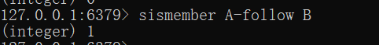
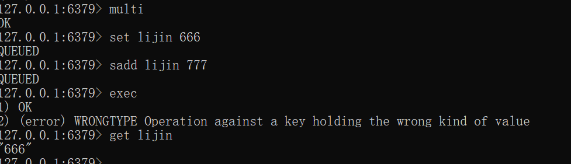
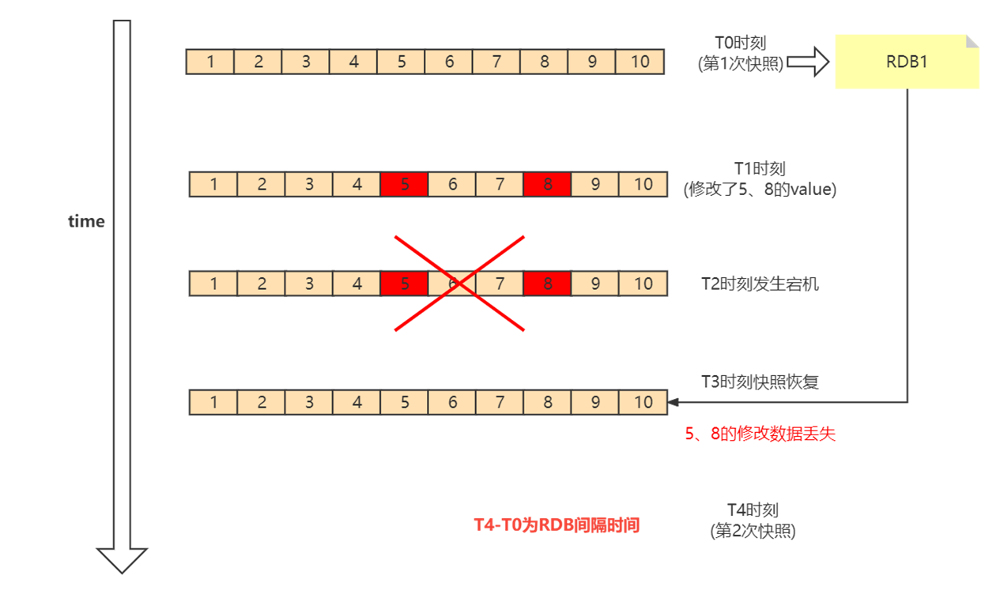

## redis2024-上

## 缓存基础面试题

## 1、为什么需要缓存，缓存的意义和底层原理是什么？

由于计算机体系结构的设计问题，所有的程序都会在CPU之中进行运算，然而考虑到计算数据的完整性，所有的数据不会通过磁盘加载，而是会通过内存进行数据的缓存，最终才会被加载到CPU之中，这样一来在整个项目的运行过程之中，如果磁盘IO的操作性能较差，那么最终就会导致程序变慢。


2、讲一讲你常用的缓存工具（单机与分布式）？

### **单机缓存工具**

#### **Caffeine**

Caffeine Cache 以其高性能和可扩展性赢得「 **本地缓存之王** 」的称号，它是一个 Java 缓存库。
Spring Boot 1.x 版本中的默认本地缓存是 Guava Cache。但在 Spring5 （SpringBoot 2.x）后，Spring 官方放弃了 Guava Cache 作为缓存机制，而是使用性能更优秀的 Caffeine 作为默认缓存组件。
我举例一些特功能：

Caffeine 支持异步加载缓存数据

Caffeine 提供了丰富的统计信息和监控功能，可以监控缓存的命中率、加载时间等指标。
Caffeine 提供了多种内存管理策略（过期机制管理）

#### **Guava Cache**

Guava Cache 是 Google 提供的 Java 缓存库

简单易用的 API、功能相对比价丰富。

#### **EhCache**

特色：EhCache提供了非常丰富的功能，不但可以将数据存储在JVM内部，还可以放到堆外（供了堆外缓存off-heap）

### 分布式缓存工具

#### Redis

基于内存的日志型Key-Value数据库。还支持事务、持久化、Lua脚本、LRU驱动事件和多种集群方案。

Redis的特点包括：

* 纯内存操作：数据存储在内存中，类似于HashMap，提供快速的查找和操作。
* 单线程操作：网络请求模块使用一个线程，避免多线程的CPU上下文切换和锁的问题，减少性能消耗。
* 多路I/O复用：使用I/O多路复用程序同时监听多个套接字，能够处理多个客户端连接，减少资源占用。

Redis的读写速度非常快，每秒可以处理超过10万次读写操作，因此它被广泛应用于缓存和分布式锁等场景。此外，Redis还提供了特殊的数据结构类型，如GEO、Hyperloglog和Bitmap。

#### Memcached

简单的一个分布式缓存，不支持持久化、数据类型只支持文本和二进制。

#### MongoDB

基于c++开发。是nosql数据库中功能最丰富，最像关系数据库的。

l 面向集合文档的存储：适合存储Bson（json的扩展）形式的数据；

l 格式自由，数据格式不固定，生产环境下修改结构都可以不影响程序运行；

l 强大的查询语句，面向对象的查询语言，基本覆盖sql语言所有能力；

l 完整的索引支持，支持查询计划；

l 支持复制和自动故障转移；

l 支持二进制数据及大型对象（文件）的高效存储；

l 使用分片集群提升系统扩展性；

l 使用内存映射存储引擎，把磁盘的IO操作转换成为内存的操作；

## 3、为什么要用Redis缓存（Redis缓存的优势）

**Redis的好处**

读取速度快，因为数据存在内存中，所以数据获取快，单机轻松10W+并发

支持多种数据结构，包括字符串、列表、集合、有序集合、哈希等

还拥有其他丰富的功能，主从复制、集群、数据持久化等

可以实现其他丰富的功能，消息队列、分布式锁等

## 4、如何理解Redis的单线程与Redis的多线程

### 单线程

**C语言实现，效率高**

C语言程序运行时要比其他语言编写的程序快得多，因为它“离底层机器很近”

**单线程的优势**

使用了单线程后，可维护性高。多线程模型虽然在某些方面表现优异，但是它却引入了程序执行顺序的不确定性，带来了并发读写的一系列问题，增加了系统复杂度、同时可能存在线程切换、甚至加锁解锁、死锁造成的性能损耗

**Pipeline**

Redis主要受限于内存和网络，几乎不会占用太多CPU。可以将命令和pipeline结合起来使用，减少命令在网络上的传输时间，将多次网络IO缩减为一次网络IO，通过使用pipeline每秒可以处理100万个请求。

**存储实现优化**

Redis的基础数据结构每一种至少有2种及2种以上的实现，在不同的大小或长度下选用适合的数据类型，达到极致的存储效率，从而提高写入和读取速度。

### 多线程

**Redis多线程比单线程性能提升一倍：**

Redis 作者 antirez 在 RedisConf 2019分享时曾提到：Redis 6 引入的多线程 IO 特性对性能提升至少是一倍以上。国内也有大牛曾使用unstable版本在阿里云esc进行过测试，GET/SET 命令在4线程 IO时性能相比单线程是几乎是翻倍了

**巨头公司的需求**

Redis将所有数据放在内存中，内存的响应时长大约为100纳秒，对于小数据包，Redis服务器可以处理80,000到100,000 QPS，这也是Redis处理的极限了，对于80%的公司来说，单线程的Redis已经足够使用了。

但随着越来越复杂的业务场景，有些公司动不动就上亿的交易量，因此需要更大的QPS。

**集群方案的问题**

常见的解决方案是在分布式架构中对数据进行分区并采用多个服务器，但该方案有非常大的缺点，例如要管理的Redis服务器太多，维护代价大；

某些适用于单个Redis服务器的命令不适用于数据分区；

数据分区无法解决热点读/写问题；数据偏斜，重新分配和放大/缩小变得更加复杂等等。

1.纯内存KV操作

Redis的操作都是基于内存的，CPU不是 Redis性能瓶颈,，Redis的瓶颈是机器内存和网络带宽。

在计算机的世界中，CPU的速度是远大于内存的速度的，同时内存的速度也是远大于硬盘的速度。redis的操作都是基于内存的，绝大部分请求是纯粹的内存操作，非常迅速。

2.单线程操作

使用单线程可以省去多线程时CPU上下文会切换的时间，也不用去考虑各种锁的问题，不存在加锁释放锁操作，没有死锁问题导致的性能消耗。对于内存系统来说，多次读写都是在一个CPU上，没有上下文切换效率就是最高的！既然单线程容易实现，而且 CPU 不会成为瓶颈，那就顺理成章的采用单线程的方案了

Redis 单线程指的是网络请求模块使用了一个线程，即一个线程处理所有网络请求，其他模块该使用多线程，仍会使用了多个线程。

3.I/O 多路复用

为什么 Redis 中要使用 I/O 多路复用这种技术呢？

首先，Redis 是跑在单线程中的，所有的操作都是按照顺序线性执行的，但是由于读写操作等待用户输入或输出都是阻塞的，所以 I/O 操作在一般情况下往往不能直接返回，这会导致某一文件的 I/O 阻塞导致整个进程无法对其它客户提供服务，而 I/O 多路复用就是为了解决这个问题而出现的

4.Reactor 设计模式

Redis 文件事件处理器由四个部分组成：套接字、I/O多路复用程序、文件时间分派器（dispatcher）、事件处理器。

文件事件是对套接字操作的抽象，每当一个套接字准备好执行连接应答（accept）、写入（write）、读取（read）、关闭（close）等操作时，就会相应产生一个文件事件。

I/O多路复用器负责通过loop循环监听多个套接字，同时将一系列套接字按循序存储到一个队列中，由队列向文件事件分派器传送队列中套接字。这个队列中套接字是有序的，它会当一个套接字事件被处理完毕后，会立马向文件事件分配器传送下一个套接字。

文件事件分配器接受队列中的套接字并根据套接字产生的事件类型，相应调用不同的事件处理器


## 5、Redis常见数据类型与运用场景

### 字符串（String）

**适合场景**

**缓存功能**

Redis 作为缓存层，MySQL作为存储层，绝大部分请求的数据都是从Redis中获取。由于Redis具有支撑高并发的特性,所以缓存通常能起到加速读写和降低后端压力的作用。

**计数**

使用Redis 作为计数的基础工具，它可以实现快速计数、查询缓存的功能,同时数据可以异步落地到其他数据源。

**共享Session**

一个分布式Web服务将用户的Session信息（例如用户登录信息)保存在各自服务器中，这样会造成一个问题，出于负载均衡的考虑，分布式服务会将用户的访问均衡到不同服务器上，用户刷新一次访问可能会发现需要重新登录，这个问题是用户无法容忍的。

为了解决这个问题,可以使用Redis将用户的Session进行集中管理,，在这种模式下只要保证Redis是高可用和扩展性的,每次用户更新或者查询登录信息都直接从Redis中集中获取。

**限速**

比如，很多应用出于安全的考虑,会在每次进行登录时,让用户输入手机验证码,从而确定是否是用户本人。但是为了短信接口不被频繁访问,会限制用户每分钟获取验证码的频率，例如一分钟不能超过5次。一些网站限制一个IP地址不能在一秒钟之内方问超过n次也可以采用类似的思路。

### 哈希(Hash)

Java里提供了HashMap，Redis中也有类似的数据结构，就是哈希类型。但是要注意，哈希类型中的映射关系叫作field-value，注意这里的value是指field对应的值，不是键对应的值。

**适合场景**

哈希类型比较适宜存放对象类型的数据，我们可以比较下，如果数据库中表记录user为：

| id | name  | age |
| -- | ----- | --- |
| 1  | lijin | 18  |
| 2  | msb   | 20  |

**1、使用String类型**

需要一条条去插入获取。

set user:1:name lijin;

set user:1:age  18;

set user:2:name msb;

set user:2:age  20;

**优点：简单直观，每个键对应一个值**

**缺点：键数过多，占用内存多，用户信息过于分散，不用于生产环境**

**2、使用hash类型**

hmset user:1 name lijin age 18

hmset user:2 name msb age 20

优点：简单直观，使用合理可减少内存空间消耗

### 列表（list）

列表( list)类型是用来存储多个有序的字符串，a、b、c、c、b四个元素从左到右组成了一个有序的列表,列表中的每个字符串称为元素(element)，一个列表最多可以存储(2^32-1)个元素(*4294967295*)。


**适合场景**

每个用户有属于自己的文章列表，现需要分页展示文章列表。此时可以考虑使用列表,因为列表不但是有序的,同时支持按照索引范围获取元素。

消息队列，Redis 的 lpush+brpop命令组合即可实现阻塞队列，生产者客户端使用lrpush从列表左侧插入元素，多个消费者客户端使用brpop命令阻塞式的“抢”列表尾部的元素,多个客户端保证了消费的负载均衡和高可用性。

### 集合（set）


集合( set）类型也是用来保存多个的字符串元素,但和列表类型不一样的是，集合中不允许有重复元素,并且集合中的元素是无序的,不能通过索引下标获取元素。

**适合场景**

集合类型比较典型的使用场景是标签(tag)。例如一个用户可能对娱乐、体育比较感兴趣，另一个用户可能对历史、新闻比较感兴趣，这些兴趣点就是标签。有了这些数据就可以得到喜欢同一个标签的人，以及用户的共同喜好的标签，这些数据对于用户体验以及增强用户黏度比较重要。

例如一个电子商务的网站会对不同标签的用户做不同类型的推荐，比如对数码产品比较感兴趣的人，在各个页面或者通过邮件的形式给他们推荐最新的数码产品，通常会为网站带来更多的利益。

除此之外，集合还可以通过生成随机数进行比如抽奖活动，以及社交图谱等等。

### 有序集合（ZSET）


有序集合相对于哈希、列表、集合来说会有一点点陌生,但既然叫有序集合,那么它和集合必然有着联系,它保留了集合不能有重复成员的特性,但不同的是,有序集合中的元素可以排序。但是它和列表使用索引下标作为排序依据不同的是,它给每个元素设置一个分数( score)作为排序的依据。

有序集合中的元素不能重复，但是score可以重复，就和一个班里的同学学号不能重复,但是考试成绩可以相同。

有序集合提供了获取指定分数和元素范围查询、计算成员排名等功能，合理的利用有序集合，能帮助我们在实际开发中解决很多问题。

有序集合比较典型的使用场景就是排行榜系统。例如视频网站需要对用户上传的视频做排行榜，榜单的维度可能是多个方面的:按照时间、按照播放数量、按照获得的赞数。

## 6、讲一讲Redis的高级数据类型与运用场景

### Bitmaps

现代计算机用二进制(位)作为信息的基础单位，1个字节等于8位，例如“big”字符串是由3个字节组成，但实际在计算机存储时将其用二进制表示,“big”分别对应的ASCII码分别是98、105、103，对应的二进制分别是01100010、01101001和 01100111。

许多开发语言都提供了操作位的功能，合理地使用位能够有效地提高内存使用率和开发效率。Redis提供了Bitmaps这个“数据结构”可以实现对位的操作。把数据结构加上引号主要因为:

Bitmaps本身不是一种数据结构，实际上它就是字符串，但是它可以对字符串的位进行操作。

Bitmaps单独提供了一套命令，所以在Redis中使用Bitmaps和使用字符串的方法不太相同。可以把 Bitmaps想象成一个以位为单位的数组，数组的每个单元只能存储0和1，数组的下标在 Bitmaps 中叫做偏移量。

#### 布隆过滤器

**1970 年布隆提出了一种布隆过滤器的算法，用来判断一个元素是否在一个集合中。
这种算法由一个二进制数组和一个 Hash 算法组成。**

本质上布隆过滤器是一种数据结构，比较巧妙的概率型数据结构（probabilistic data structure），特点是高效地插入和查询，可以用来告诉你 “某样东西一定不存在或者可能存在”。

相比于传统的 List、Set、Map 等数据结构，它更高效、占用空间更少，但是缺点是其返回的结果是概率性的，而不是确切的。

实际上，布隆过滤器广泛应用于网页黑名单系统、垃圾邮件过滤系统、爬虫网址判重系统等，Google 著名的分布式数据库 Bigtable 使用了布隆过滤器来查找不存在的行或列，以减少磁盘查找的IO次数，Google Chrome浏览器使用了布隆过滤器加速安全浏览服务。


### HyperLogLog

#### 介绍

HyperLogLog(Hyper[ˈhaɪpə(r)])并不是一种新的数据结构(实际类型为字符串类型)，而是一种基数算法,通过HyperLogLog可以利用极小的内存空间完成独立总数的统计，数据集可以是IP、Email、ID等。

如果你负责开发维护一个大型的网站，有一天产品经理要网站每个网页每天的 UV 数据，然后让你来开发这个统计模块，你会如何实现？

如果统计 PV 那非常好办，给每个网页一个独立的 Redis 计数器就可以了，这个计数器的 key 后缀加上当天的日期。这样来一个请求，incrby 一次，最终就可以统计出所有的 PV 数据。

但是 UV 不一样，它要去重，同一个用户一天之内的多次访问请求只能计数一次。这就要求每一个网页请求都需要带上用户的 ID，无论是登陆用户还是未登陆用户都需要一个唯一 ID 来标识。

一个简单的方案，那就是为每一个页面一个独立的 set 集合来存储所有当天访问过此页面的用户 ID。当一个请求过来时，我们使用 sadd 将用户 ID 塞进去就可以了。通过 scard 可以取出这个集合的大小，这个数字就是这个页面的 UV 数据。

但是，如果你的页面访问量非常大，比如一个爆款页面几千万的 UV，你需要一个很大的 set集合来统计，这就非常浪费空间。如果这样的页面很多，那所需要的存储空间是惊人的。为这样一个去重功能就耗费这样多的存储空间，值得么？其实需要的数据又不需要太精确，105w 和 106w 这两个数字对于老板们来说并没有多大区别，So，有没有更好的解决方案呢？

这就是HyperLogLog的用武之地，Redis 提供了 HyperLogLog 数据结构就是用来解决这种统计问题的。HyperLogLog 提供不精确的去重计数方案，虽然不精确但是也不是非常不精确，Redis官方给出标准误差是0.81%，这样的精确度已经可以满足上面的UV 统计需求了。

### GEO

Redis 3.2版本提供了GEO(地理信息定位)功能，支持存储地理位置信息用来实现诸如附近位置、摇一摇这类依赖于地理位置信息的功能。

地图元素的位置数据使用二维的经纬度表示，经度范围(-180, 180]，纬度范围(-90,90]，纬度正负以赤道为界，北正南负，经度正负以本初子午线(英国格林尼治天文台) 为界，东正西负。

业界比较通用的地理位置距离排序算法是GeoHash 算法，Redis 也使用GeoHash算法。GeoHash
算法将二维的经纬度数据映射到一维的整数，这样所有的元素都将在挂载到一条线上，距离靠近的二维坐标映射到一维后的点之间距离也会很接近。当我们想要计算「附近的人时」，首先将目标位置映射到这条线上，然后在这个一维的线上获取附近的点就行了。

#### 操作命令

##### 增加地理位置信息

geoadd key longitude latitude member [longitude latitude member ...J

longitude、latitude、member分别是该地理位置的经度、纬度、成员，例如下面有5个城市的经纬度。

城市            经度             纬度             成员

北京            116.28          39.55            beijing

天津            117.12          39.08            tianjin

石家庄        114.29          38.02            shijiazhuang

唐山            118.01          39.38            tangshan

保定            115.29          38.51            baoding

cities:locations是上面5个城市地理位置信息的集合，现向其添加北京的地理位置信息:

geoadd cities :locations 116.28 39.55 beijing

返回结果代表添加成功的个数，如果cities:locations没有包含beijing,那么返回结果为1，如果已经存在则返回0。

如果需要更新地理位置信息，仍然可以使用geoadd命令，虽然返回结果为0。geoadd命令可以同时添加多个地理位置信息:

geoadd cities:locations 117.12 39.08 tianjin 114.29 38.02
shijiazhuang 118.01 39.38 tangshan 115.29 38.51 baoding

##### 获取地理位置信息

geopos key member [member ...]下面操作会获取天津的经维度:

geopos cities:locations tianjin1)1)"117.12000042200088501"

##### 获取两个地理位置的距离。

geodist key member1 member2 [unit]

**其中unit代表返回结果的单位，包含以下四种:**

m (meters)代表米。

km (kilometers)代表公里。

mi (miles)代表英里。

ft(feet)代表尺。

下面操作用于计算天津到北京的距离，并以公里为单位:

geodist cities : locations tianjin beijing km

##### 获取指定位置范围内的地理信息位置集合

```
georadius key longitude latitude radius m|km|ft|mi [withcoord][withdist]
[withhash][COUNT count] [ascldesc] [store key] [storedist key]
georadiusbymember key member radius m|km|ft|mi  [withcoord][withdist]
[withhash] [COUNT count][ascldesc] [store key] [storedist key]

```

georadius和georadiusbymember两个命令的作用是一样的，都是以一个地理位置为中心算出指定半径内的其他地理信息位置，不同的是georadius命令的中心位置给出了具体的经纬度，georadiusbymember只需给出成员即可。其中radius  m | km |ft |mi是必需参数，指定了半径(带单位)。

这两个命令有很多可选参数，如下所示:

withcoord:返回结果中包含经纬度。

withdist:返回结果中包含离中心节点位置的距离。

withhash:返回结果中包含geohash，有关geohash后面介绍。

COUNT count:指定返回结果的数量。

asc l desc:返回结果按照离中心节点的距离做升序或者降序。

store key:将返回结果的地理位置信息保存到指定键。

storedist key:将返回结果离中心节点的距离保存到指定键。

下面操作计算五座城市中,距离北京150公里以内的城市:

georadiusbymember cities:locations beijing 150 km

##### 获取geohash

```
geohash key member [member ...]
```

Redis使用geohash将二维经纬度转换为一维字符串，下面操作会返回beijing的geohash值。

geohash cities: locations beijing

字符串越长,表示的位置更精确，geohash长度为9时,精度在2米左右，geohash长度为8时,精度在20米左右。

两个字符串越相似,它们之间的距离越近,Redis 利用字符串前缀匹配算法实现相关的命令。

geohash编码和经纬度是可以相互转换的。

##### 删除地理位置信息

zrem key member

GEO没有提供删除成员的命令，但是因为GEO的底层实现是zset，所以可以借用zrem命令实现对地理位置信息的删除。


## redis2024上-进阶1

## 1）如何理解Redis的事务？为什么不用事务

### 总结

Redis的事务功能很弱。在事务回滚机制上，Redis只能对基本的语法错误进行判断。

### 举例

事务简单地说，事务表示一组动作，要么全部执行，要么全部不执行。

Redis提供的事务功能，将一组需要一起执行的命令放到multi和exec两个命令之间。

* multi 命令代表事务开始
* exec命令代表事务结束
* discard命令是回滚。

一个客户端


另外一个客户端

在事务没有提交的时查询（查不到数据）


在事务提交后查询（可以查到数据）



如果事务中的命令出现错误,Redis 的事务处理机制是有问题的！！！

1、语法命令错误


例如下面操作错将set写成了sett，属于语法错误，会造成整个事务无法执行，事务内的操作都没有执行:

2、运行时错误

例如：事务内第一个命令简单的设置一个string类型，第二个对这个key进行sadd命令，这种就是运行时命令错误，因为语法是正确的:



可以看到Redis并不支持回滚功能，第一个set命令已经执行成功,开发人员需要自己修复这类问题。

### 原理

事务是Redis实现在服务器端的行为，用户执行MULTI命令时，服务器会**将这个用户对应的客户端**对象设置为一个特殊的状态，在这个状态下后续用户执行的查询命令不会被真的执行，而是被服务器缓存起来，直到用户执行EXEC命令为止，服务器会将这个用户对应的客户端对象中缓存的命令按照提交的顺序依次执行。


* 如果是 **普通指令** ，则判断当前是否存在事务队列，如果不存在直接执行，如果存在则入队
* 如果是 **事务指令** ，那么分为三种，multi为开启事务队列，exec为执行事务队列中的指令，执行完成后销毁队列，descrad为不执行队列中的指令，直接销毁队列

## 2）Redis 持久化方式有哪些？以及有什么区别？

### RDB

RDB持久化是把当前进程数据生成快照保存到硬盘的过程。所谓内存快照，就是指内存中的数据在某一个时刻的状态记录。这就类似于照片，当你给朋友拍照时，一张照片就能把朋友一瞬间的形象完全记下来。RDB 就是Redis DataBase 的缩写。

### AOF

AOF(append only file)持久化:以独立日志的方式记录每次写命令，重启时再重新执行AOF文件中的命令达到恢复数据的目的。AOF的主要作用是解决了数据持久化的实时性,目前已经是Redis持久化的主流方式。理解掌握好AOF持久化机制对我们兼顾数据安全性和性能非常有帮助。

### RDB持久化与问题

如下图所示，我们先在 T0 时刻做了一次快照（下一次快照是T4时刻），然后在T1时刻，数据块 5 和 8 被修改了。如果在T2时刻，机器宕机了，那么，只能按照 T0 时刻的快照进行恢复。此时，数据块 5 和 8 的修改值因为没有快照记录，就无法恢复了。



所以这里可以看出，如果想丢失较少的数据，那么T4-T0就要尽可能的小，但是如果频繁地执行全量
快照，也会带来两方面的开销：

1、频繁将全量数据写入磁盘，会给磁盘带来很大压力，多个快照竞争有限的磁盘带宽，前一个快照还没有做完，后一个又开始做了，容易造成恶性循环。

2、另一方面，bgsave 子进程需要通过 fork 操作从主线程创建出来。虽然子进程在创建后不会再阻塞主线程，但是，fork 这个创建过程本身会阻塞主线程，而且主线程的内存越大，阻塞时间越长。如果频繁fork出bgsave 子进程，这就会频繁阻塞主线程了。

所以基于这种情况，我们就需要AOF的持久化机制。

### AOF也不是万能的

因为AOF的持久化也是基于缓冲的，也不是每一次接收到命令就持久化：

开启AOF功能需要设置配置:appendonly yes，默认不开启。


Redis使用单线程响应命令，所有这里有一个AOF的缓冲区的概念。

Redis在开启AOF后，接收到命令先写入缓冲区aof_buf中，然后根据参数来进行持久化。

Redis提供了多种AOF缓冲区同步文件策略，由参数appendfsync控制。


**always**

同步写回：每个写命令执行完，立马同步地将日志写回磁盘；

**everysec**

每秒写回：每个写命令执行完，只是先把日志写到 AOF 文件的内存缓冲区，每隔一秒把缓冲区中的内容写入磁盘；

**no**

操作系统控制的写回：每个写命令执行完，只是先把日志写到 AOF 文件的内存缓冲区，由操作系统决定何时将缓冲区内容写回磁盘，通常同步周期最长30秒。

很明显，配置为always时，每次写入都要同步AOF文件，在一般的SATA 硬盘上，Redis只能支持大约几百TPS写入,显然跟Redis高性能特性背道而驰,不建议配置。

配置为no，由于操作系统每次同步AOF文件的周期不可控,而且会加大每次同步硬盘的数据量,虽然提升了性能,但数据安全性无法保证。

配置为everysec，是建议的同步策略，也是默认配置，做到兼顾性能和数据安全性。理论上只有在系统突然宕机的情况下丢失1秒的数据。(严格来说最多丢失1秒数据是不准确的)

想要获得高性能，就选择 no 策略；如果想要得到高可靠性保证，就选择always 策略；如果允许数据有一点丢失，又希望性能别受太大影响的话，那么就选择everysec 策略。

## 3）讲一讲Redis的渐进式rehash过程

### 全局哈希表

为了实现从键到值的快速访问，Redis 使用了一个哈希表来保存所有键值对。一个哈希表，其实就是一个数组，数组的每个元素称为一个哈希桶。所以，我们常说，一个哈希表是由多个哈希桶组成的，每个哈希桶中保存了键值对数据。


哈希桶中的 entry 元素中保存了*key和*value指针，分别指向了实际的键和值，这样一来，即使值是一个集合，也可以通过*value指针被查找到。因为这个哈希表保存了所有的键值对，所以，我也把它称为全局哈希表。

哈希表的最大好处很明显，就是让我们可以用 O(1) 的时间复杂度来快速查找到键值对：我们只需要计算键的哈希值，就可以知道它所对应的哈希桶位置，然后就可以访问相应的 entry 元素。

但当你往 Redis 中写入大量数据后，就可能发现操作有时候会突然变慢了。这其实是因为你忽略了一个潜在
的风险点，那就是哈希表的冲突问题和 rehash 可能带来的操作阻塞。

### Redis的渐进式rehash

Redis的渐进式rehash是指在进行哈希表扩容或缩容时，Redis采取的一种渐进式、非阻塞的方式来进行rehash操作，以减少对服务的影响。

具体来说，当Redis需要对哈希表进行扩容或缩容时，它会创建一个新的哈希表，并将原有哈希表中的数据逐步迁移到新的哈希表中。这个过程分为两个阶段：

1. **迁移数据**：Redis会在新哈希表中为每个槽位（slot）保留空间，并逐步将原哈希表中的数据按照一定的规则迁移到新哈希表中。这个过程是逐步进行的，每次只迁移一小部分数据，以减少对服务的影响。
2. **同步数据**：在数据迁移的过程中，新旧哈希表会同时存在，Redis会在后台不断地将新旧哈希表中的数据进行同步，确保数据的一致性。一旦所有数据都成功迁移并同步完成，Redis会将新哈希表替换为原有哈希表，完成rehash过程。

**redis的渐进式有两种规则：**

1. 分治的思想，将 rehash 分到之后的每步增删改查的操作当中，即每次处理redis时，复制一个key；
2. 在定时器中，最大执行一毫秒 rehash ；每次复制100 个数组key槽位


Rehash 过程中如果入到增删查改时会怎么做？

* 查：查找数据时，会先在hash表1中查找数据，如果没找到就会在hash表2中去找。
* 增：新增数据时，只会增加到hash表2中，不会在hash表1做任何操作。
* 删&改：在两个表上都会操作。

**redis除了扩容会有渐进式rehash，其实缩容时也会采用rehash。**

但是在rehash阶段，不会再发生扩容和缩容。必须等rehash结束。

## 4）如何理解Redis的分布式锁的实现

一句话总结Redis的分布式锁的实现：

利用Redis的单线程及原子性命令的特征、加入过期时间避免死锁、加入守护线程续锁避免锁释放问题！！！

### 具体实现

Redis 扩展了 SET 命令的参数，用这一条命令就可以了：

```
SET lock 1 EX 10 NX
```

Redis 有「互斥」的能力，我们可以使用 SETNX 命令，这个命令表示SET if Not Exists，即如果 key 不存在，才会设置它的值，否则什么也不做。

外加EX可以设置有效时间。


然后为了防止别人释放锁，就可以在对应的key的vaule值上写入对应的唯一性的ID（比如UUID）

在释放锁的环节加入判断：要先判断这把锁是否是自己持有，是才能释放锁，否则不释放锁。RedissonClient

### Redisson分布式锁源码分析

而Redisson的分布式锁也是基于上述的来处理，只是进行了优化。

1、redis的类型选用hash类型（可以存储更多的信息，包括锁的可重入处理）

2、加入订阅的处理，可以在解锁的时候进行通知。


```
private void lock(long leaseTime, TimeUnit unit, boolean interruptibly) throws InterruptedException {
        // 获取当前线程ID
	long threadId = Thread.currentThread().getId();
        // 尝试获取锁（重点）
 	Long ttl = tryAcquire(leaseTime, unit, threadId);
        // 成功获取锁, 过期时间为空（这里说明都是第一次加锁成功，直接返回）。
        if (ttl == null) {
            return;
        }
 	// 订阅分布式锁, 解锁时进行通知。
        RFuture<RedissonLockEntry> future = subscribe(threadId);
        if (interruptibly) {
            commandExecutor.syncSubscriptionInterrupted(future);
        } else {
            commandExecutor.syncSubscription(future);
        }

        try {
            while (true) {
  		// 再次尝试获取锁
                ttl = tryAcquire(leaseTime, unit, threadId);
                // lock acquired
		 // 成功获取锁, 过期时间为空, 成功返回。
                if (ttl == null) {
                    break;
                }

                // waiting for message
                if (ttl >= 0) {
                    try {
    			// 锁过期时间如果大于零, 则进行带过期时间的阻塞获取。
                        future.getNow().getLatch().tryAcquire(ttl, TimeUnit.MILLISECONDS);
                    } catch (InterruptedException e) {
                        if (interruptibly) {
                            throw e;
                        }
                        future.getNow().getLatch().tryAcquire(ttl, TimeUnit.MILLISECONDS);
                    }
                } else {
		    // 锁过期时间小于零, 则死等, 区分可中断及不可中断。
                    if (interruptibly) {
                        future.getNow().getLatch().acquire();
                    } else {
                        future.getNow().getLatch().acquireUninterruptibly();
                    }
                }
            }
        } finally {
 	    // 取消订阅
            unsubscribe(future, threadId);
        }
//        get(lockAsync(leaseTime, unit));
    }
```


## 5）Redis过期策略都有哪些？

### 过期处理策略

Redis 所有的数据结构都可以设置过期时间，时间一到，就会自动删除。但是会不会因为同一时间太多的key 过期，以至于忙不过来。同时因为Redis 是单线程的，删除的时间也会占用线程的处理时间，如果删除的太过于繁忙，会不会导致线上读写指令出现卡顿。

针对Redis设置了过期的key，处理方式主要有两种：定时扫描策略+惰性删除

#### 定时扫描策略

redis 会将每个设置了过期时间的key 放入到一个独立的字典中，以后会定时遍历这个字典来删除到期的 key。

Redis 默认会每秒进行十次过期扫描，过期扫描不会遍历过期字典中所有的 key，而是采用了一种简单的贪心策略。

1、从过期字典中随机 20 个 key；

2、删除这 20 个 key 中已经过期的 key；

3、如果过期的 key 比率超过 1/4，那就重复步骤 1；

所以业务开发人员一定要注意过期时间，如果有大批量的 key 过期，要给过期时间设置一个随机范围，而不能全部在同一时间过期。

**从库的过期策略**

从库不会进行过期扫描，从库对过期的处理是被动的。主库在 key 到期时，会在 AOF 文件里增加一条 del 指令，同步到所有的从库，从库通过执行这条 del 指令来删除过期的 key。

因为指令同步是异步进行的，所以主库过期的key 的 del 指令没有及时同步到从库的话，会出现主从数据的不一致，主库没有的数据在从库里还存在，比如上一节的集群环境分布式锁的算法漏洞就是因为这个同步延迟产生的。

#### 惰性删除

所谓惰性策略就是在客户端访问这个key的时候，redis对key的过期时间进行检查，如果过期了就立即删除，不会给你返回任何东西。

定期删除可能会导致很多过期key到了时间并没有被删除掉。所以就有了惰性删除。假如你的过期 key，靠定期删除没有被删除掉，还停留在内存里，除非你的系统去查一下那个 key，才会被redis给删除掉。这就是所谓的惰性删除，即当你主动去查过期的key时,如果发现key过期了,就立即进行删除,不返回任何东西.

**总结：定期删除是集中处理，惰性删除是零散处理。**

### 内存淘汰算法

当 Redis 内存超出物理内存限制时，内存的数据会开始和磁盘产生频繁的交换 (swap)。交换会让 Redis 的性能急剧下降，对于访问量比较频繁的 Redis 来说，这样龟速的存取效率基本上等于不可用。

#### maxmemory

在生产环境中我们是不允许 Redis 出现交换行为的，为了限制最大使用内存，Redis 提供了配置参数 maxmemory 来限制内存超出期望大小。

当实际内存超出 maxmemory 时，Redis 提供了几种可选策略\(maxmemory-policy) 来让用户自己决定该如何腾出新的空间以继续提供读写服务。


#### Noeviction

noeviction 不会继续服务写请求
(DEL 请求可以继续服务)，读请求可以继续进行。这样可以保证不会丢失数据，但是会让线上的业务不能持续进行。这是默认的淘汰策略。

#### volatile-lru

volatile-lru 尝试淘汰设置了过期时间的
key，最老使用的 key 优先被淘汰。没有设置过期时间的 key 不会被淘汰，这样可以保证需要持久化的数据不会突然丢失。

#### volatile-ttl

volatile-ttl 跟上面一样，除了淘汰的策略不是 LRU，而是 key 的剩余寿命 ttl 的值，ttl 越小越优先被淘汰。

#### volatile-random

volatile-random 跟上面一样，不过淘汰的 key 是过期 key 集合中随机的 key。

#### allkeys-lru

allkeys-lru 区别于volatile-lru，这个策略要淘汰的 key 对象是全体的 key 集合，而不只是过期的 key 集合。这意味着没有设置过期时间的 key 也会被淘汰。

#### allkeys-random

allkeys-random跟上面一样，不过淘汰的策略是随机的 key。

volatile-xxx 策略只会针对带过期时间的key 进行淘汰，allkeys-xxx 策略会对所有的 key 进行淘汰。如果你只是拿 Redis 做缓存，那应该使用 allkeys-xxx，客户端写缓存时不必携带过期时间。如果你还想同时使用 Redis 的持久化功能，那就使用 volatile-xxx 策略，这样可以保留没有设置过期时间的 key，它们是永久的 key 不会被 LRU 算法淘汰。

### 内存淘汰算法

#### LRU 算法

LRU 全称为：Least recently used

**思想是** ：如果数据 **最近被访问过** ，那么未来最近一段时间，这个数据未来被访问的几率也会更大。

实现 LRU 算法除了需要key/value 字典外，还需要附加一个链表，链表中的元素按照一定的顺序进行排列。当空间满的时候，会踢掉链表尾部的元素。当字典的某个元素被访问时，它在链表中的位置会被移动到表头。所以链表的元素排列顺序就是元素最近被访问的时间顺序。

位于链表尾部的元素就是不被重用的元素，所以会被踢掉。位于表头的元素就是最近刚刚被人用过的元素，所以暂时不会被踢。


#### 近似 LRU 算法

Redis 使用的是一种近似 LRU 算法，它跟 LRU 算法还不太一样。之所以不使用 LRU 算法，是因为需要消耗大量的额外的内存，需要对现有的数据结构进行较大的改造。近似

LRU 算法则很简单，在现有数据结构的基础上使用随机采样法来淘汰元素，能达到和 LRU 算法非常近似的效果。Redis 为实现近似 LRU 算法，它给每个 key 增加了一个额外的小字段，这个字段的长度是 24 个 bit，也就是最后一次被访问的时间戳。

当 Redis 执行写操作时，发现内存超出maxmemory，就会执行一次 LRU 淘汰算法。这个算法也很简单，就是随机采样出 5(可以配置maxmemory-samples) 个 key，然后淘汰掉最旧的 key，如果淘汰后内存还是超出 maxmemory，那就继续随机采样淘汰，直到内存低于 maxmemory 为止。


如何采样就是看maxmemory-policy 的配置，如果是 allkeys 就是从所有的 key 字典中随机，如果是 volatile 就从带过期时间的 key 字典中随机。每次采样多少个 key 看的是 maxmemory_samples 的配置，默认为 5。

#### LFU算法

LFU算法的全称是Least Frequently Used，它的核心思想是根据key的最近被访问的频率进行淘汰，很少被访问的优先被淘汰，被访问的多的则被留下来。

* LRU 强调最近最少使用，关注的是最近有没有使用过
* **LFU 强调的是一段时间的使用次数，关注的是频次**

LFU算法能更好的表示一个key被访问的热度。假如你使用的是LRU算法，一个key很久没有被访问到，只刚刚是偶尔被访问了一次，那么它就被认为是热点数据，不会被淘汰，而有些key将来是很有可能被访问到的则被淘汰了。如果使用LFU算法则不会出现这种情况，因为使用一次并不会使一个key成为热点数据。LFU原理使用计数器来对key进行排序，每次key被访问的时候，计数器增大。计数器越大，可以约等于访问越频繁。具有相同引用计数的数据块则按照时间排序。


## redis2024上-进阶2

## 1）什么是缓存击穿？如何解决

缓存击穿是指一个Key非常热点，在不停的扛着大并发，大并发集中对这一个点进行访问，当这个Key在失效的瞬间，持续的大并发就穿破缓存，直接请求数据库，就像在一个完好无损的桶上凿开了一个洞。

缓存击穿的话，设置热点数据永远不过期。或者加上互斥锁就能搞定了。

#### 使用互斥锁(mutex key)

业界比较常用的做法，是使用mutex。简单地来说，就是在缓存失效的时候（判断拿出来的值为空），不是立即去load db，而是先使用缓存工具的某些带成功操作返回值的操作（比如Redis的SETNX或者Memcache的ADD）去set一个mutex key，当操作返回成功时，再进行load db的操作并回设缓存；否则，就重试整个get缓存的方法。

伪代码如下图：


#### 永远不过期

这里的“永远不过期”包含两层意思：

(1) 从redis上看，确实没有设置过期时间，这就保证了，不会出现热点key过期问题，也就是“物理”不过期。

(2) 从功能上看，如果不过期，那不就成静态的了吗？所以我们把过期时间存在key对应的value里，如果发现要过期了，通过一个后台的异步线程进行缓存的构建，也就是“逻辑”过期

从实战看，这种方法对于性能非常友好，唯一不足的就是构建缓存时候，其余线程(非构建缓存的线程)可能访问的是老数据，但是对于一般的互联网功能来说这个还是可以忍受。

## 2）什么是缓存穿透？如何解决

是指查询一个根本不存在的数据，缓存层和存储层都不会命中，于是这个请求就可以随意访问数据库，这个就是缓存穿透，缓存穿透将导致不存在的数据每次请求都要到存储层去查询，失去了缓存保护后端存储的意义。

缓存穿透问题可能会使后端存储负载加大，由于很多后端存储不具备高并发性，甚至可能造成后端存储宕掉。通常可以在程序中分别统计总调用数、缓存层命中数、存储层命中数，如果发现大量存储层空命中，可能就是出现了缓存穿透问题。

造成缓存穿透的基本原因有两个。

第一，自身业务代码或者数据出现问题，比如，我们数据库的 id 都是1开始自增上去的，如发起为id值为 -1 的数据或 id 为特别大不存在的数据。如果不对参数做校验，数据库id都是大于0的，我一直用小于0的参数去请求你，每次都能绕开Redis直接打到数据库，数据库也查不到，每次都这样，并发高点就容易崩掉了。

第二,一些恶意攻击、爬虫等造成大量空命中。下面我们来看一下如何解决缓存穿透问题。

1.缓存空对象

当存储层不命中，到数据库查发现也没有命中，那么仍然将空对象保留到缓存层中，之后再访问这个数据将会从缓存中获取,这样就保护了后端数据源。

缓存空对象会有两个问题:

第一，空值做了缓存，意味着缓存层中存了更多的键，需要更多的内存空间(如果是攻击，问题更严重),比较有效的方法是针对这类数据设置一个较短的过期时间，让其自动剔除。

第二，缓存层和存储层的数据会有一段时间窗口的不一致，可能会对业务有一定影响。例如过期时间设置为5分钟，如果此时存储层添加了这个数据，那此段时间就会出现缓存层和存储层数据的不一致，此时可以利用消前面所说的数据一致性方案处理。

2.布隆过滤器拦截

在访问缓存层和存储层之前,将存在的key用布隆过滤器提前保存起来,做第一层拦截。例如:一个推荐系统有4亿个用户id，每个小时算法工程师会根据每个用户之前历史行为计算出推荐数据放到存储层中,但是最新的用户由于没有历史行为,就会发生缓存穿透的行为,为此可以将所有推荐数据的用户做成布隆过滤器。如果布隆过滤器认为该用户id不存在,那么就不会访问存储层,在一定程度保护了存储层。


这种方法适用于数据命中不高、数据相对固定、实时性低(通常是数据集较大)的应用场景,代码维护较为复杂,但是缓存空间占用少。

## 3）什么是缓存雪崩？如何解决

缓存雪崩:由于缓存层承载着大量请求,有效地保护了存储层,但是如果缓存层由于某些原因不能提供服务，比如同一时间缓存数据大面积失效，那一瞬间Redis跟没有一样，于是所有的请求都会达到存储层，存储层的调用量会暴增，造成存储层也会级联宕机的情况。

缓存雪崩的英文原意是stampeding herd(奔逃的野牛)，指的是缓存层宕掉后，流量会像奔逃的野牛一样,打向后端存储。

预防和解决缓存雪崩问题,可以从以下三个方面进行着手。

1）保证缓存层服务高可用性。和飞机都有多个引擎一样，如果缓存层设计成高可用的,即使个别节点、个别机器、甚至是机房宕掉，依然可以提供服务，例如前面介绍过的Redis

Sentinel和 Redis Cluster都实现了高可用。

2）依赖隔离组件为后端限流并降级。无论是缓存层还是存储层都会有出错的概率，可以将它们视同为资源。作为并发量较大的系统，假如有一个资源不可用，可能会造成线程全部阻塞(hang)在这个资源上，造成整个系统不可用。

3）提前演练。在项目上线前，演练缓存层宕掉后，应用以及后端的负载情况以及可能出现的问题,在此基础上做一些预案设定。

4）将缓存失效时间分散开，比如我们可以在原有的失效时间基础上增加一个随机值，比如1-5分钟随机，这样每一个缓存的过期时间的重复率就会降低，就很难引发集体失效的事件。

## 4）什么是BigKey？如何解决

### 什么是bigkey

bigkey是指key对应的value所占的内存空间比较大，例如一个字符串类型的value可以最大存到512MB，一个列表类型的value最多可以存储23-1个元素。

如果按照数据结构来细分的话，一般分为字符串类型bigkey和非字符串类型bigkey。

字符串类型：体现在单个value值很大，一般认为超过10KB就是bigkey，但这个值和具体的OPS相关。

非字符串类型：哈希、列表、集合、有序集合,体现在元素个数过多。

bigkey无论是空间复杂度和时间复杂度都不太友好，下面我们将介绍它的危害。

### bigkey的危害

bigkey的危害体现在三个方面:

1、内存空间不均匀.(平衡):例如在Redis Cluster中，bigkey 会造成节点的内存空间使用不均匀。

2、超时阻塞:由于Redis单线程的特性，操作bigkey比较耗时，也就意味着阻塞Redis可能性增大。

3、网络拥塞:每次获取bigkey产生的网络流量较大

假设一个bigkey为1MB，每秒访问量为1000，那么每秒产生1000MB 的流量,对于普通的千兆网卡(按照字节算是128MB/s)的服务器来说简直是灭顶之灾，而且一般服务器会采用单机多实例的方式来部署,也就是说一个bigkey可能会对其他实例造成影响,其后果不堪设想。

bigkey的存在并不是完全致命的：

如果这个bigkey存在但是几乎不被访问,那么只有内存空间不均匀的问题存在,相对于另外两个问题没有那么重要紧急,但是如果bigkey是一个热点key(频繁访问)，那么其带来的危害不可想象,所以在实际开发和运维时一定要密切关注bigkey的存在。

#### 发现bigkey

redis-cli --bigkeys可以命令统计bigkey的分布。


但是在生产环境中，开发和运维人员更希望自己可以定义bigkey的大小，而且更希望找到真正的bigkey都有哪些,这样才可以去定位、解决、优化问题。

判断一个key是否为bigkey，只需要执行debug object key查看serializedlength属性即可，它表示 key对应的value序列化之后的字节数。


如果是要遍历多个，则尽量不要使用keys的命令，可以使用scan的命令来减少压力。

##### scan

Redis 从2.8版本后，提供了一个新的命令scan，它能有效的解决keys命令存在的问题。和keys命令执行时会遍历所有键不同,scan采用渐进式遍历的方式来解决 keys命令可能带来的阻塞问题，但是要真正实现keys的功能,需要执行多次scan。可以想象成只扫描一个字典中的一部分键，直到将字典中的所有键遍历完毕。scan的使用方法如下:

```
scan cursor [match pattern] [count number]
```

cursor ：是必需参数，实际上cursor是一个游标，第一次遍历从0开始，每次scan遍历完都会返回当前游标的值,直到游标值为0,表示遍历结束。

Match pattern ：是可选参数,它的作用的是做模式的匹配,这点和keys的模式匹配很像。

Count number ：是可选参数,它的作用是表明每次要遍历的键个数,默认值是10,此参数可以适当增大。


可以看到，第一次执行scan 0，返回结果分为两个部分:

第一个部分9就是下次scan需要的cursor

第二个部分是10个键。接下来继续

直到得到结果cursor变为0，说明所有的键已经被遍历过了。

除了scan 以外，Redis提供了面向哈希类型、集合类型、有序集合的扫描遍历命令，解决诸如hgetall、smembers、zrange可能产生的阻塞问题，对应的命令分别是hscan、sscan、zscan，它们的用法和scan基本类似，请自行参考Redis官网。


渐进式遍历可以有效的解决keys命令可能产生的阻塞问题，但是scan并非完美无瑕，如果在scan 的过程中如果有键的变化(增加、删除、修改)，那么遍历效果可能会碰到如下问题:新增的键可能没有遍历到，遍历出了重复的键等情况，也就是说scan并不能保证完整的遍历出来所有的键，这些是我们在开发时需要考虑的。

如果键值个数比较多，scan + debug object会比较慢，可以利用Pipeline机制完成。对于元素个数较多的数据结构，debug object执行速度比较慢，存在阻塞Redis的可能，所以如果有从节点,可以考虑在从节点上执行。

#### 解决bigkey

主要思路为拆分，对 big key 存储的数据 （big value）进行拆分，变成value1，value2… valueN等等。

例如big value 是个大json 通过 mset 的方式，将这个 key 的内容打散到各个实例中，或者一个hash，每个field代表一个具体属性，通过hget、hmget获取部分value，hset、hmset来更新部分属性。

例如big value 是个大list，可以拆成将list拆成。= list_1， list_2, list3, ...listN

## 5）什么是热点Key？如何解决

在Redis中，访问频率高的key称为热点key。

### 产生原因和危害

#### 原因

热点问题产生的原因大致有以下两种：

用户消费的数据远大于生产的数据（热卖商品、热点新闻、热点评论、明星直播）。

在日常工作生活中一些突发的事件，例如：双十一期间某些热门商品的降价促销，当这其中的某一件商品被数万次点击浏览或者购买时，会形成一个较大的需求量，这种情况下就会造成热点问题。同理，被大量刊发、浏览的热点新闻、热点评论、明星直播等，这些典型的读多写少的场景也会产生热点问题。

请求分片集中，超过单Server的性能极限。在服务端读数据进行访问时，往往会对数据进行分片切分，此过程中会在某一主机Server上对相应的Key进行访问，当访问超过Server极限时，就会导致热点Key问题的产生。

#### 危害

1、流量集中，达到物理网卡上限。

2、请求过多，缓存分片服务被打垮。

3、DB击穿，引起业务雪崩。

### 发现热点key

#### 预估发现

针对业务提前预估出访问频繁的热点key，例如秒杀商品业务中，秒杀的商品都是热点key。

当然并非所有的业务都容易预估出热点key，可能出现漏掉或者预估错误的情况。

#### 客户端发现

客户端其实是距离key"最近"的地方，因为Redis命令就是从客户端发出的，以Jedis为例，可以在核心命令入口，使用这个Google Guava中的AtomicLongMap进行记录，如下所示。

使用客户端进行热点key的统计非常容易实现，但是同时问题也非常多：

(1) 无法预知key的个数，存在内存泄露的危险。

(2) 对于客户端代码有侵入，各个语言的客户端都需要维护此逻辑，维护成本较高。

(3) 规模化汇总实现比较复杂。

#### Redis发现

##### monitor命令

monitor命令可以监控到Redis执行的所有命令，利用monitor的结果就可以统计出一段时间内的热点key排行榜，命令排行榜，客户端分布等数据。


Facebook开源的redis-faina正是利用上述原理使用Python语言实现的，例如下面获取最近10万条命令的热点key、热点命令、耗时分布等数据。为了减少网络开销以及加快输出缓冲区的消费速度，monitor尽可能在本机执行。

**此种方法会有两个问题：**

1、monitor命令在高并发条件下，内存暴增同时会影响Redis的性能，所以此种方法适合在短时间内使用。

2、只能统计一个Redis节点的热点key，对于Redis集群需要进行汇总统计。

**可以参考的框架：Facebook开源的redis-faina正是利用上述原理使用Python语言实现的**

##### hotkeys

Redis在4.0.3中为redis-cli提供了--hotkeys，用于找到热点key。


如果有错误，需要先把内存逐出策略设置为allkeys-lfu或者volatile-lfu，否则会返回错误。


但是如果键值较多，执行较慢，和热点的概念的有点背道而驰，同时热度定义的不够准确。

#### 抓取TCP包发现

Redis客户端使用TCP协议与服务端进行交互，通信协议采用的是RESP。如果站在机器的角度，可以通过对机器上所有Redis端口的TCP数据包进行抓取完成热点key的统计

此种方法对于Redis客户端和服务端来说毫无侵入，是比较完美的方案，但是依然存在3个问题：

(1) 需要一定的开发成本

(2) 对于高流量的机器抓包，对机器网络可能会有干扰，同时抓包时候会有丢包的可能性。

(3) 维护成本过高。

对于成本问题，有一些开源方案实现了该功能，例如ELK(ElasticSearch Logstash Kibana)体系下的packetbeat[2] 插件，可以实现对Redis、MySQL等众多主流服务的数据包抓取、分析、报表展示

### 解决热点key

发现热点key之后，需要对热点key进行处理。

#### 使用二级缓存

可以使用 guava-cache或hcache，发现热点key之后，将这些热点key加载到JVM中作为本地缓存。访问这些key时直接从本地缓存获取即可，不会直接访问到redis层了，有效的保护了缓存服务器。

#### key分散

将热点key分散为多个子key，然后存储到缓存集群的不同机器上，这些子key对应的value都和热点key是一样的。当通过热点key去查询数据时，通过某种hash算法随机选择一个子key，然后再去访问缓存机器，将热点分散到了多个子key上。

## 6）多级缓存架构与问题分析

## Caffeine+Redis两级缓存架构

在高性能的服务项目中，我们一般会将一些热点数据存储到 Redis这类缓存中间件中，只有当缓存的访问没有命中时再查询数据库。在提升访问速度的同时，也能降低数据库的压力。

但是在一些场景下单纯使用 Redis 的分布式缓存不能满足高性能的要求，所以还需要加入使用本地缓存Caffeine，从而再次提升程序的响应速度与服务性能。于是，就产生了使用本地缓存（Caffeine）作为一级缓存，再加上分布式缓存（Redis）作为二级缓存的两级缓存架构。


## 两级缓存架构优缺点

**优点：**

* 一级缓存基于应用的内存，访问速度非常快，对于一些变更频率低、实时性要求低的数据，可以放在本地缓存中，提升访问速度；
* 使用一级缓存能够减少和 Redis 的二级缓存的远程数据交互，减少网络 I/O 开销，降低这一过程中在网络通信上的耗时。

**缺点：**

* 数据一致性问题：两级缓存与数据库的数据要保持一致，一旦数据发生了修改，在修改数据库的同时，一级缓存、二级缓存应该同步更新。
* 分布式多应用情况下：一级缓存之间也会存在一致性问题，当一个节点下的本地缓存修改后，需要通知其他节点也刷新本地一级缓存中的数据，否则会出现读取到过期数据的情况。
* 缓存的过期时间、过期策略以及多线程的问题

## 7）Redis主从、哨兵、集群问题分析


### Redis主从复制原理


在从节点执行slaveof命令后，复制过程便开始运作。

#### 1）保存主节点信息

执行slaveof后从节点只保存主节点的地址信息便直接返回，这时建立复制流程还没有开始。

#### 2）建立主从socket连接

从节点(slave)内部通过每秒运行的定时任务维护复制相关逻辑，当定时任务发现存在新的主节点后，会尝试与该节点建立网络连接。

从节点会建立一个socket套接字，专门用于接受主节点发送的复制命令。从节点连接成功后打印日志。

如果从节点无法建立连接，定时任务会无限重试直到连接成功或者执行slaveof no one取消复制。


#### 3）发送ping命令

连接建立成功后从节点发送ping请求进行首次通信，ping请求主要目的：检测主从之间网络套接字是否可用、检测主节点当前是否可接受处理命令。


从节点发送的ping命令成功返回，Redis打印日志，并继续后续复制流程:

#### 4）权限验证

如果主节点设置了requirepass参数，则需要密码验证，从节点必须配置masterauth参数保证与主节点相同的密码才能通过验证;如果验证失败复制将终止，从节点重新发起复制流程。


#### 5) 同步数据集

主从复制连接正常通信后，对于首次建立复制的场景,主节点会把持有的数据全部发送给从节点，这部分操作是耗时最长的步骤。Redis在2.8版本以后采用新复制命令 psync进行数据同步，原来的sync命令依然支持，保证新旧版本的兼容性。新版同步划分两种情况:全量同步和部分同步。

#### 6) 命令持续复制

当主节点把当前的数据同步给从节点后，便完成了复制的建立流程。接下来主节点会持续地把写命令发送给从节点,保证主从数据一致性。


### 哨兵实现原理

Redis Sentinel的基本实现中包含以下：
Redis Sentinel 的定时任务、主观下线和客观下线、Sentinel领导者选举、故障转移等等知识点，学习这些可以让我们对Redis Sentinel的高可用特性有更加深入的理解和认识。

#### 三个定时监控任务

一套合理的监控机制是Sentinel节点判定节点不可达的重要保证，Redis Sentinel通过三个定时监控任务完成对各个节点发现和监控：

##### 1、每隔10秒的定时监控


每隔10秒，每个Sentinel节点会向主节点和从节点发送info命令获取最新的拓扑结构，Sentinel节点通过对上述结果进行解析就可以找到相应的从节点。

这个定时任务的作用具体可以表现在三个方面:

1、通过向主节点执行info命令，获取从节点的信息,这也是为什么Sentinel节点不需要显式配置监控从节点。

2、当有新的从节点加入时都可以立刻感知出来。

3、节点不可达或者故障转移后，可以通过info命令实时更新节点拓扑信息。

##### 2、每隔2秒的定时监控


每隔2秒,每个Sentinel节点会向Redis数据节点的_sentinel_:hello频道上发送该Sentinel节点对于主节点的判断以及当前Sentinel节点的信息，同时每个Sentinel节点也会订阅该频道，来了解其他Sentinel节点以及它们对主节点的判断,所以这个定时任务可以完成以下两个工作:

发现新的Sentinel节点:通过订阅主节点的__sentinel__:hello了解其他的Sentinel节点信息，如果是新加入的Sentinel节点，将该Sentinel节点信息保存起来,并与该 Sentinel节点创建连接。

Sentinel节点之间交换主节点的状态，作为后面客观下线以及领导者选举的依据。

##### 3、每隔1秒的定时监控


每隔1秒，每个Sentinel节点会向主节点、从节点、其余Sentinel节点发送一条ping命令做一次心跳检测，来确认这些节点当前是否可达。

通过上面的定时任务，Sentinel节点对主节点、从节点、其余Sentinel节点都建立起连接，实现了对每个节点的监控,这个定时任务是节点失败判定的重要依据。


#### 主观下线和客观下线

##### 主观下线


上一小节介绍的第三个定时任务，每个Sentinel节点会每隔1秒对主节点、从节点、其他Sentinel节点发送ping命令做心跳检测,当这些节点超过down-after-milliseconds没有进行有效回复，Sentinel节点就会对该节点做失败判定，这个行为叫做主观下线。从字面意思也可以很容易看出主观下线是当前Sentinel节点的一家之言,存在误判的可能。

##### 客观下线


当Sentinel主观下线的节点是主节点时，该Sentinel节点会通过sentinel is-master-down-by-addr命令向其他Sentinel节点询问对主节点的判断，当超过&#x3c;quorum>个数,Sentinel节点认为主节点确实有问题，这时该Sentinel节点会做出客观下线的决定，这样客观下线的含义是比较明显了，也就是大部分Sentinel节点都对主节点的下线做了同意的判定，那么这个判定就是客观的。


##### 领导者Sentinel节点选举


假如Sentinel节点对于主节点已经做了客观下线，那么是不是就可以立即进行故障转移了？当然不是，实际上故障转移的工作只需要一个Sentinel节点来完成即可，所以 Sentinel节点之间会做一个领导者选举的工作，选出一个Sentinel节点作为领导者进行故障转移的工作。Redis使用了Raft算法实现领导者选举，Redis Sentinel进行领导者选举的大致思路如下:

1 )每个在线的Sentinel节点都有资格成为领导者，当它确认主节点主观下线时候，会向其他Sentinel节点发送sentinel is-master-down-by-addr命令，要求将自己设置为领导者。

2)收到命令的Sentinel节点，如果没有同意过其他Sentinel节点的sentinel is-master-down-by-addr命令,将同意该请求,否则拒绝。

3）如果该Sentinel节点发现自己的票数已经大于等于max (quorum，num(sentinels)/2+1）,那么它将成为领导者。

4）如果此过程没有选举出领导者,将进入下一次选举。

选举的过程非常快,基本上谁先完成客观下线,谁就是领导者。

Raft协议的详细版本：

[raft-zh_cn/raft-zh_cn.md at master · maemual/raft-zh_cn · GitHub](https://github.com/maemual/raft-zh_cn/blob/master/raft-zh_cn.md)

如果你想手写一个Raft协议，可以看下蚂蚁金服的开发生产的raft算法组件

[GitHub - sofastack/sofa-jraft: A production-grade java implementation of RAFT consensus algorithm.](https://github.com/sofastack/sofa-jraft)

选举很快的！！


#### 故障转移

领导者选举出的Sentinel节点负责故障转移，具体步骤如下:


1)在从节点列表中选出一个节点作为新的主节点,选择方法如下:

```
a)过滤:“不健康”(主观下线、断线)、5秒内没有回复过Sentinel节点 ping响应、与主节点失联超过down-after-milliseconds*10秒。
```

```
b)选择slave-priority(从节点优先级)最高的从节点列表，如果存在则返回,不存在则继续。
```

```
c）选择复制偏移量最大的从节点(复制的最完整)，如果存在则返回,不存在则继续。
```

```
d）选择runid最小的从节点。
```

2 ) Sentinel领导者节点会对第一步选出来的从节点执行slaveof no one命令让其成为主节点。

3 ) Sentinel领导者节点会向剩余的从节点发送命令，让它们成为新主节点的从节点,复制规则和parallel-syncs参数有关。

4 ) Sentinel节点集合会将原来的主节点更新为从节点，并保持着对其关注，当其恢复后命令它去复制新的主节点。

### Redis Sentinel的客户端

如果主节点挂掉了，虽然Redis Sentinel可以完成故障转移，但是客户端无法获取这个变化，那么使用Redis Sentinel的意义就不大了，所以各个语言的客户端需要对Redis Sentinel进行显式的支持。

Sentinel节点集合具备了监控、通知、自动故障转移、配置提供者若干功能，也就是说实际上最了解主节点信息的就是Sentinel节点集合，而各个主节点可以通过&#x3c;host-name>进行标识的，所以，无论是哪种编程语言的客户端，如果需要正确地连接Redis Sentinel，必须有Sentinel节点集合和masterName两个参数。

我们依然使用Jedis 作为Redis 的 Java客户端，Jedis能够很好地支持Redis
Sentinel，并且使用Jedis连接Redis Sentinel也很简单，按照Redis Sentinel的原理，需要有masterName和Sentinel节点集合两个参数。Jedis针对Redis Sentinel给出了一个 JedisSentinelPool。

具体代码可以参见redis-sentinel：


实现一个Redis Sentinel客户端一般来说需要:

1）遍历Sentinel节点集合获取一个可用的Sentinel节点，Sentinel节点之间可以共享数据，所以从任意一个Sentinel节点获取主节点信息都是可以的。

2)通过sentinel get-master-addr-by-name host-name这个API来获取对应主节点的相关信息。

3）验证当前获取的“主节点”是真正的主节点，这样做的目的是为了防止故障转移期间主节点的变化。

4）保持和 Sentinel节点集合的“联系”，时刻获取关于主节点的相关“信息”。

但是注意，JedisSentinel的实现是不支持读写分离的，所有的连接都是连接到Master上面，Slave就完全当成Master的备份，存在着性能浪费。因此如果想支持读写分离，需要自行实现，这里给一个参考


### Redis集群原理

#### 节点通信

##### 通信流程

在分布式存储中需要提供维护节点元数据信息的机制,所谓元数据是指:节点负责哪些数据,是否出现故障等状态信息。常见的元数据维护方式分为:集中式和P2P方式。Redis集群采用P2P的Gossip（流言)协议，Gossip协议工作原理就是节点彼此不断通信交换信息,一段时间后所有的节点都会知道集群完整的信息,这种方式类似流言传播。

通信过程说明:

1)集群中的每个节点都会单独开辟一个TCP通道,用于节点之间彼此通信,通信端口号在基础端口上加10000。

2)每个节点在固定周期内通过特定规则选择几个节点发送ping消息。

3）接收到ping消息的节点用pong消息作为响应。

集群中每个节点通过一定规则挑选要通信的节点，每个节点可能知道全部节点,也可能仅知道部分节点，只要这些节点彼此可以正常通信，最终它们会达到一致的状态。当节点出故障、新节点加入、主从角色变化、槽信息变更等事件发生时，通过不断的ping/pong消息通信，经过一段时间后所有的节点都会知道整个集群全部节点的最新状态，从而达到集群状态同步的目的。

##### Gossip 消息

Gossip协议的主要职责就是信息交换。信息交换的载体就是节点彼此发送的Gossip消息，了解这些消息有助于我们理解集群如何完成信息交换。

常用的Gossip消息可分为:ping消息、pong消息、meet消息、fail消息等，

**meet消息:**

用于通知新节点加入。消息发送者通知接收者加入到当前集群，meet消息通信正常完成后，接收节点会加入到集群中并进行周期性的ping、pong消息交换。

**ping消息:**

集群内交换最频繁的消息，集群内每个节点每秒向多个其他节点发送ping消息,用于检测节点是否在线和交换彼此状态信息。ping消息发送封装了自身节点和部分其他节点的状态数据。

**pong消息:**

当接收到ping、meet消息时，作为响应消息回复给发送方确认消息正常通信。pong消息内部封装了自身状态数据。节点也可以向集群内广播自身的pong消息来通知整个集群对自身状态进行更新。

**fail消息:**

当节点判定集群内另一个节点下线时，会向集群内广播一个fail消息,其他节点接收到fail消息之后把对应节点更新为下线状态。

所有的消息格式划分为:消息头和消息体。消息头包含发送节点自身状态数据，接收节点根据消息头就可以获取到发送节点的相关数据。

集群内所有的消息都采用相同的消息头结构clusterMsg，它包含了发送节点关键信息，如节点id、槽映射、节点标识(主从角色，是否下线）等。消息体在Redis内部采用clusterMsg Data 结构声明。

消息体clusterMsgData定义发送消息的数据,其中ping,meet、pong都采用clusterMsgDataGossip数组作为消息体数据，实际消息类型使用消息头的type属性区分。每个消息体包含该节点的多个clusterMsgDataGossip结构数据，用于信息交换。

当接收到ping、meet消息时,接收节点会解析消息内容并根据自身的识别情况做出相应处理。

##### 节点选择

虽然Gossip协议的信息交换机制具有天然的分布式特性，但它是有成本的。由于内部需要频繁地进行节点信息交换，而ping/pong消息会携带当前节点和部分其他节点的状态数据，势必会加重带宽和计算的负担。Redis集群内节点通信采用固定频率(定时任务每秒执行10次)。

因此节点每次选择需要通信的节点列表变得非常重要。通信节点选择过多虽然可以做到信息及时交换但成本过高。节点选择过少会降低集群内所有节点彼此信息交换频率，从而影响故障判定、新节点发现等需求的速度。因此Redis集群的Gossip协议需要兼顾信息交换实时性和成本开销。

消息交换的成本主要体现在单位时间选择发送消息的节点数量和每个消息携带的数据量。

1.选择发送消息的节点数量

集群内每个节点维护定时任务默认间隔1秒，每秒执行10次，定时任务里每秒随机选取5个节点，找出最久没有通信的节点发送ping消息，用于保证 Gossip信息交换的随机性。同时每100毫秒都会扫描本地节点列表，如果发现节点最近一次接受pong消息的时间大于cluster_node_timeout/2，则立刻发送ping消息，防止该节点信息太长时间未更新。

根据以上规则得出每个节点每秒需要发送ping消息的数量= 1 +10

* num(node.pong_received >cluster_node_timeout/2)，因此cluster_node_timeout参数对消息发送的节点数量影响非常大。当我们的带宽资源紧张时，可以适当调大这个参数，如从默认15秒改为30秒来降低带宽占用率。过度调大cluster_node_timeout 会影响消息交换的频率从而影响故障转移、槽信息更新、新节点发现的速度。因此需要根据业务容忍度和资源消耗进行平衡。同时整个集群消息总交换量也跟节点数成正比。

⒉消息数据量

每个ping消息的数据量体现在消息头和消息体中,其中消息头主要占用空间的字段是myslots [CLUSTER_SLOTS/8]，占用2KB，这块空间占用相对固定。消息体会携带一定数量的其他节点信息用于信息交换。

根消息体携带数据量跟集群的节点数息息相关，更大的集群每次消息通信的成本也就更高，因此对于Redis集群来说并不是大而全的集群更好。

#### 故障转移

Redis集群自身实现了高可用。高可用首先需要解决集群部分失败的场景：当集群内少量节点出现故障时通过自动故障转移保证集群可以正常对外提供服务。

##### 故障发现

当集群内某个节点出现问题时，需要通过一种健壮的方式保证识别出节点是否发生了故障。Redis集群内节点通过ping/pong消息实现节点通信，消息不但可以传播节点槽信息，还可以传播其他状态如:主从状态、节点故障等。因此故障发现也是通过消息传播机制实现的,主要环节包括:主观下线(pfail)和客观下线(fail)。

**主观下线:**

指某个节点认为另一个节点不可用，即下线状态，这个状态并不是最终的故障判定,只能代表一个节点的意见,可能存在误判情况。

**客观下线:**

指标记一个节点真正的下线，集群内多个节点都认为该节点不可用,从而达成共识的结果。如果是持有槽的主节点故障，需要为该节点进行故障转移。

###### 主观下线

集群中每个节点都会定期向其他节点发送ping消息，接收节点回复pong消息作为响应。如果在cluster-node-timeout时间内通信一直失败,则发送节点会认为接收节点存在故障，把接收节点标记为主观下线(pfail)状态。

流程说明:

1）节点a发送ping消息给节点b，如果通信正常将接收到pong消息，节点 a更新最近一次与节点b的通信时间。

2）如果节点 a与节点b通信出现问题则断开连接，下次会进行重连。如果一直通信失败,则节点a记录的与节点b最后通信时间将无法更新。

3）节点a内的定时任务检测到与节点b最后通信时间超高cluster-node-timeout时，更新本地对节点b的状态为主观下线(pfail)。

主观下线简单来讲就是，当cluster-note-timeout时间内某节点无法与另一个节点顺利完成ping消息通信时，则将该节点标记为主观下线状态。每个节点内的clusterstate结构都需要保存其他节点信息,用于从自身视角判断其他节点的状态。

Redis集群对于节点最终是否故障判断非常严谨，只有一个节点认为主观下线并不能准确判断是否故障。

比如节点6379与6385通信中断，导致6379判断6385为主观下线状态，但是6380与6385节点之间通信正常,这种情况不能判定节点6385发生故障。因此对于一个健壮的故障发现机制,需要集群内大多数节点都判断6385故障时,才能认为6385确实发生故障,然后为6385节点进行故障转移。而这种多个节点协作完成故障发现的过程叫做客观下线。

###### 客观下线

当某个节点判断另一个节点主观下线后，相应的节点状态会跟随消息在集群内传播。

ping/pong消息的消息体会携带集群1/10的其他节点状态数据，当接受节点发现消息体中含有主观下线的节点状态时，会在本地找到故障节点的ClusterNode结构，保存到下线报告链表中。

通过Gossip消息传播，集群内节点不断收集到故障节点的下线报告。当半数以上持有槽的主节点都标记某个节点是主观下线时。触发客观下线流程。这里有两个问题:

1)为什么必须是负责槽的主节点参与故障发现决策?因为集群模式下只有处理槽的主节点才负责读写请求和集群槽等关键信息维护，而从节点只进行主节点数据和状态信息的复制。

2）为什么半数以上处理槽的主节点？必须半数以上是为了应对网络分区等原因造成的集群分割情况，被分割的小集群因为无法完成从主观下线到客观下线这一关键过程，从而防止小集群完成故障转移之后继续对外提供服务。

尝试客观下线

集群中的节点每次接收到其他节点的pfail状态，都会尝试触发客观下线，

流程说明:

1)首先统计有效的下线报告数量,如果小于集群内持有槽的主节点总数的一半则退出。

2）当下线报告大于槽主节点数量一半时，标记对应故障节点为客观下线状态。

3)向集群广播一条fail消息，通知所有的节点将故障节点标记为客观下线,fail消息的消息体只包含故障节点的ID。

广播fail消息是客观下线的最后一步,它承担着非常重要的职责:

通知集群内所有的节点标记故障节点为客观下线状态并立刻生效。

通知故障节点的从节点触发故障转移流程。

##### 故障恢复

故障节点变为客观下线后,如果下线节点是持有槽的主节点则需要在它的从节点中选出一个替换它,从而保证集群的高可用。下线主节点的所有从节点承担故障恢复的义务，当从节点通过内部定时任务发现自身复制的主节点进入客观下线时,将会触发故障恢复流程。

###### 资格检查

每个从节点都要检查最后与主节点断线时间，判断是否有资格替换故障的主节点。如果从节点与主节点断线时间超过cluster-node-time * cluster-slave-validity-factor，则当前从节点不具备故障转移资格。参数cluster-slave-validity-factor用于从节点的有效因子，默认为10。

###### 准备选举时间

当从节点符合故障转移资格后，更新触发故障选举的时间，只有到达该时间后才能执行后续流程。

这里之所以采用延迟触发机制，主要是通过对多个从节点使用不同的延迟选举时间来支持优先级问题。复制偏移量越大说明从节点延迟越低，那么它应该具有更高的优先级来替换故障主节点。

所有的从节点中复制偏移量最大的将提前触发故障选举流程。

主节点b进入客观下线后，它的三个从节点根据自身复制偏移量设置延迟选举时间，如复制偏移量最大的节点slave b-1延迟1秒执行，保证复制延迟低的从节点优先发起选举。

###### 发起选举

当从节点定时任务检测到达故障选举时间(failover_auth_time）到达后，发起选举流程如下:

(1）更新配置纪元

配置纪元是一个只增不减的整数，每个主节点自身维护一个配置纪元(clusterNode .configEpoch)标示当前主节点的版本，所有主节点的配置纪元都不相等，从节点会复制主节点的配置纪元。整个集群又维护一个全局的配置纪元(clusterstate.currentEpoch)，用于记录集群内所有主节点配置纪元的最大版本。执行cluster info命令可以查看配置纪元信息:


配置纪元的主要作用:

标示集群内每个主节点的不同版本和当前集群最大的版本。

每次集群发生重要事件时，这里的重要事件指出现新的主节点(新加入的或者由从节点转换而来)，从节点竞争选举。都会递增集群全局的配置纪元并赋值给相关主节点,用于记录这一关键事件。

主节点具有更大的配置纪元代表了更新的集群状态，因此当节点间进行ping/pong消息交换时，如出现slots等关键信息不一致时，以配置纪元更大的一方为准，防止过时的消息状态污染集群。

配置纪元的应用场景有:

新节点加入。槽节点映射冲突检测。从节点投票选举冲突检测。

###### 选举投票

只有持有槽的主节点才会处理故障选举消息(FAILOVER_AUTH_REQUEST)，因为每个持有槽的节点在一个配置纪元内都有唯一的一张选票，当接到第一个请求投票的从节点消息时回复FAILOVER_AUTH_ACK消息作为投票，之后相同配置纪元内其他从节点的选举消息将忽略。

投票过程其实是一个领导者选举的过程，如集群内有N个持有槽的主节点代表有N张选票。由于在每个配置纪元内持有槽的主节点只能投票给一个从节点，因此只能有一个从节点获得 N/2+1的选票,保证能够找出唯一的从节点。

Redis集群没有直接使用从节点进行领导者选举，主要因为从节点数必须大于等于3个才能保证凑够N/2+1个节点，将导致从节点资源浪费。使用集群内所有持有槽的主节点进行领导者选举,即使只有一个从节点也可以完成选举过程。

当从节点收集到N/2+1个持有槽的主节点投票时，从节点可以执行替换主节点操作，例如集群内有5个持有槽的主节点，主节点b故障后还有4个，当其中一个从节点收集到3张投票时代表获得了足够的选票可以进行替换主节点操作,。

投票作废:每个配置纪元代表了一次选举周期,如果在开始投票之后的cluster-node-timeout*2时间内从节点没有获取足够数量的投票，则本次选举作废。从节点对配置纪元自增并发起下一轮投票,直到选举成功为止。

###### 替换主节点

当从节点收集到足够的选票之后,触发替换主节点操作:

1)当前从节点取消复制变为主节点。

2)执行clusterDelslot 操作撤销故障主节点负责的槽，并执行clusterAddSlot把这些槽委派给自己。

3)向集群广播自己的pong消息，通知集群内所有的节点当前从节点变为主节点并接管了故障主节点的槽信息。

##### 故障转移时间

在介绍完故障发现和恢复的流程后,这时我们可以估算出故障转移时间:

1）主观下线(pfail）识别时间=cluster-node-timeout。

2）主观下线状态消息传播时间<=cluster-node-timeout/2。消息通信机制对超过cluster-node-timeout/2未通信节点会发起ping消息，消息体在选择包含哪些节点时会优先选取下线状态节点，所以通常这段时间内能够收集到半数以上主节点的pfail 报告从而完成故障发现。

3)从节点转移时间<=1000毫秒。由于存在延迟发起选举机制,偏移量最大的从节点会最多延迟1秒发起选举。通常第一次选举就会成功，所以从节点执行转移时间在1秒以内。

根据以上分析可以预估出故障转移时间，如下:

failover-time(毫秒)≤cluster-node-timeout

+ cluster-node-timeout/2 + 1000

因此，故障转移时间跟cluster-node-timeout参数息息相关，默认15秒。配置时可以根据业务容忍度做出适当调整，但不是越小越好。

#### 集群不可用判定

为了保证集群完整性，默认情况下当集群16384个槽任何一个没有指派到节点时整个集群不可用。执行任何键命令返回( error)CLUSTERDOWN Hash slot not served错误。这是对集群完整性的一种保护措施，保证所有的槽都指派给在线的节点。但是当持有槽的主节点下线时，从故障发现到自动完成转移期间整个集群是不可用状态，对于大多数业务无法容忍这种情况，因此可以将参数cluster-require-full-coverage配置为no，当主节点故障时只影响它负责槽的相关命令执行，不会影响其他主节点的可用性。

但是从集群的故障转移的原理来说，集群会出现不可用，当：

1、当访问一个 Master 和 Slave 节点都挂了的时候，cluster-require-full-coverage=yes，会报槽无法获取。

2、集群主库半数宕机(根据 failover 原理，fail 掉一个主需要一半以上主都投票通过才可以)。

另外，当集群 Master 节点个数小于 3 个的时候，或者集群可用节点个数为偶数的时候，基于 fail 的这种选举机制的自动主从切换过程可能会不能正常工作，一个是标记 fail 的过程，一个是选举新的 master 的过程，都有可能异常。
