## redis2024-下

## 1、除了Redis你还知道哪些NoSQL数据库？

NoSQL：Not Only SQL ,本质也是一种数据库的技术，相对于传统数据库技术，它不会遵循一些约束，比如：sql标准、ACID属性，表结构等。

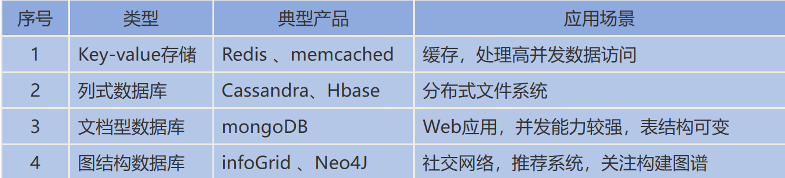

**NoSQL优点**

满足对数据库的高并发读写
对海量数据的高效存储和访问
对数据库高扩展性和高可用性
灵活的数据结构，满足数据结构不固定的场景

**NoSQL缺点**
一般不支持事务
实现复杂SQL查询比较复杂
运维人员数据维护门槛较高

**作为缓存其实Redis已经是“霸主”的地位，这里不得不说一下MongoDB了**

**MongoDB的定位**

● 优点：横向扩展能力，数据量或并发量增加时候架构可以自动扩展
● 优点：灵活模型，适合迭代开发，数据模型多变场景
● 优点：JSON 数据结构，适合微服务/REST API

原则上 Oracle 和 MySQL 能做的事情，MongoDB 都能做（包括 ACID 事务），不过，MongoDB针对SQL处理的API项目中并不好用，所以导致MongoDB现实定位比较尴尬！

简单的说就是关系型数据库你写好SQL就能在项目中直接用上，但是MongoDB的话你写好sql，必须借助客户端的API去调用。

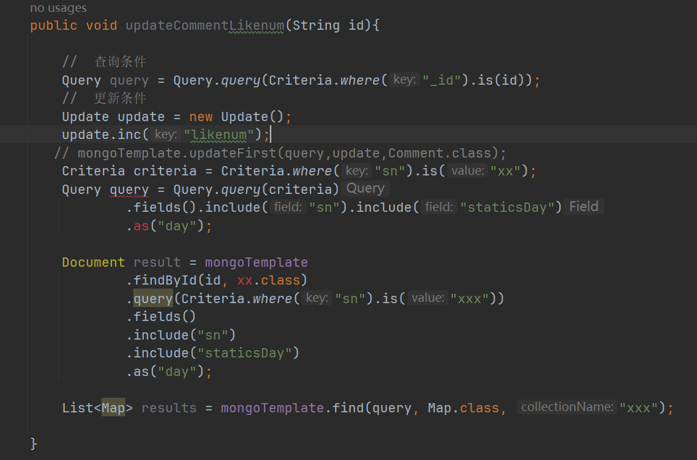

## 2、如何保证Redis与数据库双写时的数据一致性?

### 数据一致性

只要使用到缓存，无论是本地内存做缓存还是使用 redis 做缓存，那么就会存在数据同步的问题。

我以 Tomcat 向 MySQL 中写入和删改数据为例，来给你解释一下，数据的增删改操作具体是如何进行的。

#### 新增数据类

如果是新增数据，数据会直接写到数据库中，不用对缓存做任何操作，此时，缓存中本身就没有新增数据，而数据库中是最新值，此时，缓存和数据库的数据是一致的。

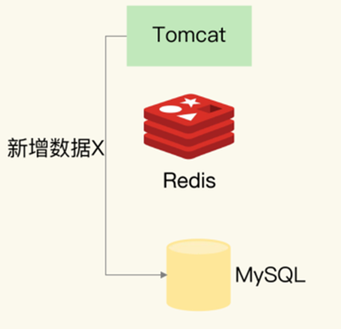


**一般出现问题的地方是发生在修改或删除的地方**

我们分析一下几种解决方案，

1、先更新缓存，再更新数据库

2、先更新数据库，再更新缓存

3、先删除缓存，后更新数据库

4、先更新数据库，后删除缓存

如果要求强一致性，可以采用加锁的方案（比如：读写锁之类，性能有影响）！一般不太追求数据的强一致性的场景，不会用！

#### 更新缓存类

##### 1、先更新缓存，再更新DB

这个方案我们一般不考虑。原因是更新缓存成功，更新数据库出现异常了，导致缓存数据与数据库数据完全不一致，而且很难察觉，因为缓存中的数据一直都存在。

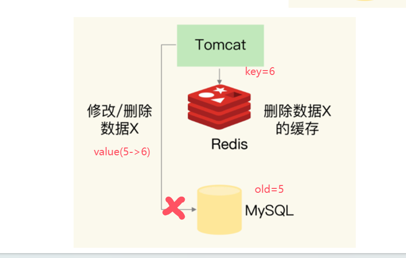

##### 2、先更新DB，再更新缓存

这个方案也我们一般不考虑，原因跟第一个一样，数据库更新成功了，缓存更新失败，同样会出现数据不一致问题。同时还有以下问题

*同时有请求A**和请求B先后**进行更新操作，那么会出现*

*（1* *）线程A*更新了数据库的值：A

*（2* *）线程B*更新了数据库：B

*（3* *）线程B*更新了缓存：B

*（4* *）线程A*更新了缓存：A

*这就出现请求A**更新缓存应该比请求B**更新缓存早才对，但是因为网络等原因，B**却比A**更早更新了缓存。这就导致了脏数据，因此不考虑。*

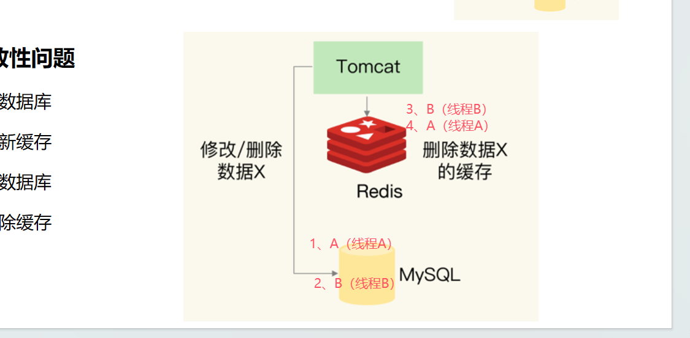

#### 删除缓存类

##### 3、先删除缓存，后更新DB

该方案也会出问题，具体出现的原因如下。

1、此时先后两个请求，请求 A（更新数据A） 和请求 B（查询数据）

2、请求 A 会先删除 Redis 中的数据，然后去数据库进行更新操作；

3、此时请求 B 看到 Redis 中的数据时空的，会去数据库中查询该值，补录到 Redis 中；

4、但是此时请求 A 并没有更新成功，或者事务还未提交，请求B去数据库查询得到旧值；

5、那么这时候就会产生数据库和 Redis 数据不一致的问题。

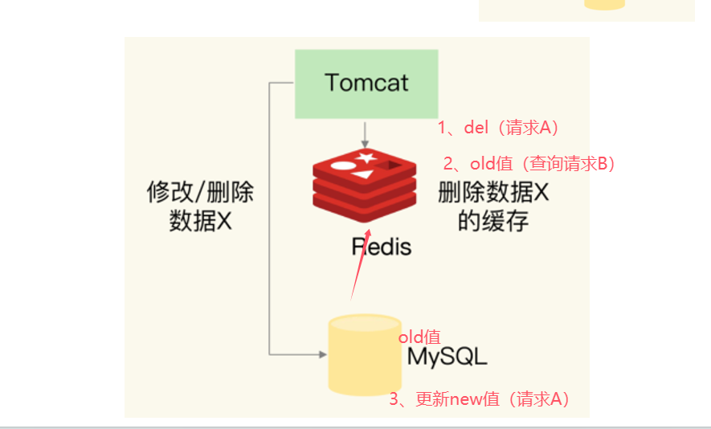

如何解决呢？其实最简单的解决办法就是延时双删的策略。就是

（1）先淘汰缓存

（2）再写数据库

（3）休眠1秒，再次淘汰缓存

**这段伪代码就是“延迟双删”**

```java
redis.delKey(X)
db.update(X)
Thread.sleep(N)
redis.delKey(X)
```

这么做，可以将1秒内所造成的缓存脏数据，再次删除。

##### 4、先更新DB，后删除缓存

因为删除缓存更新缓存的速度比在DB中要快一些，所以一般情况下我们可能会先用先更新DB，后删除缓存的操作。

因为这种情况下缓存不一致性的情况只有可能是查询比删除慢的情况，而这种情况相对来说会少很多。同时结合延时双删的处理，可以有效的避免缓存不一致的情况。

##### Mysql读写分离架构下的延时双删（先更新DB，后删除缓存）

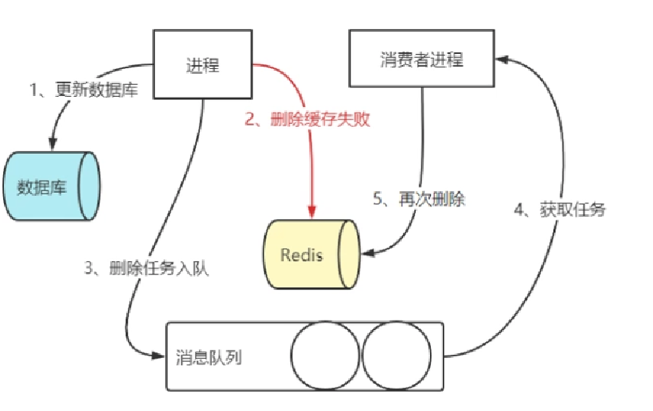

## 3、Redis的持久化的几种方式？如何选择

**三种：RDB、AOF、混合持久化**

Redis虽然是个内存数据库，但是Redis支持RDB和AOF两种持久化机制，将数据写往磁盘，可以有效地避免因进程退出造成的数据丢失问题，当下次重启时利用之前持久化的文件即可实现数据恢复。

### RDB

RDB持久化是把当前进程数据生成快照保存到硬盘的过程。所谓内存快照，就是指内存中的数据在某一个时刻的状态记录。这就类似于照片，当你给朋友拍照时，一张照片就能把朋友一瞬间的形象完全记下来。RDB 就是Redis DataBase 的缩写。

#### 给哪些内存数据做快照?

Redis 的数据都在内存中，为了提供所有数据的可靠性保证，它执行的是全量快照，也就是说，把内存中的所有数据都记录到磁盘中。但是，RDB 文件就越大，往磁盘上写数据的时间开销就越大。

#### RDB文件的生成是否会阻塞主线程

Redis 提供了两个手动命令来生成 RDB 文件，分别是 save 和 bgsave。

save：在主线程中执行，会导致阻塞；对于内存比较大的实例会造成长时间阻塞，线上环境不建议使用。
bgsave：创建一个子进程，专门用于写入 RDB 文件，避免了主线程的阻塞，这也是Redis RDB 文件生成的默认配置。

命令实战演示


除了执行命令手动触发之外，Redis内部还存在自动触发RDB 的持久化机制，例如以下场景:

1)使用save相关配置,如“save m n”。表示m秒内数据集存在n次修改时，自动触发bgsave。

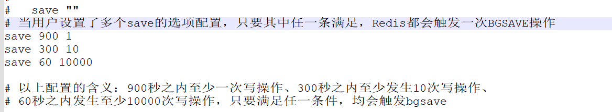

2）如果从节点执行全量复制操作，主节点自动执行bgsave生成RDB文件并发送给从节点。

3)执行debug reload命令重新加载Redis 时，也会自动触发save操作。


4）默认情况下执行shutdown命令时，如果没有开启AOF持久化功能则自动执行bgsave。


关闭RDB持久化，在课程讲述的Redis版本（6.2.4）上，是将配置文件中的save配置改为 save “”


#### bgsave执的行流程

为了快照而暂停写操作，肯定是不能接受的。所以这个时候，Redis 就会借助操作系统提供的写时复制技术（Copy-On-Write, COW），在执行快照的同时，正常处理写操作。


bgsave 子进程是由主线程 fork 生成的，可以共享主线程的所有内存数据。bgsave 子进程运行后，开始读取主线程的内存数据，并把它们写入 RDB 文件。

如果主线程对这些数据也都是读操作（例如图中的键值对 A），那么，主线程和bgsave 子进程相互不影响。但是，如果主线程要修改一块数据（例如图中的键值对 B），那么，这块数据就会被复制一份，生成该数据的副本。然后，bgsave 子进程会把这个副本数据写入 RDB 文件，而在这个过程中，主线程仍然可以直接修改原来的数据。

这既保证了快照的完整性，也允许主线程同时对数据进行修改，避免了对正常业务的影响。

#### RDB的优缺点

##### RDB的优点

RDB是一个紧凑压缩的二进制文件，代表Redis在某个时间点上的数据快照。非常适用于备份,全量复制等场景。

比如每隔几小时执行bgsave备份，并把 RDB文件拷贝到远程机器或者文件系统中(如hdfs)，用于灾难恢复。

Redis加载RDB恢复数据远远快于AOF的方式。

##### RDB的缺点

RDB方式数据没办法做到实时持久化/秒级持久化。因为bgsave每次运行都要执行fork操作创建子进程,属于重量级操作,频繁执行成本过高。

RDB文件使用特定二进制格式保存，Redis版本演进过程中有多个格式的RDB版本，存在老版本Redis服务无法兼容新版RDB格式的问题。

### Redis中RDB导致的数据丢失问题

针对RDB不适合实时持久化的问题,Redis提供了AOF持久化方式来解决。

如下图所示，我们先在 T0 时刻做了一次快照（下一次快照是T4时刻），然后在T1时刻，数据块 5 和 8 被修改了。如果在T2时刻，机器宕机了，那么，只能按照 T0 时刻的快照进行恢复。此时，数据块 5 和 8 的修改值因为没有快照记录，就无法恢复了。


所以这里可以看出，如果想丢失较少的数据，那么T4-T0就要尽可能的小，但是如果频繁地执行全量
快照，也会带来两方面的开销：

1、频繁将全量数据写入磁盘，会给磁盘带来很大压力，多个快照竞争有限的磁盘带宽，前一个快照还没有做完，后一个又开始做了，容易造成恶性循环。

2、另一方面，bgsave 子进程需要通过 fork 操作从主线程创建出来。虽然子进程在创建后不会再阻塞主线程，但是，fork 这个创建过程本身会阻塞主线程，而且主线程的内存越大，阻塞时间越长。如果频繁fork出bgsave 子进程，这就会频繁阻塞主线程了。

所以基于这种情况，我们就需要AOF的持久化机制。

### AOF

AOF(append only file)持久化:以独立日志的方式记录每次写命令，重启时再重新执行AOF文件中的命令达到恢复数据的目的。AOF的主要作用是解决了数据持久化的实时性,目前已经是Redis持久化的主流方式。理解掌握好AOF持久化机制对我们兼顾数据安全性和性能非常有帮助。

#### 使用AOF

开启AOF功能需要设置配置:appendonly yes，默认不开启。


AOF文件名通过appendfilename配置设置，默认文件名是appendonly.aof。保存路径同RDB持久化方式一致，通过dir配置指定。


### AOF的工作流程

AOF的工作流程主要是4个部分:命令写入( append)、文件同步( sync)、文件重写(rewrite)、重启加载( load)。

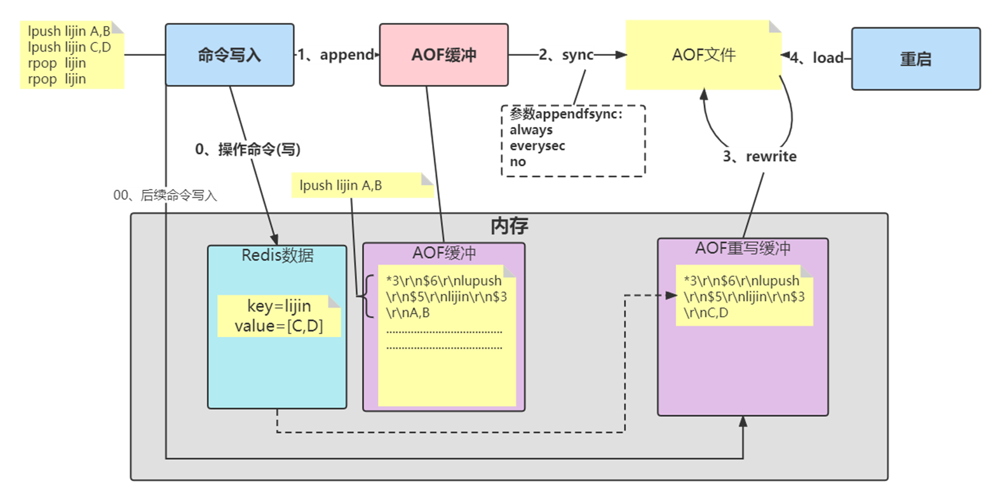

#### 命令写入

AOF命令写入的内容直接是RESP文本协议格式。例如lpush lijin A B这条命令，在AOF缓冲区会追加如下文本:

```
*3\r\n$6\r\nlupush\r\n$5\r\nlijin\r\n$3\r\nA B
```

看看 AOF 日志的内容。其中，“*3”表示当前命令有三个部分，每部分都是由“$+数字”开头，后面紧跟着
具体的命令、键或值。这里，“数字”表示这部分中的命令、键或值一共有多少字节。例如，“$3 set”表示这部分有 3 个字节，也就是“set”命令。

1 )AOF为什么直接采用文本协议格式?

文本协议具有很好的兼容性。开启AOF后，所有写入命令都包含追加操作，直接采用协议格式，避免了二次处理开销。文本协议具有可读性,方便直接修改和处理。

2）AOF为什么把命令追加到aof_buf中?

Redis使用单线程响应命令，如果每次写AOF文件命令都直接追加到硬盘，那么性能完全取决于当前硬盘负载。先写入缓冲区aof_buf中，还有另一个好处，Redis可以提供多种缓冲区同步硬盘的策略，在性能和安全性方面做出平衡。

Redis提供了多种AOF缓冲区同步文件策略，由参数appendfsync控制。


**always**

同步写回：每个写命令执行完，立马同步地将日志写回磁盘；

**everysec**

每秒写回：每个写命令执行完，只是先把日志写到 AOF 文件的内存缓冲区，每隔一秒把缓冲区中的内容写入磁盘；

**no**

操作系统控制的写回：每个写命令执行完，只是先把日志写到 AOF 文件的内存缓冲区，由操作系统决定何时将缓冲区内容写回磁盘，通常同步周期最长30秒。

很明显，配置为always时，每次写入都要同步AOF文件，在一般的SATA 硬盘上，Redis只能支持大约几百TPS写入,显然跟Redis高性能特性背道而驰,不建议配置。

配置为no，由于操作系统每次同步AOF文件的周期不可控,而且会加大每次同步硬盘的数据量,虽然提升了性能,但数据安全性无法保证。

配置为everysec，是建议的同步策略，也是默认配置，做到兼顾性能和数据安全性。理论上只有在系统突然宕机的情况下丢失1秒的数据。(严格来说最多丢失1秒数据是不准确的)

想要获得高性能，就选择 no 策略；如果想要得到高可靠性保证，就选择always 策略；如果允许数据有一点丢失，又希望性能别受太大影响的话，那么就选择everysec 策略。

#### 重写机制

随着命令不断写入AOF，文件会越来越大，为了解决这个问题，Redis引入AOF重写机制压缩文件体积。AOF文件重写是把Redis进程内的数据转化为写命令同步到新AOF文件的过程

**重写后的AOF 文件为什么可以变小?有如下原因:**

1)进程内已经超时的数据不再写入文件。

2)旧的AOF文件含有无效命令，如set a 111、set a 222等。重写使用进程内数据直接生成，这样新的AOF文件只保留最终数据的写入命令。


3）多条写命令可以合并为一个，如:lpush list a、lpush list b、lpush list c可以转化为: lpush list a b c。为了防止单条命令过大造成客户端缓冲区溢出，对于list、set、hash、zset等类型操作，以64个元素为界拆分为多条。

AOF重写降低了文件占用空间，除此之外，另一个目的是:更小的AOF文件可以更快地被Redis加载。

AOF重写过程可以手动触发和自动触发:

手动触发:直接调用bgrewriteaof命令。


自动触发:根据auto-aof-rewrite-min-size和 auto-aof-rewrite-percentage参数确定自动触发时机。


auto-aof-rewrite-min-size:表示运行AOF重写时文件最小体积，默认为64MB。

auto-aof-rewrite-percentage  :代表当前AOF 文件空间(aof_currentsize）和上一次重写后AOF 文件空间(aof_base_size)的比值。100就代表每次超过之前的一倍。**也就是第2次重写就是AOF文件达到128M的大小。**

#### 重启加载

AOF和 RDB 文件都可以用于服务器重启时的数据恢复。redis重启时加载AOF与RDB的顺序是怎么样的呢？

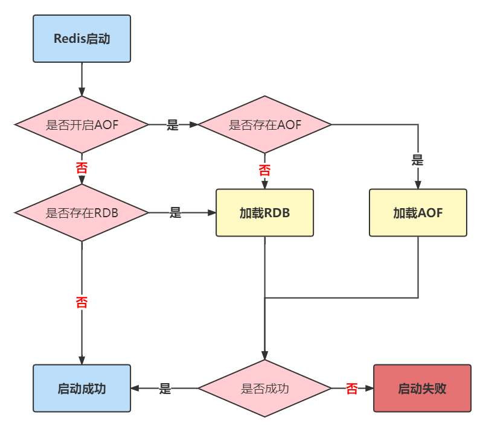

1，当AOF和RDB文件同时存在时，优先加载AOF

2，若关闭了AOF，加载RDB文件

3，加载AOF/RDB成功，redis重启成功

4，AOF/RDB存在错误，启动失败打印错误信息

### RDB-AOF混合持久化

混合持久化是同时使用RDB和AOF两种持久化机制。在Redis中，混合持久化是通过同时保存RDB和AOF文件来实现的。当Redis重启时，它会优先使用AOF文件来恢复数据，如果AOF文件不存在或者无效，则会使用RDB文件来恢复数据。

混合持久化的优点是可以结合RDB和AOF的优点，既可以保证数据的完整性，又可以在生成快照时减少CPU和内存资源的占用。但是，混合持久化也有一个缺点，那就是在Redis重启时需要同时处理两个文件，可能会比单一持久化机制的恢复速度慢。

#### 配置

通过 `aof-use-rdb-preamble`  配置项可以打开混合开关，yes则表示开启，no表示禁用，默认是禁用的，可通过config set修改


* 在 `redis.conf`配置文件中同时设置RDB和AOF的持久化参数。

#### AOF重写

在 AOF 重写之前，RDB 和 AOF 都是按照它们各自的持久化策略工作的。当 AOF 重写被触发时，混合持久化才开始发挥作用：将当前的数据集会首先以RDB 格式写入新 AOF 文件的顶部，然后再追加新的命令到文件的末尾。

该状态开启后，如果执行bgrewriteaof命令，则会把当前内存中已有的数据弄成二进程存放在aof文件中，这个过程模拟了rdb生成的过程，然后Redis后面有其他命令，在触发下次重写之前，依然采用AOF追加的方式

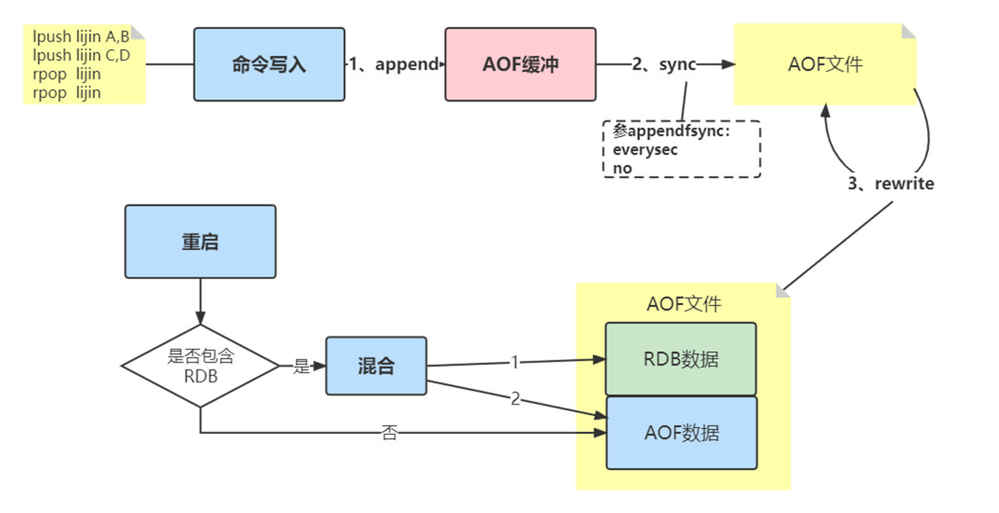

#### 重启加载

AOF和 RDB 文件都可以用于服务器重启时的数据恢复。redis重启时加载AOF与RDB的顺序是怎么样的呢？


1，当AOF和RDB文件同时存在时，优先加载AOF

2，若关闭了AOF，加载RDB文件

3，加载AOF/RDB成功，redis重启成功

4，AOF/RDB存在错误，启动失败打印错误信息

## 4、如何理解Redis的事务？为什么不用事务

大家应该对事务比较了解，简单地说，事务表示一组动作，要么全部执行，要么全部不执行。

例如在社交网站上用户A关注了用户B，那么需要在用户A的关注表中加入用户B，并且在用户B的粉丝表中添加用户A，这两个行为要么全部执行，要么全部不执行,否则会出现数据不一致的情况。

Redis提供了简单的事务功能，将一组需要一起执行的命令放到multi和exec两个命令之间。multi 命令代表事务开始，exec命令代表事务结束。另外discard命令是回滚。

一个客户端


另外一个客户端

在事务没有提交的时查询（查不到数据）


在事务提交后查询（可以查到数据）


可以看到sadd命令此时的返回结果是QUEUED，代表命令并没有真正执行，而是暂时保存在Redis中的一个缓存队列（所以discard也只是丢弃这个缓存队列中的未执行命令，并不会回滚已经操作过的数据，这一点要和关系型数据库的Rollback操作区分开）。

只有当exec执行后，用户A关注用户B的行为才算完成，如下所示exec返回的两个结果对应sadd命令。

**但是要注意Redis的事务功能很弱。在事务回滚机制上，Redis只能对基本的语法错误进行判断。**

如果事务中的命令出现错误,Redis 的处理机制也不尽相同。

1、语法命令错误


例如下面操作错将set写成了sett，属于语法错误，会造成整个事务无法执行，事务内的操作都没有执行:

2、运行时错误

例如：事务内第一个命令简单的设置一个string类型，第二个对这个key进行sadd命令，这种就是运行时命令错误，因为语法是正确的:


可以看到Redis并不支持回滚功能，第一个set命令已经执行成功,开发人员需要自己修复这类问题。

### Redis的事务的工作原理

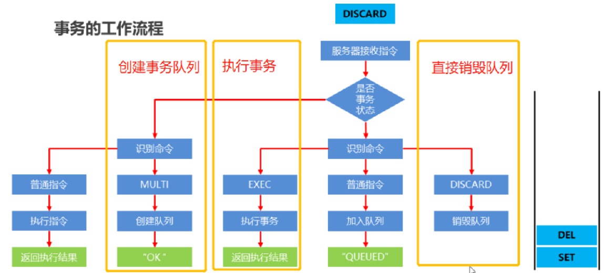

## 5、讲一讲Redis五大数据类型底层实现！

底层数据结构一共有 7 种，分别是简单动态字符串、双向链表、压缩列表、哈希表、跳表和整数数组、快速列表。它们和数据类型的对应关系如下图所示。也就是Redis基础数据结构每一种底层都对应至少2种及以上的实现。

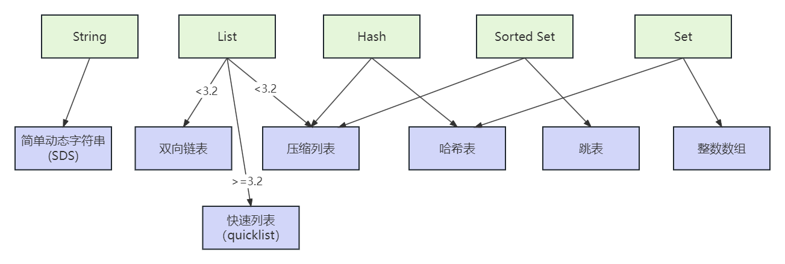

### 简单动态字符串（Simple Dynamic String）

Redis 的String类型使用 SDS（简单动态字符串）（Simple Dynamic String）作为底层的数据结构实现。

SDS 与 C 字符串有所不同，它不仅可以保存文本数据，还可以保存二进制数据。这是因为 SDS 使用 len 属性的值而不是空字符来判断字符串是否结束，并且 SDS 的所有 API 都会以处理二进制的方式来处理 SDS 存放在 buf[] 数组里的数据。因此，SDS 不仅能存放文本数据，还能保存图片、音频、视频、压缩文件等二进制数据。

另外，Redis 的 SDS API 是安全的，拼接字符串不会造成缓冲区溢出。这是因为 SDS 在拼接字符串之前会检查 SDS 空间是否满足要求，如果空间不够会自动扩容，从而避免了缓冲区溢出的问题。

此外，获取字符串长度的时间复杂度是 O(1)，因为 SDS 结构里用 len 属性记录了字符串长度，所以获取长度的复杂度为 O(1)。相比之下，C 语言的字符串并不记录自身长度，所以获取长度的复杂度为 O(n)。这些特性使得 SDS 成为 Redis 的一个重要组成部分。

**源码分析：**

不同的版本的实现是有一些区别的。

**老版本（3.2之前）**

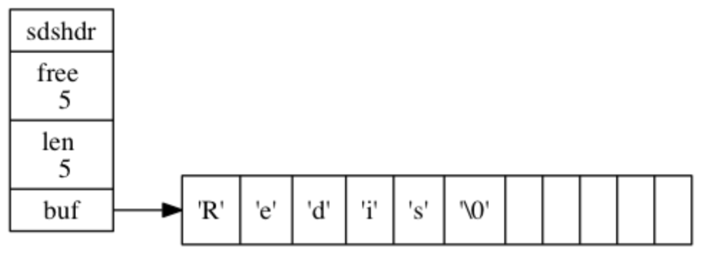

```
/*
 * 保存字符串对象的结构---这里不是真实的C的源码，我写的一个简化
 */
struct sdshdr {
    // buf 中已占用空间的长度
    int len;
    // buf 中剩余可用空间的长度
    int free;
    // 数据空间
    char buf[];
};

```

**新版本（3.2之后）**

在Redis的6及6以后，会根据字符串长度不同，定义了5种的SDS结构体sdshdr5、sdshdr8、sdshdr16、sdshdr32、sdshdr64，长度分别对应，2的n次幂（2的5次幂、2的8次幂.......），用于用于存储不同长度的字符串。

1. sdshdr5：适用于长度小于32**<2的5次方>**的字符串。
2. sdshdr8：适用于长度小于256**<2的8次方>**的字符串。
3. sdshdr16：适用于长度小于65535**<2的16次方>**的字符串。
4. sdshdr32：适用于长度小于4294967295**<2的32次方>**的字符串。
5. sdshdr64：适用于长度大于4294967295的字符串。

通过使用不同的sdshdr结构，Redis可以根据字符串的长度选择最合适的结构，从而提高内存利用率。例如，当我们存储一个长度为3字节的字符串时，Redis会选择使用sdshdr5结构，而不会浪费额外的内存空间。

sdshdr5结构如下：

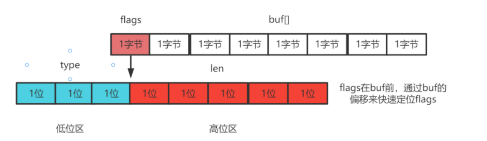

sdshdr5的结构中flags是一个char，其中低3位要标识type类型（就是存储的格式），所有就只有5位来存储len这个长度，所以就叫做sdshdr5

```
struct sdshdr5 {
    char flags; 
    // 数据空间
    char buf[];
};

```

而如果是更长的长度，Redis就需要采用sdshdr8或者sdshdr16或者更大的存储结构。

Redis的sdshdr5相对于sdshdr8少两个字段，是为了节省内存空间和提高处理短字符串的效率。根据字符串的长度范围选择适合的sdshdr结构，可以优化内存利用和性能。

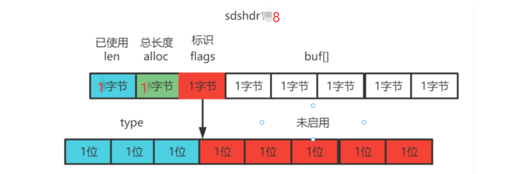


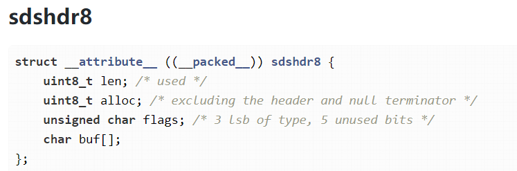

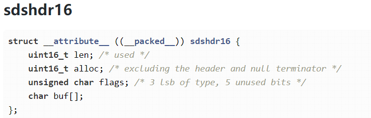

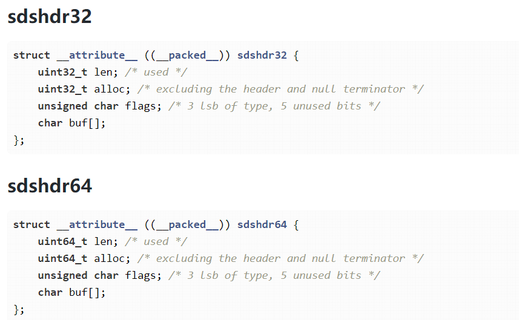

从String的设计上来看，Redis已经把空间利用做到了极致，同时的也可以从sdshdr5到sdshdr8...看出设计原则：开闭原则，对修改关闭，对拓展开放。

### List


### 压缩列表

压缩列表实际上类似于一个数组，数组中的每一个元素都对应保存一个数据。和数组不同的是，压缩列表在表头有三个字段 zlbytes、zltail 和 zllen，分别表示列表长度、列表尾的偏移量和列表中的 entry 个数；压缩列表在表尾还有一个 zlend，表示列表结束。

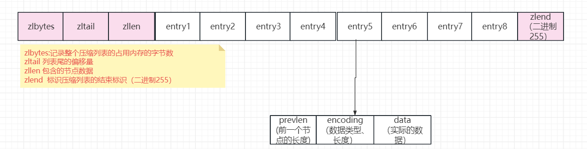

在压缩列表中，如果我们要查找定位第一个元素和最后一个元素，可以通过表头三个字段的长度直接定位，复杂度是 O(1)。而查找其他元素时，就没有这么高效了，只能逐个查找，此时的复杂度就是 O(N) 了。

* zlbytes，记录整个压缩列表占用对内存字节数
* zltail，记录压缩列表「尾部」节点距离起始地址由多少字节，也就是列表尾的偏移量
* zllen，记录压缩列表包含的节点数量；
* zlend，标记压缩列表的结束点，固定值 0xFF（十进制255）

压缩列表节点包含三部分内容：

* prevlen，记录了「前一个节点」的长度
* encoding，记录了当前节点实际数据的类型以及长度
* data，记录了当前节点的实际数据

在压缩列表中，如果我们要查找定位第一个元素和最后一个元素，可以通过表头三个字段的长度直接定位，复杂度是 O(1)。而查找其他元素时，就没有这么高效了，只能逐个查找，此时的复杂度就是 O(N) 了。因此压缩列表不适合保存过多的元素

### 跳表

跳表在链表的基础上，增加了多级索引，通过索引位置的几个跳转，实现数据的快速定位。

（链表只能逐一查找元素，导致操作起来非常缓慢，于是就出现了跳表）

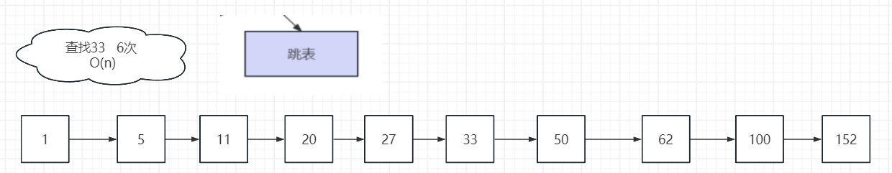

如果我们要在链表中查找 33 这个元素，只能从头开始遍历链表，查找 6 次，直到找到 33为止。此时，复杂度是 O(N)，查找效率很低

1、为了提高查找速度，我们来增加一级索引：从第一个元素开始，每两个元素选一个出来作为索引。这些索引再通过指针指向原始的链表。

例如，从前两个元素中抽取元素 1 作为一级索引，从第三、四个元素中抽取元素 11 作为一级索引。此时，我们只需要 4 次查找就能定位到元素 33 了

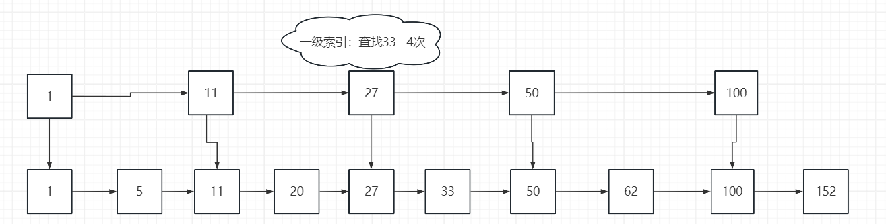

2、我们还想再快，可以再增加二级索引：从一级索引中，再抽取部分元素作为二级索引。例如，从一级索引中抽取 1、27、100 作为二级索引，二级索引指向一级索引。这样，我们只需要 3 次查找，就能定位到元素 33 了。

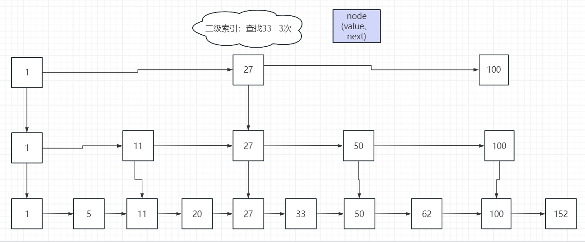

这种本质就是空间换时间的算法。

### 使用选择

#### List

**在 Redis 3.2 版本之前**

Redis 的 List 类型底层数据结构可以由双向链表或压缩列表实现。如果列表元素个数小于 512 个且每个元素的值都小于 64 字节，则 Redis 会使用压缩列表作为底层数据结构；否则，Redis 会使用双向链表作为底层数据结构。

**在 Redis 3.2 版本之后**

List 类型底层数据结构只由 quicklist 实现，代替了双向链表和压缩列表。

String 类型的底层实现只有一种数据结构，也就是简单动态字符串。而 List、Hash、Set 和 Sorted Set 这四种集合类型，都有两种底层实现结构。

#### Hash

当一个Hash类型的键值对数量比较少时，Redis会使用压缩列表（ziplist）来表示Hash。当Hash类型的键值对数量较多时，会使用哈希表（hashtable）来表示Hash。哈希表在元素数量较多时具有更好的性能。

#### Sorted Set

当Sorted Set类型的成员数量较少（元素数量小于配置的压缩列表最大元素数量限制，默认为128）且成员的值较短时，Redis会使用压缩列表（ziplist）来表示Sorted Set。

当Sorted Set类型的成员数量较多或成员的值较长时，会使用跳表（skiplist）来表示Sorted Set。跳表在有序集合类型中提供了高效的范围查询操作。

#### Set

当Set类型的元素数量较少（元素数量小于配置的哈希最大压缩列表元素数量限制，默认为512）时，Redis会使用压缩列表（ziplist）来表示Set。当Set类型的元素数量较多时，会使用哈希表（hashtable）来表示Set。

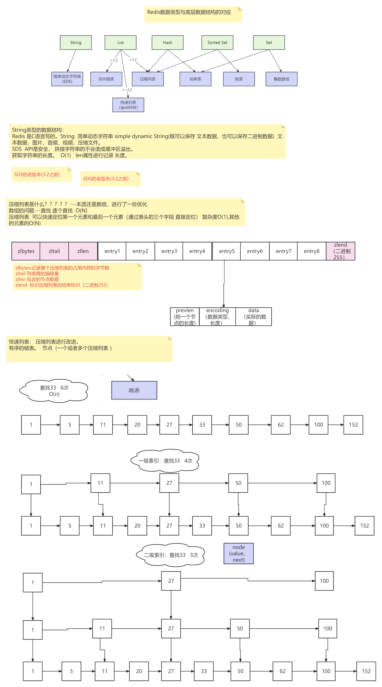
