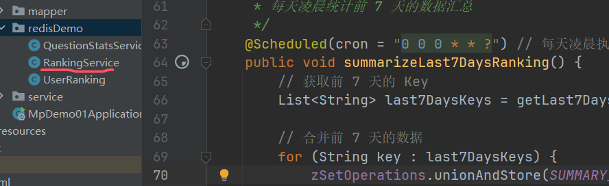
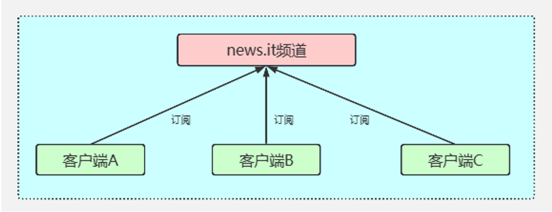
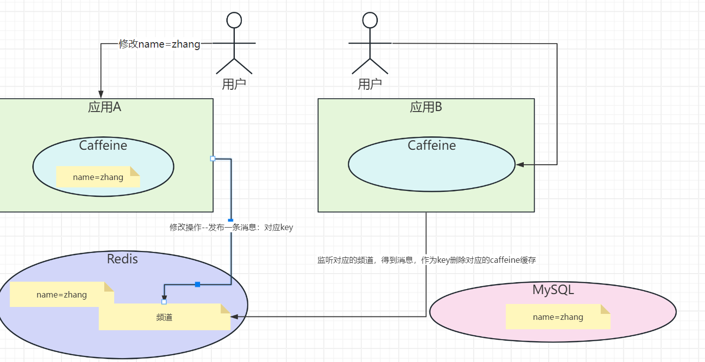
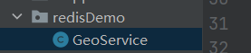

## redis2025-上

## 一.Redis跟HashMap在结构上的区别

**Redis**

* **定位** ：Redis 是一个高性能的分布式内存数据库，支持多种数据结构（如 String、Hash、List、Set、Sorted Set 等），并提供持久化、主从复制、哨兵模式、集群模式等功能。
* **适用场景** ：
  * 缓存：作为缓存层，加速数据访问。
  * 分布式锁：利用 Redis 的原子操作实现分布式锁。
  * 消息队列：利用 List 或 Stream 实现简单的消息队列。
  * 排行榜：利用 Sorted Set 实现实时排行榜。
  * 地理位置：利用 Geo 模块存储和查询地理位置信息。
* **特点** ：
  * 支持分布式部署，适合高并发、高可用的场景。
  * 支持数据持久化，避免数据丢失。
  * 支持多种数据结构，功能丰富。

**HashMap**

* **定位** ：HashMap 是 Java 中的一种数据结构，基于哈希表实现，用于存储键值对。
* **适用场景** ：

  * 单机内存缓存：适合小规模数据的快速查询和存储。
  * 临时数据存储：适合在程序运行期间存储临时数据。
  * 数据索引：适合通过键快速查找值。
* **特点** ：

  * 单机内存存储，不支持分布式。
  * 数据结构简单，功能单一。
  * 性能高，但受限于单机内存大小。

  ## 设计一个社交媒体应用，如何使用Redis来实时统计用户的点赞、评论和分享数量

  一般推荐使用Redis的Hash数据类型来做：

  增加点赞数：

  Redis命令


  ```
  HINCRBY question:123 likes 1
  ```

  Springboot的Redis的API

  ```
   HashOperations<String, String, Integer> hashOperations;
   hashOperations = redisTemplate.opsForHash();
   hashOperations.increment("question:123", "likes", 1);

  ```

  具体的代码：

  


## 应用中的排行榜功能，如何利用Redis来实现

* **Redis 按日期存储数据** ：每天的数据存储在一个独立的 Key 中，方便按天统计和清理。
* **定时任务汇总数据** ：每天凌晨将前 7 天的数据汇总到 `ranking:7days_summary` 中。
* **清理旧数据** ：定时任务会清理超过 7 天的旧数据，避免 Redis 内存占用过多。
* **查询排行榜** ：直接从汇总 Key 中获取前 7 天的排行榜数据。

这种方式既能保证排行榜的实时性，又能高效地统计和查询前 7 天的数据，适合需要长期保存排行榜数据的场景



## 如何使用Redis的发布/订阅功能实现消息通知系统



Redis 的发布/订阅（Pub/Sub）功能可以实现一个轻量级的消息通知系统，支持不同模块之间的实时通信。

核心概念

* **频道（Channel）** ：消息的发布和订阅基于频道。每个模块可以订阅一个或多个频道。
* **发布者（Publisher）** ：向频道发送消息的模块。
* **订阅者（Subscriber）** ：从频道接收消息的模块。

多级缓存架构

在高性能的服务项目中，我们一般会将一些热点数据存储到 Redis这类缓存中间件中，只有当缓存的访问没有命中时再查询数据库。在提升访问速度的同时，也能降低数据库的压力。

但是在一些场景下单纯使用 Redis 的分布式缓存不能满足高性能的要求，所以还需要加入使用本地缓存Caffeine，从而再次提升程序的响应速度与服务性能。于是，就产生了使用本地缓存（Caffeine）作为一级缓存，再加上分布式缓存（Redis）作为二级缓存的两级缓存架构。


就是如果一个应用修改了缓存，另外一个应用的caffeine缓存是没有办法感知的，所以这里就会有缓存的一致性问题



解决方案也很简单，就是在Redis中做一个发布和订阅。

遇到修改缓存的处理，需要向对应的频道发布一条消息，然后应用同步监听这条消息，有消息则需要删除本地的Caffeine缓存。

核心代码如下：

```
CacheAspect类
 //强制更新
        if (annotation.type()== CacheType.PUT){
            Object object = point.proceed();
            redisTemplate.opsForValue().set(realKey, object,annotation.l2TimeOut(), TimeUnit.SECONDS);
            cache.put(realKey, object);
            // 发送消息到Redis频道(让其他应用把Caffeine缓存失效掉)
            redisTemplate.convertAndSend("cacheUpdateChannel", realKey);
            log.info("cacheUpdateChannel:"+realKey);
            return object;
        }
 //删除
        else if (annotation.type()== CacheType.DELETE){
            redisTemplate.delete(realKey);
            cache.invalidate(realKey);
            // 发送消息到Redis频道(让其他应用把Caffeine缓存失效掉)
            redisTemplate.convertAndSend("cacheUpdateChannel", realKey);
            log.info("cacheUpdateChannel:"+realKey);
            return point.proceed();
        }
  log.info("get data from database");
        Object object = point.proceed();
        if (Objects.nonNull(object)){
            //写入Redis
            redisTemplate.opsForValue().set(realKey, object,annotation.l2TimeOut(), TimeUnit.SECONDS);
            //写入Caffeine
            cache.put(realKey, object);
            // 发送消息到Redis频道(让其他应用把Caffeine缓存失效掉)
            redisTemplate.convertAndSend("cacheUpdateChannel", realKey);
            log.info("cacheUpdateChannel:"+realKey);
        }
```

```
package com.msb.caffeine.config;

import com.msb.caffeine.service.RedisMessageListener;
import org.springframework.beans.factory.annotation.Autowired;
import org.springframework.context.annotation.Bean;
import org.springframework.context.annotation.Configuration;
import org.springframework.data.redis.connection.RedisConnectionFactory;
import org.springframework.data.redis.connection.lettuce.LettuceConnectionFactory;
import org.springframework.data.redis.core.RedisTemplate;
import org.springframework.data.redis.listener.ChannelTopic;
import org.springframework.data.redis.listener.RedisMessageListenerContainer;
import org.springframework.data.redis.serializer.GenericJackson2JsonRedisSerializer;
import org.springframework.data.redis.serializer.StringRedisSerializer;

@Configuration
public class RedisConfig {

    @Bean
    public LettuceConnectionFactory redisConnectionFactory() {
        return new LettuceConnectionFactory(); // 需要设置主机名，端口，密码等参数
    }

    @Bean
    public RedisTemplate<String, Object> redisTemplate(RedisConnectionFactory redisConnectionFactory) {
        RedisTemplate<String, Object> template = new RedisTemplate<>();
        template.setConnectionFactory(redisConnectionFactory);

        // 使用Jackson2JsonRedisSerializer来序列化和反序列化对象
        GenericJackson2JsonRedisSerializer jackson2JsonRedisSerializer = new GenericJackson2JsonRedisSerializer();

        // 设置键序列化器
        template.setKeySerializer(new StringRedisSerializer());
        template.setHashKeySerializer(new StringRedisSerializer());

        // 设置值序列化器
        template.setValueSerializer(jackson2JsonRedisSerializer);
        template.setHashValueSerializer(jackson2JsonRedisSerializer);

        template.afterPropertiesSet();
        return template;
    }

    @Bean
    RedisMessageListenerContainer container(RedisConnectionFactory factory, RedisMessageListener listener) {
        RedisMessageListenerContainer container = new RedisMessageListenerContainer();
        container.setConnectionFactory(factory);
        container.addMessageListener(listener, new ChannelTopic("cacheUpdateChannel"));
        return container;
    }
}

```

```
package com.msb.caffeine.service;

import com.github.benmanes.caffeine.cache.Cache;
import com.msb.caffeine.service.impl.UserService;
import lombok.extern.slf4j.Slf4j;
import org.springframework.beans.factory.annotation.Autowired;
import org.springframework.data.redis.connection.Message;
import org.springframework.data.redis.connection.MessageListener;
import org.springframework.stereotype.Component;

@Slf4j
@Component
public class RedisMessageListener  implements MessageListener {

    @Autowired
    private Cache cache;

    //这里就是应用接收到了（要删除缓存的策略）： 这里就强制删除Caffeine中的缓存数据
    @Override
    public void onMessage(Message message, byte[] pattern) {
        String cacheKey = new String(message.getBody());
        if(!cacheKey.equals("")){
            log.info("invalidate:"+cacheKey);
            cache.invalidate(cacheKey);
        }
    }
}

```

## Redis其他的场景设计

**如何使用Redis的地理位置功能（Geo）来实现XXX**

使用 Redis 的 Geo 功能来实现 **“附近的人”** 或 **“附近的商家“**

Redis 的 Geo 功能基于 **Sorted Set（ZSET）** 实现，提供了以下核心命令：

* **`GEOADD`** ：添加地理位置（经纬度）到指定的 Key 中。
* **`GEODIST`** ：计算两个位置之间的距离。
* **`GEORADIUS`** ：查询指定半径范围内的位置。
* **`GEORADIUSBYMEMBER`** ：以某个成员为中心，查询指定半径范围内的位置。
* **`GEOHASH`** ：获取某个位置的 Geohash 值。




**基于 Redis 的秒杀系统，如何解决超卖问题？**

具体见代码


**基于 Redis 的短链接生成系统**

* **使用 Redis 的自增 ID** ：通过 Redis 的 `INCR` 命令生成唯一的短链接 ID。
* **Base62 编码** ：将自增 ID 转换为短链接字符串。

  ```
  package com.msb.caffeine.redisDemo;
  
  import org.springframework.beans.factory.annotation.Autowired;
  import org.springframework.data.redis.core.RedisTemplate;
  import org.springframework.stereotype.Service;
  
  import java.util.Base64;
  
  @Service
  public class ShortUrlService {
  
      private static final String SHORT_URL_KEY = "short_url:id"; // 自增 ID Key
  
      @Autowired
      private RedisTemplate<String, String> redisTemplate;
  
      /**
       * 生成短链接
       *
       * @param longUrl 原始链接
       * @return 短链接
       */
      public String generateShortUrl(String longUrl) {
          // 生成自增 ID
          long id = redisTemplate.opsForValue().increment(SHORT_URL_KEY, 1);
  
          // Base62 编码
          String shortUrl = Base64.getEncoder().encodeToString(String.valueOf(id).getBytes());
  
          // 存储映射关系
          redisTemplate.opsForValue().set("short_url:" + shortUrl, longUrl);
  
          return shortUrl;
      }
  
      /**
       * 获取原始链接
       *
       * @param shortUrl 短链接
       * @return 原始链接
       */
      public String getLongUrl(String shortUrl) {
          return redisTemplate.opsForValue().get("short_url:" + shortUrl);
      }
  }
  ```

**基于 Redis 的分布式 Session 管理系统**

* **使用 Redis 存储 Session** ：将 Session 数据存储在 Redis 中，Key 为 Session ID，Value 为 Session 数据。
* **设置过期时间** ：通过 Redis 的 `EXPIRE` 命令设置 Session 的过期时间。
